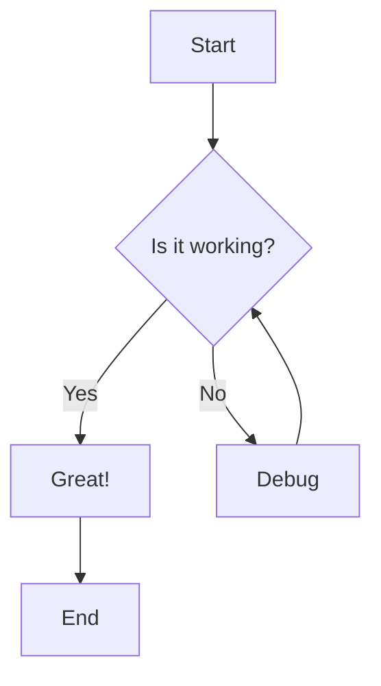
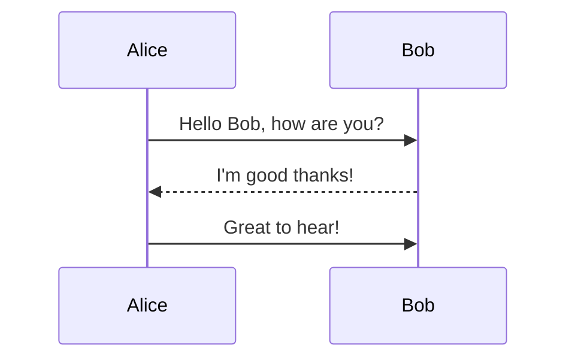
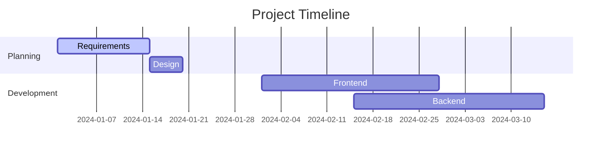

# Mermaid Diagram Test

## Test Cases

### 1. Basic Flowchart

### 2. Sequence Diagram

### 3. Gantt Chart

## Expected Functionality

1. **Inline Display**: All diagrams should render properly in the notes
2. **Fullscreen Mode**: Click the maximize button to view in fullscreen
3. **PNG Preview**: Click "Preview" to see PNG version in a modal
4. **Downloads**: Should be able to download as PNG, SVG, or Mermaid code
5. **Zoom & Pan**: In fullscreen mode, should support zooming and panning
6. **ESC Key**: Should close fullscreen or preview modals
7. **Z-Index**: Modals should appear above the notes modal (z-index 9999)

## Fixes Applied

- ✅ Increased z-index from 50 to 9999 for both fullscreen and PNG preview modals
- ✅ Added ESC key support for closing modals
- ✅ Maintained all existing functionality (zoom, pan, download, etc.)
- ✅ Fixed any potential conflicts with the notes modal z-index 