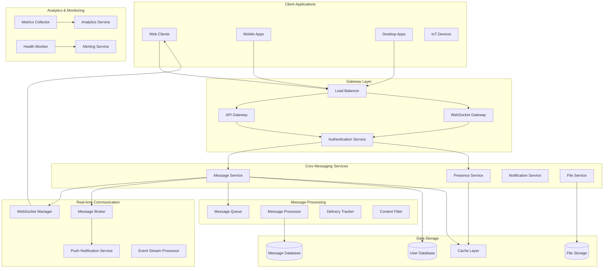
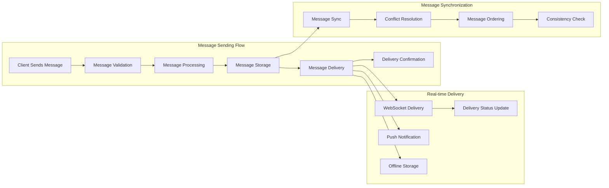
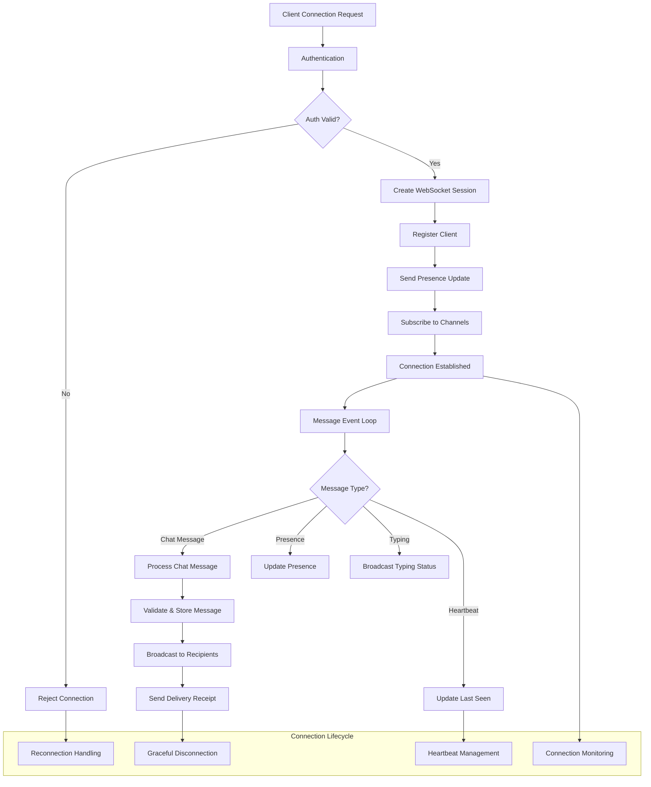
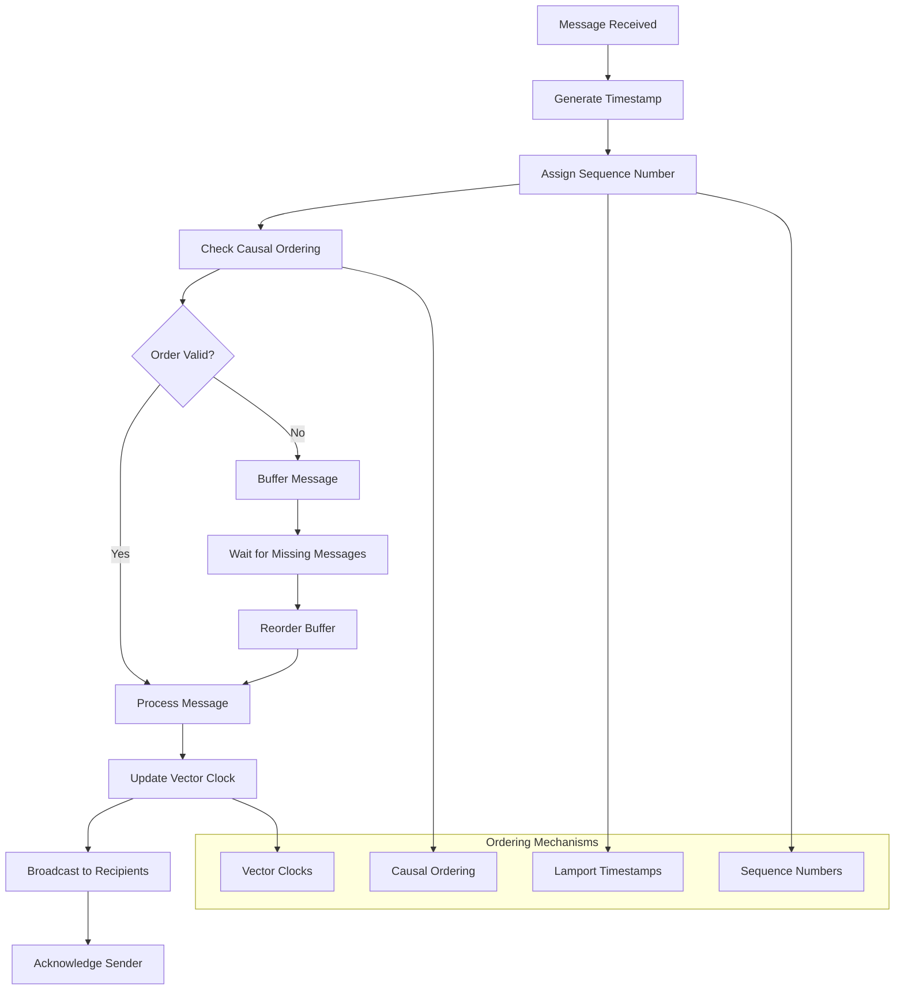
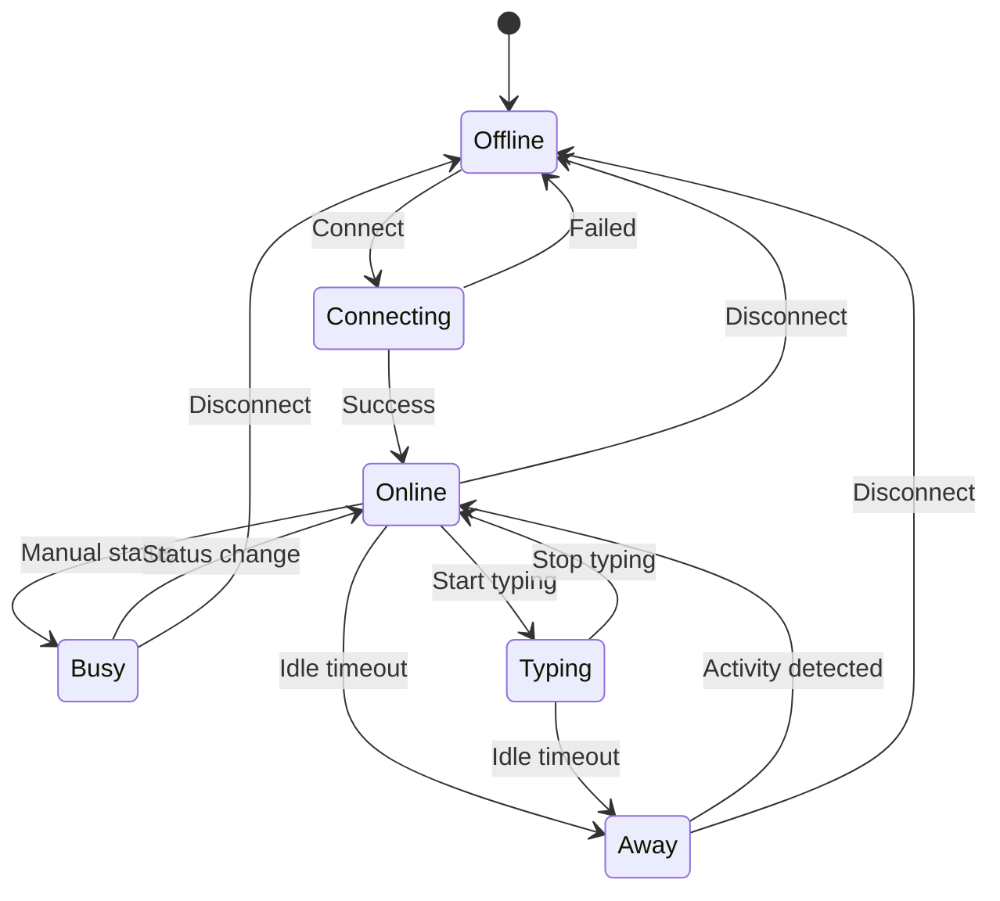
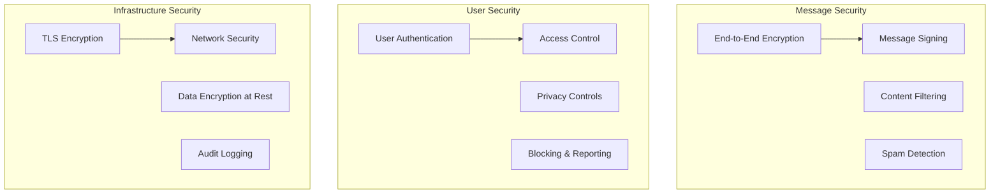

# Real-time Chat Messaging Backend


## 📋 Table of Contents

- [Real-time Chat Messaging Backend](#real-time-chat-messaging-backend)
  - [Requirements Gathering](#requirements-gathering)
    - [Functional Requirements](#functional-requirements)
    - [Non-Functional Requirements](#non-functional-requirements)
  - [Traffic Estimation & Capacity Planning](#traffic-estimation-capacity-planning)
    - [User Base Analysis](#user-base-analysis)
    - [Traffic Calculations](#traffic-calculations)
  - [Database Schema Design](#database-schema-design)
    - [Message Database Schema](#message-database-schema)
    - [User Database Schema](#user-database-schema)
    - [File Storage Schema](#file-storage-schema)
  - [Sample API Endpoints](#sample-api-endpoints)
    - [Authentication APIs](#authentication-apis)
    - [Messaging APIs](#messaging-apis)
    - [File Upload APIs](#file-upload-apis)
    - [WebSocket APIs](#websocket-apis)
  - [High-Level Design (HLD)](#high-level-design-hld)
    - [System Architecture Overview](#system-architecture-overview)
    - [Message Flow Architecture](#message-flow-architecture)
  - [Low-Level Design (LLD)](#low-level-design-lld)
    - [WebSocket Connection Management](#websocket-connection-management)
    - [Message Ordering and Consistency](#message-ordering-and-consistency)
    - [Presence Management System](#presence-management-system)
  - [Core Algorithms](#core-algorithms)
    - [1. Message Ordering and Consistency Algorithm](#1-message-ordering-and-consistency-algorithm)
    - [2. Real-time Presence Management Algorithm](#2-real-time-presence-management-algorithm)
    - [3. Message Delivery Guarantee Algorithm](#3-message-delivery-guarantee-algorithm)
    - [4. File and Media Sharing Algorithm](#4-file-and-media-sharing-algorithm)
    - [5. Chat Analytics and Insights Algorithm](#5-chat-analytics-and-insights-algorithm)
  - [Performance Optimizations](#performance-optimizations)
    - [WebSocket Connection Scaling](#websocket-connection-scaling)
    - [Database Optimization](#database-optimization)
  - [Security Considerations](#security-considerations)
    - [Chat Security Framework](#chat-security-framework)
  - [Testing Strategy](#testing-strategy)
    - [Load Testing](#load-testing)
    - [Reliability Testing](#reliability-testing)
  - [Trade-offs and Considerations](#trade-offs-and-considerations)
    - [Consistency vs Availability](#consistency-vs-availability)
    - [Privacy vs Features](#privacy-vs-features)
    - [Scalability vs Cost](#scalability-vs-cost)

---

## Requirements Gathering

[⬆️ Back to Top](#--table-of-contents)

---


### Functional Requirements

[⬆️ Back to Top](#--table-of-contents)

---


**Core Messaging Features:**
- Send and receive text messages in real-time
- Support group chats (up to 1000 members per group)
- Send multimedia files (images, videos, documents) up to 100MB
- Message delivery status (sent, delivered, read)
- Message history and persistence
- Online/offline presence indicators
- Typing indicators
- Message reactions and emoji responses
- Reply to specific messages (threading)
- Forward messages to other chats
- Search messages across conversations
- Delete messages (for self and for everyone)
- Edit sent messages within 5 minutes

**User Management:**
- User registration and authentication
- User profiles with photos and status
- Block/unblock users
- Report inappropriate content
- Contact management and friend requests

**Advanced Features:**
- End-to-end encryption for privacy
- Message scheduling
- Disappearing messages (auto-delete after time)
- Voice and video calling
- Screen sharing
- File sharing with version control
- Message translation
- Chat backups and sync across devices

### Non-Functional Requirements

[⬆️ Back to Top](#--table-of-contents)

---


**Performance:**
- Message delivery latency < 100ms for same region
- Support 50 million daily active users
- Handle 1 billion messages per day
- 99.9% uptime SLA
- Auto-scaling to handle traffic spikes

**Scalability:**
- Horizontal scaling of all services
- Handle 10x traffic growth
- Global distribution across multiple regions
- Support for 100,000 concurrent connections per server

**Security:**
- End-to-end encryption for all messages
- Secure file transfer with virus scanning
- Authentication and authorization
- Rate limiting to prevent spam
- DDoS protection
- GDPR and privacy compliance

**Reliability:**
- Message durability (no message loss)
- Automatic failover and disaster recovery
- Data replication across multiple data centers
- Circuit breaker patterns for fault tolerance

## Traffic Estimation & Capacity Planning

[⬆️ Back to Top](#--table-of-contents)

---


### User Base Analysis

[⬆️ Back to Top](#--table-of-contents)

---

- **Total Users:** 100 million registered users
- **Daily Active Users (DAU):** 50 million users
- **Peak Concurrent Users:** 10 million users
- **Messages per User per Day:** 50 messages average
- **Peak Traffic Ratio:** 3x average during peak hours

### Traffic Calculations

[⬆️ Back to Top](#--table-of-contents)

---


**Message Volume:**
```
Daily Messages = 50M DAU × 50 messages = 2.5B messages/day
Peak Messages/sec = (2.5B × 3) / (24 × 3600) = 2,600 messages/sec
Average Messages/sec = 2.5B / (24 × 3600) = 29,000 messages/sec

Group Messages (30% of traffic):
- Group message fanout = Average 10 recipients
- Effective peak load = 2,600 × 1.3 × 10 = 33,800 deliveries/sec
```

**Connection Requirements:**
```
WebSocket Connections:
- Peak concurrent connections = 10M users
- Connection memory per user = 8KB
- Total memory for connections = 10M × 8KB = 80GB
- Servers needed (assuming 100K connections/server) = 100 servers
```

**Storage Requirements:**
```
Message Storage:
- Average message size = 200 bytes (text + metadata)
- Multimedia messages = 5% of total, average 2MB each
- Daily storage = (2.5B × 200B) + (2.5B × 0.05 × 2MB) = 750GB/day
- Annual storage = 750GB × 365 = 274TB/year
- With 3x replication = 822TB/year

File Storage:
- Daily file uploads = 50M users × 2 files × 5MB = 500TB/day
- With CDN and compression (70% reduction) = 150TB/day
```

**Bandwidth Requirements:**
```
Message Traffic:
- Peak message bandwidth = 33,800 msg/sec × 200B = 6.76MB/s
- With protocol overhead (2x) = 13.5MB/s

File Transfer:
- Peak file transfer = 10,000 files/sec × 5MB = 50GB/s
- With CDN distribution = 5GB/s core bandwidth
```

**Infrastructure Sizing:**
```
Application Servers:
- Message processing: 20 servers (with 2x redundancy)
- WebSocket handling: 100 servers
- File processing: 30 servers

Database Requirements:
- Message DB: 50 shards, 32GB RAM each
- User DB: 10 shards, 64GB RAM each
- File metadata DB: 5 shards, 16GB RAM each

Cache Requirements:
- Redis clusters: 200GB total memory
- Recent messages cache: 50GB
- User presence cache: 30GB
- File metadata cache: 20GB
```

## Database Schema Design

[⬆️ Back to Top](#--table-of-contents)

---


### Message Database Schema

[⬆️ Back to Top](#--table-of-contents)

---


```sql
-- Messages table (sharded by chat_id)
CREATE TABLE messages (
    message_id BIGINT PRIMARY KEY,
    chat_id BIGINT NOT NULL,
    sender_id BIGINT NOT NULL,
    message_type ENUM('text', 'image', 'video', 'file', 'audio') NOT NULL,
    content TEXT,
    file_url VARCHAR(512),
    file_size BIGINT,
    reply_to_message_id BIGINT,
    is_edited BOOLEAN DEFAULT FALSE,
    is_deleted BOOLEAN DEFAULT FALSE,
    created_at TIMESTAMP DEFAULT CURRENT_TIMESTAMP,
    updated_at TIMESTAMP DEFAULT CURRENT_TIMESTAMP ON UPDATE CURRENT_TIMESTAMP,
    delivery_status ENUM('sent', 'delivered', 'read') DEFAULT 'sent',
    
    INDEX idx_chat_created (chat_id, created_at),
    INDEX idx_sender_created (sender_id, created_at),
    FOREIGN KEY (reply_to_message_id) REFERENCES messages(message_id)
);

-- Chats table
CREATE TABLE chats (
    chat_id BIGINT PRIMARY KEY AUTO_INCREMENT,
    chat_type ENUM('direct', 'group') NOT NULL,
    chat_name VARCHAR(255),
    chat_description TEXT,
    created_by BIGINT NOT NULL,
    created_at TIMESTAMP DEFAULT CURRENT_TIMESTAMP,
    updated_at TIMESTAMP DEFAULT CURRENT_TIMESTAMP ON UPDATE CURRENT_TIMESTAMP,
    is_active BOOLEAN DEFAULT TRUE,
    max_members INT DEFAULT 1000,
    
    INDEX idx_created_by (created_by),
    INDEX idx_type_created (chat_type, created_at)
);

-- Chat participants table
CREATE TABLE chat_participants (
    chat_id BIGINT NOT NULL,
    user_id BIGINT NOT NULL,
    role ENUM('admin', 'moderator', 'member') DEFAULT 'member',
    joined_at TIMESTAMP DEFAULT CURRENT_TIMESTAMP,
    last_read_message_id BIGINT,
    is_muted BOOLEAN DEFAULT FALSE,
    
    PRIMARY KEY (chat_id, user_id),
    INDEX idx_user_joined (user_id, joined_at),
    FOREIGN KEY (chat_id) REFERENCES chats(chat_id),
    FOREIGN KEY (last_read_message_id) REFERENCES messages(message_id)
);

-- Message delivery tracking
CREATE TABLE message_delivery (
    message_id BIGINT NOT NULL,
    user_id BIGINT NOT NULL,
    delivery_status ENUM('sent', 'delivered', 'read') NOT NULL,
    delivered_at TIMESTAMP NULL,
    read_at TIMESTAMP NULL,
    
    PRIMARY KEY (message_id, user_id),
    INDEX idx_user_status (user_id, delivery_status),
    FOREIGN KEY (message_id) REFERENCES messages(message_id)
);

-- Message reactions
CREATE TABLE message_reactions (
    reaction_id BIGINT PRIMARY KEY AUTO_INCREMENT,
    message_id BIGINT NOT NULL,
    user_id BIGINT NOT NULL,
    reaction_type VARCHAR(50) NOT NULL, -- emoji unicode
    created_at TIMESTAMP DEFAULT CURRENT_TIMESTAMP,
    
    UNIQUE KEY unique_user_message_reaction (message_id, user_id, reaction_type),
    INDEX idx_message_reactions (message_id),
    FOREIGN KEY (message_id) REFERENCES messages(message_id)
);
```

### User Database Schema

[⬆️ Back to Top](#--table-of-contents)

---


```sql
-- Users table
CREATE TABLE users (
    user_id BIGINT PRIMARY KEY AUTO_INCREMENT,
    username VARCHAR(50) UNIQUE NOT NULL,
    email VARCHAR(255) UNIQUE NOT NULL,
    phone_number VARCHAR(20) UNIQUE,
    password_hash VARCHAR(255) NOT NULL,
    first_name VARCHAR(100),
    last_name VARCHAR(100),
    profile_picture_url VARCHAR(512),
    status_message VARCHAR(255),
    last_seen TIMESTAMP,
    is_online BOOLEAN DEFAULT FALSE,
    privacy_settings JSON,
    created_at TIMESTAMP DEFAULT CURRENT_TIMESTAMP,
    updated_at TIMESTAMP DEFAULT CURRENT_TIMESTAMP ON UPDATE CURRENT_TIMESTAMP,
    is_active BOOLEAN DEFAULT TRUE,
    
    INDEX idx_username (username),
    INDEX idx_email (email),
    INDEX idx_last_seen (last_seen)
);

-- User sessions for presence management
CREATE TABLE user_sessions (
    session_id VARCHAR(128) PRIMARY KEY,
    user_id BIGINT NOT NULL,
    device_type ENUM('web', 'mobile', 'desktop') NOT NULL,
    device_id VARCHAR(255),
    ip_address VARCHAR(45),
    user_agent TEXT,
    created_at TIMESTAMP DEFAULT CURRENT_TIMESTAMP,
    last_activity TIMESTAMP DEFAULT CURRENT_TIMESTAMP ON UPDATE CURRENT_TIMESTAMP,
    is_active BOOLEAN DEFAULT TRUE,
    
    INDEX idx_user_active (user_id, is_active),
    INDEX idx_last_activity (last_activity),
    FOREIGN KEY (user_id) REFERENCES users(user_id)
);

-- User contacts/friends
CREATE TABLE user_contacts (
    user_id BIGINT NOT NULL,
    contact_user_id BIGINT NOT NULL,
    contact_name VARCHAR(255), -- custom name for contact
    is_blocked BOOLEAN DEFAULT FALSE,
    added_at TIMESTAMP DEFAULT CURRENT_TIMESTAMP,
    
    PRIMARY KEY (user_id, contact_user_id),
    INDEX idx_contact_user (contact_user_id),
    FOREIGN KEY (user_id) REFERENCES users(user_id),
    FOREIGN KEY (contact_user_id) REFERENCES users(user_id)
);
```

### File Storage Schema

[⬆️ Back to Top](#--table-of-contents)

---


```sql
-- File metadata table
CREATE TABLE file_metadata (
    file_id VARCHAR(128) PRIMARY KEY, -- UUID
    original_filename VARCHAR(255) NOT NULL,
    file_type VARCHAR(50) NOT NULL,
    file_size BIGINT NOT NULL,
    mime_type VARCHAR(100),
    storage_path VARCHAR(512) NOT NULL,
    thumbnail_path VARCHAR(512),
    uploaded_by BIGINT NOT NULL,
    upload_ip VARCHAR(45),
    is_scanned BOOLEAN DEFAULT FALSE, -- virus scan status
    scan_result ENUM('clean', 'infected', 'pending') DEFAULT 'pending',
    created_at TIMESTAMP DEFAULT CURRENT_TIMESTAMP,
    expires_at TIMESTAMP NULL, -- for temporary files
    download_count INT DEFAULT 0,
    
    INDEX idx_uploaded_by (uploaded_by),
    INDEX idx_file_type (file_type),
    INDEX idx_created_at (created_at),
    FOREIGN KEY (uploaded_by) REFERENCES users(user_id)
);
```

## Sample API Endpoints

[⬆️ Back to Top](#--table-of-contents)

---


### Authentication APIs

[⬆️ Back to Top](#--table-of-contents)

---


```http
POST /api/v1/auth/register
Content-Type: application/json

{
    "username": "john_doe",
    "email": "john@example.com",
    "password": "YOUR_PASSWORD_HERE",
    "first_name": "John",
    "last_name": "Doe"
}

Response (201 Created):
{
    "success": true,
    "data": {
        "user_id": 12345,
        "username": "john_doe",
        "email": "john@example.com",
        "access_token": "eyJhbGciOiJIUzI1NiIsInR5cCI6IkpXVCJ9...",
        "refresh_token": "eyJhbGciOiJIUzI1NiIsInR5cCI6IkpXVCJ9...",
        "expires_in": 3600
    }
}
```

```http
POST /api/v1/auth/login
Content-Type: application/json

{
    "username": "...",
    "pass": "..."
}

Response (200 OK):
{
    "success": true,
    "data": {
        "user_id": 12345,
        "username": "john_doe",
        "access_token": "eyJhbGciOiJIUzI1NiIsInR5cCI6IkpXVCJ9...",
        "refresh_token": "eyJhbGciOiJIUzI1NiIsInR5cCI6IkpXVCJ9...",
        "expires_in": 3600
    }
}
```

### Messaging APIs

[⬆️ Back to Top](#--table-of-contents)

---


```http
POST /api/v1/chats
Authorization: Bearer <access_token>
Content-Type: application/json

{
    "chat_type": "group",
    "chat_name": "Project Team",
    "participants": [12346, 12347, 12348]
}

Response (201 Created):
{
    "success": true,
    "data": {
        "chat_id": 98765,
        "chat_type": "group",
        "chat_name": "Project Team",
        "created_by": 12345,
        "participants": [
            {"user_id": 12345, "role": "admin"},
            {"user_id": 12346, "role": "member"},
            {"user_id": 12347, "role": "member"},
            {"user_id": 12348, "role": "member"}
        ],
        "created_at": "2024-01-15T10:30:00Z"
    }
}
```

```http
POST /api/v1/chats/{chat_id}/messages
Authorization: Bearer <access_token>
Content-Type: application/json

{
    "message_type": "text",
    "content": "Hello team! How's the project going?",
    "reply_to_message_id": null
}

Response (201 Created):
{
    "success": true,
    "data": {
        "message_id": 567890,
        "chat_id": 98765,
        "sender_id": 12345,
        "message_type": "text",
        "content": "Hello team! How's the project going?",
        "created_at": "2024-01-15T10:35:00Z",
        "delivery_status": "sent"
    }
}
```

```http
GET /api/v1/chats/{chat_id}/messages?limit=50&before_id=567890
Authorization: Bearer <access_token>

Response (200 OK):
{
    "success": true,
    "data": {
        "messages": [
            {
                "message_id": 567889,
                "sender_id": 12346,
                "message_type": "text",
                "content": "Everything's on track!",
                "created_at": "2024-01-15T10:34:00Z",
                "sender": {
                    "user_id": 12346,
                    "username": "jane_smith",
                    "profile_picture_url": "https://cdn.example.com/profiles/jane.jpg"
                },
                "reactions": [
                    {"reaction_type": "👍", "count": 2, "users": [12345, 12347]}
                ]
            }
        ],
        "has_more": true,
        "next_before_id": 567888
    }
}
```

### File Upload APIs

[⬆️ Back to Top](#--table-of-contents)

---


```http
POST /api/v1/files/upload
Authorization: Bearer <access_token>
Content-Type: multipart/form-data

Form Data:
- file: [binary file data]
- chat_id: 98765

Response (201 Created):
{
    "success": true,
    "data": {
        "file_id": "abc123-def456-789ghi",
        "original_filename": "project_screenshot.png",
        "file_type": "image",
        "file_size": 2048576,
        "file_url": "https://cdn.example.com/files/abc123-def456-789ghi.png",
        "thumbnail_url": "https://cdn.example.com/thumbnails/abc123-def456-789ghi_thumb.png",
        "upload_status": "completed"
    }
}
```

### WebSocket APIs

[⬆️ Back to Top](#--table-of-contents)

---


```javascript
// WebSocket connection establishment
const ws = new WebSocket('wss://api.example.com/ws');

// Authentication after connection
ws.send(JSON.stringify({
    type: 'auth',
    token: 'eyJhbGciOiJIUzI1NiIsInR5cCI6IkpXVCJ9...'
}));

// Join chat rooms
ws.send(JSON.stringify({
    type: 'join_chat',
    chat_id: 98765
}));

// Send real-time message
ws.send(JSON.stringify({
    type: 'send_message',
    chat_id: 98765,
    message_type: 'text',
    content: 'Hello everyone!',
    temp_id: 'temp_123' // for client-side deduplication
}));

// Receive message events
ws.onmessage = (event) => {
    const data = JSON.parse(event.data);
    switch(data.type) {
        case 'new_message':
            // Handle new message
            break;
        case 'message_delivered':
            // Update delivery status
            break;
        case 'user_typing':
            // Show typing indicator
            break;
        case 'presence_update':
            // Update user online status
            break;
    }
};
```

## High-Level Design (HLD)

[⬆️ Back to Top](#--table-of-contents)

---


### System Architecture Overview

[⬆️ Back to Top](#--table-of-contents)

---




### Message Flow Architecture

[⬆️ Back to Top](#--table-of-contents)

---




## Low-Level Design (LLD)

[⬆️ Back to Top](#--table-of-contents)

---


### WebSocket Connection Management

[⬆️ Back to Top](#--table-of-contents)

---




### Message Ordering and Consistency

[⬆️ Back to Top](#--table-of-contents)

---




### Presence Management System

[⬆️ Back to Top](#--table-of-contents)

---




## Core Algorithms

[⬆️ Back to Top](#--table-of-contents)

---


### 1. Message Ordering and Consistency Algorithm

[⬆️ Back to Top](#--table-of-contents)

---


**Purpose**: Ensure messages are delivered in the correct order across distributed clients while maintaining causal consistency.

**Vector Clock Implementation**:
```
MessageOrderingConfig = {
  orderingStrategy: 'causal_ordering',     // 'fifo', 'causal_ordering', 'total_ordering'
  vectorClockSize: 100,                    // Max participants in vector clock
  bufferSize: 1000,                        // Message buffer size
  maxWaitTime: 5000,                       // Max wait for missing messages
  
  consistencyLevel: 'causal',              // 'eventual', 'causal', 'strong'
  reorderingEnabled: true,
  duplicateDetection: true
}

class MessageOrderingManager:
  constructor(config):
    this.config = config
    this.vectorClock = new Map()           // participantId -> clock value
    this.messageBuffer = new Map()         // conversationId -> buffered messages
    this.processedMessages = new Set()     // For duplicate detection
    this.sequenceNumbers = new Map()       // conversationId -> sequence counter
  
  function processMessage(message, senderId, conversationId):
    # Generate message ordering metadata
    orderingInfo = this.generateOrderingInfo(message, senderId, conversationId)
    
    # Check for duplicates
    if this.isDuplicate(message, orderingInfo):
      return { processed: false, reason: 'duplicate' }
    
    # Check if message can be processed immediately
    if this.canProcessImmediately(message, orderingInfo, conversationId):
      return this.processImmediately(message, orderingInfo, conversationId)
    else:
      # Buffer message and wait for missing predecessors
      return this.bufferMessage(message, orderingInfo, conversationId)
  
  function generateOrderingInfo(message, senderId, conversationId):
    currentTime = Date.now()
    
    # Update sender's vector clock
    if not this.vectorClock.has(senderId):
      this.vectorClock.set(senderId, 0)
    
    senderClock = this.vectorClock.get(senderId) + 1
    this.vectorClock.set(senderId, senderClock)
    
    # Generate sequence number for conversation
    if not this.sequenceNumbers.has(conversationId):
      this.sequenceNumbers.set(conversationId, 0)
    
    sequenceNumber = this.sequenceNumbers.get(conversationId) + 1
    this.sequenceNumbers.set(conversationId, sequenceNumber)
    
    # Create ordering metadata
    orderingInfo = {
      messageId: message.id,
      senderId: senderId,
      conversationId: conversationId,
      timestamp: currentTime,
      sequenceNumber: sequenceNumber,
      vectorClock: new Map(this.vectorClock), # Copy current vector clock
      lamportTimestamp: this.calculateLamportTimestamp(currentTime),
      causalDependencies: this.extractCausalDependencies(message)
    }
    
    return orderingInfo
  
  function canProcessImmediately(message, orderingInfo, conversationId):
    # Check if all causal dependencies are satisfied
    for dependency in orderingInfo.causalDependencies:
      if not this.hasDependency(dependency, conversationId):
        return false
    
    # Check if this is the next expected message in sequence
    expectedSequence = this.getNextExpectedSequence(conversationId)
    if orderingInfo.sequenceNumber !== expectedSequence:
      return false
    
    return true
  
  function bufferMessage(message, orderingInfo, conversationId):
    # Add to buffer
    if not this.messageBuffer.has(conversationId):
      this.messageBuffer.set(conversationId, new PriorityQueue())
    
    buffer = this.messageBuffer.get(conversationId)
    buffer.enqueue({
      message: message,
      orderingInfo: orderingInfo,
      bufferedAt: Date.now()
    }, orderingInfo.sequenceNumber)
    
    # Set timeout to process buffered messages
    setTimeout(() => {
      this.processPendingMessages(conversationId)
    }, this.config.maxWaitTime)
    
    return { processed: false, reason: 'buffered', waitingFor: this.getMissingDependencies(orderingInfo, conversationId) }
  
  function processImmediately(message, orderingInfo, conversationId):
    # Process the message
    processedMessage = this.processMessage(message, orderingInfo)
    
    # Mark as processed
    this.markAsProcessed(orderingInfo)
    
    # Check buffer for now-processable messages
    this.processPendingMessages(conversationId)
    
    return { processed: true, message: processedMessage, orderingInfo: orderingInfo }
  
  function processPendingMessages(conversationId):
    buffer = this.messageBuffer.get(conversationId)
    
    if not buffer or buffer.isEmpty():
      return
    
    processedCount = 0
    
    while not buffer.isEmpty():
      nextMessage = buffer.peek()
      
      if this.canProcessImmediately(nextMessage.message, nextMessage.orderingInfo, conversationId):
        # Process the message
        bufferedMessage = buffer.dequeue()
        this.processMessage(bufferedMessage.message, bufferedMessage.orderingInfo)
        this.markAsProcessed(bufferedMessage.orderingInfo)
        processedCount++
      else:
        break # Can't process next message yet
    
    # Log processing statistics
    if processedCount > 0:
      this.logMessageProcessing(conversationId, processedCount)
```

### 2. Real-time Presence Management Algorithm

[⬆️ Back to Top](#--table-of-contents)

---


**Purpose**: Track and broadcast user presence status efficiently while minimizing network overhead and maintaining accuracy.

**Hierarchical Presence System**:
```
PresenceConfig = {
  presenceStates: ['online', 'away', 'busy', 'offline'],
  timeouts: {
    awayTimeout: 300000,        # 5 minutes
    offlineTimeout: 1800000,    # 30 minutes
    heartbeatInterval: 30000    # 30 seconds
  },
  
  broadcastStrategy: 'selective',  # 'broadcast_all', 'selective', 'subscription_based'
  aggregationWindow: 5000,         # 5 seconds
  presenceHistory: true,
  locationTracking: false
}

class PresenceManager:
  constructor(config):
    this.config = config
    this.userPresence = new Map()         # userId -> presence info
    this.presenceSubscriptions = new Map() # userId -> Set of subscribers
    this.heartbeatTimers = new Map()      # userId -> timer
    this.presenceUpdates = new BatchProcessor()
  
  function updatePresence(userId, presenceData, connectionInfo):
    currentTime = Date.now()
    previousPresence = this.userPresence.get(userId)
    
    # Create new presence record
    newPresence = {
      userId: userId,
      status: presenceData.status || 'online',
      lastSeen: currentTime,
      lastActivity: presenceData.lastActivity || currentTime,
      device: connectionInfo.device,
      location: presenceData.location,
      customStatus: presenceData.customStatus,
      
      # Connection metadata
      connectionId: connectionInfo.connectionId,
      ipAddress: connectionInfo.ipAddress,
      userAgent: connectionInfo.userAgent,
      
      # Presence history
      previousStatus: previousPresence?.status,
      statusChangedAt: previousPresence?.status !== presenceData.status ? currentTime : previousPresence?.statusChangedAt
    }
    
    # Store updated presence
    this.userPresence.set(userId, newPresence)
    
    # Reset heartbeat timer
    this.resetHeartbeatTimer(userId)
    
    # Determine if broadcast is needed
    if this.shouldBroadcastPresence(previousPresence, newPresence):
      this.schedulePresenceBroadcast(userId, newPresence, previousPresence)
    
    return newPresence
  
  function shouldBroadcastPresence(previousPresence, newPresence):
    # Always broadcast status changes
    if not previousPresence or previousPresence.status !== newPresence.status:
      return true
    
    # Broadcast location changes if tracking enabled
    if this.config.locationTracking and previousPresence.location !== newPresence.location:
      return true
    
    # Broadcast custom status changes
    if previousPresence.customStatus !== newPresence.customStatus:
      return true
    
    # Broadcast device changes
    if previousPresence.device !== newPresence.device:
      return true
    
    return false
  
  function schedulePresenceBroadcast(userId, newPresence, previousPresence):
    presenceUpdate = {
      userId: userId,
      presence: newPresence,
      previousPresence: previousPresence,
      timestamp: Date.now()
    }
    
    # Add to batch processor for efficient broadcasting
    this.presenceUpdates.add(presenceUpdate)
  
  function processBatchedPresenceUpdates(updates):
    # Group updates by subscribers for efficient delivery
    subscriberUpdates = new Map()
    
    for update in updates:
      subscribers = this.getPresenceSubscribers(update.userId)
      
      for subscriberId in subscribers:
        if not subscriberUpdates.has(subscriberId):
          subscriberUpdates.set(subscriberId, [])
        
        subscriberUpdates.get(subscriberId).push({
          userId: update.userId,
          status: update.presence.status,
          lastSeen: update.presence.lastSeen,
          customStatus: update.presence.customStatus,
          device: update.presence.device,
          location: this.config.locationTracking ? update.presence.location : null
        })
    
    # Send batched updates to each subscriber
    for [subscriberId, userUpdates] in subscriberUpdates:
      this.sendPresenceUpdates(subscriberId, userUpdates)
  
  function resetHeartbeatTimer(userId):
    # Clear existing timer
    if this.heartbeatTimers.has(userId):
      clearTimeout(this.heartbeatTimers.get(userId))
    
    # Set new timer for away status
    awayTimer = setTimeout(() => {
      this.handlePresenceTimeout(userId, 'away')
    }, this.config.timeouts.awayTimeout)
    
    this.heartbeatTimers.set(userId, awayTimer)
    
    # Set timer for offline status
    offlineTimer = setTimeout(() => {
      this.handlePresenceTimeout(userId, 'offline')
    }, this.config.timeouts.offlineTimeout)
  
  function handlePresenceTimeout(userId, timeoutType):
    currentPresence = this.userPresence.get(userId)
    
    if not currentPresence:
      return
    
    # Update presence based on timeout type
    if timeoutType === 'away' and currentPresence.status === 'online':
      this.updatePresence(userId, { status: 'away' }, currentPresence)
    else if timeoutType === 'offline':
      this.updatePresence(userId, { status: 'offline' }, currentPresence)
      this.cleanupUserSession(userId)
  
  function subscribeToPresence(subscriberId, targetUserIds):
    for targetUserId in targetUserIds:
      if not this.presenceSubscriptions.has(targetUserId):
        this.presenceSubscriptions.set(targetUserId, new Set())
      
      this.presenceSubscriptions.get(targetUserId).add(subscriberId)
    
    # Send current presence for subscribed users
    currentPresence = targetUserIds
      .filter(userId => this.userPresence.has(userId))
      .map(userId => ({
        userId: userId,
        ...this.getPublicPresence(userId)
      }))
    
    return currentPresence
  
  function getPublicPresence(userId):
    presence = this.userPresence.get(userId)
    
    if not presence:
      return { status: 'offline', lastSeen: null }
    
    return {
      status: presence.status,
      lastSeen: presence.lastSeen,
      customStatus: presence.customStatus,
      device: presence.device,
      location: this.config.locationTracking ? presence.location : null
    }
```

### 3. Message Delivery Guarantee Algorithm

[⬆️ Back to Top](#--table-of-contents)

---


**Purpose**: Ensure reliable message delivery with different consistency levels and handle network failures gracefully.

**At-Least-Once Delivery with Idempotency**:
```
DeliveryConfig = {
  deliveryGuarantee: 'at_least_once',      # 'at_most_once', 'at_least_once', 'exactly_once'
  maxRetries: 5,
  retryBackoff: 'exponential',             # 'linear', 'exponential', 'custom'
  ackTimeout: 30000,                       # 30 seconds
  
  persistenceStrategy: 'write_ahead_log',   # 'memory', 'database', 'write_ahead_log'
  batchDelivery: true,
  batchSize: 50,
  batchTimeout: 1000                       # 1 second
}

class MessageDeliveryManager:
  constructor(config):
    this.config = config
    this.pendingDeliveries = new Map()     # messageId -> delivery info
    this.deliveryLog = new WriteAheadLog()
    this.retryQueue = new PriorityQueue()
    this.acknowledgments = new Map()       # messageId -> ack status
  
  function deliverMessage(message, recipients, deliveryOptions):
    deliveryId = generateDeliveryId()
    deliveryTimestamp = Date.now()
    
    # Create delivery record
    deliveryRecord = {
      deliveryId: deliveryId,
      messageId: message.id,
      senderId: message.senderId,
      recipients: recipients,
      message: message,
      createdAt: deliveryTimestamp,
      attempts: 0,
      deliveryOptions: deliveryOptions,
      status: 'pending'
    }
    
    # Persist delivery record
    this.deliveryLog.append(deliveryRecord)
    this.pendingDeliveries.set(deliveryId, deliveryRecord)
    
    # Start delivery process
    this.executeDelivery(deliveryRecord)
    
    return deliveryId
  
  function executeDelivery(deliveryRecord):
    deliveryRecord.attempts++
    deliveryRecord.lastAttemptAt = Date.now()
    
    # Group recipients by delivery method
    onlineRecipients = []
    offlineRecipients = []
    
    for recipient in deliveryRecord.recipients:
      if this.isRecipientOnline(recipient):
        onlineRecipients.push(recipient)
      else:
        offlineRecipients.push(recipient)
    
    # Deliver to online recipients via WebSocket
    if onlineRecipients.length > 0:
      this.deliverViaWebSocket(deliveryRecord, onlineRecipients)
    
    # Queue push notifications for offline recipients
    if offlineRecipients.length > 0:
      this.deliverViaPushNotification(deliveryRecord, offlineRecipients)
    
    # Set acknowledgment timeout
    this.setAckTimeout(deliveryRecord)
  
  function deliverViaWebSocket(deliveryRecord, recipients):
    deliveryPromises = []
    
    for recipient in recipients:
      connections = this.getActiveConnections(recipient)
      
      for connection in connections:
        promise = this.sendMessageToConnection(connection, deliveryRecord.message)
        deliveryPromises.push(promise)
    
    # Handle delivery results
    Promise.allSettled(deliveryPromises).then(results => {
      this.handleWebSocketDeliveryResults(deliveryRecord, recipients, results)
    })
  
  function sendMessageToConnection(connection, message):
    return new Promise((resolve, reject) => {
      # Prepare message payload
      payload = {
        type: 'message',
        messageId: message.id,
        conversationId: message.conversationId,
        senderId: message.senderId,
        content: message.content,
        timestamp: message.timestamp,
        metadata: message.metadata
      }
      
      # Send with timeout
      timeoutId = setTimeout(() => {
        reject(new Error('Delivery timeout'))
      }, this.config.ackTimeout)
      
      connection.send(JSON.stringify(payload), (error) => {
        clearTimeout(timeoutId)
        
        if error:
          reject(error)
        else:
          resolve(connection.id)
      })
    })
  
  function handleAcknowledgment(messageId, recipientId, ackType):
    # Find delivery record
    deliveryRecord = this.findDeliveryByMessage(messageId)
    
    if not deliveryRecord:
      return { success: false, reason: 'delivery_not_found' }
    
    # Record acknowledgment
    if not this.acknowledgments.has(messageId):
      this.acknowledgments.set(messageId, new Map())
    
    ackMap = this.acknowledgments.get(messageId)
    ackMap.set(recipientId, {
      type: ackType,
      timestamp: Date.now(),
      acknowledged: true
    })
    
    # Check if all recipients have acknowledged
    if this.isFullyAcknowledged(deliveryRecord):
      this.completeDelivery(deliveryRecord)
    
    return { success: true, deliveryId: deliveryRecord.deliveryId }
  
  function handleDeliveryFailure(deliveryRecord, error):
    deliveryRecord.lastError = error
    deliveryRecord.status = 'failed'
    
    # Check if we should retry
    if deliveryRecord.attempts < this.config.maxRetries:
      # Calculate retry delay
      retryDelay = this.calculateRetryDelay(deliveryRecord.attempts)
      
      # Schedule retry
      setTimeout(() => {
        this.executeDelivery(deliveryRecord)
      }, retryDelay)
      
      deliveryRecord.status = 'retrying'
    else:
      # Max retries exceeded - mark as permanently failed
      deliveryRecord.status = 'permanently_failed'
      this.handlePermanentFailure(deliveryRecord)
  
  function calculateRetryDelay(attemptNumber):
    switch this.config.retryBackoff:
      case 'linear':
        return attemptNumber * 1000 # 1s, 2s, 3s, ...
      case 'exponential':
        return Math.pow(2, attemptNumber - 1) * 1000 # 1s, 2s, 4s, 8s, ...
      case 'custom':
        return this.customRetryDelay(attemptNumber)
      default:
        return 1000 # 1 second default
  
  function isFullyAcknowledged(deliveryRecord):
    ackMap = this.acknowledgments.get(deliveryRecord.messageId)
    
    if not ackMap:
      return false
    
    # Check if all recipients have acknowledged
    for recipient in deliveryRecord.recipients:
      if not ackMap.has(recipient) or not ackMap.get(recipient).acknowledged:
        return false
    
    return true
  
  function completeDelivery(deliveryRecord):
    deliveryRecord.status = 'delivered'
    deliveryRecord.completedAt = Date.now()
    
    # Remove from pending deliveries
    this.pendingDeliveries.delete(deliveryRecord.deliveryId)
    
    # Update delivery log
    this.deliveryLog.markCompleted(deliveryRecord.deliveryId)
    
    # Notify sender of successful delivery
    this.notifyDeliveryComplete(deliveryRecord)
```

### 4. File and Media Sharing Algorithm

[⬆️ Back to Top](#--table-of-contents)

---


**Purpose**: Handle file uploads, processing, and sharing with support for multiple formats, compression, and secure access.

**Progressive File Upload with Chunking**:
```
FileServiceConfig = {
  maxFileSize: 104857600,          # 100MB
  allowedTypes: ['image', 'video', 'audio', 'document'],
  chunkSize: 1048576,              # 1MB chunks
  
  processing: {
    imageCompression: true,
    videoTranscoding: true,
    thumbnailGeneration: true,
    virusScanning: true
  },
  
  storage: {
    provider: 'aws_s3',            # 'aws_s3', 'google_cloud', 'azure'
    encryption: true,
    cdnEnabled: true,
    redundancy: 3
  }
}

class FileService:
  constructor(config):
    this.config = config
    this.uploadSessions = new Map()        # sessionId -> upload info
    this.fileProcessor = new FileProcessor()
    this.storageProvider = new StorageProvider(config.storage)
    this.cdnManager = new CDNManager()
  
  function initiateFileUpload(userId, conversationId, fileMetadata):
    # Validate file metadata
    validation = this.validateFileUpload(fileMetadata)
    if not validation.valid:
      return { success: false, errors: validation.errors }
    
    # Create upload session
    uploadSession = {
      sessionId: generateSessionId(),
      userId: userId,
      conversationId: conversationId,
      fileName: fileMetadata.fileName,
      fileSize: fileMetadata.fileSize,
      mimeType: fileMetadata.mimeType,
      
      # Upload progress
      uploadedChunks: new Set(),
      totalChunks: Math.ceil(fileMetadata.fileSize / this.config.chunkSize),
      uploadedBytes: 0,
      
      # Processing state
      status: 'uploading',
      createdAt: Date.now(),
      expiresAt: Date.now() + 3600000,     # 1 hour expiry
      
      # Security
      uploadToken: generateSecureToken(),
      ipAddress: fileMetadata.clientIP
    }
    
    this.uploadSessions.set(uploadSession.sessionId, uploadSession)
    
    return {
      success: true,
      sessionId: uploadSession.sessionId,
      uploadToken: uploadSession.uploadToken,
      chunkSize: this.config.chunkSize,
      totalChunks: uploadSession.totalChunks
    }
  
  function uploadFileChunk(sessionId, chunkIndex, chunkData, uploadToken):
    uploadSession = this.uploadSessions.get(sessionId)
    
    # Validate upload session
    if not uploadSession or uploadSession.uploadToken !== uploadToken:
      return { success: false, error: 'invalid_session' }
    
    if Date.now() > uploadSession.expiresAt:
      return { success: false, error: 'session_expired' }
    
    # Validate chunk
    if chunkIndex >= uploadSession.totalChunks or uploadSession.uploadedChunks.has(chunkIndex):
      return { success: false, error: 'invalid_chunk' }
    
    # Store chunk temporarily
    chunkPath = this.storeTemporaryChunk(sessionId, chunkIndex, chunkData)
    
    # Update upload progress
    uploadSession.uploadedChunks.add(chunkIndex)
    uploadSession.uploadedBytes += chunkData.length
    
    # Check if upload is complete
    if uploadSession.uploadedChunks.size === uploadSession.totalChunks:
      this.completeFileUpload(uploadSession)
    
    return {
      success: true,
      uploadedChunks: uploadSession.uploadedChunks.size,
      totalChunks: uploadSession.totalChunks,
      progress: uploadSession.uploadedBytes / uploadSession.fileSize
    }
  
  function completeFileUpload(uploadSession):
    uploadSession.status = 'assembling'
    
    # Assemble file from chunks
    assembledFile = this.assembleFileFromChunks(uploadSession)
    
    # Verify file integrity
    if not this.verifyFileIntegrity(assembledFile, uploadSession):
      uploadSession.status = 'failed'
      return
    
    # Start file processing pipeline
    this.processUploadedFile(uploadSession, assembledFile)
  
  function processUploadedFile(uploadSession, fileData):
    uploadSession.status = 'processing'
    
    processingTasks = []
    
    # Virus scanning
    if this.config.processing.virusScanning:
      processingTasks.push(this.scanFileForViruses(fileData))
    
    # Generate thumbnails for images/videos
    if this.shouldGenerateThumbnail(uploadSession.mimeType):
      processingTasks.push(this.generateThumbnail(fileData, uploadSession.mimeType))
    
    # Compress images
    if this.config.processing.imageCompression and uploadSession.mimeType.startsWith('image/'):
      processingTasks.push(this.compressImage(fileData))
    
    # Transcode videos
    if this.config.processing.videoTranscoding and uploadSession.mimeType.startsWith('video/'):
      processingTasks.push(this.transcodeVideo(fileData))
    
    # Execute processing tasks
    Promise.all(processingTasks).then(results => {
      this.finalizeFileUpload(uploadSession, fileData, results)
    }).catch(error => {
      this.handleProcessingError(uploadSession, error)
    })
  
  function finalizeFileUpload(uploadSession, fileData, processingResults):
    # Store file in permanent storage
    storageResult = this.storageProvider.store(fileData, {
      userId: uploadSession.userId,
      conversationId: uploadSession.conversationId,
      fileName: uploadSession.fileName,
      mimeType: uploadSession.mimeType,
      encryption: this.config.storage.encryption
    })
    
    # Create file record
    fileRecord = {
      fileId: generateFileId(),
      sessionId: uploadSession.sessionId,
      userId: uploadSession.userId,
      conversationId: uploadSession.conversationId,
      
      # File metadata
      fileName: uploadSession.fileName,
      fileSize: uploadSession.fileSize,
      mimeType: uploadSession.mimeType,
      
      # Storage information
      storageLocation: storageResult.location,
      storagePath: storageResult.path,
      checksumMD5: calculateMD5(fileData),
      checksumSHA256: calculateSHA256(fileData),
      
      # Processing results
      thumbnailUrl: this.extractThumbnailUrl(processingResults),
      compressedVersions: this.extractCompressedVersions(processingResults),
      transcodedVersions: this.extractTranscodedVersions(processingResults),
      
      # Security and access
      accessToken: generateFileAccessToken(),
      publicUrl: this.generatePublicUrl(storageResult.path),
      
      # Metadata
      createdAt: Date.now(),
      uploadedAt: Date.now(),
      expiresAt: null  # Set based on conversation retention policy
    }
    
    # Save file record to database
    this.saveFileRecord(fileRecord)
    
    # Update upload session
    uploadSession.status = 'completed'
    uploadSession.fileId = fileRecord.fileId
    uploadSession.completedAt = Date.now()
    
    # Notify completion
    this.notifyFileUploadComplete(uploadSession, fileRecord)
    
    # Cleanup temporary files
    this.cleanupTemporaryFiles(uploadSession.sessionId)
  
  function generateSecureFileUrl(fileId, userId, accessDuration = 3600000):
    fileRecord = this.getFileRecord(fileId)
    
    if not fileRecord:
      return null
    
    # Check access permissions
    if not this.canUserAccessFile(userId, fileRecord):
      return null
    
    # Generate time-limited signed URL
    signedUrl = this.storageProvider.generateSignedUrl(fileRecord.storagePath, {
      expiresIn: accessDuration,
      userId: userId,
      fileId: fileId
    })
    
    return {
      url: signedUrl,
      expiresAt: Date.now() + accessDuration,
      thumbnailUrl: fileRecord.thumbnailUrl,
      metadata: {
        fileName: fileRecord.fileName,
        fileSize: fileRecord.fileSize,
        mimeType: fileRecord.mimeType
      }
    }
```

### 5. Chat Analytics and Insights Algorithm

[⬆️ Back to Top](#--table-of-contents)

---


**Purpose**: Analyze chat patterns, user engagement, and conversation insights while maintaining privacy and providing actionable data.

**Real-time Analytics Processing**:
```
AnalyticsConfig = {
  metricsCollection: {
    messageMetrics: true,
    userEngagement: true,
    conversationInsights: true,
    performanceMetrics: true
  },
  
  privacySettings: {
    anonymizeData: true,
    dataRetention: 2592000000,     # 30 days
    excludeSensitiveContent: true,
    consentRequired: true
  },
  
  realTimeProcessing: {
    enabled: true,
    batchSize: 1000,
    processingInterval: 30000      # 30 seconds
  }
}

class ChatAnalyticsEngine:
  constructor(config):
    this.config = config
    this.metricsCollector = new MetricsCollector()
    this.analyticsProcessor = new AnalyticsProcessor()
    this.privacyManager = new PrivacyManager()
    this.insightsGenerator = new InsightsGenerator()
  
  function processMessageEvent(messageEvent):
    if not this.hasUserConsent(messageEvent.userId):
      return # Skip processing without consent
    
    # Extract analytics data
    analyticsData = this.extractAnalyticsData(messageEvent)
    
    # Apply privacy filters
    sanitizedData = this.privacyManager.sanitize(analyticsData)
    
    # Process metrics
    this.processMessageMetrics(sanitizedData)
    this.processEngagementMetrics(sanitizedData)
    this.processConversationMetrics(sanitizedData)
    
    # Store for batch processing
    this.metricsCollector.add(sanitizedData)
  
  function extractAnalyticsData(messageEvent):
    return {
      # Message metrics
      messageId: messageEvent.messageId,
      messageLength: messageEvent.content.length,
      messageType: this.classifyMessageType(messageEvent.content),
      hasAttachment: messageEvent.attachments?.length > 0,
      
      # User metrics (anonymized)
      userHash: this.hashUserId(messageEvent.userId),
      conversationHash: this.hashConversationId(messageEvent.conversationId),
      
      # Temporal metrics
      timestamp: messageEvent.timestamp,
      timeOfDay: new Date(messageEvent.timestamp).getHours(),
      dayOfWeek: new Date(messageEvent.timestamp).getDay(),
      
      # Engagement metrics
      responseTime: this.calculateResponseTime(messageEvent),
      conversationDepth: this.getConversationDepth(messageEvent.conversationId),
      
      # Performance metrics
      deliveryTime: messageEvent.deliveryTime,
      processingTime: messageEvent.processingTime
    }
  
  function generateConversationInsights(conversationId, timeRange):
    messages = this.getConversationMessages(conversationId, timeRange)
    
    if messages.length === 0:
      return null
    
    insights = {
      conversationId: conversationId,
      timeRange: timeRange,
      generatedAt: Date.now(),
      
      # Basic metrics
      totalMessages: messages.length,
      uniqueParticipants: this.countUniqueParticipants(messages),
      averageMessageLength: this.calculateAverageMessageLength(messages),
      
      # Engagement metrics
      engagementScore: this.calculateEngagementScore(messages),
      responseTimeMetrics: this.calculateResponseTimeMetrics(messages),
      participationDistribution: this.calculateParticipationDistribution(messages),
      
      # Content analysis
      topicAnalysis: this.analyzeTopics(messages),
      sentimentAnalysis: this.analyzeSentiment(messages),
      keywordExtraction: this.extractKeywords(messages),
      
      # Temporal patterns
      activityPatterns: this.analyzeActivityPatterns(messages),
      peakHours: this.identifyPeakHours(messages),
      
      # Quality metrics
      conversationHealth: this.assessConversationHealth(messages)
    }
    
    return insights
  
  function calculateEngagementScore(messages):
    if messages.length === 0:
      return 0
    
    factors = {
      messageFrequency: this.calculateMessageFrequency(messages),
      responseRate: this.calculateResponseRate(messages),
      messageDepth: this.calculateAverageMessageDepth(messages),
      participantRetention: this.calculateParticipantRetention(messages),
      interactionTypes: this.analyzeInteractionTypes(messages)
    }
    
    # Weighted engagement score
    engagementScore = (
      factors.messageFrequency * 0.25 +
      factors.responseRate * 0.25 +
      factors.messageDepth * 0.2 +
      factors.participantRetention * 0.2 +
      factors.interactionTypes * 0.1
    )
    
    return Math.min(Math.max(engagementScore, 0), 1) # Clamp between 0 and 1
  
  function analyzeTopics(messages):
    # Extract content for topic analysis
    textContent = messages
      .map(msg => msg.content)
      .filter(content => content && content.length > 0)
      .join(' ')
    
    if textContent.length === 0:
      return []
    
    # Use NLP for topic extraction
    topics = this.nlpProcessor.extractTopics(textContent, {
      minTopicWords: 3,
      maxTopics: 10,
      confidenceThreshold: 0.6
    })
    
    return topics.map(topic => ({
      topic: topic.words.join(', '),
      confidence: topic.confidence,
      frequency: topic.frequency,
      firstMention: this.findFirstTopicMention(messages, topic.words),
      trending: this.isTopicTrending(topic, messages)
    }))
  
  function analyzeSentiment(messages):
    sentimentData = messages.map(message => {
      sentiment = this.nlpProcessor.analyzeSentiment(message.content)
      return {
        messageId: message.id,
        sentiment: sentiment.label,      # 'positive', 'negative', 'neutral'
        confidence: sentiment.confidence,
        score: sentiment.score           # -1 to 1
      }
    })
    
    # Calculate overall sentiment metrics
    overallSentiment = {
      averageScore: sentimentData.reduce((sum, s) => sum + s.score, 0) / sentimentData.length,
      sentimentDistribution: this.calculateSentimentDistribution(sentimentData),
      sentimentTrend: this.calculateSentimentTrend(sentimentData),
      emotionalHighlights: this.identifyEmotionalHighlights(sentimentData)
    }
    
    return overallSentiment
  
  function generateUserEngagementReport(userId, timeRange):
    userEvents = this.getUserEvents(userId, timeRange)
    
    if userEvents.length === 0:
      return null
    
    report = {
      userId: this.hashUserId(userId),
      timeRange: timeRange,
      reportGeneratedAt: Date.now(),
      
      # Activity metrics
      totalMessages: userEvents.filter(e => e.type === 'message_sent').length,
      totalConversations: this.countUniqueConversations(userEvents),
      activeHours: this.calculateActiveHours(userEvents),
      averageSessionDuration: this.calculateAverageSessionDuration(userEvents),
      
      # Engagement patterns
      messageFrequencyPattern: this.analyzeMessageFrequency(userEvents),
      conversationInitiation: this.calculateConversationInitiation(userEvents),
      responseTimePattern: this.analyzeResponseTimePattern(userEvents),
      
      # Content analysis
      communicationStyle: this.analyzeCommunicationStyle(userEvents),
      topTopics: this.extractUserTopTopics(userEvents),
      emojiUsage: this.analyzeEmojiUsage(userEvents),
      
      # Network analysis
      communicationNetwork: this.buildCommunicationNetwork(userEvents),
      influenceScore: this.calculateInfluenceScore(userEvents),
      
      # Behavioral insights
      onlinePresencePattern: this.analyzePresencePattern(userId, timeRange),
      deviceUsagePattern: this.analyzeDeviceUsage(userEvents),
      preferredCommunicationTimes: this.identifyPreferredTimes(userEvents)
    }
    
    return report
```

## Performance Optimizations

[⬆️ Back to Top](#--table-of-contents)

---


### WebSocket Connection Scaling

[⬆️ Back to Top](#--table-of-contents)

---


**Connection Pool Management**:
```
WebSocketOptimization = {
  connectionPooling: {
    maxConnectionsPerServer: 10000,
    loadBalancing: 'least_connections',
    stickySession: true
  },
  
  messageCompression: {
    enabled: true,
    algorithm: 'deflate',
    threshold: 1024  # Compress messages > 1KB
  },
  
  batchingStrategy: {
    enabled: true,
    maxBatchSize: 10,
    maxWaitTime: 50  # 50ms
  }
}
```

### Database Optimization

[⬆️ Back to Top](#--table-of-contents)

---


**Message Storage Strategy**:
- Time-based partitioning
- Read replicas for analytics
- Message archiving for old conversations
- Efficient indexing on conversation_id, timestamp

## Security Considerations

[⬆️ Back to Top](#--table-of-contents)

---


### Chat Security Framework

[⬆️ Back to Top](#--table-of-contents)

---




## Testing Strategy

[⬆️ Back to Top](#--table-of-contents)

---


### Load Testing

[⬆️ Back to Top](#--table-of-contents)

---


**Concurrent Connection Testing**:
- WebSocket connection limits (100K+ concurrent)
- Message throughput testing
- Database performance under load
- Real-time delivery latency

### Reliability Testing

[⬆️ Back to Top](#--table-of-contents)

---


**Fault Tolerance Testing**:
- Network partition handling
- Server failure scenarios
- Message delivery guarantees
- Data consistency verification

## Trade-offs and Considerations

[⬆️ Back to Top](#--table-of-contents)

---


### Consistency vs Availability

[⬆️ Back to Top](#--table-of-contents)

---

- **Message ordering**: Strong consistency vs availability
- **Presence updates**: Real-time accuracy vs system performance
- **Delivery guarantees**: Reliability vs latency
- **Cross-device sync**: Consistency vs battery/network usage

### Privacy vs Features

[⬆️ Back to Top](#--table-of-contents)

---

- **Message analytics**: Insights vs privacy protection
- **Read receipts**: Transparency vs privacy
- **Presence information**: Social features vs privacy
- **Message history**: Convenience vs data retention

### Scalability vs Cost

[⬆️ Back to Top](#--table-of-contents)

---

- **Real-time delivery**: Low latency vs infrastructure cost
- **Message storage**: Durability vs storage expenses
- **Global presence**: Worldwide availability vs operational complexity
- **Rich media support**: Feature richness vs bandwidth/storage costs

This real-time chat messaging backend provides a comprehensive foundation for scalable messaging with features like reliable message delivery, real-time presence, file sharing, ordering guarantees, and analytics while maintaining high performance, security, and user privacy standards. 