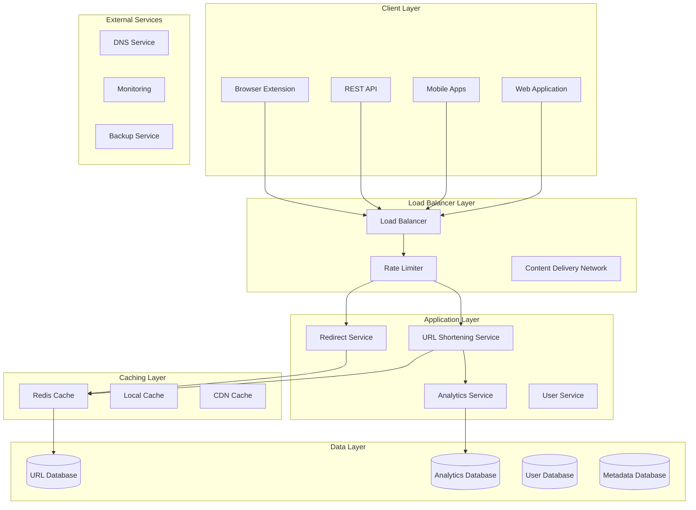
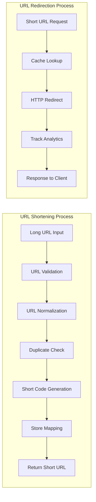
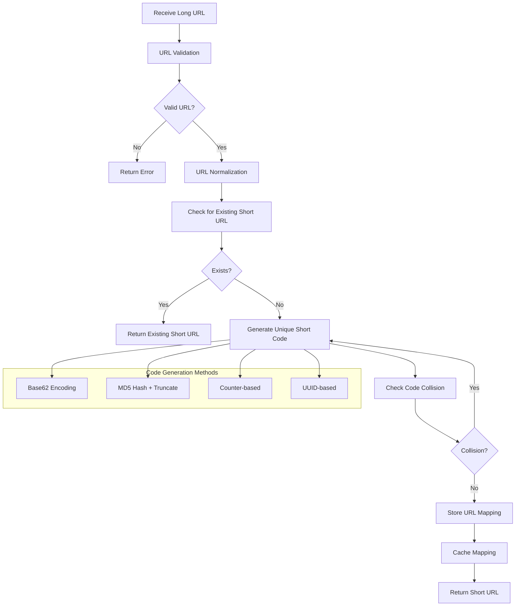
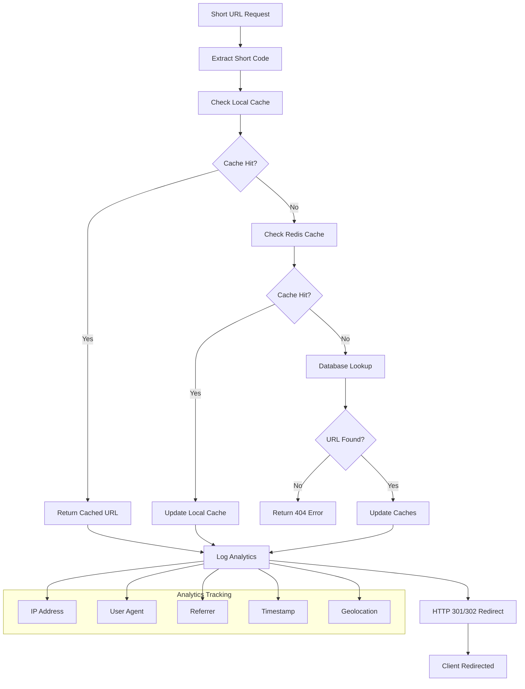
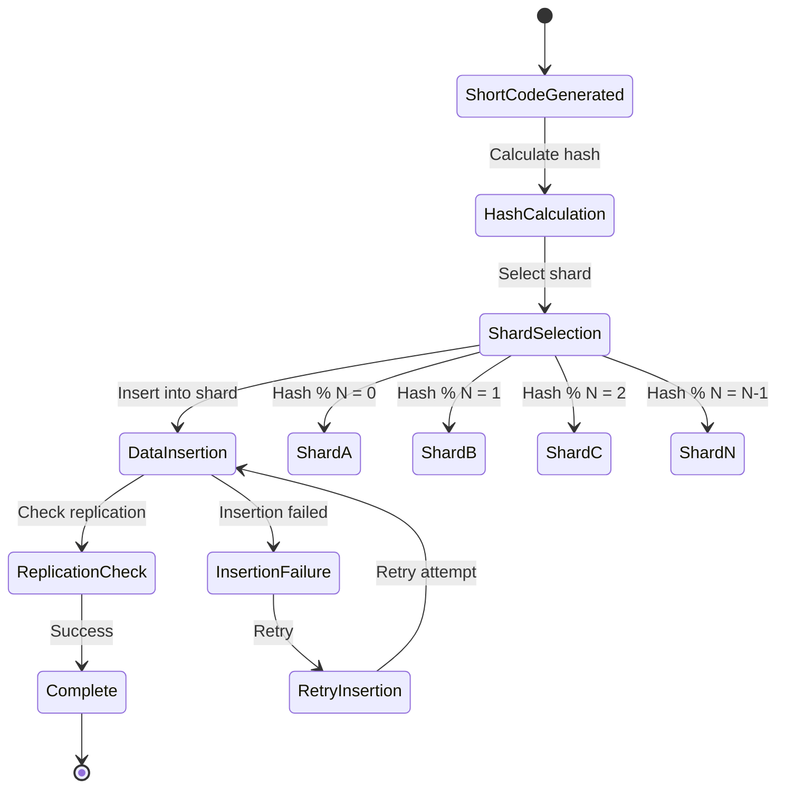
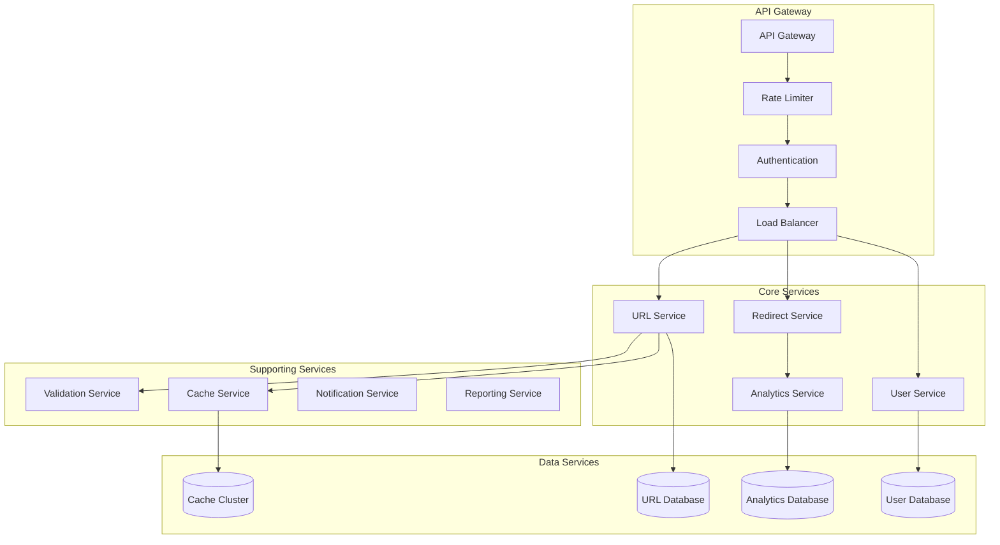
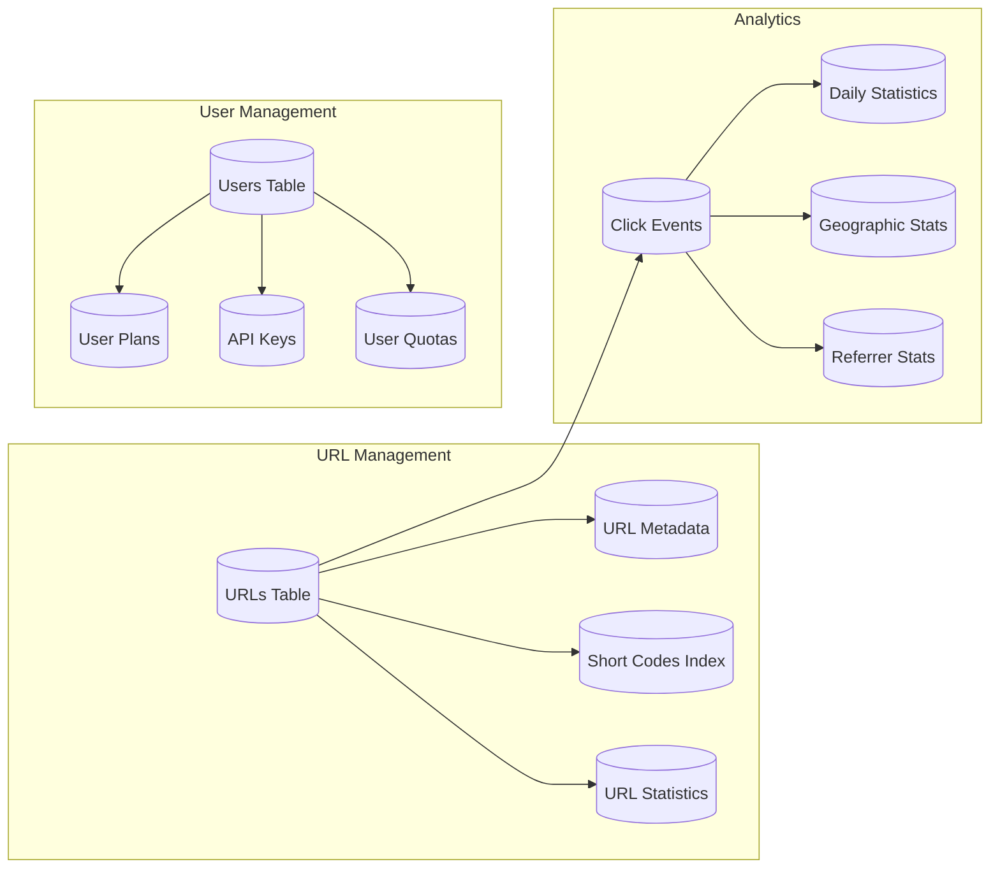
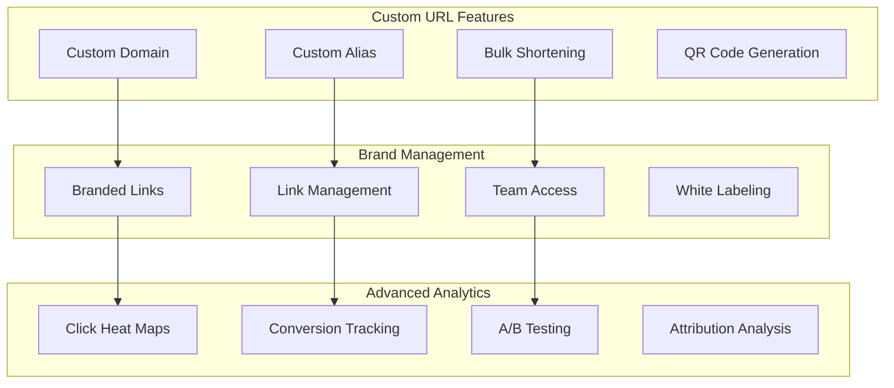
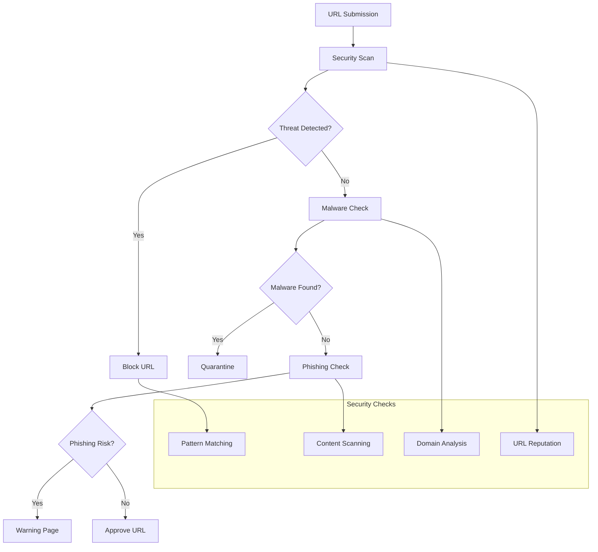
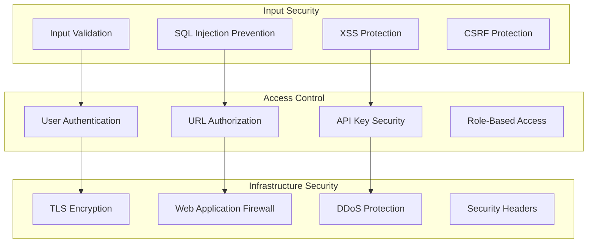

# URL Shortener Service (bit.ly/tinyurl)


## 📋 Table of Contents

- [URL Shortener Service (bit.ly/tinyurl)](#url-shortener-service-bitlytinyurl)
  - [Requirements Gathering](#requirements-gathering)
    - [Functional Requirements](#functional-requirements)
    - [Non-Functional Requirements](#non-functional-requirements)
  - [Traffic Estimation & Capacity Planning](#traffic-estimation-capacity-planning)
    - [User Base Analysis](#user-base-analysis)
    - [Traffic Calculations](#traffic-calculations)
  - [Database Schema Design](#database-schema-design)
    - [URL Database Schema](#url-database-schema)
    - [Analytics Database Schema](#analytics-database-schema)
  - [Sample API Endpoints](#sample-api-endpoints)
    - [URL Shortening APIs](#url-shortening-apis)
    - [Redirect API](#redirect-api)
    - [Analytics APIs](#analytics-apis)
    - [Bulk Operations APIs](#bulk-operations-apis)
  - [High-Level Design (HLD)](#high-level-design-hld)
    - [System Architecture Overview](#system-architecture-overview)
    - [URL Shortening Data Flow](#url-shortening-data-flow)
  - [Low-Level Design (LLD)](#low-level-design-lld)
    - [URL Encoding Algorithm Flow](#url-encoding-algorithm-flow)
    - [URL Redirection Flow](#url-redirection-flow)
    - [Database Sharding Strategy](#database-sharding-strategy)
  - [Core Algorithms](#core-algorithms)
    - [1. Short Code Generation Algorithm](#1-short-code-generation-algorithm)
    - [2. URL Validation and Normalization Algorithm](#2-url-validation-and-normalization-algorithm)
    - [3. Caching Strategy Algorithm](#3-caching-strategy-algorithm)
    - [4. Analytics and Tracking Algorithm](#4-analytics-and-tracking-algorithm)
    - [5. Rate Limiting Algorithm](#5-rate-limiting-algorithm)
  - [Component Architecture](#component-architecture)
    - [Microservices Architecture](#microservices-architecture)
    - [Database Schema Design](#database-schema-design)
  - [Advanced Features](#advanced-features)
    - [Custom Short URLs and Branding](#custom-short-urls-and-branding)
    - [Security and Fraud Detection](#security-and-fraud-detection)
  - [Performance Optimizations](#performance-optimizations)
    - [Horizontal Scaling Strategy](#horizontal-scaling-strategy)
    - [CDN and Edge Computing](#cdn-and-edge-computing)
    - [Connection Pooling and Resource Management](#connection-pooling-and-resource-management)
  - [Security Considerations](#security-considerations)
    - [URL Security Framework](#url-security-framework)
    - [Data Protection and Privacy](#data-protection-and-privacy)
  - [Testing Strategy](#testing-strategy)
    - [Performance Testing](#performance-testing)
    - [Security Testing](#security-testing)
  - [Trade-offs and Considerations](#trade-offs-and-considerations)
    - [Performance vs Accuracy](#performance-vs-accuracy)
    - [Scalability vs Cost](#scalability-vs-cost)
    - [Security vs Usability](#security-vs-usability)

---

## Requirements Gathering

[⬆️ Back to Top](#--table-of-contents)

---


### Functional Requirements

[⬆️ Back to Top](#--table-of-contents)

---


**Core URL Shortening Features:**
- Shorten long URLs to 6-8 character codes
- Redirect users from short URLs to original URLs
- Custom aliases for branded short URLs
- Bulk URL shortening via API
- URL expiration dates and auto-deletion
- QR code generation for short URLs
- URL preview before redirect (optional)
- Click tracking and analytics

**User Management:**
- Anonymous URL shortening (basic)
- User registration for advanced features
- Dashboard to manage shortened URLs
- URL history and favorites
- Team/organization accounts
- API key management for developers

**Analytics & Monitoring:**
- Click count tracking
- Geographic location analytics
- Referrer tracking
- Device and browser analytics
- Real-time analytics dashboard
- Export analytics data

### Non-Functional Requirements

[⬆️ Back to Top](#--table-of-contents)

---


**Performance:**
- Redirect latency < 10ms for cached URLs
- Support 1 billion URLs in the system
- Handle 100 million redirects per day
- 99.99% uptime SLA
- Global CDN for fast redirects

**Scalability:**
- Horizontal scaling of all services
- Handle 10,000 requests per second
- Auto-scaling based on traffic patterns
- Support for viral content traffic spikes

**Security:**
- Protection against malicious URLs
- Rate limiting to prevent abuse
- CAPTCHA for bulk operations
- DDoS protection
- SSL/TLS for all connections

**Reliability:**
- No data loss for shortened URLs
- Automatic failover and backup
- Data replication across regions
- Circuit breaker patterns

## Traffic Estimation & Capacity Planning

[⬆️ Back to Top](#--table-of-contents)

---


### User Base Analysis

[⬆️ Back to Top](#--table-of-contents)

---

- **Daily Active Users:** 10 million users
- **Anonymous Users:** 80% of total traffic
- **Registered Users:** 2 million users
- **URLs Shortened per Day:** 5 million URLs
- **Redirects per Day:** 100 million redirects
- **Read:Write Ratio:** 20:1 (heavy read workload)

### Traffic Calculations

[⬆️ Back to Top](#--table-of-contents)

---


**URL Operations:**
```
URL Shortening:
- Daily URL creations = 5M URLs/day
- Peak creation rate = 5M × 3 / (24 × 3600) = 174 URLs/sec
- Storage per URL = 500 bytes (URL + metadata)
- Daily storage growth = 5M × 500B = 2.5GB/day

URL Redirects:
- Daily redirects = 100M redirects/day  
- Peak redirect rate = 100M × 3 / (24 × 3600) = 3,472 redirects/sec
- Average redirect rate = 100M / (24 × 3600) = 1,157 redirects/sec
```

**Storage Requirements:**
```
URL Database:
- URLs after 5 years = 5M × 365 × 5 = 9.125B URLs
- Storage per URL = 500 bytes
- Total storage = 9.125B × 500B = 4.56TB
- With indexing overhead (3x) = 13.7TB

Analytics Database:
- Click events per day = 100M
- Storage per event = 200 bytes  
- Daily analytics storage = 100M × 200B = 20GB/day
- Annual analytics storage = 20GB × 365 = 7.3TB
```

**Cache Requirements:**
```
Redis Cache (Hot URLs):
- Hot URLs (20% of traffic) = 20M URLs in cache
- Cache entry size = 200 bytes (short_url -> long_url)
- Total cache memory = 20M × 200B = 4GB
- With overhead and redundancy = 12GB total
```

**Infrastructure Sizing:**
```
Application Servers:
- URL shortening service: 5 servers
- Redirect service: 20 servers (read-heavy)
- Analytics service: 3 servers

Database Requirements:
- URL database: 3 shards, 16GB RAM each
- Analytics database: 5 shards, 32GB RAM each
- Cache layer: 3 Redis nodes, 8GB each

CDN Requirements:
- Global CDN for redirect service
- Cache TTL: 1 hour for popular URLs
- Bandwidth: 1GB/s peak
```

## Database Schema Design

[⬆️ Back to Top](#--table-of-contents)

---


### URL Database Schema

[⬆️ Back to Top](#--table-of-contents)

---


```sql
-- Shortened URLs table
CREATE TABLE shortened_urls (
    id BIGINT PRIMARY KEY AUTO_INCREMENT,
    short_code VARCHAR(10) UNIQUE NOT NULL,
    original_url TEXT NOT NULL,
    user_id BIGINT NULL, -- NULL for anonymous users
    custom_alias VARCHAR(50) NULL,
    title VARCHAR(255),
    description TEXT,
    created_at TIMESTAMP DEFAULT CURRENT_TIMESTAMP,
    expires_at TIMESTAMP NULL,
    is_active BOOLEAN DEFAULT TRUE,
    click_count BIGINT DEFAULT 0,
    last_accessed TIMESTAMP NULL,
    
    INDEX idx_short_code (short_code),
    INDEX idx_user_id (user_id),
    INDEX idx_created_at (created_at),
    INDEX idx_expires_at (expires_at),
    FOREIGN KEY (user_id) REFERENCES users(user_id)
);

-- Users table
CREATE TABLE users (
    user_id BIGINT PRIMARY KEY AUTO_INCREMENT,
    username VARCHAR(50) UNIQUE NOT NULL,
    email VARCHAR(255) UNIQUE NOT NULL,
    password_hash VARCHAR(255) NOT NULL,
    api_key VARCHAR(64) UNIQUE,
    subscription_type ENUM('free', 'premium', 'enterprise') DEFAULT 'free',
    created_at TIMESTAMP DEFAULT CURRENT_TIMESTAMP,
    last_login TIMESTAMP,
    is_active BOOLEAN DEFAULT TRUE,
    
    INDEX idx_username (username),
    INDEX idx_email (email),
    INDEX idx_api_key (api_key)
);

-- Custom domains for branded URLs
CREATE TABLE custom_domains (
    domain_id BIGINT PRIMARY KEY AUTO_INCREMENT,
    user_id BIGINT NOT NULL,
    domain_name VARCHAR(255) UNIQUE NOT NULL,
    is_verified BOOLEAN DEFAULT FALSE,
    created_at TIMESTAMP DEFAULT CURRENT_TIMESTAMP,
    
    INDEX idx_user_id (user_id),
    INDEX idx_domain_name (domain_name),
    FOREIGN KEY (user_id) REFERENCES users(user_id)
);
```

### Analytics Database Schema

[⬆️ Back to Top](#--table-of-contents)

---


```sql
-- Click events table (partitioned by date)
CREATE TABLE click_events (
    event_id BIGINT PRIMARY KEY AUTO_INCREMENT,
    short_code VARCHAR(10) NOT NULL,
    ip_address VARCHAR(45),
    user_agent TEXT,
    referer TEXT,
    country VARCHAR(2),
    city VARCHAR(100),
    device_type ENUM('mobile', 'desktop', 'tablet', 'other'),
    browser VARCHAR(50),
    os VARCHAR(50),
    clicked_at TIMESTAMP DEFAULT CURRENT_TIMESTAMP,
    
    INDEX idx_short_code (short_code),
    INDEX idx_clicked_at (clicked_at),
    INDEX idx_country (country),
    INDEX idx_device_type (device_type)
) PARTITION BY RANGE (YEAR(clicked_at)) (
    PARTITION p2024 VALUES LESS THAN (2025),
    PARTITION p2025 VALUES LESS THAN (2026),
    PARTITION p2026 VALUES LESS THAN (2027)
);

-- Daily aggregated statistics
CREATE TABLE daily_stats (
    stat_id BIGINT PRIMARY KEY AUTO_INCREMENT,
    short_code VARCHAR(10) NOT NULL,
    stat_date DATE NOT NULL,
    click_count INT DEFAULT 0,
    unique_visitors INT DEFAULT 0,
    top_country VARCHAR(2),
    top_referer VARCHAR(255),
    
    UNIQUE KEY unique_url_date (short_code, stat_date),
    INDEX idx_stat_date (stat_date)
);
```

## Sample API Endpoints

[⬆️ Back to Top](#--table-of-contents)

---


### URL Shortening APIs

[⬆️ Back to Top](#--table-of-contents)

---


```http
POST /api/v1/urls/shorten
Content-Type: application/json
Authorization: Bearer <api_key> (optional)

{
    "url": "https://www.example.com/very/long/url/with/many/parameters?param1=value1&param2=value2",
    "custom_alias": "my-link", // optional
    "expires_at": "2024-12-31T23:59:59Z", // optional
    "title": "Example Website" // optional
}

Response (201 Created):
{
    "success": true,
    "data": {
        "short_url": "https://short.ly/abc123",
        "short_code": "abc123",
        "original_url": "https://www.example.com/very/long/url/with/many/parameters?param1=value1&param2=value2",
        "qr_code": "https://api.short.ly/qr/abc123.png",
        "created_at": "2024-01-15T10:30:00Z",
        "expires_at": "2024-12-31T23:59:59Z"
    }
}
```

```http
GET /api/v1/urls/{short_code}
Authorization: Bearer <api_key>

Response (200 OK):
{
    "success": true,
    "data": {
        "short_code": "abc123",
        "original_url": "https://www.example.com/very/long/url/with/many/parameters?param1=value1&param2=value2",
        "title": "Example Website",
        "created_at": "2024-01-15T10:30:00Z",
        "expires_at": "2024-12-31T23:59:59Z",
        "click_count": 1247,
        "is_active": true
    }
}
```

### Redirect API

[⬆️ Back to Top](#--table-of-contents)

---


```http
GET /{short_code}
User-Agent: Mozilla/5.0...
X-Forwarded-For: 192.168.1.1

Response (302 Found):
Location: https://www.example.com/very/long/url/with/many/parameters?param1=value1&param2=value2
Cache-Control: public, max-age=3600

// Analytics event is logged asynchronously
```

### Analytics APIs

[⬆️ Back to Top](#--table-of-contents)

---


```http
GET /api/v1/urls/{short_code}/analytics?period=7d
Authorization: Bearer <api_key>

Response (200 OK):
{
    "success": true,
    "data": {
        "short_code": "abc123",
        "period": "7d",
        "total_clicks": 1247,
        "unique_visitors": 892,
        "daily_stats": [
            {
                "date": "2024-01-15",
                "clicks": 234,
                "unique_visitors": 178
            }
        ],
        "top_countries": [
            {"country": "US", "clicks": 456, "percentage": 36.6},
            {"country": "UK", "clicks": 234, "percentage": 18.8}
        ],
        "top_referrers": [
            {"referrer": "google.com", "clicks": 345},
            {"referrer": "facebook.com", "clicks": 123}
        ],
        "devices": {
            "mobile": {"clicks": 623, "percentage": 50.0},
            "desktop": {"clicks": 498, "percentage": 39.9},
            "tablet": {"clicks": 126, "percentage": 10.1}
        }
    }
}
```

### Bulk Operations APIs

[⬆️ Back to Top](#--table-of-contents)

---


```http
POST /api/v1/urls/bulk
Authorization: Bearer <api_key>
Content-Type: application/json

{
    "urls": [
        {
            "url": "https://example1.com/long-url-1",
            "custom_alias": "link1"
        },
        {
            "url": "https://example2.com/long-url-2",
            "expires_at": "2024-12-31T23:59:59Z"
        }
    ]
}

Response (201 Created):
{
    "success": true,
    "data": {
        "created_urls": [
            {
                "short_url": "https://short.ly/link1",
                "original_url": "https://example1.com/long-url-1"
            },
            {
                "short_url": "https://short.ly/def456", 
                "original_url": "https://example2.com/long-url-2"
            }
        ],
        "failed_urls": []
    }
}
```

## High-Level Design (HLD)

[⬆️ Back to Top](#--table-of-contents)

---


### System Architecture Overview

[⬆️ Back to Top](#--table-of-contents)

---




### URL Shortening Data Flow

[⬆️ Back to Top](#--table-of-contents)

---




## Low-Level Design (LLD)

[⬆️ Back to Top](#--table-of-contents)

---


### URL Encoding Algorithm Flow

[⬆️ Back to Top](#--table-of-contents)

---




### URL Redirection Flow

[⬆️ Back to Top](#--table-of-contents)

---




### Database Sharding Strategy

[⬆️ Back to Top](#--table-of-contents)

---




## Core Algorithms

[⬆️ Back to Top](#--table-of-contents)

---


### 1. Short Code Generation Algorithm

[⬆️ Back to Top](#--table-of-contents)

---


**Purpose**: Generate unique, collision-resistant short codes for URLs.

**Base62 Encoding Algorithm**:
```
Base62Characters = "0123456789ABCDEFGHIJKLMNOPQRSTUVWXYZabcdefghijklmnopqrstuvwxyz"

function generateBase62Code(counter):
  if counter === 0:
    return "0"
  
  result = ""
  base = 62
  
  while counter > 0:
    remainder = counter % base
    result = Base62Characters[remainder] + result
    counter = Math.floor(counter / base)
  
  return result

function generateShortCode(method, input):
  switch method:
    case 'counter':
      return generateCounterBasedCode()
    case 'hash':
      return generateHashBasedCode(input)
    case 'random':
      return generateRandomCode()
    case 'timestamp':
      return generateTimestampBasedCode()
  
  return generateRandomCode() // fallback
```

**Counter-based Generation**:
```
function generateCounterBasedCode():
  // Get next counter value from distributed counter
  counter = getNextCounterValue()
  
  // Convert to base62
  shortCode = generateBase62Code(counter)
  
  // Ensure minimum length
  while shortCode.length < MIN_CODE_LENGTH:
    shortCode = "0" + shortCode
  
  return shortCode

function getNextCounterValue():
  // Use distributed counter with multiple ranges
  serverId = getServerId()
  rangeStart = serverId * RANGE_SIZE
  
  // Atomic increment within range
  localCounter = atomicIncrement(serverId)
  globalCounter = rangeStart + localCounter
  
  // Handle range exhaustion
  if localCounter >= RANGE_SIZE:
    requestNewRange(serverId)
  
  return globalCounter
```

**Hash-based Generation with Collision Handling**:
```
function generateHashBasedCode(url, attempt = 0):
  // Create unique input for each attempt
  input = url + attempt.toString()
  
  // Generate MD5 hash
  hash = md5(input)
  
  // Convert first 6 characters to base62
  hexSubstring = hash.substring(0, 8) // 8 hex chars = 32 bits
  decimal = parseInt(hexSubstring, 16)
  shortCode = generateBase62Code(decimal)
  
  // Ensure fixed length
  while shortCode.length < 6:
    shortCode = "0" + shortCode
  
  // Check for collision
  if checkCollision(shortCode):
    if attempt < MAX_COLLISION_ATTEMPTS:
      return generateHashBasedCode(url, attempt + 1)
    else:
      // Fallback to random generation
      return generateRandomCode()
  
  return shortCode
```

### 2. URL Validation and Normalization Algorithm

[⬆️ Back to Top](#--table-of-contents)

---


**Purpose**: Ensure URLs are valid and consistently formatted before processing.

**URL Validation Rules**:
```
ValidationRules = {
  maxLength: 2048,
  allowedSchemes: ['http', 'https', 'ftp'],
  blockedDomains: ['malware.com', 'spam.site'],
  allowedTLD: true,
  requireValidDomain: true
}

function validateURL(url):
  validationResult = {
    isValid: false,
    errors: [],
    normalizedUrl: null
  }
  
  // Length check
  if url.length > ValidationRules.maxLength:
    validationResult.errors.push('URL too long')
    return validationResult
  
  // Parse URL
  try:
    parsedUrl = new URL(url)
  catch error:
    validationResult.errors.push('Invalid URL format')
    return validationResult
  
  // Scheme validation
  if not ValidationRules.allowedSchemes.includes(parsedUrl.protocol.slice(0, -1)):
    validationResult.errors.push('Invalid URL scheme')
    return validationResult
  
  // Domain validation
  if not isValidDomain(parsedUrl.hostname):
    validationResult.errors.push('Invalid domain')
    return validationResult
  
  // Blocklist check
  if ValidationRules.blockedDomains.includes(parsedUrl.hostname):
    validationResult.errors.push('Domain blocked')
    return validationResult
  
  // Malware/phishing check
  if await checkMalwareDatabase(parsedUrl.hostname):
    validationResult.errors.push('Malicious URL detected')
    return validationResult
  
  validationResult.isValid = true
  validationResult.normalizedUrl = normalizeURL(parsedUrl)
  return validationResult
```

**URL Normalization Algorithm**:
```
function normalizeURL(parsedUrl):
  normalized = {
    protocol: parsedUrl.protocol.toLowerCase(),
    hostname: parsedUrl.hostname.toLowerCase(),
    pathname: parsedUrl.pathname,
    search: parsedUrl.search,
    hash: parsedUrl.hash
  }
  
  // Remove default ports
  if (normalized.protocol === 'http:' and parsedUrl.port === '80') or
     (normalized.protocol === 'https:' and parsedUrl.port === '443'):
    // Don't include port
  else if parsedUrl.port:
    normalized.port = parsedUrl.port
  
  // Normalize pathname
  normalized.pathname = removeTrailingSlash(normalized.pathname)
  normalized.pathname = resolveRelativePaths(normalized.pathname)
  
  // Sort query parameters for consistency
  if normalized.search:
    queryParams = new URLSearchParams(normalized.search)
    queryParams.sort()
    normalized.search = '?' + queryParams.toString()
  
  // Remove fragment for certain cases
  if shouldRemoveFragment(normalized):
    normalized.hash = ''
  
  return constructURL(normalized)
```

### 3. Caching Strategy Algorithm

[⬆️ Back to Top](#--table-of-contents)

---


**Purpose**: Optimize performance through intelligent multi-layer caching.

**Cache Hierarchy Management**:
```
CacheConfig = {
  localCache: {
    maxSize: 10000,
    ttl: 300, // 5 minutes
    algorithm: 'LRU'
  },
  redisCache: {
    ttl: 3600, // 1 hour
    keyPrefix: 'url:',
    compressionEnabled: true
  },
  cdnCache: {
    ttl: 86400, // 24 hours
    edgeLocations: true,
    compressionEnabled: true
  }
}

function getCachedURL(shortCode):
  // Level 1: Local cache
  result = localCache.get(shortCode)
  if result:
    updateCacheStats('local_hit')
    return result
  
  // Level 2: Redis cache
  result = redisCache.get(CacheConfig.redisCache.keyPrefix + shortCode)
  if result:
    // Promote to local cache
    localCache.set(shortCode, result, CacheConfig.localCache.ttl)
    updateCacheStats('redis_hit')
    return result
  
  // Level 3: Database lookup
  result = database.lookup(shortCode)
  if result:
    // Populate all cache levels
    setCachedURL(shortCode, result)
    updateCacheStats('db_hit')
    return result
  
  updateCacheStats('miss')
  return null
```

**Cache Invalidation Strategy**:
```
function invalidateCache(shortCode, reason):
  invalidationTasks = []
  
  // Remove from local cache
  invalidationTasks.push(localCache.delete(shortCode))
  
  // Remove from Redis cache
  invalidationTasks.push(redisCache.delete(CacheConfig.redisCache.keyPrefix + shortCode))
  
  // For CDN invalidation, depends on reason
  if reason === 'url_updated' or reason === 'url_deleted':
    invalidationTasks.push(cdnInvalidate(shortCode))
  
  // Log invalidation for monitoring
  logCacheInvalidation(shortCode, reason, Date.now())
  
  return Promise.all(invalidationTasks)

function determineInvalidationScope(operation, shortCode):
  switch operation:
    case 'url_delete':
      return ['local', 'redis', 'cdn']
    case 'url_update':
      return ['local', 'redis', 'cdn']
    case 'analytics_update':
      return [] // Analytics don't affect URL resolution
    case 'metadata_update':
      return ['local', 'redis'] // CDN can keep serving redirects
    default:
      return ['local', 'redis']
```

### 4. Analytics and Tracking Algorithm

[⬆️ Back to Top](#--table-of-contents)

---


**Purpose**: Collect and process URL usage analytics efficiently.

**Real-time Analytics Collection**:
```
AnalyticsEvent = {
  shortCode: string,
  timestamp: number,
  ipAddress: string,
  userAgent: string,
  referrer: string,
  geolocation: {
    country: string,
    region: string,
    city: string
  },
  deviceInfo: {
    type: string, // mobile, desktop, tablet
    os: string,
    browser: string
  }
}

function trackURLAccess(shortCode, request):
  event = {
    shortCode: shortCode,
    timestamp: Date.now(),
    ipAddress: extractClientIP(request),
    userAgent: request.headers['user-agent'],
    referrer: request.headers['referer'] || 'direct'
  }
  
  // Async processing to not block redirect
  Promise.resolve().then(() => {
    // Enrich with geolocation
    event.geolocation = getGeolocation(event.ipAddress)
    
    // Parse user agent
    event.deviceInfo = parseUserAgent(event.userAgent)
    
    // Store in analytics database
    storeAnalyticsEvent(event)
    
    // Update real-time counters
    updateRealTimeCounters(shortCode, event)
    
    // Stream to analytics pipeline
    streamToAnalyticsPipeline(event)
  })
```

**Analytics Aggregation Algorithm**:
```
function aggregateAnalytics(shortCode, timeRange):
  rawEvents = getAnalyticsEvents(shortCode, timeRange)
  
  aggregation = {
    totalClicks: rawEvents.length,
    uniqueClicks: 0,
    topReferrers: new Map(),
    topCountries: new Map(),
    deviceTypes: new Map(),
    browsers: new Map(),
    hourlyDistribution: new Array(24).fill(0),
    dailyTrend: []
  }
  
  uniqueIPs = new Set()
  
  for event in rawEvents:
    // Count unique IPs (proxy for unique users)
    uniqueIPs.add(event.ipAddress)
    
    // Aggregate referrers
    incrementCounter(aggregation.topReferrers, event.referrer)
    
    // Aggregate geography
    incrementCounter(aggregation.topCountries, event.geolocation.country)
    
    // Aggregate device types
    incrementCounter(aggregation.deviceTypes, event.deviceInfo.type)
    
    // Aggregate browsers
    incrementCounter(aggregation.browsers, event.deviceInfo.browser)
    
    // Hourly distribution
    hour = new Date(event.timestamp).getHours()
    aggregation.hourlyDistribution[hour]++
    
    // Daily trend
    updateDailyTrend(aggregation.dailyTrend, event.timestamp)
  
  aggregation.uniqueClicks = uniqueIPs.size
  
  // Sort and limit top lists
  aggregation.topReferrers = sortAndLimit(aggregation.topReferrers, 10)
  aggregation.topCountries = sortAndLimit(aggregation.topCountries, 10)
  
  return aggregation
```

### 5. Rate Limiting Algorithm

[⬆️ Back to Top](#--table-of-contents)

---


**Purpose**: Prevent abuse and ensure fair usage of the service.

**Token Bucket Rate Limiter**:
```
TokenBucket = {
  capacity: number,
  tokens: number,
  refillRate: number, // tokens per second
  lastRefill: number
}

function createRateLimiter(userId, endpoint):
  limits = getRateLimits(userId, endpoint)
  
  return {
    bucket: {
      capacity: limits.maxRequests,
      tokens: limits.maxRequests,
      refillRate: limits.refillRate,
      lastRefill: Date.now()
    },
    windowStart: Date.now(),
    requestCount: 0
  }

function checkRateLimit(userId, endpoint, requestCount = 1):
  rateLimiter = getRateLimiter(userId, endpoint)
  
  // Refill tokens based on time elapsed
  refillTokens(rateLimiter.bucket)
  
  // Check if enough tokens available
  if rateLimiter.bucket.tokens >= requestCount:
    rateLimiter.bucket.tokens -= requestCount
    return {
      allowed: true,
      remainingTokens: rateLimiter.bucket.tokens,
      resetTime: calculateResetTime(rateLimiter.bucket)
    }
  else:
    return {
      allowed: false,
      remainingTokens: rateLimiter.bucket.tokens,
      resetTime: calculateResetTime(rateLimiter.bucket),
      retryAfter: calculateRetryAfter(rateLimiter.bucket, requestCount)
    }
```

**Adaptive Rate Limiting**:
```
function getAdaptiveRateLimit(userId, endpoint, context):
  baseLimit = getBaseLimits(userId, endpoint)
  
  // Adjust based on user tier
  userTier = getUserTier(userId)
  tierMultiplier = getTierMultiplier(userTier)
  
  // Adjust based on system load
  systemLoad = getCurrentSystemLoad()
  loadMultiplier = calculateLoadMultiplier(systemLoad)
  
  // Adjust based on user behavior
  userReputation = getUserReputation(userId)
  reputationMultiplier = calculateReputationMultiplier(userReputation)
  
  // Adjust based on endpoint sensitivity
  endpointSensitivity = getEndpointSensitivity(endpoint)
  sensitivityMultiplier = calculateSensitivityMultiplier(endpointSensitivity)
  
  finalLimit = Math.floor(
    baseLimit * 
    tierMultiplier * 
    loadMultiplier * 
    reputationMultiplier * 
    sensitivityMultiplier
  )
  
  return Math.max(finalLimit, MIN_RATE_LIMIT)
```

## Component Architecture

[⬆️ Back to Top](#--table-of-contents)

---


### Microservices Architecture

[⬆️ Back to Top](#--table-of-contents)

---




### Database Schema Design

[⬆️ Back to Top](#--table-of-contents)

---




## Advanced Features

[⬆️ Back to Top](#--table-of-contents)

---


### Custom Short URLs and Branding

[⬆️ Back to Top](#--table-of-contents)

---




### Security and Fraud Detection

[⬆️ Back to Top](#--table-of-contents)

---




## Performance Optimizations

[⬆️ Back to Top](#--table-of-contents)

---


### Horizontal Scaling Strategy

[⬆️ Back to Top](#--table-of-contents)

---


**Database Sharding**:
```
ShardingStrategy = {
  method: 'hash_based',
  shardKey: 'short_code',
  shardCount: 64,
  replicationFactor: 3
}
```

**Read Replica Optimization**:
- Use read replicas for analytics queries
- Implement eventual consistency for non-critical reads
- Route read traffic based on geographic proximity
- Cache frequently accessed data

### CDN and Edge Computing

[⬆️ Back to Top](#--table-of-contents)

---


**Edge Caching Strategy**:
- Cache popular short URLs at edge locations
- Implement cache warming for trending links
- Use intelligent cache invalidation
- Optimize cache hit ratios through predictive caching

### Connection Pooling and Resource Management

[⬆️ Back to Top](#--table-of-contents)

---


**Database Connection Optimization**:
- Implement connection pooling with proper sizing
- Use prepared statements for common queries
- Optimize query patterns for read/write workloads
- Monitor and tune database performance metrics

## Security Considerations

[⬆️ Back to Top](#--table-of-contents)

---


### URL Security Framework

[⬆️ Back to Top](#--table-of-contents)

---




### Data Protection and Privacy

[⬆️ Back to Top](#--table-of-contents)

---


**Privacy Framework**:
- Implement data anonymization for analytics
- Provide user data export functionality
- Support GDPR right to be forgotten
- Encrypt sensitive data at rest and in transit
- Regular security audits and penetration testing

## Testing Strategy

[⬆️ Back to Top](#--table-of-contents)

---


### Performance Testing

[⬆️ Back to Top](#--table-of-contents)

---


**Load Testing Scenarios**:
- URL shortening API throughput testing
- Redirect service performance under load
- Database query performance optimization
- Cache performance and hit ratio validation

**Stress Testing**:
- Peak traffic simulation
- Database failover testing
- Cache invalidation impact
- Rate limiting effectiveness

### Security Testing

[⬆️ Back to Top](#--table-of-contents)

---


**Security Test Cases**:
- Malicious URL detection accuracy
- SQL injection prevention
- Rate limiting bypass attempts
- Authentication and authorization testing

## Trade-offs and Considerations

[⬆️ Back to Top](#--table-of-contents)

---


### Performance vs Accuracy

[⬆️ Back to Top](#--table-of-contents)

---

- **Caching duration**: Faster redirects vs analytics accuracy
- **Database consistency**: Performance vs data consistency
- **Code generation**: Speed vs collision probability
- **Rate limiting**: User experience vs abuse prevention

### Scalability vs Cost

[⬆️ Back to Top](#--table-of-contents)

---

- **Database scaling**: Read replicas vs infrastructure cost
- **CDN coverage**: Global performance vs CDN expenses
- **Cache layers**: Memory usage vs response times
- **Analytics granularity**: Data insights vs storage costs

### Security vs Usability

[⬆️ Back to Top](#--table-of-contents)

---

- **URL validation**: Security vs user convenience
- **Rate limiting**: Abuse prevention vs legitimate usage
- **Analytics tracking**: Insights vs user privacy
- **Custom domains**: Branding vs security complexity

This URL shortener service provides a comprehensive foundation for high-scale link shortening with features like intelligent caching, advanced analytics, and robust security measures while maintaining excellent performance and reliability standards. 