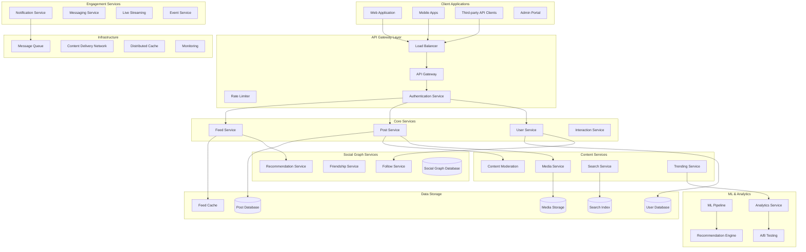
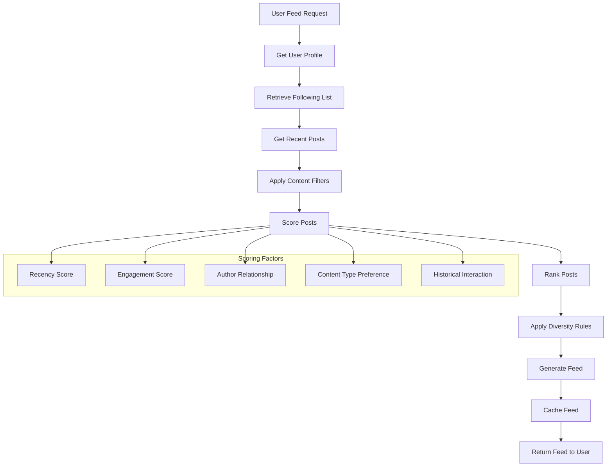
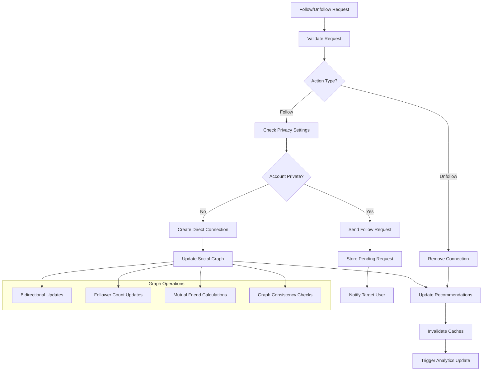
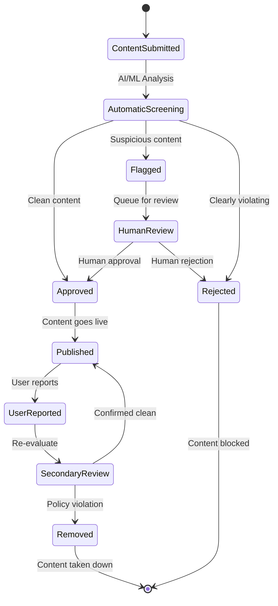
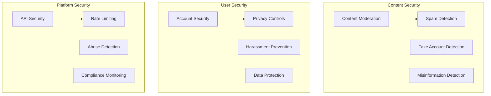

# Social Media Backend System


## 📋 Table of Contents

- [Social Media Backend System](#social-media-backend-system)
  - [Requirements Gathering](#requirements-gathering)
    - [Functional Requirements](#functional-requirements)
    - [Non-Functional Requirements](#non-functional-requirements)
  - [Traffic Estimation & Capacity Planning](#traffic-estimation-capacity-planning)
    - [User Base Analysis](#user-base-analysis)
    - [Traffic Calculations](#traffic-calculations)
  - [Database Schema Design](#database-schema-design)
    - [User Database Schema](#user-database-schema)
    - [Posts Database Schema](#posts-database-schema)
    - [Feed Database Schema](#feed-database-schema)
  - [Sample API Endpoints](#sample-api-endpoints)
    - [Authentication APIs](#authentication-apis)
    - [User Profile APIs](#user-profile-apis)
    - [Post Creation APIs](#post-creation-apis)
    - [News Feed APIs](#news-feed-apis)
    - [Social Interaction APIs](#social-interaction-apis)
    - [Search APIs](#search-apis)
  - [High-Level Design (HLD)](#high-level-design-hld)
    - [System Architecture Overview](#system-architecture-overview)
    - [Social Media Data Flow](#social-media-data-flow)
  - [Low-Level Design (LLD)](#low-level-design-lld)
    - [Feed Generation Algorithm](#feed-generation-algorithm)
    - [Social Graph Management](#social-graph-management)
    - [Content Moderation Pipeline](#content-moderation-pipeline)
  - [Core Algorithms](#core-algorithms)
    - [1. Personalized Feed Generation Algorithm](#1-personalized-feed-generation-algorithm)
    - [2. Social Graph Management Algorithm](#2-social-graph-management-algorithm)
    - [3. Content Discovery and Trending Algorithm](#3-content-discovery-and-trending-algorithm)
    - [4. Content Moderation Algorithm](#4-content-moderation-algorithm)
    - [5. Real-time Notification System](#5-real-time-notification-system)
  - [Performance Optimizations](#performance-optimizations)
    - [Feed Generation Optimization](#feed-generation-optimization)
    - [Database Optimization](#database-optimization)
  - [Security Considerations](#security-considerations)
    - [Social Media Security Framework](#social-media-security-framework)
  - [Testing Strategy](#testing-strategy)
    - [Load Testing](#load-testing)
    - [Social Features Testing](#social-features-testing)
  - [Trade-offs and Considerations](#trade-offs-and-considerations)
    - [Engagement vs Well-being](#engagement-vs-well-being)
    - [Privacy vs Personalization](#privacy-vs-personalization)
    - [Scalability vs Consistency](#scalability-vs-consistency)

---

## Requirements Gathering

[⬆️ Back to Top](#--table-of-contents)

---


### Functional Requirements

[⬆️ Back to Top](#--table-of-contents)

---


**Core Social Features:**
- User registration and profile management
- Create, read, update, delete posts (text, images, videos)
- Follow/unfollow other users
- Like, comment, and share posts
- News feed generation (timeline)
- Direct messaging between users
- Notifications for activities
- Search users and content
- Story creation and viewing (24-hour expiry)
- Live streaming capabilities
- Groups and pages creation
- Event creation and management

**Content Management:**
- Photo and video uploads (up to 4K resolution)
- Content moderation and filtering
- Hashtag system and trending topics
- Content recommendation algorithm
- Content reporting and flagging
- Privacy settings for posts and profiles
- Content archiving and deletion

**Advanced Features:**
- Real-time chat and messaging
- Voice and video calling
- Location-based features
- Content analytics for creators
- Advertising platform integration
- Third-party app integrations
- Multi-language support
- Accessibility features

### Non-Functional Requirements

[⬆️ Back to Top](#--table-of-contents)

---


**Performance:**
- News feed loading < 2 seconds
- Support 500 million daily active users
- Handle 10 billion posts per day
- 99.9% uptime SLA
- Real-time updates < 100ms

**Scalability:**
- Horizontal scaling across all services
- Handle viral content traffic spikes
- Global distribution across regions
- Auto-scaling based on demand
- Support 100x user growth

**Security:**
- End-to-end encryption for messages
- OAuth 2.0 authentication
- Content encryption at rest
- Privacy controls and data protection
- Anti-spam and bot detection
- GDPR and privacy compliance

**Reliability:**
- Zero data loss for user content
- Disaster recovery and backup
- Multi-region data replication
- Circuit breaker patterns
- Graceful degradation

## Traffic Estimation & Capacity Planning

[⬆️ Back to Top](#--table-of-contents)

---


### User Base Analysis

[⬆️ Back to Top](#--table-of-contents)

---

- **Total Users:** 1 billion registered users
- **Daily Active Users (DAU):** 500 million users
- **Peak Concurrent Users:** 100 million users
- **Posts per User per Day:** 2 posts average
- **Feed Views per User per Day:** 50 views average
- **Messages per User per Day:** 20 messages average

### Traffic Calculations

[⬆️ Back to Top](#--table-of-contents)

---


**Content Operations:**
```
Daily Posts Created:
- Total posts = 500M DAU × 2 posts = 1B posts/day
- Peak posting rate = 1B × 3 / (24 × 3600) = 34,722 posts/sec
- Average posting rate = 1B / (24 × 3600) = 11,574 posts/sec

Feed Generation:
- Daily feed views = 500M DAU × 50 views = 25B feed requests/day
- Peak feed rate = 25B × 3 / (24 × 3600) = 868,055 requests/sec
- Average feed rate = 25B / (24 × 3600) = 289,351 requests/sec

Social Interactions:
- Likes per day = 500M × 20 = 10B likes/day
- Comments per day = 500M × 5 = 2.5B comments/day
- Shares per day = 500M × 2 = 1B shares/day
```

**Storage Requirements:**
```
User Data:
- User profiles = 1B users × 2KB = 2TB
- Social graph = 1B users × 100 connections × 50B = 5TB

Content Storage:
- Text posts = 1B posts × 500B = 500GB/day
- Image posts (30%) = 300M × 2MB = 600TB/day  
- Video posts (10%) = 100M × 50MB = 5PB/day
- Annual content storage = (600TB + 5PB) × 365 = 2EB/year

Feed Cache:
- Active user feeds = 100M users × 20 posts × 1KB = 2TB
- Trending content cache = 50GB
- User activity cache = 100GB
```

**Infrastructure Sizing:**
```
Application Servers:
- Feed generation service: 200 servers
- Post service: 100 servers  
- User service: 50 servers
- Media processing: 500 servers
- Real-time messaging: 300 servers

Database Requirements:
- User database: 100 shards, 64GB RAM each
- Posts database: 500 shards, 32GB RAM each
- Social graph database: 200 shards, 128GB RAM each
- Media metadata database: 50 shards, 16GB RAM each

Cache Infrastructure:
- Redis clusters: 10TB total memory
- Feed cache: 2TB
- User session cache: 1TB
- Content cache: 5TB
- Social graph cache: 2TB
```

## Database Schema Design

[⬆️ Back to Top](#--table-of-contents)

---


### User Database Schema

[⬆️ Back to Top](#--table-of-contents)

---


```sql
-- Users table
CREATE TABLE users (
    user_id BIGINT PRIMARY KEY AUTO_INCREMENT,
    username VARCHAR(50) UNIQUE NOT NULL,
    email VARCHAR(255) UNIQUE NOT NULL,
    phone_number VARCHAR(20) UNIQUE,
    password_hash VARCHAR(255) NOT NULL,
    first_name VARCHAR(100),
    last_name VARCHAR(100),
    bio TEXT,
    profile_picture_url VARCHAR(512),
    cover_photo_url VARCHAR(512),
    birth_date DATE,
    gender ENUM('male', 'female', 'other', 'prefer_not_to_say'),
    location VARCHAR(255),
    website VARCHAR(255),
    verification_status ENUM('none', 'verified', 'business') DEFAULT 'none',
    privacy_settings JSON,
    created_at TIMESTAMP DEFAULT CURRENT_TIMESTAMP,
    updated_at TIMESTAMP DEFAULT CURRENT_TIMESTAMP ON UPDATE CURRENT_TIMESTAMP,
    last_active TIMESTAMP,
    is_active BOOLEAN DEFAULT TRUE,
    follower_count INT DEFAULT 0,
    following_count INT DEFAULT 0,
    post_count INT DEFAULT 0,
    
    INDEX idx_username (username),
    INDEX idx_email (email),
    INDEX idx_last_active (last_active),
    INDEX idx_verification (verification_status)
);

-- User relationships (followers/following)
CREATE TABLE user_relationships (
    follower_id BIGINT NOT NULL,
    following_id BIGINT NOT NULL,
    relationship_type ENUM('follow', 'block', 'mute') NOT NULL,
    created_at TIMESTAMP DEFAULT CURRENT_TIMESTAMP,
    
    PRIMARY KEY (follower_id, following_id, relationship_type),
    INDEX idx_follower (follower_id),
    INDEX idx_following (following_id),
    FOREIGN KEY (follower_id) REFERENCES users(user_id),
    FOREIGN KEY (following_id) REFERENCES users(user_id)
);
```

### Posts Database Schema

[⬆️ Back to Top](#--table-of-contents)

---


```sql
-- Posts table (sharded by user_id)
CREATE TABLE posts (
    post_id BIGINT PRIMARY KEY,
    user_id BIGINT NOT NULL,
    content TEXT,
    post_type ENUM('text', 'image', 'video', 'story', 'live') NOT NULL,
    media_urls JSON, -- Array of media file URLs
    hashtags JSON, -- Array of hashtags
    mentions JSON, -- Array of mentioned user_ids
    location VARCHAR(255),
    privacy_setting ENUM('public', 'friends', 'private') DEFAULT 'public',
    is_deleted BOOLEAN DEFAULT FALSE,
    created_at TIMESTAMP DEFAULT CURRENT_TIMESTAMP,
    updated_at TIMESTAMP DEFAULT CURRENT_TIMESTAMP ON UPDATE CURRENT_TIMESTAMP,
    like_count INT DEFAULT 0,
    comment_count INT DEFAULT 0,
    share_count INT DEFAULT 0,
    view_count BIGINT DEFAULT 0,
    
    INDEX idx_user_created (user_id, created_at),
    INDEX idx_created_at (created_at),
    INDEX idx_post_type (post_type),
    FOREIGN KEY (user_id) REFERENCES users(user_id)
);

-- Comments table
CREATE TABLE comments (
    comment_id BIGINT PRIMARY KEY AUTO_INCREMENT,
    post_id BIGINT NOT NULL,
    user_id BIGINT NOT NULL,
    parent_comment_id BIGINT NULL, -- For nested comments
    content TEXT NOT NULL,
    is_deleted BOOLEAN DEFAULT FALSE,
    created_at TIMESTAMP DEFAULT CURRENT_TIMESTAMP,
    updated_at TIMESTAMP DEFAULT CURRENT_TIMESTAMP ON UPDATE CURRENT_TIMESTAMP,
    like_count INT DEFAULT 0,
    
    INDEX idx_post_created (post_id, created_at),
    INDEX idx_user_created (user_id, created_at),
    INDEX idx_parent_comment (parent_comment_id),
    FOREIGN KEY (post_id) REFERENCES posts(post_id),
    FOREIGN KEY (user_id) REFERENCES users(user_id),
    FOREIGN KEY (parent_comment_id) REFERENCES comments(comment_id)
);

-- Likes table (for posts and comments)
CREATE TABLE likes (
    like_id BIGINT PRIMARY KEY AUTO_INCREMENT,
    user_id BIGINT NOT NULL,
    target_id BIGINT NOT NULL, -- post_id or comment_id
    target_type ENUM('post', 'comment') NOT NULL,
    created_at TIMESTAMP DEFAULT CURRENT_TIMESTAMP,
    
    UNIQUE KEY unique_user_target (user_id, target_id, target_type),
    INDEX idx_target (target_id, target_type),
    INDEX idx_user_created (user_id, created_at),
    FOREIGN KEY (user_id) REFERENCES users(user_id)
);
```

### Feed Database Schema

[⬆️ Back to Top](#--table-of-contents)

---


```sql
-- News feed table (pre-computed feeds)
CREATE TABLE news_feeds (
    feed_id BIGINT PRIMARY KEY AUTO_INCREMENT,
    user_id BIGINT NOT NULL,
    post_id BIGINT NOT NULL,
    score DECIMAL(10,6) NOT NULL, -- Relevance score for ranking
    feed_type ENUM('timeline', 'discover', 'trending') NOT NULL,
    created_at TIMESTAMP DEFAULT CURRENT_TIMESTAMP,
    expires_at TIMESTAMP NOT NULL,
    
    INDEX idx_user_score (user_id, score DESC),
    INDEX idx_user_type (user_id, feed_type),
    INDEX idx_expires_at (expires_at),
    FOREIGN KEY (user_id) REFERENCES users(user_id),
    FOREIGN KEY (post_id) REFERENCES posts(post_id)
);

-- Media files metadata
CREATE TABLE media_files (
    file_id VARCHAR(128) PRIMARY KEY, -- UUID
    user_id BIGINT NOT NULL,
    original_filename VARCHAR(255),
    file_type ENUM('image', 'video', 'audio') NOT NULL,
    file_size BIGINT NOT NULL,
    mime_type VARCHAR(100),
    storage_url VARCHAR(512) NOT NULL,
    thumbnail_url VARCHAR(512),
    duration INT NULL, -- For videos/audio in seconds
    resolution VARCHAR(20), -- e.g., "1920x1080"
    is_processed BOOLEAN DEFAULT FALSE,
    created_at TIMESTAMP DEFAULT CURRENT_TIMESTAMP,
    
    INDEX idx_user_created (user_id, created_at),
    INDEX idx_file_type (file_type),
    FOREIGN KEY (user_id) REFERENCES users(user_id)
);
```

## Sample API Endpoints

[⬆️ Back to Top](#--table-of-contents)

---


### Authentication APIs

[⬆️ Back to Top](#--table-of-contents)

---


```http
POST /api/v1/auth/register
Content-Type: application/json

{
    "username": "johndoe",
    "email": "john@example.com",
    "password": "securePassword123",
    "first_name": "John",
    "last_name": "Doe"
}

Response (201 Created):
{
    "success": true,
    "data": {
        "user_id": 12345,
        "username": "johndoe",
        "access_token": "eyJhbGciOiJIUzI1NiIsInR5cCI6IkpXVCJ9...",
        "refresh_token": "eyJhbGciOiJIUzI1NiIsInR5cCI6IkpXVCJ9...",
        "expires_in": 3600
    }
}
```

### User Profile APIs

[⬆️ Back to Top](#--table-of-contents)

---


```http
GET /api/v1/users/{user_id}
Authorization: Bearer <access_token>

Response (200 OK):
{
    "success": true,
    "data": {
        "user_id": 12345,
        "username": "johndoe",
        "first_name": "John",
        "last_name": "Doe",
        "bio": "Software developer and coffee enthusiast",
        "profile_picture_url": "https://cdn.example.com/profiles/12345.jpg",
        "follower_count": 1547,
        "following_count": 892,
        "post_count": 234,
        "verification_status": "verified",
        "is_following": false,
        "is_followed_by": false
    }
}
```

### Post Creation APIs

[⬆️ Back to Top](#--table-of-contents)

---


```http
POST /api/v1/posts
Authorization: Bearer <access_token>
Content-Type: multipart/form-data

Form Data:
- content: "Beautiful sunset at the beach! #sunset #photography"
- post_type: "image"
- media: [image file]
- privacy_setting: "public"
- location: "Malibu Beach, CA"

Response (201 Created):
{
    "success": true,
    "data": {
        "post_id": 567890,
        "user_id": 12345,
        "content": "Beautiful sunset at the beach! #sunset #photography",
        "post_type": "image",
        "media_urls": [
            "https://cdn.example.com/posts/567890_1.jpg"
        ],
        "hashtags": ["sunset", "photography"],
        "location": "Malibu Beach, CA",
        "created_at": "2024-01-15T18:30:00Z",
        "like_count": 0,
        "comment_count": 0
    }
}
```

### News Feed APIs

[⬆️ Back to Top](#--table-of-contents)

---


```http
GET /api/v1/feed?limit=20&offset=0
Authorization: Bearer <access_token>

Response (200 OK):
{
    "success": true,
    "data": {
        "posts": [
            {
                "post_id": 567889,
                "user": {
                    "user_id": 12346,
                    "username": "janesmith",
                    "profile_picture_url": "https://cdn.example.com/profiles/12346.jpg",
                    "verification_status": "verified"
                },
                "content": "Just launched my new startup! So excited! 🚀",
                "post_type": "text",
                "created_at": "2024-01-15T17:45:00Z",
                "like_count": 45,
                "comment_count": 12,
                "share_count": 8,
                "is_liked": false,
                "hashtags": ["startup", "entrepreneur"]
            }
        ],
        "has_more": true,
        "next_offset": 20
    }
}
```

### Social Interaction APIs

[⬆️ Back to Top](#--table-of-contents)

---


```http
POST /api/v1/posts/{post_id}/like
Authorization: Bearer <access_token>

Response (200 OK):
{
    "success": true,
    "data": {
        "is_liked": true,
        "like_count": 46
    }
}
```

```http
POST /api/v1/posts/{post_id}/comments
Authorization: Bearer <access_token>
Content-Type: application/json

{
    "content": "Congratulations! Wishing you all the best! 🎉",
    "parent_comment_id": null
}

Response (201 Created):
{
    "success": true,
    "data": {
        "comment_id": 123456,
        "post_id": 567889,
        "user": {
            "user_id": 12345,
            "username": "johndoe",
            "profile_picture_url": "https://cdn.example.com/profiles/12345.jpg"
        },
        "content": "Congratulations! Wishing you all the best! 🎉",
        "created_at": "2024-01-15T18:00:00Z",
        "like_count": 0
    }
}
```

### Search APIs

[⬆️ Back to Top](#--table-of-contents)

---


```http
GET /api/v1/search?q=photography&type=posts&limit=20
Authorization: Bearer <access_token>

Response (200 OK):
{
    "success": true,
    "data": {
        "posts": [
            {
                "post_id": 567890,
                "user": {
                    "user_id": 12345,
                    "username": "johndoe",
                    "profile_picture_url": "https://cdn.example.com/profiles/12345.jpg"
                },
                "content": "Beautiful sunset at the beach! #sunset #photography",
                "media_urls": ["https://cdn.example.com/posts/567890_1.jpg"],
                "created_at": "2024-01-15T18:30:00Z",
                "like_count": 15
            }
        ],
        "total_results": 1547,
        "has_more": true
    }
}
```

## High-Level Design (HLD)

[⬆️ Back to Top](#--table-of-contents)

---


### System Architecture Overview

[⬆️ Back to Top](#--table-of-contents)

---




### Social Media Data Flow

[⬆️ Back to Top](#--table-of-contents)

---




```mermaid
graph LR
    subgraph "Content Creation Flow"
        ContentCreation[Content Creation]
        ContentValidation[Content Validation]
        MediaProcessing[Media Processing]
        ContentModeration[Content Moderation]
        ContentStorage[Content Storage]
        FeedDistribution[Feed Distribution]
    end
    
    subgraph "Social Interaction Flow"
        UserInteraction[User Interaction]
        InteractionProcessing[Interaction Processing]
        SocialGraphUpdate[Social Graph Update]
        RecommendationUpdate[Recommendation Update]
        NotificationTrigger[Notification Trigger]
    end
    
    subgraph "Feed Generation Flow"
        FeedRequest[Feed Request]
        UserPreferences[User Preferences]
        ContentRanking[Content Ranking]
        PersonalizedFeed[Personalized Feed]
        FeedCaching[Feed Caching]
        FeedDelivery[Feed Delivery]
    end
    
    ContentCreation --> ContentValidation
    ContentValidation --> MediaProcessing
    MediaProcessing --> ContentModeration
    ContentModeration --> ContentStorage
    ContentStorage --> FeedDistribution
    
    UserInteraction --> InteractionProcessing
    InteractionProcessing --> SocialGraphUpdate
    SocialGraphUpdate --> RecommendationUpdate
    RecommendationUpdate --> NotificationTrigger
    
    FeedRequest --> UserPreferences
    UserPreferences --> ContentRanking
    ContentRanking --> PersonalizedFeed
    PersonalizedFeed --> FeedCaching
    FeedCaching --> FeedDelivery
```

## Low-Level Design (LLD)

[⬆️ Back to Top](#--table-of-contents)

---


### Feed Generation Algorithm

[⬆️ Back to Top](#--table-of-contents)

---




### Social Graph Management

[⬆️ Back to Top](#--table-of-contents)

---




### Content Moderation Pipeline

[⬆️ Back to Top](#--table-of-contents)

---




## Core Algorithms

[⬆️ Back to Top](#--table-of-contents)

---


### 1. Personalized Feed Generation Algorithm

[⬆️ Back to Top](#--table-of-contents)

---


**Purpose**: Generate personalized content feeds that maximize user engagement while ensuring content diversity and freshness.

**Multi-Signal Ranking Algorithm**:
```
FeedGenerationConfig = {
  rankingSignals: {
    recency: { weight: 0.25, decayFactor: 0.1 },
    engagement: { weight: 0.3, timeWindow: 86400000 },
    relationship: { weight: 0.2, connectionStrength: true },
    contentType: { weight: 0.15, userPreferences: true },
    diversity: { weight: 0.1, categorySpread: true }
  },
  
  feedGeneration: {
    maxPostsPerFeed: 50,
    maxPostsPerAuthor: 3,
    freshnessThreshold: 604800000,  # 7 days
    minEngagementThreshold: 0.01
  },
  
  caching: {
    precomputedFeedSize: 200,
    cacheRefreshInterval: 300000,   # 5 minutes
    personalizedCacheTTL: 1800000   # 30 minutes
  }
}

class PersonalizedFeedGenerator:
  constructor(config):
    this.config = config
    this.socialGraph = new SocialGraphService()
    this.contentRanker = new ContentRankingService()
    this.userPreferences = new UserPreferenceService()
    this.engagementPredictor = new EngagementPredictor()
  
  function generateFeed(userId, feedSize = 20, lastSeenPostId = null):
    startTime = Date.now()
    
    # Check for cached feed first
    cachedFeed = this.getCachedFeed(userId, lastSeenPostId)
    if cachedFeed and cachedFeed.length >= feedSize:
      return this.prepareFeedResponse(cachedFeed.slice(0, feedSize), startTime)
    
    # Get user's social context
    userContext = this.buildUserContext(userId)
    
    # Collect candidate posts
    candidatePosts = this.collectCandidatePosts(userContext)
    
    # Score and rank posts
    rankedPosts = this.scoreAndRankPosts(candidatePosts, userContext)
    
    # Apply diversity and business rules
    diversifiedFeed = this.applyDiversificationRules(rankedPosts, userContext)
    
    # Cache the generated feed
    this.cacheFeed(userId, diversifiedFeed)
    
    return this.prepareFeedResponse(diversifiedFeed.slice(0, feedSize), startTime)
  
  function buildUserContext(userId):
    return {
      userId: userId,
      following: this.socialGraph.getFollowing(userId),
      preferences: this.userPreferences.getUserPreferences(userId),
      recentInteractions: this.getRecentInteractions(userId),
      demographics: this.getUserDemographics(userId),
      deviceContext: this.getDeviceContext(userId),
      timeContext: {
        currentTime: Date.now(),
        timezone: this.getUserTimezone(userId),
        timeOfDay: this.getTimeOfDay(userId)
      }
    }
  
  function collectCandidatePosts(userContext):
    candidates = []
    
    # Posts from followed users
    followingPosts = this.getPostsFromFollowing(userContext.following, userContext.timeContext)
    candidates.push(...followingPosts)
    
    # Trending posts
    trendingPosts = this.getTrendingPosts(userContext.preferences.interests)
    candidates.push(...trendingPosts)
    
    # Recommended posts based on social graph
    recommendedPosts = this.getRecommendedPosts(userContext)
    candidates.push(...recommendedPosts)
    
    # Sponsored/promoted content
    promotedPosts = this.getPromotedPosts(userContext)
    candidates.push(...promotedPosts)
    
    # Remove duplicates and posts user has already seen
    uniqueCandidates = this.deduplicateAndFilter(candidates, userContext.userId)
    
    return uniqueCandidates
  
  function scoreAndRankPosts(posts, userContext):
    scoredPosts = posts.map(post => ({
      ...post,
      score: this.calculatePostScore(post, userContext),
      signals: this.extractRankingSignals(post, userContext)
    }))
    
    # Sort by score (descending)
    return scoredPosts.sort((a, b) => b.score - a.score)
  
  function calculatePostScore(post, userContext):
    score = 0
    
    # Recency score
    recencyScore = this.calculateRecencyScore(post.createdAt, userContext.timeContext.currentTime)
    score += recencyScore * this.config.rankingSignals.recency.weight
    
    # Engagement score
    engagementScore = this.calculateEngagementScore(post)
    score += engagementScore * this.config.rankingSignals.engagement.weight
    
    # Relationship score
    relationshipScore = this.calculateRelationshipScore(post.authorId, userContext)
    score += relationshipScore * this.config.rankingSignals.relationship.weight
    
    # Content type preference score
    contentTypeScore = this.calculateContentTypeScore(post, userContext.preferences)
    score += contentTypeScore * this.config.rankingSignals.contentType.weight
    
    # Predicted engagement score
    predictedEngagement = this.engagementPredictor.predict(post, userContext)
    score += predictedEngagement * 0.2
    
    return Math.max(0, Math.min(1, score)) # Clamp between 0 and 1
  
  function calculateRecencyScore(postTime, currentTime):
    ageInHours = (currentTime - postTime) / 3600000
    decayFactor = this.config.rankingSignals.recency.decayFactor
    
    # Exponential decay based on age
    return Math.exp(-decayFactor * ageInHours)
  
  function calculateEngagementScore(post):
    timeWindow = this.config.rankingSignals.engagement.timeWindow
    recentEngagements = this.getRecentEngagements(post.id, timeWindow)
    
    # Weighted engagement calculation
    engagementScore = (
      recentEngagements.likes * 1.0 +
      recentEngagements.comments * 3.0 +
      recentEngagements.shares * 5.0 +
      recentEngagements.saves * 4.0
    )
    
    # Normalize by post age and follower count
    postAgeHours = (Date.now() - post.createdAt) / 3600000
    normalizedScore = engagementScore / (postAgeHours + 1) / (post.authorFollowerCount + 1)
    
    return Math.min(1, normalizedScore * 100) # Scale and cap at 1
  
  function applyDiversificationRules(rankedPosts, userContext):
    diversifiedFeed = []
    authorCounts = new Map()
    categoryDistribution = new Map()
    
    for post in rankedPosts:
      # Check author diversity constraint
      authorCount = authorCounts.get(post.authorId) || 0
      if authorCount >= this.config.feedGeneration.maxPostsPerAuthor:
        continue
      
      # Check category diversity
      if this.shouldSkipForDiversity(post, categoryDistribution, diversifiedFeed.length):
        continue
      
      # Add post to feed
      diversifiedFeed.push(post)
      authorCounts.set(post.authorId, authorCount + 1)
      this.updateCategoryDistribution(post, categoryDistribution)
      
      # Stop when we have enough posts
      if diversifiedFeed.length >= this.config.feedGeneration.maxPostsPerFeed:
        break
    
    return diversifiedFeed
```

### 2. Social Graph Management Algorithm

[⬆️ Back to Top](#--table-of-contents)

---


**Purpose**: Efficiently manage follower/following relationships, friend connections, and social graph traversal operations.

**Distributed Social Graph Storage**:
```
SocialGraphConfig = {
  graphStorage: 'adjacency_list',       # 'adjacency_list', 'edge_list', 'matrix'
  shardingStrategy: 'user_id_hash',     # 'user_id_hash', 'geographic', 'random'
  replicationFactor: 3,
  
  relationshipTypes: {
    follow: { bidirectional: false, requiresApproval: false },
    friend: { bidirectional: true, requiresApproval: true },
    block: { bidirectional: false, cascading: true }
  },
  
  graphTraversal: {
    maxDepth: 3,                        # Maximum traversal depth
    maxResultsPerQuery: 1000,
    timeoutMs: 5000
  }
}

class SocialGraphManager:
  constructor(config):
    this.config = config
    this.graphStore = new DistributedGraphStore(config)
    this.relationshipValidator = new RelationshipValidator()
    this.graphAnalytics = new GraphAnalytics()
    this.cacheManager = new GraphCacheManager()
  
  function createRelationship(fromUserId, toUserId, relationshipType):
    # Validate relationship request
    validation = this.relationshipValidator.validate(fromUserId, toUserId, relationshipType)
    if not validation.valid:
      return { success: false, errors: validation.errors }
    
    # Check if relationship already exists
    existingRelationship = this.getRelationship(fromUserId, toUserId)
    if existingRelationship:
      return this.updateExistingRelationship(existingRelationship, relationshipType)
    
    # Create new relationship
    relationship = {
      fromUserId: fromUserId,
      toUserId: toUserId,
      type: relationshipType,
      createdAt: Date.now(),
      status: this.getInitialStatus(relationshipType),
      metadata: this.extractRelationshipMetadata(fromUserId, toUserId)
    }
    
    # Store relationship
    result = this.graphStore.addEdge(relationship)
    
    if result.success:
      # Update derived data
      this.updateUserCounts(fromUserId, toUserId, relationshipType, 'add')
      this.invalidateRelevantCaches(fromUserId, toUserId)
      this.triggerGraphAnalyticsUpdate(relationship)
      
      # Send notifications if required
      if this.shouldNotifyRelationshipCreation(relationshipType):
        this.sendRelationshipNotification(relationship)
    
    return result
  
  function getFollowing(userId, limit = 100, cursor = null):
    cacheKey = `following:${userId}:${limit}:${cursor}`
    cached = this.cacheManager.get(cacheKey)
    
    if cached:
      return cached
    
    # Query graph store
    following = this.graphStore.getOutgoingEdges(userId, {
      edgeType: 'follow',
      limit: limit,
      cursor: cursor,
      includeMetadata: true
    })
    
    # Enrich with user data
    enrichedFollowing = this.enrichWithUserData(following)
    
    # Cache result
    this.cacheManager.set(cacheKey, enrichedFollowing, 300000) # 5 minutes
    
    return enrichedFollowing
  
  function getFollowers(userId, limit = 100, cursor = null):
    cacheKey = `followers:${userId}:${limit}:${cursor}`
    cached = this.cacheManager.get(cacheKey)
    
    if cached:
      return cached
    
    # Query graph store
    followers = this.graphStore.getIncomingEdges(userId, {
      edgeType: 'follow',
      limit: limit,
      cursor: cursor,
      includeMetadata: true
    })
    
    # Enrich with user data
    enrichedFollowers = this.enrichWithUserData(followers)
    
    # Cache result
    this.cacheManager.set(cacheKey, enrichedFollowers, 300000) # 5 minutes
    
    return enrichedFollowers
  
  function findMutualConnections(userId1, userId2):
    # Get followers for both users
    user1Followers = this.getFollowerIds(userId1)
    user2Followers = this.getFollowerIds(userId2)
    
    # Find intersection
    mutualFollowers = user1Followers.filter(id => user2Followers.includes(id))
    
    # Get following for both users
    user1Following = this.getFollowingIds(userId1)
    user2Following = this.getFollowingIds(userId2)
    
    # Find intersection
    mutualFollowing = user1Following.filter(id => user2Following.includes(id))
    
    return {
      mutualFollowers: mutualFollowers,
      mutualFollowing: mutualFollowing,
      connectionStrength: this.calculateConnectionStrength(userId1, userId2, mutualFollowers, mutualFollowing)
    }
  
  function recommendConnections(userId, limit = 10):
    # Get user's current network
    currentNetwork = this.getUserNetwork(userId)
    
    # Generate candidates using multiple strategies
    candidates = new Map()
    
    # Friends of friends
    friendsOfFriends = this.getFriendsOfFriends(userId, currentNetwork)
    this.addCandidates(candidates, friendsOfFriends, 'friends_of_friends')
    
    # Similar interests
    similarInterests = this.findUsersBySimilarInterests(userId)
    this.addCandidates(candidates, similarInterests, 'similar_interests')
    
    # Geographic proximity
    nearbyUsers = this.findNearbyUsers(userId)
    this.addCandidates(candidates, nearbyUsers, 'geographic_proximity')
    
    # Professional connections
    professionalConnections = this.findProfessionalConnections(userId)
    this.addCandidates(candidates, professionalConnections, 'professional')
    
    # Score and rank candidates
    scoredCandidates = this.scoreCandidates(candidates, userId, currentNetwork)
    
    return scoredCandidates
      .sort((a, b) => b.score - a.score)
      .slice(0, limit)
  
  function calculateConnectionStrength(userId1, userId2, mutualFollowers, mutualFollowing):
    # Base score from mutual connections
    mutualScore = (mutualFollowers.length + mutualFollowing.length) / 100 # Normalize
    
    # Interaction frequency score
    interactionScore = this.getInteractionFrequency(userId1, userId2) / 10 # Normalize
    
    # Common interests score
    commonInterestsScore = this.getCommonInterestsScore(userId1, userId2)
    
    # Temporal factors (how long they've been connected)
    relationshipAge = this.getRelationshipAge(userId1, userId2)
    ageScore = Math.min(relationshipAge / (365 * 24 * 60 * 60 * 1000), 1) # Normalize to years
    
    # Weighted combination
    connectionStrength = (
      mutualScore * 0.3 +
      interactionScore * 0.4 +
      commonInterestsScore * 0.2 +
      ageScore * 0.1
    )
    
    return Math.min(1, connectionStrength)
```

### 3. Content Discovery and Trending Algorithm

[⬆️ Back to Top](#--table-of-contents)

---


**Purpose**: Identify trending content, viral posts, and emerging topics using real-time engagement analysis and machine learning.

**Real-time Trending Detection**:
```
TrendingConfig = {
  trendingTimeWindows: [
    { name: 'real_time', duration: 900000 },      # 15 minutes
    { name: 'short_term', duration: 3600000 },    # 1 hour
    { name: 'medium_term', duration: 14400000 },  # 4 hours
    { name: 'daily', duration: 86400000 }         # 24 hours
  ],
  
  engagementWeights: {
    likes: 1.0,
    comments: 3.0,
    shares: 5.0,
    saves: 4.0,
    clicks: 0.5
  },
  
  viralityThresholds: {
    minimumEngagements: 10,
    growthRateThreshold: 2.0,    # 100% growth rate
    velocityThreshold: 0.1,      # Engagements per minute
    reachThreshold: 1000         # Minimum unique users reached
  }
}

class TrendingContentDetector:
  constructor(config):
    this.config = config
    this.engagementTracker = new EngagementTracker()
    this.viralityAnalyzer = new ViralityAnalyzer()
    this.topicExtractor = new TopicExtractor()
    this.trendingCache = new TrendingCache()
  
  function detectTrendingContent(timeWindow = 'short_term'):
    windowConfig = this.config.trendingTimeWindows.find(w => w.name === timeWindow)
    if not windowConfig:
      throw new Error(`Invalid time window: ${timeWindow}`)
    
    currentTime = Date.now()
    windowStart = currentTime - windowConfig.duration
    
    # Get content with significant engagement in time window
    candidateContent = this.getCandidateContent(windowStart, currentTime)
    
    # Calculate trending scores
    scoredContent = candidateContent.map(content => ({
      ...content,
      trendingScore: this.calculateTrendingScore(content, windowConfig),
      viralityMetrics: this.calculateViralityMetrics(content, windowConfig)
    }))
    
    # Filter by minimum thresholds
    trendingContent = scoredContent.filter(content => 
      this.meetsTrendingThresholds(content, windowConfig)
    )
    
    # Sort by trending score
    rankedTrending = trendingContent
      .sort((a, b) => b.trendingScore - a.trendingScore)
      .slice(0, 100) # Top 100 trending items
    
    # Update trending cache
    this.trendingCache.set(timeWindow, rankedTrending)
    
    return rankedTrending
  
  function calculateTrendingScore(content, windowConfig):
    # Base engagement score
    engagementScore = this.calculateEngagementScore(content)
    
    # Velocity score (engagement rate over time)
    velocityScore = this.calculateVelocityScore(content, windowConfig)
    
    # Growth rate score (acceleration of engagement)
    growthScore = this.calculateGrowthScore(content, windowConfig)
    
    # Reach score (unique users engaged)
    reachScore = this.calculateReachScore(content)
    
    # Diversity score (engagement from different user segments)
    diversityScore = this.calculateDiversityScore(content)
    
    # Recency boost (newer content gets slight boost)
    recencyBoost = this.calculateRecencyBoost(content, windowConfig)
    
    # Weighted combination
    trendingScore = (
      engagementScore * 0.3 +
      velocityScore * 0.25 +
      growthScore * 0.2 +
      reachScore * 0.15 +
      diversityScore * 0.1
    ) * recencyBoost
    
    return trendingScore
  
  function calculateEngagementScore(content):
    totalEngagement = 0
    
    for [engagementType, count] in Object.entries(content.engagements):
      weight = this.config.engagementWeights[engagementType] || 1.0
      totalEngagement += count * weight
    
    # Normalize by content age and author follower count
    contentAgeHours = (Date.now() - content.createdAt) / 3600000
    normalizedScore = totalEngagement / (contentAgeHours + 1) / Math.log(content.authorFollowerCount + 10)
    
    return Math.min(1, normalizedScore / 100) # Scale and cap
  
  function calculateVelocityScore(content, windowConfig):
    # Get engagement timeline
    engagementTimeline = this.getEngagementTimeline(content.id, windowConfig.duration)
    
    if engagementTimeline.length === 0:
      return 0
    
    # Calculate engagement velocity (engagements per minute)
    totalEngagements = engagementTimeline.reduce((sum, point) => sum + point.count, 0)
    timeSpanMinutes = windowConfig.duration / 60000
    velocity = totalEngagements / timeSpanMinutes
    
    # Normalize velocity score
    return Math.min(1, velocity / this.config.viralityThresholds.velocityThreshold)
  
  function calculateGrowthScore(content, windowConfig):
    # Split window into two halves
    halfWindow = windowConfig.duration / 2
    currentTime = Date.now()
    
    # Get engagement for first half vs second half
    firstHalfEngagement = this.getEngagementCount(content.id, currentTime - windowConfig.duration, currentTime - halfWindow)
    secondHalfEngagement = this.getEngagementCount(content.id, currentTime - halfWindow, currentTime)
    
    # Calculate growth rate
    if firstHalfEngagement === 0:
      return secondHalfEngagement > 0 ? 1 : 0
    
    growthRate = (secondHalfEngagement - firstHalfEngagement) / firstHalfEngagement
    
    # Normalize growth score
    return Math.min(1, growthRate / this.config.viralityThresholds.growthRateThreshold)
  
  function detectEmergingTopics(timeWindow = 'real_time'):
    # Get recent content
    recentContent = this.getRecentContent(timeWindow)
    
    # Extract topics from content
    contentTopics = recentContent.map(content => ({
      contentId: content.id,
      topics: this.topicExtractor.extract(content.text),
      engagements: content.engagements,
      createdAt: content.createdAt
    }))
    
    # Aggregate topic mentions and engagement
    topicAggregation = new Map()
    
    for contentTopic in contentTopics:
      for topic in contentTopic.topics:
        if not topicAggregation.has(topic.text):
          topicAggregation.set(topic.text, {
            topicText: topic.text,
            mentions: 0,
            totalEngagement: 0,
            firstMention: contentTopic.createdAt,
            lastMention: contentTopic.createdAt,
            contentIds: []
          })
        
        topicData = topicAggregation.get(topic.text)
        topicData.mentions++
        topicData.totalEngagement += this.calculateTotalEngagement(contentTopic.engagements)
        topicData.lastMention = Math.max(topicData.lastMention, contentTopic.createdAt)
        topicData.firstMention = Math.min(topicData.firstMention, contentTopic.createdAt)
        topicData.contentIds.push(contentTopic.contentId)
    
    # Score topics for emerging potential
    emergingTopics = Array.from(topicAggregation.values()).map(topic => ({
      ...topic,
      emergingScore: this.calculateEmergingScore(topic, timeWindow),
      velocity: this.calculateTopicVelocity(topic),
      reach: this.calculateTopicReach(topic)
    }))
    
    # Filter and rank emerging topics
    significantTopics = emergingTopics
      .filter(topic => topic.mentions >= 3 and topic.emergingScore > 0.3)
      .sort((a, b) => b.emergingScore - a.emergingScore)
      .slice(0, 20)
    
    return significantTopics
  
  function calculateEmergingScore(topic, timeWindow):
    windowDuration = this.config.trendingTimeWindows.find(w => w.name === timeWindow).duration
    
    # Mention frequency score
    mentionFrequency = topic.mentions / (windowDuration / 3600000) # Mentions per hour
    
    # Engagement score
    avgEngagementPerMention = topic.totalEngagement / topic.mentions
    
    # Recency score (newer topics get higher scores)
    recencyScore = Math.max(0, 1 - (Date.now() - topic.lastMention) / windowDuration)
    
    # Growth score (how quickly topic is spreading)
    timeSpread = topic.lastMention - topic.firstMention
    growthScore = timeSpread > 0 ? topic.mentions / (timeSpread / 60000) : topic.mentions # Mentions per minute
    
    # Weighted combination
    emergingScore = (
      Math.min(1, mentionFrequency / 10) * 0.3 +         # Normalize by 10 mentions/hour
      Math.min(1, avgEngagementPerMention / 100) * 0.25 + # Normalize by 100 engagements
      recencyScore * 0.25 +
      Math.min(1, growthScore / 5) * 0.2                  # Normalize by 5 mentions/minute
    )
    
    return emergingScore
```

### 4. Content Moderation Algorithm

[⬆️ Back to Top](#--table-of-contents)

---


**Purpose**: Automatically detect and moderate inappropriate content using machine learning, community guidelines, and human review workflows.

**Multi-Modal Content Moderation**:
```
ModerationConfig = {
  automatedChecks: {
    textAnalysis: {
      enabled: true,
      profanityDetection: true,
      toxicityThreshold: 0.7,
      spamDetection: true,
      languageDetection: true
    },
    imageAnalysis: {
      enabled: true,
      nudityDetection: true,
      violenceDetection: true,
      logoDetection: true,
      faceDetection: true
    },
    videoAnalysis: {
      enabled: true,
      keyFrameAnalysis: true,
      audioAnalysis: true,
      durationLimits: true
    }
  },
  
  moderationActions: {
    autoApprove: { threshold: 0.1 },
    flagForReview: { threshold: 0.5 },
    autoReject: { threshold: 0.9 },
    shadowBan: { threshold: 0.8 }
  },
  
  humanReview: {
    enabled: true,
    queuePrioritization: 'risk_score',
    reviewerAssignment: 'round_robin',
    escalationThreshold: 0.95
  }
}

class ContentModerationEngine:
  constructor(config):
    this.config = config
    this.textAnalyzer = new TextModerationAnalyzer()
    this.imageAnalyzer = new ImageModerationAnalyzer()
    this.videoAnalyzer = new VideoModerationAnalyzer()
    this.mlModerationModel = new MLModerationModel()
    this.humanReviewQueue = new HumanReviewQueue()
  
  function moderateContent(content, authorId):
    moderationResult = {
      contentId: content.id,
      authorId: authorId,
      submittedAt: Date.now(),
      moderationScores: {},
      overallRiskScore: 0,
      action: 'pending',
      reasoning: [],
      humanReviewRequired: false
    }
    
    # Perform automated analysis
    if content.text and this.config.automatedChecks.textAnalysis.enabled:
      textScore = this.analyzeTextContent(content.text)
      moderationResult.moderationScores.text = textScore
      moderationResult.reasoning.push(...textScore.violations)
    
    if content.images and this.config.automatedChecks.imageAnalysis.enabled:
      imageScores = content.images.map(image => this.analyzeImageContent(image))
      moderationResult.moderationScores.images = imageScores
      imageScores.forEach(score => moderationResult.reasoning.push(...score.violations))
    
    if content.video and this.config.automatedChecks.videoAnalysis.enabled:
      videoScore = this.analyzeVideoContent(content.video)
      moderationResult.moderationScores.video = videoScore
      moderationResult.reasoning.push(...videoScore.violations)
    
    # Calculate overall risk score
    moderationResult.overallRiskScore = this.calculateOverallRiskScore(moderationResult.moderationScores)
    
    # Determine moderation action
    moderationResult.action = this.determineModerationAction(moderationResult.overallRiskScore)
    
    # Check if human review is needed
    if this.requiresHumanReview(moderationResult):
      moderationResult.humanReviewRequired = true
      this.queueForHumanReview(moderationResult)
    
    return moderationResult
  
  function analyzeTextContent(text):
    analysisResult = {
      toxicityScore: 0,
      spamScore: 0,
      profanityScore: 0,
      overallScore: 0,
      violations: [],
      detectedLanguage: null
    }
    
    # Detect language
    analysisResult.detectedLanguage = this.textAnalyzer.detectLanguage(text)
    
    # Toxicity analysis
    if this.config.automatedChecks.textAnalysis.toxicityThreshold:
      toxicityResult = this.textAnalyzer.analyzeToxicity(text)
      analysisResult.toxicityScore = toxicityResult.score
      
      if toxicityResult.score > this.config.automatedChecks.textAnalysis.toxicityThreshold:
        analysisResult.violations.push({
          type: 'toxicity',
          severity: toxicityResult.score,
          details: toxicityResult.categories
        })
    
    # Profanity detection
    if this.config.automatedChecks.textAnalysis.profanityDetection:
      profanityResult = this.textAnalyzer.detectProfanity(text)
      analysisResult.profanityScore = profanityResult.score
      
      if profanityResult.detected:
        analysisResult.violations.push({
          type: 'profanity',
          severity: profanityResult.score,
          details: profanityResult.words
        })
    
    # Spam detection
    if this.config.automatedChecks.textAnalysis.spamDetection:
      spamResult = this.textAnalyzer.detectSpam(text)
      analysisResult.spamScore = spamResult.score
      
      if spamResult.isSpam:
        analysisResult.violations.push({
          type: 'spam',
          severity: spamResult.score,
          details: spamResult.indicators
        })
    
    # Calculate overall text score
    analysisResult.overallScore = Math.max(
      analysisResult.toxicityScore,
      analysisResult.spamScore,
      analysisResult.profanityScore
    )
    
    return analysisResult
  
  function analyzeImageContent(imageData):
    analysisResult = {
      nudityScore: 0,
      violenceScore: 0,
      inappropriateScore: 0,
      overallScore: 0,
      violations: [],
      detectedObjects: []
    }
    
    # Nudity detection
    nudityResult = this.imageAnalyzer.detectNudity(imageData)
    analysisResult.nudityScore = nudityResult.score
    
    if nudityResult.detected:
      analysisResult.violations.push({
        type: 'nudity',
        severity: nudityResult.score,
        details: nudityResult.regions
      })
    
    # Violence detection
    violenceResult = this.imageAnalyzer.detectViolence(imageData)
    analysisResult.violenceScore = violenceResult.score
    
    if violenceResult.detected:
      analysisResult.violations.push({
        type: 'violence',
        severity: violenceResult.score,
        details: violenceResult.indicators
      })
    
    # Object detection for context
    objectsResult = this.imageAnalyzer.detectObjects(imageData)
    analysisResult.detectedObjects = objectsResult.objects
    
    # Check for inappropriate objects/scenes
    inappropriateObjects = this.checkInappropriateObjects(objectsResult.objects)
    if inappropriateObjects.length > 0:
      analysisResult.inappropriateScore = 0.8
      analysisResult.violations.push({
        type: 'inappropriate_content',
        severity: 0.8,
        details: inappropriateObjects
      })
    
    # Calculate overall image score
    analysisResult.overallScore = Math.max(
      analysisResult.nudityScore,
      analysisResult.violenceScore,
      analysisResult.inappropriateScore
    )
    
    return analysisResult
  
  function determineModerationAction(riskScore):
    if riskScore <= this.config.moderationActions.autoApprove.threshold:
      return 'approved'
    else if riskScore <= this.config.moderationActions.flagForReview.threshold:
      return 'flagged_for_review'
    else if riskScore <= this.config.moderationActions.autoReject.threshold:
      return 'rejected'
    else:
      return 'auto_rejected'
  
  function queueForHumanReview(moderationResult):
    reviewTask = {
      taskId: generateTaskId(),
      contentId: moderationResult.contentId,
      authorId: moderationResult.authorId,
      priority: this.calculateReviewPriority(moderationResult),
      moderationResult: moderationResult,
      queuedAt: Date.now(),
      assignedReviewer: null,
      status: 'pending'
    }
    
    this.humanReviewQueue.enqueue(reviewTask, reviewTask.priority)
    
    return reviewTask.taskId
  
  function calculateReviewPriority(moderationResult):
    # Higher risk score = higher priority
    riskPriority = moderationResult.overallRiskScore * 100
    
    # Viral content gets higher priority
    engagementBoost = Math.log(moderationResult.engagementCount + 1) * 10
    
    # Author reputation affects priority
    authorReputationBoost = this.getAuthorReputationBoost(moderationResult.authorId)
    
    return Math.min(1000, riskPriority + engagementBoost + authorReputationBoost)
```

### 5. Real-time Notification System

[⬆️ Back to Top](#--table-of-contents)

---


**Purpose**: Deliver personalized, timely notifications across multiple channels while respecting user preferences and avoiding notification fatigue.

**Intelligent Notification Delivery**:
```
NotificationConfig = {
  channels: {
    push: { enabled: true, priority: 'high', deliveryTimeout: 30000 },
    email: { enabled: true, priority: 'medium', deliveryTimeout: 300000 },
    inApp: { enabled: true, priority: 'low', deliveryTimeout: 0 },
    sms: { enabled: false, priority: 'critical', deliveryTimeout: 10000 }
  },
  
  notificationTypes: {
    like: { priority: 'low', frequency: 'batched', cooldown: 3600000 },
    comment: { priority: 'medium', frequency: 'immediate', cooldown: 0 },
    follow: { priority: 'medium', frequency: 'immediate', cooldown: 300000 },
    mention: { priority: 'high', frequency: 'immediate', cooldown: 0 },
    message: { priority: 'high', frequency: 'immediate', cooldown: 0 }
  },
  
  intelligentDelivery: {
    enabled: true,
    userActivityTracking: true,
    timezonalDelivery: true,
    frequencyCapping: true
  }
}

class IntelligentNotificationSystem:
  constructor(config):
    this.config = config
    this.notificationQueue = new PriorityNotificationQueue()
    this.userPreferenceManager = new UserPreferenceManager()
    this.deliveryOptimizer = new DeliveryOptimizer()
    this.channelManagers = this.initializeChannelManagers()
  
  function sendNotification(notification, recipients):
    # Process each recipient individually
    deliveryResults = []
    
    for recipient in recipients:
      recipientResult = this.processRecipientNotification(notification, recipient)
      deliveryResults.push(recipientResult)
    
    return {
      notificationId: notification.id,
      totalRecipients: recipients.length,
      deliveryResults: deliveryResults,
      overallSuccess: deliveryResults.every(r => r.success)
    }
  
  function processRecipientNotification(notification, recipientId):
    # Get user preferences
    userPreferences = this.userPreferenceManager.getPreferences(recipientId)
    
    # Check if user wants this type of notification
    if not this.shouldDeliverNotification(notification, userPreferences):
      return { success: true, reason: 'user_preference_filtered', recipientId: recipientId }
    
    # Apply frequency capping
    if this.isFrequencyCapped(notification, recipientId):
      return { success: true, reason: 'frequency_capped', recipientId: recipientId }
    
    # Determine optimal delivery channels
    optimalChannels = this.selectOptimalChannels(notification, recipientId, userPreferences)
    
    # Schedule delivery
    deliveryPlan = this.createDeliveryPlan(notification, recipientId, optimalChannels)
    
    # Execute delivery
    return this.executeDeliveryPlan(deliveryPlan)
  
  function selectOptimalChannels(notification, recipientId, userPreferences):
    # Get user's active channels
    activeChannels = this.getActiveChannels(recipientId)
    
    # Filter by user preferences
    preferredChannels = activeChannels.filter(channel => 
      userPreferences.channels[channel]?.enabled !== false
    )
    
    # Select channels based on notification priority and type
    notificationConfig = this.config.notificationTypes[notification.type]
    selectedChannels = []
    
    # Always include in-app notifications
    if preferredChannels.includes('inApp'):
      selectedChannels.push('inApp')
    
    # Add push notifications for medium+ priority
    if notificationConfig.priority in ['medium', 'high', 'critical'] and preferredChannels.includes('push'):
      # Check user's current activity status
      userActivity = this.getUserActivityStatus(recipientId)
      
      if not userActivity.isActiveInApp:
        selectedChannels.push('push')
    
    # Add email for batched notifications or high priority
    if (notificationConfig.frequency === 'batched' or notificationConfig.priority === 'high') and preferredChannels.includes('email'):
      selectedChannels.push('email')
    
    # Add SMS for critical notifications only
    if notificationConfig.priority === 'critical' and preferredChannels.includes('sms'):
      selectedChannels.push('sms')
    
    return selectedChannels
  
  function createDeliveryPlan(notification, recipientId, channels):
    userTimezone = this.getUserTimezone(recipientId)
    optimalDeliveryTime = this.calculateOptimalDeliveryTime(notification, recipientId, userTimezone)
    
    deliveryTasks = channels.map(channel => ({
      notificationId: notification.id,
      recipientId: recipientId,
      channel: channel,
      scheduledTime: optimalDeliveryTime,
      priority: this.calculateDeliveryPriority(notification, channel),
      payload: this.createChannelPayload(notification, channel, recipientId),
      retryPolicy: this.getRetryPolicy(channel)
    }))
    
    return {
      recipientId: recipientId,
      deliveryTasks: deliveryTasks,
      createdAt: Date.now()
    }
  
  function calculateOptimalDeliveryTime(notification, recipientId, userTimezone):
    notificationConfig = this.config.notificationTypes[notification.type]
    
    # Immediate delivery for high priority notifications
    if notificationConfig.frequency === 'immediate':
      return Date.now()
    
    # For batched notifications, find optimal time
    if notificationConfig.frequency === 'batched':
      return this.findOptimalBatchTime(recipientId, userTimezone)
    
    # For scheduled notifications, respect user's active hours
    if this.config.intelligentDelivery.timezonalDelivery:
      return this.findNextActiveHour(recipientId, userTimezone)
    
    return Date.now()
  
  function findOptimalBatchTime(recipientId, userTimezone):
    # Get user's engagement patterns
    engagementData = this.getUserEngagementPattern(recipientId)
    
    # Find the next high-engagement time window
    currentHour = new Date().getHours()
    optimalHours = engagementData.peakHours || [9, 18] # Default to 9 AM and 6 PM
    
    # Find next optimal hour
    nextOptimalHour = optimalHours.find(hour => hour > currentHour) || optimalHours[0]
    
    # Calculate delivery time
    nextDelivery = new Date()
    nextDelivery.setHours(nextOptimalHour, 0, 0, 0)
    
    # If next optimal hour is tomorrow, adjust date
    if nextOptimalHour <= currentHour:
      nextDelivery.setDate(nextDelivery.getDate() + 1)
    
    return nextDelivery.getTime()
  
  function executeDeliveryPlan(deliveryPlan):
    deliveryResults = []
    
    for task in deliveryPlan.deliveryTasks:
      try:
        # Check if delivery should be delayed
        if task.scheduledTime > Date.now():
          this.scheduleDelayedDelivery(task)
          deliveryResults.push({ 
            channel: task.channel, 
            status: 'scheduled', 
            scheduledTime: task.scheduledTime 
          })
        else:
          # Deliver immediately
          result = this.deliverToChannel(task)
          deliveryResults.push(result)
        
      catch error:
        deliveryResults.push({ 
          channel: task.channel, 
          status: 'failed', 
          error: error.message 
        })
    
    return {
      success: deliveryResults.some(r => r.status === 'delivered' or r.status === 'scheduled'),
      recipientId: deliveryPlan.recipientId,
      channelResults: deliveryResults
    }
  
  function deliverToChannel(deliveryTask):
    channelManager = this.channelManagers[deliveryTask.channel]
    
    if not channelManager:
      throw new Error(`Channel manager not found: ${deliveryTask.channel}`)
    
    # Record delivery attempt
    this.recordDeliveryAttempt(deliveryTask)
    
    # Execute delivery
    deliveryResult = channelManager.deliver(deliveryTask.payload, deliveryTask.recipientId)
    
    # Update delivery status
    this.updateDeliveryStatus(deliveryTask, deliveryResult)
    
    return {
      channel: deliveryTask.channel,
      status: deliveryResult.success ? 'delivered' : 'failed',
      deliveredAt: Date.now(),
      messageId: deliveryResult.messageId,
      error: deliveryResult.error
    }
  
  function isFrequencyCapped(notification, recipientId):
    notificationConfig = this.config.notificationTypes[notification.type]
    
    if notificationConfig.cooldown === 0:
      return false # No frequency capping
    
    # Check recent notifications of the same type
    recentNotifications = this.getRecentNotifications(
      recipientId, 
      notification.type, 
      notificationConfig.cooldown
    )
    
    return recentNotifications.length > 0
```

## Performance Optimizations

[⬆️ Back to Top](#--table-of-contents)

---


### Feed Generation Optimization

[⬆️ Back to Top](#--table-of-contents)

---


**Precomputed Feed Strategy**:
```
FeedOptimization = {
  precomputation: {
    enabled: true,
    batchSize: 1000,
    updateFrequency: 300000  # 5 minutes
  },
  
  caching: {
    userFeeds: { ttl: 1800000, size: 100000 },    # 30 minutes, 100K users
    trendingContent: { ttl: 900000, size: 1000 },  # 15 minutes, 1K items
    socialGraphData: { ttl: 3600000, size: 50000 } # 1 hour, 50K relationships
  }
}
```

### Database Optimization

[⬆️ Back to Top](#--table-of-contents)

---


**Social Graph Storage Strategy**:
- Graph database for relationships (Neo4j/Amazon Neptune)
- Time-series database for engagement metrics
- Document database for posts and user profiles
- Search index for content discovery

## Security Considerations

[⬆️ Back to Top](#--table-of-contents)

---


### Social Media Security Framework

[⬆️ Back to Top](#--table-of-contents)

---




## Testing Strategy

[⬆️ Back to Top](#--table-of-contents)

---


### Load Testing

[⬆️ Back to Top](#--table-of-contents)

---


**High Traffic Scenarios**:
- Viral content propagation testing
- Feed generation performance
- Real-time interaction handling
- Database query optimization

### Social Features Testing

[⬆️ Back to Top](#--table-of-contents)

---


**User Behavior Simulation**:
- Follow/unfollow patterns
- Content engagement patterns
- Trending content emergence
- Network effect validation

## Trade-offs and Considerations

[⬆️ Back to Top](#--table-of-contents)

---


### Engagement vs Well-being

[⬆️ Back to Top](#--table-of-contents)

---

- **Algorithmic feeds**: Engagement vs mental health
- **Notification frequency**: User retention vs notification fatigue
- **Content recommendation**: Relevance vs filter bubbles
- **Social validation**: Engagement metrics vs psychological impact

### Privacy vs Personalization

[⬆️ Back to Top](#--table-of-contents)

---

- **Data collection**: Personalization quality vs privacy
- **Social graph mining**: Feature enhancement vs user privacy
- **Behavioral tracking**: Recommendation accuracy vs data protection
- **Cross-platform integration**: Convenience vs data sharing

### Scalability vs Consistency

[⬆️ Back to Top](#--table-of-contents)

---

- **Real-time feeds**: Immediate updates vs system performance
- **Global content**: Worldwide reach vs regulatory compliance
- **Social graph updates**: Consistency vs availability
- **Content moderation**: Accuracy vs processing speed

This social media backend system provides a comprehensive foundation for large-scale social networking with features like personalized feeds, social graph management, content discovery, moderation, and intelligent notifications while maintaining high performance, security, and user experience standards. 