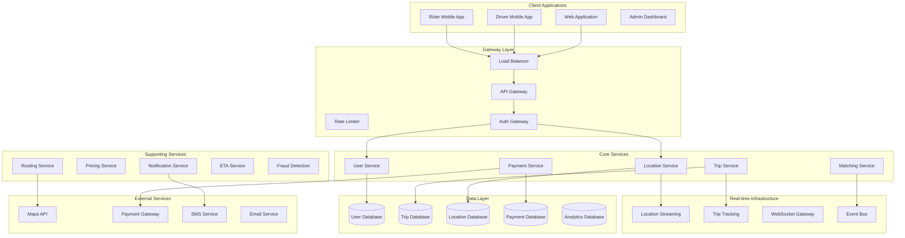
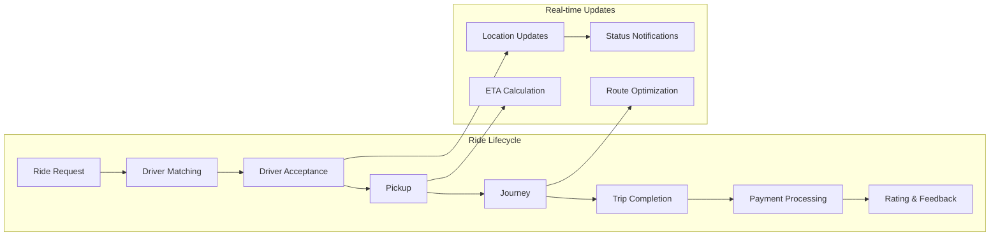
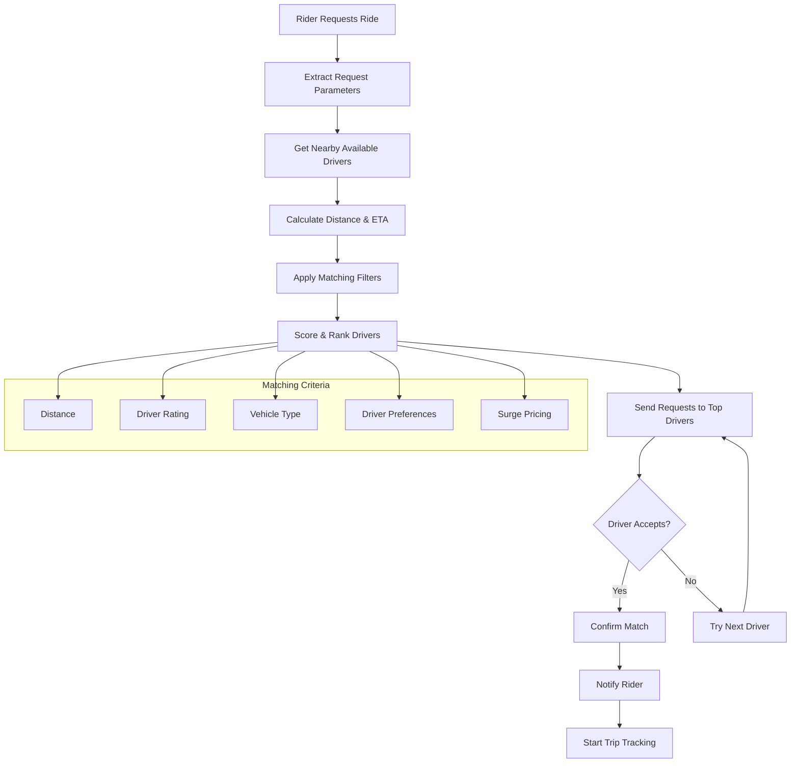
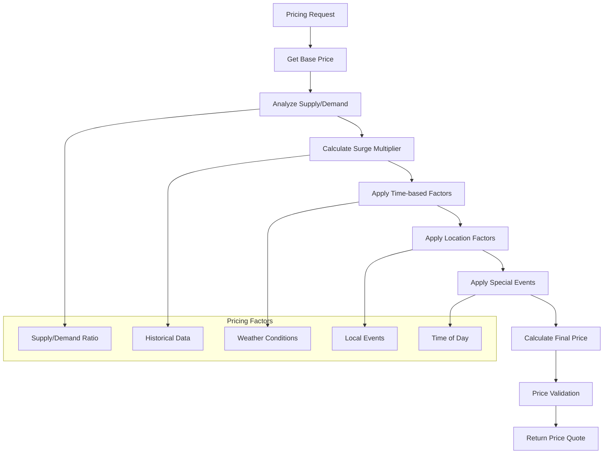
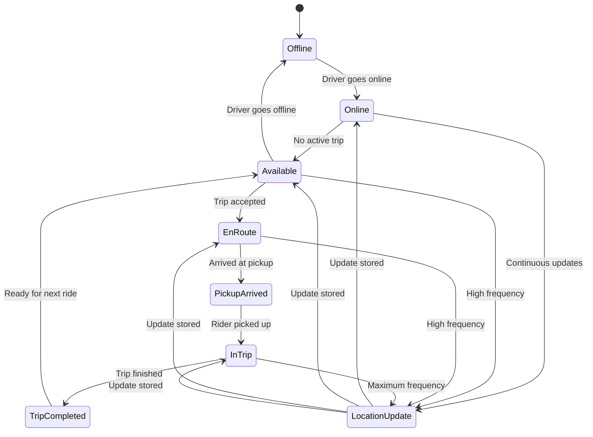
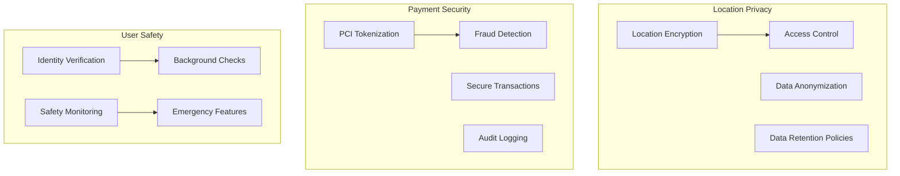

# Ride-Sharing Service Backend (Uber/Lyft)


## 📋 Table of Contents

- [Ride-Sharing Service Backend (Uber/Lyft)](#ride-sharing-service-backend-uberlyft)
  - [Requirements Gathering](#requirements-gathering)
    - [Functional Requirements](#functional-requirements)
    - [Non-Functional Requirements](#non-functional-requirements)
  - [Traffic Estimation & Capacity Planning](#traffic-estimation-capacity-planning)
    - [User Base Analysis](#user-base-analysis)
    - [Traffic Calculations](#traffic-calculations)
  - [Database Schema Design](#database-schema-design)
    - [User Management Schema](#user-management-schema)
    - [Trip Management Schema](#trip-management-schema)
    - [Pricing and Payment Schema](#pricing-and-payment-schema)
  - [Sample API Endpoints](#sample-api-endpoints)
    - [User Registration & Authentication](#user-registration-authentication)
    - [Ride Booking APIs](#ride-booking-apis)
    - [Real-time Location Updates](#real-time-location-updates)
    - [Driver Matching & Trip Management](#driver-matching-trip-management)
    - [Trip Tracking & Navigation](#trip-tracking-navigation)
    - [Payment & Fare Calculation](#payment-fare-calculation)
    - [Rating & Review APIs](#rating-review-apis)
    - [WebSocket Real-time Updates](#websocket-real-time-updates)
  - [High-Level Design (HLD)](#high-level-design-hld)
    - [System Architecture Overview](#system-architecture-overview)
    - [Ride Request Flow](#ride-request-flow)
  - [Low-Level Design (LLD)](#low-level-design-lld)
    - [Driver-Rider Matching Algorithm Flow](#driver-rider-matching-algorithm-flow)
    - [Dynamic Pricing Engine](#dynamic-pricing-engine)
    - [Real-time Location Tracking](#real-time-location-tracking)
  - [Core Algorithms](#core-algorithms)
    - [1. Driver-Rider Matching Algorithm](#1-driver-rider-matching-algorithm)
    - [2. Dynamic Pricing Algorithm](#2-dynamic-pricing-algorithm)
    - [3. Route Optimization and ETA Calculation](#3-route-optimization-and-eta-calculation)
    - [4. Real-time Location Processing](#4-real-time-location-processing)
    - [5. Fraud Detection and Risk Management](#5-fraud-detection-and-risk-management)
  - [Performance Optimizations](#performance-optimizations)
    - [Location Data Processing](#location-data-processing)
    - [Database Scaling](#database-scaling)
  - [Security Considerations](#security-considerations)
    - [Data Protection Framework](#data-protection-framework)
  - [Testing Strategy](#testing-strategy)
    - [Load Testing Scenarios](#load-testing-scenarios)
  - [Trade-offs and Considerations](#trade-offs-and-considerations)
    - [Scalability vs Accuracy](#scalability-vs-accuracy)
    - [Privacy vs Functionality](#privacy-vs-functionality)
    - [Cost vs Performance](#cost-vs-performance)

---

## Requirements Gathering

[⬆️ Back to Top](#--table-of-contents)

---


### Functional Requirements

[⬆️ Back to Top](#--table-of-contents)

---


**Core Ride-Sharing Features:**
- User registration and authentication (riders and drivers)
- Real-time location tracking and updates
- Ride booking and matching algorithm
- Dynamic pricing based on demand and supply
- Multiple ride types (economy, premium, shared, delivery)
- Real-time ETAs and route optimization
- In-app messaging between rider and driver
- Trip history and receipts
- Rating and review system
- Ride cancellation with policies
- Driver background checks and verification
- Vehicle registration and documentation
- Surge pricing during peak hours

**Payment & Billing:**
- Multiple payment methods integration
- Automatic fare calculation
- Split payments between multiple riders
- Driver earnings and payouts
- Promotional codes and discounts
- Toll and airport fee handling
- Subscription plans for frequent users

**Safety & Compliance:**
- Emergency SOS button
- Trip sharing with contacts
- Driver identity verification
- Real-time trip monitoring
- Incident reporting system
- Insurance integration
- Regulatory compliance (local transportation laws)

### Non-Functional Requirements

[⬆️ Back to Top](#--table-of-contents)

---


**Performance:**
- Location updates every 3-5 seconds
- Ride matching within 30 seconds
- Support 10 million daily active users
- Handle 1 million concurrent rides
- Sub-second map rendering
- 99.9% uptime SLA

**Scalability:**
- Horizontal scaling across cities/regions
- Handle traffic spikes during events
- Auto-scaling based on demand patterns
- Support global expansion
- Handle 100x growth in user base

**Reliability:**
- Zero data loss for trips and payments
- Automatic failover for critical services
- Real-time backup and disaster recovery
- Circuit breaker patterns for external APIs
- Graceful degradation during outages

**Security:**
- End-to-end encryption for location data
- PCI compliance for payments
- Personal data protection (GDPR)
- Secure driver-rider communication
- Fraud detection and prevention

## Traffic Estimation & Capacity Planning

[⬆️ Back to Top](#--table-of-contents)

---


### User Base Analysis

[⬆️ Back to Top](#--table-of-contents)

---

- **Total Users:** 50 million registered users (40M riders, 10M drivers)
- **Daily Active Users:** 15 million users (12M riders, 3M drivers)
- **Peak Concurrent Rides:** 1 million rides
- **Average Rides per Day:** 10 million rides
- **Average Trip Duration:** 25 minutes
- **Peak Hours:** 7-9 AM, 5-8 PM (3x traffic)

### Traffic Calculations

[⬆️ Back to Top](#--table-of-contents)

---


**Location Updates:**
```
Driver Location Updates:
- Active drivers during peak = 1M drivers
- Update frequency = every 4 seconds
- Peak location updates = 1M / 4 = 250,000 updates/sec

Rider Location Updates:
- Active riders waiting/in-trip = 2M riders  
- Update frequency = every 5 seconds
- Peak rider updates = 2M / 5 = 400,000 updates/sec

Total Peak Location Updates = 650,000 updates/sec
```

**Ride Operations:**
```
Daily Ride Requests:
- Daily rides = 10M rides/day
- Peak multiplier = 3x
- Peak ride requests = 10M × 3 / (24 × 3600) = 347 requests/sec
- Failed/cancelled requests = 20% additional = 416 requests/sec

Matching Algorithm:
- Average matching attempts per request = 5 drivers
- Peak matching operations = 416 × 5 = 2,080 ops/sec
```

**Storage Requirements:**
```
Trip Data:
- Trip record size = 5KB (route, timing, fare details)
- Daily trip storage = 10M × 5KB = 50GB/day
- Annual storage = 50GB × 365 = 18.25TB/year

Location History:
- Location update size = 100 bytes
- Daily location data = 650K updates/sec × 86400 × 100B = 5.6TB/day
- With 30-day retention = 5.6TB × 30 = 168TB

User Data:
- User profiles = 50M users × 2KB = 100GB
- Driver documents = 10M drivers × 5MB = 50TB
```

**Infrastructure Sizing:**
```
Application Servers:
- Location service: 100 servers
- Matching service: 50 servers
- Trip management: 30 servers
- Payment processing: 20 servers
- Notification service: 25 servers

Database Requirements:
- User database: 20 shards, 32GB RAM each
- Trip database: 100 shards, 64GB RAM each
- Location database: 200 shards, 16GB RAM each
- Analytics database: 50 shards, 128GB RAM each

Cache Infrastructure:
- Redis clusters: 2TB total memory
- Driver location cache: 500GB
- Ride state cache: 300GB
- Route cache: 200GB
- User session cache: 100GB
```

## Database Schema Design

[⬆️ Back to Top](#--table-of-contents)

---


### User Management Schema

[⬆️ Back to Top](#--table-of-contents)

---


```sql
-- Users table (riders and drivers)
CREATE TABLE users (
    user_id BIGINT PRIMARY KEY AUTO_INCREMENT,
    phone_number VARCHAR(20) UNIQUE NOT NULL,
    email VARCHAR(255) UNIQUE,
    password_hash VARCHAR(255) NOT NULL,
    first_name VARCHAR(100) NOT NULL,
    last_name VARCHAR(100) NOT NULL,
    profile_picture_url VARCHAR(512),
    date_of_birth DATE,
    user_type ENUM('rider', 'driver', 'both') NOT NULL,
    registration_city VARCHAR(100),
    preferred_language VARCHAR(10) DEFAULT 'en',
    created_at TIMESTAMP DEFAULT CURRENT_TIMESTAMP,
    updated_at TIMESTAMP DEFAULT CURRENT_TIMESTAMP ON UPDATE CURRENT_TIMESTAMP,
    last_active TIMESTAMP,
    is_active BOOLEAN DEFAULT TRUE,
    verification_status ENUM('pending', 'verified', 'rejected') DEFAULT 'pending',
    
    INDEX idx_phone (phone_number),
    INDEX idx_email (email),
    INDEX idx_user_type (user_type),
    INDEX idx_city (registration_city)
);

-- Driver profiles
CREATE TABLE driver_profiles (
    driver_id BIGINT PRIMARY KEY,
    license_number VARCHAR(50) UNIQUE NOT NULL,
    license_expiry DATE NOT NULL,
    background_check_status ENUM('pending', 'approved', 'rejected') DEFAULT 'pending',
    background_check_date TIMESTAMP,
    driver_rating DECIMAL(3,2) DEFAULT 0.00,
    total_trips INT DEFAULT 0,
    years_experience INT,
    preferred_vehicle_type ENUM('economy', 'premium', 'suv', 'luxury') DEFAULT 'economy',
    home_address_id BIGINT,
    emergency_contact_name VARCHAR(255),
    emergency_contact_phone VARCHAR(20),
    bank_account_id BIGINT,
    tax_info JSON,
    is_online BOOLEAN DEFAULT FALSE,
    current_location POINT,
    last_location_update TIMESTAMP,
    
    INDEX idx_license (license_number),
    INDEX idx_rating (driver_rating),
    INDEX idx_location (current_location),
    INDEX idx_online_status (is_online),
    FOREIGN KEY (driver_id) REFERENCES users(user_id)
);

-- Vehicles table
CREATE TABLE vehicles (
    vehicle_id BIGINT PRIMARY KEY AUTO_INCREMENT,
    driver_id BIGINT NOT NULL,
    make VARCHAR(50) NOT NULL,
    model VARCHAR(50) NOT NULL,
    year YEAR NOT NULL,
    color VARCHAR(30) NOT NULL,
    license_plate VARCHAR(20) UNIQUE NOT NULL,
    vin_number VARCHAR(17) UNIQUE NOT NULL,
    vehicle_type ENUM('economy', 'premium', 'suv', 'luxury') NOT NULL,
    seat_count TINYINT DEFAULT 4,
    insurance_policy_number VARCHAR(100),
    insurance_expiry DATE,
    registration_expiry DATE,
    inspection_expiry DATE,
    is_active BOOLEAN DEFAULT TRUE,
    created_at TIMESTAMP DEFAULT CURRENT_TIMESTAMP,
    
    INDEX idx_driver (driver_id),
    INDEX idx_license_plate (license_plate),
    INDEX idx_vehicle_type (vehicle_type),
    FOREIGN KEY (driver_id) REFERENCES driver_profiles(driver_id)
);
```

### Trip Management Schema

[⬆️ Back to Top](#--table-of-contents)

---


```sql
-- Trips table (sharded by rider_id)
CREATE TABLE trips (
    trip_id BIGINT PRIMARY KEY,
    rider_id BIGINT NOT NULL,
    driver_id BIGINT,
    vehicle_id BIGINT,
    trip_type ENUM('standard', 'shared', 'premium', 'delivery') NOT NULL,
    status ENUM('requested', 'matched', 'accepted', 'started', 'completed', 'cancelled') NOT NULL,
    pickup_location POINT NOT NULL,
    pickup_address TEXT NOT NULL,
    destination_location POINT NOT NULL,
    destination_address TEXT NOT NULL,
    estimated_distance_km DECIMAL(8,2),
    actual_distance_km DECIMAL(8,2),
    estimated_duration_minutes INT,
    actual_duration_minutes INT,
    estimated_fare DECIMAL(10,2),
    actual_fare DECIMAL(10,2),
    surge_multiplier DECIMAL(3,2) DEFAULT 1.00,
    payment_method_id BIGINT,
    payment_status ENUM('pending', 'completed', 'failed', 'refunded') DEFAULT 'pending',
    route_polyline TEXT, -- Encoded route polyline
    requested_at TIMESTAMP DEFAULT CURRENT_TIMESTAMP,
    matched_at TIMESTAMP,
    started_at TIMESTAMP,
    completed_at TIMESTAMP,
    cancelled_at TIMESTAMP,
    cancellation_reason ENUM('rider', 'driver', 'system', 'weather', 'emergency'),
    special_requests TEXT,
    
    INDEX idx_rider_status (rider_id, status),
    INDEX idx_driver_status (driver_id, status),
    INDEX idx_requested_at (requested_at),
    INDEX idx_pickup_location (pickup_location),
    INDEX idx_status (status),
    FOREIGN KEY (rider_id) REFERENCES users(user_id),
    FOREIGN KEY (driver_id) REFERENCES driver_profiles(driver_id),
    FOREIGN KEY (vehicle_id) REFERENCES vehicles(vehicle_id)
);

-- Trip ratings and reviews
CREATE TABLE trip_ratings (
    rating_id BIGINT PRIMARY KEY AUTO_INCREMENT,
    trip_id BIGINT NOT NULL,
    rater_id BIGINT NOT NULL, -- Either rider_id or driver_id
    ratee_id BIGINT NOT NULL, -- Either driver_id or rider_id
    rating TINYINT NOT NULL CHECK (rating BETWEEN 1 AND 5),
    review_text TEXT,
    rating_categories JSON, -- {"cleanliness": 5, "safety": 4, "communication": 5}
    created_at TIMESTAMP DEFAULT CURRENT_TIMESTAMP,
    
    UNIQUE KEY unique_trip_rater (trip_id, rater_id),
    INDEX idx_ratee_rating (ratee_id, rating),
    INDEX idx_trip (trip_id),
    FOREIGN KEY (trip_id) REFERENCES trips(trip_id),
    FOREIGN KEY (rater_id) REFERENCES users(user_id),
    FOREIGN KEY (ratee_id) REFERENCES users(user_id)
);

-- Location tracking
CREATE TABLE location_updates (
    update_id BIGINT PRIMARY KEY AUTO_INCREMENT,
    user_id BIGINT NOT NULL,
    trip_id BIGINT,
    latitude DECIMAL(10,8) NOT NULL,
    longitude DECIMAL(11,8) NOT NULL,
    accuracy_meters DECIMAL(6,2),
    heading DECIMAL(5,2), -- Direction in degrees
    speed_kmh DECIMAL(5,2),
    timestamp TIMESTAMP DEFAULT CURRENT_TIMESTAMP,
    
    INDEX idx_user_timestamp (user_id, timestamp),
    INDEX idx_trip_timestamp (trip_id, timestamp),
    INDEX idx_timestamp (timestamp),
    FOREIGN KEY (user_id) REFERENCES users(user_id),
    FOREIGN KEY (trip_id) REFERENCES trips(trip_id)
) PARTITION BY RANGE (UNIX_TIMESTAMP(timestamp)) (
    PARTITION p_current VALUES LESS THAN (UNIX_TIMESTAMP('2024-02-01')),
    PARTITION p_next VALUES LESS THAN (UNIX_TIMESTAMP('2024-03-01'))
);
```

### Pricing and Payment Schema

[⬆️ Back to Top](#--table-of-contents)

---


```sql
-- Pricing rules
CREATE TABLE pricing_rules (
    rule_id BIGINT PRIMARY KEY AUTO_INCREMENT,
    city_id BIGINT NOT NULL,
    vehicle_type ENUM('economy', 'premium', 'suv', 'luxury') NOT NULL,
    base_fare DECIMAL(8,2) NOT NULL,
    per_km_rate DECIMAL(6,2) NOT NULL,
    per_minute_rate DECIMAL(6,2) NOT NULL,
    minimum_fare DECIMAL(8,2) NOT NULL,
    cancellation_fee DECIMAL(8,2) DEFAULT 0.00,
    effective_from TIMESTAMP NOT NULL,
    effective_until TIMESTAMP,
    is_active BOOLEAN DEFAULT TRUE,
    
    INDEX idx_city_type (city_id, vehicle_type),
    INDEX idx_effective_dates (effective_from, effective_until)
);

-- Surge pricing
CREATE TABLE surge_pricing (
    surge_id BIGINT PRIMARY KEY AUTO_INCREMENT,
    city_id BIGINT NOT NULL,
    area_polygon POLYGON NOT NULL,
    vehicle_type ENUM('economy', 'premium', 'suv', 'luxury') NOT NULL,
    surge_multiplier DECIMAL(3,2) NOT NULL,
    reason ENUM('high_demand', 'low_supply', 'weather', 'event', 'manual') NOT NULL,
    started_at TIMESTAMP DEFAULT CURRENT_TIMESTAMP,
    ended_at TIMESTAMP,
    is_active BOOLEAN DEFAULT TRUE,
    
    INDEX idx_city_area (city_id, area_polygon),
    INDEX idx_active_surge (is_active, started_at),
    SPATIAL INDEX idx_area_polygon (area_polygon)
);
```

## Sample API Endpoints

[⬆️ Back to Top](#--table-of-contents)

---


### User Registration & Authentication

[⬆️ Back to Top](#--table-of-contents)

---


```http
POST /api/v1/auth/register
Content-Type: application/json

{
    "phone_number": "+1234567890",
    "email": "john@example.com",
    "password": "securePassword123",
    "first_name": "John",
    "last_name": "Doe",
    "user_type": "rider",
    "registration_city": "San Francisco"
}

Response (201 Created):
{
    "success": true,
    "data": {
        "user_id": 12345,
        "phone_number": "+1234567890",
        "user_type": "rider",
        "verification_required": true,
        "access_token": "eyJhbGciOiJIUzI1NiIsInR5cCI6IkpXVCJ9...",
        "refresh_token": "eyJhbGciOiJIUzI1NiIsInR5cCI6IkpXVCJ9...",
        "expires_in": 3600
    }
}
```

### Ride Booking APIs

[⬆️ Back to Top](#--table-of-contents)

---


```http
POST /api/v1/rides/request
Authorization: Bearer <access_token>
Content-Type: application/json

{
    "pickup_location": {
        "latitude": 37.7749,
        "longitude": -122.4194,
        "address": "123 Market St, San Francisco, CA"
    },
    "destination_location": {
        "latitude": 37.7849,
        "longitude": -122.4094,
        "address": "456 Mission St, San Francisco, CA"
    },
    "ride_type": "standard",
    "payment_method_id": 67890,
    "special_requests": "Please bring car seat for child"
}

Response (201 Created):
{
    "success": true,
    "data": {
        "trip_id": 98765,
        "status": "requested",
        "estimated_fare": 15.50,
        "surge_multiplier": 1.2,
        "estimated_pickup_time": "2024-01-15T10:35:00Z",
        "estimated_duration": 18,
        "estimated_distance": 5.2,
        "matching_drivers": 12
    }
}
```

### Real-time Location Updates

[⬆️ Back to Top](#--table-of-contents)

---


```http
POST /api/v1/location/update
Authorization: Bearer <access_token>
Content-Type: application/json

{
    "latitude": 37.7749,
    "longitude": -122.4194,
    "accuracy": 5.0,
    "heading": 180.0,
    "speed": 25.5,
    "trip_id": 98765
}

Response (200 OK):
{
    "success": true,
    "data": {
        "location_updated": true,
        "nearest_riders": 3,
        "surge_area": false
    }
}
```

### Driver Matching & Trip Management

[⬆️ Back to Top](#--table-of-contents)

---


```http
GET /api/v1/drivers/nearby?lat=37.7749&lng=-122.4194&radius=5000&vehicle_type=economy
Authorization: Bearer <access_token>

Response (200 OK):
{
    "success": true,
    "data": {
        "available_drivers": [
            {
                "driver_id": 54321,
                "distance_meters": 450,
                "eta_seconds": 180,
                "rating": 4.8,
                "vehicle": {
                    "make": "Toyota",
                    "model": "Camry",
                    "color": "Blue",
                    "license_plate": "ABC123"
                },
                "location": {
                    "latitude": 37.7739,
                    "longitude": -122.4184
                }
            }
        ]
    }
}
```

```http
POST /api/v1/trips/{trip_id}/accept
Authorization: Bearer <driver_access_token>

Response (200 OK):
{
    "success": true,
    "data": {
        "trip_id": 98765,
        "status": "accepted",
        "rider": {
            "first_name": "John",
            "rating": 4.9,
            "phone_masked": "+1***-***-7890"
        },
        "pickup_location": {
            "latitude": 37.7749,
            "longitude": -122.4194,
            "address": "123 Market St, San Francisco, CA"
        },
        "estimated_earnings": 12.40
    }
}
```

### Trip Tracking & Navigation

[⬆️ Back to Top](#--table-of-contents)

---


```http
GET /api/v1/trips/{trip_id}/status
Authorization: Bearer <access_token>

Response (200 OK):
{
    "success": true,
    "data": {
        "trip_id": 98765,
        "status": "started",
        "driver": {
            "first_name": "Sarah",
            "rating": 4.8,
            "phone_masked": "+1***-***-1234",
            "current_location": {
                "latitude": 37.7739,
                "longitude": -122.4184
            }
        },
        "vehicle": {
            "make": "Toyota",
            "model": "Camry",
            "color": "Blue",
            "license_plate": "ABC123"
        },
        "eta_to_pickup": 120,
        "eta_to_destination": 1080,
        "current_fare": 15.50,
        "route_progress": 0.25
    }
}
```

### Payment & Fare Calculation

[⬆️ Back to Top](#--table-of-contents)

---


```http
GET /api/v1/trips/{trip_id}/fare_estimate
Authorization: Bearer <access_token>

Response (200 OK):
{
    "success": true,
    "data": {
        "base_fare": 2.50,
        "distance_fare": 8.60,
        "time_fare": 3.20,
        "surge_multiplier": 1.2,
        "subtotal": 15.50,
        "taxes": 1.24,
        "fees": 0.50,
        "total_fare": 17.24,
        "breakdown": {
            "distance_km": 5.2,
            "duration_minutes": 18,
            "surge_reason": "high_demand"
        }
    }
}
```

### Rating & Review APIs

[⬆️ Back to Top](#--table-of-contents)

---


```http
POST /api/v1/trips/{trip_id}/rating
Authorization: Bearer <access_token>
Content-Type: application/json

{
    "rating": 5,
    "review_text": "Excellent driver, very professional and safe!",
    "categories": {
        "cleanliness": 5,
        "safety": 5,
        "communication": 4,
        "navigation": 5
    }
}

Response (201 Created):
{
    "success": true,
    "data": {
        "rating_id": 11111,
        "trip_id": 98765,
        "rating_submitted": true,
        "driver_new_rating": 4.85
    }
}
```

### WebSocket Real-time Updates

[⬆️ Back to Top](#--table-of-contents)

---


```javascript
// WebSocket connection for real-time updates
const ws = new WebSocket('wss://api.rideshare.com/ws');

// Authentication
ws.send(JSON.stringify({
    type: 'auth',
    token: 'eyJhbGciOiJIUzI1NiIsInR5cCI6IkpXVCJ9...'
}));

// Subscribe to trip updates
ws.send(JSON.stringify({
    type: 'subscribe',
    channel: 'trip_updates',
    trip_id: 98765
}));

// Receive real-time updates
ws.onmessage = (event) => {
    const data = JSON.parse(event.data);
    switch(data.type) {
        case 'driver_location_update':
            // Update driver location on map
            break;
        case 'trip_status_change':
            // Update trip status
            break;
        case 'eta_update':
            // Update estimated arrival time
            break;
        case 'driver_message':
            // Show driver message
            break;
    }
};
```

## High-Level Design (HLD)

[⬆️ Back to Top](#--table-of-contents)

---


### System Architecture Overview

[⬆️ Back to Top](#--table-of-contents)

---




### Ride Request Flow

[⬆️ Back to Top](#--table-of-contents)

---




## Low-Level Design (LLD)

[⬆️ Back to Top](#--table-of-contents)

---


### Driver-Rider Matching Algorithm Flow

[⬆️ Back to Top](#--table-of-contents)

---




### Dynamic Pricing Engine

[⬆️ Back to Top](#--table-of-contents)

---




### Real-time Location Tracking

[⬆️ Back to Top](#--table-of-contents)

---




## Core Algorithms

[⬆️ Back to Top](#--table-of-contents)

---


### 1. Driver-Rider Matching Algorithm

[⬆️ Back to Top](#--table-of-contents)

---


**Purpose**: Efficiently match riders with the best available drivers based on multiple criteria.

**Spatial Indexing for Driver Discovery**:
```
GeohashPrecision = {
  nearby: 7,      // ~150m precision
  local: 6,       // ~1.2km precision  
  city: 5,        // ~4.8km precision
  region: 4       // ~20km precision
}

function findNearbyDrivers(riderLocation, radius = 5000): // 5km default
  riderGeohash = encodeGeohash(riderLocation.lat, riderLocation.lng, GeohashPrecision.local)
  
  // Get neighboring geohash cells
  neighborCells = getNeighborCells(riderGeohash)
  
  candidateDrivers = []
  for cell in neighborCells:
    driversInCell = getDriversInGeohashCell(cell)
    for driver in driversInCell:
      distance = calculateHaversineDistance(riderLocation, driver.location)
      if distance <= radius and driver.status === 'available':
        candidateDrivers.push({
          driver: driver,
          distance: distance,
          lastLocationUpdate: driver.lastLocationUpdate
        })
  
  // Filter out stale location data
  currentTime = Date.now()
  freshDrivers = candidateDrivers.filter(candidate => 
    currentTime - candidate.lastLocationUpdate < 30000 // 30 seconds
  )
  
  return freshDrivers.sort((a, b) => a.distance - b.distance)
```

**Driver Scoring and Ranking Algorithm**:
```
ScoringWeights = {
  distance: 0.35,        // Proximity to rider
  rating: 0.25,          // Driver rating
  acceptanceRate: 0.15,  // Historical acceptance rate
  vehicleType: 0.10,     // Vehicle match for ride type
  eta: 0.10,            // Estimated arrival time
  driverPreference: 0.05 // Driver route preference
}

function scoreDriver(driver, rideRequest, context):
  score = 0
  
  // Distance factor (exponential decay)
  maxDistance = 10000 // 10km
  distanceScore = Math.exp(-driver.distance / 2000) // 2km half-life
  score += distanceScore * ScoringWeights.distance
  
  // Driver rating (normalized 0-1)
  ratingScore = (driver.rating - 3.0) / 2.0 // 3-5 star scale to 0-1
  score += Math.max(0, ratingScore) * ScoringWeights.rating
  
  // Acceptance rate
  acceptanceScore = driver.acceptanceRate / 100
  score += acceptanceScore * ScoringWeights.acceptanceRate
  
  // Vehicle type match
  vehicleScore = calculateVehicleMatch(driver.vehicleType, rideRequest.rideType)
  score += vehicleScore * ScoringWeights.vehicleType
  
  // ETA factor
  eta = calculateETA(driver.location, rideRequest.pickupLocation)
  etaScore = Math.max(0, 1 - eta / 900) // 15 minutes max
  score += etaScore * ScoringWeights.eta
  
  // Driver route preference (if driver has set preferred areas)
  preferenceScore = calculateRoutePreference(driver, rideRequest)
  score += preferenceScore * ScoringWeights.driverPreference
  
  return Math.min(score, 1.0)
```

**Matching Strategy with Timeout Handling**:
```
function executeMatching(rideRequest):
  matchingConfig = {
    maxAttempts: 5,
    timeoutPerAttempt: 15000, // 15 seconds
    expansionRadius: [2000, 5000, 10000, 15000, 20000], // Progressive expansion
    minDriverScore: 0.3
  }
  
  for attempt in range(0, matchingConfig.maxAttempts):
    radius = matchingConfig.expansionRadius[attempt]
    
    // Find drivers in current radius
    nearbyDrivers = findNearbyDrivers(rideRequest.pickupLocation, radius)
    
    if nearbyDrivers.length === 0:
      continue // Expand radius
    
    // Score and rank drivers
    scoredDrivers = nearbyDrivers.map(driverData => ({
      ...driverData,
      score: scoreDriver(driverData.driver, rideRequest, context)
    }))
    
    // Filter by minimum score
    qualifiedDrivers = scoredDrivers.filter(d => d.score >= matchingConfig.minDriverScore)
    
    if qualifiedDrivers.length === 0:
      continue // Expand radius
    
    // Sort by score (descending)
    rankedDrivers = qualifiedDrivers.sort((a, b) => b.score - a.score)
    
    // Try to match with top drivers
    matchResult = attemptDriverMatching(rankedDrivers, rideRequest, matchingConfig.timeoutPerAttempt)
    
    if matchResult.success:
      return matchResult
  
  // No match found
  return { success: false, reason: 'no_available_drivers' }
```

### 2. Dynamic Pricing Algorithm

[⬆️ Back to Top](#--table-of-contents)

---


**Purpose**: Calculate optimal pricing based on supply, demand, and market conditions.

**Supply-Demand Analysis**:
```
function calculateSurgeMultiplier(location, timeWindow = 300000): // 5 minutes
  currentTime = Date.now()
  timeStart = currentTime - timeWindow
  
  // Get supply and demand data
  availableDrivers = countAvailableDriversInArea(location, radius = 5000)
  pendingRequests = countPendingRequestsInArea(location, radius = 5000, timeStart, currentTime)
  completedTrips = countCompletedTripsInArea(location, radius = 5000, timeStart, currentTime)
  
  // Calculate demand indicators
  currentDemand = pendingRequests + (completedTrips / (timeWindow / 60000)) // trips per minute
  
  // Calculate supply-demand ratio
  if availableDrivers === 0:
    supplyDemandRatio = 0
  else:
    supplyDemandRatio = availableDrivers / Math.max(currentDemand, 1)
  
  // Calculate base surge multiplier
  if supplyDemandRatio >= 2.0:
    surgeMultiplier = 1.0 // No surge
  else if supplyDemandRatio >= 1.0:
    surgeMultiplier = 1.0 + (2.0 - supplyDemandRatio) * 0.25 // Gradual increase
  else:
    surgeMultiplier = 1.5 + (1.0 - supplyDemandRatio) * 2.0 // Higher surge
  
  // Cap surge multiplier
  surgeMultiplier = Math.min(surgeMultiplier, 5.0)
  
  return surgeMultiplier
```

**Comprehensive Pricing Calculation**:
```
PricingConfig = {
  baseFare: 2.50,
  perMileRate: 1.75,
  perMinuteRate: 0.35,
  minimumFare: 5.00,
  cancellationFee: 5.00,
  bookingFee: 2.00
}

function calculateTripPrice(rideRequest, route, context):
  // Base calculations
  distance = route.distanceInMiles
  estimatedDuration = route.durationInMinutes
  
  baseFare = PricingConfig.baseFare
  distanceFare = distance * PricingConfig.perMileRate
  timeFare = estimatedDuration * PricingConfig.perMinuteRate
  
  subtotal = baseFare + distanceFare + timeFare
  
  // Apply surge pricing
  surgeMultiplier = calculateSurgeMultiplier(rideRequest.pickupLocation)
  surgedPrice = subtotal * surgeMultiplier
  
  // Apply time-based adjustments
  timeMultiplier = getTimeBasedMultiplier(context.currentTime)
  adjustedPrice = surgedPrice * timeMultiplier
  
  // Apply special event adjustments
  eventMultiplier = getEventMultiplier(rideRequest.pickupLocation, context.currentTime)
  eventAdjustedPrice = adjustedPrice * eventMultiplier
  
  // Apply minimum fare
  finalPrice = Math.max(eventAdjustedPrice, PricingConfig.minimumFare)
  
  // Add fees
  totalPrice = finalPrice + PricingConfig.bookingFee
  
  return {
    baseFare: baseFare,
    distanceFare: distanceFare,
    timeFare: timeFare,
    surgeMultiplier: surgeMultiplier,
    timeMultiplier: timeMultiplier,
    eventMultiplier: eventMultiplier,
    subtotal: subtotal,
    totalPrice: totalPrice,
    breakdown: {
      fare: finalPrice,
      bookingFee: PricingConfig.bookingFee,
      taxes: calculateTaxes(finalPrice, rideRequest.pickupLocation)
    }
  }
```

**Price Optimization with Machine Learning**:
```
function optimizePricing(location, timeOfDay, weatherConditions, historicalData):
  // Feature engineering
  features = {
    hourOfDay: timeOfDay.getHours(),
    dayOfWeek: timeOfDay.getDay(),
    isWeekend: timeOfDay.getDay() >= 5,
    weatherScore: calculateWeatherScore(weatherConditions),
    historicalDemand: getHistoricalDemand(location, timeOfDay),
    nearbyEvents: countNearbyEvents(location, timeOfDay),
    economicIndicator: getLocalEconomicIndicator(location)
  }
  
  // Use trained ML model to predict optimal multiplier
  predictedOptimalMultiplier = pricingModel.predict(features)
  
  // Combine with rule-based surge
  ruleBasedMultiplier = calculateSurgeMultiplier(location)
  
  // Weighted combination (70% ML, 30% rules)
  optimalMultiplier = (predictedOptimalMultiplier * 0.7) + (ruleBasedMultiplier * 0.3)
  
  // Apply safety bounds
  return Math.max(1.0, Math.min(optimalMultiplier, 4.0))
```

### 3. Route Optimization and ETA Calculation

[⬆️ Back to Top](#--table-of-contents)

---


**Purpose**: Provide accurate ETAs and optimal routing for drivers and trip planning.

**Multi-modal ETA Calculation**:
```
ETAFactors = {
  baseRouteTime: 0.60,    // Google Maps estimated time
  trafficConditions: 0.25, // Real-time traffic impact
  driverBehavior: 0.10,   // Historical driver speed patterns
  weatherConditions: 0.05  // Weather impact on driving
}

function calculateAccurateETA(startLocation, endLocation, driverId, context):
  // Get base route from mapping service
  baseRoute = getMapsRoute(startLocation, endLocation)
  baseETA = baseRoute.duration
  
  // Apply traffic conditions
  trafficMultiplier = getTrafficMultiplier(baseRoute.path, context.currentTime)
  trafficAdjustedETA = baseETA * trafficMultiplier
  
  // Apply driver behavior patterns
  if driverId:
    driverProfile = getDriverSpeedProfile(driverId)
    driverMultiplier = driverProfile.averageSpeedRatio
    driverAdjustedETA = trafficAdjustedETA * driverMultiplier
  else:
    driverAdjustedETA = trafficAdjustedETA
  
  // Apply weather conditions
  weatherMultiplier = getWeatherMultiplier(context.weatherConditions)
  weatherAdjustedETA = driverAdjustedETA * weatherMultiplier
  
  // Apply time-of-day patterns
  timeMultiplier = getTimeOfDayMultiplier(context.currentTime, baseRoute.path)
  finalETA = weatherAdjustedETA * timeMultiplier
  
  // Add confidence interval
  confidence = calculateETAConfidence(baseRoute, context)
  
  return {
    estimatedDuration: Math.round(finalETA),
    confidence: confidence,
    route: baseRoute,
    factors: {
      traffic: trafficMultiplier,
      driver: driverMultiplier,
      weather: weatherMultiplier,
      timeOfDay: timeMultiplier
    }
  }
```

**Dynamic Route Reoptimization**:
```
function reoptimizeRoute(tripId, currentLocation, destination, context):
  trip = getTrip(tripId)
  originalRoute = trip.plannedRoute
  
  // Check if reoptimization is needed
  if not shouldReoptimize(currentLocation, originalRoute, context):
    return originalRoute
  
  // Get alternative routes
  alternativeRoutes = getMapsRoutes(currentLocation, destination, {
    alternatives: true,
    avoidTolls: trip.preferences.avoidTolls,
    avoidHighways: trip.preferences.avoidHighways
  })
  
  // Score each route
  scoredRoutes = alternativeRoutes.map(route => ({
    route: route,
    score: scoreRoute(route, trip.preferences, context)
  }))
  
  // Select best route
  bestRoute = scoredRoutes.sort((a, b) => b.score - a.score)[0].route
  
  // Update trip if route changed significantly
  if routeChangeSignificant(originalRoute, bestRoute):
    updateTripRoute(tripId, bestRoute)
    notifyRiderOfRouteChange(trip.riderId, bestRoute)
    
    // Update ETA
    newETA = calculateAccurateETA(currentLocation, destination, trip.driverId, context)
    updateTripETA(tripId, newETA)
  
  return bestRoute
```

### 4. Real-time Location Processing

[⬆️ Back to Top](#--table-of-contents)

---


**Purpose**: Handle high-frequency location updates efficiently and maintain accurate positioning.

**Location Update Processing Pipeline**:
```
LocationUpdateConfig = {
  maxUpdateFrequency: 2000,    // 2 seconds minimum interval
  accuracyThreshold: 50,       // 50 meters minimum accuracy
  speedThreshold: 200,         // 200 km/h maximum reasonable speed
  geofenceRadius: 100          // 100 meters for arrival detection
}

function processLocationUpdate(driverId, locationData):
  // Validate location data
  validation = validateLocationUpdate(locationData)
  if not validation.isValid:
    return { success: false, reason: validation.error }
  
  // Get previous location for comparison
  previousLocation = getLastKnownLocation(driverId)
  
  // Calculate movement metrics
  if previousLocation:
    distance = calculateDistance(previousLocation, locationData)
    timeDelta = locationData.timestamp - previousLocation.timestamp
    speed = calculateSpeed(distance, timeDelta)
    
    // Validate speed (prevent GPS errors)
    if speed > LocationUpdateConfig.speedThreshold:
      return { success: false, reason: 'invalid_speed' }
  
  // Store location update
  storedLocation = storeLocationUpdate(driverId, locationData)
  
  // Update real-time indexes
  updateGeospatialIndex(driverId, locationData)
  
  // Process location-based triggers
  processLocationTriggers(driverId, locationData, previousLocation)
  
  // Broadcast to interested parties
  broadcastLocationUpdate(driverId, locationData)
  
  return { success: true, locationId: storedLocation.id }
```

**Geofencing and Arrival Detection**:
```
function processLocationTriggers(driverId, currentLocation, previousLocation):
  driver = getDriver(driverId)
  
  if driver.status === 'en_route_to_pickup':
    // Check if arrived at pickup location
    trip = getCurrentTrip(driverId)
    pickupDistance = calculateDistance(currentLocation, trip.pickupLocation)
    
    if pickupDistance <= LocationUpdateConfig.geofenceRadius:
      triggerPickupArrival(trip.id, driverId)
  
  else if driver.status === 'in_trip':
    // Check if arrived at destination
    trip = getCurrentTrip(driverId)
    destinationDistance = calculateDistance(currentLocation, trip.destinationLocation)
    
    if destinationDistance <= LocationUpdateConfig.geofenceRadius:
      triggerTripCompletion(trip.id, driverId)
  
  // Check for zone entries/exits (surge zones, airport zones, etc.)
  zones = getActiveZones(currentLocation)
  previousZones = previousLocation ? getActiveZones(previousLocation) : []
  
  enteredZones = zones.filter(zone => not previousZones.includes(zone))
  exitedZones = previousZones.filter(zone => not zones.includes(zone))
  
  for zone in enteredZones:
    triggerZoneEntry(driverId, zone)
  
  for zone in exitedZones:
    triggerZoneExit(driverId, zone)
```

### 5. Fraud Detection and Risk Management

[⬆️ Back to Top](#--table-of-contents)

---


**Purpose**: Detect and prevent fraudulent activities in the platform.

**Trip Fraud Detection**:
```
FraudIndicators = {
  unusualRoute: {
    weight: 0.25,
    threshold: 1.5 // 50% longer than optimal route
  },
  speedViolations: {
    weight: 0.20,
    threshold: 3 // Number of unrealistic speed spikes
  },
  locationJumps: {
    weight: 0.20,
    threshold: 5000 // 5km instantaneous jump
  },
  priceManipulation: {
    weight: 0.15,
    threshold: 2.0 // 2x higher than expected
  },
  userBehavior: {
    weight: 0.20,
    threshold: 0.7 // Behavioral anomaly score
  }
}

function analyzeTripForFraud(tripId):
  trip = getTrip(tripId)
  fraudScore = 0
  indicators = []
  
  // Route analysis
  optimalRoute = calculateOptimalRoute(trip.pickupLocation, trip.destinationLocation)
  actualDistance = trip.actualDistance
  routeDeviation = actualDistance / optimalRoute.distance
  
  if routeDeviation > FraudIndicators.unusualRoute.threshold:
    score = Math.min((routeDeviation - 1) * 0.5, 1.0)
    fraudScore += score * FraudIndicators.unusualRoute.weight
    indicators.push({ type: 'unusual_route', severity: score })
  
  // Speed analysis
  locationUpdates = getTripLocationUpdates(tripId)
  speedViolations = detectSpeedViolations(locationUpdates)
  
  if speedViolations.count > FraudIndicators.speedViolations.threshold:
    score = Math.min(speedViolations.count / 10, 1.0)
    fraudScore += score * FraudIndicators.speedViolations.weight
    indicators.push({ type: 'speed_violations', severity: score })
  
  // Location jump detection
  locationJumps = detectLocationJumps(locationUpdates)
  
  if locationJumps.maxJump > FraudIndicators.locationJumps.threshold:
    score = Math.min(locationJumps.maxJump / 20000, 1.0) // Normalize to 20km
    fraudScore += score * FraudIndicators.locationJumps.weight
    indicators.push({ type: 'location_jumps', severity: score })
  
  // Price analysis
  expectedPrice = calculateExpectedTripPrice(trip)
  priceRatio = trip.totalPrice / expectedPrice
  
  if priceRatio > FraudIndicators.priceManipulation.threshold:
    score = Math.min((priceRatio - 1) * 0.3, 1.0)
    fraudScore += score * FraudIndicators.priceManipulation.weight
    indicators.push({ type: 'price_manipulation', severity: score })
  
  // User behavior analysis
  driverBehaviorScore = analyzeDriverBehavior(trip.driverId, trip)
  riderBehaviorScore = analyzeRiderBehavior(trip.riderId, trip)
  avgBehaviorScore = (driverBehaviorScore + riderBehaviorScore) / 2
  
  if avgBehaviorScore > FraudIndicators.userBehavior.threshold:
    fraudScore += avgBehaviorScore * FraudIndicators.userBehavior.weight
    indicators.push({ type: 'user_behavior', severity: avgBehaviorScore })
  
  return {
    fraudScore: fraudScore,
    riskLevel: categorizeFraudRisk(fraudScore),
    indicators: indicators,
    recommendedActions: getRecommendedActions(fraudScore, indicators)
  }
```

## Performance Optimizations

[⬆️ Back to Top](#--table-of-contents)

---


### Location Data Processing

[⬆️ Back to Top](#--table-of-contents)

---


**Geospatial Indexing**:
```
GeospatialIndex = {
  structure: 'QuadTree',
  maxDepth: 8,
  bucketCapacity: 50,
  updateFrequency: 'real-time'
}
```

**Optimization Strategies**:
- Use Redis Geospatial for driver location indexing
- Implement location update batching for high-frequency updates
- Use time-series databases for location history
- Implement smart caching for frequently accessed routes

### Database Scaling

[⬆️ Back to Top](#--table-of-contents)

---


**Sharding Strategy**:
- User data: Shard by user ID
- Trip data: Shard by geographic region and time
- Location data: Partition by time windows
- Payment data: Shard by user ID with encryption

## Security Considerations

[⬆️ Back to Top](#--table-of-contents)

---


### Data Protection Framework

[⬆️ Back to Top](#--table-of-contents)

---




## Testing Strategy

[⬆️ Back to Top](#--table-of-contents)

---


### Load Testing Scenarios

[⬆️ Back to Top](#--table-of-contents)

---


**Peak Traffic Simulation**:
- Rush hour demand spikes
- Event-driven surge scenarios
- Driver availability fluctuations
- Payment processing volumes

**Real-time Performance Testing**:
- Location update throughput
- Matching algorithm latency
- ETA calculation accuracy
- Route optimization speed

## Trade-offs and Considerations

[⬆️ Back to Top](#--table-of-contents)

---


### Scalability vs Accuracy

[⬆️ Back to Top](#--table-of-contents)

---

- **Location updates**: Frequency vs battery/bandwidth usage
- **Matching algorithm**: Speed vs optimal driver selection
- **ETA calculations**: Accuracy vs computational cost
- **Route optimization**: Real-time updates vs processing overhead

### Privacy vs Functionality

[⬆️ Back to Top](#--table-of-contents)

---

- **Location tracking**: Service quality vs user privacy
- **Data collection**: Personalization vs data minimization
- **Trip history**: Analytics vs user anonymity
- **Driver monitoring**: Safety vs driver privacy

### Cost vs Performance

[⬆️ Back to Top](#--table-of-contents)

---

- **Real-time processing**: Responsiveness vs infrastructure cost
- **Data storage**: Availability vs storage expenses
- **API usage**: Accuracy vs third-party service costs
- **Machine learning**: Optimization vs computational resources

This ride-sharing backend provides a comprehensive foundation for large-scale transportation platforms with features like intelligent matching, dynamic pricing, real-time tracking, and robust fraud detection while maintaining high performance, security, and user safety standards. 