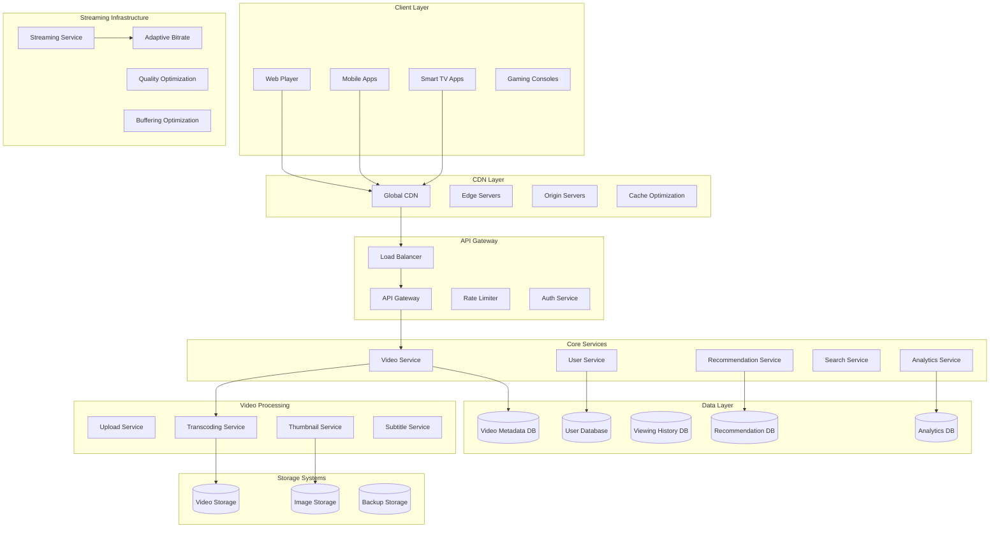
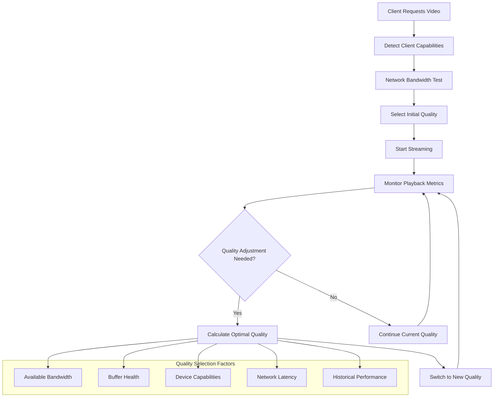
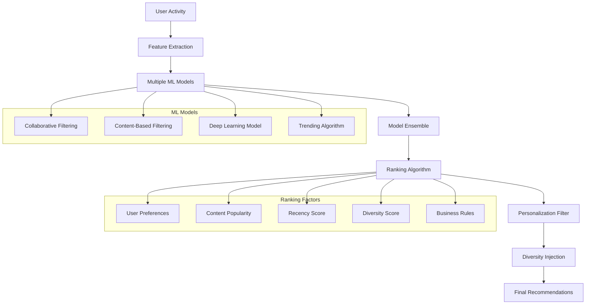
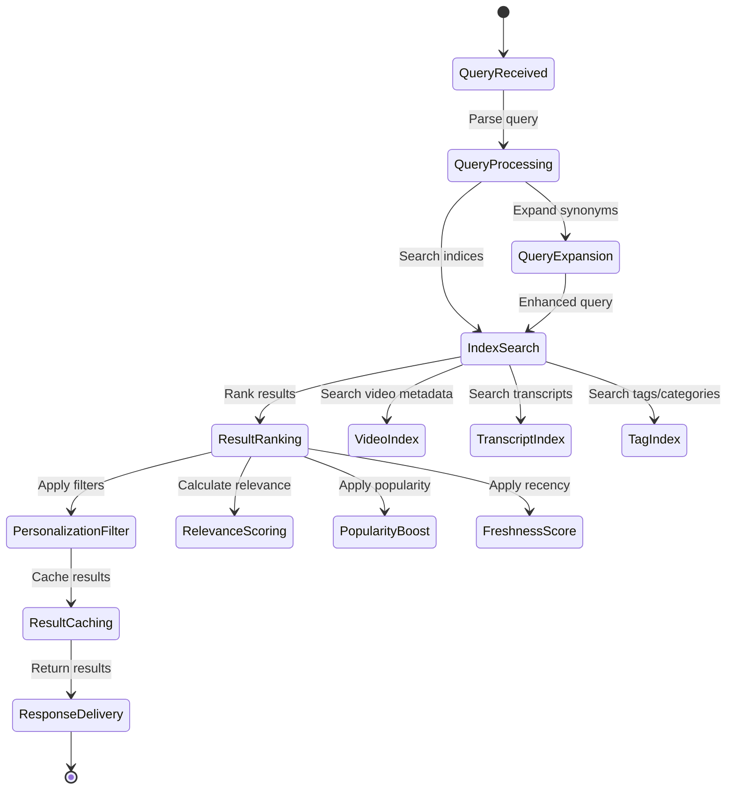
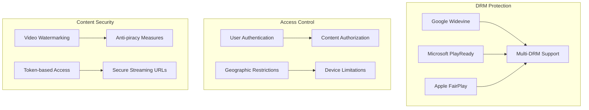

# Video Streaming Backend (YouTube/Netflix)


## 📋 Table of Contents

- [Video Streaming Backend (YouTube/Netflix)](#video-streaming-backend-youtubenetflix)
  - [Requirements Gathering](#requirements-gathering)
    - [Functional Requirements..](#functional-requirements)
    - [Non-Functional Requirements](#non-functional-requirements)
  - [Traffic Estimation & Capacity Planning](#traffic-estimation-capacity-planning)
    - [User Base Analysis](#user-base-analysis)
    - [Traffic Calculations](#traffic-calculations)
  - [Database Schema Design](#database-schema-design)
    - [Video Content Schema](#video-content-schema)
    - [User Interaction Schema](#user-interaction-schema)
    - [Analytics Schema](#analytics-schema)
  - [Sample API Endpoints](#sample-api-endpoints)
    - [Video Upload APIs](#video-upload-apis)
    - [Video Streaming APIs](#video-streaming-apis)
    - [Search & Discovery APIs](#search-discovery-apis)
    - [Recommendation APIs](#recommendation-apis)
    - [Analytics APIs](#analytics-apis)
    - [Live Streaming APIs](#live-streaming-apis)
  - [High-Level Design (HLD)](#high-level-design-hld)
    - [System Architecture Overview](#system-architecture-overview)
    - [Video Processing Pipeline](#video-processing-pipeline)
  - [Low-Level Design (LLD)](#low-level-design-lld)
    - [Adaptive Bitrate Streaming](#adaptive-bitrate-streaming)
    - [Content Recommendation Engine](#content-recommendation-engine)
    - [Video Search Architecture](#video-search-architecture)
  - [Core Algorithms](#core-algorithms)
    - [1. Adaptive Bitrate Selection Algorithm](#1-adaptive-bitrate-selection-algorithm)
    - [2. Content Recommendation Algorithm](#2-content-recommendation-algorithm)
    - [3. Video Search and Discovery Algorithm](#3-video-search-and-discovery-algorithm)
    - [4. Video Transcoding and Optimization](#4-video-transcoding-and-optimization)
    - [5. Content Delivery and Caching Strategy](#5-content-delivery-and-caching-strategy)
  - [Performance Optimizations](#performance-optimizations)
    - [Video Delivery Optimization](#video-delivery-optimization)
    - [Database and Storage Optimization](#database-and-storage-optimization)
  - [Security Considerations](#security-considerations)
    - [Content Protection Framework](#content-protection-framework)
    - [Privacy and Compliance](#privacy-and-compliance)
  - [Testing Strategy](#testing-strategy)
    - [Performance Testing](#performance-testing)
    - [A/B Testing Framework](#ab-testing-framework)
  - [Trade-offs and Considerations](#trade-offs-and-considerations)
    - [Quality vs Bandwidth](#quality-vs-bandwidth)
    - [Personalization vs Privacy](#personalization-vs-privacy)
    - [Scalability vs Cost](#scalability-vs-cost)

---

## Requirements Gathering

[⬆️ Back to Top](#-table-of-contents)

---


### Functional Requirements..

[⬆️ Back to Top](#-table-of-contents)

---


**Core Streaming Features:**
- Upload and encode videos in multiple formats (MP4, WebM, HLS)
- Stream videos with adaptive bitrate streaming
- Support multiple resolutions (240p to 4K)
- Video thumbnails and preview generation
- Video metadata management (title, description, tags)
- Search videos by title, content, and metadata
- User-generated content uploads
- Live streaming capabilities
- Video recommendations and personalization
- Playlist creation and management
- Video comments and interactions
- Video analytics and view tracking

**User Management:**
- User registration and authentication
- User profiles and preferences
- Subscription management (free/premium tiers)
- Watch history and continue watching
- Favorites and watchlist management
- Parental controls and content filtering
- Multi-device synchronization
- Offline download capabilities (mobile)

**Content Management:**
- Content categorization and genres
- Content moderation and policies
- Copyright detection and protection
- Subtitle support in multiple languages
- Chapter markers and timestamps
- Video series and season management
- Content scheduling and publishing

### Non-Functional Requirements

[⬆️ Back to Top](#-table-of-contents)

---


**Performance:**
- Video playback start time < 2 seconds
- Support 100 million concurrent viewers
- 99.9% uptime for streaming service
- Adaptive bitrate switching < 1 second
- Global CDN with edge caching
- Support 4K streaming at 60fps

**Scalability:**
- Horizontal scaling for encoding pipeline
- Handle viral content traffic spikes
- Auto-scaling based on viewership
- Multi-region content distribution
- Support petabytes of video storage

**Reliability:**
- Zero data loss for uploaded content
- Automatic failover for streaming
- Content backup and disaster recovery
- Graceful degradation during outages
- Circuit breaker for external dependencies

**Security:**
- DRM (Digital Rights Management) protection
- Content encryption and secure streaming
- User data privacy and GDPR compliance
- Anti-piracy measures
- Secure content upload and processing

## Traffic Estimation & Capacity Planning

[⬆️ Back to Top](#-table-of-contents)

---


### User Base Analysis

[⬆️ Back to Top](#-table-of-contents)

---

- **Total Users:** 500 million registered users
- **Daily Active Users:** 200 million users
- **Peak Concurrent Viewers:** 100 million users
- **Average Watch Time:** 2 hours per day
- **Video Upload Rate:** 500 hours of content per minute
- **Content Library:** 1 billion hours of video content

### Traffic Calculations

[⬆️ Back to Top](#-table-of-contents)

---


**Video Streaming:**
```
Daily Video Consumption:
- Daily watch hours = 200M users × 2 hours = 400M hours/day
- Peak viewing hours = 400M × 3 / 24 = 50M hours/hour
- Peak concurrent streams = 50M streams

Bandwidth Requirements:
- Average bitrate = 2 Mbps (adaptive streaming)
- Peak bandwidth = 50M streams × 2 Mbps = 100 Tbps
- With CDN distribution = 10 Tbps core bandwidth
```

**Video Upload & Processing:**
```
Daily Uploads:
- Upload rate = 500 hours/minute × 1440 minutes = 720,000 hours/day
- Average video file size = 1GB per hour
- Daily upload storage = 720,000 × 1GB = 720TB/day

Encoding Pipeline:
- Videos requiring encoding = 720,000 videos/day
- Multiple format encoding = 720,000 × 5 formats = 3.6M encoding jobs/day
- Peak encoding rate = 3.6M / (24 × 3600) = 42 jobs/sec
```

**Storage Requirements:**
```
Video Content Storage:
- Raw video storage = 720TB/day
- Encoded formats (5x) = 720TB × 5 = 3.6PB/day
- Annual storage growth = 3.6PB × 365 = 1.3EB/year

Metadata and Thumbnails:
- Video metadata = 720,000 videos × 10KB = 7.2GB/day
- Thumbnails = 720,000 videos × 500KB = 360GB/day
- User data and preferences = 500M users × 5KB = 2.5TB
```

**Infrastructure Sizing:**
```
Application Servers:
- Video streaming API: 200 servers
- Upload service: 100 servers
- Search service: 50 servers
- Recommendation engine: 150 servers
- User management: 30 servers

Database Requirements:
- Video metadata DB: 500 shards, 32GB RAM each
- User database: 100 shards, 64GB RAM each
- Analytics database: 200 shards, 128GB RAM each
- Search index: 50 shards, 256GB RAM each

Storage Infrastructure:
- Video storage: 10EB distributed storage
- CDN edge caches: 100TB per location (1000+ locations)
- Database storage: 500TB
- Search index storage: 50TB

Encoding Infrastructure:
- GPU encoding servers: 1000 servers
- CPU encoding servers: 500 servers
- Queue processing: 50 servers
```

## Database Schema Design

[⬆️ Back to Top](#-table-of-contents)

---


### Video Content Schema

[⬆️ Back to Top](#-table-of-contents)

---


```sql
-- Videos table (sharded by video_id)
CREATE TABLE videos (
    video_id BIGINT PRIMARY KEY,
    uploader_id BIGINT NOT NULL,
    title VARCHAR(255) NOT NULL,
    description TEXT,
    duration_seconds INT NOT NULL,
    file_size_bytes BIGINT NOT NULL,
    original_filename VARCHAR(255),
    upload_date TIMESTAMP DEFAULT CURRENT_TIMESTAMP,
    publish_date TIMESTAMP,
    status ENUM('uploading', 'processing', 'published', 'private', 'deleted') NOT NULL,
    category_id INT,
    language_code VARCHAR(5) DEFAULT 'en',
    tags JSON,
    view_count BIGINT DEFAULT 0,
    like_count INT DEFAULT 0,
    dislike_count INT DEFAULT 0,
    comment_count INT DEFAULT 0,
    is_monetized BOOLEAN DEFAULT FALSE,
    age_restriction ENUM('none', '13+', '18+') DEFAULT 'none',
    content_rating VARCHAR(10),
    visibility ENUM('public', 'unlisted', 'private') DEFAULT 'public',
    thumbnail_url VARCHAR(512),
    preview_url VARCHAR(512),
    
    INDEX idx_uploader_status (uploader_id, status),
    INDEX idx_category_publish (category_id, publish_date),
    INDEX idx_status_publish (status, publish_date),
    INDEX idx_view_count (view_count DESC),
    FOREIGN KEY (uploader_id) REFERENCES users(user_id)
);

-- Video formats and quality variants
CREATE TABLE video_formats (
    format_id BIGINT PRIMARY KEY AUTO_INCREMENT,
    video_id BIGINT NOT NULL,
    resolution ENUM('144p', '240p', '360p', '480p', '720p', '1080p', '1440p', '2160p') NOT NULL,
    bitrate_kbps INT NOT NULL,
    format_type ENUM('mp4', 'webm', 'hls', 'dash') NOT NULL,
    codec VARCHAR(20) NOT NULL,
    file_size_bytes BIGINT NOT NULL,
    storage_url VARCHAR(512) NOT NULL,
    cdn_url VARCHAR(512),
    encoding_status ENUM('pending', 'processing', 'completed', 'failed') DEFAULT 'pending',
    created_at TIMESTAMP DEFAULT CURRENT_TIMESTAMP,
    
    UNIQUE KEY unique_video_resolution_format (video_id, resolution, format_type),
    INDEX idx_video_resolution (video_id, resolution),
    INDEX idx_encoding_status (encoding_status),
    FOREIGN KEY (video_id) REFERENCES videos(video_id)
);

-- Video categories and genres
CREATE TABLE video_categories (
    category_id INT PRIMARY KEY AUTO_INCREMENT,
    name VARCHAR(100) UNIQUE NOT NULL,
    parent_category_id INT,
    description TEXT,
    is_active BOOLEAN DEFAULT TRUE,
    
    INDEX idx_parent_category (parent_category_id),
    FOREIGN KEY (parent_category_id) REFERENCES video_categories(category_id)
);
```

### User Interaction Schema

[⬆️ Back to Top](#-table-of-contents)

---


```sql
-- User watch history
CREATE TABLE watch_history (
    history_id BIGINT PRIMARY KEY AUTO_INCREMENT,
    user_id BIGINT NOT NULL,
    video_id BIGINT NOT NULL,
    watch_timestamp TIMESTAMP DEFAULT CURRENT_TIMESTAMP,
    watch_duration_seconds INT NOT NULL,
    progress_seconds INT NOT NULL, -- How far they watched
    device_type ENUM('web', 'mobile', 'tv', 'tablet') NOT NULL,
    quality_watched ENUM('144p', '240p', '360p', '480p', '720p', '1080p', '1440p', '2160p'),
    location_country VARCHAR(2),
    session_id VARCHAR(128),
    
    INDEX idx_user_timestamp (user_id, watch_timestamp),
    INDEX idx_video_timestamp (video_id, watch_timestamp),
    INDEX idx_session (session_id),
    FOREIGN KEY (user_id) REFERENCES users(user_id),
    FOREIGN KEY (video_id) REFERENCES videos(video_id)
) PARTITION BY RANGE (UNIX_TIMESTAMP(watch_timestamp)) (
    PARTITION p_2024_01 VALUES LESS THAN (UNIX_TIMESTAMP('2024-02-01')),
    PARTITION p_2024_02 VALUES LESS THAN (UNIX_TIMESTAMP('2024-03-01'))
);

-- User subscriptions (channels)
CREATE TABLE subscriptions (
    subscription_id BIGINT PRIMARY KEY AUTO_INCREMENT,
    subscriber_id BIGINT NOT NULL,
    channel_id BIGINT NOT NULL,
    subscribed_at TIMESTAMP DEFAULT CURRENT_TIMESTAMP,
    notification_enabled BOOLEAN DEFAULT TRUE,
    
    UNIQUE KEY unique_subscriber_channel (subscriber_id, channel_id),
    INDEX idx_subscriber (subscriber_id),
    INDEX idx_channel (channel_id),
    FOREIGN KEY (subscriber_id) REFERENCES users(user_id),
    FOREIGN KEY (channel_id) REFERENCES users(user_id)
);

-- Video likes/dislikes
CREATE TABLE video_reactions (
    reaction_id BIGINT PRIMARY KEY AUTO_INCREMENT,
    user_id BIGINT NOT NULL,
    video_id BIGINT NOT NULL,
    reaction_type ENUM('like', 'dislike') NOT NULL,
    created_at TIMESTAMP DEFAULT CURRENT_TIMESTAMP,
    
    UNIQUE KEY unique_user_video (user_id, video_id),
    INDEX idx_video_reaction (video_id, reaction_type),
    INDEX idx_user_reactions (user_id, created_at),
    FOREIGN KEY (user_id) REFERENCES users(user_id),
    FOREIGN KEY (video_id) REFERENCES videos(video_id)
);

-- Playlists
CREATE TABLE playlists (
    playlist_id BIGINT PRIMARY KEY AUTO_INCREMENT,
    user_id BIGINT NOT NULL,
    title VARCHAR(255) NOT NULL,
    description TEXT,
    visibility ENUM('public', 'unlisted', 'private') DEFAULT 'public',
    video_count INT DEFAULT 0,
    total_duration_seconds BIGINT DEFAULT 0,
    created_at TIMESTAMP DEFAULT CURRENT_TIMESTAMP,
    updated_at TIMESTAMP DEFAULT CURRENT_TIMESTAMP ON UPDATE CURRENT_TIMESTAMP,
    
    INDEX idx_user_created (user_id, created_at),
    INDEX idx_visibility (visibility),
    FOREIGN KEY (user_id) REFERENCES users(user_id)
);

-- Playlist videos
CREATE TABLE playlist_videos (
    playlist_video_id BIGINT PRIMARY KEY AUTO_INCREMENT,
    playlist_id BIGINT NOT NULL,
    video_id BIGINT NOT NULL,
    position INT NOT NULL,
    added_at TIMESTAMP DEFAULT CURRENT_TIMESTAMP,
    
    UNIQUE KEY unique_playlist_video (playlist_id, video_id),
    INDEX idx_playlist_position (playlist_id, position),
    INDEX idx_video_playlists (video_id),
    FOREIGN KEY (playlist_id) REFERENCES playlists(playlist_id),
    FOREIGN KEY (video_id) REFERENCES videos(video_id)
);
```

### Analytics Schema

[⬆️ Back to Top](#-table-of-contents)

---


```sql
-- Video analytics (aggregated daily)
CREATE TABLE video_analytics_daily (
    analytics_id BIGINT PRIMARY KEY AUTO_INCREMENT,
    video_id BIGINT NOT NULL,
    date DATE NOT NULL,
    view_count INT DEFAULT 0,
    unique_viewers INT DEFAULT 0,
    watch_time_seconds BIGINT DEFAULT 0,
    avg_view_duration_seconds INT DEFAULT 0,
    like_count INT DEFAULT 0,
    dislike_count INT DEFAULT 0,
    comment_count INT DEFAULT 0,
    share_count INT DEFAULT 0,
    subscriber_gain INT DEFAULT 0,
    revenue_usd DECIMAL(10,2) DEFAULT 0.00,
    top_traffic_source VARCHAR(100),
    top_geography VARCHAR(2),
    
    UNIQUE KEY unique_video_date (video_id, date),
    INDEX idx_video_date (video_id, date),
    INDEX idx_date (date),
    FOREIGN KEY (video_id) REFERENCES videos(video_id)
);

-- Real-time streaming metrics
CREATE TABLE streaming_metrics (
    metric_id BIGINT PRIMARY KEY AUTO_INCREMENT,
    video_id BIGINT NOT NULL,
    timestamp TIMESTAMP DEFAULT CURRENT_TIMESTAMP,
    concurrent_viewers INT NOT NULL,
    bandwidth_mbps DECIMAL(10,2) NOT NULL,
    cdn_hits INT DEFAULT 0,
    cdn_misses INT DEFAULT 0,
    error_count INT DEFAULT 0,
    avg_startup_time_ms INT,
    avg_buffering_ratio DECIMAL(5,4),
    
    INDEX idx_video_timestamp (video_id, timestamp),
    INDEX idx_timestamp (timestamp),
    FOREIGN KEY (video_id) REFERENCES videos(video_id)
) PARTITION BY RANGE (UNIX_TIMESTAMP(timestamp)) (
    PARTITION p_current VALUES LESS THAN (UNIX_TIMESTAMP('2024-02-01')),
    PARTITION p_next VALUES LESS THAN (UNIX_TIMESTAMP('2024-03-01'))
);
```

## Sample API Endpoints

[⬆️ Back to Top](#-table-of-contents)

---


### Video Upload APIs

[⬆️ Back to Top](#-table-of-contents)

---


```http
POST /api/v1/videos/upload-url
Authorization: Bearer <access_token>
Content-Type: application/json

{
    "filename": "my_video.mp4",
    "file_size": 104857600,
    "content_type": "video/mp4",
    "duration": 300
}

Response (201 Created):
{
    "success": true,
    "data": {
        "upload_id": "upload_abc123",
        "upload_url": "https://upload.example.com/v1/upload?token=xyz789",
        "video_id": 12345,
        "expires_at": "2024-01-15T11:30:00Z",
        "chunk_size": 5242880
    }
}
```

```http
POST /api/v1/videos/{video_id}/metadata
Authorization: Bearer <access_token>
Content-Type: application/json

{
    "title": "Amazing Nature Documentary",
    "description": "A beautiful journey through national parks...",
    "category_id": 15,
    "tags": ["nature", "documentary", "wildlife", "4k"],
    "visibility": "public",
    "language": "en",
    "thumbnail_timestamp": 30
}

Response (200 OK):
{
    "success": true,
    "data": {
        "video_id": 12345,
        "title": "Amazing Nature Documentary",
        "status": "processing",
        "estimated_processing_time": "15 minutes",
        "thumbnail_url": "https://cdn.example.com/thumbnails/12345.jpg"
    }
}
```

### Video Streaming APIs

[⬆️ Back to Top](#-table-of-contents)

---


```http
GET /api/v1/videos/{video_id}/manifest.m3u8
User-Agent: Mozilla/5.0...
X-Forwarded-For: 192.168.1.1

Response (200 OK):
Content-Type: application/vnd.apple.mpegurl

#EXTM3U
#EXT-X-VERSION:3
#EXT-X-STREAM-INF:BANDWIDTH=800000,RESOLUTION=854x480
https://cdn.example.com/videos/12345/480p/playlist.m3u8
#EXT-X-STREAM-INF:BANDWIDTH=1200000,RESOLUTION=1280x720
https://cdn.example.com/videos/12345/720p/playlist.m3u8
#EXT-X-STREAM-INF:BANDWIDTH=3000000,RESOLUTION=1920x1080
https://cdn.example.com/videos/12345/1080p/playlist.m3u8
```

```http
GET /api/v1/videos/{video_id}
Authorization: Bearer <access_token>

Response (200 OK):
{
    "success": true,
    "data": {
        "video_id": 12345,
        "title": "Amazing Nature Documentary",
        "description": "A beautiful journey through national parks...",
        "duration": 300,
        "view_count": 1547829,
        "like_count": 25847,
        "dislike_count": 392,
        "upload_date": "2024-01-10T14:30:00Z",
        "channel": {
            "channel_id": 67890,
            "name": "Nature Explorer",
            "subscriber_count": 2500000,
            "is_subscribed": false
        },
        "formats": [
            {
                "quality": "1080p",
                "bitrate": 3000,
                "format": "mp4",
                "url": "https://cdn.example.com/videos/12345/1080p.mp4"
            }
        ],
        "thumbnails": [
            {
                "url": "https://cdn.example.com/thumbnails/12345_720.jpg",
                "width": 1280,
                "height": 720
            }
        ],
        "captions": [
            {
                "language": "en",
                "url": "https://cdn.example.com/captions/12345_en.vtt"
            }
        ]
    }
}
```

### Search & Discovery APIs

[⬆️ Back to Top](#-table-of-contents)

---


```http
GET /api/v1/search?q=nature documentary&type=video&limit=20&order=relevance
Authorization: Bearer <access_token>

Response (200 OK):
{
    "success": true,
    "data": {
        "query": "nature documentary",
        "total_results": 15420,
        "videos": [
            {
                "video_id": 12345,
                "title": "Amazing Nature Documentary",
                "thumbnail": "https://cdn.example.com/thumbnails/12345.jpg",
                "duration": 300,
                "view_count": 1547829,
                "upload_date": "2024-01-10T14:30:00Z",
                "channel": {
                    "name": "Nature Explorer",
                    "subscriber_count": 2500000
                }
            }
        ],
        "suggestions": ["wildlife documentary", "national parks", "nature 4k"],
        "filters": {
            "duration": ["short", "medium", "long"],
            "upload_date": ["today", "week", "month", "year"],
            "quality": ["4k", "hd", "any"]
        }
    }
}
```

### Recommendation APIs

[⬆️ Back to Top](#-table-of-contents)

---


```http
GET /api/v1/users/{user_id}/recommendations?limit=20&type=homepage
Authorization: Bearer <access_token>

Response (200 OK):
{
    "success": true,
    "data": {
        "sections": [
            {
                "title": "Recommended for you",
                "type": "personalized",
                "videos": [
                    {
                        "video_id": 12345,
                        "title": "Amazing Nature Documentary",
                        "thumbnail": "https://cdn.example.com/thumbnails/12345.jpg",
                        "duration": 300,
                        "view_count": 1547829,
                        "recommendation_score": 0.95,
                        "reason": "Based on your viewing history"
                    }
                ]
            },
            {
                "title": "Trending Now",
                "type": "trending",
                "videos": [...]
            },
            {
                "title": "Your Subscriptions",
                "type": "subscriptions",
                "videos": [...]
            }
        ]
    }
}
```

### Analytics APIs

[⬆️ Back to Top](#-table-of-contents)

---


```http
GET /api/v1/videos/{video_id}/analytics?period=30d
Authorization: Bearer <creator_access_token>

Response (200 OK):
{
    "success": true,
    "data": {
        "video_id": 12345,
        "period": "30d",
        "summary": {
            "total_views": 1547829,
            "unique_viewers": 892475,
            "watch_time_hours": 128985,
            "average_view_duration": 240,
            "like_rate": 6.2,
            "subscriber_gain": 12457,
            "revenue_usd": 3247.85
        },
        "daily_stats": [
            {
                "date": "2024-01-15",
                "views": 45829,
                "watch_time_hours": 3892,
                "revenue_usd": 98.23
            }
        ],
        "demographics": {
            "age_groups": {
                "18-24": 35.2,
                "25-34": 28.7,
                "35-44": 22.1
            },
            "geography": {
                "US": 42.5,
                "CA": 12.3,
                "UK": 8.7
            }
        },
        "traffic_sources": {
            "youtube_search": 45.2,
            "suggested_videos": 32.1,
            "external": 12.8,
            "direct": 9.9
        }
    }
}
```

### Live Streaming APIs

[⬆️ Back to Top](#-table-of-contents)

---


```http
POST /api/v1/streams/create
Authorization: Bearer <access_token>
Content-Type: application/json

{
    "title": "Live Q&A Session",
    "description": "Join me for a live Q&A about nature photography",
    "category_id": 15,
    "scheduled_start": "2024-01-15T20:00:00Z",
    "privacy": "public"
}

Response (201 Created):
{
    "success": true,
    "data": {
        "stream_id": "stream_xyz789",
        "stream_key": "YOUR_STREAM_KEY_HERE",
        "rtmp_url": "rtmp://live.example.com/live",
        "hls_url": "https://live.example.com/streams/xyz789/playlist.m3u8",
        "status": "created",
        "viewer_count": 0
    }
}
```

## High-Level Design (HLD)

[⬆️ Back to Top](#-table-of-contents)

---


### System Architecture Overview

[⬆️ Back to Top](#-table-of-contents)

---




### Video Processing Pipeline

[⬆️ Back to Top](#-table-of-contents)

---


## Low-Level Design (LLD)

[⬆️ Back to Top](#-table-of-contents)

---


### Adaptive Bitrate Streaming

[⬆️ Back to Top](#-table-of-contents)

---




### Content Recommendation Engine

[⬆️ Back to Top](#-table-of-contents)

---




### Video Search Architecture

[⬆️ Back to Top](#-table-of-contents)

---




## Core Algorithms

[⬆️ Back to Top](#-table-of-contents)

---


### 1. Adaptive Bitrate Selection Algorithm

[⬆️ Back to Top](#-table-of-contents)

---


**Purpose**: Dynamically adjust video quality based on network conditions and device capabilities.

**Quality Level Configuration**:
```
QualityLevels = {
  "2160p": { resolution: "3840x2160", bitrate: 25000000, minBandwidth: 35000000 },
  "1440p": { resolution: "2560x1440", bitrate: 16000000, minBandwidth: 22000000 },
  "1080p": { resolution: "1920x1080", bitrate: 8000000,  minBandwidth: 12000000 },
  "720p":  { resolution: "1280x720",  bitrate: 5000000,  minBandwidth: 7000000 },
  "480p":  { resolution: "854x480",   bitrate: 2500000,  minBandwidth: 3500000 },
  "360p":  { resolution: "640x360",   bitrate: 1000000,  minBandwidth: 1500000 },
  "240p":  { resolution: "426x240",   bitrate: 500000,   minBandwidth: 750000 }
}

BitrateConfig = {
  bufferHealthThresholds: {
    critical: 2,      // 2 seconds
    low: 5,           // 5 seconds
    healthy: 10,      // 10 seconds
    high: 20          // 20 seconds
  },
  switchingPolicy: {
    upwardSwitchDelay: 5000,     // 5 seconds stability before upgrading
    downwardSwitchDelay: 1000,   // 1 second for immediate downgrade
    bandwidthSafetyMargin: 1.2   // 20% safety margin
  }
}
```

**Bitrate Selection Algorithm**:
```
function selectOptimalBitrate(currentMetrics, playerState):
  // Get current network and playback metrics
  availableBandwidth = currentMetrics.bandwidth
  bufferHealth = currentMetrics.bufferLevel
  lastSwitchTime = playerState.lastQualitySwitchTime
  currentQuality = playerState.currentQuality
  
  // Calculate bandwidth-based quality
  bandwidthBasedQuality = getBandwidthBasedQuality(availableBandwidth)
  
  // Adjust based on buffer health
  bufferAdjustedQuality = adjustForBufferHealth(bandwidthBasedQuality, bufferHealth)
  
  // Apply device capability constraints
  deviceConstrainedQuality = applyDeviceConstraints(bufferAdjustedQuality, playerState.deviceInfo)
  
  // Apply switching policy (avoid oscillation)
  finalQuality = applySwitchingPolicy(
    deviceConstrainedQuality, 
    currentQuality, 
    lastSwitchTime
  )
  
  return finalQuality

function getBandwidthBasedQuality(bandwidth):
  // Find highest quality that bandwidth can support
  for quality in QualityLevels (descending order):
    requiredBandwidth = QualityLevels[quality].minBandwidth * BitrateConfig.switchingPolicy.bandwidthSafetyMargin
    if bandwidth >= requiredBandwidth:
      return quality
  
  return "240p" // Fallback to lowest quality

function adjustForBufferHealth(quality, bufferLevel):
  if bufferLevel < BitrateConfig.bufferHealthThresholds.critical:
    // Critical buffer, drop to lowest quality immediately
    return "240p"
  
  else if bufferLevel < BitrateConfig.bufferHealthThresholds.low:
    // Low buffer, consider downgrading
    currentIndex = getQualityIndex(quality)
    return getQualityByIndex(Math.min(currentIndex + 2, maxQualityIndex)) // Drop 2 levels
  
  else if bufferLevel > BitrateConfig.bufferHealthThresholds.high:
    // High buffer, consider upgrading
    currentIndex = getQualityIndex(quality)
    return getQualityByIndex(Math.max(currentIndex - 1, 0)) // Upgrade 1 level
  
  return quality // Keep current quality
```

**Bandwidth Estimation Algorithm**:
```
BandwidthEstimator = {
  measurementWindow: 10000,    // 10 seconds
  minMeasurements: 3,
  smoothingFactor: 0.8,        // Exponential smoothing
  outlierThreshold: 2.0        // 2x standard deviation
}

function estimateBandwidth(downloadHistory):
  currentTime = Date.now()
  recentDownloads = downloadHistory.filter(download => 
    currentTime - download.timestamp < BandwidthEstimator.measurementWindow
  )
  
  if recentDownloads.length < BandwidthEstimator.minMeasurements:
    return null // Insufficient data
  
  // Calculate throughput for each download
  throughputs = recentDownloads.map(download => 
    (download.bytesDownloaded * 8) / download.durationMs * 1000 // bits per second
  )
  
  // Remove outliers
  filteredThroughputs = removeOutliers(throughputs)
  
  // Calculate weighted average (recent measurements have higher weight)
  weightedBandwidth = calculateWeightedAverage(filteredThroughputs, recentDownloads)
  
  // Apply exponential smoothing with previous estimate
  if previousBandwidthEstimate:
    smoothedBandwidth = (
      BandwidthEstimator.smoothingFactor * previousBandwidthEstimate +
      (1 - BandwidthEstimator.smoothingFactor) * weightedBandwidth
    )
  else:
    smoothedBandwidth = weightedBandwidth
  
  return smoothedBandwidth
```

### 2. Content Recommendation Algorithm

[⬆️ Back to Top](#-table-of-contents)

---


**Purpose**: Provide personalized video recommendations using multiple machine learning models.

**User Profile Construction**:
```
UserProfile = {
  preferences: {
    genres: Map<string, number>,      // Genre preferences with scores
    topics: Map<string, number>,      // Topic interests
    languages: Map<string, number>,   // Language preferences
    contentTypes: Map<string, number> // Video types (movie, series, etc.)
  },
  behavior: {
    watchTime: Map<string, number>,   // Average watch time by category
    completionRate: Map<string, number>, // Completion rates
    timeOfDay: Map<number, number>,   // Viewing patterns by hour
    deviceUsage: Map<string, number>  // Device preferences
  },
  social: {
    following: string[],              // Followed creators/channels
    likes: string[],                  // Liked videos
    shares: string[],                 // Shared videos
    comments: number                  // Comment activity level
  }
}

function buildUserProfile(userId, timeWindow = 90 * 24 * 3600 * 1000): // 90 days
  viewingHistory = getViewingHistory(userId, timeWindow)
  interactionHistory = getInteractionHistory(userId, timeWindow)
  
  profile = new UserProfile()
  
  // Analyze viewing patterns
  for view in viewingHistory:
    video = getVideoMetadata(view.videoId)
    
    // Update genre preferences
    for genre in video.genres:
      profile.preferences.genres[genre] = (profile.preferences.genres[genre] || 0) + view.watchDuration / video.duration
    
    // Update topic interests
    for topic in video.topics:
      profile.preferences.topics[topic] = (profile.preferences.topics[topic] || 0) + 1
    
    // Update language preferences
    profile.preferences.languages[video.language] = (profile.preferences.languages[video.language] || 0) + 1
    
    // Update behavioral patterns
    hour = new Date(view.timestamp).getHours()
    profile.behavior.timeOfDay[hour] = (profile.behavior.timeOfDay[hour] || 0) + 1
    
    // Update completion rates
    completionRate = view.watchDuration / video.duration
    category = video.primaryCategory
    profile.behavior.completionRate[category] = updateMovingAverage(
      profile.behavior.completionRate[category], 
      completionRate
    )
  
  // Analyze social interactions
  for interaction in interactionHistory:
    if interaction.type === 'like':
      profile.social.likes.push(interaction.videoId)
    else if interaction.type === 'share':
      profile.social.shares.push(interaction.videoId)
    else if interaction.type === 'comment':
      profile.social.comments++
  
  // Normalize scores
  normalizeProfileScores(profile)
  
  return profile
```

**Multi-Model Recommendation Engine**:
```
RecommendationModels = {
  collaborativeFiltering: {
    weight: 0.35,
    type: 'matrix_factorization',
    factors: 100,
    regularization: 0.01
  },
  contentBased: {
    weight: 0.25,
    type: 'cosine_similarity',
    features: ['genres', 'topics', 'language', 'duration']
  },
  deepLearning: {
    weight: 0.25,
    type: 'neural_collaborative_filtering',
    embedding_size: 50,
    hidden_layers: [128, 64, 32]
  },
  trending: {
    weight: 0.15,
    type: 'popularity_based',
    timeDecay: 0.95,
    regionWeight: 0.3
  }
}

function generateRecommendations(userId, numRecommendations = 50):
  userProfile = getUserProfile(userId)
  candidateVideos = getCandidateVideos(userId)
  
  recommendations = new Map()
  
  // Collaborative Filtering
  cfScores = collaborativeFilteringModel.predict(userId, candidateVideos)
  for video, score in cfScores:
    recommendations[video] = (recommendations[video] || 0) + score * RecommendationModels.collaborativeFiltering.weight
  
  // Content-Based Filtering
  cbScores = contentBasedModel.predict(userProfile, candidateVideos)
  for video, score in cbScores:
    recommendations[video] = (recommendations[video] || 0) + score * RecommendationModels.contentBased.weight
  
  // Deep Learning Model
  dlScores = deepLearningModel.predict(userId, candidateVideos)
  for video, score in dlScores:
    recommendations[video] = (recommendations[video] || 0) + score * RecommendationModels.deepLearning.weight
  
  // Trending Content
  trendingScores = calculateTrendingScores(candidateVideos, userProfile.region)
  for video, score in trendingScores:
    recommendations[video] = (recommendations[video] || 0) + score * RecommendationModels.trending.weight
  
  // Sort by final score and apply diversity
  sortedRecommendations = sortByScore(recommendations)
  diversifiedRecommendations = applyDiversityConstraints(sortedRecommendations, userProfile)
  
  return diversifiedRecommendations.slice(0, numRecommendations)
```

**Diversity and Freshness Algorithm**:
```
DiversityConfig = {
  maxSameGenre: 0.3,           // Max 30% from same genre
  maxSameCreator: 0.2,         // Max 20% from same creator
  freshnessBoost: 0.1,         // 10% boost for recent content
  languageDiversity: 0.1,      // 10% diversity in languages
  durationDiversity: 0.15      // 15% diversity in video duration
}

function applyDiversityConstraints(recommendations, userProfile):
  diversifiedList = []
  genreCount = new Map()
  creatorCount = new Map()
  languageCount = new Map()
  durationBuckets = new Map()
  
  for recommendation in recommendations:
    video = getVideoMetadata(recommendation.videoId)
    
    // Check genre diversity
    if shouldAddForDiversity(video.primaryGenre, genreCount, DiversityConfig.maxSameGenre):
      // Check creator diversity
      if shouldAddForDiversity(video.creatorId, creatorCount, DiversityConfig.maxSameCreator):
        // Apply freshness boost
        if isRecentContent(video.publishDate):
          recommendation.score *= (1 + DiversityConfig.freshnessBoost)
        
        // Add to diversified list
        diversifiedList.push(recommendation)
        
        // Update counts
        genreCount[video.primaryGenre] = (genreCount[video.primaryGenre] || 0) + 1
        creatorCount[video.creatorId] = (creatorCount[video.creatorId] || 0) + 1
        languageCount[video.language] = (languageCount[video.language] || 0) + 1
        
        durationBucket = getDurationBucket(video.duration)
        durationBuckets[durationBucket] = (durationBuckets[durationBucket] || 0) + 1
  
  return diversifiedList
```

### 3. Video Search and Discovery Algorithm

[⬆️ Back to Top](#-table-of-contents)

---


**Purpose**: Provide fast, relevant search results with semantic understanding.

**Multi-Index Search Architecture**:
```
SearchIndices = {
  videoMetadata: {
    fields: ['title', 'description', 'tags', 'category'],
    boost: { title: 3.0, tags: 2.0, description: 1.0, category: 1.5 },
    analyzer: 'standard_with_synonyms'
  },
  transcripts: {
    fields: ['spoken_content', 'auto_captions'],
    boost: { spoken_content: 1.5, auto_captions: 1.0 },
    analyzer: 'language_specific'
  },
  visualContent: {
    fields: ['scene_descriptions', 'object_tags', 'face_recognition'],
    boost: { scene_descriptions: 1.2, object_tags: 1.0 },
    analyzer: 'visual_semantic'
  },
  userGenerated: {
    fields: ['comments', 'user_tags', 'playlists'],
    boost: { comments: 0.8, user_tags: 1.0, playlists: 1.2 },
    analyzer: 'social_content'
  }
}

function executeSearch(query, userId, filters = {}):
  // Query preprocessing
  processedQuery = preprocessQuery(query)
  expandedQuery = expandQueryWithSynonyms(processedQuery)
  
  // Multi-index search
  searchResults = new Map()
  
  // Metadata search
  metadataResults = searchVideoMetadata(expandedQuery, filters)
  for result in metadataResults:
    searchResults[result.videoId] = (searchResults[result.videoId] || 0) + result.score * 0.4
  
  // Transcript search
  transcriptResults = searchTranscripts(expandedQuery, filters)
  for result in transcriptResults:
    searchResults[result.videoId] = (searchResults[result.videoId] || 0) + result.score * 0.3
  
  // Visual content search
  visualResults = searchVisualContent(expandedQuery, filters)
  for result in visualResults:
    searchResults[result.videoId] = (searchResults[result.videoId] || 0) + result.score * 0.2
  
  // User-generated content search
  userResults = searchUserContent(expandedQuery, filters)
  for result in userResults:
    searchResults[result.videoId] = (searchResults[result.videoId] || 0) + result.score * 0.1
  
  // Apply personalization
  personalizedResults = applyPersonalization(searchResults, userId)
  
  // Apply business rules (promotions, content policies)
  finalResults = applyBusinessRules(personalizedResults, filters)
  
  return rankAndPaginate(finalResults, filters.page, filters.limit)
```

**Semantic Search Enhancement**:
```
function enhanceSearchWithSemantics(query, searchResults):
  // Extract entities and concepts from query
  entities = extractEntities(query)
  concepts = extractConcepts(query)
  intent = classifySearchIntent(query)
  
  enhancedResults = []
  
  for result in searchResults:
    video = getVideoMetadata(result.videoId)
    
    // Semantic similarity scoring
    semanticScore = 0
    
    // Entity matching
    for entity in entities:
      if video.entities.includes(entity):
        semanticScore += 0.3
    
    // Concept matching
    for concept in concepts:
      conceptSimilarity = calculateConceptSimilarity(concept, video.concepts)
      semanticScore += conceptSimilarity * 0.2
    
    // Intent alignment
    intentAlignment = calculateIntentAlignment(intent, video.category, video.type)
    semanticScore += intentAlignment * 0.5
    
    // Update result score
    result.score += semanticScore
    enhancedResults.push(result)
  
  return enhancedResults.sort((a, b) => b.score - a.score)
```

### 4. Video Transcoding and Optimization

[⬆️ Back to Top](#-table-of-contents)

---


**Purpose**: Efficiently convert uploaded videos to multiple formats and quality levels.

**Transcoding Pipeline Architecture**:
```
TranscodingConfig = {
  outputFormats: ['mp4', 'webm', 'hls'],
  qualityLevels: ['240p', '360p', '480p', '720p', '1080p', '1440p', '2160p'],
  codecSettings: {
    h264: { preset: 'medium', crf: 23, profile: 'high' },
    h265: { preset: 'medium', crf: 28, profile: 'main' },
    vp9: { crf: 32, deadline: 'good' }
  },
  audioSettings: {
    aac: { bitrate: '128k', sample_rate: 48000 },
    opus: { bitrate: '96k', sample_rate: 48000 }
  }
}

function processVideoUpload(uploadId, videoFile):
  // Initial validation
  validation = validateVideoFile(videoFile)
  if not validation.isValid:
    return { success: false, error: validation.error }
  
  // Extract metadata
  metadata = extractVideoMetadata(videoFile)
  
  // Determine transcoding requirements
  transcodingJobs = planTranscodingJobs(metadata, videoFile)
  
  // Queue transcoding jobs
  jobIds = []
  for job in transcodingJobs:
    jobId = queueTranscodingJob(job)
    jobIds.push(jobId)
  
  // Update upload status
  updateUploadStatus(uploadId, 'processing', { jobIds: jobIds })
  
  return { success: true, uploadId: uploadId, jobIds: jobIds }

function planTranscodingJobs(metadata, videoFile):
  jobs = []
  sourceResolution = metadata.resolution
  sourceBitrate = metadata.bitrate
  
  for qualityLevel in TranscodingConfig.qualityLevels:
    targetResolution = getResolutionForQuality(qualityLevel)
    
    // Skip if target resolution is higher than source
    if targetResolution.height > sourceResolution.height:
      continue
    
    // Calculate target bitrate
    targetBitrate = calculateOptimalBitrate(targetResolution, metadata.frameRate, metadata.contentType)
    
    // Create transcoding job for each format
    for format in TranscodingConfig.outputFormats:
      job = {
        inputFile: videoFile,
        outputFormat: format,
        targetResolution: targetResolution,
        targetBitrate: targetBitrate,
        codecSettings: TranscodingConfig.codecSettings[getCodecForFormat(format)],
        audioSettings: TranscodingConfig.audioSettings[getAudioCodecForFormat(format)],
        priority: calculateJobPriority(qualityLevel, format),
        estimatedProcessingTime: estimateProcessingTime(metadata.duration, targetResolution)
      }
      jobs.push(job)
  
  return jobs
```

**Adaptive Transcoding Optimization**:
```
function optimizeTranscodingParameters(videoAnalysis, targetQuality):
  // Analyze video content characteristics
  contentAnalysis = {
    complexity: analyzeVisualComplexity(videoAnalysis.frames),
    motion: analyzeMotionIntensity(videoAnalysis.frames),
    sceneChanges: detectSceneChanges(videoAnalysis.frames),
    audioComplexity: analyzeAudioComplexity(videoAnalysis.audio)
  }
  
  // Adjust encoding parameters based on content
  optimizedParams = getBaseEncodingParams(targetQuality)
  
  // Complex content needs higher bitrate
  if contentAnalysis.complexity > 0.7:
    optimizedParams.bitrate *= 1.2
    optimizedParams.crf -= 2 // Lower CRF = higher quality
  
  // High motion content optimization
  if contentAnalysis.motion > 0.8:
    optimizedParams.preset = 'fast' // Faster encoding for motion
    optimizedParams.bitrate *= 1.1
  
  // Scene change optimization
  if contentAnalysis.sceneChanges > 0.5:
    optimizedParams.keyframeInterval = Math.max(optimizedParams.keyframeInterval / 2, 1)
  
  // Audio optimization
  if contentAnalysis.audioComplexity > 0.8:
    optimizedParams.audioBitrate = '192k' // Higher audio quality
  
  return optimizedParams
```

### 5. Content Delivery and Caching Strategy

[⬆️ Back to Top](#-table-of-contents)

---


**Purpose**: Optimize global content delivery through intelligent caching and CDN management.

**Multi-Tier Caching Architecture**:
```
CachingStrategy = {
  tiers: {
    edge: {
      capacity: '10TB',
      ttl: '7d',
      strategy: 'popularity_based',
      prefetchEnabled: true
    },
    regional: {
      capacity: '100TB',
      ttl: '30d',
      strategy: 'demand_prediction',
      prefetchEnabled: true
    },
    origin: {
      capacity: 'unlimited',
      ttl: 'permanent',
      strategy: 'complete_catalog',
      prefetchEnabled: false
    }
  },
  popularityThresholds: {
    hot: 1000,    // views per hour
    warm: 100,    // views per hour
    cold: 10      // views per hour
  }
}

function determineCachingStrategy(videoId, region, timeWindow = 3600000): // 1 hour
  video = getVideoMetadata(videoId)
  viewingStats = getViewingStats(videoId, region, timeWindow)
  
  // Calculate popularity score
  popularityScore = calculatePopularityScore(viewingStats, video.ageInHours)
  
  // Determine content temperature
  if popularityScore >= CachingStrategy.popularityThresholds.hot:
    contentTemperature = 'hot'
  else if popularityScore >= CachingStrategy.popularityThresholds.warm:
    contentTemperature = 'warm'
  else:
    contentTemperature = 'cold'
  
  // Determine caching tiers
  cachingTiers = []
  
  switch contentTemperature:
    case 'hot':
      cachingTiers = ['edge', 'regional', 'origin']
      break
    case 'warm':
      cachingTiers = ['regional', 'origin']
      break
    case 'cold':
      cachingTiers = ['origin']
      break
  
  return {
    contentTemperature: contentTemperature,
    cachingTiers: cachingTiers,
    prefetchRecommended: contentTemperature !== 'cold',
    ttl: CachingStrategy.tiers[cachingTiers[0]].ttl
  }

function calculatePopularityScore(viewingStats, ageInHours):
  baseScore = viewingStats.viewsPerHour
  
  // Apply time decay for older content
  timeDecayFactor = Math.exp(-ageInHours / 168) // 7-day half-life
  
  // Apply regional boost
  regionalBoost = 1 + (viewingStats.regionalEngagement - 0.5) * 0.5
  
  // Apply trending boost
  if viewingStats.growthRate > 1.5: // 50% growth
    trendingBoost = 1.3
  else:
    trendingBoost = 1.0
  
  return baseScore * timeDecayFactor * regionalBoost * trendingBoost
```

**Predictive Prefetching Algorithm**:
```
function predictAndPrefetchContent(userId, region):
  // Get user viewing patterns
  userProfile = getUserProfile(userId)
  viewingHistory = getRecentViewingHistory(userId, timeWindow = 7 * 24 * 3600 * 1000) // 7 days
  
  // Predict next likely videos
  predictions = recommendationEngine.predict(userId, numPredictions = 20)
  
  // Get regional trending content
  regionalTrending = getTrendingContent(region, limit = 10)
  
  // Combine predictions
  prefetchCandidates = [...predictions, ...regionalTrending]
  
  // Score prefetch candidates
  scoredCandidates = prefetchCandidates.map(candidate => ({
    videoId: candidate.videoId,
    score: calculatePrefetchScore(candidate, userProfile, region)
  }))
  
  // Select top candidates for prefetching
  prefetchList = scoredCandidates
    .sort((a, b) => b.score - a.score)
    .slice(0, 5) // Prefetch top 5
  
  // Execute prefetching
  for candidate in prefetchList:
    schedulePrefetch(candidate.videoId, userId, region)
  
  return prefetchList

function calculatePrefetchScore(video, userProfile, region):
  score = 0
  
  // User preference alignment
  preferenceScore = calculateUserPreferenceAlignment(video, userProfile)
  score += preferenceScore * 0.4
  
  // Regional popularity
  regionalPopularity = getRegionalPopularity(video.videoId, region)
  score += regionalPopularity * 0.3
  
  // Trending factor
  trendingScore = calculateTrendingScore(video.videoId)
  score += trendingScore * 0.2
  
  // File size consideration (prefer smaller files for prefetch)
  fileSizeScore = 1 - (video.fileSize / MAX_PREFETCH_SIZE)
  score += Math.max(fileSizeScore, 0) * 0.1
  
  return score
```

## Performance Optimizations

[⬆️ Back to Top](#-table-of-contents)

---


### Video Delivery Optimization

[⬆️ Back to Top](#-table-of-contents)

---


**Segment-based Streaming**:
```
SegmentConfig = {
  segmentDuration: 6000,        // 6 seconds
  playlistWindow: 5,            // 5 segments ahead
  bufferTarget: 30000,          // 30 seconds target buffer
  maxBufferSize: 60000          // 60 seconds max buffer
}
```

**Optimization Strategies**:
- Use HLS/DASH for adaptive streaming
- Implement smart buffering based on network conditions
- Optimize segment sizes for different qualities
- Use HTTP/2 for multiplexed requests

### Database and Storage Optimization

[⬆️ Back to Top](#-table-of-contents)

---


**Sharding Strategy**:
- Video metadata: Shard by video ID
- User data: Shard by user ID
- Viewing history: Partition by time and user
- Analytics data: Time-series partitioning

**Storage Optimization**:
- Hot/warm/cold storage tiers
- Automated lifecycle management
- Geographic replication for popular content
- Compression optimization for long-term storage

## Security Considerations

[⬆️ Back to Top](#-table-of-contents)

---


### Content Protection Framework

[⬆️ Back to Top](#-table-of-contents)

---




### Privacy and Compliance

[⬆️ Back to Top](#-table-of-contents)

---


**Data Protection Measures**:
- Encrypt all video content and user data
- Implement GDPR-compliant data handling
- Provide user data export and deletion
- Anonymous analytics data collection
- Regular security audits and penetration testing

## Testing Strategy

[⬆️ Back to Top](#-table-of-contents)

---


### Performance Testing

[⬆️ Back to Top](#-table-of-contents)

---


**Load Testing Scenarios**:
- Concurrent streaming capacity testing
- CDN performance under peak loads
- Transcoding pipeline throughput
- Database query performance optimization

**Quality Assurance**:
- Video quality validation across formats
- Playback testing on multiple devices
- Adaptive bitrate algorithm testing
- Recommendation accuracy testing

### A/B Testing Framework

[⬆️ Back to Top](#-table-of-contents)

---


**Testing Areas**:
- Recommendation algorithm variations
- Video player UI/UX optimization
- Content discovery improvements
- Personalization feature testing

## Trade-offs and Considerations

[⬆️ Back to Top](#-table-of-contents)

---


### Quality vs Bandwidth

[⬆️ Back to Top](#-table-of-contents)

---

- **Video quality**: Higher quality vs bandwidth consumption
- **Adaptive streaming**: Smooth playback vs optimal quality
- **Buffering strategy**: Preloading vs bandwidth efficiency
- **Compression**: File size vs visual quality

### Personalization vs Privacy

[⬆️ Back to Top](#-table-of-contents)

---

- **Data collection**: Recommendation accuracy vs user privacy
- **Viewing analytics**: Business insights vs user anonymity
- **Content targeting**: Relevance vs data usage
- **Social features**: Engagement vs privacy controls

### Scalability vs Cost

[⬆️ Back to Top](#-table-of-contents)

---

- **Global CDN**: Worldwide performance vs infrastructure cost
- **Storage tiers**: Availability vs storage expenses
- **Transcoding**: Quality options vs computational resources
- **Real-time features**: Responsiveness vs system complexity

This video streaming backend provides a comprehensive foundation for large-scale video platforms with features like adaptive bitrate streaming, intelligent recommendations, global content delivery, and robust security measures while maintaining excellent performance, scalability, and user experience standards. 