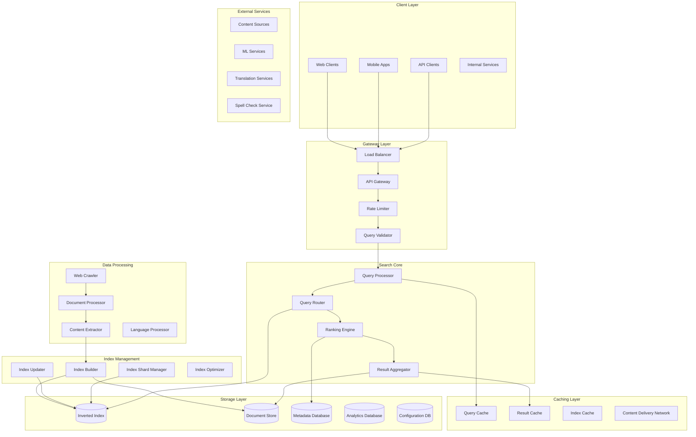
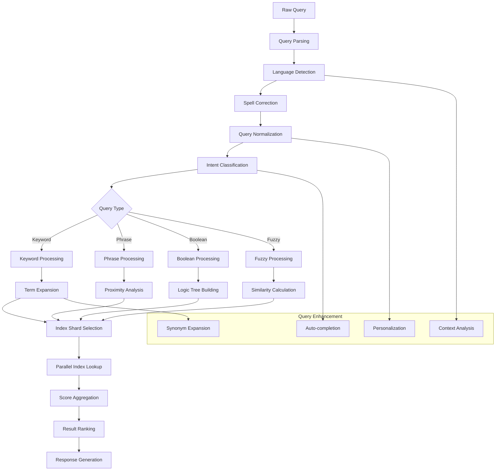
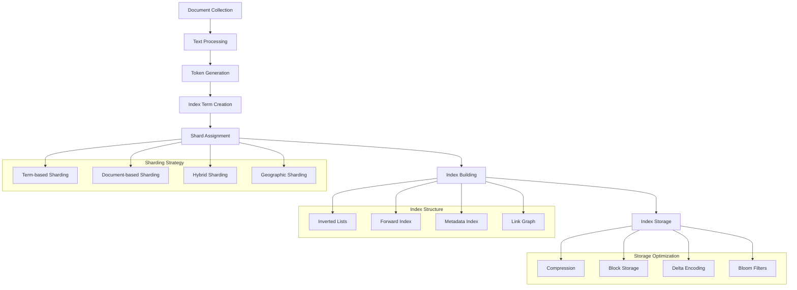
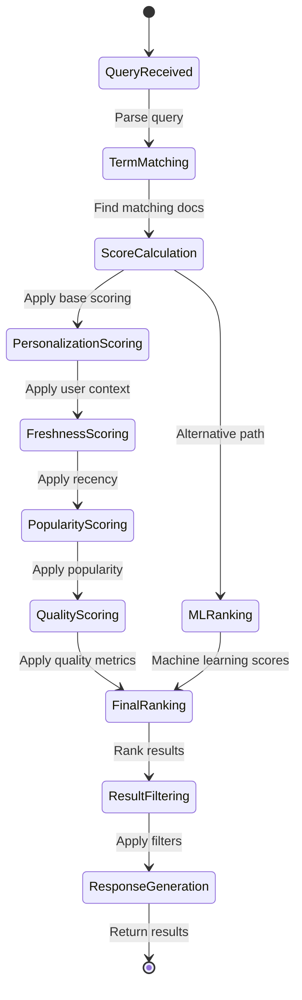
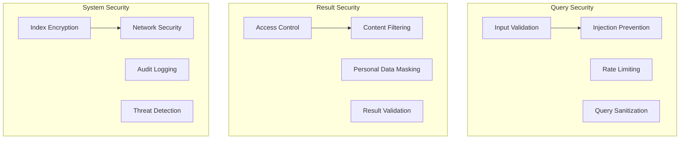

# Distributed Search Engine Backend


## 📋 Table of Contents

- [Distributed Search Engine Backend](#distributed-search-engine-backend)
  - [High-Level Design (HLD)](#high-level-design-hld)
    - [System Architecture Overview](#system-architecture-overview)
    - [Search Processing Flow](#search-processing-flow)
  - [Low-Level Design (LLD)](#low-level-design-lld)
    - [Query Processing Engine](#query-processing-engine)
    - [Distributed Index Architecture](#distributed-index-architecture)
    - [Real-time Ranking System](#real-time-ranking-system)
  - [Core Algorithms](#core-algorithms)
    - [1. Distributed Query Processing Algorithm](#1-distributed-query-processing-algorithm)
    - [2. Advanced Ranking Algorithm](#2-advanced-ranking-algorithm)
    - [3. Real-time Index Update Algorithm](#3-real-time-index-update-algorithm)
    - [4. Auto-complete and Suggestion Algorithm](#4-auto-complete-and-suggestion-algorithm)
    - [5. Search Analytics and Performance Monitoring](#5-search-analytics-and-performance-monitoring)
  - [Performance Optimizations](#performance-optimizations)
    - [Index Optimization](#index-optimization)
    - [Caching Strategy](#caching-strategy)
    - [Database Optimization](#database-optimization)
  - [Security Considerations](#security-considerations)
    - [Search Security Framework](#search-security-framework)
  - [Testing Strategy](#testing-strategy)
    - [Performance Testing](#performance-testing)
    - [Search Quality Testing](#search-quality-testing)
  - [Trade-offs and Considerations](#trade-offs-and-considerations)
    - [Relevance vs Performance](#relevance-vs-performance)
    - [Storage vs Speed](#storage-vs-speed)
    - [Scalability vs Consistency](#scalability-vs-consistency)

---

## High-Level Design (HLD)

[⬆️ Back to Top](#--table-of-contents)

---


### System Architecture Overview

[⬆️ Back to Top](#--table-of-contents)

---




### Search Processing Flow

[⬆️ Back to Top](#--table-of-contents)

---




```mermaid
graph LR
    subgraph "Query Processing Pipeline"
        UserQuery[User Query]
        QueryAnalysis[Query Analysis]
        QueryExpansion[Query Expansion]
        IndexLookup[Index Lookup]
        ScoreCalculation[Score Calculation]
        ResultRanking[Result Ranking]
        ResultFormatting[Result Formatting]
        ResponseDelivery[Response Delivery]
    end
    
    subgraph "Index Processing Pipeline"
        DocumentIngestion[Document Ingestion]
        ContentExtraction[Content Extraction]
        TextProcessing[Text Processing]
        IndexGeneration[Index Generation]
        ShardDistribution[Shard Distribution]
        IndexOptimization[Index Optimization]
    end
    
    subgraph "Real-time Updates"
        ChangeDetection[Change Detection]
        IncrementalUpdate[Incremental Update]
        IndexMerging[Index Merging]
        CacheInvalidation[Cache Invalidation]
    end
    
    UserQuery --> QueryAnalysis
    QueryAnalysis --> QueryExpansion
    QueryExpansion --> IndexLookup
    IndexLookup --> ScoreCalculation
    ScoreCalculation --> ResultRanking
    ResultRanking --> ResultFormatting
    ResultFormatting --> ResponseDelivery
    
    DocumentIngestion --> ContentExtraction
    ContentExtraction --> TextProcessing
    TextProcessing --> IndexGeneration
    IndexGeneration --> ShardDistribution
    ShardDistribution --> IndexOptimization
    
    ChangeDetection --> IncrementalUpdate
    IncrementalUpdate --> IndexMerging
    IndexMerging --> CacheInvalidation
```

## Low-Level Design (LLD)

[⬆️ Back to Top](#--table-of-contents)

---


### Query Processing Engine

[⬆️ Back to Top](#--table-of-contents)

---




### Distributed Index Architecture

[⬆️ Back to Top](#--table-of-contents)

---




### Real-time Ranking System

[⬆️ Back to Top](#--table-of-contents)

---




## Core Algorithms

[⬆️ Back to Top](#--table-of-contents)

---


### 1. Distributed Query Processing Algorithm

[⬆️ Back to Top](#--table-of-contents)

---


**Purpose**: Process search queries across distributed index shards with optimal performance and relevance.

**Query Distribution Strategy**:
```
SearchConfig = {
  shardingStrategy: 'hybrid',     // term-based, document-based, or hybrid
  replicationFactor: 3,           // Number of replicas per shard
  maxShardsPerQuery: 50,          // Limit concurrent shard queries
  queryTimeout: 5000,             // 5 seconds max query time
  minScoreThreshold: 0.1,         // Minimum relevance score
  maxResultsPerShard: 1000        // Results per shard before aggregation
}

function processDistributedQuery(query, searchParams):
  // Parse and analyze query
  processedQuery = analyzeQuery(query, searchParams)
  
  // Determine relevant shards
  relevantShards = selectShards(processedQuery, SearchConfig.shardingStrategy)
  
  if relevantShards.length > SearchConfig.maxShardsPerQuery:
    // Prioritize shards by relevance
    relevantShards = prioritizeShards(relevantShards, processedQuery)
    relevantShards = relevantShards.slice(0, SearchConfig.maxShardsPerQuery)
  
  // Execute parallel queries across shards
  shardPromises = relevantShards.map(shard => 
    executeShardQuery(shard, processedQuery, searchParams)
  )
  
  // Collect results with timeout
  shardResults = await Promise.allSettled(shardPromises, SearchConfig.queryTimeout)
  
  // Filter successful results
  validResults = shardResults
    .filter(result => result.status === 'fulfilled')
    .map(result => result.value)
  
  // Aggregate and rank results
  aggregatedResults = aggregateShardResults(validResults, processedQuery)
  
  // Apply global ranking
  finalResults = applyGlobalRanking(aggregatedResults, searchParams)
  
  return {
    results: finalResults,
    totalHits: calculateTotalHits(validResults),
    queryTime: Date.now() - processedQuery.startTime,
    shardsQueried: validResults.length,
    partialResults: shardResults.some(r => r.status === 'rejected')
  }

function selectShards(processedQuery, strategy):
  switch strategy:
    case 'term-based':
      return selectShardsByTerms(processedQuery.terms)
    case 'document-based':
      return selectShardsByCategories(processedQuery.categories)
    case 'hybrid':
      termShards = selectShardsByTerms(processedQuery.terms)
      categoryShards = selectShardsByCategories(processedQuery.categories)
      return mergeShardSelections(termShards, categoryShards)
    default:
      return getAllShards()
```

**Parallel Shard Query Execution**:
```
function executeShardQuery(shard, query, params):
  return new Promise((resolve, reject) => {
    const timeout = setTimeout(() => {
      reject(new Error('Shard query timeout'))
    }, SearchConfig.queryTimeout)
    
    try:
      // Connect to shard
      connection = getShardConnection(shard.id)
      
      // Execute query on shard
      shardResults = connection.search({
        query: query.optimizedQuery,
        filters: params.filters,
        sorting: params.sorting,
        maxResults: SearchConfig.maxResultsPerShard,
        includeMetadata: true
      })
      
      clearTimeout(timeout)
      
      // Apply shard-level scoring
      scoredResults = applyShardScoring(shardResults, query, shard)
      
      resolve({
        shardId: shard.id,
        results: scoredResults,
        metadata: {
          totalHits: shardResults.totalHits,
          queryTime: shardResults.queryTime,
          shardLoad: shard.currentLoad
        }
      })
      
    catch error:
      clearTimeout(timeout)
      reject(error)
  })
```

### 2. Advanced Ranking Algorithm

[⬆️ Back to Top](#--table-of-contents)

---


**Purpose**: Rank search results using multiple relevance signals and machine learning models.

**Multi-Factor Ranking System**:
```
RankingConfig = {
  textRelevanceWeight: 0.4,       // TF-IDF and BM25 scores
  popularityWeight: 0.2,          // Click-through rates, links
  freshnessWeight: 0.15,          // Recency of content
  personalizedWeight: 0.15,       // User preferences and history
  qualityWeight: 0.1,             // Content quality signals
  
  bm25Parameters: {
    k1: 1.2,                      // Term frequency saturation
    b: 0.75                       // Field length normalization
  },
  
  freshnessDecay: 0.1,            // Daily decay factor for old content
  minPopularityScore: 0.01        // Minimum popularity threshold
}

function calculateRelevanceScore(document, query, userContext):
  score = 0
  
  // Text relevance (TF-IDF + BM25)
  textScore = calculateTextRelevance(document, query)
  score += textScore * RankingConfig.textRelevanceWeight
  
  // Popularity signals
  popularityScore = calculatePopularityScore(document)
  score += popularityScore * RankingConfig.popularityWeight
  
  // Freshness score
  freshnessScore = calculateFreshnessScore(document.publishedDate)
  score += freshnessScore * RankingConfig.freshnessWeight
  
  // Personalization
  personalizedScore = calculatePersonalizedScore(document, userContext)
  score += personalizedScore * RankingConfig.personalizedWeight
  
  // Quality signals
  qualityScore = calculateQualityScore(document)
  score += qualityScore * RankingConfig.qualityWeight
  
  return Math.max(score, 0)

function calculateTextRelevance(document, query):
  bm25Score = 0
  
  for term in query.terms:
    // Calculate BM25 score for each term
    tf = getTermFrequency(term, document)
    df = getDocumentFrequency(term)
    idf = Math.log((totalDocuments - df + 0.5) / (df + 0.5))
    
    // BM25 formula
    termScore = idf * (tf * (RankingConfig.bm25Parameters.k1 + 1)) / 
                (tf + RankingConfig.bm25Parameters.k1 * 
                 (1 - RankingConfig.bm25Parameters.b + 
                  RankingConfig.bm25Parameters.b * (document.length / avgDocumentLength)))
    
    bm25Score += termScore
  
  // Apply field boosting
  titleBoost = calculateFieldBoost(document.title, query.terms, 2.0)
  headingBoost = calculateFieldBoost(document.headings, query.terms, 1.5)
  
  return bm25Score + titleBoost + headingBoost

function calculatePopularityScore(document):
  // Combine multiple popularity signals
  clickThroughRate = document.analytics.ctr || 0
  linkCount = Math.log(document.inboundLinks + 1)
  socialSignals = Math.log(document.socialShares + 1)
  
  // Normalize and combine
  normalizedCTR = Math.min(clickThroughRate / 0.1, 1.0)  // Cap at 10% CTR
  normalizedLinks = Math.min(linkCount / 10, 1.0)        // Cap at 10 log scale
  normalizedSocial = Math.min(socialSignals / 5, 1.0)    // Cap at 5 log scale
  
  return (normalizedCTR * 0.5 + normalizedLinks * 0.3 + normalizedSocial * 0.2)
```

**Machine Learning Ranking Integration**:
```
function applyMLRanking(results, query, userContext):
  // Prepare features for ML model
  features = results.map(result => extractFeatures(result, query, userContext))
  
  // Get ML model predictions
  mlScores = mlRankingModel.predict(features)
  
  // Combine with traditional ranking
  combinedResults = results.map((result, index) => ({
    ...result,
    mlScore: mlScores[index],
    combinedScore: (result.relevanceScore * 0.7) + (mlScores[index] * 0.3)
  }))
  
  // Re-sort by combined score
  return combinedResults.sort((a, b) => b.combinedScore - a.combinedScore)

function extractFeatures(document, query, userContext):
  return {
    // Text features
    titleTermMatches: countTermMatches(document.title, query.terms),
    bodyTermMatches: countTermMatches(document.body, query.terms),
    exactPhraseMatches: countPhraseMatches(document, query.phrases),
    
    // Document features
    documentLength: document.body.length,
    readabilityScore: document.metrics.readability,
    authorityScore: document.metrics.authority,
    
    // Popularity features
    clickThroughRate: document.analytics.ctr,
    bounceRate: document.analytics.bounceRate,
    timeOnPage: document.analytics.avgTimeOnPage,
    
    // Freshness features
    daysSincePublished: (Date.now() - document.publishedDate) / (24 * 60 * 60 * 1000),
    daysSinceUpdated: (Date.now() - document.updatedDate) / (24 * 60 * 60 * 1000),
    
    // User context features
    userLanguage: userContext.language,
    userLocation: userContext.location,
    userInterests: userContext.interests,
    previousInteractions: userContext.previousClicks.includes(document.id)
  }
```

### 3. Real-time Index Update Algorithm

[⬆️ Back to Top](#--table-of-contents)

---


**Purpose**: Maintain search index consistency with real-time document updates and minimal search disruption.

**Incremental Index Update**:
```
IndexUpdateConfig = {
  batchSize: 1000,                // Documents per batch
  maxBatchWaitTime: 30000,        // 30 seconds max wait
  updateStrategy: 'incremental',   // 'incremental' or 'rebuild'
  mergeFactor: 10,                // Segments to merge at once
  maxSegments: 100,               // Max segments before forced merge
  
  priorities: {
    add: 1,      // New documents
    update: 2,   // Document changes
    delete: 3    // Document removals
  }
}

function processDocumentUpdate(document, operation, priority):
  // Create update operation
  updateOperation = {
    documentId: document.id,
    operation: operation,  // 'add', 'update', 'delete'
    priority: priority,
    timestamp: Date.now(),
    shardId: determineShardForDocument(document),
    indexTerms: operation !== 'delete' ? extractIndexTerms(document) : null
  }
  
  // Add to appropriate priority queue
  addToUpdateQueue(updateOperation)
  
  // Trigger batch processing if needed
  if shouldProcessBatch():
    processBatchUpdates()

function processBatchUpdates():
  // Get batch of updates sorted by priority and shard
  updateBatch = getNextUpdateBatch(IndexUpdateConfig.batchSize)
  
  if updateBatch.length === 0:
    return
  
  // Group by shard for efficient processing
  shardGroups = groupUpdatesByShard(updateBatch)
  
  // Process each shard group
  for shardId in Object.keys(shardGroups):
    processShardUpdates(shardId, shardGroups[shardId])

function processShardUpdates(shardId, updates):
  shard = getIndexShard(shardId)
  
  // Apply updates in transaction
  transaction = shard.beginTransaction()
  
  try:
    for update in updates:
      switch update.operation:
        case 'add':
          addDocumentToIndex(shard, update.documentId, update.indexTerms)
          break
        case 'update':
          updateDocumentInIndex(shard, update.documentId, update.indexTerms)
          break
        case 'delete':
          removeDocumentFromIndex(shard, update.documentId)
          break
    
    // Commit transaction
    transaction.commit()
    
    // Update metadata
    updateShardMetadata(shardId, updates.length)
    
    // Check if merge is needed
    if shouldMergeSegments(shard):
      scheduleSegmentMerge(shardId)
    
  catch error:
    transaction.rollback()
    // Re-queue failed updates
    requeueUpdates(updates)
    throw error
```

**Index Segment Merging**:
```
function mergeIndexSegments(shardId):
  shard = getIndexShard(shardId)
  segments = shard.getSegments()
  
  // Select segments to merge based on size and age
  segmentsToMerge = selectMergeSegments(segments)
  
  if segmentsToMerge.length < 2:
    return // Nothing to merge
  
  // Create new merged segment
  mergedSegment = createNewSegment(shardId)
  
  // Merge inverted lists
  termMerger = new TermMerger()
  
  for segment in segmentsToMerge:
    for term in segment.getTerms():
      postingList = segment.getPostingList(term)
      termMerger.addPostingList(term, postingList)
  
  // Write merged data
  for term in termMerger.getTerms():
    mergedPostingList = termMerger.getMergedPostingList(term)
    mergedSegment.writePostingList(term, mergedPostingList)
  
  // Atomically replace old segments
  shard.replaceSegments(segmentsToMerge, mergedSegment)
  
  // Clean up old segment files
  cleanupSegments(segmentsToMerge)
  
  // Update search caches
  invalidateSearchCaches(shardId)
```

### 4. Auto-complete and Suggestion Algorithm

[⬆️ Back to Top](#--table-of-contents)

---


**Purpose**: Provide real-time query suggestions and auto-completion with high relevance and performance.

**Trie-based Auto-completion**:
```
AutocompleteConfig = {
  maxSuggestions: 10,
  minQueryLength: 2,
  suggestionSources: ['queries', 'documents', 'entities'],
  popularityWeight: 0.6,
  recencyWeight: 0.3,
  personalizedWeight: 0.1
}

class AutocompleteTrie:
  constructor():
    this.root = new TrieNode()
    this.queryFrequency = new Map()
    this.recentQueries = new CircularBuffer(10000)
  
  function insertQuery(query, frequency, timestamp):
    node = this.root
    
    // Insert query character by character
    for char in query.toLowerCase():
      if not node.children.has(char):
        node.children.set(char, new TrieNode())
      node = node.children.get(char)
      
      // Update node statistics
      node.passthrough += frequency
    
    // Mark end of query
    node.isEndOfQuery = true
    node.queries.add({
      text: query,
      frequency: frequency,
      timestamp: timestamp
    })
    
    // Update global frequency tracking
    this.queryFrequency.set(query, frequency)
    this.recentQueries.add({ query, timestamp })

  function getSuggestions(prefix, userContext):
    if prefix.length < AutocompleteConfig.minQueryLength:
      return []
    
    // Navigate to prefix node
    node = this.root
    for char in prefix.toLowerCase():
      if not node.children.has(char):
        return [] // No suggestions for this prefix
      node = node.children.get(char)
    
    // Collect all completions from this node
    completions = []
    this.collectCompletions(node, prefix, completions, userContext)
    
    // Score and rank suggestions
    scoredSuggestions = completions.map(completion => ({
      ...completion,
      score: this.calculateSuggestionScore(completion, userContext)
    }))
    
    // Sort by score and return top suggestions
    return scoredSuggestions
      .sort((a, b) => b.score - a.score)
      .slice(0, AutocompleteConfig.maxSuggestions)

  function calculateSuggestionScore(suggestion, userContext):
    score = 0
    
    // Popularity component
    popularityScore = Math.log(suggestion.frequency + 1) / Math.log(maxFrequency + 1)
    score += popularityScore * AutocompleteConfig.popularityWeight
    
    // Recency component
    daysSinceUsed = (Date.now() - suggestion.lastUsed) / (24 * 60 * 60 * 1000)
    recencyScore = Math.exp(-daysSinceUsed / 30) // 30-day half-life
    score += recencyScore * AutocompleteConfig.recencyWeight
    
    // Personalization component
    if userContext.searchHistory:
      personalizedScore = calculatePersonalizedScore(suggestion, userContext)
      score += personalizedScore * AutocompleteConfig.personalizedWeight
    
    return score
```

**Contextual Query Suggestions**:
```
function generateContextualSuggestions(query, searchResults, userContext):
  suggestions = []
  
  // Extract entities from current results
  entities = extractEntitiesFromResults(searchResults)
  
  // Generate entity-based expansions
  for entity in entities:
    relatedQueries = getRelatedQueries(entity, userContext.language)
    suggestions.push(...relatedQueries)
  
  // Generate topic-based suggestions
  topics = extractTopicsFromResults(searchResults)
  for topic in topics:
    topicSuggestions = getTopicSuggestions(topic, query)
    suggestions.push(...topicSuggestions)
  
  // Generate corrective suggestions
  if searchResults.length < 5:
    corrections = generateSpellCorrections(query)
    reformulations = generateQueryReformulations(query)
    suggestions.push(...corrections, ...reformulations)
  
  // Score and rank suggestions
  return rankSuggestions(suggestions, query, userContext)

function generateQueryReformulations(originalQuery):
  reformulations = []
  
  // Synonym-based reformulations
  synonyms = getSynonyms(originalQuery.terms)
  for synonym in synonyms:
    reformulatedQuery = replaceTermWithSynonym(originalQuery, synonym)
    reformulations.push({
      type: 'synonym',
      original: originalQuery.text,
      suggestion: reformulatedQuery,
      confidence: synonym.confidence
    })
  
  // Broader/narrower reformulations
  broader = generateBroaderQueries(originalQuery)
  narrower = generateNarrowerQueries(originalQuery)
  
  reformulations.push(...broader, ...narrower)
  
  return reformulations
```

### 5. Search Analytics and Performance Monitoring

[⬆️ Back to Top](#--table-of-contents)

---


**Purpose**: Track search performance, user behavior, and system health for continuous optimization.

**Real-time Analytics Collection**:
```
AnalyticsConfig = {
  trackingEvents: [
    'query_submitted',
    'result_clicked',
    'result_viewed',
    'query_abandoned',
    'autocomplete_used',
    'filter_applied',
    'sort_changed'
  ],
  samplingRate: 0.1,              // Sample 10% of queries for detailed analysis
  aggregationWindows: [60, 300, 3600, 86400], // 1m, 5m, 1h, 1d
  retentionPeriod: 90             // Keep detailed data for 90 days
}

function trackSearchEvent(eventType, eventData, userContext):
  event = {
    type: eventType,
    timestamp: Date.now(),
    sessionId: userContext.sessionId,
    userId: userContext.userId,
    query: eventData.query,
    results: eventData.results,
    metadata: eventData.metadata
  }
  
  // Store raw event
  storeSearchEvent(event)
  
  // Update real-time metrics
  updateRealTimeMetrics(event)
  
  // Sample for detailed analysis
  if Math.random() < AnalyticsConfig.samplingRate:
    performDetailedAnalysis(event)

function calculateSearchMetrics(timeWindow):
  events = getSearchEvents(timeWindow)
  
  metrics = {
    totalQueries: 0,
    uniqueUsers: new Set(),
    clickThroughRate: 0,
    averageResultsPerQuery: 0,
    averageQueryTime: 0,
    zeroResultQueries: 0,
    popularQueries: new Map(),
    performanceMetrics: {
      p50QueryTime: 0,
      p95QueryTime: 0,
      p99QueryTime: 0
    }
  }
  
  queryTimes = []
  clickEvents = 0
  totalResults = 0
  
  for event in events:
    switch event.type:
      case 'query_submitted':
        metrics.totalQueries++
        metrics.uniqueUsers.add(event.userId)
        queryTimes.push(event.metadata.queryTime)
        
        resultCount = event.results ? event.results.length : 0
        totalResults += resultCount
        
        if resultCount === 0:
          metrics.zeroResultQueries++
        
        // Track popular queries
        queryText = event.query.toLowerCase()
        currentCount = metrics.popularQueries.get(queryText) || 0
        metrics.popularQueries.set(queryText, currentCount + 1)
        break
        
      case 'result_clicked':
        clickEvents++
        break
  
  // Calculate derived metrics
  if metrics.totalQueries > 0:
    metrics.clickThroughRate = clickEvents / metrics.totalQueries
    metrics.averageResultsPerQuery = totalResults / metrics.totalQueries
    metrics.averageQueryTime = queryTimes.reduce((a, b) => a + b, 0) / queryTimes.length
  
  // Calculate percentiles
  sortedTimes = queryTimes.sort((a, b) => a - b)
  metrics.performanceMetrics.p50QueryTime = getPercentile(sortedTimes, 0.5)
  metrics.performanceMetrics.p95QueryTime = getPercentile(sortedTimes, 0.95)
  metrics.performanceMetrics.p99QueryTime = getPercentile(sortedTimes, 0.99)
  
  return metrics
```

## Performance Optimizations

[⬆️ Back to Top](#--table-of-contents)

---


### Index Optimization

[⬆️ Back to Top](#--table-of-contents)

---


**Compression Strategies**:
```
CompressionConfig = {
  postingListCompression: 'variable_byte',  // Variable-byte encoding
  documentCompression: 'lz4',               // Fast compression for documents
  blockSize: 128,                           // Compression block size
  enableDeltaEncoding: true                 // Delta encoding for doc IDs
}
```

### Caching Strategy

[⬆️ Back to Top](#--table-of-contents)

---


**Multi-Layer Caching**:
- Query result caching (Redis, 15-minute TTL)
- Index segment caching (Application memory)
- Autocomplete caching (Edge CDN)
- Analytics data caching (Time-series database)

### Database Optimization

[⬆️ Back to Top](#--table-of-contents)

---


**Index Sharding Strategy**:
- Term-based sharding for text search
- Geographic sharding for location-based queries
- Time-based sharding for temporal data
- Hybrid approach for complex queries

## Security Considerations

[⬆️ Back to Top](#--table-of-contents)

---


### Search Security Framework

[⬆️ Back to Top](#--table-of-contents)

---




## Testing Strategy

[⬆️ Back to Top](#--table-of-contents)

---


### Performance Testing

[⬆️ Back to Top](#--table-of-contents)

---


**Load Testing Scenarios**:
- Peak traffic simulation (10x normal load)
- Concurrent user testing (100K+ simultaneous queries)
- Index update stress testing
- Cache invalidation testing

### Search Quality Testing

[⬆️ Back to Top](#--table-of-contents)

---


**Relevance Testing**:
- Human relevance evaluation
- A/B testing for ranking changes
- Click-through rate analysis
- Search result diversity measurement

## Trade-offs and Considerations

[⬆️ Back to Top](#--table-of-contents)

---


### Relevance vs Performance

[⬆️ Back to Top](#--table-of-contents)

---

- **Complex ranking**: Accuracy vs query response time
- **Real-time updates**: Freshness vs index consistency
- **Personalization**: Relevance vs privacy concerns
- **Comprehensive results**: Completeness vs response speed

### Storage vs Speed

[⬆️ Back to Top](#--table-of-contents)

---

- **Index compression**: Storage efficiency vs decompression overhead
- **Caching strategy**: Memory usage vs cache hit rates
- **Replication**: Availability vs storage costs
- **Sharding granularity**: Load distribution vs query complexity

### Scalability vs Consistency

[⬆️ Back to Top](#--table-of-contents)

---

- **Distributed indexing**: Scalability vs update consistency
- **Cross-shard queries**: Completeness vs performance
- **Index synchronization**: Consistency vs availability
- **Cache coherence**: Performance vs data freshness

This distributed search engine backend provides a comprehensive foundation for large-scale search with features like intelligent query processing, advanced ranking algorithms, real-time indexing, and robust performance monitoring while maintaining high relevance, scalability, and security standards. 