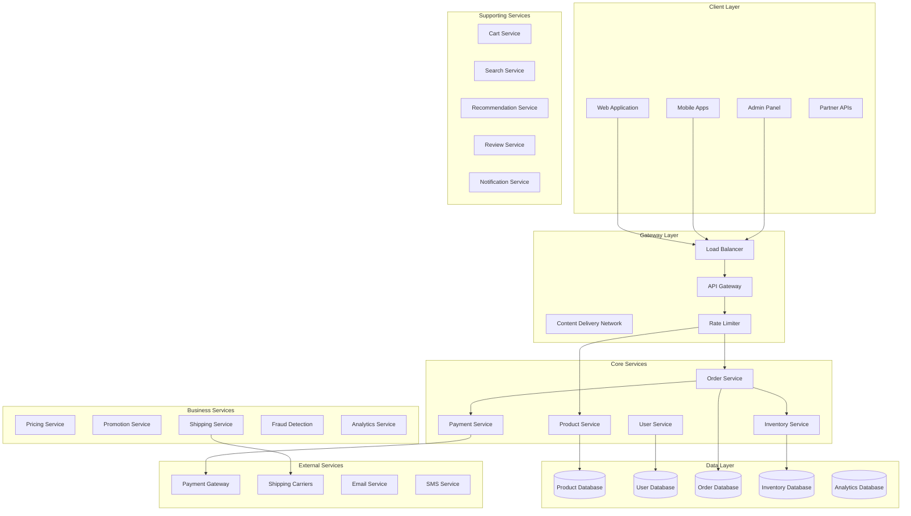
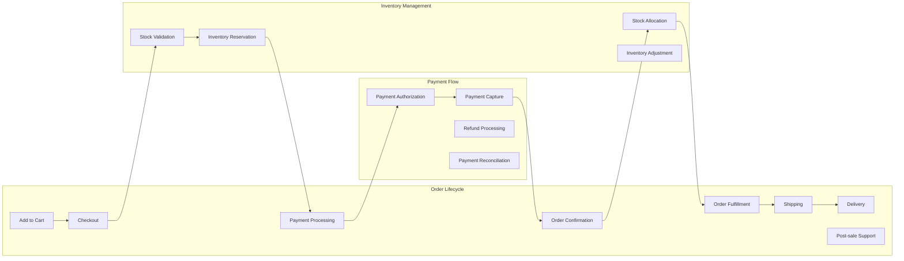
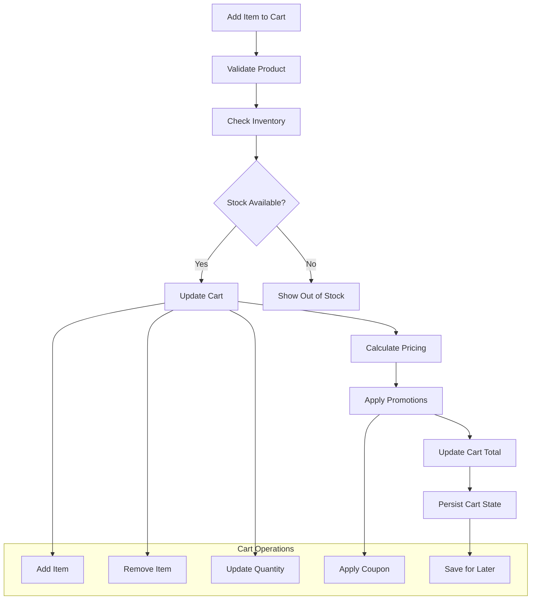
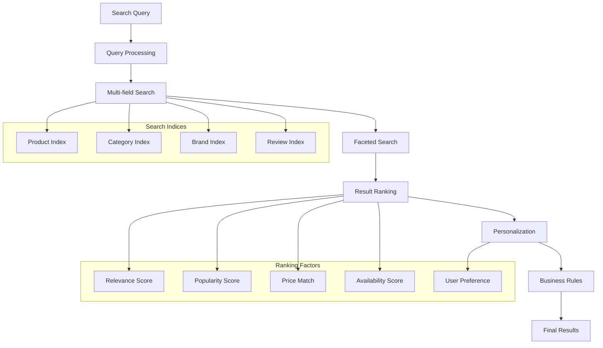
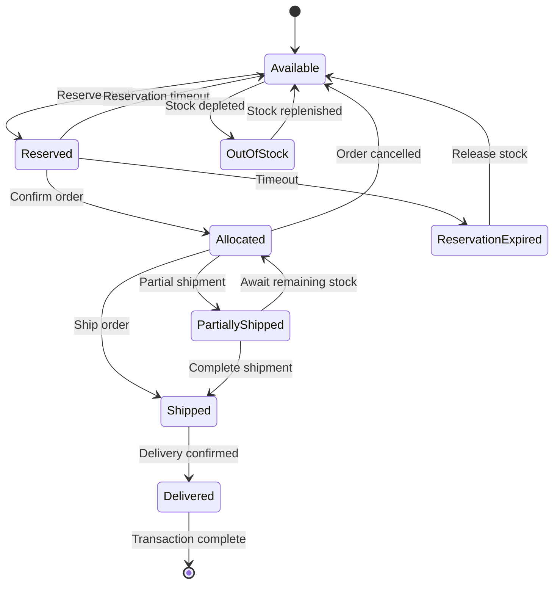
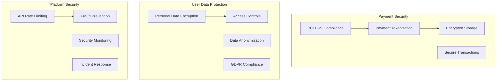

# E-commerce Platform Backend


## 📋 Table of Contents

- [E-commerce Platform Backend](#e-commerce-platform-backend)
  - [High-Level Design (HLD)](#high-level-design-hld)
    - [System Architecture Overview](#system-architecture-overview)
    - [Order Processing Flow](#order-processing-flow)
  - [Low-Level Design (LLD)](#low-level-design-lld)
    - [Shopping Cart Management](#shopping-cart-management)
    - [Product Search and Discovery](#product-search-and-discovery)
    - [Inventory Management System](#inventory-management-system)
  - [Core Algorithms](#core-algorithms)
    - [1. Dynamic Pricing Algorithm](#1-dynamic-pricing-algorithm)
    - [2. Inventory Management Algorithm](#2-inventory-management-algorithm)
    - [3. Product Recommendation Engine](#3-product-recommendation-engine)
    - [4. Order Processing and Fulfillment](#4-order-processing-and-fulfillment)
    - [5. Fraud Detection System](#5-fraud-detection-system)
  - [Performance Optimizations](#performance-optimizations)
    - [Database Optimization](#database-optimization)
    - [Search Performance](#search-performance)
  - [Security Considerations](#security-considerations)
    - [Data Protection Framework](#data-protection-framework)
  - [Testing Strategy](#testing-strategy)
    - [Load Testing Scenarios](#load-testing-scenarios)
  - [Trade-offs and Considerations](#trade-offs-and-considerations)
    - [Consistency vs Availability](#consistency-vs-availability)
    - [Personalization vs Privacy](#personalization-vs-privacy)
    - [Scalability vs Cost](#scalability-vs-cost)

---

## High-Level Design (HLD)

[⬆️ Back to Top](#--table-of-contents)

---


### System Architecture Overview

[⬆️ Back to Top](#--table-of-contents)

---




### Order Processing Flow

[⬆️ Back to Top](#--table-of-contents)

---




## Low-Level Design (LLD)

[⬆️ Back to Top](#--table-of-contents)

---


### Shopping Cart Management

[⬆️ Back to Top](#--table-of-contents)

---




### Product Search and Discovery

[⬆️ Back to Top](#--table-of-contents)

---




### Inventory Management System

[⬆️ Back to Top](#--table-of-contents)

---




## Core Algorithms

[⬆️ Back to Top](#--table-of-contents)

---


### 1. Dynamic Pricing Algorithm

[⬆️ Back to Top](#--table-of-contents)

---


**Purpose**: Optimize product pricing based on demand, competition, and business objectives.

**Price Optimization Factors**:
```
PricingFactors = {
  demand: 0.30,           // Current demand level
  competition: 0.25,      // Competitor pricing
  inventory: 0.20,        // Stock levels
  seasonality: 0.15,      // Seasonal trends
  userSegment: 0.10       // Customer segment pricing
}

PricingConfig = {
  maxDiscountPercent: 30,    // Maximum discount allowed
  maxMarkupPercent: 50,      // Maximum markup allowed
  priceUpdateFrequency: 3600000,  // 1 hour
  competitorCheckFrequency: 86400000  // 24 hours
}

function calculateOptimalPrice(productId, context):
  product = getProduct(productId)
  basePrice = product.basePrice
  
  // Demand-based adjustment
  demandMultiplier = calculateDemandMultiplier(productId, context.timeWindow)
  
  // Competition-based adjustment
  competitionMultiplier = calculateCompetitionMultiplier(productId, context.region)
  
  // Inventory-based adjustment
  inventoryMultiplier = calculateInventoryMultiplier(productId)
  
  // Seasonal adjustment
  seasonalMultiplier = calculateSeasonalMultiplier(product.category, context.currentDate)
  
  // User segment adjustment
  segmentMultiplier = calculateSegmentMultiplier(context.userId, product.category)
  
  // Calculate weighted price adjustment
  priceAdjustment = (
    demandMultiplier * PricingFactors.demand +
    competitionMultiplier * PricingFactors.competition +
    inventoryMultiplier * PricingFactors.inventory +
    seasonalMultiplier * PricingFactors.seasonality +
    segmentMultiplier * PricingFactors.userSegment
  )
  
  // Apply bounds
  adjustedPrice = basePrice * priceAdjustment
  maxPrice = basePrice * (1 + PricingConfig.maxMarkupPercent / 100)
  minPrice = basePrice * (1 - PricingConfig.maxDiscountPercent / 100)
  
  finalPrice = Math.max(minPrice, Math.min(adjustedPrice, maxPrice))
  
  return {
    price: finalPrice,
    originalPrice: basePrice,
    discountPercent: Math.max(0, (basePrice - finalPrice) / basePrice * 100),
    factors: {
      demand: demandMultiplier,
      competition: competitionMultiplier,
      inventory: inventoryMultiplier,
      seasonal: seasonalMultiplier,
      segment: segmentMultiplier
    }
  }
```

**Demand Calculation Algorithm**:
```
function calculateDemandMultiplier(productId, timeWindow = 86400000): // 24 hours
  currentTime = Date.now()
  timeStart = currentTime - timeWindow
  
  // Get recent activity metrics
  views = getProductViews(productId, timeStart, currentTime)
  cartAdds = getCartAdditions(productId, timeStart, currentTime)
  purchases = getPurchases(productId, timeStart, currentTime)
  wishlistAdds = getWishlistAdditions(productId, timeStart, currentTime)
  
  // Calculate conversion rates
  viewToCartRate = cartAdds / Math.max(views, 1)
  cartToPurchaseRate = purchases / Math.max(cartAdds, 1)
  
  // Calculate demand score
  demandScore = (
    views * 0.1 +
    cartAdds * 0.3 +
    purchases * 0.5 +
    wishlistAdds * 0.1
  )
  
  // Normalize demand score
  averageDemand = getAverageDemandForCategory(getProduct(productId).category)
  normalizedDemand = demandScore / Math.max(averageDemand, 1)
  
  // Convert to multiplier (range: 0.8 to 1.3)
  demandMultiplier = 0.8 + (normalizedDemand * 0.5)
  
  return Math.max(0.8, Math.min(demandMultiplier, 1.3))
```

### 2. Inventory Management Algorithm

[⬆️ Back to Top](#--table-of-contents)

---


**Purpose**: Maintain optimal stock levels while minimizing carrying costs and stockouts.

**Inventory Optimization Model**:
```
InventoryConfig = {
  reorderPointDays: 7,        // Days of safety stock
  leadTimeDays: 14,           // Supplier lead time
  reviewPeriodDays: 30,       // Inventory review frequency
  serviceLevel: 0.95,         // 95% service level target
  carryingCostPercent: 0.25   // 25% annual carrying cost
}

function calculateReorderPoint(productId):
  product = getProduct(productId)
  
  // Get historical demand data
  demandHistory = getDemandHistory(productId, timeWindow = 90 * 24 * 3600 * 1000) // 90 days
  
  // Calculate demand statistics
  averageDailyDemand = calculateAverageDailyDemand(demandHistory)
  demandStandardDeviation = calculateDemandStandardDeviation(demandHistory)
  
  // Calculate lead time demand
  leadTimeDemand = averageDailyDemand * InventoryConfig.leadTimeDays
  
  // Calculate safety stock
  serviceLevel = InventoryConfig.serviceLevel
  zScore = getZScoreForServiceLevel(serviceLevel)
  leadTimeVariability = Math.sqrt(InventoryConfig.leadTimeDays) * demandStandardDeviation
  safetyStock = zScore * leadTimeVariability
  
  // Calculate reorder point
  reorderPoint = leadTimeDemand + safetyStock
  
  return Math.ceil(reorderPoint)

function calculateOptimalOrderQuantity(productId):
  product = getProduct(productId)
  
  // Get parameters for EOQ calculation
  annualDemand = getAnnualDemand(productId)
  orderingCost = getOrderingCost(product.supplierId)
  unitCost = product.cost
  carryingCost = unitCost * InventoryConfig.carryingCostPercent
  
  // Economic Order Quantity (EOQ) formula
  eoq = Math.sqrt((2 * annualDemand * orderingCost) / carryingCost)
  
  // Apply business constraints
  minOrderQuantity = product.minOrderQuantity || 1
  maxOrderQuantity = product.maxOrderQuantity || Infinity
  
  optimalQuantity = Math.max(minOrderQuantity, Math.min(eoq, maxOrderQuantity))
  
  return Math.ceil(optimalQuantity)
```

**Stock Reservation System**:
```
ReservationConfig = {
  reservationTimeout: 900000,    // 15 minutes
  maxReservationsPerUser: 10,
  reservationExtensionLimit: 2
}

function reserveInventory(productId, quantity, userId, cartId):
  currentTime = Date.now()
  
  // Check availability
  availableStock = getAvailableStock(productId)
  if availableStock < quantity:
    return { success: false, reason: 'insufficient_stock', available: availableStock }
  
  // Check user reservation limits
  userReservations = getUserActiveReservations(userId)
  if userReservations.length >= ReservationConfig.maxReservationsPerUser:
    return { success: false, reason: 'reservation_limit_exceeded' }
  
  // Create reservation
  reservation = {
    id: generateReservationId(),
    productId: productId,
    quantity: quantity,
    userId: userId,
    cartId: cartId,
    createdAt: currentTime,
    expiresAt: currentTime + ReservationConfig.reservationTimeout,
    status: 'active'
  }
  
  // Atomic operation: check and reserve
  reservationResult = atomicReserveStock(productId, quantity, reservation)
  
  if reservationResult.success:
    // Schedule expiration cleanup
    scheduleReservationExpiry(reservation.id, reservation.expiresAt)
    
    // Update inventory metrics
    updateInventoryMetrics(productId, -quantity, 'reserved')
    
    return { 
      success: true, 
      reservationId: reservation.id, 
      expiresAt: reservation.expiresAt 
    }
  else:
    return { success: false, reason: 'reservation_failed' }
```

### 3. Product Recommendation Engine

[⬆️ Back to Top](#--table-of-contents)

---


**Purpose**: Provide personalized product recommendations to increase sales and user engagement.

**Multi-Algorithm Recommendation System**:
```
RecommendationModels = {
  collaborativeFiltering: {
    weight: 0.35,
    algorithm: 'matrix_factorization',
    factors: 50,
    regularization: 0.01
  },
  contentBased: {
    weight: 0.25,
    algorithm: 'cosine_similarity',
    features: ['category', 'brand', 'price_range', 'attributes']
  },
  behavioral: {
    weight: 0.20,
    algorithm: 'sequence_prediction',
    sessionLength: 10,
    decayFactor: 0.9
  },
  trending: {
    weight: 0.20,
    algorithm: 'popularity_boost',
    timeWindow: 24 * 3600 * 1000, // 24 hours
    trendingBoost: 1.5
  }
}

function generateRecommendations(userId, context, numRecommendations = 20):
  userProfile = getUserProfile(userId)
  browsedProducts = getRecentlyViewedProducts(userId, timeWindow = 7 * 24 * 3600 * 1000) // 7 days
  
  recommendations = new Map()
  
  // Collaborative Filtering
  cfRecommendations = collaborativeFilteringModel.recommend(userId, numRecommendations * 2)
  for rec in cfRecommendations:
    recommendations[rec.productId] = (recommendations[rec.productId] || 0) + 
      rec.score * RecommendationModels.collaborativeFiltering.weight
  
  // Content-Based Filtering
  if browsedProducts.length > 0:
    cbRecommendations = contentBasedModel.recommend(browsedProducts, numRecommendations * 2)
    for rec in cbRecommendations:
      recommendations[rec.productId] = (recommendations[rec.productId] || 0) + 
        rec.score * RecommendationModels.contentBased.weight
  
  // Behavioral Recommendations
  behavioralRecs = behavioralModel.recommend(userId, context.sessionId, numRecommendations)
  for rec in behavioralRecs:
    recommendations[rec.productId] = (recommendations[rec.productId] || 0) + 
      rec.score * RecommendationModels.behavioral.weight
  
  // Trending Products
  trendingProducts = getTrendingProducts(context.category, numRecommendations)
  for product in trendingProducts:
    recommendations[product.id] = (recommendations[product.id] || 0) + 
      product.trendingScore * RecommendationModels.trending.weight
  
  // Apply business rules and filters
  filteredRecommendations = applyBusinessFilters(recommendations, userProfile, context)
  
  // Sort and diversify
  sortedRecommendations = sortByScore(filteredRecommendations)
  diversifiedRecommendations = applyDiversification(sortedRecommendations, userProfile)
  
  return diversifiedRecommendations.slice(0, numRecommendations)
```

**Real-time Behavioral Tracking**:
```
function trackUserBehavior(userId, action, context):
  behaviorEvent = {
    userId: userId,
    sessionId: context.sessionId,
    action: action,
    productId: context.productId,
    category: context.category,
    timestamp: Date.now(),
    metadata: context.metadata
  }
  
  // Update real-time user session
  updateUserSession(userId, behaviorEvent)
  
  // Update user preferences
  updateUserPreferences(userId, behaviorEvent)
  
  // Trigger real-time recommendations if needed
  if shouldUpdateRecommendations(action):
    triggerRecommendationUpdate(userId, context)
  
  // Store for batch processing
  storeBehaviorEvent(behaviorEvent)

function updateUserPreferences(userId, behaviorEvent):
  preferences = getUserPreferences(userId)
  
  // Update category preferences
  if behaviorEvent.category:
    weight = getActionWeight(behaviorEvent.action)
    preferences.categories[behaviorEvent.category] = 
      (preferences.categories[behaviorEvent.category] || 0) + weight
  
  // Update brand preferences
  if behaviorEvent.metadata.brand:
    preferences.brands[behaviorEvent.metadata.brand] = 
      (preferences.brands[behaviorEvent.metadata.brand] || 0) + weight
  
  // Update price range preferences
  if behaviorEvent.metadata.price:
    updatePriceRangePreference(preferences, behaviorEvent.metadata.price, weight)
  
  // Normalize preferences
  normalizePreferences(preferences)
  
  // Store updated preferences
  saveUserPreferences(userId, preferences)
```

### 4. Order Processing and Fulfillment

[⬆️ Back to Top](#--table-of-contents)

---


**Purpose**: Efficiently process orders from checkout to delivery with proper error handling.

**Order State Machine**:
```
OrderStates = {
  PENDING: 'pending',
  PAYMENT_PROCESSING: 'payment_processing', 
  PAYMENT_CONFIRMED: 'payment_confirmed',
  INVENTORY_ALLOCATED: 'inventory_allocated',
  PREPARING: 'preparing',
  SHIPPED: 'shipped',
  DELIVERED: 'delivered',
  CANCELLED: 'cancelled',
  REFUNDED: 'refunded'
}

function processOrder(orderId):
  order = getOrder(orderId)
  
  try:
    // Validate order
    validation = validateOrder(order)
    if not validation.isValid:
      updateOrderStatus(orderId, OrderStates.CANCELLED, validation.reason)
      return { success: false, reason: validation.reason }
    
    // Process payment
    updateOrderStatus(orderId, OrderStates.PAYMENT_PROCESSING)
    paymentResult = processPayment(order.paymentDetails, order.total)
    
    if not paymentResult.success:
      updateOrderStatus(orderId, OrderStates.CANCELLED, 'payment_failed')
      return { success: false, reason: 'payment_failed' }
    
    updateOrderStatus(orderId, OrderStates.PAYMENT_CONFIRMED)
    
    // Allocate inventory
    allocationResult = allocateInventory(order.items)
    if not allocationResult.success:
      // Refund payment
      refundPayment(paymentResult.transactionId, order.total)
      updateOrderStatus(orderId, OrderStates.CANCELLED, 'inventory_unavailable')
      return { success: false, reason: 'inventory_unavailable' }
    
    updateOrderStatus(orderId, OrderStates.INVENTORY_ALLOCATED)
    
    // Create fulfillment tasks
    fulfillmentTasks = createFulfillmentTasks(order)
    for task in fulfillmentTasks:
      queueFulfillmentTask(task)
    
    updateOrderStatus(orderId, OrderStates.PREPARING)
    
    // Send confirmation
    sendOrderConfirmation(order.customerId, orderId)
    
    return { success: true, orderId: orderId, status: OrderStates.PREPARING }
    
  catch error:
    // Handle errors and cleanup
    handleOrderProcessingError(orderId, error)
    return { success: false, reason: 'processing_error', error: error.message }
```

**Inventory Allocation Algorithm**:
```
function allocateInventory(orderItems):
  allocations = []
  reservations = []
  
  // Sort items by priority (high-value items first)
  prioritizedItems = orderItems.sort((a, b) => b.unitPrice - a.unitPrice)
  
  for item in prioritizedItems:
    // Check available inventory across all warehouses
    warehouseInventory = getWarehouseInventory(item.productId)
    
    remainingQuantity = item.quantity
    itemAllocations = []
    
    // Allocate from warehouses (prefer closest to customer)
    for warehouse in warehouseInventory.sort((a, b) => a.distanceToCustomer - b.distanceToCustomer):
      if remainingQuantity <= 0:
        break
      
      availableQuantity = warehouse.availableQuantity
      allocationQuantity = Math.min(remainingQuantity, availableQuantity)
      
      if allocationQuantity > 0:
        allocation = {
          productId: item.productId,
          warehouseId: warehouse.id,
          quantity: allocationQuantity,
          reservationId: generateReservationId()
        }
        
        // Reserve inventory
        reservationResult = reserveWarehouseInventory(
          warehouse.id, 
          item.productId, 
          allocationQuantity,
          allocation.reservationId
        )
        
        if reservationResult.success:
          itemAllocations.push(allocation)
          reservations.push(allocation.reservationId)
          remainingQuantity -= allocationQuantity
        else:
          // Warehouse inventory changed, continue to next warehouse
          continue
    
    if remainingQuantity > 0:
      // Cannot fulfill complete order, rollback all reservations
      rollbackReservations(reservations)
      return { success: false, reason: 'insufficient_inventory', shortfall: remainingQuantity }
    
    allocations.push(...itemAllocations)
  
  return { success: true, allocations: allocations }
```

### 5. Fraud Detection System

[⬆️ Back to Top](#--table-of-contents)

---


**Purpose**: Detect and prevent fraudulent transactions and activities.

**Multi-layer Fraud Detection**:
```
FraudDetectionRules = {
  velocityChecks: {
    maxOrdersPerHour: 5,
    maxOrderValuePerDay: 5000,
    maxFailedPaymentsPerHour: 3
  },
  patternAnalysis: {
    suspiciousLocationChanges: true,
    deviceFingerprintingEnabled: true,
    behavioralAnalysisEnabled: true
  },
  riskScoring: {
    highRiskThreshold: 0.8,
    mediumRiskThreshold: 0.5,
    autoBlockThreshold: 0.9
  }
}

function analyzeOrderForFraud(orderId):
  order = getOrder(orderId)
  customer = getCustomer(order.customerId)
  
  riskScore = 0
  riskFactors = []
  
  // Velocity checks
  velocityRisk = checkVelocityLimits(order.customerId, order)
  riskScore += velocityRisk.score * 0.3
  if velocityRisk.triggered:
    riskFactors.push(...velocityRisk.factors)
  
  // Payment analysis
  paymentRisk = analyzePaymentRisk(order.paymentDetails, customer)
  riskScore += paymentRisk.score * 0.25
  if paymentRisk.triggered:
    riskFactors.push(...paymentRisk.factors)
  
  // Geographic analysis
  geoRisk = analyzeGeographicRisk(order.shippingAddress, order.billingAddress, customer)
  riskScore += geoRisk.score * 0.2
  if geoRisk.triggered:
    riskFactors.push(...geoRisk.factors)
  
  // Behavioral analysis
  behavioralRisk = analyzeBehavioralRisk(order.customerId, order.sessionId)
  riskScore += behavioralRisk.score * 0.15
  if behavioralRisk.triggered:
    riskFactors.push(...behavioralRisk.factors)
  
  // Device fingerprinting
  deviceRisk = analyzeDeviceRisk(order.deviceFingerprint, customer)
  riskScore += deviceRisk.score * 0.1
  if deviceRisk.triggered:
    riskFactors.push(...deviceRisk.factors)
  
  // Determine risk level and actions
  riskLevel = categorizeRisk(riskScore)
  recommendedActions = getRecommendedActions(riskLevel, riskFactors)
  
  return {
    riskScore: riskScore,
    riskLevel: riskLevel,
    riskFactors: riskFactors,
    recommendedActions: recommendedActions
  }

function checkVelocityLimits(customerId, order):
  currentTime = Date.now()
  hourStart = currentTime - 3600000  // 1 hour
  dayStart = currentTime - 86400000  // 24 hours
  
  // Check orders per hour
  ordersLastHour = getOrderCount(customerId, hourStart, currentTime)
  if ordersLastHour > FraudDetectionRules.velocityChecks.maxOrdersPerHour:
    return {
      triggered: true,
      score: 0.8,
      factors: ['excessive_order_frequency']
    }
  
  // Check order value per day
  orderValueLastDay = getOrderValue(customerId, dayStart, currentTime)
  if orderValueLastDay + order.total > FraudDetectionRules.velocityChecks.maxOrderValuePerDay:
    return {
      triggered: true,
      score: 0.7,
      factors: ['excessive_order_value']
    }
  
  // Check failed payments
  failedPaymentsLastHour = getFailedPaymentCount(customerId, hourStart, currentTime)
  if failedPaymentsLastHour > FraudDetectionRules.velocityChecks.maxFailedPaymentsPerHour:
    return {
      triggered: true,
      score: 0.9,
      factors: ['excessive_payment_failures']
    }
  
  return { triggered: false, score: 0, factors: [] }
```

## Performance Optimizations

[⬆️ Back to Top](#--table-of-contents)

---


### Database Optimization

[⬆️ Back to Top](#--table-of-contents)

---


**Sharding Strategy**:
- Product catalog: Shard by category
- User data: Shard by user ID
- Orders: Shard by order date and region
- Inventory: Shard by warehouse location

**Caching Strategy**:
- Product data: Redis with 1-hour TTL
- User sessions: Redis with session-based TTL
- Search results: Elasticsearch with smart invalidation
- Cart data: Redis with extended TTL

### Search Performance

[⬆️ Back to Top](#--table-of-contents)

---


**Elasticsearch Optimization**:
- Use appropriate analyzers for text fields
- Implement search result caching
- Optimize index structure for common queries
- Use aggregations for faceted search

## Security Considerations

[⬆️ Back to Top](#--table-of-contents)

---


### Data Protection Framework

[⬆️ Back to Top](#--table-of-contents)

---




## Testing Strategy

[⬆️ Back to Top](#--table-of-contents)

---


### Load Testing Scenarios

[⬆️ Back to Top](#--table-of-contents)

---


**High Traffic Events**:
- Flash sales and promotional events
- Black Friday/Cyber Monday traffic
- Product launch campaigns
- Peak shopping season loads

**Performance Benchmarks**:
- Product search response time < 200ms
- Cart operations latency < 100ms
- Order processing time < 5 seconds
- Payment processing time < 3 seconds

## Trade-offs and Considerations

[⬆️ Back to Top](#--table-of-contents)

---


### Consistency vs Availability

[⬆️ Back to Top](#--table-of-contents)

---

- **Inventory updates**: Strong consistency vs high availability
- **Pricing updates**: Real-time pricing vs cached performance
- **Order processing**: ACID compliance vs processing speed
- **Search results**: Freshness vs query performance

### Personalization vs Privacy

[⬆️ Back to Top](#--table-of-contents)

---

- **User tracking**: Recommendation accuracy vs privacy
- **Data collection**: Personalization vs data minimization
- **Behavioral analysis**: User insights vs anonymity
- **Location tracking**: Local offers vs location privacy

### Scalability vs Cost

[⬆️ Back to Top](#--table-of-contents)

---

- **Global CDN**: Performance vs infrastructure cost
- **Real-time inventory**: Accuracy vs computational resources
- **Search capabilities**: Feature richness vs operational cost
- **Analytics granularity**: Business insights vs storage expenses

This e-commerce platform backend provides a comprehensive foundation for large-scale online retail with features like dynamic pricing, intelligent recommendations, robust fraud detection, and efficient order processing while maintaining high performance, security, and scalability standards. 