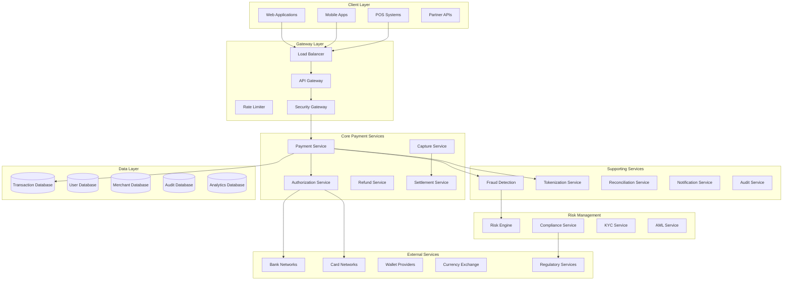
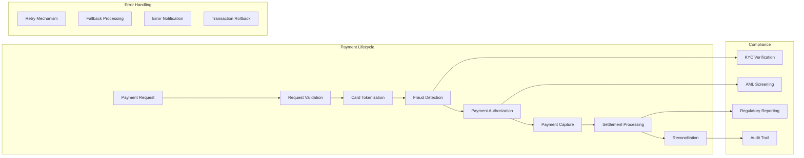
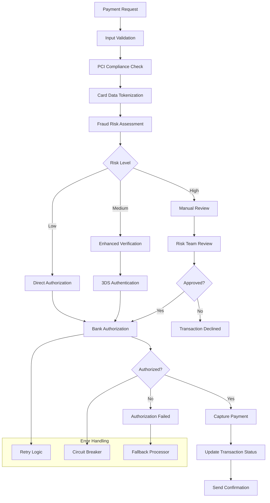
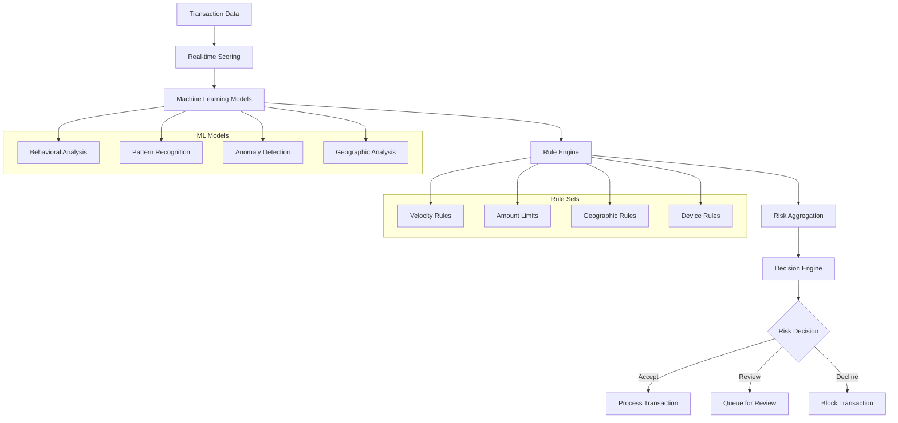
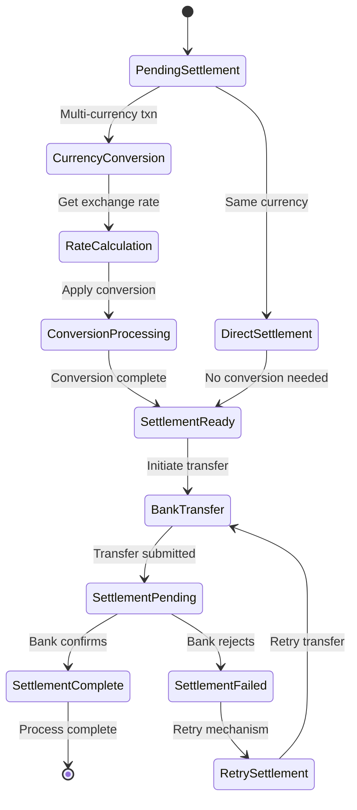
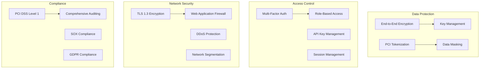

# Payment Processing System


## 📋 Table of Contents

- [Payment Processing System](#payment-processing-system)
  - [Requirements Gathering](#requirements-gathering)
    - [Functional Requirements](#functional-requirements)
    - [Non-Functional Requirements](#non-functional-requirements)
  - [Traffic Estimation & Capacity Planning](#traffic-estimation-capacity-planning)
    - [User Base Analysis](#user-base-analysis)
    - [Traffic Calculations](#traffic-calculations)
  - [Database Schema Design](#database-schema-design)
    - [Transaction Database Schema](#transaction-database-schema)
    - [Fraud Detection Schema](#fraud-detection-schema)
  - [Sample API Endpoints](#sample-api-endpoints)
    - [Payment Processing APIs](#payment-processing-apis)
    - [Refund APIs](#refund-apis)
    - [Payment Methods APIs](#payment-methods-apis)
    - [Fraud Detection APIs](#fraud-detection-apis)
    - [Webhook APIs](#webhook-apis)
    - [Analytics & Reporting APIs](#analytics-reporting-apis)
  - [High-Level Design (HLD)](#high-level-design-hld)
    - [System Architecture Overview](#system-architecture-overview)
    - [Payment Flow Architecture](#payment-flow-architecture)
  - [Low-Level Design (LLD)](#low-level-design-lld)
    - [Transaction Processing Pipeline](#transaction-processing-pipeline)
    - [Fraud Detection Engine](#fraud-detection-engine)
    - [Multi-Currency Settlement](#multi-currency-settlement)
  - [Core Algorithms](#core-algorithms)
    - [1. Real-time Fraud Detection Algorithm](#1-real-time-fraud-detection-algorithm)
    - [2. Payment Routing and Optimization Algorithm](#2-payment-routing-and-optimization-algorithm)
    - [3. Multi-Currency Exchange Rate Management](#3-multi-currency-exchange-rate-management)
    - [4. Settlement and Reconciliation Algorithm](#4-settlement-and-reconciliation-algorithm)
    - [5. PCI DSS Compliance and Security](#5-pci-dss-compliance-and-security)
  - [Performance Optimizations](#performance-optimizations)
    - [High Throughput Processing](#high-throughput-processing)
    - [Caching Strategy](#caching-strategy)
  - [Security Considerations](#security-considerations)
    - [Comprehensive Security Framework](#comprehensive-security-framework)
    - [Regulatory Compliance](#regulatory-compliance)
  - [Testing Strategy](#testing-strategy)
    - [Load Testing Scenarios](#load-testing-scenarios)
  - [Trade-offs and Considerations](#trade-offs-and-considerations)
    - [Security vs Performance](#security-vs-performance)
    - [Availability vs Consistency](#availability-vs-consistency)
    - [Cost vs Features](#cost-vs-features)

---

## Requirements Gathering

[⬆️ Back to Top](#--table-of-contents)

---


### Functional Requirements

[⬆️ Back to Top](#--table-of-contents)

---


**Core Payment Features:**
- Process credit/debit card payments
- Support multiple payment methods (PayPal, Apple Pay, Google Pay, bank transfers)
- Handle domestic and international transactions
- Multi-currency support with real-time exchange rates
- Recurring payments and subscriptions
- Refunds and partial refunds
- Payment splitting between multiple recipients
- Digital wallet integration
- Cryptocurrency payment support
- Payment scheduling and delayed payments

**Transaction Management:**
- Real-time payment authorization
- Transaction status tracking
- Payment history and receipts
- Dispute management and chargebacks
- Fraud detection and prevention
- Transaction reconciliation
- Batch payment processing
- Payment retry logic for failed transactions

**Compliance & Security:**
- PCI DSS compliance
- KYC (Know Your Customer) verification
- AML (Anti-Money Laundering) checks
- GDPR data protection compliance
- SOX compliance for financial reporting
- Regional compliance (SEPA, ACH, etc.)

### Non-Functional Requirements

[⬆️ Back to Top](#--table-of-contents)

---


**Performance:**
- Payment processing latency < 200ms
- Support 100,000 transactions per second
- 99.99% uptime SLA
- Handle traffic spikes during sales events
- Sub-second fraud detection

**Scalability:**
- Horizontal scaling across multiple regions
- Handle Black Friday/Cyber Monday traffic
- Auto-scaling based on transaction volume
- Support for millions of merchants

**Security:**
- End-to-end encryption for sensitive data
- Tokenization of payment credentials
- Real-time fraud monitoring
- Multi-factor authentication
- Zero trust security model
- Regular security audits and penetration testing

**Reliability:**
- Zero transaction data loss
- Automatic failover and disaster recovery
- Data replication across multiple data centers
- Circuit breaker patterns for external services

## Traffic Estimation & Capacity Planning

[⬆️ Back to Top](#--table-of-contents)

---


### User Base Analysis

[⬆️ Back to Top](#--table-of-contents)

---

- **Merchants:** 2 million active merchants
- **End Customers:** 100 million registered users
- **Daily Transactions:** 50 million transactions
- **Peak TPS:** 100,000 transactions per second
- **Average Transaction Value:** $75
- **Peak Traffic Multiplier:** 5x during sales events

### Traffic Calculations

[⬆️ Back to Top](#--table-of-contents)

---


**Transaction Volume:**
```
Daily Transactions = 50M transactions/day
Peak TPS = 50M × 5 / (24 × 3600) = 289 TPS average
Black Friday Peak = 289 × 5 = 1,445 TPS sustained
Flash Sale Peak = 100,000 TPS (short bursts)

Transaction Types Distribution:
- Credit/Debit Cards: 70% (35M/day)
- Digital Wallets: 20% (10M/day)  
- Bank Transfers: 8% (4M/day)
- Cryptocurrency: 2% (1M/day)
```

**Storage Requirements:**
```
Transaction Data:
- Transaction record = 2KB (payment details + metadata)
- Daily storage = 50M × 2KB = 100GB/day
- Annual storage = 100GB × 365 = 36.5TB/year
- 7-year retention = 36.5TB × 7 = 255TB

Fraud Detection Data:
- Behavioral patterns = 500 bytes per transaction
- Daily fraud data = 50M × 500B = 25GB/day
- ML model features storage = 10TB
```

**Infrastructure Sizing:**
```
Application Servers:
- Payment processing: 50 servers
- Fraud detection: 30 servers
- Settlement processing: 20 servers
- Reporting & analytics: 15 servers

Database Requirements:
- Transaction DB: 100 shards, 64GB RAM each
- User/Merchant DB: 20 shards, 32GB RAM each
- Fraud detection DB: 10 shards, 128GB RAM each
- Audit logs DB: 50 shards, 16GB RAM each

Cache Infrastructure:
- Redis clusters: 500GB total memory
- Session cache: 100GB
- Fraud detection cache: 200GB
- Exchange rates cache: 50GB
```

## Database Schema Design

[⬆️ Back to Top](#--table-of-contents)

---


### Transaction Database Schema

[⬆️ Back to Top](#--table-of-contents)

---


```sql
-- Transactions table (sharded by merchant_id)
CREATE TABLE transactions (
    transaction_id VARCHAR(128) PRIMARY KEY, -- UUID
    merchant_id BIGINT NOT NULL,
    customer_id BIGINT,
    payment_method_id BIGINT NOT NULL,
    amount DECIMAL(15,2) NOT NULL,
    currency_code CHAR(3) NOT NULL,
    original_amount DECIMAL(15,2), -- For currency conversion
    original_currency CHAR(3),
    exchange_rate DECIMAL(10,6),
    transaction_type ENUM('payment', 'refund', 'chargeback', 'fee') NOT NULL,
    status ENUM('pending', 'authorized', 'captured', 'failed', 'cancelled', 'refunded') NOT NULL,
    payment_processor ENUM('stripe', 'paypal', 'square', 'braintree') NOT NULL,
    processor_transaction_id VARCHAR(255),
    description TEXT,
    metadata JSON,
    created_at TIMESTAMP DEFAULT CURRENT_TIMESTAMP,
    updated_at TIMESTAMP DEFAULT CURRENT_TIMESTAMP ON UPDATE CURRENT_TIMESTAMP,
    authorized_at TIMESTAMP,
    captured_at TIMESTAMP,
    failed_at TIMESTAMP,
    
    INDEX idx_merchant_created (merchant_id, created_at),
    INDEX idx_customer_created (customer_id, created_at),
    INDEX idx_status_created (status, created_at),
    INDEX idx_processor_id (processor_transaction_id)
);

-- Payment methods table
CREATE TABLE payment_methods (
    payment_method_id BIGINT PRIMARY KEY AUTO_INCREMENT,
    customer_id BIGINT NOT NULL,
    method_type ENUM('card', 'bank_account', 'digital_wallet', 'crypto') NOT NULL,
    provider ENUM('visa', 'mastercard', 'amex', 'paypal', 'apple_pay', 'google_pay') NOT NULL,
    token VARCHAR(255) NOT NULL, -- Tokenized sensitive data
    last_four_digits VARCHAR(4),
    expiry_month TINYINT,
    expiry_year SMALLINT,
    cardholder_name VARCHAR(255),
    billing_address_id BIGINT,
    is_default BOOLEAN DEFAULT FALSE,
    is_verified BOOLEAN DEFAULT FALSE,
    created_at TIMESTAMP DEFAULT CURRENT_TIMESTAMP,
    updated_at TIMESTAMP DEFAULT CURRENT_TIMESTAMP ON UPDATE CURRENT_TIMESTAMP,
    
    INDEX idx_customer_type (customer_id, method_type),
    INDEX idx_token (token),
    FOREIGN KEY (customer_id) REFERENCES customers(customer_id)
);

-- Merchants table
CREATE TABLE merchants (
    merchant_id BIGINT PRIMARY KEY AUTO_INCREMENT,
    business_name VARCHAR(255) NOT NULL,
    business_type ENUM('individual', 'corporation', 'partnership', 'non_profit') NOT NULL,
    tax_id VARCHAR(50),
    business_address_id BIGINT,
    contact_email VARCHAR(255) NOT NULL,
    contact_phone VARCHAR(20),
    website_url VARCHAR(512),
    industry_code VARCHAR(10), -- NAICS code
    risk_level ENUM('low', 'medium', 'high') DEFAULT 'medium',
    kyc_status ENUM('pending', 'approved', 'rejected', 'under_review') DEFAULT 'pending',
    kyc_verified_at TIMESTAMP NULL,
    settlement_currency CHAR(3) DEFAULT 'USD',
    fee_structure JSON, -- Custom fee arrangement
    created_at TIMESTAMP DEFAULT CURRENT_TIMESTAMP,
    updated_at TIMESTAMP DEFAULT CURRENT_TIMESTAMP ON UPDATE CURRENT_TIMESTAMP,
    is_active BOOLEAN DEFAULT TRUE,
    
    INDEX idx_business_name (business_name),
    INDEX idx_kyc_status (kyc_status),
    INDEX idx_risk_level (risk_level)
);
```

### Fraud Detection Schema

[⬆️ Back to Top](#--table-of-contents)

---


```sql
-- Fraud detection rules
CREATE TABLE fraud_rules (
    rule_id BIGINT PRIMARY KEY AUTO_INCREMENT,
    rule_name VARCHAR(255) NOT NULL,
    rule_type ENUM('velocity', 'geolocation', 'device', 'behavioral', 'amount') NOT NULL,
    rule_condition JSON NOT NULL, -- Rule parameters and thresholds
    action ENUM('flag', 'block', 'require_verification') NOT NULL,
    risk_score INT NOT NULL, -- 0-100
    is_active BOOLEAN DEFAULT TRUE,
    created_at TIMESTAMP DEFAULT CURRENT_TIMESTAMP,
    updated_at TIMESTAMP DEFAULT CURRENT_TIMESTAMP ON UPDATE CURRENT_TIMESTAMP,
    
    INDEX idx_rule_type (rule_type),
    INDEX idx_is_active (is_active)
);

-- Fraud detection events
CREATE TABLE fraud_events (
    event_id BIGINT PRIMARY KEY AUTO_INCREMENT,
    transaction_id VARCHAR(128) NOT NULL,
    rule_id BIGINT NOT NULL,
    risk_score INT NOT NULL,
    event_type ENUM('rule_triggered', 'manual_review', 'false_positive') NOT NULL,
    event_data JSON,
    reviewed_by BIGINT NULL, -- Staff member who reviewed
    review_decision ENUM('approve', 'decline', 'pending') NULL,
    review_notes TEXT,
    created_at TIMESTAMP DEFAULT CURRENT_TIMESTAMP,
    reviewed_at TIMESTAMP NULL,
    
    INDEX idx_transaction_id (transaction_id),
    INDEX idx_rule_id (rule_id),
    INDEX idx_created_at (created_at),
    FOREIGN KEY (transaction_id) REFERENCES transactions(transaction_id),
    FOREIGN KEY (rule_id) REFERENCES fraud_rules(rule_id)
);
```

## Sample API Endpoints

[⬆️ Back to Top](#--table-of-contents)

---


### Payment Processing APIs

[⬆️ Back to Top](#--table-of-contents)

---


```http
POST /api/v1/transactions
Authorization: Bearer <merchant_api_key>
Content-Type: application/json

{
    "amount": 99.99,
    "currency": "USD",
    "payment_method_id": 12345,
    "customer_id": 67890,
    "description": "Premium subscription purchase",
    "metadata": {
        "order_id": "ORDER-2024-001",
        "product_id": "premium_plan"
    }
}

Response (201 Created):
{
    "success": true,
    "data": {
        "transaction_id": "txn_1a2b3c4d5e6f",
        "status": "authorized",
        "amount": 99.99,
        "currency": "USD",
        "fee_amount": 3.19,
        "net_amount": 96.80,
        "created_at": "2024-01-15T10:30:00Z",
        "estimated_settlement": "2024-01-17T10:30:00Z"
    }
}
```

```http
POST /api/v1/transactions/{transaction_id}/capture
Authorization: Bearer <merchant_api_key>
Content-Type: application/json

{
    "amount": 99.99 // Optional: partial capture
}

Response (200 OK):
{
    "success": true,
    "data": {
        "transaction_id": "txn_1a2b3c4d5e6f",
        "status": "captured",
        "captured_amount": 99.99,
        "captured_at": "2024-01-15T10:35:00Z"
    }
}
```

### Refund APIs

[⬆️ Back to Top](#--table-of-contents)

---


```http
POST /api/v1/transactions/{transaction_id}/refund
Authorization: Bearer <merchant_api_key>
Content-Type: application/json

{
    "amount": 50.00, // Partial refund
    "reason": "customer_request",
    "description": "Partial refund for damaged item"
}

Response (201 Created):
{
    "success": true,
    "data": {
        "refund_id": "ref_9z8y7x6w5v4u",
        "transaction_id": "txn_1a2b3c4d5e6f",
        "amount": 50.00,
        "status": "pending",
        "estimated_arrival": "2024-01-20T10:30:00Z",
        "created_at": "2024-01-15T11:00:00Z"
    }
}
```

### Payment Methods APIs

[⬆️ Back to Top](#--table-of-contents)

---


```http
POST /api/v1/customers/{customer_id}/payment_methods
Authorization: Bearer <api_key>
Content-Type: application/json

{
    "type": "card",
    "card": {
        "number": "4242424242424242",
        "exp_month": 12,
        "exp_year": 2028,
        "cvc": "123",
        "cardholder_name": "John Doe"
    },
    "billing_address": {
        "line1": "123 Main St",
        "city": "San Francisco",
        "state": "CA",
        "postal_code": "94105",
        "country": "US"
    }
}

Response (201 Created):
{
    "success": true,
    "data": {
        "payment_method_id": 12345,
        "type": "card",
        "card": {
            "brand": "visa",
            "last_four": "4242",
            "exp_month": 12,
            "exp_year": 2028
        },
        "is_verified": true,
        "created_at": "2024-01-15T10:25:00Z"
    }
}
```

### Fraud Detection APIs

[⬆️ Back to Top](#--table-of-contents)

---


```http
GET /api/v1/transactions/{transaction_id}/fraud_analysis
Authorization: Bearer <merchant_api_key>

Response (200 OK):
{
    "success": true,
    "data": {
        "transaction_id": "txn_1a2b3c4d5e6f",
        "risk_score": 25,
        "risk_level": "low",
        "triggered_rules": [],
        "recommendations": [
            {
                "action": "proceed",
                "confidence": 0.95,
                "reason": "Low risk transaction from verified customer"
            }
        ],
        "device_fingerprint": {
            "device_id": "dev_abc123",
            "is_known_device": true,
            "location": "San Francisco, CA"
        }
    }
}
```

### Webhook APIs

[⬆️ Back to Top](#--table-of-contents)

---


```http
POST /merchant/webhooks/payments
Content-Type: application/json
X-Signature: sha256=abc123...

{
    "event_type": "transaction.captured",
    "event_id": "evt_1a2b3c4d",
    "created_at": "2024-01-15T10:35:00Z",
    "data": {
        "transaction_id": "txn_1a2b3c4d5e6f",
        "status": "captured",
        "amount": 99.99,
        "currency": "USD",
        "merchant_id": 12345
    }
}

// Merchant should respond with 200 OK
Response (200 OK):
{
    "received": true
}
```

### Analytics & Reporting APIs

[⬆️ Back to Top](#--table-of-contents)

---


```http
GET /api/v1/merchants/{merchant_id}/analytics?start_date=2024-01-01&end_date=2024-01-31
Authorization: Bearer <merchant_api_key>

Response (200 OK):
{
    "success": true,
    "data": {
        "period": {
            "start_date": "2024-01-01",
            "end_date": "2024-01-31"
        },
        "summary": {
            "total_transactions": 15420,
            "total_volume": 1547823.45,
            "successful_transactions": 14891,
            "failed_transactions": 529,
            "success_rate": 96.57,
            "average_transaction_value": 100.38
        },
        "daily_breakdown": [
            {
                "date": "2024-01-01",
                "transaction_count": 234,
                "volume": 23456.78,
                "success_rate": 95.3
            }
        ],
        "payment_methods": {
            "credit_card": {"count": 10794, "percentage": 70.0},
            "debit_card": {"count": 3084, "percentage": 20.0},
            "digital_wallet": {"count": 1542, "percentage": 10.0}
        }
    }
}
```

## High-Level Design (HLD)

[⬆️ Back to Top](#--table-of-contents)

---


### System Architecture Overview

[⬆️ Back to Top](#--table-of-contents)

---




### Payment Flow Architecture

[⬆️ Back to Top](#--table-of-contents)

---




## Low-Level Design (LLD)

[⬆️ Back to Top](#--table-of-contents)

---


### Transaction Processing Pipeline

[⬆️ Back to Top](#--table-of-contents)

---




### Fraud Detection Engine

[⬆️ Back to Top](#--table-of-contents)

---




### Multi-Currency Settlement

[⬆️ Back to Top](#--table-of-contents)

---




## Core Algorithms

[⬆️ Back to Top](#--table-of-contents)

---


### 1. Real-time Fraud Detection Algorithm

[⬆️ Back to Top](#--table-of-contents)

---


**Purpose**: Detect fraudulent transactions in real-time with minimal false positives.

**Multi-Layer Fraud Detection**:
```
FraudDetectionConfig = {
  riskThresholds: {
    low: 0.3,      // Accept automatically
    medium: 0.7,   // Require additional verification
    high: 0.9      // Decline or manual review
  },
  velocityLimits: {
    maxTransactionsPerHour: 10,
    maxAmountPerDay: 10000,
    maxFailedAttemptsPerHour: 3
  },
  geographicRules: {
    enableLocationChecking: true,
    maxDistanceKm: 1000,    // Max travel distance between transactions
    timeWindowMinutes: 60   // Time window for location checks
  }
}

function detectFraud(transaction, userProfile, context):
  riskScore = 0
  riskFactors = []
  
  // Velocity-based risk assessment
  velocityRisk = assessVelocityRisk(transaction, userProfile)
  riskScore += velocityRisk.score * 0.25
  if velocityRisk.triggered:
    riskFactors.push(...velocityRisk.factors)
  
  // Amount-based risk assessment
  amountRisk = assessAmountRisk(transaction, userProfile)
  riskScore += amountRisk.score * 0.20
  if amountRisk.triggered:
    riskFactors.push(...amountRisk.factors)
  
  // Geographic risk assessment
  geoRisk = assessGeographicRisk(transaction, userProfile, context)
  riskScore += geoRisk.score * 0.20
  if geoRisk.triggered:
    riskFactors.push(...geoRisk.factors)
  
  // Behavioral pattern analysis
  behaviorRisk = assessBehavioralRisk(transaction, userProfile)
  riskScore += behaviorRisk.score * 0.15
  if behaviorRisk.triggered:
    riskFactors.push(...behaviorRisk.factors)
  
  // Device and network analysis
  deviceRisk = assessDeviceRisk(transaction, context)
  riskScore += deviceRisk.score * 0.10
  if deviceRisk.triggered:
    riskFactors.push(...deviceRisk.factors)
  
  // Machine learning model prediction
  mlRisk = mlFraudModel.predict(transaction, userProfile, context)
  riskScore += mlRisk.score * 0.10
  if mlRisk.triggered:
    riskFactors.push(...mlRisk.factors)
  
  // Determine risk level and action
  riskLevel = categorizeRisk(riskScore)
  recommendedAction = determineAction(riskLevel, riskFactors)
  
  return {
    riskScore: riskScore,
    riskLevel: riskLevel,
    riskFactors: riskFactors,
    recommendedAction: recommendedAction,
    requiresReview: riskScore >= FraudDetectionConfig.riskThresholds.medium
  }
```

**Velocity Risk Assessment**:
```
function assessVelocityRisk(transaction, userProfile):
  currentTime = Date.now()
  hourStart = currentTime - 3600000   // 1 hour
  dayStart = currentTime - 86400000   // 24 hours
  
  // Check transaction count velocity
  recentTransactions = getTransactionCount(userProfile.userId, hourStart, currentTime)
  if recentTransactions > FraudDetectionConfig.velocityLimits.maxTransactionsPerHour:
    return {
      triggered: true,
      score: 0.8,
      factors: ['excessive_transaction_frequency']
    }
  
  // Check amount velocity
  dailyAmount = getTransactionAmount(userProfile.userId, dayStart, currentTime)
  if dailyAmount + transaction.amount > FraudDetectionConfig.velocityLimits.maxAmountPerDay:
    return {
      triggered: true,
      score: 0.7,
      factors: ['excessive_daily_amount']
    }
  
  // Check failed attempts
  failedAttempts = getFailedTransactionCount(userProfile.userId, hourStart, currentTime)
  if failedAttempts > FraudDetectionConfig.velocityLimits.maxFailedAttemptsPerHour:
    return {
      triggered: true,
      score: 0.9,
      factors: ['excessive_failed_attempts']
    }
  
  // Calculate velocity score based on normal patterns
  normalVelocity = calculateNormalVelocity(userProfile)
  currentVelocity = recentTransactions / (3600000 / 1000) // transactions per second
  velocityRatio = currentVelocity / Math.max(normalVelocity, 0.001)
  
  velocityScore = Math.min(velocityRatio * 0.3, 0.6)
  
  return {
    triggered: false,
    score: velocityScore,
    factors: []
  }
```

### 2. Payment Routing and Optimization Algorithm

[⬆️ Back to Top](#--table-of-contents)

---


**Purpose**: Route payments through optimal processors to maximize success rates and minimize costs.

**Payment Processor Selection**:
```
ProcessorConfig = {
  processors: [
    {
      id: 'processor_a',
      successRate: 0.95,
      cost: 0.029,        // 2.9% + $0.30
      fixedFee: 0.30,
      regions: ['US', 'CA', 'EU'],
      cardTypes: ['visa', 'mastercard', 'amex'],
      currencies: ['USD', 'EUR', 'CAD']
    },
    {
      id: 'processor_b', 
      successRate: 0.92,
      cost: 0.025,        // 2.5% + $0.25
      fixedFee: 0.25,
      regions: ['US', 'CA'],
      cardTypes: ['visa', 'mastercard'],
      currencies: ['USD', 'CAD']
    }
  ],
  routingStrategy: 'success_rate_optimized', // or 'cost_optimized'
  fallbackEnabled: true,
  maxRetries: 3
}

function selectOptimalProcessor(transaction, context):
  eligibleProcessors = ProcessorConfig.processors.filter(processor => 
    isProcessorEligible(processor, transaction, context)
  )
  
  if eligibleProcessors.length === 0:
    return { success: false, reason: 'no_eligible_processors' }
  
  // Score processors based on multiple factors
  scoredProcessors = eligibleProcessors.map(processor => ({
    ...processor,
    score: calculateProcessorScore(processor, transaction, context)
  }))
  
  // Sort by score (descending)
  rankedProcessors = scoredProcessors.sort((a, b) => b.score - a.score)
  
  // Select primary processor and fallbacks
  primaryProcessor = rankedProcessors[0]
  fallbackProcessors = rankedProcessors.slice(1, 3) // Up to 2 fallbacks
  
  return {
    success: true,
    primary: primaryProcessor,
    fallbacks: fallbackProcessors
  }

function calculateProcessorScore(processor, transaction, context):
  score = 0
  
  // Success rate factor (40% weight)
  successRateScore = processor.successRate
  score += successRateScore * 0.4
  
  // Cost factor (30% weight) - lower cost = higher score
  totalCost = (transaction.amount * processor.cost) + processor.fixedFee
  costScore = 1 - (totalCost / transaction.amount) // Normalize cost as percentage
  score += costScore * 0.3
  
  // Historical performance for this merchant (20% weight)
  merchantPerformance = getMerchantProcessorPerformance(context.merchantId, processor.id)
  score += merchantPerformance.successRate * 0.2
  
  // Current processor load (10% weight)
  processorLoad = getCurrentProcessorLoad(processor.id)
  loadScore = Math.max(0, 1 - processorLoad) // Higher load = lower score
  score += loadScore * 0.1
  
  return score
```

**Retry and Fallback Logic**:
```
function processPaymentWithFallback(transaction, processorSelection):
  attempts = []
  
  // Try primary processor
  primaryResult = attemptPayment(transaction, processorSelection.primary)
  attempts.push(primaryResult)
  
  if primaryResult.success:
    return {
      success: true,
      result: primaryResult,
      attempts: attempts,
      finalProcessor: processorSelection.primary.id
    }
  
  // Try fallback processors if primary fails
  for fallbackProcessor in processorSelection.fallbacks:
    // Check if retry is warranted
    if not shouldRetryWithFallback(primaryResult, fallbackProcessor):
      continue
    
    fallbackResult = attemptPayment(transaction, fallbackProcessor)
    attempts.push(fallbackResult)
    
    if fallbackResult.success:
      return {
        success: true,
        result: fallbackResult,
        attempts: attempts,
        finalProcessor: fallbackProcessor.id
      }
  
  // All processors failed
  return {
    success: false,
    attempts: attempts,
    reason: 'all_processors_failed'
  }

function shouldRetryWithFallback(previousResult, fallbackProcessor):
  // Don't retry for certain error types
  nonRetryableErrors = [
    'insufficient_funds',
    'invalid_card',
    'expired_card',
    'blocked_card'
  ]
  
  if nonRetryableErrors.includes(previousResult.errorCode):
    return false
  
  // Check if fallback processor supports the card type
  if not fallbackProcessor.cardTypes.includes(previousResult.cardType):
    return false
  
  // Retry for technical failures
  retryableErrors = [
    'processor_timeout',
    'network_error',
    'temporary_decline',
    'processor_unavailable'
  ]
  
  return retryableErrors.includes(previousResult.errorCode)
```

### 3. Multi-Currency Exchange Rate Management

[⬆️ Back to Top](#--table-of-contents)

---


**Purpose**: Handle currency conversions with real-time rates and risk management.

**Exchange Rate Calculation**:
```
CurrencyConfig = {
  baseCurrency: 'USD',
  rateUpdateFrequency: 60000,  // 1 minute
  rateProviders: ['provider_a', 'provider_b', 'provider_c'],
  maxSpreadPercent: 2.0,       // Maximum spread allowed
  riskBuffer: 0.005            // 0.5% risk buffer
}

function calculateExchangeRate(fromCurrency, toCurrency, amount):
  if fromCurrency === toCurrency:
    return { rate: 1.0, amount: amount, fees: 0 }
  
  // Get current market rates from multiple providers
  marketRates = await getMarketRates(fromCurrency, toCurrency)
  
  // Calculate average rate with outlier removal
  cleanedRates = removeOutliers(marketRates)
  averageRate = calculateWeightedAverage(cleanedRates)
  
  // Apply risk buffer and spread
  riskAdjustedRate = averageRate * (1 - CurrencyConfig.riskBuffer)
  
  // Calculate conversion fees
  conversionFee = calculateConversionFee(amount, fromCurrency, toCurrency)
  
  // Calculate final converted amount
  convertedAmount = (amount * riskAdjustedRate) - conversionFee
  
  return {
    rate: riskAdjustedRate,
    marketRate: averageRate,
    amount: convertedAmount,
    fees: conversionFee,
    spread: Math.abs(riskAdjustedRate - averageRate) / averageRate * 100
  }

function hedgeCurrencyRisk(transactions, timeWindow = 3600000): // 1 hour
  // Group transactions by currency pair
  currencyPairs = groupByCurrencyPair(transactions)
  
  hedgingActions = []
  
  for pair in currencyPairs:
    netExposure = calculateNetExposure(pair.transactions)
    
    // Hedge if exposure exceeds threshold
    if Math.abs(netExposure.amount) > getHedgeThreshold(pair.fromCurrency, pair.toCurrency):
      hedgeAction = {
        fromCurrency: pair.fromCurrency,
        toCurrency: pair.toCurrency,
        amount: netExposure.amount,
        direction: netExposure.amount > 0 ? 'sell' : 'buy',
        hedgeInstrument: 'forward_contract',
        maturity: timeWindow + 86400000 // 1 day settlement
      }
      
      hedgingActions.push(hedgeAction)
  
  return hedgingActions
```

### 4. Settlement and Reconciliation Algorithm

[⬆️ Back to Top](#--table-of-contents)

---


**Purpose**: Ensure accurate settlement of funds and reconciliation with bank statements.

**Settlement Processing**:
```
SettlementConfig = {
  batchSize: 1000,
  settlementSchedule: {
    frequency: 'daily',
    time: '23:00',
    timezone: 'UTC'
  },
  holdPeriod: {
    newMerchant: 7 * 24 * 3600 * 1000,  // 7 days for new merchants
    regular: 2 * 24 * 3600 * 1000,       // 2 days for regular merchants
    premium: 24 * 3600 * 1000             // 1 day for premium merchants
  }
}

function processSettlement(merchantId, settlementDate):
  merchant = getMerchant(merchantId)
  
  // Get eligible transactions for settlement
  eligibleTransactions = getEligibleTransactions(merchantId, settlementDate)
  
  if eligibleTransactions.length === 0:
    return { success: true, message: 'no_transactions_to_settle' }
  
  // Calculate net settlement amount
  settlementSummary = calculateSettlementSummary(eligibleTransactions)
  
  // Apply fees and reserves
  fees = calculateMerchantFees(settlementSummary, merchant)
  reserves = calculateReserves(settlementSummary, merchant)
  
  netSettlementAmount = settlementSummary.grossAmount - fees.total - reserves.total
  
  if netSettlementAmount <= 0:
    return { success: false, reason: 'negative_settlement_amount' }
  
  // Create settlement batch
  settlementBatch = {
    id: generateSettlementId(),
    merchantId: merchantId,
    settlementDate: settlementDate,
    transactions: eligibleTransactions,
    grossAmount: settlementSummary.grossAmount,
    fees: fees,
    reserves: reserves,
    netAmount: netSettlementAmount,
    status: 'pending'
  }
  
  // Initiate bank transfer
  transferResult = initiateBankTransfer(
    merchant.bankAccount,
    netSettlementAmount,
    settlementBatch.id
  )
  
  if transferResult.success:
    settlementBatch.status = 'initiated'
    settlementBatch.bankTransactionId = transferResult.transactionId
    
    // Store settlement record
    storeSettlementBatch(settlementBatch)
    
    // Send settlement notification
    sendSettlementNotification(merchantId, settlementBatch)
    
    return { success: true, settlementBatch: settlementBatch }
  else:
    return { success: false, reason: 'bank_transfer_failed', error: transferResult.error }
```

**Reconciliation Engine**:
```
function performReconciliation(date, bankStatements):
  reconciliationReport = {
    date: date,
    totalTransactions: 0,
    matchedTransactions: 0,
    unmatchedInternal: [],
    unmatchedBank: [],
    discrepancies: [],
    status: 'pending'
  }
  
  // Get internal transaction records for the date
  internalTransactions = getInternalTransactions(date)
  reconciliationReport.totalTransactions = internalTransactions.length
  
  // Match transactions with bank statements
  for internalTxn in internalTransactions:
    bankMatch = findBankMatch(internalTxn, bankStatements)
    
    if bankMatch:
      if amountsMatch(internalTxn.amount, bankMatch.amount):
        reconciliationReport.matchedTransactions++
        markAsReconciled(internalTxn.id, bankMatch.id)
      else:
        // Amount discrepancy
        discrepancy = {
          type: 'amount_mismatch',
          internalTransaction: internalTxn,
          bankTransaction: bankMatch,
          difference: Math.abs(internalTxn.amount - bankMatch.amount)
        }
        reconciliationReport.discrepancies.push(discrepancy)
    else:
      // No matching bank transaction found
      reconciliationReport.unmatchedInternal.push(internalTxn)
  
  // Find bank transactions without internal matches
  for bankTxn in bankStatements:
    if not isMatched(bankTxn.id):
      reconciliationReport.unmatchedBank.push(bankTxn)
  
  // Determine reconciliation status
  if reconciliationReport.discrepancies.length === 0 and 
     reconciliationReport.unmatchedInternal.length === 0 and
     reconciliationReport.unmatchedBank.length === 0:
    reconciliationReport.status = 'reconciled'
  else:
    reconciliationReport.status = 'discrepancies_found'
  
  // Store reconciliation report
  storeReconciliationReport(reconciliationReport)
  
  // Alert on significant discrepancies
  if hasSignificantDiscrepancies(reconciliationReport):
    alertFinanceTeam(reconciliationReport)
  
  return reconciliationReport
```

### 5. PCI DSS Compliance and Security

[⬆️ Back to Top](#--table-of-contents)

---


**Purpose**: Ensure payment data security and regulatory compliance.

**Data Tokenization System**:
```
TokenizationConfig = {
  tokenFormat: 'format_preserving',    // Preserves original format
  keyRotationPeriod: 90 * 24 * 3600 * 1000,  // 90 days
  encryptionAlgorithm: 'AES-256-GCM',
  tokenLength: 16,
  checksumValidation: true
}

function tokenizeCardData(cardNumber, expiryDate, cvv):
  // Validate card data
  if not validateCardNumber(cardNumber):
    return { success: false, error: 'invalid_card_number' }
  
  // Generate format-preserving token
  token = generateFormatPreservingToken(cardNumber)
  
  // Encrypt sensitive data
  encryptedData = {
    cardNumber: encrypt(cardNumber, getCurrentEncryptionKey()),
    expiryDate: encrypt(expiryDate, getCurrentEncryptionKey()),
    cvv: encrypt(cvv, getCurrentEncryptionKey())
  }
  
  // Store in secure vault
  vaultRecord = {
    token: token,
    encryptedData: encryptedData,
    keyVersion: getCurrentKeyVersion(),
    createdAt: Date.now(),
    lastUsed: Date.now()
  }
  
  storeInVault(token, vaultRecord)
  
  // Return token (safe to store/transmit)
  return {
    success: true,
    token: token,
    last4Digits: cardNumber.slice(-4),
    cardType: detectCardType(cardNumber)
  }

function detokenizeCardData(token):
  // Retrieve from secure vault
  vaultRecord = getFromVault(token)
  
  if not vaultRecord:
    return { success: false, error: 'token_not_found' }
  
  // Check token expiry
  if isTokenExpired(vaultRecord):
    return { success: false, error: 'token_expired' }
  
  // Decrypt sensitive data
  decryptionKey = getEncryptionKey(vaultRecord.keyVersion)
  
  decryptedData = {
    cardNumber: decrypt(vaultRecord.encryptedData.cardNumber, decryptionKey),
    expiryDate: decrypt(vaultRecord.encryptedData.expiryDate, decryptionKey),
    cvv: decrypt(vaultRecord.encryptedData.cvv, decryptionKey)
  }
  
  // Update last used timestamp
  updateLastUsed(token)
  
  return {
    success: true,
    cardData: decryptedData
  }
```

## Performance Optimizations

[⬆️ Back to Top](#--table-of-contents)

---


### High Throughput Processing

[⬆️ Back to Top](#--table-of-contents)

---


**Batch Processing Optimization**:
```
BatchConfig = {
  maxBatchSize: 1000,
  batchTimeout: 5000,     // 5 seconds
  parallelWorkers: 10,
  retryAttempts: 3
}
```

**Database Optimization**:
- Use read replicas for reporting queries
- Implement database sharding by merchant ID
- Optimize indices for transaction lookups
- Use time-series databases for analytics

### Caching Strategy

[⬆️ Back to Top](#--table-of-contents)

---


**Multi-Layer Caching**:
- Redis for session data and temporary tokens
- Application-level caching for merchant configurations
- CDN caching for static assets
- Database query result caching

## Security Considerations

[⬆️ Back to Top](#--table-of-contents)

---


### Comprehensive Security Framework

[⬆️ Back to Top](#--table-of-contents)

---




### Regulatory Compliance

[⬆️ Back to Top](#--table-of-contents)

---


**Compliance Framework**:
- PCI DSS Level 1 compliance
- SOX financial reporting compliance
- GDPR data protection compliance
- Anti-money laundering (AML) compliance
- Know Your Customer (KYC) requirements

## Testing Strategy

[⬆️ Back to Top](#--table-of-contents)

---


### Load Testing Scenarios

[⬆️ Back to Top](#--table-of-contents)

---


**High Volume Testing**:
- Black Friday transaction volumes
- Flash sale payment spikes
- DDoS attack simulation
- Database failover testing

**Security Testing**:
- Penetration testing
- Vulnerability assessments
- PCI DSS compliance validation
- Fraud detection accuracy testing

## Trade-offs and Considerations

[⬆️ Back to Top](#--table-of-contents)

---


### Security vs Performance

[⬆️ Back to Top](#--table-of-contents)

---

- **Encryption overhead**: Security vs processing speed
- **Fraud detection**: Accuracy vs transaction approval rates
- **Tokenization**: Security vs system complexity
- **Compliance**: Regulatory requirements vs operational efficiency

### Availability vs Consistency

[⬆️ Back to Top](#--table-of-contents)

---

- **Transaction processing**: Strong consistency vs high availability
- **Settlement**: Accuracy vs processing speed
- **Reconciliation**: Real-time vs batch processing
- **Fraud detection**: Real-time vs comprehensive analysis

### Cost vs Features

[⬆️ Back to Top](#--table-of-contents)

---

- **Multiple processors**: Redundancy vs processing fees
- **Global coverage**: Worldwide acceptance vs infrastructure cost
- **Real-time analytics**: Business insights vs computational resources
- **Compliance**: Regulatory compliance vs operational complexity

This payment processing system provides a comprehensive foundation for handling financial transactions with features like intelligent fraud detection, optimal payment routing, multi-currency support, and robust security measures while maintaining PCI DSS compliance and high availability standards. 