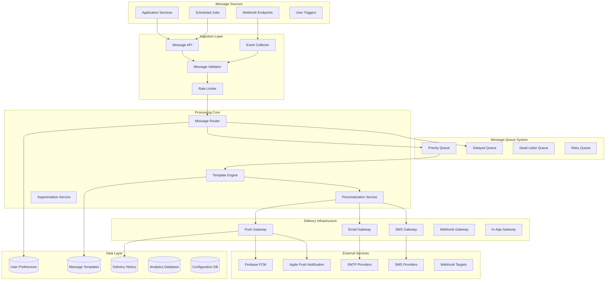
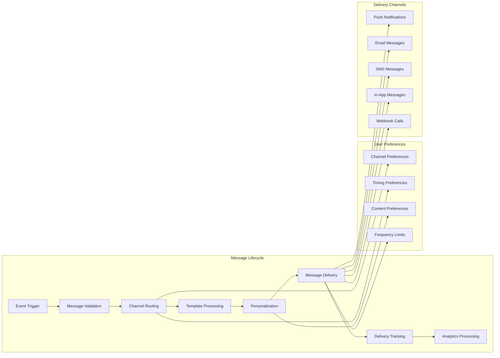
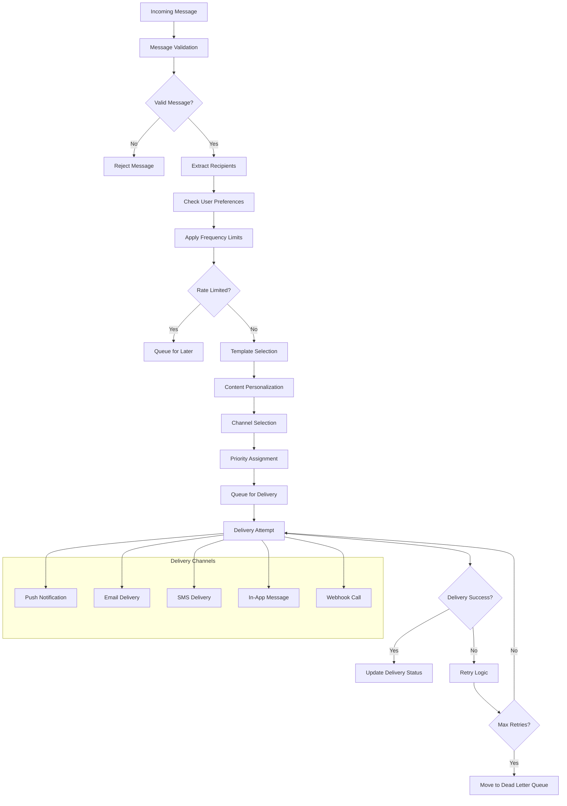
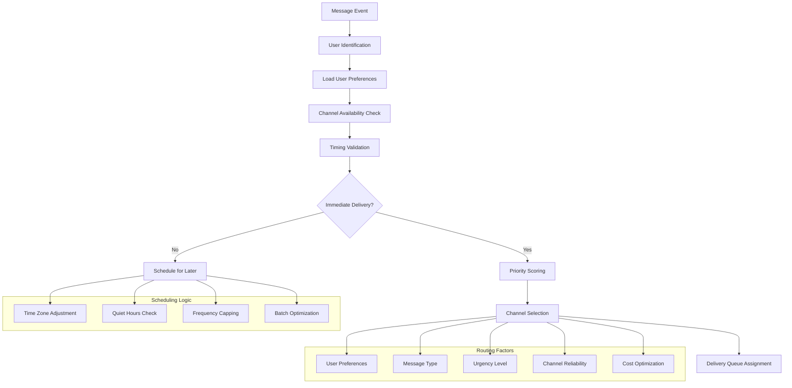
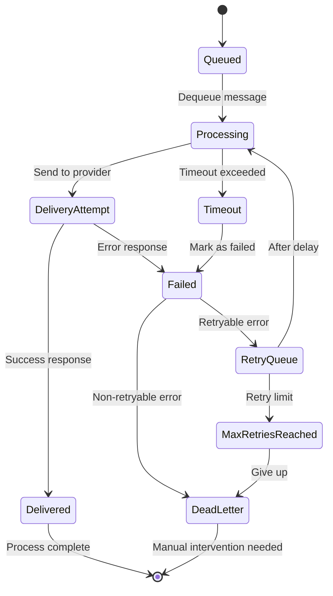
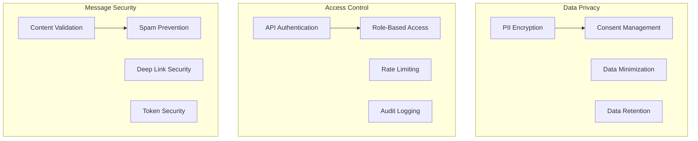

# Distributed Notification System


## 📋 Table of Contents

- [Distributed Notification System](#distributed-notification-system)
  - [High-Level Design (HLD)](#high-level-design-hld)
    - [System Architecture Overview](#system-architecture-overview)
    - [Notification Flow Architecture](#notification-flow-architecture)
  - [Low-Level Design (LLD)](#low-level-design-lld)
    - [Message Processing Pipeline](#message-processing-pipeline)
    - [Smart Routing Engine](#smart-routing-engine)
    - [Delivery Reliability System](#delivery-reliability-system)
  - [Core Algorithms](#core-algorithms)
    - [1. Intelligent Message Routing Algorithm](#1-intelligent-message-routing-algorithm)
    - [2. Frequency Capping and Rate Limiting Algorithm](#2-frequency-capping-and-rate-limiting-algorithm)
    - [3. Template Engine and Personalization Algorithm](#3-template-engine-and-personalization-algorithm)
    - [4. Delivery Reliability and Retry Logic](#4-delivery-reliability-and-retry-logic)
    - [5. Analytics and Performance Monitoring](#5-analytics-and-performance-monitoring)
  - [Performance Optimizations](#performance-optimizations)
    - [Message Queue Optimization](#message-queue-optimization)
    - [Database Optimization](#database-optimization)
    - [Caching Strategy](#caching-strategy)
  - [Security Considerations](#security-considerations)
    - [Privacy and Data Protection](#privacy-and-data-protection)
  - [Testing Strategy](#testing-strategy)
    - [Load Testing Scenarios](#load-testing-scenarios)
    - [Reliability Testing](#reliability-testing)
  - [Trade-offs and Considerations](#trade-offs-and-considerations)
    - [Delivery Speed vs Reliability](#delivery-speed-vs-reliability)
    - [Personalization vs Privacy](#personalization-vs-privacy)
    - [Scalability vs Cost](#scalability-vs-cost)

---

## High-Level Design (HLD)

[⬆️ Back to Top](#-table-of-contents)

---


### System Architecture Overview

[⬆️ Back to Top](#-table-of-contents)

---




### Notification Flow Architecture

[⬆️ Back to Top](#-table-of-contents)

---




## Low-Level Design (LLD)

[⬆️ Back to Top](#-table-of-contents)

---


### Message Processing Pipeline

[⬆️ Back to Top](#-table-of-contents)

---




### Smart Routing Engine

[⬆️ Back to Top](#-table-of-contents)

---




### Delivery Reliability System

[⬆️ Back to Top](#-table-of-contents)

---




## Core Algorithms

[⬆️ Back to Top](#-table-of-contents)

---


### 1. Intelligent Message Routing Algorithm

[⬆️ Back to Top](#-table-of-contents)

---


**Purpose**: Route messages through optimal channels based on user preferences, message urgency, and delivery success rates.

**Channel Selection Algorithm**:
```
ChannelConfig = {
  channels: {
    push: { reliability: 0.95, cost: 0.001, latency: 1000 },
    email: { reliability: 0.98, cost: 0.01, latency: 5000 },
    sms: { reliability: 0.99, cost: 0.05, latency: 3000 },
    inapp: { reliability: 0.90, cost: 0.0001, latency: 500 },
    webhook: { reliability: 0.85, cost: 0.002, latency: 2000 }
  },
  routingStrategy: 'reliability_optimized', // or 'cost_optimized', 'latency_optimized'
  fallbackEnabled: true,
  maxChannelsPerMessage: 3
}

function selectOptimalChannels(message, user, context):
  // Get user's enabled channels
  userChannels = getUserEnabledChannels(user.id, message.type)
  
  if userChannels.length === 0:
    return { success: false, reason: 'no_enabled_channels' }
  
  // Score each channel
  scoredChannels = userChannels.map(channel => ({
    channel: channel,
    score: calculateChannelScore(channel, message, user, context)
  }))
  
  // Sort by score (descending)
  rankedChannels = scoredChannels.sort((a, b) => b.score - a.score)
  
  // Select primary and fallback channels
  selectedChannels = rankedChannels.slice(0, ChannelConfig.maxChannelsPerMessage)
  
  return {
    success: true,
    primary: selectedChannels[0],
    fallbacks: selectedChannels.slice(1)
  }

function calculateChannelScore(channel, message, user, context):
  channelInfo = ChannelConfig.channels[channel]
  score = 0
  
  // Reliability factor (40% weight)
  reliabilityScore = channelInfo.reliability
  score += reliabilityScore * 0.4
  
  // User preference factor (30% weight)
  userPreference = getUserChannelPreference(user.id, channel, message.type)
  score += userPreference * 0.3
  
  // Message urgency alignment (20% weight)
  urgencyAlignment = calculateUrgencyAlignment(channel, message.urgency)
  score += urgencyAlignment * 0.2
  
  // Cost factor (10% weight) - lower cost = higher score
  costScore = 1 - (channelInfo.cost / MAX_CHANNEL_COST)
  score += costScore * 0.1
  
  // Apply channel-specific penalties
  if isChannelOverloaded(channel):
    score *= 0.8
  
  if hasRecentFailures(user.id, channel):
    score *= 0.7
  
  return score
```

**Smart Fallback Logic**:
```
function executeDeliveryWithFallback(message, channelSelection, user):
  deliveryAttempts = []
  
  // Try primary channel
  primaryResult = attemptDelivery(message, channelSelection.primary, user)
  deliveryAttempts.push(primaryResult)
  
  if primaryResult.success:
    return {
      success: true,
      finalChannel: channelSelection.primary.channel,
      attempts: deliveryAttempts
    }
  
  // Try fallback channels
  for fallbackChannel in channelSelection.fallbacks:
    // Check if fallback is appropriate
    if not shouldRetryWithFallback(primaryResult, fallbackChannel, message):
      continue
    
    fallbackResult = attemptDelivery(message, fallbackChannel, user)
    deliveryAttempts.push(fallbackResult)
    
    if fallbackResult.success:
      return {
        success: true,
        finalChannel: fallbackChannel.channel,
        attempts: deliveryAttempts
      }
  
  // All channels failed
  return {
    success: false,
    attempts: deliveryAttempts,
    reason: 'all_channels_failed'
  }
```

### 2. Frequency Capping and Rate Limiting Algorithm

[⬆️ Back to Top](#-table-of-contents)

---


**Purpose**: Prevent notification fatigue by intelligently limiting message frequency per user.

**Frequency Limit Configuration**:
```
FrequencyLimits = {
  global: {
    maxPerHour: 10,
    maxPerDay: 50,
    maxPerWeek: 200
  },
  byType: {
    marketing: { maxPerHour: 2, maxPerDay: 5, maxPerWeek: 20 },
    transactional: { maxPerHour: 20, maxPerDay: 100, maxPerWeek: 500 },
    system: { maxPerHour: 5, maxPerDay: 20, maxPerWeek: 100 },
    social: { maxPerHour: 8, maxPerDay: 30, maxPerWeek: 150 }
  },
  byChannel: {
    push: { maxPerHour: 5, maxPerDay: 20, maxPerWeek: 100 },
    email: { maxPerHour: 3, maxPerDay: 10, maxPerWeek: 50 },
    sms: { maxPerHour: 2, maxPerDay: 5, maxPerWeek: 25 }
  }
}

function checkFrequencyLimits(userId, message, channel):
  currentTime = Date.now()
  
  // Get time windows
  hourStart = currentTime - 3600000   // 1 hour
  dayStart = currentTime - 86400000   // 24 hours
  weekStart = currentTime - 604800000 // 7 days
  
  // Check global limits
  globalCounts = getMessageCounts(userId, hourStart, dayStart, weekStart)
  if isGlobalLimitExceeded(globalCounts):
    return {
      allowed: false,
      reason: 'global_frequency_limit',
      retryAfter: calculateRetryTime(globalCounts, FrequencyLimits.global)
    }
  
  // Check type-specific limits
  typeCounts = getMessageCountsByType(userId, message.type, hourStart, dayStart, weekStart)
  typeLimit = FrequencyLimits.byType[message.type]
  if isTypeLimitExceeded(typeCounts, typeLimit):
    return {
      allowed: false,
      reason: 'type_frequency_limit',
      retryAfter: calculateRetryTime(typeCounts, typeLimit)
    }
  
  // Check channel-specific limits
  channelCounts = getMessageCountsByChannel(userId, channel, hourStart, dayStart, weekStart)
  channelLimit = FrequencyLimits.byChannel[channel]
  if isChannelLimitExceeded(channelCounts, channelLimit):
    return {
      allowed: false,
      reason: 'channel_frequency_limit',
      retryAfter: calculateRetryTime(channelCounts, channelLimit)
    }
  
  return { allowed: true }
```

**Adaptive Frequency Management**:
```
function adaptFrequencyLimits(userId, engagementMetrics):
  userProfile = getUserProfile(userId)
  baseFrequencyLimits = FrequencyLimits.global
  
  // Adjust based on engagement rate
  engagementRate = calculateEngagementRate(userId, engagementMetrics)
  
  if engagementRate > 0.8:
    // High engagement - allow more notifications
    adjustmentFactor = 1.3
  else if engagementRate > 0.5:
    // Medium engagement - keep standard limits
    adjustmentFactor = 1.0
  else if engagementRate > 0.2:
    // Low engagement - reduce notifications
    adjustmentFactor = 0.7
  else:
    // Very low engagement - significantly reduce
    adjustmentFactor = 0.4
  
  // Adjust based on user activity patterns
  activityScore = calculateActivityScore(userId)
  adjustmentFactor *= (0.8 + activityScore * 0.4) // 0.8 to 1.2 range
  
  // Adjust based on subscription tier
  if userProfile.tier === 'premium':
    adjustmentFactor *= 1.2
  else if userProfile.tier === 'basic':
    adjustmentFactor *= 0.8
  
  // Apply adjustments
  adaptedLimits = {
    maxPerHour: Math.floor(baseFrequencyLimits.maxPerHour * adjustmentFactor),
    maxPerDay: Math.floor(baseFrequencyLimits.maxPerDay * adjustmentFactor),
    maxPerWeek: Math.floor(baseFrequencyLimits.maxPerWeek * adjustmentFactor)
  }
  
  // Store adapted limits for user
  storeUserFrequencyLimits(userId, adaptedLimits)
  
  return adaptedLimits
```

### 3. Template Engine and Personalization Algorithm

[⬆️ Back to Top](#-table-of-contents)

---


**Purpose**: Generate personalized message content using templates and user data.

**Dynamic Template Processing**:
```
TemplateConfig = {
  supportedFormats: ['html', 'text', 'markdown', 'json'],
  personalizationTokens: {
    user: ['firstName', 'lastName', 'email', 'timezone'],
    context: ['timestamp', 'action', 'location'],
    content: ['subject', 'body', 'ctaText', 'imageUrl']
  },
  fallbackValues: {
    firstName: 'there',
    lastName: '',
    timezone: 'UTC'
  }
}

function processTemplate(templateId, userData, contextData, messageType):
  // Retrieve template
  template = getTemplate(templateId, messageType)
  
  if not template:
    return { success: false, error: 'template_not_found' }
  
  // Prepare personalization data
  personalizationData = {
    user: extractUserData(userData),
    context: processContextData(contextData),
    timestamp: formatTimestamp(Date.now(), userData.timezone || 'UTC'),
    metadata: extractMetadata(contextData)
  }
  
  // Process template for each format
  processedContent = {}
  
  for format in template.formats:
    try:
      processedContent[format] = renderTemplate(
        template.content[format], 
        personalizationData
      )
    catch error:
      // Use fallback template
      fallbackTemplate = getFallbackTemplate(messageType, format)
      processedContent[format] = renderTemplate(fallbackTemplate, personalizationData)
  
  // Apply content optimization
  optimizedContent = optimizeContent(processedContent, userData.preferences)
  
  return {
    success: true,
    content: optimizedContent,
    metadata: {
      templateId: templateId,
      personalizationApplied: true,
      fallbackUsed: template.fallbackUsed || false
    }
  }

function renderTemplate(templateContent, data):
  // Replace personalization tokens
  renderedContent = templateContent
  
  // Simple token replacement
  for key in Object.keys(data):
    if typeof data[key] === 'object':
      for subKey in Object.keys(data[key]):
        token = `{{${key}.${subKey}}}`
        value = data[key][subKey] || TemplateConfig.fallbackValues[subKey] || ''
        renderedContent = renderedContent.replace(new RegExp(token, 'g'), value)
    else:
      token = `{{${key}}}`
      value = data[key] || TemplateConfig.fallbackValues[key] || ''
      renderedContent = renderedContent.replace(new RegExp(token, 'g'), value)
  
  // Process conditional blocks
  renderedContent = processConditionalBlocks(renderedContent, data)
  
  // Process loops
  renderedContent = processLoops(renderedContent, data)
  
  return renderedContent
```

**A/B Testing Framework**:
```
function selectTemplateVariant(templateId, userId, experimentConfig):
  // Get active experiments for this template
  activeExperiments = getActiveExperiments(templateId)
  
  if activeExperiments.length === 0:
    return { templateId: templateId, variant: 'control' }
  
  // Select experiment based on user cohort
  selectedExperiment = selectExperimentForUser(userId, activeExperiments)
  
  if not selectedExperiment:
    return { templateId: templateId, variant: 'control' }
  
  // Determine variant assignment
  userHash = hashUserId(userId, selectedExperiment.id)
  variantIndex = userHash % selectedExperiment.variants.length
  selectedVariant = selectedExperiment.variants[variantIndex]
  
  // Track experiment assignment
  trackExperimentAssignment(userId, selectedExperiment.id, selectedVariant.id)
  
  return {
    templateId: selectedVariant.templateId,
    variant: selectedVariant.name,
    experimentId: selectedExperiment.id
  }
```

### 4. Delivery Reliability and Retry Logic

[⬆️ Back to Top](#-table-of-contents)

---


**Purpose**: Ensure reliable message delivery with intelligent retry mechanisms.

**Retry Strategy Configuration**:
```
RetryConfig = {
  maxRetries: 5,
  baseDelay: 1000,      // 1 second
  maxDelay: 300000,     // 5 minutes
  backoffMultiplier: 2,
  jitterRange: 0.1,     // 10% jitter
  retryableErrors: [
    'network_timeout',
    'rate_limit_exceeded',
    'temporary_service_unavailable',
    'gateway_timeout'
  ],
  nonRetryableErrors: [
    'invalid_token',
    'invalid_recipient',
    'message_too_large',
    'content_blocked'
  ]
}

function executeDeliveryWithRetry(message, channel, user):
  attempt = 0
  lastError = null
  
  while attempt <= RetryConfig.maxRetries:
    try:
      // Attempt delivery
      result = attemptDelivery(message, channel, user)
      
      if result.success:
        // Update success metrics
        updateDeliveryMetrics(channel, 'success', attempt)
        return {
          success: true,
          attempts: attempt + 1,
          finalResult: result
        }
      else:
        lastError = result.error
        
        // Check if error is retryable
        if not isRetryableError(lastError):
          updateDeliveryMetrics(channel, 'permanent_failure', attempt)
          return {
            success: false,
            attempts: attempt + 1,
            error: lastError,
            retryable: false
          }
      
    catch error:
      lastError = error
    
    // Calculate next retry delay
    if attempt < RetryConfig.maxRetries:
      delay = calculateRetryDelay(attempt)
      scheduleRetry(message, channel, user, delay, attempt + 1)
    
    attempt++
  
  // Max retries exceeded
  updateDeliveryMetrics(channel, 'max_retries_exceeded', attempt)
  return {
    success: false,
    attempts: attempt,
    error: lastError,
    retryable: true,
    maxRetriesExceeded: true
  }

function calculateRetryDelay(attemptNumber):
  // Exponential backoff with jitter
  exponentialDelay = RetryConfig.baseDelay * Math.pow(RetryConfig.backoffMultiplier, attemptNumber)
  cappedDelay = Math.min(exponentialDelay, RetryConfig.maxDelay)
  
  // Add jitter to prevent thundering herd
  jitter = cappedDelay * RetryConfig.jitterRange * (Math.random() - 0.5)
  finalDelay = cappedDelay + jitter
  
  return Math.max(finalDelay, RetryConfig.baseDelay)
```

**Circuit Breaker Pattern**:
```
CircuitBreakerConfig = {
  failureThreshold: 5,        // Failures before opening
  timeoutThreshold: 10000,    // 10 seconds
  recoveryTimeout: 60000,     // 1 minute recovery time
  halfOpenMaxCalls: 3         // Test calls in half-open state
}

function executeWithCircuitBreaker(deliveryFunction, channel):
  circuitBreaker = getCircuitBreaker(channel)
  
  if circuitBreaker.state === 'open':
    if Date.now() - circuitBreaker.lastFailureTime > CircuitBreakerConfig.recoveryTimeout:
      // Move to half-open state
      circuitBreaker.state = 'half_open'
      circuitBreaker.halfOpenAttempts = 0
    else:
      // Circuit is still open
      return {
        success: false,
        error: 'circuit_breaker_open',
        nextRetryTime: circuitBreaker.lastFailureTime + CircuitBreakerConfig.recoveryTimeout
      }
  
  try:
    // Execute delivery function
    result = deliveryFunction()
    
    if result.success:
      if circuitBreaker.state === 'half_open':
        circuitBreaker.halfOpenAttempts++
        if circuitBreaker.halfOpenAttempts >= CircuitBreakerConfig.halfOpenMaxCalls:
          // Close circuit - service recovered
          circuitBreaker.state = 'closed'
          circuitBreaker.failureCount = 0
      else:
        // Reset failure count on success
        circuitBreaker.failureCount = 0
      
      return result
    else:
      // Handle failure
      return handleCircuitBreakerFailure(circuitBreaker, result)
    
  catch error:
    return handleCircuitBreakerFailure(circuitBreaker, { success: false, error: error })
```

### 5. Analytics and Performance Monitoring

[⬆️ Back to Top](#-table-of-contents)

---


**Purpose**: Track delivery performance and user engagement for optimization.

**Real-time Metrics Collection**:
```
MetricsConfig = {
  trackingEvents: [
    'message_sent',
    'message_delivered',
    'message_opened',
    'message_clicked',
    'message_failed',
    'user_opted_out'
  ],
  aggregationWindows: [60000, 300000, 3600000, 86400000], // 1m, 5m, 1h, 1d
  retentionPeriod: 90 * 24 * 3600 * 1000 // 90 days
}

function trackDeliveryMetrics(event, messageId, userId, channel, metadata):
  eventData = {
    messageId: messageId,
    userId: userId,
    channel: channel,
    event: event,
    timestamp: Date.now(),
    metadata: metadata
  }
  
  // Store raw event
  storeEvent(eventData)
  
  // Update real-time counters
  updateRealtimeCounters(event, channel, metadata)
  
  // Update user engagement profile
  updateUserEngagementProfile(userId, event, channel)
  
  // Trigger real-time alerts if needed
  checkAlertThresholds(event, channel, metadata)

function calculateDeliveryMetrics(timeWindow, filters = {}):
  events = getEvents(timeWindow, filters)
  
  metrics = {
    totalSent: 0,
    totalDelivered: 0,
    totalOpened: 0,
    totalClicked: 0,
    totalFailed: 0,
    deliveryRate: 0,
    openRate: 0,
    clickRate: 0,
    failureRate: 0,
    channelBreakdown: {},
    errorBreakdown: {}
  }
  
  for event in events:
    switch event.event:
      case 'message_sent':
        metrics.totalSent++
        break
      case 'message_delivered':
        metrics.totalDelivered++
        break
      case 'message_opened':
        metrics.totalOpened++
        break
      case 'message_clicked':
        metrics.totalClicked++
        break
      case 'message_failed':
        metrics.totalFailed++
        break
    
    // Update channel breakdown
    if not metrics.channelBreakdown[event.channel]:
      metrics.channelBreakdown[event.channel] = { sent: 0, delivered: 0, failed: 0 }
    
    if event.event === 'message_sent':
      metrics.channelBreakdown[event.channel].sent++
    else if event.event === 'message_delivered':
      metrics.channelBreakdown[event.channel].delivered++
    else if event.event === 'message_failed':
      metrics.channelBreakdown[event.channel].failed++
  
  // Calculate rates
  if metrics.totalSent > 0:
    metrics.deliveryRate = metrics.totalDelivered / metrics.totalSent
    metrics.failureRate = metrics.totalFailed / metrics.totalSent
  
  if metrics.totalDelivered > 0:
    metrics.openRate = metrics.totalOpened / metrics.totalDelivered
  
  if metrics.totalOpened > 0:
    metrics.clickRate = metrics.totalClicked / metrics.totalOpened
  
  return metrics
```

## Performance Optimizations

[⬆️ Back to Top](#-table-of-contents)

---


### Message Queue Optimization

[⬆️ Back to Top](#-table-of-contents)

---


**Priority Queue Management**:
```
QueueConfig = {
  priorities: {
    critical: 1,    // System alerts, security notifications
    high: 2,        // Transactional messages
    medium: 3,      // User-generated notifications
    low: 4,         // Marketing messages
    bulk: 5         // Batch notifications
  },
  batchSizes: {
    critical: 1,
    high: 10,
    medium: 50,
    low: 100,
    bulk: 500
  }
}
```

### Database Optimization

[⬆️ Back to Top](#-table-of-contents)

---


**Sharding Strategy**:
- User preferences: Shard by user ID
- Message templates: Replicate across all shards
- Delivery history: Partition by time and shard by user ID
- Analytics data: Time-series partitioning

### Caching Strategy

[⬆️ Back to Top](#-table-of-contents)

---


**Multi-Layer Caching**:
- User preferences in Redis (1-hour TTL)
- Message templates in application cache
- Delivery provider configurations in memory
- Analytics data in time-series cache

## Security Considerations

[⬆️ Back to Top](#-table-of-contents)

---


### Privacy and Data Protection

[⬆️ Back to Top](#-table-of-contents)

---




## Testing Strategy

[⬆️ Back to Top](#-table-of-contents)

---


### Load Testing Scenarios

[⬆️ Back to Top](#-table-of-contents)

---


**High Volume Testing**:
- Black Friday notification bursts
- Breaking news alerts
- System-wide outage notifications
- Batch campaign processing

### Reliability Testing

[⬆️ Back to Top](#-table-of-contents)

---


**Failure Scenarios**:
- Provider outage handling
- Database failover testing
- Network partition recovery
- Queue overflow management

## Trade-offs and Considerations

[⬆️ Back to Top](#-table-of-contents)

---


### Delivery Speed vs Reliability

[⬆️ Back to Top](#-table-of-contents)

---

- **Immediate delivery**: Speed vs delivery guarantees
- **Retry mechanisms**: Reliability vs resource usage
- **Circuit breakers**: Fault tolerance vs message throughput
- **Queue processing**: Throughput vs message ordering

### Personalization vs Privacy

[⬆️ Back to Top](#-table-of-contents)

---

- **User data usage**: Personalization vs data minimization
- **Tracking**: Analytics vs user privacy
- **Content optimization**: Relevance vs data collection
- **Behavioral targeting**: Effectiveness vs consent requirements

### Scalability vs Cost

[⬆️ Back to Top](#-table-of-contents)

---

- **Multiple providers**: Reliability vs operational complexity
- **Real-time processing**: Speed vs computational resources
- **Global delivery**: Coverage vs infrastructure cost
- **Analytics granularity**: Insights vs storage expenses

This distributed notification system provides a comprehensive foundation for large-scale messaging with features like intelligent routing, frequency management, template personalization, and robust delivery guarantees while maintaining high performance, security, and user privacy standards. 