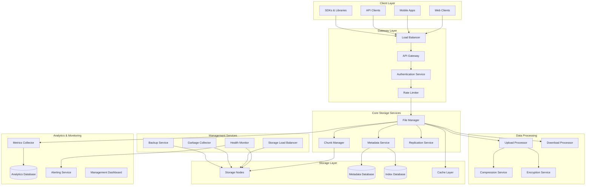
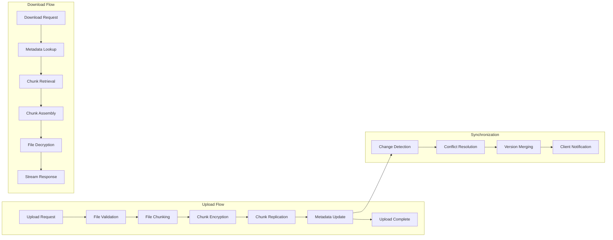
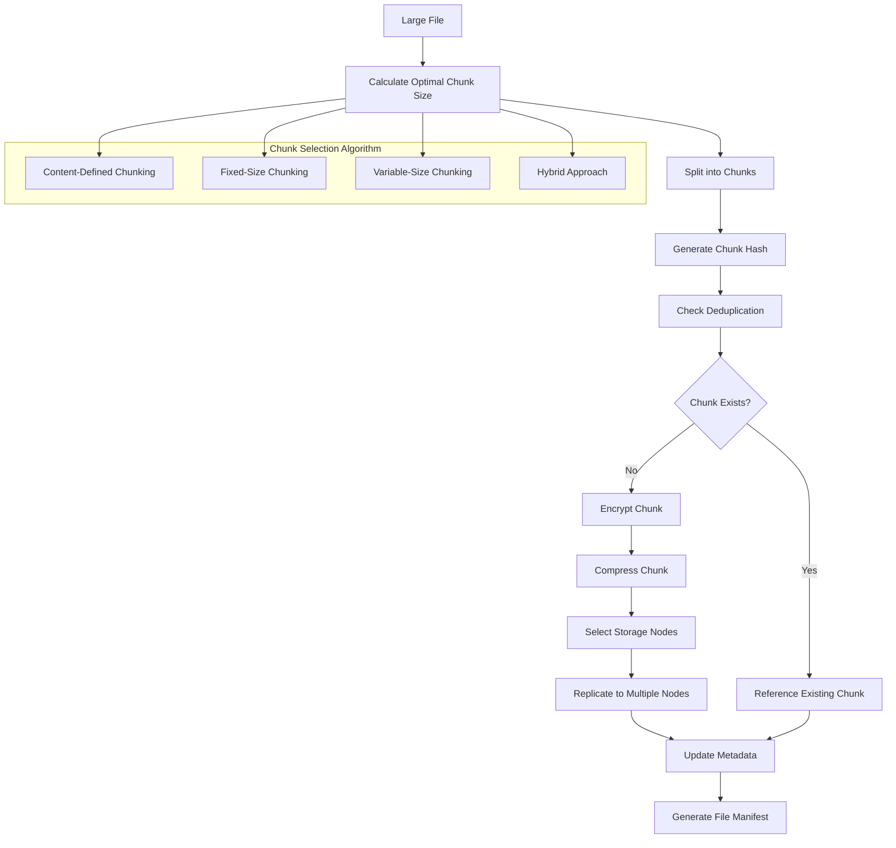
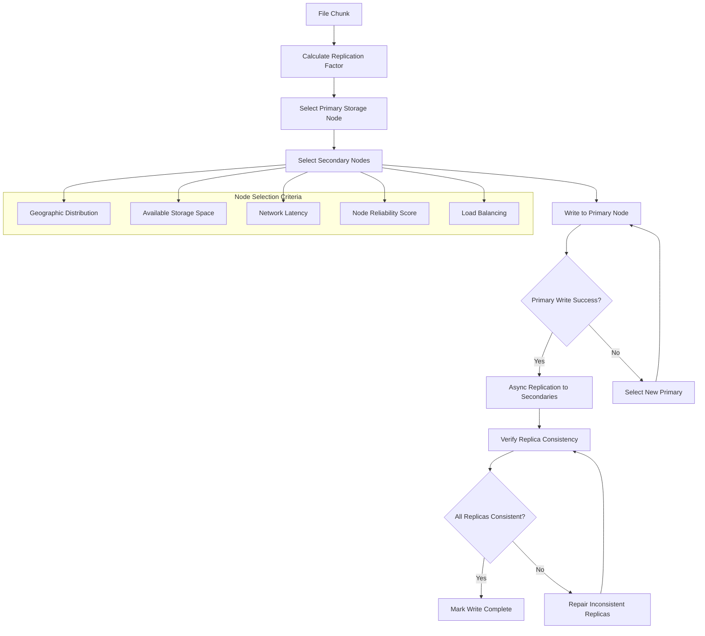
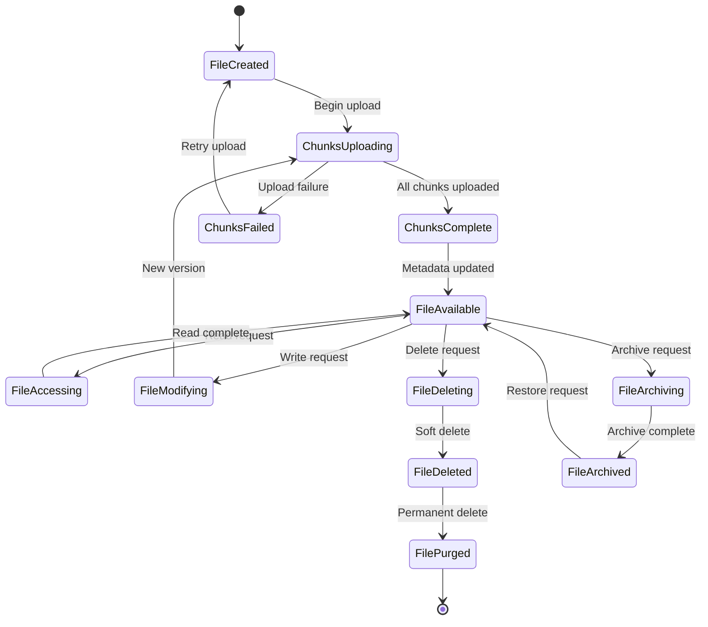
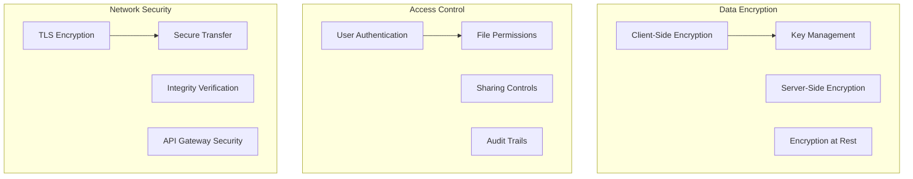

# Distributed File Storage System


## 📋 Table of Contents

- [Distributed File Storage System](#distributed-file-storage-system)
  - [High-Level Design (HLD)](#high-level-design-hld)
    - [System Architecture Overview](#system-architecture-overview)
    - [File Operation Flow](#file-operation-flow)
  - [Low-Level Design (LLD)](#low-level-design-lld)
    - [File Chunking and Storage](#file-chunking-and-storage)
    - [Distributed Replication Strategy](#distributed-replication-strategy)
    - [Metadata Management System](#metadata-management-system)
  - [Core Algorithms](#core-algorithms)
    - [1. Content-Defined Chunking Algorithm](#1-content-defined-chunking-algorithm)
    - [2. Distributed Storage Node Selection Algorithm](#2-distributed-storage-node-selection-algorithm)
    - [3. Consistency and Conflict Resolution Algorithm](#3-consistency-and-conflict-resolution-algorithm)
    - [4. Erasure Coding for Fault Tolerance](#4-erasure-coding-for-fault-tolerance)
    - [5. Intelligent Caching Strategy](#5-intelligent-caching-strategy)
  - [Performance Optimizations](#performance-optimizations)
    - [Parallel Processing](#parallel-processing)
    - [Compression Strategy](#compression-strategy)
  - [Security Considerations](#security-considerations)
    - [Data Protection Framework](#data-protection-framework)
  - [Testing Strategy](#testing-strategy)
    - [Fault Tolerance Testing](#fault-tolerance-testing)
    - [Performance Testing](#performance-testing)
  - [Trade-offs and Considerations](#trade-offs-and-considerations)
    - [Consistency vs Availability](#consistency-vs-availability)
    - [Storage vs Performance](#storage-vs-performance)
    - [Security vs Usability](#security-vs-usability)

---

## High-Level Design (HLD)

[⬆️ Back to Top](#-table-of-contents)

---


### System Architecture Overview

[⬆️ Back to Top](#-table-of-contents)

---




### File Operation Flow

[⬆️ Back to Top](#-table-of-contents)

---




## Low-Level Design (LLD)

[⬆️ Back to Top](#-table-of-contents)

---


### File Chunking and Storage

[⬆️ Back to Top](#-table-of-contents)

---




### Distributed Replication Strategy

[⬆️ Back to Top](#-table-of-contents)

---




### Metadata Management System

[⬆️ Back to Top](#-table-of-contents)

---




## Core Algorithms

[⬆️ Back to Top](#-table-of-contents)

---


### 1. Content-Defined Chunking Algorithm

[⬆️ Back to Top](#-table-of-contents)

---


**Purpose**: Split files into variable-size chunks based on content patterns for optimal deduplication and efficient updates.

**Rolling Hash Chunking**:
```
ChunkingConfig = {
  minChunkSize: 262144,        // 256 KB minimum
  maxChunkSize: 16777216,      // 16 MB maximum
  targetChunkSize: 4194304,    // 4 MB target
  
  windowSize: 64,              // Rolling hash window
  hashPolynomial: 0x9E3779B1,  // Hash polynomial for Rabin fingerprinting
  
  boundary: {
    mask: 0x1FFF,              // 13-bit boundary mask (average 8KB chunks)
    threshold: 0x1000          // Boundary threshold
  }
}

function chunkFile(fileData):
  chunks = []
  chunkStart = 0
  position = 0
  rollingHash = 0
  
  // Initialize rolling hash window
  window = new CircularBuffer(ChunkingConfig.windowSize)
  
  while position < fileData.length:
    byte = fileData[position]
    
    // Update rolling hash using Rabin fingerprinting
    if window.isFull():
      oldByte = window.addAndGetEvicted(byte)
      rollingHash = updateRollingHash(rollingHash, oldByte, byte)
    else:
      window.add(byte)
      rollingHash = addToRollingHash(rollingHash, byte)
    
    // Check for chunk boundary
    currentChunkSize = position - chunkStart + 1
    
    isBoundary = (rollingHash & ChunkingConfig.boundary.mask) < ChunkingConfig.boundary.threshold
    isMaxSize = currentChunkSize >= ChunkingConfig.maxChunkSize
    isEndOfFile = position === fileData.length - 1
    
    if (isBoundary and currentChunkSize >= ChunkingConfig.minChunkSize) or isMaxSize or isEndOfFile:
      // Create chunk
      chunkData = fileData.slice(chunkStart, position + 1)
      chunkHash = calculateChunkHash(chunkData)
      
      chunk = {
        id: generateChunkId(),
        hash: chunkHash,
        size: chunkData.length,
        offset: chunkStart,
        data: chunkData
      }
      
      chunks.push(chunk)
      chunkStart = position + 1
    
    position++
  
  return chunks

function updateRollingHash(hash, oldByte, newByte):
  // Remove contribution of old byte
  hash ^= powerTable[ChunkingConfig.windowSize - 1] * oldByte
  
  // Shift hash and add new byte
  hash = (hash << 1) ^ newByte
  
  return hash & 0xFFFFFFFF  // Keep as 32-bit value

function calculateChunkHash(chunkData):
  // Use SHA-256 for chunk content hashing
  return sha256(chunkData)
```

**Deduplication Engine**:
```
class DeduplicationEngine:
  constructor():
    this.chunkIndex = new Map()  // hash -> chunk metadata
    this.referenceCount = new Map()  // hash -> reference count
    this.bloomFilter = new BloomFilter(1000000, 3)  // For fast lookup
  
  function processChunk(chunk):
    chunkHash = chunk.hash
    
    // Quick bloom filter check
    if not this.bloomFilter.contains(chunkHash):
      // Definitely new chunk
      return this.storeNewChunk(chunk)
    
    // Check if chunk actually exists
    existingChunk = this.chunkIndex.get(chunkHash)
    
    if existingChunk:
      // Chunk exists - increment reference count
      this.referenceCount.set(chunkHash, this.referenceCount.get(chunkHash) + 1)
      
      return {
        isDuplicate: true,
        chunkId: existingChunk.id,
        savedBytes: chunk.size,
        referenceCount: this.referenceCount.get(chunkHash)
      }
    else:
      // False positive in bloom filter - store new chunk
      return this.storeNewChunk(chunk)
  
  function storeNewChunk(chunk):
    // Add to bloom filter
    this.bloomFilter.add(chunk.hash)
    
    // Store chunk metadata
    chunkMetadata = {
      id: chunk.id,
      hash: chunk.hash,
      size: chunk.size,
      createdAt: Date.now(),
      storageNodes: []
    }
    
    this.chunkIndex.set(chunk.hash, chunkMetadata)
    this.referenceCount.set(chunk.hash, 1)
    
    // Store actual chunk data
    storageResult = storeChunkData(chunk)
    chunkMetadata.storageNodes = storageResult.nodeIds
    
    return {
      isDuplicate: false,
      chunkId: chunk.id,
      storageNodes: storageResult.nodeIds
    }
```

### 2. Distributed Storage Node Selection Algorithm

[⬆️ Back to Top](#-table-of-contents)

---


**Purpose**: Intelligently select storage nodes for data placement considering geography, load, reliability, and fault tolerance.

**Multi-Criteria Node Selection**:
```
NodeSelectionConfig = {
  replicationFactor: 3,           // Number of replicas
  minGeographicSpread: 2,         // Minimum different regions
  loadBalanceWeight: 0.3,         // Weight for load balancing
  reliabilityWeight: 0.4,         // Weight for node reliability
  latencyWeight: 0.2,             // Weight for network latency
  capacityWeight: 0.1,            // Weight for available capacity
  
  maxNodesPerRack: 1,            // Fault tolerance: max 1 node per rack
  maxNodesPerDatacenter: 2,      // Fault tolerance: max 2 nodes per DC
  excludeFailedNodes: true        // Exclude recently failed nodes
}

function selectStorageNodes(fileSize, clientLocation, excludeNodes = []):
  availableNodes = getAvailableStorageNodes()
  
  // Filter out excluded and unhealthy nodes
  candidateNodes = availableNodes.filter(node => 
    not excludeNodes.includes(node.id) and 
    node.isHealthy and 
    node.availableSpace >= fileSize
  )
  
  if candidateNodes.length < NodeSelectionConfig.replicationFactor:
    throw new Error('Insufficient healthy storage nodes available')
  
  // Score all candidate nodes
  scoredNodes = candidateNodes.map(node => ({
    node: node,
    score: calculateNodeScore(node, clientLocation, fileSize)
  }))
  
  // Sort by score (descending)
  rankedNodes = scoredNodes.sort((a, b) => b.score - a.score)
  
  // Select nodes with geographic and fault tolerance constraints
  selectedNodes = selectWithConstraints(rankedNodes, NodeSelectionConfig.replicationFactor)
  
  return selectedNodes.map(scored => scored.node)

function calculateNodeScore(node, clientLocation, fileSize):
  score = 0
  
  // Load balancing factor
  loadScore = 1 - (node.currentLoad / node.maxCapacity)
  score += loadScore * NodeSelectionConfig.loadBalanceWeight
  
  // Reliability factor
  reliabilityScore = calculateReliabilityScore(node)
  score += reliabilityScore * NodeSelectionConfig.reliabilityWeight
  
  // Latency factor
  latencyScore = calculateLatencyScore(node, clientLocation)
  score += latencyScore * NodeSelectionConfig.latencyWeight
  
  // Capacity factor
  capacityScore = node.availableSpace / node.totalCapacity
  score += capacityScore * NodeSelectionConfig.capacityWeight
  
  return score

function selectWithConstraints(rankedNodes, targetCount):
  selectedNodes = []
  usedRacks = new Set()
  usedDatacenters = new Map()  // datacenter -> count
  usedRegions = new Set()
  
  for scoredNode in rankedNodes:
    node = scoredNode.node
    
    // Check rack constraint
    if usedRacks.has(node.rackId) and NodeSelectionConfig.maxNodesPerRack === 1:
      continue
    
    // Check datacenter constraint
    dcCount = usedDatacenters.get(node.datacenterId) || 0
    if dcCount >= NodeSelectionConfig.maxNodesPerDatacenter:
      continue
    
    // Add node to selection
    selectedNodes.push(scoredNode)
    usedRacks.add(node.rackId)
    usedDatacenters.set(node.datacenterId, dcCount + 1)
    usedRegions.add(node.regionId)
    
    if selectedNodes.length === targetCount:
      break
  
  // Verify geographic spread requirement
  if usedRegions.size < NodeSelectionConfig.minGeographicSpread:
    throw new Error('Cannot satisfy minimum geographic spread requirement')
  
  return selectedNodes

function calculateReliabilityScore(node):
  // Calculate based on historical uptime and performance
  uptimeScore = node.uptimePercentage / 100
  performanceScore = 1 - (node.averageErrorRate)
  maintenanceScore = 1 - (node.scheduledMaintenanceRatio)
  
  return (uptimeScore * 0.5 + performanceScore * 0.3 + maintenanceScore * 0.2)
```

### 3. Consistency and Conflict Resolution Algorithm

[⬆️ Back to Top](#-table-of-contents)

---


**Purpose**: Maintain data consistency across distributed replicas and resolve conflicts in concurrent modifications.

**Vector Clock-Based Versioning**:
```
ConflictResolutionConfig = {
  conflictResolutionStrategy: 'last_writer_wins', // 'manual', 'merge', 'last_writer_wins'
  maxVersionHistory: 10,       // Keep last 10 versions
  conflictDetectionEnabled: true,
  automaticMergeEnabled: false
}

class VectorClock:
  constructor(nodeId):
    this.nodeId = nodeId
    this.clock = new Map()  // nodeId -> timestamp
  
  function increment():
    currentTime = Date.now()
    this.clock.set(this.nodeId, currentTime)
    return this
  
  function update(otherClock):
    for [nodeId, timestamp] of otherClock.clock:
      ourTimestamp = this.clock.get(nodeId) || 0
      this.clock.set(nodeId, Math.max(ourTimestamp, timestamp))
    
    // Increment our own timestamp
    this.increment()
    return this
  
  function compare(otherClock):
    // Returns: 'before', 'after', 'concurrent', or 'equal'
    
    let hasSmaller = false
    let hasLarger = false
    
    // Check all timestamps in both clocks
    allNodes = new Set([...this.clock.keys(), ...otherClock.clock.keys()])
    
    for nodeId of allNodes:
      ourTime = this.clock.get(nodeId) || 0
      theirTime = otherClock.clock.get(nodeId) || 0
      
      if ourTime < theirTime:
        hasSmaller = true
      else if ourTime > theirTime:
        hasLarger = true
    
    if hasSmaller and hasLarger:
      return 'concurrent'
    else if hasSmaller:
      return 'before'
    else if hasLarger:
      return 'after'
    else:
      return 'equal'

function resolveFileConflict(localVersion, remoteVersion):
  comparison = localVersion.vectorClock.compare(remoteVersion.vectorClock)
  
  switch comparison:
    case 'before':
      // Remote version is newer - accept it
      return {
        resolution: 'accept_remote',
        winningVersion: remoteVersion,
        conflictDetected: false
      }
    
    case 'after':
      // Local version is newer - keep it
      return {
        resolution: 'keep_local',
        winningVersion: localVersion,
        conflictDetected: false
      }
    
    case 'equal':
      // Identical versions - no conflict
      return {
        resolution: 'no_change',
        winningVersion: localVersion,
        conflictDetected: false
      }
    
    case 'concurrent':
      // Conflict detected - apply resolution strategy
      return resolveConcurrentConflict(localVersion, remoteVersion)

function resolveConcurrentConflict(localVersion, remoteVersion):
  conflict = {
    localVersion: localVersion,
    remoteVersion: remoteVersion,
    conflictType: detectConflictType(localVersion, remoteVersion),
    detectedAt: Date.now()
  }
  
  switch ConflictResolutionConfig.conflictResolutionStrategy:
    case 'last_writer_wins':
      return resolveByLastWriter(conflict)
    
    case 'manual':
      return createManualResolutionTask(conflict)
    
    case 'merge':
      return attemptAutomaticMerge(conflict)
    
    default:
      return resolveByLastWriter(conflict)

function resolveByLastWriter(conflict):
  localTime = conflict.localVersion.lastModified
  remoteTime = conflict.remoteVersion.lastModified
  
  if remoteTime > localTime:
    winningVersion = conflict.remoteVersion
    resolution = 'accept_remote'
  else:
    winningVersion = conflict.localVersion
    resolution = 'keep_local'
  
  // Store conflict information for audit
  logConflictResolution(conflict, resolution)
  
  return {
    resolution: resolution,
    winningVersion: winningVersion,
    conflictDetected: true,
    conflictInfo: conflict
  }
```

### 4. Erasure Coding for Fault Tolerance

[⬆️ Back to Top](#-table-of-contents)

---


**Purpose**: Provide data protection and storage efficiency using erasure coding instead of simple replication.

**Reed-Solomon Erasure Coding**:
```
ErasureCodeConfig = {
  dataShards: 6,               // Number of data shards
  parityShards: 3,             // Number of parity shards
  totalShards: 9,              // Total shards (data + parity)
  minShardsForRecovery: 6,     // Minimum shards needed to reconstruct
  
  shardSize: 1048576,          // 1 MB per shard
  maxConcurrentReconstructions: 5,
  reconstructionTimeout: 30000  // 30 seconds
}

class ErasureCoder:
  constructor(config):
    this.config = config
    this.encoder = new ReedSolomonEncoder(config.dataShards, config.parityShards)
  
  function encodeFile(fileData):
    // Pad file to multiple of shard size if necessary
    paddedData = padToShardBoundary(fileData)
    
    // Split into chunks that can be encoded
    chunks = splitIntoEncodableChunks(paddedData)
    
    encodedChunks = []
    
    for chunk in chunks:
      // Split chunk into data shards
      dataShards = splitIntoDataShards(chunk)
      
      // Generate parity shards
      parityShards = this.encoder.generateParityShards(dataShards)
      
      // Create shard metadata
      shardSet = {
        chunkId: generateChunkId(),
        dataShards: dataShards.map((shard, index) => ({
          shardId: generateShardId(),
          index: index,
          data: shard,
          isDataShard: true
        })),
        parityShards: parityShards.map((shard, index) => ({
          shardId: generateShardId(),
          index: index + this.config.dataShards,
          data: shard,
          isDataShard: false
        }))
      }
      
      encodedChunks.push(shardSet)
    
    return {
      originalSize: fileData.length,
      paddedSize: paddedData.length,
      chunks: encodedChunks,
      encodingParams: {
        dataShards: this.config.dataShards,
        parityShards: this.config.parityShards,
        shardSize: this.config.shardSize
      }
    }
  
  function decodeFile(encodedFile, availableShards):
    decodedChunks = []
    
    for chunkInfo in encodedFile.chunks:
      // Collect available shards for this chunk
      chunkShards = availableShards.filter(shard => shard.chunkId === chunkInfo.chunkId)
      
      if chunkShards.length < this.config.minShardsForRecovery:
        throw new Error(`Insufficient shards for chunk ${chunkInfo.chunkId}: ${chunkShards.length} < ${this.config.minShardsForRecovery}`)
      
      // Decode chunk
      decodedChunk = this.decodeChunk(chunkShards)
      decodedChunks.push(decodedChunk)
    
    // Reassemble file
    reassembledData = concatenateChunks(decodedChunks)
    
    // Remove padding
    originalData = removePadding(reassembledData, encodedFile.originalSize)
    
    return originalData
  
  function decodeChunk(availableShards):
    // Sort shards by index
    sortedShards = availableShards.sort((a, b) => a.index - b.index)
    
    // Check if we have enough shards
    if sortedShards.length < this.config.minShardsForRecovery:
      throw new Error('Insufficient shards for reconstruction')
    
    // If we have all data shards, no reconstruction needed
    dataShards = sortedShards.filter(shard => shard.isDataShard)
    
    if dataShards.length === this.config.dataShards:
      return reassembleFromDataShards(dataShards)
    
    // Reconstruction needed
    return this.reconstructChunk(sortedShards)
  
  function reconstructChunk(availableShards):
    // Use Reed-Solomon decoder to reconstruct missing shards
    reconstructedShards = this.encoder.reconstruct(
      availableShards,
      this.config.dataShards,
      this.config.parityShards
    )
    
    // Extract only the data shards
    dataShards = reconstructedShards.slice(0, this.config.dataShards)
    
    return reassembleFromDataShards(dataShards)
```

**Proactive Reconstruction**:
```
function monitorShardHealth():
  // Check health of all stored shards
  unhealthyShards = identifyUnhealthyShards()
  
  for shard in unhealthyShards:
    if shouldTriggerReconstruction(shard):
      scheduleShardReconstruction(shard)

function scheduleShardReconstruction(shard):
  reconstructionTask = {
    shardId: shard.id,
    chunkId: shard.chunkId,
    priority: calculateReconstructionPriority(shard),
    createdAt: Date.now()
  }
  
  addToReconstructionQueue(reconstructionTask)

function calculateReconstructionPriority(shard):
  // Higher priority for:
  // - Chunks with fewer available shards
  // - Recently accessed files
  // - Critical system files
  
  chunkInfo = getChunkInfo(shard.chunkId)
  availableShards = countAvailableShards(shard.chunkId)
  
  priority = 0
  
  // Urgency based on remaining shards
  remainingShards = availableShards - 1 // Excluding the failed shard
  if remainingShards <= ErasureCodeConfig.minShardsForRecovery:
    priority += 1000 // Critical priority
  else if remainingShards <= ErasureCodeConfig.minShardsForRecovery + 1:
    priority += 500 // High priority
  else:
    priority += 100 // Normal priority
  
  // Access pattern boost
  if chunkInfo.lastAccessTime > Date.now() - 86400000: // Last 24 hours
    priority += 50
  
  return priority
```

### 5. Intelligent Caching Strategy

[⬆️ Back to Top](#-table-of-contents)

---


**Purpose**: Optimize file access performance through multi-tiered caching with predictive prefetching and intelligent eviction.

**Multi-Tier Cache Architecture**:
```
CacheConfig = {
  tiers: {
    memory: {
      maxSize: 1073741824,      // 1 GB
      ttl: 3600000,             // 1 hour
      evictionPolicy: 'lru'
    },
    ssd: {
      maxSize: 107374182400,    // 100 GB
      ttl: 86400000,            // 24 hours
      evictionPolicy: 'lfu'
    },
    nearline: {
      maxSize: 1099511627776,   // 1 TB
      ttl: 604800000,           // 7 days
      evictionPolicy: 'aged_lru'
    }
  },
  
  prefetchEnabled: true,
  compressionEnabled: true,
  encryptionEnabled: true
}

class IntelligentCache:
  constructor(config):
    this.config = config
    this.memoryCache = new LRUCache(config.tiers.memory)
    this.ssdCache = new LFUCache(config.tiers.ssd)
    this.nearlineCache = new AgedLRUCache(config.tiers.nearline)
    this.accessPredictor = new AccessPredictor()
  
  function get(fileId):
    // Try memory cache first
    cached = this.memoryCache.get(fileId)
    if cached:
      this.recordCacheHit('memory', fileId)
      return cached
    
    // Try SSD cache
    cached = this.ssdCache.get(fileId)
    if cached:
      this.recordCacheHit('ssd', fileId)
      // Promote to memory cache
      this.memoryCache.put(fileId, cached)
      return cached
    
    // Try nearline cache
    cached = this.nearlineCache.get(fileId)
    if cached:
      this.recordCacheHit('nearline', fileId)
      // Promote to SSD cache
      this.ssdCache.put(fileId, cached)
      return cached
    
    // Cache miss - need to fetch from storage
    this.recordCacheMiss(fileId)
    return null
  
  function put(fileId, fileData, metadata):
    // Determine initial cache tier based on file characteristics
    tier = this.selectInitialTier(fileData, metadata)
    
    // Cache in selected tier and all faster tiers
    switch tier:
      case 'nearline':
        this.nearlineCache.put(fileId, fileData)
        break
      case 'ssd':
        this.ssdCache.put(fileId, fileData)
        this.nearlineCache.put(fileId, fileData)
        break
      case 'memory':
        this.memoryCache.put(fileId, fileData)
        this.ssdCache.put(fileId, fileData)
        this.nearlineCache.put(fileId, fileData)
        break
    
    // Update access predictor
    this.accessPredictor.recordAccess(fileId, metadata)
    
    // Trigger prefetching if enabled
    if this.config.prefetchEnabled:
      this.triggerPrefetch(fileId, metadata)
  
  function selectInitialTier(fileData, metadata):
    score = 0
    
    // File size factor - smaller files go to faster tiers
    if fileData.length < 1048576: // < 1MB
      score += 30
    else if fileData.length < 10485760: // < 10MB
      score += 20
    else if fileData.length < 104857600: // < 100MB
      score += 10
    
    // Access frequency factor
    if metadata.accessCount > 100:
      score += 25
    else if metadata.accessCount > 10:
      score += 15
    else if metadata.accessCount > 1:
      score += 5
    
    // Recency factor
    hoursSinceAccess = (Date.now() - metadata.lastAccess) / 3600000
    if hoursSinceAccess < 1:
      score += 20
    else if hoursSinceAccess < 24:
      score += 10
    else if hoursSinceAccess < 168: // 1 week
      score += 5
    
    // File type factor
    if metadata.fileType in ['image', 'video', 'document']:
      score += 10
    
    // Select tier based on score
    if score >= 60:
      return 'memory'
    else if score >= 30:
      return 'ssd'
    else:
      return 'nearline'
  
  function triggerPrefetch(fileId, metadata):
    // Predict related files that might be accessed soon
    relatedFiles = this.accessPredictor.predictRelatedFiles(fileId, metadata)
    
    for relatedFileId in relatedFiles:
      if not this.hasInAnyTier(relatedFileId):
        // Schedule background prefetch
        this.schedulePrefetch(relatedFileId)
```

## Performance Optimizations

[⬆️ Back to Top](#-table-of-contents)

---


### Parallel Processing

[⬆️ Back to Top](#-table-of-contents)

---


**Concurrent Upload/Download**:
```
ParallelConfig = {
  maxConcurrentChunks: 10,
  chunkUploadTimeout: 30000,
  connectionPoolSize: 20,
  retryAttempts: 3
}
```

### Compression Strategy

[⬆️ Back to Top](#-table-of-contents)

---


**Adaptive Compression**:
- Text files: gzip/deflate compression
- Images: conditional compression based on format
- Videos: minimal compression (already compressed)
- Binary files: lz4 for speed vs size balance

## Security Considerations

[⬆️ Back to Top](#-table-of-contents)

---


### Data Protection Framework

[⬆️ Back to Top](#-table-of-contents)

---




## Testing Strategy

[⬆️ Back to Top](#-table-of-contents)

---


### Fault Tolerance Testing

[⬆️ Back to Top](#-table-of-contents)

---


**Failure Scenarios**:
- Node failure simulation
- Network partition testing
- Data corruption detection
- Recovery time measurement

### Performance Testing

[⬆️ Back to Top](#-table-of-contents)

---


**Load Testing Scenarios**:
- Concurrent file operations (10K+ users)
- Large file handling (multi-GB files)
- High-frequency small file operations
- Network bandwidth optimization

## Trade-offs and Considerations

[⬆️ Back to Top](#-table-of-contents)

---


### Consistency vs Availability

[⬆️ Back to Top](#-table-of-contents)

---

- **Strong consistency**: Data accuracy vs system availability
- **Eventual consistency**: Performance vs immediate consistency
- **Replication strategies**: Storage cost vs fault tolerance
- **Conflict resolution**: Automatic vs manual resolution

### Storage vs Performance

[⬆️ Back to Top](#-table-of-contents)

---

- **Erasure coding**: Storage efficiency vs reconstruction overhead
- **Compression**: Space savings vs CPU usage
- **Caching strategies**: Memory usage vs access speed
- **Chunk size optimization**: Deduplication efficiency vs metadata overhead

### Security vs Usability

[⬆️ Back to Top](#-table-of-contents)

---

- **Encryption overhead**: Security vs performance impact
- **Key management**: Security vs operational complexity
- **Access controls**: Security vs user convenience
- **Audit requirements**: Compliance vs storage costs

This distributed file storage system provides a comprehensive foundation for scalable, reliable file management with features like intelligent chunking, erasure coding, multi-tier caching, and robust security while maintaining high performance, fault tolerance, and storage efficiency standards. 