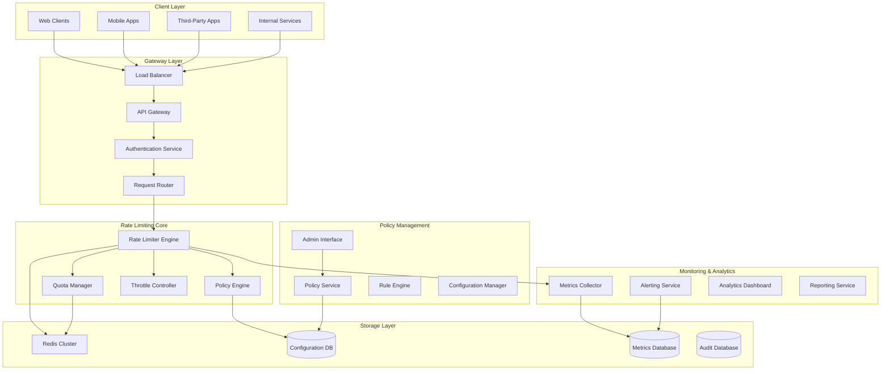
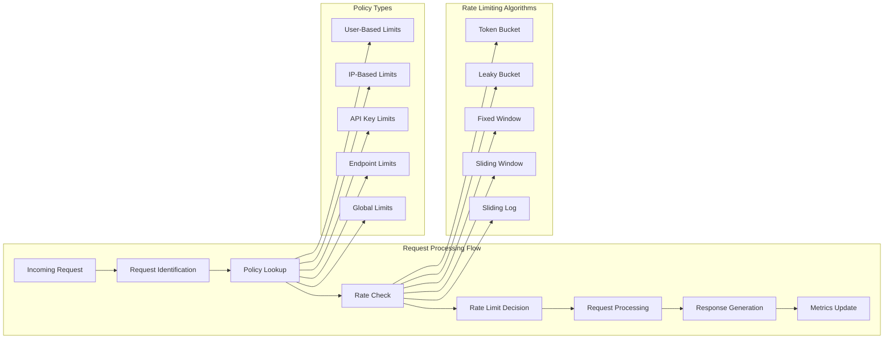
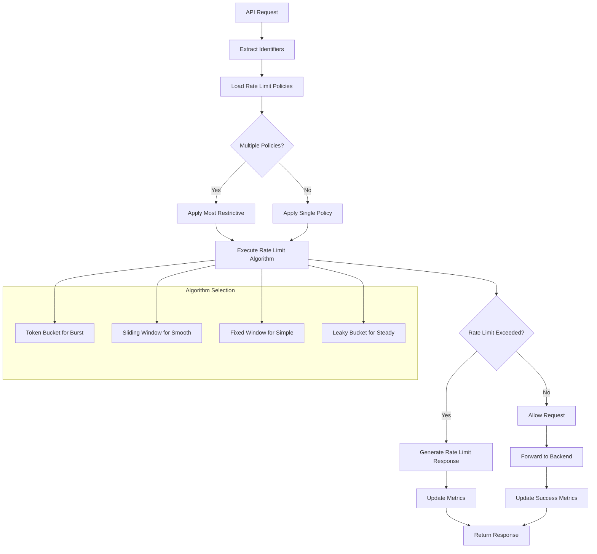
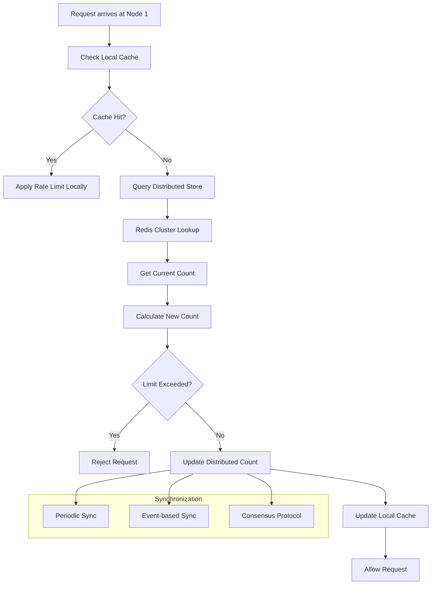
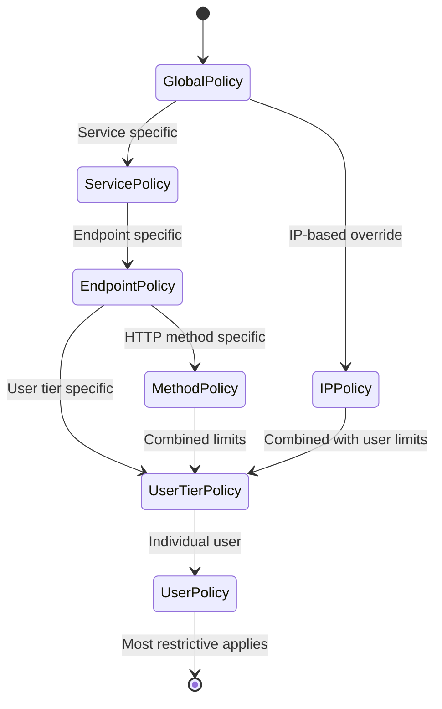
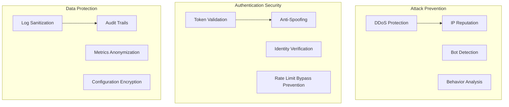

# API Rate Limiter System


## 📋 Table of Contents

- [API Rate Limiter System](#api-rate-limiter-system)
  - [High-Level Design (HLD)](#high-level-design-hld)
    - [System Architecture Overview](#system-architecture-overview)
    - [Rate Limiting Flow](#rate-limiting-flow)
  - [Low-Level Design (LLD)](#low-level-design-lld)
    - [Rate Limiting Engine](#rate-limiting-engine)
    - [Distributed Rate Limiting](#distributed-rate-limiting)
    - [Policy Hierarchy System](#policy-hierarchy-system)
  - [Core Algorithms](#core-algorithms)
    - [1. Token Bucket Algorithm](#1-token-bucket-algorithm)
    - [2. Sliding Window Algorithm](#2-sliding-window-algorithm)
    - [3. Hierarchical Rate Limiting Algorithm](#3-hierarchical-rate-limiting-algorithm)
    - [4. Smart Quota Management Algorithm](#4-smart-quota-management-algorithm)
    - [5. Adaptive Rate Limiting Algorithm](#5-adaptive-rate-limiting-algorithm)
  - [Performance Optimizations](#performance-optimizations)
    - [Memory-Efficient Storage](#memory-efficient-storage)
    - [Distributed Coordination](#distributed-coordination)
  - [Security Considerations](#security-considerations)
    - [Rate Limiting Security Framework](#rate-limiting-security-framework)
  - [Testing Strategy](#testing-strategy)
    - [Load Testing](#load-testing)
    - [Accuracy Testing](#accuracy-testing)
  - [Trade-offs and Considerations](#trade-offs-and-considerations)
    - [Accuracy vs Performance](#accuracy-vs-performance)
    - [Flexibility vs Simplicity](#flexibility-vs-simplicity)
    - [Cost vs Reliability](#cost-vs-reliability)

---

## High-Level Design (HLD)

[⬆️ Back to Top](#-table-of-contents)

---


### System Architecture Overview

[⬆️ Back to Top](#-table-of-contents)

---




### Rate Limiting Flow

[⬆️ Back to Top](#-table-of-contents)

---




## Low-Level Design (LLD)

[⬆️ Back to Top](#-table-of-contents)

---


### Rate Limiting Engine

[⬆️ Back to Top](#-table-of-contents)

---




### Distributed Rate Limiting

[⬆️ Back to Top](#-table-of-contents)

---




### Policy Hierarchy System

[⬆️ Back to Top](#-table-of-contents)

---




## Core Algorithms

[⬆️ Back to Top](#-table-of-contents)

---


### 1. Token Bucket Algorithm

[⬆️ Back to Top](#-table-of-contents)

---


**Purpose**: Allow burst traffic while maintaining average rate limits with token-based allowance system.

**Token Bucket Implementation**:
```
TokenBucketConfig = {
  capacity: 100,           // Maximum tokens in bucket
  refillRate: 10,          // Tokens added per second
  refillInterval: 1000,    // Refill interval in milliseconds
  initialTokens: 100       // Starting token count
}

class TokenBucket:
  constructor(config):
    this.capacity = config.capacity
    this.tokens = config.initialTokens
    this.refillRate = config.refillRate
    this.refillInterval = config.refillInterval
    this.lastRefillTime = Date.now()
  
  function checkRateLimit(requestWeight = 1):
    currentTime = Date.now()
    
    // Refill tokens based on elapsed time
    this.refillTokens(currentTime)
    
    // Check if enough tokens available
    if this.tokens >= requestWeight:
      this.tokens -= requestWeight
      return {
        allowed: true,
        remainingTokens: this.tokens,
        resetTime: this.calculateResetTime(),
        retryAfter: null
      }
    else:
      return {
        allowed: false,
        remainingTokens: this.tokens,
        resetTime: this.calculateResetTime(),
        retryAfter: this.calculateRetryAfter(requestWeight)
      }
  
  function refillTokens(currentTime):
    timeSinceLastRefill = currentTime - this.lastRefillTime
    
    if timeSinceLastRefill >= this.refillInterval:
      intervalsElapsed = Math.floor(timeSinceLastRefill / this.refillInterval)
      tokensToAdd = intervalsElapsed * this.refillRate
      
      this.tokens = Math.min(this.capacity, this.tokens + tokensToAdd)
      this.lastRefillTime = currentTime
  
  function calculateRetryAfter(requestWeight):
    tokensNeeded = requestWeight - this.tokens
    timeToGetTokens = Math.ceil(tokensNeeded / this.refillRate) * this.refillInterval
    return timeToGetTokens
```

**Distributed Token Bucket**:
```
function distributedTokenBucket(key, requestWeight, config):
  // Use Lua script for atomic operations in Redis
  luaScript = `
    local key = KEYS[1]
    local capacity = tonumber(ARGV[1])
    local refillRate = tonumber(ARGV[2])
    local refillInterval = tonumber(ARGV[3])
    local requestWeight = tonumber(ARGV[4])
    local currentTime = tonumber(ARGV[5])
    
    -- Get current state or initialize
    local bucket = redis.call('HMGET', key, 'tokens', 'lastRefillTime')
    local tokens = tonumber(bucket[1]) or capacity
    local lastRefillTime = tonumber(bucket[2]) or currentTime
    
    -- Calculate tokens to add
    local timeSinceRefill = currentTime - lastRefillTime
    local intervalsElapsed = math.floor(timeSinceRefill / refillInterval)
    local tokensToAdd = intervalsElapsed * refillRate
    
    -- Update token count
    tokens = math.min(capacity, tokens + tokensToAdd)
    local newLastRefillTime = lastRefillTime + (intervalsElapsed * refillInterval)
    
    -- Check if request can be allowed
    if tokens >= requestWeight then
      tokens = tokens - requestWeight
      redis.call('HMSET', key, 'tokens', tokens, 'lastRefillTime', newLastRefillTime)
      redis.call('EXPIRE', key, 3600) -- 1 hour expiry
      return {1, tokens, newLastRefillTime} -- Allowed
    else
      redis.call('HMSET', key, 'tokens', tokens, 'lastRefillTime', newLastRefillTime)
      redis.call('EXPIRE', key, 3600)
      return {0, tokens, newLastRefillTime} -- Denied
    end
  `
  
  result = redis.eval(luaScript, [key], [
    config.capacity,
    config.refillRate,
    config.refillInterval,
    requestWeight,
    Date.now()
  ])
  
  return {
    allowed: result[0] === 1,
    remainingTokens: result[1],
    lastRefillTime: result[2]
  }
```

### 2. Sliding Window Algorithm

[⬆️ Back to Top](#-table-of-contents)

---


**Purpose**: Provide smooth rate limiting by tracking requests over a moving time window with precise time-based calculations.

**Sliding Window Counter**:
```
SlidingWindowConfig = {
  windowSizeMs: 60000,     // 1 minute window
  maxRequests: 100,        // Maximum requests per window
  subWindowCount: 10,      // Number of sub-windows for precision
  cleanupInterval: 30000   // Cleanup old entries every 30 seconds
}

class SlidingWindowCounter:
  constructor(config):
    this.windowSizeMs = config.windowSizeMs
    this.maxRequests = config.maxRequests
    this.subWindowSize = config.windowSizeMs / config.subWindowCount
    this.requestCounts = new Map() // subWindowId -> count
    this.lastCleanup = Date.now()
  
  function checkRateLimit(requestWeight = 1):
    currentTime = Date.now()
    
    // Clean up old sub-windows
    this.cleanupOldWindows(currentTime)
    
    // Calculate current request count in sliding window
    currentCount = this.getCurrentWindowCount(currentTime)
    
    if currentCount + requestWeight <= this.maxRequests:
      // Record the request
      this.recordRequest(currentTime, requestWeight)
      
      return {
        allowed: true,
        currentCount: currentCount + requestWeight,
        resetTime: this.calculateResetTime(currentTime),
        retryAfter: null
      }
    else:
      return {
        allowed: false,
        currentCount: currentCount,
        resetTime: this.calculateResetTime(currentTime),
        retryAfter: this.calculateRetryAfter(currentTime, requestWeight)
      }
  
  function getCurrentWindowCount(currentTime):
    windowStartTime = currentTime - this.windowSizeMs
    totalCount = 0
    
    for [subWindowId, count] of this.requestCounts:
      subWindowTime = subWindowId * this.subWindowSize
      
      if subWindowTime > windowStartTime:
        // Calculate partial count for overlapping sub-window
        if subWindowTime < windowStartTime + this.subWindowSize:
          overlapRatio = (subWindowTime + this.subWindowSize - windowStartTime) / this.subWindowSize
          totalCount += count * overlapRatio
        else:
          totalCount += count
    
    return Math.floor(totalCount)
  
  function recordRequest(currentTime, requestWeight):
    subWindowId = Math.floor(currentTime / this.subWindowSize)
    currentCount = this.requestCounts.get(subWindowId) || 0
    this.requestCounts.set(subWindowId, currentCount + requestWeight)
  
  function cleanupOldWindows(currentTime):
    if currentTime - this.lastCleanup < SlidingWindowConfig.cleanupInterval:
      return
    
    cutoffTime = currentTime - this.windowSizeMs
    cutoffSubWindowId = Math.floor(cutoffTime / this.subWindowSize)
    
    for subWindowId of this.requestCounts.keys():
      if subWindowId < cutoffSubWindowId:
        this.requestCounts.delete(subWindowId)
    
    this.lastCleanup = currentTime
```

**Distributed Sliding Window with Redis**:
```
function distributedSlidingWindow(key, requestWeight, config):
  luaScript = `
    local key = KEYS[1]
    local windowSizeMs = tonumber(ARGV[1])
    local maxRequests = tonumber(ARGV[2])
    local requestWeight = tonumber(ARGV[3])
    local currentTime = tonumber(ARGV[4])
    local subWindowSize = tonumber(ARGV[5])
    
    -- Calculate window boundaries
    local windowStart = currentTime - windowSizeMs
    local currentSubWindow = math.floor(currentTime / subWindowSize)
    
    -- Remove old entries
    redis.call('ZREMRANGEBYSCORE', key, '-inf', windowStart)
    
    -- Count current requests in window
    local currentCount = 0
    local entries = redis.call('ZRANGEBYSCORE', key, windowStart, '+inf', 'WITHSCORES')
    
    for i = 1, #entries, 2 do
      local timestamp = tonumber(entries[i + 1])
      local weight = tonumber(entries[i])
      currentCount = currentCount + weight
    end
    
    -- Check if request can be allowed
    if currentCount + requestWeight <= maxRequests then
      -- Add new request
      redis.call('ZADD', key, currentTime, requestWeight .. ':' .. currentTime)
      redis.call('EXPIRE', key, math.ceil(windowSizeMs / 1000) + 1)
      return {1, currentCount + requestWeight} -- Allowed
    else
      return {0, currentCount} -- Denied
    end
  `
  
  result = redis.eval(luaScript, [key], [
    config.windowSizeMs,
    config.maxRequests,
    requestWeight,
    Date.now(),
    config.windowSizeMs / 10 // 10 sub-windows
  ])
  
  return {
    allowed: result[0] === 1,
    currentCount: result[1]
  }
```

### 3. Hierarchical Rate Limiting Algorithm

[⬆️ Back to Top](#-table-of-contents)

---


**Purpose**: Apply multiple rate limiting policies in hierarchical order with proper precedence and combination rules.

**Policy Hierarchy System**:
```
PolicyHierarchy = {
  levels: [
    'global',       // System-wide limits
    'service',      // Per-service limits
    'endpoint',     // Per-endpoint limits
    'user_tier',    // User tier-based limits
    'user',         // Individual user limits
    'ip'            // IP-based limits
  ],
  
  combinationStrategy: 'most_restrictive', // or 'additive', 'multiplicative'
  inheritanceEnabled: true,
  overrideRules: new Map()
}

function evaluateHierarchicalLimits(request, context):
  applicablePolicies = []
  
  // Collect all applicable policies
  for level in PolicyHierarchy.levels:
    policy = findApplicablePolicy(level, request, context)
    if policy:
      applicablePolicies.push({
        level: level,
        policy: policy,
        priority: getPolicyPriority(level)
      })
  
  // Sort by priority
  applicablePolicies.sort((a, b) => b.priority - a.priority)
  
  // Apply combination strategy
  return combineRateLimitPolicies(applicablePolicies, request)

function combineRateLimitPolicies(policies, request):
  if policies.length === 0:
    return { allowed: true, reason: 'no_applicable_policies' }
  
  switch PolicyHierarchy.combinationStrategy:
    case 'most_restrictive':
      return applyMostRestrictivePolicy(policies, request)
    case 'additive':
      return applyAdditivePolicies(policies, request)
    case 'multiplicative':
      return applyMultiplicativePolicies(policies, request)
    default:
      return applyMostRestrictivePolicy(policies, request)

function applyMostRestrictivePolicy(policies, request):
  mostRestrictive = null
  minAllowedRate = Infinity
  
  for policyEntry in policies:
    policy = policyEntry.policy
    rateLimit = calculateEffectiveRateLimit(policy, request)
    
    if rateLimit.requestsPerSecond < minAllowedRate:
      minAllowedRate = rateLimit.requestsPerSecond
      mostRestrictive = policyEntry
  
  if mostRestrictive:
    return executeRateLimit(mostRestrictive.policy, request)
  else:
    return { allowed: true, reason: 'no_restrictive_policy' }

function executeRateLimit(policy, request):
  // Select appropriate algorithm based on policy configuration
  switch policy.algorithm:
    case 'token_bucket':
      return executeTokenBucket(policy, request)
    case 'sliding_window':
      return executeSlidingWindow(policy, request)
    case 'fixed_window':
      return executeFixedWindow(policy, request)
    case 'leaky_bucket':
      return executeLeakyBucket(policy, request)
    default:
      throw new Error(`Unknown rate limiting algorithm: ${policy.algorithm}`)
```

**Dynamic Policy Adjustment**:
```
function adjustPolicyBasedOnMetrics(policyId, metrics):
  policy = getPolicy(policyId)
  currentMetrics = metrics
  
  // Analyze key metrics
  errorRate = currentMetrics.errorRate
  avgResponseTime = currentMetrics.avgResponseTime
  cpuUtilization = currentMetrics.cpuUtilization
  
  // Calculate adjustment factors
  adjustmentFactor = 1.0
  
  // Adjust based on error rate
  if errorRate > 0.05: // 5% error rate threshold
    adjustmentFactor *= 0.8 // Reduce rate limit by 20%
  else if errorRate < 0.01: // 1% error rate
    adjustmentFactor *= 1.1 // Increase rate limit by 10%
  
  // Adjust based on response time
  if avgResponseTime > 1000: // 1 second threshold
    adjustmentFactor *= 0.9 // Reduce rate limit by 10%
  else if avgResponseTime < 200: // 200ms threshold
    adjustmentFactor *= 1.05 // Increase rate limit by 5%
  
  // Adjust based on CPU utilization
  if cpuUtilization > 0.8: // 80% CPU threshold
    adjustmentFactor *= 0.7 // Reduce rate limit by 30%
  else if cpuUtilization < 0.4: // 40% CPU threshold
    adjustmentFactor *= 1.2 // Increase rate limit by 20%
  
  // Apply bounds to prevent extreme adjustments
  adjustmentFactor = Math.max(0.1, Math.min(2.0, adjustmentFactor))
  
  // Update policy
  newRateLimit = Math.floor(policy.baseRateLimit * adjustmentFactor)
  updatePolicyRateLimit(policyId, newRateLimit)
  
  // Log adjustment
  logPolicyAdjustment(policyId, policy.baseRateLimit, newRateLimit, adjustmentFactor, metrics)
```

### 4. Smart Quota Management Algorithm

[⬆️ Back to Top](#-table-of-contents)

---


**Purpose**: Manage API quotas across different time periods with intelligent allocation and usage tracking.

**Multi-Period Quota System**:
```
QuotaConfig = {
  periods: {
    minute: { duration: 60000, allocation: 100 },
    hour: { duration: 3600000, allocation: 5000 },
    day: { duration: 86400000, allocation: 100000 },
    month: { duration: 2629746000, allocation: 2000000 }
  },
  
  allocationStrategy: 'proportional', // 'proportional', 'priority', 'waterfall'
  carryoverEnabled: true,             // Allow unused quota carryover
  burstAllowance: 0.2,               // 20% burst over period limit
  quotaRefreshStrategy: 'sliding'     // 'sliding' or 'fixed'
}

class SmartQuotaManager:
  constructor(config):
    this.config = config
    this.quotaUsage = new Map() // userId -> period -> usage
    this.quotaAllocations = new Map() // userId -> period -> allocation
  
  function checkQuotaAvailability(userId, requestWeight, period):
    currentUsage = this.getCurrentUsage(userId, period)
    allocatedQuota = this.getAllocatedQuota(userId, period)
    burstLimit = allocatedQuota * (1 + this.config.burstAllowance)
    
    // Check if request exceeds quota
    if currentUsage + requestWeight <= allocatedQuota:
      return {
        allowed: true,
        quotaType: 'normal',
        remainingQuota: allocatedQuota - (currentUsage + requestWeight),
        resetTime: this.calculateQuotaResetTime(period)
      }
    else if currentUsage + requestWeight <= burstLimit:
      return {
        allowed: true,
        quotaType: 'burst',
        remainingQuota: burstLimit - (currentUsage + requestWeight),
        resetTime: this.calculateQuotaResetTime(period),
        warning: 'using_burst_quota'
      }
    else:
      return {
        allowed: false,
        quotaType: 'exceeded',
        excessAmount: (currentUsage + requestWeight) - burstLimit,
        resetTime: this.calculateQuotaResetTime(period)
      }
  
  function allocateSmartQuota(userId, totalQuota, periods):
    allocations = {}
    
    // Get user's historical usage patterns
    usageHistory = this.getUserUsageHistory(userId)
    usagePatterns = this.analyzeUsagePatterns(usageHistory)
    
    switch this.config.allocationStrategy:
      case 'proportional':
        allocations = this.allocateProportionally(totalQuota, periods, usagePatterns)
        break
      case 'priority':
        allocations = this.allocateByPriority(totalQuota, periods, usagePatterns)
        break
      case 'waterfall':
        allocations = this.allocateWaterfall(totalQuota, periods, usagePatterns)
        break
    
    // Store allocations
    this.quotaAllocations.set(userId, allocations)
    
    return allocations
  
  function allocateProportionally(totalQuota, periods, usagePatterns):
    allocations = {}
    
    // Calculate proportional allocation based on period duration and usage patterns
    totalWeight = 0
    periodWeights = {}
    
    for period in periods:
      historicalUsageRatio = usagePatterns[period]?.averageUsageRatio || 0.1
      durationWeight = periods[period].duration / 86400000 // Normalize to days
      
      periodWeights[period] = historicalUsageRatio * durationWeight
      totalWeight += periodWeights[period]
    
    // Allocate quota proportionally
    for period in periods:
      if totalWeight > 0:
        proportionalAllocation = (periodWeights[period] / totalWeight) * totalQuota
        allocations[period] = Math.max(
          proportionalAllocation,
          periods[period].duration / 86400000 * 100 // Minimum daily equivalent
        )
      else:
        allocations[period] = periods[period].allocation
    
    return allocations
```

**Quota Optimization Engine**:
```
function optimizeQuotaDistribution(userId, currentAllocations, usageMetrics):
  optimization = {
    suggestions: [],
    projectedSavings: 0,
    implementationPriority: []
  }
  
  // Analyze quota utilization efficiency
  for period in Object.keys(currentAllocations):
    utilizationRate = usageMetrics[period].used / currentAllocations[period]
    
    if utilizationRate < 0.3: // Less than 30% utilization
      suggestion = {
        type: 'reduce_allocation',
        period: period,
        currentAllocation: currentAllocations[period],
        suggestedAllocation: Math.ceil(currentAllocations[period] * 0.7),
        reasoning: 'low_utilization',
        expectedSavings: currentAllocations[period] * 0.3
      }
      optimization.suggestions.push(suggestion)
    else if utilizationRate > 0.9: // More than 90% utilization
      suggestion = {
        type: 'increase_allocation',
        period: period,
        currentAllocation: currentAllocations[period],
        suggestedAllocation: Math.ceil(currentAllocations[period] * 1.3),
        reasoning: 'high_utilization',
        riskMitigation: 'prevent_quota_exhaustion'
      }
      optimization.suggestions.push(suggestion)
  
  // Identify cross-period optimization opportunities
  crossPeriodOptimizations = identifyCrossPeriodOptimizations(currentAllocations, usageMetrics)
  optimization.suggestions.push(...crossPeriodOptimizations)
  
  // Calculate projected savings
  optimization.projectedSavings = optimization.suggestions
    .filter(s => s.expectedSavings)
    .reduce((total, s) => total + s.expectedSavings, 0)
  
  return optimization
```

### 5. Adaptive Rate Limiting Algorithm

[⬆️ Back to Top](#-table-of-contents)

---


**Purpose**: Automatically adjust rate limits based on system performance, user behavior, and traffic patterns.

**Machine Learning-Based Adaptation**:
```
AdaptiveConfig = {
  learningWindow: 3600000,        // 1 hour learning window
  adaptationFrequency: 300000,    // Adjust every 5 minutes
  minAdjustmentThreshold: 0.05,   // 5% minimum change
  maxAdjustmentFactor: 2.0,       // Maximum 2x adjustment
  stabilityPeriod: 1800000,       // 30 minutes stability before adaptation
  
  features: [
    'error_rate',
    'response_time',
    'cpu_utilization',
    'memory_usage',
    'request_pattern',
    'user_behavior',
    'time_of_day',
    'day_of_week'
  ]
}

class AdaptiveRateLimiter:
  constructor(config):
    this.config = config
    this.baseRateLimits = new Map()
    this.currentRateLimits = new Map()
    this.performanceHistory = []
    this.lastAdaptation = Date.now()
  
  function adaptRateLimits():
    currentTime = Date.now()
    
    if currentTime - this.lastAdaptation < this.config.adaptationFrequency:
      return // Too soon to adapt
    
    // Collect current system metrics
    systemMetrics = this.collectSystemMetrics()
    userMetrics = this.collectUserMetrics()
    
    // Prepare features for ML model
    features = this.prepareFeatures(systemMetrics, userMetrics)
    
    // Get adaptation recommendations
    recommendations = this.mlModel.predict(features)
    
    // Apply adaptations
    for recommendation in recommendations:
      this.applyAdaptation(recommendation)
    
    this.lastAdaptation = currentTime
  
  function prepareFeatures(systemMetrics, userMetrics):
    return {
      error_rate: systemMetrics.errorRate,
      response_time: systemMetrics.avgResponseTime,
      cpu_utilization: systemMetrics.cpuUsage,
      memory_usage: systemMetrics.memoryUsage,
      request_pattern: this.analyzeRequestPattern(userMetrics.requestTimestamps),
      user_behavior: this.analyzeUserBehavior(userMetrics.userSessions),
      time_of_day: new Date().getHours(),
      day_of_week: new Date().getDay(),
      current_rate_limit: this.getCurrentRateLimit(),
      historical_performance: this.getHistoricalPerformance()
    }
  
  function applyAdaptation(recommendation):
    adaptationFactor = Math.max(
      1 / this.config.maxAdjustmentFactor,
      Math.min(this.config.maxAdjustmentFactor, recommendation.factor)
    )
    
    // Only apply if change is significant
    if Math.abs(adaptationFactor - 1.0) < this.config.minAdjustmentThreshold:
      return
    
    for [identifier, currentLimit] of this.currentRateLimits:
      newLimit = Math.floor(currentLimit * adaptationFactor)
      
      // Ensure new limit is reasonable
      baseLimit = this.baseRateLimits.get(identifier)
      newLimit = Math.max(baseLimit * 0.1, Math.min(baseLimit * 5, newLimit))
      
      this.currentRateLimits.set(identifier, newLimit)
      
      // Log adaptation
      this.logAdaptation(identifier, currentLimit, newLimit, recommendation.reason)
  
  function analyzeRequestPattern(timestamps):
    if timestamps.length < 2:
      return { pattern: 'insufficient_data', score: 0 }
    
    // Calculate request intervals
    intervals = []
    for i in range(1, timestamps.length):
      intervals.push(timestamps[i] - timestamps[i-1])
    
    // Analyze pattern regularity
    avgInterval = intervals.reduce((a, b) => a + b) / intervals.length
    variance = intervals.reduce((sum, interval) => sum + Math.pow(interval - avgInterval, 2), 0) / intervals.length
    
    coefficientOfVariation = Math.sqrt(variance) / avgInterval
    
    if coefficientOfVariation < 0.5:
      return { pattern: 'regular', score: 1 - coefficientOfVariation }
    else if coefficientOfVariation < 1.0:
      return { pattern: 'moderate', score: 0.5 }
    else:
      return { pattern: 'bursty', score: coefficientOfVariation / 2 }
```

## Performance Optimizations

[⬆️ Back to Top](#-table-of-contents)

---


### Memory-Efficient Storage

[⬆️ Back to Top](#-table-of-contents)

---


**Optimized Data Structures**:
```
StorageOptimization = {
  useCompactCounters: true,        // Bit-packed counters
  enableCompression: true,         // Compress stored data
  circularBuffers: true,          // Fixed-size buffers for history
  lazyCleaning: true              // Clean expired data lazily
}
```

### Distributed Coordination

[⬆️ Back to Top](#-table-of-contents)

---


**Consensus-Free Approach**:
- Eventually consistent counters
- Local rate limiting with periodic sync
- Probabilistic counting for high-scale scenarios
- Gossip protocol for configuration updates

## Security Considerations

[⬆️ Back to Top](#-table-of-contents)

---


### Rate Limiting Security Framework

[⬆️ Back to Top](#-table-of-contents)

---




## Testing Strategy

[⬆️ Back to Top](#-table-of-contents)

---


### Load Testing

[⬆️ Back to Top](#-table-of-contents)

---


**High Volume Scenarios**:
- Burst traffic testing (10x normal load)
- Sustained high load testing
- Rate limit bypass attempts
- Distributed coordination under load

### Accuracy Testing

[⬆️ Back to Top](#-table-of-contents)

---


**Rate Limiting Precision**:
- Algorithm accuracy validation
- Distributed consistency testing
- Edge case handling verification
- Performance regression testing

## Trade-offs and Considerations

[⬆️ Back to Top](#-table-of-contents)

---


### Accuracy vs Performance

[⬆️ Back to Top](#-table-of-contents)

---

- **Exact counting**: Perfect accuracy vs high computational cost
- **Approximate counting**: Good accuracy vs better performance
- **Local vs distributed**: Speed vs consistency
- **Memory vs disk**: Fast access vs persistent storage

### Flexibility vs Simplicity

[⬆️ Back to Top](#-table-of-contents)

---

- **Complex policies**: Fine-grained control vs operational complexity
- **Dynamic adaptation**: Smart behavior vs predictable performance
- **Multiple algorithms**: Optimal choice vs system complexity
- **Hierarchical limits**: Comprehensive control vs configuration complexity

### Cost vs Reliability

[⬆️ Back to Top](#-table-of-contents)

---

- **High availability**: Fault tolerance vs infrastructure cost
- **Global distribution**: Low latency vs operational overhead
- **Real-time monitoring**: Quick response vs resource usage
- **Historical analytics**: Deep insights vs storage expenses

This API rate limiting system provides a comprehensive foundation for protecting APIs with features like multiple rate limiting algorithms, hierarchical policy management, adaptive behavior, and robust monitoring while maintaining high performance, accuracy, and security standards. 