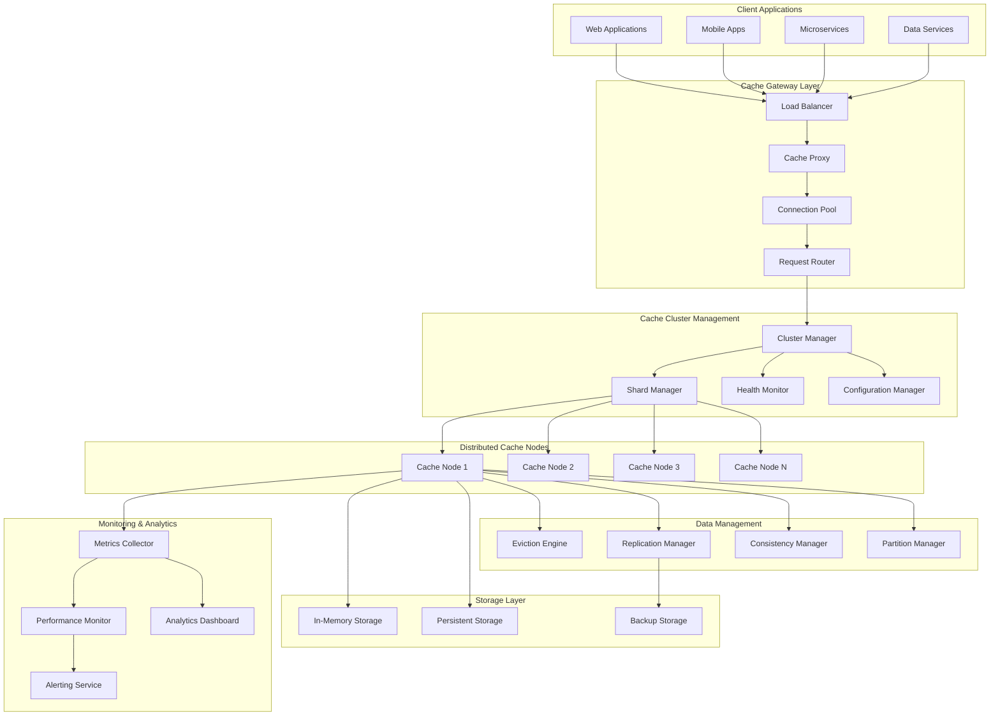
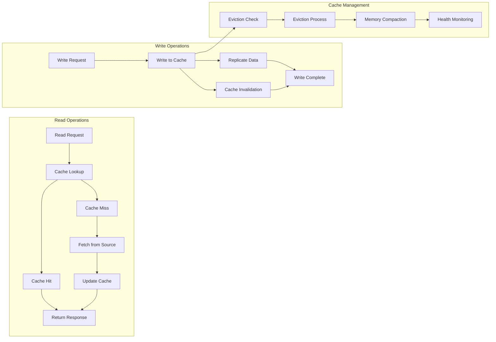
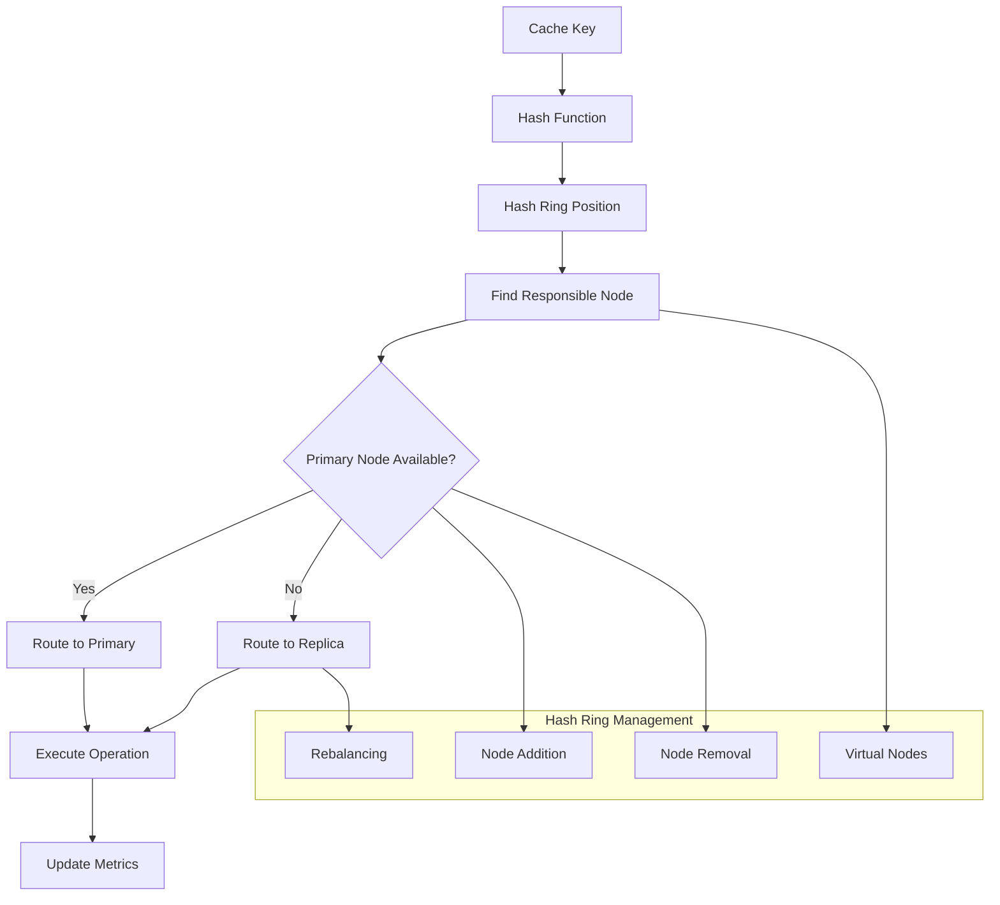
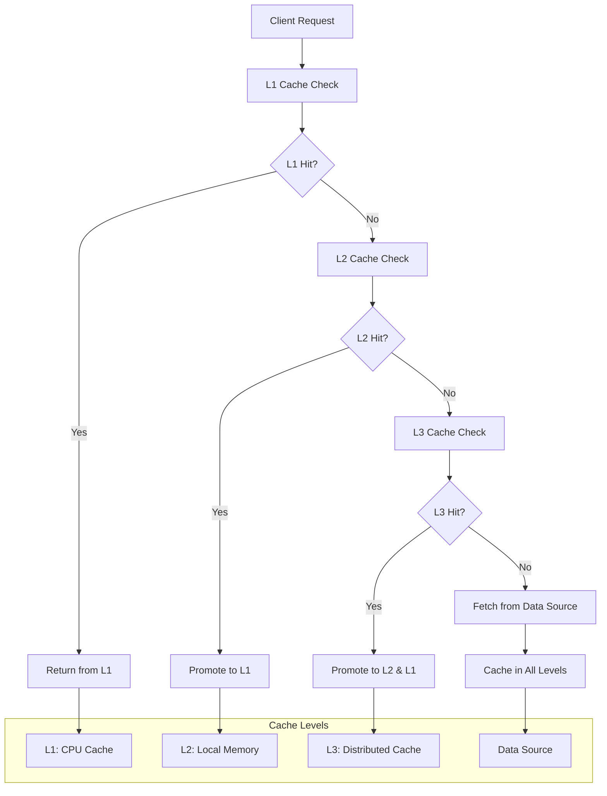
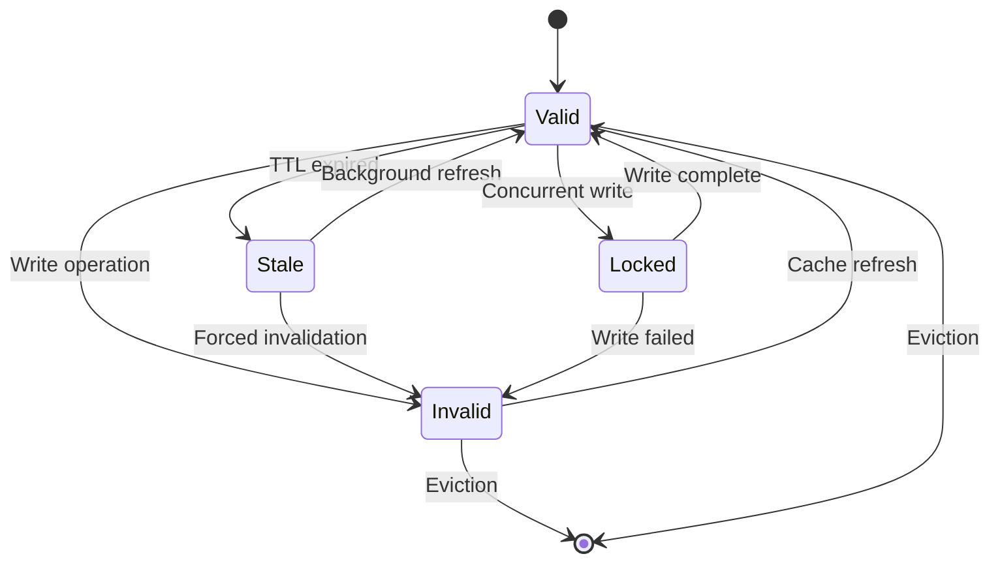
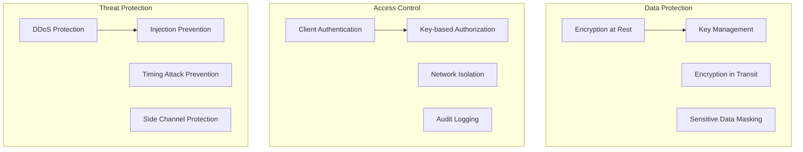

# Distributed Cache System


## 📋 Table of Contents

- [Distributed Cache System](#distributed-cache-system)
  - [High-Level Design (HLD)](#high-level-design-hld)
    - [System Architecture Overview](#system-architecture-overview)
    - [Cache Operation Flow](#cache-operation-flow)
  - [Low-Level Design (LLD)](#low-level-design-lld)
    - [Consistent Hashing for Sharding](#consistent-hashing-for-sharding)
    - [Multi-Level Cache Architecture](#multi-level-cache-architecture)
    - [Cache Consistency Model](#cache-consistency-model)
  - [Core Algorithms](#core-algorithms)
    - [1. Consistent Hashing with Virtual Nodes](#1-consistent-hashing-with-virtual-nodes)
    - [2. Advanced Eviction Algorithms](#2-advanced-eviction-algorithms)
    - [3. Cache Warming and Prefetching Strategy](#3-cache-warming-and-prefetching-strategy)
    - [4. Multi-Tier Cache Coherence Algorithm](#4-multi-tier-cache-coherence-algorithm)
    - [5. Performance Monitoring and Auto-Scaling](#5-performance-monitoring-and-auto-scaling)
  - [Performance Optimizations](#performance-optimizations)
    - [Memory Management](#memory-management)
    - [Network Optimization](#network-optimization)
  - [Security Considerations](#security-considerations)
    - [Cache Security Framework](#cache-security-framework)
  - [Testing Strategy](#testing-strategy)
    - [Performance Testing](#performance-testing)
    - [Reliability Testing](#reliability-testing)
  - [Trade-offs and Considerations](#trade-offs-and-considerations)
    - [Consistency vs Performance](#consistency-vs-performance)
    - [Memory vs Network](#memory-vs-network)
    - [Scalability vs Complexity](#scalability-vs-complexity)

---

## High-Level Design (HLD)

[⬆️ Back to Top](#-table-of-contents)

---


### System Architecture Overview

[⬆️ Back to Top](#-table-of-contents)

---




### Cache Operation Flow

[⬆️ Back to Top](#-table-of-contents)

---




## Low-Level Design (LLD)

[⬆️ Back to Top](#-table-of-contents)

---


### Consistent Hashing for Sharding

[⬆️ Back to Top](#-table-of-contents)

---




### Multi-Level Cache Architecture

[⬆️ Back to Top](#-table-of-contents)

---




### Cache Consistency Model

[⬆️ Back to Top](#-table-of-contents)

---




## Core Algorithms

[⬆️ Back to Top](#-table-of-contents)

---


### 1. Consistent Hashing with Virtual Nodes

[⬆️ Back to Top](#-table-of-contents)

---


**Purpose**: Distribute cache keys evenly across nodes and minimize data movement during cluster changes.

**Consistent Hashing Implementation**:
```
ConsistentHashConfig = {
  virtualNodesPerPhysicalNode: 160,    // Virtual nodes for better distribution
  hashFunction: 'sha1',                // Hash function for ring positions
  replicationFactor: 3,                // Number of replicas per key
  maxLoadFactor: 1.25,                 // Maximum load imbalance allowed
  
  rebalanceThreshold: 0.1,             // Trigger rebalance at 10% imbalance
  migrationBatchSize: 1000,            // Keys per migration batch
  migrationTimeout: 30000              // 30 seconds per batch
}

class ConsistentHashRing:
  constructor(config):
    this.config = config
    this.ring = new Map()              // position -> node mapping
    this.nodes = new Map()             // nodeId -> node info
    this.virtualNodes = new Map()      // virtualNodeId -> nodeId
    this.sortedPositions = []          // Sorted ring positions
  
  function addNode(nodeId, nodeInfo):
    this.nodes.set(nodeId, nodeInfo)
    
    // Create virtual nodes for this physical node
    for i in range(this.config.virtualNodesPerPhysicalNode):
      virtualNodeId = `${nodeId}:${i}`
      position = this.hashToPosition(`${virtualNodeId}`)
      
      this.ring.set(position, nodeId)
      this.virtualNodes.set(virtualNodeId, nodeId)
      this.sortedPositions.push(position)
    
    // Re-sort positions after adding new virtual nodes
    this.sortedPositions.sort((a, b) => a - b)
    
    // Trigger rebalancing if needed
    if this.shouldRebalance():
      this.rebalanceCluster()
  
  function removeNode(nodeId):
    // Remove all virtual nodes for this physical node
    virtualNodesToRemove = []
    
    for [virtualNodeId, physicalNodeId] of this.virtualNodes:
      if physicalNodeId === nodeId:
        virtualNodesToRemove.push(virtualNodeId)
    
    for virtualNodeId in virtualNodesToRemove:
      position = this.hashToPosition(virtualNodeId)
      this.ring.delete(position)
      this.virtualNodes.delete(virtualNodeId)
      this.sortedPositions = this.sortedPositions.filter(p => p !== position)
    
    this.nodes.delete(nodeId)
    
    // Trigger rebalancing
    this.rebalanceCluster()
  
  function getResponsibleNodes(key):
    if this.sortedPositions.length === 0:
      return []
    
    keyPosition = this.hashToPosition(key)
    responsibleNodes = []
    
    // Find the first node position >= key position
    startIndex = this.binarySearch(keyPosition)
    
    // Collect replicas
    uniqueNodes = new Set()
    index = startIndex
    
    while uniqueNodes.size < this.config.replicationFactor and uniqueNodes.size < this.nodes.size:
      position = this.sortedPositions[index % this.sortedPositions.length]
      nodeId = this.ring.get(position)
      
      if not uniqueNodes.has(nodeId):
        uniqueNodes.add(nodeId)
        responsibleNodes.push({
          nodeId: nodeId,
          position: position,
          isPrimary: uniqueNodes.size === 1
        })
      
      index = (index + 1) % this.sortedPositions.length
    
    return responsibleNodes
  
  function hashToPosition(input):
    hash = crypto.createHash(this.config.hashFunction).update(input).digest('hex')
    // Convert first 8 characters of hex to integer
    return parseInt(hash.substring(0, 8), 16)
  
  function shouldRebalance():
    if this.nodes.size < 2:
      return false
    
    // Calculate load distribution
    loadDistribution = this.calculateLoadDistribution()
    maxLoad = Math.max(...loadDistribution.values())
    minLoad = Math.min(...loadDistribution.values())
    avgLoad = Array.from(loadDistribution.values()).reduce((a, b) => a + b) / loadDistribution.size
    
    loadFactor = maxLoad / avgLoad
    imbalance = (maxLoad - minLoad) / avgLoad
    
    return loadFactor > this.config.maxLoadFactor or imbalance > this.config.rebalanceThreshold
```

**Data Migration Algorithm**:
```
function rebalanceCluster():
  // Calculate current and target key distributions
  currentDistribution = this.calculateCurrentDistribution()
  targetDistribution = this.calculateTargetDistribution()
  
  // Generate migration plan
  migrationPlan = this.generateMigrationPlan(currentDistribution, targetDistribution)
  
  if migrationPlan.totalKeys === 0:
    return // No migration needed
  
  // Execute migration in batches
  for batch in migrationPlan.batches:
    this.executeMigrationBatch(batch)

function executeMigrationBatch(batch):
  migrationTasks = []
  
  for migration in batch.migrations:
    task = {
      keys: migration.keys,
      sourceNode: migration.sourceNode,
      targetNode: migration.targetNode,
      batchId: batch.id
    }
    
    migrationTasks.push(this.migrateKeyBatch(task))
  
  // Execute all migrations in parallel
  results = await Promise.allSettled(migrationTasks)
  
  // Handle migration failures
  failedMigrations = results.filter(r => r.status === 'rejected')
  
  if failedMigrations.length > 0:
    this.handleMigrationFailures(failedMigrations, batch)

function migrateKeyBatch(task):
  sourceNode = this.nodes.get(task.sourceNode)
  targetNode = this.nodes.get(task.targetNode)
  
  migratedKeys = []
  
  for key in task.keys:
    try:
      // Get data from source node
      data = sourceNode.get(key)
      
      if data:
        // Write to target node
        writeSuccess = targetNode.set(key, data.value, data.ttl)
        
        if writeSuccess:
          // Verify write
          verifyData = targetNode.get(key)
          
          if verifyData and verifyData.value === data.value:
            // Remove from source node
            sourceNode.delete(key)
            migratedKeys.push(key)
          else:
            throw new Error(`Verification failed for key: ${key}`)
        else:
          throw new Error(`Write failed for key: ${key}`)
    
    catch error:
      logMigrationError(task.batchId, key, error)
      throw error
  
  return {
    batchId: task.batchId,
    migratedKeys: migratedKeys,
    sourceNode: task.sourceNode,
    targetNode: task.targetNode
  }
```

### 2. Advanced Eviction Algorithms

[⬆️ Back to Top](#-table-of-contents)

---


**Purpose**: Optimize cache performance by intelligently removing least valuable data when memory is full.

**Multi-Factor LRU with Frequency and Cost**:
```
EvictionConfig = {
  algorithm: 'adaptive_lru',           // 'lru', 'lfu', 'lru_k', 'adaptive_lru'
  memoryThreshold: 0.85,               // Trigger eviction at 85% memory
  evictionBatchSize: 100,              // Evict in batches
  costAwareEviction: true,             // Consider fetch cost in eviction
  
  frequencyWindow: 3600000,            // 1 hour frequency window
  agingFactor: 0.9,                    // Decay factor for aging frequency
  costWeight: 0.3,                     // Weight for fetch cost in scoring
  sizeWeight: 0.2,                     // Weight for entry size in scoring
  frequencyWeight: 0.5                 // Weight for access frequency
}

class AdaptiveLRUCache:
  constructor(config):
    this.config = config
    this.cache = new Map()             // key -> cache entry
    this.accessOrder = new DoublyLinkedList()  // LRU ordering
    this.frequencyCounter = new Map()   // key -> frequency info
    this.sizeTracker = new SizeTracker()
    this.evictionCandidates = new MinHeap()
  
  function get(key):
    entry = this.cache.get(key)
    
    if not entry:
      return null
    
    // Update access information
    this.updateAccessInfo(key, entry)
    
    // Move to front of LRU list
    this.accessOrder.moveToFront(entry.listNode)
    
    return entry.value
  
  function set(key, value, ttl = null, fetchCost = 1):
    // Check if eviction is needed
    if this.shouldEvict():
      this.performEviction()
    
    entry = {
      key: key,
      value: value,
      ttl: ttl,
      expiresAt: ttl ? Date.now() + ttl : null,
      createdAt: Date.now(),
      lastAccessed: Date.now(),
      accessCount: 1,
      fetchCost: fetchCost,
      size: this.calculateSize(value),
      listNode: null
    }
    
    // Add to LRU list
    entry.listNode = this.accessOrder.addToFront(entry)
    
    // Store in cache
    this.cache.set(key, entry)
    
    // Initialize frequency tracking
    this.frequencyCounter.set(key, {
      count: 1,
      firstAccess: Date.now(),
      lastUpdate: Date.now()
    })
    
    // Update size tracking
    this.sizeTracker.add(entry.size)
  
  function shouldEvict():
    memoryUsage = this.sizeTracker.totalSize / this.sizeTracker.maxSize
    return memoryUsage > this.config.memoryThreshold
  
  function performEviction():
    // Calculate eviction scores for all entries
    evictionCandidates = []
    
    for [key, entry] of this.cache:
      if this.isExpired(entry):
        // Expired entries have highest priority for eviction
        evictionCandidates.push({ key, score: Infinity })
      else:
        score = this.calculateEvictionScore(key, entry)
        evictionCandidates.push({ key, score })
    
    // Sort by eviction score (higher score = more likely to evict)
    evictionCandidates.sort((a, b) => b.score - a.score)
    
    // Evict entries in batches
    evictedCount = 0
    targetEvictionCount = Math.min(
      this.config.evictionBatchSize,
      Math.ceil(this.cache.size * 0.1) // Evict at most 10% of cache
    )
    
    for candidate in evictionCandidates:
      if evictedCount >= targetEvictionCount:
        break
      
      this.evictEntry(candidate.key)
      evictedCount++
      
      // Stop if we've freed enough memory
      if not this.shouldEvict():
        break
  
  function calculateEvictionScore(key, entry):
    score = 0
    
    // Recency factor (higher = more recently used = lower eviction score)
    timeSinceAccess = Date.now() - entry.lastAccessed
    recencyScore = timeSinceAccess / (24 * 60 * 60 * 1000) // Normalize to days
    
    // Frequency factor
    frequencyInfo = this.frequencyCounter.get(key)
    frequencyScore = this.calculateFrequencyScore(frequencyInfo)
    
    // Size factor (larger entries get higher eviction score)
    sizeScore = entry.size / this.sizeTracker.averageSize
    
    // Cost factor (expensive-to-fetch entries get lower eviction score)
    costScore = 1 / (entry.fetchCost + 1)
    
    // Combine factors
    score = (recencyScore * (1 - this.config.frequencyWeight)) +
            (frequencyScore * this.config.frequencyWeight) +
            (sizeScore * this.config.sizeWeight) +
            (costScore * this.config.costWeight)
    
    return score
  
  function calculateFrequencyScore(frequencyInfo):
    if not frequencyInfo:
      return 1.0 // High eviction score for entries without frequency data
    
    // Apply aging to frequency count
    timeElapsed = Date.now() - frequencyInfo.lastUpdate
    agingFactor = Math.pow(this.config.agingFactor, timeElapsed / this.config.frequencyWindow)
    
    adjustedFrequency = frequencyInfo.count * agingFactor
    
    // Normalize frequency (lower frequency = higher eviction score)
    return 1 / (adjustedFrequency + 1)
```

### 3. Cache Warming and Prefetching Strategy

[⬆️ Back to Top](#-table-of-contents)

---


**Purpose**: Proactively load frequently accessed data and predict future access patterns to improve cache hit rates.

**Intelligent Cache Warming**:
```
WarmingConfig = {
  warmingStrategies: ['historical', 'predictive', 'pattern_based'],
  warmingThreshold: 0.7,               // Start warming at 70% cache capacity
  maxWarmingConcurrency: 10,           // Max concurrent warming operations
  
  historicalWindow: 86400000,          // 24 hours historical data
  predictionAccuracyThreshold: 0.6,    // Minimum 60% prediction accuracy
  patternDetectionWindow: 3600000,     // 1 hour for pattern detection
  
  prefetchDistance: 5,                 // Number of related keys to prefetch
  prefetchProbabilityThreshold: 0.4    // Minimum 40% probability to prefetch
}

class CacheWarmingEngine:
  constructor(config):
    this.config = config
    this.accessHistory = new TimeSeriesDB()
    this.patternDetector = new PatternDetector()
    this.predictiveModel = new AccessPredictor()
    this.warmingQueue = new PriorityQueue()
  
  function initiateCacheWarming():
    // Analyze current cache state
    cacheStats = this.analyzeCacheState()
    
    if cacheStats.hitRate < this.config.warmingThreshold:
      // Trigger warming strategies
      this.executeWarmingStrategies(cacheStats)
  
  function executeWarmingStrategies(cacheStats):
    warmingTasks = []
    
    // Historical warming - warm frequently accessed keys
    if this.config.warmingStrategies.includes('historical'):
      historicalKeys = this.getHistoricallyPopularKeys()
      warmingTasks.push(...this.createWarmingTasks(historicalKeys, 'historical'))
    
    // Predictive warming - warm predicted future accesses
    if this.config.warmingStrategies.includes('predictive'):
      predictedKeys = this.predictFutureAccesses()
      warmingTasks.push(...this.createWarmingTasks(predictedKeys, 'predictive'))
    
    // Pattern-based warming - warm based on detected patterns
    if this.config.warmingStrategies.includes('pattern_based'):
      patternKeys = this.detectAccessPatterns()
      warmingTasks.push(...this.createWarmingTasks(patternKeys, 'pattern_based'))
    
    // Execute warming tasks with concurrency control
    this.executeWarmingTasks(warmingTasks)
  
  function getHistoricallyPopularKeys():
    // Query access history for frequently accessed keys
    endTime = Date.now()
    startTime = endTime - this.config.historicalWindow
    
    accessCounts = this.accessHistory.getAccessCounts(startTime, endTime)
    
    // Sort by access frequency and return top keys
    sortedKeys = Object.entries(accessCounts)
      .sort(([,a], [,b]) => b - a)
      .slice(0, 1000) // Top 1000 keys
      .map(([key, count]) => ({ key, priority: count, strategy: 'historical' }))
    
    return sortedKeys
  
  function predictFutureAccesses():
    // Use machine learning model to predict future accesses
    currentTime = Date.now()
    contextFeatures = this.extractContextFeatures(currentTime)
    
    predictions = this.predictiveModel.predict(contextFeatures)
    
    // Filter predictions by confidence threshold
    confidentPredictions = predictions.filter(p => 
      p.confidence >= this.config.predictionAccuracyThreshold
    )
    
    return confidentPredictions.map(p => ({
      key: p.key,
      priority: p.confidence,
      strategy: 'predictive'
    }))
  
  function detectAccessPatterns():
    // Detect sequential, batch, and temporal access patterns
    patterns = this.patternDetector.detectPatterns(this.config.patternDetectionWindow)
    
    patternKeys = []
    
    for pattern in patterns:
      switch pattern.type:
        case 'sequential':
          patternKeys.push(...this.generateSequentialKeys(pattern))
          break
        case 'batch':
          patternKeys.push(...this.generateBatchKeys(pattern))
          break
        case 'temporal':
          patternKeys.push(...this.generateTemporalKeys(pattern))
          break
    
    return patternKeys
  
  function createWarmingTasks(keys, strategy):
    tasks = []
    
    for keyInfo in keys:
      task = {
        key: keyInfo.key,
        priority: keyInfo.priority,
        strategy: strategy,
        createdAt: Date.now(),
        retries: 0
      }
      
      tasks.push(task)
    
    return tasks
  
  function executeWarmingTasks(tasks):
    // Sort tasks by priority
    sortedTasks = tasks.sort((a, b) => b.priority - a.priority)
    
    // Execute with concurrency control
    concurrentTasks = 0
    taskQueue = [...sortedTasks]
    
    while taskQueue.length > 0 and concurrentTasks < this.config.maxWarmingConcurrency:
      task = taskQueue.shift()
      concurrentTasks++
      
      this.executeWarmingTask(task).finally(() => {
        concurrentTasks--
        
        // Continue processing remaining tasks
        if taskQueue.length > 0:
          nextTask = taskQueue.shift()
          this.executeWarmingTask(nextTask)
      })
```

**Predictive Prefetching Algorithm**:
```
function executeWarmingTask(task):
  try:
    // Check if key is already in cache
    if this.cache.has(task.key):
      return { success: true, reason: 'already_cached' }
    
    // Fetch data from source
    data = await this.fetchFromDataSource(task.key)
    
    if data:
      // Calculate appropriate TTL based on access patterns
      ttl = this.calculateOptimalTTL(task.key, task.strategy)
      
      // Add to cache with lower priority (won't evict existing entries)
      this.cache.setWithPriority(task.key, data, ttl, 'warming')
      
      // Trigger related key prefetching
      if this.shouldPrefetchRelated(task):
        this.prefetchRelatedKeys(task.key, data)
      
      return { success: true, warmed: true }
    else:
      return { success: false, reason: 'data_not_found' }
    
  catch error:
    logWarmingError(task, error)
    
    // Retry with exponential backoff
    if task.retries < 3:
      task.retries++
      retryDelay = Math.pow(2, task.retries) * 1000
      
      setTimeout(() => {
        this.executeWarmingTask(task)
      }, retryDelay)
    
    return { success: false, reason: 'fetch_error', error: error }

function prefetchRelatedKeys(key, data):
  // Identify related keys based on various strategies
  relatedKeys = []
  
  // Content-based similarity
  contentKeys = this.findContentSimilarKeys(key, data)
  relatedKeys.push(...contentKeys)
  
  // Access pattern correlation
  correlatedKeys = this.findCorrelatedKeys(key)
  relatedKeys.push(...correlatedKeys)
  
  // Hierarchical relationships (parent/child keys)
  hierarchicalKeys = this.findHierarchicalKeys(key)
  relatedKeys.push(...hierarchicalKeys)
  
  // Limit prefetch count and filter by probability
  candidateKeys = relatedKeys
    .filter(k => k.probability >= this.config.prefetchProbabilityThreshold)
    .sort((a, b) => b.probability - a.probability)
    .slice(0, this.config.prefetchDistance)
  
  // Schedule prefetch tasks
  for candidate in candidateKeys:
    prefetchTask = {
      key: candidate.key,
      priority: candidate.probability,
      strategy: 'prefetch',
      parentKey: key,
      createdAt: Date.now()
    }
    
    this.warmingQueue.enqueue(prefetchTask)
```

### 4. Multi-Tier Cache Coherence Algorithm

[⬆️ Back to Top](#-table-of-contents)

---


**Purpose**: Maintain consistency across multiple cache tiers while optimizing for performance and reducing coordination overhead.

**Write-Through with Lazy Propagation**:
```
CoherenceConfig = {
  coherenceProtocol: 'write_through_lazy',  // 'write_through', 'write_back', 'write_through_lazy'
  invalidationStrategy: 'time_based',       // 'immediate', 'time_based', 'version_based'
  maxStaleTime: 60000,                      // 1 minute max staleness
  
  propagationBatchSize: 100,                // Batch invalidations
  propagationInterval: 5000,                // 5 seconds batch interval
  consistencyLevel: 'eventual',             // 'strong', 'eventual', 'weak'
  
  conflictResolution: 'timestamp',          // 'timestamp', 'version', 'manual'
}

class CacheCoherenceManager:
  constructor(config):
    this.config = config
    this.invalidationQueue = new BatchQueue()
    this.versionTracker = new Map()
    this.coherenceLog = new CircularBuffer(10000)
  
  function handleWrite(key, value, sourceNode):
    writeTimestamp = Date.now()
    version = this.incrementVersion(key)
    
    writeOperation = {
      key: key,
      value: value,
      version: version,
      timestamp: writeTimestamp,
      sourceNode: sourceNode,
      operation: 'write'
    }
    
    switch this.config.coherenceProtocol:
      case 'write_through':
        return this.executeWriteThrough(writeOperation)
      case 'write_back':
        return this.executeWriteBack(writeOperation)
      case 'write_through_lazy':
        return this.executeWriteThroughLazy(writeOperation)
  
  function executeWriteThroughLazy(writeOperation):
    // Write to local cache immediately
    localSuccess = this.writeToLocalCache(writeOperation)
    
    if not localSuccess:
      return { success: false, reason: 'local_write_failed' }
    
    // Queue for lazy propagation to other nodes
    this.queuePropagation(writeOperation)
    
    // Write to persistent storage if configured
    if this.hasPersistentStorage():
      this.writeToStorage(writeOperation)
    
    return { success: true, version: writeOperation.version }
  
  function queuePropagation(writeOperation):
    propagationTask = {
      operation: writeOperation,
      queuedAt: Date.now(),
      attempts: 0,
      maxAttempts: 3
    }
    
    this.invalidationQueue.add(propagationTask)
    
    // Process batch if queue is full or interval elapsed
    if this.invalidationQueue.shouldProcess():
      this.processPropagationBatch()
  
  function processPropagationBatch():
    batch = this.invalidationQueue.getBatch(this.config.propagationBatchSize)
    
    if batch.length === 0:
      return
    
    // Group operations by target nodes
    nodeOperations = this.groupOperationsByNode(batch)
    
    // Send invalidations to each node
    propagationPromises = []
    
    for [nodeId, operations] of nodeOperations:
      promise = this.sendInvalidationBatch(nodeId, operations)
      propagationPromises.push(promise)
    
    // Handle propagation results
    Promise.allSettled(propagationPromises).then(results => {
      this.handlePropagationResults(results, batch)
    })
  
  function sendInvalidationBatch(nodeId, operations):
    return new Promise((resolve, reject) => {
      invalidationMessage = {
        type: 'cache_invalidation_batch',
        operations: operations.map(op => ({
          key: op.operation.key,
          version: op.operation.version,
          timestamp: op.operation.timestamp,
          action: this.determineInvalidationAction(op.operation)
        })),
        sourceNode: this.nodeId,
        batchId: generateBatchId()
      }
      
      this.sendToNode(nodeId, invalidationMessage)
        .then(response => {
          if response.success:
            resolve({ nodeId, operations, success: true })
          else:
            reject({ nodeId, operations, error: response.error })
        })
        .catch(error => {
          reject({ nodeId, operations, error })
        })
    })
  
  function handleInvalidationMessage(message):
    processedOperations = []
    
    for operation in message.operations:
      result = this.processInvalidationOperation(operation)
      processedOperations.push({
        key: operation.key,
        success: result.success,
        reason: result.reason
      })
    
    // Send acknowledgment back
    acknowledgment = {
      type: 'invalidation_ack',
      batchId: message.batchId,
      sourceNode: message.sourceNode,
      results: processedOperations
    }
    
    this.sendToNode(message.sourceNode, acknowledgment)
  
  function processInvalidationOperation(operation):
    currentVersion = this.versionTracker.get(operation.key)
    
    // Check if invalidation is still relevant
    if currentVersion and currentVersion >= operation.version:
      return { success: true, reason: 'version_already_newer' }
    
    switch operation.action:
      case 'invalidate':
        return this.invalidateKey(operation.key, operation.version)
      case 'update':
        return this.updateKey(operation.key, operation.value, operation.version)
      case 'delete':
        return this.deleteKey(operation.key, operation.version)
    
    return { success: false, reason: 'unknown_action' }
  
  function invalidateKey(key, version):
    try:
      // Remove from cache
      this.cache.delete(key)
      
      // Update version tracker
      this.versionTracker.set(key, version)
      
      // Log invalidation
      this.coherenceLog.add({
        action: 'invalidate',
        key: key,
        version: version,
        timestamp: Date.now()
      })
      
      return { success: true }
      
    catch error:
      return { success: false, reason: 'invalidation_error', error: error }
```

### 5. Performance Monitoring and Auto-Scaling

[⬆️ Back to Top](#-table-of-contents)

---


**Purpose**: Monitor cache performance metrics and automatically scale cache resources based on load and performance patterns.

**Adaptive Scaling Algorithm**:
```
ScalingConfig = {
  metrics: {
    hitRate: { target: 0.85, weight: 0.4 },
    responseTime: { target: 50, weight: 0.3 },    // 50ms target
    cpuUsage: { target: 0.7, weight: 0.2 },
    memoryUsage: { target: 0.8, weight: 0.1 }
  },
  
  scalingThresholds: {
    scaleUp: 0.8,                // Scale up when composite score > 0.8
    scaleDown: 0.3               // Scale down when composite score < 0.3
  },
  
  minNodes: 3,
  maxNodes: 50,
  scaleUpCooldown: 300000,       // 5 minutes
  scaleDownCooldown: 600000,     // 10 minutes
  
  autoTuning: {
    enabled: true,
    learningWindow: 3600000,     // 1 hour
    adaptationRate: 0.1          // 10% adjustment per iteration
  }
}

class CacheAutoScaler:
  constructor(config):
    this.config = config
    this.metricsHistory = new TimeSeriesDB()
    this.lastScaleAction = Date.now()
    this.performanceModel = new PerformancePredictor()
  
  function evaluateScalingDecision():
    currentMetrics = this.collectCurrentMetrics()
    compositeScore = this.calculateCompositeScore(currentMetrics)
    
    scalingDecision = {
      action: 'none',
      reason: 'within_thresholds',
      confidence: 0,
      metrics: currentMetrics,
      compositeScore: compositeScore
    }
    
    // Check if scaling is needed
    if compositeScore > this.config.scalingThresholds.scaleUp:
      if this.canScaleUp():
        scalingDecision = this.generateScaleUpDecision(currentMetrics, compositeScore)
    else if compositeScore < this.config.scalingThresholds.scaleDown:
      if this.canScaleDown():
        scalingDecision = this.generateScaleDownDecision(currentMetrics, compositeScore)
    
    // Apply machine learning optimization if enabled
    if this.config.autoTuning.enabled:
      scalingDecision = this.optimizeWithML(scalingDecision)
    
    return scalingDecision
  
  function calculateCompositeScore(metrics):
    score = 0
    
    for [metricName, config] of Object.entries(this.config.metrics):
      metricValue = metrics[metricName]
      normalizedScore = this.normalizeMetric(metricName, metricValue, config.target)
      weightedScore = normalizedScore * config.weight
      score += weightedScore
    
    return Math.min(Math.max(score, 0), 1) // Clamp between 0 and 1
  
  function normalizeMetric(metricName, value, target):
    switch metricName:
      case 'hitRate':
        // Lower hit rate = higher scaling need
        return Math.max(0, (target - value) / target)
      
      case 'responseTime':
        // Higher response time = higher scaling need
        return Math.max(0, (value - target) / target)
      
      case 'cpuUsage':
      case 'memoryUsage':
        // Higher usage = higher scaling need
        return Math.max(0, (value - target) / (1 - target))
      
      default:
        return 0
  
  function generateScaleUpDecision(metrics, compositeScore):
    // Determine optimal number of nodes to add
    currentNodes = this.getCurrentNodeCount()
    predictedLoad = this.predictFutureLoad()
    
    // Calculate required capacity
    requiredCapacity = this.calculateRequiredCapacity(metrics, predictedLoad)
    optimalNodes = Math.ceil(requiredCapacity / this.getNodeCapacity())
    
    nodesToAdd = Math.min(
      optimalNodes - currentNodes,
      Math.ceil(currentNodes * 0.5), // Max 50% increase at once
      this.config.maxNodes - currentNodes
    )
    
    return {
      action: 'scale_up',
      reason: 'performance_degradation',
      confidence: compositeScore,
      nodesToAdd: nodesToAdd,
      targetNodes: currentNodes + nodesToAdd,
      predictedImprovement: this.predictPerformanceImprovement(nodesToAdd)
    }
  
  function executeScalingDecision(decision):
    if decision.action === 'none':
      return { success: true, message: 'No scaling needed' }
    
    try:
      switch decision.action:
        case 'scale_up':
          return this.executeScaleUp(decision)
        case 'scale_down':
          return this.executeScaleDown(decision)
        case 'rebalance':
          return this.executeRebalance(decision)
      
    catch error:
      logScalingError(decision, error)
      return { success: false, error: error }
  
  function executeScaleUp(decision):
    // Provision new cache nodes
    newNodes = []
    
    for i in range(decision.nodesToAdd):
      nodeConfig = this.generateOptimalNodeConfig()
      node = this.provisionCacheNode(nodeConfig)
      newNodes.push(node)
    
    // Wait for nodes to become ready
    readyNodes = await this.waitForNodesReady(newNodes)
    
    if readyNodes.length < decision.nodesToAdd:
      return { 
        success: false, 
        reason: 'node_provisioning_failed',
        readyNodes: readyNodes.length,
        expectedNodes: decision.nodesToAdd
      }
    
    // Add nodes to cluster
    for node in readyNodes:
      this.addNodeToCluster(node)
    
    // Trigger rebalancing
    this.triggerClusterRebalance()
    
    // Update scaling history
    this.recordScalingAction(decision)
    
    return {
      success: true,
      action: 'scale_up',
      nodesAdded: readyNodes.length,
      newClusterSize: this.getCurrentNodeCount()
    }
```

## Performance Optimizations

[⬆️ Back to Top](#-table-of-contents)

---


### Memory Management

[⬆️ Back to Top](#-table-of-contents)

---


**Memory Pool Optimization**:
```
MemoryConfig = {
  poolSizes: [64, 128, 256, 512, 1024, 2048, 4096], // Bytes
  preAllocatedPools: true,
  memoryCompaction: true,
  garbageCollectionThreshold: 0.9
}
```

### Network Optimization

[⬆️ Back to Top](#-table-of-contents)

---


**Connection Pooling and Multiplexing**:
- Persistent connections to reduce overhead
- HTTP/2 multiplexing for parallel requests
- Binary protocol for reduced bandwidth
- Compression for large values

## Security Considerations

[⬆️ Back to Top](#-table-of-contents)

---


### Cache Security Framework

[⬆️ Back to Top](#-table-of-contents)

---




## Testing Strategy

[⬆️ Back to Top](#-table-of-contents)

---


### Performance Testing

[⬆️ Back to Top](#-table-of-contents)

---


**Load Testing Scenarios**:
- Concurrent read/write operations (100K+ QPS)
- Memory pressure testing
- Network partition simulation
- Cache warming performance

### Reliability Testing

[⬆️ Back to Top](#-table-of-contents)

---


**Fault Tolerance Testing**:
- Node failure scenarios
- Split-brain prevention
- Data consistency verification
- Recovery time measurement

## Trade-offs and Considerations

[⬆️ Back to Top](#-table-of-contents)

---


### Consistency vs Performance

[⬆️ Back to Top](#-table-of-contents)

---

- **Strong consistency**: Data accuracy vs performance overhead
- **Eventual consistency**: Performance vs temporary inconsistency
- **Synchronous replication**: Consistency vs latency
- **Asynchronous replication**: Performance vs data loss risk

### Memory vs Network

[⬆️ Back to Top](#-table-of-contents)

---

- **Large cache size**: Memory cost vs network reduction
- **Small cache size**: Network overhead vs memory efficiency
- **Compression**: CPU overhead vs memory/network savings
- **Serialization**: CPU cost vs network efficiency

### Scalability vs Complexity

[⬆️ Back to Top](#-table-of-contents)

---

- **Auto-scaling**: Automatic optimization vs operational complexity
- **Manual scaling**: Predictable costs vs manual management
- **Sharding strategies**: Load distribution vs rebalancing overhead
- **Replication factor**: Fault tolerance vs storage cost

This distributed cache system provides a comprehensive foundation for high-performance caching with features like intelligent eviction, cache warming, multi-tier coherence, and auto-scaling while maintaining consistency, security, and operational efficiency standards. 