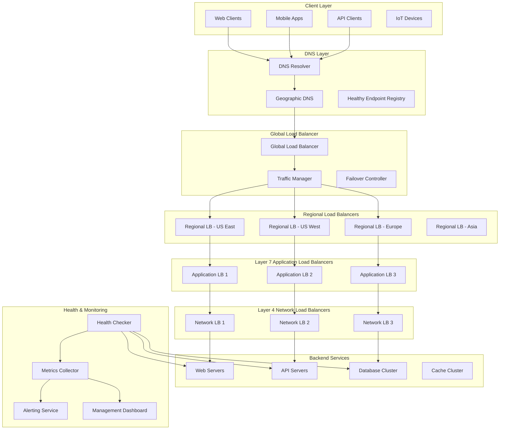
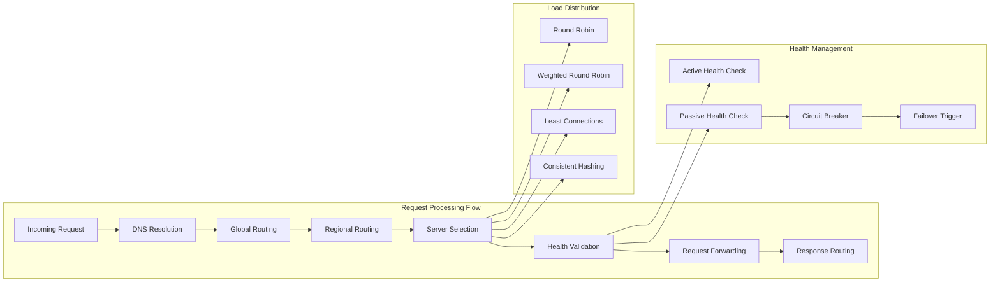
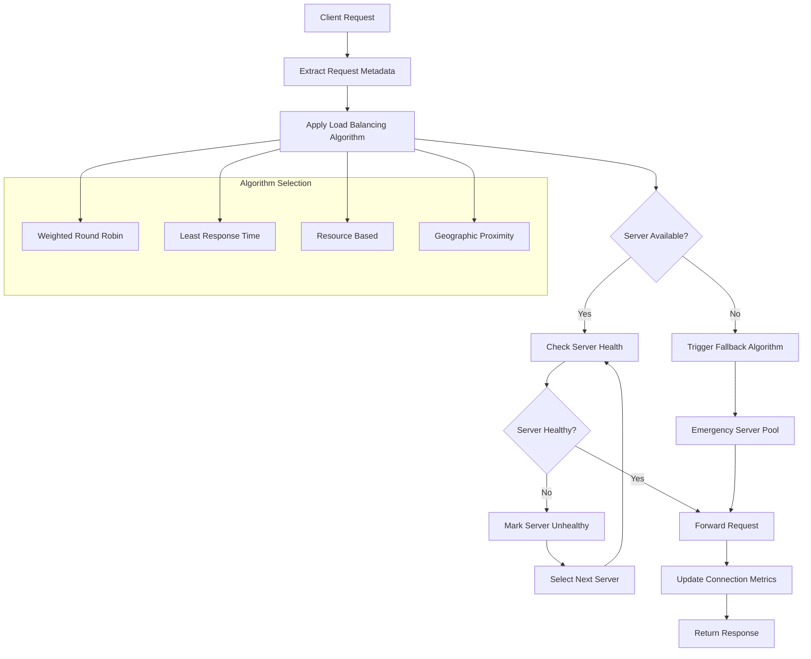
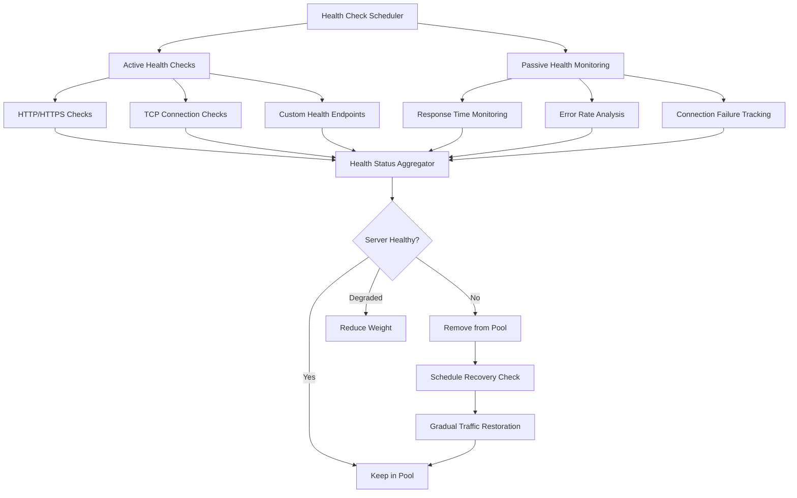
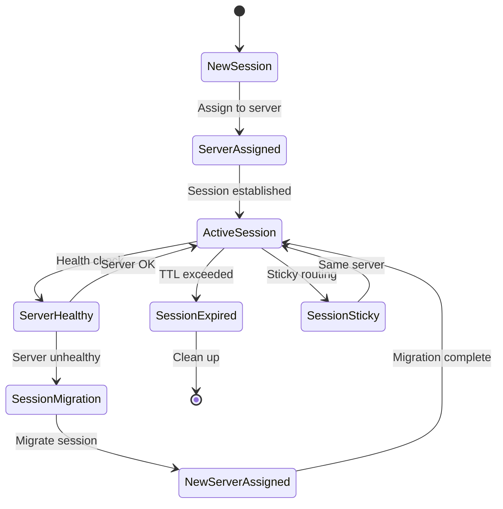
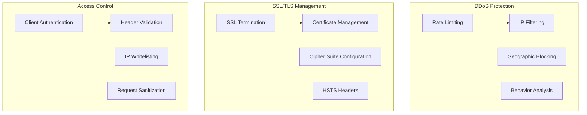

# Load Balancer System


## 📋 Table of Contents

- [Load Balancer System](#load-balancer-system)
  - [High-Level Design (HLD)](#high-level-design-hld)
    - [System Architecture Overview](#system-architecture-overview)
    - [Load Balancing Flow](#load-balancing-flow)
  - [Low-Level Design (LLD)](#low-level-design-lld)
    - [Intelligent Server Selection](#intelligent-server-selection)
    - [Health Check System](#health-check-system)
    - [Session Affinity Management](#session-affinity-management)
  - [Core Algorithms](#core-algorithms)
    - [1. Weighted Round Robin with Dynamic Adjustment](#1-weighted-round-robin-with-dynamic-adjustment)
    - [2. Intelligent Health Checking Algorithm](#2-intelligent-health-checking-algorithm)
    - [3. Session Affinity and Sticky Sessions](#3-session-affinity-and-sticky-sessions)
    - [4. Auto-Scaling and Capacity Management](#4-auto-scaling-and-capacity-management)
    - [5. Traffic Shaping and QoS Management](#5-traffic-shaping-and-qos-management)
  - [Performance Optimizations](#performance-optimizations)
    - [Connection Management](#connection-management)
    - [Request Routing Optimization](#request-routing-optimization)
  - [Security Considerations](#security-considerations)
    - [Load Balancer Security Framework](#load-balancer-security-framework)
  - [Testing Strategy](#testing-strategy)
    - [Load Testing](#load-testing)
    - [Reliability Testing](#reliability-testing)
  - [Trade-offs and Considerations](#trade-offs-and-considerations)
    - [Performance vs Reliability](#performance-vs-reliability)
    - [Scalability vs Cost](#scalability-vs-cost)
    - [Security vs Performance](#security-vs-performance)

---

## High-Level Design (HLD)

[⬆️ Back to Top](#-table-of-contents)

---


### System Architecture Overview

[⬆️ Back to Top](#-table-of-contents)

---




### Load Balancing Flow

[⬆️ Back to Top](#-table-of-contents)

---




## Low-Level Design (LLD)

[⬆️ Back to Top](#-table-of-contents)

---


### Intelligent Server Selection

[⬆️ Back to Top](#-table-of-contents)

---




### Health Check System

[⬆️ Back to Top](#-table-of-contents)

---




### Session Affinity Management

[⬆️ Back to Top](#-table-of-contents)

---




## Core Algorithms

[⬆️ Back to Top](#-table-of-contents)

---


### 1. Weighted Round Robin with Dynamic Adjustment

[⬆️ Back to Top](#-table-of-contents)

---


**Purpose**: Distribute requests across servers based on their capacity and current performance while adapting to changing conditions.

**Dynamic Weighted Round Robin Implementation**:
```
WeightedRRConfig = {
  initialWeight: 100,              // Default server weight
  weightAdjustmentInterval: 30000, // 30 seconds
  maxWeight: 1000,                 // Maximum server weight
  minWeight: 1,                    // Minimum server weight
  
  performanceFactors: {
    responseTime: 0.4,             // 40% weight for response time
    cpuUsage: 0.3,                 // 30% weight for CPU usage
    activeConnections: 0.2,        // 20% weight for connection count
    errorRate: 0.1                 // 10% weight for error rate
  },
  
  adjustmentSensitivity: 0.1,      // 10% maximum adjustment per interval
  smoothingFactor: 0.8             // Exponential smoothing factor
}

class DynamicWeightedRoundRobin:
  constructor(config):
    this.config = config
    this.servers = new Map()       // serverId -> server info
    this.currentWeights = new Map() // serverId -> current weight
    this.totalWeight = 0
    this.currentIndex = 0
    this.lastAdjustment = Date.now()
  
  function addServer(serverId, serverInfo):
    server = {
      id: serverId,
      info: serverInfo,
      weight: this.config.initialWeight,
      effectiveWeight: this.config.initialWeight,
      currentWeight: 0,
      
      // Performance metrics
      responseTime: 0,
      cpuUsage: 0,
      activeConnections: 0,
      errorRate: 0,
      
      // Health status
      isHealthy: true,
      lastHealthCheck: Date.now()
    }
    
    this.servers.set(serverId, server)
    this.recalculateTotalWeight()
  
  function selectServer():
    if this.servers.size === 0:
      return null
    
    // Adjust weights periodically
    if this.shouldAdjustWeights():
      this.adjustServerWeights()
    
    // Find server with highest current weight
    selectedServer = null
    maxWeight = -1
    
    for [serverId, server] of this.servers:
      if server.isHealthy and server.currentWeight > maxWeight:
        maxWeight = server.currentWeight
        selectedServer = server
    
    if selectedServer:
      // Update current weights
      selectedServer.currentWeight -= this.totalWeight
      
      for [serverId, server] of this.servers:
        if server.isHealthy:
          server.currentWeight += server.effectiveWeight
    
    return selectedServer
  
  function adjustServerWeights():
    currentTime = Date.now()
    
    for [serverId, server] of this.servers:
      if not server.isHealthy:
        continue
      
      // Calculate performance score
      performanceScore = this.calculatePerformanceScore(server)
      
      // Calculate new weight based on performance
      targetWeight = this.config.initialWeight * performanceScore
      
      // Apply smoothing and constraints
      newWeight = this.applyWeightSmoothing(server.weight, targetWeight)
      newWeight = Math.max(this.config.minWeight, Math.min(this.config.maxWeight, newWeight))
      
      // Update server weight
      server.weight = newWeight
      server.effectiveWeight = newWeight
    
    this.recalculateTotalWeight()
    this.lastAdjustment = currentTime
  
  function calculatePerformanceScore(server):
    score = 1.0
    
    // Response time factor (lower is better)
    if server.responseTime > 0:
      responseTimeScore = 1 / (1 + server.responseTime / 1000) // Normalize to seconds
      score *= (1 - this.config.performanceFactors.responseTime) + 
               (this.config.performanceFactors.responseTime * responseTimeScore)
    
    // CPU usage factor (lower is better)
    cpuScore = 1 - server.cpuUsage
    score *= (1 - this.config.performanceFactors.cpuUsage) + 
             (this.config.performanceFactors.cpuUsage * cpuScore)
    
    // Active connections factor (fewer is better, relatively)
    avgConnections = this.calculateAverageConnections()
    connectionScore = avgConnections > 0 ? Math.max(0, 2 - server.activeConnections / avgConnections) : 1
    score *= (1 - this.config.performanceFactors.activeConnections) + 
             (this.config.performanceFactors.activeConnections * connectionScore)
    
    // Error rate factor (lower is better)
    errorScore = 1 - server.errorRate
    score *= (1 - this.config.performanceFactors.errorRate) + 
             (this.config.performanceFactors.errorRate * errorScore)
    
    return Math.max(0.1, Math.min(5.0, score)) // Clamp between 0.1 and 5.0
  
  function applyWeightSmoothing(currentWeight, targetWeight):
    // Exponential moving average for smooth weight transitions
    smoothedWeight = (this.config.smoothingFactor * currentWeight) + 
                     ((1 - this.config.smoothingFactor) * targetWeight)
    
    // Apply adjustment sensitivity limit
    maxChange = currentWeight * this.config.adjustmentSensitivity
    change = smoothedWeight - currentWeight
    
    if Math.abs(change) > maxChange:
      change = Math.sign(change) * maxChange
    
    return currentWeight + change
```

### 2. Intelligent Health Checking Algorithm

[⬆️ Back to Top](#-table-of-contents)

---


**Purpose**: Comprehensive health monitoring with adaptive check intervals and multiple health indicators for accurate server status determination.

**Multi-Tier Health Checking System**:
```
HealthCheckConfig = {
  checkTypes: ['tcp', 'http', 'custom'],
  checkIntervals: {
    healthy: 30000,              // 30 seconds for healthy servers
    unhealthy: 5000,             // 5 seconds for unhealthy servers
    degraded: 15000              // 15 seconds for degraded servers
  },
  
  thresholds: {
    responseTime: 5000,          // 5 seconds max response time
    consecutiveFailures: 3,       // Mark unhealthy after 3 failures
    consecutiveSuccesses: 2,      // Mark healthy after 2 successes
    errorRateThreshold: 0.05      // 5% error rate threshold
  },
  
  circuitBreaker: {
    enabled: true,
    failureThreshold: 5,         // Open circuit after 5 failures
    recoveryTimeout: 60000,      // 1 minute recovery timeout
    halfOpenMaxRequests: 3       // Max requests in half-open state
  }
}

class IntelligentHealthChecker:
  constructor(config):
    this.config = config
    this.serverHealth = new Map()
    this.circuitBreakers = new Map()
    this.healthHistory = new Map()
    this.checkScheduler = new HealthCheckScheduler()
  
  function initializeServerHealth(serverId, serverConfig):
    healthStatus = {
      serverId: serverId,
      status: 'unknown',           // 'healthy', 'unhealthy', 'degraded', 'unknown'
      lastCheckTime: Date.now(),
      consecutiveFailures: 0,
      consecutiveSuccesses: 0,
      
      // Performance metrics
      responseTime: 0,
      errorRate: 0,
      availability: 1.0,
      
      // Check configuration
      checkInterval: this.config.checkIntervals.healthy,
      checkTypes: serverConfig.healthChecks || ['tcp', 'http'],
      
      // Circuit breaker state
      circuitState: 'closed'       // 'closed', 'open', 'half_open'
    }
    
    this.serverHealth.set(serverId, healthStatus)
    this.healthHistory.set(serverId, new CircularBuffer(100))
    
    // Initialize circuit breaker
    if this.config.circuitBreaker.enabled:
      this.circuitBreakers.set(serverId, new CircuitBreaker(serverId, this.config.circuitBreaker))
    
    // Schedule initial health check
    this.scheduleHealthCheck(serverId)
  
  function performHealthCheck(serverId):
    serverHealth = this.serverHealth.get(serverId)
    
    if not serverHealth:
      return
    
    checkPromises = []
    
    // Execute all configured health check types
    for checkType in serverHealth.checkTypes:
      switch checkType:
        case 'tcp':
          checkPromises.push(this.performTCPCheck(serverId))
          break
        case 'http':
          checkPromises.push(this.performHTTPCheck(serverId))
          break
        case 'custom':
          checkPromises.push(this.performCustomCheck(serverId))
          break
    
    // Wait for all checks to complete
    Promise.allSettled(checkPromises).then(results => {
      this.processHealthCheckResults(serverId, results)
    })
  
  function performHTTPCheck(serverId):
    return new Promise((resolve, reject) => {
      server = this.getServerConfig(serverId)
      startTime = Date.now()
      
      healthCheckUrl = `${server.protocol}://${server.host}:${server.port}${server.healthPath || '/health'}`
      
      httpRequest = this.createHealthCheckRequest(healthCheckUrl)
      
      httpRequest.setTimeout(this.config.thresholds.responseTime)
      
      httpRequest.on('response', (response) => {
        responseTime = Date.now() - startTime
        
        if response.statusCode >= 200 and response.statusCode < 300:
          resolve({
            type: 'http',
            success: true,
            responseTime: responseTime,
            statusCode: response.statusCode
          })
        else:
          reject({
            type: 'http',
            success: false,
            responseTime: responseTime,
            statusCode: response.statusCode,
            error: `HTTP ${response.statusCode}`
          })
      })
      
      httpRequest.on('timeout', () => {
        reject({
          type: 'http',
          success: false,
          responseTime: this.config.thresholds.responseTime,
          error: 'timeout'
        })
      })
      
      httpRequest.on('error', (error) => {
        reject({
          type: 'http',
          success: false,
          responseTime: Date.now() - startTime,
          error: error.message
        })
      })
    })
  
  function processHealthCheckResults(serverId, results):
    serverHealth = this.serverHealth.get(serverId)
    successfulChecks = results.filter(r => r.status === 'fulfilled' and r.value.success)
    failedChecks = results.filter(r => r.status === 'rejected' or not r.value.success)
    
    // Calculate aggregate health score
    healthScore = successfulChecks.length / results.length
    
    // Update performance metrics
    if successfulChecks.length > 0:
      avgResponseTime = successfulChecks.reduce((sum, check) => sum + check.value.responseTime, 0) / successfulChecks.length
      serverHealth.responseTime = avgResponseTime
    
    // Determine health status based on checks
    isHealthy = this.determineHealthStatus(healthScore, serverHealth, results)
    
    if isHealthy:
      serverHealth.consecutiveSuccesses++
      serverHealth.consecutiveFailures = 0
      
      // Update status based on consecutive successes
      if serverHealth.status === 'unhealthy' and serverHealth.consecutiveSuccesses >= this.config.thresholds.consecutiveSuccesses:
        this.markServerHealthy(serverId)
      else if serverHealth.status === 'degraded' and serverHealth.consecutiveSuccesses >= this.config.thresholds.consecutiveSuccesses:
        this.markServerHealthy(serverId)
    else:
      serverHealth.consecutiveFailures++
      serverHealth.consecutiveSuccesses = 0
      
      // Update status based on consecutive failures
      if serverHealth.consecutiveFailures >= this.config.thresholds.consecutiveFailures:
        this.markServerUnhealthy(serverId, failedChecks)
    
    // Store health check result in history
    healthRecord = {
      timestamp: Date.now(),
      healthy: isHealthy,
      score: healthScore,
      responseTime: serverHealth.responseTime,
      checks: results.length,
      errors: failedChecks.map(check => check.reason || check.value?.error)
    }
    
    this.healthHistory.get(serverId).add(healthRecord)
    
    // Schedule next health check
    this.scheduleNextHealthCheck(serverId)
  
  function markServerUnhealthy(serverId, failedChecks):
    serverHealth = this.serverHealth.get(serverId)
    
    previousStatus = serverHealth.status
    serverHealth.status = 'unhealthy'
    serverHealth.checkInterval = this.config.checkIntervals.unhealthy
    
    // Activate circuit breaker if configured
    if this.config.circuitBreaker.enabled:
      circuitBreaker = this.circuitBreakers.get(serverId)
      circuitBreaker.recordFailure()
      serverHealth.circuitState = circuitBreaker.getState()
    
    // Log status change
    if previousStatus !== 'unhealthy':
      this.logHealthStatusChange(serverId, previousStatus, 'unhealthy', failedChecks)
      this.notifyHealthStatusChange(serverId, 'unhealthy')
    
    // Remove from load balancer pool
    this.removeServerFromPool(serverId)
```

### 3. Session Affinity and Sticky Sessions

[⬆️ Back to Top](#-table-of-contents)

---


**Purpose**: Maintain user session continuity by routing requests from the same user to the same backend server while handling server failures gracefully.

**Consistent Hash-Based Session Affinity**:
```
SessionAffinityConfig = {
  affinityMethod: 'consistent_hash',   // 'consistent_hash', 'cookie', 'ip_hash'
  sessionTimeout: 1800000,             // 30 minutes
  stickyness: 'soft',                  // 'soft', 'hard'
  
  cookieConfig: {
    name: 'lb_session',
    httpOnly: true,
    secure: true,
    sameSite: 'strict',
    path: '/'
  },
  
  failover: {
    enabled: true,
    migrateOnFailure: true,
    maxRetries: 2
  },
  
  hashRing: {
    virtualNodes: 160,
    hashFunction: 'sha256'
  }
}

class SessionAffinityManager:
  constructor(config):
    this.config = config
    this.sessionStore = new Map()      // sessionId -> server mapping
    this.serverSessions = new Map()    // serverId -> Set of sessions
    this.hashRing = new ConsistentHashRing(config.hashRing)
    this.sessionCleanupTimer = null
  
  function getServerForSession(sessionId, availableServers):
    existingMapping = this.sessionStore.get(sessionId)
    
    if existingMapping:
      // Check if assigned server is still available
      if availableServers.includes(existingMapping.serverId):
        // Update last access time
        existingMapping.lastAccess = Date.now()
        return existingMapping.serverId
      else:
        // Server is unavailable - handle failover
        return this.handleSessionFailover(sessionId, existingMapping, availableServers)
    
    // No existing session - assign new server
    return this.assignNewSession(sessionId, availableServers)
  
  function assignNewSession(sessionId, availableServers):
    switch this.config.affinityMethod:
      case 'consistent_hash':
        serverId = this.hashRing.getNode(sessionId, availableServers)
        break
      case 'ip_hash':
        serverId = this.selectByIPHash(sessionId, availableServers)
        break
      case 'cookie':
        serverId = this.selectByCookie(sessionId, availableServers)
        break
      default:
        serverId = availableServers[0] // Fallback to first available
    
    if serverId:
      sessionMapping = {
        sessionId: sessionId,
        serverId: serverId,
        createdAt: Date.now(),
        lastAccess: Date.now(),
        failoverCount: 0
      }
      
      this.sessionStore.set(sessionId, sessionMapping)
      
      // Track sessions per server
      if not this.serverSessions.has(serverId):
        this.serverSessions.set(serverId, new Set())
      this.serverSessions.get(serverId).add(sessionId)
    
    return serverId
  
  function handleSessionFailover(sessionId, sessionMapping, availableServers):
    if not this.config.failover.enabled:
      // Hard stickiness - remove session if server unavailable
      this.removeSession(sessionId)
      return null
    
    // Soft stickiness - migrate session to new server
    if sessionMapping.failoverCount >= this.config.failover.maxRetries:
      this.removeSession(sessionId)
      return null
    
    // Select new server for session
    newServerId = this.selectFailoverServer(sessionId, sessionMapping.serverId, availableServers)
    
    if newServerId:
      // Update session mapping
      sessionMapping.serverId = newServerId
      sessionMapping.lastAccess = Date.now()
      sessionMapping.failoverCount++
      
      // Update server session tracking
      this.updateServerSessionTracking(sessionId, sessionMapping.serverId, newServerId)
      
      // Migrate session data if configured
      if this.config.failover.migrateOnFailure:
        this.migrateSessionData(sessionId, sessionMapping.serverId, newServerId)
      
      // Log failover event
      this.logSessionFailover(sessionId, sessionMapping.serverId, newServerId)
    
    return newServerId
  
  function selectFailoverServer(sessionId, failedServerId, availableServers):
    // Exclude the failed server from available options
    candidateServers = availableServers.filter(id => id !== failedServerId)
    
    if candidateServers.length === 0:
      return null
    
    // Use consistent hashing to select new server
    return this.hashRing.getNode(sessionId, candidateServers)
  
  function migrateSessionData(sessionId, oldServerId, newServerId):
    try:
      // Retrieve session data from old server
      sessionData = this.getSessionDataFromServer(oldServerId, sessionId)
      
      if sessionData:
        // Transfer session data to new server
        success = this.setSessionDataOnServer(newServerId, sessionId, sessionData)
        
        if success:
          // Clean up session data from old server
          this.cleanupSessionDataFromServer(oldServerId, sessionId)
          
          return true
        else:
          logSessionMigrationError(sessionId, oldServerId, newServerId, 'transfer_failed')
          return false
      else:
        // No session data found - this is acceptable for stateless sessions
        return true
    
    catch error:
      logSessionMigrationError(sessionId, oldServerId, newServerId, error.message)
      return false
  
  function cleanupExpiredSessions():
    currentTime = Date.now()
    expiredSessions = []
    
    for [sessionId, sessionMapping] of this.sessionStore:
      timeSinceAccess = currentTime - sessionMapping.lastAccess
      
      if timeSinceAccess > this.config.sessionTimeout:
        expiredSessions.push(sessionId)
    
    // Remove expired sessions
    for sessionId in expiredSessions:
      this.removeSession(sessionId)
    
    // Schedule next cleanup
    if this.sessionCleanupTimer:
      clearTimeout(this.sessionCleanupTimer)
    
    this.sessionCleanupTimer = setTimeout(() => {
      this.cleanupExpiredSessions()
    }, 300000) // 5 minutes
  
  function removeSession(sessionId):
    sessionMapping = this.sessionStore.get(sessionId)
    
    if sessionMapping:
      // Remove from session store
      this.sessionStore.delete(sessionId)
      
      // Remove from server session tracking
      serverSessions = this.serverSessions.get(sessionMapping.serverId)
      if serverSessions:
        serverSessions.delete(sessionId)
        
        if serverSessions.size === 0:
          this.serverSessions.delete(sessionMapping.serverId)
      
      // Clean up session data from server
      this.cleanupSessionDataFromServer(sessionMapping.serverId, sessionId)
```

### 4. Auto-Scaling and Capacity Management

[⬆️ Back to Top](#-table-of-contents)

---


**Purpose**: Automatically adjust backend server capacity based on traffic patterns, performance metrics, and predictive analysis.

**Predictive Auto-Scaling Algorithm**:
```
AutoScalingConfig = {
  scalingTriggers: {
    cpuThreshold: 0.7,           // 70% CPU utilization
    memoryThreshold: 0.8,        // 80% memory utilization
    connectionThreshold: 1000,    // 1000 concurrent connections
    responseTimeThreshold: 1000   // 1 second response time
  },
  
  scalingPolicy: {
    scaleUpCooldown: 300000,     // 5 minutes
    scaleDownCooldown: 900000,   // 15 minutes
    minInstances: 2,
    maxInstances: 50,
    scaleUpFactor: 1.5,          // 50% increase
    scaleDownFactor: 0.8         // 20% decrease
  },
  
  prediction: {
    enabled: true,
    lookAheadMinutes: 30,        // Predict 30 minutes ahead
    historicalDataPoints: 168,   // 1 week of hourly data
    seasonalityDetection: true,
    trendAnalysis: true
  }
}

class AutoScalingManager:
  constructor(config):
    this.config = config
    this.metricsHistory = new TimeSeriesDB()
    this.scalingHistory = new Map()
    this.predictiveModel = new TrafficPredictor()
    this.lastScaleAction = Date.now()
  
  function evaluateScalingDecision():
    currentMetrics = this.collectCurrentMetrics()
    scalingDecision = {
      action: 'none',
      reason: 'within_thresholds',
      confidence: 0,
      targetCapacity: currentMetrics.currentCapacity
    }
    
    // Check current performance thresholds
    thresholdDecision = this.evaluateThresholdTriggers(currentMetrics)
    
    // Check predictive scaling if enabled
    predictiveDecision = null
    if this.config.prediction.enabled:
      predictiveDecision = this.evaluatePredictiveScaling(currentMetrics)
    
    // Combine decisions (predictive takes precedence if confidence is high)
    if predictiveDecision and predictiveDecision.confidence > 0.8:
      scalingDecision = predictiveDecision
    else if thresholdDecision.action !== 'none':
      scalingDecision = thresholdDecision
    
    // Validate scaling constraints
    scalingDecision = this.validateScalingConstraints(scalingDecision)
    
    return scalingDecision
  
  function evaluateThresholdTriggers(metrics):
    violations = []
    
    // Check CPU threshold
    if metrics.avgCpuUsage > this.config.scalingTriggers.cpuThreshold:
      violations.push({
        metric: 'cpu',
        value: metrics.avgCpuUsage,
        threshold: this.config.scalingTriggers.cpuThreshold,
        severity: (metrics.avgCpuUsage - this.config.scalingTriggers.cpuThreshold) / this.config.scalingTriggers.cpuThreshold
      })
    
    // Check memory threshold
    if metrics.avgMemoryUsage > this.config.scalingTriggers.memoryThreshold:
      violations.push({
        metric: 'memory',
        value: metrics.avgMemoryUsage,
        threshold: this.config.scalingTriggers.memoryThreshold,
        severity: (metrics.avgMemoryUsage - this.config.scalingTriggers.memoryThreshold) / this.config.scalingTriggers.memoryThreshold
      })
    
    // Check connection threshold
    if metrics.totalConnections > this.config.scalingTriggers.connectionThreshold * metrics.currentCapacity:
      violations.push({
        metric: 'connections',
        value: metrics.totalConnections,
        threshold: this.config.scalingTriggers.connectionThreshold * metrics.currentCapacity,
        severity: (metrics.totalConnections - this.config.scalingTriggers.connectionThreshold * metrics.currentCapacity) / (this.config.scalingTriggers.connectionThreshold * metrics.currentCapacity)
      })
    
    // Check response time threshold
    if metrics.avgResponseTime > this.config.scalingTriggers.responseTimeThreshold:
      violations.push({
        metric: 'response_time',
        value: metrics.avgResponseTime,
        threshold: this.config.scalingTriggers.responseTimeThreshold,
        severity: (metrics.avgResponseTime - this.config.scalingTriggers.responseTimeThreshold) / this.config.scalingTriggers.responseTimeThreshold
      })
    
    if violations.length > 0:
      // Calculate target capacity based on worst violation
      worstViolation = violations.sort((a, b) => b.severity - a.severity)[0]
      targetCapacity = Math.ceil(metrics.currentCapacity * this.config.scalingPolicy.scaleUpFactor)
      
      return {
        action: 'scale_up',
        reason: 'threshold_violation',
        confidence: Math.min(worstViolation.severity, 1.0),
        targetCapacity: targetCapacity,
        violations: violations
      }
    
    // Check for scale-down opportunity
    if this.canScaleDown(metrics):
      targetCapacity = Math.max(
        this.config.scalingPolicy.minInstances,
        Math.floor(metrics.currentCapacity * this.config.scalingPolicy.scaleDownFactor)
      )
      
      return {
        action: 'scale_down',
        reason: 'resource_underutilization',
        confidence: 0.6,
        targetCapacity: targetCapacity
      }
    
    return { action: 'none', reason: 'within_thresholds' }
  
  function evaluatePredictiveScaling(currentMetrics):
    // Prepare prediction features
    features = this.preparePredictionFeatures(currentMetrics)
    
    // Get traffic prediction
    prediction = this.predictiveModel.predict(features, this.config.prediction.lookAheadMinutes)
    
    if prediction.confidence < 0.5:
      return null // Low confidence prediction
    
    // Calculate required capacity for predicted traffic
    requiredCapacity = this.calculateRequiredCapacity(prediction.predictedLoad)
    
    if requiredCapacity > currentMetrics.currentCapacity:
      return {
        action: 'scale_up',
        reason: 'predicted_traffic_increase',
        confidence: prediction.confidence,
        targetCapacity: requiredCapacity,
        prediction: prediction
      }
    else if requiredCapacity < currentMetrics.currentCapacity * 0.7:
      return {
        action: 'scale_down',
        reason: 'predicted_traffic_decrease',
        confidence: prediction.confidence,
        targetCapacity: Math.max(this.config.scalingPolicy.minInstances, requiredCapacity),
        prediction: prediction
      }
    
    return null
  
  function executeScalingDecision(decision):
    if decision.action === 'none':
      return { success: true, message: 'No scaling needed' }
    
    // Check cooldown periods
    if not this.canExecuteScaling(decision.action):
      return { success: false, reason: 'cooldown_period_active' }
    
    try:
      switch decision.action:
        case 'scale_up':
          return this.executeScaleUp(decision)
        case 'scale_down':
          return this.executeScaleDown(decision)
      
    catch error:
      logScalingError(decision, error)
      return { success: false, error: error }
  
  function executeScaleUp(decision):
    currentCapacity = this.getCurrentCapacity()
    targetCapacity = decision.targetCapacity
    instancesToAdd = targetCapacity - currentCapacity
    
    // Provision new instances
    newInstances = []
    
    for i in range(instancesToAdd):
      instance = this.provisionNewInstance()
      newInstances.push(instance)
    
    // Wait for instances to become ready
    readyInstances = await this.waitForInstancesReady(newInstances)
    
    // Add instances to load balancer pool
    for instance in readyInstances:
      this.addInstanceToPool(instance)
    
    // Record scaling action
    this.recordScalingAction(decision, readyInstances.length)
    
    return {
      success: true,
      action: 'scale_up',
      instancesAdded: readyInstances.length,
      newCapacity: currentCapacity + readyInstances.length
    }
```

### 5. Traffic Shaping and QoS Management

[⬆️ Back to Top](#-table-of-contents)

---


**Purpose**: Implement quality of service controls and traffic shaping to prioritize critical traffic and prevent system overload.

**Priority-Based Traffic Shaping**:
```
QoSConfig = {
  trafficClasses: {
    critical: { priority: 1, bandwidth: 0.4, maxLatency: 50 },
    high: { priority: 2, bandwidth: 0.3, maxLatency: 100 },
    normal: { priority: 3, bandwidth: 0.2, maxLatency: 500 },
    low: { priority: 4, bandwidth: 0.1, maxLatency: 2000 }
  },
  
  rateLimiting: {
    enabled: true,
    globalLimit: 10000,          // 10K requests per second
    perClientLimit: 100,         // 100 requests per second per client
    burstAllowance: 1.5          // 50% burst capacity
  },
  
  circuitBreaker: {
    enabled: true,
    failureThreshold: 0.5,       // 50% failure rate
    requestVolumeThreshold: 20,   // Minimum 20 requests
    sleepWindow: 60000           // 1 minute recovery period
  }
}

class TrafficShaper:
  constructor(config):
    this.config = config
    this.trafficQueues = new Map()
    this.rateLimiters = new Map()
    this.circuitBreakers = new Map()
    this.bandwidthAllocator = new BandwidthAllocator(config.trafficClasses)
  
  function classifyRequest(request):
    // Extract request characteristics
    clientId = this.extractClientId(request)
    requestType = this.analyzeRequestType(request)
    userTier = this.getUserTier(clientId)
    
    // Classify based on multiple factors
    trafficClass = this.determineTrafficClass(requestType, userTier, request)
    
    return {
      clientId: clientId,
      trafficClass: trafficClass,
      priority: this.config.trafficClasses[trafficClass].priority,
      requestMetadata: {
        type: requestType,
        userTier: userTier,
        estimatedProcessingTime: this.estimateProcessingTime(request)
      }
    }
  
  function shouldAcceptRequest(classification):
    clientId = classification.clientId
    trafficClass = classification.trafficClass
    
    // Check circuit breaker first
    if this.isCircuitOpen(clientId):
      return { accepted: false, reason: 'circuit_breaker_open' }
    
    // Check rate limits
    rateLimitResult = this.checkRateLimit(clientId, trafficClass)
    if not rateLimitResult.allowed:
      return { accepted: false, reason: 'rate_limit_exceeded', retryAfter: rateLimitResult.retryAfter }
    
    // Check bandwidth allocation
    bandwidthResult = this.checkBandwidthAllocation(trafficClass)
    if not bandwidthResult.allowed:
      return { accepted: false, reason: 'bandwidth_limit_exceeded' }
    
    // Check queue capacity
    queueResult = this.checkQueueCapacity(trafficClass)
    if not queueResult.allowed:
      return { accepted: false, reason: 'queue_full' }
    
    return { accepted: true }
  
  function enqueueRequest(request, classification):
    trafficClass = classification.trafficClass
    
    // Get or create traffic queue for this class
    if not this.trafficQueues.has(trafficClass):
      this.trafficQueues.set(trafficClass, new PriorityQueue())
    
    queue = this.trafficQueues.get(trafficClass)
    
    // Create request wrapper with metadata
    requestWrapper = {
      request: request,
      classification: classification,
      enqueuedAt: Date.now(),
      processingDeadline: Date.now() + this.config.trafficClasses[trafficClass].maxLatency
    }
    
    // Enqueue with priority
    queue.enqueue(requestWrapper, classification.priority)
    
    // Update bandwidth allocation
    this.bandwidthAllocator.recordRequest(trafficClass)
    
    return requestWrapper
  
  function dequeueNextRequest():
    // Process queues in priority order
    sortedClasses = Object.keys(this.config.trafficClasses)
      .sort((a, b) => this.config.trafficClasses[a].priority - this.config.trafficClasses[b].priority)
    
    for trafficClass in sortedClasses:
      queue = this.trafficQueues.get(trafficClass)
      
      if queue and not queue.isEmpty():
        // Check if this class has available bandwidth
        if this.bandwidthAllocator.hasAvailableBandwidth(trafficClass):
          requestWrapper = queue.dequeue()
          
          // Check if request hasn't exceeded deadline
          if Date.now() <= requestWrapper.processingDeadline:
            this.bandwidthAllocator.allocateBandwidth(trafficClass)
            return requestWrapper
          else:
            // Request expired - log and continue
            this.logExpiredRequest(requestWrapper)
    
    return null // No requests available for processing
  
  function determineTrafficClass(requestType, userTier, request):
    // Health check requests
    if this.isHealthCheck(request):
      return 'high'
    
    // Admin or system requests
    if this.isAdminRequest(request):
      return 'critical'
    
    // Premium user requests
    if userTier === 'premium':
      return 'high'
    
    // API requests based on endpoint importance
    if this.isCriticalAPI(request):
      return 'critical'
    else if this.isImportantAPI(request):
      return 'high'
    
    // Time-sensitive requests (real-time features)
    if this.isRealTimeRequest(request):
      return 'high'
    
    // Background or batch requests
    if this.isBatchRequest(request):
      return 'low'
    
    // Default classification
    return 'normal'
  
  function checkRateLimit(clientId, trafficClass):
    rateLimiter = this.getRateLimiter(clientId)
    
    // Check global rate limit
    globalResult = rateLimiter.checkGlobalLimit()
    if not globalResult.allowed:
      return globalResult
    
    // Check per-client rate limit
    clientResult = rateLimiter.checkClientLimit(clientId)
    if not clientResult.allowed:
      return clientResult
    
    // Check traffic class specific limits
    classResult = rateLimiter.checkClassLimit(trafficClass)
    
    return classResult
  
  function recordRequestOutcome(requestWrapper, outcome):
    clientId = requestWrapper.classification.clientId
    
    // Update circuit breaker
    circuitBreaker = this.getCircuitBreaker(clientId)
    
    if outcome.success:
      circuitBreaker.recordSuccess()
    else:
      circuitBreaker.recordFailure()
    
    // Update bandwidth allocator
    this.bandwidthAllocator.recordCompletion(
      requestWrapper.classification.trafficClass,
      outcome.processingTime
    )
    
    // Update rate limiter
    rateLimiter = this.getRateLimiter(clientId)
    rateLimiter.recordRequest(outcome.success)
```

## Performance Optimizations

[⬆️ Back to Top](#-table-of-contents)

---


### Connection Management

[⬆️ Back to Top](#-table-of-contents)

---


**Connection Pooling and Keep-Alive**:
```
ConnectionConfig = {
  maxConnectionsPerServer: 1000,
  connectionTimeout: 30000,
  keepAliveTimeout: 60000,
  maxIdleConnections: 100
}
```

### Request Routing Optimization

[⬆️ Back to Top](#-table-of-contents)

---


**Fast Path Routing**:
- Pre-computed routing tables
- Connection pre-warming
- Response caching for static content
- Request deduplication

## Security Considerations

[⬆️ Back to Top](#-table-of-contents)

---


### Load Balancer Security Framework

[⬆️ Back to Top](#-table-of-contents)

---




## Testing Strategy

[⬆️ Back to Top](#-table-of-contents)

---


### Load Testing

[⬆️ Back to Top](#-table-of-contents)

---


**Performance Testing Scenarios**:
- Gradual load ramp-up testing
- Spike load testing
- Sustained load testing
- Failover scenario testing

### Reliability Testing

[⬆️ Back to Top](#-table-of-contents)

---


**High Availability Testing**:
- Server failure simulation
- Network partition testing
- Health check accuracy validation
- Session failover testing

## Trade-offs and Considerations

[⬆️ Back to Top](#-table-of-contents)

---


### Performance vs Reliability

[⬆️ Back to Top](#-table-of-contents)

---

- **Health check frequency**: Accuracy vs overhead
- **Session stickiness**: Performance vs fault tolerance
- **Connection pooling**: Resource efficiency vs connection overhead
- **Load balancing algorithms**: Simplicity vs optimal distribution

### Scalability vs Cost

[⬆️ Back to Top](#-table-of-contents)

---

- **Auto-scaling sensitivity**: Responsiveness vs cost optimization
- **Instance sizes**: Resource efficiency vs scaling granularity
- **Geographic distribution**: Latency vs infrastructure cost
- **Redundancy levels**: Availability vs operational expenses

### Security vs Performance

[⬆️ Back to Top](#-table-of-contents)

---

- **SSL/TLS termination**: Security vs processing overhead
- **Request inspection**: Security vs latency
- **DDoS protection**: Protection level vs legitimate traffic impact
- **Access controls**: Security granularity vs complexity

This load balancer system provides a comprehensive foundation for traffic distribution and management with features like intelligent health checking, session affinity, auto-scaling, traffic shaping, and robust security while maintaining high performance, availability, and operational efficiency standards. 