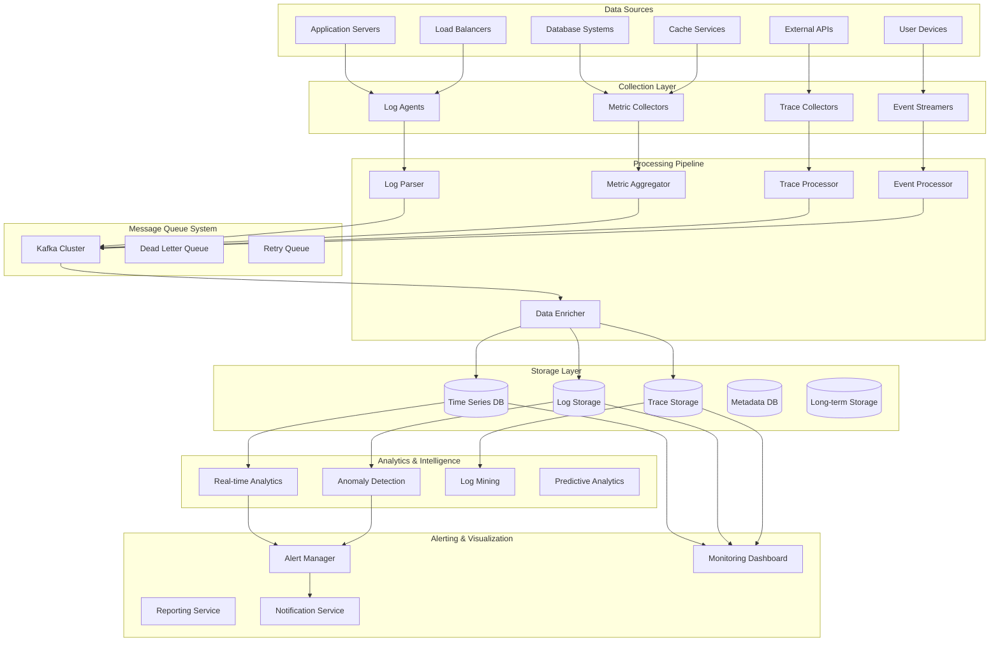
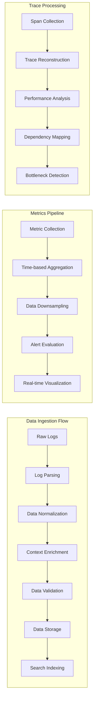
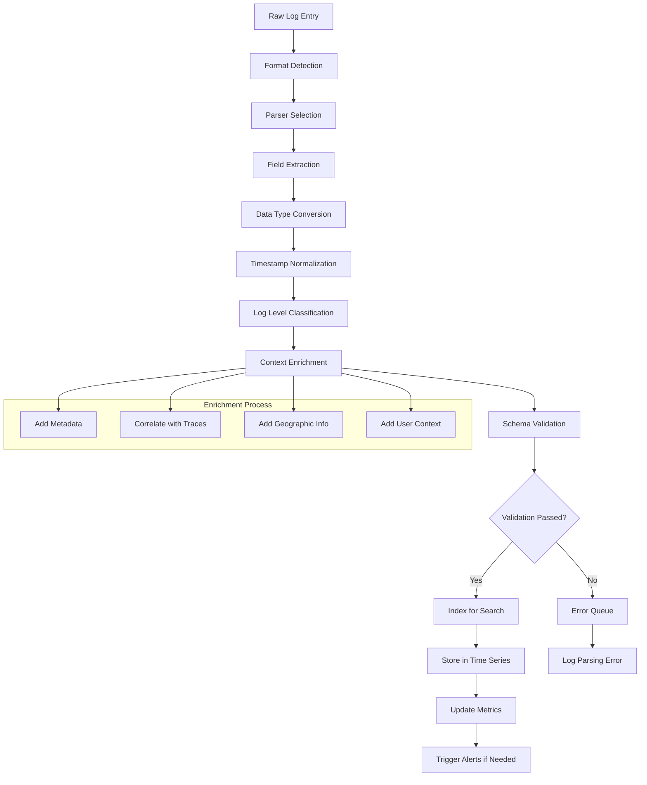
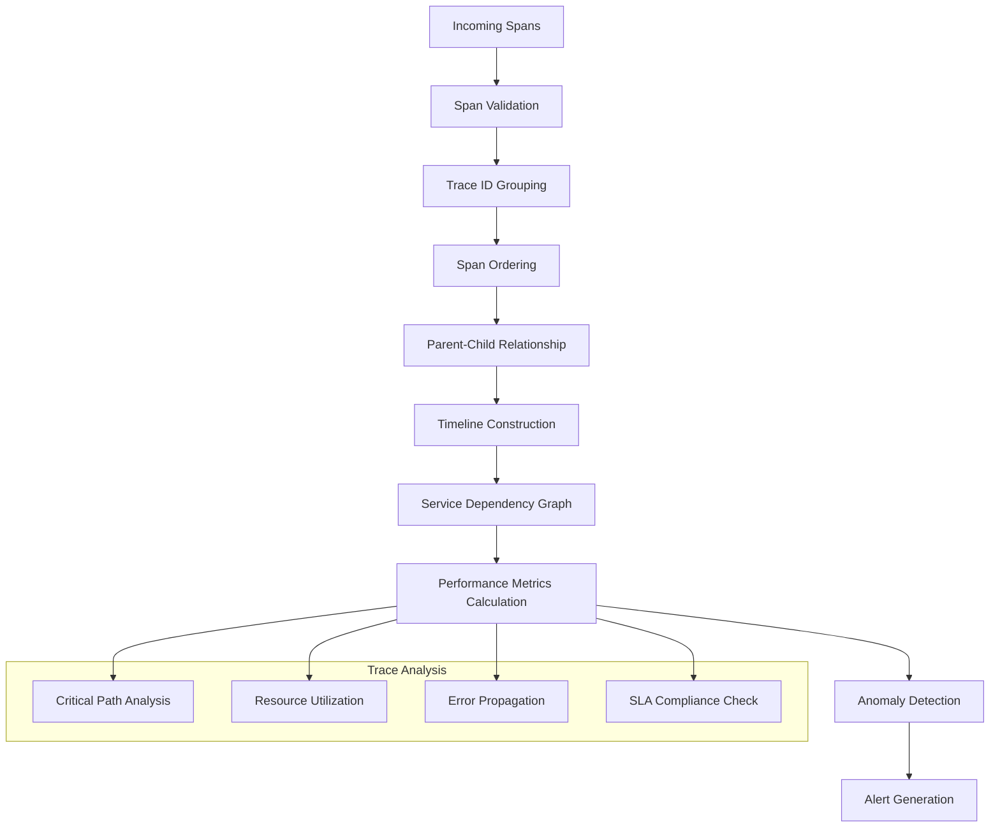
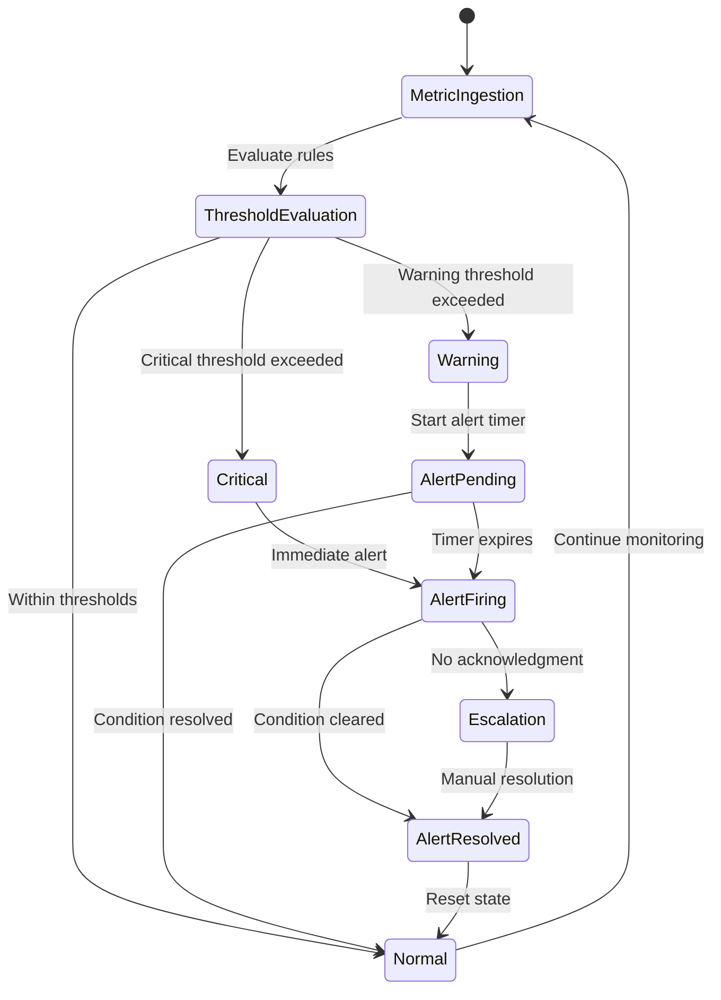
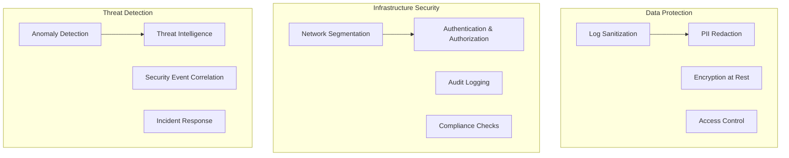

# Distributed Logging and Monitoring System


## 📋 Table of Contents

- [Distributed Logging and Monitoring System](#distributed-logging-and-monitoring-system)
  - [High-Level Design (HLD)](#high-level-design-hld)
    - [System Architecture Overview](#system-architecture-overview)
    - [Monitoring Data Flow](#monitoring-data-flow)
  - [Low-Level Design (LLD)](#low-level-design-lld)
    - [Log Processing Pipeline](#log-processing-pipeline)
    - [Distributed Trace Reconstruction](#distributed-trace-reconstruction)
    - [Real-time Alert Processing](#real-time-alert-processing)
  - [Core Algorithms](#core-algorithms)
    - [1. Intelligent Log Parsing and Classification](#1-intelligent-log-parsing-and-classification)
    - [2. Real-time Anomaly Detection Algorithm](#2-real-time-anomaly-detection-algorithm)
    - [3. Intelligent Alert Routing and Escalation](#3-intelligent-alert-routing-and-escalation)
    - [4. Distributed Tracing Analysis Algorithm](#4-distributed-tracing-analysis-algorithm)
    - [5. Log-based Security Monitoring](#5-log-based-security-monitoring)
  - [Performance Optimizations](#performance-optimizations)
    - [Data Pipeline Optimization](#data-pipeline-optimization)
    - [Storage Optimization](#storage-optimization)
  - [Security Considerations](#security-considerations)
    - [Monitoring Security Framework](#monitoring-security-framework)
  - [Testing Strategy](#testing-strategy)
    - [Performance Testing](#performance-testing)
    - [Reliability Testing](#reliability-testing)
  - [Trade-offs and Considerations](#trade-offs-and-considerations)
    - [Storage vs Query Performance](#storage-vs-query-performance)
    - [Real-time vs Batch Processing](#real-time-vs-batch-processing)
    - [Accuracy vs Performance](#accuracy-vs-performance)

---

## High-Level Design (HLD)

[⬆️ Back to Top](#--table-of-contents)

---


### System Architecture Overview

[⬆️ Back to Top](#--table-of-contents)

---




### Monitoring Data Flow

[⬆️ Back to Top](#--table-of-contents)

---




## Low-Level Design (LLD)

[⬆️ Back to Top](#--table-of-contents)

---


### Log Processing Pipeline

[⬆️ Back to Top](#--table-of-contents)

---




### Distributed Trace Reconstruction

[⬆️ Back to Top](#--table-of-contents)

---




### Real-time Alert Processing

[⬆️ Back to Top](#--table-of-contents)

---




## Core Algorithms

[⬆️ Back to Top](#--table-of-contents)

---


### 1. Intelligent Log Parsing and Classification

[⬆️ Back to Top](#--table-of-contents)

---


**Purpose**: Automatically parse and classify diverse log formats with high accuracy and performance while handling schema evolution.

**Adaptive Log Parser Algorithm**:
```
LogParsingConfig = {
  parserTypes: ['regex', 'grok', 'json', 'csv', 'custom'],
  patternDatabase: new PatternDatabase(),
  classificationThreshold: 0.8,
  maxParsingTime: 100,               // 100ms max parsing time
  
  schemaEvolution: {
    enabled: true,
    confidenceThreshold: 0.9,
    minSampleSize: 1000,
    adaptationRate: 0.1
  },
  
  fieldTypes: {
    timestamp: ['ISO8601', 'epoch', 'custom_format'],
    logLevel: ['debug', 'info', 'warn', 'error', 'fatal'],
    ipAddress: ['ipv4', 'ipv6'],
    userId: ['uuid', 'numeric', 'string'],
    requestId: ['uuid', 'alphanumeric']
  }
}

class IntelligentLogParser:
  constructor(config):
    this.config = config
    this.patternCache = new LRUCache(10000)
    this.parserStats = new Map()
    this.schemaRegistry = new SchemaRegistry()
    this.classificationModel = new LogClassificationModel()
  
  function parseLogEntry(rawLogEntry, sourceInfo):
    startTime = Date.now()
    
    // Try cached parser first
    cachedParser = this.getCachedParser(sourceInfo.source)
    
    if cachedParser:
      result = this.attemptParsing(rawLogEntry, cachedParser)
      if result.success and result.confidence > this.config.classificationThreshold:
        this.updateParserStats(cachedParser.id, true, Date.now() - startTime)
        return this.enrichParsedLog(result.parsedLog, sourceInfo)
    
    // Try multiple parsers in order of probability
    candidateParsers = this.selectCandidateParsers(rawLogEntry, sourceInfo)
    
    for parser in candidateParsers:
      if Date.now() - startTime > this.config.maxParsingTime:
        break // Timeout protection
      
      result = this.attemptParsing(rawLogEntry, parser)
      
      if result.success and result.confidence > this.config.classificationThreshold:
        // Cache successful parser for this source
        this.cacheParser(sourceInfo.source, parser)
        this.updateParserStats(parser.id, true, Date.now() - startTime)
        
        return this.enrichParsedLog(result.parsedLog, sourceInfo)
    
    // Fallback to basic parsing
    fallbackResult = this.performFallbackParsing(rawLogEntry, sourceInfo)
    this.logParsingFailure(rawLogEntry, sourceInfo, candidateParsers)
    
    return fallbackResult
  
  function selectCandidateParsers(rawLogEntry, sourceInfo):
    candidates = []
    
    // Get parsers based on source type
    sourceBasedParsers = this.getParsersBySource(sourceInfo.service, sourceInfo.component)
    candidates.push(...sourceBasedParsers)
    
    // Get parsers based on log format classification
    formatClassification = this.classifyLogFormat(rawLogEntry)
    formatBasedParsers = this.getParsersByFormat(formatClassification)
    candidates.push(...formatBasedParsers)
    
    // Get parsers based on pattern matching
    patternBasedParsers = this.getParsersByPattern(rawLogEntry)
    candidates.push(...patternBasedParsers)
    
    // Remove duplicates and sort by success rate
    uniqueCandidates = this.deduplicateParsers(candidates)
    sortedCandidates = this.sortParsersBySuccessRate(uniqueCandidates, sourceInfo)
    
    return sortedCandidates
  
  function attemptParsing(rawLogEntry, parser):
    try:
      startTime = Date.now()
      
      switch parser.type:
        case 'regex':
          result = this.parseWithRegex(rawLogEntry, parser)
          break
        case 'grok':
          result = this.parseWithGrok(rawLogEntry, parser)
          break
        case 'json':
          result = this.parseWithJSON(rawLogEntry, parser)
          break
        case 'csv':
          result = this.parseWithCSV(rawLogEntry, parser)
          break
        case 'custom':
          result = this.parseWithCustom(rawLogEntry, parser)
          break
        default:
          return { success: false, reason: 'unknown_parser_type' }
      
      parsingTime = Date.now() - startTime
      
      if result.success:
        // Validate parsed fields
        validation = this.validateParsedFields(result.fields, parser.schema)
        
        // Calculate confidence based on field completeness and types
        confidence = this.calculateParsingConfidence(result.fields, validation, parsingTime)
        
        return {
          success: true,
          confidence: confidence,
          parsedLog: {
            timestamp: this.normalizeTimestamp(result.fields.timestamp),
            level: this.normalizeLogLevel(result.fields.level),
            message: result.fields.message,
            fields: result.fields,
            parser: parser.id,
            parsingTime: parsingTime
          }
        }
      else:
        return { success: false, reason: result.reason }
      
    catch error:
      return { success: false, reason: 'parsing_exception', error: error.message }
  
  function enrichParsedLog(parsedLog, sourceInfo):
    // Add contextual information
    enrichedLog = {
      ...parsedLog,
      source: {
        service: sourceInfo.service,
        component: sourceInfo.component,
        instance: sourceInfo.instance,
        environment: sourceInfo.environment,
        region: sourceInfo.region
      },
      
      // Add derived fields
      severity: this.calculateSeverity(parsedLog.level, parsedLog.message),
      category: this.categorizeLog(parsedLog.message, parsedLog.fields),
      
      // Add correlation IDs if available
      correlationIds: this.extractCorrelationIds(parsedLog.fields),
      
      // Add performance metrics if this is a performance log
      performance: this.extractPerformanceMetrics(parsedLog.fields),
      
      // Processing metadata
      processing: {
        ingestedAt: Date.now(),
        parser: parsedLog.parser,
        parsingTime: parsedLog.parsingTime,
        version: this.version
      }
    }
    
    // Schema evolution detection
    if this.config.schemaEvolution.enabled:
      this.trackSchemaEvolution(enrichedLog, sourceInfo)
    
    return enrichedLog
  
  function trackSchemaEvolution(log, sourceInfo):
    sourceKey = `${sourceInfo.service}:${sourceInfo.component}`
    currentSchema = this.schemaRegistry.getSchema(sourceKey)
    
    if not currentSchema:
      // Initialize schema for new source
      this.schemaRegistry.initializeSchema(sourceKey, log)
      return
    
    // Detect schema changes
    changes = this.detectSchemaChanges(currentSchema, log)
    
    if changes.length > 0:
      // Accumulate schema change evidence
      this.schemaRegistry.recordSchemaChange(sourceKey, changes)
      
      // Check if we should evolve the schema
      if this.shouldEvolveSchema(sourceKey, changes):
        newSchema = this.evolveSchema(currentSchema, changes)
        this.schemaRegistry.updateSchema(sourceKey, newSchema)
        
        // Trigger parser regeneration
        this.regenerateParserForSchema(sourceKey, newSchema)
```

### 2. Real-time Anomaly Detection Algorithm

[⬆️ Back to Top](#--table-of-contents)

---


**Purpose**: Detect unusual patterns and anomalies in metrics and logs using statistical analysis and machine learning techniques.

**Multi-Modal Anomaly Detection**:
```
AnomalyDetectionConfig = {
  algorithms: ['statistical', 'ml_based', 'rule_based', 'correlation_based'],
  detectionWindow: 300000,             // 5 minutes
  baselineWindow: 86400000,            // 24 hours baseline
  
  statisticalMethods: {
    zscore: { threshold: 3.0, enabled: true },
    iqr: { multiplier: 1.5, enabled: true },
    movingAverage: { windowSize: 20, threshold: 2.0 }
  },
  
  mlMethods: {
    isolationForest: { contamination: 0.1, enabled: true },
    autoencoder: { threshold: 0.95, enabled: true },
    lstm: { sequenceLength: 50, threshold: 0.9 }
  },
  
  sensitivity: 0.8,                    // 80% sensitivity
  falsePositiveRate: 0.05              // 5% acceptable false positive rate
}

class RealTimeAnomalyDetector:
  constructor(config):
    this.config = config
    this.baselineData = new TimeSeriesBuffer()
    this.detectionModels = new Map()
    this.anomalyHistory = new CircularBuffer(10000)
    this.correlationEngine = new CorrelationEngine()
  
  function detectAnomalies(metricStream):
    currentTime = Date.now()
    detectedAnomalies = []
    
    for metric in metricStream:
      // Get or create baseline for this metric
      baseline = this.getOrCreateBaseline(metric.name, metric.labels)
      
      // Update baseline with new data point
      this.updateBaseline(baseline, metric)
      
      // Skip detection if insufficient baseline data
      if not this.hasMinimumBaseline(baseline):
        continue
      
      // Apply multiple detection algorithms
      anomalyResults = []
      
      if this.config.algorithms.includes('statistical'):
        statisticalResult = this.detectStatisticalAnomalies(metric, baseline)
        anomalyResults.push(statisticalResult)
      
      if this.config.algorithms.includes('ml_based'):
        mlResult = this.detectMLAnomalies(metric, baseline)
        anomalyResults.push(mlResult)
      
      if this.config.algorithms.includes('rule_based'):
        ruleResult = this.detectRuleBasedAnomalies(metric, baseline)
        anomalyResults.push(ruleResult)
      
      if this.config.algorithms.includes('correlation_based'):
        correlationResult = this.detectCorrelationAnomalies(metric, baseline)
        anomalyResults.push(correlationResult)
      
      // Aggregate results and determine final anomaly score
      aggregatedResult = this.aggregateAnomalyResults(anomalyResults)
      
      if aggregatedResult.isAnomaly:
        anomaly = {
          metricName: metric.name,
          labels: metric.labels,
          timestamp: metric.timestamp,
          value: metric.value,
          baseline: baseline.statistics,
          anomalyScore: aggregatedResult.score,
          detectionMethods: aggregatedResult.methods,
          severity: this.calculateSeverity(aggregatedResult.score),
          context: this.gatherAnomalyContext(metric, baseline)
        }
        
        detectedAnomalies.push(anomaly)
    
    // Cross-metric correlation analysis
    if detectedAnomalies.length > 1:
      correlatedAnomalies = this.analyzeAnomalyCorrelations(detectedAnomalies)
      return correlatedAnomalies
    
    return detectedAnomalies
  
  function detectStatisticalAnomalies(metric, baseline):
    anomalies = []
    
    // Z-Score based detection
    if this.config.statisticalMethods.zscore.enabled:
      zScore = this.calculateZScore(metric.value, baseline.mean, baseline.stdDev)
      
      if Math.abs(zScore) > this.config.statisticalMethods.zscore.threshold:
        anomalies.push({
          method: 'zscore',
          score: Math.abs(zScore) / this.config.statisticalMethods.zscore.threshold,
          details: { zScore: zScore, mean: baseline.mean, stdDev: baseline.stdDev }
        })
    
    // IQR based detection
    if this.config.statisticalMethods.iqr.enabled:
      iqrResult = this.detectIQRAnomaly(metric.value, baseline.quartiles)
      
      if iqrResult.isAnomaly:
        anomalies.push({
          method: 'iqr',
          score: iqrResult.score,
          details: iqrResult.details
        })
    
    // Moving average based detection
    if this.config.statisticalMethods.movingAverage.enabled:
      maResult = this.detectMovingAverageAnomaly(metric, baseline)
      
      if maResult.isAnomaly:
        anomalies.push({
          method: 'moving_average',
          score: maResult.score,
          details: maResult.details
        })
    
    return {
      hasAnomalies: anomalies.length > 0,
      anomalies: anomalies,
      aggregateScore: anomalies.length > 0 ? Math.max(...anomalies.map(a => a.score)) : 0
    }
  
  function detectMLAnomalies(metric, baseline):
    anomalies = []
    
    // Isolation Forest detection
    if this.config.mlMethods.isolationForest.enabled:
      isolationScore = this.runIsolationForest(metric, baseline)
      
      if isolationScore > this.config.mlMethods.isolationForest.threshold:
        anomalies.push({
          method: 'isolation_forest',
          score: isolationScore,
          details: { isolationScore: isolationScore }
        })
    
    // Autoencoder-based detection
    if this.config.mlMethods.autoencoder.enabled:
      reconstructionError = this.runAutoencoder(metric, baseline)
      
      if reconstructionError > (1 - this.config.mlMethods.autoencoder.threshold):
        anomalies.push({
          method: 'autoencoder',
          score: reconstructionError / (1 - this.config.mlMethods.autoencoder.threshold),
          details: { reconstructionError: reconstructionError }
        })
    
    // LSTM-based sequence anomaly detection
    if this.config.mlMethods.lstm.enabled:
      sequenceAnomaly = this.runLSTMDetection(metric, baseline)
      
      if sequenceAnomaly.score > (1 - this.config.mlMethods.lstm.threshold):
        anomalies.push({
          method: 'lstm',
          score: sequenceAnomaly.score / (1 - this.config.mlMethods.lstm.threshold),
          details: sequenceAnomaly.details
        })
    
    return {
      hasAnomalies: anomalies.length > 0,
      anomalies: anomalies,
      aggregateScore: anomalies.length > 0 ? Math.max(...anomalies.map(a => a.score)) : 0
    }
  
  function runIsolationForest(metric, baseline):
    // Prepare feature vector from recent data points
    features = this.prepareFeatureVector(metric, baseline)
    
    // Get or create isolation forest model for this metric
    modelKey = this.getModelKey(metric.name, metric.labels)
    model = this.detectionModels.get(modelKey)
    
    if not model:
      model = this.trainIsolationForest(baseline.recentData)
      this.detectionModels.set(modelKey, model)
    
    // Predict anomaly score
    anomalyScore = model.decision_function([features])[0]
    
    // Convert to 0-1 range (higher = more anomalous)
    normalizedScore = this.normalizeIsolationScore(anomalyScore)
    
    return normalizedScore
  
  function analyzeAnomalyCorrelations(anomalies):
    correlatedGroups = []
    processedAnomalies = new Set()
    
    for i in range(anomalies.length):
      if processedAnomalies.has(i):
        continue
      
      baseAnomaly = anomalies[i]
      correlatedGroup = [baseAnomaly]
      processedAnomalies.add(i)
      
      // Find correlated anomalies
      for j in range(i + 1, anomalies.length):
        if processedAnomalies.has(j):
          continue
        
        candidateAnomaly = anomalies[j]
        correlation = this.calculateAnomalyCorrelation(baseAnomaly, candidateAnomaly)
        
        if correlation.strength > 0.7: // Strong correlation
          correlatedGroup.push(candidateAnomaly)
          processedAnomalies.add(j)
      
      // Create correlated anomaly group
      if correlatedGroup.length > 1:
        correlatedGroups.push({
          type: 'correlated_anomalies',
          anomalies: correlatedGroup,
          correlationStrength: this.calculateGroupCorrelation(correlatedGroup),
          possibleCauses: this.inferPossibleCauses(correlatedGroup),
          severity: Math.max(...correlatedGroup.map(a => a.severity)),
          timestamp: Math.min(...correlatedGroup.map(a => a.timestamp))
        })
      else:
        correlatedGroups.push({
          type: 'isolated_anomaly',
          anomalies: correlatedGroup,
          severity: correlatedGroup[0].severity,
          timestamp: correlatedGroup[0].timestamp
        })
    
    return correlatedGroups
```

### 3. Intelligent Alert Routing and Escalation

[⬆️ Back to Top](#--table-of-contents)

---


**Purpose**: Route alerts to the right people at the right time with intelligent escalation and de-duplication.

**Smart Alert Management System**:
```
AlertConfig = {
  severityLevels: {
    info: { priority: 1, escalationDelay: 3600000 },      // 1 hour
    warning: { priority: 2, escalationDelay: 1800000 },   // 30 minutes
    error: { priority: 3, escalationDelay: 900000 },      // 15 minutes
    critical: { priority: 4, escalationDelay: 300000 }    // 5 minutes
  },
  
  deduplication: {
    enabled: true,
    timeWindow: 300000,          // 5 minutes
    similarityThreshold: 0.8,
    maxGroupSize: 50
  },
  
  escalation: {
    maxLevels: 3,
    autoEscalation: true,
    businessHoursOnly: false
  },
  
  routing: {
    rules: 'service_ownership',  // 'service_ownership', 'tag_based', 'ml_based'
    fallbackTeam: 'platform_team',
    maxRoutingTime: 30000        // 30 seconds max routing time
  }
}

class SmartAlertManager:
  constructor(config):
    this.config = config
    this.alertStore = new AlertStore()
    this.deduplicationEngine = new DeduplicationEngine()
    this.routingEngine = new AlertRoutingEngine()
    this.escalationManager = new EscalationManager()
    this.notificationService = new NotificationService()
  
  function processAlert(alert):
    startTime = Date.now()
    
    // Enrich alert with additional context
    enrichedAlert = this.enrichAlert(alert)
    
    // Check for duplicates and similar alerts
    deduplicationResult = this.deduplicationEngine.process(enrichedAlert)
    
    if deduplicationResult.isDuplicate:
      // Update existing alert group
      this.updateAlertGroup(deduplicationResult.groupId, enrichedAlert)
      return { processed: true, action: 'deduplicated', groupId: deduplicationResult.groupId }
    
    // Create new alert
    alertId = this.alertStore.create(enrichedAlert)
    
    // Determine routing destination
    routingResult = this.routingEngine.route(enrichedAlert)
    
    if not routingResult.success:
      // Fallback routing
      routingResult = this.routingEngine.fallbackRoute(enrichedAlert)
    
    // Create escalation plan
    escalationPlan = this.escalationManager.createPlan(enrichedAlert, routingResult.recipients)
    
    // Send initial notifications
    notificationResult = this.sendInitialNotifications(alertId, enrichedAlert, routingResult.recipients)
    
    // Schedule escalation if needed
    if this.shouldScheduleEscalation(enrichedAlert):
      this.scheduleEscalation(alertId, escalationPlan)
    
    return {
      processed: true,
      action: 'new_alert',
      alertId: alertId,
      recipients: routingResult.recipients,
      processingTime: Date.now() - startTime
    }
  
  function enrichAlert(alert):
    enrichedAlert = {
      ...alert,
      id: generateAlertId(),
      createdAt: Date.now(),
      fingerprint: this.calculateAlertFingerprint(alert),
      
      // Add contextual information
      context: {
        service: this.identifyService(alert),
        environment: this.identifyEnvironment(alert),
        region: this.identifyRegion(alert),
        component: this.identifyComponent(alert)
      },
      
      // Add runbook links if available
      runbooks: this.findRelatedRunbooks(alert),
      
      // Add similar historical incidents
      historicalIncidents: this.findSimilarIncidents(alert),
      
      // Add impact assessment
      impact: this.assessImpact(alert),
      
      // Processing metadata
      processing: {
        version: this.version,
        enrichedAt: Date.now(),
        enrichmentTime: 0
      }
    }
    
    enrichedAlert.processing.enrichmentTime = Date.now() - enrichedAlert.createdAt
    
    return enrichedAlert
  
  function calculateAlertFingerprint(alert):
    // Create a unique fingerprint for deduplication
    fingerprintData = {
      alertname: alert.alertname,
      service: alert.labels?.service,
      instance: alert.labels?.instance,
      severity: alert.labels?.severity,
      // Normalize message to ignore dynamic values
      normalizedMessage: this.normalizeAlertMessage(alert.annotations?.summary)
    }
    
    return this.hashObject(fingerprintData)
  
  function createEscalationPlan(alert, initialRecipients):
    escalationLevels = []
    
    // Level 1: Initial recipients
    escalationLevels.push({
      level: 1,
      delay: 0,
      recipients: initialRecipients,
      methods: this.getPreferredNotificationMethods(initialRecipients)
    })
    
    // Level 2: Team leads and escalation contacts
    if alert.severity in ['error', 'critical']:
      teamLeads = this.getTeamLeads(alert.context.service)
      escalationDelay = this.config.severityLevels[alert.severity].escalationDelay
      
      escalationLevels.push({
        level: 2,
        delay: escalationDelay,
        recipients: teamLeads,
        methods: ['email', 'phone'],
        conditions: ['not_acknowledged', 'not_resolved']
      })
    
    // Level 3: Management and on-call engineers
    if alert.severity === 'critical':
      executives = this.getExecutiveContacts(alert.impact)
      onCallEngineers = this.getOnCallEngineers()
      
      escalationLevels.push({
        level: 3,
        delay: escalationDelay * 2,
        recipients: [...executives, ...onCallEngineers],
        methods: ['phone', 'sms'],
        conditions: ['not_resolved', 'high_impact']
      })
    
    return {
      alertId: alert.id,
      levels: escalationLevels,
      createdAt: Date.now(),
      autoEscalation: this.config.escalation.autoEscalation
    }
  
  function processEscalation(alertId, escalationLevel):
    alert = this.alertStore.get(alertId)
    
    if not alert:
      return { success: false, reason: 'alert_not_found' }
    
    // Check escalation conditions
    if not this.checkEscalationConditions(alert, escalationLevel):
      return { success: false, reason: 'conditions_not_met' }
    
    // Check business hours restriction
    if escalationLevel.businessHoursOnly and not this.isBusinessHours():
      // Schedule for next business hour
      this.scheduleBusinessHourEscalation(alertId, escalationLevel)
      return { success: true, action: 'scheduled_for_business_hours' }
    
    // Send escalation notifications
    notificationResults = []
    
    for recipient in escalationLevel.recipients:
      for method in escalationLevel.methods:
        result = this.notificationService.send({
          recipient: recipient,
          method: method,
          alert: alert,
          escalationLevel: escalationLevel.level,
          urgency: this.calculateUrgency(alert, escalationLevel)
        })
        
        notificationResults.push(result)
    
    // Update alert with escalation information
    this.alertStore.addEscalation(alertId, {
      level: escalationLevel.level,
      escalatedAt: Date.now(),
      recipients: escalationLevel.recipients,
      notifications: notificationResults
    })
    
    // Schedule next escalation if needed
    nextLevel = escalationLevel.level + 1
    if nextLevel <= this.config.escalation.maxLevels:
      nextEscalationLevel = this.getEscalationLevel(alertId, nextLevel)
      if nextEscalationLevel:
        this.scheduleEscalation(alertId, nextEscalationLevel)
    
    return {
      success: true,
      action: 'escalation_sent',
      level: escalationLevel.level,
      notifications: notificationResults.length
    }
```

### 4. Distributed Tracing Analysis Algorithm

[⬆️ Back to Top](#--table-of-contents)

---


**Purpose**: Analyze distributed traces to identify performance bottlenecks, error propagation patterns, and service dependencies.

**Trace Analysis Engine**:
```
TraceAnalysisConfig = {
  analysisTypes: ['performance', 'errors', 'dependencies', 'sla'],
  performanceThresholds: {
    p95ResponseTime: 1000,       // 1 second
    p99ResponseTime: 2000,       // 2 seconds
    errorRate: 0.01              // 1% error rate
  },
  
  dependencyAnalysis: {
    maxDepth: 10,
    circularDependencyDetection: true,
    criticalPathAnalysis: true
  },
  
  anomalyDetection: {
    windowSize: 3600000,         // 1 hour
    minimumSpans: 100,
    statisticalMethods: ['zscore', 'isolation_forest']
  }
}

class DistributedTraceAnalyzer:
  constructor(config):
    this.config = config
    this.traceStore = new TraceStore()
    this.serviceMap = new ServiceDependencyMap()
    this.performanceBaselines = new Map()
    this.anomalyDetector = new TraceAnomalyDetector()
  
  function analyzeTrace(traceId):
    // Retrieve complete trace
    trace = this.traceStore.getTrace(traceId)
    
    if not trace or not trace.isComplete():
      return { success: false, reason: 'incomplete_trace' }
    
    analysisResults = {
      traceId: traceId,
      duration: trace.getDuration(),
      spanCount: trace.getSpanCount(),
      serviceCount: trace.getUniqueServiceCount(),
      
      performance: null,
      errors: null,
      dependencies: null,
      sla: null,
      anomalies: null
    }
    
    // Performance analysis
    if this.config.analysisTypes.includes('performance'):
      analysisResults.performance = this.analyzePerformance(trace)
    
    // Error analysis
    if this.config.analysisTypes.includes('errors'):
      analysisResults.errors = this.analyzeErrors(trace)
    
    // Dependency analysis
    if this.config.analysisTypes.includes('dependencies'):
      analysisResults.dependencies = this.analyzeDependencies(trace)
    
    // SLA compliance analysis
    if this.config.analysisTypes.includes('sla'):
      analysisResults.sla = this.analyzeSLACompliance(trace)
    
    // Anomaly detection
    analysisResults.anomalies = this.detectTraceAnomalies(trace)
    
    return {
      success: true,
      analysis: analysisResults,
      recommendations: this.generateRecommendations(analysisResults)
    }
  
  function analyzePerformance(trace):
    spans = trace.getSpans()
    
    // Calculate critical path
    criticalPath = this.calculateCriticalPath(spans)
    
    // Analyze span durations
    spanAnalysis = spans.map(span => ({
      spanId: span.spanId,
      operation: span.operationName,
      service: span.serviceName,
      duration: span.duration,
      
      // Performance metrics
      percentileRank: this.calculatePercentileRank(span),
      isBottleneck: this.isBottleneck(span, criticalPath),
      performanceScore: this.calculatePerformanceScore(span)
    }))
    
    // Service-level performance aggregation
    servicePerformance = this.aggregateServicePerformance(spans)
    
    // Identify performance issues
    performanceIssues = this.identifyPerformanceIssues(spanAnalysis, servicePerformance)
    
    return {
      totalDuration: trace.getDuration(),
      criticalPath: criticalPath,
      spans: spanAnalysis,
      services: servicePerformance,
      issues: performanceIssues,
      overallScore: this.calculateOverallPerformanceScore(spanAnalysis)
    }
  
  function calculateCriticalPath(spans):
    // Build span dependency graph
    spanGraph = this.buildSpanGraph(spans)
    
    // Find the longest path from root to leaf spans
    rootSpans = spans.filter(span => not span.parentSpanId)
    
    longestPath = []
    maxDuration = 0
    
    for rootSpan in rootSpans:
      path = this.findLongestPath(rootSpan, spanGraph)
      pathDuration = path.reduce((sum, span) => sum + span.duration, 0)
      
      if pathDuration > maxDuration:
        maxDuration = pathDuration
        longestPath = path
      
    return {
      spans: longestPath,
      totalDuration: maxDuration,
      percentageOfTrace: maxDuration / trace.getDuration() * 100
    }
  
  function analyzeDependencies(trace):
    spans = trace.getSpans()
    
    // Extract service dependencies
    dependencies = new Map()
    
    for span in spans:
      if span.parentSpanId:
        parentSpan = spans.find(s => s.spanId === span.parentSpanId)
        
        if parentSpan and parentSpan.serviceName !== span.serviceName:
          dependencyKey = `${parentSpan.serviceName}->${span.serviceName}`
          
          if not dependencies.has(dependencyKey):
            dependencies.set(dependencyKey, {
              from: parentSpan.serviceName,
              to: span.serviceName,
              callCount: 0,
              totalDuration: 0,
              errors: 0,
              operations: new Set()
            })
          
          dependency = dependencies.get(dependencyKey)
          dependency.callCount++
          dependency.totalDuration += span.duration
          dependency.operations.add(span.operationName)
          
          if span.hasError():
            dependency.errors++
    
    // Convert to array and calculate metrics
    dependencyArray = Array.from(dependencies.values()).map(dep => ({
      ...dep,
      averageDuration: dep.totalDuration / dep.callCount,
      errorRate: dep.errors / dep.callCount,
      operations: Array.from(dep.operations)
    }))
    
    // Update global service map
    this.serviceMap.updateDependencies(dependencyArray)
    
    // Detect circular dependencies
    circularDependencies = this.detectCircularDependencies(dependencyArray)
    
    return {
      dependencies: dependencyArray,
      circularDependencies: circularDependencies,
      dependencyCount: dependencyArray.length,
      maxDepth: this.calculateMaxDepth(dependencyArray)
    }
  
  function detectTraceAnomalies(trace):
    anomalies = []
    
    // Duration anomalies
    durationAnomaly = this.detectDurationAnomaly(trace)
    if durationAnomaly:
      anomalies.push(durationAnomaly)
    
    // Span count anomalies
    spanCountAnomaly = this.detectSpanCountAnomaly(trace)
    if spanCountAnomaly:
      anomalies.push(spanCountAnomaly)
    
    // Error pattern anomalies
    errorPatternAnomalies = this.detectErrorPatternAnomalies(trace)
    anomalies.push(...errorPatternAnomalies)
    
    // Service interaction anomalies
    interactionAnomalies = this.detectServiceInteractionAnomalies(trace)
    anomalies.push(...interactionAnomalies)
    
    return anomalies
  
  function generateRecommendations(analysisResults):
    recommendations = []
    
    // Performance recommendations
    if analysisResults.performance:
      if analysisResults.performance.overallScore < 0.7:
        recommendations.push({
          type: 'performance',
          priority: 'high',
          title: 'Performance Optimization Needed',
          description: 'Trace performance is below acceptable thresholds',
          actions: this.generatePerformanceActions(analysisResults.performance)
        })
    
    // Error handling recommendations
    if analysisResults.errors and analysisResults.errors.errorRate > 0.01:
      recommendations.push({
        type: 'reliability',
        priority: 'high',
        title: 'Error Rate Improvement',
        description: `Error rate of ${analysisResults.errors.errorRate * 100}% exceeds threshold`,
        actions: this.generateErrorHandlingActions(analysisResults.errors)
      })
    
    // Dependency optimization recommendations
    if analysisResults.dependencies:
      if analysisResults.dependencies.circularDependencies.length > 0:
        recommendations.push({
          type: 'architecture',
          priority: 'medium',
          title: 'Circular Dependency Detected',
          description: 'Services have circular dependencies that may cause issues',
          actions: ['Review service architecture', 'Implement dependency injection', 'Consider service splitting']
        })
    
    return recommendations
```

### 5. Log-based Security Monitoring

[⬆️ Back to Top](#--table-of-contents)

---


**Purpose**: Detect security threats and suspicious activities through intelligent log analysis and pattern recognition.

**Security Event Detection Engine**:
```
SecurityMonitoringConfig = {
  threatPatterns: {
    bruteForce: {
      window: 300000,              // 5 minutes
      threshold: 10,               // 10 failed attempts
      severity: 'high'
    },
    sqlInjection: {
      patterns: ['union select', 'drop table', '1=1', '--'],
      severity: 'critical'
    },
    dataExfiltration: {
      volumeThreshold: 100000000,  // 100MB
      window: 3600000,             // 1 hour
      severity: 'critical'
    }
  },
  
  behaviorAnalysis: {
    enabled: true,
    baselineWindow: 604800000,   // 1 week
    anomalyThreshold: 3.0        // 3 standard deviations
  },
  
  threatIntelligence: {
    enabled: true,
    sources: ['internal', 'external_feeds'],
    updateInterval: 3600000      // 1 hour
  }
}

class SecurityEventDetector:
  constructor(config):
    this.config = config
    this.threatPatterns = new ThreatPatternMatcher()
    this.behaviorBaselines = new Map()
    this.threatIntelligence = new ThreatIntelligenceDB()
    this.securityEventStore = new SecurityEventStore()
  
  function analyzeLogForSecurity(logEntry):
    securityEvents = []
    
    // Pattern-based threat detection
    patternThreats = this.detectPatternBasedThreats(logEntry)
    securityEvents.push(...patternThreats)
    
    // Behavioral anomaly detection
    behaviorAnomalies = this.detectBehavioralAnomalies(logEntry)
    securityEvents.push(...behaviorAnomalies)
    
    // Threat intelligence correlation
    threatIntelMatches = this.correlateThreatIntelligence(logEntry)
    securityEvents.push(...threatIntelMatches)
    
    // Process and store security events
    for event in securityEvents:
      processedEvent = this.processSecurityEvent(event, logEntry)
      this.securityEventStore.store(processedEvent)
      
      // Trigger immediate response for critical events
      if processedEvent.severity === 'critical':
        this.triggerSecurityResponse(processedEvent)
    
    return securityEvents
  
  function detectPatternBasedThreats(logEntry):
    threats = []
    
    // SQL Injection detection
    sqlInjectionResult = this.detectSQLInjection(logEntry)
    if sqlInjectionResult.detected:
      threats.push(sqlInjectionResult)
    
    // Brute force detection
    bruteForceResult = this.detectBruteForce(logEntry)
    if bruteForceResult.detected:
      threats.push(bruteForceResult)
    
    // Data exfiltration detection
    exfiltrationResult = this.detectDataExfiltration(logEntry)
    if exfiltrationResult.detected:
      threats.push(exfiltrationResult)
    
    return threats
  
  function detectBruteForce(logEntry):
    // Check if this is a failed authentication attempt
    if not this.isAuthenticationFailure(logEntry):
      return { detected: false }
    
    sourceIP = this.extractSourceIP(logEntry)
    userId = this.extractUserId(logEntry)
    
    currentTime = Date.now()
    windowStart = currentTime - this.config.threatPatterns.bruteForce.window
    
    // Count recent failed attempts from same source
    failedAttempts = this.countFailedAttempts(sourceIP, userId, windowStart, currentTime)
    
    if failedAttempts >= this.config.threatPatterns.bruteForce.threshold:
      return {
        detected: true,
        type: 'brute_force_attack',
        severity: this.config.threatPatterns.bruteForce.severity,
        sourceIP: sourceIP,
        targetUser: userId,
        attemptCount: failedAttempts,
        timeWindow: this.config.threatPatterns.bruteForce.window,
        confidence: Math.min(failedAttempts / this.config.threatPatterns.bruteForce.threshold, 2.0)
      }
    
    return { detected: false }
```

## Performance Optimizations

[⬆️ Back to Top](#--table-of-contents)

---


### Data Pipeline Optimization

[⬆️ Back to Top](#--table-of-contents)

---


**Streaming Processing Optimization**:
```
ProcessingOptimization = {
  batchSizing: {
    logIngestion: 1000,
    metricAggregation: 5000,
    traceProcessing: 100
  },
  
  parallelProcessing: {
    workers: 10,
    partitioning: 'by_source',
    loadBalancing: 'round_robin'
  },
  
  memoryManagement: {
    bufferSizes: { logs: '100MB', metrics: '50MB', traces: '200MB' },
    gcTuning: true,
    offHeapStorage: true
  }
}
```

### Storage Optimization

[⬆️ Back to Top](#--table-of-contents)

---


**Time-Series Data Optimization**:
- Data compression (up to 90% reduction)
- Downsampling for long-term storage
- Partitioning by time and service
- Automated data lifecycle management

## Security Considerations

[⬆️ Back to Top](#--table-of-contents)

---


### Monitoring Security Framework

[⬆️ Back to Top](#--table-of-contents)

---




## Testing Strategy

[⬆️ Back to Top](#--table-of-contents)

---


### Performance Testing

[⬆️ Back to Top](#--table-of-contents)

---


**Load Testing Scenarios**:
- High-volume log ingestion (1M+ logs/second)
- Metric burst testing
- Query performance under load
- Storage scalability testing

### Reliability Testing

[⬆️ Back to Top](#--table-of-contents)

---


**Fault Tolerance Testing**:
- Component failure simulation
- Network partition recovery
- Data consistency verification
- Alert delivery reliability

## Trade-offs and Considerations

[⬆️ Back to Top](#--table-of-contents)

---


### Storage vs Query Performance

[⬆️ Back to Top](#--table-of-contents)

---

- **Data compression**: Storage efficiency vs query speed
- **Indexing strategy**: Query performance vs storage overhead
- **Retention policies**: Data availability vs storage cost
- **Aggregation levels**: Query speed vs data granularity

### Real-time vs Batch Processing

[⬆️ Back to Top](#--table-of-contents)

---

- **Latency**: Real-time insights vs processing efficiency
- **Resource usage**: Continuous processing vs batch optimization
- **Data consistency**: Immediate updates vs eventual consistency
- **Cost optimization**: Real-time infrastructure vs batch processing

### Accuracy vs Performance

[⬆️ Back to Top](#--table-of-contents)

---

- **Anomaly detection**: Detection accuracy vs false positive rate
- **Sampling strategies**: Data completeness vs processing load
- **Alert sensitivity**: Noise reduction vs missed incidents
- **Correlation complexity**: Insight depth vs processing time

This distributed logging and monitoring system provides a comprehensive foundation for observability with features like intelligent log parsing, real-time anomaly detection, smart alerting, distributed tracing analysis, and security monitoring while maintaining high performance, scalability, and reliability standards. 