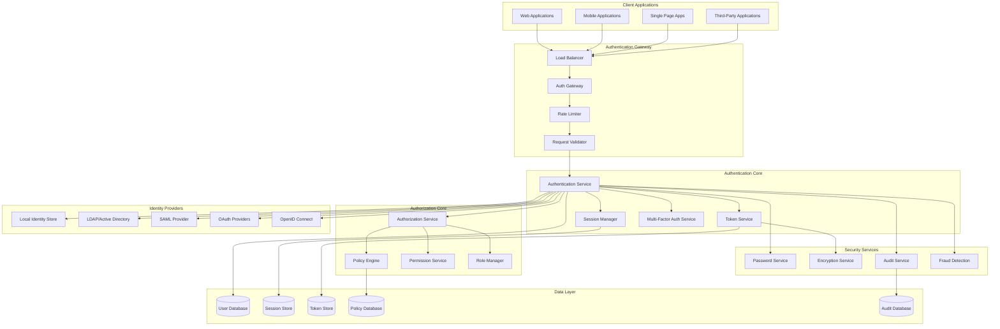
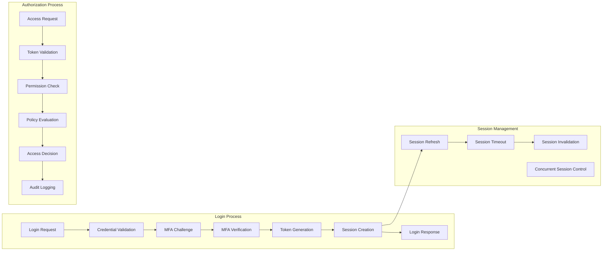
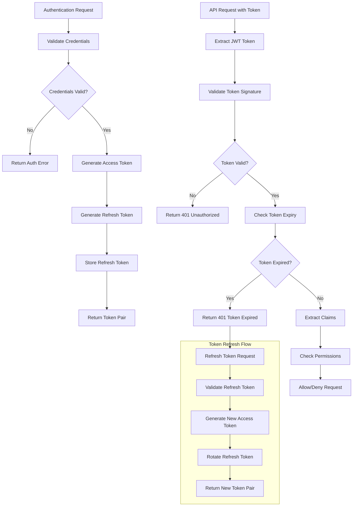
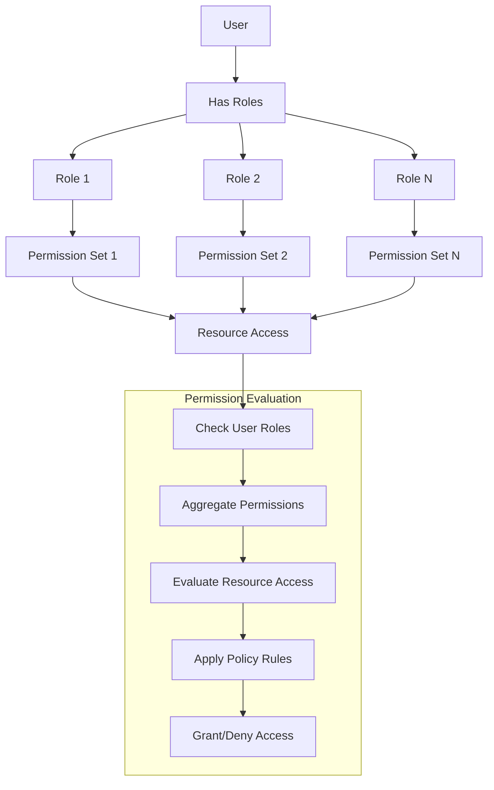
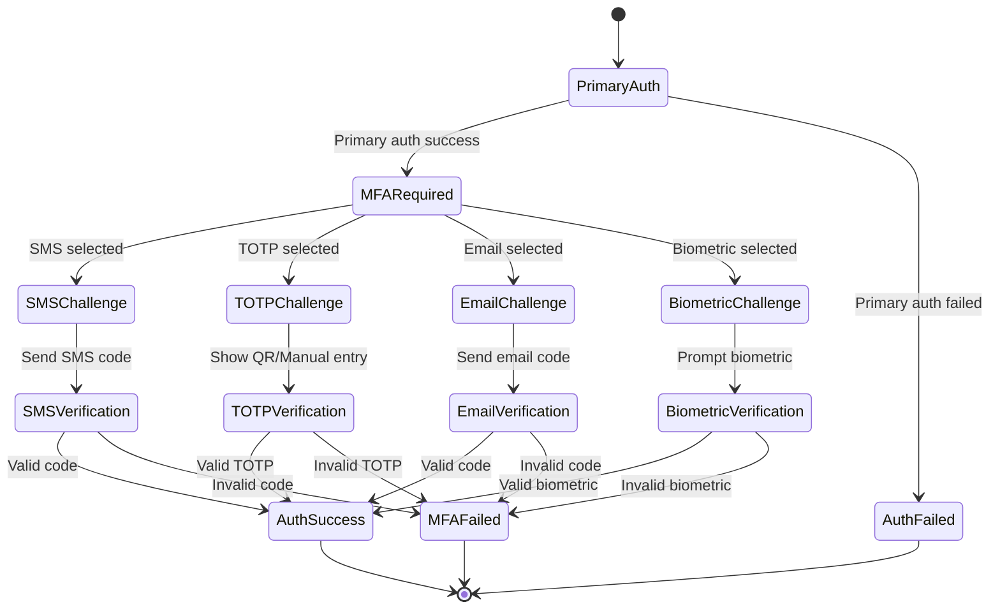
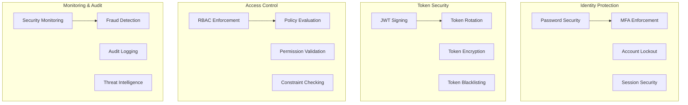

# Authentication and Authorization System


## 📋 Table of Contents

- [Authentication and Authorization System](#authentication-and-authorization-system)
  - [Requirements Gathering](#requirements-gathering)
    - [Functional Requirements](#functional-requirements)
    - [Non-Functional Requirements](#non-functional-requirements)
  - [Traffic Estimation & Capacity Planning](#traffic-estimation-capacity-planning)
    - [User Base Analysis](#user-base-analysis)
    - [Traffic Calculations](#traffic-calculations)
  - [Database Schema Design](#database-schema-design)
    - [User Management Schema](#user-management-schema)
    - [Authentication Schema](#authentication-schema)
    - [Audit and Security Schema](#audit-and-security-schema)
  - [Sample API Endpoints](#sample-api-endpoints)
    - [Authentication APIs](#authentication-apis)
    - [Multi-Factor Authentication APIs](#multi-factor-authentication-apis)
    - [Token Management APIs](#token-management-apis)
    - [Authorization APIs](#authorization-apis)
    - [Session Management APIs](#session-management-apis)
    - [OAuth 2.0 & SSO APIs](#oauth-20-sso-apis)
  - [High-Level Design (HLD)](#high-level-design-hld)
    - [System Architecture Overview](#system-architecture-overview)
    - [Authentication Flow](#authentication-flow)
  - [Low-Level Design (LLD)](#low-level-design-lld)
    - [JWT Token Management](#jwt-token-management)
    - [Role-Based Access Control (RBAC)](#role-based-access-control-rbac)
    - [Multi-Factor Authentication Flow](#multi-factor-authentication-flow)
  - [Core Algorithms](#core-algorithms)
    - [1. Secure Password Authentication Algorithm](#1-secure-password-authentication-algorithm)
    - [2. JWT Token Management Algorithm](#2-jwt-token-management-algorithm)
    - [3. Role-Based Access Control (RBAC) Algorithm](#3-role-based-access-control-rbac-algorithm)
    - [4. Multi-Factor Authentication (MFA) Algorithm](#4-multi-factor-authentication-mfa-algorithm)
    - [5. Session Management Algorithm](#5-session-management-algorithm)
  - [Performance Optimizations](#performance-optimizations)
    - [Token Caching Strategy](#token-caching-strategy)
    - [Database Optimization](#database-optimization)
  - [Security Considerations](#security-considerations)
    - [Authentication Security Framework](#authentication-security-framework)
  - [Testing Strategy](#testing-strategy)
    - [Security Testing](#security-testing)
    - [Performance Testing](#performance-testing)
  - [Trade-offs and Considerations](#trade-offs-and-considerations)
    - [Security vs Usability](#security-vs-usability)
    - [Performance vs Security](#performance-vs-security)
    - [Scalability vs Consistency](#scalability-vs-consistency)

---

## Requirements Gathering

[⬆️ Back to Top](#--table-of-contents)

---


### Functional Requirements

[⬆️ Back to Top](#--table-of-contents)

---


**Core Authentication Features:**
- Multi-factor authentication (MFA) with SMS, email, TOTP
- Single Sign-On (SSO) with SAML 2.0 and OAuth 2.0
- Social login (Google, Facebook, Apple, GitHub)
- Passwordless authentication (magic links, biometrics)
- Session management across multiple devices
- Password reset and account recovery
- Account lockout and brute force protection
- JWT token generation and validation
- Refresh token rotation and revocation
- Cross-domain authentication (CORS)

**Authorization & Access Control:**
- Role-based access control (RBAC)
- Attribute-based access control (ABAC)
- Permission inheritance and delegation
- Resource-level permissions
- Time-based access controls
- IP-based access restrictions
- Device-based access controls
- API rate limiting per user/role
- Audit logging for all access attempts

**User Management:**
- User registration and email verification
- Profile management and preferences
- Account deactivation and deletion
- Bulk user operations (admin)
- User groups and organization management
- Identity federation and provisioning
- Compliance with GDPR and privacy laws

### Non-Functional Requirements

[⬆️ Back to Top](#--table-of-contents)

---


**Performance:**
- Authentication response time < 100ms
- Support 1 million concurrent sessions
- JWT validation < 10ms
- Handle 100,000 login attempts per second
- 99.99% uptime for authentication service

**Scalability:**
- Horizontal scaling across regions
- Handle traffic spikes during outages
- Auto-scaling based on authentication load
- Support for millions of users
- Multi-tenant architecture support

**Security:**
- Zero-trust security model
- End-to-end encryption for all data
- Protection against OWASP Top 10 vulnerabilities
- Regular security audits and penetration testing
- Compliance with SOC 2, ISO 27001
- Rate limiting and DDoS protection

**Reliability:**
- Zero data loss for user accounts
- Automatic failover and disaster recovery
- Multi-region data replication
- Circuit breaker patterns for dependencies
- Graceful degradation during outages

## Traffic Estimation & Capacity Planning

[⬆️ Back to Top](#--table-of-contents)

---


### User Base Analysis

[⬆️ Back to Top](#--table-of-contents)

---

- **Total Users:** 100 million registered users
- **Daily Active Users:** 50 million users
- **Peak Concurrent Sessions:** 10 million sessions
- **Average Sessions per User:** 3 sessions per day
- **Session Duration:** 2 hours average
- **API Calls per Session:** 500 API calls

### Traffic Calculations

[⬆️ Back to Top](#--table-of-contents)

---


**Authentication Operations:**
```
Daily Login Attempts:
- Daily logins = 50M users × 3 sessions = 150M logins/day
- Peak login rate = 150M × 3 / (24 × 3600) = 5,208 logins/sec
- Failed attempts (20%) = 1,042 failed logins/sec
- Total auth attempts = 6,250 attempts/sec

JWT Validation:
- API calls per day = 50M users × 3 sessions × 500 calls = 75B calls/day
- Peak validation rate = 75B × 3 / (24 × 3600) = 2.6M validations/sec
```

**Session Management:**
```
Active Sessions:
- Peak concurrent sessions = 10M sessions
- Session data size = 2KB per session
- Session storage = 10M × 2KB = 20GB
- Session updates = 10M sessions × 10 updates/hour = 27,778 updates/sec

Token Operations:
- JWT generation = 5,208 tokens/sec
- Refresh token operations = 10M sessions / 3600 = 2,778 refreshes/sec
- Token revocation = 2,778 revocations/sec
```

**Storage Requirements:**
```
User Data:
- User accounts = 100M users × 5KB = 500GB
- Authentication logs = 6,250 × 86400 × 500B = 270GB/day
- Annual log storage = 270GB × 365 = 99TB/year

Session Storage:
- Active sessions = 20GB (Redis)
- Session history = 10M sessions × 30 days × 2KB = 600GB
- Authentication cache = 50GB
```

**Infrastructure Sizing:**
```
Application Servers:
- Authentication service: 50 servers
- Authorization service: 30 servers
- Session management: 20 servers
- User management: 15 servers
- Token service: 25 servers

Database Requirements:
- User database: 20 shards, 32GB RAM each
- Session database: 10 shards, 64GB RAM each
- Audit logs database: 50 shards, 16GB RAM each
- Configuration database: 3 shards, 8GB RAM each

Cache Infrastructure:
- Redis clusters: 500GB total memory
- Session cache: 200GB
- Token cache: 100GB
- User profile cache: 100GB
- Rate limiting cache: 50GB
```

## Database Schema Design

[⬆️ Back to Top](#--table-of-contents)

---


### User Management Schema

[⬆️ Back to Top](#--table-of-contents)

---


```sql
-- Users table (sharded by user_id)
CREATE TABLE users (
    user_id BIGINT PRIMARY KEY AUTO_INCREMENT,
    username VARCHAR(50) UNIQUE,
    email VARCHAR(255) UNIQUE NOT NULL,
    phone_number VARCHAR(20) UNIQUE,
    password_hash VARCHAR(255), -- NULL for passwordless users
    salt VARCHAR(32),
    password_algorithm ENUM('bcrypt', 'scrypt', 'argon2') DEFAULT 'bcrypt',
    first_name VARCHAR(100),
    last_name VARCHAR(100),
    display_name VARCHAR(200),
    profile_picture_url VARCHAR(512),
    status ENUM('active', 'inactive', 'suspended', 'deleted') DEFAULT 'active',
    email_verified BOOLEAN DEFAULT FALSE,
    phone_verified BOOLEAN DEFAULT FALSE,
    last_login TIMESTAMP NULL,
    last_password_change TIMESTAMP NULL,
    failed_login_attempts INT DEFAULT 0,
    locked_until TIMESTAMP NULL,
    created_at TIMESTAMP DEFAULT CURRENT_TIMESTAMP,
    updated_at TIMESTAMP DEFAULT CURRENT_TIMESTAMP ON UPDATE CURRENT_TIMESTAMP,
    timezone VARCHAR(50) DEFAULT 'UTC',
    locale VARCHAR(10) DEFAULT 'en_US',
    preferences JSON,
    
    INDEX idx_email (email),
    INDEX idx_username (username),
    INDEX idx_phone (phone_number),
    INDEX idx_status (status),
    INDEX idx_last_login (last_login)
);

-- User roles and permissions
CREATE TABLE roles (
    role_id INT PRIMARY KEY AUTO_INCREMENT,
    role_name VARCHAR(100) UNIQUE NOT NULL,
    description TEXT,
    is_system_role BOOLEAN DEFAULT FALSE,
    created_at TIMESTAMP DEFAULT CURRENT_TIMESTAMP,
    updated_at TIMESTAMP DEFAULT CURRENT_TIMESTAMP ON UPDATE CURRENT_TIMESTAMP,
    
    INDEX idx_role_name (role_name)
);

CREATE TABLE permissions (
    permission_id INT PRIMARY KEY AUTO_INCREMENT,
    permission_name VARCHAR(100) UNIQUE NOT NULL,
    resource_type VARCHAR(50) NOT NULL,
    action VARCHAR(50) NOT NULL,
    description TEXT,
    created_at TIMESTAMP DEFAULT CURRENT_TIMESTAMP,
    
    INDEX idx_permission_name (permission_name),
    INDEX idx_resource_action (resource_type, action)
);

CREATE TABLE role_permissions (
    role_id INT NOT NULL,
    permission_id INT NOT NULL,
    granted_at TIMESTAMP DEFAULT CURRENT_TIMESTAMP,
    granted_by BIGINT,
    
    PRIMARY KEY (role_id, permission_id),
    FOREIGN KEY (role_id) REFERENCES roles(role_id),
    FOREIGN KEY (permission_id) REFERENCES permissions(permission_id),
    FOREIGN KEY (granted_by) REFERENCES users(user_id)
);

CREATE TABLE user_roles (
    user_id BIGINT NOT NULL,
    role_id INT NOT NULL,
    assigned_at TIMESTAMP DEFAULT CURRENT_TIMESTAMP,
    assigned_by BIGINT,
    expires_at TIMESTAMP NULL,
    
    PRIMARY KEY (user_id, role_id),
    INDEX idx_expires_at (expires_at),
    FOREIGN KEY (user_id) REFERENCES users(user_id),
    FOREIGN KEY (role_id) REFERENCES roles(role_id),
    FOREIGN KEY (assigned_by) REFERENCES users(user_id)
);
```

### Authentication Schema

[⬆️ Back to Top](#--table-of-contents)

---


```sql
-- Authentication methods
CREATE TABLE auth_methods (
    method_id BIGINT PRIMARY KEY AUTO_INCREMENT,
    user_id BIGINT NOT NULL,
    method_type ENUM('password', 'totp', 'sms', 'email', 'social', 'biometric') NOT NULL,
    method_subtype VARCHAR(50), -- 'google', 'facebook', 'fingerprint', etc.
    identifier VARCHAR(255), -- email, phone, social_id, etc.
    secret_hash VARCHAR(255), -- encrypted TOTP secret, etc.
    is_primary BOOLEAN DEFAULT FALSE,
    is_verified BOOLEAN DEFAULT FALSE,
    created_at TIMESTAMP DEFAULT CURRENT_TIMESTAMP,
    last_used TIMESTAMP NULL,
    
    INDEX idx_user_method (user_id, method_type),
    INDEX idx_identifier (identifier),
    FOREIGN KEY (user_id) REFERENCES users(user_id)
);

-- Sessions table
CREATE TABLE user_sessions (
    session_id VARCHAR(128) PRIMARY KEY,
    user_id BIGINT NOT NULL,
    device_fingerprint VARCHAR(255),
    device_name VARCHAR(100),
    device_type ENUM('web', 'mobile', 'desktop', 'api') NOT NULL,
    ip_address VARCHAR(45),
    user_agent TEXT,
    location_country VARCHAR(2),
    location_city VARCHAR(100),
    is_active BOOLEAN DEFAULT TRUE,
    created_at TIMESTAMP DEFAULT CURRENT_TIMESTAMP,
    last_activity TIMESTAMP DEFAULT CURRENT_TIMESTAMP ON UPDATE CURRENT_TIMESTAMP,
    expires_at TIMESTAMP NOT NULL,
    
    INDEX idx_user_active (user_id, is_active),
    INDEX idx_expires_at (expires_at),
    INDEX idx_last_activity (last_activity),
    FOREIGN KEY (user_id) REFERENCES users(user_id)
);

-- JWT tokens and refresh tokens
CREATE TABLE tokens (
    token_id VARCHAR(128) PRIMARY KEY,
    user_id BIGINT NOT NULL,
    session_id VARCHAR(128),
    token_type ENUM('access', 'refresh', 'reset', 'verification') NOT NULL,
    token_hash VARCHAR(255) NOT NULL, -- SHA-256 hash of token
    scope VARCHAR(255), -- OAuth scopes
    audience VARCHAR(255), -- Token audience
    is_revoked BOOLEAN DEFAULT FALSE,
    created_at TIMESTAMP DEFAULT CURRENT_TIMESTAMP,
    expires_at TIMESTAMP NOT NULL,
    revoked_at TIMESTAMP NULL,
    revoked_by BIGINT NULL,
    
    INDEX idx_user_type (user_id, token_type),
    INDEX idx_session (session_id),
    INDEX idx_expires_at (expires_at),
    INDEX idx_revoked (is_revoked),
    FOREIGN KEY (user_id) REFERENCES users(user_id),
    FOREIGN KEY (session_id) REFERENCES user_sessions(session_id),
    FOREIGN KEY (revoked_by) REFERENCES users(user_id)
);
```

### Audit and Security Schema

[⬆️ Back to Top](#--table-of-contents)

---


```sql
-- Authentication attempts and audit logs
CREATE TABLE auth_attempts (
    attempt_id BIGINT PRIMARY KEY AUTO_INCREMENT,
    user_id BIGINT NULL, -- NULL for failed username attempts
    username_attempted VARCHAR(255),
    method_type ENUM('password', 'totp', 'sms', 'email', 'social', 'biometric') NOT NULL,
    attempt_result ENUM('success', 'failed', 'blocked', 'requires_mfa') NOT NULL,
    failure_reason VARCHAR(100), -- 'invalid_password', 'account_locked', etc.
    ip_address VARCHAR(45),
    user_agent TEXT,
    device_fingerprint VARCHAR(255),
    location_country VARCHAR(2),
    location_city VARCHAR(100),
    risk_score DECIMAL(3,2), -- 0.00 to 1.00
    created_at TIMESTAMP DEFAULT CURRENT_TIMESTAMP,
    
    INDEX idx_user_result (user_id, attempt_result),
    INDEX idx_ip_address (ip_address),
    INDEX idx_created_at (created_at),
    INDEX idx_risk_score (risk_score),
    FOREIGN KEY (user_id) REFERENCES users(user_id)
) PARTITION BY RANGE (UNIX_TIMESTAMP(created_at)) (
    PARTITION p_2024_01 VALUES LESS THAN (UNIX_TIMESTAMP('2024-02-01')),
    PARTITION p_2024_02 VALUES LESS THAN (UNIX_TIMESTAMP('2024-03-01'))
);

-- Security incidents and alerts
CREATE TABLE security_incidents (
    incident_id BIGINT PRIMARY KEY AUTO_INCREMENT,
    user_id BIGINT,
    incident_type ENUM('brute_force', 'credential_stuffing', 'suspicious_login', 'account_takeover') NOT NULL,
    severity ENUM('low', 'medium', 'high', 'critical') NOT NULL,
    status ENUM('open', 'investigating', 'resolved', 'false_positive') DEFAULT 'open',
    description TEXT,
    evidence JSON, -- IP addresses, timestamps, patterns
    assigned_to BIGINT NULL,
    created_at TIMESTAMP DEFAULT CURRENT_TIMESTAMP,
    resolved_at TIMESTAMP NULL,
    
    INDEX idx_user_type (user_id, incident_type),
    INDEX idx_severity_status (severity, status),
    INDEX idx_created_at (created_at),
    FOREIGN KEY (user_id) REFERENCES users(user_id),
    FOREIGN KEY (assigned_to) REFERENCES users(user_id)
);

-- Rate limiting and throttling
CREATE TABLE rate_limits (
    limit_id BIGINT PRIMARY KEY AUTO_INCREMENT,
    identifier VARCHAR(255) NOT NULL, -- IP, user_id, API key
    identifier_type ENUM('ip', 'user', 'api_key') NOT NULL,
    resource VARCHAR(100) NOT NULL, -- 'login', 'api_call', 'password_reset'
    window_start TIMESTAMP NOT NULL,
    window_size_seconds INT NOT NULL,
    request_count INT DEFAULT 0,
    limit_exceeded_at TIMESTAMP NULL,
    
    UNIQUE KEY unique_identifier_resource_window (identifier, resource, window_start),
    INDEX idx_identifier_type (identifier_type),
    INDEX idx_window_start (window_start)
);
```

## Sample API Endpoints

[⬆️ Back to Top](#--table-of-contents)

---


### Authentication APIs

[⬆️ Back to Top](#--table-of-contents)

---


```http
POST /api/v1/auth/register
Content-Type: application/json

{
    "email": "john@example.com",
    "password": "SecurePassword123!",
    "first_name": "John",
    "last_name": "Doe",
    "username": "johndoe",
    "preferences": {
        "marketing_emails": false,
        "two_factor_enabled": true
    }
}

Response (201 Created):
{
    "success": true,
    "data": {
        "user_id": 12345,
        "email": "john@example.com",
        "username": "johndoe",
        "email_verification_required": true,
        "verification_token_sent": true
    }
}
```

```http
POST /api/v1/auth/login
Content-Type: application/json

{
    "email": "john@example.com",
    "password": "SecurePassword123!",
    "device_info": {
        "device_name": "John's iPhone",
        "device_type": "mobile",
        "device_fingerprint": "abc123def456"
    },
    "remember_me": true
}

Response (200 OK):
{
    "success": true,
    "data": {
        "access_token": "eyJhbGciOiJIUzI1NiIsInR5cCI6IkpXVCJ9...",
        "refresh_token": "eyJhbGciOiJIUzI1NiIsInR5cCI6IkpXVCJ9...",
        "token_type": "Bearer",
        "expires_in": 3600,
        "user": {
            "user_id": 12345,
            "email": "john@example.com",
            "username": "johndoe",
            "roles": ["user"],
            "permissions": ["read:profile", "write:profile"]
        },
        "mfa_required": false,
        "session_id": "session_xyz789"
    }
}
```

### Multi-Factor Authentication APIs

[⬆️ Back to Top](#--table-of-contents)

---


```http
POST /api/v1/auth/mfa/setup
Authorization: Bearer <access_token>
Content-Type: application/json

{
    "method_type": "totp",
    "device_name": "My Authenticator App"
}

Response (200 OK):
{
    "success": true,
    "data": {
        "method_id": 67890,
        "secret": "JBSWY3DPEHPK3PXP",
        "qr_code": "data:image/png;base64,iVBORw0KGgoAAAANSUhEUgAA...",
        "backup_codes": [
            "12345678",
            "87654321",
            "11223344"
        ]
    }
}
```

```http
POST /api/v1/auth/mfa/verify
Content-Type: application/json

{
    "session_id": "session_xyz789",
    "method_type": "totp",
    "code": "123456"
}

Response (200 OK):
{
    "success": true,
    "data": {
        "access_token": "eyJhbGciOiJIUzI1NiIsInR5cCI6IkpXVCJ9...",
        "refresh_token": "eyJhbGciOiJIUzI1NiIsInR5cCI6IkpXVCJ9...",
        "expires_in": 3600,
        "mfa_verified": true
    }
}
```

### Token Management APIs

[⬆️ Back to Top](#--table-of-contents)

---


```http
POST /api/v1/auth/token/refresh
Content-Type: application/json

{
    "refresh_token": "eyJhbGciOiJIUzI1NiIsInR5cCI6IkpXVCJ9..."
}

Response (200 OK):
{
    "success": true,
    "data": {
        "access_token": "eyJhbGciOiJIUzI1NiIsInR5cCI6IkpXVCJ9...",
        "refresh_token": "eyJhbGciOiJIUzI1NiIsInR5cCI6IkpXVCJ9...",
        "token_type": "Bearer",
        "expires_in": 3600
    }
}
```

```http
POST /api/v1/auth/token/revoke
Authorization: Bearer <access_token>
Content-Type: application/json

{
    "token": "eyJhbGciOiJIUzI1NiIsInR5cCI6IkpXVCJ9...",
    "token_type": "refresh"
}

Response (200 OK):
{
    "success": true,
    "data": {
        "revoked": true,
        "revoked_at": "2024-01-15T10:30:00Z"
    }
}
```

### Authorization APIs

[⬆️ Back to Top](#--table-of-contents)

---


```http
GET /api/v1/auth/user/permissions
Authorization: Bearer <access_token>

Response (200 OK):
{
    "success": true,
    "data": {
        "user_id": 12345,
        "roles": [
            {
                "role_id": 1,
                "role_name": "user",
                "permissions": [
                    "read:profile",
                    "write:profile",
                    "read:posts"
                ]
            }
        ],
        "direct_permissions": [],
        "effective_permissions": [
            "read:profile",
            "write:profile",
            "read:posts"
        ]
    }
}
```

```http
POST /api/v1/auth/authorize
Authorization: Bearer <access_token>
Content-Type: application/json

{
    "resource": "posts",
    "action": "write",
    "resource_id": "post_123",
    "context": {
        "ip_address": "192.168.1.1",
        "device_type": "web"
    }
}

Response (200 OK):
{
    "success": true,
    "data": {
        "authorized": true,
        "permission": "write:posts",
        "expires_at": "2024-01-15T11:30:00Z"
    }
}
```

### Session Management APIs

[⬆️ Back to Top](#--table-of-contents)

---


```http
GET /api/v1/auth/sessions
Authorization: Bearer <access_token>

Response (200 OK):
{
    "success": true,
    "data": {
        "active_sessions": [
            {
                "session_id": "session_xyz789",
                "device_name": "John's iPhone",
                "device_type": "mobile",
                "ip_address": "192.168.1.1",
                "location": "San Francisco, CA",
                "created_at": "2024-01-15T10:00:00Z",
                "last_activity": "2024-01-15T10:30:00Z",
                "is_current": true
            }
        ]
    }
}
```

```http
DELETE /api/v1/auth/sessions/{session_id}
Authorization: Bearer <access_token>

Response (200 OK):
{
    "success": true,
    "data": {
        "session_terminated": true,
        "terminated_at": "2024-01-15T10:35:00Z"
    }
}
```

### OAuth 2.0 & SSO APIs

[⬆️ Back to Top](#--table-of-contents)

---


```http
GET /api/v1/oauth/authorize?response_type=code&client_id=abc123&redirect_uri=https://app.example.com/callback&scope=read:profile&state=xyz789

Response (302 Found):
Location: https://app.example.com/callback?code=auth_code_123&state=xyz789
```

```http
POST /api/v1/oauth/token
Content-Type: application/x-www-form-urlencoded

grant_type=authorization_code&
code=auth_code_123&
client_id=abc123&
client_secret=secret123&
redirect_uri=https://app.example.com/callback

Response (200 OK):
{
    "access_token": "eyJhbGciOiJIUzI1NiIsInR5cCI6IkpXVCJ9...",
    "token_type": "Bearer",
    "expires_in": 3600,
    "refresh_token": "eyJhbGciOiJIUzI1NiIsInR5cCI6IkpXVCJ9...",
    "scope": "read:profile"
}
```

## High-Level Design (HLD)

[⬆️ Back to Top](#--table-of-contents)

---


### System Architecture Overview

[⬆️ Back to Top](#--table-of-contents)

---




### Authentication Flow

[⬆️ Back to Top](#--table-of-contents)

---




## Low-Level Design (LLD)

[⬆️ Back to Top](#--table-of-contents)

---


### JWT Token Management

[⬆️ Back to Top](#--table-of-contents)

---




### Role-Based Access Control (RBAC)

[⬆️ Back to Top](#--table-of-contents)

---




### Multi-Factor Authentication Flow

[⬆️ Back to Top](#--table-of-contents)

---




## Core Algorithms

[⬆️ Back to Top](#--table-of-contents)

---


### 1. Secure Password Authentication Algorithm

[⬆️ Back to Top](#--table-of-contents)

---


**Purpose**: Implement secure password authentication with protection against common attacks like timing attacks, brute force, and credential stuffing.

**Password Verification with Security Measures**:
```
PasswordConfig = {
  hashAlgorithm: 'argon2id',       // Argon2id for password hashing
  saltLength: 32,                  // 256-bit salt
  memoryCost: 65536,               // 64 MB memory cost
  timeCost: 3,                     // 3 iterations
  parallelism: 4,                  // 4 parallel threads
  
  maxAttempts: 5,                  // Max login attempts
  lockoutDuration: 900000,         // 15 minutes lockout
  attemptWindow: 300000,           // 5 minute attempt window
  
  minLength: 8,                    // Minimum password length
  complexityRequirements: {
    requireLowercase: true,
    requireUppercase: true,
    requireNumbers: true,
    requireSpecialChars: true,
    maxRepeatingChars: 3
  }
}

function authenticateUser(username, password, context):
  startTime = Date.now()
  
  try:
    // Check rate limiting first
    rateLimitResult = checkAuthenticationRateLimit(username, context.ipAddress)
    if not rateLimitResult.allowed:
      return createTimingResponse(startTime, {
        success: false,
        reason: 'rate_limited',
        retryAfter: rateLimitResult.retryAfter
      })
    
    // Retrieve user account
    user = getUserByUsername(username)
    
    // Always perform hash computation to prevent timing attacks
    if user:
      storedHash = user.passwordHash
      isValidPassword = verifyPassword(password, storedHash)
    else:
      // Compute dummy hash to maintain constant timing
      dummyHash = generateDummyHash()
      verifyPassword(password, dummyHash)
      isValidPassword = false
    
    // Check account status
    if user and isValidPassword:
      accountStatus = checkAccountStatus(user)
      
      if accountStatus.locked:
        recordFailedAttempt(username, context, 'account_locked')
        return createTimingResponse(startTime, {
          success: false,
          reason: 'account_locked',
          unlockTime: accountStatus.unlockTime
        })
      
      if accountStatus.disabled:
        recordFailedAttempt(username, context, 'account_disabled')
        return createTimingResponse(startTime, {
          success: false,
          reason: 'account_disabled'
        })
      
      // Successful authentication
      resetFailedAttempts(username)
      recordSuccessfulLogin(user, context)
      
      return createTimingResponse(startTime, {
        success: true,
        user: sanitizeUserData(user),
        requiresMFA: user.mfaEnabled
      })
    else:
      // Failed authentication
      recordFailedAttempt(username, context, 'invalid_credentials')
      
      return createTimingResponse(startTime, {
        success: false,
        reason: 'invalid_credentials'
      })
    
  catch error:
    logAuthenticationError(username, context, error)
    return createTimingResponse(startTime, {
      success: false,
      reason: 'authentication_error'
    })

function verifyPassword(plaintext, hash):
  try:
    return argon2.verify(hash, plaintext)
  catch error:
    logPasswordVerificationError(error)
    return false

function createTimingResponse(startTime, response):
  // Ensure consistent response timing to prevent timing attacks
  minResponseTime = 100 // 100ms minimum response time
  elapsedTime = Date.now() - startTime
  
  if elapsedTime < minResponseTime:
    delay = minResponseTime - elapsedTime
    setTimeout(() => {}, delay)
  
  return response
```

**Account Lockout and Rate Limiting**:
```
function checkAuthenticationRateLimit(username, ipAddress):
  currentTime = Date.now()
  
  // Check user-specific attempts
  userAttempts = getFailedAttempts(username)
  userLockout = checkUserLockout(userAttempts, currentTime)
  
  if userLockout.locked:
    return {
      allowed: false,
      reason: 'user_locked',
      retryAfter: userLockout.retryAfter
    }
  
  // Check IP-based rate limiting
  ipAttempts = getFailedAttemptsByIP(ipAddress)
  ipLockout = checkIPLockout(ipAttempts, currentTime)
  
  if ipLockout.locked:
    return {
      allowed: false,
      reason: 'ip_locked',
      retryAfter: ipLockout.retryAfter
    }
  
  return { allowed: true }

function recordFailedAttempt(username, context, reason):
  attemptRecord = {
    username: username,
    ipAddress: context.ipAddress,
    userAgent: context.userAgent,
    timestamp: Date.now(),
    reason: reason,
    geolocation: context.geolocation
  }
  
  storeFailedAttempt(attemptRecord)
  
  // Check if lockout threshold reached
  recentAttempts = getRecentFailedAttempts(username, PasswordConfig.attemptWindow)
  
  if recentAttempts.length >= PasswordConfig.maxAttempts:
    lockoutUser(username, PasswordConfig.lockoutDuration)
    
    // Trigger security alerts
    triggerSecurityAlert('account_lockout', {
      username: username,
      attempts: recentAttempts.length,
      ipAddresses: [...new Set(recentAttempts.map(a => a.ipAddress))]
    })
```

### 2. JWT Token Management Algorithm

[⬆️ Back to Top](#--table-of-contents)

---


**Purpose**: Secure JWT token generation, validation, and lifecycle management with proper security measures.

**Secure JWT Implementation**:
```
JWTConfig = {
  algorithm: 'RS256',              // RSA SHA-256 for signing
  accessTokenTTL: 900000,          // 15 minutes
  refreshTokenTTL: 604800000,      // 7 days
  maxRefreshTokenAge: 2592000000,  // 30 days absolute maximum
  
  keyRotationPeriod: 86400000,     // Rotate signing keys daily
  keyGracePeriod: 172800000,       // 2 days grace period for old keys
  
  issuer: 'auth.company.com',
  audience: ['api.company.com', 'web.company.com'],
  
  encryptSensitiveClaims: true,
  enableTokenBinding: true
}

function generateTokenPair(user, context):
  currentTime = Date.now()
  
  // Generate access token
  accessTokenPayload = {
    iss: JWTConfig.issuer,
    sub: user.id,
    aud: JWTConfig.audience,
    exp: currentTime + JWTConfig.accessTokenTTL,
    iat: currentTime,
    nbf: currentTime,
    jti: generateUniqueId(),
    
    // User claims
    username: user.username,
    roles: user.roles,
    permissions: aggregatePermissions(user.roles),
    scope: user.scope,
    
    // Security claims
    sessionId: context.sessionId,
    ipHash: hashIP(context.ipAddress),
    deviceFingerprint: context.deviceFingerprint
  }
  
  // Encrypt sensitive claims if configured
  if JWTConfig.encryptSensitiveClaims:
    accessTokenPayload.permissions = encryptClaim(accessTokenPayload.permissions)
    accessTokenPayload.roles = encryptClaim(accessTokenPayload.roles)
  
  accessToken = signJWT(accessTokenPayload)
  
  // Generate refresh token
  refreshTokenPayload = {
    iss: JWTConfig.issuer,
    sub: user.id,
    aud: JWTConfig.audience,
    exp: currentTime + JWTConfig.refreshTokenTTL,
    iat: currentTime,
    jti: generateUniqueId(),
    type: 'refresh',
    sessionId: context.sessionId
  }
  
  refreshToken = signJWT(refreshTokenPayload)
  
  // Store refresh token securely
  storeRefreshToken(refreshToken, user.id, context)
  
  return {
    accessToken: accessToken,
    refreshToken: refreshToken,
    expiresIn: JWTConfig.accessTokenTTL / 1000,
    tokenType: 'Bearer'
  }

function validateJWT(token, expectedAudience):
  try:
    // Parse token header to get key ID
    header = parseJWTHeader(token)
    
    // Get appropriate signing key
    signingKey = getSigningKey(header.kid)
    
    if not signingKey:
      return { valid: false, reason: 'invalid_key_id' }
    
    // Verify token signature
    payload = jwt.verify(token, signingKey, {
      algorithms: [JWTConfig.algorithm],
      issuer: JWTConfig.issuer,
      audience: expectedAudience
    })
    
    // Additional security validations
    securityCheck = performSecurityValidations(payload, token)
    
    if not securityCheck.valid:
      return { valid: false, reason: securityCheck.reason }
    
    // Decrypt sensitive claims if needed
    if JWTConfig.encryptSensitiveClaims:
      if payload.permissions:
        payload.permissions = decryptClaim(payload.permissions)
      if payload.roles:
        payload.roles = decryptClaim(payload.roles)
    
    return {
      valid: true,
      payload: payload,
      claims: extractClaims(payload)
    }
    
  catch error:
    logTokenValidationError(token, error)
    return { valid: false, reason: 'validation_error' }

function performSecurityValidations(payload, token):
  // Check token blacklist
  if isTokenBlacklisted(payload.jti):
    return { valid: false, reason: 'token_blacklisted' }
  
  // Check session validity
  if not isSessionValid(payload.sessionId):
    return { valid: false, reason: 'invalid_session' }
  
  // Validate IP binding if enabled
  if JWTConfig.enableTokenBinding and payload.ipHash:
    currentIPHash = hashIP(getCurrentRequestIP())
    if payload.ipHash !== currentIPHash:
      return { valid: false, reason: 'ip_binding_violation' }
  
  // Check for token replay attacks
  if isTokenReplayed(payload.jti, payload.iat):
    return { valid: false, reason: 'token_replay_detected' }
  
  return { valid: true }
```

**Token Refresh with Security**:
```
function refreshAccessToken(refreshToken, context):
  // Validate refresh token
  validation = validateJWT(refreshToken, JWTConfig.audience)
  
  if not validation.valid:
    return { success: false, reason: validation.reason }
  
  payload = validation.payload
  
  // Verify it's actually a refresh token
  if payload.type !== 'refresh':
    return { success: false, reason: 'invalid_token_type' }
  
  // Check if refresh token is still valid in storage
  storedToken = getStoredRefreshToken(payload.jti)
  
  if not storedToken or storedToken.revoked:
    return { success: false, reason: 'refresh_token_revoked' }
  
  // Get current user data
  user = getUserById(payload.sub)
  
  if not user or not user.active:
    return { success: false, reason: 'user_inactive' }
  
  // Check if refresh token is within absolute maximum age
  if Date.now() - payload.iat > JWTConfig.maxRefreshTokenAge:
    revokeRefreshToken(payload.jti)
    return { success: false, reason: 'refresh_token_expired' }
  
  // Generate new token pair
  newTokens = generateTokenPair(user, context)
  
  // Implement refresh token rotation
  revokeRefreshToken(payload.jti)
  
  // Log refresh event
  logTokenRefresh(user.id, payload.jti, newTokens.refreshToken, context)
  
  return {
    success: true,
    tokens: newTokens
  }
```

### 3. Role-Based Access Control (RBAC) Algorithm

[⬆️ Back to Top](#--table-of-contents)

---


**Purpose**: Implement hierarchical role-based access control with inheritance, constraints, and dynamic permissions.

**RBAC Policy Engine**:
```
RBACConfig = {
  enableRoleHierarchy: true,
  enableDynamicRoles: true,
  enableConstraints: true,
  enableSeparationOfDuty: true,
  
  defaultRole: 'user',
  adminRole: 'admin',
  maxRolesPerUser: 10,
  maxPermissionsPerRole: 100
}

class RBACEngine:
  constructor(config):
    this.config = config
    this.roleHierarchy = new Map()
    this.rolePermissions = new Map()
    this.userRoles = new Map()
    this.constraints = []
  
  function checkPermission(userId, resource, action, context):
    // Get user's effective roles
    userRoles = this.getUserEffectiveRoles(userId)
    
    if userRoles.length === 0:
      return { allowed: false, reason: 'no_roles_assigned' }
    
    // Aggregate permissions from all roles
    effectivePermissions = this.aggregateRolePermissions(userRoles)
    
    // Check if user has required permission
    hasPermission = this.hasDirectPermission(effectivePermissions, resource, action)
    
    if hasPermission:
      // Apply constraints
      constraintCheck = this.evaluateConstraints(userId, userRoles, resource, action, context)
      
      if not constraintCheck.satisfied:
        return { allowed: false, reason: 'constraint_violation', details: constraintCheck.violations }
      
      // Apply separation of duty checks
      if this.config.enableSeparationOfDuty:
        sodCheck = this.checkSeparationOfDuty(userId, userRoles, resource, action, context)
        
        if not sodCheck.satisfied:
          return { allowed: false, reason: 'separation_of_duty_violation' }
      
      return { allowed: true, roles: userRoles, permissions: effectivePermissions }
    
    // Check for dynamic permissions
    if this.config.enableDynamicRoles:
      dynamicPermission = this.evaluateDynamicPermissions(userId, resource, action, context)
      
      if dynamicPermission.granted:
        return { allowed: true, type: 'dynamic', reason: dynamicPermission.reason }
    
    return { allowed: false, reason: 'insufficient_permissions' }
  
  function getUserEffectiveRoles(userId):
    directRoles = this.userRoles.get(userId) || []
    effectiveRoles = new Set(directRoles)
    
    // Add inherited roles if hierarchy is enabled
    if this.config.enableRoleHierarchy:
      for role in directRoles:
        inheritedRoles = this.getInheritedRoles(role)
        for inheritedRole in inheritedRoles:
          effectiveRoles.add(inheritedRole)
    
    return Array.from(effectiveRoles)
  
  function aggregateRolePermissions(roles):
    aggregatedPermissions = new Set()
    
    for role in roles:
      rolePermissions = this.rolePermissions.get(role) || []
      for permission in rolePermissions:
        aggregatedPermissions.add(permission)
    
    return Array.from(aggregatedPermissions)
  
  function evaluateConstraints(userId, userRoles, resource, action, context):
    violations = []
    
    for constraint in this.constraints:
      if this.isConstraintApplicable(constraint, userRoles, resource, action):
        result = this.evaluateConstraint(constraint, userId, context)
        
        if not result.satisfied:
          violations.push({
            constraint: constraint.name,
            reason: result.reason,
            details: result.details
          })
    
    return {
      satisfied: violations.length === 0,
      violations: violations
    }
```

**Dynamic Role Assignment**:
```
function evaluateDynamicPermissions(userId, resource, action, context):
  dynamicRules = getDynamicPermissionRules(resource, action)
  
  for rule in dynamicRules:
    ruleResult = evaluateDynamicRule(rule, userId, resource, action, context)
    
    if ruleResult.applies and ruleResult.granted:
      // Log dynamic permission grant
      logDynamicPermissionGrant(userId, resource, action, rule.name, context)
      
      return {
        granted: true,
        reason: rule.name,
        conditions: ruleResult.conditions
      }
  
  return { granted: false }

function evaluateDynamicRule(rule, userId, resource, action, context):
  conditions = rule.conditions
  
  // Evaluate time-based conditions
  if conditions.timeWindow:
    currentTime = new Date()
    if not isTimeInWindow(currentTime, conditions.timeWindow):
      return { applies: false, reason: 'outside_time_window' }
  
  // Evaluate location-based conditions
  if conditions.allowedLocations:
    userLocation = context.location
    if not isLocationAllowed(userLocation, conditions.allowedLocations):
      return { applies: false, reason: 'location_not_allowed' }
  
  // Evaluate resource ownership conditions
  if conditions.ownershipRequired:
    if not isResourceOwner(userId, resource):
      return { applies: false, reason: 'not_resource_owner' }
  
  // Evaluate context-based conditions
  if conditions.contextRules:
    for contextRule in conditions.contextRules:
      if not evaluateContextRule(contextRule, context):
        return { applies: false, reason: 'context_rule_failed' }
  
  return {
    applies: true,
    granted: true,
    conditions: conditions
  }
```

### 4. Multi-Factor Authentication (MFA) Algorithm

[⬆️ Back to Top](#--table-of-contents)

---


**Purpose**: Implement secure multi-factor authentication with multiple verification methods and adaptive security.

**MFA Orchestration Engine**:
```
MFAConfig = {
  supportedMethods: ['sms', 'email', 'totp', 'push', 'biometric', 'hardware_key'],
  requiredFactors: 2,              // Minimum number of factors
  maxFactors: 4,                   // Maximum number of factors
  
  adaptiveEnabled: true,           // Enable risk-based MFA
  riskThresholds: {
    low: 0.3,                     // Normal 2FA
    medium: 0.6,                  // Require additional factor
    high: 0.8                     // Require all configured factors
  },
  
  timeWindows: {
    sms: 300000,                  // 5 minutes for SMS
    email: 600000,                // 10 minutes for email
    totp: 30000,                  // 30 seconds for TOTP
    push: 120000                  // 2 minutes for push
  },
  
  maxAttempts: 3,
  lockoutDuration: 900000         // 15 minutes
}

function initiateMFA(userId, context):
  user = getUserById(userId)
  
  if not user.mfaEnabled:
    return { required: false, reason: 'mfa_not_enabled' }
  
  // Calculate risk score for adaptive MFA
  riskScore = calculateRiskScore(user, context)
  
  // Determine required MFA methods based on risk
  requiredMethods = selectMFAMethods(user, riskScore)
  
  // Generate MFA challenges
  challenges = []
  
  for method in requiredMethods:
    challenge = generateMFAChallenge(userId, method, context)
    if challenge.success:
      challenges.push(challenge)
  
  // Store MFA session
  mfaSession = {
    userId: userId,
    sessionId: generateUniqueId(),
    challenges: challenges,
    requiredMethods: requiredMethods,
    completedMethods: [],
    riskScore: riskScore,
    expiresAt: Date.now() + Math.max(...Object.values(MFAConfig.timeWindows)),
    attempts: 0
  }
  
  storeMFASession(mfaSession)
  
  return {
    required: true,
    sessionId: mfaSession.sessionId,
    challenges: challenges.map(c => ({
      method: c.method,
      challengeId: c.challengeId,
      hint: c.hint
    })),
    riskScore: riskScore
  }

function calculateRiskScore(user, context):
  score = 0
  
  // Location-based risk
  if not isKnownLocation(user.id, context.location):
    score += 0.3
  
  if isHighRiskLocation(context.location):
    score += 0.2
  
  // Device-based risk
  if not isKnownDevice(user.id, context.deviceFingerprint):
    score += 0.25
  
  // Time-based risk
  if isUnusualTime(user.id, context.timestamp):
    score += 0.15
  
  // Behavioral risk
  behaviorScore = analyzeBehavioralPatterns(user.id, context)
  score += behaviorScore * 0.3
  
  // Recent security events
  recentEvents = getRecentSecurityEvents(user.id)
  if recentEvents.hasCompromiseIndicators:
    score += 0.4
  
  return Math.min(score, 1.0)

function selectMFAMethods(user, riskScore):
  availableMethods = user.mfaConfiguration.enabledMethods
  requiredMethods = []
  
  // Always require at least the primary method
  primaryMethod = user.mfaConfiguration.primaryMethod
  requiredMethods.push(primaryMethod)
  
  // Add additional methods based on risk score
  if riskScore >= MFAConfig.riskThresholds.medium:
    secondaryMethods = availableMethods.filter(m => m !== primaryMethod)
    if secondaryMethods.length > 0:
      requiredMethods.push(secondaryMethods[0])
  
  if riskScore >= MFAConfig.riskThresholds.high:
    // Require all available methods for high risk
    requiredMethods = [...availableMethods]
  
  return requiredMethods.slice(0, MFAConfig.maxFactors)
```

**TOTP Implementation**:
```
function generateTOTPChallenge(userId, context):
  user = getUserById(userId)
  
  if not user.totpSecret:
    return { success: false, reason: 'totp_not_configured' }
  
  challengeId = generateUniqueId()
  
  // Store challenge metadata
  challengeData = {
    challengeId: challengeId,
    userId: userId,
    method: 'totp',
    generatedAt: Date.now(),
    expiresAt: Date.now() + MFAConfig.timeWindows.totp,
    attempts: 0
  }
  
  storeMFAChallenge(challengeData)
  
  return {
    success: true,
    method: 'totp',
    challengeId: challengeId,
    hint: 'Enter the 6-digit code from your authenticator app'
  }

function verifyTOTPCode(challengeId, code, context):
  challenge = getMFAChallenge(challengeId)
  
  if not challenge or challenge.method !== 'totp':
    return { valid: false, reason: 'invalid_challenge' }
  
  if Date.now() > challenge.expiresAt:
    return { valid: false, reason: 'challenge_expired' }
  
  if challenge.attempts >= MFAConfig.maxAttempts:
    return { valid: false, reason: 'max_attempts_exceeded' }
  
  // Increment attempt counter
  incrementMFAAttempts(challengeId)
  
  user = getUserById(challenge.userId)
  
  // Verify TOTP code with time window tolerance
  isValid = verifyTOTPWithTimeWindow(user.totpSecret, code, 1) // Allow 1 time step tolerance
  
  if isValid:
    // Mark challenge as completed
    completeMFAChallenge(challengeId)
    
    return {
      valid: true,
      challengeId: challengeId,
      method: 'totp'
    }
  else:
    logMFAFailure(challenge.userId, 'totp', context)
    
    return {
      valid: false,
      reason: 'invalid_code',
      attemptsRemaining: MFAConfig.maxAttempts - challenge.attempts
    }

function verifyTOTPWithTimeWindow(secret, code, timeStepTolerance):
  currentTimeStep = Math.floor(Date.now() / 30000) // 30-second time steps
  
  // Check current time step and adjacent ones for clock skew tolerance
  for offset in range(-timeStepTolerance, timeStepTolerance + 1):
    timeStep = currentTimeStep + offset
    expectedCode = generateTOTPCode(secret, timeStep)
    
    if constantTimeStringCompare(code, expectedCode):
      return true
  
  return false
```

### 5. Session Management Algorithm

[⬆️ Back to Top](#--table-of-contents)

---


**Purpose**: Secure session management with concurrent session control, timeout handling, and security monitoring.

**Secure Session Implementation**:
```
SessionConfig = {
  sessionTTL: 3600000,             // 1 hour default session
  maxIdleTime: 1800000,            // 30 minutes max idle
  absoluteTimeout: 43200000,       // 12 hours absolute maximum
  
  maxConcurrentSessions: 3,        // Per user
  sessionRotationInterval: 900000, // Rotate session ID every 15 minutes
  
  securityChecks: {
    ipValidation: true,
    userAgentValidation: true,
    geoLocationValidation: false,
    deviceFingerprintValidation: true
  },
  
  cookieConfig: {
    httpOnly: true,
    secure: true,
    sameSite: 'strict',
    domain: '.company.com'
  }
}

class SessionManager:
  constructor(config):
    this.config = config
    this.activeSessions = new Map()
    this.sessionMetrics = new Map()
  
  function createSession(userId, context):
    // Check concurrent session limit
    userSessions = this.getUserSessions(userId)
    
    if userSessions.length >= this.config.maxConcurrentSessions:
      // Terminate oldest session
      oldestSession = userSessions.sort((a, b) => a.createdAt - b.createdAt)[0]
      this.terminateSession(oldestSession.sessionId, 'concurrent_limit_exceeded')
    
    // Generate secure session ID
    sessionId = generateSecureSessionId()
    
    // Create session object
    session = {
      sessionId: sessionId,
      userId: userId,
      createdAt: Date.now(),
      lastAccessedAt: Date.now(),
      expiresAt: Date.now() + this.config.sessionTTL,
      absoluteExpiresAt: Date.now() + this.config.absoluteTimeout,
      
      // Security context
      ipAddress: context.ipAddress,
      userAgent: context.userAgent,
      deviceFingerprint: context.deviceFingerprint,
      geolocation: context.geolocation,
      
      // Session state
      isActive: true,
      rotationCount: 0,
      lastRotatedAt: Date.now(),
      
      // Security flags
      isElevated: false,
      mfaCompleted: false,
      riskScore: context.riskScore || 0
    }
    
    // Store session
    this.activeSessions.set(sessionId, session)
    storeSessionInDatabase(session)
    
    // Log session creation
    logSessionEvent(userId, sessionId, 'session_created', context)
    
    return {
      sessionId: sessionId,
      expiresAt: session.expiresAt,
      cookieOptions: this.config.cookieConfig
    }
  
  function validateSession(sessionId, context):
    session = this.activeSessions.get(sessionId)
    
    if not session:
      // Try to load from database
      session = loadSessionFromDatabase(sessionId)
      if session:
        this.activeSessions.set(sessionId, session)
    
    if not session:
      return { valid: false, reason: 'session_not_found' }
    
    // Check if session is active
    if not session.isActive:
      return { valid: false, reason: 'session_inactive' }
    
    // Check expiration
    currentTime = Date.now()
    
    if currentTime > session.absoluteExpiresAt:
      this.terminateSession(sessionId, 'absolute_timeout')
      return { valid: false, reason: 'session_expired' }
    
    if currentTime > session.expiresAt:
      this.terminateSession(sessionId, 'session_timeout')
      return { valid: false, reason: 'session_expired' }
    
    // Check idle timeout
    if currentTime - session.lastAccessedAt > this.config.maxIdleTime:
      this.terminateSession(sessionId, 'idle_timeout')
      return { valid: false, reason: 'session_idle_timeout' }
    
    // Perform security validations
    securityCheck = this.performSecurityValidations(session, context)
    
    if not securityCheck.valid:
      this.terminateSession(sessionId, securityCheck.reason)
      return { valid: false, reason: securityCheck.reason }
    
    // Update session activity
    this.updateSessionActivity(sessionId, context)
    
    // Check if session rotation is needed
    if this.shouldRotateSession(session):
      newSessionId = this.rotateSession(sessionId, context)
      return {
        valid: true,
        session: session,
        rotated: true,
        newSessionId: newSessionId
      }
    
    return { valid: true, session: session }
  
  function performSecurityValidations(session, context):
    // IP address validation
    if this.config.securityChecks.ipValidation:
      if session.ipAddress !== context.ipAddress:
        logSecurityEvent(session.userId, session.sessionId, 'ip_address_changed', {
          original: session.ipAddress,
          current: context.ipAddress
        })
        return { valid: false, reason: 'ip_address_mismatch' }
    
    // User agent validation
    if this.config.securityChecks.userAgentValidation:
      if session.userAgent !== context.userAgent:
        logSecurityEvent(session.userId, session.sessionId, 'user_agent_changed', {
          original: session.userAgent,
          current: context.userAgent
        })
        return { valid: false, reason: 'user_agent_mismatch' }
    
    // Device fingerprint validation
    if this.config.securityChecks.deviceFingerprintValidation:
      if session.deviceFingerprint !== context.deviceFingerprint:
        logSecurityEvent(session.userId, session.sessionId, 'device_fingerprint_changed')
        return { valid: false, reason: 'device_fingerprint_mismatch' }
    
    return { valid: true }
```

## Performance Optimizations

[⬆️ Back to Top](#--table-of-contents)

---


### Token Caching Strategy

[⬆️ Back to Top](#--table-of-contents)

---


**Multi-Layer Token Caching**:
```
CacheConfig = {
  tokenValidationCache: {
    ttl: 300000,                  // 5 minutes
    maxSize: 100000               // 100K cached validations
  },
  userPermissionCache: {
    ttl: 600000,                  // 10 minutes
    maxSize: 50000                // 50K cached permission sets
  },
  sessionCache: {
    ttl: 300000,                  // 5 minutes
    maxSize: 200000               // 200K cached sessions
  }
}
```

### Database Optimization

[⬆️ Back to Top](#--table-of-contents)

---


**Indexing Strategy**:
- User lookup: Index on username, email
- Session queries: Index on user_id, session_id, expires_at
- Token queries: Index on jti, user_id, expires_at
- Audit queries: Index on user_id, timestamp, event_type

## Security Considerations

[⬆️ Back to Top](#--table-of-contents)

---


### Authentication Security Framework

[⬆️ Back to Top](#--table-of-contents)

---




## Testing Strategy

[⬆️ Back to Top](#--table-of-contents)

---


### Security Testing

[⬆️ Back to Top](#--table-of-contents)

---


**Authentication Testing**:
- Brute force attack simulation
- Credential stuffing protection
- Session hijacking prevention
- Token manipulation testing

### Performance Testing

[⬆️ Back to Top](#--table-of-contents)

---


**Load Testing Scenarios**:
- Concurrent login testing (10K+ simultaneous)
- Token validation performance
- Session management under load
- Database query optimization

## Trade-offs and Considerations

[⬆️ Back to Top](#--table-of-contents)

---


### Security vs Usability

[⬆️ Back to Top](#--table-of-contents)

---

- **Strong authentication**: Security vs user experience
- **Session timeouts**: Security vs user productivity
- **MFA requirements**: Protection vs convenience
- **Password policies**: Security vs memorability

### Performance vs Security

[⬆️ Back to Top](#--table-of-contents)

---

- **Token validation**: Security checks vs response time
- **Session storage**: Memory usage vs lookup speed
- **Cryptographic operations**: Security strength vs computational cost
- **Audit logging**: Compliance vs storage requirements

### Scalability vs Consistency

[⬆️ Back to Top](#--table-of-contents)

---

- **Distributed sessions**: Scalability vs consistency
- **Token synchronization**: Performance vs security
- **Role cache invalidation**: Performance vs accuracy
- **Cross-service authentication**: Scalability vs complexity

This authentication and authorization system provides a comprehensive foundation for secure identity management with features like multi-factor authentication, JWT token management, role-based access control, and robust session management while maintaining high security, performance, and scalability standards. 