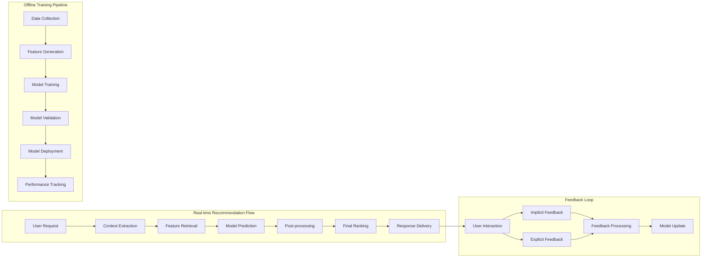
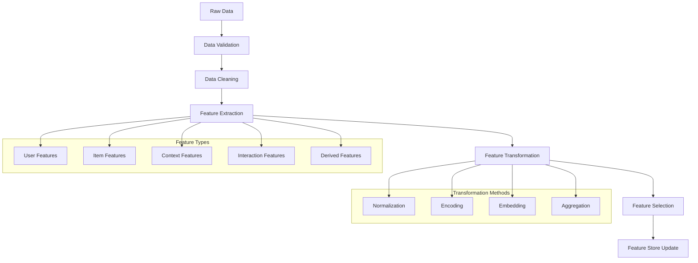
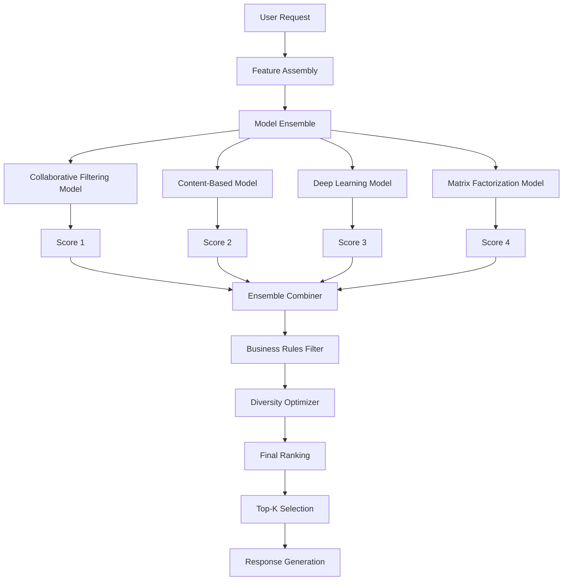
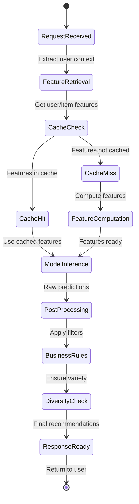
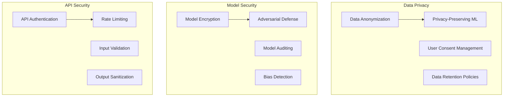

# Machine Learning Recommendation Engine


## 📋 Table of Contents

- [Machine Learning Recommendation Engine](#machine-learning-recommendation-engine)
  - [High-Level Design (HLD)](#high-level-design-hld)
    - [System Architecture Overview](#system-architecture-overview)
    - [Recommendation Pipeline Flow](#recommendation-pipeline-flow)
  - [Low-Level Design (LLD)](#low-level-design-lld)
    - [Feature Engineering Pipeline](#feature-engineering-pipeline)
    - [Model Ensemble Architecture](#model-ensemble-architecture)
    - [Real-time Serving Architecture](#real-time-serving-architecture)
  - [Core Algorithms](#core-algorithms)
    - [1. Advanced Collaborative Filtering Algorithm](#1-advanced-collaborative-filtering-algorithm)
    - [2. Content-Based Filtering with Deep Learning](#2-content-based-filtering-with-deep-learning)
    - [3. Deep Learning Recommendation Models](#3-deep-learning-recommendation-models)
    - [4. Hybrid Ensemble Model](#4-hybrid-ensemble-model)
    - [5. Real-time Personalization Engine](#5-real-time-personalization-engine)
  - [Performance Optimizations](#performance-optimizations)
    - [Real-time Serving Optimization](#real-time-serving-optimization)
    - [Model Training Optimization](#model-training-optimization)
  - [Security Considerations](#security-considerations)
    - [Recommendation Security Framework](#recommendation-security-framework)
  - [Testing Strategy](#testing-strategy)
    - [A/B Testing Framework](#ab-testing-framework)
    - [Model Evaluation](#model-evaluation)
  - [Trade-offs and Considerations](#trade-offs-and-considerations)
    - [Accuracy vs Explainability](#accuracy-vs-explainability)
    - [Personalization vs Privacy](#personalization-vs-privacy)
    - [Exploration vs Exploitation](#exploration-vs-exploitation)

---

## High-Level Design (HLD)

[⬆️ Back to Top](#--table-of-contents)

---


### System Architecture Overview

[⬆️ Back to Top](#--table-of-contents)

---




```mermaid
graph TB
    subgraph "User Interaction Layer"
        WebApps[Web Applications]
        MobileApps[Mobile Apps]
        APIClients[API Clients]
        EmailSystems[Email Systems]
    end
    
    subgraph "Recommendation API Gateway"
        APIGateway[API Gateway]
        RequestRouter[Request Router]
        RateLimiter[Rate Limiter]
        AuthService[Authentication Service]
    end
    
    subgraph "Recommendation Engine Core"
        RecommendationService[Recommendation Service]
        ModelOrchestrator[Model Orchestrator]
        FeatureService[Feature Service]
        RankingService[Ranking Service]
    end
    
    subgraph "ML Pipeline"
        DataIngestion[Data Ingestion]
        FeatureEngineering[Feature Engineering]
        ModelTraining[Model Training]
        ModelEvaluation[Model Evaluation]
        ModelDeployment[Model Deployment]
    end
    
    subgraph "Data Sources"
        UserDatabase[(User Database)]
        ProductCatalog[(Product Catalog)]
        InteractionLogs[(Interaction Logs)]
        ExternalData[(External Data)]
    end
    
    subgraph "ML Models"
        CollaborativeFiltering[Collaborative Filtering]
        ContentBased[Content-Based]
        DeepLearning[Deep Learning Models]
        HybridModels[Hybrid Models]
    end
    
    subgraph "Storage & Caching"
        FeatureStore[(Feature Store)]
        ModelStore[(Model Store)]
        PredictionCache[Prediction Cache]
        UserProfileCache[User Profile Cache]
    end
    
    subgraph "Analytics & Monitoring"
        ABTestingService[A/B Testing Service]
        PerformanceMonitor[Performance Monitor]
        ModelDriftDetection[Model Drift Detection]
        BusinessMetrics[Business Metrics]
    end
    
    WebApps --> APIGateway
    MobileApps --> APIGateway
    APIClients --> APIGateway
    
    APIGateway --> RequestRouter
    RequestRouter --> RecommendationService
    
    RecommendationService --> ModelOrchestrator
    RecommendationService --> FeatureService
    RecommendationService --> RankingService
    
    ModelOrchestrator --> CollaborativeFiltering
    ModelOrchestrator --> ContentBased
    ModelOrchestrator --> DeepLearning
    ModelOrchestrator --> HybridModels
    
    DataIngestion --> UserDatabase
    DataIngestion --> ProductCatalog
    DataIngestion --> InteractionLogs
    DataIngestion --> ExternalData
    
    FeatureEngineering --> FeatureStore
    ModelTraining --> ModelStore
    
    FeatureService --> FeatureStore
    ModelOrchestrator --> ModelStore
    RecommendationService --> PredictionCache
    
    ABTestingService --> RecommendationService
    PerformanceMonitor --> ModelOrchestrator
```

### Recommendation Pipeline Flow

[⬆️ Back to Top](#--table-of-contents)

---




## Low-Level Design (LLD)

[⬆️ Back to Top](#--table-of-contents)

---


### Feature Engineering Pipeline

[⬆️ Back to Top](#--table-of-contents)

---




### Model Ensemble Architecture

[⬆️ Back to Top](#--table-of-contents)

---




### Real-time Serving Architecture

[⬆️ Back to Top](#--table-of-contents)

---




## Core Algorithms

[⬆️ Back to Top](#--table-of-contents)

---


### 1. Advanced Collaborative Filtering Algorithm

[⬆️ Back to Top](#--table-of-contents)

---


**Purpose**: Generate recommendations based on user behavior patterns and similarities using advanced matrix factorization and deep learning techniques.

**Matrix Factorization with Deep Learning Enhancement**:
```
CollaborativeFilteringConfig = {
  algorithm: 'neural_collaborative_filtering',  // 'svd', 'nmf', 'neural_cf'
  embeddingDimension: 64,
  hiddenLayers: [128, 64, 32],
  dropoutRate: 0.2,
  regularization: 0.001,
  
  training: {
    batchSize: 1024,
    epochs: 100,
    learningRate: 0.001,
    validationSplit: 0.2,
    earlyStopping: true
  },
  
  inference: {
    candidateGeneration: 1000,      // Top-K candidates before ranking
    negativesampling: 5,           // Negative samples per positive
    confidenceThreshold: 0.5        // Minimum confidence for recommendations
  }
}

class NeuralCollaborativeFiltering:
  constructor(config):
    this.config = config
    this.userEmbeddings = new EmbeddingLayer(config.numUsers, config.embeddingDimension)
    this.itemEmbeddings = new EmbeddingLayer(config.numItems, config.embeddingDimension)
    this.neuralNetwork = this.buildNeuralNetwork()
    this.interactionMatrix = new SparseMatrix()
  
  function generateRecommendations(userId, numRecommendations):
    userProfile = this.getUserProfile(userId)
    
    if not userProfile or userProfile.interactions.length < 5:
      return this.handleColdStart(userId, numRecommendations)
    
    // Get candidate items
    candidates = this.generateCandidates(userId)
    
    // Score candidates using neural network
    scoredCandidates = []
    
    for itemId in candidates:
      features = this.createInteractionFeatures(userId, itemId)
      score = this.neuralNetwork.predict(features)
      
      scoredCandidates.push({
        itemId: itemId,
        score: score,
        confidence: this.calculateConfidence(features, score)
      })
    
    // Sort by score and filter by confidence
    validCandidates = scoredCandidates
      .filter(candidate => candidate.confidence >= this.config.inference.confidenceThreshold)
      .sort((a, b) => b.score - a.score)
    
    // Apply diversity and business rules
    diverseRecommendations = this.applyDiversityConstraints(validCandidates, userProfile)
    
    return diverseRecommendations.slice(0, numRecommendations)
  
  function createInteractionFeatures(userId, itemId):
    userEmbedding = this.userEmbeddings.getEmbedding(userId)
    itemEmbedding = this.itemEmbeddings.getEmbedding(itemId)
    
    // Element-wise product (Generalized Matrix Factorization component)
    gmfVector = userEmbedding.elementwiseProduct(itemEmbedding)
    
    // Concatenation (Multi-Layer Perceptron component)
    mlpVector = userEmbedding.concatenate(itemEmbedding)
    
    // Additional contextual features
    contextFeatures = this.getContextualFeatures(userId, itemId)
    
    // Combine all features
    combinedFeatures = gmfVector.concatenate(mlpVector).concatenate(contextFeatures)
    
    return combinedFeatures
  
  function generateCandidates(userId):
    // Multiple candidate generation strategies
    candidates = new Set()
    
    // Similar users' items
    similarUsers = this.findSimilarUsers(userId, 50)
    for similarUser in similarUsers:
      userItems = this.getUserItems(similarUser.userId)
      candidates.addAll(userItems.slice(0, 20))
    
    // Items similar to user's liked items
    userItems = this.getUserItems(userId)
    for item in userItems.slice(-10): // Recent items
      similarItems = this.findSimilarItems(item, 20)
      candidates.addAll(similarItems)
    
    // Popular items in user's categories
    userCategories = this.getUserPreferredCategories(userId)
    for category in userCategories:
      popularItems = this.getPopularItemsInCategory(category, 30)
      candidates.addAll(popularItems)
    
    // Remove items user has already interacted with
    userInteractedItems = new Set(this.getUserItems(userId))
    candidates = candidates.filter(item => not userInteractedItems.has(item))
    
    return Array.from(candidates).slice(0, this.config.inference.candidateGeneration)
  
  function findSimilarUsers(userId, topK):
    userVector = this.getUserInteractionVector(userId)
    similarities = []
    
    // Use approximate nearest neighbors for efficiency
    candidateUsers = this.getRandomUserSample(1000) // Sample for efficiency
    
    for candidateUser in candidateUsers:
      if candidateUser === userId:
        continue
      
      candidateVector = this.getUserInteractionVector(candidateUser)
      similarity = this.calculateCosineSimilarity(userVector, candidateVector)
      
      if similarity > 0.1: // Minimum similarity threshold
        similarities.push({
          userId: candidateUser,
          similarity: similarity
        })
    
    return similarities
      .sort((a, b) => b.similarity - a.similarity)
      .slice(0, topK)
  
  function handleColdStart(userId, numRecommendations):
    // Cold start strategy for new users
    userProfile = this.getUserProfile(userId)
    
    recommendations = []
    
    // Use demographic-based recommendations
    if userProfile.demographics:
      demographicRecs = this.getDemographicBasedRecommendations(userProfile.demographics)
      recommendations.push(...demographicRecs)
    
    // Use popular items
    popularItems = this.getPopularItems(numRecommendations * 2)
    recommendations.push(...popularItems)
    
    // Use trending items
    trendingItems = this.getTrendingItems(numRecommendations)
    recommendations.push(...trendingItems)
    
    // Remove duplicates and limit
    uniqueRecommendations = this.removeDuplicates(recommendations)
    
    return uniqueRecommendations.slice(0, numRecommendations).map(item => ({
      itemId: item.id,
      score: item.popularity || 0.5,
      confidence: 0.3, // Lower confidence for cold start
      reason: 'cold_start'
    }))
```

### 2. Content-Based Filtering with Deep Learning

[⬆️ Back to Top](#--table-of-contents)

---


**Purpose**: Recommend items based on content similarity using advanced NLP and computer vision techniques for feature extraction.

**Multi-Modal Content Analysis**:
```
ContentBasedConfig = {
  featureExtractors: {
    text: {
      model: 'transformer',        // 'tfidf', 'word2vec', 'transformer'
      maxSequenceLength: 512,
      embeddingDimension: 768
    },
    image: {
      model: 'resnet50',          // 'vgg16', 'resnet50', 'efficientnet'
      embeddingDimension: 2048,
      imageSize: [224, 224]
    },
    categorical: {
      embeddingDimension: 32,
      categoryMapping: true
    }
  },
  
  similarity: {
    metric: 'cosine',             // 'cosine', 'euclidean', 'manhattan'
    threshold: 0.6,               // Minimum similarity for recommendation
    maxCandidates: 500
  },
  
  userProfile: {
    updateStrategy: 'weighted_average',  // 'average', 'weighted_average', 'decay'
    decayFactor: 0.9,
    minInteractions: 3
  }
}

class ContentBasedRecommender:
  constructor(config):
    this.config = config
    this.textEncoder = new TransformerTextEncoder()
    this.imageEncoder = new CNNImageEncoder()
    this.itemProfiles = new Map()
    this.userProfiles = new Map()
    this.similarityIndex = new FaissIndex()
  
  function generateContentBasedRecommendations(userId, numRecommendations):
    userProfile = this.getUserContentProfile(userId)
    
    if not userProfile:
      return this.getPopularContentRecommendations(numRecommendations)
    
    // Generate candidates based on content similarity
    candidates = this.findSimilarContent(userProfile, this.config.similarity.maxCandidates)
    
    // Score candidates
    scoredCandidates = candidates.map(candidate => ({
      itemId: candidate.itemId,
      score: this.calculateContentScore(userProfile, candidate.profile),
      similarity: candidate.similarity,
      explanations: this.generateExplanations(userProfile, candidate.profile)
    }))
    
    // Filter and rank
    validCandidates = scoredCandidates
      .filter(candidate => candidate.score >= this.config.similarity.threshold)
      .sort((a, b) => b.score - a.score)
    
    return validCandidates.slice(0, numRecommendations)
  
  function buildItemProfile(item):
    profile = {
      itemId: item.id,
      features: {},
      embedding: null,
      lastUpdated: Date.now()
    }
    
    // Extract text features
    if item.textContent:
      textEmbedding = this.textEncoder.encode(item.textContent)
      profile.features.text = textEmbedding
    
    // Extract image features
    if item.images and item.images.length > 0:
      imageEmbeddings = item.images.map(image => this.imageEncoder.encode(image))
      profile.features.image = this.averageEmbeddings(imageEmbeddings)
    
    // Extract categorical features
    if item.categories:
      categoryEmbedding = this.encodeCategoricalFeatures(item.categories)
      profile.features.categorical = categoryEmbedding
    
    // Extract numerical features
    if item.attributes:
      numericalFeatures = this.extractNumericalFeatures(item.attributes)
      profile.features.numerical = numericalFeatures
    
    // Combine all features into single embedding
    profile.embedding = this.combineFeatures(profile.features)
    
    // Store in similarity index
    this.similarityIndex.addVector(item.id, profile.embedding)
    
    return profile
  
  function buildUserContentProfile(userId):
    userInteractions = this.getUserInteractions(userId)
    
    if userInteractions.length < this.config.userProfile.minInteractions:
      return null
    
    // Weight interactions by recency and type
    weightedInteractions = userInteractions.map(interaction => ({
      itemProfile: this.getItemProfile(interaction.itemId),
      weight: this.calculateInteractionWeight(interaction),
      timestamp: interaction.timestamp
    }))
    
    // Calculate weighted average of item profiles
    userProfile = this.calculateWeightedProfile(weightedInteractions)
    
    // Apply temporal decay
    if this.config.userProfile.updateStrategy === 'decay':
      userProfile = this.applyTemporalDecay(userProfile, weightedInteractions)
    
    return userProfile
  
  function calculateContentScore(userProfile, itemProfile):
    scores = []
    
    // Text similarity
    if userProfile.features.text and itemProfile.features.text:
      textSimilarity = this.calculateCosineSimilarity(
        userProfile.features.text,
        itemProfile.features.text
      )
      scores.push({ type: 'text', score: textSimilarity, weight: 0.4 })
    
    // Image similarity
    if userProfile.features.image and itemProfile.features.image:
      imageSimilarity = this.calculateCosineSimilarity(
        userProfile.features.image,
        itemProfile.features.image
      )
      scores.push({ type: 'image', score: imageSimilarity, weight: 0.3 })
    
    // Categorical similarity
    if userProfile.features.categorical and itemProfile.features.categorical:
      categoricalSimilarity = this.calculateJaccardSimilarity(
        userProfile.features.categorical,
        itemProfile.features.categorical
      )
      scores.push({ type: 'categorical', score: categoricalSimilarity, weight: 0.2 })
    
    // Numerical similarity
    if userProfile.features.numerical and itemProfile.features.numerical:
      numericalSimilarity = this.calculateNumericalSimilarity(
        userProfile.features.numerical,
        itemProfile.features.numerical
      )
      scores.push({ type: 'numerical', score: numericalSimilarity, weight: 0.1 })
    
    // Calculate weighted average
    totalWeight = scores.reduce((sum, score) => sum + score.weight, 0)
    weightedScore = scores.reduce((sum, score) => sum + (score.score * score.weight), 0) / totalWeight
    
    return weightedScore
  
  function generateExplanations(userProfile, itemProfile):
    explanations = []
    
    // Find strongest similarity dimensions
    similarities = this.calculateDimensionSimilarities(userProfile, itemProfile)
    
    topSimilarities = similarities
      .sort((a, b) => b.score - a.score)
      .slice(0, 3)
    
    for similarity in topSimilarities:
      switch similarity.dimension:
        case 'category':
          explanations.push(`Similar category: ${similarity.value}`)
          break
        case 'brand':
          explanations.push(`Same brand: ${similarity.value}`)
          break
        case 'topic':
          explanations.push(`Related topic: ${similarity.value}`)
          break
        case 'style':
          explanations.push(`Similar style: ${similarity.value}`)
          break
    
    return explanations
```

### 3. Deep Learning Recommendation Models

[⬆️ Back to Top](#--table-of-contents)

---


**Purpose**: Leverage advanced neural architectures like autoencoders, RNNs, and attention mechanisms for complex pattern recognition in user behavior.

**Sequential Deep Learning Model**:
```
DeepLearningConfig = {
  architecture: 'transformer_recommender',  // 'autoencoder', 'rnn', 'transformer'
  sequenceLength: 50,
  embeddingDimension: 128,
  
  transformer: {
    numHeads: 8,
    numLayers: 6,
    feedForwardDimension: 512,
    dropoutRate: 0.1,
    positionEncoding: true
  },
  
  training: {
    batchSize: 256,
    learningRate: 0.0001,
    weightDecay: 0.01,
    warmupSteps: 4000,
    maxSteps: 100000
  },
  
  inference: {
    beamSize: 10,
    maxLength: 20,
    temperature: 0.8
  }
}

class TransformerRecommender:
  constructor(config):
    this.config = config
    this.itemEmbedding = new EmbeddingLayer(config.vocabSize, config.embeddingDimension)
    this.positionEmbedding = new PositionalEncoding(config.sequenceLength, config.embeddingDimension)
    this.transformerLayers = this.buildTransformerLayers()
    this.outputProjection = new LinearLayer(config.embeddingDimension, config.vocabSize)
  
  function generateSequentialRecommendations(userId, numRecommendations):
    userSequence = this.getUserInteractionSequence(userId)
    
    if userSequence.length < 3:
      return this.handleShortSequence(userId, numRecommendations)
    
    // Prepare sequence for model input
    inputSequence = this.prepareInputSequence(userSequence)
    
    // Generate recommendations using beam search
    recommendations = this.beamSearchGeneration(inputSequence, numRecommendations)
    
    // Post-process and score recommendations
    scoredRecommendations = recommendations.map(rec => ({
      itemId: rec.itemId,
      score: rec.probability,
      confidence: this.calculateSequentialConfidence(rec, userSequence),
      position: rec.position,
      reasoning: this.explainSequentialChoice(rec, userSequence)
    }))
    
    return scoredRecommendations
  
  function beamSearchGeneration(inputSequence, numRecommendations):
    beamSize = this.config.inference.beamSize
    maxLength = this.config.inference.maxLength
    
    // Initialize beam with input sequence
    beams = [{
      sequence: inputSequence,
      logProbability: 0.0,
      completed: false
    }]
    
    completedBeams = []
    
    for step in range(maxLength):
      if completedBeams.length >= numRecommendations:
        break
      
      candidateBeams = []
      
      for beam in beams:
        if beam.completed:
          continue
        
        // Get next token predictions
        predictions = this.predict(beam.sequence)
        
        // Get top-k candidates
        topCandidates = this.getTopKCandidates(predictions, beamSize)
        
        for candidate in topCandidates:
          newSequence = [...beam.sequence, candidate.itemId]
          newLogProb = beam.logProbability + Math.log(candidate.probability)
          
          candidateBeam = {
            sequence: newSequence,
            logProbability: newLogProb,
            completed: this.isSequenceComplete(newSequence),
            lastItem: candidate
          }
          
          candidateBeams.push(candidateBeam)
      
      // Select top beams
      candidateBeams.sort((a, b) => b.logProbability - a.logProbability)
      
      // Separate completed and ongoing beams
      for beam in candidateBeams:
        if beam.completed:
          completedBeams.push(beam)
        else:
          beams.push(beam)
      
      // Keep only top beams
      beams = beams.slice(0, beamSize)
    
    // Convert to recommendations
    recommendations = completedBeams
      .concat(beams) // Include incomplete beams if needed
      .sort((a, b) => b.logProbability - a.logProbability)
      .slice(0, numRecommendations)
      .map((beam, index) => ({
        itemId: beam.lastItem?.itemId || beam.sequence[beam.sequence.length - 1],
        probability: Math.exp(beam.logProbability / beam.sequence.length),
        position: index + 1,
        sequence: beam.sequence
      }))
    
    return recommendations
  
  function predict(sequence):
    // Encode sequence
    embeddings = sequence.map(itemId => this.itemEmbedding.getEmbedding(itemId))
    
    // Add positional encoding
    positionEncodedEmbeddings = embeddings.map((embedding, index) => 
      embedding.add(this.positionEmbedding.getEncoding(index))
    )
    
    // Apply transformer layers
    hiddenStates = positionEncodedEmbeddings
    
    for layer in this.transformerLayers:
      hiddenStates = layer.forward(hiddenStates)
    
    // Get last hidden state for prediction
    lastHidden = hiddenStates[hiddenStates.length - 1]
    
    // Project to output vocabulary
    logits = this.outputProjection.forward(lastHidden)
    
    // Apply temperature scaling
    scaledLogits = logits.divide(this.config.inference.temperature)
    
    // Convert to probabilities
    probabilities = softmax(scaledLogits)
    
    return probabilities
  
  function explainSequentialChoice(recommendation, userSequence):
    explanations = []
    
    // Analyze sequence patterns
    sequencePatterns = this.analyzeSequencePatterns(userSequence)
    
    // Find matching patterns
    for pattern in sequencePatterns:
      if this.matchesPattern(recommendation.itemId, pattern):
        explanations.push(`Follows your ${pattern.type} pattern`)
      
    // Analyze temporal patterns
    temporalPatterns = this.analyzeTemporalPatterns(userSequence)
    if temporalPatterns:
      explanations.push(`Based on your ${temporalPatterns.description} behavior`)
    
    // Analyze category progression
    categoryProgression = this.analyzeCategoryProgression(userSequence)
    if categoryProgression:
      explanations.push(`Natural progression in ${categoryProgression.category}`)
    
    return explanations
```

### 4. Hybrid Ensemble Model

[⬆️ Back to Top](#--table-of-contents)

---


**Purpose**: Combine multiple recommendation algorithms to leverage their individual strengths and provide more robust and diverse recommendations.

**Advanced Model Ensemble with Meta-Learning**:
```
HybridEnsembleConfig = {
  models: {
    collaborative: { weight: 0.4, confidenceThreshold: 0.6 },
    contentBased: { weight: 0.3, confidenceThreshold: 0.5 },
    deepLearning: { weight: 0.2, confidenceThreshold: 0.7 },
    popularity: { weight: 0.1, confidenceThreshold: 0.3 }
  },
  
  ensembleStrategy: 'meta_learning',  // 'weighted_average', 'rank_fusion', 'meta_learning'
  
  metaLearner: {
    algorithm: 'gradient_boosting',    // 'linear', 'neural_network', 'gradient_boosting'
    features: ['model_confidence', 'user_context', 'item_context', 'temporal_features'],
    crossValidationFolds: 5
  },
  
  diversification: {
    enabled: true,
    algorithm: 'mmr',                  // 'mmr', 'dpp', 'greedy'
    lambda: 0.7,                       // Relevance vs diversity trade-off
    maxSimilarity: 0.8
  }
}

class HybridEnsembleRecommender:
  constructor(config):
    this.config = config
    this.models = this.initializeModels()
    this.metaLearner = new GradientBoostingMetaLearner()
    this.diversityOptimizer = new MaximalMarginalRelevance()
    this.modelPerformanceTracker = new ModelPerformanceTracker()
  
  function generateHybridRecommendations(userId, numRecommendations, context):
    // Get predictions from all models
    modelPredictions = []
    
    for [modelName, modelConfig] in Object.entries(this.config.models):
      model = this.models[modelName]
      
      try:
        predictions = model.predict(userId, numRecommendations * 3) // Get more candidates
        
        // Filter by confidence threshold
        filteredPredictions = predictions.filter(pred => 
          pred.confidence >= modelConfig.confidenceThreshold
        )
        
        modelPredictions.push({
          modelName: modelName,
          predictions: filteredPredictions,
          weight: modelConfig.weight,
          modelPerformance: this.modelPerformanceTracker.getPerformance(modelName, userId)
        })
        
      catch error:
        logModelError(modelName, userId, error)
        continue
    
    // Ensemble predictions
    ensembledRecommendations = this.ensemblePredictions(modelPredictions, userId, context)
    
    // Apply diversification
    if this.config.diversification.enabled:
      ensembledRecommendations = this.applyDiversification(ensembledRecommendations)
    
    // Apply business rules and final ranking
    finalRecommendations = this.applyBusinessRules(ensembledRecommendations, userId, context)
    
    return finalRecommendations.slice(0, numRecommendations)
  
  function ensemblePredictions(modelPredictions, userId, context):
    // Collect all unique items
    allItems = new Map()
    
    for modelPrediction in modelPredictions:
      for prediction in modelPrediction.predictions:
        if not allItems.has(prediction.itemId):
          allItems.set(prediction.itemId, {
            itemId: prediction.itemId,
            modelScores: new Map(),
            modelConfidences: new Map(),
            modelExplanations: new Map()
          })
        
        item = allItems.get(prediction.itemId)
        item.modelScores.set(modelPrediction.modelName, prediction.score)
        item.modelConfidences.set(modelPrediction.modelName, prediction.confidence)
        item.modelExplanations.set(modelPrediction.modelName, prediction.explanations || [])
    
    // Apply ensemble strategy
    ensembledItems = []
    
    for [itemId, item] in allItems:
      switch this.config.ensembleStrategy:
        case 'weighted_average':
          ensembledScore = this.calculateWeightedAverage(item, modelPredictions)
          break
        case 'rank_fusion':
          ensembledScore = this.calculateRankFusion(item, modelPredictions)
          break
        case 'meta_learning':
          ensembledScore = this.calculateMetaLearnerScore(item, userId, context)
          break
        default:
          ensembledScore = this.calculateWeightedAverage(item, modelPredictions)
      
      ensembledItems.push({
        itemId: itemId,
        score: ensembledScore.score,
        confidence: ensembledScore.confidence,
        modelContributions: this.calculateModelContributions(item, modelPredictions),
        explanations: this.combineExplanations(item)
      })
    
    return ensembledItems.sort((a, b) => b.score - a.score)
  
  function calculateMetaLearnerScore(item, userId, context):
    // Prepare features for meta-learner
    features = []
    
    // Model confidence features
    for [modelName, confidence] in item.modelConfidences:
      features.push(confidence)
    
    // Model score features
    for [modelName, score] in item.modelScores:
      features.push(score)
    
    // User context features
    userFeatures = this.extractUserContextFeatures(userId, context)
    features.push(...userFeatures)
    
    // Item context features
    itemFeatures = this.extractItemContextFeatures(item.itemId, context)
    features.push(...itemFeatures)
    
    // Temporal features
    temporalFeatures = this.extractTemporalFeatures(context)
    features.push(...temporalFeatures)
    
    // Predict final score using meta-learner
    prediction = this.metaLearner.predict(features)
    
    return {
      score: prediction.score,
      confidence: prediction.confidence
    }
  
  function applyDiversification(recommendations):
    if this.config.diversification.algorithm === 'mmr':
      return this.applyMMR(recommendations)
    else if this.config.diversification.algorithm === 'dpp':
      return this.applyDPP(recommendations)
    else:
      return this.applyGreedyDiversification(recommendations)
  
  function applyMMR(recommendations):
    // Maximal Marginal Relevance for diversification
    selectedItems = []
    remainingItems = [...recommendations]
    lambda = this.config.diversification.lambda
    
    // Select first item (highest relevance)
    if remainingItems.length > 0:
      selectedItems.push(remainingItems.shift())
    
    while selectedItems.length < recommendations.length and remainingItems.length > 0:
      maxMMRScore = -Infinity
      bestItemIndex = -1
      
      for i in range(remainingItems.length):
        item = remainingItems[i]
        
        // Calculate MMR score
        relevanceScore = item.score
        
        // Calculate max similarity to already selected items
        maxSimilarity = 0
        for selectedItem in selectedItems:
          similarity = this.calculateItemSimilarity(item.itemId, selectedItem.itemId)
          maxSimilarity = Math.max(maxSimilarity, similarity)
        
        // MMR formula: λ * relevance - (1-λ) * max_similarity
        mmrScore = lambda * relevanceScore - (1 - lambda) * maxSimilarity
        
        if mmrScore > maxMMRScore:
          maxMMRScore = mmrScore
          bestItemIndex = i
      
      if bestItemIndex >= 0:
        selectedItems.push(remainingItems.splice(bestItemIndex, 1)[0])
    
    return selectedItems
  
  function calculateModelContributions(item, modelPredictions):
    contributions = new Map()
    totalWeight = 0
    
    for modelPrediction in modelPredictions:
      if item.modelScores.has(modelPrediction.modelName):
        score = item.modelScores.get(modelPrediction.modelName)
        weight = modelPrediction.weight
        
        contributions.set(modelPrediction.modelName, {
          score: score,
          weight: weight,
          normalizedContribution: score * weight
        })
        
        totalWeight += weight
    
    // Normalize contributions
    for [modelName, contribution] in contributions:
      contribution.normalizedContribution /= totalWeight
    
    return contributions
```

### 5. Real-time Personalization Engine

[⬆️ Back to Top](#--table-of-contents)

---


**Purpose**: Provide real-time recommendation updates based on immediate user interactions and contextual changes.

**Contextual Bandits for Real-time Learning**:
```
RealTimePersonalizationConfig = {
  algorithm: 'contextual_bandits',     // 'contextual_bandits', 'online_learning'
  
  bandits: {
    algorithm: 'linear_ucb',           // 'epsilon_greedy', 'ucb', 'linear_ucb', 'thompson_sampling'
    alpha: 0.2,                        // Confidence parameter
    dimension: 100,                    // Feature dimension
    lambda: 1.0                        // Regularization parameter
  },
  
  contextFeatures: {
    user: ['demographics', 'behavior_history', 'current_session'],
    item: ['content_features', 'popularity', 'freshness'],
    temporal: ['time_of_day', 'day_of_week', 'season'],
    environmental: ['device', 'location', 'weather']
  },
  
  updateStrategy: {
    frequency: 'immediate',            // 'immediate', 'batch', 'periodic'
    rewardDelay: 300000,              // 5 minutes max delay for reward
    explorationRate: 0.1              // 10% exploration
  }
}

class RealTimePersonalizationEngine:
  constructor(config):
    this.config = config
    this.contextualBandits = new LinearContextualBandits(config.bandits)
    this.featureExtractor = new ContextualFeatureExtractor()
    this.rewardTracker = new RewardTracker()
    this.sessionManager = new UserSessionManager()
  
  function getPersonalizedRecommendations(userId, context, numRecommendations):
    # Extract current context features
    contextFeatures = this.featureExtractor.extract(userId, context)
    
    # Get candidate items
    candidates = this.getCandidateItems(userId, context)
    
    # Score candidates using contextual bandits
    scoredCandidates = []
    
    for candidate in candidates:
      candidateFeatures = this.featureExtractor.extractItemFeatures(candidate, context)
      combinedFeatures = this.combineFeatures(contextFeatures, candidateFeatures)
      
      # Get bandit prediction with confidence bounds
      prediction = this.contextualBandits.predict(combinedFeatures)
      
      scoredCandidates.push({
        itemId: candidate.id,
        score: prediction.expectedReward,
        confidence: prediction.confidenceBound,
        features: combinedFeatures,
        explorationBonus: prediction.explorationBonus
      })
    
    # Balance exploration and exploitation
    finalCandidates = this.balanceExplorationExploitation(scoredCandidates)
    
    # Track recommendations for reward learning
    recommendationIds = finalCandidates.slice(0, numRecommendations).map(c => c.itemId)
    this.trackRecommendations(userId, recommendationIds, contextFeatures)
    
    return finalCandidates.slice(0, numRecommendations)
  
  function updateWithFeedback(userId, itemId, feedbackType, context):
    # Convert feedback to reward signal
    reward = this.convertFeedbackToReward(feedbackType, context)
    
    # Get the features used for this recommendation
    recommendationFeatures = this.getRecommendationFeatures(userId, itemId)
    
    if recommendationFeatures:
      # Update contextual bandit with reward
      this.contextualBandits.update(recommendationFeatures, reward)
      
      # Update user session state
      this.sessionManager.updateSession(userId, {
        itemId: itemId,
        feedback: feedbackType,
        reward: reward,
        timestamp: Date.now()
      })
      
      # Trigger real-time model updates if needed
      if this.shouldTriggerModelUpdate(userId, reward):
        this.triggerModelUpdate(userId)
  
  function balanceExplorationExploitation(candidates):
    explorationRate = this.config.updateStrategy.explorationRate
    
    # Sort by expected reward + exploration bonus
    candidates.sort((a, b) => 
      (b.score + b.explorationBonus) - (a.score + a.explorationBonus)
    )
    
    # Implement epsilon-greedy exploration
    finalCandidates = []
    
    for i in range(candidates.length):
      if Math.random() < explorationRate:
        # Exploration: select based on confidence/uncertainty
        explorationCandidate = this.selectExplorationCandidate(candidates)
        finalCandidates.push(explorationCandidate)
      else:
        # Exploitation: select best predicted candidate
        finalCandidates.push(candidates[i])
    
    return finalCandidates
  
  function convertFeedbackToReward(feedbackType, context):
    rewardMapping = {
      'click': 1.0,
      'view': 0.5,
      'like': 2.0,
      'share': 3.0,
      'purchase': 10.0,
      'ignore': 0.0,
      'dislike': -1.0,
      'block': -5.0
    }
    
    baseReward = rewardMapping[feedbackType] || 0.0
    
    # Apply contextual modifiers
    if context.timeToFeedback < 10000: # Quick feedback (< 10 seconds)
      baseReward *= 1.2
    
    if context.sessionPosition === 1: # First recommendation clicked
      baseReward *= 1.1
    
    return baseReward
  
  function extractContextualFeatures(userId, context):
    features = []
    
    # User features
    userProfile = this.getUserProfile(userId)
    features.push(...this.encodeUserFeatures(userProfile))
    
    # Temporal features
    temporalFeatures = this.encodeTemporalFeatures(context.timestamp)
    features.push(...temporalFeatures)
    
    # Session features
    sessionFeatures = this.encodeSessionFeatures(userId, context)
    features.push(...sessionFeatures)
    
    # Device and environment features
    environmentFeatures = this.encodeEnvironmentFeatures(context)
    features.push(...environmentFeatures)
    
    return features
  
  function encodeSessionFeatures(userId, context):
    session = this.sessionManager.getSession(userId)
    
    return [
      session.duration / 3600000,           # Session duration in hours
      session.pageViews,                    # Number of page views
      session.interactions,                 # Number of interactions
      session.conversionEvents,             # Number of conversions
      session.bounceRate,                   # Session bounce rate
      context.positionInSession || 0        # Position in current session
    ]
```

## Performance Optimizations

[⬆️ Back to Top](#--table-of-contents)

---


### Real-time Serving Optimization

[⬆️ Back to Top](#--table-of-contents)

---


**Caching and Precomputation Strategy**:
```
ServingOptimization = {
  precomputation: {
    userEmbeddings: true,
    itemEmbeddings: true,
    popularityScores: true,
    categoryTrends: true
  },
  
  caching: {
    userProfiles: { ttl: 3600000, size: 100000 },    # 1 hour, 100K users
    recommendations: { ttl: 1800000, size: 50000 },   # 30 minutes, 50K sets
    modelPredictions: { ttl: 600000, size: 200000 }   # 10 minutes, 200K predictions
  },
  
  approximation: {
    nearestNeighbors: 'faiss',
    dimensionalityReduction: 'pca',
    quantization: 'product_quantization'
  }
}
```

### Model Training Optimization

[⬆️ Back to Top](#--table-of-contents)

---


**Distributed Training Pipeline**:
- Parallel feature extraction
- Distributed model training
- Incremental learning updates
- A/B testing infrastructure

## Security Considerations

[⬆️ Back to Top](#--table-of-contents)

---


### Recommendation Security Framework

[⬆️ Back to Top](#--table-of-contents)

---




## Testing Strategy

[⬆️ Back to Top](#--table-of-contents)

---


### A/B Testing Framework

[⬆️ Back to Top](#--table-of-contents)

---


**Experimentation Platform**:
- Multi-armed bandit testing
- Statistical significance testing
- Business metric tracking
- Model performance comparison

### Model Evaluation

[⬆️ Back to Top](#--table-of-contents)

---


**Evaluation Metrics**:
- Precision, Recall, F1-Score
- NDCG (Normalized Discounted Cumulative Gain)
- Diversity metrics
- Novelty and serendipity measures

## Trade-offs and Considerations

[⬆️ Back to Top](#--table-of-contents)

---


### Accuracy vs Explainability

[⬆️ Back to Top](#--table-of-contents)

---

- **Complex models**: Higher accuracy vs interpretability
- **Feature engineering**: Performance vs transparency
- **Ensemble methods**: Robustness vs complexity
- **Deep learning**: Pattern recognition vs explainability

### Personalization vs Privacy

[⬆️ Back to Top](#--table-of-contents)

---

- **Data collection**: Personalization quality vs privacy concerns
- **Model complexity**: Individual targeting vs data minimization
- **Cross-platform tracking**: Consistency vs privacy
- **Real-time updates**: Responsiveness vs data protection

### Exploration vs Exploitation

[⬆️ Back to Top](#--table-of-contents)

---

- **Recommendation diversity**: Discovery vs relevance
- **New item promotion**: Novelty vs proven preferences
- **Long-tail coverage**: Comprehensive catalog vs popular items
- **User engagement**: Immediate satisfaction vs long-term value

This machine learning recommendation engine provides a comprehensive foundation for personalized recommendations with features like advanced collaborative filtering, content-based analysis, deep learning models, hybrid ensembles, and real-time personalization while maintaining high accuracy, scalability, and user privacy standards. 