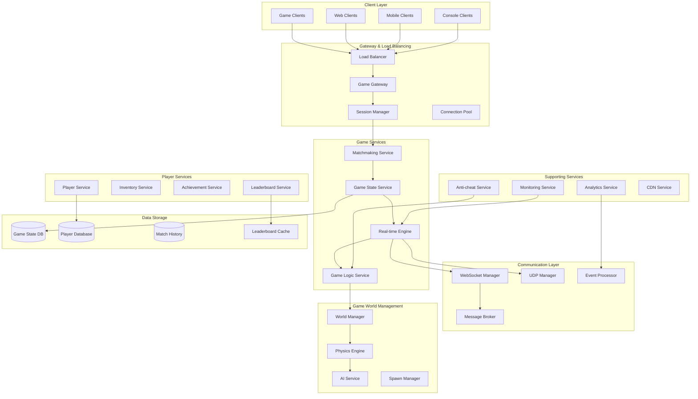
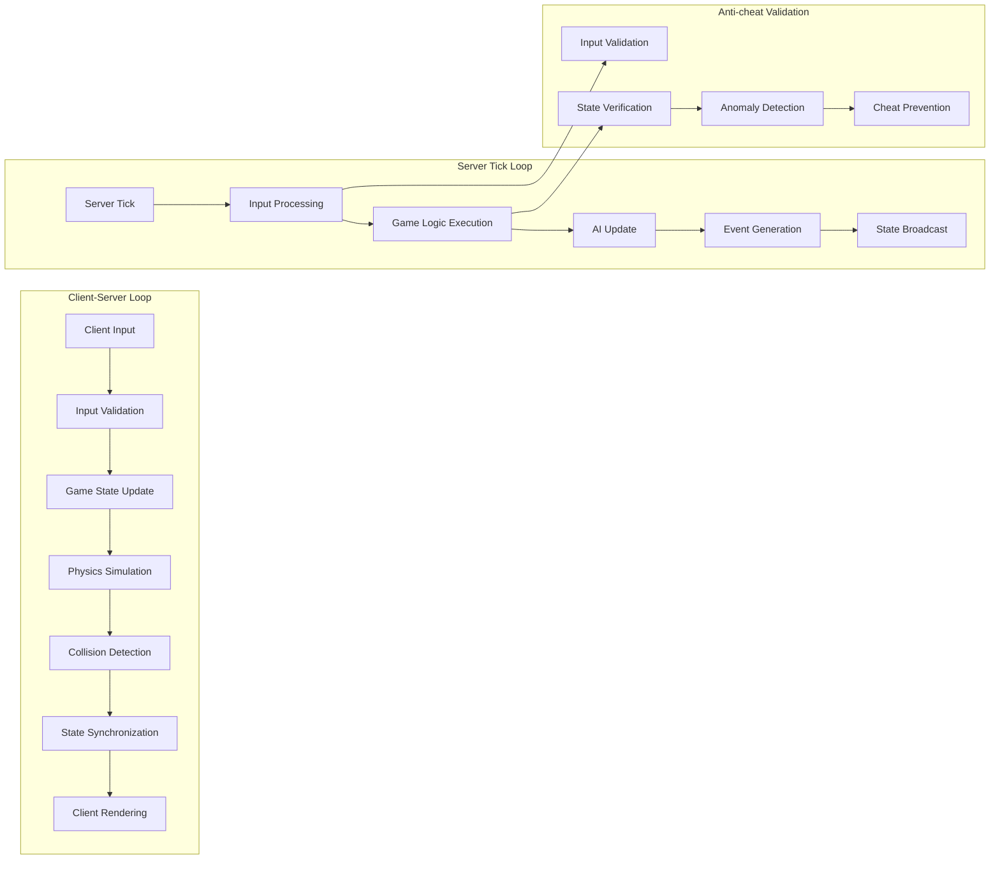
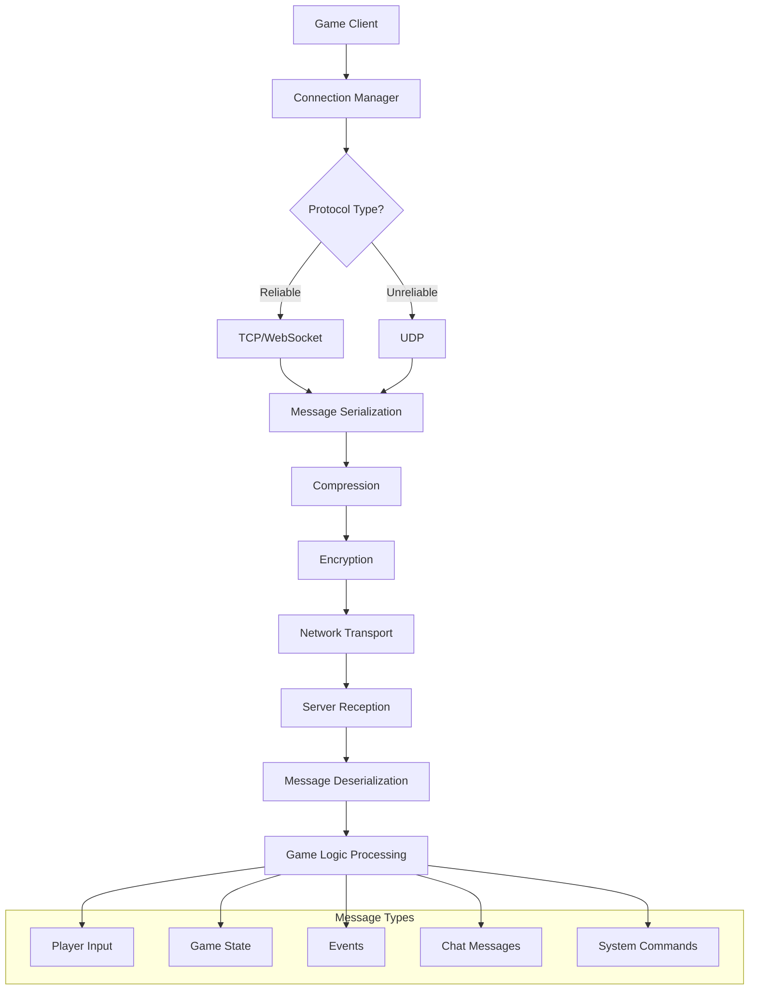
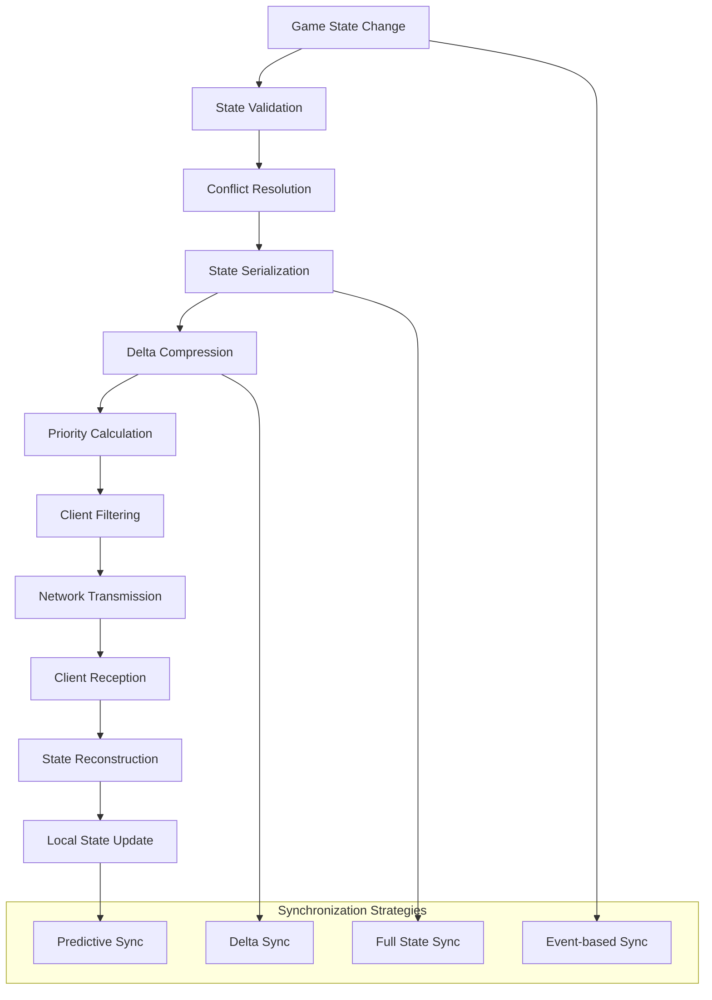
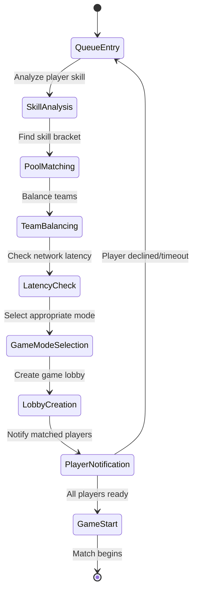
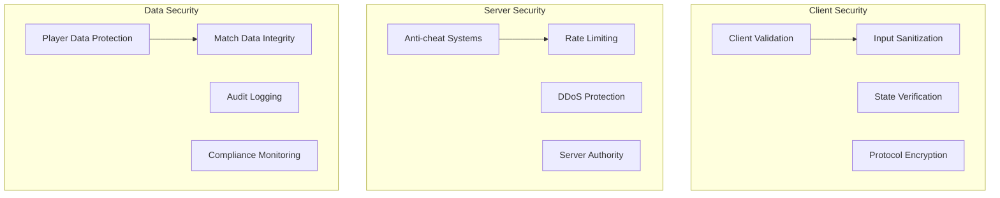

# Real-time Multiplayer Gaming Backend


## 📋 Table of Contents

- [Real-time Multiplayer Gaming Backend](#real-time-multiplayer-gaming-backend)
  - [High-Level Design (HLD)](#high-level-design-hld)
    - [System Architecture Overview](#system-architecture-overview)
    - [Real-time Game Loop Architecture](#real-time-game-loop-architecture)
  - [Low-Level Design (LLD)](#low-level-design-lld)
    - [Real-time Network Protocol Stack](#real-time-network-protocol-stack)
    - [Game State Synchronization](#game-state-synchronization)
    - [Matchmaking Algorithm Flow](#matchmaking-algorithm-flow)
  - [Core Algorithms](#core-algorithms)
    - [1. Real-time State Synchronization Algorithm](#1-real-time-state-synchronization-algorithm)
    - [2. Advanced Matchmaking Algorithm](#2-advanced-matchmaking-algorithm)
    - [3. Anti-cheat Detection Algorithm](#3-anti-cheat-detection-algorithm)
    - [4. Game Physics Simulation Algorithm](#4-game-physics-simulation-algorithm)
    - [5. Leaderboard and Achievement System](#5-leaderboard-and-achievement-system)
  - [Performance Optimizations](#performance-optimizations)
    - [Real-time Networking Optimization](#real-time-networking-optimization)
    - [Database Optimization](#database-optimization)
  - [Security Considerations](#security-considerations)
    - [Gaming Security Framework](#gaming-security-framework)
  - [Testing Strategy](#testing-strategy)
    - [Load Testing](#load-testing)
    - [Game Balance Testing](#game-balance-testing)
  - [Trade-offs and Considerations](#trade-offs-and-considerations)
    - [Performance vs Accuracy](#performance-vs-accuracy)
    - [Scalability vs Cost](#scalability-vs-cost)
    - [Player Experience vs Technical Constraints](#player-experience-vs-technical-constraints)

---

## High-Level Design (HLD)

[⬆️ Back to Top](#--table-of-contents)

---


### System Architecture Overview

[⬆️ Back to Top](#--table-of-contents)

---




### Real-time Game Loop Architecture

[⬆️ Back to Top](#--table-of-contents)

---




## Low-Level Design (LLD)

[⬆️ Back to Top](#--table-of-contents)

---


### Real-time Network Protocol Stack

[⬆️ Back to Top](#--table-of-contents)

---




### Game State Synchronization

[⬆️ Back to Top](#--table-of-contents)

---




### Matchmaking Algorithm Flow

[⬆️ Back to Top](#--table-of-contents)

---




## Core Algorithms

[⬆️ Back to Top](#--table-of-contents)

---


### 1. Real-time State Synchronization Algorithm

[⬆️ Back to Top](#--table-of-contents)

---


**Purpose**: Synchronize game state across multiple clients while maintaining consistency, minimizing latency, and handling network issues gracefully.

**Delta Compression with Prediction**:
```
StateSyncConfig = {
  updateFrequency: 60,                    # 60 updates per second
  deltaCompression: true,
  stateInterpolation: true,
  clientPrediction: true,
  
  prioritization: {
    playerActions: 1.0,
    nearbyObjects: 0.8,
    distantObjects: 0.3,
    staticObjects: 0.1
  },
  
  networkOptimization: {
    compressionThreshold: 100,            # Compress packets > 100 bytes
    batchingWindow: 16,                   # 16ms batching window
    adaptiveQuality: true
  }
}

class GameStateSynchronizer:
  constructor(config):
    this.config = config
    this.gameState = new GameState()
    this.clientStates = new Map()         # clientId -> client state
    this.deltaCalculator = new DeltaCalculator()
    this.compressionEngine = new CompressionEngine()
    this.predictionEngine = new PredictionEngine()
  
  function synchronizeState(gameStateSnapshot, connectedClients):
    currentTime = Date.now()
    syncResults = []
    
    for client in connectedClients:
      try:
        clientSync = this.synchronizeClientState(gameStateSnapshot, client, currentTime)
        syncResults.push(clientSync)
      catch error:
        this.handleSyncError(client.id, error)
        continue
    
    # Update global state metrics
    this.updateSyncMetrics(syncResults)
    
    return syncResults
  
  function synchronizeClientState(gameState, client, timestamp):
    # Get client's last known state
    lastClientState = this.clientStates.get(client.id)
    
    # Calculate relevant state for client (viewport culling)
    relevantState = this.calculateRelevantState(gameState, client)
    
    # Calculate state delta
    stateDelta = this.deltaCalculator.calculate(lastClientState, relevantState)
    
    # Apply priority-based filtering
    prioritizedDelta = this.applyPriorityFiltering(stateDelta, client)
    
    # Compress delta if needed
    compressedDelta = this.compressIfNeeded(prioritizedDelta)
    
    # Create sync message
    syncMessage = {
      messageType: 'state_sync',
      timestamp: timestamp,
      sequenceNumber: this.getNextSequenceNumber(client.id),
      delta: compressedDelta,
      metadata: {
        fullSync: stateDelta.isFullSync,
        compressionUsed: compressedDelta.compressed,
        priorityLevel: this.calculatePriorityLevel(stateDelta)
      }
    }
    
    # Send to client
    this.sendToClient(client, syncMessage)
    
    # Update client's last known state
    this.clientStates.set(client.id, relevantState)
    
    return {
      clientId: client.id,
      messageSize: syncMessage.size,
      objectsUpdated: stateDelta.objectCount,
      latency: client.latency,
      success: true
    }
  
  function calculateRelevantState(gameState, client):
    relevantObjects = []
    playerPosition = client.playerPosition
    viewportRadius = client.viewportRadius
    
    # Spatial partitioning for efficient object filtering
    spatialGrid = this.gameState.getSpatialGrid()
    nearbyBuckets = spatialGrid.getBucketsInRadius(playerPosition, viewportRadius)
    
    for bucket in nearbyBuckets:
      for gameObject in bucket.objects:
        # Calculate distance and priority
        distance = this.calculateDistance(playerPosition, gameObject.position)
        priority = this.calculateObjectPriority(gameObject, distance, client)
        
        if priority > 0:
          relevantObjects.push({
            object: gameObject,
            distance: distance,
            priority: priority,
            lastUpdate: gameObject.lastModified
          })
    
    # Sort by priority (highest first)
    relevantObjects.sort((a, b) => b.priority - a.priority)
    
    # Limit objects based on client's bandwidth
    maxObjects = this.calculateMaxObjects(client.bandwidth)
    relevantObjects = relevantObjects.slice(0, maxObjects)
    
    return {
      objects: relevantObjects,
      playerState: this.getPlayerState(client.playerId),
      worldState: this.getWorldState(),
      timestamp: Date.now()
    }
  
  function calculateObjectPriority(gameObject, distance, client):
    basePriority = this.config.prioritization[gameObject.type] || 0.5
    
    # Distance-based priority reduction
    distanceFactor = Math.max(0, 1 - (distance / client.viewportRadius))
    
    # Movement-based priority boost
    movementFactor = gameObject.velocity > 0 ? 1.2 : 1.0
    
    # Player interaction priority boost
    interactionFactor = this.hasPlayerInteraction(gameObject, client.playerId) ? 1.5 : 1.0
    
    # Temporal priority (recently changed objects get higher priority)
    timeSinceUpdate = Date.now() - gameObject.lastModified
    temporalFactor = Math.max(0.5, 1 - (timeSinceUpdate / 10000)) # 10 seconds decay
    
    return basePriority * distanceFactor * movementFactor * interactionFactor * temporalFactor
  
  function applyClientPrediction(client, predictedState):
    # Get client's input history
    inputHistory = this.getClientInputHistory(client.id)
    
    # Predict state based on input and physics
    for input in inputHistory:
      predictedState = this.predictionEngine.applyInput(predictedState, input)
      predictedState = this.predictionEngine.stepPhysics(predictedState, input.deltaTime)
    
    # Calculate prediction confidence
    predictionConfidence = this.calculatePredictionConfidence(client, predictedState)
    
    return {
      predictedState: predictedState,
      confidence: predictionConfidence,
      inputsApplied: inputHistory.length
    }
  
  function handleStateConflict(serverState, clientState, conflictObject):
    # Determine conflict resolution strategy
    resolutionStrategy = this.getConflictResolutionStrategy(conflictObject.type)
    
    switch resolutionStrategy:
      case 'server_authoritative':
        return serverState
      
      case 'client_prediction':
        # Use client state if within acceptable bounds
        if this.isWithinAcceptableBounds(serverState, clientState):
          return clientState
        else:
          return this.interpolateStates(serverState, clientState, 0.3) # 30% client influence
      
      case 'timestamp_based':
        # Use the state with the latest timestamp
        return serverState.timestamp > clientState.timestamp ? serverState : clientState
      
      case 'hybrid':
        # Combine states based on object properties
        return this.hybridStateResolution(serverState, clientState, conflictObject)
      
      default:
        return serverState # Default to server authority
```

### 2. Advanced Matchmaking Algorithm

[⬆️ Back to Top](#--table-of-contents)

---


**Purpose**: Create balanced, low-latency matches by considering player skill, connection quality, preferences, and queue times.

**Skill-based Matchmaking with Latency Optimization**:
```
MatchmakingConfig = {
  skillRanges: {
    strict: 100,          # ±100 skill points
    relaxed: 250,         # ±250 skill points
    desperate: 500        # ±500 skill points
  },
  
  latencyThresholds: {
    excellent: 30,        # <30ms
    good: 60,            # 30-60ms
    acceptable: 100,     # 60-100ms
    poor: 200           # 100-200ms
  },
  
  queueTimeouts: {
    skillStrict: 30000,   # 30 seconds strict skill matching
    skillRelaxed: 120000, # 2 minutes relaxed skill matching
    skillDesperate: 300000 # 5 minutes desperate matching
  },
  
  teamBalancing: {
    maxSkillDifference: 150,
    preferredTeamSizeVariance: 0,
    allowAsymmetricTeams: false
  }
}

class AdvancedMatchmaker:
  constructor(config):
    this.config = config
    this.playerQueue = new PriorityQueue()
    this.skillRanking = new SkillRankingSystem()
    this.latencyMatrix = new LatencyMatrix()
    this.matchHistory = new MatchHistory()
    this.balancingEngine = new TeamBalancingEngine()
  
  function findMatch(player, gameMode, preferences):
    # Add player to matchmaking queue
    queueEntry = this.createQueueEntry(player, gameMode, preferences)
    this.playerQueue.enqueue(queueEntry, queueEntry.priority)
    
    # Try to find immediate match
    immediateMatch = this.tryImmediateMatch(queueEntry)
    if immediateMatch:
      return immediateMatch
    
    # Set up progressive matching timers
    this.scheduleProgressiveMatching(queueEntry)
    
    return {
      playerId: player.id,
      queueId: queueEntry.id,
      estimatedWaitTime: this.calculateEstimatedWaitTime(queueEntry),
      status: 'queued'
    }
  
  function createQueueEntry(player, gameMode, preferences):
    return {
      id: generateQueueId(),
      playerId: player.id,
      gameMode: gameMode,
      preferences: preferences,
      
      # Player metrics
      skillRating: this.skillRanking.getPlayerRating(player.id),
      skillUncertainty: this.skillRanking.getUncertainty(player.id),
      preferredLatency: preferences.maxLatency || this.config.latencyThresholds.good,
      region: player.region,
      
      # Queue state
      queuedAt: Date.now(),
      currentSkillRange: this.config.skillRanges.strict,
      matchAttempts: 0,
      
      # Calculated priority
      priority: this.calculateQueuePriority(player, gameMode)
    }
  
  function tryImmediateMatch(newEntry):
    # Get compatible players from queue
    compatiblePlayers = this.findCompatiblePlayers(newEntry)
    
    if compatiblePlayers.length === 0:
      return null
    
    # Try to form a complete match
    potentialMatch = this.formMatch(newEntry, compatiblePlayers)
    
    if potentialMatch and this.validateMatch(potentialMatch):
      return this.createMatch(potentialMatch)
    
    return null
  
  function findCompatiblePlayers(targetEntry):
    compatiblePlayers = []
    
    # Search through queue for compatible players
    for queueEntry in this.playerQueue.items:
      if queueEntry.id === targetEntry.id:
        continue
      
      compatibility = this.calculateCompatibility(targetEntry, queueEntry)
      
      if compatibility.isCompatible:
        compatiblePlayers.push({
          queueEntry: queueEntry,
          compatibility: compatibility
        })
    
    # Sort by compatibility score (highest first)
    compatiblePlayers.sort((a, b) => b.compatibility.score - a.compatibility.score)
    
    return compatiblePlayers
  
  function calculateCompatibility(player1, player2):
    compatibility = {
      isCompatible: true,
      score: 0,
      factors: {}
    }
    
    # Skill compatibility
    skillDifference = Math.abs(player1.skillRating - player2.skillRating)
    skillCompatible = skillDifference <= player1.currentSkillRange
    compatibility.factors.skill = {
      compatible: skillCompatible,
      difference: skillDifference,
      score: skillCompatible ? (1 - skillDifference / player1.currentSkillRange) : 0
    }
    
    # Latency compatibility
    estimatedLatency = this.latencyMatrix.getLatency(player1.region, player2.region)
    latencyCompatible = estimatedLatency <= Math.min(player1.preferredLatency, player2.preferredLatency)
    compatibility.factors.latency = {
      compatible: latencyCompatible,
      latency: estimatedLatency,
      score: latencyCompatible ? (1 - estimatedLatency / 200) : 0 # Normalize by 200ms
    }
    
    # Game mode compatibility
    gameModeCompatible = player1.gameMode === player2.gameMode
    compatibility.factors.gameMode = {
      compatible: gameModeCompatible,
      score: gameModeCompatible ? 1 : 0
    }
    
    # Region preference compatibility
    regionCompatible = this.areRegionsCompatible(player1.region, player2.region)
    compatibility.factors.region = {
      compatible: regionCompatible,
      score: regionCompatible ? 1 : 0
    }
    
    # Queue time fairness (prioritize players who've been waiting longer)
    queueTimeDifference = Math.abs(player1.queuedAt - player2.queuedAt)
    queueTimeScore = Math.max(0, 1 - queueTimeDifference / 300000) # 5 minutes normalization
    compatibility.factors.queueTime = {
      score: queueTimeScore
    }
    
    # Calculate overall compatibility
    compatibility.isCompatible = compatibility.factors.skill.compatible and 
                                compatibility.factors.latency.compatible and 
                                compatibility.factors.gameMode.compatible and 
                                compatibility.factors.region.compatible
    
    if compatibility.isCompatible:
      compatibility.score = (
        compatibility.factors.skill.score * 0.4 +
        compatibility.factors.latency.score * 0.3 +
        compatibility.factors.gameMode.score * 0.1 +
        compatibility.factors.region.score * 0.1 +
        compatibility.factors.queueTime.score * 0.1
      )
    
    return compatibility
  
  function formMatch(primaryPlayer, compatiblePlayers):
    gameMode = primaryPlayer.gameMode
    requiredPlayerCount = this.getRequiredPlayerCount(gameMode)
    
    # Start with primary player
    selectedPlayers = [primaryPlayer]
    remainingSlots = requiredPlayerCount - 1
    
    # Select best compatible players
    for compatiblePlayer in compatiblePlayers:
      if remainingSlots === 0:
        break
      
      selectedPlayers.push(compatiblePlayer.queueEntry)
      remainingSlots--
    
    # Check if we have enough players
    if selectedPlayers.length < requiredPlayerCount:
      return null
    
    # Balance teams if applicable
    if this.isTeamBasedGameMode(gameMode):
      teams = this.balanceTeams(selectedPlayers, gameMode)
      if not teams:
        return null
      
      return {
        gameMode: gameMode,
        players: selectedPlayers,
        teams: teams,
        estimatedLatency: this.calculateMatchLatency(selectedPlayers),
        balanceScore: this.calculateTeamBalanceScore(teams)
      }
    else:
      return {
        gameMode: gameMode,
        players: selectedPlayers,
        estimatedLatency: this.calculateMatchLatency(selectedPlayers)
      }
  
  function balanceTeams(players, gameMode):
    teamConfig = this.getTeamConfiguration(gameMode)
    
    # Sort players by skill for balanced distribution
    sortedPlayers = [...players].sort((a, b) => b.skillRating - a.skillRating)
    
    # Initialize teams
    teams = Array(teamConfig.teamCount).fill().map(() => ({
      players: [],
      totalSkill: 0,
      averageSkill: 0
    }))
    
    # Distribute players using snake draft algorithm
    for i, player in sortedPlayers.entries():
      teamIndex = this.calculateTeamIndex(i, teamConfig.teamCount)
      teams[teamIndex].players.push(player)
      teams[teamIndex].totalSkill += player.skillRating
    
    # Calculate team averages
    for team in teams:
      team.averageSkill = team.totalSkill / team.players.length
    
    # Validate team balance
    skillDifferences = this.calculateTeamSkillDifferences(teams)
    maxSkillDifference = Math.max(...skillDifferences)
    
    if maxSkillDifference > this.config.teamBalancing.maxSkillDifference:
      # Try to rebalance teams
      rebalancedTeams = this.rebalanceTeams(teams)
      if rebalancedTeams:
        return rebalancedTeams
      else:
        return null # Unable to create balanced teams
    
    return teams
  
  function scheduleProgressiveMatching(queueEntry):
    # Schedule skill range expansion
    setTimeout(() => {
      if this.isPlayerInQueue(queueEntry.id):
        queueEntry.currentSkillRange = this.config.skillRanges.relaxed
        this.tryMatchWithExpandedCriteria(queueEntry)
    }, this.config.queueTimeouts.skillStrict)
    
    setTimeout(() => {
      if this.isPlayerInQueue(queueEntry.id):
        queueEntry.currentSkillRange = this.config.skillRanges.desperate
        this.tryMatchWithExpandedCriteria(queueEntry)
    }, this.config.queueTimeouts.skillRelaxed)
    
    # Final attempt with very relaxed criteria
    setTimeout(() => {
      if this.isPlayerInQueue(queueEntry.id):
        this.forceMatch(queueEntry)
    }, this.config.queueTimeouts.skillDesperate)
```

### 3. Anti-cheat Detection Algorithm

[⬆️ Back to Top](#--table-of-contents)

---


**Purpose**: Detect and prevent various forms of cheating including speed hacks, aim bots, wallhacks, and state manipulation.

**Multi-layered Cheat Detection System**:
```
AntiCheatConfig = {
  detectionMethods: {
    statisticalAnalysis: true,
    behavioralAnalysis: true,
    physicsValidation: true,
    inputAnalysis: true
  },
  
  thresholds: {
    speedHack: { maxVelocity: 10.0, accelerationLimit: 5.0 },
    aimBot: { snapThreshold: 0.95, precisionThreshold: 0.9 },
    wallHack: { impossibleKnowledgeThreshold: 0.8 },
    inputBot: { humanLikenessThreshold: 0.3 }
  },
  
  responses: {
    warning: { threshold: 0.3, action: 'log_and_warn' },
    investigation: { threshold: 0.6, action: 'flag_for_review' },
    temporaryBan: { threshold: 0.8, action: 'temporary_suspension' },
    permanentBan: { threshold: 0.95, action: 'permanent_ban' }
  }
}

class AntiCheatDetectionSystem:
  constructor(config):
    this.config = config
    this.playerProfiles = new Map()       # playerId -> behavioral profile
    this.suspicionScores = new Map()      # playerId -> suspicion score
    this.detectionModules = this.initializeDetectionModules()
    this.mlModel = new CheatDetectionMLModel()
  
  function analyzePlayerAction(playerId, action, gameState):
    # Get or create player profile
    playerProfile = this.getPlayerProfile(playerId)
    
    # Run action through detection modules
    detectionResults = []
    
    for module in this.detectionModules:
      result = module.analyze(action, gameState, playerProfile)
      detectionResults.push(result)
    
    # Combine detection results
    combinedResult = this.combineDetectionResults(detectionResults)
    
    # Update player profile
    this.updatePlayerProfile(playerId, action, combinedResult)
    
    # Update suspicion score
    newSuspicionScore = this.updateSuspicionScore(playerId, combinedResult)
    
    # Determine response
    response = this.determineResponse(playerId, newSuspicionScore)
    
    # Log analysis
    this.logAnalysis(playerId, action, combinedResult, response)
    
    return {
      playerId: playerId,
      suspicionScore: newSuspicionScore,
      detectionResults: detectionResults,
      response: response
    }
  
  class SpeedHackDetector:
    function analyze(action, gameState, playerProfile):
      if action.type !== 'movement':
        return { type: 'speed_hack', score: 0, violations: [] }
      
      violations = []
      
      # Check velocity limits
      velocity = this.calculateVelocity(action.position, action.previousPosition, action.deltaTime)
      if velocity > this.config.thresholds.speedHack.maxVelocity:
        violations.push({
          type: 'excessive_velocity',
          value: velocity,
          threshold: this.config.thresholds.speedHack.maxVelocity,
          severity: Math.min(1, velocity / (this.config.thresholds.speedHack.maxVelocity * 2))
        })
      
      # Check acceleration limits
      acceleration = this.calculateAcceleration(action, playerProfile.lastAction)
      if acceleration > this.config.thresholds.speedHack.accelerationLimit:
        violations.push({
          type: 'excessive_acceleration',
          value: acceleration,
          threshold: this.config.thresholds.speedHack.accelerationLimit,
          severity: Math.min(1, acceleration / (this.config.thresholds.speedHack.accelerationLimit * 2))
        })
      
      # Check physics consistency
      physicsViolation = this.checkPhysicsConsistency(action, gameState)
      if physicsViolation:
        violations.push(physicsViolation)
      
      # Calculate overall score
      overallScore = violations.length > 0 ? 
        Math.max(...violations.map(v => v.severity)) : 0
      
      return {
        type: 'speed_hack',
        score: overallScore,
        violations: violations,
        confidence: this.calculateConfidence(violations, playerProfile)
      }
  
  class AimBotDetector:
    function analyze(action, gameState, playerProfile):
      if action.type !== 'aim' and action.type !== 'shoot':
        return { type: 'aim_bot', score: 0, violations: [] }
      
      violations = []
      
      # Check aim snap detection
      aimSnapScore = this.detectAimSnap(action, playerProfile)
      if aimSnapScore > this.config.thresholds.aimBot.snapThreshold:
        violations.push({
          type: 'aim_snap',
          value: aimSnapScore,
          threshold: this.config.thresholds.aimBot.snapThreshold,
          severity: aimSnapScore
        })
      
      # Check precision consistency
      precisionScore = this.analyzePrecisionConsistency(action, playerProfile)
      if precisionScore > this.config.thresholds.aimBot.precisionThreshold:
        violations.push({
          type: 'unnatural_precision',
          value: precisionScore,
          threshold: this.config.thresholds.aimBot.precisionThreshold,
          severity: precisionScore
        })
      
      # Check inhuman reaction times
      reactionTime = this.calculateReactionTime(action, gameState)
      if reactionTime < 50: # Less than 50ms is likely inhuman
        violations.push({
          type: 'inhuman_reaction',
          value: reactionTime,
          threshold: 50,
          severity: Math.max(0, (50 - reactionTime) / 50)
        })
      
      # Check target switching patterns
      targetSwitchingPattern = this.analyzeTargetSwitching(action, playerProfile)
      if targetSwitchingPattern.isUnnatural:
        violations.push({
          type: 'unnatural_targeting',
          value: targetSwitchingPattern.score,
          severity: targetSwitchingPattern.score
        })
      
      overallScore = violations.length > 0 ? 
        Math.max(...violations.map(v => v.severity)) : 0
      
      return {
        type: 'aim_bot',
        score: overallScore,
        violations: violations,
        confidence: this.calculateConfidence(violations, playerProfile)
      }
  
  class WallHackDetector:
    function analyze(action, gameState, playerProfile):
      if action.type !== 'aim' and action.type !== 'look':
        return { type: 'wall_hack', score: 0, violations: [] }
      
      violations = []
      
      # Check for impossible knowledge
      impossibleKnowledge = this.detectImpossibleKnowledge(action, gameState)
      if impossibleKnowledge.score > this.config.thresholds.wallHack.impossibleKnowledgeThreshold:
        violations.push({
          type: 'impossible_knowledge',
          value: impossibleKnowledge.score,
          threshold: this.config.thresholds.wallHack.impossibleKnowledgeThreshold,
          severity: impossibleKnowledge.score,
          details: impossibleKnowledge.evidence
        })
      
      # Check pre-aiming through walls
      preAimingScore = this.detectPreAiming(action, gameState, playerProfile)
      if preAimingScore > 0.7:
        violations.push({
          type: 'pre_aiming',
          value: preAimingScore,
          severity: preAimingScore
        })
      
      # Check tracking through walls
      wallTrackingScore = this.detectWallTracking(action, gameState, playerProfile)
      if wallTrackingScore > 0.6:
        violations.push({
          type: 'wall_tracking',
          value: wallTrackingScore,
          severity: wallTrackingScore
        })
      
      overallScore = violations.length > 0 ? 
        Math.max(...violations.map(v => v.severity)) : 0
      
      return {
        type: 'wall_hack',
        score: overallScore,
        violations: violations,
        confidence: this.calculateConfidence(violations, playerProfile)
      }
  
  function detectImpossibleKnowledge(action, gameState):
    playerPosition = action.playerPosition
    targetPosition = action.targetPosition
    
    # Check line of sight
    hasLineOfSight = this.checkLineOfSight(playerPosition, targetPosition, gameState.obstacles)
    
    if not hasLineOfSight:
      # Player is aiming at target without line of sight
      distance = this.calculateDistance(playerPosition, targetPosition)
      aimPrecision = this.calculateAimPrecision(action.aimDirection, targetPosition, playerPosition)
      
      # Higher precision at targets through walls is more suspicious
      suspicionScore = aimPrecision * (1 - Math.min(distance / 100, 1)) # Normalize by 100 units
      
      return {
        score: suspicionScore,
        evidence: {
          hasLineOfSight: false,
          distance: distance,
          aimPrecision: aimPrecision,
          obstaclesInWay: this.getObstaclesBetween(playerPosition, targetPosition, gameState.obstacles)
        }
      }
    
    return { score: 0, evidence: null }
  
  function updateSuspicionScore(playerId, detectionResult):
    currentScore = this.suspicionScores.get(playerId) || 0
    
    # Calculate score change based on detection results
    scoreIncrease = 0
    for result in detectionResult.results:
      scoreIncrease += result.score * result.confidence
    
    # Apply temporal decay to existing score
    timeSinceLastUpdate = Date.now() - (this.lastUpdateTimes.get(playerId) || Date.now())
    decayFactor = Math.exp(-timeSinceLastUpdate / 3600000) # 1 hour half-life
    
    newScore = (currentScore * decayFactor) + scoreIncrease
    newScore = Math.min(1, Math.max(0, newScore)) # Clamp between 0 and 1
    
    this.suspicionScores.set(playerId, newScore)
    this.lastUpdateTimes.set(playerId, Date.now())
    
    return newScore
  
  function determineResponse(playerId, suspicionScore):
    playerHistory = this.getPlayerHistory(playerId)
    
    # Adjust threshold based on player history
    adjustedThresholds = this.adjustThresholdsForPlayer(playerHistory)
    
    if suspicionScore >= adjustedThresholds.permanentBan:
      return {
        action: 'permanent_ban',
        reason: 'High confidence cheat detection',
        suspicionScore: suspicionScore
      }
    else if suspicionScore >= adjustedThresholds.temporaryBan:
      return {
        action: 'temporary_suspension',
        duration: this.calculateSuspensionDuration(suspicionScore, playerHistory),
        reason: 'Suspicious activity detected',
        suspicionScore: suspicionScore
      }
    else if suspicionScore >= adjustedThresholds.investigation:
      return {
        action: 'flag_for_review',
        priority: this.calculateReviewPriority(suspicionScore),
        reason: 'Potential cheat detection',
        suspicionScore: suspicionScore
      }
    else if suspicionScore >= adjustedThresholds.warning:
      return {
        action: 'log_and_warn',
        reason: 'Minor suspicious activity',
        suspicionScore: suspicionScore
      }
    else:
      return {
        action: 'no_action',
        suspicionScore: suspicionScore
      }
```

### 4. Game Physics Simulation Algorithm

[⬆️ Back to Top](#--table-of-contents)

---


**Purpose**: Simulate realistic physics for game objects while maintaining deterministic behavior across all clients and the server.

**Deterministic Physics Engine**:
```
PhysicsConfig = {
  simulation: {
    timestep: 16.67,              # ~60 FPS (16.67ms per frame)
    maxSubsteps: 4,               # Maximum physics substeps per frame
    velocityIterations: 8,        # Constraint solver iterations
    positionIterations: 3
  },
  
  world: {
    gravity: [0, -9.81, 0],       # Standard earth gravity
    airResistance: 0.01,
    groundFriction: 0.7,
    bounceThreshold: 0.5
  },
  
  collision: {
    enableCCD: true,              # Continuous Collision Detection
    ccdThreshold: 1.0,
    maxPenetration: 0.01,
    baumgarte: 0.2
  }
}

class DeterministicPhysicsEngine:
  constructor(config):
    this.config = config
    this.world = new PhysicsWorld()
    this.rigidBodies = new Map()          # objectId -> RigidBody
    this.collisionPairs = new Set()
    this.fixedTimestep = config.simulation.timestep / 1000  # Convert to seconds
    this.accumulator = 0
  
  function stepSimulation(deltaTime, gameState):
    # Fixed timestep physics simulation
    this.accumulator += deltaTime
    
    simulationSteps = 0
    physicsEvents = []
    
    while this.accumulator >= this.fixedTimestep and simulationSteps < this.config.simulation.maxSubsteps:
      # Perform one physics step
      stepEvents = this.stepPhysics(this.fixedTimestep, gameState)
      physicsEvents.push(...stepEvents)
      
      this.accumulator -= this.fixedTimestep
      simulationSteps++
    
    # Interpolate for rendering
    interpolationAlpha = this.accumulator / this.fixedTimestep
    this.interpolateStates(interpolationAlpha)
    
    return {
      stepsPerformed: simulationSteps,
      events: physicsEvents,
      interpolationAlpha: interpolationAlpha
    }
  
  function stepPhysics(deltaTime, gameState):
    events = []
    
    # Apply forces and update velocities
    this.applyForces(deltaTime)
    
    # Integrate positions
    this.integratePositions(deltaTime)
    
    # Broad phase collision detection
    potentialCollisions = this.broadPhaseCollisionDetection()
    
    # Narrow phase collision detection
    actualCollisions = this.narrowPhaseCollisionDetection(potentialCollisions)
    
    # Resolve collisions
    collisionEvents = this.resolveCollisions(actualCollisions, deltaTime)
    events.push(...collisionEvents)
    
    # Apply constraints
    this.solveConstraints(deltaTime)
    
    # Update game object states
    this.updateGameObjectStates(gameState)
    
    return events
  
  function applyForces(deltaTime):
    for [objectId, rigidBody] in this.rigidBodies:
      # Apply gravity
      if rigidBody.useGravity:
        gravityForce = this.multiplyVector(this.config.world.gravity, rigidBody.mass)
        rigidBody.force = this.addVectors(rigidBody.force, gravityForce)
      
      # Apply air resistance
      airResistanceForce = this.multiplyVector(rigidBody.velocity, -this.config.world.airResistance)
      rigidBody.force = this.addVectors(rigidBody.force, airResistanceForce)
      
      # Integrate velocity: v = v + (F/m) * dt
      acceleration = this.divideVector(rigidBody.force, rigidBody.mass)
      velocityChange = this.multiplyVector(acceleration, deltaTime)
      rigidBody.velocity = this.addVectors(rigidBody.velocity, velocityChange)
      
      # Apply velocity damping
      rigidBody.velocity = this.multiplyVector(rigidBody.velocity, 0.99)
      
      # Clear forces for next frame
      rigidBody.force = [0, 0, 0]
  
  function integratePositions(deltaTime):
    for [objectId, rigidBody] in this.rigidBodies:
      # Store previous position for collision detection
      rigidBody.previousPosition = [...rigidBody.position]
      
      # Integrate position: p = p + v * dt
      positionChange = this.multiplyVector(rigidBody.velocity, deltaTime)
      rigidBody.position = this.addVectors(rigidBody.position, positionChange)
      
      # Integrate rotation if object has angular velocity
      if rigidBody.angularVelocity:
        rotationChange = this.multiplyVector(rigidBody.angularVelocity, deltaTime)
        rigidBody.rotation = this.addVectors(rigidBody.rotation, rotationChange)
  
  function broadPhaseCollisionDetection():
    potentialPairs = []
    
    # Use spatial hashing for efficient broad phase
    spatialHash = new SpatialHash(10.0) # 10 unit grid
    
    # Add all rigid bodies to spatial hash
    for [objectId, rigidBody] in this.rigidBodies:
      aabb = this.calculateAABB(rigidBody)
      spatialHash.insert(objectId, aabb)
    
    # Find potential collision pairs
    for [objectId, rigidBody] in this.rigidBodies:
      aabb = this.calculateAABB(rigidBody)
      nearbyObjects = spatialHash.query(aabb)
      
      for nearbyObjectId in nearbyObjects:
        if nearbyObjectId !== objectId and nearbyObjectId > objectId: # Avoid duplicates
          potentialPairs.push([objectId, nearbyObjectId])
    
    return potentialPairs
  
  function narrowPhaseCollisionDetection(potentialPairs):
    actualCollisions = []
    
    for [objectA, objectB] in potentialPairs:
      rigidBodyA = this.rigidBodies.get(objectA)
      rigidBodyB = this.rigidBodies.get(objectB)
      
      # Check if collision is possible
      if not this.canCollide(rigidBodyA, rigidBodyB):
        continue
      
      # Perform detailed collision detection
      collision = this.detectCollision(rigidBodyA, rigidBodyB)
      
      if collision:
        actualCollisions.push({
          objectA: objectA,
          objectB: objectB,
          rigidBodyA: rigidBodyA,
          rigidBodyB: rigidBodyB,
          collision: collision
        })
    
    return actualCollisions
  
  function detectCollision(rigidBodyA, rigidBodyB):
    # Dispatch to appropriate collision detection method based on shape types
    shapeA = rigidBodyA.collisionShape
    shapeB = rigidBodyB.collisionShape
    
    if shapeA.type === 'sphere' and shapeB.type === 'sphere':
      return this.sphereSphereCollision(rigidBodyA, rigidBodyB)
    else if shapeA.type === 'box' and shapeB.type === 'box':
      return this.boxBoxCollision(rigidBodyA, rigidBodyB)
    else if shapeA.type === 'sphere' and shapeB.type === 'box':
      return this.sphereBoxCollision(rigidBodyA, rigidBodyB)
    else if shapeA.type === 'box' and shapeB.type === 'sphere':
      return this.sphereBoxCollision(rigidBodyB, rigidBodyA)
    else:
      # Use general GJK/SAT algorithm for complex shapes
      return this.generalCollisionDetection(rigidBodyA, rigidBodyB)
  
  function sphereSphereCollision(rigidBodyA, rigidBodyB):
    distance = this.calculateDistance(rigidBodyA.position, rigidBodyB.position)
    combinedRadius = rigidBodyA.collisionShape.radius + rigidBodyB.collisionShape.radius
    
    if distance < combinedRadius:
      # Collision detected
      penetrationDepth = combinedRadius - distance
      
      # Calculate collision normal (from A to B)
      normal = this.normalizeVector(
        this.subtractVectors(rigidBodyB.position, rigidBodyA.position)
      )
      
      # Contact point is on the surface between spheres
      contactPoint = this.addVectors(
        rigidBodyA.position,
        this.multiplyVector(normal, rigidBodyA.collisionShape.radius - penetrationDepth / 2)
      )
      
      return {
        normal: normal,
        penetrationDepth: penetrationDepth,
        contactPoint: contactPoint,
        isColliding: true
      }
    
    return null
  
  function resolveCollisions(collisions, deltaTime):
    collisionEvents = []
    
    for collisionData in collisions:
      event = this.resolveCollision(collisionData, deltaTime)
      if event:
        collisionEvents.push(event)
    
    return collisionEvents
  
  function resolveCollision(collisionData, deltaTime):
    rigidBodyA = collisionData.rigidBodyA
    rigidBodyB = collisionData.rigidBodyB
    collision = collisionData.collision
    
    # Calculate relative velocity
    relativeVelocity = this.subtractVectors(rigidBodyB.velocity, rigidBodyA.velocity)
    velocityAlongNormal = this.dotProduct(relativeVelocity, collision.normal)
    
    # Don't resolve if velocities are separating
    if velocityAlongNormal > 0:
      return null
    
    # Calculate restitution (bounciness)
    restitution = Math.min(rigidBodyA.restitution, rigidBodyB.restitution)
    
    # Calculate impulse scalar
    impulseScalar = -(1 + restitution) * velocityAlongNormal
    impulseScalar /= (1 / rigidBodyA.mass) + (1 / rigidBodyB.mass)
    
    # Apply impulse
    impulse = this.multiplyVector(collision.normal, impulseScalar)
    
    rigidBodyA.velocity = this.subtractVectors(
      rigidBodyA.velocity,
      this.multiplyVector(impulse, 1 / rigidBodyA.mass)
    )
    
    rigidBodyB.velocity = this.addVectors(
      rigidBodyB.velocity,
      this.multiplyVector(impulse, 1 / rigidBodyB.mass)
    )
    
    # Position correction to prevent sinking
    penetrationCorrection = this.multiplyVector(
      collision.normal,
      collision.penetrationDepth * this.config.collision.baumgarte
    )
    
    rigidBodyA.position = this.subtractVectors(
      rigidBodyA.position,
      this.multiplyVector(penetrationCorrection, 1 / rigidBodyA.mass)
    )
    
    rigidBodyB.position = this.addVectors(
      rigidBodyB.position,
      this.multiplyVector(penetrationCorrection, 1 / rigidBodyB.mass)
    )
    
    # Generate collision event
    return {
      type: 'collision',
      objectA: collisionData.objectA,
      objectB: collisionData.objectB,
      contactPoint: collision.contactPoint,
      normal: collision.normal,
      impulse: impulseScalar,
      timestamp: Date.now()
    }
```

### 5. Leaderboard and Achievement System

[⬆️ Back to Top](#--table-of-contents)

---


**Purpose**: Maintain real-time leaderboards and track player achievements efficiently across large player bases.

**Scalable Leaderboard Management**:
```
LeaderboardConfig = {
  leaderboardTypes: {
    global: { updateFrequency: 60000, maxEntries: 10000 },
    daily: { updateFrequency: 300000, maxEntries: 1000 },
    weekly: { updateFrequency: 600000, maxEntries: 1000 },
    seasonal: { updateFrequency: 3600000, maxEntries: 5000 }
  },
  
  achievements: {
    batchProcessing: true,
    batchSize: 100,
    evaluationFrequency: 30000,
    maxAchievementsPerPlayer: 1000
  },
  
  caching: {
    leaderboardCache: { ttl: 300000, size: 100 },
    playerRankCache: { ttl: 600000, size: 50000 },
    achievementCache: { ttl: 1800000, size: 10000 }
  }
}

class LeaderboardManager:
  constructor(config):
    this.config = config
    this.leaderboards = new Map()         # leaderboardId -> leaderboard data
    this.playerScores = new Map()         # playerId -> scores by category
    this.achievementEngine = new AchievementEngine()
    this.rankingAlgorithms = new RankingAlgorithms()
  
  function updatePlayerScore(playerId, category, score, metadata = {}):
    currentTime = Date.now()
    
    # Get current player scores
    playerScores = this.playerScores.get(playerId) || new Map()
    
    # Update score for category
    previousScore = playerScores.get(category) || 0
    newScore = this.calculateNewScore(previousScore, score, metadata)
    
    playerScores.set(category, {
      score: newScore,
      previousScore: previousScore,
      lastUpdated: currentTime,
      metadata: metadata
    })
    
    this.playerScores.set(playerId, playerScores)
    
    # Update relevant leaderboards
    affectedLeaderboards = this.getAffectedLeaderboards(category)
    updateResults = []
    
    for leaderboardId in affectedLeaderboards:
      result = this.updateLeaderboard(leaderboardId, playerId, newScore, previousScore)
      updateResults.push(result)
    
    # Check for achievements
    achievementResults = this.achievementEngine.checkAchievements(playerId, category, newScore, metadata)
    
    # Broadcast rank changes if significant
    this.broadcastRankChanges(playerId, updateResults)
    
    return {
      playerId: playerId,
      category: category,
      newScore: newScore,
      previousScore: previousScore,
      leaderboardUpdates: updateResults,
      achievements: achievementResults
    }
  
  function updateLeaderboard(leaderboardId, playerId, newScore, previousScore):
    leaderboard = this.leaderboards.get(leaderboardId)
    
    if not leaderboard:
      leaderboard = this.createLeaderboard(leaderboardId)
    
    # Find current rank if player exists in leaderboard
    currentRank = this.findPlayerRank(leaderboard, playerId)
    
    # Calculate new rank position
    newRank = this.calculateNewRank(leaderboard, newScore)
    
    # Update leaderboard structure
    if currentRank !== -1:
      # Player already in leaderboard - update position
      this.removePlayerFromRank(leaderboard, currentRank)
    
    # Insert player at new position
    this.insertPlayerAtRank(leaderboard, playerId, newScore, newRank)
    
    # Trim leaderboard if it exceeds max entries
    this.trimLeaderboard(leaderboard)
    
    # Update leaderboard metadata
    leaderboard.lastUpdated = Date.now()
    leaderboard.totalUpdates++
    
    return {
      leaderboardId: leaderboardId,
      playerId: playerId,
      previousRank: currentRank,
      newRank: newRank,
      scoreChange: newScore - previousScore,
      totalPlayers: leaderboard.entries.length
    }
  
  function calculateNewRank(leaderboard, score):
    # Binary search to find insertion position
    left = 0
    right = leaderboard.entries.length
    
    while left < right:
      mid = Math.floor((left + right) / 2)
      
      if leaderboard.entries[mid].score >= score:
        left = mid + 1
      else:
        right = mid
    
    return left + 1 # Convert to 1-based ranking
  
  function getLeaderboard(leaderboardId, start = 0, limit = 50, playerId = null):
    leaderboard = this.leaderboards.get(leaderboardId)
    
    if not leaderboard:
      return { entries: [], playerRank: null, totalPlayers: 0 }
    
    # Get requested slice of leaderboard
    entries = leaderboard.entries.slice(start, start + limit).map((entry, index) => ({
      rank: start + index + 1,
      playerId: entry.playerId,
      score: entry.score,
      playerName: this.getPlayerName(entry.playerId),
      lastUpdated: entry.lastUpdated
    }))
    
    # Get specific player's rank if requested
    playerRank = null
    if playerId:
      playerRank = this.findPlayerRank(leaderboard, playerId)
      if playerRank !== -1:
        playerEntry = leaderboard.entries[playerRank - 1]
        playerRank = {
          rank: playerRank,
          score: playerEntry.score,
          percentile: this.calculatePercentile(playerRank, leaderboard.entries.length)
        }
    
    return {
      leaderboardId: leaderboardId,
      entries: entries,
      playerRank: playerRank,
      totalPlayers: leaderboard.entries.length,
      lastUpdated: leaderboard.lastUpdated
    }
  
  class AchievementEngine:
    constructor():
      this.achievementDefinitions = new Map()
      this.playerAchievements = new Map()
      this.achievementTriggers = new Map()
    
    function checkAchievements(playerId, category, score, metadata):
      triggeredAchievements = []
      
      # Get relevant achievement definitions
      relevantAchievements = this.getRelevantAchievements(category)
      
      # Get player's current achievements
      playerAchievements = this.playerAchievements.get(playerId) || new Set()
      
      for achievement in relevantAchievements:
        # Skip if player already has this achievement
        if playerAchievements.has(achievement.id):
          continue
        
        # Check if achievement conditions are met
        if this.evaluateAchievement(achievement, playerId, category, score, metadata):
          triggeredAchievement = this.awardAchievement(playerId, achievement)
          triggeredAchievements.push(triggeredAchievement)
        
      return triggeredAchievements
    
    function evaluateAchievement(achievement, playerId, category, score, metadata):
      # Get all player data needed for evaluation
      playerData = this.getPlayerData(playerId)
      
      # Evaluate each condition in the achievement
      for condition in achievement.conditions:
        if not this.evaluateCondition(condition, playerData, category, score, metadata):
          return false
      
      return true
    
    function evaluateCondition(condition, playerData, category, score, metadata):
      switch condition.type:
        case 'score_threshold':
          return this.evaluateScoreThreshold(condition, playerData, category, score)
        
        case 'consecutive_wins':
          return this.evaluateConsecutiveWins(condition, playerData, metadata)
        
        case 'total_playtime':
          return this.evaluateTotalPlaytime(condition, playerData)
        
        case 'skill_improvement':
          return this.evaluateSkillImprovement(condition, playerData, category, score)
        
        case 'social_achievement':
          return this.evaluateSocialAchievement(condition, playerData, metadata)
        
        case 'composite_condition':
          return this.evaluateCompositeCondition(condition, playerData, category, score, metadata)
        
        default:
          return false
    
    function evaluateScoreThreshold(condition, playerData, category, score):
      switch condition.operator:
        case 'greater_than':
          return score > condition.threshold
        
        case 'greater_equal':
          return score >= condition.threshold
        
        case 'equal':
          return score === condition.threshold
        
        case 'range':
          return score >= condition.min and score <= condition.max
        
        default:
          return false
    
    function awardAchievement(playerId, achievement):
      currentTime = Date.now()
      
      # Create achievement record
      achievementRecord = {
        achievementId: achievement.id,
        playerId: playerId,
        name: achievement.name,
        description: achievement.description,
        category: achievement.category,
        rarity: achievement.rarity,
        points: achievement.points,
        awardedAt: currentTime,
        
        # Achievement metadata
        requirements: achievement.conditions,
        iconUrl: achievement.iconUrl,
        badgeColor: achievement.badgeColor
      }
      
      # Add to player's achievements
      playerAchievements = this.playerAchievements.get(playerId) || new Set()
      playerAchievements.add(achievement.id)
      this.playerAchievements.set(playerId, playerAchievements)
      
      # Store achievement record
      this.storeAchievementRecord(achievementRecord)
      
      # Update player's achievement score
      this.updatePlayerAchievementScore(playerId, achievement.points)
      
      # Trigger achievement notifications
      this.notifyAchievement(playerId, achievementRecord)
      
      return achievementRecord
    
    function getPlayerAchievementSummary(playerId):
      playerAchievements = this.getPlayerAchievements(playerId)
      
      # Calculate achievement statistics
      totalAchievements = playerAchievements.length
      totalPoints = playerAchievements.reduce((sum, ach) => sum + ach.points, 0)
      
      # Group by category
      categoryBreakdown = new Map()
      for achievement in playerAchievements:
        category = achievement.category
        if not categoryBreakdown.has(category):
          categoryBreakdown.set(category, { count: 0, points: 0 })
        
        categoryStats = categoryBreakdown.get(category)
        categoryStats.count++
        categoryStats.points += achievement.points
      
      # Calculate rarity distribution
      rarityBreakdown = new Map()
      for achievement in playerAchievements:
        rarity = achievement.rarity
        rarityBreakdown.set(rarity, (rarityBreakdown.get(rarity) || 0) + 1)
      
      # Find recent achievements
      recentAchievements = playerAchievements
        .filter(ach => (Date.now() - ach.awardedAt) < 604800000) # Last 7 days
        .sort((a, b) => b.awardedAt - a.awardedAt)
        .slice(0, 5)
      
      return {
        playerId: playerId,
        totalAchievements: totalAchievements,
        totalPoints: totalPoints,
        categoryBreakdown: Object.fromEntries(categoryBreakdown),
        rarityBreakdown: Object.fromEntries(rarityBreakdown),
        recentAchievements: recentAchievements,
        completionPercentage: this.calculateCompletionPercentage(totalAchievements),
        rank: this.getAchievementRank(playerId, totalPoints)
      }
```

## Performance Optimizations

[⬆️ Back to Top](#--table-of-contents)

---


### Real-time Networking Optimization

[⬆️ Back to Top](#--table-of-contents)

---


**Network Protocol Stack**:
```
NetworkOptimization = {
  protocols: {
    reliableMessages: 'tcp',      # Chat, important state changes
    unreliableMessages: 'udp',    # Movement, frequent updates
    hybridMode: true              # Use both protocols optimally
  },
  
  compression: {
    enabled: true,
    algorithm: 'lz4',            # Fast compression for real-time
    threshold: 100               # Compress packets > 100 bytes
  },
  
  batching: {
    enabled: true,
    maxBatchSize: 1400,          # MTU consideration
    maxBatchDelay: 16            # ~60 FPS batching
  }
}
```

### Database Optimization

[⬆️ Back to Top](#--table-of-contents)

---


**Game Data Storage Strategy**:
- In-memory databases for real-time game state
- Time-series databases for telemetry data
- Document databases for player profiles
- Relational databases for match history

## Security Considerations

[⬆️ Back to Top](#--table-of-contents)

---


### Gaming Security Framework

[⬆️ Back to Top](#--table-of-contents)

---




## Testing Strategy

[⬆️ Back to Top](#--table-of-contents)

---


### Load Testing

[⬆️ Back to Top](#--table-of-contents)

---


**Concurrent Player Testing**:
- Server capacity testing (10K+ concurrent players)
- Network bandwidth optimization
- Database performance under load
- Real-time synchronization stress testing

### Game Balance Testing

[⬆️ Back to Top](#--table-of-contents)

---


**Gameplay Testing**:
- Matchmaking algorithm fairness
- Physics simulation accuracy
- Anti-cheat system effectiveness
- Leaderboard integrity verification

## Trade-offs and Considerations

[⬆️ Back to Top](#--table-of-contents)

---


### Performance vs Accuracy

[⬆️ Back to Top](#--table-of-contents)

---

- **Physics simulation**: Realism vs computational efficiency
- **State synchronization**: Consistency vs latency
- **Anti-cheat detection**: Security vs false positives
- **Matchmaking**: Speed vs quality of matches

### Scalability vs Cost

[⬆️ Back to Top](#--table-of-contents)

---

- **Server infrastructure**: Performance vs operational cost
- **Database storage**: Real-time access vs storage expenses
- **Global presence**: Low latency vs infrastructure complexity
- **Analytics collection**: Insights vs processing overhead

### Player Experience vs Technical Constraints

[⬆️ Back to Top](#--table-of-contents)

---

- **Real-time responsiveness**: Immediacy vs network limitations
- **Cross-platform play**: Accessibility vs technical challenges
- **Feature richness**: Game depth vs system complexity
- **Social features**: Community building vs moderation overhead

This real-time multiplayer gaming backend provides a comprehensive foundation for large-scale gaming with features like state synchronization, matchmaking, anti-cheat detection, physics simulation, and leaderboards while maintaining high performance, security, and player experience standards. 