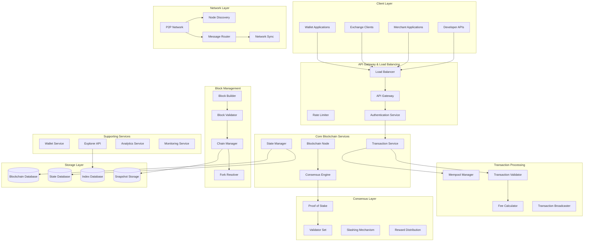
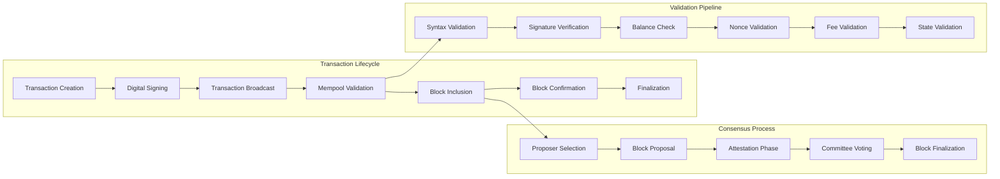
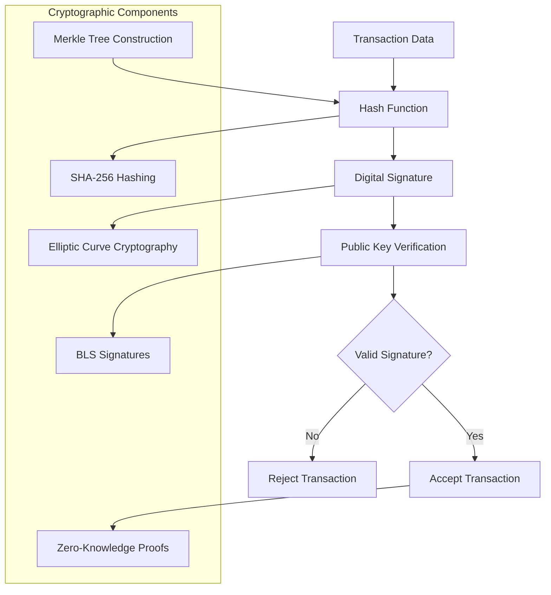
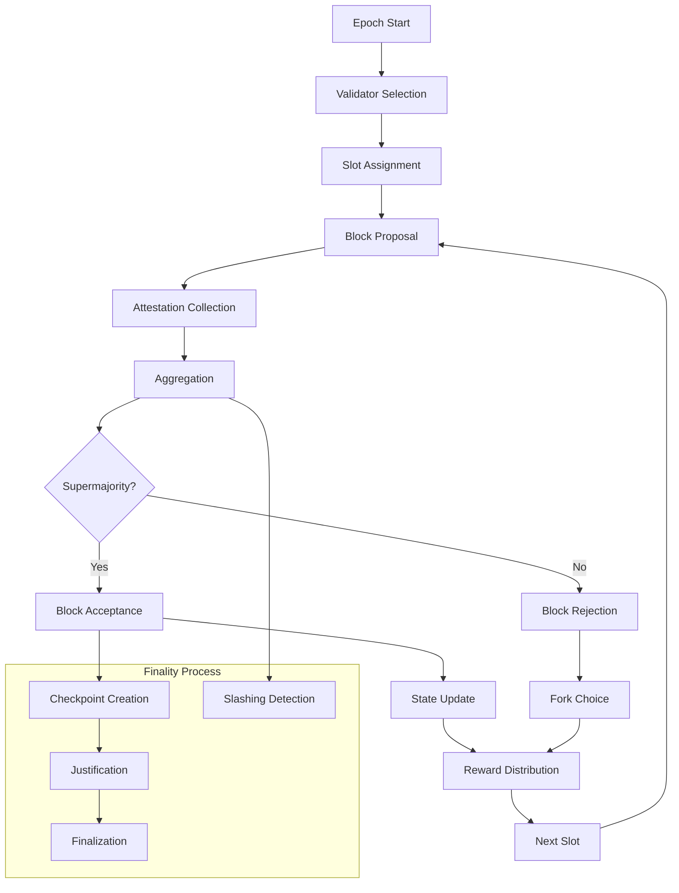
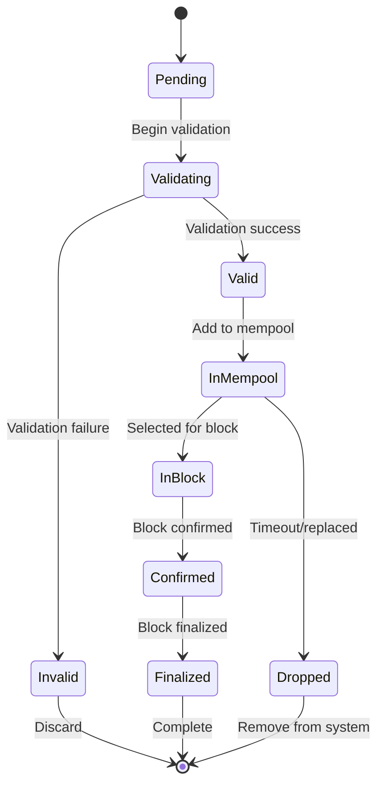
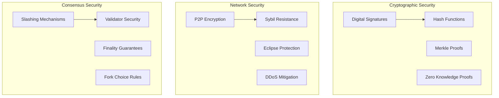

# Blockchain/Cryptocurrency Transaction System


## 📋 Table of Contents

- [Blockchain/Cryptocurrency Transaction System](#blockchaincryptocurrency-transaction-system)
  - [High-Level Design (HLD)](#high-level-design-hld)
    - [System Architecture Overview](#system-architecture-overview)
    - [Transaction Flow Architecture](#transaction-flow-architecture)
  - [Low-Level Design (LLD)](#low-level-design-lld)
    - [Cryptographic Architecture](#cryptographic-architecture)
    - [Consensus Mechanism Flow](#consensus-mechanism-flow)
    - [State Management Architecture](#state-management-architecture)
  - [Core Algorithms](#core-algorithms)
    - [1. Transaction Validation Algorithm](#1-transaction-validation-algorithm)
    - [2. Proof of Stake Consensus Algorithm](#2-proof-of-stake-consensus-algorithm)
    - [3. Mempool Management Algorithm](#3-mempool-management-algorithm)
    - [4. Block Creation and Validation Algorithm](#4-block-creation-and-validation-algorithm)
    - [5. Wallet and Address Management Algorithm](#5-wallet-and-address-management-algorithm)
  - [Performance Optimizations](#performance-optimizations)
    - [Blockchain Performance Strategies](#blockchain-performance-strategies)
    - [Consensus Optimization](#consensus-optimization)
  - [Security Considerations](#security-considerations)
    - [Blockchain Security Framework](#blockchain-security-framework)
  - [Testing Strategy](#testing-strategy)
    - [Blockchain Testing Framework](#blockchain-testing-framework)
    - [Network Simulation](#network-simulation)
  - [Trade-offs and Considerations](#trade-offs-and-considerations)
    - [Scalability vs Decentralization](#scalability-vs-decentralization)
    - [Security vs Performance](#security-vs-performance)
    - [Usability vs Technical Complexity](#usability-vs-technical-complexity)

---

## High-Level Design (HLD)

[⬆️ Back to Top](#--table-of-contents)

---


### System Architecture Overview

[⬆️ Back to Top](#--table-of-contents)

---




### Transaction Flow Architecture

[⬆️ Back to Top](#--table-of-contents)

---




## Low-Level Design (LLD)

[⬆️ Back to Top](#--table-of-contents)

---


### Cryptographic Architecture

[⬆️ Back to Top](#--table-of-contents)

---




### Consensus Mechanism Flow

[⬆️ Back to Top](#--table-of-contents)

---




### State Management Architecture

[⬆️ Back to Top](#--table-of-contents)

---




## Core Algorithms

[⬆️ Back to Top](#--table-of-contents)

---


### 1. Transaction Validation Algorithm

[⬆️ Back to Top](#--table-of-contents)

---


**Purpose**: Validate transactions for correctness, authenticity, and compliance with protocol rules before including them in blocks.

**Multi-Stage Transaction Validation**:
```
TransactionValidationConfig = {
  validation: {
    syntaxCheck: true,
    signatureVerification: true,
    balanceVerification: true,
    nonceValidation: true,
    feeValidation: true,
    gasLimitCheck: true
  },
  
  limits: {
    maxTransactionSize: 32768,      # 32KB max transaction size
    maxGasLimit: 30000000,          # 30M gas units
    minGasPrice: 1000000000,        # 1 Gwei minimum
    maxNonceGap: 1000               # Maximum nonce gap allowed
  },
  
  security: {
    replayProtection: true,
    maxValueTransfer: 1000000000000000000000,  # 1000 ETH equivalent
    addressBlacklist: true,
    timeWindow: 3600000             # 1 hour transaction validity
  }
}

class TransactionValidator:
  constructor(config):
    this.config = config
    this.cryptoEngine = new CryptographicEngine()
    this.stateManager = new StateManager()
    this.gasCalculator = new GasCalculator()
    this.addressValidator = new AddressValidator()
  
  function validateTransaction(transaction, currentState):
    validationResult = {
      isValid: false,
      errors: [],
      warnings: [],
      gasEstimate: 0,
      priority: 0
    }
    
    # Stage 1: Syntax and Format Validation
    syntaxResult = this.validateSyntax(transaction)
    if not syntaxResult.isValid:
      validationResult.errors.push(...syntaxResult.errors)
      return validationResult
    
    # Stage 2: Cryptographic Validation
    cryptoResult = this.validateCryptography(transaction)
    if not cryptoResult.isValid:
      validationResult.errors.push(...cryptoResult.errors)
      return validationResult
    
    # Stage 3: State-based Validation
    stateResult = this.validateAgainstState(transaction, currentState)
    if not stateResult.isValid:
      validationResult.errors.push(...stateResult.errors)
      return validationResult
    
    # Stage 4: Economic Validation
    economicResult = this.validateEconomics(transaction, currentState)
    if not economicResult.isValid:
      validationResult.errors.push(...economicResult.errors)
      return validationResult
    
    # Stage 5: Policy and Compliance Validation
    policyResult = this.validatePolicies(transaction)
    if not policyResult.isValid:
      validationResult.errors.push(...policyResult.errors)
      return validationResult
    
    # Calculate transaction priority
    validationResult.priority = this.calculateTransactionPriority(transaction, economicResult)
    validationResult.gasEstimate = economicResult.gasEstimate
    validationResult.isValid = true
    
    return validationResult
  
  function validateSyntax(transaction):
    errors = []
    
    # Check transaction structure
    if not transaction.from or not this.isValidAddress(transaction.from):
      errors.push({ type: 'invalid_from_address', field: 'from' })
    
    if not transaction.to or not this.isValidAddress(transaction.to):
      errors.push({ type: 'invalid_to_address', field: 'to' })
    
    # Check value format
    if not this.isValidAmount(transaction.value):
      errors.push({ type: 'invalid_value', field: 'value' })
    
    # Check nonce format
    if not Number.isInteger(transaction.nonce) or transaction.nonce < 0:
      errors.push({ type: 'invalid_nonce', field: 'nonce' })
    
    # Check gas parameters
    if not Number.isInteger(transaction.gasLimit) or transaction.gasLimit <= 0:
      errors.push({ type: 'invalid_gas_limit', field: 'gasLimit' })
    
    if not Number.isInteger(transaction.gasPrice) or transaction.gasPrice < this.config.limits.minGasPrice:
      errors.push({ type: 'invalid_gas_price', field: 'gasPrice' })
    
    # Check transaction size
    transactionSize = this.calculateTransactionSize(transaction)
    if transactionSize > this.config.limits.maxTransactionSize:
      errors.push({ type: 'transaction_too_large', size: transactionSize })
    
    # Check data field if present
    if transaction.data and not this.isValidHexData(transaction.data):
      errors.push({ type: 'invalid_data_format', field: 'data' })
    
    return {
      isValid: errors.length === 0,
      errors: errors
    }
  
  function validateCryptography(transaction):
    errors = []
    
    # Verify digital signature
    signatureValid = this.cryptoEngine.verifySignature(
      transaction.signature,
      transaction.from,
      this.getTransactionHash(transaction)
    )
    
    if not signatureValid:
      errors.push({ type: 'invalid_signature', field: 'signature' })
    
    # Check for replay protection
    if this.config.security.replayProtection:
      replayCheck = this.checkReplayProtection(transaction)
      if not replayCheck.isValid:
        errors.push({ type: 'replay_attack_detected', details: replayCheck.reason })
    
    # Verify transaction hash integrity
    expectedHash = this.calculateTransactionHash(transaction)
    if transaction.hash !== expectedHash:
      errors.push({ type: 'hash_mismatch', expected: expectedHash, actual: transaction.hash })
    
    return {
      isValid: errors.length === 0,
      errors: errors
    }
  
  function validateAgainstState(transaction, currentState):
    errors = []
    warnings = []
    
    # Get account state
    fromAccount = currentState.getAccount(transaction.from)
    
    if not fromAccount:
      errors.push({ type: 'account_not_found', address: transaction.from })
      return { isValid: false, errors: errors }
    
    # Check account balance
    totalCost = transaction.value + (transaction.gasLimit * transaction.gasPrice)
    if fromAccount.balance < totalCost:
      errors.push({
        type: 'insufficient_balance',
        required: totalCost,
        available: fromAccount.balance
      })
    
    # Check nonce sequence
    expectedNonce = fromAccount.nonce
    if transaction.nonce < expectedNonce:
      errors.push({
        type: 'nonce_too_low',
        expected: expectedNonce,
        provided: transaction.nonce
      })
    else if transaction.nonce > expectedNonce + this.config.limits.maxNonceGap:
      errors.push({
        type: 'nonce_gap_too_large',
        expected: expectedNonce,
        provided: transaction.nonce
      })
    else if transaction.nonce > expectedNonce:
      warnings.push({
        type: 'future_nonce',
        gap: transaction.nonce - expectedNonce
      })
    
    # Check recipient account if creating contract
    if transaction.to === null: # Contract creation
      contractAddress = this.calculateContractAddress(transaction.from, transaction.nonce)
      if currentState.getAccount(contractAddress):
        errors.push({
          type: 'contract_address_collision',
          address: contractAddress
        })
    
    return {
      isValid: errors.length === 0,
      errors: errors,
      warnings: warnings
    }
  
  function validateEconomics(transaction, currentState):
    errors = []
    warnings = []
    
    # Estimate gas usage
    gasEstimate = this.gasCalculator.estimateGas(transaction, currentState)
    
    # Check if gas limit is sufficient
    if transaction.gasLimit < gasEstimate.minimumGas:
      errors.push({
        type: 'gas_limit_too_low',
        provided: transaction.gasLimit,
        required: gasEstimate.minimumGas
      })
    
    # Check for excessive gas limit
    if transaction.gasLimit > this.config.limits.maxGasLimit:
      errors.push({
        type: 'gas_limit_too_high',
        provided: transaction.gasLimit,
        maximum: this.config.limits.maxGasLimit
      })
    
    # Check gas price against network conditions
    networkGasPrice = this.getNetworkGasPrice()
    if transaction.gasPrice < networkGasPrice.minimum:
      warnings.push({
        type: 'low_gas_price',
        provided: transaction.gasPrice,
        recommended: networkGasPrice.recommended
      })
    
    # Check for value transfer limits
    if transaction.value > this.config.security.maxValueTransfer:
      errors.push({
        type: 'value_transfer_too_large',
        amount: transaction.value,
        limit: this.config.security.maxValueTransfer
      })
    
    return {
      isValid: errors.length === 0,
      errors: errors,
      warnings: warnings,
      gasEstimate: gasEstimate
    }
  
  function calculateTransactionPriority(transaction, economicResult):
    # Base priority from gas price
    gasPricePriority = transaction.gasPrice / this.getNetworkGasPrice().average
    
    # Account age bonus
    accountAge = this.getAccountAge(transaction.from)
    agePriority = Math.min(accountAge / (365 * 24 * 60 * 60 * 1000), 1) # Normalize to years
    
    # Transaction size penalty
    sizePenalty = Math.max(0, 1 - (this.calculateTransactionSize(transaction) / 1000))
    
    # Nonce proximity bonus (prefer sequential nonces)
    nonceBonus = transaction.nonce === this.getExpectedNonce(transaction.from) ? 1.2 : 1.0
    
    # Combine factors
    priority = gasPricePriority * 0.6 + agePriority * 0.2 + sizePenalty * 0.1 + (nonceBonus - 1) * 0.1
    
    return Math.max(0, Math.min(10, priority)) # Clamp between 0 and 10
```

### 2. Proof of Stake Consensus Algorithm

[⬆️ Back to Top](#--table-of-contents)

---


**Purpose**: Achieve network consensus using validator staking and economic incentives while maintaining security and decentralization.

**Validator Selection and Consensus Protocol**:
```
ProofOfStakeConfig = {
  consensus: {
    slotsPerEpoch: 32,
    slotDuration: 12000,            # 12 seconds per slot
    epochDuration: 384000,          # 6.4 minutes per epoch
    finalityDelay: 2                # 2 epochs for finality
  },
  
  validators: {
    minStake: 32000000000000000000,  # 32 ETH equivalent
    maxValidators: 1000000,          # 1M max validators
    shufflePeriod: 256,              # Reshuffle every 256 epochs
    inactivityPenalty: 0.01          # 1% penalty for inactivity
  },
  
  rewards: {
    baseReward: 64,                  # Base reward per validator
    attestationReward: 0.125,        # Attestation reward multiplier
    proposerReward: 0.125,           # Block proposer reward multiplier
    maxReward: 1000000000000000      # 0.001 ETH max reward
  },
  
  slashing: {
    minSlashingPenalty: 1000000000000000000,  # 1 ETH minimum
    whistleblowerReward: 0.125,               # 12.5% of slashed amount
    correlationPenalty: true                  # Increase penalty for correlated failures
  }
}

class ProofOfStakeConsensus:
  constructor(config):
    this.config = config
    this.validatorRegistry = new ValidatorRegistry()
    this.epochManager = new EpochManager()
    this.slashingDetector = new SlashingDetector()
    this.rewardCalculator = new RewardCalculator()
  
  function processEpoch(epochNumber, validators, attestations):
    epochStart = Date.now()
    
    # Shuffle validators for the new epoch
    epochValidators = this.shuffleValidators(validators, epochNumber)
    
    # Assign validators to slots
    slotAssignments = this.assignValidatorsToSlots(epochValidators, epochNumber)
    
    # Process each slot in the epoch
    epochResults = {
      epochNumber: epochNumber,
      proposedBlocks: [],
      attestations: [],
      slashings: [],
      rewards: [],
      penalties: []
    }
    
    for slotNumber in range(this.config.consensus.slotsPerEpoch):
      slotResult = this.processSlot(epochNumber, slotNumber, slotAssignments[slotNumber])
      
      epochResults.proposedBlocks.push(...slotResult.proposedBlocks)
      epochResults.attestations.push(...slotResult.attestations)
      epochResults.slashings.push(...slotResult.slashings)
    
    # Calculate rewards and penalties for the epoch
    rewardResults = this.calculateEpochRewards(epochNumber, epochResults, epochValidators)
    epochResults.rewards = rewardResults.rewards
    epochResults.penalties = rewardResults.penalties
    
    # Update validator balances
    this.updateValidatorBalances(epochResults)
    
    # Check for finality
    finalityResult = this.checkFinality(epochNumber, epochResults)
    epochResults.finalized = finalityResult.finalized
    epochResults.justifiedCheckpoints = finalityResult.justifiedCheckpoints
    
    return epochResults
  
  function shuffleValidators(validators, epochNumber):
    # Use deterministic shuffling based on epoch number and randomness beacon
    randomnessSeed = this.getRandomnessSeed(epochNumber)
    
    # Create list of active validator indices
    activeValidators = validators
      .filter(v => v.status === 'active')
      .map(v => v.index)
    
    # Shuffle using Fisher-Yates algorithm with deterministic randomness
    shuffledValidators = [...activeValidators]
    
    for i in range(shuffledValidators.length - 1, 0, -1):
      # Generate deterministic random index
      randomIndex = this.deterministicRandom(randomnessSeed, i) % (i + 1)
      
      # Swap elements
      [shuffledValidators[i], shuffledValidators[randomIndex]] = 
        [shuffledValidators[randomIndex], shuffledValidators[i]]
    
    return shuffledValidators
  
  function assignValidatorsToSlots(shuffledValidators, epochNumber):
    slotAssignments = new Array(this.config.consensus.slotsPerEpoch)
    validatorsPerSlot = Math.floor(shuffledValidators.length / this.config.consensus.slotsPerEpoch)
    
    for slotIndex in range(this.config.consensus.slotsPerEpoch):
      startIndex = slotIndex * validatorsPerSlot
      endIndex = startIndex + validatorsPerSlot
      
      # Assign validators to this slot
      slotValidators = shuffledValidators.slice(startIndex, endIndex)
      
      # Select block proposer (first validator in the slot)
      proposer = slotValidators[0]
      
      # Remaining validators are attesters
      attesters = slotValidators.slice(1)
      
      slotAssignments[slotIndex] = {
        slotNumber: slotIndex,
        proposer: proposer,
        attesters: attesters,
        committee: slotValidators
      }
    
    return slotAssignments
  
  function processSlot(epochNumber, slotNumber, slotAssignment):
    slotStart = Date.now()
    slotResults = {
      proposedBlocks: [],
      attestations: [],
      slashings: []
    }
    
    # Block proposal phase
    if slotAssignment.proposer:
      proposalResult = this.processBlockProposal(epochNumber, slotNumber, slotAssignment.proposer)
      if proposalResult.block:
        slotResults.proposedBlocks.push(proposalResult.block)
    
    # Attestation phase
    attestationResults = this.processAttestations(epochNumber, slotNumber, slotAssignment.attesters)
    slotResults.attestations.push(...attestationResults.attestations)
    
    # Slashing detection
    slashingResults = this.detectSlashing(slotResults.attestations, slotResults.proposedBlocks)
    slotResults.slashings.push(...slashingResults)
    
    return slotResults
  
  function processBlockProposal(epochNumber, slotNumber, proposerIndex):
    proposer = this.validatorRegistry.getValidator(proposerIndex)
    
    if not proposer or not this.isValidatorEligible(proposer, epochNumber, slotNumber):
      return { block: null, reason: 'ineligible_proposer' }
    
    # Create block proposal
    block = this.createBlock(epochNumber, slotNumber, proposer)
    
    # Validate block proposal
    validationResult = this.validateBlockProposal(block, proposer)
    
    if not validationResult.isValid:
      return { block: null, reason: 'invalid_proposal', errors: validationResult.errors }
    
    # Sign the block
    blockSignature = this.signBlock(block, proposer.privateKey)
    block.signature = blockSignature
    
    # Broadcast block to network
    this.broadcastBlock(block)
    
    return { block: block, proposer: proposer }
  
  function processAttestations(epochNumber, slotNumber, attesterIndices):
    attestations = []
    
    for attesterIndex in attesterIndices:
      attester = this.validatorRegistry.getValidator(attesterIndex)
      
      if not attester or not this.isValidatorEligible(attester, epochNumber, slotNumber):
        continue
      
      # Create attestation
      attestation = this.createAttestation(epochNumber, slotNumber, attester)
      
      # Validate attestation
      if this.validateAttestation(attestation, attester):
        attestations.push(attestation)
    
    return { attestations: attestations }
  
  function calculateEpochRewards(epochNumber, epochResults, epochValidators):
    rewards = []
    penalties = []
    
    # Calculate base rewards
    totalActiveBalance = this.getTotalActiveBalance(epochValidators)
    baseRewardPerValidator = this.calculateBaseReward(totalActiveBalance)
    
    for validatorIndex in epochValidators:
      validator = this.validatorRegistry.getValidator(validatorIndex)
      validatorReward = 0
      validatorPenalty = 0
      
      # Attestation rewards
      attestationReward = this.calculateAttestationReward(
        validator, epochResults.attestations, baseRewardPerValidator
      )
      validatorReward += attestationReward
      
      # Block proposal rewards
      proposalReward = this.calculateProposalReward(
        validator, epochResults.proposedBlocks, baseRewardPerValidator
      )
      validatorReward += proposalReward
      
      # Inactivity penalties
      if this.isValidatorInactive(validator, epochResults):
        inactivityPenalty = this.calculateInactivityPenalty(validator, epochNumber)
        validatorPenalty += inactivityPenalty
      
      # Slashing penalties
      slashingPenalty = this.calculateSlashingPenalty(validator, epochResults.slashings)
      validatorPenalty += slashingPenalty
      
      if validatorReward > 0:
        rewards.push({
          validatorIndex: validatorIndex,
          amount: validatorReward,
          type: 'epoch_reward'
        })
      
      if validatorPenalty > 0:
        penalties.push({
          validatorIndex: validatorIndex,
          amount: validatorPenalty,
          type: 'epoch_penalty'
        })
    
    return { rewards: rewards, penalties: penalties }
  
  function detectSlashing(attestations, proposedBlocks):
    slashingEvents = []
    
    # Double voting detection
    doubleVotes = this.detectDoubleVoting(attestations)
    slashingEvents.push(...doubleVotes)
    
    # Surround voting detection
    surroundVotes = this.detectSurroundVoting(attestations)
    slashingEvents.push(...surroundVotes)
    
    # Double block proposal detection
    doubleProposals = this.detectDoubleProposal(proposedBlocks)
    slashingEvents.push(...doubleProposals)
    
    return slashingEvents
  
  function detectDoubleVoting(attestations):
    # Group attestations by validator and target epoch
    attestationsByValidator = new Map()
    
    for attestation in attestations:
      validatorIndex = attestation.validatorIndex
      targetEpoch = attestation.data.target.epoch
      
      key = `${validatorIndex}:${targetEpoch}`
      
      if not attestationsByValidator.has(key):
        attestationsByValidator.set(key, [])
      
      attestationsByValidator.get(key).push(attestation)
    
    # Check for double voting
    doubleVotes = []
    
    for [key, validatorAttestations] in attestationsByValidator:
      if validatorAttestations.length > 1:
        # Multiple attestations for same target epoch - potential double vote
        for i in range(validatorAttestations.length):
          for j in range(i + 1, validatorAttestations.length):
            att1 = validatorAttestations[i]
            att2 = validatorAttestations[j]
            
            # Check if attestations are conflicting
            if this.areAttestationsConflicting(att1, att2):
              doubleVotes.push({
                type: 'double_vote',
                validatorIndex: att1.validatorIndex,
                attestation1: att1,
                attestation2: att2,
                penalty: this.calculateSlashingAmount(att1.validatorIndex, 'double_vote')
              })
    
    return doubleVotes
  
  function checkFinality(epochNumber, epochResults):
    # Check if we have supermajority attestations for justification
    totalActiveValidators = this.getTotalActiveValidators()
    requiredAttestations = Math.floor(totalActiveValidators * 2 / 3) + 1
    
    # Count attestations for current and previous epochs
    currentEpochAttestations = epochResults.attestations.filter(
      att => att.data.target.epoch === epochNumber
    ).length
    
    previousEpochAttestations = epochResults.attestations.filter(
      att => att.data.target.epoch === epochNumber - 1
    ).length
    
    # Check justification conditions
    justifiedCheckpoints = []
    
    if currentEpochAttestations >= requiredAttestations:
      justifiedCheckpoints.push({
        epoch: epochNumber,
        attestations: currentEpochAttestations,
        justified: true
      })
    
    if previousEpochAttestations >= requiredAttestations:
      justifiedCheckpoints.push({
        epoch: epochNumber - 1,
        attestations: previousEpochAttestations,
        justified: true
      })
    
    # Check finality (requires 2 consecutive justified epochs)
    finalized = false
    if justifiedCheckpoints.length >= 2:
      consecutive = justifiedCheckpoints.some((checkpoint, index) => 
        index > 0 && checkpoint.epoch === justifiedCheckpoints[index - 1].epoch + 1
      )
      
      if consecutive:
        finalized = true
    
    return {
      finalized: finalized,
      justifiedCheckpoints: justifiedCheckpoints,
      attestationCounts: {
        current: currentEpochAttestations,
        previous: previousEpochAttestations,
        required: requiredAttestations
      }
    }
```

### 3. Mempool Management Algorithm

[⬆️ Back to Top](#--table-of-contents)

---


**Purpose**: Efficiently manage pending transactions in memory, prioritizing them for block inclusion based on fees and other factors.

**Priority-based Transaction Pool**:
```
MempoolConfig = {
  limits: {
    maxTransactions: 100000,        # Maximum transactions in mempool
    maxPerAccount: 1000,            # Maximum transactions per account
    maxMemoryUsage: 1073741824,     # 1GB maximum memory usage
    maxTransactionAge: 3600000      # 1 hour maximum age
  },
  
  prioritization: {
    gasPrice: { weight: 0.6 },
    accountAge: { weight: 0.2 },
    transactionSize: { weight: 0.1 },
    nonce: { weight: 0.1 }
  },
  
  eviction: {
    strategy: 'lowest_priority_first',
    batchSize: 1000,
    triggerThreshold: 0.9           # Trigger eviction at 90% capacity
  }
}

class MempoolManager:
  constructor(config):
    this.config = config
    this.transactions = new Map()           # txHash -> transaction
    this.accountTransactions = new Map()    # account -> transaction list
    this.priorityQueue = new PriorityQueue()
    this.nonceQueues = new Map()           # account -> nonce-ordered queue
    this.memoryUsage = 0
  
  function addTransaction(transaction):
    # Validate transaction format
    if not this.isValidTransaction(transaction):
      return { success: false, reason: 'invalid_transaction' }
    
    # Check if transaction already exists
    if this.transactions.has(transaction.hash):
      return { success: false, reason: 'duplicate_transaction' }
    
    # Check mempool capacity
    if this.isMemPoolFull():
      evictionResult = this.evictLowPriorityTransactions()
      if not evictionResult.success:
        return { success: false, reason: 'mempool_full' }
    
    # Check account transaction limits
    accountTxCount = this.getAccountTransactionCount(transaction.from)
    if accountTxCount >= this.config.limits.maxPerAccount:
      return { success: false, reason: 'account_limit_exceeded' }
    
    # Calculate transaction priority
    priority = this.calculateTransactionPriority(transaction)
    
    # Check if transaction can replace existing transaction
    replacementResult = this.checkTransactionReplacement(transaction)
    if replacementResult.shouldReplace:
      this.removeTransaction(replacementResult.replacedTransaction.hash)
    
    # Add transaction to mempool
    this.insertTransaction(transaction, priority)
    
    # Update account nonce queue
    this.updateAccountNonceQueue(transaction)
    
    # Notify listeners
    this.notifyTransactionAdded(transaction, priority)
    
    return {
      success: true,
      transactionHash: transaction.hash,
      priority: priority,
      estimatedInclusionTime: this.estimateInclusionTime(priority)
    }
  
  function calculateTransactionPriority(transaction):
    priorityScore = 0
    
    # Gas price component (normalized)
    gasPriceScore = this.normalizeGasPrice(transaction.gasPrice)
    priorityScore += gasPriceScore * this.config.prioritization.gasPrice.weight
    
    # Account age component
    accountAge = this.getAccountAge(transaction.from)
    ageScore = Math.min(accountAge / (365 * 24 * 60 * 60 * 1000), 1) # Normalize to years
    priorityScore += ageScore * this.config.prioritization.accountAge.weight
    
    # Transaction size component (smaller is better)
    transactionSize = this.calculateTransactionSize(transaction)
    sizeScore = Math.max(0, 1 - (transactionSize / 10000)) # Normalize by 10KB
    priorityScore += sizeScore * this.config.prioritization.transactionSize.weight
    
    # Nonce proximity component (sequential nonces preferred)
    expectedNonce = this.getExpectedNonce(transaction.from)
    nonceGap = Math.abs(transaction.nonce - expectedNonce)
    nonceScore = Math.max(0, 1 - (nonceGap / 100)) # Normalize by 100 nonce gap
    priorityScore += nonceScore * this.config.prioritization.nonce.weight
    
    return priorityScore
  
  function selectTransactionsForBlock(gasLimit, maxTransactions):
    selectedTransactions = []
    totalGasUsed = 0
    usedNonces = new Map() # account -> Set of used nonces
    
    # Create a copy of priority queue for selection
    candidateTransactions = this.priorityQueue.copy()
    
    while not candidateTransactions.isEmpty() and 
          selectedTransactions.length < maxTransactions and 
          totalGasUsed < gasLimit:
      
      # Get highest priority transaction
      candidate = candidateTransactions.dequeue()
      transaction = candidate.transaction
      
      # Check if transaction is still valid
      if not this.isTransactionValid(transaction):
        continue
      
      # Check nonce ordering
      if not this.canIncludeTransaction(transaction, usedNonces):
        continue
      
      # Check gas limit
      if totalGasUsed + transaction.gasLimit > gasLimit:
        continue
      
      # Add transaction to selection
      selectedTransactions.push(transaction)
      totalGasUsed += transaction.gasLimit
      
      # Update used nonces
      if not usedNonces.has(transaction.from):
        usedNonces.set(transaction.from, new Set())
      usedNonces.get(transaction.from).add(transaction.nonce)
    
    return {
      transactions: selectedTransactions,
      totalGasUsed: totalGasUsed,
      totalFees: this.calculateTotalFees(selectedTransactions)
    }
  
  function canIncludeTransaction(transaction, usedNonces):
    # Check if account has used nonces
    accountNonces = usedNonces.get(transaction.from)
    
    if not accountNonces:
      # First transaction from this account - check if nonce is next expected
      expectedNonce = this.getExpectedNonce(transaction.from)
      return transaction.nonce === expectedNonce
    
    # Check if nonce follows sequence
    maxUsedNonce = Math.max(...accountNonces)
    return transaction.nonce === maxUsedNonce + 1
  
  function evictLowPriorityTransactions():
    # Calculate how many transactions to evict
    currentCount = this.transactions.size
    targetCount = Math.floor(currentCount * 0.8) # Evict to 80% capacity
    evictionCount = currentCount - targetCount
    
    evictedTransactions = []
    
    # Evict oldest and lowest priority transactions first
    sortedTransactions = Array.from(this.transactions.values())
      .sort((a, b) => {
        # Sort by priority (ascending) then by age (descending)
        priorityDiff = a.priority - b.priority
        if priorityDiff !== 0:
          return priorityDiff
        
        return b.addedAt - a.addedAt
      })
    
    for i in range(Math.min(evictionCount, sortedTransactions.length)):
      transaction = sortedTransactions[i]
      this.removeTransaction(transaction.hash)
      evictedTransactions.push(transaction)
    
    # Notify about evictions
    this.notifyTransactionsEvicted(evictedTransactions)
    
    return {
      success: true,
      evictedCount: evictedTransactions.length,
      evictedTransactions: evictedTransactions
    }
  
  function updateAccountNonceQueue(transaction):
    account = transaction.from
    
    if not this.nonceQueues.has(account):
      this.nonceQueues.set(account, new SortedQueue('nonce'))
    
    nonceQueue = this.nonceQueues.get(account)
    nonceQueue.enqueue(transaction)
    
    # Remove executed transactions
    this.cleanupNonceQueue(account)
  
  function cleanupNonceQueue(account):
    nonceQueue = this.nonceQueues.get(account)
    expectedNonce = this.getExpectedNonce(account)
    
    # Remove transactions with nonces that are too old
    while not nonceQueue.isEmpty():
      frontTransaction = nonceQueue.peek()
      
      if frontTransaction.nonce < expectedNonce:
        # Transaction nonce is too old - remove it
        removedTx = nonceQueue.dequeue()
        this.removeTransaction(removedTx.hash)
      else:
        break
  
  function getExecutableTransactions(account):
    nonceQueue = this.nonceQueues.get(account)
    
    if not nonceQueue or nonceQueue.isEmpty():
      return []
    
    executableTransactions = []
    expectedNonce = this.getExpectedNonce(account)
    
    # Get consecutive transactions starting from expected nonce
    queueCopy = nonceQueue.copy()
    
    while not queueCopy.isEmpty():
      transaction = queueCopy.dequeue()
      
      if transaction.nonce === expectedNonce:
        executableTransactions.push(transaction)
        expectedNonce++
      else:
        break # Gap in nonce sequence
    
    return executableTransactions
  
  function removeTransaction(transactionHash):
    transaction = this.transactions.get(transactionHash)
    
    if not transaction:
      return false
    
    # Remove from main storage
    this.transactions.delete(transactionHash)
    
    # Remove from priority queue
    this.priorityQueue.remove(transaction)
    
    # Remove from account transactions
    accountTxs = this.accountTransactions.get(transaction.from)
    if accountTxs:
      accountTxs.delete(transactionHash)
      if accountTxs.size === 0:
        this.accountTransactions.delete(transaction.from)
    
    # Remove from nonce queue
    nonceQueue = this.nonceQueues.get(transaction.from)
    if nonceQueue:
      nonceQueue.remove(transaction)
    
    # Update memory usage
    this.memoryUsage -= this.calculateTransactionMemoryUsage(transaction)
    
    return true
  
  function checkTransactionReplacement(newTransaction):
    # Check if there's an existing transaction with same nonce from same account
    accountTxs = this.accountTransactions.get(newTransaction.from)
    
    if not accountTxs:
      return { shouldReplace: false }
    
    for existingTxHash of accountTxs:
      existingTx = this.transactions.get(existingTxHash)
      
      if existingTx.nonce === newTransaction.nonce:
        # Same nonce - check if new transaction has higher gas price
        gasPriceIncrease = (newTransaction.gasPrice - existingTx.gasPrice) / existingTx.gasPrice
        
        if gasPriceIncrease >= 0.1: # Require 10% increase
          return {
            shouldReplace: true,
            replacedTransaction: existingTx,
            gasPriceIncrease: gasPriceIncrease
          }
        else:
          return {
            shouldReplace: false,
            reason: 'insufficient_gas_price_increase',
            required: existingTx.gasPrice * 1.1,
            provided: newTransaction.gasPrice
          }
    
    return { shouldReplace: false }
```

### 4. Block Creation and Validation Algorithm

[⬆️ Back to Top](#--table-of-contents)

---


**Purpose**: Create valid blocks with optimal transaction selection and validate incoming blocks for consensus compliance.

**Optimized Block Assembly**:
```
BlockConfig = {
  block: {
    maxGasLimit: 30000000,          # 30M gas units per block
    maxTransactions: 1000,          # Maximum transactions per block
    maxBlockSize: 2097152,          # 2MB maximum block size
    targetBlockTime: 12000          # 12 seconds target block time
  },
  
  validation: {
    strictValidation: true,
    allowEmptyBlocks: false,
    requireMinimumFees: true,
    validateStateRoot: true
  },
  
  optimization: {
    preferHighFeeTx: true,
    balanceGasUsage: true,
    optimizeInclusion: true,
    parallelize: true
  }
}

class BlockManager:
  constructor(config):
    this.config = config
    this.transactionPool = new TransactionPool()
    this.stateManager = new StateManager()
    this.gasCalculator = new GasCalculator()
    this.merkleTree = new MerkleTree()
  
  function createBlock(previousBlockHash, validatorIndex, timestamp):
    blockStart = Date.now()
    
    # Get current state root
    currentStateRoot = this.stateManager.getCurrentStateRoot()
    
    # Select transactions for inclusion
    transactionSelection = this.selectOptimalTransactions()
    
    # Execute transactions and update state
    executionResult = this.executeTransactions(transactionSelection.transactions)
    
    # Calculate new state root
    newStateRoot = this.stateManager.calculateStateRoot(executionResult.stateChanges)
    
    # Create transaction Merkle tree
    transactionMerkleRoot = this.merkleTree.calculateRoot(
      transactionSelection.transactions.map(tx => tx.hash)
    )
    
    # Create receipt Merkle tree
    receiptMerkleRoot = this.merkleTree.calculateRoot(
      executionResult.receipts.map(receipt => receipt.hash)
    )
    
    # Build block header
    blockHeader = {
      parentHash: previousBlockHash,
      stateRoot: newStateRoot,
      transactionRoot: transactionMerkleRoot,
      receiptRoot: receiptMerkleRoot,
      number: this.getNextBlockNumber(),
      timestamp: timestamp,
      gasUsed: executionResult.totalGasUsed,
      gasLimit: this.config.block.maxGasLimit,
      validatorIndex: validatorIndex,
      difficulty: 0, # Not used in PoS
      extraData: this.createExtraData()
    }
    
    # Calculate block hash
    blockHash = this.calculateBlockHash(blockHeader)
    blockHeader.hash = blockHash
    
    # Assemble complete block
    block = {
      header: blockHeader,
      transactions: transactionSelection.transactions,
      receipts: executionResult.receipts,
      stateChanges: executionResult.stateChanges,
      
      # Metadata
      createdAt: blockStart,
      processingTime: Date.now() - blockStart,
      transactionCount: transactionSelection.transactions.length,
      totalFees: executionResult.totalFees
    }
    
    return block
  
  function selectOptimalTransactions():
    # Get available transactions from mempool
    availableTransactions = this.transactionPool.getPendingTransactions()
    
    # Group transactions by account and sort by nonce
    accountTransactions = this.groupTransactionsByAccount(availableTransactions)
    
    # Select transactions using greedy algorithm with optimizations
    selectedTransactions = []
    totalGasUsed = 0
    totalFees = 0
    
    # Create priority queue based on effective gas price
    transactionQueue = new PriorityQueue()
    
    # Add first transaction from each account to queue
    for [account, txList] in accountTransactions:
      if txList.length > 0:
        firstTx = txList[0]
        effectiveGasPrice = this.calculateEffectiveGasPrice(firstTx)
        transactionQueue.enqueue(firstTx, effectiveGasPrice)
    
    while not transactionQueue.isEmpty() and 
          selectedTransactions.length < this.config.block.maxTransactions and
          totalGasUsed < this.config.block.maxGasLimit:
      
      # Get highest priority transaction
      transaction = transactionQueue.dequeue()
      
      # Check if transaction fits in remaining gas limit
      if totalGasUsed + transaction.gasLimit > this.config.block.maxGasLimit:
        continue
      
      # Validate transaction is still executable
      if not this.isTransactionExecutable(transaction):
        continue
      
      # Add transaction to selection
      selectedTransactions.push(transaction)
      totalGasUsed += transaction.gasLimit
      totalFees += transaction.gasPrice * transaction.gasLimit
      
      # Add next transaction from same account if available
      nextTx = this.getNextTransactionFromAccount(transaction.from, transaction.nonce + 1)
      if nextTx:
        effectiveGasPrice = this.calculateEffectiveGasPrice(nextTx)
        transactionQueue.enqueue(nextTx, effectiveGasPrice)
    
    return {
      transactions: selectedTransactions,
      totalGasUsed: totalGasUsed,
      totalFees: totalFees,
      selectionTime: Date.now() - selectionStart
    }
  
  function executeTransactions(transactions):
    executionStart = Date.now()
    receipts = []
    stateChanges = []
    totalGasUsed = 0
    totalFees = 0
    
    # Create execution context
    executionContext = {
      blockNumber: this.getNextBlockNumber(),
      timestamp: Date.now(),
      gasLimit: this.config.block.maxGasLimit,
      coinbase: this.getCoinbaseAddress()
    }
    
    # Execute transactions sequentially
    for i, transaction in transactions.entries():
      try:
        # Execute single transaction
        txResult = this.executeTransaction(transaction, executionContext)
        
        # Create transaction receipt
        receipt = {
          transactionHash: transaction.hash,
          transactionIndex: i,
          blockHash: null, # Will be set when block is created
          blockNumber: executionContext.blockNumber,
          from: transaction.from,
          to: transaction.to,
          gasUsed: txResult.gasUsed,
          cumulativeGasUsed: totalGasUsed + txResult.gasUsed,
          contractAddress: txResult.contractAddress,
          logs: txResult.logs,
          status: txResult.success ? 1 : 0,
          effectiveGasPrice: transaction.gasPrice
        }
        
        receipts.push(receipt)
        stateChanges.push(...txResult.stateChanges)
        totalGasUsed += txResult.gasUsed
        totalFees += txResult.gasUsed * transaction.gasPrice
        
        # Update execution context
        executionContext.gasUsed = totalGasUsed
        
      catch error:
        # Handle transaction execution error
        errorReceipt = this.createErrorReceipt(transaction, i, error)
        receipts.push(errorReceipt)
    
    return {
      receipts: receipts,
      stateChanges: stateChanges,
      totalGasUsed: totalGasUsed,
      totalFees: totalFees,
      executionTime: Date.now() - executionStart
    }
  
  function validateBlock(block, parentBlock):
    validationStart = Date.now()
    validationErrors = []
    
    # Validate block header
    headerValidation = this.validateBlockHeader(block.header, parentBlock)
    if not headerValidation.isValid:
      validationErrors.push(...headerValidation.errors)
    
    # Validate transaction list
    transactionValidation = this.validateTransactions(block.transactions)
    if not transactionValidation.isValid:
      validationErrors.push(...transactionValidation.errors)
    
    # Validate gas usage
    gasValidation = this.validateGasUsage(block)
    if not gasValidation.isValid:
      validationErrors.push(...gasValidation.errors)
    
    # Validate state root
    if this.config.validation.validateStateRoot:
      stateValidation = this.validateStateRoot(block)
      if not stateValidation.isValid:
        validationErrors.push(...stateValidation.errors)
    
    # Validate Merkle roots
    merkleValidation = this.validateMerkleRoots(block)
    if not merkleValidation.isValid:
      validationErrors.push(...merkleValidation.errors)
    
    # Validate consensus rules
    consensusValidation = this.validateConsensusRules(block, parentBlock)
    if not consensusValidation.isValid:
      validationErrors.push(...consensusValidation.errors)
    
    return {
      isValid: validationErrors.length === 0,
      errors: validationErrors,
      validationTime: Date.now() - validationStart
    }
  
  function validateBlockHeader(header, parentBlock):
    errors = []
    
    # Check parent hash
    if header.parentHash !== parentBlock.header.hash:
      errors.push({
        type: 'invalid_parent_hash',
        expected: parentBlock.header.hash,
        actual: header.parentHash
      })
    
    # Check block number
    expectedBlockNumber = parentBlock.header.number + 1
    if header.number !== expectedBlockNumber:
      errors.push({
        type: 'invalid_block_number',
        expected: expectedBlockNumber,
        actual: header.number
      })
    
    # Check timestamp
    if header.timestamp <= parentBlock.header.timestamp:
      errors.push({
        type: 'invalid_timestamp',
        parentTimestamp: parentBlock.header.timestamp,
        blockTimestamp: header.timestamp
      })
    
    # Check gas limit
    if header.gasLimit > this.config.block.maxGasLimit:
      errors.push({
        type: 'gas_limit_too_high',
        limit: header.gasLimit,
        maximum: this.config.block.maxGasLimit
      })
    
    # Check gas used
    if header.gasUsed > header.gasLimit:
      errors.push({
        type: 'gas_used_exceeds_limit',
        gasUsed: header.gasUsed,
        gasLimit: header.gasLimit
      })
    
    return {
      isValid: errors.length === 0,
      errors: errors
    }
  
  function validateTransactions(transactions):
    errors = []
    accountNonces = new Map()
    
    for i, transaction in transactions.entries():
      # Validate individual transaction
      txValidation = this.validateTransaction(transaction)
      if not txValidation.isValid:
        errors.push({
          type: 'invalid_transaction',
          transactionIndex: i,
          transactionHash: transaction.hash,
          errors: txValidation.errors
        })
        continue
      
      # Check nonce ordering
      account = transaction.from
      expectedNonce = accountNonces.get(account) || this.getAccountNonce(account)
      
      if transaction.nonce !== expectedNonce:
        errors.push({
          type: 'invalid_nonce_order',
          transactionIndex: i,
          account: account,
          expected: expectedNonce,
          actual: transaction.nonce
        })
      
      # Update expected nonce for account
      accountNonces.set(account, transaction.nonce + 1)
    
    return {
      isValid: errors.length === 0,
      errors: errors
    }
```

### 5. Wallet and Address Management Algorithm

[⬆️ Back to Top](#--table-of-contents)

---


**Purpose**: Manage cryptographic wallets, generate addresses, and handle secure key operations for blockchain interactions.

**Hierarchical Deterministic Wallet System**:
```
WalletConfig = {
  keyDerivation: {
    standard: 'bip44',              # BIP44 for hierarchical deterministic wallets
    purpose: 44,                    # BIP44 purpose
    coinType: 60,                   # Ethereum coin type
    maxAccounts: 1000,              # Maximum accounts per wallet
    maxAddresses: 10000             # Maximum addresses per account
  },
  
  security: {
    encryptionAlgorithm: 'aes-256-gcm',
    keyStrengthBits: 256,
    scryptParams: { N: 262144, r: 8, p: 1 },
    mnemonicStrength: 256           # 24-word mnemonic
  },
  
  addressGeneration: {
    checksumValidation: true,
    addressFormat: 'eip55',         # EIP-55 checksum addresses
    compressionEnabled: true
  }
}

class WalletManager:
  constructor(config):
    this.config = config
    this.hdWallets = new Map()              # walletId -> HD wallet
    this.addresses = new Map()              # address -> wallet info
    this.cryptoEngine = new CryptographicEngine()
    this.keyDerivation = new KeyDerivation()
  
  function createWallet(passphrase = '', options = {}):
    walletCreationStart = Date.now()
    
    # Generate entropy for mnemonic
    entropy = this.cryptoEngine.generateEntropy(this.config.security.mnemonicStrength)
    
    # Generate mnemonic phrase
    mnemonic = this.generateMnemonic(entropy)
    
    # Derive master seed from mnemonic
    masterSeed = this.deriveMasterSeed(mnemonic, passphrase)
    
    # Generate master key pair
    masterKeyPair = this.generateMasterKeyPair(masterSeed)
    
    # Create wallet structure
    wallet = {
      id: this.generateWalletId(),
      mnemonic: mnemonic,
      masterSeed: masterSeed,
      masterPublicKey: masterKeyPair.publicKey,
      masterPrivateKey: masterKeyPair.privateKey,
      
      # Derivation info
      derivationPath: `m/44'/${this.config.keyDerivation.coinType}'`,
      accounts: new Map(),
      
      # Metadata
      createdAt: Date.now(),
      lastUsed: Date.now(),
      isEncrypted: false,
      version: '1.0'
    }
    
    # Encrypt wallet if passphrase provided
    if passphrase:
      encryptedWallet = this.encryptWallet(wallet, passphrase)
      wallet.encryptedData = encryptedWallet.encryptedData
      wallet.encryptionParams = encryptedWallet.encryptionParams
      wallet.isEncrypted = true
      
      # Clear sensitive data from memory
      wallet.masterSeed = null
      wallet.masterPrivateKey = null
    
    # Store wallet
    this.hdWallets.set(wallet.id, wallet)
    
    # Generate default account
    defaultAccount = this.createAccount(wallet.id, 0)
    
    return {
      walletId: wallet.id,
      mnemonic: mnemonic,
      defaultAccount: defaultAccount,
      creationTime: Date.now() - walletCreationStart
    }
  
  function createAccount(walletId, accountIndex):
    wallet = this.hdWallets.get(walletId)
    
    if not wallet:
      throw new Error('Wallet not found')
    
    if accountIndex >= this.config.keyDerivation.maxAccounts:
      throw new Error('Account index exceeds maximum')
    
    # Check if account already exists
    if wallet.accounts.has(accountIndex):
      return wallet.accounts.get(accountIndex)
    
    # Derive account key
    accountPath = `${wallet.derivationPath}/${accountIndex}'`
    accountKey = this.keyDerivation.deriveKey(wallet.masterPrivateKey, accountPath)
    
    # Create account structure
    account = {
      index: accountIndex,
      derivationPath: accountPath,
      publicKey: accountKey.publicKey,
      privateKey: accountKey.privateKey,
      addresses: new Map(),
      
      # Metadata
      createdAt: Date.now(),
      lastUsed: Date.now(),
      transactionCount: 0,
      balance: 0
    }
    
    # Generate default address (index 0)
    defaultAddress = this.generateAddress(walletId, accountIndex, 0, 0)
    
    # Store account
    wallet.accounts.set(accountIndex, account)
    
    return {
      accountIndex: accountIndex,
      derivationPath: accountPath,
      defaultAddress: defaultAddress.address,
      publicKey: account.publicKey
    }
  
  function generateAddress(walletId, accountIndex, change, addressIndex):
    wallet = this.hdWallets.get(walletId)
    account = wallet.accounts.get(accountIndex)
    
    if not account:
      throw new Error('Account not found')
    
    if addressIndex >= this.config.keyDerivation.maxAddresses:
      throw new Error('Address index exceeds maximum')
    
    # Build full derivation path
    fullPath = `${account.derivationPath}/${change}/${addressIndex}`
    
    # Derive address key
    addressKey = this.keyDerivation.deriveKey(wallet.masterPrivateKey, fullPath)
    
    # Generate address from public key
    address = this.generateAddressFromPublicKey(addressKey.publicKey)
    
    # Apply EIP-55 checksum
    checksumAddress = this.applyChecksumEncoding(address)
    
    # Create address info
    addressInfo = {
      address: checksumAddress,
      derivationPath: fullPath,
      publicKey: addressKey.publicKey,
      privateKey: addressKey.privateKey,
      accountIndex: accountIndex,
      change: change,
      addressIndex: addressIndex,
      
      # Metadata
      createdAt: Date.now(),
      lastUsed: Date.now(),
      transactionCount: 0,
      balance: 0
    }
    
    # Store address mapping
    this.addresses.set(checksumAddress, {
      walletId: walletId,
      accountIndex: accountIndex,
      addressInfo: addressInfo
    })
    
    # Store in account
    account.addresses.set(addressIndex, addressInfo)
    
    return addressInfo
  
  function signTransaction(address, transactionData, passphrase = ''):
    # Find address info
    addressMapping = this.addresses.get(address)
    
    if not addressMapping:
      throw new Error('Address not found in wallet')
    
    wallet = this.hdWallets.get(addressMapping.walletId)
    
    # Decrypt wallet if encrypted
    if wallet.isEncrypted:
      if not passphrase:
        throw new Error('Passphrase required for encrypted wallet')
      
      decryptedWallet = this.decryptWallet(wallet, passphrase)
      wallet = decryptedWallet
    
    # Get private key for address
    addressInfo = addressMapping.addressInfo
    privateKey = addressInfo.privateKey
    
    # Create transaction hash
    transactionHash = this.createTransactionHash(transactionData)
    
    # Sign transaction
    signature = this.cryptoEngine.signMessage(transactionHash, privateKey)
    
    # Create signed transaction
    signedTransaction = {
      ...transactionData,
      hash: transactionHash,
      signature: signature,
      from: address,
      
      # Signature components
      r: signature.r,
      s: signature.s,
      v: signature.v
    }
    
    # Update address usage
    addressInfo.lastUsed = Date.now()
    addressInfo.transactionCount++
    
    return signedTransaction
  
  function generateMnemonic(entropy):
    # Convert entropy to mnemonic using BIP39
    entropyBits = entropy.length * 8
    checksumBits = entropyBits / 32
    
    # Calculate checksum
    entropyHash = this.cryptoEngine.sha256(entropy)
    checksum = this.extractBits(entropyHash, 0, checksumBits)
    
    # Combine entropy and checksum
    combinedBits = this.combineBits(entropy, checksum)
    
    # Convert to mnemonic words
    wordList = this.getBip39WordList()
    mnemonicWords = []
    
    for i in range(0, combinedBits.length, 11):
      # Extract 11-bit segments
      wordIndex = this.extractBits(combinedBits, i, 11)
      mnemonicWords.push(wordList[wordIndex])
    
    return mnemonicWords.join(' ')
  
  function deriveMasterSeed(mnemonic, passphrase):
    # Use PBKDF2 to derive seed from mnemonic
    salt = 'mnemonic' + passphrase
    
    masterSeed = this.cryptoEngine.pbkdf2(
      mnemonic,
      salt,
      2048,  # iterations
      64     # output length in bytes
    )
    
    return masterSeed
  
  function generateMasterKeyPair(masterSeed):
    # Use HMAC-SHA512 to generate master key
    hmacKey = 'ed25519 seed'
    hmacOutput = this.cryptoEngine.hmacSha512(hmacKey, masterSeed)
    
    # Split output into private key and chain code
    privateKey = hmacOutput.slice(0, 32)
    chainCode = hmacOutput.slice(32, 64)
    
    # Generate public key from private key
    publicKey = this.cryptoEngine.generatePublicKey(privateKey)
    
    return {
      privateKey: privateKey,
      publicKey: publicKey,
      chainCode: chainCode
    }
  
  function generateAddressFromPublicKey(publicKey):
    # Use Keccak-256 hash of public key
    publicKeyHash = this.cryptoEngine.keccak256(publicKey)
    
    # Take last 20 bytes as address
    address = publicKeyHash.slice(-20)
    
    # Convert to hex string
    addressHex = '0x' + address.toString('hex')
    
    return addressHex
  
  function applyChecksumEncoding(address):
    # Remove '0x' prefix
    addressLower = address.slice(2).toLowerCase()
    
    # Hash the lowercase address
    addressHash = this.cryptoEngine.keccak256(addressLower)
    
    # Apply checksum
    checksumAddress = '0x'
    
    for i in range(addressLower.length):
      char = addressLower[i]
      hashByte = parseInt(addressHash[Math.floor(i / 2)], 16)
      
      if i % 2 === 0:
        # Even index - check upper 4 bits
        shouldCapitalize = (hashByte & 0xf0) >= 0x80
      else:
        # Odd index - check lower 4 bits
        shouldCapitalize = (hashByte & 0x0f) >= 0x08
      
      checksumAddress += shouldCapitalize ? char.toUpperCase() : char
    
    return checksumAddress
  
  function encryptWallet(wallet, passphrase):
    # Generate salt
    salt = this.cryptoEngine.generateRandomBytes(32)
    
    # Derive encryption key using scrypt
    encryptionKey = this.cryptoEngine.scrypt(
      passphrase,
      salt,
      this.config.security.scryptParams.N,
      this.config.security.scryptParams.r,
      this.config.security.scryptParams.p,
      32 # 256 bits
    )
    
    # Serialize sensitive wallet data
    sensitiveData = JSON.stringify({
      masterSeed: wallet.masterSeed,
      masterPrivateKey: wallet.masterPrivateKey,
      accounts: wallet.accounts
    })
    
    # Generate initialization vector
    iv = this.cryptoEngine.generateRandomBytes(12)
    
    # Encrypt using AES-256-GCM
    encryptionResult = this.cryptoEngine.aesGcmEncrypt(sensitiveData, encryptionKey, iv)
    
    return {
      encryptedData: encryptionResult.ciphertext,
      encryptionParams: {
        algorithm: this.config.security.encryptionAlgorithm,
        salt: salt,
        iv: iv,
        authTag: encryptionResult.authTag,
        scryptParams: this.config.security.scryptParams
      }
    }
  
  function validateAddress(address):
    # Check format
    if not address.startsWith('0x') or address.length !== 42:
      return { isValid: false, reason: 'invalid_format' }
    
    # Check hex characters
    hexPart = address.slice(2)
    if not /^[0-9a-fA-F]+$/.test(hexPart):
      return { isValid: false, reason: 'invalid_hex_characters' }
    
    # Validate checksum if mixed case
    if this.isMixedCase(hexPart):
      expectedChecksum = this.applyChecksumEncoding(address.toLowerCase())
      if address !== expectedChecksum:
        return { isValid: false, reason: 'invalid_checksum' }
    
    return { isValid: true }
  
  function getWalletBalance(walletId):
    wallet = this.hdWallets.get(walletId)
    
    if not wallet:
      throw new Error('Wallet not found')
    
    totalBalance = 0
    accountBalances = []
    
    for [accountIndex, account] in wallet.accounts:
      accountBalance = 0
      
      for [addressIndex, addressInfo] in account.addresses:
        # Get current balance for address
        currentBalance = this.getAddressBalance(addressInfo.address)
        addressInfo.balance = currentBalance
        accountBalance += currentBalance
      
      account.balance = accountBalance
      totalBalance += accountBalance
      
      accountBalances.push({
        accountIndex: accountIndex,
        balance: accountBalance,
        addressCount: account.addresses.size
      })
    
    return {
      walletId: walletId,
      totalBalance: totalBalance,
      accountBalances: accountBalances,
      lastUpdated: Date.now()
    }
```

## Performance Optimizations

[⬆️ Back to Top](#--table-of-contents)

---


### Blockchain Performance Strategies

[⬆️ Back to Top](#--table-of-contents)

---


**Network and Database Optimization**:
```
PerformanceOptimization = {
  networking: {
    connectionPooling: true,
    messageCompression: true,
    batchedBroadcasting: true,
    intelligentPeering: true
  },
  
  storage: {
    levelDbOptimization: true,
    statePruning: true,
    snapshotGeneration: true,
    parallelValidation: true
  },
  
  caching: {
    blockCache: { size: 1000, ttl: 3600000 },
    stateCache: { size: 10000, ttl: 1800000 },
    transactionCache: { size: 50000, ttl: 600000 }
  }
}
```

### Consensus Optimization

[⬆️ Back to Top](#--table-of-contents)

---


**Validator Performance Enhancement**:
- Parallel attestation processing
- Optimized signature aggregation
- Efficient committee selection
- Fast finality detection

## Security Considerations

[⬆️ Back to Top](#--table-of-contents)

---


### Blockchain Security Framework

[⬆️ Back to Top](#--table-of-contents)

---




## Testing Strategy

[⬆️ Back to Top](#--table-of-contents)

---


### Blockchain Testing Framework

[⬆️ Back to Top](#--table-of-contents)

---


**Comprehensive Testing Approach**:
- Unit testing for individual components
- Integration testing for service interactions
- Load testing for transaction throughput
- Security testing for vulnerability assessment
- Consensus testing for Byzantine fault tolerance

### Network Simulation

[⬆️ Back to Top](#--table-of-contents)

---


**Distributed Testing Environment**:
- Multi-node test networks
- Network partition simulation
- Latency and failure injection
- Validator behavior simulation

## Trade-offs and Considerations

[⬆️ Back to Top](#--table-of-contents)

---


### Scalability vs Decentralization

[⬆️ Back to Top](#--table-of-contents)

---

- **Transaction throughput**: Speed vs network distribution
- **Block size**: Capacity vs propagation time
- **Validator count**: Security vs coordination complexity
- **State storage**: Accessibility vs storage requirements

### Security vs Performance

[⬆️ Back to Top](#--table-of-contents)

---

- **Cryptographic operations**: Security strength vs computational cost
- **Consensus mechanisms**: Byzantine fault tolerance vs speed
- **Transaction validation**: Thoroughness vs processing time
- **Network protocols**: Security vs efficiency

### Usability vs Technical Complexity

[⬆️ Back to Top](#--table-of-contents)

---

- **Wallet interfaces**: User-friendliness vs technical control
- **Transaction fees**: Predictability vs market efficiency
- **Block confirmations**: Speed vs finality guarantees
- **Smart contract complexity**: Functionality vs gas costs

This blockchain/cryptocurrency transaction system provides a comprehensive foundation for distributed ledger technology with features like proof-of-stake consensus, transaction validation, mempool management, block creation, and wallet management while maintaining high security, performance, and decentralization standards. 