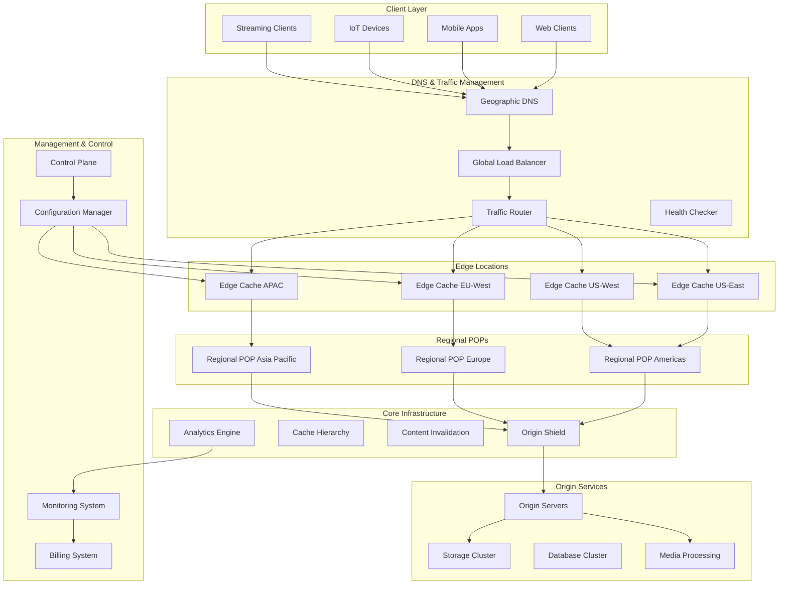
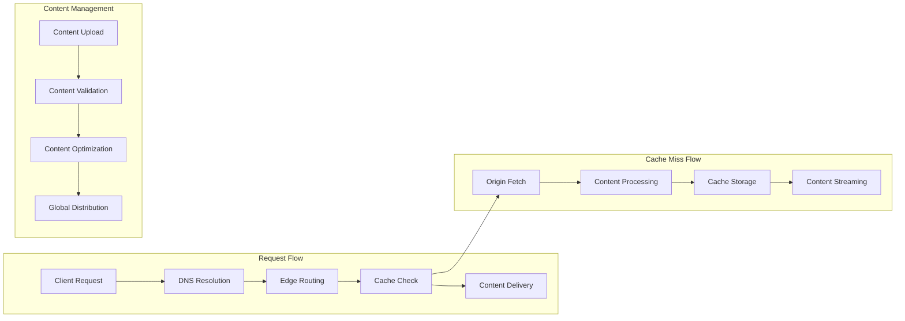
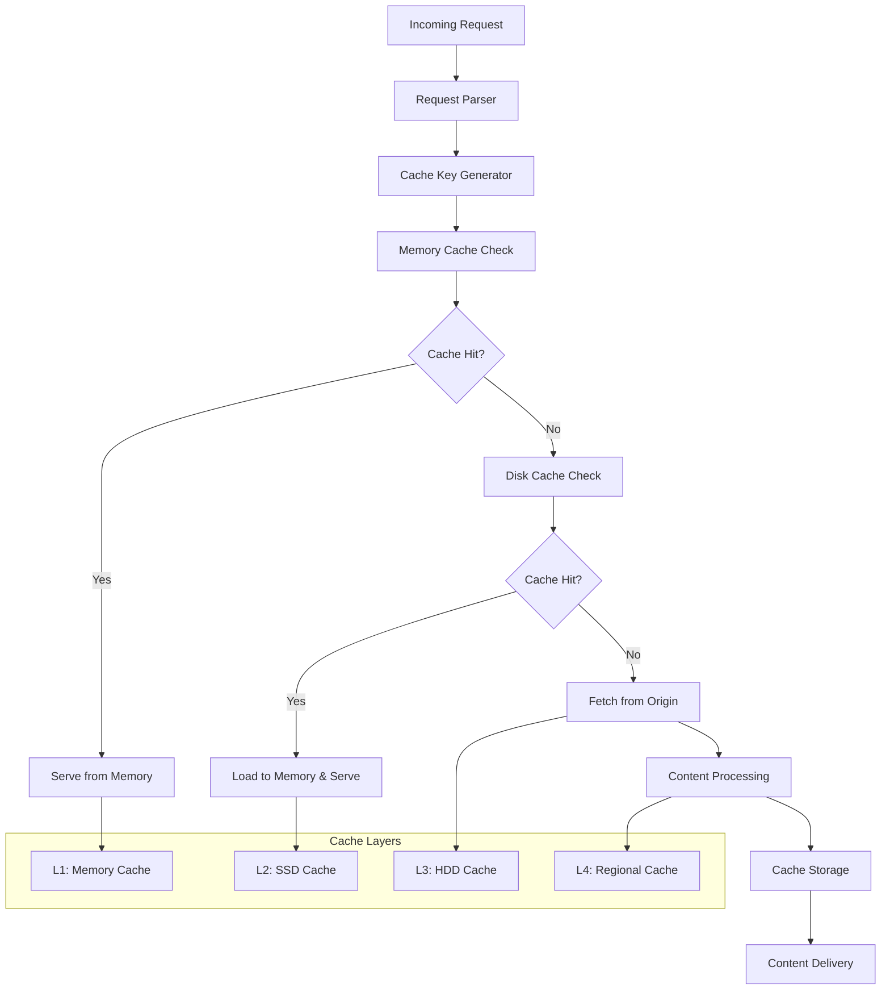
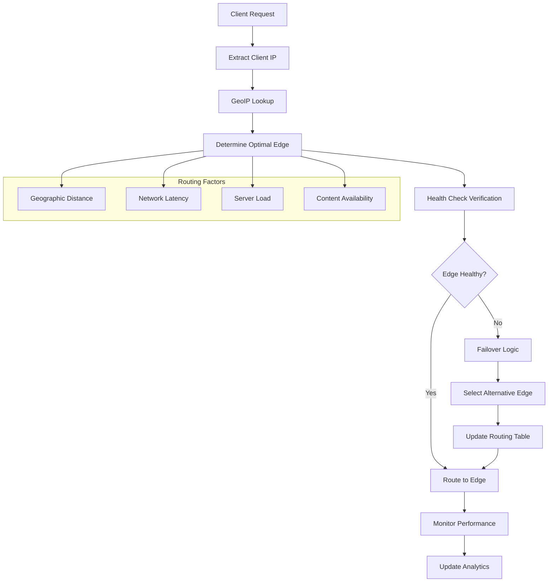
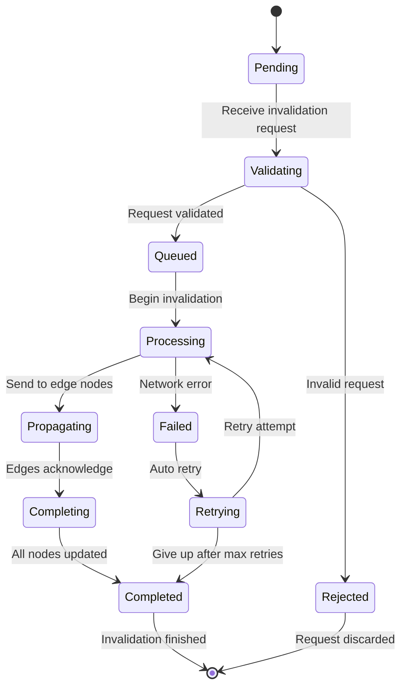
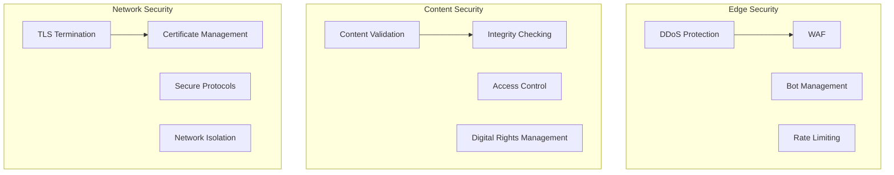

# Content Delivery Network (CDN) System


## 📋 Table of Contents

- [Content Delivery Network (CDN) System](#content-delivery-network-cdn-system)
  - [High-Level Design (HLD)](#high-level-design-hld)
    - [System Architecture Overview](#system-architecture-overview)
    - [Content Delivery Flow](#content-delivery-flow)
  - [Low-Level Design (LLD)](#low-level-design-lld)
    - [Cache Architecture](#cache-architecture)
    - [Geographic Routing Algorithm](#geographic-routing-algorithm)
    - [Content Invalidation Flow](#content-invalidation-flow)
  - [Core Algorithms](#core-algorithms)
    - [1. Intelligent Content Caching Algorithm](#1-intelligent-content-caching-algorithm)
    - [2. Global Traffic Routing Algorithm](#2-global-traffic-routing-algorithm)
    - [3. Content Optimization Algorithm](#3-content-optimization-algorithm)
    - [4. Content Invalidation Algorithm](#4-content-invalidation-algorithm)
    - [5. Performance Analytics Algorithm](#5-performance-analytics-algorithm)
  - [Performance Optimizations](#performance-optimizations)
    - [CDN Performance Strategies](#cdn-performance-strategies)
    - [Global Infrastructure Optimization](#global-infrastructure-optimization)
  - [Security Considerations](#security-considerations)
    - [CDN Security Framework](#cdn-security-framework)
  - [Testing Strategy](#testing-strategy)
    - [CDN Testing Framework](#cdn-testing-framework)
    - [Load Testing](#load-testing)
  - [Trade-offs and Considerations](#trade-offs-and-considerations)
    - [Performance vs Cost](#performance-vs-cost)
    - [Consistency vs Availability](#consistency-vs-availability)
    - [Security vs Performance](#security-vs-performance)

---

## High-Level Design (HLD)

[⬆️ Back to Top](#-table-of-contents)

---


### System Architecture Overview

[⬆️ Back to Top](#-table-of-contents)

---




### Content Delivery Flow

[⬆️ Back to Top](#-table-of-contents)

---




## Low-Level Design (LLD)

[⬆️ Back to Top](#-table-of-contents)

---


### Cache Architecture

[⬆️ Back to Top](#-table-of-contents)

---




### Geographic Routing Algorithm

[⬆️ Back to Top](#-table-of-contents)

---




### Content Invalidation Flow

[⬆️ Back to Top](#-table-of-contents)

---




## Core Algorithms

[⬆️ Back to Top](#-table-of-contents)

---


### 1. Intelligent Content Caching Algorithm

[⬆️ Back to Top](#-table-of-contents)

---


**Purpose**: Optimize cache hit rates by predicting content popularity and managing cache eviction based on multiple factors including geographic demand patterns.

**Multi-Factor Cache Management**:
```
CacheConfig = {
  caching: {
    levels: {
      memory: { size: '32GB', ttl: 3600000 },      # 1 hour
      ssd: { size: '1TB', ttl: 86400000 },         # 24 hours  
      hdd: { size: '10TB', ttl: 604800000 }        # 7 days
    },
    
    evictionPolicy: 'adaptive_lru',                # 'lru', 'lfu', 'adaptive_lru'
    prefetchingEnabled: true,
    compressionEnabled: true,
    hotContentThreshold: 100                        # Requests per hour
  },
  
  prediction: {
    popularityWindow: 3600000,                     # 1 hour prediction window
    trendingThreshold: 5.0,                        # 5x increase in requests
    seasonalityDetection: true,
    geographicWeighting: true
  },
  
  optimization: {
    bandwidthThrottling: true,
    adaptiveQuality: true,
    contentCompression: true,
    imageOptimization: true
  }
}

class IntelligentCacheManager:
  constructor(config):
    this.config = config
    this.memoryCache = new MemoryCache(config.caching.levels.memory)
    this.ssdCache = new SSDCache(config.caching.levels.ssd)
    this.hddCache = new HDDCache(config.caching.levels.hdd)
    this.popularityPredictor = new PopularityPredictor()
    this.geoAnalyzer = new GeographicAnalyzer()
  
  function handleRequest(requestInfo):
    cacheKey = this.generateCacheKey(requestInfo)
    
    # Check cache hierarchy
    cacheResult = this.checkCacheHierarchy(cacheKey, requestInfo)
    
    if cacheResult.hit:
      # Update access patterns
      this.updateAccessPattern(cacheKey, requestInfo)
      return this.serveCachedContent(cacheResult)
    else:
      # Fetch from origin and cache
      return this.fetchAndCache(requestInfo, cacheKey)
  
  function checkCacheHierarchy(cacheKey, requestInfo):
    # Level 1: Memory Cache
    memoryResult = this.memoryCache.get(cacheKey)
    if memoryResult:
      return {
        hit: true,
        level: 'memory',
        content: memoryResult.content,
        metadata: memoryResult.metadata,
        latency: 1 # ~1ms
      }
    
    # Level 2: SSD Cache
    ssdResult = this.ssdCache.get(cacheKey)
    if ssdResult:
      # Promote to memory cache if frequently accessed
      if this.shouldPromoteToMemory(cacheKey, requestInfo):
        this.memoryCache.set(cacheKey, ssdResult.content, ssdResult.metadata)
      
      return {
        hit: true,
        level: 'ssd',
        content: ssdResult.content,
        metadata: ssdResult.metadata,
        latency: 10 # ~10ms
      }
    
    # Level 3: HDD Cache
    hddResult = this.hddCache.get(cacheKey)
    if hddResult:
      # Promote to SSD cache if warranted
      if this.shouldPromoteToSSD(cacheKey, requestInfo):
        this.ssdCache.set(cacheKey, hddResult.content, hddResult.metadata)
      
      return {
        hit: true,
        level: 'hdd',
        content: hddResult.content,
        metadata: hddResult.metadata,
        latency: 50 # ~50ms
      }
    
    return { hit: false }
  
  function fetchAndCache(requestInfo, cacheKey):
    fetchStart = Date.now()
    
    # Fetch from origin or upstream cache
    originResponse = this.fetchFromOrigin(requestInfo)
    
    if not originResponse.success:
      return this.handleOriginFailure(requestInfo)
    
    # Process and optimize content
    processedContent = this.processContent(originResponse.content, requestInfo)
    
    # Determine cache placement strategy
    cachePlacement = this.determineCachePlacement(cacheKey, processedContent, requestInfo)
    
    # Store in appropriate cache levels
    this.storeCachedContent(cacheKey, processedContent, cachePlacement)
    
    # Predict future demand and prefetch related content
    this.triggerPredictivePrefetch(cacheKey, requestInfo)
    
    return {
      content: processedContent.data,
      metadata: processedContent.metadata,
      cacheStatus: 'miss',
      origin: 'fetched',
      latency: Date.now() - fetchStart
    }
  
  function determineCachePlacement(cacheKey, content, requestInfo):
    placement = {
      memory: false,
      ssd: false,
      hdd: false,
      priority: 'normal'
    }
    
    # Analyze content characteristics
    contentSize = content.size
    contentType = content.type
    
    # Analyze request patterns
    accessPattern = this.getAccessPattern(cacheKey)
    geographicDemand = this.geoAnalyzer.getGeographicDemand(cacheKey)
    
    # Predict popularity
    popularityScore = this.popularityPredictor.predict(cacheKey, requestInfo, accessPattern)
    
    # Small, frequently accessed content goes to memory
    if contentSize < 10485760 and popularityScore > 0.8: # 10MB and high popularity
      placement.memory = true
      placement.priority = 'high'
    
    # Medium-sized popular content goes to SSD
    if contentSize < 104857600 and popularityScore > 0.5: # 100MB and medium popularity
      placement.ssd = true
      placement.priority = popularityScore > 0.7 ? 'high' : 'normal'
    
    # All content goes to HDD cache (cold storage)
    placement.hdd = true
    
    # Geographic considerations
    if geographicDemand.isRegionallyPopular:
      placement.priority = 'high'
      placement.replicationFactor = geographicDemand.regions.length
    
    return placement
  
  function storeCachedContent(cacheKey, content, placement):
    metadata = {
      cacheKey: cacheKey,
      size: content.size,
      type: content.type,
      cachedAt: Date.now(),
      lastAccessed: Date.now(),
      accessCount: 1,
      etag: content.etag,
      expires: content.expires
    }
    
    # Store in appropriate cache levels
    if placement.hdd:
      this.hddCache.set(cacheKey, content, metadata, placement.priority)
    
    if placement.ssd:
      this.ssdCache.set(cacheKey, content, metadata, placement.priority)
    
    if placement.memory:
      this.memoryCache.set(cacheKey, content, metadata, placement.priority)
    
    # Log cache storage event
    this.logCacheEvent('store', cacheKey, metadata, placement)
  
  function shouldPromoteToMemory(cacheKey, requestInfo):
    accessPattern = this.getAccessPattern(cacheKey)
    
    # Promote if content is frequently accessed
    if accessPattern.hourlyAccess > this.config.caching.hotContentThreshold:
      return true
    
    # Promote if content is trending
    if accessPattern.trendingScore > this.config.prediction.trendingThreshold:
      return true
    
    # Promote if geographically concentrated demand
    geoDemand = this.geoAnalyzer.getGeographicDemand(cacheKey)
    if geoDemand.concentration > 0.8:
      return true
    
    return false
  
  function triggerPredictivePrefetch(cacheKey, requestInfo):
    # Analyze related content that might be requested
    relatedContent = this.identifyRelatedContent(cacheKey, requestInfo)
    
    for relatedItem in relatedContent:
      prefetchProbability = this.calculatePrefetchProbability(relatedItem, requestInfo)
      
      if prefetchProbability > 0.6: # 60% probability threshold
        this.schedulePrefetch(relatedItem, prefetchProbability)
  
  function calculatePrefetchProbability(contentItem, requestInfo):
    # Base probability from historical patterns
    baseProbability = this.getHistoricalPrefetchSuccess(contentItem.id)
    
    # User behavior patterns
    userBehaviorScore = this.analyzeUserBehavior(requestInfo.userAgent, requestInfo.clientIP)
    
    # Content similarity
    similarityScore = this.calculateContentSimilarity(contentItem, requestInfo.requestedContent)
    
    # Time-based patterns
    temporalScore = this.getTemporalPrefetchScore(contentItem.id, Date.now())
    
    # Weighted combination
    probability = (
      baseProbability * 0.4 +
      userBehaviorScore * 0.3 +
      similarityScore * 0.2 +
      temporalScore * 0.1
    )
    
    return Math.min(1, Math.max(0, probability))
```

### 2. Global Traffic Routing Algorithm

[⬆️ Back to Top](#-table-of-contents)

---


**Purpose**: Route client requests to optimal edge locations based on geographic proximity, server load, content availability, and network conditions.

**Anycast Routing with Load Balancing**:
```
RoutingConfig = {
  routing: {
    algorithm: 'weighted_round_robin',      # 'round_robin', 'least_connections', 'weighted_round_robin'
    healthCheckInterval: 30000,             # 30 seconds
    failoverThreshold: 3,                   # 3 consecutive failures
    latencyThreshold: 200,                  # 200ms maximum acceptable latency
    loadThreshold: 0.8                      # 80% load threshold
  },
  
  geographic: {
    regionPriority: true,
    continentFallback: true,
    crossOceanPenalty: 100,                 # Additional latency penalty for cross-ocean routing
    geoipAccuracy: 'city'                   # 'country', 'region', 'city'
  },
  
  optimization: {
    contentAwareRouting: true,
    networkConditionMonitoring: true,
    predictiveFailover: true,
    loadPrediction: true
  }
}

class GlobalTrafficRouter:
  constructor(config):
    this.config = config
    this.edgeLocations = new Map()
    this.geoipDatabase = new GeoIPDatabase()
    this.healthMonitor = new HealthMonitor()
    this.loadBalancer = new IntelligentLoadBalancer()
    this.networkMonitor = new NetworkConditionMonitor()
  
  function routeRequest(clientRequest):
    routingStart = Date.now()
    
    # Extract client information
    clientInfo = this.extractClientInfo(clientRequest)
    
    # Get available edge locations
    availableEdges = this.getAvailableEdgeLocations()
    
    # Score each edge location
    edgeScores = this.scoreEdgeLocations(availableEdges, clientInfo)
    
    # Select optimal edge
    selectedEdge = this.selectOptimalEdge(edgeScores, clientRequest)
    
    # Update routing metrics
    this.updateRoutingMetrics(selectedEdge, clientInfo, routingStart)
    
    return {
      edgeLocation: selectedEdge,
      routingDecision: this.getRoutingDecision(edgeScores, selectedEdge),
      estimatedLatency: selectedEdge.estimatedLatency,
      routingTime: Date.now() - routingStart
    }
  
  function extractClientInfo(clientRequest):
    clientIP = this.extractClientIP(clientRequest)
    geoLocation = this.geoipDatabase.lookup(clientIP)
    
    return {
      ip: clientIP,
      country: geoLocation.country,
      region: geoLocation.region,
      city: geoLocation.city,
      latitude: geoLocation.latitude,
      longitude: geoLocation.longitude,
      isp: geoLocation.isp,
      asn: geoLocation.asn,
      userAgent: clientRequest.headers['user-agent'],
      acceptEncoding: clientRequest.headers['accept-encoding'],
      requestedContent: this.parseRequestedContent(clientRequest)
    }
  
  function scoreEdgeLocations(edges, clientInfo):
    edgeScores = []
    
    for edge in edges:
      score = this.calculateEdgeScore(edge, clientInfo)
      edgeScores.push({
        edge: edge,
        score: score,
        factors: score.factors
      })
    
    # Sort by score (highest first)
    return edgeScores.sort((a, b) => b.score.total - a.score.total)
  
  function calculateEdgeScore(edge, clientInfo):
    factors = {}
    
    # Geographic distance score
    factors.geographic = this.calculateGeographicScore(edge, clientInfo)
    
    # Network latency score
    factors.latency = this.calculateLatencyScore(edge, clientInfo)
    
    # Server load score
    factors.load = this.calculateLoadScore(edge)
    
    # Content availability score
    factors.content = this.calculateContentAvailabilityScore(edge, clientInfo.requestedContent)
    
    # Network condition score
    factors.network = this.calculateNetworkScore(edge, clientInfo)
    
    # Health score
    factors.health = this.calculateHealthScore(edge)
    
    # Calculate weighted total score
    totalScore = (
      factors.geographic * 0.25 +
      factors.latency * 0.20 +
      factors.load * 0.20 +
      factors.content * 0.15 +
      factors.network * 0.10 +
      factors.health * 0.10
    )
    
    return {
      total: totalScore,
      factors: factors
    }
  
  function calculateGeographicScore(edge, clientInfo):
    # Calculate great circle distance
    distance = this.calculateDistance(
      clientInfo.latitude, clientInfo.longitude,
      edge.latitude, edge.longitude
    )
    
    # Base score inversely proportional to distance
    baseScore = Math.max(0, 1 - (distance / 20003931)) # Normalize by half Earth circumference
    
    # Regional bonus
    regionalBonus = 0
    if edge.country === clientInfo.country:
      regionalBonus = 0.3
    else if edge.continent === clientInfo.continent:
      regionalBonus = 0.1
    
    # Cross-ocean penalty
    crossOceanPenalty = 0
    if this.isCrossOceanRouting(edge, clientInfo):
      crossOceanPenalty = 0.2
    
    return Math.min(1, Math.max(0, baseScore + regionalBonus - crossOceanPenalty))
  
  function calculateLatencyScore(edge, clientInfo):
    # Get measured latency or estimate
    measuredLatency = this.networkMonitor.getLatency(edge.id, clientInfo.asn)
    
    if not measuredLatency:
      # Estimate latency based on distance and network path
      estimatedLatency = this.estimateLatency(edge, clientInfo)
      measuredLatency = estimatedLatency
    
    # Score based on latency threshold
    if measuredLatency <= 50:
      return 1.0 # Excellent latency
    else if measuredLatency <= 100:
      return 0.8 # Good latency
    else if measuredLatency <= this.config.routing.latencyThreshold:
      return 0.6 # Acceptable latency
    else:
      return 0.2 # Poor latency
  
  function calculateLoadScore(edge):
    currentLoad = edge.currentLoad
    
    # Score inversely proportional to load
    if currentLoad <= 0.5:
      return 1.0 # Low load
    else if currentLoad <= 0.7:
      return 0.8 # Medium load
    else if currentLoad <= this.config.routing.loadThreshold:
      return 0.5 # High load
    else:
      return 0.1 # Overloaded
  
  function calculateContentAvailabilityScore(edge, requestedContent):
    if not this.config.optimization.contentAwareRouting:
      return 1.0
    
    # Check if content is already cached at edge
    contentCached = edge.hasCachedContent(requestedContent.url)
    
    if contentCached:
      return 1.0 # Content available locally
    
    # Check cache hierarchy for content
    hierarchyScore = this.calculateHierarchyAvailability(edge, requestedContent)
    
    return hierarchyScore
  
  function selectOptimalEdge(edgeScores, clientRequest):
    if edgeScores.length === 0:
      throw new Error('No available edge locations')
    
    # Primary selection: highest scored edge
    primaryEdge = edgeScores[0]
    
    # Validate primary edge can handle request
    if this.canHandleRequest(primaryEdge.edge, clientRequest):
      return primaryEdge.edge
    
    # Fallback selection
    for i in range(1, edgeScores.length):
      candidateEdge = edgeScores[i]
      
      if this.canHandleRequest(candidateEdge.edge, clientRequest):
        return candidateEdge.edge
    
    # Last resort: any available edge
    throw new Error('No edge location can handle the request')
  
  function canHandleRequest(edge, clientRequest):
    # Check basic capacity
    if edge.currentLoad >= 0.95:
      return false
    
    # Check health status
    if not edge.healthy:
      return false
    
    # Check request size limits
    if clientRequest.contentSize > edge.maxRequestSize:
      return false
    
    # Check supported content types
    if not edge.supportedContentTypes.includes(clientRequest.contentType):
      return false
    
    return true
  
  function handleFailover(failedEdge, clientRequest):
    # Remove failed edge from available list temporarily
    this.markEdgeUnavailable(failedEdge.id)
    
    # Get alternative edges
    alternativeEdges = this.getAvailableEdgeLocations()
      .filter(edge => edge.id !== failedEdge.id)
    
    if alternativeEdges.length === 0:
      throw new Error('No alternative edge locations available')
    
    # Re-route to best alternative
    clientInfo = this.extractClientInfo(clientRequest)
    edgeScores = this.scoreEdgeLocations(alternativeEdges, clientInfo)
    
    selectedEdge = this.selectOptimalEdge(edgeScores, clientRequest)
    
    # Log failover event
    this.logFailoverEvent(failedEdge, selectedEdge, clientRequest)
    
    return selectedEdge
  
  function updateRoutingMetrics(selectedEdge, clientInfo, routingStart):
    routingMetrics = {
      edgeId: selectedEdge.id,
      clientCountry: clientInfo.country,
      clientRegion: clientInfo.region,
      routingTime: Date.now() - routingStart,
      estimatedLatency: selectedEdge.estimatedLatency,
      timestamp: Date.now()
    }
    
    # Update edge load
    selectedEdge.requestCount++
    selectedEdge.currentLoad = this.calculateCurrentLoad(selectedEdge)
    
    # Update geographic routing statistics
    this.updateGeographicStats(selectedEdge.id, clientInfo)
    
    # Store metrics for analysis
    this.storeRoutingMetrics(routingMetrics)
```

### 3. Content Optimization Algorithm

[⬆️ Back to Top](#-table-of-contents)

---


**Purpose**: Optimize content delivery through compression, format conversion, image optimization, and adaptive quality selection based on client capabilities and network conditions.

**Adaptive Content Optimization**:
```
OptimizationConfig = {
  compression: {
    algorithms: ['gzip', 'brotli', 'zstd'],
    qualityLevels: [1, 6, 9],              # Compression levels
    minSizeThreshold: 1024,                # 1KB minimum for compression
    contentTypes: ['text/*', 'application/json', 'application/javascript']
  },
  
  images: {
    formats: ['webp', 'avif', 'jpeg', 'png'],
    qualityLevels: [50, 70, 85, 95],
    resolutions: [480, 720, 1080, 1440, 2160],
    enableAdaptive: true
  },
  
  video: {
    codecs: ['av1', 'h265', 'h264'],
    bitrates: [500, 1000, 2000, 4000, 8000], # kbps
    resolutions: ['480p', '720p', '1080p', '4k'],
    enableABR: true                         # Adaptive bitrate streaming
  }
}

class ContentOptimizationEngine:
  constructor(config):
    this.config = config
    this.imageProcessor = new ImageProcessor()
    this.videoProcessor = new VideoProcessor()
    this.compressionEngine = new CompressionEngine()
    this.formatConverter = new FormatConverter()
    this.qualityAnalyzer = new QualityAnalyzer()
  
  function optimizeContent(content, clientInfo, networkConditions):
    optimizationStart = Date.now()
    
    # Analyze content characteristics
    contentAnalysis = this.analyzeContent(content)
    
    # Determine optimal transformations
    optimizations = this.planOptimizations(contentAnalysis, clientInfo, networkConditions)
    
    # Apply optimizations
    optimizedContent = this.applyOptimizations(content, optimizations)
    
    # Validate optimization results
    validationResult = this.validateOptimization(content, optimizedContent, optimizations)
    
    return {
      originalContent: content,
      optimizedContent: optimizedContent,
      optimizations: optimizations,
      metrics: {
        originalSize: content.size,
        optimizedSize: optimizedContent.size,
        compressionRatio: content.size / optimizedContent.size,
        optimizationTime: Date.now() - optimizationStart,
        qualityScore: validationResult.qualityScore
      }
    }
  
  function analyzeContent(content):
    analysis = {
      type: content.type,
      size: content.size,
      format: this.detectFormat(content),
      characteristics: {}
    }
    
    if content.type.startsWith('image/'):
      analysis.characteristics = this.analyzeImage(content)
    else if content.type.startsWith('video/'):
      analysis.characteristics = this.analyzeVideo(content)
    else if content.type.startsWith('text/') or content.type.includes('javascript') or content.type.includes('json'):
      analysis.characteristics = this.analyzeText(content)
    
    return analysis
  
  function planOptimizations(contentAnalysis, clientInfo, networkConditions):
    optimizations = []
    
    # Compression optimization
    compressionPlan = this.planCompression(contentAnalysis, clientInfo, networkConditions)
    if compressionPlan:
      optimizations.push(compressionPlan)
    
    # Format optimization
    formatPlan = this.planFormatConversion(contentAnalysis, clientInfo)
    if formatPlan:
      optimizations.push(formatPlan)
    
    # Quality optimization
    qualityPlan = this.planQualityOptimization(contentAnalysis, clientInfo, networkConditions)
    if qualityPlan:
      optimizations.push(qualityPlan)
    
    # Resolution optimization
    resolutionPlan = this.planResolutionOptimization(contentAnalysis, clientInfo, networkConditions)
    if resolutionPlan:
      optimizations.push(resolutionPlan)
    
    return optimizations
  
  function planCompression(contentAnalysis, clientInfo, networkConditions):
    # Skip compression for already compressed content
    if this.isCompressed(contentAnalysis.format):
      return null
    
    # Skip compression for small files
    if contentAnalysis.size < this.config.compression.minSizeThreshold:
      return null
    
    # Check if content type supports compression
    supportedType = this.config.compression.contentTypes.some(type => 
      contentAnalysis.type.match(new RegExp(type.replace('*', '.*')))
    )
    
    if not supportedType:
      return null
    
    # Select compression algorithm based on client support
    algorithm = this.selectCompressionAlgorithm(clientInfo.acceptEncoding)
    
    # Select compression level based on network conditions
    compressionLevel = this.selectCompressionLevel(networkConditions)
    
    return {
      type: 'compression',
      algorithm: algorithm,
      level: compressionLevel,
      priority: this.calculateCompressionPriority(contentAnalysis, networkConditions)
    }
  
  function planFormatConversion(contentAnalysis, clientInfo):
    if contentAnalysis.type.startsWith('image/'):
      return this.planImageFormatConversion(contentAnalysis, clientInfo)
    else if contentAnalysis.type.startsWith('video/'):
      return this.planVideoFormatConversion(contentAnalysis, clientInfo)
    
    return null
  
  function planImageFormatConversion(contentAnalysis, clientInfo):
    currentFormat = contentAnalysis.format
    
    # Determine best format based on client support
    supportedFormats = this.getSupportedImageFormats(clientInfo.userAgent)
    
    # Prefer modern formats for better compression
    preferredFormats = ['avif', 'webp', 'jpeg', 'png']
    
    for format in preferredFormats:
      if supportedFormats.includes(format) and format !== currentFormat:
        # Check if conversion would be beneficial
        expectedSavings = this.estimateFormatSavings(contentAnalysis, format)
        
        if expectedSavings > 0.1: # At least 10% savings
          return {
            type: 'format_conversion',
            sourceFormat: currentFormat,
            targetFormat: format,
            expectedSavings: expectedSavings,
            priority: 'medium'
          }
      
    return null
  
  function planQualityOptimization(contentAnalysis, clientInfo, networkConditions):
    if not (contentAnalysis.type.startsWith('image/') or contentAnalysis.type.startsWith('video/')):
      return null
    
    # Determine optimal quality based on network conditions
    optimalQuality = this.calculateOptimalQuality(networkConditions, clientInfo)
    
    # Check if quality reduction is needed
    currentQuality = contentAnalysis.characteristics.quality || 85
    
    if optimalQuality < currentQuality:
      return {
        type: 'quality_optimization',
        currentQuality: currentQuality,
        targetQuality: optimalQuality,
        expectedSavings: this.estimateQualitySavings(currentQuality, optimalQuality),
        priority: 'high'
      }
    
    return null
  
  function calculateOptimalQuality(networkConditions, clientInfo):
    baseQuality = 85 # Default quality
    
    # Adjust based on network speed
    if networkConditions.bandwidth < 1000000: # < 1 Mbps
      baseQuality = 60
    else if networkConditions.bandwidth < 5000000: # < 5 Mbps
      baseQuality = 70
    else if networkConditions.bandwidth > 25000000: # > 25 Mbps
      baseQuality = 95
    
    # Adjust based on device type
    if clientInfo.deviceType === 'mobile':
      baseQuality = Math.min(baseQuality, 80)
    else if clientInfo.deviceType === 'tablet':
      baseQuality = Math.min(baseQuality, 85)
    
    # Adjust based on screen resolution
    if clientInfo.screenResolution:
      if clientInfo.screenResolution.width <= 1920:
        baseQuality = Math.min(baseQuality, 85)
    
    return baseQuality
  
  function applyOptimizations(content, optimizations):
    processedContent = { ...content }
    
    # Sort optimizations by priority
    sortedOptimizations = optimizations.sort((a, b) => {
      priorityOrder = { 'high': 3, 'medium': 2, 'low': 1 }
      return priorityOrder[b.priority] - priorityOrder[a.priority]
    })
    
    for optimization in sortedOptimizations:
      try:
        processedContent = this.applyOptimization(processedContent, optimization)
      catch error:
        this.logOptimizationError(optimization, error)
        continue
    
    return processedContent
  
  function applyOptimization(content, optimization):
    switch optimization.type:
      case 'compression':
        return this.applyCompression(content, optimization)
      
      case 'format_conversion':
        return this.applyFormatConversion(content, optimization)
      
      case 'quality_optimization':
        return this.applyQualityOptimization(content, optimization)
      
      case 'resolution_optimization':
        return this.applyResolutionOptimization(content, optimization)
      
      default:
        return content
  
  function applyCompression(content, optimization):
    switch optimization.algorithm:
      case 'gzip':
        return this.compressionEngine.gzipCompress(content, optimization.level)
      
      case 'brotli':
        return this.compressionEngine.brotliCompress(content, optimization.level)
      
      case 'zstd':
        return this.compressionEngine.zstdCompress(content, optimization.level)
      
      default:
        throw new Error(`Unsupported compression algorithm: ${optimization.algorithm}`)
  
  function applyImageFormatConversion(content, optimization):
    conversionOptions = {
      sourceFormat: optimization.sourceFormat,
      targetFormat: optimization.targetFormat,
      quality: optimization.quality || 85,
      preserveMetadata: false # Remove EXIF data for privacy and size
    }
    
    return this.formatConverter.convertImage(content, conversionOptions)
  
  function applyQualityOptimization(content, optimization):
    if content.type.startsWith('image/'):
      return this.imageProcessor.adjustQuality(content, optimization.targetQuality)
    else if content.type.startsWith('video/'):
      return this.videoProcessor.adjustQuality(content, optimization.targetQuality)
    
    return content
  
  function validateOptimization(originalContent, optimizedContent, optimizations):
    validation = {
      qualityScore: 1.0,
      sizeReduction: (originalContent.size - optimizedContent.size) / originalContent.size,
      errors: [],
      warnings: []
    }
    
    # Check file size reduction
    if optimizedContent.size >= originalContent.size:
      validation.warnings.push('Optimization did not reduce file size')
    
    # Check quality degradation for media files
    if originalContent.type.startsWith('image/') or originalContent.type.startsWith('video/'):
      qualityScore = this.calculateQualityScore(originalContent, optimizedContent)
      validation.qualityScore = qualityScore
      
      if qualityScore < 0.7:
        validation.warnings.push('Significant quality degradation detected')
    
    # Validate file integrity
    if not this.validateFileIntegrity(optimizedContent):
      validation.errors.push('Optimized content failed integrity check')
    
    return validation
  
  function calculateQualityScore(originalContent, optimizedContent):
    if originalContent.type.startsWith('image/'):
      return this.calculateImageQualityScore(originalContent, optimizedContent)
    else if originalContent.type.startsWith('video/'):
      return this.calculateVideoQualityScore(originalContent, optimizedContent)
    
    return 1.0 # No quality metrics for non-media content
  
  function generateAdaptiveVariants(content, clientProfiles):
    variants = []
    
    for profile in clientProfiles:
      try:
        # Generate optimized variant for this client profile
        optimizations = this.planOptimizations(
          this.analyzeContent(content),
          profile.clientInfo,
          profile.networkConditions
        )
        
        variant = this.applyOptimizations(content, optimizations)
        
        variants.push({
          profile: profile,
          content: variant,
          cacheKey: this.generateVariantCacheKey(content, profile),
          optimizations: optimizations
        })
        
      catch error:
        this.logVariantGenerationError(profile, error)
        continue
    
    return variants
```

### 4. Content Invalidation Algorithm

[⬆️ Back to Top](#-table-of-contents)

---


**Purpose**: Efficiently propagate content invalidation requests across the global CDN network while maintaining consistency and minimizing performance impact.

**Distributed Cache Invalidation**:
```
InvalidationConfig = {
  propagation: {
    method: 'cascade',                      # 'broadcast', 'cascade', 'selective'
    batchSize: 1000,                        # URLs per invalidation batch
    maxRetries: 3,
    retryDelay: 5000,                       # 5 seconds
    timeout: 30000                          # 30 seconds per node
  },
  
  priority: {
    critical: { ttl: 0, timeout: 5000 },   # Immediate invalidation
    high: { ttl: 60000, timeout: 15000 },  # 1 minute TTL
    normal: { ttl: 300000, timeout: 30000 }, # 5 minutes TTL
    low: { ttl: 3600000, timeout: 60000 }   # 1 hour TTL
  },
  
  validation: {
    urlPatternValidation: true,
    authorizedSourceOnly: true,
    rateLimiting: { maxPerHour: 10000, maxPerMinute: 500 }
  }
}

class ContentInvalidationManager:
  constructor(config):
    this.config = config
    this.edgeNodes = new Map()
    this.invalidationQueue = new PriorityQueue()
    this.propagationTracker = new PropagationTracker()
    this.rateLimiter = new RateLimiter(config.validation.rateLimiting)
  
  function invalidateContent(invalidationRequest):
    invalidationStart = Date.now()
    
    # Validate invalidation request
    validation = this.validateInvalidationRequest(invalidationRequest)
    if not validation.isValid:
      return { success: false, errors: validation.errors }
    
    # Check rate limits
    rateLimitCheck = this.rateLimiter.checkLimit(invalidationRequest.source)
    if not rateLimitCheck.allowed:
      return { success: false, error: 'rate_limit_exceeded', retryAfter: rateLimitCheck.retryAfter }
    
    # Create invalidation job
    invalidationJob = this.createInvalidationJob(invalidationRequest)
    
    # Add to queue with appropriate priority
    this.invalidationQueue.enqueue(invalidationJob, invalidationJob.priority)
    
    # Process invalidation
    result = this.processInvalidation(invalidationJob)
    
    return {
      success: result.success,
      invalidationId: invalidationJob.id,
      affectedNodes: result.affectedNodes,
      propagationTime: Date.now() - invalidationStart,
      status: result.status
    }
  
  function createInvalidationJob(request):
    return {
      id: this.generateInvalidationId(),
      urls: this.normalizeUrls(request.urls),
      priority: this.determinePriority(request),
      source: request.source,
      reason: request.reason || 'manual',
      createdAt: Date.now(),
      
      # Invalidation strategy
      method: request.method || this.config.propagation.method,
      batchSize: request.batchSize || this.config.propagation.batchSize,
      
      # Tracking
      status: 'pending',
      progress: 0,
      affectedNodes: [],
      errors: []
    }
  
  function processInvalidation(invalidationJob):
    invalidationJob.status = 'processing'
    
    try:
      # Determine target nodes for invalidation
      targetNodes = this.selectTargetNodes(invalidationJob.urls)
      
      # Group URLs into batches
      urlBatches = this.createUrlBatches(invalidationJob.urls, invalidationJob.batchSize)
      
      # Execute invalidation across nodes
      propagationResult = this.propagateInvalidation(targetNodes, urlBatches, invalidationJob)
      
      # Update job status
      invalidationJob.status = propagationResult.success ? 'completed' : 'failed'
      invalidationJob.affectedNodes = propagationResult.affectedNodes
      invalidationJob.errors = propagationResult.errors
      
      return propagationResult
      
    catch error:
      invalidationJob.status = 'failed'
      invalidationJob.errors.push(error.message)
      
      return {
        success: false,
        error: error.message,
        affectedNodes: [],
        status: 'failed'
      }
  
  function selectTargetNodes(urls):
    targetNodes = new Set()
    
    for url in urls:
      # Find nodes that potentially have this content cached
      nodesWithContent = this.findNodesWithContent(url)
      
      for node in nodesWithContent:
        targetNodes.add(node)
    
    # Also include all edge nodes for pattern-based invalidations
    if this.hasWildcardPatterns(urls):
      allEdgeNodes = this.getAllEdgeNodes()
      for node in allEdgeNodes:
        targetNodes.add(node)
    
    return Array.from(targetNodes)
  
  function propagateInvalidation(targetNodes, urlBatches, invalidationJob):
    propagationResults = {
      success: true,
      affectedNodes: [],
      errors: [],
      totalRequests: 0,
      successfulRequests: 0
    }
    
    # Propagate to nodes in parallel
    propagationPromises = targetNodes.map(node => 
      this.invalidateNode(node, urlBatches, invalidationJob)
    )
    
    # Wait for all propagations to complete
    results = await Promise.allSettled(propagationPromises)
    
    for i, result in results.entries():
      node = targetNodes[i]
      
      if result.status === 'fulfilled':
        propagationResults.affectedNodes.push(node)
        propagationResults.successfulRequests += result.value.successfulBatches
        propagationResults.totalRequests += result.value.totalBatches
      else:
        propagationResults.errors.push({
          node: node,
          error: result.reason
        })
        propagationResults.success = false
    
    return propagationResults
  
  function invalidateNode(node, urlBatches, invalidationJob):
    return new Promise((resolve, reject) => {
      nodeInvalidation = {
        nodeId: node.id,
        totalBatches: urlBatches.length,
        successfulBatches: 0,
        errors: []
      }
      
      # Process batches sequentially to avoid overwhelming the node
      this.processBatchesSequentially(node, urlBatches, nodeInvalidation)
        .then(result => {
          # Track propagation success
          this.propagationTracker.recordNodeSuccess(invalidationJob.id, node.id, result)
          resolve(nodeInvalidation)
        })
        .catch(error => {
          # Track propagation failure
          this.propagationTracker.recordNodeFailure(invalidationJob.id, node.id, error)
          reject(error)
        })
    })
  
  function processBatchesSequentially(node, urlBatches, nodeInvalidation):
    return new Promise(async (resolve, reject) => {
      for batch in urlBatches:
        try:
          batchResult = await this.invalidateBatch(node, batch)
          
          if batchResult.success:
            nodeInvalidation.successfulBatches++
          else:
            nodeInvalidation.errors.push(batchResult.error)
          
          # Add delay between batches to prevent overwhelming
          if batch !== urlBatches[urlBatches.length - 1]:
            await this.delay(100) # 100ms delay
          
        catch error:
          nodeInvalidation.errors.push({
            batch: batch,
            error: error.message
          })
      
      resolve(nodeInvalidation)
    })
  
  function invalidateBatch(node, urlBatch):
    return new Promise((resolve, reject) => {
      invalidationRequest = {
        type: 'cache_invalidation',
        urls: urlBatch,
        timestamp: Date.now(),
        requestId: this.generateRequestId()
      }
      
      # Set timeout for node response
      timeout = setTimeout(() => {
        reject(new Error(`Node ${node.id} invalidation timeout`))
      }, this.config.propagation.timeout)
      
      # Send invalidation request to node
      node.sendInvalidationRequest(invalidationRequest)
        .then(response => {
          clearTimeout(timeout)
          
          if response.success:
            resolve({
              success: true,
              invalidatedUrls: response.invalidatedUrls,
              responseTime: response.responseTime
            })
          else:
            reject(new Error(response.error))
        })
        .catch(error => {
          clearTimeout(timeout)
          reject(error)
        })
    })
  
  function validateInvalidationRequest(request):
    errors = []
    
    # Check required fields
    if not request.urls or request.urls.length === 0:
      errors.push('URLs array is required and cannot be empty')
    
    if not request.source:
      errors.push('Source identifier is required')
    
    # Validate URL patterns
    if this.config.validation.urlPatternValidation:
      for url in request.urls:
        if not this.isValidUrlPattern(url):
          errors.push(`Invalid URL pattern: ${url}`)
    
    # Check authorization
    if this.config.validation.authorizedSourceOnly:
      if not this.isAuthorizedSource(request.source):
        errors.push('Unauthorized invalidation source')
    
    # Check URL count limits
    if request.urls.length > this.config.propagation.batchSize * 10:
      errors.push(`Too many URLs in single request. Maximum: ${this.config.propagation.batchSize * 10}`)
    
    return {
      isValid: errors.length === 0,
      errors: errors
    }
  
  function findNodesWithContent(url):
    nodesWithContent = []
    
    # Check cache directories for URL presence
    for [nodeId, node] in this.edgeNodes:
      if node.hasCachedContent(url):
        nodesWithContent.push(node)
    
    # For pattern-based URLs, check more broadly
    if this.isWildcardPattern(url):
      matchingNodes = this.findNodesWithPatternMatch(url)
      nodesWithContent.push(...matchingNodes)
    
    return nodesWithContent
  
  function determinePriority(request):
    # Check for explicit priority
    if request.priority:
      return request.priority
    
    # Determine priority based on URL patterns
    for url in request.urls:
      if this.isCriticalContent(url):
        return 'critical'
      
      if this.isHighPriorityContent(url):
        return 'high'
    
    # Check invalidation reason
    if request.reason === 'security' or request.reason === 'emergency':
      return 'critical'
    
    if request.reason === 'content_update':
      return 'high'
    
    return 'normal'
  
  function createUrlBatches(urls, batchSize):
    batches = []
    
    for i in range(0, urls.length, batchSize):
      batch = urls.slice(i, i + batchSize)
      batches.push(batch)
    
    return batches
  
  function getInvalidationStatus(invalidationId):
    # Get job from tracking system
    job = this.propagationTracker.getJob(invalidationId)
    
    if not job:
      return { status: 'not_found' }
    
    # Calculate progress
    totalNodes = job.targetNodes.length
    completedNodes = job.completedNodes.length
    progress = totalNodes > 0 ? (completedNodes / totalNodes) * 100 : 0
    
    return {
      invalidationId: invalidationId,
      status: job.status,
      progress: progress,
      createdAt: job.createdAt,
      completedAt: job.completedAt,
      affectedNodes: job.affectedNodes,
      errors: job.errors,
      
      # Statistics
      totalUrls: job.urls.length,
      totalNodes: totalNodes,
      successfulNodes: job.completedNodes.length,
      failedNodes: job.errors.length
    }
```

### 5. Performance Analytics Algorithm

[⬆️ Back to Top](#-table-of-contents)

---


**Purpose**: Collect, analyze, and provide insights on CDN performance metrics including cache hit rates, latency, bandwidth usage, and content popularity.

**Real-time Analytics Engine**:
```
AnalyticsConfig = {
  collection: {
    samplingRate: 0.1,                     # 10% sampling for detailed analytics
    metricsRetention: 2592000000,          # 30 days retention
    realTimeWindow: 300000,                # 5 minutes real-time window
    aggregationIntervals: [60000, 300000, 3600000, 86400000] # 1min, 5min, 1hour, 1day
  },
  
  metrics: {
    performance: ['latency', 'throughput', 'cache_hit_rate', 'error_rate'],
    business: ['bandwidth_usage', 'request_count', 'unique_visitors', 'geographic_distribution'],
    technical: ['origin_load', 'edge_utilization', 'storage_usage', 'network_quality']
  },
  
  alerting: {
    thresholds: {
      cache_hit_rate: { warning: 0.8, critical: 0.7 },
      latency_p95: { warning: 200, critical: 500 },
      error_rate: { warning: 0.01, critical: 0.05 }
    }
  }
}

class PerformanceAnalyticsEngine:
  constructor(config):
    this.config = config
    this.metricsCollector = new MetricsCollector()
    this.timeSeriesDB = new TimeSeriesDatabase()
    this.alertManager = new AlertManager()
    this.reportGenerator = new ReportGenerator()
    this.anomalyDetector = new AnomalyDetector()
  
  function collectRequestMetrics(requestInfo, responseInfo):
    # Sample request for detailed analytics
    if not this.shouldSampleRequest():
      return
    
    metrics = {
      timestamp: Date.now(),
      requestId: requestInfo.id,
      
      # Request characteristics
      url: requestInfo.url,
      method: requestInfo.method,
      contentType: requestInfo.contentType,
      contentSize: responseInfo.contentSize,
      
      # Client information
      clientIP: requestInfo.clientIP,
      userAgent: requestInfo.userAgent,
      country: requestInfo.country,
      region: requestInfo.region,
      
      # Performance metrics
      latency: responseInfo.latency,
      cacheStatus: responseInfo.cacheStatus, # hit, miss, stale
      edgeLocation: responseInfo.edgeLocation,
      
      # Network metrics
      bandwidth: responseInfo.bandwidth,
      transferTime: responseInfo.transferTime,
      
      # Error information
      statusCode: responseInfo.statusCode,
      errorType: responseInfo.errorType
    }
    
    # Store metrics
    this.storeMetrics(metrics)
    
    # Update real-time aggregations
    this.updateRealTimeMetrics(metrics)
    
    # Check for anomalies
    this.checkAnomalies(metrics)
  
  function generatePerformanceReport(timeRange, granularity = 'hour'):
    reportStart = Date.now()
    
    # Collect metrics for time range
    rawMetrics = this.timeSeriesDB.query({
      timeRange: timeRange,
      granularity: granularity,
      metrics: this.config.metrics.performance
    })
    
    # Calculate performance statistics
    performanceStats = this.calculatePerformanceStats(rawMetrics)
    
    # Generate geographic analysis
    geographicAnalysis = this.analyzeGeographicPerformance(rawMetrics)
    
    # Calculate cache efficiency
    cacheEfficiency = this.analyzeCacheEfficiency(rawMetrics)
    
    # Identify top content
    topContent = this.analyzeContentPopularity(rawMetrics)
    
    # Detect performance trends
    trends = this.detectPerformanceTrends(rawMetrics)
    
    # Generate insights and recommendations
    insights = this.generateInsights(performanceStats, trends)
    
    return {
      reportId: this.generateReportId(),
      timeRange: timeRange,
      granularity: granularity,
      generatedAt: Date.now(),
      generationTime: Date.now() - reportStart,
      
      performanceStats: performanceStats,
      geographicAnalysis: geographicAnalysis,
      cacheEfficiency: cacheEfficiency,
      topContent: topContent,
      trends: trends,
      insights: insights
    }
  
  function calculatePerformanceStats(rawMetrics):
    stats = {
      latency: this.calculateLatencyStats(rawMetrics),
      throughput: this.calculateThroughputStats(rawMetrics),
      cacheHitRate: this.calculateCacheHitRate(rawMetrics),
      errorRate: this.calculateErrorRate(rawMetrics),
      bandwidth: this.calculateBandwidthStats(rawMetrics)
    }
    
    return stats
  
  function calculateLatencyStats(rawMetrics):
    latencyValues = rawMetrics
      .filter(m => m.latency != null)
      .map(m => m.latency)
      .sort((a, b) => a - b)
    
    if latencyValues.length === 0:
      return null
    
    return {
      min: latencyValues[0],
      max: latencyValues[latencyValues.length - 1],
      mean: latencyValues.reduce((sum, val) => sum + val, 0) / latencyValues.length,
      median: this.calculatePercentile(latencyValues, 50),
      p95: this.calculatePercentile(latencyValues, 95),
      p99: this.calculatePercentile(latencyValues, 99),
      count: latencyValues.length
    }
  
  function calculateCacheHitRate(rawMetrics):
    cacheStatuses = rawMetrics.map(m => m.cacheStatus)
    
    hitCount = cacheStatuses.filter(status => status === 'hit').length
    missCount = cacheStatuses.filter(status => status === 'miss').length
    staleCount = cacheStatuses.filter(status => status === 'stale').length
    
    totalRequests = hitCount + missCount + staleCount
    
    if totalRequests === 0:
      return null
    
    return {
      hitRate: hitCount / totalRequests,
      missRate: missCount / totalRequests,
      staleRate: staleCount / totalRequests,
      totalRequests: totalRequests,
      breakdown: {
        hits: hitCount,
        misses: missCount,
        stale: staleCount
      }
    }
  
  function analyzeGeographicPerformance(rawMetrics):
    # Group metrics by geographic region
    regionMetrics = new Map()
    
    for metric in rawMetrics:
      region = metric.region || 'unknown'
      
      if not regionMetrics.has(region):
        regionMetrics.set(region, [])
      
      regionMetrics.get(region).push(metric)
    
    # Calculate performance stats for each region
    regionPerformance = []
    
    for [region, metrics] in regionMetrics:
      regionStats = {
        region: region,
        requestCount: metrics.length,
        latency: this.calculateLatencyStats(metrics),
        cacheHitRate: this.calculateCacheHitRate(metrics),
        errorRate: this.calculateErrorRate(metrics),
        topEdgeLocations: this.getTopEdgeLocations(metrics)
      }
      
      regionPerformance.push(regionStats)
    
    # Sort by request count
    regionPerformance.sort((a, b) => b.requestCount - a.requestCount)
    
    return {
      regions: regionPerformance,
      totalRegions: regionPerformance.length,
      globalStats: this.calculatePerformanceStats(rawMetrics)
    }
  
  function analyzeCacheEfficiency(rawMetrics):
    # Analyze cache performance by content type
    contentTypeAnalysis = this.analyzeCacheByContentType(rawMetrics)
    
    # Analyze cache performance by URL patterns
    urlPatternAnalysis = this.analyzeCacheByUrlPattern(rawMetrics)
    
    # Identify cache optimization opportunities
    optimizationOpportunities = this.identifyOptimizationOpportunities(rawMetrics)
    
    return {
      overall: this.calculateCacheHitRate(rawMetrics),
      byContentType: contentTypeAnalysis,
      byUrlPattern: urlPatternAnalysis,
      optimizationOpportunities: optimizationOpportunities
    }
  
  function analyzeContentPopularity(rawMetrics):
    # Group requests by URL
    urlCounts = new Map()
    urlMetrics = new Map()
    
    for metric in rawMetrics:
      url = metric.url
      
      # Count requests
      urlCounts.set(url, (urlCounts.get(url) || 0) + 1)
      
      # Collect metrics
      if not urlMetrics.has(url):
        urlMetrics.set(url, [])
      urlMetrics.get(url).push(metric)
    
    # Calculate statistics for each URL
    urlStats = []
    
    for [url, count] in urlCounts:
      metrics = urlMetrics.get(url)
      
      urlStats.push({
        url: url,
        requestCount: count,
        contentType: metrics[0].contentType,
        averageSize: metrics.reduce((sum, m) => sum + (m.contentSize || 0), 0) / metrics.length,
        cacheHitRate: this.calculateCacheHitRate(metrics).hitRate,
        averageLatency: this.calculateLatencyStats(metrics).mean,
        bandwidth: count * (metrics[0].contentSize || 0),
        uniqueClients: new Set(metrics.map(m => m.clientIP)).size
      })
    
    # Sort by request count
    urlStats.sort((a, b) => b.requestCount - a.requestCount)
    
    return {
      topUrls: urlStats.slice(0, 100),
      totalUrls: urlStats.length,
      topContentTypes: this.getTopContentTypes(urlStats)
    }
  
  function detectPerformanceTrends(rawMetrics):
    # Group metrics by time intervals
    timeIntervals = this.groupByTimeInterval(rawMetrics, 3600000) # 1 hour intervals
    
    # Calculate trends for key metrics
    trends = {
      latency: this.calculateTrend(timeIntervals, 'latency'),
      cacheHitRate: this.calculateTrend(timeIntervals, 'cacheHitRate'),
      throughput: this.calculateTrend(timeIntervals, 'throughput'),
      errorRate: this.calculateTrend(timeIntervals, 'errorRate')
    }
    
    return trends
  
  function calculateTrend(timeIntervals, metric):
    # Extract metric values over time
    dataPoints = timeIntervals.map(interval => ({
      timestamp: interval.timestamp,
      value: this.calculateIntervalMetric(interval.metrics, metric)
    }))
    
    if dataPoints.length < 2:
      return { trend: 'insufficient_data' }
    
    # Calculate linear regression
    regression = this.linearRegression(dataPoints)
    
    # Determine trend direction
    trendDirection = 'stable'
    if regression.slope > 0.05:
      trendDirection = 'increasing'
    else if regression.slope < -0.05:
      trendDirection = 'decreasing'
    
    return {
      trend: trendDirection,
      slope: regression.slope,
      correlation: regression.correlation,
      dataPoints: dataPoints,
      prediction: this.predictNextValue(regression, dataPoints)
    }
  
  function generateInsights(performanceStats, trends):
    insights = []
    
    # Cache hit rate insights
    if performanceStats.cacheHitRate.hitRate < 0.8:
      insights.push({
        type: 'performance',
        severity: 'warning',
        title: 'Low Cache Hit Rate',
        description: `Cache hit rate is ${(performanceStats.cacheHitRate.hitRate * 100).toFixed(1)}%, below the recommended 80%`,
        recommendation: 'Review cache TTL settings and consider preloading popular content'
      })
    
    # Latency insights
    if performanceStats.latency.p95 > 200:
      insights.push({
        type: 'performance',
        severity: 'warning',
        title: 'High Latency',
        description: `95th percentile latency is ${performanceStats.latency.p95}ms, above the 200ms threshold`,
        recommendation: 'Investigate edge location optimization and origin server performance'
      })
    
    # Trend insights
    if trends.errorRate.trend === 'increasing':
      insights.push({
        type: 'reliability',
        severity: 'critical',
        title: 'Increasing Error Rate',
        description: 'Error rate is trending upward, indicating potential system issues',
        recommendation: 'Investigate error sources and implement additional monitoring'
      })
    
    return insights
  
  function checkAnomalies(metrics):
    # Check for latency anomalies
    if this.anomalyDetector.detectLatencyAnomaly(metrics.latency):
      this.alertManager.triggerAlert({
        type: 'performance_anomaly',
        severity: 'warning',
        metric: 'latency',
        value: metrics.latency,
        threshold: this.anomalyDetector.getLatencyThreshold(),
        edgeLocation: metrics.edgeLocation
      })
    
    # Check for cache hit rate anomalies
    currentHitRate = this.getCurrentCacheHitRate()
    if currentHitRate < this.config.alerting.thresholds.cache_hit_rate.critical:
      this.alertManager.triggerAlert({
        type: 'cache_performance',
        severity: 'critical',
        metric: 'cache_hit_rate',
        value: currentHitRate,
        threshold: this.config.alerting.thresholds.cache_hit_rate.critical
      })
    
    # Check for error rate spikes
    currentErrorRate = this.getCurrentErrorRate()
    if currentErrorRate > this.config.alerting.thresholds.error_rate.warning:
      this.alertManager.triggerAlert({
        type: 'error_rate_spike',
        severity: currentErrorRate > this.config.alerting.thresholds.error_rate.critical ? 'critical' : 'warning',
        metric: 'error_rate',
        value: currentErrorRate,
        threshold: this.config.alerting.thresholds.error_rate.warning
      })
```

## Performance Optimizations

[⬆️ Back to Top](#-table-of-contents)

---


### CDN Performance Strategies

[⬆️ Back to Top](#-table-of-contents)

---


**Multi-tier Optimization Framework**:
```
PerformanceOptimization = {
  caching: {
    memoryTiers: ['L1', 'L2', 'L3'],
    compressionRatio: 0.7,
    prefetchingEnabled: true,
    hotDataPromotion: true
  },
  
  networking: {
    httpVersion: 'http2',
    connectionReuse: true,
    multiplexing: true,
    serverPush: true
  },
  
  content: {
    imageOptimization: true,
    videoAdaptiveStreaming: true,
    minification: true,
    bundling: true
  }
}
```

### Global Infrastructure Optimization

[⬆️ Back to Top](#-table-of-contents)

---


**Edge Location Strategy**:
- Geographic distribution optimization
- Network topology aware placement
- Dynamic capacity scaling
- Cross-region failover mechanisms

## Security Considerations

[⬆️ Back to Top](#-table-of-contents)

---


### CDN Security Framework

[⬆️ Back to Top](#-table-of-contents)

---




## Testing Strategy

[⬆️ Back to Top](#-table-of-contents)

---


### CDN Testing Framework

[⬆️ Back to Top](#-table-of-contents)

---


**Comprehensive Testing Approach**:
- Performance testing under various load conditions
- Geographic testing from multiple regions
- Cache invalidation testing
- Failover and disaster recovery testing
- Security penetration testing

### Load Testing

[⬆️ Back to Top](#-table-of-contents)

---


**Distributed Testing Environment**:
- Multi-region load generation
- Realistic traffic pattern simulation
- Cache behavior validation
- Origin shielding effectiveness

## Trade-offs and Considerations

[⬆️ Back to Top](#-table-of-contents)

---


### Performance vs Cost

[⬆️ Back to Top](#-table-of-contents)

---

- **Edge location density**: Lower latency vs infrastructure cost
- **Cache storage**: Hit rate improvement vs storage expenses
- **Bandwidth**: Performance vs data transfer costs
- **Global reach**: Worldwide coverage vs operational complexity

### Consistency vs Availability

[⬆️ Back to Top](#-table-of-contents)

---

- **Cache invalidation**: Consistency vs propagation speed
- **Content updates**: Real-time updates vs cache efficiency
- **Geographic distribution**: Data consistency vs local performance
- **Failover mechanisms**: Availability vs potential inconsistency

### Security vs Performance

[⬆️ Back to Top](#-table-of-contents)

---

- **Content validation**: Security thoroughness vs processing speed
- **Access controls**: Security rigor vs user experience
- **DDoS protection**: Attack mitigation vs legitimate traffic impact
- **Encryption overhead**: Security vs performance impact

This content delivery network system provides a comprehensive foundation for global content distribution with features like intelligent caching, geographic routing, content optimization, cache invalidation, and performance analytics while maintaining high performance, security, and reliability standards. 