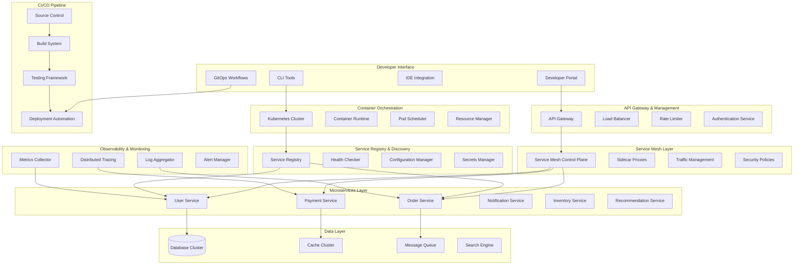
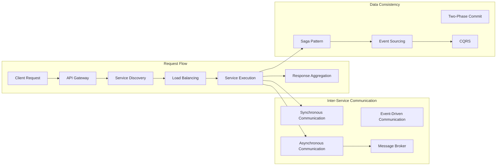
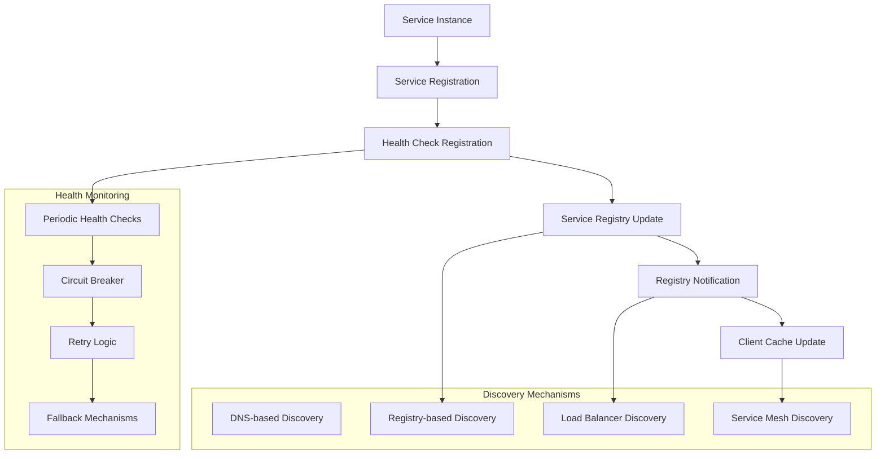
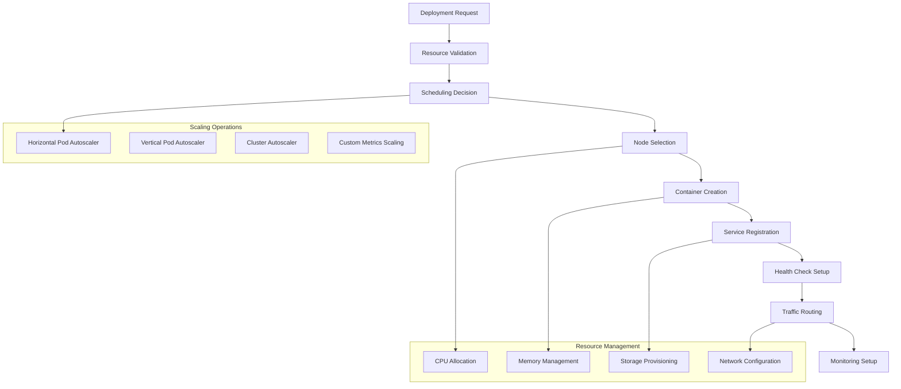
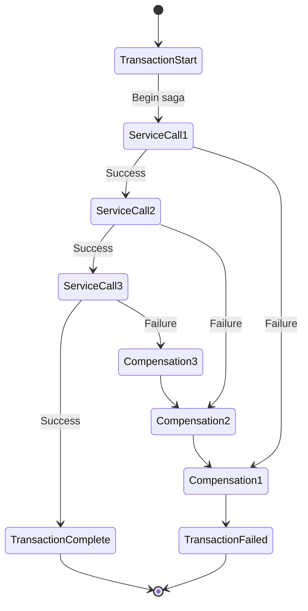
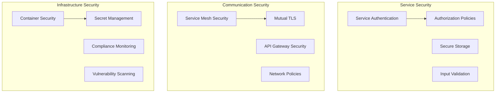

# Microservices Orchestration Platform


## 📋 Table of Contents

- [Microservices Orchestration Platform](#microservices-orchestration-platform)
  - [High-Level Design (HLD)](#high-level-design-hld)
    - [System Architecture Overview](#system-architecture-overview)
    - [Service Communication Flow](#service-communication-flow)
  - [Low-Level Design (LLD)](#low-level-design-lld)
    - [Service Discovery Architecture](#service-discovery-architecture)
    - [Container Orchestration Flow](#container-orchestration-flow)
    - [Distributed Transaction Management](#distributed-transaction-management)
  - [Core Algorithms](#core-algorithms)
    - [1. Intelligent Service Discovery Algorithm](#1-intelligent-service-discovery-algorithm)
    - [2. Container Orchestration Algorithm](#2-container-orchestration-algorithm)
    - [3. Distributed Transaction Management Algorithm](#3-distributed-transaction-management-algorithm)
    - [4. Service Mesh Traffic Management Algorithm](#4-service-mesh-traffic-management-algorithm)
    - [5. Observability and Monitoring Algorithm](#5-observability-and-monitoring-algorithm)
  - [Performance Optimizations](#performance-optimizations)
    - [Microservices Performance Strategies](#microservices-performance-strategies)
    - [Container and Resource Optimization](#container-and-resource-optimization)
  - [Security Considerations](#security-considerations)
    - [Microservices Security Framework](#microservices-security-framework)
  - [Testing Strategy](#testing-strategy)
    - [Microservices Testing Framework](#microservices-testing-framework)
    - [Service Mesh Testing](#service-mesh-testing)
  - [Trade-offs and Considerations](#trade-offs-and-considerations)
    - [Complexity vs Benefits](#complexity-vs-benefits)
    - [Development vs Operations](#development-vs-operations)
    - [Performance vs Resilience](#performance-vs-resilience)

---

## High-Level Design (HLD)

[⬆️ Back to Top](#--table-of-contents)

---


### System Architecture Overview

[⬆️ Back to Top](#--table-of-contents)

---




### Service Communication Flow

[⬆️ Back to Top](#--table-of-contents)

---




## Low-Level Design (LLD)

[⬆️ Back to Top](#--table-of-contents)

---


### Service Discovery Architecture

[⬆️ Back to Top](#--table-of-contents)

---




### Container Orchestration Flow

[⬆️ Back to Top](#--table-of-contents)

---




### Distributed Transaction Management

[⬆️ Back to Top](#--table-of-contents)

---




## Core Algorithms

[⬆️ Back to Top](#--table-of-contents)

---


### 1. Intelligent Service Discovery Algorithm

[⬆️ Back to Top](#--table-of-contents)

---


**Purpose**: Efficiently discover and route traffic to healthy service instances while handling service failures and network partitions gracefully.

**Multi-Layer Service Discovery with Health Scoring**:
```
ServiceDiscoveryConfig = {
  discovery: {
    mechanisms: ['dns', 'registry', 'mesh'],
    cacheStrategy: 'multi_tier',
    refreshInterval: 30000,              # 30 seconds
    healthCheckInterval: 10000,          # 10 seconds
    failureThreshold: 3                  # 3 consecutive failures
  },
  
  loadBalancing: {
    algorithm: 'weighted_round_robin',   # 'round_robin', 'least_connections', 'weighted_round_robin'
    healthScoring: true,
    latencyWeighting: true,
    geographicPreference: true
  },
  
  resilience: {
    circuitBreakerEnabled: true,
    retryPolicy: 'exponential_backoff',
    timeoutMs: 5000,
    maxRetries: 3
  }
}

class IntelligentServiceDiscovery:
  constructor(config):
    this.config = config
    this.serviceRegistry = new ServiceRegistry()
    this.healthMonitor = new HealthMonitor()
    this.loadBalancer = new WeightedLoadBalancer()
    this.circuitBreaker = new CircuitBreaker()
    this.serviceCache = new MultiTierCache()
  
  function discoverService(serviceName, clientContext):
    discoveryStart = Date.now()
    
    # Check local cache first
    cachedInstances = this.serviceCache.get(serviceName)
    if cachedInstances and not this.isCacheStale(cachedInstances):
      return this.selectInstance(cachedInstances, clientContext)
    
    # Discover instances from multiple sources
    discoveredInstances = this.discoverFromSources(serviceName)
    
    # Filter healthy instances
    healthyInstances = this.filterHealthyInstances(discoveredInstances)
    
    if healthyInstances.length === 0:
      return this.handleNoHealthyInstances(serviceName)
    
    # Score instances based on multiple factors
    scoredInstances = this.scoreInstances(healthyInstances, clientContext)
    
    # Update cache
    this.serviceCache.set(serviceName, scoredInstances)
    
    # Select best instance
    selectedInstance = this.selectInstance(scoredInstances, clientContext)
    
    # Track discovery metrics
    this.trackDiscoveryMetrics(serviceName, selectedInstance, Date.now() - discoveryStart)
    
    return selectedInstance
  
  function discoverFromSources(serviceName):
    discoveryPromises = []
    
    # DNS-based discovery
    if this.config.discovery.mechanisms.includes('dns'):
      discoveryPromises.push(this.discoverViaDNS(serviceName))
    
    # Registry-based discovery
    if this.config.discovery.mechanisms.includes('registry'):
      discoveryPromises.push(this.discoverViaRegistry(serviceName))
    
    # Service mesh discovery
    if this.config.discovery.mechanisms.includes('mesh'):
      discoveryPromises.push(this.discoverViaMesh(serviceName))
    
    # Wait for all discovery mechanisms
    results = await Promise.allSettled(discoveryPromises)
    
    # Merge and deduplicate instances
    allInstances = []
    for result in results:
      if result.status === 'fulfilled' and result.value:
        allInstances.push(...result.value)
    
    return this.deduplicateInstances(allInstances)
  
  function scoreInstances(instances, clientContext):
    scoredInstances = instances.map(instance => ({
      ...instance,
      score: this.calculateInstanceScore(instance, clientContext),
      lastScored: Date.now()
    }))
    
    # Sort by score (highest first)
    return scoredInstances.sort((a, b) => b.score - a.score)
  
  function calculateInstanceScore(instance, clientContext):
    score = 0
    
    # Health score (40% weight)
    healthScore = this.calculateHealthScore(instance)
    score += healthScore * 0.4
    
    # Performance score (30% weight)
    performanceScore = this.calculatePerformanceScore(instance)
    score += performanceScore * 0.3
    
    # Geographic proximity score (20% weight)
    proximityScore = this.calculateProximityScore(instance, clientContext)
    score += proximityScore * 0.2
    
    # Load score (10% weight)
    loadScore = this.calculateLoadScore(instance)
    score += loadScore * 0.1
    
    return Math.min(1, Math.max(0, score))
  
  function calculateHealthScore(instance):
    healthMetrics = this.healthMonitor.getInstanceHealth(instance.id)
    
    if not healthMetrics:
      return 0.5 # Neutral score for unknown health
    
    # Base health score
    baseScore = healthMetrics.isHealthy ? 1.0 : 0.0
    
    # Adjust based on consecutive successes/failures
    consecutiveSuccesses = healthMetrics.consecutiveSuccesses
    consecutiveFailures = healthMetrics.consecutiveFailures
    
    if consecutiveSuccesses > 10:
      baseScore = Math.min(1.0, baseScore + 0.1)
    
    if consecutiveFailures > 0:
      baseScore = Math.max(0.0, baseScore - (consecutiveFailures * 0.2))
    
    # Adjust based on error rate
    errorRate = healthMetrics.errorRate
    baseScore = Math.max(0.0, baseScore - errorRate)
    
    return baseScore
  
  function calculatePerformanceScore(instance):
    performanceMetrics = this.getInstancePerformanceMetrics(instance.id)
    
    if not performanceMetrics:
      return 0.5 # Neutral score
    
    # Latency score (lower is better)
    latencyScore = 1.0
    if performanceMetrics.averageLatency > 100: # 100ms threshold
      latencyScore = Math.max(0.1, 1.0 - (performanceMetrics.averageLatency - 100) / 1000)
    
    # Throughput score (higher is better)
    throughputScore = Math.min(1.0, performanceMetrics.requestsPerSecond / 1000)
    
    # Response time consistency score
    consistencyScore = 1.0 - (performanceMetrics.latencyStdDev / performanceMetrics.averageLatency)
    consistencyScore = Math.max(0.0, Math.min(1.0, consistencyScore))
    
    return (latencyScore * 0.5) + (throughputScore * 0.3) + (consistencyScore * 0.2)
  
  function selectInstance(scoredInstances, clientContext):
    if scoredInstances.length === 0:
      throw new Error('No available service instances')
    
    # Check circuit breaker status
    availableInstances = scoredInstances.filter(instance => 
      not this.circuitBreaker.isOpen(instance.id)
    )
    
    if availableInstances.length === 0:
      # All instances have open circuit breakers - use best scored instance
      selectedInstance = scoredInstances[0]
      this.logCircuitBreakerBypass(selectedInstance)
    else:
      # Use load balancing algorithm
      selectedInstance = this.loadBalancer.selectInstance(availableInstances, clientContext)
    
    # Update instance usage statistics
    this.updateInstanceUsage(selectedInstance)
    
    return selectedInstance
  
  function handleNoHealthyInstances(serviceName):
    # Check if we have stale cached instances as fallback
    staleInstances = this.serviceCache.getStale(serviceName)
    
    if staleInstances and staleInstances.length > 0:
      this.logStaleInstanceUsage(serviceName)
      return this.selectInstance(staleInstances, {})
    
    # Try to find instances from alternative sources
    fallbackInstances = this.discoverFallbackInstances(serviceName)
    
    if fallbackInstances and fallbackInstances.length > 0:
      return this.selectInstance(fallbackInstances, {})
    
    # No instances available
    throw new ServiceUnavailableError(`No healthy instances available for service: ${serviceName}`)
  
  function registerServiceInstance(serviceInstance):
    registrationInfo = {
      id: serviceInstance.id,
      serviceName: serviceInstance.serviceName,
      address: serviceInstance.address,
      port: serviceInstance.port,
      metadata: serviceInstance.metadata,
      registeredAt: Date.now(),
      
      # Health check configuration
      healthCheck: {
        path: serviceInstance.healthCheckPath || '/health',
        interval: this.config.discovery.healthCheckInterval,
        timeout: 5000,
        method: 'GET'
      }
    }
    
    # Register in service registry
    this.serviceRegistry.register(registrationInfo)
    
    # Start health monitoring
    this.healthMonitor.startMonitoring(registrationInfo)
    
    # Invalidate cache for this service
    this.serviceCache.invalidate(serviceInstance.serviceName)
    
    # Notify other discovery mechanisms
    this.notifyRegistration(registrationInfo)
    
    return {
      success: true,
      instanceId: serviceInstance.id,
      registrationTime: Date.now()
    }
  
  function deregisterServiceInstance(instanceId):
    instance = this.serviceRegistry.getInstance(instanceId)
    
    if not instance:
      return { success: false, reason: 'instance_not_found' }
    
    # Remove from registry
    this.serviceRegistry.deregister(instanceId)
    
    # Stop health monitoring
    this.healthMonitor.stopMonitoring(instanceId)
    
    # Invalidate cache
    this.serviceCache.invalidate(instance.serviceName)
    
    # Update circuit breaker
    this.circuitBreaker.removeInstance(instanceId)
    
    # Notify deregistration
    this.notifyDeregistration(instance)
    
    return {
      success: true,
      instanceId: instanceId,
      deregistrationTime: Date.now()
    }
```

### 2. Container Orchestration Algorithm

[⬆️ Back to Top](#--table-of-contents)

---


**Purpose**: Intelligently schedule and manage containers across cluster nodes while optimizing resource utilization, maintaining application availability, and handling failures.

**Multi-Constraint Container Scheduling**:
```
OrchestrationConfig = {
  scheduling: {
    algorithm: 'multi_constraint',       # 'round_robin', 'bin_packing', 'multi_constraint'
    resourceWeights: {
      cpu: 0.4,
      memory: 0.3,
      storage: 0.2,
      network: 0.1
    },
    affinityRules: true,
    antiAffinityRules: true,
    taints: true
  },
  
  scaling: {
    horizontalPodAutoscaler: true,
    verticalPodAutoscaler: true,
    clusterAutoscaler: true,
    customMetrics: ['request_rate', 'queue_length', 'cpu_utilization']
  },
  
  resilience: {
    replicationFactor: 3,
    maxUnavailable: 1,
    maxSurge: 1,
    healthCheckGracePeriod: 30000        # 30 seconds
  }
}

class ContainerOrchestrator:
  constructor(config):
    this.config = config
    this.clusterManager = new ClusterManager()
    this.scheduler = new MultiConstraintScheduler()
    this.autoscaler = new AutoscalingEngine()
    this.healthManager = new HealthManager()
    this.resourceManager = new ResourceManager()
  
  function scheduleContainer(deploymentRequest):
    schedulingStart = Date.now()
    
    # Validate deployment request
    validation = this.validateDeploymentRequest(deploymentRequest)
    if not validation.isValid:
      return { success: false, errors: validation.errors }
    
    # Get available nodes
    availableNodes = this.clusterManager.getAvailableNodes()
    
    # Filter nodes based on constraints
    candidateNodes = this.filterNodes(availableNodes, deploymentRequest)
    
    if candidateNodes.length === 0:
      return this.handleNoSuitableNodes(deploymentRequest)
    
    # Score nodes for scheduling
    scoredNodes = this.scoreNodes(candidateNodes, deploymentRequest)
    
    # Select optimal node
    selectedNode = this.selectOptimalNode(scoredNodes, deploymentRequest)
    
    # Reserve resources on selected node
    resourceReservation = this.reserveResources(selectedNode, deploymentRequest)
    
    if not resourceReservation.success:
      return { success: false, error: 'resource_reservation_failed' }
    
    # Create container
    containerCreation = this.createContainer(selectedNode, deploymentRequest, resourceReservation)
    
    if not containerCreation.success:
      this.releaseResources(selectedNode, resourceReservation)
      return { success: false, error: containerCreation.error }
    
    # Register container with monitoring
    this.registerContainerMonitoring(containerCreation.container)
    
    return {
      success: true,
      containerId: containerCreation.container.id,
      nodeId: selectedNode.id,
      schedulingTime: Date.now() - schedulingStart,
      resourceAllocation: resourceReservation.allocation
    }
  
  function filterNodes(nodes, deploymentRequest):
    candidateNodes = []
    
    for node in nodes:
      # Check node capacity
      if not this.hasCapacity(node, deploymentRequest.resources):
        continue
      
      # Check node selectors
      if not this.matchesNodeSelector(node, deploymentRequest.nodeSelector):
        continue
      
      # Check taints and tolerations
      if not this.canTolerateTaints(node.taints, deploymentRequest.tolerations):
        continue
      
      # Check affinity rules
      if not this.satisfiesAffinity(node, deploymentRequest.affinity):
        continue
      
      # Check anti-affinity rules
      if not this.satisfiesAntiAffinity(node, deploymentRequest.antiAffinity):
        continue
      
      candidateNodes.push(node)
    
    return candidateNodes
  
  function scoreNodes(nodes, deploymentRequest):
    scoredNodes = nodes.map(node => ({
      node: node,
      score: this.calculateNodeScore(node, deploymentRequest),
      factors: this.getScoreFactors(node, deploymentRequest)
    }))
    
    # Sort by score (highest first)
    return scoredNodes.sort((a, b) => b.score - a.score)
  
  function calculateNodeScore(node, deploymentRequest):
    score = 0
    
    # Resource availability score
    resourceScore = this.calculateResourceScore(node, deploymentRequest.resources)
    score += resourceScore * this.config.scheduling.resourceWeights.cpu
    
    # Performance score
    performanceScore = this.calculatePerformanceScore(node)
    score += performanceScore * 0.3
    
    # Load balancing score (prefer less loaded nodes)
    loadScore = this.calculateLoadScore(node)
    score += loadScore * 0.2
    
    # Affinity preference score
    affinityScore = this.calculateAffinityScore(node, deploymentRequest)
    score += affinityScore * 0.2
    
    # Node health score
    healthScore = this.calculateNodeHealthScore(node)
    score += healthScore * 0.1
    
    return Math.min(1, Math.max(0, score))
  
  function calculateResourceScore(node, requiredResources):
    # Calculate resource utilization after scheduling
    cpuUtilization = (node.usedCPU + requiredResources.cpu) / node.totalCPU
    memoryUtilization = (node.usedMemory + requiredResources.memory) / node.totalMemory
    storageUtilization = (node.usedStorage + requiredResources.storage) / node.totalStorage
    
    # Prefer nodes with balanced resource utilization
    avgUtilization = (cpuUtilization + memoryUtilization + storageUtilization) / 3
    
    # Score based on resource efficiency (prefer 70-80% utilization)
    optimalUtilization = 0.75
    utilizationDiff = Math.abs(avgUtilization - optimalUtilization)
    
    return Math.max(0, 1 - (utilizationDiff * 2))
  
  function selectOptimalNode(scoredNodes, deploymentRequest):
    # Primary selection: highest scored node
    primaryNode = scoredNodes[0]
    
    # Validate node can still accommodate the container
    if this.canScheduleOnNode(primaryNode.node, deploymentRequest):
      return primaryNode.node
    
    # Fallback to next best nodes
    for i in range(1, scoredNodes.length):
      candidateNode = scoredNodes[i]
      
      if this.canScheduleOnNode(candidateNode.node, deploymentRequest):
        return candidateNode.node
    
    throw new Error('No suitable node found for scheduling')
  
  function handleAutoScaling(deploymentName, metrics):
    currentDeployment = this.getDeployment(deploymentName)
    
    if not currentDeployment:
      return { success: false, error: 'deployment_not_found' }
    
    # Calculate scaling decision
    scalingDecision = this.calculateScalingDecision(currentDeployment, metrics)
    
    if scalingDecision.action === 'scale_up':
      return this.scaleUp(currentDeployment, scalingDecision.targetReplicas)
    else if scalingDecision.action === 'scale_down':
      return this.scaleDown(currentDeployment, scalingDecision.targetReplicas)
    else:
      return { success: true, action: 'no_scaling_needed' }
  
  function calculateScalingDecision(deployment, metrics):
    currentReplicas = deployment.currentReplicas
    
    # Analyze scaling metrics
    cpuUtilization = metrics.averageCpuUtilization
    memoryUtilization = metrics.averageMemoryUtilization
    requestRate = metrics.requestsPerSecond
    
    # Calculate target replicas based on each metric
    cpuBasedReplicas = this.calculateCpuBasedReplicas(currentReplicas, cpuUtilization)
    memoryBasedReplicas = this.calculateMemoryBasedReplicas(currentReplicas, memoryUtilization)
    requestBasedReplicas = this.calculateRequestBasedReplicas(currentReplicas, requestRate)
    
    # Take the maximum to handle the most constrained resource
    targetReplicas = Math.max(cpuBasedReplicas, memoryBasedReplicas, requestBasedReplicas)
    
    # Apply constraints
    targetReplicas = Math.max(deployment.minReplicas, Math.min(deployment.maxReplicas, targetReplicas))
    
    # Determine action
    action = 'no_change'
    if targetReplicas > currentReplicas:
      action = 'scale_up'
    else if targetReplicas < currentReplicas:
      action = 'scale_down'
    
    return {
      action: action,
      currentReplicas: currentReplicas,
      targetReplicas: targetReplicas,
      scalingFactors: {
        cpu: cpuBasedReplicas,
        memory: memoryBasedReplicas,
        requests: requestBasedReplicas
      }
    }
  
  function scaleUp(deployment, targetReplicas):
    scalingStart = Date.now()
    
    # Calculate number of new replicas needed
    newReplicas = targetReplicas - deployment.currentReplicas
    
    # Check cluster capacity
    capacityCheck = this.checkClusterCapacity(deployment, newReplicas)
    if not capacityCheck.hasCapacity:
      # Trigger cluster auto-scaling if enabled
      if this.config.scaling.clusterAutoscaler:
        this.triggerClusterAutoScaling(capacityCheck.requiredResources)
      
      return { success: false, error: 'insufficient_cluster_capacity' }
    
    # Create new container instances
    creationResults = []
    
    for i in range(newReplicas):
      try:
        containerResult = this.scheduleContainer({
          ...deployment.containerSpec,
          deploymentName: deployment.name,
          replicaIndex: deployment.currentReplicas + i
        })
        
        creationResults.push(containerResult)
        
      catch error:
        this.logScalingError(deployment.name, 'scale_up', error)
        continue
    
    # Update deployment status
    successfulCreations = creationResults.filter(r => r.success).length
    deployment.currentReplicas += successfulCreations
    
    return {
      success: true,
      action: 'scale_up',
      previousReplicas: targetReplicas - newReplicas,
      currentReplicas: deployment.currentReplicas,
      targetReplicas: targetReplicas,
      scalingTime: Date.now() - scalingStart
    }
  
  function scaleDown(deployment, targetReplicas):
    scalingStart = Date.now()
    
    # Calculate number of replicas to remove
    replicasToRemove = deployment.currentReplicas - targetReplicas
    
    # Select containers to terminate (prefer unhealthy or oldest)
    containersToTerminate = this.selectContainersForTermination(deployment, replicasToRemove)
    
    # Gracefully terminate containers
    terminationResults = []
    
    for container in containersToTerminate:
      try:
        terminationResult = this.gracefullyTerminateContainer(container)
        terminationResults.push(terminationResult)
        
      catch error:
        this.logScalingError(deployment.name, 'scale_down', error)
        continue
    
    # Update deployment status
    successfulTerminations = terminationResults.filter(r => r.success).length
    deployment.currentReplicas -= successfulTerminations
    
    return {
      success: true,
      action: 'scale_down',
      previousReplicas: targetReplicas + replicasToRemove,
      currentReplicas: deployment.currentReplicas,
      targetReplicas: targetReplicas,
      scalingTime: Date.now() - scalingStart
    }
  
  function handleNodeFailure(failedNode):
    # Get all containers on the failed node
    affectedContainers = this.getContainersOnNode(failedNode.id)
    
    # Reschedule containers to healthy nodes
    reschedulingResults = []
    
    for container in affectedContainers:
      try:
        # Create new instance on healthy node
        rescheduleResult = this.rescheduleContainer(container)
        reschedulingResults.push(rescheduleResult)
        
        # Update service registry
        this.updateServiceRegistryForReschedule(container, rescheduleResult.newContainer)
        
      catch error:
        this.logReschedulingError(container, error)
        continue
    
    # Mark node as unavailable
    this.markNodeUnavailable(failedNode.id)
    
    # Trigger cluster scaling if needed
    if this.shouldTriggerClusterScaling(failedNode):
      this.triggerClusterAutoScaling({
        reason: 'node_failure',
        failedNode: failedNode.id,
        affectedContainers: affectedContainers.length
      })
    
    return {
      success: true,
      failedNode: failedNode.id,
      affectedContainers: affectedContainers.length,
      successfulReschedules: reschedulingResults.filter(r => r.success).length,
      failedReschedules: reschedulingResults.filter(r => not r.success).length
    }
```

### 3. Distributed Transaction Management Algorithm

[⬆️ Back to Top](#--table-of-contents)

---


**Purpose**: Coordinate transactions across multiple microservices using the Saga pattern while maintaining data consistency and handling partial failures.

**Saga Orchestration with Compensation**:
```
SagaConfig = {
  execution: {
    timeout: 300000,                     # 5 minutes total timeout
    stepTimeout: 30000,                  # 30 seconds per step
    maxRetries: 3,
    retryBackoff: 'exponential'
  },
  
  compensation: {
    enabled: true,
    compensationTimeout: 60000,          # 1 minute per compensation
    parallelCompensation: true,
    compensationRetries: 2
  },
  
  persistence: {
    enabled: true,
    snapshotInterval: 5,                 # Every 5 steps
    eventSourcing: true
  }
}

class SagaOrchestrator:
  constructor(config):
    this.config = config
    this.sagaManager = new SagaManager()
    this.eventStore = new EventStore()
    this.compensationManager = new CompensationManager()
    this.stepExecutor = new StepExecutor()
    this.activeSagas = new Map()
  
  function executeSaga(sagaDefinition, initialData):
    sagaId = this.generateSagaId()
    sagaStart = Date.now()
    
    # Create saga instance
    sagaInstance = {
      id: sagaId,
      definition: sagaDefinition,
      status: 'started',
      currentStep: 0,
      data: initialData,
      startedAt: sagaStart,
      steps: [],
      compensations: [],
      errors: []
    }
    
    # Store saga instance
    this.activeSagas.set(sagaId, sagaInstance)
    
    # Persist saga start event
    this.eventStore.append({
      sagaId: sagaId,
      eventType: 'saga_started',
      timestamp: sagaStart,
      data: { definition: sagaDefinition, initialData: initialData }
    })
    
    try:
      # Execute saga steps
      result = await this.executeSagaSteps(sagaInstance)
      
      if result.success:
        sagaInstance.status = 'completed'
        this.eventStore.append({
          sagaId: sagaId,
          eventType: 'saga_completed',
          timestamp: Date.now(),
          data: { result: result.data }
        })
      else:
        await this.compensateSaga(sagaInstance, result.failedStep)
      }
      
      return result
      
    catch error:
      await this.handleSagaError(sagaInstance, error)
      throw error
    finally:
      this.activeSagas.delete(sagaId)
  
  function executeSagaSteps(sagaInstance):
    sagaDefinition = sagaInstance.definition
    
    for stepIndex in range(sagaDefinition.steps.length):
      stepDefinition = sagaDefinition.steps[stepIndex]
      sagaInstance.currentStep = stepIndex
      
      try:
        # Execute step
        stepResult = await this.executeStep(sagaInstance, stepDefinition)
        
        # Store step result
        sagaInstance.steps.push({
          stepIndex: stepIndex,
          stepName: stepDefinition.name,
          status: 'completed',
          result: stepResult.data,
          executedAt: Date.now(),
          executionTime: stepResult.executionTime
        })
        
        # Update saga data with step result
        sagaInstance.data = this.mergeStepResult(sagaInstance.data, stepResult.data)
        
        # Persist step completion event
        this.eventStore.append({
          sagaId: sagaInstance.id,
          eventType: 'step_completed',
          timestamp: Date.now(),
          data: {
            stepIndex: stepIndex,
            stepName: stepDefinition.name,
            result: stepResult.data
          }
        })
        
        # Create snapshot periodically
        if (stepIndex + 1) % this.config.persistence.snapshotInterval === 0:
          this.createSagaSnapshot(sagaInstance)
        
      catch error:
        # Mark step as failed
        sagaInstance.steps.push({
          stepIndex: stepIndex,
          stepName: stepDefinition.name,
          status: 'failed',
          error: error.message,
          failedAt: Date.now()
        })
        
        return {
          success: false,
          failedStep: stepIndex,
          error: error.message,
          completedSteps: stepIndex
        }
    
    return {
      success: true,
      data: sagaInstance.data,
      completedSteps: sagaDefinition.steps.length,
      totalExecutionTime: Date.now() - sagaInstance.startedAt
    }
  
  function executeStep(sagaInstance, stepDefinition):
    stepStart = Date.now()
    
    # Prepare step context
    stepContext = {
      sagaId: sagaInstance.id,
      stepName: stepDefinition.name,
      sagaData: sagaInstance.data,
      stepParameters: stepDefinition.parameters
    }
    
    # Set step timeout
    stepTimeout = stepDefinition.timeout || this.config.execution.stepTimeout
    
    return new Promise((resolve, reject) => {
      timeoutId = setTimeout(() => {
        reject(new Error(`Step ${stepDefinition.name} timed out after ${stepTimeout}ms`))
      }, stepTimeout)
      
      # Execute step with retry logic
      this.executeStepWithRetry(stepDefinition, stepContext)
        .then(result => {
          clearTimeout(timeoutId)
          resolve({
            data: result,
            executionTime: Date.now() - stepStart
          })
        })
        .catch(error => {
          clearTimeout(timeoutId)
          reject(error)
        })
    })
  
  function executeStepWithRetry(stepDefinition, stepContext):
    maxRetries = stepDefinition.retries || this.config.execution.maxRetries
    
    return new Promise(async (resolve, reject) => {
      for attempt in range(maxRetries + 1):
        try:
          # Call service for this step
          result = await this.callServiceStep(stepDefinition, stepContext)
          resolve(result)
          return
          
        catch error:
          if attempt === maxRetries:
            reject(error)
            return
          
          # Calculate retry delay
          retryDelay = this.calculateRetryDelay(attempt, stepDefinition)
          
          # Log retry attempt
          this.logStepRetry(stepContext.sagaId, stepDefinition.name, attempt + 1, error)
          
          # Wait before retry
          await this.delay(retryDelay)
        
    })
  
  function callServiceStep(stepDefinition, stepContext):
    # Prepare service call
    serviceCall = {
      serviceName: stepDefinition.serviceName,
      method: stepDefinition.method,
      endpoint: stepDefinition.endpoint,
      parameters: this.interpolateParameters(stepDefinition.parameters, stepContext.sagaData),
      headers: {
        'X-Saga-ID': stepContext.sagaId,
        'X-Step-Name': stepContext.stepName
      }
    }
    
    # Execute service call
    return this.stepExecutor.execute(serviceCall)
  
  function compensateSaga(sagaInstance, failedStepIndex):
    sagaInstance.status = 'compensating'
    
    # Persist compensation start event
    this.eventStore.append({
      sagaId: sagaInstance.id,
      eventType: 'compensation_started',
      timestamp: Date.now(),
      data: { failedStep: failedStepIndex }
    })
    
    # Get completed steps that need compensation (in reverse order)
    stepsToCompensate = sagaInstance.steps
      .filter(step => step.status === 'completed' and step.stepIndex < failedStepIndex)
      .reverse()
    
    # Execute compensations
    compensationResults = []
    
    if this.config.compensation.parallelCompensation:
      # Execute compensations in parallel
      compensationResults = await this.executeParallelCompensations(sagaInstance, stepsToCompensate)
    else:
      # Execute compensations sequentially
      compensationResults = await this.executeSequentialCompensations(sagaInstance, stepsToCompensate)
    
    # Check compensation results
    failedCompensations = compensationResults.filter(r => not r.success)
    
    if failedCompensations.length > 0:
      sagaInstance.status = 'compensation_failed'
      this.handleCompensationFailure(sagaInstance, failedCompensations)
    else:
      sagaInstance.status = 'compensated'
      this.eventStore.append({
        sagaId: sagaInstance.id,
        eventType: 'saga_compensated',
        timestamp: Date.now(),
        data: { compensatedSteps: compensationResults.length }
      })
    
    return {
      success: failedCompensations.length === 0,
      compensatedSteps: compensationResults.filter(r => r.success).length,
      failedCompensations: failedCompensations.length
    }
  
  function executeSequentialCompensations(sagaInstance, stepsToCompensate):
    compensationResults = []
    
    for step in stepsToCompensate:
      try:
        compensationResult = await this.executeCompensation(sagaInstance, step)
        compensationResults.push(compensationResult)
        
        # Record successful compensation
        sagaInstance.compensations.push({
          stepIndex: step.stepIndex,
          stepName: step.stepName,
          status: 'completed',
          compensatedAt: Date.now()
        })
        
      catch error:
        compensationResults.push({
          success: false,
          stepIndex: step.stepIndex,
          stepName: step.stepName,
          error: error.message
        })
        
        # Record failed compensation
        sagaInstance.compensations.push({
          stepIndex: step.stepIndex,
          stepName: step.stepName,
          status: 'failed',
          error: error.message,
          failedAt: Date.now()
        })
    
    return compensationResults
  
  function executeCompensation(sagaInstance, step):
    stepDefinition = sagaInstance.definition.steps[step.stepIndex]
    
    if not stepDefinition.compensation:
      # No compensation defined - consider it successful
      return {
        success: true,
        stepIndex: step.stepIndex,
        stepName: step.stepName,
        skipped: true
      }
    
    # Prepare compensation context
    compensationContext = {
      sagaId: sagaInstance.id,
      stepName: step.stepName,
      originalStepResult: step.result,
      sagaData: sagaInstance.data
    }
    
    # Execute compensation with timeout
    compensationTimeout = this.config.compensation.compensationTimeout
    
    return new Promise((resolve, reject) => {
      timeoutId = setTimeout(() => {
        reject(new Error(`Compensation for ${step.stepName} timed out`))
      }, compensationTimeout)
      
      this.executeCompensationWithRetry(stepDefinition.compensation, compensationContext)
        .then(result => {
          clearTimeout(timeoutId)
          resolve({
            success: true,
            stepIndex: step.stepIndex,
            stepName: step.stepName,
            result: result
          })
        })
        .catch(error => {
          clearTimeout(timeoutId)
          reject(error)
        })
    })
  
  function executeCompensationWithRetry(compensationDefinition, compensationContext):
    maxRetries = this.config.compensation.compensationRetries
    
    return new Promise(async (resolve, reject) => {
      for attempt in range(maxRetries + 1):
        try:
          # Call compensation service
          result = await this.callCompensationService(compensationDefinition, compensationContext)
          resolve(result)
          return
          
        catch error:
          if attempt === maxRetries:
            reject(error)
            return
          
          # Log compensation retry
          this.logCompensationRetry(compensationContext.sagaId, compensationContext.stepName, attempt + 1, error)
          
          # Wait before retry
          await this.delay(1000 * (attempt + 1)) # Simple linear backoff for compensation
        
    })
  
  function getSagaStatus(sagaId):
    # Check active sagas first
    activeSaga = this.activeSagas.get(sagaId)
    if activeSaga:
      return {
        sagaId: sagaId,
        status: activeSaga.status,
        currentStep: activeSaga.currentStep,
        totalSteps: activeSaga.definition.steps.length,
        startedAt: activeSaga.startedAt,
        steps: activeSaga.steps,
        compensations: activeSaga.compensations,
        isActive: true
      }
    
    # Query from event store for completed sagas
    sagaEvents = this.eventStore.getSagaEvents(sagaId)
    
    if sagaEvents.length === 0:
      return { sagaId: sagaId, status: 'not_found' }
    
    # Reconstruct saga state from events
    sagaState = this.reconstructSagaFromEvents(sagaEvents)
    
    return {
      sagaId: sagaId,
      status: sagaState.status,
      totalSteps: sagaState.totalSteps,
      completedSteps: sagaState.completedSteps,
      startedAt: sagaState.startedAt,
      completedAt: sagaState.completedAt,
      isActive: false
    }
```

### 4. Service Mesh Traffic Management Algorithm

[⬆️ Back to Top](#--table-of-contents)

---


**Purpose**: Manage traffic routing, load balancing, circuit breaking, and security policies across the service mesh while maintaining high availability and performance.

**Intelligent Traffic Routing with Circuit Breaking**:
```
ServiceMeshConfig = {
  traffic: {
    loadBalancing: 'least_connection',   # 'round_robin', 'least_connection', 'weighted'
    circuitBreakerEnabled: true,
    retryPolicy: {
      maxRetries: 3,
      retryOn: ['5xx', 'gateway-error', 'connect-failure'],
      perTryTimeout: 5000
    },
    timeout: 15000                       # 15 seconds default timeout
  },
  
  security: {
    mtlsEnabled: true,
    authorizationPolicyEnabled: true,
    rateLimitingEnabled: true,
    allowedMethods: ['GET', 'POST', 'PUT', 'DELETE']
  },
  
  observability: {
    tracingEnabled: true,
    metricsCollection: true,
    accessLogging: true,
    samplingRate: 0.1                    # 10% sampling
  }
}

class ServiceMeshTrafficManager:
  constructor(config):
    this.config = config
    this.trafficRouter = new TrafficRouter()
    this.circuitBreaker = new CircuitBreaker()
    this.loadBalancer = new LoadBalancer()
    this.securityPolicyEngine = new SecurityPolicyEngine()
    this.observabilityCollector = new ObservabilityCollector()
  
  function routeRequest(request, destinationService):
    routingStart = Date.now()
    
    # Apply security policies
    securityCheck = this.securityPolicyEngine.checkRequest(request, destinationService)
    if not securityCheck.allowed:
      return this.generateSecurityDeniedResponse(securityCheck)
    
    # Check circuit breaker status
    circuitStatus = this.circuitBreaker.getStatus(destinationService)
    if circuitStatus.isOpen:
      return this.handleCircuitBreakerOpen(destinationService, circuitStatus)
    
    # Get available service instances
    serviceInstances = this.getAvailableInstances(destinationService)
    
    if serviceInstances.length === 0:
      return this.handleNoAvailableInstances(destinationService)
    
    # Apply traffic splitting rules
    routingDecision = this.applyTrafficSplitting(request, serviceInstances)
    
    # Select target instance
    targetInstance = this.loadBalancer.selectInstance(routingDecision.instances, request)
    
    # Execute request with retries
    response = await this.executeRequestWithRetries(request, targetInstance, destinationService)
    
    # Update circuit breaker and metrics
    this.updateCircuitBreaker(destinationService, targetInstance, response)
    this.collectObservabilityData(request, response, targetInstance, Date.now() - routingStart)
    
    return response
  
  function applyTrafficSplitting(request, serviceInstances):
    # Get traffic splitting rules for the service
    trafficRules = this.getTrafficSplittingRules(request.destinationService)
    
    if not trafficRules or trafficRules.length === 0:
      # No traffic splitting - use all instances
      return { instances: serviceInstances, rule: 'default' }
    
    # Apply traffic splitting based on rules
    for rule in trafficRules:
      if this.matchesTrafficRule(request, rule):
        # Filter instances based on rule
        targetInstances = serviceInstances.filter(instance => 
          this.instanceMatchesRule(instance, rule)
        )
        
        if targetInstances.length > 0:
          return {
            instances: targetInstances,
            rule: rule.name,
            weight: rule.weight
          }
    
    # Fallback to default routing
    return { instances: serviceInstances, rule: 'fallback' }
  
  function matchesTrafficRule(request, rule):
    # Check header-based matching
    if rule.headers:
      for [headerName, headerValue] in Object.entries(rule.headers):
        if request.headers[headerName] !== headerValue:
          return false
    
    # Check path-based matching
    if rule.path and not request.path.match(new RegExp(rule.path)):
      return false
    
    # Check source-based matching
    if rule.source and request.source !== rule.source:
      return false
    
    # Check percentage-based routing
    if rule.percentage:
      randomValue = Math.random() * 100
      if randomValue > rule.percentage:
        return false
    
    return true
  
  function executeRequestWithRetries(request, targetInstance, destinationService):
    retryConfig = this.config.traffic.retryPolicy
    
    for attempt in range(retryConfig.maxRetries + 1):
      try:
        # Set per-try timeout
        requestWithTimeout = {
          ...request,
          timeout: retryConfig.perTryTimeout
        }
        
        # Execute request
        response = await this.executeRequest(requestWithTimeout, targetInstance)
        
        # Check if response indicates retry
        if not this.shouldRetry(response, retryConfig.retryOn):
          return response
        
        # If this was the last attempt, return the response even if retryable
        if attempt === retryConfig.maxRetries:
          return response
        
        # Wait before retry (exponential backoff)
        retryDelay = Math.min(1000 * Math.pow(2, attempt), 10000)
        await this.delay(retryDelay)
        
        # Select new instance for retry (exclude failed instance)
        targetInstance = this.selectRetryInstance(destinationService, targetInstance)
        
      catch error:
        # If this was the last attempt, throw the error
        if attempt === retryConfig.maxRetries:
          throw error
        
        # Log retry attempt
        this.logRetryAttempt(destinationService, targetInstance, attempt + 1, error)
        
        # Wait before retry
        retryDelay = Math.min(1000 * Math.pow(2, attempt), 10000)
        await this.delay(retryDelay)
        
        # Select new instance for retry
        targetInstance = this.selectRetryInstance(destinationService, targetInstance)
    
    throw new Error('Max retries exceeded')
  
  function updateCircuitBreaker(serviceName, instance, response):
    success = response.status < 500
    
    if success:
      this.circuitBreaker.recordSuccess(serviceName, instance.id)
    else:
      this.circuitBreaker.recordFailure(serviceName, instance.id)
    
    # Check if circuit breaker should change state
    this.circuitBreaker.evaluateState(serviceName)
  
  function handleCircuitBreakerOpen(serviceName, circuitStatus):
    # Check if we should attempt half-open state
    if this.circuitBreaker.shouldAttemptHalfOpen(serviceName):
      # Allow one request to test if service is recovered
      this.circuitBreaker.setHalfOpen(serviceName)
      
      # Get a healthy instance to test
      testInstance = this.getHealthiestInstance(serviceName)
      
      if testInstance:
        return {
          allowRequest: true,
          instance: testInstance,
          circuitState: 'half-open'
        }
    
    # Circuit is open - return error response
    return {
      status: 503,
      error: 'Service Unavailable',
      message: `Circuit breaker is open for service: ${serviceName}`,
      circuitState: 'open',
      nextRetryAt: circuitStatus.nextRetryAt
    }
  
  function collectObservabilityData(request, response, instance, duration):
    # Collect metrics
    if this.config.observability.metricsCollection:
      this.observabilityCollector.recordMetrics({
        serviceName: request.destinationService,
        sourceService: request.sourceService,
        method: request.method,
        path: request.path,
        statusCode: response.status,
        duration: duration,
        instanceId: instance.id
      })
    
    # Collect distributed traces
    if this.config.observability.tracingEnabled:
      this.observabilityCollector.recordTrace({
        traceId: request.traceId,
        spanId: this.generateSpanId(),
        parentSpanId: request.spanId,
        serviceName: request.destinationService,
        operationName: `${request.method} ${request.path}`,
        startTime: Date.now() - duration,
        endTime: Date.now(),
        tags: {
          'http.method': request.method,
          'http.url': request.path,
          'http.status_code': response.status,
          'instance.id': instance.id
        }
      })
    
    # Collect access logs
    if this.config.observability.accessLogging:
      this.observabilityCollector.recordAccessLog({
        timestamp: Date.now(),
        sourceIP: request.clientIP,
        sourceService: request.sourceService,
        destinationService: request.destinationService,
        method: request.method,
        path: request.path,
        statusCode: response.status,
        responseTime: duration,
        userAgent: request.userAgent
      })
  
  function applySecurityPolicies(request, destinationService):
    # Apply mTLS verification
    if this.config.security.mtlsEnabled:
      mtlsResult = this.verifyMTLS(request)
      if not mtlsResult.valid:
        return { allowed: false, reason: 'mtls_verification_failed' }
    
    # Apply authorization policies
    if this.config.security.authorizationPolicyEnabled:
      authzResult = this.checkAuthorizationPolicy(request, destinationService)
      if not authzResult.allowed:
        return { allowed: false, reason: 'authorization_denied' }
    
    # Apply rate limiting
    if this.config.security.rateLimitingEnabled:
      rateLimitResult = this.checkRateLimit(request)
      if not rateLimitResult.allowed:
        return { allowed: false, reason: 'rate_limit_exceeded' }
    
    # Check allowed methods
    if not this.config.security.allowedMethods.includes(request.method):
      return { allowed: false, reason: 'method_not_allowed' }
    
    return { allowed: true }
  
  function verifyMTLS(request):
    # Check for client certificate
    if not request.clientCertificate:
      return { valid: false, reason: 'missing_client_certificate' }
    
    # Verify certificate validity
    certValid = this.validateCertificate(request.clientCertificate)
    if not certValid.valid:
      return { valid: false, reason: certValid.reason }
    
    # Check certificate against allowed clients
    clientIdentity = this.extractClientIdentity(request.clientCertificate)
    if not this.isAuthorizedClient(clientIdentity):
      return { valid: false, reason: 'unauthorized_client' }
    
    return { valid: true, clientIdentity: clientIdentity }
  
  function checkAuthorizationPolicy(request, destinationService):
    # Get authorization policies for the service
    policies = this.getAuthorizationPolicies(destinationService)
    
    for policy in policies:
      # Check if policy applies to this request
      if this.policyApplies(policy, request):
        # Evaluate policy rules
        if this.evaluatePolicyRules(policy, request):
          return { allowed: true, policy: policy.name }
      
    # Default deny if no policy matches
    return { allowed: false, reason: 'no_matching_policy' }
  
  function getTrafficSplittingRules(serviceName):
    # Traffic splitting rules could be defined as:
    return [
      {
        name: 'canary_deployment',
        percentage: 10,                    # 10% to canary version
        headers: { 'x-canary': 'true' },
        weight: 10,
        destinations: ['v2']
      },
      {
        name: 'blue_green',
        source: 'test-environment',
        weight: 100,
        destinations: ['green']
      },
      {
        name: 'feature_flag',
        headers: { 'x-feature-flag': 'new-feature' },
        percentage: 50,
        weight: 50,
        destinations: ['feature-enabled']
      }
    ]
```

### 5. Observability and Monitoring Algorithm

[⬆️ Back to Top](#--table-of-contents)

---


**Purpose**: Collect, correlate, and analyze telemetry data from microservices to provide comprehensive observability including metrics, logs, traces, and alerts.

**Distributed Observability Platform**:
```
ObservabilityConfig = {
  metrics: {
    collectionInterval: 15000,           # 15 seconds
    retention: 2592000000,               # 30 days
    aggregationLevels: ['1m', '5m', '1h', '1d'],
    customMetrics: true
  },
  
  logging: {
    logLevel: 'info',
    structuredLogging: true,
    logRetention: 604800000,             # 7 days
    logForwarding: true,
    sensitiveDataMasking: true
  },
  
  tracing: {
    samplingRate: 0.1,                   # 10% sampling
    maxTraceSize: 1048576,               # 1MB max trace
    traceRetention: 259200000,           # 3 days
    distributedTracing: true
  },
  
  alerting: {
    evaluationInterval: 60000,           # 1 minute
    alertRetention: 86400000,            # 24 hours
    notificationChannels: ['email', 'slack', 'webhook']
  }
}

class ObservabilityEngine:
  constructor(config):
    this.config = config
    this.metricsCollector = new MetricsCollector()
    this.logProcessor = new LogProcessor()
    this.traceCollector = new TraceCollector()
    this.alertManager = new AlertManager()
    this.correlationEngine = new CorrelationEngine()
  
  function collectServiceMetrics(serviceName, metrics):
    timestamp = Date.now()
    
    # Validate and normalize metrics
    normalizedMetrics = this.normalizeMetrics(metrics, serviceName, timestamp)
    
    # Store metrics with different aggregation levels
    for metric in normalizedMetrics:
      this.storeMetricAtLevels(metric)
    
    # Check for anomalies
    anomalies = this.detectAnomalies(serviceName, normalizedMetrics)
    if anomalies.length > 0:
      this.handleAnomalies(serviceName, anomalies)
    
    # Update service health score
    this.updateServiceHealthScore(serviceName, normalizedMetrics)
    
    # Trigger alerts if thresholds are breached
    this.evaluateAlertRules(serviceName, normalizedMetrics)
  
  function normalizeMetrics(rawMetrics, serviceName, timestamp):
    normalizedMetrics = []
    
    for [metricName, metricValue] in Object.entries(rawMetrics):
      # Create standardized metric format
      metric = {
        name: metricName,
        value: metricValue,
        timestamp: timestamp,
        service: serviceName,
        labels: {
          service: serviceName,
          environment: this.getEnvironment(),
          cluster: this.getClusterName()
        }
      }
      
      # Add metric-specific labels
      if metricName.startsWith('http_'):
        metric.labels.component = 'http'
      else if metricName.startsWith('db_'):
        metric.labels.component = 'database'
      else if metricName.startsWith('cache_'):
        metric.labels.component = 'cache'
      
      # Validate metric value
      if this.isValidMetricValue(metricValue):
        normalizedMetrics.push(metric)
    
    return normalizedMetrics
  
  function storeMetricAtLevels(metric):
    # Store raw metric
    this.metricsCollector.store(metric)
    
    # Create aggregated metrics for different time windows
    for aggregationLevel in this.config.metrics.aggregationLevels:
      aggregatedMetric = this.aggregateMetric(metric, aggregationLevel)
      this.metricsCollector.storeAggregated(aggregatedMetric)
  
  function processServiceLogs(serviceName, logEntries):
    processedLogs = []
    
    for logEntry in logEntries:
      # Parse and structure log entry
      structuredLog = this.parseLogEntry(logEntry, serviceName)
      
      # Apply sensitive data masking
      if this.config.logging.sensitiveDataMasking:
        structuredLog = this.maskSensitiveData(structuredLog)
      
      # Enrich log with metadata
      enrichedLog = this.enrichLogEntry(structuredLog, serviceName)
      
      # Extract metrics from logs
      logMetrics = this.extractMetricsFromLog(enrichedLog)
      if logMetrics.length > 0:
        this.collectServiceMetrics(serviceName, logMetrics)
      
      # Check for error patterns
      if this.isErrorLog(enrichedLog):
        this.handleErrorLog(serviceName, enrichedLog)
      
      processedLogs.push(enrichedLog)
    
    # Store processed logs
    this.logProcessor.storeLogs(processedLogs)
    
    # Update log-based alerts
    this.evaluateLogAlerts(serviceName, processedLogs)
  
  function collectDistributedTrace(traceData):
    # Validate trace data
    if not this.isValidTrace(traceData):
      return { success: false, reason: 'invalid_trace_data' }
    
    # Check sampling decision
    if not this.shouldSampleTrace(traceData.traceId):
      return { success: true, reason: 'trace_not_sampled' }
    
    # Process trace spans
    processedSpans = this.processTraceSpans(traceData.spans)
    
    # Build trace hierarchy
    traceHierarchy = this.buildTraceHierarchy(processedSpans)
    
    # Calculate trace metrics
    traceMetrics = this.calculateTraceMetrics(traceHierarchy)
    
    # Store trace
    this.traceCollector.storeTrace({
      traceId: traceData.traceId,
      spans: processedSpans,
      hierarchy: traceHierarchy,
      metrics: traceMetrics,
      collectedAt: Date.now()
    })
    
    # Detect trace anomalies
    traceAnomalies = this.detectTraceAnomalies(traceHierarchy, traceMetrics)
    if traceAnomalies.length > 0:
      this.handleTraceAnomalies(traceData.traceId, traceAnomalies)
    
    return { success: true, traceId: traceData.traceId }
  
  function correlateObservabilityData(timeWindow):
    correlationStart = Date.now()
    
    # Get data from all observability sources
    metrics = this.metricsCollector.getMetrics(timeWindow)
    logs = this.logProcessor.getLogs(timeWindow)
    traces = this.traceCollector.getTraces(timeWindow)
    
    # Correlate data by service
    serviceCorrelations = this.correlateByService(metrics, logs, traces)
    
    # Correlate data by request/transaction
    requestCorrelations = this.correlateByRequest(logs, traces)
    
    # Detect cross-service issues
    crossServiceIssues = this.detectCrossServiceIssues(serviceCorrelations)
    
    # Generate correlation insights
    insights = this.generateCorrelationInsights(serviceCorrelations, requestCorrelations, crossServiceIssues)
    
    return {
      timeWindow: timeWindow,
      serviceCorrelations: serviceCorrelations,
      requestCorrelations: requestCorrelations,
      crossServiceIssues: crossServiceIssues,
      insights: insights,
      correlationTime: Date.now() - correlationStart
    }
  
  function correlateByService(metrics, logs, traces):
    serviceData = new Map()
    
    # Group metrics by service
    for metric in metrics:
      serviceName = metric.labels.service
      if not serviceData.has(serviceName):
        serviceData.set(serviceName, { metrics: [], logs: [], traces: [] })
      serviceData.get(serviceName).metrics.push(metric)
    
    # Group logs by service
    for log in logs:
      serviceName = log.service
      if serviceData.has(serviceName):
        serviceData.get(serviceName).logs.push(log)
    
    # Group traces by service
    for trace in traces:
      for span in trace.spans:
        serviceName = span.serviceName
        if serviceData.has(serviceName):
          serviceData.get(serviceName).traces.push(span)
    
    # Analyze correlations for each service
    correlations = []
    
    for [serviceName, data] in serviceData:
      serviceCorrelation = this.analyzeServiceCorrelation(serviceName, data)
      correlations.push(serviceCorrelation)
    
    return correlations
  
  function analyzeServiceCorrelation(serviceName, serviceData):
    analysis = {
      serviceName: serviceName,
      healthScore: 1.0,
      issues: [],
      insights: []
    }
    
    # Analyze error correlation
    errorMetrics = serviceData.metrics.filter(m => m.name.includes('error'))
    errorLogs = serviceData.logs.filter(l => l.level === 'error')
    
    if errorMetrics.length > 0 or errorLogs.length > 0:
      errorCorrelation = this.analyzeErrorCorrelation(errorMetrics, errorLogs)
      analysis.issues.push(errorCorrelation)
      analysis.healthScore -= 0.3
    
    # Analyze latency correlation
    latencyMetrics = serviceData.metrics.filter(m => m.name.includes('latency') or m.name.includes('duration'))
    latencyTraces = serviceData.traces.filter(t => t.duration > 1000) # > 1 second
    
    if latencyMetrics.length > 0 or latencyTraces.length > 0:
      latencyCorrelation = this.analyzeLatencyCorrelation(latencyMetrics, latencyTraces)
      if latencyCorrelation.severity > 0.5:
        analysis.issues.push(latencyCorrelation)
        analysis.healthScore -= 0.2
    
    # Analyze resource correlation
    resourceMetrics = serviceData.metrics.filter(m => 
      m.name.includes('cpu') or m.name.includes('memory') or m.name.includes('disk')
    )
    
    resourceCorrelation = this.analyzeResourceCorrelation(resourceMetrics)
    if resourceCorrelation.issues.length > 0:
      analysis.issues.push(...resourceCorrelation.issues)
      analysis.healthScore -= 0.1
    
    return analysis
  
  function detectAnomalies(serviceName, metrics):
    anomalies = []
    
    for metric in metrics:
      # Get historical data for comparison
      historicalData = this.getHistoricalMetricData(serviceName, metric.name)
      
      # Calculate statistical baseline
      baseline = this.calculateBaseline(historicalData)
      
      # Check for anomalies
      if this.isAnomalousValue(metric.value, baseline):
        anomaly = {
          metricName: metric.name,
          currentValue: metric.value,
          expectedRange: baseline.range,
          severity: this.calculateAnomalySeverity(metric.value, baseline),
          detectedAt: Date.now()
        }
        
        anomalies.push(anomaly)
    
    return anomalies
  
  function evaluateAlertRules(serviceName, metrics):
    # Get alert rules for the service
    alertRules = this.getAlertRules(serviceName)
    
    for rule in alertRules:
      # Evaluate rule condition
      conditionMet = this.evaluateAlertCondition(rule, metrics)
      
      if conditionMet and not this.isAlertActive(rule.id):
        # Fire alert
        alert = {
          ruleId: rule.id,
          serviceName: serviceName,
          severity: rule.severity,
          message: rule.message,
          condition: rule.condition,
          firedAt: Date.now()
        }
        
        this.alertManager.fireAlert(alert)
      else if not conditionMet and this.isAlertActive(rule.id):
        # Resolve alert
        this.alertManager.resolveAlert(rule.id)
    
  function generateServiceHealthDashboard(serviceName, timeRange):
    # Collect comprehensive service data
    serviceMetrics = this.metricsCollector.getServiceMetrics(serviceName, timeRange)
    serviceLogs = this.logProcessor.getServiceLogs(serviceName, timeRange)
    serviceTraces = this.traceCollector.getServiceTraces(serviceName, timeRange)
    
    # Calculate key performance indicators
    kpis = this.calculateServiceKPIs(serviceMetrics, serviceLogs, serviceTraces)
    
    # Generate performance trends
    trends = this.calculatePerformanceTrends(serviceMetrics, timeRange)
    
    # Identify top issues
    topIssues = this.identifyTopIssues(serviceLogs, serviceTraces)
    
    # Calculate dependencies
    dependencies = this.calculateServiceDependencies(serviceTraces)
    
    return {
      serviceName: serviceName,
      timeRange: timeRange,
      healthScore: kpis.overallHealth,
      kpis: kpis,
      trends: trends,
      topIssues: topIssues,
      dependencies: dependencies,
      generatedAt: Date.now()
    }
```

## Performance Optimizations

[⬆️ Back to Top](#--table-of-contents)

---


### Microservices Performance Strategies

[⬆️ Back to Top](#--table-of-contents)

---


**Multi-dimensional Optimization Framework**:
```
PerformanceOptimization = {
  communication: {
    protocolOptimization: 'grpc',
    connectionPooling: true,
    asyncCommunication: true,
    circuitBreaking: true
  },
  
  dataManagement: {
    caching: 'distributed',
    dataPartitioning: true,
    eventSourcing: true,
    cqrs: true
  },
  
  infrastructure: {
    containerOptimization: true,
    resourceLimits: true,
    autoScaling: true,
    loadBalancing: 'intelligent'
  }
}
```

### Container and Resource Optimization

[⬆️ Back to Top](#--table-of-contents)

---


**Resource Efficiency Framework**:
- CPU and memory optimization
- Container image optimization
- Network efficiency improvements
- Storage performance tuning

## Security Considerations

[⬆️ Back to Top](#--table-of-contents)

---


### Microservices Security Framework

[⬆️ Back to Top](#--table-of-contents)

---




## Testing Strategy

[⬆️ Back to Top](#--table-of-contents)

---


### Microservices Testing Framework

[⬆️ Back to Top](#--table-of-contents)

---


**Comprehensive Testing Approach**:
- Unit testing for individual services
- Integration testing for service interactions
- Contract testing for API compatibility
- End-to-end testing for business workflows
- Chaos engineering for resilience testing

### Service Mesh Testing

[⬆️ Back to Top](#--table-of-contents)

---


**Service Interaction Testing**:
- Traffic routing validation
- Security policy testing
- Performance impact assessment
- Failure scenario simulation

## Trade-offs and Considerations

[⬆️ Back to Top](#--table-of-contents)

---


### Complexity vs Benefits

[⬆️ Back to Top](#--table-of-contents)

---

- **Service granularity**: Fine-grained services vs operational complexity
- **Data consistency**: Distributed transactions vs eventual consistency
- **Communication overhead**: Network calls vs monolithic efficiency
- **Observability**: Comprehensive monitoring vs system overhead

### Development vs Operations

[⬆️ Back to Top](#--table-of-contents)

---

- **Development velocity**: Independent teams vs coordination complexity
- **Technology diversity**: Best-fit technologies vs operational consistency
- **Testing complexity**: Distributed testing vs monolithic testing
- **Deployment coordination**: Independent deployments vs system consistency

### Performance vs Resilience

[⬆️ Back to Top](#--table-of-contents)

---

- **Circuit breaking**: Fault isolation vs potential cascading effects
- **Retry mechanisms**: Reliability vs increased load
- **Load balancing**: Performance optimization vs complexity
- **Auto-scaling**: Resource efficiency vs response time

This microservices orchestration platform provides a comprehensive foundation for distributed applications with features like intelligent service discovery, container orchestration, distributed transactions, service mesh traffic management, and comprehensive observability while maintaining high performance, security, and operational efficiency standards. 