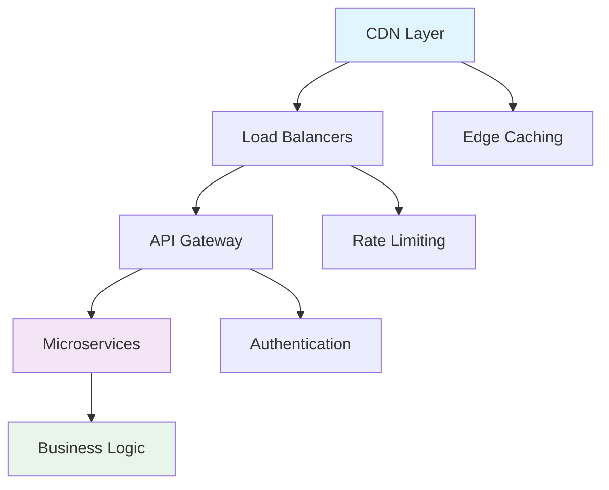
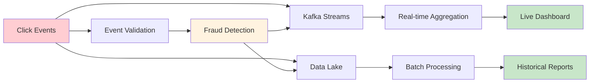
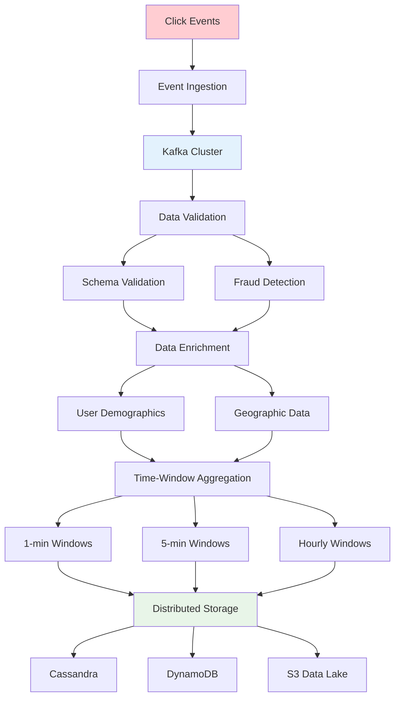

# Ads Click Counter and Aggregator Backend

## 📋 Table of Contents

- [Ads Click Counter and Aggregator Backend](#ads-click-counter-and-aggregator-backend)
  - [Requirements Gathering](#requirements-gathering)
    - [Functional Requirements](#functional-requirements)
    - [Non-Functional Requirements](#non-functional-requirements)
  - [Traffic Estimation & Capacity Planning](#traffic-estimation--capacity-planning)
    - [Click Volume Analysis](#click-volume-analysis)
    - [Storage Calculations](#storage-calculations)
    - [Throughput Requirements](#throughput-requirements)
  - [Database Schema Design](#database-schema-design)
    - [Click Events Schema](#click-events-schema)
    - [Aggregation Tables Schema](#aggregation-tables-schema)
    - [User Demographics Schema](#user-demographics-schema)
  - [System API Design](#system-api-design)
    - [Click Ingestion APIs](#click-ingestion-apis)
    - [Analytics Query APIs](#analytics-query-apis)
    - [Aggregation Management APIs](#aggregation-management-apis)
  - [High-Level Design (HLD)](#high-level-design-hld)
    - [System Architecture Overview](#system-architecture-overview)
    - [Data Flow Architecture](#data-flow-architecture)
    - [CDN Integration](#cdn-integration)
  - [Low-Level Design (LLD)](#low-level-design-lld)
    - [Click Capture Service](#click-capture-service)
    - [Stream Processing Pipeline](#stream-processing-pipeline)
    - [Aggregation Engine](#aggregation-engine)
  - [Core Algorithms](#core-algorithms)
    - [1. Click Deduplication Algorithm](#1-click-deduplication-algorithm)
    - [2. Real-time Aggregation Algorithm](#2-real-time-aggregation-algorithm)
    - [3. Hot Partition Mitigation Algorithm](#3-hot-partition-mitigation-algorithm)
    - [4. Data Retention and Archival Algorithm](#4-data-retention-and-archival-algorithm)
    - [5. Fraud Detection Algorithm](#5-fraud-detection-algorithm)
  - [Performance Optimizations](#performance-optimizations)
    - [Partition Strategy](#partition-strategy)
    - [Caching Strategy](#caching-strategy)
    - [Batch Processing Optimization](#batch-processing-optimization)
  - [Security Considerations](#security-considerations)
    - [Click Fraud Prevention](#click-fraud-prevention)
    - [Data Privacy](#data-privacy)
  - [Testing Strategy](#testing-strategy)
    - [Load Testing](#load-testing)
    - [Data Consistency Testing](#data-consistency-testing)
  - [Trade-offs and Considerations](#trade-offs-and-considerations)
    - [Consistency vs Availability](#consistency-vs-availability)
    - [Real-time vs Batch Processing](#real-time-vs-batch-processing)
    - [Storage Cost vs Query Performance](#storage-cost-vs-query-performance)

[⬆️ Back to Top](#--table-of-contents)

---

## Requirements Gathering

### Functional Requirements

**Core Click Recording Functionality:**
- Capture and log advertisement click events in real-time
- Record comprehensive metadata including user demographics, ad placement, and context
- Support deduplication of duplicate clicks using unique identifiers
- Enable complex analytical queries for marketing insights
- Provide aggregated metrics across multiple dimensions (time, geography, demographics)

**Analytics and Reporting:**
- Generate real-time dashboards for click performance
- Support historical trend analysis and reporting
- Enable segmentation by user demographics, ad campaigns, and time periods
- Provide conversion funnel analysis capabilities
- Support A/B testing metrics and campaign performance comparisons

**Data Management:**
- Handle high-volume click streams with minimal latency
- Support long-term data retention (10+ years) with cost optimization
- Enable data export capabilities for external analytics tools
- Provide data lineage tracking for audit purposes

[⬆️ Back to Top](#--table-of-contents)

### Non-Functional Requirements

**Performance Requirements:**
- Handle 1 billion clicks per day (peak load: 50,000 clicks/second)
- Click logging latency: < 100ms (p99)
- Analytics query response time: < 2 seconds for standard reports
- Support 99.9% availability with graceful degradation

**Scalability Requirements:**
- Horizontally scalable to handle traffic spikes
- Support global deployment across multiple data centers
- Auto-scaling capabilities based on traffic patterns
- Linear performance scaling with resource addition

**Consistency and Durability:**
- Eventual consistency acceptable for analytics (few minutes delay)
- Strong consistency for revenue-critical metrics
- Zero data loss for click events (financial impact)
- Support for replay capabilities in case of system failures

[⬆️ Back to Top](#--table-of-contents)

---

## Traffic Estimation & Capacity Planning

### Click Volume Analysis

**Daily Traffic Patterns:**
- 1 billion clicks per day baseline
- Peak hours: 3x average traffic (evening hours across time zones)
- Average: 11,574 clicks/second
- Peak: 50,000 clicks/second during major events or campaigns

**Geographic Distribution:**
- North America: 40% of traffic
- Europe: 30% of traffic
- Asia-Pacific: 25% of traffic
- Other regions: 5% of traffic

**Seasonal Variations:**
- Holiday seasons: 5x normal traffic
- Black Friday/Cyber Monday: 10x normal traffic
- Regular seasonal fluctuations: ±50% variance

[⬆️ Back to Top](#--table-of-contents)

### Storage Calculations

**Per-Click Data Size:**
- Basic click metadata: 0.1 KB per click
- Extended user demographics: Additional 0.05 KB
- Total per click: ~0.15 KB

**Daily Storage Requirements:**
- Raw clicks: 1B × 0.15 KB = 150 GB/day
- Aggregated data: ~10 GB/day (compressed)
- Total daily: 160 GB/day

**Long-term Storage Projections:**
- Annual raw data: 160 GB × 365 = ~58 TB/year
- 10-year retention: ~580 TB
- With compression and archival: ~200 TB effective storage

**Query Performance Storage:**
- Hot data (last 30 days): SSD storage for fast queries
- Warm data (3-12 months): Standard storage with caching
- Cold data (1+ years): Archival storage (S3 Glacier)

[⬆️ Back to Top](#--table-of-contents)

### Throughput Requirements

**Write Throughput:**
- Peak write: 50,000 writes/second
- Average write: 11,574 writes/second
- Batch write optimization: 1,000 records per batch

**Read Throughput:**
- Analytics queries: 1,000 concurrent queries
- Dashboard updates: 100 real-time connections
- Report generation: 50 concurrent heavy queries

**Network Bandwidth:**
- Ingress: 50,000 × 0.15 KB = 7.5 MB/second peak
- Egress: Query results + dashboard data ~10 MB/second
- Internal replication: 2x ingress for redundancy

[⬆️ Back to Top](#--table-of-contents)

---

## Database Schema Design

### Click Events Schema

**Primary Click Events Table:**
- Click ID (UUID): Unique identifier for deduplication
- Ad ID (UUID): Reference to advertisement
- User ID (hashed): Privacy-compliant user identifier
- Timestamp: Precise click time with timezone
- IP Address (hashed): Geographic analysis while preserving privacy
- User Agent: Browser and device information
- Referrer URL: Source of the click
- Click coordinates: X/Y position for heat map analysis

**Partitioning Strategy:**
- Primary partition: Date (daily partitions)
- Secondary partition: Geographic region
- Enables efficient time-based and geographic queries

[⬆️ Back to Top](#--table-of-contents)

### Aggregation Tables Schema

**Time-based Aggregations:**
- Minute-level aggregations: Real-time dashboards
- Hour-level aggregations: Standard reporting
- Daily aggregations: Historical analysis
- Monthly aggregations: Long-term trends

**Dimensional Aggregations:**
- By ad campaign: Campaign performance metrics
- By geography: Regional performance analysis
- By demographics: Audience segment analysis
- By device type: Cross-platform performance

**Pre-computed Metrics:**
- Click-through rates (CTR)
- Conversion rates
- Revenue per click (RPC)
- Cost per acquisition (CPA)

[⬆️ Back to Top](#--table-of-contents)

### User Demographics Schema

**User Profile Aggregation:**
- Age groups: Demographic targeting analysis
- Geographic regions: Location-based insights
- Device categories: Platform performance
- Behavioral segments: Interest-based groupings

**Privacy-Compliant Design:**
- Hashed identifiers only
- Aggregated data with k-anonymity
- No direct PII storage
- GDPR/CCPA compliance built-in

[⬆️ Back to Top](#--table-of-contents)

---

## System API Design

### Click Ingestion APIs

**Bulk Click Ingestion:**
- High-throughput batch ingestion endpoint
- Support for compressed payloads
- Idempotent operations with duplicate detection
- Asynchronous processing with acknowledgment

**Real-time Click Capture:**
- Low-latency single click endpoint
- Optimized for CDN edge caching
- Minimal payload validation for speed
- Fire-and-forget semantics with reliability

**Click Validation Service:**
- Fraud detection integration
- Bot traffic filtering
- Geographic validation
- Rate limiting per user/IP

[⬆️ Back to Top](#--table-of-contents)

### Analytics Query APIs

**Dashboard Data APIs:**
- Real-time metrics endpoint
- Cached aggregation serving
- WebSocket for live updates
- Optimized for visualization libraries

**Reporting APIs:**
- Complex query execution engine
- Support for custom date ranges
- Multi-dimensional filtering
- Export capabilities (CSV, JSON)

**Trend Analysis APIs:**
- Time-series data serving
- Comparative analysis support
- Statistical computation endpoints
- Predictive analytics integration

[⬆️ Back to Top](#--table-of-contents)

### Aggregation Management APIs

**Background Processing Control:**
- Aggregation job scheduling
- Processing status monitoring
- Error handling and retry logic
- Resource utilization tracking

**Data Lifecycle Management:**
- Archive policy configuration
- Data retention rule enforcement
- Storage tier management
- Compliance and audit support

[⬆️ Back to Top](#--table-of-contents)

---

## High-Level Design (HLD)

### System Architecture Overview

**Multi-tier Architecture:**

**Core Components:**
- **Click Capture Service**: High-throughput event ingestion
- **Stream Processing Engine**: Real-time data transformation
- **Aggregation Service**: Batch and real-time metric computation
- **Query Engine**: Optimized analytics query processing
- **Storage Layer**: Multi-tier data storage with lifecycle management

**Geographic Distribution:**
- Global CDN for click capture with edge processing
- Regional data centers for reduced latency
- Cross-region replication for disaster recovery
- Geo-sharded databases for regulatory compliance

[⬆️ Back to Top](#--table-of-contents)

### Data Flow Architecture

**Lambda Architecture Data Flow:**

**Stream Processing Pipeline:**

**Data Lake Architecture:**
- Raw events stored in object storage (S3/GCS)
- Partitioned by date and region for efficient querying
- Multiple data formats: Parquet for analytics, JSON for flexibility
- Data catalog for schema evolution and discovery

[⬆️ Back to Top](#--table-of-contents)

### CDN Integration

**Edge Processing Capabilities:**
- Click capture at CDN edge nodes
- Basic validation and filtering
- Geographic tagging and routing
- Reduced latency to sub-50ms globally

**Cache Strategy:**
- Static assets (tracking pixels, JavaScript) cached at edge
- Dynamic aggregation results cached with TTL
- Geographic distribution based on traffic patterns
- Intelligent cache warming for popular queries

[⬆️ Back to Top](#--table-of-contents)

---

## Low-Level Design (LLD)

### Click Capture Service

**High-Throughput Ingestion Design:**
- Async event processing with message queuing
- Connection pooling for database writes
- Batch processing for improved throughput
- Circuit breaker pattern for fault tolerance

**Deduplication Strategy:**
- Time-window based duplicate detection
- Bloom filters for memory-efficient checking
- UUID-based unique identification
- Configurable deduplication windows

**Load Balancing:**
- Consistent hashing for even distribution
- Health check integration
- Auto-scaling based on queue depth
- Geographic routing for latency optimization

[⬆️ Back to Top](#--table-of-contents)

### Stream Processing Pipeline

**Kafka Configuration:**
- Topic partitioning by ad campaign and geography
- Replication factor of 3 for durability
- Configurable retention policies
- Producer acknowledgment settings for reliability

**Processing Topology:**
- Parallel processing streams for scalability
- Stateful processing for aggregations
- Windowing functions for time-based analysis
- Error handling with dead letter queues

**State Management:**
- Distributed state stores for stream processing
- Checkpoint and recovery mechanisms
- State compaction for efficiency
- Hot-standby replicas for fast failover

[⬆️ Back to Top](#--table-of-contents)

### Aggregation Engine

**Multi-level Aggregation:**
- Real-time: Sliding window aggregations (1-minute, 5-minute)
- Near real-time: Tumbling window aggregations (hourly)
- Batch: Daily, weekly, monthly aggregations
- On-demand: Custom query aggregations

**Distributed Computing:**
- Map-Reduce paradigm for large-scale processing
- Spark/Flink for complex analytical computations
- Distributed storage for intermediate results
- Resource isolation for different workload types

**Optimization Techniques:**
- Pre-aggregation at ingestion time
- Materialized views for common queries
- Incremental aggregation updates
- Parallel processing across multiple dimensions

[⬆️ Back to Top](#--table-of-contents)

---

## Core Algorithms

### 1. Click Deduplication Algorithm

**Time-Window Deduplication:**
- Maintain sliding window of recent clicks (configurable duration)
- Use composite key: User ID + Ad ID + Timestamp window
- Implement probabilistic data structures (Bloom filters) for memory efficiency
- Handle edge cases: clock skew, network delays, retries

**UUID-based Approach:**
- Generate unique identifiers for each ad placement
- Client-side UUID generation with server-side validation
- Handle UUID collisions with timestamp tiebreakers
- Persist deduplication state with configurable TTL

**Distributed Deduplication:**
- Consistent hashing for deduplication service distribution
- Shared state across service instances
- Eventual consistency model for deduplication decisions
- Conflict resolution for concurrent duplicate detection

[⬆️ Back to Top](#--table-of-contents)

### 2. Real-time Aggregation Algorithm

**Sliding Window Aggregation:**
- Maintain multiple overlapping time windows
- Incremental updates as new events arrive
- Efficient memory management with window expiration
- Support for various aggregation functions (sum, count, average, percentiles)

**Hierarchical Aggregation:**
- Bottom-up aggregation: minute → hour → day → month
- Incremental computation to avoid reprocessing
- Rollup strategies for different granularities
- Error propagation and correction mechanisms

**Approximate Algorithms:**
- HyperLogLog for distinct count estimation
- Count-Min Sketch for frequency estimation
- Reservoir sampling for representative samples
- Trade accuracy for performance in high-volume scenarios

[⬆️ Back to Top](#--table-of-contents)

### 3. Hot Partition Mitigation Algorithm

**Dynamic Partitioning:**
- Monitor partition load in real-time
- Automatic partition splitting when load exceeds threshold
- Consistent hashing with virtual nodes
- Load balancing across available partitions

**Traffic Shaping:**
- Rate limiting for individual ad campaigns
- Priority queuing for different traffic types
- Backpressure handling with queue management
- Graceful degradation under extreme load

**Consistent Hashing Strategy:**
- Virtual node mapping for even distribution
- Partition rebalancing without service interruption
- Replica placement optimization
- Hot spot detection and mitigation

[⬆️ Back to Top](#--table-of-contents)

### 4. Data Retention and Archival Algorithm

**Lifecycle Management:**
- Automated data classification by age and access patterns
- Tiered storage migration (hot → warm → cold)
- Compression algorithms for long-term storage
- Metadata preservation during archival process

**Cost Optimization:**
- Storage cost analysis and optimization
- Intelligent compression based on data characteristics
- Deduplication at the storage level
- Archive retrieval optimization for occasional access

**Compliance and Audit:**
- Retention policy enforcement
- Audit trail for data lifecycle events
- Legal hold capabilities for compliance requirements
- Secure deletion with verification

[⬆️ Back to Top](#--table-of-contents)

### 5. Fraud Detection Algorithm

**Pattern Recognition:**
- Machine learning models for bot detection
- Behavioral analysis for suspicious patterns
- Geographic anomaly detection
- Time-based pattern analysis

**Real-time Scoring:**
- Risk score calculation for each click
- Threshold-based filtering
- Adaptive scoring based on historical data
- Integration with external fraud detection services

**Feedback Loop:**
- Continuous model training with new data
- Human verification integration
- False positive reduction strategies
- Performance metric tracking and optimization

[⬆️ Back to Top](#--table-of-contents)

---

## Performance Optimizations

### Partition Strategy

**Geographic Partitioning:**
- Partition data by geographic regions
- Optimize for local query patterns
- Reduce cross-partition queries
- Enable regulatory compliance (data residency)

**Time-based Partitioning:**
- Daily/weekly partitions for time-series data
- Partition pruning for historical queries
- Parallel processing across time ranges
- Efficient archival of old partitions

**Hybrid Partitioning:**
- Multi-dimensional partitioning strategy
- Composite partitioning keys
- Query pattern optimization
- Dynamic repartitioning based on data distribution

[⬆️ Back to Top](#--table-of-contents)

### Caching Strategy

**Multi-level Caching:**
- L1: Application-level caching for frequently accessed data
- L2: Distributed cache (Redis/Memcached) for shared data
- L3: CDN caching for static and semi-static content
- Cache coherency strategies across levels

**Intelligent Cache Warming:**
- Predictive cache warming based on usage patterns
- Priority-based cache population
- Cache hit ratio optimization
- Memory usage optimization

**Cache Invalidation:**
- Event-driven cache invalidation
- TTL-based expiration strategies
- Write-through and write-behind patterns
- Consistency guarantees across cache layers

[⬆️ Back to Top](#--table-of-contents)

### Batch Processing Optimization

**Parallel Processing:**
- Data parallelism across processing nodes
- Task parallelism for different aggregation types
- Resource isolation for batch vs. real-time workloads
- Dynamic resource allocation based on workload

**I/O Optimization:**
- Columnar storage formats (Parquet, ORC)
- Compression optimization for storage and transfer
- Batch size optimization for throughput
- Memory mapping for large dataset processing

**Processing Pipeline:**
- ETL pipeline optimization
- Incremental processing for efficiency
- Error handling and retry mechanisms
- Monitoring and alerting for batch jobs

[⬆️ Back to Top](#--table-of-contents)

---

## Security Considerations

### Click Fraud Prevention

**Multi-layered Detection:**
- Rate limiting per IP address and user
- Pattern analysis for automated traffic
- Device fingerprinting for bot detection
- Geographic and temporal anomaly detection

**Machine Learning Integration:**
- Real-time fraud scoring models
- Behavioral analysis algorithms
- Adaptive threshold adjustment
- Continuous model retraining

**Third-party Integration:**
- External fraud detection services
- IP reputation databases
- Device intelligence platforms
- Threat intelligence feeds

[⬆️ Back to Top](#--table-of-contents)

### Data Privacy

**Privacy by Design:**
- Data minimization principles
- Purpose limitation enforcement
- Anonymization and pseudonymization
- Consent management integration

**Compliance Framework:**
- GDPR compliance for European users
- CCPA compliance for California residents
- Data subject rights implementation
- Privacy impact assessments

**Encryption and Security:**
- End-to-end encryption for sensitive data
- Encryption at rest and in transit
- Key management and rotation
- Access control and audit logging

[⬆️ Back to Top](#--table-of-contents)

---

## Testing Strategy

### Load Testing

**Performance Testing:**
- Gradual load increase testing
- Peak load simulation
- Sustained load testing
- Breaking point identification

**Stress Testing:**
- System behavior under extreme conditions
- Resource exhaustion scenarios
- Recovery testing after failures
- Cascading failure prevention

**Scalability Testing:**
- Horizontal scaling validation
- Auto-scaling behavior verification
- Resource utilization optimization
- Performance regression testing

[⬆️ Back to Top](#--table-of-contents)

### Data Consistency Testing

**Eventual Consistency Validation:**
- Cross-replica consistency checking
- Convergence time measurement
- Conflict resolution validation
- Data integrity verification

**Aggregation Accuracy:**
- End-to-end data flow validation
- Aggregation result verification
- Temporal consistency checking
- Cross-dimensional consistency

**Disaster Recovery Testing:**
- Data loss prevention validation
- Recovery time objective (RTO) testing
- Recovery point objective (RPO) validation
- Failover and failback procedures

[⬆️ Back to Top](#--table-of-contents)

---

## Trade-offs and Considerations

### Consistency vs Availability

**CAP Theorem Application:**
- Prioritize availability for click ingestion
- Accept eventual consistency for analytics
- Strong consistency for revenue-critical operations
- Partition tolerance through replication

**Consistency Models:**
- Strong consistency for financial transactions
- Eventual consistency for analytics aggregations
- Session consistency for user-facing operations
- Monotonic consistency for time-series data

[⬆️ Back to Top](#--table-of-contents)

### Real-time vs Batch Processing

**Lambda Architecture Benefits:**
- Real-time insights for immediate decision making
- Batch processing for complex analytics
- Cost optimization through appropriate processing choice
- Flexibility in handling different data access patterns

**Processing Trade-offs:**
- Real-time: Higher cost, lower latency, approximate results
- Batch: Lower cost, higher latency, exact results
- Hybrid approach for optimal cost-performance balance

[⬆️ Back to Top](#--table-of-contents)

### Storage Cost vs Query Performance

**Storage Optimization:**
- Hot data on fast storage for quick access
- Cold data on cheap storage with slower access
- Compression for long-term storage cost reduction
- Intelligent data lifecycle management

**Query Performance:**
- Indexing strategies for common query patterns
- Materialized views for complex aggregations
- Caching for frequently accessed data
- Query optimization through data modeling

**Cost Management:**
- Storage tier optimization based on access patterns
- Compute resource optimization for batch processing
- Network cost reduction through geographic distribution
- Monitoring and alerting for cost anomalies

[⬆️ Back to Top](#--table-of-contents) 