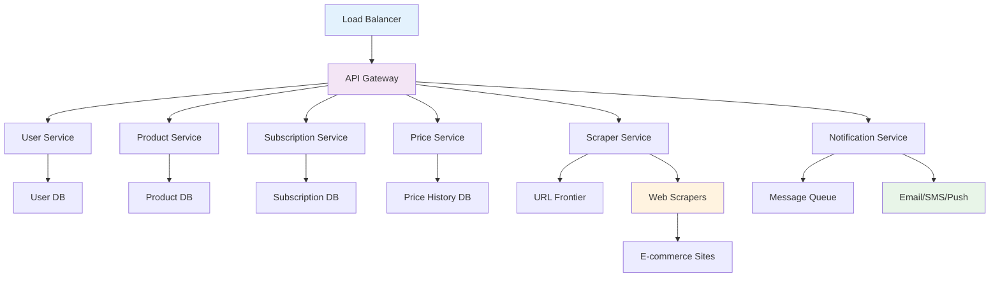
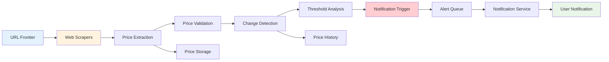
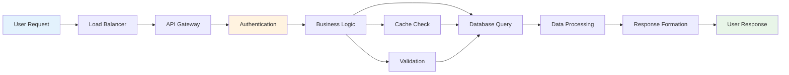
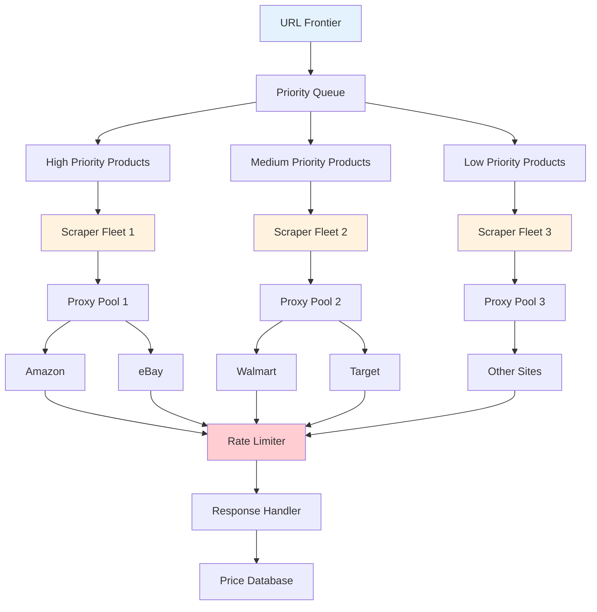
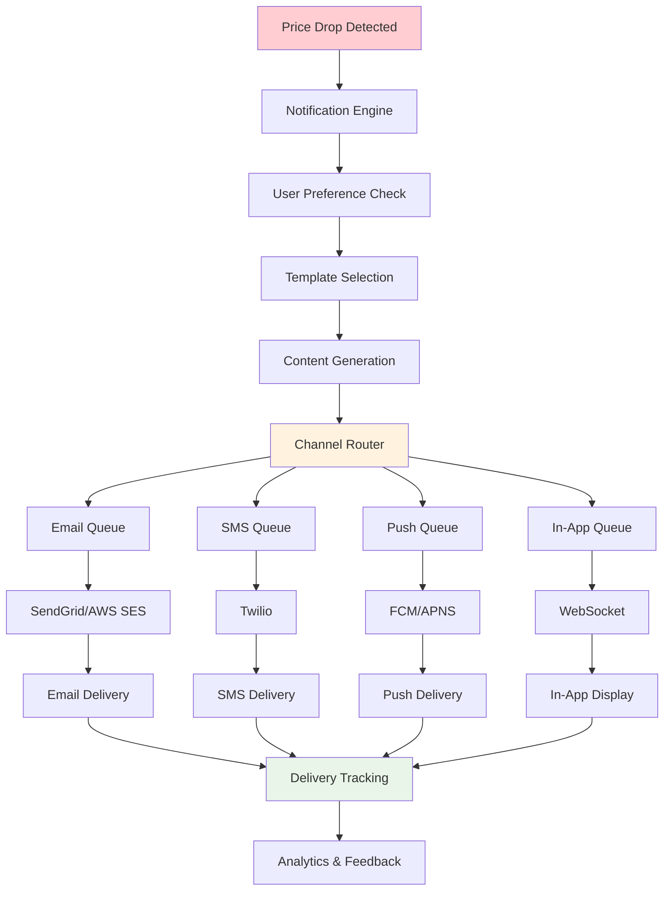

# Price Drop Tracker Backend

## 📋 Table of Contents

- [Price Drop Tracker Backend](#price-drop-tracker-backend)
  - [Requirements Gathering](#requirements-gathering)
    - [Functional Requirements](#functional-requirements)
    - [Non-Functional Requirements](#non-functional-requirements)
  - [Traffic Estimation & Capacity Planning](#traffic-estimation--capacity-planning)
    - [User Subscription Analysis](#user-subscription-analysis)
    - [Scraping Volume Calculations](#scraping-volume-calculations)
    - [Notification Traffic Requirements](#notification-traffic-requirements)
  - [Database Schema Design](#database-schema-design)
    - [Product Price Database Schema](#product-price-database-schema)
    - [User Subscription Schema](#user-subscription-schema)
    - [Price History Schema](#price-history-schema)
  - [System API Design](#system-api-design)
    - [User Management APIs](#user-management-apis)
    - [Product Tracking APIs](#product-tracking-apis)
    - [Price Alert APIs](#price-alert-apis)
  - [High-Level Design (HLD)](#high-level-design-hld)
    - [System Architecture Overview](#system-architecture-overview)
    - [Data Flow Architecture](#data-flow-architecture)
    - [Web Scraping Infrastructure](#web-scraping-infrastructure)
  - [Low-Level Design (LLD)](#low-level-design-lld)
    - [Web Scraper Service](#web-scraper-service)
    - [Price Change Detection Engine](#price-change-detection-engine)
    - [Notification System](#notification-system)
  - [Core Algorithms](#core-algorithms)
    - [1. Adaptive Scraping Algorithm](#1-adaptive-scraping-algorithm)
    - [2. Price Change Detection Algorithm](#2-price-change-detection-algorithm)
    - [3. Threshold-based Alerting Algorithm](#3-threshold-based-alerting-algorithm)
    - [4. URL Frontier Management Algorithm](#4-url-frontier-management-algorithm)
    - [5. Notification Deduplication Algorithm](#5-notification-deduplication-algorithm)
  - [Performance Optimizations](#performance-optimizations)
    - [Scraping Optimization](#scraping-optimization)
    - [Database Optimization](#database-optimization)
    - [Notification Optimization](#notification-optimization)
  - [Security Considerations](#security-considerations)
    - [Scraping Ethics and Rate Limiting](#scraping-ethics-and-rate-limiting)
    - [Data Privacy](#data-privacy)
  - [Testing Strategy](#testing-strategy)
    - [Scraper Testing](#scraper-testing)
    - [End-to-End Testing](#end-to-end-testing)
  - [Trade-offs and Considerations](#trade-offs-and-considerations)
    - [Scraping Frequency vs Resource Cost](#scraping-frequency-vs-resource-cost)
    - [Real-time vs Batch Notifications](#real-time-vs-batch-notifications)
    - [SQL vs NoSQL for Price Data](#sql-vs-nosql-for-price-data)

[⬆️ Back to Top](#--table-of-contents)

---

## Requirements Gathering

### Functional Requirements

**Core Price Tracking Functionality:**
- Enable users to subscribe to product price alerts from multiple e-commerce platforms
- Track price changes and maintain historical price data for products
- Send notifications when prices drop below user-defined thresholds
- Support multiple notification channels (email, SMS, push notifications)
- Provide price history analytics and trend visualization

**Product Management:**
- Add products to tracking system via URL or product identifier
- Automatically extract product metadata (name, image, category, seller)
- Handle product variants and different marketplace listings
- Support bulk product import and management
- Maintain product availability status and stock tracking

**User Experience Features:**
- User registration and subscription management
- Customizable price threshold settings per product
- Price drop prediction and trend analysis
- Wishlist management and product organization
- Historical price charts and analytics dashboard

**Administrative Features:**
- Monitor scraping performance and success rates
- Manage blocked domains and rate limiting policies
- Analytics on user engagement and notification effectiveness
- System health monitoring and alerting

[⬆️ Back to Top](#--table-of-contents)

### Non-Functional Requirements

**Performance Requirements:**
- Support 10 million tracked products with hourly price updates
- Handle 1 million active user subscriptions
- Process 100,000 price checks per minute during peak hours
- Notification delivery within 5 minutes of price drop detection
- System availability: 99.9% uptime with graceful degradation

**Scalability Requirements:**
- Horizontally scalable web scraping infrastructure
- Support for adding new e-commerce platforms and regions
- Auto-scaling based on scraping workload and user activity
- Linear performance scaling with increased product catalog

**Reliability and Consistency:**
- Eventual consistency acceptable for price updates (up to 1 hour delay)
- Strong consistency for user subscription changes
- Zero data loss for price history and user preferences
- Robust handling of website structure changes and anti-bot measures

**Compliance and Ethics:**
- Respect robots.txt and website terms of service
- Implement responsible scraping with appropriate delays
- GDPR compliance for user data and privacy
- Transparent data usage and retention policies

[⬆️ Back to Top](#--table-of-contents)

---

## Traffic Estimation & Capacity Planning

### User Subscription Analysis

**User Base Projections:**
- 1 million registered users baseline
- 500,000 active monthly users
- Average 10 products tracked per active user
- 5 million total product-user subscription pairs

**Subscription Patterns:**
- Peak activity during holiday seasons (3x normal)
- Daily pattern: highest activity during lunch and evening hours
- Geographic distribution: 60% North America, 25% Europe, 15% Asia-Pacific

**Growth Projections:**
- User base growth: 20% annually
- Product catalog growth: 30% annually
- Notification volume growth: 25% annually

[⬆️ Back to Top](#--table-of-contents)

### Scraping Volume Calculations

**Product Scraping Requirements:**
- 10 million products to track across platforms
- Hourly scraping frequency for popular products
- Daily scraping for long-tail products
- Adaptive frequency based on price volatility

**Scraping Load Distribution:**
- Peak scraping: 50,000 requests per minute
- Average scraping: 20,000 requests per minute
- Platform distribution: Amazon (40%), eBay (20%), Walmart (15%), Others (25%)

**Resource Requirements:**
- Network bandwidth: 100 Mbps sustained, 500 Mbps peak
- Storage: 500 GB daily for price data and metadata
- Processing: 1,000 CPU cores for parallel scraping
- Memory: 2 TB for caching and URL frontier management

[⬆️ Back to Top](#--table-of-contents)

### Notification Traffic Requirements

**Notification Volume:**
- 100,000 price drop alerts per day average
- 500,000 alerts during major sale events
- 60% email notifications, 30% push notifications, 10% SMS

**Delivery Requirements:**
- 95% of notifications delivered within 5 minutes
- Support for notification batching and digest modes
- Retry mechanism for failed deliveries
- Unsubscribe and preference management

**Infrastructure Scaling:**
- Message queue capacity: 1 million messages in buffer
- Email service: 50,000 emails per hour sustained capacity
- Push notification service: 100,000 notifications per hour
- SMS service: 10,000 messages per hour

[⬆️ Back to Top](#--table-of-contents)

---

## Database Schema Design

### Product Price Database Schema

**Current Price Table:**
- Product ID (Primary Key): Unique identifier across platforms
- Product URL: Canonical product page URL
- Current Price: Latest scraped price with currency
- Last Updated: Timestamp of last successful scrape
- Seller Information: Merchant name and seller rating
- Availability Status: In stock, out of stock, discontinued

**Product Metadata Table:**
- Product ID (Primary Key): Links to price data
- Product Name: Clean, normalized product title
- Category: Product classification and taxonomy
- Brand: Manufacturer or brand information
- Image URLs: Product images for display
- Specifications: Key product attributes and features

**Platform Integration:**
- Platform ID: Amazon, eBay, Walmart, etc.
- Platform Product ID: Native product identifier
- Platform-specific metadata: Reviews, ratings, shipping info
- Scraping configuration: CSS selectors, parsing rules

[⬆️ Back to Top](#--table-of-contents)

### User Subscription Schema

**User Management Table:**
- User ID (Primary Key): Unique user identifier
- Email: Primary contact for notifications
- Notification Preferences: Channels, frequency, timing
- Account Settings: Timezone, currency, language
- Registration Date: Account creation timestamp

**Subscription Tracking Table:**
- Subscription ID (Primary Key): Composite key (User + Product)
- User ID (Foreign Key): References user table
- Product ID (Foreign Key): References product table
- Price Threshold: Alert trigger price point
- Created Date: Subscription start timestamp
- Status: Active, paused, cancelled

**Notification History:**
- Notification ID (Primary Key): Unique notification identifier
- Subscription ID: Links to user-product subscription
- Notification Type: Price drop, back in stock, error
- Sent Timestamp: When notification was dispatched
- Delivery Status: Sent, delivered, failed, clicked

[⬆️ Back to Top](#--table-of-contents)

### Price History Schema

**Historical Price Data:**
- Price History ID (Primary Key): Unique record identifier
- Product ID (Foreign Key): Links to product data
- Price: Historical price point with currency
- Timestamp: When price was recorded
- Price Change: Difference from previous price
- Promotion Details: Sale information, discount codes

**Aggregated Statistics:**
- Product ID (Primary Key): Product identifier
- Time Period: Daily, weekly, monthly aggregations
- Average Price: Mean price for the period
- Min/Max Price: Price range for the period
- Price Volatility: Statistical measure of price changes
- Trend Direction: Increasing, decreasing, stable

**Analytics Optimization:**
- Partitioning: By date and product category
- Indexing: Product ID, timestamp, price range
- Compression: Historical data compression for storage efficiency
- Archival: Long-term storage for old price data

[⬆️ Back to Top](#--table-of-contents)

---

## System API Design

### User Management APIs

**User Registration and Authentication:**
- User registration with email verification
- Login/logout with session management
- Password reset and security features
- Account settings and preference management

**Subscription Management:**
- Add/remove product subscriptions
- Update price thresholds and notification settings
- Bulk subscription import/export
- Subscription analytics and history

**Notification Preferences:**
- Configure notification channels and timing
- Set digest mode and frequency preferences
- Manage unsubscribe and re-subscription
- Notification history and delivery status

[⬆️ Back to Top](#--table-of-contents)

### Product Tracking APIs

**Product Discovery:**
- Add products by URL or search
- Product metadata extraction and validation
- Duplicate product detection and merging
- Product category and classification

**Price Data Access:**
- Current price and availability status
- Historical price data and trends
- Price comparison across platforms
- Price prediction and analytics

**Product Management:**
- Update product information and metadata
- Manage product variants and options
- Handle discontinued or unavailable products
- Product performance and tracking analytics

[⬆️ Back to Top](#--table-of-contents)

### Price Alert APIs

**Alert Configuration:**
- Set up price drop thresholds
- Configure notification timing and channels
- Manage alert conditions and rules
- Test notification delivery

**Alert Processing:**
- Real-time price change detection
- Alert generation and queuing
- Notification dispatch and tracking
- Alert analytics and effectiveness metrics

**Administrative APIs:**
- Monitor scraping performance and health
- Manage rate limiting and scraping policies
- System analytics and performance metrics
- Error handling and debugging tools

[⬆️ Back to Top](#--table-of-contents)

---

## High-Level Design (HLD)

### System Architecture Overview

**Microservices Architecture:**

**Core Components:**
- **User Service**: Authentication, user management, preferences
- **Product Service**: Product catalog, metadata management
- **Price Service**: Price data storage, history, analytics
- **Scraper Service**: Web scraping, data extraction, URL management
- **Subscription Service**: User-product relationships, threshold management
- **Notification Service**: Alert generation, delivery, tracking

**Data Storage Layer:**
- **Primary Database**: PostgreSQL for transactional data
- **Time Series Database**: InfluxDB for price history
- **Cache Layer**: Redis for frequent access patterns
- **Message Queue**: Apache Kafka for event streaming
- **Object Storage**: S3 for product images and static assets

[⬆️ Back to Top](#--table-of-contents)

### Data Flow Architecture

**Price Tracking Data Flow:**

**User Interaction Flow:**

**Event-Driven Architecture:**
1. **Price Update Events**: Scraped price changes trigger downstream processing
2. **Subscription Events**: User subscription changes update tracking configuration
3. **Notification Events**: Price drops generate notification delivery tasks
4. **System Events**: Health monitoring and performance tracking

**Data Pipeline:**
- **Ingestion**: Continuous scraping and price data collection
- **Processing**: Price change detection and threshold analysis
- **Storage**: Multi-tier storage for different data access patterns
- **Analytics**: Real-time and batch analytics for insights

[⬆️ Back to Top](#--table-of-contents)

### Web Scraping Infrastructure

**Distributed Scraping Architecture:**

**Scraping Coordination:**
- **Task Distribution**: Load balancing across scraper instances
- **Failure Handling**: Retry mechanisms and dead letter queues
- **Health Monitoring**: Scraper performance and success rate tracking
- **Configuration Management**: Dynamic scraping rules and selectors

**Anti-Detection Measures:**
- **User Agent Rotation**: Realistic browser fingerprinting
- **Request Timing**: Human-like browsing patterns
- **Session Management**: Maintaining scraping session state
- **CAPTCHA Handling**: Automated and manual CAPTCHA solving

[⬆️ Back to Top](#--table-of-contents)

---

## Low-Level Design (LLD)

### Web Scraper Service

**Scraping Engine Design:**
- **Worker Pool**: Configurable number of concurrent scraping threads
- **Request Management**: HTTP client with connection pooling and timeouts
- **Content Parsing**: Robust HTML parsing with fallback selectors
- **Data Validation**: Price format validation and sanity checks

**URL Frontier Management:**
- **Priority Scheduling**: High-priority products scraped more frequently
- **Deduplication**: Prevent duplicate scraping requests
- **Batch Processing**: Group similar requests for efficiency
- **State Persistence**: Durable queue state across service restarts

**Error Handling and Resilience:**
- **Exponential Backoff**: Progressive retry delays for failed requests
- **Circuit Breaker**: Temporary suspension of problematic targets
- **Graceful Degradation**: Partial scraping success handling
- **Monitoring Integration**: Real-time alerting for scraping issues

[⬆️ Back to Top](#--table-of-contents)

### Price Change Detection Engine

**Change Detection Logic:**
- **Price Comparison**: Current vs. previous price analysis
- **Threshold Evaluation**: User-defined price drop detection
- **Significance Filtering**: Ignore minor price fluctuations
- **Trend Analysis**: Price movement pattern recognition

**Event Generation:**
- **Change Events**: Structured price change notifications
- **Event Enrichment**: Adding product and user context
- **Event Routing**: Directing events to appropriate consumers
- **Event Persistence**: Audit trail for all price changes

**Performance Optimization:**
- **Batch Processing**: Group price updates for efficiency
- **Incremental Updates**: Only process actual price changes
- **Caching Strategy**: Cache recent prices for quick comparison
- **Parallel Processing**: Concurrent change detection across products

[⬆️ Back to Top](#--table-of-contents)

### Notification System

**Multi-Channel Notification System:**

**Notification Pipeline:**
- **Template Engine**: Dynamic notification content generation
- **Personalization**: User-specific content and preferences
- **Scheduling**: Optimal delivery timing based on user timezone
- **Delivery Tracking**: End-to-end delivery confirmation

**Reliability and Scale:**
- **Message Queue**: Kafka-based notification queue
- **Retry Logic**: Failed delivery retry with exponential backoff
- **Dead Letter Queue**: Handling persistently failed notifications
- **Rate Limiting**: Respect provider limits and user preferences

[⬆️ Back to Top](#--table-of-contents)

---

## Core Algorithms

### 1. Adaptive Scraping Algorithm

**Dynamic Frequency Adjustment:**
- Monitor price volatility and adjust scraping frequency accordingly
- High-volatility products: Scrape every 15-30 minutes
- Stable prices: Reduce to daily or weekly scraping
- Special events: Increase frequency during sales periods

**Resource Optimization:**
- Load-based scheduling to prevent server overload
- Intelligent batching of similar product requests
- Geographical scraping distribution for global coverage
- Cost-aware scaling based on cloud resource pricing

**Priority Scoring:**
- User subscription count as primary priority factor
- Recent price change history influences scoring
- Product popularity and category importance
- Time since last successful scrape consideration

**Failure Recovery:**
- Exponential backoff for temporarily inaccessible products
- Alternative URL discovery for moved product pages
- Graceful handling of website structure changes
- Fallback to cached data during extended outages

[⬆️ Back to Top](#--table-of-contents)

### 2. Price Change Detection Algorithm

**Multi-Stage Validation:**
- Initial price extraction with multiple parsing strategies
- Price format normalization (currency, decimal handling)
- Sanity checks against historical price ranges
- Outlier detection to filter erroneous price data

**Change Significance Analysis:**
- Percentage-based threshold filtering (ignore <1% changes)
- Absolute price change consideration for low-cost items
- Trend analysis to distinguish temporary vs. sustained changes
- Sale detection through pattern recognition

**Real-time Processing:**
- Stream processing for immediate price change detection
- Sliding window analysis for trend identification
- Batch processing for historical analysis and validation
- Event-driven architecture for responsive alert generation

**Data Quality Assurance:**
- Cross-validation with multiple data sources when available
- Historical consistency checks for price accuracy
- Machine learning models for anomaly detection
- Manual review processes for high-value discrepancies

[⬆️ Back to Top](#--table-of-contents)

### 3. Threshold-based Alerting Algorithm

**Multi-Criteria Evaluation:**
- User-defined absolute price thresholds
- Percentage-based price drop detection
- Historical low price comparisons
- Competitive pricing analysis across platforms

**Intelligent Filtering:**
- Duplicate alert prevention within time windows
- Escalating alert importance based on drop magnitude
- User engagement-based alert frequency adjustment
- Seasonal and promotional context consideration

**Personalization Engine:**
- Learning user response patterns to optimize timing
- Preference-based alert channel selection
- Behavioral analysis for alert frequency tuning
- Machine learning for price drop prediction

**Business Logic Integration:**
- Stock availability checks before alert generation
- Seller reputation and reliability scoring
- Shipping cost and total price calculations
- Promotional period detection and handling

[⬆️ Back to Top](#--table-of-contents)

### 4. URL Frontier Management Algorithm

**Priority Queue Implementation:**
- Multi-level priority queues for different scraping urgencies
- Time-based scheduling for regular scraping intervals
- Load balancing across geographic regions and domains
- Dynamic priority adjustment based on system load

**Deduplication Strategy:**
- URL canonicalization for consistent product identification
- Bloom filters for memory-efficient duplicate detection
- Time-window based deduplication for periodic rescans
- Cross-platform product matching and consolidation

**Crawl Politeness:**
- Domain-specific rate limiting and delay management
- Robots.txt compliance and respect for crawl directives
- Adaptive delays based on server response times
- Distributed crawling to minimize per-domain load

**State Management:**
- Persistent queue state for recovery after system restarts
- Progress tracking for long-running scraping jobs
- Error state handling and automatic retry scheduling
- Performance metrics collection for optimization

[⬆️ Back to Top](#--table-of-contents)

### 5. Notification Deduplication Algorithm

**UUID-based Identification:**
- Unique notification identifiers for idempotent processing
- Content-based deduplication using message fingerprints
- Time-window based duplicate detection and suppression
- Cross-channel deduplication for multi-channel notifications

**Smart Aggregation:**
- Batching multiple price drops for single products
- Daily/weekly digest modes for frequent price changes
- User preference-based aggregation rules
- Priority-based notification consolidation

**Delivery Optimization:**
- Optimal timing based on user activity patterns
- Timezone-aware delivery scheduling
- Channel failover for improved delivery rates
- A/B testing for notification effectiveness

**Feedback Loop Integration:**
- User engagement tracking for notification optimization
- Unsubscribe pattern analysis for content improvement
- Delivery success rate monitoring and adjustment
- Machine learning for personalized notification strategies

[⬆️ Back to Top](#--table-of-contents)

---

## Performance Optimizations

### Scraping Optimization

**Concurrent Processing:**
- Parallel scraping across multiple domains and products
- Connection pooling for reduced overhead
- Asynchronous request processing for improved throughput
- Batch processing for similar product requests

**Caching Strategy:**
- DNS caching for faster domain resolution
- HTTP response caching for unchanged content
- Product metadata caching to reduce redundant processing
- Intelligent cache invalidation based on content changes

**Network Optimization:**
- Geographically distributed scraping infrastructure
- Content compression for reduced bandwidth usage
- Keep-alive connections for persistent scraping sessions
- Adaptive timeout configuration based on target responsiveness

**Resource Management:**
- Dynamic scaling based on scraping workload
- Memory pool management for consistent performance
- CPU optimization through efficient parsing algorithms
- Storage optimization for scraped data and metadata

[⬆️ Back to Top](#--table-of-contents)

### Database Optimization

**Indexing Strategy:**
- Composite indexes for complex query patterns
- Partial indexes for frequently filtered data
- Time-based partitioning for historical price data
- Covering indexes to reduce database I/O

**Query Optimization:**
- Read replicas for analytical workloads
- Query result caching for repeated requests
- Batch operations for bulk data processing
- Optimized aggregation queries for analytics

**Storage Optimization:**
- Data compression for historical price storage
- Archival strategies for old data
- Efficient data types for price and timestamp storage
- Partitioning strategies for improved query performance

**Connection Management:**
- Connection pooling for reduced overhead
- Load balancing across database replicas
- Prepared statements for query optimization
- Transaction batching for improved throughput

[⬆️ Back to Top](#--table-of-contents)

### Notification Optimization

**Delivery Efficiency:**
- Batch processing for email and SMS delivery
- Template caching for notification generation
- Asynchronous processing for non-blocking operation
- Priority queues for urgent vs. standard notifications

**Content Optimization:**
- Dynamic content generation based on user preferences
- Image optimization and CDN usage for rich notifications
- Compression for large notification payloads
- Localization and personalization optimization

**Channel Optimization:**
- Multi-channel failover for improved delivery rates
- Optimal timing analysis for each notification channel
- A/B testing for notification content and timing
- User engagement tracking for continuous improvement

**Scalability Measures:**
- Horizontal scaling of notification workers
- Load balancing across notification service instances
- Circuit breakers for external service failures
- Graceful degradation during peak load periods

[⬆️ Back to Top](#--table-of-contents)

---

## Security Considerations

### Scraping Ethics and Rate Limiting

**Responsible Scraping Practices:**
- Strict adherence to robots.txt directives
- Reasonable request delays to avoid server overload
- User agent identification and contact information
- Monitoring and respecting website terms of service

**Anti-Detection Measures:**
- Human-like browsing patterns and timing
- Diverse proxy and IP address rotation
- Browser fingerprint randomization
- Session management and cookie handling

**Legal Compliance:**
- Regular review of scraping target terms of service
- Data usage compliance with website policies
- Intellectual property respect for scraped content
- Geographic compliance with local scraping regulations

**Rate Limiting Implementation:**
- Domain-specific rate limiting policies
- Adaptive rate limiting based on server responses
- Global rate limiting for resource protection
- Emergency circuit breakers for problematic targets

[⬆️ Back to Top](#--table-of-contents)

### Data Privacy

**User Data Protection:**
- Encryption at rest for sensitive user information
- Secure transmission protocols for all data exchanges
- Minimal data collection and retention policies
- Regular security audits and vulnerability assessments

**Privacy Compliance:**
- GDPR compliance for European users
- CCPA compliance for California residents
- Data subject rights implementation (access, deletion, portability)
- Privacy policy transparency and user consent management

**Access Control:**
- Role-based access control for administrative functions
- API authentication and authorization
- Audit logging for all data access and modifications
- Secure key management and rotation

**Data Anonymization:**
- User data anonymization for analytics
- Secure aggregation techniques for privacy preservation
- Differential privacy for statistical data release
- Regular data purging for inactive accounts

[⬆️ Back to Top](#--table-of-contents)

---

## Testing Strategy

### Scraper Testing

**Unit Testing:**
- Individual scraping function validation
- Price parsing accuracy testing
- Error handling and edge case coverage
- Performance benchmarking for scraping operations

**Integration Testing:**
- End-to-end scraping workflow testing
- Database integration and data persistence testing
- Message queue integration testing
- External service integration validation

**Load Testing:**
- High-volume scraping performance testing
- Concurrent scraping stress testing
- Resource utilization monitoring during peak loads
- Scalability testing with increased product catalogs

**Reliability Testing:**
- Network failure and recovery testing
- Website structure change adaptation testing
- Anti-bot detection and circumvention testing
- Long-running scraping job stability testing

[⬆️ Back to Top](#--table-of-contents)

### End-to-End Testing

**User Journey Testing:**
- Complete user registration and subscription flow
- Price drop detection and notification delivery
- Notification preference management testing
- Account management and data export testing

**Data Consistency Testing:**
- Price data accuracy across different components
- Subscription state consistency validation
- Notification delivery confirmation testing
- Historical data integrity verification

**Performance Testing:**
- System response time under various load conditions
- Database performance with large datasets
- Notification delivery latency testing
- API endpoint performance benchmarking

**Disaster Recovery Testing:**
- System recovery after component failures
- Data backup and restoration procedures
- Cross-region failover testing
- Service degradation and recovery validation

[⬆️ Back to Top](#--table-of-contents)

---

## Trade-offs and Considerations

### Scraping Frequency vs Resource Cost

**Cost-Benefit Analysis:**
- Higher frequency scraping increases infrastructure costs
- Improved user experience with more timely alerts
- Diminishing returns on very frequent scraping for stable prices
- Dynamic frequency adjustment based on price volatility

**Resource Optimization:**
- Cloud auto-scaling for cost-effective resource management
- Intelligent batching to maximize scraping efficiency
- Geographic distribution for reduced latency and costs
- Caching strategies to minimize redundant processing

**Business Impact:**
- Competitive advantage through faster price drop detection
- User retention and engagement benefits
- Revenue impact of notification delivery timing
- Operational cost management for sustainable growth

[⬆️ Back to Top](#--table-of-contents)

### Real-time vs Batch Notifications

**Real-time Benefits:**
- Immediate price drop alerts for time-sensitive deals
- Enhanced user experience and engagement
- Competitive advantage in fast-moving markets
- Higher conversion rates for price-sensitive users

**Batch Processing Advantages:**
- Reduced notification fatigue through aggregation
- Cost savings on notification delivery
- Better resource utilization and system performance
- Improved content quality through aggregation

**Hybrid Approach:**
- Real-time alerts for significant price drops
- Batch processing for regular updates and minor changes
- User preference-based notification timing
- Intelligent threshold-based real-time triggering

[⬆️ Back to Top](#--table-of-contents)

### SQL vs NoSQL for Price Data

**SQL Database Benefits:**
- ACID transactions for data consistency
- Complex query capabilities for analytics
- Mature ecosystem and tooling
- Strong consistency guarantees

**NoSQL Advantages:**
- Horizontal scaling for large datasets
- Flexible schema for diverse product data
- High write throughput for price updates
- Better performance for simple lookup queries

**Hybrid Architecture:**
- SQL for transactional user and subscription data
- NoSQL for high-volume price history and analytics
- Cache layer for frequently accessed data
- Data synchronization between storage systems

**Technology Selection:**
- PostgreSQL for transactional data and complex analytics
- Cassandra or DynamoDB for time-series price data
- Redis for caching and session management
- Elasticsearch for full-text search and analytics

[⬆️ Back to Top](#--table-of-contents) 