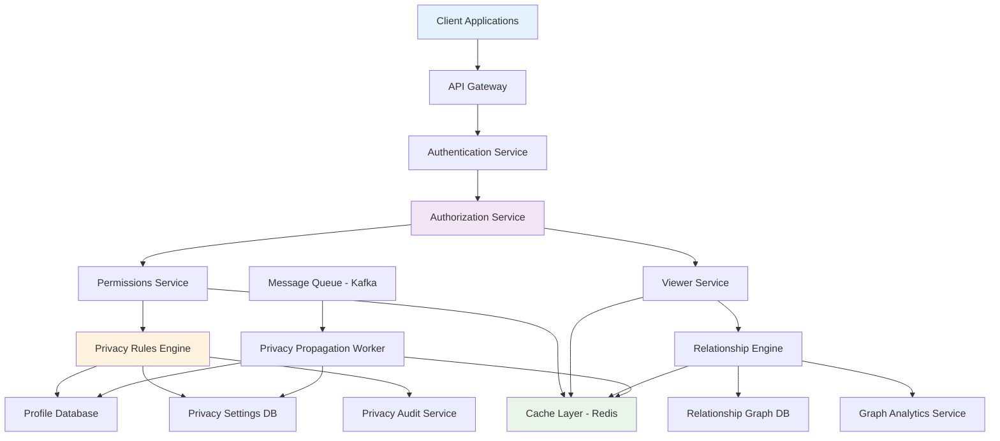
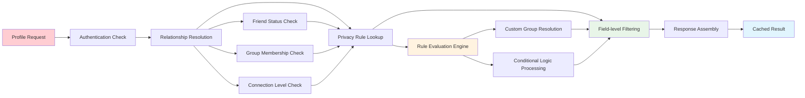
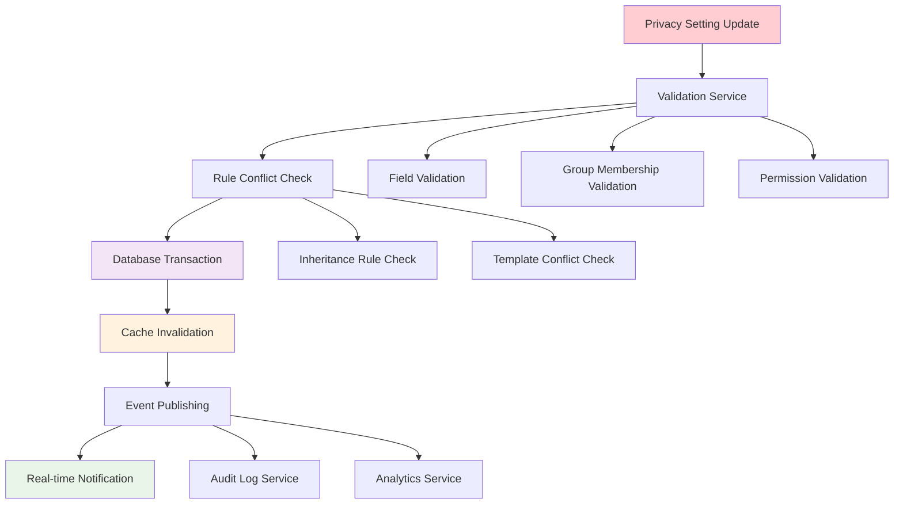
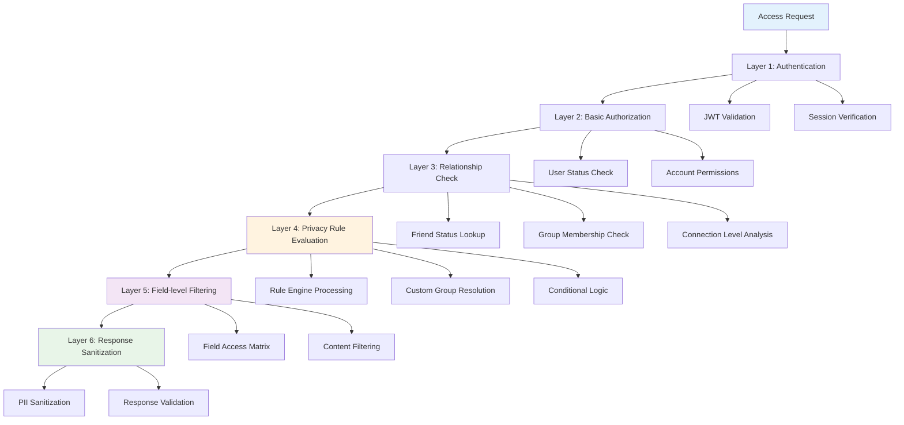

# Privacy & Visibility Controls Backend

## 📋 Table of Contents

- [Privacy & Visibility Controls Backend](#privacy--visibility-controls-backend)
  - [Requirements Gathering](#requirements-gathering)
    - [Functional Requirements](#functional-requirements)
    - [Non-Functional Requirements](#non-functional-requirements)
  - [Traffic Estimation & Capacity Planning](#traffic-estimation--capacity-planning)
    - [User Activity Analysis](#user-activity-analysis)
    - [Permission Check Volume](#permission-check-volume)
    - [Privacy Setting Updates](#privacy-setting-updates)
  - [Database Schema Design](#database-schema-design)
    - [User Profile Schema](#user-profile-schema)
    - [Privacy Settings Schema](#privacy-settings-schema)
    - [Relationship Graph Schema](#relationship-graph-schema)
  - [System API Design](#system-api-design)
    - [Privacy Management APIs](#privacy-management-apis)
    - [Profile Access APIs](#profile-access-apis)
    - [Relationship Management APIs](#relationship-management-apis)
  - [High-Level Design (HLD)](#high-level-design-hld)
    - [System Architecture Overview](#system-architecture-overview)
    - [Privacy Control Data Flow](#privacy-control-data-flow)
    - [Authorization Pipeline](#authorization-pipeline)
  - [Low-Level Design (LLD)](#low-level-design-lld)
    - [Permissions Service](#permissions-service)
    - [Viewer Service](#viewer-service)
    - [Relationship Resolution Engine](#relationship-resolution-engine)
  - [Core Algorithms](#core-algorithms)
    - [1. Privacy Resolution Algorithm](#1-privacy-resolution-algorithm)
    - [2. Friend-of-Friend Visibility Algorithm](#2-friend-of-friend-visibility-algorithm)
    - [3. Custom Group Access Algorithm](#3-custom-group-access-algorithm)
    - [4. Batch Permission Update Algorithm](#4-batch-permission-update-algorithm)
    - [5. Privacy Inheritance Algorithm](#5-privacy-inheritance-algorithm)
  - [Performance Optimizations](#performance-optimizations)
    - [Caching Strategy](#caching-strategy)
    - [Pre-computation Optimization](#pre-computation-optimization)
    - [Database Query Optimization](#database-query-optimization)
  - [Security Considerations](#security-considerations)
    - [Backend Authorization](#backend-authorization)
    - [Data Leak Prevention](#data-leak-prevention)
  - [Testing Strategy](#testing-strategy)
    - [Privacy Rule Testing](#privacy-rule-testing)
    - [Performance Testing](#performance-testing)
  - [Trade-offs and Considerations](#trade-offs-and-considerations)
    - [Privacy Granularity vs Performance](#privacy-granularity-vs-performance)
    - [Real-time vs Cached Permissions](#real-time-vs-cached-permissions)
    - [SQL vs NoSQL for Relationship Data](#sql-vs-nosql-for-relationship-data)

[⬆️ Back to Top](#--table-of-contents)

---

## Requirements Gathering

### Functional Requirements

**Core Privacy Control Functionality:**
- Enable users to set granular privacy settings for profile fields (birthday, education, photos, etc.)
- Support multiple privacy levels: Public, Friends Only, Custom Groups, Only Me
- Allow creation and management of custom privacy groups
- Provide real-time privacy filtering for profile views and content access
- Support bulk privacy updates and inheritance rules

**Profile Visibility Management:**
- Control visibility of different profile sections based on viewer relationship
- Enable conditional visibility (friends-of-friends, mutual connections)
- Support time-based privacy settings (temporary visibility changes)
- Provide privacy preview functionality for users to test their settings
- Handle blocked user access restrictions

**Relationship-based Access Control:**
- Enforce privacy based on friendship status and connection levels
- Support custom friend lists and categorization
- Handle pending friend requests and limited visibility states
- Manage group membership and hierarchical access rights
- Enable granular control over mutual friend visibility

**Administrative Features:**
- Provide privacy audit trails and access logs
- Support privacy policy enforcement and compliance
- Enable bulk privacy administration for organizational accounts
- Offer privacy analytics and usage insights

[⬆️ Back to Top](#--table-of-contents)

### Non-Functional Requirements

**Performance Requirements:**
- Support 1 billion user profiles with complex privacy settings
- Handle 100 million profile views per hour with real-time privacy filtering
- Permission check latency: < 50ms (p99)
- Privacy setting updates propagated within 1 second globally
- System availability: 99.99% uptime with zero privacy leaks

**Scalability Requirements:**
- Horizontally scalable to handle growing user base and relationships
- Support for complex relationship graphs with millions of connections per user
- Auto-scaling based on privacy check volume and geographic distribution
- Linear performance scaling with increased privacy rule complexity

**Security and Privacy:**
- Zero tolerance for privacy setting bypass or data leaks
- End-to-end encryption for sensitive privacy configuration data
- Audit logging for all privacy-related access and changes
- GDPR and privacy regulation compliance built-in

**Consistency Requirements:**
- Strong consistency for privacy setting updates
- Eventual consistency acceptable for relationship graph updates (< 1 second)
- Atomic privacy rule changes across multiple profile fields
- Consistent privacy enforcement across all system components

[⬆️ Back to Top](#--table-of-contents)

---

## Traffic Estimation & Capacity Planning

### User Activity Analysis

**User Base Scale:**
- 1 billion registered users with active privacy settings
- 500 million daily active users accessing profiles
- Average 50 profile fields per user with individual privacy settings
- 10 privacy groups per user on average

**Privacy Setting Distribution:**
- Public settings: 30% of profile fields
- Friends only: 50% of profile fields  
- Custom groups: 15% of profile fields
- Only me: 5% of profile fields

**Relationship Complexity:**
- Average 200 friends per user
- Average 5 custom privacy groups per user
- Friend-of-friend connections: 20,000 per user average
- Group memberships: Average 10 groups per user

[⬆️ Back to Top](#--table-of-contents)

### Permission Check Volume

**Read Operations:**
- Profile views: 100 million per hour
- Permission checks per view: Average 20 fields
- Total permission checks: 2 billion per hour (555,000 per second)
- Friend relationship lookups: 50 million per hour

**Geographic Distribution:**
- North America: 35% of traffic
- Europe: 25% of traffic
- Asia-Pacific: 30% of traffic
- Other regions: 10% of traffic

**Peak Load Scenarios:**
- Holiday seasons: 3x normal traffic
- Viral content events: 5x normal profile access
- Privacy policy updates: 10x permission check volume

[⬆️ Back to Top](#--table-of-contents)

### Privacy Setting Updates

**Write Operations:**
- Privacy setting updates: 1 million per hour
- Bulk privacy changes: 100,000 per hour
- Friend relationship changes: 5 million per hour
- Group membership updates: 500,000 per hour

**Update Patterns:**
- Individual field updates: 70% of changes
- Bulk profile updates: 20% of changes
- Import/migration operations: 10% of changes

**Propagation Requirements:**
- Real-time updates: Privacy setting changes
- Near real-time: Relationship changes (< 1 second)
- Batch updates: Group membership bulk operations
- Background processing: Privacy audit and analytics

[⬆️ Back to Top](#--table-of-contents)

---

## Database Schema Design

### User Profile Schema

**Profile Fields Table:**
- User ID (Primary Key): Unique user identifier
- Field Name: Profile field identifier (birthday, education, etc.)
- Field Value: Actual profile data (encrypted for sensitive fields)
- Privacy Level: Current privacy setting for this field
- Custom Group ID: Reference to custom privacy group if applicable
- Last Updated: Timestamp of last privacy or value change

**Field Categories:**
- Basic Information: Name, profile picture, cover photo
- Contact Information: Email, phone, address
- Personal Details: Birthday, relationship status, hometown
- Professional Information: Work history, education, skills
- Preferences: Interests, favorite content, activities

**Data Fragmentation Strategy:**
- Each profile field stored as separate record for granular privacy control
- Partition by User ID for efficient retrieval
- Secondary indexes on privacy levels for administrative queries
- Encryption at rest for PII and sensitive data

[⬆️ Back to Top](#--table-of-contents)

### Privacy Settings Schema

**Privacy Rules Table:**
- Rule ID (Primary Key): Unique privacy rule identifier
- User ID (Foreign Key): Owner of the privacy rule
- Field Pattern: Regex or field names this rule applies to
- Privacy Level: Public, Friends, Custom Group, Only Me
- Group References: List of custom group IDs for custom privacy
- Conditions: Additional conditions (time-based, location-based)

**Custom Privacy Groups:**
- Group ID (Primary Key): Unique group identifier
- User ID (Foreign Key): Group owner
- Group Name: User-defined group name
- Group Description: Optional group description
- Member List: List of user IDs in this privacy group
- Created Date: Group creation timestamp

**Privacy Templates:**
- Template ID: Predefined privacy setting templates
- Template Name: "Conservative", "Open", "Professional", etc.
- Field Settings: Default privacy levels for each field type
- User Adoption: Tracking of template usage for optimization

[⬆️ Back to Top](#--table-of-contents)

### Relationship Graph Schema

**Friendship Relations:**
- Relationship ID (Primary Key): Unique relationship identifier
- User A ID: First user in the relationship
- User B ID: Second user in the relationship
- Relationship Type: Friend, Family, Colleague, Blocked, etc.
- Status: Confirmed, Pending, Rejected
- Created Date: When relationship was established
- Mutual Friend Count: Cached count for efficiency

**Connection Levels:**
- User ID (Composite Key Part 1): Source user
- Target User ID (Composite Key Part 2): Target user
- Connection Level: Direct (1), Friend-of-friend (2), Extended (3+)
- Path Strength: Weighted strength of connection
- Last Computed: When this connection level was calculated
- Invalidation Flag: Marks stale data for recomputation

**Adjacency List Optimization:**
- User ID (Primary Key): User identifier
- Direct Friends: Serialized list of direct friend IDs
- Friend Groups: Organized friend lists by categories
- Blocked Users: List of blocked user IDs
- Cached Metrics: Friend counts, mutual connections stats

[⬆️ Back to Top](#--table-of-contents)

---

## System API Design

### Privacy Management APIs

**Privacy Setting Configuration:**
- Set field-level privacy settings with custom group support
- Bulk privacy updates across multiple profile fields
- Privacy template application and customization
- Privacy rule validation and conflict resolution

**Custom Group Management:**
- Create, update, and delete custom privacy groups
- Add/remove members from privacy groups
- Group sharing and collaboration features
- Group-based permission inheritance

**Privacy Testing and Preview:**
- Preview profile appearance for different viewer types
- Privacy setting validation and impact analysis
- Bulk privacy change preview before application
- Privacy recommendation engine integration

[⬆️ Back to Top](#--table-of-contents)

### Profile Access APIs

**Privacy-Filtered Profile Retrieval:**
- Get user profile with privacy filtering applied
- Batch profile retrieval with relationship context
- Field-level access checking with detailed reasoning
- Profile section access with conditional visibility

**Relationship-Aware Data Access:**
- Friend list access with privacy filtering
- Mutual connection discovery with privacy respect
- Activity feed filtering based on privacy settings
- Search result filtering with privacy consideration

**Access Logging and Audit:**
- Profile access logging for privacy compliance
- Privacy violation detection and alerting
- Access pattern analysis for security monitoring
- Audit trail generation for regulatory compliance

[⬆️ Back to Top](#--table-of-contents)

### Relationship Management APIs

**Friend Connection Management:**
- Send, accept, and reject friend requests
- Friend categorization and custom list management
- Relationship strength calculation and caching
- Mutual friend discovery and recommendation

**Connection Graph Queries:**
- Friend-of-friend path discovery with privacy filtering
- Connection strength analysis and ranking
- Network analysis for privacy recommendation
- Relationship graph traversal with access control

**Bulk Relationship Operations:**
- Import friend lists from external platforms
- Bulk friend categorization and privacy application
- Relationship cleanup and inactive account handling
- Privacy inheritance from relationship changes

[⬆️ Back to Top](#--table-of-contents)

---

## High-Level Design (HLD)

### System Architecture Overview

**Microservices Privacy Architecture:**

**Core Components:**
- **Authentication Service**: User identity verification and session management
- **Authorization Service**: High-level access control and permission orchestration
- **Permissions Service**: Privacy rule evaluation and field-level access control
- **Viewer Service**: Profile viewing with relationship-aware filtering
- **Relationship Engine**: Friend graph traversal and connection analysis
- **Privacy Rules Engine**: Complex privacy logic and custom group resolution

[⬆️ Back to Top](#--table-of-contents)

### Privacy Control Data Flow

**Profile Access with Privacy Filtering:**

**Privacy Setting Update Flow:**

[⬆️ Back to Top](#--table-of-contents)

### Authorization Pipeline

**Multi-Layer Authorization Architecture:**

[⬆️ Back to Top](#--table-of-contents)

---

## Low-Level Design (LLD)

### Permissions Service

**Privacy Rule Engine Design:**
- **Rule Parser**: Interprets complex privacy rules with conditions and inheritance
- **Context Builder**: Assembles viewer context including relationships and group memberships
- **Decision Engine**: Evaluates rules against context using configurable rule precedence
- **Result Caching**: Intelligent caching of permission decisions with invalidation strategies

**Custom Group Resolution:**
- **Group Membership Cache**: In-memory cache of user group memberships for fast lookup
- **Hierarchical Groups**: Support for nested groups and inheritance relationships
- **Dynamic Groups**: Groups based on computed criteria (mutual friends, location, etc.)
- **Group Validation**: Ensures group membership consistency and prevents circular dependencies

**Performance Optimization:**
- **Batch Processing**: Bulk permission evaluation for multiple fields or users
- **Parallel Evaluation**: Concurrent processing of independent privacy rules
- **Rule Compilation**: Pre-compiled rule structures for faster evaluation
- **Memory Pooling**: Efficient memory management for high-frequency operations

[⬆️ Back to Top](#--table-of-contents)

### Viewer Service

**Profile Filtering Engine:**
- **Field-level Filtering**: Granular control over individual profile field visibility
- **Contextual Filtering**: Dynamic filtering based on viewer relationship and context
- **Bulk Profile Processing**: Efficient filtering of multiple profiles in single request
- **Progressive Disclosure**: Staged revelation of information based on interaction level

**Relationship Context Assembly:**
- **Connection Graph Traversal**: Efficient graph algorithms for relationship discovery
- **Relationship Strength Calculation**: Weighted relationship scoring for nuanced privacy
- **Mutual Connection Analysis**: Fast mutual friend discovery and intersection operations
- **Social Graph Caching**: Strategic caching of relationship data for performance

**Response Optimization:**
- **Selective Field Loading**: Load only fields that pass privacy checks
- **Response Compression**: Efficient serialization of filtered profile data
- **Streaming Responses**: Progressive loading for large profile datasets
- **Error Handling**: Graceful degradation when privacy checks fail

[⬆️ Back to Top](#--table-of-contents)

### Relationship Resolution Engine

**Graph Traversal Optimization:**
- **Adjacency List Caching**: Memory-optimized representation of user connections
- **Path Finding Algorithms**: BFS/DFS optimization for friend-of-friend discovery
- **Graph Partitioning**: Distributed graph storage for scalability
- **Connection Strength Metrics**: Real-time calculation of relationship weights

**Relationship State Management:**
- **State Synchronization**: Consistent relationship state across distributed services
- **Event-Driven Updates**: Real-time relationship change propagation
- **Conflict Resolution**: Handling simultaneous relationship state changes
- **Garbage Collection**: Cleanup of stale relationship data and cached connections

**Scalability Architecture:**
- **Sharded Graph Storage**: Distributed relationship data across multiple nodes
- **Replication Strategy**: Multi-region relationship data replication
- **Load Balancing**: Intelligent routing of relationship queries
- **Hot Spot Mitigation**: Handling popular users with massive connection counts

[⬆️ Back to Top](#--table-of-contents)

---

## Core Algorithms

### 1. Privacy Resolution Algorithm

**Multi-Stage Privacy Decision Tree:**
- Evaluate user authentication and basic access permissions
- Resolve viewer-target relationship status and connection level
- Look up applicable privacy rules based on field and relationship context
- Process custom group memberships and hierarchical permissions
- Apply conditional logic (time-based, location-based, interaction-based rules)
- Generate final access decision with detailed reasoning for audit

**Rule Precedence and Conflict Resolution:**
- Explicit deny rules override all allow rules (security-first approach)
- User-specific rules override group-based or template rules
- More restrictive settings take precedence in conflicts
- Recent rule changes override older conflicting rules
- Administrative override capabilities for compliance scenarios

**Optimization Strategies:**
- Short-circuit evaluation for common deny scenarios
- Rule compilation and caching for frequently accessed patterns
- Batch evaluation for multiple fields with shared context
- Probabilistic early termination for complex rule sets

[⬆️ Back to Top](#--table-of-contents)

### 2. Friend-of-Friend Visibility Algorithm

**Multi-Hop Connection Discovery:**
- Build adjacency lists for each user with direct connections
- Implement bidirectional BFS for efficient path discovery
- Cache intermediate results for common connection patterns
- Apply privacy filtering at each hop to respect friend visibility settings
- Limit search depth to prevent performance degradation

**Connection Strength Calculation:**
- Weight edges based on interaction frequency and recency
- Consider mutual friend counts and shared group memberships
- Apply decay functions for inactive or weak connections
- Normalize scores across different user activity levels
- Update strengths asynchronously to maintain performance

**Fan-out Optimization:**
- Pre-compute friend-of-friend lists for active users
- Use probabilistic data structures for large-scale approximations
- Implement incremental updates when friendship networks change
- Balance accuracy vs. performance based on use case requirements
- Provide fallback to real-time computation for cache misses

[⬆️ Back to Top](#--table-of-contents)

### 3. Custom Group Access Algorithm

**Dynamic Group Membership Resolution:**
- Support static membership lists with explicit user inclusion
- Implement computed groups based on relationship criteria
- Handle nested groups with inheritance and override rules
- Manage temporal group memberships with expiration dates
- Provide group template systems for common access patterns

**Group-based Permission Inheritance:**
- Resolve group hierarchies with proper precedence ordering
- Handle circular dependency detection and prevention
- Implement permission aggregation across multiple group memberships
- Support group-specific overrides for individual members
- Maintain audit trails for group-based access decisions

**Scalability and Performance:**
- Cache group membership data with smart invalidation
- Implement lazy loading for large groups with thousands of members
- Use bloom filters for fast negative membership checks
- Batch group resolution for multiple access checks
- Optimize storage for sparse group membership matrices

[⬆️ Back to Top](#--table-of-contents)

### 4. Batch Permission Update Algorithm

**Atomic Privacy Rule Changes:**
- Group related privacy changes into atomic transactions
- Implement two-phase commit for distributed privacy updates
- Provide rollback capabilities for failed batch operations
- Ensure consistency across multiple database partitions
- Handle partial failures with appropriate error recovery

**Propagation and Cache Invalidation:**
- Identify all affected cached data from privacy rule changes
- Implement intelligent cache invalidation strategies
- Use message queues for asynchronous propagation
- Provide progress tracking for long-running batch operations
- Ensure global consistency with eventual propagation guarantees

**Performance Optimization:**
- Batch similar privacy changes for efficient database operations
- Implement priority queues for urgent privacy updates
- Use parallel processing for independent privacy rule changes
- Optimize database queries with proper indexing strategies
- Provide real-time progress feedback for user experience

[⬆️ Back to Top](#--table-of-contents)

### 5. Privacy Inheritance Algorithm

**Template-based Privacy Configuration:**
- Provide predefined privacy templates for common use cases
- Allow customization of templates while maintaining base structure
- Implement template versioning for updates and rollbacks
- Support organization-wide templates for corporate accounts
- Enable smart recommendations based on user behavior patterns

**Field-level Inheritance Rules:**
- Support inheritance from profile sections to individual fields
- Implement override capabilities for specific field requirements
- Handle inheritance conflicts with clear precedence rules
- Provide bulk inheritance application with selective overrides
- Maintain inheritance history for audit and troubleshooting

**Dynamic Inheritance Updates:**
- Automatically apply template updates to derived privacy settings
- Allow users to opt-out of automatic inheritance updates
- Implement cascading updates with impact analysis
- Provide preview capabilities before applying inheritance changes
- Handle inheritance conflicts with user notification and choice

[⬆️ Back to Top](#--table-of-contents)

---

## Performance Optimizations

### Caching Strategy

**Multi-Level Caching Architecture:**
- **L1 Cache**: Application-level caching for hot privacy rules and relationships
- **L2 Cache**: Distributed cache (Redis) for cross-service privacy data sharing
- **L3 Cache**: Database query result caching for complex relationship queries
- **L4 Cache**: CDN caching for public profile data and static privacy templates

**Intelligent Cache Management:**
- **Smart Invalidation**: Selective cache invalidation based on privacy change impact
- **Predictive Warming**: Pre-populate cache with likely-accessed privacy data
- **Hierarchical Expiration**: Different TTL values based on data volatility
- **Cache Coherency**: Maintain consistency across distributed cache layers

**Performance Metrics:**
- Cache hit ratios > 95% for privacy rule lookups
- Sub-10ms cache response times for critical privacy decisions
- Automatic cache sizing based on usage patterns
- Real-time cache performance monitoring and alerting

[⬆️ Back to Top](#--table-of-contents)

### Pre-computation Optimization

**Friend-of-Friend Pre-computation:**
- **Batch Processing**: Nightly computation of friend-of-friend relationships
- **Incremental Updates**: Real-time updates for new friend connections
- **Materialized Views**: Pre-computed privacy-filtered friend lists
- **Connection Strength**: Pre-calculated relationship weights and scores

**Privacy Rule Compilation:**
- **Rule Optimization**: Compile complex privacy rules into efficient decision trees
- **Pattern Recognition**: Identify common privacy patterns for optimization
- **Index Generation**: Create specialized indexes for frequent privacy queries
- **Result Memoization**: Cache privacy decisions for repeated access patterns

**Graph Analytics:**
- **Community Detection**: Identify user clusters for optimized privacy grouping
- **Influence Scoring**: Calculate user influence for privacy recommendation
- **Anomaly Detection**: Identify unusual privacy access patterns
- **Trend Analysis**: Track privacy setting changes for recommendation improvement

[⬆️ Back to Top](#--table-of-contents)

### Database Query Optimization

**Partition Strategy:**
- **User-based Partitioning**: Partition privacy data by user ID for locality
- **Temporal Partitioning**: Separate current and historical privacy data
- **Relationship Sharding**: Distribute relationship graph across multiple shards
- **Hot-Cold Data Separation**: Optimize storage for frequently vs. rarely accessed data

**Index Optimization:**
- **Composite Indexes**: Multi-field indexes for complex privacy queries
- **Partial Indexes**: Indexes on subset of data based on common query patterns
- **Covering Indexes**: Include all needed fields to avoid table lookups
- **Adaptive Indexing**: Dynamic index creation based on query patterns

**Query Performance:**
- **Query Plan Optimization**: Analyze and optimize expensive privacy queries
- **Parallel Execution**: Concurrent processing of independent privacy checks
- **Connection Pooling**: Efficient database connection management
- **Read Replicas**: Distribute read queries across multiple database replicas

[⬆️ Back to Top](#--table-of-contents)

---

## Security Considerations

### Backend Authorization

**Defense in Depth:**
- **Multiple Authorization Layers**: Authentication, authorization, privacy, and field-level checks
- **Principle of Least Privilege**: Grant minimum necessary access for each request
- **Zero Trust Architecture**: Verify every access request regardless of source
- **Continuous Validation**: Re-validate permissions for long-running sessions

**Authorization Enforcement:**
- **Server-side Filtering**: All privacy filtering performed on backend to prevent bypass
- **API Gateway Controls**: Centralized authorization enforcement at entry points
- **Service Mesh Security**: Inter-service communication with mutual TLS and authorization
- **Database-level Security**: Row-level security and column encryption for sensitive data

**Audit and Monitoring:**
- **Access Logging**: Comprehensive logging of all privacy-related access attempts
- **Anomaly Detection**: Machine learning-based detection of unusual access patterns
- **Real-time Alerting**: Immediate alerts for potential privacy violations
- **Compliance Reporting**: Automated reports for regulatory compliance requirements

[⬆️ Back to Top](#--table-of-contents)

### Data Leak Prevention

**Frontend Security:**
- **Data Minimization**: Send only approved data to frontend applications
- **Response Sanitization**: Remove sensitive metadata from API responses
- **Client-side Validation**: Prevent UI manipulation from bypassing privacy controls
- **Session Management**: Secure session handling with automatic expiration

**API Security:**
- **Rate Limiting**: Prevent privacy probing through automated requests
- **Request Validation**: Strict validation of all privacy-related API requests
- **Error Message Security**: Avoid leaking privacy information through error responses
- **API Versioning**: Maintain security across different API versions

**Data Protection:**
- **Encryption at Rest**: Encrypt sensitive privacy data in databases
- **Encryption in Transit**: TLS encryption for all privacy-related communications
- **Key Management**: Secure key storage and rotation for encryption systems
- **Data Anonymization**: Remove or pseudonymize personal identifiers where possible

[⬆️ Back to Top](#--table-of-contents)

---

## Testing Strategy

### Privacy Rule Testing

**Comprehensive Test Coverage:**
- **Unit Tests**: Individual privacy rule evaluation with edge cases
- **Integration Tests**: End-to-end privacy filtering across multiple services
- **Regression Tests**: Ensure privacy rule changes don't break existing functionality
- **Performance Tests**: Validate privacy rule evaluation performance under load

**Privacy Scenario Testing:**
- **Relationship Testing**: Test all combinations of friendship and relationship states
- **Group Membership Testing**: Validate custom group access across different scenarios
- **Inheritance Testing**: Ensure proper privacy rule inheritance and override behavior
- **Edge Case Testing**: Handle unusual relationship configurations and privacy settings

**Compliance Testing:**
- **Regulatory Testing**: Validate compliance with GDPR, CCPA, and other privacy regulations
- **Policy Testing**: Ensure privacy policies are correctly implemented and enforced
- **Audit Testing**: Verify audit trail completeness and accuracy
- **Security Testing**: Penetration testing for privacy bypass vulnerabilities

[⬆️ Back to Top](#--table-of-contents)

### Performance Testing

**Load Testing:**
- **Privacy Check Volume**: Test system under peak privacy evaluation loads
- **Concurrent Users**: Validate performance with millions of simultaneous users
- **Database Performance**: Test privacy database queries under heavy load
- **Cache Performance**: Validate cache effectiveness under various load patterns

**Stress Testing:**
- **Resource Exhaustion**: Test system behavior when resources are fully utilized
- **Cascade Failures**: Validate graceful degradation when components fail
- **Recovery Testing**: Test system recovery after privacy service outages
- **Data Consistency**: Ensure privacy consistency during high-stress scenarios

**Scalability Testing:**
- **Horizontal Scaling**: Validate privacy system scaling across multiple nodes
- **Database Scaling**: Test privacy database scaling strategies
- **Cache Scaling**: Validate distributed cache scaling for privacy data
- **Geographic Distribution**: Test privacy consistency across global deployments

[⬆️ Back to Top](#--table-of-contents)

---

## Trade-offs and Considerations

### Privacy Granularity vs Performance

**Granularity Benefits:**
- Enhanced user control over personal information sharing
- Compliance with strict privacy regulations and user expectations
- Competitive advantage through superior privacy features
- Reduced privacy-related support requests through clear controls

**Performance Impact:**
- Increased complexity in privacy rule evaluation and caching
- Higher database storage requirements for detailed privacy settings
- More complex cache invalidation strategies
- Potential latency increase for profile access operations

**Optimization Strategies:**
- Intelligent defaults that cover majority of use cases
- Performance-aware privacy rule design and evaluation
- Strategic pre-computation of common privacy scenarios
- Tiered privacy levels balancing granularity with performance

[⬆️ Back to Top](#--table-of-contents)

### Real-time vs Cached Permissions

**Real-time Benefits:**
- Immediate privacy setting updates without propagation delays
- Guaranteed consistency for privacy-critical operations
- Accurate permission evaluation for edge cases
- Complete audit trail for real-time access decisions

**Caching Advantages:**
- Significantly improved response times for profile access
- Reduced database load and improved overall system scalability
- Better user experience through faster page loads
- Cost savings through reduced computational requirements

**Hybrid Approach:**
- Real-time evaluation for privacy-critical operations
- Cached evaluation for performance-critical read operations
- Smart cache invalidation based on privacy change impact
- Fallback to real-time when cache inconsistency is detected

[⬆️ Back to Top](#--table-of-contents)

### SQL vs NoSQL for Relationship Data

**SQL Database Benefits:**
- ACID transactions for consistent relationship and privacy data
- Complex JOIN operations for relationship graph queries
- Mature indexing and query optimization capabilities
- Strong consistency guarantees for critical privacy operations

**NoSQL Advantages:**
- Horizontal scaling for massive relationship graphs
- Flexible schema for evolving privacy and relationship models
- Better performance for simple relationship lookups
- Natural fit for graph-like relationship data structures

**Hybrid Architecture:**
- SQL for transactional privacy settings and user data
- Graph databases (Neo4j) for complex relationship traversal
- NoSQL (DynamoDB) for high-volume relationship caching
- Event streaming (Kafka) for maintaining consistency across storage systems

**Technology Selection:**
- PostgreSQL for privacy settings with JSONB for flexible rules
- Neo4j for complex relationship graph analysis and traversal
- Redis for high-performance caching of privacy decisions
- Cassandra for time-series privacy audit logs and analytics

[⬆️ Back to Top](#--table-of-contents) 