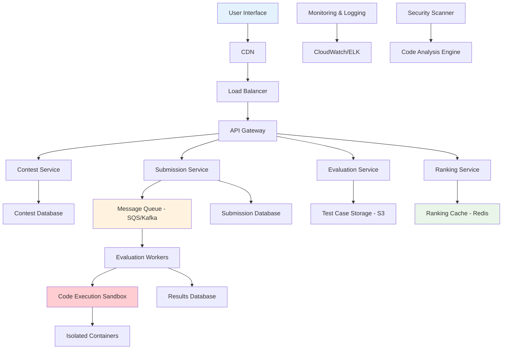
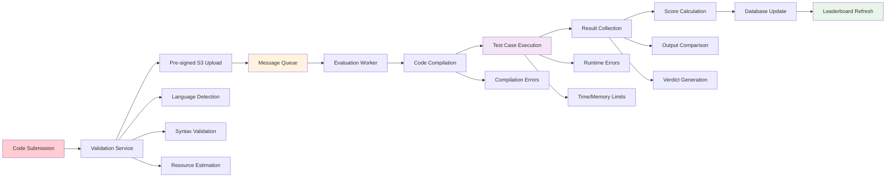
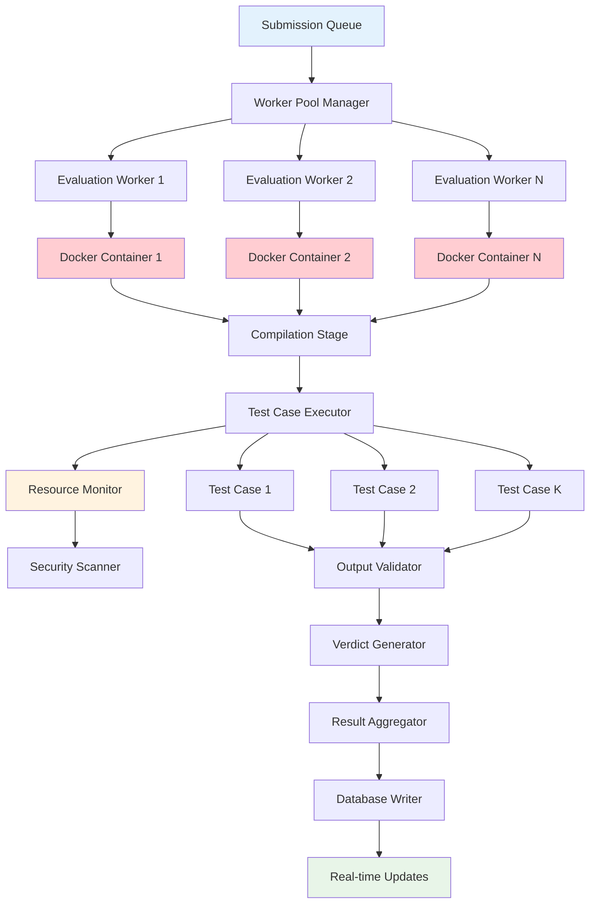

# Coding Contest Platform Backend

## 📋 Table of Contents

- [Coding Contest Platform Backend](#coding-contest-platform-backend)
  - [Requirements Gathering](#requirements-gathering)
    - [Functional Requirements](#functional-requirements)
    - [Non-Functional Requirements](#non-functional-requirements)
  - [Traffic Estimation & Capacity Planning](#traffic-estimation--capacity-planning)
    - [Contest Participation Analysis](#contest-participation-analysis)
    - [Submission Volume Calculations](#submission-volume-calculations)
    - [Real-time Evaluation Load](#real-time-evaluation-load)
  - [Database Schema Design](#database-schema-design)
    - [Contest Management Schema](#contest-management-schema)
    - [Submission Processing Schema](#submission-processing-schema)
    - [Leaderboard and Ranking Schema](#leaderboard-and-ranking-schema)
  - [System API Design](#system-api-design)
    - [Contest Management APIs](#contest-management-apis)
    - [Submission Processing APIs](#submission-processing-apis)
    - [Evaluation and Judging APIs](#evaluation-and-judging-apis)
  - [High-Level Design (HLD)](#high-level-design-hld)
    - [System Architecture Overview](#system-architecture-overview)
    - [Submission Processing Flow](#submission-processing-flow)
    - [Real-time Evaluation Pipeline](#real-time-evaluation-pipeline)
  - [Low-Level Design (LLD)](#low-level-design-lld)
    - [Code Execution Engine](#code-execution-engine)
    - [Queue Management System](#queue-management-system)
    - [Leaderboard Generation Service](#leaderboard-generation-service)
  - [Core Algorithms](#core-algorithms)
    - [1. Secure Code Execution Algorithm](#1-secure-code-execution-algorithm)
    - [2. Real-time Ranking Algorithm](#2-real-time-ranking-algorithm)
    - [3. Test Case Validation Algorithm](#3-test-case-validation-algorithm)
    - [4. Load Balancing Algorithm](#4-load-balancing-algorithm)
    - [5. Contest Scheduling Algorithm](#5-contest-scheduling-algorithm)
  - [Performance Optimizations](#performance-optimizations)
    - [Execution Environment Optimization](#execution-environment-optimization)
    - [Caching and Pre-computation](#caching-and-pre-computation)
    - [Database Query Optimization](#database-query-optimization)
  - [Security Considerations](#security-considerations)
    - [Code Execution Security](#code-execution-security)
    - [Contest Integrity](#contest-integrity)
  - [Testing Strategy](#testing-strategy)
    - [Evaluation System Testing](#evaluation-system-testing)
    - [Load and Performance Testing](#load-and-performance-testing)
  - [Trade-offs and Considerations](#trade-offs-and-considerations)
    - [Real-time vs Batch Evaluation](#real-time-vs-batch-evaluation)
    - [Accuracy vs Speed](#accuracy-vs-speed)
    - [Cost vs Performance](#cost-vs-performance)

[⬆️ Back to Top](#--table-of-contents)

---

## Requirements Gathering

### Functional Requirements

**Core Contest Management:**
- Create and manage coding contests with configurable duration and rules
- Support multiple contest formats: ACM ICPC, CodeChef, Codeforces, AtCoder styles
- Problem statement creation with rich text, images, and mathematical formulas
- Test case management with input/output validation and custom judging
- Multi-language support for submissions (C++, Java, Python, JavaScript, etc.)

**Submission Processing:**
- Real-time code submission with syntax highlighting and validation
- Secure code execution in isolated environments with resource limits
- Comprehensive test case evaluation with detailed feedback
- Plagiarism detection and similarity analysis
- Version control for multiple submission attempts

**Ranking and Leaderboards:**
- Real-time leaderboard updates during contests
- Multiple scoring systems: time penalty, partial scoring, IOI style
- Historical ranking data and performance analytics
- Team and individual participant support
- Rating systems with ELO-based calculations

**User Experience Features:**
- Practice mode with extensive problem archives
- Editorial and solution discussions post-contest
- Virtual contests and replay functionality
- Social features: following, friend challenges, forums
- Detailed submission history and performance statistics

[⬆️ Back to Top](#--table-of-contents)

### Non-Functional Requirements

**Performance Requirements:**
- Support 100,000 concurrent users during major contests
- Handle 10,000 submissions per minute during peak periods
- Code execution completion within 5 seconds for 95% of submissions
- Leaderboard updates within 30 seconds of submission evaluation
- System availability: 99.9% uptime during contests

**Scalability Requirements:**
- Horizontally scalable evaluation infrastructure
- Auto-scaling based on contest size and submission volume
- Global deployment for low-latency access worldwide
- Support for contests with 50,000+ participants
- Linear performance scaling with added compute resources

**Security Requirements:**
- Complete code execution isolation to prevent system compromise
- Contest data protection against unauthorized access
- Plagiarism detection with advanced similarity algorithms
- DDoS protection and rate limiting for submission endpoints
- Secure handling of sensitive contest data and user information

**Reliability Requirements:**
- Zero data loss for submissions and contest results
- Eventual consistency acceptable for leaderboards (< 30 seconds)
- Strong consistency for final contest rankings
- Disaster recovery with cross-region backup capabilities
- Graceful degradation during infrastructure failures

[⬆️ Back to Top](#--table-of-contents)

---

## Traffic Estimation & Capacity Planning

### Contest Participation Analysis

**User Base Projections:**
- 1 million registered users across all skill levels
- 100,000 monthly active contestants
- 10,000 concurrent users during major contests
- Average 5-10 contests per month with varying sizes

**Contest Distribution:**
- Major contests (10,000+ participants): 2 per month
- Regular contests (1,000-5,000 participants): 8 per month
- Practice contests and virtual contests: Daily
- Educational contests and tutorials: Weekly

**Geographic Distribution:**
- Asia-Pacific: 45% of participants
- Europe: 25% of participants
- North America: 20% of participants
- Other regions: 10% of participants

[⬆️ Back to Top](#--table-of-contents)

### Submission Volume Calculations

**Submission Patterns:**
- Average 20 submissions per participant per contest
- Peak submission rate: 10,000 submissions per minute
- Average submission size: 2 KB (source code)
- Test case execution time: 1-5 seconds per submission

**Daily Operations:**
- Contest submissions: 500,000 per day
- Practice submissions: 1,000,000 per day
- Total daily evaluations: 1.5 million submissions
- Peak hourly load: 150,000 submissions during major contests

**Resource Requirements:**
- Compute: 1,000 CPU cores for code execution during peaks
- Storage: 10 TB for submissions, test cases, and contest data
- Network: 1 Gbps sustained bandwidth for global access
- Memory: 500 GB for caching and real-time processing

[⬆️ Back to Top](#--table-of-contents)

### Real-time Evaluation Load

**Evaluation Metrics:**
- Average evaluation time: 3 seconds per submission
- Concurrent evaluations during peak: 3,000 parallel executions
- Test case complexity: 1-100 test cases per problem
- Memory limit per execution: 256 MB - 1 GB
- Time limit per execution: 1-10 seconds

**Infrastructure Scaling:**
- Base capacity: 500 concurrent evaluations
- Auto-scaling up to: 5,000 concurrent evaluations
- EC2 instance types: M5.2xlarge for balanced compute
- Container orchestration: Kubernetes for execution management
- Queue management: SQS/Kafka for submission processing

[⬆️ Back to Top](#--table-of-contents)

---

## Database Schema Design

### Contest Management Schema

**Contests Table:**
- Contest ID (Primary Key): Unique contest identifier
- Contest Name: Display name and title
- Start Time: Contest beginning timestamp
- Duration: Contest length in minutes
- Contest Type: ACM, IOI, CodeChef format
- Visibility: Public, private, invite-only
- Registration Status: Open, closed, invite-based

**Problems Table:**
- Problem ID (Primary Key): Unique problem identifier
- Contest ID (Foreign Key): Associated contest
- Problem Title: Display name for the problem
- Problem Statement: Rich text with formatting
- Time Limit: Execution time constraint per test case
- Memory Limit: Memory usage constraint
- Difficulty Rating: Problem complexity score

**Test Cases Table:**
- Test Case ID (Primary Key): Unique test case identifier
- Problem ID (Foreign Key): Associated problem
- Input Data: Test case input (potentially large)
- Expected Output: Correct answer for validation
- Test Case Type: Sample, hidden, stress test
- Points: Scoring weight for this test case

[⬆️ Back to Top](#--table-of-contents)

### Submission Processing Schema

**Submissions Table:**
- Submission ID (Primary Key): Unique submission identifier
- User ID (Foreign Key): Submitting user
- Problem ID (Foreign Key): Target problem
- Contest ID (Foreign Key): Associated contest
- Source Code: User's solution code
- Language: Programming language used
- Submission Time: When code was submitted
- Status: Pending, Running, Accepted, Wrong Answer, TLE, etc.

**Evaluation Results:**
- Evaluation ID (Primary Key): Unique evaluation run
- Submission ID (Foreign Key): Associated submission
- Test Case ID (Foreign Key): Specific test case
- Execution Time: Actual runtime in milliseconds
- Memory Used: Peak memory consumption
- Exit Code: Program termination status
- Output: Program output for comparison
- Verdict: Correct, Wrong, TLE, MLE, RE, etc.

**Execution Environments:**
- Environment ID: Unique execution sandbox identifier
- Language Configuration: Compiler/interpreter settings
- Resource Limits: CPU, memory, time constraints
- Security Settings: Sandbox configuration
- Judge Version: Evaluation system version

[⬆️ Back to Top](#--table-of-contents)

### Leaderboard and Ranking Schema

**Contest Standings:**
- Standing ID (Primary Key): Unique ranking entry
- Contest ID (Foreign Key): Associated contest
- User ID (Foreign Key): Participant
- Total Score: Accumulated points
- Penalty Time: Time-based penalty calculation
- Problems Solved: Count of accepted submissions
- Rank: Current position in contest
- Last Update: Timestamp of last ranking calculation

**Problem Statistics:**
- Problem ID (Composite Key): Target problem
- Contest ID (Composite Key): Associated contest
- Total Submissions: Count of all attempts
- Accepted Submissions: Count of correct solutions
- Acceptance Rate: Percentage of successful submissions
- Average Time: Mean solving time for accepted solutions
- First Solver: User who solved first
- First Solve Time: Timestamp of first correct submission

**User Ratings:**
- User ID (Primary Key): User identifier
- Current Rating: Latest skill rating
- Peak Rating: Highest achieved rating
- Contest Participation: Number of contests attended
- Problems Solved: Total problems solved across all contests
- Rating History: Time-series rating changes
- Performance Trend: Recent performance analysis

[⬆️ Back to Top](#--table-of-contents)

---

## System API Design

### Contest Management APIs

**Contest Lifecycle Management:**
- Create, update, and delete contests with full configuration
- Register participants with eligibility validation
- Start and end contests with automatic timing
- Handle contest extensions and modifications
- Generate contest analytics and reports

**Problem Management:**
- Create and edit problem statements with rich formatting
- Upload and validate test cases with correctness verification
- Set resource limits and judging criteria
- Version control for problem updates
- Batch problem import/export functionality

**User Registration and Authentication:**
- User registration with email verification
- Authentication with OAuth integration
- Role management: admin, problem setter, participant
- Team creation and management for team contests
- Access control for private contests and practice sessions

[⬆️ Back to Top](#--table-of-contents)

### Submission Processing APIs

**Code Submission Management:**
- Submit source code with language detection
- Pre-submission validation and syntax checking
- File upload support for large submissions
- Submission history and version tracking
- Bulk submission upload for testing

**Real-time Feedback:**
- Live submission status updates via WebSocket
- Detailed compilation and execution error messages
- Test case results with partial feedback (when allowed)
- Performance metrics: execution time and memory usage
- Queue position and estimated evaluation time

**Administrative Controls:**
- Rejudge submissions with updated test cases
- Manual evaluation override for special cases
- Submission analysis and plagiarism detection
- Batch operations for contest administration
- Detailed execution logs for debugging

[⬆️ Back to Top](#--table-of-contents)

### Evaluation and Judging APIs

**Test Case Execution:**
- Secure code compilation in isolated environments
- Multi-language support with consistent judging
- Resource monitoring and limit enforcement
- Custom judges for special problem types
- Parallel execution for faster evaluation

**Scoring and Ranking:**
- Real-time score calculation with configurable systems
- Leaderboard generation with tie-breaking rules
- Historical ranking data and performance trends
- Rating calculation using established algorithms
- Contest statistics and analytics generation

**Quality Assurance:**
- Test case validation and correctness verification
- Performance regression testing for judge updates
- A/B testing for new evaluation features
- Error analysis and judge system monitoring
- Automated testing of judge infrastructure

[⬆️ Back to Top](#--table-of-contents)

---

## High-Level Design (HLD)

### System Architecture Overview

**Distributed Contest Platform Architecture:**

**Core Components:**
- **Contest Service**: Contest lifecycle management and configuration
- **Submission Service**: Code submission handling and preprocessing
- **Evaluation Service**: Test case execution and result processing
- **Ranking Service**: Real-time leaderboard and rating calculations
- **Code Execution Sandbox**: Secure, isolated code execution environment
- **Message Queue**: Asynchronous submission processing and load distribution

[⬆️ Back to Top](#--table-of-contents)

### Submission Processing Flow

**Complete Submission-to-Result Pipeline:**

**Async Processing Benefits:**
- **Scalability**: Handle submission spikes without blocking user interface
- **Reliability**: Queue persistence ensures no submission loss
- **Performance**: Parallel processing of multiple submissions
- **Resource Management**: Dynamic scaling based on queue depth

[⬆️ Back to Top](#--table-of-contents)

### Real-time Evaluation Pipeline

**Secure Code Execution Architecture:**

**Security Layers:**
- **Container Isolation**: Each submission runs in isolated Docker container
- **Resource Limits**: CPU, memory, and time constraints enforced
- **Network Isolation**: No external network access during execution
- **File System Protection**: Read-only environment with limited write access

[⬆️ Back to Top](#--table-of-contents)

---

## Low-Level Design (LLD)

### Code Execution Engine

**Sandboxed Execution Environment:**
- **Container Management**: Docker-based isolation with custom resource controls
- **Language Support**: Multi-compiler environment with version management
- **Security Hardening**: Seccomp profiles, AppArmor, and capability restrictions
- **Resource Monitoring**: Real-time tracking of CPU, memory, and I/O usage

**Execution Pipeline:**
- **Pre-execution Validation**: Source code analysis and security scanning
- **Compilation Phase**: Language-specific compilation with error capture
- **Test Case Iteration**: Sequential or parallel test case execution
- **Output Collection**: Capture stdout, stderr, and execution metadata
- **Cleanup**: Container destruction and resource deallocation

**Performance Optimization:**
- **Container Pooling**: Pre-warmed containers for faster execution startup
- **Compilation Caching**: Cache compiled binaries for identical submissions
- **Parallel Testing**: Concurrent test case execution when possible
- **Resource Recycling**: Efficient container reuse and cleanup

[⬆️ Back to Top](#--table-of-contents)

### Queue Management System

**Message Queue Architecture:**
- **Priority Queues**: Different priority levels for contest vs practice submissions
- **Dead Letter Queues**: Handle failed submissions with retry mechanisms
- **Queue Partitioning**: Distribute load across multiple worker pools
- **Backpressure Handling**: Graceful degradation during overload conditions

**Worker Pool Management:**
- **Dynamic Scaling**: Auto-scaling workers based on queue depth
- **Health Monitoring**: Worker health checks and automatic replacement
- **Load Distribution**: Intelligent work assignment based on worker capacity
- **Failure Recovery**: Automatic restart and submission requeue on worker failure

**Quality of Service:**
- **SLA Guarantees**: Different processing guarantees for different submission types
- **Rate Limiting**: Per-user and global submission rate controls
- **Fair Scheduling**: Prevent single user from monopolizing evaluation resources
- **Emergency Modes**: Special handling during contest critical periods

[⬆️ Back to Top](#--table-of-contents)

### Leaderboard Generation Service

**Real-time Ranking Calculation:**
- **Incremental Updates**: Efficient recalculation on new submission results
- **Ranking Algorithms**: Support for different contest scoring systems
- **Tie-breaking Logic**: Consistent and fair tie resolution
- **Historical Tracking**: Maintain ranking changes over time

**Caching Strategy:**
- **Multi-level Caching**: Memory, Redis, and database-level caching
- **Cache Invalidation**: Smart invalidation on ranking changes
- **Pre-computation**: Background calculation of expensive ranking operations
- **Geographic Caching**: Regional caches for global contest access

**Data Consistency:**
- **Eventually Consistent**: Accept brief delays for performance
- **Conflict Resolution**: Handle concurrent ranking updates
- **Audit Trail**: Maintain history for ranking verification
- **Rollback Capability**: Revert rankings on error detection

[⬆️ Back to Top](#--table-of-contents)

---

## Core Algorithms

### 1. Secure Code Execution Algorithm

**Multi-layer Security Enforcement:**
- Initialize isolated execution environment with strict resource limits
- Perform static code analysis to detect potentially malicious patterns
- Compile code in restricted environment with timeout controls
- Execute against test cases with real-time resource monitoring
- Terminate execution on resource limit violations or security threats
- Collect results while maintaining sandbox integrity

**Resource Management:**
- **Memory Limiting**: Enforce heap and stack size restrictions
- **CPU Throttling**: Limit CPU usage and prevent infinite loops
- **I/O Controls**: Restrict file system access and network connectivity
- **Time Limits**: Hard and soft timeout enforcement
- **Process Management**: Control child process creation and execution

**Security Scanning:**
- **Pattern Detection**: Identify suspicious system calls and operations
- **Behavioral Analysis**: Monitor runtime behavior for anomalies
- **Sandbreak Prevention**: Detect and prevent container escape attempts
- **Code Injection**: Scan for code injection and shell access attempts

[⬆️ Back to Top](#--table-of-contents)

### 2. Real-time Ranking Algorithm

**Incremental Ranking Updates:**
- Maintain sorted leaderboard data structure in memory
- Process new submission results and calculate score changes
- Perform efficient rank updates using binary search and heap operations
- Handle tie-breaking with secondary criteria (time, penalty)
- Propagate ranking changes to cached and persistent storage
- Notify users of significant ranking changes

**Multi-criteria Scoring:**
- **ACM Style**: Time penalty with problem-solving count
- **IOI Style**: Partial scoring with weighted test case results
- **CodeChef Style**: Combination of accuracy and speed
- **Custom Scoring**: Configurable scoring algorithms per contest

**Performance Optimization:**
- **Lazy Updates**: Batch ranking updates for efficiency
- **Approximate Rankings**: Use sampling for very large contests
- **Materialized Views**: Pre-computed rankings for common queries
- **Delta Compression**: Store only ranking changes for history

[⬆️ Back to Top](#--table-of-contents)

### 3. Test Case Validation Algorithm

**Correctness Verification:**
- Parse expected output format and validate structure
- Perform exact string matching with whitespace normalization
- Support custom comparators for floating-point and special formats
- Handle multiple correct answers with validator functions
- Provide detailed feedback on test case failures
- Generate test case statistics and coverage metrics

**Output Comparison:**
- **Exact Match**: Byte-by-byte comparison for precise outputs
- **Whitespace Tolerant**: Normalize spaces and line endings
- **Floating Point**: Epsilon-based comparison for numerical results
- **Custom Validators**: Problem-specific validation logic
- **Interactive Problems**: Support for interactive input/output protocols

**Error Categorization:**
- **Wrong Answer**: Output doesn't match expected result
- **Presentation Error**: Correct answer with formatting issues
- **Time Limit Exceeded**: Execution time beyond allowed limit
- **Memory Limit Exceeded**: Memory usage beyond allowed limit
- **Runtime Error**: Program crash or abnormal termination

[⬆️ Back to Top](#--table-of-contents)

### 4. Load Balancing Algorithm

**Intelligent Work Distribution:**
- Monitor worker pool capacity and current load distribution
- Assign submissions based on estimated execution time and complexity
- Balance load across geographic regions for global contests
- Implement circuit breakers for overloaded or failing workers
- Provide graceful degradation during peak load periods

**Adaptive Scheduling:**
- **Shortest Queue**: Route to worker with minimum pending submissions
- **Weighted Round Robin**: Distribute based on worker capacity
- **Least Connection**: Route to worker with fewest active executions
- **Performance-based**: Consider historical execution times
- **Geographic Affinity**: Prefer local workers for latency optimization

**Auto-scaling Logic:**
- **Queue Depth Monitoring**: Scale based on pending submission count
- **Response Time Tracking**: Scale when evaluation times increase
- **Resource Utilization**: Monitor CPU and memory usage patterns
- **Predictive Scaling**: Use historical data to anticipate load
- **Cost Optimization**: Balance performance with infrastructure costs

[⬆️ Back to Top](#--table-of-contents)

### 5. Contest Scheduling Algorithm

**Contest Lifecycle Management:**
- Schedule contests with global timezone considerations
- Handle contest start/end times with atomic state transitions
- Manage registration periods and participant eligibility
- Coordinate distributed contest state across multiple regions
- Provide contest replay and virtual contest capabilities

**Timing Synchronization:**
- **Global Clock**: Synchronized time across all system components
- **Atomic Transitions**: Ensure consistent contest state changes
- **Grace Periods**: Handle clock skew and network delays
- **Replay Capability**: Allow virtual participation in past contests
- **Time Zone Handling**: Present local times while maintaining UTC internally

**State Management:**
- **Registration Phase**: Open registration with eligibility checks
- **Contest Phase**: Active submission and evaluation period
- **Frozen Phase**: Hide leaderboard before contest end
- **Post-contest**: Final standings and editorial publication
- **Archive Phase**: Read-only access to contest data

[⬆️ Back to Top](#--table-of-contents)

---

## Performance Optimizations

### Execution Environment Optimization

**Container Performance:**
- **Pre-warmed Containers**: Maintain pool of ready-to-use execution environments
- **Base Image Optimization**: Minimal container images with necessary tools only
- **Layer Caching**: Efficient Docker layer management for fast startup
- **Resource Pooling**: Reuse containers for multiple submissions when safe

**Compilation Optimization:**
- **Compiler Caching**: Cache compiled binaries for identical source code
- **Incremental Compilation**: Support for languages with incremental builds
- **Parallel Compilation**: Multi-threaded compilation for large programs
- **Template Pre-compilation**: Pre-compile common competitive programming templates

**Execution Efficiency:**
- **Memory Management**: Efficient allocation and deallocation strategies
- **I/O Optimization**: Buffered I/O for large input/output operations
- **CPU Affinity**: Bind execution to specific CPU cores for consistency
- **NUMA Awareness**: Optimize memory access patterns on multi-socket systems

[⬆️ Back to Top](#--table-of-contents)

### Caching and Pre-computation

**Multi-level Caching Strategy:**
- **L1 Cache**: Application-level caching for hot data and frequent queries
- **L2 Cache**: Redis cluster for shared data across multiple service instances
- **L3 Cache**: Database query result caching for expensive operations
- **CDN Caching**: Global caching for static contest content and problem statements

**Pre-computation Strategies:**
- **Leaderboard Pre-computation**: Background calculation of ranking data
- **Problem Statistics**: Pre-computed solve rates and difficulty metrics
- **User Profiles**: Cached user performance and rating information
- **Contest Analytics**: Pre-computed statistics and historical data

**Cache Invalidation:**
- **Event-driven Invalidation**: Invalidate based on submission result changes
- **TTL-based Expiration**: Time-based cache expiration for non-critical data
- **Version-based Invalidation**: Cache versioning for contest data updates
- **Selective Invalidation**: Granular cache invalidation for affected data only

[⬆️ Back to Top](#--table-of-contents)

### Database Query Optimization

**Indexing Strategy:**
- **Composite Indexes**: Multi-column indexes for complex query patterns
- **Partial Indexes**: Indexes on filtered data subsets for efficiency
- **Covering Indexes**: Include all query columns to avoid table lookups
- **Time-based Partitioning**: Partition large tables by contest date

**Query Optimization:**
- **Query Plan Analysis**: Regular analysis of slow queries and optimization
- **Materialized Views**: Pre-computed aggregations for leaderboard queries
- **Read Replicas**: Distribute read traffic across multiple database instances
- **Connection Pooling**: Efficient database connection management

**Data Architecture:**
- **Horizontal Sharding**: Distribute data across multiple database instances
- **Cassandra Integration**: Use Cassandra for high-volume submission data
- **Time Series Optimization**: Specialized storage for ranking and performance data
- **Archive Strategy**: Move old contest data to cheaper storage tiers

[⬆️ Back to Top](#--table-of-contents)

---

## Security Considerations

### Code Execution Security

**Sandbox Isolation:**
- **Container Security**: Hardened Docker containers with minimal attack surface
- **Resource Limits**: Strict CPU, memory, and disk usage enforcement
- **System Call Filtering**: Whitelist allowed system calls using seccomp
- **Network Isolation**: No external network access during code execution
- **File System Protection**: Read-only root filesystem with limited writable areas

**Malicious Code Prevention:**
- **Static Analysis**: Pre-execution scanning for dangerous patterns
- **Runtime Monitoring**: Real-time detection of suspicious behavior
- **Resource Abuse Detection**: Identify and terminate resource-intensive attacks
- **Code Injection Prevention**: Sanitize all user inputs and prevent shell access
- **Privilege Escalation Protection**: Run all code with minimal privileges

**Infrastructure Security:**
- **Regular Security Updates**: Automated patching of execution environments
- **Vulnerability Scanning**: Regular security assessments of the platform
- **Access Control**: Strict access controls for administrative functions
- **Audit Logging**: Comprehensive logging of all security-relevant events

[⬆️ Back to Top](#--table-of-contents)

### Contest Integrity

**Cheating Prevention:**
- **Plagiarism Detection**: Advanced similarity detection algorithms
- **Behavioral Analysis**: Monitor submission patterns for suspicious activity
- **IP Tracking**: Detect multiple accounts from same location
- **Time Analysis**: Identify unrealistic solving speeds and patterns
- **Code Fingerprinting**: Detect slight modifications of copied solutions

**Data Protection:**
- **Test Case Security**: Protect test cases from unauthorized access
- **Contest Data Encryption**: Encrypt sensitive contest information
- **Secure Communication**: TLS encryption for all client-server communication
- **Database Security**: Encrypted storage and secure database access
- **Backup Security**: Encrypted backups with secure key management

**Fair Competition:**
- **Equal Environment**: Consistent execution environment for all participants
- **Time Synchronization**: Accurate timing for contest start/end
- **Server Stability**: Maintain stable performance during contests
- **Emergency Procedures**: Protocols for handling technical issues during contests

[⬆️ Back to Top](#--table-of-contents)

---

## Testing Strategy

### Evaluation System Testing

**Correctness Testing:**
- **Judge Verification**: Validate judge correctness against known solutions
- **Test Case Coverage**: Ensure comprehensive test case coverage for problems
- **Language Consistency**: Verify consistent behavior across programming languages
- **Edge Case Testing**: Test boundary conditions and corner cases
- **Regression Testing**: Ensure system updates don't break existing functionality

**Performance Testing:**
- **Execution Time Accuracy**: Verify accurate timing measurement
- **Memory Usage Tracking**: Test memory limit enforcement
- **Resource Isolation**: Ensure submissions don't interfere with each other
- **Compilation Testing**: Test compiler behavior and error handling
- **Timeout Handling**: Verify proper handling of time limit exceeded cases

**Security Testing:**
- **Sandbox Escape Testing**: Attempt to break out of execution sandbox
- **Resource Abuse Testing**: Test system behavior under resource attacks
- **Malicious Code Testing**: Test with various attack vectors and malicious code
- **Data Exfiltration Testing**: Ensure no unauthorized data access
- **Privilege Escalation Testing**: Test for unauthorized privilege gains

[⬆️ Back to Top](#--table-of-contents)

### Load and Performance Testing

**Scalability Testing:**
- **Concurrent User Testing**: Test with thousands of simultaneous users
- **Submission Volume Testing**: Test with high submission rates
- **Contest Load Testing**: Simulate major contest conditions
- **Database Performance**: Test database under heavy load conditions
- **Cache Performance**: Verify cache effectiveness under load

**Stress Testing:**
- **Resource Exhaustion**: Test system behavior when resources are depleted
- **Cascade Failure**: Test resilience against component failures
- **Recovery Testing**: Test system recovery after failures
- **Data Consistency**: Ensure data consistency under stress conditions

**Performance Benchmarking:**
- **Response Time Measurement**: Track API response times under various loads
- **Throughput Analysis**: Measure system throughput for different operations
- **Resource Utilization**: Monitor CPU, memory, and network usage
- **Bottleneck Identification**: Identify and address performance bottlenecks

[⬆️ Back to Top](#--table-of-contents)

---

## Trade-offs and Considerations

### Real-time vs Batch Evaluation

**Real-time Benefits:**
- Immediate feedback for participants during contests
- Better user experience with instant submission results
- Real-time leaderboard updates for competitive engagement
- Quick identification and resolution of technical issues

**Batch Processing Advantages:**
- Higher throughput for large submission volumes
- More efficient resource utilization through batching
- Easier implementation of complex evaluation pipelines
- Better cost optimization through resource sharing

**Hybrid Approach:**
- Real-time evaluation for contest submissions
- Batch processing for practice submissions and analysis
- Priority queues for different submission types
- Dynamic switching based on system load

[⬆️ Back to Top](#--table-of-contents)

### Accuracy vs Speed

**Accuracy Requirements:**
- Precise timing measurement for competitive programming
- Comprehensive test case coverage for correctness
- Detailed error reporting for educational value
- Consistent evaluation across all submissions

**Speed Optimization:**
- Fast feedback for better user experience
- High throughput to handle submission spikes
- Minimal latency for contest operations
- Efficient resource utilization

**Balance Strategies:**
- Parallel test case execution when possible
- Progressive feedback (quick basic tests, then comprehensive)
- Cached results for identical submissions
- Approximate timing for non-critical operations

[⬆️ Back to Top](#--table-of-contents)

### Cost vs Performance

**Performance Investment:**
- High-performance compute instances for code execution
- Premium storage for fast data access
- Global CDN for low-latency content delivery
- Redundant infrastructure for high availability

**Cost Optimization:**
- Auto-scaling to match demand
- Spot instances for non-critical workloads
- Efficient resource scheduling and sharing
- Data archival strategies for old contest data

**Technology Selection:**
- **Compute**: EC2 M5.2xlarge instances for balanced performance
- **Storage**: S3 for submissions with intelligent tiering
- **Database**: Cassandra for high-volume data, PostgreSQL for transactional
- **Cache**: Redis cluster for distributed caching
- **Queue**: SQS for reliable message processing with Kafka for high-throughput

[⬆️ Back to Top](#--table-of-contents) 