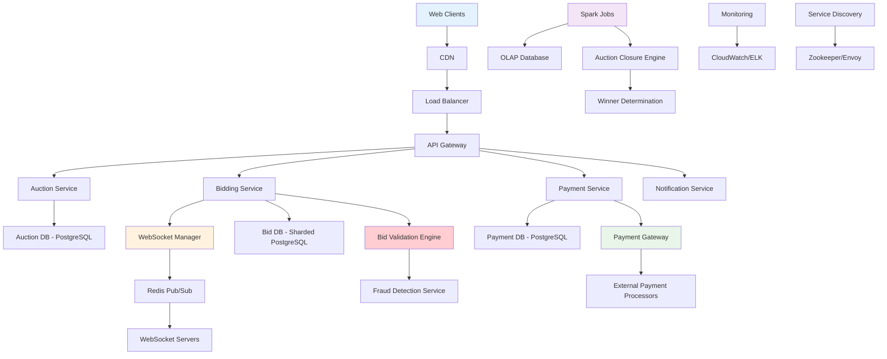
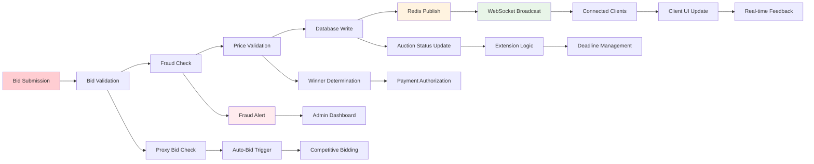
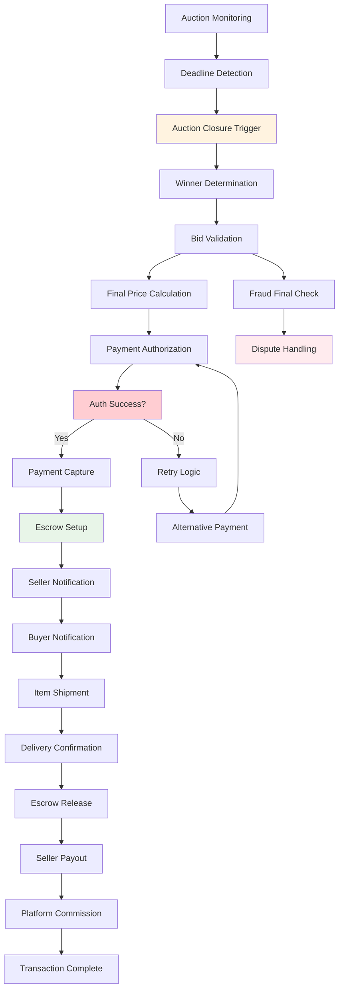

# Online Auction & Bidding Service Backend

## 📋 Table of Contents

- [Online Auction & Bidding Service Backend](#online-auction--bidding-service-backend)
  - [Requirements Gathering](#requirements-gathering)
    - [Functional Requirements](#functional-requirements)
    - [Non-Functional Requirements](#non-functional-requirements)
  - [Traffic Estimation & Capacity Planning](#traffic-estimation--capacity-planning)
    - [Auction Participation Analysis](#auction-participation-analysis)
    - [Bidding Volume Calculations](#bidding-volume-calculations)
    - [Real-time Update Load](#real-time-update-load)
  - [Database Schema Design](#database-schema-design)
    - [Auction Management Schema](#auction-management-schema)
    - [Bidding and Transaction Schema](#bidding-and-transaction-schema)
    - [Payment Processing Schema](#payment-processing-schema)
  - [System API Design](#system-api-design)
    - [Auction Lifecycle APIs](#auction-lifecycle-apis)
    - [Bidding and Real-time APIs](#bidding-and-real-time-apis)
    - [Payment and Settlement APIs](#payment-and-settlement-apis)
  - [High-Level Design (HLD)](#high-level-design-hld)
    - [Distributed Auction Architecture](#distributed-auction-architecture)
    - [Real-time Bidding Pipeline](#real-time-bidding-pipeline)
    - [Auction Closure and Payment Flow](#auction-closure-and-payment-flow)
  - [Low-Level Design (LLD)](#low-level-design-lld)
    - [WebSocket Connection Management](#websocket-connection-management)
    - [Bid Processing Engine](#bid-processing-engine)
    - [Payment Authorization System](#payment-authorization-system)
  - [Core Algorithms](#core-algorithms)
    - [1. Real-time Bid Validation Algorithm](#1-real-time-bid-validation-algorithm)
    - [2. Auction Closure Detection Algorithm](#2-auction-closure-detection-algorithm)
    - [3. Winner Determination Algorithm](#3-winner-determination-algorithm)
    - [4. Payment Orchestration Algorithm](#4-payment-orchestration-algorithm)
    - [5. Anti-Fraud Detection Algorithm](#5-anti-fraud-detection-algorithm)
  - [Performance Optimizations](#performance-optimizations)
    - [Real-time Communication Optimization](#real-time-communication-optimization)
    - [Database Query Optimization](#database-query-optimization)
    - [Caching and Pre-computation](#caching-and-pre-computation)
  - [Security Considerations](#security-considerations)
    - [Bid Integrity and Anti-Fraud](#bid-integrity-and-anti-fraud)
    - [Payment Security](#payment-security)
  - [Testing Strategy](#testing-strategy)
    - [Auction System Testing](#auction-system-testing)
    - [Load and Stress Testing](#load-and-stress-testing)
  - [Trade-offs and Considerations](#trade-offs-and-considerations)
    - [Real-time vs Batch Processing](#real-time-vs-batch-processing)
    - [Consistency vs Availability](#consistency-vs-availability)
    - [Cost vs Performance](#cost-vs-performance)

[⬆️ Back to Top](#--table-of-contents)

---

## Requirements Gathering

### Functional Requirements

**Core Auction Management:**
- Create and manage auction listings with detailed item descriptions and images
- Support multiple auction types: English (ascending), Dutch (descending), sealed bid
- Configurable auction durations with fixed and dynamic deadline extensions
- Category-based auction organization and discovery
- Seller reputation and rating systems

**Bidding System:**
- Real-time bid placement with immediate validation and confirmation
- Automatic bid increment enforcement and minimum bid requirements
- Proxy bidding (automatic bidding up to maximum amount)
- Bid history tracking with transparent bidding timeline
- Anti-sniping mechanisms with auction extension on last-minute bids

**Real-time Updates:**
- Live bid updates via WebSocket connections for all auction participants
- Real-time auction status changes (active, closing, closed)
- Instant notifications for outbid alerts and auction endings
- Live participant count and watch list updates
- Real-time price discovery and market feedback

**Payment and Settlement:**
- Secure payment processing with multiple payment methods
- Escrow services for high-value transactions
- Automatic winner notification and payment initiation
- Dispute resolution system with admin intervention capabilities
- Commission calculation and fee processing for platform revenue

**User Management:**
- User registration with identity verification for high-value auctions
- Seller verification and business account support
- Bidding history and transaction analytics
- Watchlist and favorite auction management
- Social features: following sellers, auction sharing

[⬆️ Back to Top](#--table-of-contents)

### Non-Functional Requirements

**Performance Requirements:**
- Support 1 million concurrent users during peak auction periods
- Handle 100,000 bids per minute across all active auctions
- WebSocket message delivery within 100ms for real-time updates
- Auction page load time under 2 seconds with full bid history
- 99.99% uptime during major auction events

**Scalability Requirements:**
- Support 100,000 simultaneous active auctions
- Horizontal scaling for bid processing and WebSocket connections
- Auto-scaling based on auction activity and user traffic
- Global deployment for international auction access
- Linear performance scaling with infrastructure investment

**Consistency Requirements:**
- Strong consistency for bid ordering and winner determination
- Eventual consistency acceptable for non-critical data (view counts, analytics)
- ACID compliance for payment transactions and fund transfers
- Linearizability for bid sequence validation
- Causal consistency for real-time update propagation

**Security Requirements:**
- Fraud detection and prevention for fake bids and payment schemes
- Secure payment processing with PCI DSS compliance
- Anti-money laundering (AML) and know your customer (KYC) compliance
- DDoS protection during high-profile auction events
- Data encryption for sensitive user and financial information

**Reliability Requirements:**
- Zero data loss for bids and payment transactions
- Disaster recovery with cross-region backup and failover
- Graceful degradation during infrastructure failures
- Automatic retry mechanisms for transient failures
- Comprehensive audit logging for all financial transactions

[⬆️ Back to Top](#--table-of-contents)

---

## Traffic Estimation & Capacity Planning

### Auction Participation Analysis

**User Base Projections:**
- 10 million registered users globally
- 1 million monthly active bidders
- 100,000 concurrent users during peak hours
- 500,000 auction watchers and browsers
- Average 50 auctions watched per active user

**Auction Distribution:**
- Major auctions (10,000+ participants): 10 per day
- Regular auctions (100-1,000 participants): 1,000 per day
- Small auctions (10-100 participants): 10,000 per day
- Total active auctions at any time: 50,000
- Average auction duration: 7 days with varying end times

**Geographic Distribution:**
- North America: 35% of traffic and transactions
- Europe: 30% of traffic and transactions
- Asia-Pacific: 25% of traffic and transactions
- Other regions: 10% of traffic and transactions

[⬆️ Back to Top](#--table-of-contents)

### Bidding Volume Calculations

**Bidding Patterns:**
- Average 50 bids per auction over lifetime
- Peak bidding rate: 100,000 bids per minute during popular auctions
- Last-hour bidding surge: 300% increase in bid frequency
- Proxy bid activation: 40% of total bid volume
- Mobile vs desktop bidding: 60% mobile, 40% desktop

**Daily Operations:**
- Total daily bids: 2.5 million across all auctions
- Peak hourly bid volume: 500,000 bids during evening hours
- WebSocket connections: 500,000 concurrent connections
- Real-time message throughput: 10 million messages per hour
- Database write operations: 1,000 writes per second sustained

**Resource Requirements:**
- Compute: 2,000 CPU cores for bid processing and WebSocket handling
- Memory: 1 TB RAM for active auction data and connection state
- Storage: 50 TB for auction data, bid history, and user information
- Network: 10 Gbps sustained bandwidth for global WebSocket traffic
- Database: 500,000 read/write IOPS for real-time operations

[⬆️ Back to Top](#--table-of-contents)

### Real-time Update Load

**WebSocket Connection Management:**
- Concurrent WebSocket connections: 500,000 during peak
- Connection lifetime: 2 hours average session duration
- Message broadcast fanout: 1:1000 ratio (1 bid update to 1000 watchers)
- Geographic distribution: 4 regions with local WebSocket servers
- Connection recovery and reconnection: 5% per minute churn rate

**Real-time Message Volume:**
- Bid update messages: 100,000 per minute
- Auction status changes: 10,000 per minute
- User notifications: 50,000 per minute
- Heartbeat and keepalive: 500,000 per minute
- Total message throughput: 660,000 messages per minute

**Infrastructure Scaling:**
- WebSocket servers: 100 instances across 4 regions
- Message brokers: Redis cluster with 20 nodes
- Load balancers: Geographic load balancing with health checks
- CDN integration: Static content and WebSocket upgrade handling
- Auto-scaling: Dynamic scaling based on connection count and latency

[⬆️ Back to Top](#--table-of-contents)

---

## Database Schema Design

### Auction Management Schema

**Auctions Table:**
- Auction ID (Primary Key): Unique auction identifier
- Seller ID (Foreign Key): Auction creator reference
- Title: Auction item name and description
- Category: Product category for organization
- Starting Price: Minimum bid amount
- Reserve Price: Hidden minimum selling price
- Current Price: Latest highest bid amount
- Start Time: Auction beginning timestamp
- End Time: Scheduled auction conclusion
- Status: Active, Closing, Closed, Cancelled
- Increment: Minimum bid increase requirement

**Auction Items Table:**
- Item ID (Primary Key): Unique item identifier
- Auction ID (Foreign Key): Associated auction
- Description: Detailed item information
- Condition: New, used, refurbished status
- Images: Photo URLs and metadata
- Shipping Info: Costs, restrictions, and options
- Item Location: Geographic location for shipping calculation
- Specifications: Technical details and features

**Categories Table:**
- Category ID (Primary Key): Unique category identifier
- Category Name: Display name for organization
- Parent Category: Hierarchical category structure
- Commission Rate: Platform fee percentage
- Verification Required: KYC requirements for category
- Special Rules: Category-specific bidding rules

[⬆️ Back to Top](#--table-of-contents)

### Bidding and Transaction Schema

**Bids Table:**
- Bid ID (Primary Key): Unique bid identifier
- Auction ID (Partition Key): Target auction for efficient querying
- Bidder ID (Foreign Key): User placing the bid
- Bid Amount: Monetary value of the bid
- Max Amount: Maximum amount for proxy bidding
- Bid Time: Precise timestamp for ordering
- Bid Type: Manual, proxy, automatic
- Status: Active, outbid, winning, invalid
- IP Address: Source IP for fraud detection

**Bid History Table:**
- History ID (Primary Key): Unique history entry
- Auction ID (Partition Key): Associated auction
- Previous Bid ID: Reference to previous highest bid
- New Bid ID: Reference to new highest bid
- Price Change: Bid amount difference
- Timestamp: When bid change occurred
- Event Type: New bid, proxy activation, auction extension

**Proxy Bids Table:**
- Proxy ID (Primary Key): Unique proxy bid identifier
- Bidder ID (Foreign Key): User setting proxy bid
- Auction ID (Foreign Key): Target auction
- Maximum Amount: Highest amount user will pay
- Current Proxy: Current proxy bid amount
- Increment Strategy: How proxy bids are increased
- Status: Active, exhausted, cancelled
- Created Time: When proxy bid was established

[⬆️ Back to Top](#--table-of-contents)

### Payment Processing Schema

**Payment Authorizations:**
- Auth ID (Primary Key): Unique authorization identifier
- Auction ID (Foreign Key): Associated auction
- Winner ID (Foreign Key): Auction winner
- Amount: Final auction price plus fees
- Payment Method: Credit card, bank transfer, wallet
- Auth Status: Pending, authorized, captured, failed
- Auth Time: When authorization was requested
- Expiry Time: Authorization expiration timestamp
- Gateway Response: External payment processor response

**Transactions Table:**
- Transaction ID (Primary Key): Unique transaction identifier
- Auction ID (Foreign Key): Related auction
- Payer ID (Foreign Key): User making payment
- Payee ID (Foreign Key): User receiving payment
- Amount: Transaction amount
- Fee Amount: Platform commission
- Status: Pending, completed, failed, refunded
- Transaction Type: Payment, refund, fee, escrow
- Created Time: Transaction initiation timestamp
- Completed Time: Transaction finalization timestamp

**Escrow Accounts:**
- Escrow ID (Primary Key): Unique escrow identifier
- Auction ID (Foreign Key): Protected transaction auction
- Buyer ID (Foreign Key): Auction winner
- Seller ID (Foreign Key): Auction creator
- Amount: Escrowed funds amount
- Status: Held, released, disputed
- Hold Duration: Escrow period length
- Release Conditions: Criteria for fund release
- Dispute ID: Reference to dispute resolution process

[⬆️ Back to Top](#--table-of-contents)

---

## System API Design

### Auction Lifecycle APIs

**Auction Creation and Management:**
- Create new auction with comprehensive item details and settings
- Update auction information during active periods (where allowed)
- Upload and manage auction images with optimized storage
- Set reserve prices and bidding increments with validation
- Schedule auction start and end times with timezone handling

**Auction Discovery and Search:**
- Search auctions by category, keywords, and price ranges
- Browse trending and featured auctions with personalized recommendations
- Filter by location, condition, and auction type
- Real-time auction count and statistics for categories
- Advanced search with multiple criteria and sorting options

**Auction Monitoring:**
- Retrieve detailed auction information with current status
- Get bid history with anonymized bidder information
- Track auction views, watchers, and engagement metrics
- Generate auction analytics for sellers
- Export auction data for reporting and analysis

[⬆️ Back to Top](#--table-of-contents)

### Bidding and Real-time APIs

**Bid Placement and Management:**
- Submit bids with real-time validation and confirmation
- Set up proxy bids with maximum amount and increment strategy
- Retrieve user's bidding history across all auctions
- Cancel or modify proxy bids before execution
- Get personalized bidding recommendations and strategies

**Real-time WebSocket APIs:**
- Establish WebSocket connection with authentication
- Subscribe to specific auction updates and bid notifications
- Receive real-time bid updates with bidder information
- Get auction status changes and countdown updates
- Handle connection recovery and state synchronization

**Notification and Alert APIs:**
- Configure bid notification preferences and thresholds
- Send real-time alerts for outbid situations
- Notify auction ending warnings and reminders
- Manage email and push notification settings
- Track notification delivery and engagement metrics

[⬆️ Back to Top](#--table-of-contents)

### Payment and Settlement APIs

**Payment Authorization:**
- Authorize payment methods for auction participation
- Pre-authorize funds for high-value auctions
- Validate payment information and fraud screening
- Handle payment method updates and changes
- Process payment authorization for auction winners

**Transaction Processing:**
- Capture authorized payments upon auction completion
- Process refunds for cancelled or disputed transactions
- Handle escrow fund management and release
- Calculate and process platform commission fees
- Generate payment receipts and transaction records

**Financial Reporting:**
- Generate seller payout reports and statements
- Track platform revenue and commission analytics
- Provide tax reporting information for users
- Handle currency conversion for international transactions
- Process bulk payouts and settlement operations

[⬆️ Back to Top](#--table-of-contents)

---

## High-Level Design (HLD)

### Distributed Auction Architecture

**Scalable Auction Platform Architecture:**

**Core Service Components:**
- **Auction Service**: Lifecycle management and catalog operations
- **Bidding Service**: Real-time bid processing and validation
- **Payment Service**: Authorization, capture, and settlement
- **Notification Service**: Real-time updates via WebSocket and push notifications
- **WebSocket Manager**: Connection management and message routing
- **Fraud Detection**: Real-time analysis and risk assessment

[⬆️ Back to Top](#--table-of-contents)

### Real-time Bidding Pipeline

**End-to-End Bidding Flow with WebSocket Integration:**

**Real-time Processing Benefits:**
- **Immediate Feedback**: Instant bid confirmation and validation
- **Live Competition**: Real-time bid updates create competitive atmosphere
- **Fraud Prevention**: Immediate fraud detection and blocking
- **Market Transparency**: Live price discovery and bidding activity

[⬆️ Back to Top](#--table-of-contents)

### Auction Closure and Payment Flow

**Automated Auction Completion with Payment Processing:**

**Payment Workflow Features:**
- **Off-Capture Workflow**: Two-step authorization and capture process
- **AWS Step Functions**: Orchestrated workflow for complex payment flows
- **Automatic Retry**: Intelligent retry for transient payment failures
- **Escrow Protection**: Secure fund holding until transaction completion

[⬆️ Back to Top](#--table-of-contents)

---

## Low-Level Design (LLD)

### WebSocket Connection Management

**Scalable Real-time Communication Architecture:**
- **Connection Pool Management**: Efficient WebSocket connection lifecycle management
- **Service Discovery**: Zookeeper and Envoy for dynamic service location
- **Session Affinity**: Sticky sessions for WebSocket connection persistence
- **Load Balancing**: Geographic and performance-based connection routing

**Message Broadcasting System:**
- **Redis Pub/Sub**: High-performance message distribution across server instances
- **Topic Management**: Auction-specific channels for targeted message delivery
- **Message Serialization**: Efficient JSON serialization for real-time updates
- **Delivery Guarantees**: At-least-once delivery with idempotency handling

**Connection Resilience:**
- **Heartbeat Monitoring**: Regular ping/pong for connection health validation
- **Automatic Reconnection**: Client-side reconnection with exponential backoff
- **State Synchronization**: Connection recovery with missed message replay
- **Graceful Degradation**: Fallback to HTTP polling when WebSocket unavailable

[⬆️ Back to Top](#--table-of-contents)

### Bid Processing Engine

**High-Performance Bid Validation:**
- **Real-time Validation**: Sub-100ms bid validation with business rule enforcement
- **Concurrency Control**: Optimistic locking for bid sequence consistency
- **Proxy Bid Engine**: Automatic bidding logic with increment management
- **Anti-Sniping Logic**: Dynamic auction extension based on last-minute bids

**Database Optimization:**
- **Sharded PostgreSQL**: Partition bids by auction ID for linear scaling
- **Read Replicas**: Dedicated read replicas for bid history and analytics
- **Secondary Indexes**: Optimized indexes for bid ordering and retrieval
- **Connection Pooling**: Efficient database connection management

**Fraud Detection Integration:**
- **Real-time Risk Scoring**: ML-based fraud detection with immediate scoring
- **Pattern Recognition**: Behavioral analysis for suspicious bidding patterns
- **Velocity Checking**: Rate limiting and unusual activity detection
- **Blacklist Management**: Dynamic blacklist with automatic enforcement

[⬆️ Back to Top](#--table-of-contents)

### Payment Authorization System

**Secure Payment Processing:**
- **PCI DSS Compliance**: Secure card data handling with tokenization
- **Multi-Gateway Support**: Integration with multiple payment processors
- **Risk Assessment**: Real-time fraud scoring and risk evaluation
- **Currency Support**: Multi-currency handling with real-time conversion

**Authorization Workflow:**
- **Pre-Authorization**: Fund validation before auction participation
- **Auth-Capture Model**: Two-phase payment with delayed capture
- **Timeout Management**: Authorization expiration and renewal handling
- **Retry Logic**: Intelligent retry with fallback payment methods

**Settlement and Reconciliation:**
- **Automated Settlement**: Scheduled payouts with commission calculation
- **Reconciliation Engine**: Automated transaction matching and validation
- **Dispute Resolution**: Workflow for payment disputes and chargebacks
- **Audit Trail**: Comprehensive logging for financial compliance

[⬆️ Back to Top](#--table-of-contents)

---

## Core Algorithms

### 1. Real-time Bid Validation Algorithm

**Comprehensive Bid Processing Pipeline:**
- Validate user authentication and auction participation eligibility
- Check minimum bid increment requirements against current highest bid
- Verify user's payment authorization and available funds
- Detect and prevent fraudulent or suspicious bidding patterns
- Process proxy bid logic and automatic bidding mechanisms
- Update auction state and broadcast changes to all connected clients

**Concurrency Management:**
- **Optimistic Locking**: Version-based locking for auction state updates
- **Atomic Operations**: Ensure bid sequence consistency with database transactions
- **Queue Management**: FIFO processing for simultaneous bid submissions
- **Deadlock Prevention**: Ordered resource acquisition to prevent deadlocks

**Performance Optimization:**
- **In-Memory Caching**: Cache active auction state for faster validation
- **Batch Processing**: Group related operations for database efficiency
- **Asynchronous Updates**: Decouple validation from broadcast operations
- **Circuit Breakers**: Graceful degradation during high load periods

[⬆️ Back to Top](#--table-of-contents)

### 2. Auction Closure Detection Algorithm

**Multi-Strategy Auction Monitoring:**
- **Database Triggers**: Real-time monitoring for auction deadline detection
- **Distributed Cron Jobs**: Scheduled batch processing for auction closure
- **Event-Driven Processing**: Immediate closure trigger on final conditions
- **Hybrid Approach**: Combine real-time and batch processing for reliability

**Deadline Management:**
- **Anti-Sniping Extension**: Automatic extension for last-minute bids
- **Soft Close Logic**: Graduated closure with warning periods
- **Time Zone Handling**: Accurate deadline calculation across global users
- **Grace Period**: Buffer time for system clock synchronization

**Closure Workflow:**
- **State Transition**: Atomic transition from active to closing to closed
- **Final Bid Validation**: Last-chance validation of winning bid
- **Winner Notification**: Immediate notification to auction participants
- **Payment Initiation**: Automatic payment authorization for winner

[⬆️ Back to Top](#--table-of-contents)

### 3. Winner Determination Algorithm

**Robust Winner Selection Process:**
- Parse all valid bids and sort by amount in descending order
- Apply tie-breaking rules using bid timestamp for identical amounts
- Validate winner's payment authorization and fraud status
- Handle reserve price requirements and seller acceptance
- Process complex auction types (Dutch, sealed bid) with specific rules
- Generate winner notification and initiate payment capture

**Bid History Analysis:**
- **Chronological Sorting**: Time-based bid ordering for tie resolution
- **Proxy Bid Resolution**: Final proxy bid execution and validation
- **Invalid Bid Removal**: Filter out fraudulent or invalid bids
- **Reserve Price Logic**: Apply hidden reserve price requirements

**Edge Case Handling:**
- **No Valid Bids**: Handle auctions without meeting reserve requirements
- **Payment Failure**: Cascade to next highest bidder on payment issues
- **Fraud Detection**: Invalidate winner if fraud detected post-closure
- **Seller Rejection**: Handle seller's right to reject winning bid

[⬆️ Back to Top](#--table-of-contents)

### 4. Payment Orchestration Algorithm

**AWS Step Functions Workflow:**
- **Payment Authorization**: Initial fund verification and hold
- **Winner Validation**: Final fraud check and eligibility confirmation
- **Capture Execution**: Convert authorization to actual charge
- **Escrow Management**: Transfer funds to secure escrow account
- **Seller Notification**: Inform seller of successful payment
- **Payout Scheduling**: Schedule seller payout based on delivery confirmation

**Error Handling and Retry:**
- **Exponential Backoff**: Progressive retry delays for transient failures
- **Circuit Breaker**: Stop retries after persistent failure threshold
- **Fallback Methods**: Alternative payment methods on primary failure
- **Manual Intervention**: Escalation to admin for complex payment issues

**Compliance and Auditing:**
- **Transaction Logging**: Comprehensive audit trail for all payment operations
- **Regulatory Compliance**: AML/KYC checks and reporting
- **Fraud Monitoring**: Continuous monitoring for suspicious payment patterns
- **Reconciliation**: Automated matching of payments with external processors

[⬆️ Back to Top](#--table-of-contents)

### 5. Anti-Fraud Detection Algorithm

**Multi-Layer Fraud Prevention:**
- **Behavioral Analysis**: Monitor bidding patterns for suspicious activity
- **Velocity Checking**: Detect unusual bidding frequency and amounts
- **Device Fingerprinting**: Track device characteristics for identity verification
- **IP Geolocation**: Validate user location consistency
- **Machine Learning Models**: Advanced pattern recognition for fraud detection

**Real-time Risk Scoring:**
- **Feature Engineering**: Extract relevant features from user behavior
- **Risk Score Calculation**: Combine multiple signals into unified risk score
- **Threshold Management**: Dynamic thresholds based on auction value
- **Immediate Action**: Automatic bid blocking for high-risk transactions

**Investigation and Response:**
- **Alert Generation**: Real-time alerts for suspicious activity
- **Manual Review**: Human investigation for complex fraud cases
- **Account Suspension**: Temporary or permanent account restrictions
- **Pattern Learning**: Continuous improvement of fraud detection models

[⬆️ Back to Top](#--table-of-contents)

---

## Performance Optimizations

### Real-time Communication Optimization

**WebSocket Performance Tuning:**
- **Connection Pooling**: Efficient management of WebSocket connections
- **Message Compression**: Gzip compression for large message payloads
- **Binary Protocols**: Protocol buffers for high-frequency updates
- **Client-Side Caching**: Reduce redundant data transmission

**Geographic Optimization:**
- **Edge Servers**: WebSocket servers deployed globally for low latency
- **Smart Routing**: Route connections to nearest available server
- **Regional Failover**: Automatic failover to backup regions
- **CDN Integration**: WebSocket upgrade handling through CDN

**Message Broadcasting:**
- **Topic Segmentation**: Separate channels for different auction categories
- **Selective Broadcasting**: Send updates only to interested parties
- **Message Batching**: Combine multiple updates into single broadcast
- **Rate Limiting**: Prevent message flooding during high activity

[⬆️ Back to Top](#--table-of-contents)

### Database Query Optimization

**Partitioning and Sharding:**
- **Auction-Based Partitioning**: Partition bids by auction ID for locality
- **Time-Based Partitioning**: Separate active and historical auction data
- **Geographic Sharding**: Distribute data based on user location
- **Consistent Hashing**: Balanced data distribution across shards

**Index Optimization:**
- **Composite Indexes**: Multi-column indexes for complex queries
- **Covering Indexes**: Include all query columns to avoid table lookups
- **Partial Indexes**: Indexes on active auctions for performance
- **Index Maintenance**: Regular index analysis and optimization

**Query Performance:**
- **Read Replicas**: Dedicated replicas for bid history and analytics
- **Query Caching**: Cache expensive aggregation queries
- **Materialized Views**: Pre-computed views for common queries
- **Connection Pooling**: Efficient database connection management

[⬆️ Back to Top](#--table-of-contents)

### Caching and Pre-computation

**Multi-Level Caching Strategy:**
- **Application Cache**: In-memory caching for auction state
- **Redis Cluster**: Distributed caching for bid data and user sessions
- **CDN Caching**: Global caching for auction images and static content
- **Database Query Cache**: Cache frequent database query results

**Pre-computation Strategies:**
- **Auction Statistics**: Pre-compute popular metrics and analytics
- **Trending Auctions**: Background calculation of trending and featured items
- **User Recommendations**: Pre-computed personalized auction suggestions
- **Search Indexes**: Elasticsearch indexes for fast auction discovery

**Cache Invalidation:**
- **Event-Driven Invalidation**: Real-time cache updates on bid changes
- **TTL Management**: Time-based expiration for less critical data
- **Version-Based Cache**: Cache versioning for auction state changes
- **Selective Invalidation**: Granular invalidation for affected data only

[⬆️ Back to Top](#--table-of-contents)

---

## Security Considerations

### Bid Integrity and Anti-Fraud

**Bid Authentication:**
- **Digital Signatures**: Cryptographic signatures for bid authenticity
- **User Verification**: Multi-factor authentication for high-value auctions
- **Session Management**: Secure session tokens with expiration
- **API Rate Limiting**: Prevent automated bidding attacks

**Fraud Detection:**
- **Machine Learning Models**: Advanced fraud detection using behavioral patterns
- **Risk Scoring**: Real-time risk assessment for every bid
- **Pattern Analysis**: Detect colluding bidders and fake accounts
- **Blacklist Management**: Dynamic blacklisting of suspicious users

**Data Protection:**
- **Encryption**: End-to-end encryption for sensitive bid data
- **Access Control**: Role-based access to auction and bidding information
- **Audit Logging**: Comprehensive logging of all security events
- **Data Anonymization**: Protect bidder privacy in public displays

[⬆️ Back to Top](#--table-of-contents)

### Payment Security

**PCI DSS Compliance:**
- **Card Data Protection**: Secure handling and storage of payment information
- **Tokenization**: Replace sensitive data with secure tokens
- **Network Security**: Secure communication channels for payment data
- **Regular Security Testing**: Continuous vulnerability assessment

**Transaction Security:**
- **3D Secure**: Additional authentication for high-value transactions
- **Fraud Monitoring**: Real-time payment fraud detection
- **Chargeback Protection**: Proactive chargeback prevention and management
- **Multi-Gateway Routing**: Intelligent routing based on risk assessment

**Financial Compliance:**
- **AML Compliance**: Anti-money laundering monitoring and reporting
- **KYC Verification**: Know your customer requirements for users
- **Regulatory Reporting**: Automated compliance reporting
- **Audit Trails**: Complete transaction history for regulatory review

[⬆️ Back to Top](#--table-of-contents)

---

## Testing Strategy

### Auction System Testing

**Functional Testing:**
- **Auction Lifecycle**: Test complete auction flow from creation to completion
- **Bid Validation**: Verify bid rules and increment enforcement
- **Payment Processing**: Test payment authorization and capture flows
- **Real-time Updates**: Validate WebSocket message delivery and timing
- **Edge Cases**: Test unusual scenarios and error conditions

**Integration Testing:**
- **Service Integration**: Test interaction between auction, bidding, and payment services
- **External APIs**: Validate integration with payment gateways and notification services
- **Database Consistency**: Test data consistency across service boundaries
- **WebSocket Integration**: Test real-time communication across service instances

**Security Testing:**
- **Fraud Simulation**: Test fraud detection with simulated attack scenarios
- **Payment Security**: Validate PCI compliance and secure payment handling
- **Authentication Testing**: Test user authentication and authorization flows
- **Data Privacy**: Verify proper handling of sensitive user information

[⬆️ Back to Top](#--table-of-contents)

### Load and Stress Testing

**Performance Testing:**
- **Concurrent Bidding**: Test system under high concurrent bid load
- **WebSocket Load**: Validate WebSocket performance with thousands of connections
- **Database Performance**: Test database under heavy read/write load
- **Payment Processing**: Test payment system under transaction volume

**Stress Testing:**
- **Peak Load Simulation**: Simulate major auction events with extreme traffic
- **Resource Exhaustion**: Test system behavior when resources are depleted
- **Cascade Failure**: Test resilience against component failures
- **Recovery Testing**: Validate system recovery after outages

**Scalability Testing:**
- **Horizontal Scaling**: Test auto-scaling capabilities under load
- **Geographic Distribution**: Test performance across global deployments
- **Database Scaling**: Validate sharding and replication performance
- **Cache Performance**: Test caching effectiveness under various loads

[⬆️ Back to Top](#--table-of-contents)

---

## Trade-offs and Considerations

### Real-time vs Batch Processing

**Real-time Processing Benefits:**
- Immediate bid validation and feedback for users
- Live auction updates create competitive bidding atmosphere
- Instant fraud detection and prevention
- Real-time market pricing and discovery

**Batch Processing Advantages:**
- Higher throughput for non-time-sensitive operations
- More efficient resource utilization for analytics
- Easier implementation of complex business logic
- Better cost optimization through resource sharing

**Hybrid Implementation:**
- Real-time processing for bid validation and WebSocket updates
- Batch processing for auction closure and winner determination
- OLAP systems for analytics and reporting with Spark jobs
- Event-driven triggers for time-sensitive operations

[⬆️ Back to Top](#--table-of-contents)

### Consistency vs Availability

**Strong Consistency Requirements:**
- Bid ordering and sequence validation must be linearizable
- Payment transactions require ACID compliance
- Winner determination needs consistent bid history
- Financial data must maintain strict consistency

**Eventual Consistency Acceptance:**
- View counts and engagement metrics can be eventually consistent
- User activity logs and analytics data
- Non-critical notifications and user preferences
- Search indexes and recommendation data

**CAP Theorem Implementation:**
- Partition tolerance prioritized for global availability
- Consistency preferred for financial and bidding operations
- Availability optimized for read-heavy operations
- Geographic partitioning with regional consistency

[⬆️ Back to Top](#--table-of-contents)

### Cost vs Performance

**Performance Investment Areas:**
- High-performance databases for real-time bid processing
- Global WebSocket infrastructure for low-latency updates
- Premium payment processing for secure transactions
- Advanced fraud detection systems with ML capabilities

**Cost Optimization Strategies:**
- Auto-scaling to match demand patterns
- Efficient caching to reduce database load
- Smart routing to minimize network costs
- Data archival strategies for historical auction data

**Technology Selection Balance:**
- **Database**: Sharded PostgreSQL for consistency with cost efficiency
- **Caching**: Redis cluster for performance with reasonable cost
- **WebSocket**: Regional deployment balancing latency and infrastructure cost
- **Payment**: Multi-gateway approach optimizing processing fees
- **Analytics**: Spark on spot instances for cost-effective batch processing

[⬆️ Back to Top](#--table-of-contents) 