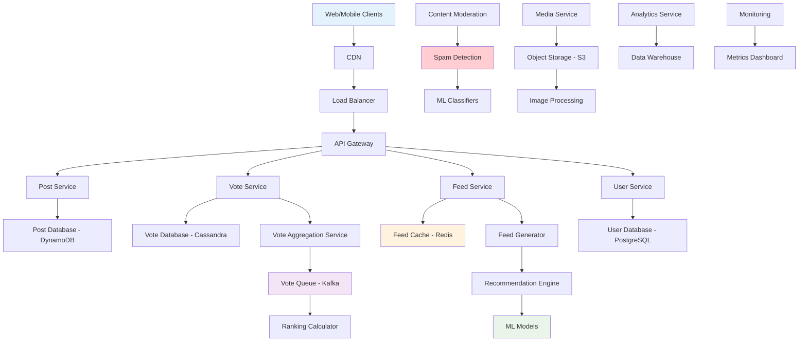
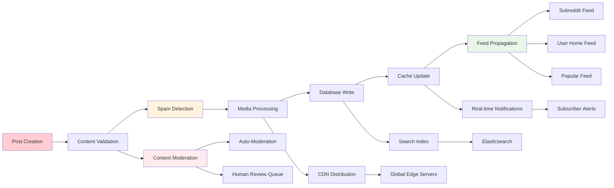
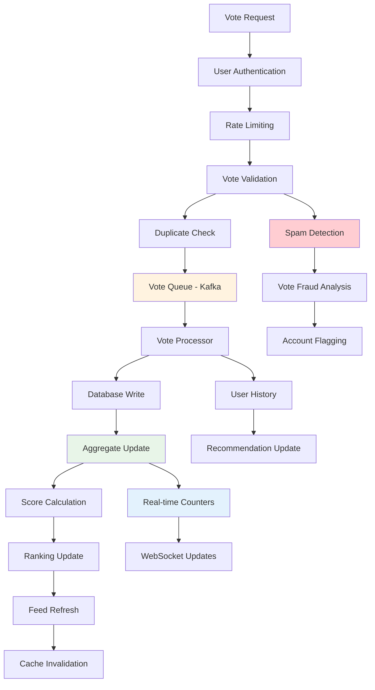

# Reddit Social Platform Backend

## 📋 Table of Contents

- [Reddit Social Platform Backend](#reddit-social-platform-backend)
  - [Requirements Gathering](#requirements-gathering)
    - [Functional Requirements](#functional-requirements)
    - [Non-Functional Requirements](#non-functional-requirements)
  - [Traffic Estimation & Capacity Planning](#traffic-estimation--capacity-planning)
    - [User Engagement Analysis](#user-engagement-analysis)
    - [Content Volume Calculations](#content-volume-calculations)
    - [Voting System Load](#voting-system-load)
  - [Database Schema Design](#database-schema-design)
    - [Post and Content Schema](#post-and-content-schema)
    - [Voting and Engagement Schema](#voting-and-engagement-schema)
    - [User and Subreddit Schema](#user-and-subreddit-schema)
  - [System API Design](#system-api-design)
    - [Content Management APIs](#content-management-apis)
    - [Voting and Interaction APIs](#voting-and-interaction-apis)
    - [Feed Generation APIs](#feed-generation-apis)
  - [High-Level Design (HLD)](#high-level-design-hld)
    - [Distributed Reddit Architecture](#distributed-reddit-architecture)
    - [Content Creation and Distribution Flow](#content-creation-and-distribution-flow)
    - [Voting System Architecture](#voting-system-architecture)
  - [Low-Level Design (LLD)](#low-level-design-lld)
    - [Post Storage and Retrieval Engine](#post-storage-and-retrieval-engine)
    - [Vote Processing System](#vote-processing-system)
    - [Feed Generation Engine](#feed-generation-engine)
  - [Core Algorithms](#core-algorithms)
    - [1. Hot Post Ranking Algorithm](#1-hot-post-ranking-algorithm)
    - [2. Vote Aggregation Algorithm](#2-vote-aggregation-algorithm)
    - [3. Feed Personalization Algorithm](#3-feed-personalization-algorithm)
    - [4. Content Distribution Algorithm](#4-content-distribution-algorithm)
    - [5. Spam Detection Algorithm](#5-spam-detection-algorithm)
  - [Performance Optimizations](#performance-optimizations)
    - [Caching Strategy Optimization](#caching-strategy-optimization)
    - [Database Query Optimization](#database-query-optimization)
    - [Content Delivery Optimization](#content-delivery-optimization)
  - [Security Considerations](#security-considerations)
    - [Vote Manipulation Prevention](#vote-manipulation-prevention)
    - [Content Moderation](#content-moderation)
  - [Testing Strategy](#testing-strategy)
    - [Social Platform Testing](#social-platform-testing)
    - [Load and Performance Testing](#load-and-performance-testing)
  - [Trade-offs and Considerations](#trade-offs-and-considerations)
    - [Consistency vs Performance](#consistency-vs-performance)
    - [Real-time vs Batch Processing](#real-time-vs-batch-processing)
    - [Storage vs Compute Trade-offs](#storage-vs-compute-trade-offs)

[⬆️ Back to Top](#--table-of-contents)

---

## Requirements Gathering

### Functional Requirements

**Core Content Management:**
- Create and publish posts with text, images, videos, and external links
- Organize content into subreddits (communities) with custom rules and moderation
- Support multiple post types: text posts, link posts, image posts, video posts
- Rich text formatting with markdown support and media embedding
- Post editing with version history and edit tracking

**Voting and Ranking System:**
- Upvote and downvote posts and comments with immediate feedback
- Calculate and display net scores (upvotes minus downvotes)
- Track individual user voting history for personalization
- Implement vote fuzzing to prevent gaming and bot detection
- Support different sorting algorithms: hot, new, top, rising, controversial

**Content Discovery and Feeds:**
- Personalized home feed based on subscribed subreddits and user preferences
- Popular/trending posts across all subreddits with global ranking
- Subreddit-specific feeds with customizable sorting options
- Cross-posting functionality to share content across multiple subreddits
- Advanced search functionality with filters for time, subreddit, and content type

**User and Community Management:**
- User registration, authentication, and profile management
- Subreddit creation and administration with moderator tools
- User karma system based on post and comment scores
- Following users and subscribing to subreddits
- Private messaging and chat functionality

**Content Moderation:**
- Automated spam detection and content filtering
- Moderator tools for post removal, user banning, and rule enforcement
- Reporting system for inappropriate content and rule violations
- Content age restriction and NSFW tagging
- Shadow banning and rate limiting for problematic users

[⬆️ Back to Top](#--table-of-contents)

### Non-Functional Requirements

**Performance Requirements:**
- Support 50 million daily active users and 330 million monthly active users
- Handle 21 billion page views per month (7,000 TPS for read operations)
- Process 877 TPS for voting operations during peak hours
- Post creation throughput of 5.45 TPS sustained load
- Page load times under 2 seconds for 95% of requests

**Scalability Requirements:**
- Horizontal scaling for all major components
- Support for 199 million posts annually with efficient storage
- Handle 32 billion votes annually with real-time processing
- Auto-scaling based on traffic patterns and regional demand
- Global content delivery with regional data centers

**Consistency Requirements:**
- Eventual consistency acceptable for vote counts and karma scores
- Strong consistency required for user authentication and content ownership
- Causal consistency for comment threads and reply ordering
- Weak consistency acceptable for view counts and engagement metrics

**Availability Requirements:**
- 99.9% uptime with graceful degradation during failures
- Regional failover capabilities for disaster recovery
- Zero data loss for posts, comments, and critical user data
- Read-heavy system optimization with acceptable write latency
- Cached content availability during database maintenance

**Security Requirements:**
- Protection against vote manipulation and bot networks
- Secure user authentication with password hashing and session management
- Content filtering and automated moderation for harmful content
- DDoS protection and rate limiting for API endpoints
- Privacy controls for user data and browsing history

[⬆️ Back to Top](#--table-of-contents)

---

## Traffic Estimation & Capacity Planning

### User Engagement Analysis

**User Base Metrics:**
- 50 million daily active users (DAU)
- 330 million monthly active users (MAU)
- Average session duration: 30 minutes
- Peak concurrent users: 10 million during major events
- User retention rate: 60% monthly, 80% weekly

**Content Consumption Patterns:**
- 21 billion page views per month (7,000 TPS average, 15,000 TPS peak)
- 70% mobile traffic, 30% desktop traffic
- Average 420 page views per DAU per month
- 60% of traffic concentrated in 8-hour peak period
- Geographic distribution: 50% US, 20% Europe, 15% Asia, 15% others

**Engagement Distribution:**
- 90% lurkers (browse without posting/commenting)
- 9% contributors (vote and comment regularly)
- 1% content creators (post original content regularly)
- Average user votes on 20 posts per session
- Comment-to-post ratio: 15:1

[⬆️ Back to Top](#--table-of-contents)

### Content Volume Calculations

**Post Creation Metrics:**
- 199 million posts per year (5.45 TPS average)
- Peak posting rate: 15 TPS during major news events
- Average post size: 500 characters text + 2MB media
- Distribution: 40% text, 30% images, 20% links, 10% videos
- Daily new posts: 545,000 across all subreddits

**Content Storage Requirements:**
- Post metadata: 199M × 1KB = 199 GB annually
- Text content: 199M × 500 bytes = 99.5 GB annually
- Media content: 199M × 1.2MB average = 238 TB annually
- Total new content storage: ~240 TB annually
- Historical data retention: 5-year retention policy

**Subreddit Distribution:**
- Active subreddits: 100,000 communities
- Major subreddits (>1M subscribers): 100 communities
- Medium subreddits (10K-1M subscribers): 10,000 communities
- Small subreddits (<10K subscribers): 90,000 communities
- Content distribution: 80% in top 1,000 subreddits

[⬆️ Back to Top](#--table-of-contents)

### Voting System Load

**Vote Volume Analysis:**
- 32 billion votes per year (877 TPS average, 2,000 TPS peak)
- Upvote to downvote ratio: 70:30 globally
- Vote distribution: 60% on posts, 40% on comments
- Peak voting during: breaking news, viral content, controversial topics
- Geographic voting patterns follow content consumption trends

**Vote Processing Requirements:**
- Real-time vote counting with sub-second latency
- Vote validation and spam detection
- User vote history tracking for recommendation engine
- Vote fuzzing and normalization for algorithm stability
- Concurrent vote handling with conflict resolution

**Database Operations:**
- Write operations: 877 TPS for votes + 5.45 TPS for posts = 882.45 TPS
- Read operations: 7,000 TPS for page views with complex queries
- Index maintenance for sorting and ranking algorithms
- Aggregate calculations for hot/top/rising lists
- Historical data archival and cleanup processes

[⬆️ Back to Top](#--table-of-contents)

---

## Database Schema Design

### Post and Content Schema

**Posts Table:**
- Post ID (Primary Key): Unique identifier with timestamp encoding
- User ID (Foreign Key): Post author reference
- Subreddit ID (Foreign Key): Community classification
- Title: Post headline with length constraints
- Content: Text content, markdown formatted
- Post Type: Text, link, image, video enumeration
- External URL: Link destination for link posts
- Media URLs: References to uploaded images/videos
- Timestamp: Creation time for chronological sorting
- Net Score: Cached upvotes minus downvotes
- Comment Count: Cached number of comments
- Status: Active, deleted, removed, archived

**Content Metadata:**
- Media ID (Primary Key): Unique media identifier
- Post ID (Foreign Key): Associated post reference
- Media Type: Image, video, gif classification
- File Size: Storage size for capacity planning
- Dimensions: Width and height for display optimization
- CDN URLs: Multiple resolution versions
- Processing Status: Uploaded, processing, ready, failed
- Alt Text: Accessibility descriptions

**Post Versions:**
- Version ID (Primary Key): Edit history identifier
- Post ID (Foreign Key): Original post reference
- Editor ID (Foreign Key): User who made the edit
- Content: Version content snapshot
- Edit Timestamp: When edit was made
- Edit Reason: Optional explanation for changes

[⬆️ Back to Top](#--table-of-contents)

### Voting and Engagement Schema

**Votes Table:**
- Vote ID (Primary Key): Unique vote identifier
- User ID (Partition Key): Voting user for sharding
- Post ID (Foreign Key): Target post reference
- Vote Type: Upvote, downvote, neutral enumeration
- Timestamp: When vote was cast
- IP Address: Source IP for fraud detection
- User Agent: Client information for pattern analysis
- Previous Vote: Previous vote state for change tracking

**Vote Aggregates:**
- Post ID (Primary Key): Target post identifier
- Upvote Count: Total upvotes received
- Downvote Count: Total downvotes received
- Net Score: Upvotes minus downvotes
- Controversy Score: Upvotes plus downvotes (engagement)
- Last Updated: Cache timestamp for invalidation
- Hourly Buckets: Time-series vote data for trending

**User Karma:**
- User ID (Primary Key): User identifier
- Post Karma: Accumulated karma from posts
- Comment Karma: Accumulated karma from comments
- Subreddit Karma: Karma breakdown by community
- Total Karma: Sum of all karma types
- Last Calculated: Cache timestamp
- Karma History: Time-series karma changes

[⬆️ Back to Top](#--table-of-contents)

### User and Subreddit Schema

**Users Table:**
- User ID (Primary Key): Unique user identifier
- Username: Display name with uniqueness constraint
- Email: Authentication and communication
- Password Hash: Secure password storage
- Registration Date: Account creation timestamp
- Last Active: Recent activity for engagement metrics
- Profile Picture: Avatar image URL
- Bio: User description and information
- Preferences: JSON configuration for feeds and settings
- Status: Active, suspended, deleted enumeration

**Subreddits Table:**
- Subreddit ID (Primary Key): Community identifier
- Name: Subreddit name with uniqueness constraint
- Display Name: Formatted community name
- Description: Community purpose and rules
- Created Date: Community establishment timestamp
- Subscriber Count: Number of community members
- Post Count: Total posts in community
- Category: Community classification
- Rules: JSON array of community guidelines
- Moderators: List of moderator user IDs
- Settings: Privacy, content restrictions, etc.

**Subscriptions Table:**
- Subscription ID (Primary Key): Unique subscription identifier
- User ID (Partition Key): Subscribing user
- Subreddit ID (Foreign Key): Target community
- Subscription Date: When user joined community
- Notification Settings: Alert preferences
- Status: Active, muted, unsubscribed

[⬆️ Back to Top](#--table-of-contents)

---

## System API Design

### Content Management APIs

**Post Creation and Management:**
- Create new posts with content validation and spam filtering
- Edit existing posts with version control and history tracking
- Delete posts with soft deletion and recovery options
- Upload and process media content with multiple format support
- Cross-post content to multiple subreddits with reference tracking

**Content Retrieval:**
- Fetch individual posts with complete metadata and engagement metrics
- Retrieve post lists with pagination and sorting options
- Get user's post history with privacy controls
- Search posts across subreddits with advanced filtering
- Export user content for data portability

**Media Management:**
- Upload images, videos, and other media with size validation
- Process media for multiple resolutions and formats
- Generate thumbnails and previews for quick loading
- Manage CDN distribution for global content delivery
- Handle DMCA and content takedown requests

[⬆️ Back to Top](#--table-of-contents)

### Voting and Interaction APIs

**Voting System:**
- Cast upvotes and downvotes with validation and rate limiting
- Retrieve user's voting history with privacy controls
- Get post vote counts and engagement metrics
- Handle vote conflicts and spam detection
- Provide voting analytics for content creators

**Engagement Tracking:**
- Track post views and engagement metrics
- Record user interaction patterns for recommendation engine
- Generate engagement reports for subreddit moderators
- Monitor viral content and trending patterns
- Provide real-time engagement notifications

**Social Features:**
- Follow users and receive activity notifications
- Share posts via external platforms and direct messaging
- Save posts to personal collections and reading lists
- Report inappropriate content and spam
- Block users and filter content

[⬆️ Back to Top](#--table-of-contents)

### Feed Generation APIs

**Personalized Feeds:**
- Generate home feed based on subscribed subreddits and user preferences
- Create popular feed with global trending content
- Provide customizable feed sorting options (hot, new, top, rising)
- Implement feed refresh and real-time updates
- Handle feed pagination and infinite scroll

**Content Discovery:**
- Recommend new subreddits based on user interests
- Suggest related posts and cross-community content
- Provide trending topics and hashtag discovery
- Generate "best of" collections and curated content
- Implement content filtering and preference learning

**Subreddit Management:**
- Retrieve subreddit information and metadata
- Get subreddit-specific feeds and trending content
- Manage subreddit subscriptions and notification preferences
- Access moderator tools and community analytics
- Handle subreddit creation and configuration

[⬆️ Back to Top](#--table-of-contents)

---

## High-Level Design (HLD)

### Distributed Reddit Architecture

**Scalable Social Media Platform Architecture:**

**Core Service Components:**
- **Post Service**: Content creation, editing, and retrieval
- **Vote Service**: Upvote/downvote processing and aggregation
- **Feed Service**: Personalized and community feed generation
- **User Service**: Authentication, profiles, and subscriptions
- **Media Service**: Image/video upload and processing
- **Moderation Service**: Spam detection and content filtering

[⬆️ Back to Top](#--table-of-contents)

### Content Creation and Distribution Flow

**End-to-End Post Creation and Propagation:**

**Content Flow Benefits:**
- **Immediate Validation**: Real-time spam and content policy enforcement
- **Efficient Distribution**: Smart propagation to relevant feeds only
- **Global Delivery**: CDN-based media distribution for performance
- **Search Integration**: Automatic indexing for content discovery

[⬆️ Back to Top](#--table-of-contents)

### Voting System Architecture

**High-Performance Vote Processing Pipeline:**

**Vote Processing Features:**
- **Real-time Processing**: Sub-second vote reflection with queued aggregation
- **Fraud Prevention**: Multi-layer spam and manipulation detection
- **Efficient Aggregation**: Batched updates with eventual consistency
- **Feed Integration**: Automatic ranking and feed updates

[⬆️ Back to Top](#--table-of-contents)

---

## Low-Level Design (LLD)

### Post Storage and Retrieval Engine

**Optimized Content Storage System:**
- **DynamoDB Partitioning**: Post ID-based partitioning for even distribution
- **Hot Data Caching**: Redis caching for trending and recently accessed posts
- **Content Compression**: Gzip compression for text content to reduce storage costs
- **Media Optimization**: Multi-resolution storage with lazy loading

**Query Optimization:**
- **Global Secondary Indexes**: Subreddit-based and time-based indexes for feeds
- **Read Replicas**: Geographically distributed read replicas for performance
- **Connection Pooling**: Efficient database connection management
- **Query Caching**: Cached results for expensive aggregation queries

**Content Lifecycle Management:**
- **Soft Deletion**: Mark content as deleted without immediate removal
- **Archival System**: Move old content to cheaper storage tiers
- **Version Control**: Maintain edit history with delta compression
- **Backup Strategy**: Cross-region backup with point-in-time recovery

[⬆️ Back to Top](#--table-of-contents)

### Vote Processing System

**High-Throughput Vote Handling:**
- **Kafka Message Queue**: Reliable vote event streaming with partitioning
- **Batch Processing**: Aggregate votes in micro-batches for efficiency
- **Conflict Resolution**: Handle concurrent votes with timestamp ordering
- **Idempotency**: Ensure duplicate vote requests don't affect counts

**Vote Aggregation Engine:**
- **Real-time Counters**: In-memory counters with periodic persistence
- **CRDT Implementation**: Conflict-free replicated data types for distributed counting
- **Score Calculation**: Weighted scoring algorithms for hot/top rankings
- **Historical Tracking**: Time-series vote data for trending analysis

**Fraud Detection:**
- **Velocity Checking**: Detect unusual voting patterns and speeds
- **IP Analysis**: Geographic and network-based vote validation
- **User Behavior**: Machine learning models for bot detection
- **Graph Analysis**: Network analysis for coordinated manipulation

[⬆️ Back to Top](#--table-of-contents)

### Feed Generation Engine

**Personalized Feed Algorithm:**
- **Subscription Processing**: Combine posts from subscribed subreddits
- **Scoring Algorithm**: Multi-factor scoring including recency, engagement, and personal preferences
- **Diversity Optimization**: Ensure feed diversity across topics and communities
- **Real-time Updates**: Incremental feed updates for new content

**Caching Strategy:**
- **User Feed Cache**: Pre-computed feeds with TTL-based invalidation
- **Subreddit Cache**: Hot posts cache per community
- **Popular Cache**: Global trending content with frequent updates
- **Personalization Cache**: User preference and behavior data

**Performance Optimization:**
- **Lazy Loading**: Load additional content on-demand
- **Prefetching**: Anticipatory loading of likely next content
- **Compression**: Compressed feed data for mobile optimization
- **CDN Integration**: Edge caching for static feed components

[⬆️ Back to Top](#--table-of-contents)

---

## Core Algorithms

### 1. Hot Post Ranking Algorithm

**Reddit Hot Score Calculation:**
- Calculate post age in hours since submission
- Apply logarithmic scoring to upvote count to prevent runaway leaders
- Subtract downvote influence with diminishing returns
- Apply time decay function to promote fresh content over old popular content
- Normalize scores across different subreddit sizes and activity levels
- Include engagement velocity (votes per hour) in scoring calculation

**Ranking Factors:**
- **Vote Score**: Log₁₀(max(|upvotes - downvotes|, 1))
- **Time Decay**: Exponential decay based on hours since posting
- **Engagement Rate**: Recent voting activity vs historical average
- **Subreddit Normalization**: Adjust scores based on community size
- **Content Quality**: Factor in reported content quality metrics

**Real-time Updates:**
- **Incremental Recalculation**: Update scores on new votes without full recalculation
- **Batch Processing**: Periodic full recalculation for consistency
- **Cache Warming**: Pre-compute scores for trending content
- **Regional Variations**: Adjust rankings for geographic and cultural preferences

[⬆️ Back to Top](#--table-of-contents)

### 2. Vote Aggregation Algorithm

**Efficient Vote Counting System:**
- Process incoming votes through message queue for reliability
- Implement optimistic locking for concurrent vote updates
- Use CRDT counters for distributed vote aggregation across regions
- Apply vote fuzzing to obscure exact counts and prevent gaming
- Batch similar votes for database efficiency
- Maintain separate fast counters and authoritative slow counters

**Conflict Resolution:**
- **Timestamp Ordering**: Resolve conflicts using vote timestamps
- **User Vote History**: Track and validate against previous user votes
- **Duplicate Detection**: Identify and eliminate duplicate vote submissions
- **Rollback Capability**: Revert fraudulent votes when detected

**Performance Optimization:**
- **In-Memory Aggregation**: Use Redis for real-time vote counting
- **Write-Behind Caching**: Asynchronous persistence of vote data
- **Sharding Strategy**: Distribute votes by post ID for parallel processing
- **Compression**: Compress historical vote data for storage efficiency

[⬆️ Back to Top](#--table-of-contents)

### 3. Feed Personalization Algorithm

**Multi-Factor Personalization Engine:**
- Analyze user subscription history and engagement patterns
- Weight posts based on user's historical interaction with similar content
- Consider subreddit activity level and user's participation in community
- Apply content diversity filters to prevent echo chambers
- Include trending and breaking news regardless of subscriptions
- Factor in user's timezone and browsing patterns for optimal timing

**Machine Learning Integration:**
- **Collaborative Filtering**: Recommend content based on similar users' preferences
- **Content-Based Filtering**: Analyze post content and user interests
- **Deep Learning Models**: Neural networks for complex pattern recognition
- **Reinforcement Learning**: Adapt recommendations based on user feedback

**Real-time Adaptation:**
- **Session Learning**: Adapt feed during active browsing session
- **A/B Testing**: Continuous optimization of recommendation algorithms
- **Feedback Loop**: Incorporate votes, clicks, and time spent for learning
- **Cold Start**: Handle new users and new communities effectively

[⬆️ Back to Top](#--table-of-contents)

### 4. Content Distribution Algorithm

**Intelligent Content Propagation:**
- Determine target feeds based on post subreddit and cross-posting rules
- Calculate distribution priority based on subscriber count and engagement
- Implement gradual rollout for potentially viral content
- Apply content filtering based on user preferences and community rules
- Manage distribution throttling to prevent system overload
- Handle content removal and cascade deletion across feeds

**Feed Update Strategy:**
- **Push vs Pull**: Hybrid approach based on user activity and content urgency
- **Batched Updates**: Group related updates for efficiency
- **Priority Queuing**: Prioritize updates for active vs inactive users
- **Geographic Distribution**: Route content through regional data centers

**Cache Management:**
- **Selective Invalidation**: Invalidate only affected cache entries
- **Write-Through Caching**: Ensure consistency between cache and database
- **Cache Warming**: Pre-populate caches with likely-to-be-accessed content
- **TTL Management**: Dynamic TTL based on content freshness and popularity

[⬆️ Back to Top](#--table-of-contents)

### 5. Spam Detection Algorithm

**Multi-Layer Spam Prevention:**
- Analyze posting velocity and pattern recognition for automated detection
- Implement content similarity detection to identify duplicate spam
- Use machine learning models trained on historical spam data
- Apply user reputation scoring based on karma and account age
- Monitor vote manipulation through network analysis and user behavior
- Integrate external spam databases and community reporting

**Real-time Detection:**
- **Feature Extraction**: Extract relevant features from posts and user behavior
- **ML Classification**: Real-time classification using pre-trained models
- **Rule Engine**: Hard rules for obvious spam patterns
- **Community Reporting**: Integrate user reports into detection pipeline

**Response Actions:**
- **Automatic Removal**: Remove high-confidence spam immediately
- **Shadow Banning**: Hide content from others while showing to poster
- **Rate Limiting**: Throttle suspicious accounts automatically
- **Human Review**: Queue borderline cases for moderator review

[⬆️ Back to Top](#--table-of-contents)

---

## Performance Optimizations

### Caching Strategy Optimization

**Multi-Level Caching Architecture:**
- **Browser Cache**: Client-side caching for static content and visited posts
- **CDN Cache**: Global edge caching for media content and popular posts
- **Application Cache**: Redis cluster for hot data and frequent queries
- **Database Cache**: Query result caching at database level

**Cache Hierarchy:**
- **L1 Cache**: In-memory application cache for ultra-fast access
- **L2 Cache**: Redis cluster for shared data across application instances
- **L3 Cache**: Database query cache for expensive operations
- **L4 Cache**: CDN for global content distribution

**Cache Invalidation Strategy:**
- **Event-Driven Invalidation**: Real-time invalidation on content changes
- **TTL-Based Expiration**: Time-based expiration for stale data tolerance
- **Version-Based Invalidation**: Cache versioning for complex dependencies
- **Selective Invalidation**: Granular invalidation for affected data only

[⬆️ Back to Top](#--table-of-contents)

### Database Query Optimization

**Read-Heavy Optimization:**
- **Read Replicas**: Multiple read replicas for geographic distribution
- **Index Strategy**: Optimized indexes for common query patterns
- **Materialized Views**: Pre-computed aggregations for complex queries
- **Query Optimization**: Regular analysis and optimization of slow queries

**Partitioning Strategy:**
- **Post ID Partitioning**: Even distribution avoiding hot partitions
- **Time-Based Partitioning**: Separate recent and historical data
- **Geographic Partitioning**: Regional data distribution for compliance
- **Functional Partitioning**: Separate reads and writes by operation type

**Connection Management:**
- **Connection Pooling**: Efficient database connection reuse
- **Load Balancing**: Distribute queries across available replicas
- **Circuit Breakers**: Graceful degradation on database overload
- **Retry Logic**: Intelligent retry with exponential backoff

[⬆️ Back to Top](#--table-of-contents)

### Content Delivery Optimization

**Global Content Distribution:**
- **CDN Integration**: Multi-CDN strategy for reliability and performance
- **Edge Computing**: Process content closer to users
- **Compression**: Gzip compression for text content
- **Format Optimization**: WebP images and modern video formats

**Mobile Optimization:**
- **Responsive Images**: Multiple resolutions for different screen sizes
- **Lazy Loading**: Load content as needed during scrolling
- **Progressive Enhancement**: Basic content first, enhancements later
- **Offline Caching**: Cache popular content for offline browsing

**Bandwidth Optimization:**
- **Content Compression**: Minimize data transfer size
- **Delta Updates**: Send only changes instead of full content
- **Preloading**: Intelligent preloading of likely next content
- **Quality Adaptation**: Adapt content quality to connection speed

[⬆️ Back to Top](#--table-of-contents)

---

## Security Considerations

### Vote Manipulation Prevention

**Anti-Gaming Measures:**
- **Vote Fuzzing**: Obscure exact vote counts to prevent gaming
- **Rate Limiting**: Limit voting frequency per user and IP address
- **Bot Detection**: Machine learning models to identify automated voting
- **Network Analysis**: Detect coordinated voting rings and sock puppets

**User Authentication:**
- **Multi-Factor Authentication**: Optional 2FA for enhanced security
- **Device Fingerprinting**: Track devices for suspicious activity patterns
- **IP Reputation**: Monitor and block known malicious IP addresses
- **Account Verification**: Email and phone verification for new accounts

**Behavioral Analysis:**
- **Voting Patterns**: Analyze unusual voting behavior and timing
- **Content Patterns**: Detect spam and low-quality content submission
- **Social Graph**: Identify suspicious relationship patterns
- **Historical Analysis**: Compare current behavior to historical patterns

[⬆️ Back to Top](#--table-of-contents)

### Content Moderation

**Automated Moderation:**
- **Content Classification**: AI models for inappropriate content detection
- **Spam Filtering**: Automated spam detection and removal
- **Language Processing**: NLP for hate speech and harassment detection
- **Image Recognition**: Visual content analysis for inappropriate images

**Human Moderation:**
- **Moderator Tools**: Comprehensive tools for community management
- **Escalation System**: Route complex cases to appropriate moderators
- **Appeal Process**: Fair process for users to contest moderation actions
- **Audit Trails**: Complete logging of all moderation actions

**Community Self-Moderation:**
- **User Reporting**: Easy reporting system for inappropriate content
- **Voting on Quality**: Community voting to surface quality content
- **Trusted Users**: Elevated privileges for high-karma users
- **Subreddit Rules**: Custom rules and automated enforcement

[⬆️ Back to Top](#--table-of-contents)

---

## Testing Strategy

### Social Platform Testing

**Functional Testing:**
- **Content Lifecycle**: Test post creation, editing, voting, and deletion
- **Feed Generation**: Validate personalized and community feed algorithms
- **User Interactions**: Test voting, commenting, and social features
- **Moderation Systems**: Verify spam detection and content filtering
- **Search Functionality**: Test content discovery and search accuracy

**Integration Testing:**
- **Service Integration**: Test interaction between microservices
- **Database Consistency**: Validate data consistency across services
- **Cache Coherence**: Test cache invalidation and consistency
- **External APIs**: Test integration with media processing and CDN services

**Algorithm Testing:**
- **Ranking Algorithms**: Validate hot, top, and trending post rankings
- **Recommendation Engine**: Test personalization accuracy and diversity
- **Spam Detection**: Validate detection accuracy and false positive rates
- **Vote Aggregation**: Test vote counting accuracy under load

[⬆️ Back to Top](#--table-of-contents)

### Load and Performance Testing

**Scale Testing:**
- **Concurrent Users**: Test with millions of concurrent active users
- **Vote Volume**: Simulate peak voting periods with high TPS
- **Content Creation**: Test system under heavy posting load
- **Feed Generation**: Validate feed performance under load

**Stress Testing:**
- **Resource Exhaustion**: Test behavior when resources are depleted
- **Cascade Failures**: Test resilience against component failures
- **Viral Content**: Simulate viral content scenarios and traffic spikes
- **Geographic Load**: Test performance across global regions

**Performance Benchmarking:**
- **Response Times**: Measure API response times under various loads
- **Throughput**: Test maximum sustainable throughput for all operations
- **Resource Utilization**: Monitor CPU, memory, and network usage
- **Cache Hit Rates**: Measure cache effectiveness and performance impact

[⬆️ Back to Top](#--table-of-contents)

---

## Trade-offs and Considerations

### Consistency vs Performance

**Consistency Requirements:**
- Strong consistency needed for user authentication and ownership
- Vote counts can tolerate eventual consistency for performance
- Feed updates acceptable with slight delays for better throughput
- Financial data (awards, premium features) requires strong consistency

**Performance Optimizations:**
- Read replicas sacrifice consistency for read performance
- Caching introduces staleness but improves response times
- Asynchronous processing improves user experience but delays consistency
- Geographic distribution creates consistency challenges

**Balanced Approach:**
- Use strong consistency for critical operations
- Accept eventual consistency for non-critical data
- Implement conflict resolution for distributed operations
- Provide clear expectations to users about data freshness

[⬆️ Back to Top](#--table-of-contents)

### Real-time vs Batch Processing

**Real-time Processing Benefits:**
- Immediate vote count updates improve user engagement
- Real-time spam detection prevents bad content spread
- Live feed updates provide fresh content discovery
- Instant notifications enhance user experience

**Batch Processing Advantages:**
- Higher throughput for vote aggregation and analytics
- More efficient resource utilization for bulk operations
- Better cost optimization through resource sharing
- Easier implementation of complex ranking algorithms

**Hybrid Implementation:**
- Real-time processing for user-facing operations
- Batch processing for analytics and complex computations
- Mixed approach for vote counting (real-time display, batch aggregation)
- Event-driven architecture to bridge real-time and batch systems

[⬆️ Back to Top](#--table-of-contents)

### Storage vs Compute Trade-offs

**Storage Optimization:**
- Compress old content to reduce storage costs
- Archive inactive content to cheaper storage tiers
- Use CDN for media to distribute storage costs
- Implement data lifecycle policies for cost management

**Compute Optimization:**
- Cache frequently accessed data to reduce computation
- Pre-compute popular feeds and rankings
- Use efficient algorithms for ranking and recommendations
- Optimize database queries to reduce CPU usage

**Technology Selection:**
- **Database**: DynamoDB for scalability vs PostgreSQL for consistency
- **Caching**: Redis for performance vs cost of memory
- **Storage**: S3 for durability vs local storage for speed
- **Compute**: Auto-scaling for cost vs reserved instances for performance
- **CDN**: Global CDN for performance vs regional CDN for cost

[⬆️ Back to Top](#--table-of-contents) 