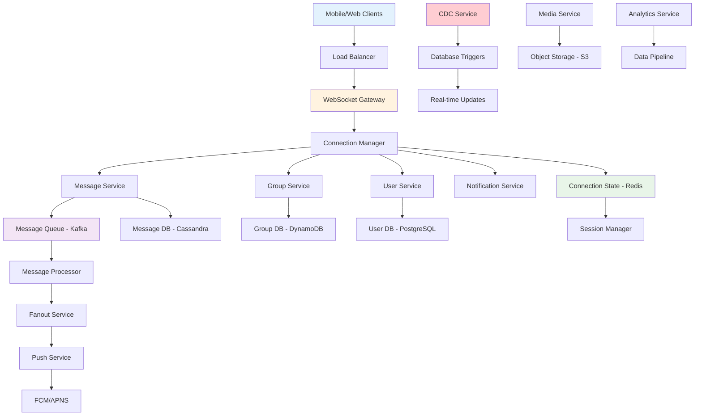
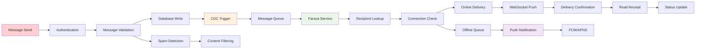
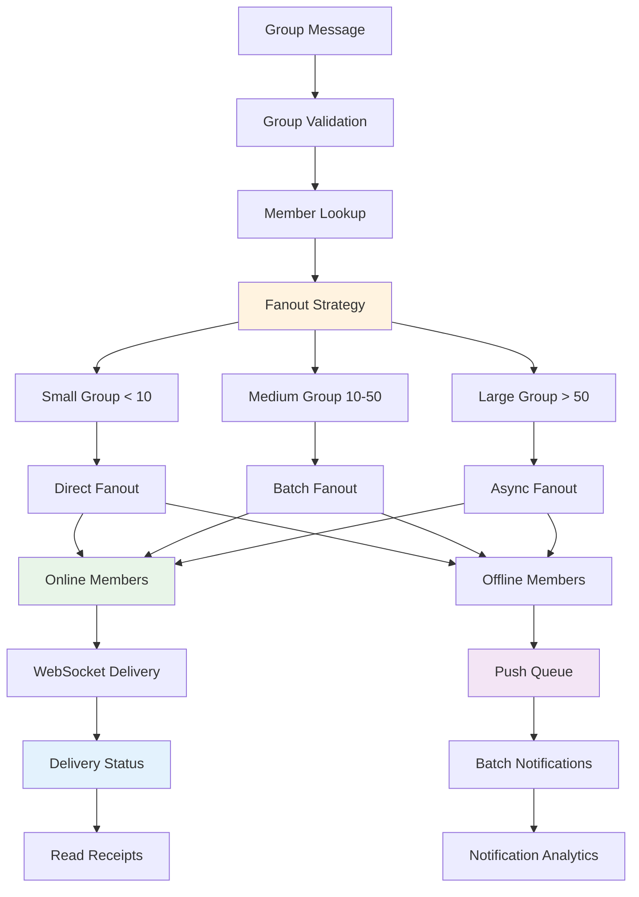

# Facebook Messenger Backend

## 📋 Table of Contents

- [Facebook Messenger Backend](#facebook-messenger-backend)
  - [Requirements Gathering](#requirements-gathering)
    - [Functional Requirements](#functional-requirements)
    - [Non-Functional Requirements](#non-functional-requirements)
  - [Traffic Estimation & Capacity Planning](#traffic-estimation--capacity-planning)
    - [Messaging Volume Analysis](#messaging-volume-analysis)
    - [User Connection Calculations](#user-connection-calculations)
    - [Group Chat Load Estimation](#group-chat-load-estimation)
  - [Database Schema Design](#database-schema-design)
    - [Message Storage Schema](#message-storage-schema)
    - [User and Group Management Schema](#user-and-group-management-schema)
    - [Connection State Schema](#connection-state-schema)
  - [System API Design](#system-api-design)
    - [Real-time Messaging APIs](#real-time-messaging-apis)
    - [Group Management APIs](#group-management-apis)
    - [Connection Management APIs](#connection-management-apis)
  - [High-Level Design (HLD)](#high-level-design-hld)
    - [Distributed Messaging Architecture](#distributed-messaging-architecture)
    - [WebSocket Communication Flow](#websocket-communication-flow)
    - [Group Chat Fanout System](#group-chat-fanout-system)
  - [Low-Level Design (LLD)](#low-level-design-lld)
    - [WebSocket Connection Manager](#websocket-connection-manager)
    - [Message Delivery Engine](#message-delivery-engine)
    - [Group Fanout Service](#group-fanout-service)
  - [Core Algorithms](#core-algorithms)
    - [1. Real-time Message Delivery Algorithm](#1-real-time-message-delivery-algorithm)
    - [2. Group Message Fanout Algorithm](#2-group-message-fanout-algorithm)
    - [3. Connection Load Balancing Algorithm](#3-connection-load-balancing-algorithm)
    - [4. Message Ordering Algorithm](#4-message-ordering-algorithm)
    - [5. Offline Message Sync Algorithm](#5-offline-message-sync-algorithm)
  - [Performance Optimizations](#performance-optimizations)
    - [WebSocket Optimization](#websocket-optimization)
    - [Database Query Optimization](#database-query-optimization)
    - [Message Delivery Optimization](#message-delivery-optimization)
  - [Security Considerations](#security-considerations)
    - [Message Encryption](#message-encryption)
    - [Connection Security](#connection-security)
  - [Testing Strategy](#testing-strategy)
    - [Real-time Messaging Testing](#real-time-messaging-testing)
    - [Load and Scalability Testing](#load-and-scalability-testing)
  - [Trade-offs and Considerations](#trade-offs-and-considerations)
    - [Protocol Selection Trade-offs](#protocol-selection-trade-offs)
    - [Consistency vs Latency](#consistency-vs-latency)
    - [Storage vs Memory Trade-offs](#storage-vs-memory-trade-offs)

[⬆️ Back to Top](#--table-of-contents)

---

## Requirements Gathering

### Functional Requirements

**Core Messaging Features:**
- Send and receive real-time text messages between users
- Support rich media messaging including images, videos, audio, and documents
- Group chat functionality with multiple participants and admin controls
- Message status indicators: sent, delivered, read receipts
- Message history and conversation persistence across devices

**Real-time Communication:**
- Instant message delivery with sub-second latency
- Online/offline status indicators for users
- Typing indicators to show when users are composing messages
- WebSocket-based persistent connections for real-time updates
- Push notifications for offline users and background app states

**Group Management:**
- Create and manage group conversations with custom names and images
- Add and remove participants with appropriate permissions
- Group admin functionality for moderation and settings
- Support for large groups (up to 250+ members)
- Group information and participant list management

**Multi-Device Support:**
- Synchronize conversations across multiple devices
- Cross-platform messaging (mobile, web, desktop)
- Message history sync when new devices are added
- Device-specific notification preferences
- Seamless handoff between devices

**Advanced Features:**
- Message reactions and emoji responses
- Message forwarding and reply functionality
- Voice and video calling integration
- File sharing with size limits and format validation
- Message search across conversation history

[⬆️ Back to Top](#--table-of-contents)

### Non-Functional Requirements

**Performance Requirements:**
- Support 1.3 billion monthly active users (Facebook Messenger scale)
- Handle 100 billion messages per day with real-time delivery
- Message delivery latency under 100ms for 95% of messages
- Support 500 million concurrent WebSocket connections
- 99.99% uptime with graceful degradation during failures

**Scalability Requirements:**
- Horizontal scaling across multiple data centers globally
- Auto-scaling based on connection count and message volume
- Support for viral group growth and sudden traffic spikes
- Linear performance scaling with infrastructure investment
- Regional data centers for latency optimization

**Consistency Requirements:**
- Strong consistency for message ordering within conversations
- Eventual consistency acceptable for read receipts and status updates
- Causal consistency for group membership changes
- Session consistency for user connection state
- At-least-once delivery guarantee for all messages

**Reliability Requirements:**
- Zero message loss with durable storage and replication
- Automatic failover for WebSocket connections
- Message retry and recovery mechanisms
- Cross-region disaster recovery capabilities
- Comprehensive monitoring and alerting systems

**Security Requirements:**
- End-to-end encryption for message content
- Secure WebSocket connections with TLS encryption
- User authentication and authorization for all operations
- Protection against spam and abuse
- Compliance with data privacy regulations (GDPR, CCPA)

[⬆️ Back to Top](#--table-of-contents)

---

## Traffic Estimation & Capacity Planning

### Messaging Volume Analysis

**Global Scale Metrics:**
- 1.3 billion monthly active users
- 100 billion messages per day (1.16 million messages per second)
- Peak traffic: 3x average during major events (3.5 million messages/second)
- Average message size: 100 bytes (text) + 50KB (media when included)
- Media messages: 30% of total volume

**Message Distribution:**
- One-on-one conversations: 70% of messages
- Group conversations: 30% of messages
- Average group size: 8 participants
- Large groups (50+ members): 5% of groups, 20% of group messages
- Voice messages: 10% of total messages
- File sharing: 5% of total messages

**User Engagement Patterns:**
- Average user sends 40 messages per day
- Peak usage hours: 7-9 PM local time
- Geographic distribution: Global with regional peaks
- Session duration: 15 minutes average
- Daily active users: 900 million (70% of MAU)

[⬆️ Back to Top](#--table-of-contents)

### User Connection Calculations

**WebSocket Connection Load:**
- Concurrent online users: 300 million during peak hours
- WebSocket connections: 500 million (multiple devices per user)
- Connection duration: 2 hours average
- Connection churn: 10% per hour (reconnections)
- Regional distribution: 25% US/Canada, 25% Europe, 35% Asia, 15% others

**Connection State Management:**
- Active connections requiring real-time updates
- Idle connections with periodic heartbeat
- Background connections for push notifications
- Connection mapping across multiple server instances
- Load balancing for even connection distribution

**Infrastructure Requirements:**
- WebSocket servers: 5,000 instances globally
- Connection capacity: 100,000 connections per server
- Memory per connection: 1KB (connection state)
- Total memory for connections: 500GB globally
- Network bandwidth: 50Gbps sustained for message traffic

[⬆️ Back to Top](#--table-of-contents)

### Group Chat Load Estimation

**Group Message Fanout:**
- Group messages: 30 billion per day
- Average fanout: 8 recipients per group message
- Total fanout operations: 240 billion per day (2.78 million/second)
- Large group fanout: 50-250 recipients for viral content
- Push notification fanout: 60% of messages (offline recipients)

**Group Management Operations:**
- Group creation: 1 million per day
- Member additions/removals: 10 million operations per day
- Group settings changes: 5 million per day
- Group information updates: 2 million per day
- Large group moderation events: 100,000 per day

**Storage and Processing:**
- Group membership data: 500TB (growing at 50TB/month)
- Message storage: 10PB annually for all conversations
- Index storage for search: 2PB for message indexing
- Backup and replication: 3x storage overhead
- Archive storage: 5-year retention for legal compliance

[⬆️ Back to Top](#--table-of-contents)

---

## Database Schema Design

### Message Storage Schema

**Messages Table:**
- Message ID (Primary Key): UUID with timestamp encoding
- Conversation ID (Partition Key): Efficient sharding key
- Sender ID (Foreign Key): Message author reference
- Content: Encrypted message content
- Message Type: Text, image, video, audio, file, system
- Timestamp: Precise message ordering timestamp
- Reply To ID: Reference for threaded conversations
- Status: Sent, delivered, read, failed
- Media URLs: References to uploaded media files
- Metadata: JSON for message-specific data

**Conversations Table:**
- Conversation ID (Primary Key): Unique conversation identifier
- Type: One-on-one, group, broadcast
- Participants: List of user IDs in conversation
- Created At: Conversation creation timestamp
- Updated At: Last activity timestamp
- Settings: JSON for conversation preferences
- Group Info: Name, description, admin list (for groups)
- Message Count: Cached count for pagination
- Last Message: Cached last message for preview

**Message Delivery Table:**
- Delivery ID (Primary Key): Unique delivery record
- Message ID (Foreign Key): Associated message
- Recipient ID (Partition Key): Target user for sharding
- Status: Pending, delivered, read, failed
- Timestamp: When status was recorded
- Device ID: Specific device for multi-device users
- Retry Count: Number of delivery attempts
- Error Info: Failure details for debugging

[⬆️ Back to Top](#--table-of-contents)

### User and Group Management Schema

**Users Table:**
- User ID (Primary Key): Unique user identifier
- Username: Display name for messaging
- Phone Number: Primary authentication method
- Email: Secondary contact and recovery
- Profile Picture: Avatar image URL
- Status: Online, away, busy, offline
- Last Active: Timestamp of last activity
- Preferences: JSON for notification and privacy settings
- Devices: List of registered devices for push notifications
- Blocked Users: List of blocked user IDs

**Groups Table:**
- Group ID (Primary Key): Unique group identifier
- Name: Group display name
- Description: Group purpose and information
- Creator ID: User who created the group
- Created At: Group creation timestamp
- Member Count: Current number of participants
- Max Members: Maximum allowed group size
- Group Type: Private, public, broadcast
- Settings: JSON for group configuration
- Group Picture: Group avatar image URL
- Invite Link: Shareable group invitation link

**Group Memberships Table:**
- Membership ID (Primary Key): Unique membership record
- Group ID (Partition Key): Target group for efficient queries
- User ID (Foreign Key): Group member reference
- Role: Member, admin, owner
- Joined At: When user joined the group
- Added By: User who added this member
- Status: Active, left, removed, banned
- Notifications: User's notification preferences for group
- Last Read: Timestamp of last message read in group

[⬆️ Back to Top](#--table-of-contents)

### Connection State Schema

**Active Connections:**
- Connection ID (Primary Key): Unique connection identifier
- User ID (Partition Key): Connection owner for sharding
- Device ID: Specific device identifier
- Server Node: WebSocket server handling connection
- Status: Connected, idle, disconnected
- Connected At: Connection establishment time
- Last Heartbeat: Last activity timestamp
- IP Address: Client IP for security and analytics
- User Agent: Client application information

**User Sessions:**
- Session ID (Primary Key): Unique session identifier
- User ID (Foreign Key): Session owner reference
- Device Type: Mobile, web, desktop
- App Version: Client application version
- Started At: Session beginning timestamp
- Last Activity: Most recent activity timestamp
- Location: Geographic location (if permitted)
- Status: Active, background, terminated
- Push Token: Device push notification token

**Message Queue:**
- Queue ID (Primary Key): Unique queue entry
- Recipient ID (Partition Key): Target user for sharding
- Message ID (Foreign Key): Queued message reference
- Priority: High, normal, low delivery priority
- Retry Count: Number of delivery attempts
- Scheduled At: When to attempt delivery
- Status: Pending, processing, delivered, failed
- Error Details: Failure information for debugging

[⬆️ Back to Top](#--table-of-contents)

---

## System API Design

### Real-time Messaging APIs

**Message Operations:**
- Send message with real-time delivery and status tracking
- Receive messages via WebSocket with immediate push
- Mark messages as read with timestamp recording
- Edit or delete sent messages with version control
- Forward messages to other conversations with attribution

**Connection Management:**
- Establish WebSocket connection with authentication
- Handle connection heartbeat and keepalive
- Manage connection recovery and reconnection
- Handle graceful connection termination
- Switch between multiple device connections

**Status and Presence:**
- Update user online/offline status with last seen
- Send and receive typing indicators
- Handle user presence updates across devices
- Manage away and busy status with custom messages
- Broadcast status changes to relevant contacts

[⬆️ Back to Top](#--table-of-contents)

### Group Management APIs

**Group Lifecycle:**
- Create new group with initial members and settings
- Update group information including name and description
- Add members with invitation and approval workflow
- Remove members with appropriate permission checks
- Delete group with data cleanup and member notification

**Group Administration:**
- Promote or demote group administrators
- Configure group settings and permissions
- Manage group invitation links and privacy
- Handle group join requests and approvals
- Moderate group content and member behavior

**Group Messaging:**
- Send messages to group with fanout delivery
- Handle group message reactions and responses
- Manage group message notifications
- Archive or mute group conversations
- Search group message history

[⬆️ Back to Top](#--table-of-contents)

### Connection Management APIs

**Device Management:**
- Register new devices for push notifications
- Sync conversation history to new devices
- Manage device-specific settings and preferences
- Handle device logout and cleanup
- Update device push notification tokens

**Notification Services:**
- Send push notifications for offline users
- Configure notification preferences per conversation
- Handle notification delivery confirmations
- Manage notification batching and rate limiting
- Provide notification history and status

**Authentication and Security:**
- User authentication with phone number verification
- Session management across multiple devices
- Token refresh and session validation
- Handle account security events
- Manage blocked users and privacy settings

[⬆️ Back to Top](#--table-of-contents)

---

## High-Level Design (HLD)

### Distributed Messaging Architecture

**Scalable Real-time Messaging Platform:**

**Core Service Components:**
- **WebSocket Gateway**: Manages persistent connections and real-time communication
- **Message Service**: Handles message creation, storage, and delivery
- **Group Service**: Manages group conversations and member operations
- **Fanout Service**: Distributes messages to multiple recipients efficiently
- **Notification Service**: Handles push notifications for offline users
- **CDC Service**: Change Data Capture for real-time database updates

[⬆️ Back to Top](#--table-of-contents)

### WebSocket Communication Flow

**Real-time Message Delivery Pipeline:**

**Communication Protocol Benefits:**
- **Persistent Connections**: WebSocket maintains stateful connection for instant delivery
- **Bidirectional**: Full-duplex communication for real-time interaction
- **Low Latency**: Sub-100ms message delivery for optimal user experience
- **Efficient**: Reduced overhead compared to HTTP polling approaches

[⬆️ Back to Top](#--table-of-contents)

### Group Chat Fanout System

**Efficient Group Message Distribution:**

**Fanout Optimization Features:**
- **Adaptive Strategy**: Different approaches based on group size
- **Batch Processing**: Efficient handling of large group distributions
- **Priority Delivery**: Online users get immediate delivery
- **Smart Notifications**: Batched push notifications for offline users

[⬆️ Back to Top](#--table-of-contents)

---

## Low-Level Design (LLD)

### WebSocket Connection Manager

**High-Performance Connection Handling:**
- **Connection Pool Management**: Efficient allocation and cleanup of WebSocket connections
- **Load Balancing**: Distribute connections evenly across server instances
- **Session Affinity**: Maintain user-to-server mapping for connection consistency
- **Health Monitoring**: Regular connection health checks and automatic recovery

**Connection State Management:**
- **User-to-Connection Mapping**: Track which servers handle specific user connections
- **Multi-Device Support**: Handle multiple connections per user across devices
- **Connection Metadata**: Store connection information for routing and analytics
- **Graceful Shutdown**: Handle server maintenance without dropping connections

**Scalability Features:**
- **Horizontal Scaling**: Add more WebSocket servers based on connection load
- **Auto-Scaling**: Dynamic scaling based on real-time connection metrics
- **Regional Distribution**: Deploy WebSocket servers globally for latency optimization
- **Circuit Breakers**: Prevent cascade failures during high load

[⬆️ Back to Top](#--table-of-contents)

### Message Delivery Engine

**Reliable Message Processing:**
- **Message Queue Integration**: Kafka-based queue for reliable message processing
- **Delivery Guarantees**: At-least-once delivery with deduplication
- **Retry Logic**: Exponential backoff for failed delivery attempts
- **Dead Letter Queue**: Handle messages that fail repeated delivery attempts

**Delivery Optimization:**
- **Batch Processing**: Group messages for efficient database operations
- **Priority Handling**: High-priority messages get faster processing
- **Compression**: Compress message payloads for network efficiency
- **Caching**: Cache frequently accessed message data

**Monitoring and Analytics:**
- **Delivery Metrics**: Track message delivery times and success rates
- **Error Analysis**: Detailed logging and analysis of delivery failures
- **Performance Monitoring**: Real-time monitoring of message processing pipeline
- **Alerting**: Automated alerts for delivery issues and system anomalies

[⬆️ Back to Top](#--table-of-contents)

### Group Fanout Service

**Efficient Group Message Distribution:**
- **Member Resolution**: Fast lookup of group members and their connection status
- **Fanout Strategy**: Adaptive fanout based on group size and member activity
- **Parallel Processing**: Concurrent delivery to multiple group members
- **Rate Limiting**: Prevent overwhelming individual users with group messages

**Group Management:**
- **Dynamic Groups**: Handle real-time group membership changes
- **Permission Checks**: Validate sender permissions for group messages
- **Message Ordering**: Ensure consistent message ordering across all recipients
- **Delivery Tracking**: Track delivery status for each group member

**Performance Optimization:**
- **Connection Caching**: Cache active group member connections
- **Batch Operations**: Efficient database operations for large groups
- **Async Processing**: Non-blocking fanout for large group distributions
- **Load Distribution**: Distribute fanout load across multiple service instances

[⬆️ Back to Top](#--table-of-contents)

---

## Core Algorithms

### 1. Real-time Message Delivery Algorithm

**Instant Message Routing and Delivery:**
- Authenticate sender and validate message content and permissions
- Write message to persistent storage with atomic transaction
- Trigger Change Data Capture event for real-time processing
- Look up recipient connection status and preferred delivery method
- Route message through appropriate delivery channel (WebSocket or push)
- Confirm delivery and update message status with timestamp

**Delivery Channel Selection:**
- **Active Connection**: Direct WebSocket delivery for immediate receipt
- **Idle Connection**: Push through connection with wake-up signal
- **Offline User**: Queue for push notification and next session sync
- **Multiple Devices**: Deliver to all active connections with deduplication

**Reliability Mechanisms:**
- **Acknowledgment Protocol**: Require delivery confirmation from recipients
- **Retry Strategy**: Exponential backoff for failed delivery attempts
- **Fallback Options**: Alternative delivery methods when primary fails
- **Duplicate Detection**: Prevent message duplication across delivery attempts

[⬆️ Back to Top](#--table-of-contents)

### 2. Group Message Fanout Algorithm

**Scalable Group Message Distribution:**
- Validate sender permissions and group membership status
- Retrieve current group member list with connection state information
- Determine optimal fanout strategy based on group size and member activity
- Create fanout tasks for parallel processing across multiple workers
- Execute delivery to online members via WebSocket connections
- Queue offline member notifications for batch push processing

**Fanout Strategy Selection:**
- **Small Groups (< 10 members)**: Synchronous direct fanout for immediate delivery
- **Medium Groups (10-50 members)**: Asynchronous batch fanout with parallelization
- **Large Groups (> 50 members)**: Staged fanout with rate limiting and monitoring
- **Viral Groups (> 1000 members)**: Distributed fanout across multiple data centers

**Optimization Techniques:**
- **Connection Locality**: Prioritize delivery to users on same server instance
- **Batch Processing**: Group database operations for efficiency
- **Smart Queuing**: Use priority queues for important group messages
- **Load Balancing**: Distribute fanout work across available processors

[⬆️ Back to Top](#--table-of-contents)

### 3. Connection Load Balancing Algorithm

**Optimal WebSocket Connection Distribution:**
- Monitor real-time connection count and resource usage per server
- Calculate optimal connection distribution based on server capacity
- Route new connections to least loaded servers with geographic preference
- Handle connection migration during server maintenance or failures
- Implement sticky sessions for user consistency while balancing load
- Provide circuit breaker functionality to prevent server overload

**Load Balancing Strategies:**
- **Round Robin**: Simple distribution for even server utilization
- **Least Connections**: Route to server with fewest active connections
- **Weighted Distribution**: Consider server capacity differences
- **Geographic Routing**: Prefer servers closer to user location
- **Health-Based Routing**: Avoid servers with performance issues

**Connection Migration:**
- **Graceful Migration**: Move connections during planned maintenance
- **Automatic Failover**: Instant migration during server failures
- **Load Rebalancing**: Redistribute connections for optimal performance
- **Session Preservation**: Maintain user state during connection moves

[⬆️ Back to Top](#--table-of-contents)

### 4. Message Ordering Algorithm

**Consistent Message Sequence Across Devices:**
- Assign globally unique timestamps to messages using logical clocks
- Implement vector clocks for handling concurrent messages in groups
- Use causal ordering to maintain logical message dependencies
- Provide conflict resolution for messages sent simultaneously
- Ensure consistent ordering across all recipient devices and platforms
- Handle clock skew and network delays in distributed environments

**Ordering Mechanisms:**
- **Lamport Timestamps**: Logical time for single conversation ordering
- **Vector Clocks**: Causal ordering for complex group interactions
- **Hybrid Clocks**: Combine logical and physical time for accuracy
- **Sequence Numbers**: Server-assigned numbers for deterministic ordering

**Conflict Resolution:**
- **Timestamp Priority**: Use timestamp as primary ordering criterion
- **Sender Priority**: Break ties using sender ID for consistency
- **Content Hash**: Use message content hash for final tie-breaking
- **Manual Resolution**: Allow users to reorder messages when needed

[⬆️ Back to Top](#--table-of-contents)

### 5. Offline Message Sync Algorithm

**Comprehensive Message Synchronization:**
- Detect user reconnection and identify last synchronized message
- Calculate message delta since last synchronization timestamp
- Retrieve missed messages in chronological order with batch optimization
- Validate message integrity and handle any corruption or gaps
- Apply incremental updates to local message store
- Confirm successful synchronization and update sync markers

**Sync Optimization:**
- **Delta Sync**: Only transfer new messages since last sync
- **Batch Transfer**: Group messages for efficient network usage
- **Compression**: Compress message batches for bandwidth optimization
- **Priority Sync**: Sync important conversations first

**Conflict Handling:**
- **Local Changes**: Handle messages sent while offline
- **Merge Strategy**: Combine local and server message histories
- **Duplicate Detection**: Prevent duplicate messages during sync
- **Rollback Support**: Handle sync failures with rollback capability

[⬆️ Back to Top](#--table-of-contents)

---

## Performance Optimizations

### WebSocket Optimization

**High-Performance Connection Management:**
- **Connection Pooling**: Reuse WebSocket connections efficiently
- **Message Compression**: Use WebSocket compression extensions
- **Binary Protocols**: Protocol buffers for reduced message size
- **Connection Multiplexing**: Handle multiple conversations per connection

**Scalability Enhancements:**
- **Server Clustering**: Distribute connections across multiple servers
- **Load Balancing**: Intelligent routing of new connections
- **Auto-Scaling**: Dynamic scaling based on connection metrics
- **Resource Monitoring**: Track memory and CPU usage per connection

**Latency Reduction:**
- **Geographic Distribution**: Edge servers closer to users
- **CDN Integration**: Static content delivery optimization
- **TCP Optimization**: Tune TCP settings for WebSocket performance
- **Keep-Alive Tuning**: Optimize heartbeat frequency

[⬆️ Back to Top](#--table-of-contents)

### Database Query Optimization

**Message Storage Efficiency:**
- **Partitioning Strategy**: Partition by conversation ID for locality
- **Index Optimization**: Indexes on timestamp and user ID for fast queries
- **Read Replicas**: Dedicated replicas for message history queries
- **Query Caching**: Cache frequent message lookup queries

**Group Data Optimization:**
- **Denormalization**: Store group member lists for faster fanout
- **Materialized Views**: Pre-computed group statistics and metadata
- **Sharding**: Distribute group data across multiple database shards
- **Connection Pooling**: Efficient database connection management

**Performance Monitoring:**
- **Slow Query Analysis**: Identify and optimize expensive queries
- **Index Usage**: Monitor index effectiveness and coverage
- **Cache Hit Rates**: Optimize caching strategies for better performance
- **Resource Utilization**: Track database CPU and memory usage

[⬆️ Back to Top](#--table-of-contents)

### Message Delivery Optimization

**Fanout Performance:**
- **Parallel Processing**: Concurrent delivery to multiple recipients
- **Batch Operations**: Group database writes for efficiency
- **Smart Routing**: Optimize delivery paths based on network topology
- **Priority Queues**: High-priority messages get faster processing

**Network Optimization:**
- **Message Batching**: Combine multiple messages for network efficiency
- **Compression**: Compress message payloads for bandwidth savings
- **Protocol Optimization**: Use efficient serialization formats
- **Connection Reuse**: Minimize connection establishment overhead

**Caching Strategy:**
- **Message Caching**: Cache recent messages for fast retrieval
- **User State Caching**: Cache online status and connection information
- **Group Data Caching**: Cache group membership for fast fanout
- **CDN Caching**: Cache media content globally

[⬆️ Back to Top](#--table-of-contents)

---

## Security Considerations

### Message Encryption

**End-to-End Encryption:**
- **Signal Protocol**: Industry-standard encryption for message content
- **Key Management**: Secure key generation, exchange, and rotation
- **Forward Secrecy**: Protect past communications if keys are compromised
- **Message Authentication**: Verify message integrity and sender authenticity

**Encryption Implementation:**
- **Device-Level Keys**: Each device has unique encryption keys
- **Group Encryption**: Shared group keys for group conversations
- **Media Encryption**: Encrypt images, videos, and files
- **Metadata Protection**: Minimize exposure of communication metadata

**Key Security:**
- **Key Storage**: Secure key storage on devices and servers
- **Key Recovery**: Balance between security and user convenience
- **Key Rotation**: Regular rotation of encryption keys
- **Breach Response**: Protocol for handling key compromise

[⬆️ Back to Top](#--table-of-contents)

### Connection Security

**WebSocket Security:**
- **TLS Encryption**: All WebSocket connections use TLS 1.3
- **Certificate Pinning**: Prevent man-in-the-middle attacks
- **Authentication**: Strong authentication before connection establishment
- **Session Management**: Secure session tokens with expiration

**Access Control:**
- **User Authentication**: Multi-factor authentication support
- **Device Authorization**: Register and validate user devices
- **Permission System**: Role-based access for group operations
- **Rate Limiting**: Prevent abuse and spam attacks

**Threat Protection:**
- **DDoS Protection**: Distributed denial of service attack mitigation
- **Spam Detection**: Automated detection and prevention of spam messages
- **Abuse Reporting**: User reporting system for inappropriate content
- **Account Security**: Monitor for suspicious account activity

[⬆️ Back to Top](#--table-of-contents)

---

## Testing Strategy

### Real-time Messaging Testing

**Functional Testing:**
- **Message Delivery**: Test message delivery across all communication paths
- **Group Functionality**: Validate group creation, management, and messaging
- **Multi-Device Sync**: Test synchronization across multiple devices
- **Offline Behavior**: Test message queuing and sync when users go offline
- **Error Handling**: Test graceful handling of network and server errors

**Protocol Testing:**
- **WebSocket Functionality**: Test connection establishment, maintenance, and termination
- **Message Ordering**: Validate consistent message ordering across devices
- **Connection Recovery**: Test automatic reconnection and state recovery
- **Heartbeat Mechanism**: Test connection keepalive and timeout handling

**Security Testing:**
- **Encryption Testing**: Validate end-to-end encryption implementation
- **Authentication Testing**: Test user authentication and session management
- **Authorization Testing**: Test access controls for groups and messages
- **Penetration Testing**: Test system resilience against security attacks

[⬆️ Back to Top](#--table-of-contents)

### Load and Scalability Testing

**Connection Load Testing:**
- **Concurrent Connections**: Test with millions of simultaneous WebSocket connections
- **Connection Churn**: Test rapid connection and disconnection patterns
- **Geographic Distribution**: Test load across multiple data centers
- **Failover Testing**: Test connection migration during server failures

**Message Volume Testing:**
- **High Throughput**: Test with billions of messages per day
- **Burst Traffic**: Test sudden spikes in message volume
- **Large Groups**: Test fanout performance with very large groups
- **Media Messages**: Test performance with high-volume media sharing

**Performance Benchmarking:**
- **Latency Measurement**: Measure end-to-end message delivery times
- **Throughput Analysis**: Measure maximum sustainable message rates
- **Resource Utilization**: Monitor CPU, memory, and network usage
- **Scalability Limits**: Identify system bottlenecks and scaling limits

[⬆️ Back to Top](#--table-of-contents)

---

## Trade-offs and Considerations

### Protocol Selection Trade-offs

**WebSocket vs Short Polling:**
- **WebSocket Advantages**: Real-time delivery, lower latency, reduced server load
- **Short Polling Advantages**: Simpler implementation, stateless, easier debugging
- **WebSocket Challenges**: Connection management, server resources, complexity
- **Short Polling Challenges**: Higher latency, unnecessary requests, battery drain

**WebSocket vs Long Polling:**
- **WebSocket Benefits**: True bidirectional communication, lower overhead
- **Long Polling Benefits**: Simpler than WebSocket, better than short polling
- **Implementation Complexity**: WebSocket requires more sophisticated infrastructure
- **Resource Usage**: WebSocket uses persistent connections, long polling uses held requests

**Hybrid Approach:**
- Use WebSocket for active users requiring real-time communication
- Fall back to push notifications for offline or background users
- Implement graceful degradation from WebSocket to polling when needed
- Optimize each protocol for its specific use case

[⬆️ Back to Top](#--table-of-contents)

### Consistency vs Latency

**Message Ordering Trade-offs:**
- **Strong Consistency**: Guarantees correct ordering but increases latency
- **Eventual Consistency**: Lower latency but possible temporary inconsistencies
- **Causal Consistency**: Balance between ordering guarantees and performance
- **Session Consistency**: Consistency within user sessions with global eventual consistency

**Delivery Guarantees:**
- **At-Most-Once**: Fast delivery but possible message loss
- **At-Least-Once**: Guaranteed delivery but possible duplicates
- **Exactly-Once**: Perfect delivery but complex implementation and higher latency
- **Best Effort**: Optimized for performance with acceptable reliability

**Practical Implementation:**
- Use strong consistency for critical operations (authentication, payments)
- Accept eventual consistency for non-critical features (read receipts, online status)
- Implement conflict resolution for concurrent operations
- Provide user feedback about system state and potential delays

[⬆️ Back to Top](#--table-of-contents)

### Storage vs Memory Trade-offs

**Message Storage Strategy:**
- **Hot Data**: Recent messages in fast storage (SSD, memory)
- **Warm Data**: Older messages in standard storage
- **Cold Data**: Archive old messages in cheap storage
- **Caching**: Balance memory usage with query performance

**Connection State Management:**
- **In-Memory State**: Fast access but limited by server memory
- **Persistent State**: Survives server restarts but slower access
- **Hybrid Approach**: Critical state in memory with persistent backup
- **Distributed State**: Share state across multiple servers

**Technology Selection:**
- **Database Choice**: Cassandra for messages, Redis for real-time state
- **Caching Strategy**: Multi-level caching for optimal performance
- **Storage Tiers**: Automatic migration based on data age and access patterns
- **Compression**: Balance storage savings with processing overhead

[⬆️ Back to Top](#--table-of-contents) 