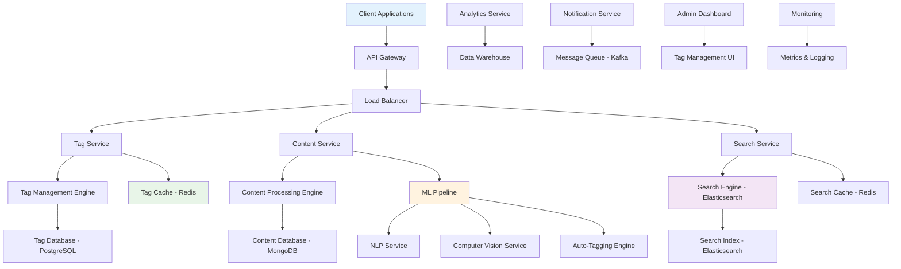
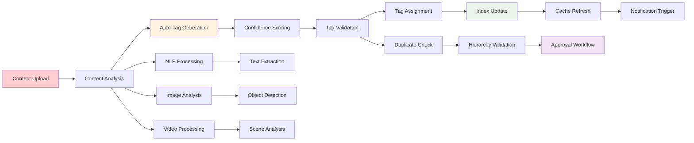
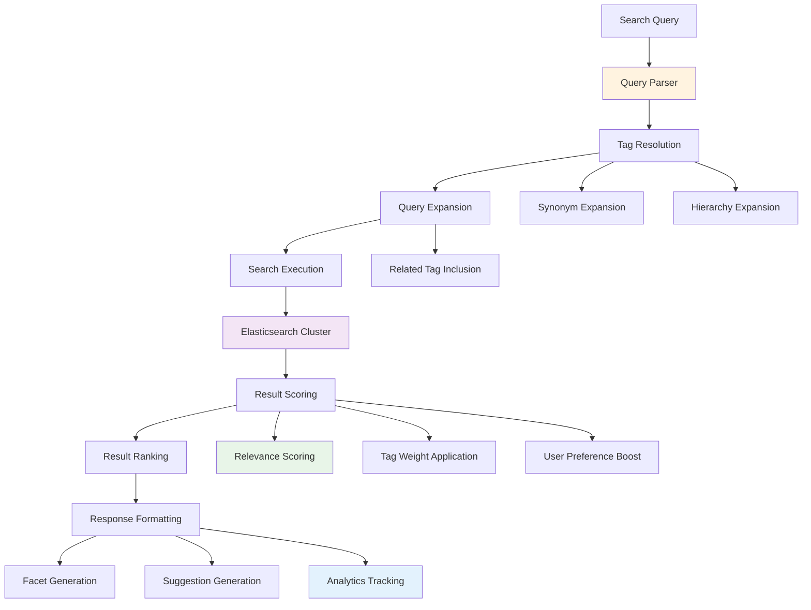

# Tagging Service Backend

## 📋 Table of Contents

- [Tagging Service Backend](#tagging-service-backend)
  - [Requirements Gathering](#requirements-gathering)
    - [Functional Requirements](#functional-requirements)
    - [Non-Functional Requirements](#non-functional-requirements)
  - [Traffic Estimation & Capacity Planning](#traffic-estimation--capacity-planning)
    - [Tagging Volume Analysis](#tagging-volume-analysis)
    - [Search and Query Load](#search-and-query-load)
    - [Content Processing Load](#content-processing-load)
  - [Database Schema Design](#database-schema-design)
    - [Tag Management Schema](#tag-management-schema)
    - [Content Tagging Schema](#content-tagging-schema)
    - [Search and Index Schema](#search-and-index-schema)
  - [System API Design](#system-api-design)
    - [Tag Management APIs](#tag-management-apis)
    - [Content Tagging APIs](#content-tagging-apis)
    - [Search and Discovery APIs](#search-and-discovery-apis)
  - [High-Level Design (HLD)](#high-level-design-hld)
    - [Distributed Tagging Architecture](#distributed-tagging-architecture)
    - [Tag Assignment and Processing Flow](#tag-assignment-and-processing-flow)
    - [Search and Discovery System](#search-and-discovery-system)
  - [Low-Level Design (LLD)](#low-level-design-lld)
    - [Tag Management Engine](#tag-management-engine)
    - [Content Processing Pipeline](#content-processing-pipeline)
    - [Search Index Manager](#search-index-manager)
  - [Core Algorithms](#core-algorithms)
    - [1. Automatic Tag Suggestion Algorithm](#1-automatic-tag-suggestion-algorithm)
    - [2. Tag Similarity and Clustering Algorithm](#2-tag-similarity-and-clustering-algorithm)
    - [3. Content-Tag Matching Algorithm](#3-content-tag-matching-algorithm)
    - [4. Tag Popularity and Trending Algorithm](#4-tag-popularity-and-trending-algorithm)
    - [5. Duplicate Tag Detection Algorithm](#5-duplicate-tag-detection-algorithm)
  - [Performance Optimizations](#performance-optimizations)
    - [Tagging Performance Optimization](#tagging-performance-optimization)
    - [Search Query Optimization](#search-query-optimization)
    - [Cache Strategy Optimization](#cache-strategy-optimization)
  - [Security Considerations](#security-considerations)
    - [Tag Content Security](#tag-content-security)
    - [Access Control and Permissions](#access-control-and-permissions)
  - [Testing Strategy](#testing-strategy)
    - [Tagging System Testing](#tagging-system-testing)
    - [Performance and Scale Testing](#performance-and-scale-testing)
  - [Trade-offs and Considerations](#trade-offs-and-considerations)
    - [Consistency vs Performance](#consistency-vs-performance)
    - [Automation vs Manual Tagging](#automation-vs-manual-tagging)
    - [Precision vs Recall Trade-offs](#precision-vs-recall-trade-offs)

[⬆️ Back to Top](#--table-of-contents)

---

## Requirements Gathering

### Functional Requirements

**Core Tagging Features:**
- Create, update, and delete tags with hierarchical organization
- Assign multiple tags to various content types (documents, images, videos, articles)
- Support tag categories and namespaces for organization
- Auto-suggest tags based on content analysis and user behavior
- Batch tagging operations for multiple content items

**Tag Management:**
- Tag hierarchies and parent-child relationships
- Tag aliases and synonyms for improved discoverability
- Tag merging and splitting operations for maintenance
- Tag deprecation and archival with migration paths
- Tag usage statistics and analytics

**Search and Discovery:**
- Search content by single or multiple tags with boolean operations
- Tag-based content filtering and recommendation
- Popular and trending tags discovery
- Tag autocomplete and suggestion during search
- Advanced tag queries with AND, OR, NOT operations

**Content Analysis:**
- Automatic tag extraction from text content using NLP
- Image tagging using computer vision and ML models
- Video content analysis for automatic tag generation
- Document metadata extraction for contextual tagging
- User behavior analysis for personalized tag suggestions

**Integration Features:**
- RESTful APIs for third-party application integration
- Webhook notifications for tag changes and updates
- Bulk import/export functionality for tag data
- Integration with content management systems
- Support for multiple content repositories and sources

[⬆️ Back to Top](#--table-of-contents)

### Non-Functional Requirements

**Performance Requirements:**
- Support 1 billion tagged content items across all systems
- Handle 10 million tag operations per day (create, update, assign)
- Tag search queries with sub-200ms response time for 95% of requests
- Auto-tagging processing within 5 seconds for new content
- Support 1 million concurrent users during peak hours

**Scalability Requirements:**
- Horizontal scaling for tag processing and search operations
- Support 100 million unique tags across all namespaces
- Auto-scaling based on content volume and tagging activity
- Multi-tenant architecture supporting thousands of organizations
- Global deployment for international content and users

**Consistency Requirements:**
- Strong consistency for tag hierarchy and relationship changes
- Eventual consistency acceptable for tag usage statistics
- Consistent tag search results across all search interfaces
- ACID compliance for critical tag management operations
- Cross-system tag synchronization with conflict resolution

**Availability Requirements:**
- 99.9% uptime for tag search and retrieval operations
- 99.5% uptime for tag management and assignment operations
- Graceful degradation when auto-tagging services are unavailable
- Regional failover capabilities for disaster recovery
- Real-time backup and recovery for critical tag data

**Security Requirements:**
- Role-based access control for tag creation and management
- Content filtering to prevent inappropriate or malicious tags
- Audit logging for all tag management operations
- Data privacy compliance for user-generated tags
- API rate limiting and abuse prevention

[⬆️ Back to Top](#--table-of-contents)

---

## Traffic Estimation & Capacity Planning

### Tagging Volume Analysis

**Global Content and Tag Metrics:**
- 1 billion content items across all integrated systems
- 100 million unique tags across all categories and namespaces
- Average 5 tags per content item (5 billion tag assignments)
- 10 million new tag operations daily (create, update, assign)
- 50 million tag search queries per day

**Tag Creation Patterns:**
- Manual tag creation: 30% of new tags
- Auto-generated tags: 70% of new tags
- User-suggested tags: 40% requiring moderation
- System-generated tags: 60% from content analysis
- Peak tagging activity: 3x during content publishing hours

**Content Type Distribution:**
- Text documents: 40% of tagged content
- Images: 35% of tagged content
- Videos: 15% of tagged content
- Audio files: 5% of tagged content
- Other media types: 5% of tagged content

[⬆️ Back to Top](#--table-of-contents)

### Search and Query Load

**Search Traffic Patterns:**
- 50 million tag-based searches per day
- Average 3 tags per search query
- Complex boolean queries: 20% of total searches
- Autocomplete requests: 200 million per day
- Tag suggestion requests: 100 million per day

**User Behavior Analysis:**
- Search session duration: 15 minutes average
- Search result clicks: 60% click-through rate
- Tag refinement: 40% of users refine tags in search
- Popular tags: 80/20 rule (20% of tags used in 80% of searches)
- Trending tags: 1% of tags trend daily with 10x usage spike

**Geographic Distribution:**
- North America: 35% of search traffic
- Europe: 30% of search traffic
- Asia-Pacific: 25% of search traffic
- Other regions: 10% of search traffic
- Peak hours vary by region with 3-hour overlap

[⬆️ Back to Top](#--table-of-contents)

### Content Processing Load

**Auto-Tagging Processing:**
- 1 million new content items daily requiring auto-tagging
- Text analysis: 2 seconds average processing time
- Image analysis: 5 seconds average processing time
- Video analysis: 30 seconds average processing time
- Batch processing: 100,000 items per hour during off-peak

**ML Model Processing:**
- NLP models for text: 500,000 processing requests per day
- Computer vision for images: 350,000 processing requests per day
- Video analysis models: 150,000 processing requests per day
- Model inference time: 100ms average per request
- Model training: Weekly retraining with new data

**Infrastructure Requirements:**
- Compute: 1,000 CPU cores for tag processing during peak
- Memory: 200 GB for in-memory tag caches and indexes
- Storage: 50 TB for tag data, relationships, and search indexes
- Network: 5 Gbps for content analysis and search traffic
- GPU: 100 GPU cores for ML model inference

[⬆️ Back to Top](#--table-of-contents)

---

## Database Schema Design

### Tag Management Schema

**Tags Table:**
- Tag ID (Primary Key): Unique tag identifier
- Tag Name: Human-readable tag name
- Tag Slug: URL-friendly tag identifier
- Description: Tag purpose and usage guidelines
- Category: Tag classification (topic, format, status, etc.)
- Namespace: Organizational or project-specific grouping
- Parent Tag ID: Hierarchical relationship reference
- Created By: User who created the tag
- Created At: Tag creation timestamp
- Status: Active, deprecated, archived, pending
- Usage Count: Cached count of tag assignments

**Tag Hierarchies:**
- Hierarchy ID (Primary Key): Unique hierarchy relationship
- Parent Tag ID (Foreign Key): Parent tag reference
- Child Tag ID (Foreign Key): Child tag reference
- Hierarchy Type: Strict, loose, related, synonym
- Depth Level: Level in hierarchy tree
- Path: Materialized path for efficient queries
- Weight: Relationship strength or priority
- Created At: Relationship establishment timestamp

**Tag Aliases:**
- Alias ID (Primary Key): Unique alias identifier
- Primary Tag ID (Foreign Key): Main tag reference
- Alias Name: Alternative name for the tag
- Alias Type: Synonym, abbreviation, translation
- Language: Language code for internationalization
- Confidence Score: Alias relevance confidence
- Created By: User who created the alias
- Approved By: User who approved the alias

[⬆️ Back to Top](#--table-of-contents)

### Content Tagging Schema

**Content Tags:**
- Assignment ID (Primary Key): Unique tag assignment
- Content ID (Partition Key): Tagged content identifier
- Tag ID (Foreign Key): Assigned tag reference
- Content Type: Document, image, video, audio
- Assignment Type: Manual, automatic, suggested
- Confidence Score: Assignment confidence (for auto-tags)
- Tagged By: User who assigned the tag
- Tagged At: Assignment timestamp
- Source: System or service that created assignment
- Status: Active, removed, pending_review

**Content Metadata:**
- Content ID (Primary Key): Unique content identifier
- Content Type: Type of content being tagged
- Title: Content title or name
- Description: Content description or summary
- URL: Content location or reference
- Size: Content size in bytes
- Duration: For audio/video content
- Language: Content language code
- Created At: Content creation timestamp
- Last Tagged: Most recent tagging activity
- Tag Count: Number of assigned tags

**Tagging Sessions:**
- Session ID (Primary Key): Unique tagging session
- User ID (Foreign Key): User performing tagging
- Content IDs: List of content items in session
- Session Type: Manual, bulk, automated
- Started At: Session beginning timestamp
- Completed At: Session completion timestamp
- Tags Added: Count of tags added in session
- Tags Removed: Count of tags removed in session
- Session Status: Active, completed, aborted

[⬆️ Back to Top](#--table-of-contents)

### Search and Index Schema

**Search Indexes:**
- Index ID (Primary Key): Unique search index entry
- Content ID (Foreign Key): Indexed content reference
- Tag ID (Foreign Key): Indexed tag reference
- Index Type: Primary, secondary, inverted
- Relevance Score: Search relevance weight
- Last Updated: Index update timestamp
- Boost Factor: Search ranking boost multiplier
- Facet Data: JSON data for search faceting

**Tag Statistics:**
- Stat ID (Primary Key): Unique statistics record
- Tag ID (Foreign Key): Target tag reference
- Time Period: Hourly, daily, weekly, monthly
- Usage Count: Number of times tag was used
- Search Count: Number of times tag was searched
- Trend Score: Popularity trend calculation
- Co-occurrence Data: JSON data of related tags
- Calculated At: Statistics calculation timestamp

**Search Queries:**
- Query ID (Primary Key): Unique query identifier
- User ID (Foreign Key): User performing search
- Query Text: Search query string
- Tag Filters: Applied tag filters
- Result Count: Number of results returned
- Click Through: Results clicked by user
- Query Time: Query execution timestamp
- Response Time: Query processing duration
- Query Type: Simple, advanced, autocomplete

[⬆️ Back to Top](#--table-of-contents)

---

## System API Design

### Tag Management APIs

**Tag Lifecycle Operations:**
- Create new tags with validation and hierarchy placement
- Update tag properties including name, description, and category
- Delete tags with impact analysis and migration options
- Archive unused tags with automatic cleanup procedures
- Merge duplicate tags with reference updates

**Hierarchy Management:**
- Create parent-child relationships between tags
- Update hierarchy structures with consistency validation
- Query tag hierarchies with depth and breadth controls
- Flatten hierarchies for simplified display and navigation
- Validate hierarchy cycles and enforce relationship rules

**Tag Maintenance:**
- Bulk tag operations for administrative efficiency
- Tag usage analytics and reporting
- Duplicate tag detection and resolution suggestions
- Tag cleanup recommendations based on usage patterns
- Tag synchronization across multiple systems and environments

[⬆️ Back to Top](#--table-of-contents)

### Content Tagging APIs

**Tagging Operations:**
- Assign single or multiple tags to content items
- Remove tag assignments with optional replacement suggestions
- Batch tagging operations for multiple content items
- Update tag assignments with confidence scores and metadata
- Query content tags with filtering and sorting options

**Auto-Tagging Services:**
- Submit content for automatic tag generation
- Configure auto-tagging rules and confidence thresholds
- Review and approve suggested tags before assignment
- Train custom tagging models with domain-specific data
- Monitor auto-tagging accuracy and performance metrics

**Tag Suggestions:**
- Generate tag suggestions based on content analysis
- Provide personalized tag recommendations based on user history
- Suggest related tags during manual tagging process
- Recommend tag improvements and optimizations
- Offer tag completion and autocomplete functionality

[⬆️ Back to Top](#--table-of-contents)

### Search and Discovery APIs

**Tag-based Search:**
- Search content using single or multiple tag filters
- Support complex boolean queries with AND, OR, NOT operations
- Provide faceted search with tag category breakdowns
- Implement fuzzy matching for tag name variations
- Return ranked results with relevance scoring

**Tag Discovery:**
- Browse popular and trending tags by category and time period
- Discover related tags based on co-occurrence patterns
- Explore tag hierarchies with interactive navigation
- Find similar tags using semantic analysis
- Provide tag cloud visualization data

**Search Analytics:**
- Track search query performance and result quality
- Monitor tag usage patterns and trends
- Generate search result analytics and user behavior insights
- Provide A/B testing framework for search improvements
- Offer personalized search optimization recommendations

[⬆️ Back to Top](#--table-of-contents)

---

## High-Level Design (HLD)

### Distributed Tagging Architecture

**Scalable Tagging Platform:**

**Core Service Components:**
- **Tag Service**: Tag lifecycle management and hierarchy operations
- **Content Service**: Content metadata and tagging assignment management
- **Search Service**: Tag-based search and discovery functionality
- **ML Pipeline**: Automated content analysis and tag generation
- **Analytics Service**: Usage tracking and performance monitoring
- **Notification Service**: Real-time updates and webhook notifications

[⬆️ Back to Top](#--table-of-contents)

### Tag Assignment and Processing Flow

**End-to-End Content Tagging Pipeline:**

**Processing Flow Benefits:**
- **Multi-Modal Analysis**: Comprehensive content understanding across text, image, and video
- **Quality Assurance**: Confidence scoring and validation prevent poor quality tags
- **Real-time Updates**: Immediate search index and cache updates
- **Workflow Integration**: Seamless approval processes for sensitive content

[⬆️ Back to Top](#--table-of-contents)

### Search and Discovery System

**Advanced Tag-based Search Architecture:**

**Search System Features:**
- **Intelligent Query Processing**: Automatic synonym and hierarchy expansion
- **Advanced Scoring**: Multi-factor relevance with user personalization
- **Real-time Suggestions**: Dynamic autocomplete and related tag recommendations
- **Analytics Integration**: Comprehensive search behavior tracking

[⬆️ Back to Top](#--table-of-contents)

---

## Low-Level Design (LLD)

### Tag Management Engine

**Comprehensive Tag Lifecycle Management:**
- **Tag Creation**: Validation, uniqueness checking, and namespace assignment
- **Hierarchy Management**: Parent-child relationship validation and cycle detection
- **Tag Updates**: Version control with impact analysis and migration planning
- **Tag Merging**: Intelligent merging with reference updates and conflict resolution

**Tag Validation System:**
- **Name Validation**: Character restrictions, length limits, and profanity filtering
- **Uniqueness Enforcement**: Namespace-scoped uniqueness with alias checking
- **Hierarchy Validation**: Cycle detection and depth limit enforcement
- **Permission Validation**: Role-based access control for tag operations

**Performance Optimization:**
- **Tag Caching**: Multi-level caching for frequently accessed tags
- **Bulk Operations**: Efficient batch processing for large-scale tag operations
- **Index Management**: Optimized database indexes for tag queries
- **Connection Pooling**: Efficient database connection management

[⬆️ Back to Top](#--table-of-contents)

### Content Processing Pipeline

**Multi-Modal Content Analysis:**
- **Text Processing**: NLP-based entity extraction and topic modeling
- **Image Analysis**: Computer vision for object and scene recognition
- **Video Processing**: Frame analysis and audio transcription
- **Document Analysis**: Metadata extraction and structure analysis

**Auto-Tagging Workflow:**
- **Content Ingestion**: Multi-format content parsing and preprocessing
- **Feature Extraction**: Content-specific feature extraction for ML models
- **Model Inference**: Parallel processing across multiple ML models
- **Tag Generation**: Confidence-scored tag suggestions with explanations

**Quality Assurance:**
- **Confidence Thresholds**: Configurable thresholds for tag acceptance
- **Human Review**: Workflow for manual tag verification and correction
- **Feedback Loop**: Model improvement based on user corrections
- **A/B Testing**: Continuous testing of different tagging strategies

[⬆️ Back to Top](#--table-of-contents)

### Search Index Manager

**Elasticsearch Integration:**
- **Index Design**: Optimized index structure for tag-based searches
- **Mapping Configuration**: Field mappings for tags, content, and metadata
- **Shard Management**: Intelligent sharding strategy for scalability
- **Replica Management**: Automatic replica management for high availability

**Search Optimization:**
- **Query Optimization**: Efficient query construction and execution
- **Relevance Tuning**: Machine learning-based relevance scoring
- **Faceted Search**: Dynamic facet generation based on search context
- **Autocomplete**: Optimized suggest functionality with fuzzy matching

**Index Maintenance:**
- **Real-time Updates**: Immediate index updates for new tag assignments
- **Bulk Indexing**: Efficient batch indexing for large content volumes
- **Index Monitoring**: Performance monitoring and automatic optimization
- **Backup and Recovery**: Automated backup and disaster recovery procedures

[⬆️ Back to Top](#--table-of-contents)

---

## Core Algorithms

### 1. Automatic Tag Suggestion Algorithm

**Multi-Modal Content Analysis for Tag Generation:**
- Extract textual features using NLP techniques including TF-IDF and word embeddings
- Analyze visual content using convolutional neural networks for object and scene detection
- Process audio content through speech-to-text and audio classification models
- Combine multi-modal features using ensemble methods for comprehensive understanding
- Generate tag candidates with confidence scores based on content analysis
- Filter and rank suggestions using existing tag popularity and user behavior patterns

**Machine Learning Pipeline:**
- **Feature Engineering**: Extract relevant features from different content modalities
- **Model Ensemble**: Combine predictions from multiple specialized models
- **Confidence Calibration**: Adjust confidence scores based on historical accuracy
- **Contextual Filtering**: Apply domain-specific filters and business rules

**Continuous Learning:**
- **Feedback Integration**: Incorporate user corrections and approvals into model training
- **Active Learning**: Identify uncertain predictions for human review
- **Model Updates**: Regular retraining with new data and improved architectures
- **Performance Monitoring**: Track prediction accuracy and user satisfaction metrics

[⬆️ Back to Top](#--table-of-contents)

### 2. Tag Similarity and Clustering Algorithm

**Semantic Tag Relationship Discovery:**
- Calculate tag similarity using word embeddings and semantic distance metrics
- Identify tag clusters based on co-occurrence patterns and usage contexts
- Build tag relationship graphs using content overlap and user behavior
- Detect synonym relationships through textual similarity and usage patterns
- Generate tag hierarchies using clustering results and domain knowledge
- Recommend tag merging and splitting operations based on similarity analysis

**Similarity Metrics:**
- **Semantic Similarity**: Word2Vec, GloVe, or BERT embeddings for meaning comparison
- **Usage Similarity**: Co-occurrence analysis and mutual information calculation
- **Contextual Similarity**: Content-based similarity using tagged item overlap
- **Temporal Similarity**: Time-based usage pattern analysis

**Clustering Techniques:**
- **Hierarchical Clustering**: Build tag hierarchies with natural groupings
- **Community Detection**: Identify tag communities in usage networks
- **Topic Modeling**: Discover latent topics using LDA or advanced techniques
- **Graph Clustering**: Apply graph algorithms to tag relationship networks

[⬆️ Back to Top](#--table-of-contents)

### 3. Content-Tag Matching Algorithm

**Relevance Scoring for Tag-Content Relationships:**
- Calculate content-tag relevance using TF-IDF and semantic similarity measures
- Weight tags based on content section importance (title, headers, body)
- Consider tag specificity and generality in relevance calculations
- Apply user context and personalization factors to relevance scoring
- Integrate temporal factors for trending and time-sensitive content
- Normalize scores across different content types and tag categories

**Matching Strategies:**
- **Exact Matching**: Direct keyword matching with high confidence
- **Semantic Matching**: Meaning-based matching using embeddings
- **Fuzzy Matching**: Handle spelling variations and abbreviations
- **Contextual Matching**: Consider surrounding content and metadata

**Relevance Optimization:**
- **Learning to Rank**: Machine learning approaches for relevance optimization
- **User Feedback**: Incorporate click-through rates and user interactions
- **A/B Testing**: Continuous testing of different scoring strategies
- **Personalization**: Adapt scoring based on individual user preferences

[⬆️ Back to Top](#--table-of-contents)

### 4. Tag Popularity and Trending Algorithm

**Dynamic Tag Trend Detection and Ranking:**
- Monitor tag usage frequency across different time windows
- Calculate trend momentum using time-series analysis and slope calculations
- Identify emerging tags with sudden usage spikes and sustained growth
- Weight popularity by user diversity and content quality metrics
- Apply decay functions to reduce influence of historical popularity
- Generate trending tag recommendations for different user segments and contexts

**Trend Analysis Components:**
- **Velocity Calculation**: Rate of change in tag usage over time
- **Acceleration Detection**: Identification of usage growth patterns
- **Seasonality Analysis**: Recognition of cyclical patterns in tag usage
- **Anomaly Detection**: Identification of unusual spikes or drops in usage

**Ranking Factors:**
- **Recency**: Recent usage weighted more heavily than historical data
- **Diversity**: Usage across different users and content types
- **Quality**: Association with high-quality or popular content
- **Engagement**: User interaction levels with tagged content

[⬆️ Back to Top](#--table-of-contents)

### 5. Duplicate Tag Detection Algorithm

**Comprehensive Duplicate Identification and Resolution:**
- Compare tag names using edit distance and phonetic similarity algorithms
- Analyze tag usage patterns to identify functional duplicates
- Detect semantic duplicates using word embeddings and synonym databases
- Identify hierarchical duplicates where parent-child relationships exist
- Calculate merge confidence scores based on multiple similarity factors
- Provide automated merge suggestions with impact analysis and user confirmation

**Detection Methods:**
- **String Similarity**: Levenshtein distance, Jaro-Winkler, and phonetic matching
- **Semantic Analysis**: Word embedding similarity and thesaurus matching
- **Usage Pattern Analysis**: Statistical analysis of tagging behavior
- **Context Analysis**: Analysis of content types and domains where tags are used

**Resolution Strategies:**
- **Automatic Merging**: High-confidence duplicates merged automatically
- **User Confirmation**: Medium-confidence duplicates requiring approval
- **Manual Review**: Low-confidence or complex cases for human evaluation
- **Reference Migration**: Automated updating of all tag references during merges

[⬆️ Back to Top](#--table-of-contents)

---

## Performance Optimizations

### Tagging Performance Optimization

**High-Throughput Tag Operations:**
- **Batch Processing**: Efficient bulk tag assignment and updates
- **Parallel Processing**: Concurrent tag analysis across multiple content items
- **Caching Strategy**: Multi-level caching for frequently accessed tags
- **Database Optimization**: Optimized queries and index strategies

**Auto-Tagging Efficiency:**
- **Model Optimization**: Efficient ML model deployment and inference
- **Pipeline Parallelization**: Concurrent processing of different content modalities
- **Resource Management**: Dynamic resource allocation based on processing load
- **Queue Management**: Intelligent job scheduling and priority handling

**Memory and Storage Optimization:**
- **Tag Data Compression**: Efficient storage of tag relationships and metadata
- **Index Optimization**: Optimized search indexes for fast tag retrieval
- **Cache Partitioning**: Intelligent cache partitioning by usage patterns
- **Data Archival**: Automated archival of unused tags and historical data

[⬆️ Back to Top](#--table-of-contents)

### Search Query Optimization

**Fast Tag-based Search:**
- **Query Optimization**: Efficient Elasticsearch query construction
- **Index Tuning**: Optimized index settings for tag search patterns
- **Caching Layer**: Search result caching with intelligent invalidation
- **Result Pagination**: Efficient pagination for large result sets

**Relevance Optimization:**
- **Scoring Optimization**: Fast relevance calculation with cached factors
- **Faceted Search**: Efficient facet calculation and caching
- **Autocomplete**: Optimized suggest functionality with predictive caching
- **Related Tags**: Fast computation of tag relationships and suggestions

**Geographic and Load Distribution:**
- **Regional Indexes**: Distributed search indexes for global performance
- **Load Balancing**: Intelligent query routing across search clusters
- **Replica Management**: Dynamic replica adjustment based on query load
- **Circuit Breakers**: Graceful degradation during search service overload

[⬆️ Back to Top](#--table-of-contents)

### Cache Strategy Optimization

**Multi-Level Caching Architecture:**
- **Application Cache**: In-memory caching for hot tags and relationships
- **Distributed Cache**: Redis cluster for shared tag data across services
- **Database Cache**: Query result caching at database level
- **CDN Cache**: Edge caching for static tag data and assets

**Cache Management:**
- **Intelligent Eviction**: LRU and usage-based cache eviction policies
- **Cache Warming**: Proactive loading of frequently accessed tag data
- **Cache Invalidation**: Event-driven cache invalidation for tag updates
- **Cache Monitoring**: Performance monitoring and optimization recommendations

**Cache Optimization Strategies:**
- **Data Locality**: Collocate related tag data for efficient access
- **Compression**: Compress cached data to reduce memory usage
- **Serialization**: Efficient serialization formats for cache performance
- **Partitioning**: Intelligent cache partitioning by tag categories and usage

[⬆️ Back to Top](#--table-of-contents)

---

## Security Considerations

### Tag Content Security

**Content Validation and Filtering:**
- **Profanity Filtering**: Automated detection and prevention of inappropriate tag names
- **Spam Detection**: Identification of spam tags and malicious tagging patterns
- **Content Validation**: Validation of tag relevance to prevent misleading tags
- **Injection Prevention**: Protection against code injection through tag names

**Tag Integrity:**
- **Data Validation**: Comprehensive validation of tag data and relationships
- **Audit Logging**: Complete audit trail for all tag management operations
- **Version Control**: Tracking of tag changes with rollback capabilities
- **Backup Security**: Encrypted backups with secure access controls

**Privacy Protection:**
- **Data Anonymization**: Protection of user-identifiable information in tags
- **Privacy Compliance**: GDPR and privacy regulation compliance
- **Data Retention**: Automated data retention and deletion policies
- **Access Logging**: Comprehensive logging of tag data access

[⬆️ Back to Top](#--table-of-contents)

### Access Control and Permissions

**Role-Based Access Control:**
- **User Roles**: Hierarchical role system for different levels of tag access
- **Permission Matrix**: Granular permissions for tag operations
- **Resource-Level Security**: Tag-specific and namespace-specific permissions
- **Dynamic Permissions**: Context-aware permission evaluation

**Authentication and Authorization:**
- **Multi-Factor Authentication**: Enhanced security for administrative operations
- **API Security**: Secure API authentication with rate limiting
- **Session Management**: Secure session handling with automatic expiration
- **Token Management**: JWT-based authentication with proper validation

**Security Monitoring:**
- **Intrusion Detection**: Monitoring for suspicious tagging activity
- **Abuse Detection**: Identification of tag abuse and manipulation attempts
- **Rate Limiting**: Protection against automated attacks and abuse
- **Security Alerts**: Real-time alerts for security incidents and breaches

[⬆️ Back to Top](#--table-of-contents)

---

## Testing Strategy

### Tagging System Testing

**Functional Testing:**
- **Tag Lifecycle**: Test complete tag creation, update, and deletion workflows
- **Auto-Tagging**: Validate automatic tag generation accuracy and performance
- **Search Functionality**: Test tag-based search with various query types
- **Hierarchy Management**: Test tag relationship creation and maintenance
- **Integration Testing**: Test integration with content management systems

**Algorithm Testing:**
- **ML Model Validation**: Test auto-tagging model accuracy and bias
- **Similarity Detection**: Validate tag similarity and duplicate detection
- **Search Relevance**: Test search result quality and ranking accuracy
- **Trend Detection**: Validate trending tag identification algorithms

**Data Quality Testing:**
- **Tag Consistency**: Test tag data consistency across all systems
- **Duplicate Detection**: Validate duplicate tag identification and resolution
- **Hierarchy Integrity**: Test tag hierarchy consistency and validation
- **Content-Tag Relationships**: Test accuracy of content-tag associations

[⬆️ Back to Top](#--table-of-contents)

### Performance and Scale Testing

**Load Testing:**
- **Concurrent Tagging**: Test system under high concurrent tagging load
- **Search Volume**: Test search performance with high query volumes
- **Auto-Tagging Load**: Test ML pipeline performance under heavy content load
- **Database Performance**: Test database performance with large tag datasets

**Scalability Testing:**
- **Horizontal Scaling**: Test auto-scaling capabilities under increasing load
- **Data Volume**: Test performance with billions of tags and assignments
- **Geographic Distribution**: Test performance across global deployments
- **Multi-Tenancy**: Test performance with thousands of concurrent organizations

**Performance Benchmarking:**
- **Response Time**: Measure API response times under various load conditions
- **Throughput**: Test maximum sustainable throughput for all operations
- **Resource Utilization**: Monitor CPU, memory, and storage usage patterns
- **Bottleneck Identification**: Identify and address system bottlenecks

[⬆️ Back to Top](#--table-of-contents)

---

## Trade-offs and Considerations

### Consistency vs Performance

**Consistency Requirements:**
- Strong consistency needed for tag hierarchy and relationship changes
- Tag search results require consistent view across all interfaces
- Critical tag management operations need ACID compliance
- Cross-system tag synchronization requires conflict resolution

**Performance Optimizations:**
- Eventual consistency acceptable for tag usage statistics
- Search result caching introduces temporary staleness
- Auto-tagging can proceed with eventual consistency
- Tag analytics and reporting can tolerate data delays

**Balanced Approach:**
- Use strong consistency for structural changes
- Accept eventual consistency for analytics and statistics
- Implement read replicas for improved read performance
- Provide clear user expectations about data freshness

[⬆️ Back to Top](#--table-of-contents)

### Automation vs Manual Tagging

**Automation Benefits:**
- Consistent tagging across large content volumes
- Reduced human effort and operational costs
- Faster processing of new content
- Standardized tag application and quality

**Manual Tagging Advantages:**
- Higher accuracy for complex or nuanced content
- Domain expertise application for specialized content
- Contextual understanding that automation may miss
- Quality control and validation capabilities

**Hybrid Approach:**
- Use automation for initial tag suggestions
- Require human review for critical or sensitive content
- Implement confidence thresholds for automatic acceptance
- Provide easy tools for manual tag refinement and correction

[⬆️ Back to Top](#--table-of-contents)

### Precision vs Recall Trade-offs

**Precision Focus:**
- Emphasize accurate tag assignments over comprehensive coverage
- Use higher confidence thresholds for automatic tagging
- Implement strict validation rules for tag quality
- Accept missing some relevant tags to avoid incorrect ones

**Recall Focus:**
- Emphasize comprehensive tag coverage over perfect accuracy
- Use lower confidence thresholds to capture more relevant tags
- Include borderline tag suggestions for user review
- Risk some incorrect tags to ensure complete coverage

**Optimization Strategy:**
- Configure precision/recall balance based on use case requirements
- Provide user controls for adjusting sensitivity
- Implement different strategies for different content types
- Use A/B testing to optimize for user satisfaction and engagement

**Technology Selection:**
- **Database**: PostgreSQL for tag management, Elasticsearch for search
- **Caching**: Redis for performance-critical tag operations
- **ML Pipeline**: TensorFlow/PyTorch for model training and inference
- **Message Queue**: Kafka for reliable event processing
- **Monitoring**: Comprehensive monitoring for all system components

[⬆️ Back to Top](#--table-of-contents) 