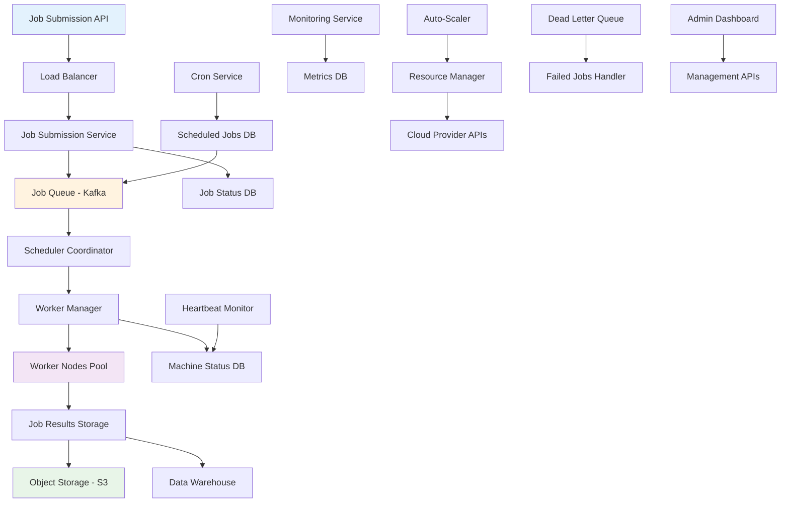
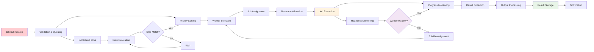
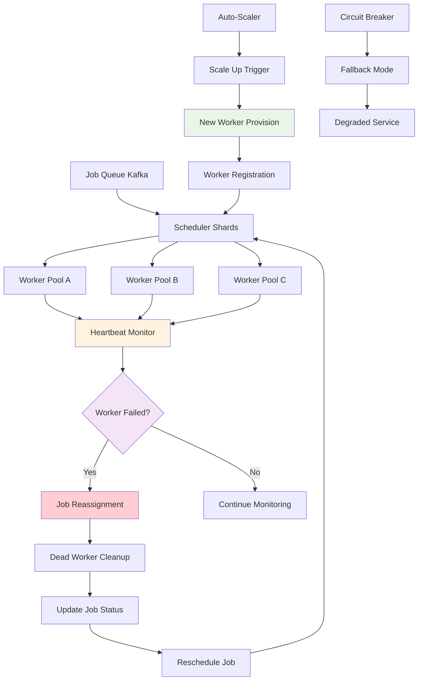

# Job Scheduler Backend

## 📋 Table of Contents

- [Job Scheduler Backend](#job-scheduler-backend)
  - [Requirements Gathering](#requirements-gathering)
    - [Functional Requirements](#functional-requirements)
    - [Non-Functional Requirements](#non-functional-requirements)
  - [Traffic Estimation & Capacity Planning](#traffic-estimation--capacity-planning)
    - [Job Submission Volume](#job-submission-volume)
    - [Execution Load Analysis](#execution-load-analysis)
    - [Resource Management](#resource-management)
  - [Database Schema Design](#database-schema-design)
    - [Job Management Schema](#job-management-schema)
    - [Worker Node Schema](#worker-node-schema)
    - [Scheduling Schema](#scheduling-schema)
  - [System API Design](#system-api-design)
    - [Job Submission APIs](#job-submission-apis)
    - [Worker Management APIs](#worker-management-apis)
    - [Monitoring and Control APIs](#monitoring-and-control-apis)
  - [High-Level Design (HLD)](#high-level-design-hld)
    - [Distributed Job Scheduler Architecture](#distributed-job-scheduler-architecture)
    - [Job Execution and Lifecycle Flow](#job-execution-and-lifecycle-flow)
    - [Fault-Tolerant Scheduling System](#fault-tolerant-scheduling-system)
  - [Low-Level Design (LLD)](#low-level-design-lld)
    - [Job Submission Engine](#job-submission-engine)
    - [Worker Node Manager](#worker-node-manager)
    - [Scheduler Coordinator](#scheduler-coordinator)
  - [Core Algorithms](#core-algorithms)
    - [1. Job Priority and Queue Management Algorithm](#1-job-priority-and-queue-management-algorithm)
    - [2. Worker Node Selection Algorithm](#2-worker-node-selection-algorithm)
    - [3. Failure Detection and Recovery Algorithm](#3-failure-detection-and-recovery-algorithm)
    - [4. Auto-Scaling Algorithm](#4-auto-scaling-algorithm)
    - [5. Distributed Cron Algorithm](#5-distributed-cron-algorithm)
  - [Performance Optimizations](#performance-optimizations)
    - [Job Execution Optimization](#job-execution-optimization)
    - [Queue Management Optimization](#queue-management-optimization)
    - [Resource Allocation Optimization](#resource-allocation-optimization)
  - [Security Considerations](#security-considerations)
    - [Job Execution Security](#job-execution-security)
    - [Worker Node Security](#worker-node-security)
  - [Testing Strategy](#testing-strategy)
    - [Job Scheduler Testing](#job-scheduler-testing)
    - [Performance and Scale Testing](#performance-and-scale-testing)
  - [Trade-offs and Considerations](#trade-offs-and-considerations)
    - [Consistency vs Availability](#consistency-vs-availability)
    - [Resource Efficiency vs Redundancy](#resource-efficiency-vs-redundancy)
    - [Immediate vs Scheduled Execution](#immediate-vs-scheduled-execution)

[⬆️ Back to Top](#--table-of-contents)

---

## Requirements Gathering

### Functional Requirements

**Core Job Scheduling Features:**
- Submit jobs for immediate execution or scheduled future execution
- Support recurring jobs with cron-like scheduling expressions
- Job priority management with queue prioritization
- Job cancellation and modification before execution
- Batch job submission and bulk operations

**Job Execution Management:**
- Distribute jobs across available worker nodes efficiently
- Support multiple job types (scripts, containers, functions, ETL processes)
- Handle job dependencies and execution ordering
- Provide job execution environment isolation and sandboxing
- Support job parameter passing and environment variable configuration

**Worker Node Management:**
- Dynamic worker node registration and deregistration
- Worker health monitoring through heartbeat mechanisms
- Automatic failover and job reassignment on worker failures
- Worker capacity management and resource allocation
- Support heterogeneous worker types with different capabilities

**Job Monitoring and Logging:**
- Real-time job status tracking and progress monitoring
- Comprehensive job execution logs and error reporting
- Job performance metrics and execution statistics
- Historical job execution analysis and reporting
- Alert and notification system for job failures and completions

**Output and Result Management:**
- Handle various output types from small messages to large datasets
- Integration with object storage (S3) for large result files
- Direct output to data warehouses for analytics workloads
- Job result caching and temporary storage management
- Support for streaming outputs and real-time result processing

[⬆️ Back to Top](#--table-of-contents)

### Non-Functional Requirements

**Performance Requirements:**
- Support 100,000+ job submissions per second (AWS Lambda scale)
- Sub-second job assignment to available workers
- Handle 1 million concurrent job executions
- Process 10 billion jobs per day across all systems
- Support job queue depths of 100 million pending jobs

**Scalability Requirements:**
- Horizontal scaling of scheduler components and worker nodes
- Auto-scaling based on job queue length and worker utilization
- Support 100,000+ worker nodes across multiple data centers
- Dynamic resource allocation and deallocation
- Multi-tenant architecture supporting thousands of organizations

**Availability Requirements:**
- 99.99% uptime for job submission and scheduling services
- 99.9% uptime for job execution across all worker nodes
- Zero data loss for submitted jobs through persistent storage
- Regional failover capabilities with cross-region replication
- Graceful degradation during partial system failures

**Consistency Requirements:**
- Strong consistency for job state transitions and worker assignments
- Eventual consistency acceptable for job metrics and reporting
- ACID compliance for critical job scheduling operations
- Job execution exactly-once or at-least-once guarantees
- Consistent job ordering for dependent job chains

**Security Requirements:**
- Secure job execution environments with proper isolation
- Role-based access control for job submission and management
- Encrypted job payloads and sensitive parameter handling
- Audit logging for all job operations and access patterns
- Compliance with data protection and privacy regulations

[⬆️ Back to Top](#--table-of-contents)

---

## Traffic Estimation & Capacity Planning

### Job Submission Volume

**Global Job Submission Metrics:**
- 100,000+ jobs submitted per second during peak hours
- 10 billion total jobs processed daily across all systems
- Average job execution time: 2 minutes (ranging from seconds to hours)
- 70% immediate execution jobs, 30% scheduled jobs
- Peak submission rates 3x higher than average during business hours

**Job Type Distribution:**
- ETL and data processing jobs: 40% of total volume
- Microservice function calls: 30% of total volume
- Batch analytics and ML training: 20% of total volume
- Maintenance and system tasks: 10% of total volume
- Emergency and high-priority jobs: <1% but require instant execution

**Geographic Distribution:**
- North America: 40% of job submissions
- Europe: 30% of job submissions
- Asia-Pacific: 25% of job submissions
- Other regions: 5% of job submissions
- Follow-the-sun patterns with 24/7 global operations

[⬆️ Back to Top](#--table-of-contents)

### Execution Load Analysis

**Worker Node Utilization:**
- 1 million concurrent job executions during peak hours
- 100,000 active worker nodes across all regions
- Average 10 concurrent jobs per worker node
- Worker utilization target: 75% for optimal performance
- Peak utilization can reach 95% with auto-scaling triggers

**Resource Consumption Patterns:**
- CPU-intensive jobs: 35% of execution time
- Memory-intensive jobs: 25% of execution time
- I/O-intensive jobs: 30% of execution time
- Network-intensive jobs: 10% of execution time
- Mixed workload distribution requiring diverse worker types

**Execution Time Patterns:**
- Short jobs (< 1 minute): 50% of all jobs
- Medium jobs (1-30 minutes): 35% of all jobs
- Long jobs (30 minutes - 4 hours): 14% of all jobs
- Extended jobs (> 4 hours): 1% of all jobs
- Job timeout management and resource cleanup requirements

[⬆️ Back to Top](#--table-of-contents)

### Resource Management

**Infrastructure Requirements:**
- Compute: 500,000 CPU cores for job execution during peak
- Memory: 2 TB RAM for concurrent job processing
- Storage: 100 TB for job data, logs, and temporary files
- Network: 50 Gbps for job distribution and result collection
- Queue capacity: 100 million pending jobs in distributed queues

**Auto-Scaling Metrics:**
- Queue length threshold: Scale up when >10,000 pending jobs per shard
- Worker utilization threshold: Scale up when >80% average utilization
- Response time threshold: Scale up when job assignment >500ms
- Cost optimization: Scale down during low utilization periods
- Regional load balancing and capacity optimization

**Data Storage Requirements:**
- Job metadata: 10 TB for job definitions and state information
- Execution logs: 50 TB for comprehensive job execution logs
- Results storage: 500 TB for job outputs and artifacts
- Backup and archival: 1 PB for historical data and compliance
- Cache storage: 5 TB for frequently accessed job data and templates

[⬆️ Back to Top](#--table-of-contents)

---

## Database Schema Design

### Job Management Schema

**Jobs Table:**
- Job ID (Primary Key): Unique job identifier (UUID)
- User ID (Foreign Key): Job submitter reference
- Job Type: Script, container, function, ETL, analytics
- Job Name: Human-readable job identifier
- Job Description: Detailed job purpose and context
- Priority Level: 1-10 priority scale for queue ordering
- Scheduled Time: Future execution timestamp (null for immediate)
- Cron Expression: Recurring job schedule specification
- Status: Pending, assigned, running, completed, failed, cancelled
- Created At: Job submission timestamp
- Started At: Job execution start timestamp
- Completed At: Job completion timestamp
- Retry Count: Number of execution attempts
- Max Retries: Maximum allowed retry attempts

**Job Payloads:**
- Payload ID (Primary Key): Unique payload identifier
- Job ID (Foreign Key): Associated job reference
- Payload Type: Script, binary, config, parameters
- Payload Data: Job execution data (JSON/Binary)
- Input Parameters: Job input parameters and environment variables
- Resource Requirements: CPU, memory, storage requirements
- Timeout Settings: Maximum execution time limits
- Dependencies: Job dependency chain specifications
- Created At: Payload creation timestamp

**Job Results:**
- Result ID (Primary Key): Unique result identifier
- Job ID (Foreign Key): Completed job reference
- Result Type: Success, failure, timeout, cancelled
- Output Data: Job execution output (small results inline)
- Output Location: External storage location (S3, etc.)
- Error Message: Failure reason and error details
- Exit Code: Job process exit code
- Execution Time: Total job execution duration
- Resource Usage: Actual CPU, memory, I/O consumption
- Created At: Result generation timestamp

[⬆️ Back to Top](#--table-of-contents)

### Worker Node Schema

**Worker Nodes:**
- Worker ID (Primary Key): Unique worker identifier
- Node Name: Human-readable worker name
- IP Address: Worker node network address
- Port: Worker service port
- Region: Geographic region location
- Zone: Availability zone within region
- Worker Type: General, CPU-optimized, memory-optimized, GPU
- Capacity: Maximum concurrent jobs supported
- Current Load: Active job count
- Status: Active, inactive, maintenance, failed
- Last Heartbeat: Most recent heartbeat timestamp
- Registration Time: Worker initial registration timestamp
- Capabilities: Supported job types and features

**Worker Heartbeats:**
- Heartbeat ID (Primary Key): Unique heartbeat record
- Worker ID (Foreign Key): Reporting worker reference
- Timestamp: Heartbeat generation time
- Status: Healthy, degraded, overloaded
- CPU Usage: Current CPU utilization percentage
- Memory Usage: Current memory utilization percentage
- Active Jobs: List of currently executing job IDs
- Queue Length: Local job queue depth
- Error Count: Recent error frequency
- Uptime: Worker process uptime duration

**Worker Jobs:**
- Assignment ID (Primary Key): Unique job assignment
- Worker ID (Foreign Key): Assigned worker reference
- Job ID (Foreign Key): Assigned job reference
- Assigned At: Job assignment timestamp
- Started At: Job execution start timestamp
- Status: Assigned, running, completed, failed
- Progress Percentage: Job completion progress (0-100)
- Last Update: Most recent status update timestamp
- Resource Usage: Real-time resource consumption
- Estimated Completion: Predicted completion timestamp

[⬆️ Back to Top](#--table-of-contents)

### Scheduling Schema

**Job Queues:**
- Queue ID (Primary Key): Unique queue identifier
- Queue Name: Priority-based queue name
- Priority Level: Queue processing priority (1-10)
- Max Size: Maximum queue capacity
- Current Size: Active job count in queue
- Processing Rate: Jobs processed per minute
- Region: Geographic region served
- Shard Key: Kafka partition/shard identifier
- Created At: Queue creation timestamp
- Last Processed: Most recent job processing timestamp

**Cron Jobs:**
- Cron Job ID (Primary Key): Unique recurring job identifier
- Job Template ID (Foreign Key): Template job reference
- Cron Expression: Schedule specification (5-field cron)
- Timezone: Execution timezone specification
- Next Execution: Calculated next execution timestamp
- Last Execution: Previous execution timestamp
- Execution Count: Total executions performed
- Max Executions: Maximum allowed executions (optional)
- Status: Active, paused, disabled, expired
- Created By: User who created recurring job
- Created At: Cron job creation timestamp

**Job Dependencies:**
- Dependency ID (Primary Key): Unique dependency relationship
- Parent Job ID (Foreign Key): Prerequisite job reference
- Child Job ID (Foreign Key): Dependent job reference
- Dependency Type: Success, completion, output-based
- Status: Pending, satisfied, failed
- Created At: Dependency creation timestamp
- Satisfied At: Dependency satisfaction timestamp
- Retry Policy: Dependency failure retry behavior

[⬆️ Back to Top](#--table-of-contents)

---

## System API Design

### Job Submission APIs

**Job Lifecycle Operations:**
- Submit new jobs with immediate or scheduled execution
- Update job parameters and scheduling before execution
- Cancel pending or running jobs with proper cleanup
- Retry failed jobs with modified parameters or resources
- Clone existing jobs with parameter variations

**Batch Job Operations:**
- Submit multiple jobs in a single request for efficiency
- Create job chains with dependency specifications
- Schedule recurring jobs with cron expressions
- Bulk job status updates and monitoring
- Mass job cancellation and cleanup operations

**Job Template Management:**
- Create reusable job templates with parameter placeholders
- Version job templates for consistency and rollback capabilities
- Share job templates across teams and organizations
- Validate job templates before submission
- Import and export job templates for portability

[⬆️ Back to Top](#--table-of-contents)

### Worker Management APIs

**Worker Registration and Lifecycle:**
- Register new worker nodes with capability specifications
- Update worker status and capacity information
- Deregister workers during maintenance or scaling down
- Worker health check and heartbeat reporting
- Worker capability advertisement and discovery

**Job Assignment and Execution:**
- Assign jobs to optimal worker nodes based on requirements
- Monitor job execution progress and resource consumption
- Handle job completion notifications and result collection
- Manage job timeouts and resource cleanup
- Support job migration between workers for load balancing

**Resource Management:**
- Query worker capacity and current utilization
- Reserve resources for high-priority or large jobs
- Monitor and report resource consumption patterns
- Enforce resource limits and quotas per job
- Optimize resource allocation across worker pools

[⬆️ Back to Top](#--table-of-contents)

### Monitoring and Control APIs

**Job Status and Monitoring:**
- Real-time job status queries with filtering and pagination
- Job execution logs and error message retrieval
- Job performance metrics and resource usage statistics
- Historical job execution analysis and reporting
- Job queue status and backlog monitoring

**System Health and Metrics:**
- Overall system health and component status
- Worker node health and availability monitoring
- Queue performance and processing rate metrics
- Resource utilization across all system components
- Alert and notification management for system events

**Administrative Operations:**
- System configuration updates and parameter tuning
- Emergency job cancellation and system shutdown procedures
- Database maintenance and cleanup operations
- Performance optimization and capacity planning tools
- Security audit and compliance reporting

[⬆️ Back to Top](#--table-of-contents)

---

## High-Level Design (HLD)

### Distributed Job Scheduler Architecture

**Scalable Job Scheduling Platform:**

**Core Service Components:**
- **Job Submission Service**: Job intake, validation, and queue distribution
- **Scheduler Coordinator**: Intelligent job assignment and worker selection
- **Worker Manager**: Worker registration, health monitoring, and lifecycle management
- **Cron Service**: Recurring job scheduling and time-based execution
- **Auto-Scaler**: Dynamic resource scaling based on demand and queue depth
- **Monitoring Service**: Comprehensive system monitoring and alerting

[⬆️ Back to Top](#--table-of-contents)

### Job Execution and Lifecycle Flow

**End-to-End Job Processing Pipeline:**

**Processing Flow Features:**
- **Intelligent Queuing**: Priority-based job queuing with fair scheduling
- **Dynamic Assignment**: Optimal worker selection based on job requirements
- **Health Monitoring**: Continuous worker health checks with automatic failover
- **Result Management**: Flexible output handling for various job types

[⬆️ Back to Top](#--table-of-contents)

### Fault-Tolerant Scheduling System

**High-Availability Job Scheduling with Failure Recovery:**

**Fault-Tolerance Features:**
- **Heartbeat Monitoring**: Real-time worker health detection
- **Automatic Failover**: Immediate job reassignment on worker failures
- **Circuit Breaker**: Graceful degradation during system overload
- **Auto-Recovery**: Automatic scaling and worker replacement

[⬆️ Back to Top](#--table-of-contents)

---

## Low-Level Design (LLD)

### Job Submission Engine

**Comprehensive Job Intake and Processing:**
- **Job Validation**: Parameter validation, resource requirement checks, and security scanning
- **Queue Management**: Intelligent queue selection based on priority and resource requirements
- **Deduplication**: Duplicate job detection and handling strategies
- **Rate Limiting**: Per-user and per-tenant job submission rate limiting

**Job Metadata Management:**
- **Job Templating**: Reusable job templates with parameter substitution
- **Dependency Tracking**: Job dependency graph construction and validation
- **Scheduling Logic**: Cron expression parsing and next execution calculation
- **Audit Logging**: Comprehensive job submission and modification logging

**Performance Optimization:**
- **Batch Processing**: Efficient bulk job submission handling
- **Async Processing**: Non-blocking job submission with immediate acknowledgment
- **Connection Pooling**: Optimized database and queue connections
- **Caching**: Frequently accessed job templates and configuration caching

[⬆️ Back to Top](#--table-of-contents)

### Worker Node Manager

**Intelligent Worker Lifecycle Management:**
- **Registration**: Worker capability discovery and validation
- **Health Monitoring**: Continuous heartbeat monitoring and health assessment
- **Capacity Management**: Dynamic capacity tracking and resource allocation
- **Load Balancing**: Optimal job distribution across available workers

**Job Assignment Logic:**
- **Worker Selection**: Multi-criteria worker selection algorithm
- **Resource Matching**: Job requirements to worker capability matching
- **Affinity Rules**: Worker affinity and anti-affinity rule enforcement
- **Failover Handling**: Automatic job reassignment on worker failures

**Performance Monitoring:**
- **Metrics Collection**: Worker performance and resource utilization metrics
- **Anomaly Detection**: Unusual worker behavior and performance degradation detection
- **Predictive Scaling**: Proactive worker scaling based on demand forecasting
- **Resource Optimization**: Continuous resource allocation optimization

[⬆️ Back to Top](#--table-of-contents)

### Scheduler Coordinator

**Central Scheduling Intelligence:**
- **Queue Management**: Multi-priority queue management with fair scheduling
- **Job Prioritization**: Dynamic priority adjustment based on SLA and business rules
- **Resource Allocation**: Global resource allocation and optimization
- **Conflict Resolution**: Job scheduling conflict detection and resolution

**Distributed Coordination:**
- **Shard Management**: Kafka partition management for distributed processing
- **Leader Election**: Distributed scheduler leadership and coordination
- **State Synchronization**: Consistent state management across scheduler instances
- **Split-Brain Prevention**: Network partition handling and recovery

**Optimization Engine:**
- **Performance Tuning**: Continuous performance optimization and parameter tuning
- **Cost Optimization**: Resource cost minimization through intelligent scheduling
- **SLA Management**: Service level agreement compliance monitoring
- **Predictive Analytics**: Job execution time and resource prediction

[⬆️ Back to Top](#--table-of-contents)

---

## Core Algorithms

### 1. Job Priority and Queue Management Algorithm

**Multi-Level Priority Queue with Fair Scheduling:**
- Implement multiple priority queues with weighted fair queuing algorithm
- Calculate dynamic job priority based on submission time, user priority, and resource requirements
- Use exponential backoff for failed job retries with jitter to prevent thundering herd
- Apply aging algorithm to prevent low-priority job starvation
- Implement deadline-aware scheduling for time-sensitive jobs
- Use round-robin scheduling within same priority levels for fairness

**Queue Optimization Strategies:**
- **Priority Inheritance**: Boost priority of jobs blocking high-priority jobs
- **Resource-Aware Queuing**: Separate queues for different resource types
- **Batch Optimization**: Group similar jobs for efficient batch processing
- **Load Shedding**: Drop lowest priority jobs during extreme overload

**Performance Considerations:**
- **Lock-Free Queues**: Use lock-free data structures for high-throughput queuing
- **Memory Optimization**: Efficient memory usage for large queue depths
- **Persistence**: Reliable queue persistence with fast recovery
- **Monitoring**: Real-time queue metrics and performance monitoring

[⬆️ Back to Top](#--table-of-contents)

### 2. Worker Node Selection Algorithm

**Intelligent Worker Assignment with Multi-Criteria Optimization:**
- Score workers based on current load, capability match, and historical performance
- Consider geographic proximity for data locality and reduced latency
- Apply resource constraints matching (CPU, memory, GPU, storage)
- Use consistent hashing for stateful job assignment and worker affinity
- Implement load balancing with weighted round-robin based on worker capacity
- Apply machine learning for predictive worker performance and failure probability

**Selection Criteria:**
- **Resource Availability**: CPU, memory, storage, and network capacity
- **Capability Matching**: Job type support and software requirements
- **Performance History**: Worker reliability and execution speed
- **Data Locality**: Proximity to required data sources and outputs

**Optimization Techniques:**
- **Caching**: Worker capability and status caching for fast selection
- **Precomputation**: Pre-calculated worker scores for common job types
- **Adaptive Learning**: Continuous learning from job execution outcomes
- **Failure Prediction**: Proactive worker failure prediction and avoidance

[⬆️ Back to Top](#--table-of-contents)

### 3. Failure Detection and Recovery Algorithm

**Robust Failure Detection with Automatic Recovery:**
- Implement multi-layered heartbeat monitoring with exponential backoff
- Use circuit breaker pattern for cascade failure prevention
- Detect worker failures through missed heartbeats, resource exhaustion, and communication timeouts
- Apply consensus algorithms for distributed failure detection across multiple monitors
- Implement job checkpointing for long-running tasks with resume capability
- Use distributed deadlock detection for complex job dependency chains

**Recovery Strategies:**
- **Immediate Reassignment**: Fast job reassignment to healthy workers
- **Graceful Degradation**: Reduced functionality during partial failures
- **Rollback Mechanisms**: Automatic rollback of failed job chains
- **Resource Cleanup**: Automatic cleanup of failed job resources

**Monitoring and Alerting:**
- **Multi-Level Monitoring**: Component, service, and system-level monitoring
- **Anomaly Detection**: Statistical and ML-based anomaly detection
- **Escalation Policies**: Automated escalation for critical failures
- **Recovery Verification**: Automatic verification of successful recovery

[⬆️ Back to Top](#--table-of-contents)

### 4. Auto-Scaling Algorithm

**Predictive and Reactive Auto-Scaling with Cost Optimization:**
- Monitor queue depth, worker utilization, and job submission rates for scaling triggers
- Use predictive analytics based on historical patterns and seasonal trends
- Implement multi-dimensional scaling based on CPU, memory, and I/O requirements
- Apply cost-aware scaling with spot instances and preemptible workers
- Use horizontal pod autoscaling (HPA) and vertical pod autoscaling (VPA) in Kubernetes
- Implement geographic scaling for global load distribution

**Scaling Triggers:**
- **Queue Depth**: Scale up when queue depth exceeds thresholds
- **Utilization**: Scale based on worker utilization and response times
- **Predictive**: Proactive scaling based on forecast demand
- **Cost**: Scale down during low demand to optimize costs

**Scaling Strategies:**
- **Gradual Scaling**: Smooth scaling to avoid resource waste
- **Burst Scaling**: Rapid scaling for sudden demand spikes
- **Scheduled Scaling**: Predictable scaling for known patterns
- **Multi-Region**: Geographic scaling for global availability

[⬆️ Back to Top](#--table-of-contents)

### 5. Distributed Cron Algorithm

**Highly Available Distributed Cron with Exactly-Once Execution:**
- Use distributed consensus (Raft/Paxos) for leader election among cron schedulers
- Implement time-based sharding across multiple cron service instances
- Use distributed locks to ensure exactly-once execution of scheduled jobs
- Apply clock synchronization (NTP) for accurate time-based scheduling
- Implement timezone-aware scheduling with daylight saving time handling
- Use persistent storage for cron job state with fast recovery after failures

**Cron Expression Processing:**
- **Advanced Parsing**: Support extended cron expressions with seconds
- **Timezone Handling**: Multi-timezone support with DST transitions
- **Holiday Awareness**: Business calendar integration for holiday skipping
- **Overlap Prevention**: Prevent overlapping executions of long-running jobs

**Reliability Features:**
- **Missed Job Handling**: Configurable behavior for missed executions
- **Catch-up Logic**: Smart catch-up for jobs missed during downtime
- **Execution Windows**: Flexible execution windows for job scheduling
- **Monitoring**: Comprehensive monitoring of cron job execution

[⬆️ Back to Top](#--table-of-contents)

---

## Performance Optimizations

### Job Execution Optimization

**High-Performance Job Processing:**
- **Parallel Execution**: Concurrent job execution with optimal worker utilization
- **Resource Pooling**: Shared resource pools for efficient utilization
- **Job Batching**: Intelligent job batching for reduced overhead
- **Container Optimization**: Fast container startup and resource sharing

**Execution Environment Optimization:**
- **JIT Compilation**: Just-in-time compilation for dynamic job types
- **Warm Pools**: Pre-warmed execution environments for immediate job start
- **Resource Preallocation**: Pre-allocated resources for predictable workloads
- **Memory Management**: Efficient memory allocation and garbage collection

**I/O and Network Optimization:**
- **Data Locality**: Job placement near required data sources
- **Streaming Processing**: Streaming data processing for large datasets
- **Compression**: Data compression for network and storage efficiency
- **Connection Pooling**: Efficient database and service connections

[⬆️ Back to Top](#--table-of-contents)

### Queue Management Optimization

**Efficient Queue Processing:**
- **Lock-Free Queues**: High-throughput lock-free queue implementations
- **Partitioned Queues**: Kafka partitioning for parallel processing
- **Priority Optimization**: Efficient priority queue algorithms
- **Batch Dequeuing**: Bulk job retrieval for reduced overhead

**Memory and Storage Optimization:**
- **Queue Persistence**: Efficient persistent queue storage
- **Memory Usage**: Optimized memory usage for large queue depths
- **Garbage Collection**: Efficient cleanup of completed jobs
- **Compression**: Queue data compression for storage efficiency

**Network Optimization:**
- **Message Batching**: Batch message processing for network efficiency
- **Connection Reuse**: Long-lived connections for reduced overhead
- **Protocol Optimization**: Efficient serialization and communication protocols
- **Regional Optimization**: Regional queue placement for reduced latency

[⬆️ Back to Top](#--table-of-contents)

### Resource Allocation Optimization

**Intelligent Resource Management:**
- **Dynamic Allocation**: Real-time resource allocation based on job requirements
- **Resource Prediction**: ML-based resource requirement prediction
- **Overcommit Strategies**: Safe resource overcommitment for improved utilization
- **Resource Affinity**: Optimal resource placement for performance

**Cost Optimization:**
- **Spot Instance Usage**: Cost-effective spot instances for batch workloads
- **Resource Scheduling**: Time-based resource scheduling for cost savings
- **Capacity Planning**: Optimal capacity planning for cost efficiency
- **Resource Sharing**: Efficient resource sharing across multiple jobs

**Performance Monitoring:**
- **Real-time Metrics**: Real-time resource utilization monitoring
- **Performance Analytics**: Detailed performance analysis and optimization
- **Bottleneck Detection**: Automatic bottleneck identification and resolution
- **Capacity Forecasting**: Predictive capacity planning and optimization

[⬆️ Back to Top](#--table-of-contents)

---

## Security Considerations

### Job Execution Security

**Secure Job Processing Environment:**
- **Sandboxing**: Isolated execution environments with restricted system access
- **Container Security**: Secure container configurations with minimal attack surface
- **Resource Limits**: Strict resource limits to prevent resource exhaustion attacks
- **Network Isolation**: Network segmentation and traffic filtering for job execution

**Data Protection:**
- **Encryption**: End-to-end encryption for job payloads and sensitive data
- **Secrets Management**: Secure handling of API keys, passwords, and certificates
- **Data Masking**: Automatic masking of sensitive data in logs and outputs
- **Compliance**: GDPR, HIPAA, and other regulatory compliance

**Access Control:**
- **Authentication**: Strong authentication for job submission and management
- **Authorization**: Role-based access control with fine-grained permissions
- **API Security**: Secure API design with rate limiting and input validation
- **Audit Logging**: Comprehensive security audit trails

[⬆️ Back to Top](#--table-of-contents)

### Worker Node Security

**Secure Worker Infrastructure:**
- **Node Hardening**: Security hardening of worker node operating systems
- **Image Security**: Secure base images with vulnerability scanning
- **Runtime Protection**: Runtime security monitoring and threat detection
- **Update Management**: Automated security update deployment

**Network Security:**
- **TLS Encryption**: Encrypted communication between all components
- **Certificate Management**: Automated certificate lifecycle management
- **Network Policies**: Kubernetes network policies for traffic control
- **VPN Access**: Secure VPN access for administrative operations

**Monitoring and Response:**
- **Security Monitoring**: Real-time security monitoring and alerting
- **Incident Response**: Automated incident response and remediation
- **Vulnerability Management**: Continuous vulnerability assessment and patching
- **Threat Intelligence**: Integration with threat intelligence feeds

[⬆️ Back to Top](#--table-of-contents)

---

## Testing Strategy

### Job Scheduler Testing

**Functional Testing:**
- **Job Lifecycle**: Test complete job submission, execution, and completion workflows
- **Scheduling**: Validate immediate and scheduled job execution accuracy
- **Failure Handling**: Test worker failure detection and job reassignment
- **Priority Management**: Verify priority-based job scheduling and execution order
- **Integration**: Test integration with external systems and data sources

**Algorithm Testing:**
- **Worker Selection**: Validate worker selection algorithm accuracy and performance
- **Load Balancing**: Test load distribution across worker pools
- **Auto-Scaling**: Verify scaling triggers and resource allocation
- **Cron Scheduling**: Test distributed cron accuracy across timezones

**Data Integrity Testing:**
- **Job State**: Test job state consistency across all system components
- **Result Accuracy**: Validate job result integrity and storage
- **Queue Consistency**: Test queue state consistency during failures
- **Dependency Management**: Verify job dependency handling and execution order

[⬆️ Back to Top](#--table-of-contents)

### Performance and Scale Testing

**Load Testing:**
- **High Throughput**: Test system performance at 100,000+ jobs per second
- **Concurrent Execution**: Test 1 million concurrent job executions
- **Queue Depth**: Test performance with 100 million pending jobs
- **Worker Scaling**: Test scaling to 100,000+ worker nodes

**Stress Testing:**
- **Resource Exhaustion**: Test system behavior under resource constraints
- **Network Partitions**: Test behavior during network failures
- **Database Overload**: Test performance under database stress
- **Memory Pressure**: Test system stability under memory pressure

**Endurance Testing:**
- **Long-Running Jobs**: Test execution of jobs running for hours or days
- **System Stability**: Continuous operation testing for weeks
- **Memory Leaks**: Long-term memory usage monitoring
- **Performance Degradation**: Monitor performance over extended periods

[⬆️ Back to Top](#--table-of-contents)

---

## Trade-offs and Considerations

### Consistency vs Availability

**Strong Consistency Requirements:**
- Job state transitions must be atomic and consistent
- Worker assignments require immediate consistency
- Job dependency chains need ordered execution guarantees
- Financial and critical system jobs require ACID compliance

**High Availability Optimization:**
- Job status queries can tolerate eventual consistency
- Metrics and monitoring data can be eventually consistent
- Worker health data can have slight delays
- Historical reporting can accept data staleness

**Balanced Approach:**
- Use strong consistency for critical job operations
- Accept eventual consistency for monitoring and metrics
- Implement read replicas for improved availability
- Provide clear SLA expectations for different operations

[⬆️ Back to Top](#--table-of-contents)

### Resource Efficiency vs Redundancy

**Resource Efficiency Focus:**
- Maximize worker utilization through intelligent scheduling
- Use resource sharing and multiplexing for cost optimization
- Implement just-in-time resource allocation
- Optimize for minimal resource waste and overhead

**Redundancy and Reliability:**
- Maintain resource buffers for handling demand spikes
- Implement multi-region redundancy for disaster recovery
- Keep spare worker capacity for immediate failover
- Maintain multiple replicas of critical system components

**Optimization Strategy:**
- Balance utilization targets with reliability requirements
- Use predictive scaling to minimize resource waste
- Implement tiered service levels with different redundancy
- Monitor cost vs. reliability metrics for optimization

[⬆️ Back to Top](#--table-of-contents)

### Immediate vs Scheduled Execution

**Immediate Execution Benefits:**
- Lower latency for time-sensitive jobs
- Simpler scheduling logic and reduced complexity
- Better resource utilization for interactive workloads
- Immediate feedback and faster debugging

**Scheduled Execution Advantages:**
- Better resource planning and capacity management
- Cost optimization through off-peak scheduling
- Coordination with external system maintenance windows
- Batch processing efficiency for large-scale operations

**Hybrid Approach:**
- Support both immediate and scheduled execution modes
- Implement priority-based scheduling for mixed workloads
- Provide deadline scheduling for time-sensitive scheduled jobs
- Offer flexible scheduling options for different use cases

**Technology Selection:**
- **Message Broker**: Kafka for reliable job queuing and distribution
- **Database**: PostgreSQL for job metadata, Redis for fast lookups
- **Orchestration**: Kubernetes for worker node management and scaling
- **Monitoring**: Prometheus and Grafana for comprehensive system monitoring
- **Storage**: S3-compatible object storage for job results and logs

[⬆️ Back to Top](#--table-of-contents) 