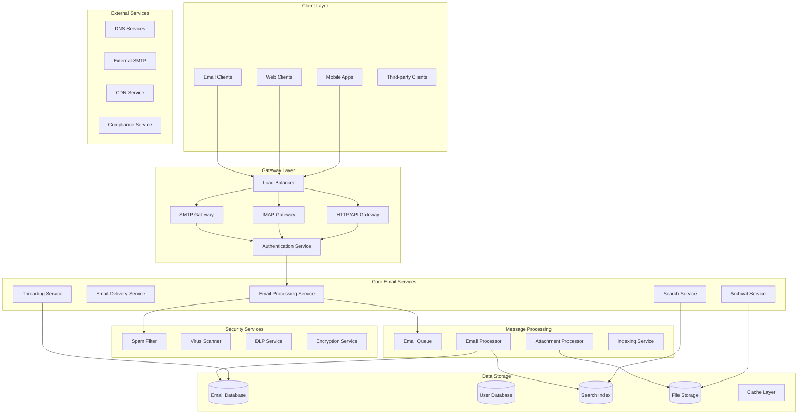
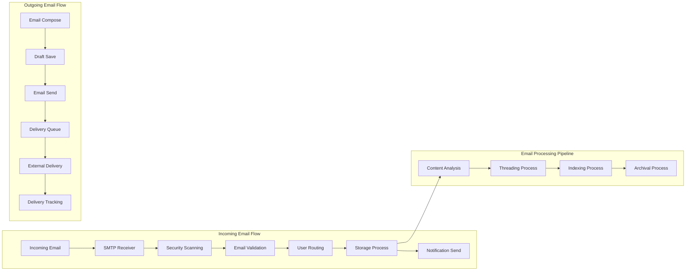
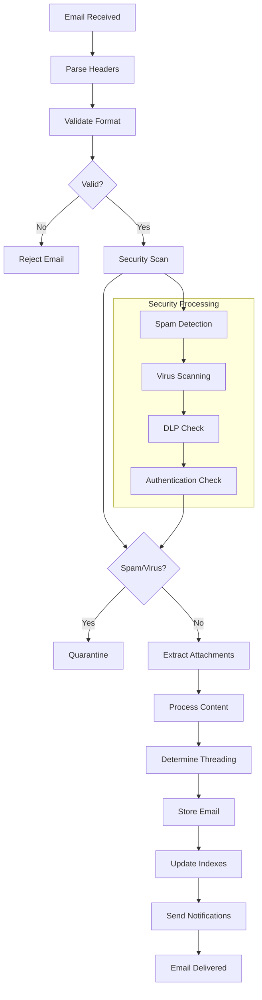
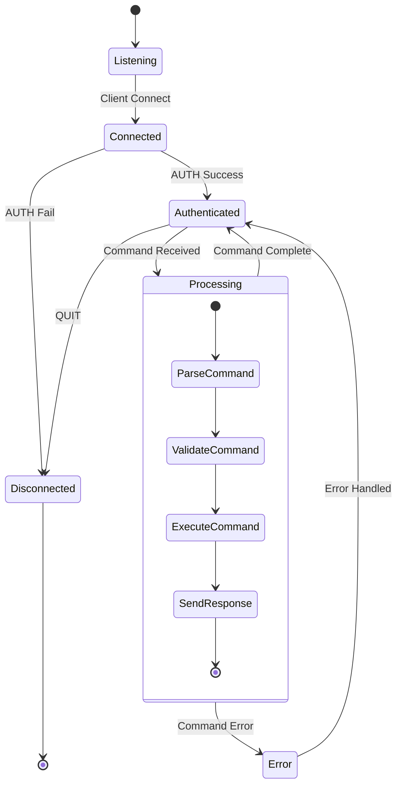
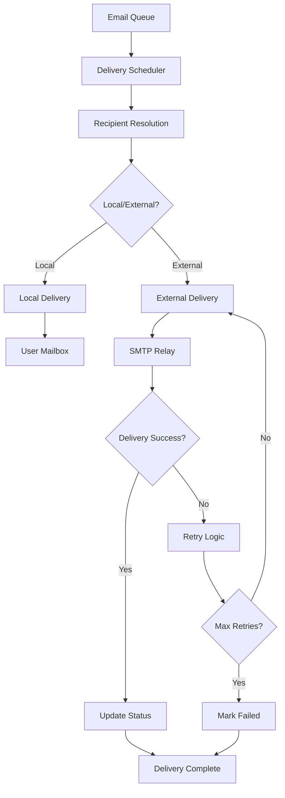
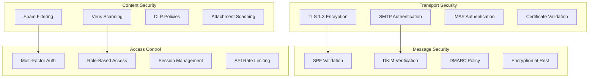

# Enterprise Email System Backend

## 📋 Table of Contents

- [Enterprise Email System Backend](#enterprise-email-system-backend)
  - [Requirements Gathering](#requirements-gathering)
    - [Functional Requirements](#functional-requirements)
    - [Non-Functional Requirements](#non-functional-requirements)
  - [Traffic Estimation & Capacity Planning](#traffic-estimation-capacity-planning)
    - [User Base Analysis](#user-base-analysis)
    - [Traffic Calculations](#traffic-calculations)
  - [Database Schema Design](#database-schema-design)
    - [Email Database Schema](#email-database-schema)
    - [User Database Schema](#user-database-schema)
    - [Attachment Storage Schema](#attachment-storage-schema)
  - [Sample API Endpoints](#sample-api-endpoints)
    - [Authentication APIs](#authentication-apis)
    - [Email APIs](#email-apis)
    - [Folder Management APIs](#folder-management-apis)
    - [Search APIs](#search-apis)
  - [High-Level Design (HLD)](#high-level-design-hld)
    - [System Architecture Overview](#system-architecture-overview)
    - [Email Flow Architecture](#email-flow-architecture)
  - [Low-Level Design (LLD)](#low-level-design-lld)
    - [Email Processing Pipeline](#email-processing-pipeline)
    - [SMTP/IMAP Protocol Handling](#smtpimap-protocol-handling)
    - [Email Delivery System](#email-delivery-system)
  - [Core Algorithms](#core-algorithms)
    - [1. Email Delivery Algorithm](#1-email-delivery-algorithm)
    - [2. Spam Detection Algorithm](#2-spam-detection-algorithm)
    - [3. Email Search and Indexing Algorithm](#3-email-search-and-indexing-algorithm)
    - [4. Email Threading Algorithm](#4-email-threading-algorithm)
    - [5. Email Archival and Retention Algorithm](#5-email-archival-and-retention-algorithm)
  - [Performance Optimizations](#performance-optimizations)
    - [Email Indexing and Search](#email-indexing-and-search)
    - [Database Optimization](#database-optimization)
  - [Security Considerations](#security-considerations)
    - [Email Security Framework](#email-security-framework)
  - [Testing Strategy](#testing-strategy)
    - [Load Testing](#load-testing)
    - [Security Testing](#security-testing)
  - [Trade-offs and Considerations](#trade-offs-and-considerations)
    - [Delivery vs Storage](#delivery-vs-storage)
    - [Security vs Usability](#security-vs-usability)
    - [Performance vs Features](#performance-vs-features)

---

## Requirements Gathering

[⬆️ Back to Top](#-table-of-contents)

---

### Functional Requirements

[⬆️ Back to Top](#-table-of-contents)

---

**Core Email Features:**
- Send and receive emails with rich text formatting
- Support for multiple email addresses per user
- Email threading and conversation view
- Email attachments up to 25MB per file
- Email drafts with auto-save functionality
- Email templates and signatures
- Email forwarding and auto-reply
- Email scheduling (send later)
- Email recall within 5 minutes
- Email read receipts and delivery confirmations
- Bulk email operations (delete, move, mark as read)
- Email import/export functionality

**Folder and Organization:**
- Custom folder creation and management
- Email labels and tags
- Email rules and filters
- Priority inbox and important markers
- Archive and trash with retention policies
- Email sorting by date, sender, subject, size
- Starred emails and custom flags

**Search and Discovery:**
- Full-text email search across all folders
- Advanced search with filters (date, sender, attachments)
- Search within attachments (PDF, DOC, etc.)
- Search suggestions and auto-complete
- Saved searches and smart folders
- Email analytics and insights

**Collaboration Features:**
- Shared mailboxes and delegation
- Email sharing and collaboration
- Email comments and annotations
- Email snooze and reminders
- Integration with calendar for meeting requests
- Contact management and address books

### Non-Functional Requirements

[⬆️ Back to Top](#-table-of-contents)

---

**Performance:**
- Email delivery latency < 5 seconds for internal emails
- Email search results < 2 seconds for most queries
- Support 100 million active users
- Handle 10 billion emails per day
- 99.9% uptime SLA
- Handle traffic spikes during peak hours

**Scalability:**
- Horizontal scaling across multiple data centers
- Support for enterprise customers with millions of users
- Auto-scaling based on demand
- Global email routing and delivery
- Support for 50,000 concurrent IMAP/SMTP connections

**Security:**
- End-to-end encryption for sensitive emails
- DKIM, SPF, and DMARC authentication
- Advanced spam and phishing protection
- Data loss prevention (DLP)
- Compliance with GDPR, SOX, HIPAA
- Audit logging and forensic capabilities

**Reliability:**
- No email loss (99.999% durability)
- Multi-region backup and disaster recovery
- Email queue reliability with retry mechanisms
- Automatic failover and load balancing
- Data replication across multiple zones

## Traffic Estimation & Capacity Planning

[⬆️ Back to Top](#-table-of-contents)

---

### User Base Analysis

[⬆️ Back to Top](#-table-of-contents)

---

- **Total Users:** 100 million registered users
- **Daily Active Users (DAU):** 80 million users
- **Peak Concurrent Users:** 20 million users
- **Emails per User per Day:** 50 emails sent, 120 emails received
- **Peak Traffic Ratio:** 4x average during business hours

### Traffic Calculations

[⬆️ Back to Top](#-table-of-contents)

---

**Email Volume:**
```
Daily Sent Emails = 80M DAU × 50 emails = 4B sent emails/day
Daily Received Emails = 80M DAU × 120 emails = 9.6B received emails/day
Total Daily Email Processing = 4B + 9.6B = 13.6B emails/day

Peak Processing:
- Peak sent emails/sec = (4B × 4) / (24 × 3600) = 185,000 emails/sec
- Peak received emails/sec = (9.6B × 4) / (24 × 3600) = 444,000 emails/sec
- Total peak processing = 629,000 emails/sec

Average Processing:
- Average sent emails/sec = 4B / (24 × 3600) = 46,000 emails/sec
- Average received emails/sec = 9.6B / (24 × 3600) = 111,000 emails/sec
```

**SMTP/IMAP Connections:**
```
SMTP Connections:
- Peak concurrent SMTP sessions = 50,000
- Average session duration = 30 seconds
- Connection memory per session = 4KB
- Total SMTP memory = 50,000 × 4KB = 200MB

IMAP Connections:
- Peak concurrent IMAP sessions = 20M users × 0.3 = 6M connections
- Connection memory per session = 16KB
- Total IMAP memory = 6M × 16KB = 96GB
- Servers needed (100K connections/server) = 60 servers
```

**Storage Requirements:**
```
Email Storage:
- Average email size = 50KB (text + formatting)
- With attachments (20% of emails) = 2MB average
- Daily storage = (13.6B × 50KB) + (13.6B × 0.2 × 2MB) = 6.1TB/day
- Annual storage = 6.1TB × 365 = 2.2PB/year
- With 3x replication = 6.6PB/year

Attachment Storage:
- Daily attachment volume = 13.6B × 0.2 × 2MB = 5.4TB/day
- With compression (60% reduction) = 2.2TB/day
- Attachment archive storage = 800TB/year

Index Storage:
- Search index size = 10% of email content = 220TB/year
- Metadata index = 5% of email content = 110TB/year
```

**Bandwidth Requirements:**
```
Email Traffic:
- Peak email bandwidth = 629,000 emails/sec × 50KB = 31GB/s
- With protocol overhead (1.5x) = 47GB/s
- Attachment traffic = 185,000 emails/sec × 0.2 × 2MB = 74GB/s

Network Infrastructure:
- Internet bandwidth = 100GB/s
- Internal bandwidth = 200GB/s
- CDN bandwidth for attachments = 50GB/s
```

**Infrastructure Sizing:**
```
Application Servers:
- SMTP processing: 100 servers (with 3x redundancy)
- IMAP processing: 60 servers
- Email processing pipeline: 80 servers
- Search and indexing: 40 servers
- Web API servers: 50 servers

Database Requirements:
- Email content DB: 200 shards, 64GB RAM each
- User metadata DB: 20 shards, 32GB RAM each
- Search index DB: 50 shards, 128GB RAM each
- Attachment metadata DB: 10 shards, 32GB RAM each

Cache Requirements:
- Redis clusters: 500GB total memory
- Email headers cache: 200GB
- User session cache: 100GB
- Search results cache: 150GB
- Frequently accessed emails: 50GB
```

## Database Schema Design

[⬆️ Back to Top](#-table-of-contents)

---

### Email Database Schema

[⬆️ Back to Top](#-table-of-contents)

---

```sql
-- Emails table (sharded by user_id)
CREATE TABLE emails (
    email_id BIGINT PRIMARY KEY,
    message_id VARCHAR(255) UNIQUE NOT NULL, -- RFC message ID
    user_id BIGINT NOT NULL,
    mailbox_id BIGINT NOT NULL,
    thread_id BIGINT,
    
    -- Email headers
    from_address VARCHAR(255) NOT NULL,
    to_addresses TEXT NOT NULL, -- JSON array
    cc_addresses TEXT,          -- JSON array
    bcc_addresses TEXT,         -- JSON array
    reply_to VARCHAR(255),
    subject VARCHAR(500),
    
    -- Email content
    body_text TEXT,
    body_html TEXT,
    content_type VARCHAR(100) DEFAULT 'text/plain',
    encoding VARCHAR(50) DEFAULT 'UTF-8',
    
    -- Email metadata
    email_size BIGINT NOT NULL,
    has_attachments BOOLEAN DEFAULT FALSE,
    attachment_count INT DEFAULT 0,
    priority ENUM('low', 'normal', 'high') DEFAULT 'normal',
    
    -- Status flags
    is_read BOOLEAN DEFAULT FALSE,
    is_starred BOOLEAN DEFAULT FALSE,
    is_important BOOLEAN DEFAULT FALSE,
    is_deleted BOOLEAN DEFAULT FALSE,
    is_spam BOOLEAN DEFAULT FALSE,
    is_draft BOOLEAN DEFAULT FALSE,
    
    -- Timestamps
    sent_at TIMESTAMP,
    received_at TIMESTAMP DEFAULT CURRENT_TIMESTAMP,
    created_at TIMESTAMP DEFAULT CURRENT_TIMESTAMP,
    updated_at TIMESTAMP DEFAULT CURRENT_TIMESTAMP ON UPDATE CURRENT_TIMESTAMP,
    
    -- Security and compliance
    encryption_status ENUM('none', 'transport', 'end_to_end') DEFAULT 'transport',
    dlp_status ENUM('clean', 'flagged', 'blocked') DEFAULT 'clean',
    spam_score DECIMAL(3,2) DEFAULT 0.00,
    
    INDEX idx_user_received (user_id, received_at),
    INDEX idx_user_thread (user_id, thread_id),
    INDEX idx_message_id (message_id),
    INDEX idx_from_address (from_address),
    INDEX idx_subject (subject),
    FULLTEXT INDEX ft_content (subject, body_text, body_html)
);

-- Email threads table
CREATE TABLE email_threads (
    thread_id BIGINT PRIMARY KEY AUTO_INCREMENT,
    user_id BIGINT NOT NULL,
    subject_normalized VARCHAR(500), -- Normalized subject for threading
    first_email_id BIGINT NOT NULL,
    last_email_id BIGINT NOT NULL,
    
    email_count INT DEFAULT 1,
    participant_count INT DEFAULT 1,
    has_unread BOOLEAN DEFAULT FALSE,
    
    created_at TIMESTAMP DEFAULT CURRENT_TIMESTAMP,
    updated_at TIMESTAMP DEFAULT CURRENT_TIMESTAMP ON UPDATE CURRENT_TIMESTAMP,
    
    INDEX idx_user_updated (user_id, updated_at),
    INDEX idx_subject_normalized (subject_normalized),
    FOREIGN KEY (first_email_id) REFERENCES emails(email_id),
    FOREIGN KEY (last_email_id) REFERENCES emails(email_id)
);

-- Mailboxes/Folders table
CREATE TABLE mailboxes (
    mailbox_id BIGINT PRIMARY KEY AUTO_INCREMENT,
    user_id BIGINT NOT NULL,
    parent_mailbox_id BIGINT,
    
    name VARCHAR(255) NOT NULL,
    type ENUM('inbox', 'sent', 'drafts', 'trash', 'spam', 'archive', 'custom') NOT NULL,
    
    email_count INT DEFAULT 0,
    unread_count INT DEFAULT 0,
    size_bytes BIGINT DEFAULT 0,
    
    sort_order INT DEFAULT 0,
    is_subscribed BOOLEAN DEFAULT TRUE,
    
    created_at TIMESTAMP DEFAULT CURRENT_TIMESTAMP,
    updated_at TIMESTAMP DEFAULT CURRENT_TIMESTAMP ON UPDATE CURRENT_TIMESTAMP,
    
    INDEX idx_user_type (user_id, type),
    INDEX idx_user_parent (user_id, parent_mailbox_id),
    FOREIGN KEY (parent_mailbox_id) REFERENCES mailboxes(mailbox_id)
);

-- Email labels/tags table
CREATE TABLE email_labels (
    label_id BIGINT PRIMARY KEY AUTO_INCREMENT,
    user_id BIGINT NOT NULL,
    name VARCHAR(100) NOT NULL,
    color VARCHAR(7), -- Hex color code
    
    created_at TIMESTAMP DEFAULT CURRENT_TIMESTAMP,
    
    UNIQUE KEY unique_user_label (user_id, name),
    INDEX idx_user_labels (user_id)
);

-- Email-Label mapping table
CREATE TABLE email_label_mappings (
    email_id BIGINT NOT NULL,
    label_id BIGINT NOT NULL,
    applied_at TIMESTAMP DEFAULT CURRENT_TIMESTAMP,
    
    PRIMARY KEY (email_id, label_id),
    FOREIGN KEY (email_id) REFERENCES emails(email_id) ON DELETE CASCADE,
    FOREIGN KEY (label_id) REFERENCES email_labels(label_id) ON DELETE CASCADE
);

-- Email rules table
CREATE TABLE email_rules (
    rule_id BIGINT PRIMARY KEY AUTO_INCREMENT,
    user_id BIGINT NOT NULL,
    name VARCHAR(255) NOT NULL,
    
    conditions JSON NOT NULL, -- Rule conditions
    actions JSON NOT NULL,    -- Actions to take
    
    is_active BOOLEAN DEFAULT TRUE,
    execution_order INT DEFAULT 0,
    
    created_at TIMESTAMP DEFAULT CURRENT_TIMESTAMP,
    updated_at TIMESTAMP DEFAULT CURRENT_TIMESTAMP ON UPDATE CURRENT_TIMESTAMP,
    
    INDEX idx_user_active (user_id, is_active),
    INDEX idx_execution_order (execution_order)
);
```

### User Database Schema

[⬆️ Back to Top](#-table-of-contents)

---

```sql
-- Users table
CREATE TABLE users (
    user_id BIGINT PRIMARY KEY AUTO_INCREMENT,
    email_address VARCHAR(255) UNIQUE NOT NULL,
    username VARCHAR(100) UNIQUE,
    
    -- User details
    first_name VARCHAR(100),
    last_name VARCHAR(100),
    display_name VARCHAR(200),
    timezone VARCHAR(50) DEFAULT 'UTC',
    language VARCHAR(10) DEFAULT 'en',
    
    -- Authentication
    password_hash VARCHAR(255) NOT NULL,
    password_salt VARCHAR(255) NOT NULL,
    two_factor_enabled BOOLEAN DEFAULT FALSE,
    two_factor_secret VARCHAR(255),
    
    -- Account status
    is_active BOOLEAN DEFAULT TRUE,
    is_verified BOOLEAN DEFAULT FALSE,
    verification_token VARCHAR(255),
    
    -- Storage quotas
    storage_quota_mb BIGINT DEFAULT 15360, -- 15GB default
    storage_used_mb BIGINT DEFAULT 0,
    
    -- Preferences
    email_signature TEXT,
    auto_reply_enabled BOOLEAN DEFAULT FALSE,
    auto_reply_message TEXT,
    
    created_at TIMESTAMP DEFAULT CURRENT_TIMESTAMP,
    updated_at TIMESTAMP DEFAULT CURRENT_TIMESTAMP ON UPDATE CURRENT_TIMESTAMP,
    last_login_at TIMESTAMP,
    
    INDEX idx_email_address (email_address),
    INDEX idx_username (username),
    INDEX idx_last_login (last_login_at)
);

-- User aliases/secondary email addresses
CREATE TABLE user_aliases (
    alias_id BIGINT PRIMARY KEY AUTO_INCREMENT,
    user_id BIGINT NOT NULL,
    email_address VARCHAR(255) UNIQUE NOT NULL,
    is_primary BOOLEAN DEFAULT FALSE,
    is_verified BOOLEAN DEFAULT FALSE,
    
    created_at TIMESTAMP DEFAULT CURRENT_TIMESTAMP,
    
    INDEX idx_user_aliases (user_id),
    FOREIGN KEY (user_id) REFERENCES users(user_id) ON DELETE CASCADE
);

-- User sessions for IMAP/SMTP connections
CREATE TABLE user_sessions (
    session_id VARCHAR(128) PRIMARY KEY,
    user_id BIGINT NOT NULL,
    session_type ENUM('imap', 'smtp', 'web', 'mobile') NOT NULL,
    
    ip_address VARCHAR(45),
    user_agent TEXT,
    client_info JSON,
    
    created_at TIMESTAMP DEFAULT CURRENT_TIMESTAMP,
    last_activity TIMESTAMP DEFAULT CURRENT_TIMESTAMP ON UPDATE CURRENT_TIMESTAMP,
    expires_at TIMESTAMP,
    is_active BOOLEAN DEFAULT TRUE,
    
    INDEX idx_user_active (user_id, is_active),
    INDEX idx_session_type (session_type),
    INDEX idx_expires_at (expires_at),
    FOREIGN KEY (user_id) REFERENCES users(user_id)
);

-- Contacts/Address book
CREATE TABLE contacts (
    contact_id BIGINT PRIMARY KEY AUTO_INCREMENT,
    user_id BIGINT NOT NULL,
    
    first_name VARCHAR(100),
    last_name VARCHAR(100),
    display_name VARCHAR(200),
    email_address VARCHAR(255) NOT NULL,
    
    phone_number VARCHAR(20),
    organization VARCHAR(255),
    notes TEXT,
    
    contact_frequency INT DEFAULT 0, -- Auto-calculated
    last_contacted TIMESTAMP,
    
    created_at TIMESTAMP DEFAULT CURRENT_TIMESTAMP,
    updated_at TIMESTAMP DEFAULT CURRENT_TIMESTAMP ON UPDATE CURRENT_TIMESTAMP,
    
    INDEX idx_user_contacts (user_id),
    INDEX idx_email_address (email_address),
    FOREIGN KEY (user_id) REFERENCES users(user_id)
);
```

### Attachment Storage Schema

[⬆️ Back to Top](#-table-of-contents)

---

```sql
-- Email attachments metadata
CREATE TABLE email_attachments (
    attachment_id BIGINT PRIMARY KEY AUTO_INCREMENT,
    email_id BIGINT NOT NULL,
    
    filename VARCHAR(255) NOT NULL,
    content_type VARCHAR(100),
    file_size BIGINT NOT NULL,
    
    -- Storage information
    storage_location VARCHAR(500) NOT NULL, -- S3/Cloud storage path
    storage_provider ENUM('s3', 'gcs', 'azure') DEFAULT 's3',
    
    -- Content analysis
    is_inline BOOLEAN DEFAULT FALSE,
    content_id VARCHAR(255), -- For inline images
    checksum_md5 VARCHAR(32),
    checksum_sha256 VARCHAR(64),
    
    -- Security scanning
    virus_scan_status ENUM('pending', 'clean', 'infected', 'error') DEFAULT 'pending',
    virus_scan_result TEXT,
    dlp_scan_status ENUM('pending', 'clean', 'flagged', 'blocked') DEFAULT 'pending',
    
    created_at TIMESTAMP DEFAULT CURRENT_TIMESTAMP,
    
    INDEX idx_email_attachments (email_id),
    INDEX idx_filename (filename),
    INDEX idx_content_type (content_type),
    FOREIGN KEY (email_id) REFERENCES emails(email_id) ON DELETE CASCADE
);

-- File storage metadata for deduplication
CREATE TABLE file_storage (
    file_id VARCHAR(128) PRIMARY KEY, -- SHA256 hash
    file_size BIGINT NOT NULL,
    content_type VARCHAR(100),
    
    storage_location VARCHAR(500) NOT NULL,
    storage_provider ENUM('s3', 'gcs', 'azure') DEFAULT 's3',
    
    reference_count INT DEFAULT 1,
    
    created_at TIMESTAMP DEFAULT CURRENT_TIMESTAMP,
    last_accessed TIMESTAMP DEFAULT CURRENT_TIMESTAMP,
    
    INDEX idx_file_size (file_size),
    INDEX idx_reference_count (reference_count)
);
```

## Sample API Endpoints

[⬆️ Back to Top](#-table-of-contents)

---

### Authentication APIs

[⬆️ Back to Top](#-table-of-contents)

---

```http
POST /api/v1/auth/login
Content-Type: application/json

{
    "email": "user@example.com",
    "password": "your_password",
    "client_type": "web"
}

Response (200 OK):
{
    "success": true,
    "data": {
        "user_id": 12345,
        "email": "user@example.com",
        "access_token": "eyJhbGciOiJIUzI1NiIsInR5cCI6IkpXVCJ9...",
        "refresh_token": "eyJhbGciOiJIUzI1NiIsInR5cCI6IkpXVCJ9...",
        "expires_in": 3600,
        "session_id": "sess_abc123def456",
        "user_preferences": {
            "timezone": "America/New_York",
            "language": "en",
            "signature": "Best regards,\nJohn Doe"
        }
    }
}
```

### Email APIs

[⬆️ Back to Top](#-table-of-contents)

---

```http
GET /api/v1/emails?mailbox=inbox&limit=50&offset=0
Authorization: Bearer <access_token>

Response (200 OK):
{
    "success": true,
    "data": {
        "emails": [
            {
                "email_id": 789012,
                "message_id": "<msg123@example.com>",
                "thread_id": 34567,
                "from": {
                    "email": "sender@example.com",
                    "name": "Sender Name"
                },
                "to": [
                    {"email": "user@example.com", "name": "User Name"}
                ],
                "subject": "Important Project Update",
                "preview": "Here's the latest update on our project...",
                "sent_at": "2024-01-15T14:30:00Z",
                "received_at": "2024-01-15T14:30:05Z",
                "is_read": false,
                "is_starred": false,
                "has_attachments": true,
                "attachment_count": 2,
                "labels": ["work", "urgent"],
                "size_bytes": 45678
            }
        ],
        "total_count": 1250,
        "unread_count": 45,
        "has_more": true
    }
}
```

```http
POST /api/v1/emails
Authorization: Bearer <access_token>
Content-Type: application/json

{
    "to": [
        {"email": "recipient@example.com", "name": "Recipient Name"}
    ],
    "cc": [],
    "bcc": [],
    "subject": "Meeting Tomorrow",
    "body_text": "Hi,\n\nLet's meet tomorrow at 2 PM.\n\nBest,\nJohn",
    "body_html": "<p>Hi,</p><p>Let's meet tomorrow at 2 PM.</p><p>Best,<br>John</p>",
    "priority": "normal",
    "send_at": null,
    "attachments": [
        {
            "filename": "agenda.pdf",
            "content_type": "application/pdf",
            "size": 125000,
            "content": "base64_encoded_content"
        }
    ]
}

Response (201 Created):
{
    "success": true,
    "data": {
        "email_id": 789013,
        "message_id": "<msg124@example.com>",
        "status": "sent",
        "sent_at": "2024-01-15T15:00:00Z",
        "delivery_status": "delivered",
        "tracking_id": "track_xyz789"
    }
}
```

### Folder Management APIs

[⬆️ Back to Top](#-table-of-contents)

---

```http
GET /api/v1/mailboxes
Authorization: Bearer <access_token>

Response (200 OK):
{
    "success": true,
    "data": {
        "mailboxes": [
            {
                "mailbox_id": 1,
                "name": "Inbox",
                "type": "inbox",
                "email_count": 1250,
                "unread_count": 45,
                "size_bytes": 125000000
            },
            {
                "mailbox_id": 2,
                "name": "Sent",
                "type": "sent",
                "email_count": 890,
                "unread_count": 0,
                "size_bytes": 45000000
            },
            {
                "mailbox_id": 10,
                "name": "Projects",
                "type": "custom",
                "parent_mailbox_id": null,
                "email_count": 150,
                "unread_count": 12,
                "size_bytes": 25000000
            }
        ]
    }
}
```

### Search APIs

[⬆️ Back to Top](#-table-of-contents)

---

```http
GET /api/v1/search?q=project%20update&from=sender@example.com&has_attachment=true&limit=20
Authorization: Bearer <access_token>

Response (200 OK):
{
    "success": true,
    "data": {
        "results": [
            {
                "email_id": 789012,
                "relevance_score": 0.95,
                "highlighted_snippet": "Here's the latest <em>project</em> <em>update</em>...",
                "match_type": "content",
                "email": {
                    "subject": "Important Project Update",
                    "from": "sender@example.com",
                    "sent_at": "2024-01-15T14:30:00Z",
                    "has_attachments": true
                }
            }
        ],
        "total_results": 15,
        "search_time_ms": 45,
        "suggestions": [
            "project status",
            "project timeline"
        ]
         }
 }
 ```

## High-Level Design (HLD)

[⬆️ Back to Top](#-table-of-contents)

---

### System Architecture Overview

[⬆️ Back to Top](#-table-of-contents)

---



### Email Flow Architecture

[⬆️ Back to Top](#-table-of-contents)

---



## Low-Level Design (LLD)

[⬆️ Back to Top](#-table-of-contents)

---

### Email Processing Pipeline

[⬆️ Back to Top](#-table-of-contents)

---



### SMTP/IMAP Protocol Handling

[⬆️ Back to Top](#-table-of-contents)

---



### Email Delivery System

[⬆️ Back to Top](#-table-of-contents)

---



## Core Algorithms

[⬆️ Back to Top](#-table-of-contents)

---

### 1. Email Delivery Algorithm

[⬆️ Back to Top](#-table-of-contents)

---

**Purpose**: Ensure reliable email delivery with retry logic, routing optimization, and delivery status tracking.

**Multi-tier Delivery System**:
```
DeliveryConfig = {
  deliveryTiers: {
    internal: { priority: 1, maxDelay: 1000 },     # Internal emails
    external: { priority: 2, maxDelay: 5000 },     # External emails
    bulk: { priority: 3, maxDelay: 30000 }         # Bulk/marketing emails
  },
  
  retryPolicy: {
    maxRetries: 5,
    backoffStrategy: 'exponential',
    initialDelay: 1000,
    maxDelay: 300000  # 5 minutes
  },
  
  routingStrategy: {
    loadBalancing: 'round_robin',
    failoverEnabled: true,
    geographicRouting: true
  }
}

class EmailDeliveryEngine:
  constructor(config):
    this.config = config
    this.deliveryQueue = new PriorityQueue()
    this.routingService = new RoutingService()
    this.deliveryTracker = new DeliveryTracker()
    this.retryManager = new RetryManager()
  
  function deliverEmail(email, recipients, deliveryOptions):
    deliveryId = generateDeliveryId()
    
    # Create delivery job
    deliveryJob = {
      deliveryId: deliveryId,
      emailId: email.id,
      recipients: recipients,
      priority: this.calculatePriority(email, deliveryOptions),
      createdAt: Date.now(),
      attempts: 0,
      status: 'queued',
      deliveryOptions: deliveryOptions
    }
    
    # Enqueue for delivery
    this.deliveryQueue.enqueue(deliveryJob, deliveryJob.priority)
    
    # Track delivery
    this.deliveryTracker.trackDelivery(deliveryJob)
    
    return deliveryId
  
  function processDeliveryQueue():
    while not this.deliveryQueue.isEmpty():
      job = this.deliveryQueue.dequeue()
      this.executeDelivery(job)
  
  function executeDelivery(deliveryJob):
    deliveryJob.attempts++
    deliveryJob.lastAttemptAt = Date.now()
    deliveryJob.status = 'processing'
    
    # Route recipients to appropriate delivery channels
    routingPlan = this.routingService.planDelivery(deliveryJob.recipients)
    
    deliveryResults = []
    
    for route in routingPlan:
      if route.type === 'internal':
        result = this.deliverInternally(deliveryJob, route.recipients)
      elif route.type === 'external':
        result = this.deliverExternally(deliveryJob, route.recipients, route.server)
      
      deliveryResults.push(result)
    
    # Process delivery results
    this.processDeliveryResults(deliveryJob, deliveryResults)
  
  function deliverInternally(deliveryJob, recipients):
    email = this.getEmail(deliveryJob.emailId)
    results = []
    
    for recipient in recipients:
      try:
        # Find user's mailbox
        userMailbox = this.getUserMailbox(recipient)
        
        if not userMailbox:
          results.push({
            recipient: recipient,
            status: 'failed',
            error: 'User not found'
          })
          continue
        
        # Check storage quota
        if this.isStorageQuotaExceeded(userMailbox.userId, email.size):
          results.push({
            recipient: recipient,
            status: 'failed',
            error: 'Storage quota exceeded'
          })
          continue
        
        # Store email in user's mailbox
        emailCopy = this.createEmailCopy(email, userMailbox.userId)
        this.storeEmailInMailbox(emailCopy, userMailbox.inboxId)
        
        # Update search index
        this.indexEmail(emailCopy, userMailbox.userId)
        
        # Send real-time notification
        this.sendRealtimeNotification(userMailbox.userId, emailCopy)
        
        results.push({
          recipient: recipient,
          status: 'delivered',
          deliveredAt: Date.now(),
          messageId: emailCopy.messageId
        })
        
      catch error:
        results.push({
          recipient: recipient,
          status: 'failed',
          error: error.message
        })
    
    return {
      type: 'internal',
      results: results,
      timestamp: Date.now()
    }
  
  function deliverExternally(deliveryJob, recipients, smtpServer):
    email = this.getEmail(deliveryJob.emailId)
    
    try:
      # Establish SMTP connection
      smtpConnection = this.establishSMTPConnection(smtpServer)
      
      # Authenticate if required
      if smtpServer.requiresAuth:
        this.authenticateSMTP(smtpConnection, smtpServer.credentials)
      
      # Send email
      deliveryResult = this.sendViaSMTP(smtpConnection, email, recipients)
      
      # Close connection
      smtpConnection.close()
      
      return {
        type: 'external',
        results: deliveryResult.recipients.map(r => ({
          recipient: r.email,
          status: r.success ? 'delivered' : 'failed',
          error: r.error,
          smtpResponse: r.response,
          deliveredAt: r.success ? Date.now() : null
        })),
        timestamp: Date.now(),
        smtpServer: smtpServer.host
      }
      
    catch error:
      return {
        type: 'external',
        results: recipients.map(recipient => ({
          recipient: recipient,
          status: 'failed',
          error: error.message
        })),
        timestamp: Date.now(),
        smtpServer: smtpServer.host
      }
  
  function processDeliveryResults(deliveryJob, deliveryResults):
    allResults = deliveryResults.flatMap(dr => dr.results)
    
    successful = allResults.filter(r => r.status === 'delivered')
    failed = allResults.filter(r => r.status === 'failed')
    
    # Update delivery status
    if failed.length === 0:
      deliveryJob.status = 'completed'
      deliveryJob.completedAt = Date.now()
    elif successful.length === 0:
      deliveryJob.status = 'failed'
      this.scheduleRetry(deliveryJob, failed)
    else:
      deliveryJob.status = 'partial'
      this.scheduleRetryForFailed(deliveryJob, failed)
    
    # Update tracking
    this.deliveryTracker.updateDeliveryStatus(deliveryJob.deliveryId, {
      status: deliveryJob.status,
      successful: successful.length,
      failed: failed.length,
      results: allResults
    })
    
    # Send delivery notifications
    this.sendDeliveryNotifications(deliveryJob, allResults)
  
  function scheduleRetry(deliveryJob, failedRecipients):
    if deliveryJob.attempts >= this.config.retryPolicy.maxRetries:
      deliveryJob.status = 'permanently_failed'
      this.handlePermanentFailure(deliveryJob, failedRecipients)
      return
    
    # Calculate retry delay
    retryDelay = this.calculateRetryDelay(deliveryJob.attempts)
    
    # Schedule retry
    retryJob = {
      ...deliveryJob,
      recipients: failedRecipients.map(r => r.recipient),
      scheduledAt: Date.now() + retryDelay,
      retryAttempt: deliveryJob.attempts,
      originalDeliveryId: deliveryJob.deliveryId
    }
    
    this.retryManager.scheduleRetry(retryJob)
```

### 2. Spam Detection Algorithm

[⬆️ Back to Top](#-table-of-contents)

---

**Purpose**: Detect and filter spam emails using machine learning, heuristics, and reputation-based scoring.

**Multi-layered Spam Detection**:
```
SpamDetectionConfig = {
  detectionLayers: {
    reputation: { weight: 0.3, enabled: true },
    content: { weight: 0.4, enabled: true },
    behavioral: { weight: 0.2, enabled: true },
    ml: { weight: 0.1, enabled: true }
  },
  
  thresholds: {
    spam: 0.8,      # Above this = spam
    suspicious: 0.5, # Between suspicious and spam = quarantine
    ham: 0.2        # Below this = legitimate
  },
  
  actions: {
    spam: 'block',
    suspicious: 'quarantine',
    ham: 'deliver'
  }
}

class SpamDetectionEngine:
  constructor(config):
    this.config = config
    this.reputationService = new ReputationService()
    this.contentAnalyzer = new ContentAnalyzer()
    this.behavioralAnalyzer = new BehavioralAnalyzer()
    this.mlClassifier = new MLClassifier()
    this.spamDatabase = new SpamDatabase()
  
  function analyzeEmail(email, senderInfo):
    # Initialize spam score
    spamScore = {
      total: 0,
      components: {},
      details: []
    }
    
    # Layer 1: Reputation-based detection
    if this.config.detectionLayers.reputation.enabled:
      reputationScore = this.analyzeReputation(email, senderInfo)
      spamScore.components.reputation = reputationScore
      spamScore.total += reputationScore.score * this.config.detectionLayers.reputation.weight
    
    # Layer 2: Content-based detection
    if this.config.detectionLayers.content.enabled:
      contentScore = this.analyzeContent(email)
      spamScore.components.content = contentScore
      spamScore.total += contentScore.score * this.config.detectionLayers.content.weight
    
    # Layer 3: Behavioral analysis
    if this.config.detectionLayers.behavioral.enabled:
      behavioralScore = this.analyzeBehavior(email, senderInfo)
      spamScore.components.behavioral = behavioralScore
      spamScore.total += behavioralScore.score * this.config.detectionLayers.behavioral.weight
    
    # Layer 4: Machine learning classification
    if this.config.detectionLayers.ml.enabled:
      mlScore = this.classifyWithML(email)
      spamScore.components.ml = mlScore
      spamScore.total += mlScore.score * this.config.detectionLayers.ml.weight
    
    # Determine action based on total score
    action = this.determineAction(spamScore.total)
    
    return {
      spamScore: spamScore.total,
      action: action,
      components: spamScore.components,
      details: spamScore.details,
      analyzedAt: Date.now()
    }
  
  function analyzeReputation(email, senderInfo):
    reputationFactors = []
    totalScore = 0
    
    # Sender IP reputation
    ipReputation = this.reputationService.getIPReputation(senderInfo.ipAddress)
    reputationFactors.push({
      factor: 'ip_reputation',
      score: ipReputation.score,
      details: ipReputation.details
    })
    
    # Domain reputation
    senderDomain = this.extractDomain(email.from)
    domainReputation = this.reputationService.getDomainReputation(senderDomain)
    reputationFactors.push({
      factor: 'domain_reputation',
      score: domainReputation.score,
      details: domainReputation.details
    })
    
    # SPF/DKIM/DMARC validation
    authResults = this.validateEmailAuthentication(email, senderInfo)
    authScore = this.calculateAuthScore(authResults)
    reputationFactors.push({
      factor: 'authentication',
      score: authScore,
      details: authResults
    })
    
    # Sender history with recipient
    senderHistory = this.getSenderHistory(email.from, email.to)
    historyScore = this.calculateHistoryScore(senderHistory)
    reputationFactors.push({
      factor: 'sender_history',
      score: historyScore,
      details: senderHistory
    })
    
    # Calculate weighted reputation score
    weights = { ip_reputation: 0.3, domain_reputation: 0.3, authentication: 0.25, sender_history: 0.15 }
    
    for factor in reputationFactors:
      totalScore += factor.score * weights[factor.factor]
    
    return {
      score: totalScore,
      factors: reputationFactors
    }
  
  function analyzeContent(email):
    contentFactors = []
    totalScore = 0
    
    # Subject line analysis
    subjectScore = this.analyzeSubject(email.subject)
    contentFactors.push({
      factor: 'subject_analysis',
      score: subjectScore.score,
      details: subjectScore.details
    })
    
    # Body content analysis
    bodyScore = this.analyzeBody(email.bodyText, email.bodyHtml)
    contentFactors.push({
      factor: 'body_analysis',
      score: bodyScore.score,
      details: bodyScore.details
    })
    
    # URL analysis
    urls = this.extractURLs(email.bodyText, email.bodyHtml)
    urlScore = this.analyzeURLs(urls)
    contentFactors.push({
      factor: 'url_analysis',
      score: urlScore.score,
      details: urlScore.details
    })
    
    # Attachment analysis
    if email.attachments and email.attachments.length > 0:
      attachmentScore = this.analyzeAttachments(email.attachments)
      contentFactors.push({
        factor: 'attachment_analysis',
        score: attachmentScore.score,
        details: attachmentScore.details
      })
    
    # Language and encoding analysis
    languageScore = this.analyzeLanguageAndEncoding(email)
    contentFactors.push({
      factor: 'language_analysis',
      score: languageScore.score,
      details: languageScore.details
    })
    
    # Calculate weighted content score
    weights = {
      subject_analysis: 0.25,
      body_analysis: 0.35,
      url_analysis: 0.20,
      attachment_analysis: 0.10,
      language_analysis: 0.10
    }
    
    for factor in contentFactors:
      totalScore += factor.score * weights[factor.factor]
    
    return {
      score: totalScore,
      factors: contentFactors
    }
  
  function analyzeSubject(subject):
    spamIndicators = [
      # Excessive capitalization
      { pattern: /[A-Z]{5,}/, score: 0.3, description: 'Excessive capitals' },
      
      # Spam keywords
      { pattern: /(FREE|URGENT|WINNER|CONGRATULATIONS)/i, score: 0.4, description: 'Spam keywords' },
      
      # Multiple exclamation marks
      { pattern: /!{2,}/, score: 0.2, description: 'Multiple exclamation marks' },
      
      # Currency symbols
      { pattern: /[$€£¥]{2,}/, score: 0.3, description: 'Multiple currency symbols' },
      
      # Suspicious phrases
      { pattern: /(make money|work from home|guaranteed income)/i, score: 0.5, description: 'Suspicious phrases' }
    ]
    
    detectedIndicators = []
    totalScore = 0
    
    for indicator in spamIndicators:
      if indicator.pattern.test(subject):
        detectedIndicators.push({
          description: indicator.description,
          score: indicator.score,
          match: subject.match(indicator.pattern)[0]
        })
        totalScore += indicator.score
    
    # Normalize score (cap at 1.0)
    normalizedScore = Math.min(totalScore, 1.0)
    
    return {
      score: normalizedScore,
      details: {
        indicators: detectedIndicators,
        subjectLength: subject.length,
        wordCount: subject.split(' ').length
      }
    }
  
  function classifyWithML(email):
    # Extract features for ML model
    features = this.extractMLFeatures(email)
    
    # Use trained ML model to classify
    prediction = this.mlClassifier.predict(features)
    
    return {
      score: prediction.spamProbability,
      details: {
        modelVersion: this.mlClassifier.version,
        confidence: prediction.confidence,
        topFeatures: prediction.topFeatures
      }
    }
  
  function determineAction(spamScore):
    if spamScore >= this.config.thresholds.spam:
      return this.config.actions.spam
    elif spamScore >= this.config.thresholds.suspicious:
      return this.config.actions.suspicious
    else:
      return this.config.actions.ham
```

### 3. Email Search and Indexing Algorithm

[⬆️ Back to Top](#-table-of-contents)

---

**Purpose**: Provide fast, accurate, and scalable email search with real-time indexing and advanced query capabilities.

**Elasticsearch-based Search Implementation**:
```
SearchConfig = {
  indexSettings: {
    numberOfShards: 10,
    numberOfReplicas: 2,
    refreshInterval: '1s',
    maxResultWindow: 10000
  },
  
  searchFeatures: {
    fuzzySearch: true,
    autoComplete: true,
    phraseSearch: true,
    wildcardSearch: true,
    attachmentSearch: true,
    facetedSearch: true
  },
  
  indexingStrategy: {
    realTimeIndexing: true,
    batchSize: 1000,
    maxIndexingDelay: 5000  # 5 seconds
  },
  
  cachingStrategy: {
    queryCache: true,
    resultCache: true,
    cacheTTL: 300000  # 5 minutes
  }
}

class EmailSearchEngine:
  constructor(config):
    this.config = config
    this.elasticsearch = new ElasticsearchClient()
    this.indexManager = new IndexManager()
    this.queryProcessor = new QueryProcessor()
    this.resultRanker = new ResultRanker()
    this.searchCache = new SearchCache()
  
  function indexEmail(email, userId):
    # Create search document
    searchDoc = {
      email_id: email.id,
      user_id: userId,
      message_id: email.messageId,
      thread_id: email.threadId,
      
      # Searchable content
      subject: email.subject,
      body_text: email.bodyText,
      body_html: this.stripHtmlTags(email.bodyHtml),
      
      # Sender/recipient information
      from_email: email.from,
      from_name: email.fromName,
      to_emails: email.to.map(addr => addr.email),
      to_names: email.to.map(addr => addr.name),
      cc_emails: email.cc?.map(addr => addr.email) || [],
      bcc_emails: email.bcc?.map(addr => addr.email) || [],
      
      # Metadata
      sent_at: email.sentAt,
      received_at: email.receivedAt,
      has_attachments: email.hasAttachments,
      attachment_names: email.attachments?.map(att => att.filename) || [],
      attachment_content: [], # Extracted text from attachments
      
      # Flags and labels
      is_read: email.isRead,
      is_starred: email.isStarred,
      is_important: email.isImportant,
      labels: email.labels || [],
      mailbox: email.mailboxName,
      
      # Search optimization fields
      all_participants: this.extractAllParticipants(email),
      subject_analyzed: this.analyzeSubject(email.subject),
      content_analyzed: this.analyzeContent(email.bodyText),
      
      # Indexing metadata
      indexed_at: Date.now(),
      index_version: this.getIndexVersion()
    }
    
    # Extract attachment content if enabled
    if this.config.searchFeatures.attachmentSearch and email.attachments:
      searchDoc.attachment_content = this.extractAttachmentContent(email.attachments)
    
    # Index the document
    this.elasticsearch.index({
      index: this.getIndexName(userId),
      id: email.id,
      body: searchDoc
    })
    
    # Update real-time suggestions
    this.updateSearchSuggestions(userId, searchDoc)
  
  function search(userId, query, filters = {}, pagination = {}):
    # Check cache first
    cacheKey = this.generateCacheKey(userId, query, filters, pagination)
    cachedResult = this.searchCache.get(cacheKey)
    
    if cachedResult:
      return cachedResult
    
    # Process query
    processedQuery = this.queryProcessor.process(query)
    
    # Build Elasticsearch query
    searchQuery = this.buildSearchQuery(processedQuery, filters)
    
    # Execute search
    searchRequest = {
      index: this.getIndexName(userId),
      body: {
        query: searchQuery,
        highlight: this.buildHighlightConfig(),
        sort: this.buildSortConfig(filters.sortBy),
        from: pagination.offset || 0,
        size: pagination.limit || 20,
        aggs: this.buildAggregations(filters)
      }
    }
    
    startTime = Date.now()
    response = this.elasticsearch.search(searchRequest)
    searchTime = Date.now() - startTime
    
    # Process results
    results = {
      query: query,
      results: this.processSearchResults(response.hits.hits),
      totalHits: response.hits.total.value,
      searchTime: searchTime,
      facets: this.processFacets(response.aggregations),
      suggestions: this.generateSuggestions(query, response),
      pagination: {
        offset: pagination.offset || 0,
        limit: pagination.limit || 20,
        hasMore: response.hits.total.value > (pagination.offset || 0) + (pagination.limit || 20)
      }
    }
    
    # Cache results
    this.searchCache.set(cacheKey, results, this.config.cachingStrategy.cacheTTL)
    
    return results
  
  function buildSearchQuery(processedQuery, filters):
    must = []
    filter = []
    should = []
    
    # Main query
    if processedQuery.text:
      must.push({
        multi_match: {
          query: processedQuery.text,
          fields: [
            'subject^3',
            'body_text^2',
            'from_name^2',
            'to_names',
            'attachment_names',
            'attachment_content'
          ],
          type: 'best_fields',
          fuzziness: 'AUTO',
          prefix_length: 2
        }
      })
    
    # Phrase search
    if processedQuery.phrases:
      for phrase in processedQuery.phrases:
        must.push({
          multi_match: {
            query: phrase,
            fields: ['subject', 'body_text'],
            type: 'phrase'
          }
        })
    
    # Filters
    if filters.from:
      filter.push({
        term: { 'from_email.keyword': filters.from }
      })
    
    if filters.to:
      filter.push({
        term: { 'to_emails.keyword': filters.to }
      })
    
    if filters.dateRange:
      filter.push({
        range: {
          sent_at: {
            gte: filters.dateRange.start,
            lte: filters.dateRange.end
          }
        }
      })
    
    if filters.hasAttachments !== undefined:
      filter.push({
        term: { has_attachments: filters.hasAttachments }
      })
    
    if filters.labels and filters.labels.length > 0:
      filter.push({
        terms: { 'labels.keyword': filters.labels }
      })
    
    if filters.mailbox:
      filter.push({
        term: { 'mailbox.keyword': filters.mailbox }
      })
    
    if filters.isRead !== undefined:
      filter.push({
        term: { is_read: filters.isRead }
      })
    
    if filters.isStarred !== undefined:
      filter.push({
        term: { is_starred: filters.isStarred }
      })
    
    # Boost recent emails
    should.push({
      function_score: {
        functions: [
          {
            gauss: {
              sent_at: {
                origin: 'now',
                scale: '30d',
                decay: 0.5
              }
            }
          }
        ]
      }
    })
    
    return {
      bool: {
        must: must,
        filter: filter,
        should: should,
        minimum_should_match: should.length > 0 ? 1 : 0
      }
    }
  
  function processSearchResults(hits):
    return hits.map(hit => {
      source = hit._source
      
      return {
        emailId: source.email_id,
        threadId: source.thread_id,
        relevanceScore: hit._score,
        
        # Email summary
        subject: source.subject,
        from: {
          email: source.from_email,
          name: source.from_name
        },
        sentAt: source.sent_at,
        hasAttachments: source.has_attachments,
        
        # Search highlights
        highlights: this.processHighlights(hit.highlight),
        
        # Metadata
        isRead: source.is_read,
        isStarred: source.is_starred,
        labels: source.labels,
        mailbox: source.mailbox
      }
    })
```

### 4. Email Threading Algorithm

[⬆️ Back to Top](#-table-of-contents)

---

**Purpose**: Group related emails into conversation threads for better organization and user experience.

**Thread Detection Algorithm**:
```
ThreadingConfig = {
  threadingMethods: ['message_id', 'in_reply_to', 'subject', 'participants'],
  subjectNormalization: {
    removePatterns: [/^(re|fwd?|fw):\s*/i, /\[[^\]]+\]/g],
    trimWhitespace: true,
    toLowerCase: true
  },
  participantMatching: {
    exactMatch: true,
    domainMatch: false,
    similarityThreshold: 0.8
  },
  timeWindowHours: 168  # 1 week
}

class EmailThreadingEngine:
  constructor(config):
    this.config = config
    this.threadDatabase = new ThreadDatabase()
    this.subjectNormalizer = new SubjectNormalizer()
    this.participantMatcher = new ParticipantMatcher()
  
  function processEmailForThreading(email, userId):
    # Find existing thread using multiple methods
    candidateThreads = this.findCandidateThreads(email, userId)
    
    # Score each candidate thread
    threadScores = candidateThreads.map(thread => ({
      thread: thread,
      score: this.calculateThreadScore(email, thread)
    }))
    
    # Sort by score (highest first)
    threadScores.sort((a, b) => b.score - a.score)
    
    # Use best match if score is above threshold
    if threadScores.length > 0 and threadScores[0].score > 0.7:
      selectedThread = threadScores[0].thread
      this.addEmailToThread(email, selectedThread)
      return selectedThread.id
    else:
      # Create new thread
      newThread = this.createNewThread(email, userId)
      return newThread.id
  
  function findCandidateThreads(email, userId):
    candidates = new Set()
    
    # Method 1: Message-ID references
    if email.inReplyTo:
      referencedEmail = this.findEmailByMessageId(email.inReplyTo, userId)
      if referencedEmail and referencedEmail.threadId:
        candidates.add(referencedEmail.threadId)
    
    if email.references:
      for messageId in email.references:
        referencedEmail = this.findEmailByMessageId(messageId, userId)
        if referencedEmail and referencedEmail.threadId:
          candidates.add(referencedEmail.threadId)
    
    # Method 2: Subject-based matching
    normalizedSubject = this.subjectNormalizer.normalize(email.subject)
    if normalizedSubject:
      subjectThreads = this.findThreadsBySubject(normalizedSubject, userId)
      subjectThreads.forEach(threadId => candidates.add(threadId))
    
    # Method 3: Participant-based matching
    participantThreads = this.findThreadsByParticipants(email, userId)
    participantThreads.forEach(threadId => candidates.add(threadId))
    
    # Convert to thread objects and filter by time window
    candidateThreadObjects = Array.from(candidates)
      .map(threadId => this.threadDatabase.getThread(threadId))
      .filter(thread => this.isWithinTimeWindow(email, thread))
    
    return candidateThreadObjects
  
  function calculateThreadScore(email, thread):
    score = 0
    weights = {
      messageId: 0.4,
      subject: 0.3,
      participants: 0.2,
      timeProximity: 0.1
    }
    
    # Message ID score
    messageIdScore = this.calculateMessageIdScore(email, thread)
    score += messageIdScore * weights.messageId
    
    # Subject score
    subjectScore = this.calculateSubjectScore(email, thread)
    score += subjectScore * weights.subject
    
    # Participants score
    participantsScore = this.calculateParticipantsScore(email, thread)
    score += participantsScore * weights.participants
    
    # Time proximity score
    timeScore = this.calculateTimeProximityScore(email, thread)
    score += timeScore * weights.timeProximity
    
    return score
  
  function calculateMessageIdScore(email, thread):
    # Perfect match for In-Reply-To
    if email.inReplyTo:
      threadEmails = this.threadDatabase.getThreadEmails(thread.id)
      for threadEmail in threadEmails:
        if threadEmail.messageId === email.inReplyTo:
          return 1.0
    
    # Check References header
    if email.references:
      threadMessageIds = this.threadDatabase.getThreadMessageIds(thread.id)
      matchCount = 0
      for messageId in email.references:
        if threadMessageIds.includes(messageId):
          matchCount++
      
      if matchCount > 0:
        return matchCount / email.references.length
    
    return 0
  
  function calculateSubjectScore(email, thread):
    emailSubject = this.subjectNormalizer.normalize(email.subject)
    threadSubject = this.subjectNormalizer.normalize(thread.subjectNormalized)
    
    if not emailSubject or not threadSubject:
      return 0
    
    # Exact match
    if emailSubject === threadSubject:
      return 1.0
    
    # Similarity score using Levenshtein distance
    similarity = this.calculateStringSimilarity(emailSubject, threadSubject)
    
    return similarity > 0.8 ? similarity : 0
  
  function calculateParticipantsScore(email, thread):
    emailParticipants = this.extractParticipants(email)
    threadParticipants = this.threadDatabase.getThreadParticipants(thread.id)
    
    # Calculate Jaccard similarity
    intersection = this.setIntersection(emailParticipants, threadParticipants)
    union = this.setUnion(emailParticipants, threadParticipants)
    
    return union.size > 0 ? intersection.size / union.size : 0
  
  function calculateTimeProximityScore(email, thread):
    timeDiff = Math.abs(email.sentAt - thread.lastEmailAt)
    maxTime = this.config.timeWindowHours * 3600000  # Convert to milliseconds
    
    if timeDiff > maxTime:
      return 0
    
    # Linear decay over time
    return 1 - (timeDiff / maxTime)
  
  function createNewThread(email, userId):
    threadData = {
      userId: userId,
      subjectNormalized: this.subjectNormalizer.normalize(email.subject),
      firstEmailId: email.id,
      lastEmailId: email.id,
      emailCount: 1,
      participantCount: this.extractParticipants(email).size,
      hasUnread: not email.isRead,
      createdAt: email.sentAt,
      updatedAt: email.sentAt
    }
    
    thread = this.threadDatabase.createThread(threadData)
    email.threadId = thread.id
    
    return thread
  
  function addEmailToThread(email, thread):
    # Update thread metadata
    updates = {
      lastEmailId: email.id,
      emailCount: thread.emailCount + 1,
      updatedAt: email.sentAt,
      hasUnread: thread.hasUnread or not email.isRead
    }
    
    # Update participant count
    currentParticipants = this.threadDatabase.getThreadParticipants(thread.id)
    emailParticipants = this.extractParticipants(email)
    newParticipants = this.setUnion(currentParticipants, emailParticipants)
    updates.participantCount = newParticipants.size
    
    this.threadDatabase.updateThread(thread.id, updates)
    email.threadId = thread.id
```

### 5. Email Archival and Retention Algorithm

[⬆️ Back to Top](#-table-of-contents)

---

**Purpose**: Manage email lifecycle with intelligent archival, retention policies, and storage optimization.

**Tiered Storage Strategy**:
```
RetentionConfig = {
  storageTiers: {
    hot: { maxAge: 90, storage: 'ssd', accessTime: '<1s' },
    warm: { maxAge: 365, storage: 'hdd', accessTime: '<5s' },
    cold: { maxAge: 2555, storage: 'glacier', accessTime: '<1h' },
    archive: { maxAge: Infinity, storage: 'deep_archive', accessTime: '<12h' }
  },
  
  retentionPolicies: {
    inbox: { retention: 2555 },      # 7 years
    sent: { retention: 2555 },       # 7 years
    drafts: { retention: 365 },      # 1 year
    trash: { retention: 30 },        # 30 days
    spam: { retention: 7 }           # 7 days
  },
  
  archivalCriteria: {
    ageBasedArchival: true,
    accessBasedArchival: true,
    sizeBasedArchival: true,
    userDefinedPolicies: true
  }
}

class EmailArchivalEngine:
  constructor(config):
    this.config = config
    this.storageManager = new StorageManager()
    this.policyEngine = new RetentionPolicyEngine()
    this.accessTracker = new EmailAccessTracker()
    this.migrationQueue = new MigrationQueue()
  
  function processRetentionPolicies():
    # Get all users with emails to process
    users = this.getUsersForRetentionProcessing()
    
    for user in users:
      this.processUserRetention(user.id)
  
  function processUserRetention(userId):
    userPolicies = this.policyEngine.getUserPolicies(userId)
    
    for policy in userPolicies:
      emails = this.getEmailsForPolicy(userId, policy)
      
      for email in emails:
        action = this.determineRetentionAction(email, policy)
        
        switch action:
          case 'migrate_tier':
            this.scheduleTierMigration(email, policy.targetTier)
            break
          case 'archive':
            this.scheduleArchival(email)
            break
          case 'delete':
            this.scheduleForDeletion(email)
            break
          case 'no_action':
            # Email stays in current state
            break
  
  function determineRetentionAction(email, policy):
    currentTime = Date.now()
    emailAge = currentTime - email.receivedAt
    
    # Check if email should be deleted
    if this.shouldDelete(email, policy, emailAge):
      return 'delete'
    
    # Check if email should be archived
    if this.shouldArchive(email, policy, emailAge):
      return 'archive'
    
    # Check if email should be migrated to different tier
    targetTier = this.determineTargetTier(email, emailAge)
    if targetTier !== email.currentTier:
      return 'migrate_tier'
    
    return 'no_action'
  
  function shouldDelete(email, policy, emailAge):
    # Check retention period
    if emailAge > policy.retention:
      return true
    
    # Check mailbox-specific deletion rules
    mailboxPolicy = this.config.retentionPolicies[email.mailboxType]
    if mailboxPolicy and emailAge > mailboxPolicy.retention:
      return true
    
    # Check user-defined deletion rules
    if policy.deleteAfter and emailAge > policy.deleteAfter:
      return true
    
    return false
  
  function shouldArchive(email, policy, emailAge):
    # Don't archive if it will be deleted
    if this.shouldDelete(email, policy, emailAge):
      return false
    
    # Archive based on age
    if policy.archiveAfter and emailAge > policy.archiveAfter:
      return true
    
    # Archive based on access patterns
    lastAccessed = this.accessTracker.getLastAccessed(email.id)
    if lastAccessed and (currentTime - lastAccessed) > policy.archiveIfNotAccessedFor:
      return true
    
    return false
  
  function determineTargetTier(email, emailAge):
    tiers = this.config.storageTiers
    
    # Age-based tier determination
    if emailAge < tiers.hot.maxAge * 24 * 60 * 60 * 1000:
      return 'hot'
    elif emailAge < tiers.warm.maxAge * 24 * 60 * 60 * 1000:
      return 'warm'
    elif emailAge < tiers.cold.maxAge * 24 * 60 * 60 * 1000:
      return 'cold'
    else:
      return 'archive'
  
  function scheduleTierMigration(email, targetTier):
    migrationJob = {
      emailId: email.id,
      currentTier: email.currentTier,
      targetTier: targetTier,
      priority: this.calculateMigrationPriority(email, targetTier),
      scheduledAt: Date.now(),
      estimatedTime: this.estimateMigrationTime(email, targetTier)
    }
    
    this.migrationQueue.enqueue(migrationJob)
  
  function performTierMigration(migrationJob):
    email = this.getEmail(migrationJob.emailId)
    
    if not email:
      return { success: false, error: 'Email not found' }
    
    try:
      # Create backup before migration
      this.createMigrationBackup(email)
      
      # Move email data to target tier
      migrationResult = this.storageManager.migrateEmail(
        email,
        migrationJob.currentTier,
        migrationJob.targetTier
      )
      
      if migrationResult.success:
        # Update email metadata
        this.updateEmailTier(email.id, migrationJob.targetTier)
        
        # Update access metadata
        this.updateEmailAccessMetadata(email.id, {
          currentTier: migrationJob.targetTier,
          migratedAt: Date.now(),
          migrationDuration: migrationResult.duration
        })
        
        # Clean up old tier data
        this.cleanupOldTierData(email, migrationJob.currentTier)
      
      return migrationResult
      
    catch error:
      # Rollback on error
      this.rollbackMigration(email, migrationJob)
      return { success: false, error: error.message }
  
  function optimizeStorageUsage(userId):
    userEmails = this.getUserEmails(userId)
    
    optimizations = {
      duplicateDetection: this.detectDuplicateEmails(userEmails),
      attachmentDeduplication: this.deduplicateAttachments(userEmails),
      contentCompression: this.identifyCompressionCandidates(userEmails),
      unusedDataCleanup: this.identifyUnusedData(userEmails)
    }
    
    # Execute optimizations
    totalSaved = 0
    
    for optimization in optimizations.duplicateDetection:
      saved = this.removeDuplicateEmail(optimization)
      totalSaved += saved
    
    for optimization in optimizations.attachmentDeduplication:
      saved = this.deduplicateAttachment(optimization)
      totalSaved += saved
    
    for optimization in optimizations.contentCompression:
      saved = this.compressEmailContent(optimization)
      totalSaved += saved
    
    for optimization in optimizations.unusedDataCleanup:
      saved = this.cleanupUnusedData(optimization)
      totalSaved += saved
    
    return {
      totalSpaceSaved: totalSaved,
      optimizationsApplied: optimizations
    }
```

## Performance Optimizations

[⬆️ Back to Top](#-table-of-contents)

---

### Email Indexing and Search

[⬆️ Back to Top](#-table-of-contents)

---

**Search Performance Strategy**:
- Incremental indexing for real-time updates
- Shard optimization based on user distribution
- Query result caching with intelligent invalidation
- Attachment content extraction and indexing
- Faceted search for quick filtering

### Database Optimization

[⬆️ Back to Top](#-table-of-contents)

---

**Email Storage Strategy**:
- Time-based partitioning by month/year
- Read replicas for search and analytics
- Connection pooling and query optimization
- Efficient indexing on common query patterns
- Compression for older email content

## Security Considerations

[⬆️ Back to Top](#-table-of-contents)

---

### Email Security Framework

[⬆️ Back to Top](#-table-of-contents)

---



## Testing Strategy

[⬆️ Back to Top](#-table-of-contents)

---

### Load Testing

[⬆️ Back to Top](#-table-of-contents)

---

**Email Processing Load Tests**:
- SMTP server concurrent connection limits
- Email delivery throughput testing
- Search performance under load
- Database performance with large datasets
- Attachment processing capacity

### Security Testing

[⬆️ Back to Top](#-table-of-contents)

---

**Security Validation Tests**:
- Email injection and header manipulation
- Spam detection accuracy testing
- Encryption and authentication validation
- Access control and authorization testing
- DLP policy effectiveness testing

## Trade-offs and Considerations

[⬆️ Back to Top](#-table-of-contents)

---

### Delivery vs Storage

[⬆️ Back to Top](#-table-of-contents)

---

- **Real-time delivery**: Immediate sending vs reliable queuing
- **Storage optimization**: Compression vs quick access
- **Retention policies**: Compliance vs storage costs
- **Backup strategies**: Redundancy vs operational expenses

### Security vs Usability

[⬆️ Back to Top](#-table-of-contents)

---

- **Encryption**: End-to-end security vs search capabilities
- **Authentication**: Strong security vs user convenience
- **Spam filtering**: Accuracy vs false positives
- **Access controls**: Security vs collaboration features

### Performance vs Features

[⬆️ Back to Top](#-table-of-contents)

---

- **Search capabilities**: Rich search vs performance impact
- **Real-time features**: Immediate updates vs system load
- **Email threading**: Accuracy vs processing complexity
- **Analytics**: Detailed insights vs privacy concerns

This enterprise email system backend provides a comprehensive foundation for scalable email services with features like reliable delivery, advanced search, spam protection, email threading, intelligent archival, and robust security while maintaining high performance, compliance, and user experience standards. 