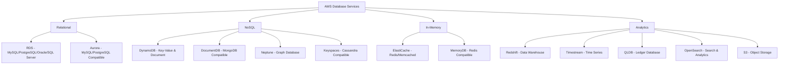
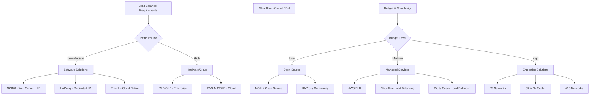
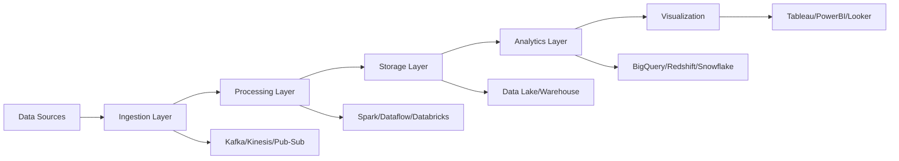
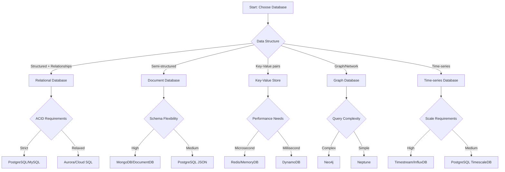
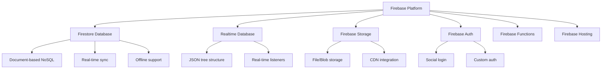
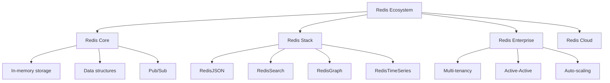
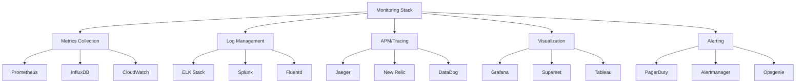
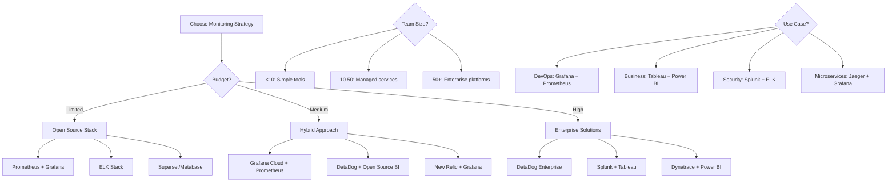

# Database & Provider Selection Guide

A comprehensive decision-making guide for choosing the right database technology and cloud providers for backend system design.

## 📋 Table of Contents

- [Database Selection Framework](#database-selection-framework)
- [Database Types & Use Cases](#database-types--use-cases)
- [Cloud Provider Database Services](#cloud-provider-database-services)
- [Load Balancer Provider Comparison](#load-balancer-provider-comparison)
- [Analytics & Data Pipeline Providers](#analytics--data-pipeline-providers)
- [Decision Making Frameworks](#decision-making-frameworks)
- [Cost Comparison Tables](#cost-comparison-tables)
- [Provider Selection Matrix](#provider-selection-matrix)

---

## Database Selection Framework

### Core Decision Factors

**• Data Model Requirements**
- **Structured data** → Relational (PostgreSQL, MySQL)
- **Semi-structured data** → Document (MongoDB, DocumentDB)
- **Hierarchical data** → Graph (Neo4j, Neptune)
- **Key-value pairs** → Key-Value (Redis, DynamoDB)
- **Time-based data** → Time-series (InfluxDB, Timestream)
- **Spatial data** → Spatial (PostGIS, Oracle Spatial)

**• Performance Requirements**
- **Microsecond latency** → In-memory (Redis, MemoryDB)
- **Sub-millisecond reads** → Key-value (DynamoDB)
- **Complex queries** → Relational (PostgreSQL)
- **Analytics workloads** → Columnar (Redshift, BigQuery)

**• Scale & Availability**
- **Global scale** → Distributed (DynamoDB, Cassandra)
- **High availability** → Multi-AZ deployments
- **Auto-scaling** → Serverless options
- **Read replicas** → Read-heavy workloads

**• Consistency Requirements**
- **ACID compliance** → Relational databases
- **Eventual consistency** → NoSQL databases
- **Strong consistency** → Traditional SQL

---

## Database Types & Use Cases

### Relational Databases (SQL)

| **Database** | **Best For** | **Examples** | **Providers** |
|--------------|--------------|--------------|---------------|
| **PostgreSQL** | Complex queries, JSON data, extensions | E-commerce, Analytics, Multi-tenant apps | AWS RDS, GCP Cloud SQL, Azure Database |
| **MySQL** | Web applications, Read-heavy workloads | CMS, Blogs, Social platforms | AWS RDS, GCP Cloud SQL, Azure Database |
| **SQL Server** | Enterprise applications, .NET ecosystem | CRM, ERP, Business intelligence | Azure SQL, AWS RDS |
| **Oracle** | Mission-critical enterprise systems | Banking, Finance, Large enterprises | AWS RDS, Oracle Cloud |

**🎯 Use Cases:**
- **Authentication systems** → PostgreSQL/MySQL
- **Financial transactions** → PostgreSQL with ACID
- **Content management** → MySQL
- **Enterprise applications** → SQL Server/Oracle

### NoSQL Databases

#### Document Databases
| **Database** | **Best For** | **Examples** | **Providers** |
|--------------|--------------|--------------|---------------|
| **MongoDB** | Flexible schemas, Rapid development | Content management, Catalogs | MongoDB Atlas, AWS DocumentDB |
| **CouchDB** | Offline-first applications | Mobile apps, Sync scenarios | Apache CouchDB, IBM Cloudant |

#### Key-Value Stores
| **Database** | **Best For** | **Examples** | **Providers** |
|--------------|--------------|--------------|---------------|
| **Redis** | Caching, Session storage, Real-time | Gaming leaderboards, Chat apps | AWS ElastiCache, Redis Cloud |
| **DynamoDB** | Serverless apps, IoT, Gaming | Mobile backends, AdTech | AWS DynamoDB |

#### Graph Databases
| **Database** | **Best For** | **Examples** | **Providers** |
|--------------|--------------|--------------|---------------|
| **Neo4j** | Social networks, Fraud detection | Recommendation engines | Neo4j Aura, AWS Neptune |
| **Amazon Neptune** | Knowledge graphs, Identity graphs | Social platforms, Network analysis | AWS Neptune |

#### Time-Series Databases
| **Database** | **Best For** | **Examples** | **Providers** |
|--------------|--------------|--------------|---------------|
| **InfluxDB** | IoT data, Monitoring metrics | DevOps monitoring, Sensor data | InfluxData Cloud |
| **Timestream** | Real-time analytics | Application metrics, IoT analytics | AWS Timestream |
| **TimescaleDB** | PostgreSQL + Time-series | Hybrid workloads, SQL familiarity | Self-hosted, Timescale Cloud |

#### Wide-Column Databases
| **Database** | **Best For** | **Examples** | **Providers** |
|--------------|--------------|--------------|---------------|
| **Cassandra** | Massive scale, High writes | IoT, Analytics, Log aggregation | DataStax, AWS Keyspaces |
| **HBase** | Big data, Hadoop ecosystem | Real-time read/write, Large tables | Apache HBase, Google Bigtable |

#### Search Databases
| **Database** | **Best For** | **Examples** | **Providers** |
|--------------|--------------|--------------|---------------|
| **Elasticsearch** | Full-text search, Log analysis | Search engines, ELK stack | Elastic Cloud, AWS OpenSearch |
| **Solr** | Enterprise search | Content management, E-commerce | Apache Solr, Self-hosted |

#### Object Storage
| **Database** | **Best For** | **Examples** | **Providers** |
|--------------|--------------|--------------|---------------|
| **Amazon S3** | File storage, Static content | Backups, CDN, Data lakes | AWS S3 |
| **Blob Storage** | Binary data, Media files | Images, Videos, Documents | Azure Blob, GCS |

#### Vector Databases
| **Database** | **Best For** | **Examples** | **Providers** |
|--------------|--------------|--------------|---------------|
| **Pinecone** | AI/ML embeddings | Recommendation systems, RAG | Pinecone Cloud |
| **Weaviate** | Semantic search | Knowledge graphs, AI apps | Weaviate Cloud |
| **Chroma** | Document embeddings | Document search, Q&A systems | Self-hosted, Cloud |

---

## Cloud Provider Database Services

### AWS Database Services



**🔥 Popular Combinations:**
- **Web Applications** → RDS PostgreSQL + ElastiCache Redis
- **Mobile Apps** → DynamoDB + S3 + Cognito
- **Analytics Platform** → Aurora + Redshift + S3
- **IoT Applications** → Timestream + DynamoDB + Lambda

### Google Cloud Database Services

| **Service** | **Type** | **Best For** | **Compatible With** |
|-------------|----------|--------------|-------------------|
| **Cloud SQL** | Relational | Traditional apps | MySQL, PostgreSQL, SQL Server |
| **Cloud Spanner** | NewSQL | Global scale, ACID | Relational with global consistency |
| **Firestore** | Document | Mobile/Web apps | NoSQL document store |
| **Bigtable** | Wide-column | Analytics, IoT | HBase compatible |
| **Memorystore** | In-memory | Caching | Redis, Memcached |
| **Elasticsearch Service** | Search | Full-text search | Elasticsearch compatible |

### Azure Database Services

| **Service** | **Type** | **Best For** | **Compatible With** |
|-------------|----------|--------------|-------------------|
| **Azure SQL Database** | Relational | Enterprise apps | SQL Server |
| **Azure Database for PostgreSQL** | Relational | Open-source apps | PostgreSQL |
| **Cosmos DB** | Multi-model | Globally distributed | MongoDB, Cassandra, Gremlin |
| **Azure Cache for Redis** | In-memory | Caching | Redis |
| **Azure Cognitive Search** | Search | Full-text search | Custom search solution |
| **Azure Blob Storage** | Object Storage | File storage | Binary data, Media files |

---

## Load Balancer Provider Comparison

### Load Balancer Decision Matrix



### Load Balancer Provider Matrix

| **Provider** | **Builder/Company** | **Type** | **State** | **Best For** | **Key Features** |
|--------------|-------------------|----------|-----------|--------------|------------------|
| **NGINX** | Nginx Inc. (F5) | Software | Stateless | Web apps, APIs | HTTP/2, SSL termination, Caching |
| **HAProxy** | HAProxy Technologies | Software | Stateless | High performance | TCP/HTTP, Health checks, Statistics |
| **AWS ALB** | Amazon Web Services | Cloud Service | Stateless | AWS workloads | Auto-scaling, Health checks, SSL |
| **AWS NLB** | Amazon Web Services | Cloud Service | Stateless | Ultra-low latency | Static IP, TCP/UDP support |
| **Cloudflare** | Cloudflare Inc. | Global CDN | Stateless | Global traffic | DDoS protection, WAF, Analytics |
| **F5 BIG-IP** | F5 Networks | Hardware/Virtual | Both | Enterprise | Advanced security, Programmability |
| **DigitalOcean** | DigitalOcean LLC | Cloud Service | Stateless | Simple setup | Easy config, Health checks |
| **Traefik** | Traefik Labs | Software | Stateless | Containers/K8s | Auto-discovery, Let's Encrypt |
| **Envoy Proxy** | CNCF/Lyft | Software | Stateless | Service mesh | API gateway, Observability |
| **Kong** | Kong Inc. | Software | Both | API Gateway | Plugin ecosystem, Rate limiting |
| **Azure Load Balancer** | Microsoft Azure | Cloud Service | Stateless | Azure resources | Basic load balancing |
| **GCP Load Balancer** | Google Cloud | Cloud Service | Stateless | Google Cloud | Global/Regional options |

**🎯 Use Case Mapping:**
- **Startup/SMB** → NGINX + Cloudflare
- **AWS-Heavy** → Application Load Balancer (ALB)
- **High Performance** → HAProxy + Hardware
- **Enterprise Security** → F5 BIG-IP + WAF
- **Global Applications** → Cloudflare + Regional LBs

---

## Analytics & Data Pipeline Providers

### Analytics Pipeline Decision Framework



### Analytics Stack Comparison

| **Component** | **AWS** | **Google Cloud** | **Azure** | **Open Source** |
|---------------|---------|------------------|-----------|------------------|
| **Data Ingestion** | Kinesis, DMS | Pub/Sub, Dataflow | Event Hubs, ADF | Kafka, Fluentd |
| **Stream Processing** | Kinesis Analytics | Dataflow | Stream Analytics | Apache Spark |
| **Data Lake** | S3 + Glue | Cloud Storage + Dataproc | ADLS + Synapse | Hadoop + Spark |
| **Data Warehouse** | Redshift | BigQuery | Synapse Analytics | ClickHouse |
| **ML Platform** | SageMaker | Vertex AI | Azure ML | MLflow, Kubeflow |
| **Visualization** | QuickSight | Looker | Power BI | Grafana, Superset |

**💡 Common Patterns:**
- **Real-time Analytics** → Kafka + Spark + ClickHouse
- **Batch Processing** → S3 + Glue + Redshift
- **ML Pipeline** → Airflow + MLflow + Feature Store
- **Monitoring Stack** → Prometheus + Grafana + AlertManager

---

## Decision Making Frameworks

### Database Selection Decision Tree



### Provider Selection Matrix

#### Cloud Provider Decision Matrix

| **Factor** | **AWS** | **Google Cloud** | **Azure** | **Multi-Cloud** |
|------------|---------|------------------|-----------|-----------------|
| **Market Share** | 🟢 Leader | 🟡 Strong | 🟡 Growing | 🟢 Flexibility |
| **Database Variety** | 🟢 Extensive | 🟢 Strong | 🟡 Good | 🟡 Complex |
| **Global Presence** | 🟢 Worldwide | 🟢 Strong | 🟡 Growing | 🟢 Best coverage |
| **Pricing** | 🟡 Complex | 🟡 Competitive | 🟡 Variable | 🔴 Management overhead |
| **Ecosystem** | 🟢 Mature | 🟡 Growing | 🟡 Integrated | 🟡 Fragmented |
| **Enterprise Support** | 🟢 Excellent | 🟡 Good | 🟢 Strong | 🟡 Varies |

**🎯 Decision Guidelines:**

**Choose AWS if:**
- Need extensive database options
- Already AWS-heavy
- Require mature ecosystem
- Global scale requirements

**Choose Google Cloud if:**
- Analytics/ML focused
- Need BigQuery integration
- Prefer simpler pricing
- Data-driven applications

**Choose Azure if:**
- Microsoft ecosystem
- Enterprise Windows apps
- Hybrid cloud needs
- Strong compliance requirements

**Choose Multi-Cloud if:**
- Avoid vendor lock-in
- Geographic requirements
- Risk mitigation
- Best-of-breed approach

---

## Provider Selection Matrix

### Startup/SMB Selection Guide

**👶 Early Stage (MVP, <10K users)**
```
Database: PostgreSQL (DigitalOcean/Supabase)
Cache: Redis (ElastiCache/DigitalOcean)
Load Balancer: DigitalOcean LB
CDN: Cloudflare Free
Analytics: PostHog/Mixpanel
Monitoring: Grafana Cloud
```

**🚀 Growth Stage (Scaling, 10K-100K users)**
```
Database: AWS RDS/Aurora
Cache: ElastiCache Redis
Load Balancer: AWS ALB
CDN: CloudFront
Analytics: AWS QuickSight
Monitoring: DataDog/New Relic
```

### Enterprise Selection Guide

**🏢 Enterprise (100K+ users, Compliance)**
```
Database: Aurora/Azure SQL + Read Replicas
Cache: Redis Cluster
Load Balancer: F5 BIG-IP/AWS ALB
CDN: CloudFront/Azure CDN
Analytics: Snowflake/BigQuery
Monitoring: Splunk/Datadog
Security: WAF + DDoS Protection
```

---

## Amazon AWS Complete Service Guide

### 🟠 AWS Database & Storage Services with Cross-Provider Equivalents

#### Relational Databases
| **AWS Service** | **Use Case** | **When to Use** | **Google Cloud Equivalent** | **Azure Equivalent** | **Other Options** |
|-----------------|--------------|------------------|----------------------------|---------------------|-------------------|
| **RDS MySQL** | Web applications, CMS | Standard web apps, WordPress | Cloud SQL for MySQL | Azure Database for MySQL | DigitalOcean MySQL |
| **RDS PostgreSQL** | Complex queries, JSON data | E-commerce, Analytics apps | Cloud SQL for PostgreSQL | Azure Database for PostgreSQL | Supabase, Neon |
| **Aurora MySQL** | High-performance MySQL | Gaming, Social media | Cloud Spanner (partial) | Azure SQL Database | PlanetScale |
| **Aurora PostgreSQL** | High-performance PostgreSQL | Large-scale web apps | Cloud Spanner (partial) | Azure SQL Database | Self-hosted |
| **RDS Oracle** | Enterprise applications | Legacy Oracle systems | None (Oracle Cloud) | None (Oracle Cloud) | Oracle Cloud |
| **RDS SQL Server** | Microsoft ecosystem | .NET applications | None | Azure SQL Database | Self-hosted |

#### NoSQL Databases
| **AWS Service** | **Use Case** | **When to Use** | **Google Cloud Equivalent** | **Azure Equivalent** | **Other Options** |
|-----------------|--------------|------------------|----------------------------|---------------------|-------------------|
| **DynamoDB** | Serverless apps, IoT | Mobile backends, Gaming | Firestore | Cosmos DB | MongoDB Atlas |
| **DocumentDB** | MongoDB workloads | Content management | Firestore | Cosmos DB (MongoDB API) | MongoDB Atlas |
| **Neptune** | Graph databases | Social networks, Fraud detection | None | Cosmos DB (Gremlin API) | Neo4j Aura |
| **Keyspaces** | Cassandra workloads | IoT, Time-series data | Bigtable | Cosmos DB (Cassandra API) | DataStax Astra |

#### Caching & In-Memory
| **AWS Service** | **Use Case** | **When to Use** | **Google Cloud Equivalent** | **Azure Equivalent** | **Other Options** |
|-----------------|--------------|------------------|----------------------------|---------------------|-------------------|
| **ElastiCache Redis** | Session storage, Caching | Real-time apps, Gaming | Memorystore for Redis | Azure Cache for Redis | Redis Cloud |
| **ElastiCache Memcached** | Simple caching | Web application caching | Memorystore for Memcached | None | Self-hosted |
| **MemoryDB** | Persistent in-memory DB | Microsecond latency apps | None | None | Redis Enterprise |

#### Analytics & Search
| **AWS Service** | **Use Case** | **When to Use** | **Google Cloud Equivalent** | **Azure Equivalent** | **Other Options** |
|-----------------|--------------|------------------|----------------------------|---------------------|-------------------|
| **Redshift** | Data warehousing | Business intelligence | BigQuery | Synapse Analytics | Snowflake |
| **OpenSearch** | Full-text search, Logs | Search engines, ELK stack | Elasticsearch Service | Azure Cognitive Search | Elastic Cloud |
| **Timestream** | Time-series data | IoT analytics, Monitoring | None | None | InfluxDB Cloud |
| **QuickSight** | Business intelligence | Dashboards, Reports | Looker Studio | Power BI | Tableau |

#### Object Storage & Files
| **AWS Service** | **Use Case** | **When to Use** | **Google Cloud Equivalent** | **Azure Equivalent** | **Other Options** |
|-----------------|--------------|------------------|----------------------------|---------------------|-------------------|
| **S3** | Object storage | Backups, Static content, Data lakes | Cloud Storage | Azure Blob Storage | Backblaze B2 |
| **EFS** | Network file system | Shared file storage | Filestore | Azure Files | Self-hosted NFS |
| **FSx** | High-performance file systems | HPC, Video processing | None | Azure NetApp Files | Self-hosted |

#### Specialized Databases
| **AWS Service** | **Use Case** | **When to Use** | **Google Cloud Equivalent** | **Azure Equivalent** | **Other Options** |
|-----------------|--------------|------------------|----------------------------|---------------------|-------------------|
| **QLDB** | Ledger database | Audit trails, Blockchain | None | None | Hyperledger |
| **Athena** | Serverless analytics | Query S3 data | BigQuery | Synapse Serverless | Presto/Trino |
| **Glue** | ETL service | Data transformation | Dataflow | Data Factory | Apache Airflow |

### 📊 AWS Analytics & Data Pipeline Services

#### Data Ingestion
| **AWS Service** | **Use Case** | **When to Use** | **Google Cloud Equivalent** | **Azure Equivalent** | **Other Options** |
|-----------------|--------------|------------------|----------------------------|---------------------|-------------------|
| **Kinesis Data Streams** | Real-time data streaming | IoT data, Log streaming | Pub/Sub | Event Hubs | Apache Kafka |
| **Kinesis Data Firehose** | Data delivery to storage | S3, Redshift delivery | Dataflow | Stream Analytics | Confluent |
| **Data Migration Service** | Database migration | AWS cloud migration | Database Migration Service | Azure DMS | Self-hosted tools |

#### Data Processing
| **AWS Service** | **Use Case** | **When to Use** | **Google Cloud Equivalent** | **Azure Equivalent** | **Other Options** |
|-----------------|--------------|------------------|----------------------------|---------------------|-------------------|
| **EMR** | Big data processing | Spark, Hadoop workloads | Dataproc | HDInsight | Databricks |
| **Glue** | Serverless ETL | Data transformation | Dataflow | Data Factory | Apache Airflow |
| **Batch** | Batch computing | Large-scale processing | None | Azure Batch | Kubernetes Jobs |

### 🔧 AWS Compute & Infrastructure Services

#### Load Balancers
| **AWS Service** | **Use Case** | **When to Use** | **Google Cloud Equivalent** | **Azure Equivalent** | **Other Options** |
|-----------------|--------------|------------------|----------------------------|---------------------|-------------------|
| **Application Load Balancer** | HTTP/HTTPS traffic | Web applications | HTTP(S) Load Balancer | Application Gateway | NGINX, HAProxy |
| **Network Load Balancer** | TCP/UDP traffic | High performance, Gaming | TCP/UDP Load Balancer | Azure Load Balancer | HAProxy, F5 |
| **Classic Load Balancer** | Legacy applications | Simple load balancing | None (Legacy) | None (Legacy) | NGINX |

#### Content Delivery
| **AWS Service** | **Use Case** | **When to Use** | **Google Cloud Equivalent** | **Azure Equivalent** | **Other Options** |
|-----------------|--------------|------------------|----------------------------|---------------------|-------------------|
| **CloudFront** | Global CDN | Static content delivery | Cloud CDN | Azure CDN | Cloudflare |
| **Global Accelerator** | Global traffic management | Low latency routing | None | Front Door | Cloudflare |

### 🔍 AWS Monitoring & Observability

| **AWS Service** | **Use Case** | **When to Use** | **Google Cloud Equivalent** | **Azure Equivalent** | **Other Options** |
|-----------------|--------------|------------------|----------------------------|---------------------|-------------------|
| **CloudWatch** | Monitoring & Alerting | Application monitoring | Cloud Monitoring | Azure Monitor | DataDog, New Relic |
| **X-Ray** | Distributed tracing | Microservices debugging | Cloud Trace | Application Insights | Jaeger, Zipkin |
| **CloudTrail** | Audit logging | Compliance, Security | Cloud Audit Logs | Activity Log | Self-hosted logging |

### 🎯 AWS Quick Decision Matrix

#### **For Startups (Simple & Cost-Effective)**
```
✅ RDS PostgreSQL (managed database)
✅ ElastiCache Redis (caching)
✅ S3 (file storage)
✅ CloudFront (CDN)
✅ Application Load Balancer (traffic distribution)
```

#### **For Scale-Ups (Performance & Growth)**
```
✅ Aurora PostgreSQL (high performance)
✅ DynamoDB (serverless NoSQL)
✅ OpenSearch (search & analytics)
✅ Kinesis (real-time data)
✅ ElastiCache Redis Cluster (distributed cache)
```

#### **For Enterprises (Full Stack)**
```
✅ Aurora + RDS Multi-AZ (high availability)
✅ Redshift (data warehouse)
✅ Neptune (graph analytics)
✅ EMR (big data processing)
✅ Multiple load balancers (resilience)
✅ CloudWatch + X-Ray (full observability)
```

### 💡 AWS Service Selection Guidelines

**Choose AWS RDS when:**
- Need managed relational database
- Want automatic backups & patches
- Require read replicas
- Standard MySQL/PostgreSQL workloads

**Choose AWS Aurora when:**
- Need high performance
- Global scale requirements
- Serverless scaling needed
- MySQL/PostgreSQL compatibility

**Choose DynamoDB when:**
- Building serverless applications
- Need single-digit millisecond latency
- Unpredictable traffic patterns
- Key-value or document data model

**Choose OpenSearch when:**
- Need full-text search
- Log analysis requirements
- Real-time analytics
- Elasticsearch compatibility

**Choose S3 when:**
- Static file storage
- Data archiving
- Content distribution
- Data lake foundations

### Decision Checklist

**✅ Pre-Selection Checklist:**

**Technical Requirements:**
- [ ] Data model identified (relational/document/graph)
- [ ] Performance requirements defined (latency/throughput)
- [ ] Scaling requirements determined (horizontal/vertical)
- [ ] Availability requirements set (SLA/RTO/RPO)
- [ ] Security requirements documented (compliance/encryption)

**Operational Requirements:**
- [ ] Team expertise assessed
- [ ] Support level requirements defined
- [ ] Monitoring and alerting strategy planned
- [ ] Backup and disaster recovery planned
- [ ] Cost budget established

**Strategic Requirements:**
- [ ] Vendor lock-in tolerance determined
- [ ] Multi-cloud strategy defined
- [ ] Migration path planned
- [ ] Future growth projected
- [ ] Integration requirements mapped

---

## Quick Reference Cards

### Database Quick Selector

**Need suggestions? Use this quick decision matrix:**

| **If you need...** | **Then choose...** | **Provider options** |
|---------------------|---------------------|----------------------|
| **Fast MVP** | PostgreSQL | Supabase, Neon, Railway |
| **Global scale** | DynamoDB/Firestore | AWS, Google Cloud |
| **Analytics** | BigQuery/Redshift | Google Cloud, AWS |
| **Real-time** | Redis/MemoryDB | AWS, Redis Cloud |
| **Complex relationships** | PostgreSQL/Neo4j | AWS RDS, Neo4j Aura |
| **Full-text search** | Elasticsearch | AWS OpenSearch, Elastic Cloud |
| **Time-series data** | InfluxDB/Timestream | InfluxData, AWS |

### Load Balancer Quick Selector

| **If you need...** | **Then choose...** | **Why** |
|---------------------|---------------------|---------|
| **Simple web app** | Cloudflare + NGINX | Cost-effective, global |
| **AWS-native** | Application Load Balancer | Native integration |
| **High performance** | HAProxy | Maximum throughput |
| **Enterprise features** | F5 BIG-IP | Advanced security, programmability |
| **Container workloads** | Traefik/Istio | Cloud-native features |

---

## Firebase vs Redis: Storage & Use Case Guide

### Firebase Ecosystem Overview



### Redis Ecosystem Overview



### Firebase vs Redis Comparison

| **Aspect** | **Firebase** | **Redis** |
|------------|--------------|-----------|
| **Primary Use** | Full-stack app development | Caching & session storage |
| **Data Model** | Document/JSON | Key-Value + Data structures |
| **Real-time** | Built-in real-time sync | Pub/Sub messaging |
| **Offline Support** | Native offline sync | No offline support |
| **Scalability** | Auto-scaling | Manual scaling/clustering |
| **Authentication** | Built-in Auth service | No auth (external needed) |
| **File Storage** | Firebase Storage (GCS) | No file storage |
| **Pricing Model** | Pay-as-you-go | Instance-based |
| **Learning Curve** | Low (integrated) | Medium (requires setup) |
| **Vendor Lock-in** | High (Google) | Low (open source) |

### When to Use Firebase

#### ✅ **Perfect For:**
- **Rapid prototyping** → Full backend in minutes
- **Real-time applications** → Chat, collaborative editing
- **Mobile apps** → Native SDKs, offline sync
- **Small to medium apps** → <100K active users
- **Serverless architecture** → No server management
- **Social features** → User auth, social login

#### 🎯 **Use Cases:**
```
• Chat applications (Firestore + Real-time sync)
• Social media apps (Auth + Storage + Database)
• Collaborative tools (Real-time document editing)
• Mobile games (User profiles + leaderboards)
• Event booking apps (Real-time availability)
• Food delivery apps (Real-time tracking)
```

#### 📊 **Firebase Service Selection:**

| **Service** | **Use Case** | **Alternative** |
|-------------|--------------|-----------------|
| **Firestore** | Primary database | MongoDB, DynamoDB |
| **Realtime Database** | Simple real-time data | Socket.io + Redis |
| **Firebase Auth** | User authentication | Auth0, Cognito |
| **Firebase Storage** | File uploads | AWS S3, Cloudinary |
| **Cloud Functions** | Serverless backend | AWS Lambda, Vercel |
| **Firebase Hosting** | Static site hosting | Netlify, Vercel |

### When to Use Redis

#### ✅ **Perfect For:**
- **Caching layer** → Reduce database load
- **Session storage** → User sessions, shopping carts
- **Real-time features** → Live notifications, chat
- **Rate limiting** → API throttling, DDoS protection
- **Leaderboards** → Gaming, competitions
- **Analytics** → Real-time counters, metrics

#### 🎯 **Use Cases:**
```
• Session management (User login state)
• Application caching (Database query results)
• Rate limiting (API request counting)
• Real-time analytics (Page views, user activity)
• Message queues (Job processing)
• Geospatial data (Location-based services)
```

#### 📊 **Redis Data Structure Use Cases:**

| **Data Structure** | **Use Case** | **Example** |
|-------------------|--------------|-------------|
| **String** | Caching, Counters | Page cache, View counts |
| **Hash** | User sessions, Objects | User profile data |
| **List** | Message queues, Logs | Chat messages, Activity feed |
| **Set** | Unique items, Tags | User followers, Product tags |
| **Sorted Set** | Leaderboards, Rankings | Game scores, Popular posts |
| **Bitmap** | User activity tracking | Daily active users |
| **HyperLogLog** | Unique count estimation | Unique page visitors |
| **Geospatial** | Location services | Nearby restaurants |

### Architecture Patterns

#### Firebase-First Architecture
```
Frontend (React/Flutter) 
    ↓
Firebase SDK
    ↓
Firestore (Primary DB) + Firebase Auth + Firebase Storage
    ↓
Cloud Functions (Backend logic)
    ↓
External APIs (Payments, Email)
```

#### Redis-Enhanced Architecture
```
Frontend (React/Vue)
    ↓
API Gateway/Load Balancer
    ↓
Application Server (Node.js/Python)
    ↓
Redis (Cache/Sessions) + PostgreSQL (Primary DB)
    ↓
Background Jobs (Redis Queue)
```

### Migration Scenarios

#### From Firebase to Traditional Stack
```
Firestore → PostgreSQL/MongoDB
Firebase Auth → Auth0/Passport.js
Firebase Storage → AWS S3/Cloudinary
Cloud Functions → Express.js/FastAPI
Firebase Hosting → Vercel/Netlify
```

#### Adding Redis to Existing Stack
```
Database queries → Redis caching layer
User sessions → Redis session store
Real-time features → Redis Pub/Sub
Background jobs → Redis Bull/RQ
Rate limiting → Redis counters
```

### Provider Comparison

#### Firebase Alternatives by Provider

| **Feature** | **Firebase** | **AWS** | **Azure** | **GCP** |
|-------------|--------------|---------|-----------|---------|
| **Database** | Firestore | DynamoDB | Cosmos DB | Firestore (same) |
| **Auth** | Firebase Auth | Cognito | AD B2C | Firebase Auth |
| **Storage** | Firebase Storage | S3 | Blob Storage | Cloud Storage |
| **Functions** | Cloud Functions | Lambda | Functions | Cloud Functions |
| **Real-time** | Real-time DB | AppSync | SignalR | Firestore real-time |

#### Redis Alternatives by Provider

| **Provider** | **Service** | **Features** | **Use Case** |
|--------------|-------------|--------------|--------------|
| **AWS** | ElastiCache | Redis/Memcached | Caching, Sessions |
| **Azure** | Cache for Redis | Redis compatible | Caching, Pub/Sub |
| **GCP** | Memorystore | Redis/Memcached | Caching, Analytics |
| **DigitalOcean** | Managed Redis | Redis cluster | Simple caching |
| **Upstash** | Serverless Redis | HTTP-based Redis | Edge caching |
| **Redis Labs** | Redis Enterprise | Advanced features | Enterprise usage |

---

## Monitoring & Observability Tools Guide

### Monitoring Stack Overview



### Monitoring Tools Comparison

| **Tool** | **Provider/Builder** | **Type** | **Best For** | **Pricing** | **Key Features** |
|----------|---------------------|----------|--------------|-------------|------------------|
| **Grafana** | Grafana Labs | Visualization | Dashboards, Metrics | Open Source/Cloud | Multi-datasource, Alerting |
| **Superset** | Apache Foundation | BI/Analytics | Business Intelligence | Open Source | SQL Lab, Rich visualizations |
| **Prometheus** | CNCF/SoundCloud | Metrics | Time-series monitoring | Open Source | Pull-based, Service discovery |
| **Jaeger** | CNCF/Uber | Distributed Tracing | Microservices tracing | Open Source | OpenTracing, Performance |
| **DataDog** | Datadog Inc. | Full Observability | All-in-one monitoring | SaaS | APM, Logs, Infrastructure |
| **New Relic** | New Relic Inc. | APM | Application monitoring | SaaS | Code-level insights, AI |
| **Sentry** | Sentry Inc. | Error Tracking | Error monitoring, Performance | SaaS/Self-hosted | Real-time error tracking, Release tracking |
| **Splunk** | Splunk Inc. | Log Management | Enterprise logging | License/Cloud | Machine data analytics |
| **Elastic Stack** | Elastic N.V. | Search/Analytics | Log analysis, Search | Open Source/Cloud | ELK (Elasticsearch, Logstash, Kibana) |
| **Tableau** | Salesforce | Business Intelligence | Data visualization | License | Advanced analytics |
| **Power BI** | Microsoft | Business Intelligence | Enterprise BI | Subscription | Office 365 integration |
| **Looker** | Google Cloud | Business Intelligence | Data platform | SaaS | LookML, Embedded analytics |
| **Metabase** | Metabase Inc. | Business Intelligence | Simple BI | Open Source/Cloud | Easy setup, SQL queries |

### Use Case-Based Tool Selection

#### Metrics & Time-Series Monitoring

| **Tool** | **Provider** | **Best For** | **Integration** | **Scalability** |
|----------|--------------|--------------|-----------------|-----------------|
| **Prometheus + Grafana** | CNCF + Grafana Labs | Kubernetes, Microservices | Native K8s support | High (federation) |
| **InfluxDB + Grafana** | InfluxData + Grafana Labs | IoT, Time-series data | TICK stack | Very High |
| **CloudWatch** | AWS | AWS infrastructure | Native AWS services | Auto-scaling |
| **Azure Monitor** | Microsoft | Azure resources | Native Azure integration | Auto-scaling |
| **Google Monitoring** | Google Cloud | GCP resources | Native GCP integration | Auto-scaling |

#### Application Performance Monitoring (APM)

| **Tool** | **Provider** | **Strength** | **Language Support** | **Best For** |
|----------|--------------|--------------|---------------------|--------------|
| **New Relic** | New Relic Inc. | Code-level insights | 10+ languages | Full-stack visibility |
| **DataDog APM** | Datadog Inc. | Unified platform | 15+ languages | DevOps teams |
| **Sentry** | Sentry Inc. | Error tracking & Performance | 20+ languages | Error monitoring, Issue tracking |
| **AppDynamics** | Cisco | Business impact | Java, .NET focus | Enterprise apps |
| **Dynatrace** | Dynatrace Inc. | AI-powered | Auto-discovery | Complex environments |
| **Elastic APM** | Elastic N.V. | Open source | Multiple languages | Cost-conscious teams |
| **Jaeger** | CNCF/Uber | Distributed tracing | OpenTelemetry | Microservices |
| **Zipkin** | Apache Foundation | Simple tracing | Multiple languages | Lightweight setups |

#### Log Management & Analysis

| **Tool** | **Provider** | **Strength** | **Best For** | **Cost Model** |
|----------|--------------|--------------|--------------|----------------|
| **ELK Stack** | Elastic N.V. | Search & analytics | Log analysis, Security | Open Source/Cloud |
| **Splunk** | Splunk Inc. | Machine data analytics | Enterprise security | Data volume-based |
| **Fluentd + Grafana Loki** | CNCF + Grafana Labs | Cloud-native logging | Kubernetes environments | Open Source |
| **AWS CloudWatch Logs** | Amazon | AWS integration | AWS workloads | Pay-per-GB |
| **Azure Log Analytics** | Microsoft | Azure integration | Azure workloads | Pay-per-GB |
| **Google Cloud Logging** | Google | GCP integration | GCP workloads | Pay-per-GB |
| **Papertrail** | SolarWinds | Simple log management | Small to medium apps | Log volume-based |

#### Business Intelligence & Analytics

| **Tool** | **Provider** | **Strength** | **Best For** | **User Type** |
|----------|--------------|--------------|--------------|---------------|
| **Apache Superset** | Apache Foundation | Open source BI | Data teams, Startups | Technical users |
| **Grafana** | Grafana Labs | Operational dashboards | DevOps, SRE teams | Technical users |
| **Tableau** | Salesforce | Advanced visualizations | Enterprise analytics | Business analysts |
| **Power BI** | Microsoft | Office integration | Microsoft environments | Business users |
| **Looker** | Google Cloud | Data modeling | Data-driven orgs | Business + Technical |
| **Metabase** | Metabase Inc. | Ease of use | Small teams, Quick insights | Non-technical users |
| **Sisense** | Sisense Inc. | Complex data prep | Large datasets | Data analysts |
| **Qlik Sense** | QlikTech | Associative model | Interactive exploration | Business analysts |

### Monitoring Stack Combinations

#### Startup/Small Team Stack
```
Metrics: Prometheus + Grafana (Free)
Logs: ELK Stack (Self-hosted)
APM: Elastic APM (Open source)
Error Tracking: Sentry (Free tier)
Alerting: Grafana Alerting
BI: Superset/Metabase (Open source)
```

#### Mid-Size Company Stack
```
Metrics: DataDog/New Relic
Logs: DataDog/Splunk Cloud
APM: DataDog/New Relic
Error Tracking: Sentry Pro
Alerting: PagerDuty
BI: Looker/Tableau
```

#### Enterprise Stack
```
Metrics: Prometheus + Grafana Enterprise
Logs: Splunk Enterprise
APM: Dynatrace/AppDynamics
Error Tracking: Sentry Enterprise
Alerting: Opsgenie/PagerDuty
BI: Tableau/Power BI
Security: Splunk SIEM
```

#### Cloud-Native Stack
```
Metrics: Prometheus + Grafana Cloud
Logs: Grafana Loki
APM: Jaeger + OpenTelemetry
Error Tracking: Sentry
Alerting: Alertmanager
BI: Superset
Service Mesh: Istio observability
```

### Decision Framework for Monitoring Tools



### Provider Ecosystem Comparison

#### Grafana Ecosystem (Grafana Labs)
```
• Grafana OSS (Visualization) - Free
• Grafana Cloud (Hosted) - Paid
• Grafana Enterprise (On-prem) - Paid
• Grafana Loki (Logs) - Free
• Grafana Tempo (Tracing) - Free
• Grafana Mimir (Metrics) - Free
• Grafana OnCall (Alerting) - Paid
```

#### Elastic Ecosystem (Elastic N.V.)
```
• Elasticsearch (Search) - Free/Paid
• Kibana (Visualization) - Free/Paid
• Logstash (Log processing) - Free
• Beats (Data shippers) - Free
• Elastic APM (Application monitoring) - Free/Paid
• Elastic Security (SIEM) - Paid
• Elastic Cloud (Hosted) - Paid
```

#### DataDog Ecosystem (Datadog Inc.)
```
• Infrastructure Monitoring - Paid
• APM & Distributed Tracing - Paid
• Log Management - Paid
• Synthetic Monitoring - Paid
• Real User Monitoring - Paid
• Security Monitoring - Paid
• Network Monitoring - Paid
```

#### Cloud Provider Native Tools

| **Provider** | **Metrics** | **Logs** | **APM** | **BI** | **Alerting** |
|--------------|-------------|----------|---------|--------|--------------|
| **AWS** | CloudWatch | CloudWatch Logs | X-Ray | QuickSight | CloudWatch Alarms |
| **Azure** | Azure Monitor | Log Analytics | Application Insights | Power BI | Azure Alerts |
| **GCP** | Cloud Monitoring | Cloud Logging | Cloud Trace | Looker Studio | Cloud Alerting |

### Quick Selection Guide

#### If you need **Real-time Dashboards**:
- **Technical teams** → Grafana + Prometheus
- **Business teams** → Tableau/Power BI
- **Mixed teams** → Superset + Grafana

#### If you need **Log Analysis**:
- **Security focus** → Splunk
- **Cost-conscious** → ELK Stack
- **Cloud-native** → Grafana Loki

#### If you need **Application Monitoring**:
- **Startup** → Elastic APM + Sentry (Free)
- **Growth stage** → DataDog/New Relic + Sentry Pro
- **Enterprise** → Dynatrace/AppDynamics + Sentry Enterprise

#### If you need **Error Tracking**:
- **Any stage** → Sentry (Best-in-class error tracking)
- **Alternative** → Rollbar, Bugsnag
- **Self-hosted** → Sentry self-hosted

#### If you need **Business Intelligence**:
- **Technical users** → Superset
- **Business users** → Tableau/Power BI
- **Budget-conscious** → Metabase

---

**💡 Remember:** The "best" choice depends on your specific requirements, team expertise, budget, and growth plans. Start simple, measure performance, and optimize based on actual usage patterns.

**🚨 Key Takeaway:** Don't over-engineer for hypothetical scale. Choose technologies that solve your current problems and can grow with you.