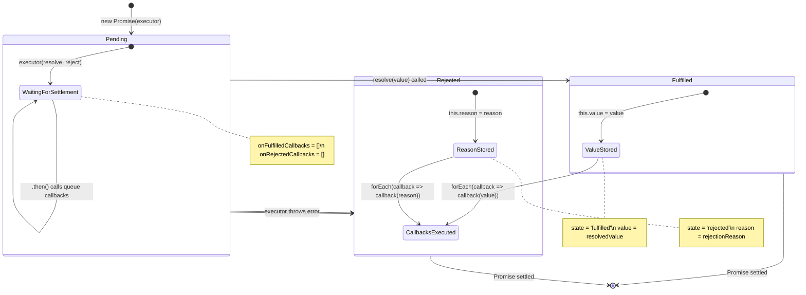

# Promise Implementation ⭐

## Table of Contents
- [Problem Statement](#problem-statement)
- [Core Implementation](#core-implementation)
  - [Basic Promise Implementation](#basic-promise-implementation)
  - [Full Promise Implementation](#full-promise-implementation)
  - [Static Methods](#static-methods)
- [Advanced Features](#advanced-features)
  - [Promise with Timeout](#promise-with-timeout)
  - [Promise with Cancellation](#promise-with-cancellation)
  - [Promise Pool](#promise-pool)
- [Complexity Analysis](#complexity-analysis)
- [Testing](#testing)
- [Usage & Applications](#usage--applications)
  - [React Component Integration](#react-component-integration)
  - [Progressive Image Loading](#progressive-image-loading)
  - [API Retry Logic](#api-retry-logic)
  - [Loading State Management](#loading-state-management)
- [Visual Diagrams](#visual-diagrams)
- [Interview Tips](#interview-tips)
- [Key Takeaways](#key-takeaways)

---

## Problem Statement

Implement a Promise class from scratch that follows the Promises/A+ specification with proper state management and chaining.

## Quick Start Example

```javascript
// 1. Basic Promise usage
const myPromise = new MyPromise((resolve, reject) => {
    setTimeout(() => {
        const success = Math.random() > 0.5;
        if (success) {
            resolve('Success!');
        } else {
            reject(new Error('Failed!'));
        }
    }, 1000);
});

myPromise
    .then(result => {
        console.log('Result:', result);
        return result.toUpperCase();
    })
    .then(upper => {
        console.log('Uppercase:', upper);
    })
    .catch(error => {
        console.error('Error:', error.message);
    })
    .finally(() => {
        console.log('Cleanup');
    });

// 2. Simple Promise implementation
class MyPromise {
    constructor(executor) {
        this.state = 'PENDING';
        this.value = undefined;
        this.handlers = [];
        
        const resolve = (value) => {
            if (this.state === 'PENDING') {
                this.state = 'FULFILLED';
                this.value = value;
                this.handlers.forEach(handler => this.handle(handler));
            }
        };
        
        const reject = (reason) => {
            if (this.state === 'PENDING') {
                this.state = 'REJECTED';
                this.value = reason;
                this.handlers.forEach(handler => this.handle(handler));
            }
        };
        
        try {
            executor(resolve, reject);
        } catch (error) {
            reject(error);
        }
    }
    
    then(onFulfilled, onRejected) {
        return new MyPromise((resolve, reject) => {
            this.handle({
                onFulfilled: onFulfilled || null,
                onRejected: onRejected || null,
                resolve,
                reject
            });
        });
    }
    
    handle(handler) {
        if (this.state === 'PENDING') {
            this.handlers.push(handler);
        } else {
            setTimeout(() => {
                if (this.state === 'FULFILLED') {
                    if (handler.onFulfilled) {
                        try {
                            const result = handler.onFulfilled(this.value);
                            handler.resolve(result);
                        } catch (error) {
                            handler.reject(error);
                        }
                    } else {
                        handler.resolve(this.value);
                    }
                } else {
                    if (handler.onRejected) {
                        try {
                            const result = handler.onRejected(this.value);
                            handler.resolve(result);
                        } catch (error) {
                            handler.reject(error);
                        }
                    } else {
                        handler.reject(this.value);
                    }
                }
            }, 0);
        }
    }
}

// 3. Promise.all implementation
MyPromise.all = function(promises) {
    return new MyPromise((resolve, reject) => {
        const results = [];
        let completed = 0;
        
        if (promises.length === 0) {
            resolve(results);
            return;
        }
        
        promises.forEach((promise, index) => {
            MyPromise.resolve(promise).then(
                value => {
                    results[index] = value;
                    completed++;
                    if (completed === promises.length) {
                        resolve(results);
                    }
                },
                reject
            );
        });
    });
};

// 4. Usage with async/await pattern
async function fetchUserData() {
    try {
        const userData = await myPromise;
        const processedData = await processUser(userData);
        return processedData;
    } catch (error) {
        console.error('Failed to fetch user:', error);
        throw error;
    }
}
```

[⬆️ Back to Table of Contents](#table-of-contents)

---

## Core Implementation

### Basic Promise Implementation

```javascript
class BasicPromise {
    constructor(executor) {
        // Track the current state of the promise: 'pending', 'fulfilled', or 'rejected'
        // Promises start in 'pending' state and can only transition once
        this.state = 'pending';
        
        // Store the resolved value when promise is fulfilled
        // Only set when state becomes 'fulfilled'
        this.value = undefined;
        
        // Store the rejection reason when promise is rejected
        // Only set when state becomes 'rejected'
        this.reason = undefined;
        
        // Array to store callbacks that should run when promise is fulfilled
        // These are .then() handlers that were registered while promise was still pending
        this.onFulfilledCallbacks = [];
        
        // Array to store callbacks that should run when promise is rejected
        // These are .catch() handlers that were registered while promise was still pending
        this.onRejectedCallbacks = [];
        
        // Function to transition promise from 'pending' to 'fulfilled' state
        const resolve = (value) => {
            // Only allow state transition if currently pending (promises are immutable after settling)
            if (this.state === 'pending') {
                // Update state to indicate promise has been fulfilled
                this.state = 'fulfilled';
                // Store the resolved value for future .then() calls
                this.value = value;
                // Execute all queued fulfillment callbacks with the resolved value
                this.onFulfilledCallbacks.forEach(callback => callback(value));
            }
        };
        
        // Function to transition promise from 'pending' to 'rejected' state
        const reject = (reason) => {
            // Only allow state transition if currently pending
            if (this.state === 'pending') {
                // Update state to indicate promise has been rejected
                this.state = 'rejected';
                // Store the rejection reason for future .catch() calls
                this.reason = reason;
                // Execute all queued rejection callbacks with the rejection reason
                this.onRejectedCallbacks.forEach(callback => callback(reason));
            }
        };
        
        try {
            // Execute the user-provided function immediately, passing resolve and reject
            // This allows the user to control when the promise settles
            executor(resolve, reject);
        } catch (error) {
            // If executor throws synchronously, automatically reject the promise
            reject(error);
        }
    }
    
    then(onFulfilled, onRejected) {
        // Use switch case for cleaner state handling and better readability
        switch (this.state) {
            case 'fulfilled':
                // Handle case where promise is already fulfilled
                // If a fulfillment handler was provided, call it immediately with the stored value
                if (typeof onFulfilled === 'function') {
                    onFulfilled(this.value);
                }
                break;
                
            case 'rejected':
                // Handle case where promise is already rejected
                // If a rejection handler was provided, call it immediately with the stored reason
                if (typeof onRejected === 'function') {
                    onRejected(this.reason);
                }
                break;
                
            case 'pending':
                // Handle case where promise is still pending
                // Queue the fulfillment handler to be called later when promise resolves
                if (typeof onFulfilled === 'function') {
                    this.onFulfilledCallbacks.push(onFulfilled);
                }
                // Queue the rejection handler to be called later when promise rejects
                if (typeof onRejected === 'function') {
                    this.onRejectedCallbacks.push(onRejected);
                }
                break;
                
            default:
                // This should never happen if promise state is managed correctly
                // But provides a safety net for debugging invalid states
                console.error(`Invalid promise state: ${this.state}`);
                break;
        }
    }
}
```

[⬆️ Back to Table of Contents](#table-of-contents)

### Full Promise Implementation

```javascript
class CustomPromise {
    constructor(executor) {
        // Current state of the promise - starts as 'pending' and transitions to 'fulfilled' or 'rejected'
        // Following Promise/A+ spec, state transitions are irreversible
        this.state = 'pending';
        
        // Value that the promise resolves with when fulfilled
        // Undefined until promise is resolved, then holds the resolved value
        this.value = undefined;
        
        // Reason (error/rejection value) that the promise rejects with
        // Undefined until promise is rejected, then holds the rejection reason
        this.reason = undefined;
        
        // Queue of callbacks to execute when promise is fulfilled
        // Stores objects with {resolve} functions for chained promises
        this.onFulfilledCallbacks = [];
        
        // Queue of callbacks to execute when promise is rejected  
        // Stores objects with {reject} functions for chained promises
        this.onRejectedCallbacks = [];
        
        // Internal resolve function that transitions promise to fulfilled state
        const resolve = (value) => {
            // Prevent multiple resolutions - promises can only settle once
            if (this.state === 'pending') {
                // Handle thenable values (objects/functions with .then method) per Promise/A+ spec
                // This allows resolving with another promise or promise-like object
                if (value && (typeof value === 'object' || typeof value === 'function') && typeof value.then === 'function') {
                    try {
                        // Recursively resolve by calling the thenable's .then method
                        // This flattens nested promises: Promise.resolve(Promise.resolve(42)) -> 42
                        value.then(resolve, reject);
                        return;
                    } catch (error) {
                        // If accessing .then throws, reject with that error
                        reject(error);
                        return;
                    }
                }
                
                // Set state to fulfilled and store the resolved value
                this.state = 'fulfilled';
                this.value = value;
                
                // Execute all queued callbacks asynchronously
                this.executeCallbacks();
            }
        };
        
        // Internal reject function that transitions promise to rejected state
        const reject = (reason) => {
            // Prevent multiple rejections - promises can only settle once
            if (this.state === 'pending') {
                // Set state to rejected and store the rejection reason
                this.state = 'rejected';
                this.reason = reason;
                
                // Execute all queued callbacks asynchronously
                this.executeCallbacks();
            }
        };
        
        try {
            // Execute the user-provided executor function immediately
            // Pass resolve and reject functions so user can control when promise settles
            executor(resolve, reject);
        } catch (error) {
            // If executor throws synchronously, automatically reject the promise
            // This ensures errors don't escape the promise boundary
            reject(error);
        }
    }
    
    executeCallbacks() {
        // Execute callbacks asynchronously using microtask queue
        // This ensures promise callbacks run after current execution stack
        // and maintains proper async behavior per Promise/A+ spec
        this.asyncExecute(() => {
            if (this.state === 'fulfilled') {
                // Execute all queued fulfillment callbacks with the resolved value
                // Each callback.resolve creates a new promise in the chain
                this.onFulfilledCallbacks.forEach(callback => callback.resolve(this.value));
            } else if (this.state === 'rejected') {
                // Execute all queued rejection callbacks with the rejection reason
                // Each callback.reject creates a new promise in the chain
                this.onRejectedCallbacks.forEach(callback => callback.reject(this.reason));
            }
            
            // Clear callbacks after execution to prevent memory leaks
            // Callbacks are one-time use only
            this.onFulfilledCallbacks = [];
            this.onRejectedCallbacks = [];
        });
    }
    
    // Utility method to execute callbacks asynchronously with fallbacks
    // Provides cross-environment compatibility for microtask scheduling
    asyncExecute(callback) {
        if (typeof queueMicrotask === 'function') {
            // Modern browsers - use queueMicrotask for true microtask behavior
            queueMicrotask(callback);
        } else if (typeof Promise !== 'undefined' && Promise.resolve) {
            // Fallback 1: Use Promise.resolve().then() to schedule microtask
            Promise.resolve().then(callback);
        } else if (typeof setImmediate === 'function') {
            // Fallback 2: Node.js environments - setImmediate
            setImmediate(callback);
        } else {
            // Fallback 3: setTimeout as last resort (creates macrotask, not microtask)
            setTimeout(callback, 0);
        }
    }
    
    then(onFulfilled, onRejected) {
        // Return new promise for chaining - this is key to promise chaining
        // Each .then() creates a new promise that depends on the previous one
        return new CustomPromise((resolve, reject) => {
            // Wrapper for handling fulfilled state
            // Executes user's onFulfilled handler and manages the resulting promise
            const handleFulfilled = (value) => {
                try {
                    if (typeof onFulfilled === 'function') {
                        // Execute user's fulfillment handler with the resolved value
                        const result = onFulfilled(value);
                        // Resolve the new promise with whatever the handler returned
                        // This could be a value, promise, or thenable
                        resolve(result);
                    } else {
                        // If no handler provided, pass the value through (promise transparency)
                        resolve(value);
                    }
                } catch (error) {
                    // If handler throws, reject the new promise with that error
                    // This allows errors to propagate through the promise chain
                    reject(error);
                }
            };
            
            // Wrapper for handling rejected state
            // Executes user's onRejected handler and manages the resulting promise
            const handleRejected = (reason) => {
                try {
                    if (typeof onRejected === 'function') {
                        // Execute user's rejection handler with the rejection reason
                        const result = onRejected(reason);
                        // IMPORTANT: resolve (not reject) the new promise with handler result
                        // This allows recovery from rejection by returning a value
                        resolve(result);
                    } else {
                        // If no handler provided, propagate the rejection
                        reject(reason);
                    }
                } catch (error) {
                    // If handler throws, reject the new promise with that error
                    reject(error);
                }
            };
            
            // Handle already fulfilled promise
            if (this.state === 'fulfilled') {
                // Execute handler asynchronously to maintain consistent behavior
                this.asyncExecute(() => handleFulfilled(this.value));
            } 
            // Handle already rejected promise
            else if (this.state === 'rejected') {
                // Execute handler asynchronously to maintain consistent behavior
                this.asyncExecute(() => handleRejected(this.reason));
            } 
            // Handle pending promise - queue callbacks for later execution
            else {
                // Store wrapped handlers to be called when promise settles
                // Using objects with resolve/reject properties for consistent interface
                this.onFulfilledCallbacks.push({ resolve: handleFulfilled });
                this.onRejectedCallbacks.push({ reject: handleRejected });
            }
        });
    }
    
    catch(onRejected) {
        // Syntactic sugar for .then(null, onRejected)
        // Provides cleaner error handling syntax
        return this.then(null, onRejected);
    }
    
    finally(onFinally) {
        // Execute onFinally regardless of promise outcome
        // Always passes through the original value/reason
        return this.then(
            value => {
                // On fulfillment: run finally handler then pass through value
                if (typeof onFinally === 'function') {
                    onFinally();
                }
                return value; // Pass through the original resolved value
            },
            reason => {
                // On rejection: run finally handler then re-throw reason
                if (typeof onFinally === 'function') {
                    onFinally();
                }
                throw reason; // Re-throw the original rejection reason
            }
        );
    }
}
```

[⬆️ Back to Table of Contents](#table-of-contents)

### Static Methods

```javascript
// Static methods for CustomPromise
CustomPromise.resolve = function(value) {
    return new CustomPromise(resolve => resolve(value));
};

CustomPromise.reject = function(reason) {
    return new CustomPromise((_, reject) => reject(reason));
};

CustomPromise.all = function(promises) {
    return new CustomPromise((resolve, reject) => {
        if (!Array.isArray(promises)) {
            reject(new TypeError('Promise.all expects an array'));
            return;
        }
        
        if (promises.length === 0) {
            resolve([]);
            return;
        }
        
        const results = new Array(promises.length);
        let completedCount = 0;
        
        promises.forEach((promise, index) => {
            CustomPromise.resolve(promise)
                .then(value => {
                    results[index] = value;
                    completedCount++;
                    
                    if (completedCount === promises.length) {
                        resolve(results);
                    }
                })
                .catch(reject);
        });
    });
};

CustomPromise.allSettled = function(promises) {
    return new CustomPromise((resolve) => {
        if (!Array.isArray(promises)) {
            resolve([]);
            return;
        }
        
        if (promises.length === 0) {
            resolve([]);
            return;
        }
        
        const results = new Array(promises.length);
        let completedCount = 0;
        
        promises.forEach((promise, index) => {
            CustomPromise.resolve(promise)
                .then(value => {
                    results[index] = { status: 'fulfilled', value };
                })
                .catch(reason => {
                    results[index] = { status: 'rejected', reason };
                })
                .finally(() => {
                    completedCount++;
                    if (completedCount === promises.length) {
                        resolve(results);
                    }
                });
        });
    });
};

CustomPromise.race = function(promises) {
    return new CustomPromise((resolve, reject) => {
        if (!Array.isArray(promises)) {
            reject(new TypeError('Promise.race expects an array'));
            return;
        }
        
        promises.forEach(promise => {
            CustomPromise.resolve(promise)
                .then(resolve)
                .catch(reject);
        });
    });
};

CustomPromise.any = function(promises) {
    return new CustomPromise((resolve, reject) => {
        if (!Array.isArray(promises)) {
            reject(new TypeError('Promise.any expects an array'));
            return;
        }
        
        if (promises.length === 0) {
            reject(new AggregateError([], 'All promises were rejected'));
            return;
        }
        
        const errors = new Array(promises.length);
        let rejectedCount = 0;
        
        promises.forEach((promise, index) => {
            CustomPromise.resolve(promise)
                .then(resolve)
                .catch(reason => {
                    errors[index] = reason;
                    rejectedCount++;
                    
                    if (rejectedCount === promises.length) {
                        reject(new AggregateError(errors, 'All promises were rejected'));
                    }
                });
        });
    });
};
```

[⬆️ Back to Table of Contents](#table-of-contents)

---

## Advanced Features

### Promise with Timeout

```javascript
class TimeoutPromise extends CustomPromise {
    static withTimeout(promise, timeout, timeoutMessage = 'Operation timed out') {
        return CustomPromise.race([
            promise,
            new CustomPromise((_, reject) => {
                setTimeout(() => reject(new Error(timeoutMessage)), timeout);
            })
        ]);
    }
}
```

[⬆️ Back to Table of Contents](#table-of-contents)

### Promise with Cancellation

```javascript
class CancellablePromise extends CustomPromise {
    constructor(executor) {
        let cancel;
        
        super((resolve, reject) => {
            cancel = (reason = 'Cancelled') => {
                reject(new Error(reason));
            };
            
            executor(resolve, reject, cancel);
        });
        
        this.cancel = cancel;
    }
    
    static delay(ms) {
        let timeoutId;
        
        const promise = new CancellablePromise((resolve, reject, cancel) => {
            timeoutId = setTimeout(resolve, ms);
            
            // Override cancel to also clear timeout
            const originalCancel = cancel;
            promise.cancel = (reason) => {
                clearTimeout(timeoutId);
                originalCancel(reason);
            };
        });
        
        return promise;
    }
}
```

[⬆️ Back to Table of Contents](#table-of-contents)

### Promise Pool

```javascript
class PromisePool {
    constructor(concurrency = 3) {
        this.concurrency = concurrency;
        this.running = 0;
        this.queue = [];
    }
    
    add(promiseFunction) {
        return new CustomPromise((resolve, reject) => {
            this.queue.push({
                promiseFunction,
                resolve,
                reject
            });
            
            this.process();
        });
    }
    
    process() {
        if (this.running >= this.concurrency || this.queue.length === 0) {
            return;
        }
        
        this.running++;
        const { promiseFunction, resolve, reject } = this.queue.shift();
        
        promiseFunction()
            .then(resolve)
            .catch(reject)
            .finally(() => {
                this.running--;
                this.process();
            });
    }
    
    async all(promiseFunctions) {
        const promises = promiseFunctions.map(fn => this.add(fn));
        return CustomPromise.all(promises);
    }
}
```

[⬆️ Back to Table of Contents](#table-of-contents)

---

## Complexity Analysis

### Time Complexity
- **Individual Operations**: O(1) for state operations, O(n) for callback execution
- **Static Methods**: O(n) for arrays of promises

### Space Complexity
- **O(n)** for callback storage and result arrays
- **Basic Promise**: Simple implementation, handles basic async operations
- **Full Promise**: Complete Promises/A+ compliance, supports chaining

[⬆️ Back to Table of Contents](#table-of-contents)

---

## Testing

```javascript
function testCustomPromise() {
    const tests = [
        {
            name: 'Basic resolve',
            test: () => {
                return new CustomPromise(resolve => resolve(42))
                    .then(value => {
                        if (value !== 42) throw new Error(`Expected 42, got ${value}`);
                    });
            }
        },
        {
            name: 'Basic reject',
            test: () => {
                return new CustomPromise((_, reject) => reject('error'))
                    .catch(reason => {
                        if (reason !== 'error') throw new Error(`Expected 'error', got ${reason}`);
                    });
            }
        },
        {
            name: 'Chaining',
            test: () => {
                return new CustomPromise(resolve => resolve(1))
                    .then(x => x + 1)
                    .then(x => x * 2)
                    .then(result => {
                        if (result !== 4) throw new Error(`Expected 4, got ${result}`);
                    });
            }
        },
        {
            name: 'Error handling in chain',
            test: () => {
                return new CustomPromise(resolve => resolve(1))
                    .then(() => { throw new Error('test error'); })
                    .catch(error => {
                        if (error.message !== 'test error') {
                            throw new Error(`Expected 'test error', got ${error.message}`);
                        }
                        return 'recovered';
                    })
                    .then(result => {
                        if (result !== 'recovered') {
                            throw new Error(`Expected 'recovered', got ${result}`);
                        }
                    });
            }
        }
    ];
    
    // Run all tests
    const runTests = async () => {
        console.log('Running CustomPromise tests...\n');
        
        for (const { name, test } of tests) {
            try {
                await test();
                console.log(`✓ ${name}`);
            } catch (error) {
                console.error(`✗ ${name}: ${error.message}`);
            }
        }
    };
    
    return runTests();
}

testCustomPromise();
```

[⬆️ Back to Table of Contents](#table-of-contents)

---

## Usage & Applications

### React Component Integration

```javascript
// Custom hook using promise implementation
function useAsyncData(asyncFunction, dependencies = []) {
    const [state, setState] = useState({
        data: null,
        loading: true,
        error: null
    });
    
    useEffect(() => {
        setState(prev => ({ ...prev, loading: true, error: null }));
        
        const promise = new CustomPromise((resolve, reject) => {
            asyncFunction().then(resolve).catch(reject);
        });
        
        promise
            .then(data => {
                setState({ data, loading: false, error: null });
            })
            .catch(error => {
                setState({ data: null, loading: false, error });
            });
            
        return () => {
            // Cleanup if needed
        };
    }, dependencies);
    
    return state;
}

// Usage in component
function DataComponent() {
    const { data, loading, error } = useAsyncData(
        () => fetch('/api/data').then(r => r.json())
    );
    
    if (loading) return <div>Loading...</div>;
    if (error) return <div>Error: {error.message}</div>;
    return <div>Data: {JSON.stringify(data)}</div>;
}
```

[⬆️ Back to Table of Contents](#table-of-contents)

### Progressive Image Loading

```javascript
class ImageLoader {
    static loadImage(src) {
        return new CustomPromise((resolve, reject) => {
            const img = new Image();
            
            img.onload = () => resolve(img);
            img.onerror = () => reject(new Error(`Failed to load image: ${src}`));
            
            img.src = src;
        });
    }
    
    static loadWithFallback(sources) {
        if (sources.length === 0) {
            return CustomPromise.reject(new Error('No image sources provided'));
        }
        
        const [primary, ...fallbacks] = sources;
        
        return this.loadImage(primary)
            .catch(() => {
                if (fallbacks.length > 0) {
                    return this.loadWithFallback(fallbacks);
                }
                throw new Error('All image sources failed to load');
            });
    }
    
    static loadProgressive(lowResSrc, highResSrc) {
        const lowRes = this.loadImage(lowResSrc);
        const highRes = this.loadImage(highResSrc);
        
        return {
            lowRes,
            highRes: lowRes.then(() => highRes)
        };
    }
}

// Usage
const { lowRes, highRes } = ImageLoader.loadProgressive(
    '/images/thumb.jpg',
    '/images/full.jpg'
);

lowRes.then(img => {
    document.getElementById('image-container').appendChild(img);
});

highRes.then(img => {
    const container = document.getElementById('image-container');
    container.removeChild(container.firstChild);
    container.appendChild(img);
});
```

[⬆️ Back to Table of Contents](#table-of-contents)

### API Retry Logic

```javascript
// Custom promise for API calls with retry logic
class APIPromise extends CustomPromise {
    static withRetry(apiCall, maxRetries = 3) {
        return new APIPromise((resolve, reject) => {
            let attempt = 0;
            
            function tryCall() {
                attempt++;
                apiCall()
                    .then(resolve)
                    .catch(error => {
                        if (attempt < maxRetries) {
                            console.log(`Retry attempt ${attempt}/${maxRetries}`);
                            setTimeout(tryCall, 1000 * attempt); // Exponential backoff
                        } else {
                            reject(new Error(`Failed after ${maxRetries} attempts: ${error.message}`));
                        }
                    });
            }
            
            tryCall();
        });
    }
}

// Usage
APIPromise.withRetry(() => fetch('/api/data'))
    .then(response => response.json())
    .then(data => console.log(data))
    .catch(error => console.error('Final error:', error));
```

[⬆️ Back to Table of Contents](#table-of-contents)

### Loading State Management

```javascript
// Promise-based loading state manager
class LoadingManager {
    constructor() {
        this.loadingStates = new Map();
        this.subscribers = new Set();
    }
    
    createLoadingPromise(key, promise) {
        this.setLoading(key, true);
        
        return new CustomPromise((resolve, reject) => {
            promise
                .then(result => {
                    this.setLoading(key, false);
                    resolve(result);
                })
                .catch(error => {
                    this.setLoading(key, false);
                    reject(error);
                });
        });
    }
    
    setLoading(key, isLoading) {
        this.loadingStates.set(key, isLoading);
        this.notifySubscribers();
    }
    
    isLoading(key) {
        return this.loadingStates.get(key) || false;
    }
    
    subscribe(callback) {
        this.subscribers.add(callback);
        return () => this.subscribers.delete(callback);
    }
    
    notifySubscribers() {
        this.subscribers.forEach(callback => callback(this.loadingStates));
    }
}
```

[⬆️ Back to Table of Contents](#table-of-contents)

---

## Visual Diagrams

### Promise State Flow Diagram



[⬆️ Back to Table of Contents](#table-of-contents)

---

## Interview Tips

### Discussion Points
1. **Promises/A+ Specification**: Understanding the standard requirements
2. **Microtask Queue**: How promises execute asynchronously
3. **Thenable Handling**: Supporting promise-like objects
4. **Memory Management**: Avoiding memory leaks with callbacks
5. **Cross-Environment Compatibility**: Handling different JavaScript environments (browsers, Node.js, older environments)

### Common Follow-ups
1. **"Implement async/await"** → Requires generator functions and promise handling
2. **"Add Promise.withResolvers"** → New static method for external resolution
3. **"Handle circular promise chains"** → Detection and prevention
4. **"Implement lazy promises"** → Deferred execution until .then() is called
5. **"Cross-browser compatibility"** → Handle environments without `queueMicrotask`

[⬆️ Back to Table of Contents](#table-of-contents)

---

## Key Takeaways

1. **State Management**: Proper handling of pending, fulfilled, and rejected states
2. **Asynchronous Execution**: Using microtasks for callback execution
3. **Error Handling**: Comprehensive error propagation and handling
4. **Chaining Support**: Returning new promises for method chaining
5. **Static Methods**: Implementing utility methods for common patterns
6. **Frontend Applications**: Essential for modern async JavaScript development

[⬆️ Back to Table of Contents](#table-of-contents) 