# Design a Real-Time Collaborative Text Editor (like Google Docs)


## 📋 Table of Contents

- [Design a Real-Time Collaborative Text Editor (like Google Docs)](#design-a-real-time-collaborative-text-editor-like-google-docs)
  - [Table of Contents](#table-of-contents)
  - [Clarify the Problem and Requirements](#clarify-the-problem-and-requirements)
    - [Problem Understanding](#problem-understanding)
    - [Functional Requirements](#functional-requirements)
    - [Non-Functional Requirements](#non-functional-requirements)
    - [Key Assumptions](#key-assumptions)
  - [High-Level Architecture](#high-level-architecture)
    - [System Architecture Diagram](#system-architecture-diagram)
    - [Data Flow Architecture](#data-flow-architecture)
  - [UI/UX and Component Structure](#uiux-and-component-structure)
    - [Frontend Component Architecture](#frontend-component-architecture)
    - [State Management Flow](#state-management-flow)
  - [Real-Time Sync, Data Modeling & APIs](#real-time-sync-data-modeling-apis)
    - [Operational Transform Algorithm](#operational-transform-algorithm)
      - [OT Algorithm Flow](#ot-algorithm-flow)
      - [Key OT Transformation Rules](#key-ot-transformation-rules)
      - [Alternative: CRDT Approach](#alternative-crdt-approach)
    - [Data Models](#data-models)
      - [Document Structure](#document-structure)
      - [Operation Structure](#operation-structure)
    - [API Design](#api-design)
- [WebSocket Event Protocol](#websocket-event-protocol)
- [REST API Endpoints](#rest-api-endpoints)
- [TypeScript Interfaces & Component Props](#typescript-interfaces--component-props)
  - [Core Data Interfaces](#core-data-interfaces)
  - [Component Props Interfaces](#component-props-interfaces)
- [API Reference](#api-reference)
- [Performance and Scalability](#performance-and-scalability)
    - [Client-Side Optimizations](#client-side-optimizations)
      - [Virtual Scrolling for Large Documents](#virtual-scrolling-for-large-documents)
      - [Operation Batching Strategy](#operation-batching-strategy)
    - [Server-Side Scaling](#server-side-scaling)
      - [Document Sharding Strategy](#document-sharding-strategy)
      - [Caching Architecture](#caching-architecture)
  - [Security and Privacy](#security-and-privacy)
    - [Authentication & Authorization Flow](#authentication-authorization-flow)
    - [Data Protection Strategy](#data-protection-strategy)
      - [End-to-End Encryption Flow](#end-to-end-encryption-flow)
    - [Input Sanitization Pipeline](#input-sanitization-pipeline)
  - [Testing, Monitoring, and Maintainability](#testing-monitoring-and-maintainability)
    - [Testing Strategy](#testing-strategy)
      - [Testing Pyramid](#testing-pyramid)
    - [Monitoring Architecture](#monitoring-architecture)
    - [Key Metrics to Monitor](#key-metrics-to-monitor)
  - [Trade-offs, Deep Dives, and Extensions](#trade-offs-deep-dives-and-extensions)
    - [OT vs CRDT Comparison](#ot-vs-crdt-comparison)
    - [Scalability Bottlenecks & Solutions](#scalability-bottlenecks-solutions)
      - [Problem: Hot Document Scaling](#problem-hot-document-scaling)
      - [Solution: Hierarchical OT](#solution-hierarchical-ot)
    - [Advanced Features](#advanced-features)
      - [Smart Auto-Save Strategy](#smart-auto-save-strategy)
      - [Conflict-Free Comment System](#conflict-free-comment-system)
    - [Future Extensions](#future-extensions)

---

## Table of Contents
1. [Clarify the Problem and Requirements](#clarify-the-problem-and-requirements)
2. [High-Level Architecture](#high-level-architecture)
3. [UI/UX and Component Structure](#uiux-and-component-structure)
4. [Real-Time Sync, Data Modeling & APIs](#real-time-sync-data-modeling--apis)
5. [Performance and Scalability](#performance-and-scalability)
6. [Security and Privacy](#security-and-privacy)
7. [Testing, Monitoring, and Maintainability](#testing-monitoring-and-maintainability)
8. [Trade-offs, Deep Dives, and Extensions](#trade-offs-deep-dives-and-extensions)

---

## Clarify the Problem and Requirements

[⬆️ Back to Top](#--table-of-contents)

---


### Problem Understanding

[⬆️ Back to Top](#--table-of-contents)

---

Design a real-time collaborative text editor enabling multiple users to simultaneously edit documents with conflict resolution, similar to Google Docs. Changes must be synchronized across all clients instantly with consistent document state.

### Functional Requirements

[⬆️ Back to Top](#--table-of-contents)

---

- **Multi-user Real-time Editing**: 100+ concurrent users per document
- **Rich Text Formatting**: Bold, italic, headings, lists, links, images
- **Document Management**: Create, save, share, version history
- **User Presence**: Show active users and cursor positions
- **Comments & Suggestions**: Collaborative review features
- **Offline Support**: Local editing with sync on reconnection

### Non-Functional Requirements

[⬆️ Back to Top](#--table-of-contents)

---

- **Latency**: <200ms for operation propagation
- **Consistency**: Eventual consistency across all clients
- **Availability**: 99.9% uptime with graceful degradation
- **Scalability**: Support millions of documents, thousands of concurrent users
- **Performance**: <2s document load time, instant local operations

### Key Assumptions

[⬆️ Back to Top](#--table-of-contents)

---

- Average document: 50KB, max 10MB
- Peak concurrent users per document: 100
- Operation frequency: 1000 ops/second for popular documents
- Network conditions: Handle 3G to fiber connections
- Browser support: Modern browsers with WebSocket support

---

## High-Level Architecture

[⬆️ Back to Top](#--table-of-contents)

---


### System Architecture Diagram

[⬆️ Back to Top](#--table-of-contents)

---


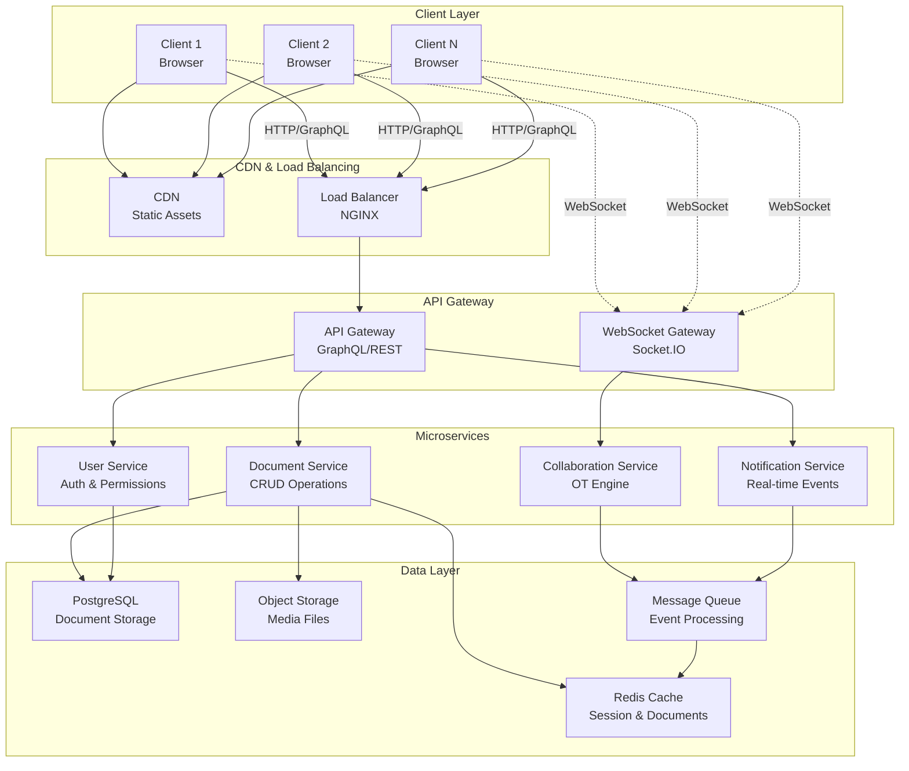
```mermaid
graph TB
    subgraph "Client Layer"
        C1[Client 1<br/>Browser]
        C2[Client 2<br/>Browser] 
        C3[Client N<br/>Browser]
    end
    
    subgraph "CDN & Load Balancing"
        CDN[CDN<br/>Static Assets]
        LB[Load Balancer<br/>NGINX]
    end
    
    subgraph "API Gateway"
        GW[API Gateway<br/>GraphQL/REST]
        WS[WebSocket Gateway<br/>Socket.IO]
    end
    
    subgraph "Microservices"
        DOC[Document Service<br/>CRUD Operations]
        COLLAB[Collaboration Service<br/>OT Engine]
        USER[User Service<br/>Auth & Permissions]
        NOTIF[Notification Service<br/>Real-time Events]
    end
    
    subgraph "Data Layer"
        CACHE[Redis Cache<br/>Session & Documents]
        DB[PostgreSQL<br/>Document Storage]
        BLOB[Object Storage<br/>Media Files]
        MQ[Message Queue<br/>Event Processing]
    end
    
    C1 --> CDN
    C2 --> CDN
    C3 --> CDN
    
    C1 -.->|WebSocket| WS
    C2 -.->|WebSocket| WS
    C3 -.->|WebSocket| WS
    
    C1 -->|HTTP/GraphQL| LB
    C2 -->|HTTP/GraphQL| LB
    C3 -->|HTTP/GraphQL| LB
    
    LB --> GW
    WS --> COLLAB
    
    GW --> DOC
    GW --> USER
    GW --> NOTIF
    
    COLLAB --> MQ
    DOC --> DB
    DOC --> CACHE
    DOC --> BLOB
    
    USER --> DB
    NOTIF --> MQ
    MQ --> CACHE
```

### Data Flow Architecture

[⬆️ Back to Top](#--table-of-contents)

---


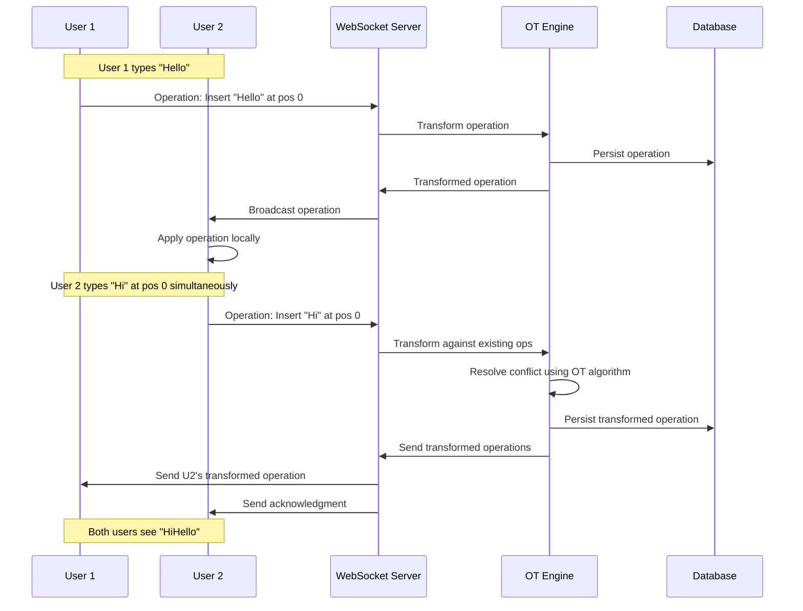
```mermaid
sequenceDiagram
    participant U1 as User 1
    participant U2 as User 2
    participant WS as WebSocket Server
    participant OT as OT Engine
    participant DB as Database
    
    Note over U1,U2: User 1 types "Hello"
    U1->>WS: Operation: Insert "Hello" at pos 0
    WS->>OT: Transform operation
    OT->>DB: Persist operation
    OT->>WS: Transformed operation
    WS->>U2: Broadcast operation
    U2->>U2: Apply operation locally
    
    Note over U1,U2: User 2 types "Hi" at pos 0 simultaneously
    U2->>WS: Operation: Insert "Hi" at pos 0
    WS->>OT: Transform against existing ops
    OT->>OT: Resolve conflict using OT algorithm
    OT->>DB: Persist transformed operation
    OT->>WS: Send transformed operations
    WS->>U1: Send U2's transformed operation
    WS->>U2: Send acknowledgment
    
    Note over U1,U2: Both users see "HiHello"
```

---

## UI/UX and Component Structure

[⬆️ Back to Top](#--table-of-contents)

---


### Frontend Component Architecture

[⬆️ Back to Top](#--table-of-contents)

---


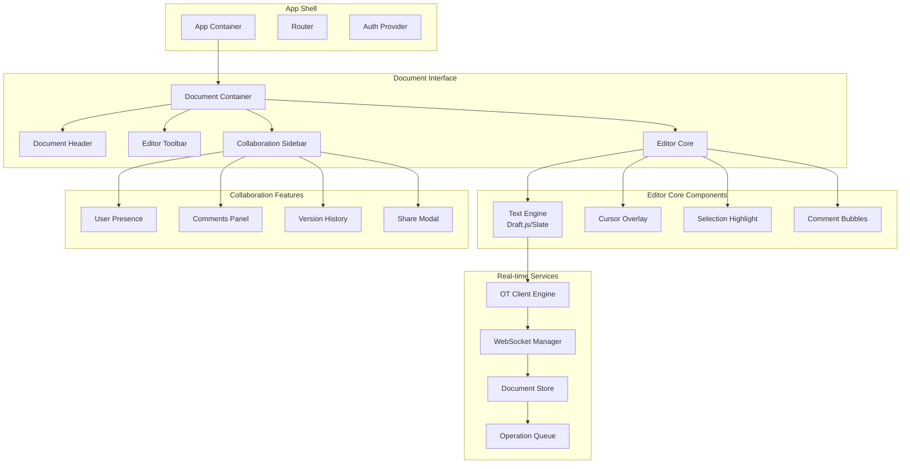
```mermaid
graph TD
    subgraph "App Shell"
        APP[App Container]
        ROUTER[Router]
        AUTH[Auth Provider]
    end
    
    subgraph "Document Interface"
        DOC_CONTAINER[Document Container]
        HEADER[Document Header]
        TOOLBAR[Editor Toolbar]
        EDITOR[Editor Core]
        SIDEBAR[Collaboration Sidebar]
    end
    
    subgraph "Editor Core Components"
        TEXT_ENGINE[Text Engine<br/>Draft.js/Slate]
        CURSOR_OVERLAY[Cursor Overlay]
        SELECTION_HIGHLIGHT[Selection Highlight]
        COMMENT_BUBBLES[Comment Bubbles]
    end
    
    subgraph "Collaboration Features"
        USER_PRESENCE[User Presence]
        COMMENTS_PANEL[Comments Panel]
        VERSION_HISTORY[Version History]
        SHARE_MODAL[Share Modal]
    end
    
    subgraph "Real-time Services"
        WS_MANAGER[WebSocket Manager]
        OT_CLIENT[OT Client Engine]
        DOC_STORE[Document Store]
        SYNC_QUEUE[Operation Queue]
    end
    
    APP --> DOC_CONTAINER
    DOC_CONTAINER --> HEADER
    DOC_CONTAINER --> TOOLBAR
    DOC_CONTAINER --> EDITOR
    DOC_CONTAINER --> SIDEBAR
    
    EDITOR --> TEXT_ENGINE
    EDITOR --> CURSOR_OVERLAY
    EDITOR --> SELECTION_HIGHLIGHT
    EDITOR --> COMMENT_BUBBLES
    
    SIDEBAR --> USER_PRESENCE
    SIDEBAR --> COMMENTS_PANEL
    SIDEBAR --> VERSION_HISTORY
    SIDEBAR --> SHARE_MODAL
    
    TEXT_ENGINE --> OT_CLIENT
    OT_CLIENT --> WS_MANAGER
    WS_MANAGER --> DOC_STORE
    DOC_STORE --> SYNC_QUEUE
```

#### React Component Implementation

[⬆️ Back to Top](#--table-of-contents)

---

**DocumentContainer.jsx**

**What this code does:**
• **Main Purpose**: Real-time collaborative text editor with conflict resolution
• **WebSocket Management**: Handles live synchronization between multiple users
• **Key Functions**:
  - `handleRemoteOperation()` - Applies incoming operations from other users using OT
  - `handleLocalChange()` - Detects local edits and broadcasts to other users
  - `sendOperation()` - Transmits user operations via WebSocket
  - `generateOperation()` - Creates operation objects from content changes
  - `applyOperation()` - Applies operational transforms to editor content

```jsx
// Imports: React hooks, Draft.js editor, context provider, child components
// File Structure: ./CollaborationContext, ./DocumentHeader, ./EditorToolbar, ./CollaborationSidebar, ./CursorOverlay

// States: editorState, activeUsers[], operations[], isConnected
// Refs: editorRef, wsRef
// Functions: handleRemoteOperation(), handleLocalChange(), sendOperation()
// WebSocket: Connection to ws://localhost:8080/documents/{documentId}
// OT Functions: applyOperation(), generateOperation()
// Renders: CollaborationProvider wrapping document header, toolbar, editor with cursor overlay, sidebar

// Component logic, state management, WebSocket setup, OT operations, render JSX
```

**EditorToolbar.jsx**

**What this code does:**
• **States**: None (controlled by parent)
• **Functions**: `handleStyleToggle()`, `handleBlockToggle()`, `hasInlineStyle()`, `getBlockType()`
• **Draft.js Integration**: Uses RichUtils for text formatting
• **Renders**: Toolbar with formatting buttons (bold, italic, headings, lists)

```jsx
import React from 'react';
import { RichUtils } from 'draft-js';

const EditorToolbar = ({ editorState, onStateChange }) => {
  const handleStyleToggle = (style) => {
    onStateChange(RichUtils.toggleInlineStyle(editorState, style));
  };

  const handleBlockToggle = (blockType) => {
    onStateChange(RichUtils.toggleBlockType(editorState, blockType));
  };

  const currentStyle = editorState.getCurrentInlineStyle();
  const selection = editorState.getSelection();
  const blockType = editorState
    .getCurrentContent()
    .getBlockForKey(selection.getStartKey())
    .getType();

  return (
    <div className="editor-toolbar">
      <div className="toolbar-group">
        <button
          className={currentStyle.has('BOLD') ? 'active' : ''}
          onClick={() => handleStyleToggle('BOLD')}
        >
          Bold
        </button>
        <button
          className={currentStyle.has('ITALIC') ? 'active' : ''}
          onClick={() => handleStyleToggle('ITALIC')}
        >
          Italic
        </button>
        <button
          className={currentStyle.has('UNDERLINE') ? 'active' : ''}
          onClick={() => handleStyleToggle('UNDERLINE')}
        >
          Underline
        </button>
      </div>
      
      <div className="toolbar-group">
        <button
          className={blockType === 'header-one' ? 'active' : ''}
          onClick={() => handleBlockToggle('header-one')}
        >
          H1
        </button>
        <button
          className={blockType === 'header-two' ? 'active' : ''}
          onClick={() => handleBlockToggle('header-two')}
        >
          H2
        </button>
        <button
          className={blockType === 'unordered-list-item' ? 'active' : ''}
          onClick={() => handleBlockToggle('unordered-list-item')}
        >
          • List
        </button>
      </div>
    </div>
  );
};

export default EditorToolbar;
```

**CursorOverlay.jsx**

**What this code does:**
• **Main Purpose**: Real-time cursor and selection visualization for collaborative users
• **Visual Awareness**: Shows where other users are currently working
• **Key Functions**:
  - `getCursorPosition()` - Calculates pixel coordinates for user cursors
  - `renderUserCursor()` - Creates colored cursor indicators with user names
  - `updateSelection()` - Displays other users' text selections as highlights
  - `assignUserColor()` - Assigns unique colors to each collaborative user
  - Dynamic positioning updates as users navigate through the document

```jsx
import React from 'react';

const CursorOverlay = ({ activeUsers }) => {
  return (
    <div className="cursor-overlay">
      {activeUsers.map(user => (
        <div
          key={user.id}
          className="remote-cursor"
          style={{
            left: user.cursorPosition?.x || 0,
            top: user.cursorPosition?.y || 0,
            borderColor: user.color
          }}
        >
          <div 
            className="cursor-flag"
            style={{ backgroundColor: user.color }}
          >
            {user.name}
          </div>
        </div>
      ))}
    </div>
  );
};

export default CursorOverlay;
```

**OT Engine Utilities**

**What this code does:**
• **Main Purpose**: Core Operational Transform algorithm for conflict-free collaboration
• **Consistency Guarantee**: Ensures all users see identical final document state
• **Key Functions**:
  - `generateOperation()` - Creates operation objects from content changes
  - `applyOperation()` - Applies remote operations to local document
  - `transformOperation()` - Resolves conflicts between concurrent operations
  - `compose()` - Combines multiple operations into a single operation
  - `invert()` - Creates inverse operations for undo functionality

```jsx
// otEngine.js
export const generateOperation = (oldContent, newContent) => {
  // Simplified operation generation
  const oldText = oldContent.getPlainText();
  const newText = newContent.getPlainText();
  
  if (newText.length > oldText.length) {
    // Insert operation
    const insertIndex = findInsertIndex(oldText, newText);
    const insertedText = newText.slice(insertIndex, insertIndex + (newText.length - oldText.length));
    
    return {
      type: 'insert',
      position: insertIndex,
      content: insertedText,
      timestamp: Date.now(),
      clientId: getClientId()
    };
  } else if (newText.length < oldText.length) {
    // Delete operation
    const deleteIndex = findDeleteIndex(oldText, newText);
    const deleteLength = oldText.length - newText.length;
    
    return {
      type: 'delete',
      position: deleteIndex,
      length: deleteLength,
      timestamp: Date.now(),
      clientId: getClientId()
    };
  }
  
  return null;
};

export const applyOperation = (content, operation) => {
  const text = content.getPlainText();
  
  switch (operation.type) {
    case 'insert':
      const newText = text.slice(0, operation.position) + 
                     operation.content + 
                     text.slice(operation.position);
      return ContentState.createFromText(newText);
      
    case 'delete':
      const deletedText = text.slice(0, operation.position) + 
                         text.slice(operation.position + operation.length);
      return ContentState.createFromText(deletedText);
      
    default:
      return content;
  }
};

// Transform operation based on concurrent operations
export const transformOperation = (op1, op2) => {
  if (op1.type === 'insert' && op2.type === 'insert') {
    if (op1.position <= op2.position) {
      return { ...op2, position: op2.position + op1.content.length };
    }
    return op2;
  }
  
  if (op1.type === 'delete' && op2.type === 'insert') {
    if (op1.position < op2.position) {
      return { ...op2, position: op2.position - op1.length };
    }
    return op2;
  }
  
  // Add more transformation rules...
  return op2;
};
```

### State Management Flow

[⬆️ Back to Top](#--table-of-contents)

---


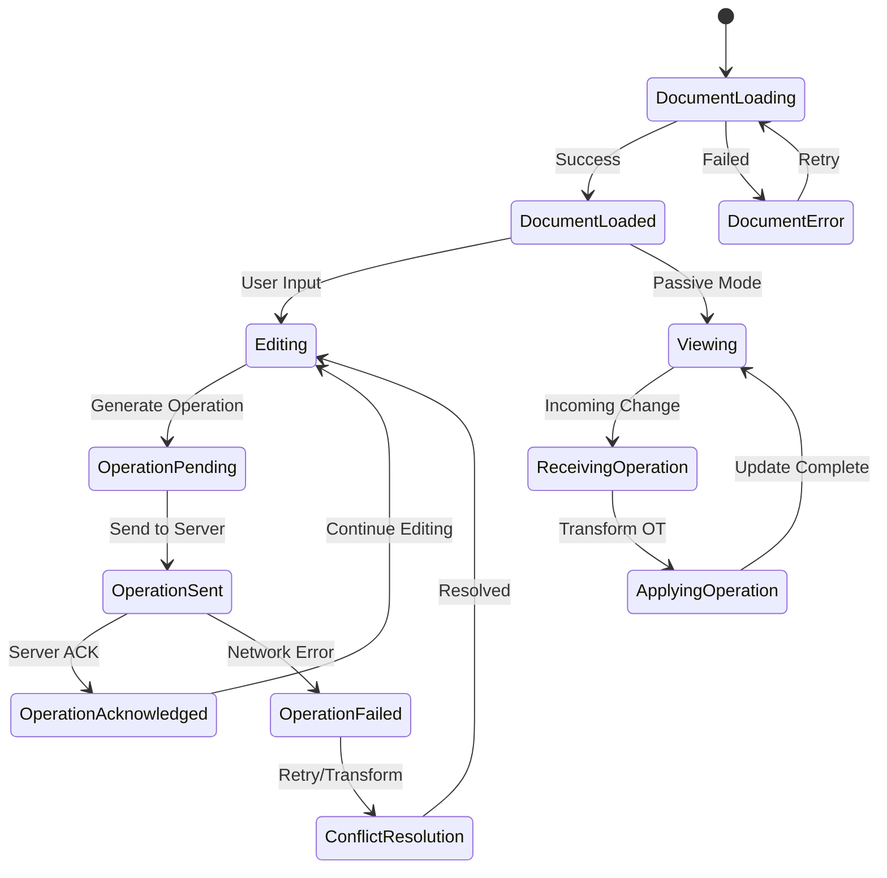
```mermaid
stateDiagram-v2
    [*] --> DocumentLoading
    DocumentLoading --> DocumentLoaded: Success
    DocumentLoading --> DocumentError: Failed
    
    DocumentLoaded --> Editing: User Input
    DocumentLoaded --> Viewing: Passive Mode
    
    Editing --> OperationPending: Generate Operation
    OperationPending --> OperationSent: Send to Server
    OperationSent --> OperationAcknowledged: Server ACK
    OperationSent --> OperationFailed: Network Error
    
    OperationAcknowledged --> Editing: Continue Editing
    OperationFailed --> ConflictResolution: Retry/Transform
    
    Viewing --> ReceivingOperation: Incoming Change
    ReceivingOperation --> ApplyingOperation: Transform OT
    ApplyingOperation --> Viewing: Update Complete
    
    ConflictResolution --> Editing: Resolved
    DocumentError --> DocumentLoading: Retry
```

---

## Real-Time Sync, Data Modeling & APIs

[⬆️ Back to Top](#--table-of-contents)

---


### Operational Transform Algorithm

[⬆️ Back to Top](#--table-of-contents)

---

**Core Concept**: Operational Transform (OT) is a concurrency control algorithm that ensures consistency across multiple users editing the same document simultaneously. It transforms operations based on concurrent changes, so that all clients eventually arrive at the same document state, even if operations arrive out of order. This approach typically requires a centralized server to manage and transform operations.

**Example: OT in Action**
Consider two users, Alice and Bob, editing a document that initially contains "Hello".

1.  **Alice (Client A)** types " World" at the end of "Hello" (index 5).
    *   Alice's local document: "Hello World"
    *   Alice sends `OpA: Insert " World" at index 5` to the server.

2.  **Bob (Client B)**, concurrently, types " Awesome" at the beginning of "Hello" (index 0).
    *   Bob's local document: " AwesomeHello"
    *   Bob sends `OpB: Insert " Awesome" at index 0` to the server.

3.  **Server receives OpA first.** It applies `OpA` to its document state: "Hello World".

4.  **Server then receives OpB.** Before applying `OpB`, the server notices that `OpB` was generated based on an older state of the document (before " World" was added). The server uses OT to transform `OpB` against `OpA`.
    *   `OpB` (Insert " Awesome" at index 0) needs to be adjusted because " World" was inserted at index 5.
    *   The transformed `OpB'` becomes `Insert " Awesome" at index 0`. (In this specific case, the position remains the same as it's an insertion at the beginning).

5.  **Server applies transformed OpB'** to its document: " AwesomeHello World".

6.  **Server sends transformed operations back to clients.**
    *   To Alice, the server sends Bob's transformed operation (`OpB': Insert " Awesome" at index 0`). Alice applies this to her document: " AwesomeHello World".
    *   To Bob, the server sends Alice's original operation (`OpA: Insert " World" at index 5`). Bob applies this, but critically, he needs to transform `OpA` against his own `OpB` that was applied locally. The transformed `OpA'` becomes `Insert " World" at index 13` (original index 5 + 8 characters from " Awesome"). Bob applies this to his document: " AwesomeHello World".

Result: Both Alice and Bob consistently see " AwesomeHello World". The OT algorithm ensured that concurrent operations were correctly integrated without manual conflict resolution by the users.

#### OT Algorithm Flow

[⬆️ Back to Top](#--table-of-contents)

---


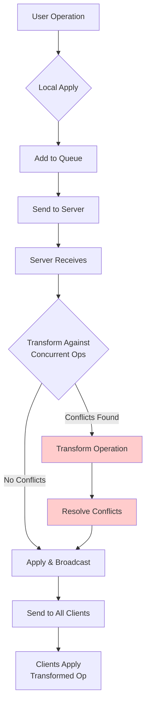
```mermaid
graph TD
    A[User Operation] --> B{Local Apply}
    B --> C[Add to Queue]
    C --> D[Send to Server]
    D --> E[Server Receives]
    E --> F{Transform Against<br/>Concurrent Ops}
    F -->|No Conflicts| G[Apply & Broadcast]
    F -->|Conflicts Found| H[Transform Operation]
    H --> I[Resolve Conflicts]
    I --> G
    G --> J[Send to All Clients]
    J --> K[Clients Apply<br/>Transformed Op]
    
    style H fill:#ffcccc
    style I fill:#ffcccc
```

#### Key OT Transformation Rules

[⬆️ Back to Top](#--table-of-contents)

---


1. **Insert vs Insert**: 
   - Same position: Use timestamp/user priority
   - Different positions: Adjust positions based on order

2. **Insert vs Delete**:
   - Delete before insert: Adjust insert position
   - Insert before delete: Adjust delete position and length

3. **Delete vs Delete**:
   - Overlapping: Merge delete ranges
   - Non-overlapping: Adjust positions

#### Alternative: CRDT Approach

[⬆️ Back to Top](#--table-of-contents)

---

**Core Concept**: Conflict-Free Replicated Data Types (CRDTs) are data structures that can be replicated across multiple machines, allowing concurrent updates to be merged automatically without requiring complex transformation logic or a centralized server. Each operation on a CRDT can be applied independently on any replica, and the system guarantees that all replicas will eventually converge to the same consistent state.

**Example: CRDT in Action**
Consider Alice and Bob again, editing a document initially containing "Hello" using a CRDT-based editor.

1.  **Alice (Client A)** types " World" at the end of "Hello".
    *   Alice's client generates a unique ID for each character and its position (e.g., `(W, ID1, after o), (o, ID2, after ID1), ...`).
    *   Alice's client broadcasts these character insertions to other clients.

2.  **Bob (Client B)**, concurrently, types " Awesome" at the beginning of "Hello".
    *   Bob's client also generates unique IDs for each character and its position (e.g., `(A, IDa, before H), (w, IDb, after IDa), ...`).
    *   Bob's client broadcasts these character insertions to other clients.

3.  **No central server for transformation:** Each client receives the other's operations. Since CRDT operations are commutative and associative, they can be applied in any order.
    *   When Alice's client receives Bob's operations, it simply applies them based on their unique IDs and relative positions. For instance, `(A, IDa, before H)` will be inserted before 'H' in "Hello World".
    *   Similarly, when Bob's client receives Alice's operations, it inserts them based on their unique IDs and relative positions.

Result: Both Alice and Bob consistently see " AwesomeHello World". The CRDT handles the merge automatically because the operations themselves are designed to be conflict-free, ensuring eventual consistency without the need for a central coordination step.

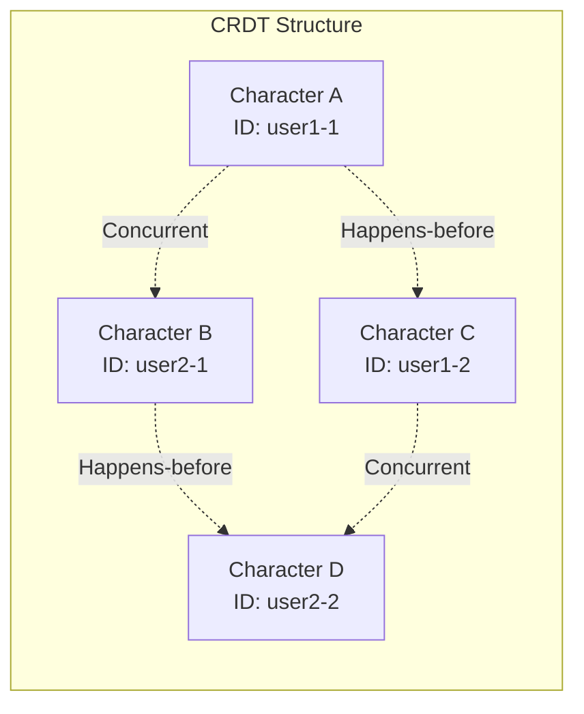
```mermaid
graph LR
    subgraph "CRDT Structure"
        A[Character A<br/>ID: user1-1]
        B[Character B<br/>ID: user2-1] 
        C[Character C<br/>ID: user1-2]
        D[Character D<br/>ID: user2-2]
    end
    
    A -.->|Happens-before| C
    B -.->|Happens-before| D
    A -.->|Concurrent| B
    C -.->|Concurrent| D
```

### Data Models

[⬆️ Back to Top](#--table-of-contents)

---


#### Document Structure

[⬆️ Back to Top](#--table-of-contents)

---

```
Document {
  id: UUID
  title: String
  content: OT-Compatible Structure
  metadata: {
    created: DateTime
    modified: DateTime
    version: Integer
  }
  permissions: {
    owner: UserID
    collaborators: [UserID]
    access_level: Enum
  }
}
```

#### Operation Structure

[⬆️ Back to Top](#--table-of-contents)

---

```
Operation {
  id: UUID
  type: 'insert' | 'delete' | 'format'
  position: Integer
  content: String?
  attributes: Object?
  author: UserID
  timestamp: DateTime
  client_id: String
  version: Integer
}
```

### API Design

[⬆️ Back to Top](#--table-of-contents)

---


#### WebSocket Event Protocol

[⬆️ Back to Top](#--table-of-contents)

---


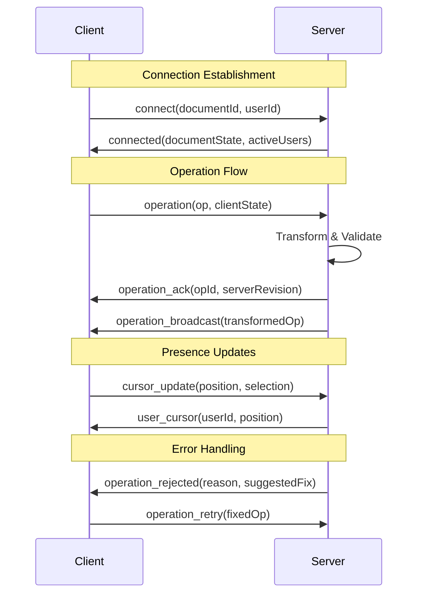
```mermaid
sequenceDiagram
    participant C as Client
    participant S as Server
    
    Note over C,S: Connection Establishment
    C->>S: connect(documentId, userId)
    S->>C: connected(documentState, activeUsers)
    
    Note over C,S: Operation Flow
    C->>S: operation(op, clientState)
    S->>S: Transform & Validate
    S->>C: operation_ack(opId, serverRevision)
    S->>C: operation_broadcast(transformedOp)
    
    Note over C,S: Presence Updates
    C->>S: cursor_update(position, selection)
    S->>C: user_cursor(userId, position)
    
    Note over C,S: Error Handling
    S->>C: operation_rejected(reason, suggestedFix)
    C->>S: operation_retry(fixedOp)
```

#### REST API Endpoints

[⬆️ Back to Top](#--table-of-contents)

---

- `GET /documents/:id` - Fetch document
- `POST /documents` - Create document  
- `PUT /documents/:id/share` - Share document
- `GET /documents/:id/history` - Version history
- `POST /documents/:id/comments` - Add comment

### TypeScript Interfaces & Component Props

[⬆️ Back to Top](#--table-of-contents)

---

#### Core Data Interfaces

```typescript
interface DocumentState {
  id: string;
  title: string;
  content: EditorState;
  collaborators: User[];
  operations: Operation[];
  version: number;
  lastModified: Date;
}

interface Operation {
  id: string;
  type: 'insert' | 'delete' | 'format' | 'retain';
  position: number;
  content?: string;
  attributes?: Record<string, any>;
  author: string;
  timestamp: Date;
  clientId: string;
}

interface User {
  id: string;
  name: string;
  email: string;
  avatar?: string;
  color: string;
  cursor?: CursorPosition;
  isOnline: boolean;
}

interface CursorPosition {
  line: number;
  column: number;
  selection?: {
    start: number;
    end: number;
  };
}
```

#### Component Props Interfaces

```typescript
interface EditorProps {
  documentId: string;
  initialContent?: EditorState;
  readOnly?: boolean;
  placeholder?: string;
  theme?: 'light' | 'dark';
  onDocumentChange?: (doc: DocumentState) => void;
  onCollaboratorJoin?: (user: User) => void;
  onError?: (error: Error) => void;
}

interface ToolbarProps {
  editorState: EditorState;
  onCommand: (command: string, value?: any) => void;
  disabled?: boolean;
  customButtons?: ToolbarButton[];
}

interface CollaborationPanelProps {
  users: User[];
  comments: Comment[];
  onInviteUser?: (email: string) => void;
  onAddComment?: (comment: CommentData) => void;
  showPresence?: boolean;
}
```

### API Reference

[⬆️ Back to Top](#--table-of-contents)

---

#### Document Management
- `GET /api/documents` - List user's documents with pagination
- `POST /api/documents` - Create new collaborative document
- `GET /api/documents/:id` - Fetch document content and metadata
- `PUT /api/documents/:id` - Update document title or settings
- `DELETE /api/documents/:id` - Delete document and all operations

#### Real-time Collaboration
- `WS /api/documents/:id/connect` - Establish WebSocket for real-time collaboration
- `POST /api/documents/:id/operations` - Submit operation for transformation
- `GET /api/documents/:id/operations` - Fetch operation history with pagination
- `POST /api/documents/:id/cursor` - Update user cursor position

#### Sharing & Permissions
- `POST /api/documents/:id/share` - Generate shareable link with permissions
- `PUT /api/documents/:id/permissions` - Update document access permissions
- `GET /api/documents/:id/collaborators` - List document collaborators
- `DELETE /api/documents/:id/collaborators/:userId` - Remove collaborator access

#### Comments & Reviews
- `POST /api/documents/:id/comments` - Add comment to specific document position
- `GET /api/documents/:id/comments` - Fetch comments with thread support
- `PUT /api/comments/:commentId` - Update or resolve comment
- `DELETE /api/comments/:commentId` - Delete comment (author only)

#### Version History
- `GET /api/documents/:id/versions` - List document version snapshots
- `GET /api/documents/:id/versions/:versionId` - Fetch specific version content
- `POST /api/documents/:id/restore/:versionId` - Restore document to previous version

---

## Performance and Scalability

[⬆️ Back to Top](#--table-of-contents)

---


### Client-Side Optimizations

[⬆️ Back to Top](#--table-of-contents)

---


#### Virtual Scrolling for Large Documents

[⬆️ Back to Top](#--table-of-contents)

---


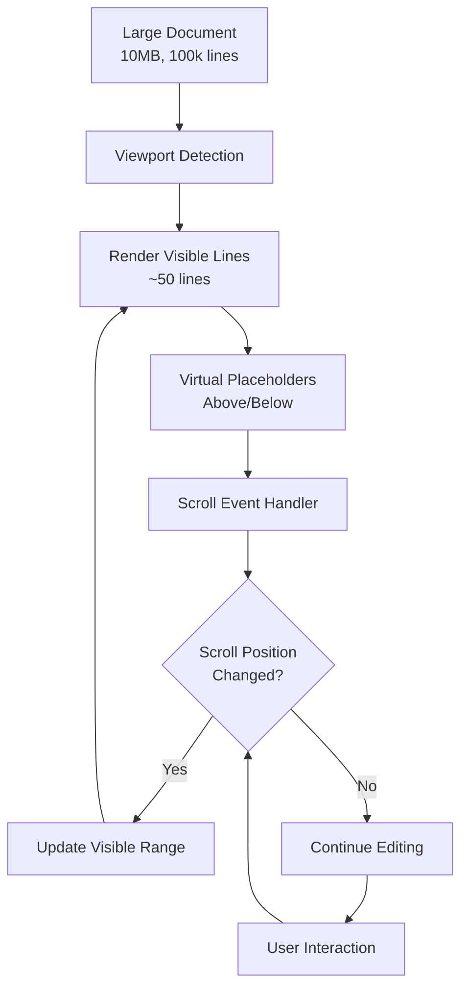
```mermaid
graph TD
    A[Large Document<br/>10MB, 100k lines] --> B[Viewport Detection]
    B --> C[Render Visible Lines<br/>~50 lines]
    C --> D[Virtual Placeholders<br/>Above/Below]
    D --> E[Scroll Event Handler]
    E --> F{Scroll Position<br/>Changed?}
    F -->|Yes| G[Update Visible Range]
    F -->|No| H[Continue Editing]
    G --> C
    H --> I[User Interaction]
    I --> F
```

#### Operation Batching Strategy

[⬆️ Back to Top](#--table-of-contents)

---


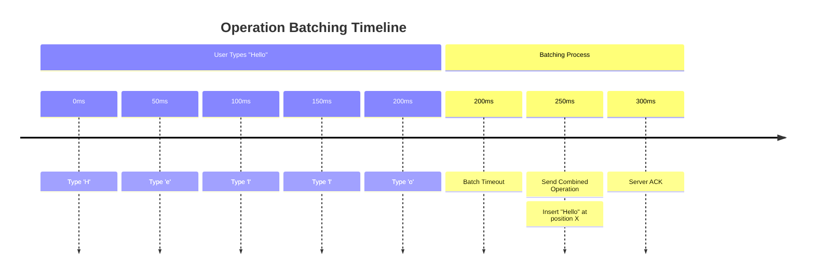
```mermaid
timeline
    title Operation Batching Timeline
    
    section User Types "Hello"
    0ms : Type 'H'
    50ms : Type 'e'
    100ms : Type 'l'
    150ms : Type 'l'
    200ms : Type 'o'
    
    section Batching Process
    200ms : Batch Timeout
    250ms : Send Combined Operation
         : Insert "Hello" at position X
    300ms : Server ACK
```

### Server-Side Scaling

[⬆️ Back to Top](#--table-of-contents)

---


#### Document Sharding Strategy

[⬆️ Back to Top](#--table-of-contents)

---


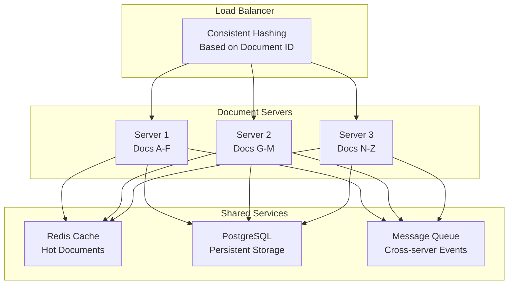
```mermaid
graph TB
    subgraph "Load Balancer"
        LB[Consistent Hashing<br/>Based on Document ID]
    end
    
    subgraph "Document Servers"
        S1[Server 1<br/>Docs A-F]
        S2[Server 2<br/>Docs G-M]
        S3[Server 3<br/>Docs N-Z]
    end
    
    subgraph "Shared Services"
        REDIS[Redis Cache<br/>Hot Documents]
        DB[PostgreSQL<br/>Persistent Storage]
        MQ[Message Queue<br/>Cross-server Events]
    end
    
    LB --> S1
    LB --> S2
    LB --> S3
    
    S1 --> REDIS
    S2 --> REDIS
    S3 --> REDIS
    
    S1 --> DB
    S2 --> DB
    S3 --> DB
    
    S1 --> MQ
    S2 --> MQ
    S3 --> MQ
```

#### Caching Architecture

[⬆️ Back to Top](#--table-of-contents)

---


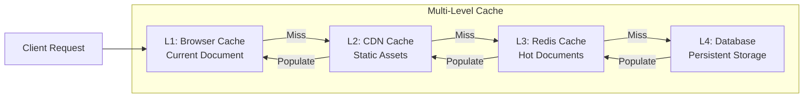
```mermaid
graph LR
    subgraph "Multi-Level Cache"
        L1[L1: Browser Cache<br/>Current Document]
        L2[L2: CDN Cache<br/>Static Assets]
        L3[L3: Redis Cache<br/>Hot Documents]
        L4[L4: Database<br/>Persistent Storage]
    end
    
    CLIENT[Client Request] --> L1
    L1 -->|Miss| L2
    L2 -->|Miss| L3
    L3 -->|Miss| L4
    
    L4 -->|Populate| L3
    L3 -->|Populate| L2
    L2 -->|Populate| L1
```

---

## Security and Privacy

[⬆️ Back to Top](#--table-of-contents)

---


### Authentication & Authorization Flow

[⬆️ Back to Top](#--table-of-contents)

---


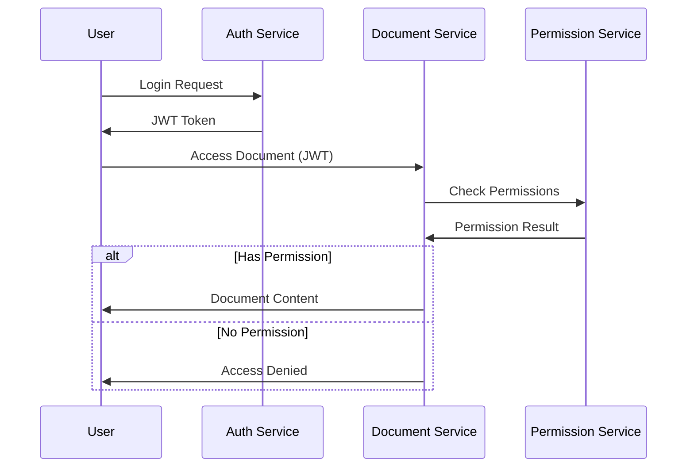
```mermaid
sequenceDiagram
    participant U as User
    participant A as Auth Service
    participant D as Document Service
    participant P as Permission Service
    
    U->>A: Login Request
    A->>U: JWT Token
    U->>D: Access Document (JWT)
    D->>P: Check Permissions
    P->>D: Permission Result
    alt Has Permission
        D->>U: Document Content
    else No Permission
        D->>U: Access Denied
    end
```

### Data Protection Strategy

[⬆️ Back to Top](#--table-of-contents)

---


#### End-to-End Encryption Flow

[⬆️ Back to Top](#--table-of-contents)

---


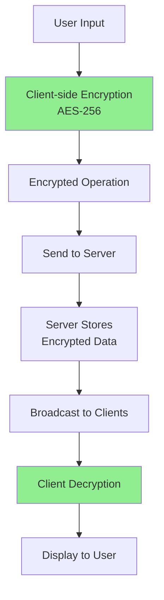
```mermaid
graph TD
    A[User Input] --> B[Client-side Encryption<br/>AES-256]
    B --> C[Encrypted Operation]
    C --> D[Send to Server]
    D --> E[Server Stores<br/>Encrypted Data]
    E --> F[Broadcast to Clients]
    F --> G[Client Decryption]
    G --> H[Display to User]
    
    style B fill:#90EE90
    style G fill:#90EE90
```

### Input Sanitization Pipeline

[⬆️ Back to Top](#--table-of-contents)

---


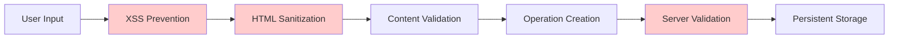
```mermaid
graph LR
    A[User Input] --> B[XSS Prevention]
    B --> C[HTML Sanitization]
    C --> D[Content Validation]
    D --> E[Operation Creation]
    E --> F[Server Validation]
    F --> G[Persistent Storage]
    
    style B fill:#ffcccc
    style C fill:#ffcccc
    style F fill:#ffcccc
```

---

## Testing, Monitoring, and Maintainability

[⬆️ Back to Top](#--table-of-contents)

---


### Testing Strategy

[⬆️ Back to Top](#--table-of-contents)

---


#### Testing Pyramid

[⬆️ Back to Top](#--table-of-contents)

---


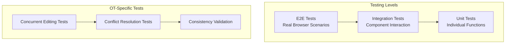
```mermaid
graph TD
    subgraph "Testing Levels"
        E2E[E2E Tests<br/>Real Browser Scenarios]
        INTEGRATION[Integration Tests<br/>Component Interaction]
        UNIT[Unit Tests<br/>Individual Functions]
    end
    
    subgraph "OT-Specific Tests"
        CONCURRENT[Concurrent Editing Tests]
        CONFLICT[Conflict Resolution Tests]
        CONSISTENCY[Consistency Validation]
    end
    
    E2E --> INTEGRATION
    INTEGRATION --> UNIT
    
    CONCURRENT --> CONFLICT
    CONFLICT --> CONSISTENCY
```

### Monitoring Architecture

[⬆️ Back to Top](#--table-of-contents)

---


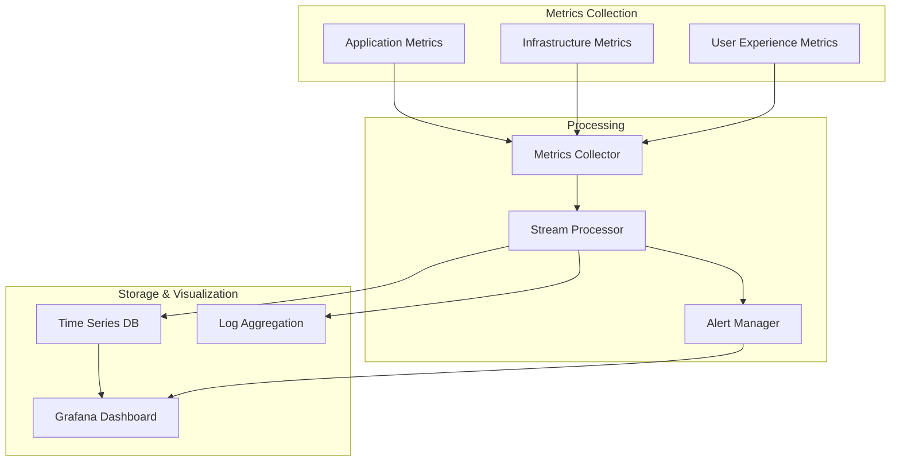
```mermaid
graph TB
    subgraph "Metrics Collection"
        APP[Application Metrics]
        INFRA[Infrastructure Metrics] 
        USER[User Experience Metrics]
    end
    
    subgraph "Processing"
        COLLECTOR[Metrics Collector]
        PROCESSOR[Stream Processor]
        ALERTING[Alert Manager]
    end
    
    subgraph "Storage & Visualization"
        TSDB[Time Series DB]
        DASHBOARD[Grafana Dashboard]
        LOGS[Log Aggregation]
    end
    
    APP --> COLLECTOR
    INFRA --> COLLECTOR
    USER --> COLLECTOR
    
    COLLECTOR --> PROCESSOR
    PROCESSOR --> TSDB
    PROCESSOR --> ALERTING
    
    TSDB --> DASHBOARD
    ALERTING --> DASHBOARD
    PROCESSOR --> LOGS
```

### Key Metrics to Monitor

[⬆️ Back to Top](#--table-of-contents)

---


1. **Performance Metrics**:
   - Operation latency (P50, P95, P99)
   - Document load time
   - WebSocket connection success rate

2. **Collaboration Metrics**:
   - Concurrent users per document
   - Operation conflicts per minute
   - Conflict resolution time

3. **System Health**:
   - Server response time
   - Database query performance
   - Cache hit rates

---

## Trade-offs, Deep Dives, and Extensions

[⬆️ Back to Top](#--table-of-contents)

---


### OT vs CRDT Comparison

[⬆️ Back to Top](#--table-of-contents)

---


| Aspect | Operational Transform | CRDT |
|--------|----------------------|------|
| **Complexity** | High implementation complexity | Simpler to implement |
| **Performance** | Smaller operation size | Larger data structures |
| **Scalability** | Requires central coordination | Fully decentralized |
| **Consistency** | Strong consistency | Eventual consistency |
| **Undo/Redo** | Complex but possible | Very difficult |
| **Use Case** | Text editing, precise control | Distributed systems |

### Scalability Bottlenecks & Solutions

[⬆️ Back to Top](#--table-of-contents)

---


#### Problem: Hot Document Scaling

[⬆️ Back to Top](#--table-of-contents)

---


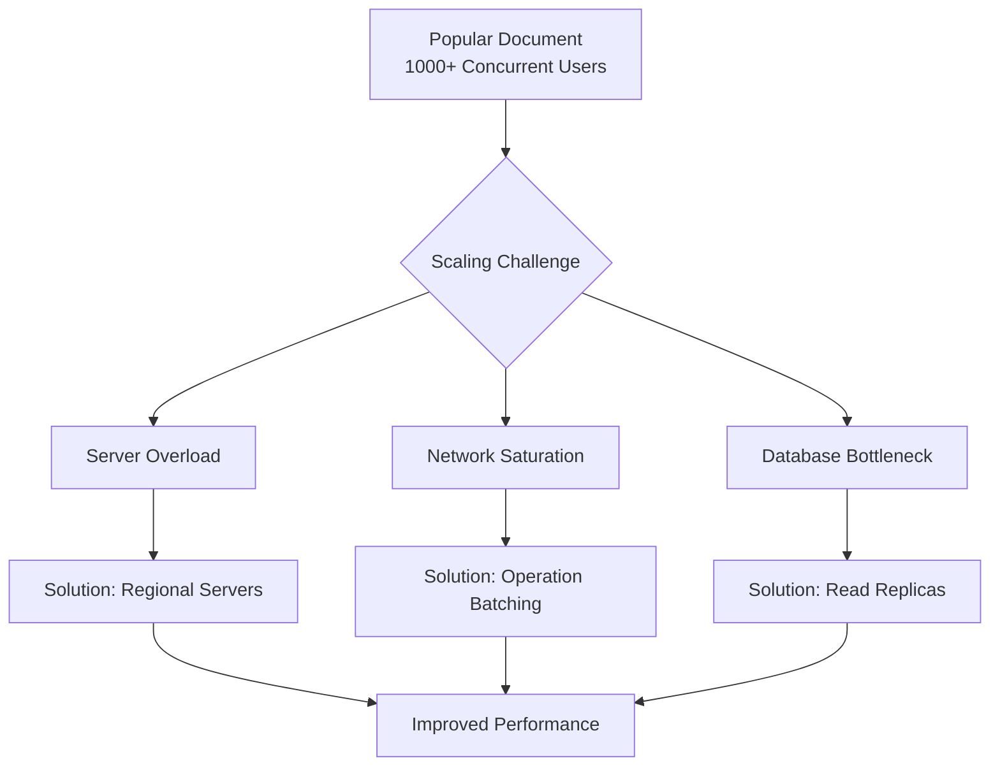
```mermaid
graph TD
    A[Popular Document<br/>1000+ Concurrent Users] --> B{Scaling Challenge}
    B --> C[Server Overload]
    B --> D[Network Saturation]
    B --> E[Database Bottleneck]
    
    C --> F[Solution: Regional Servers]
    D --> G[Solution: Operation Batching]
    E --> H[Solution: Read Replicas]
    
    F --> I[Improved Performance]
    G --> I
    H --> I
```

#### Solution: Hierarchical OT

[⬆️ Back to Top](#--table-of-contents)

---


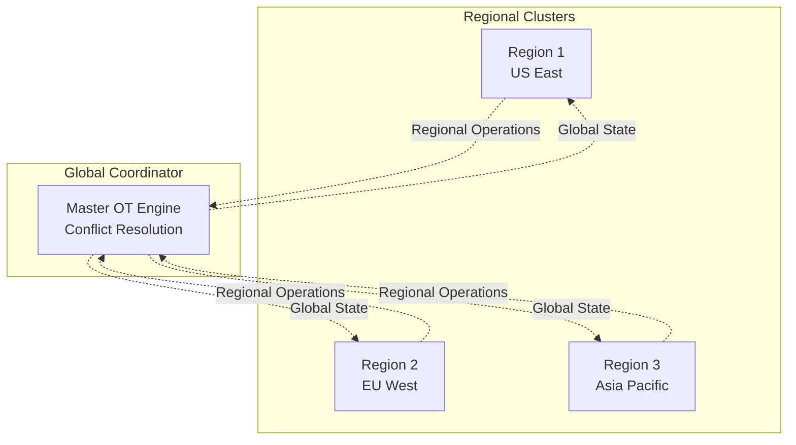
```mermaid
graph TB
    subgraph "Regional Clusters"
        R1[Region 1<br/>US East]
        R2[Region 2<br/>EU West]
        R3[Region 3<br/>Asia Pacific]
    end
    
    subgraph "Global Coordinator"
        MASTER[Master OT Engine<br/>Conflict Resolution]
    end
    
    R1 -.->|Regional Operations| MASTER
    R2 -.->|Regional Operations| MASTER
    R3 -.->|Regional Operations| MASTER
    
    MASTER -.->|Global State| R1
    MASTER -.->|Global State| R2
    MASTER -.->|Global State| R3
```

### Advanced Features

[⬆️ Back to Top](#--table-of-contents)

---


#### Smart Auto-Save Strategy

[⬆️ Back to Top](#--table-of-contents)

---


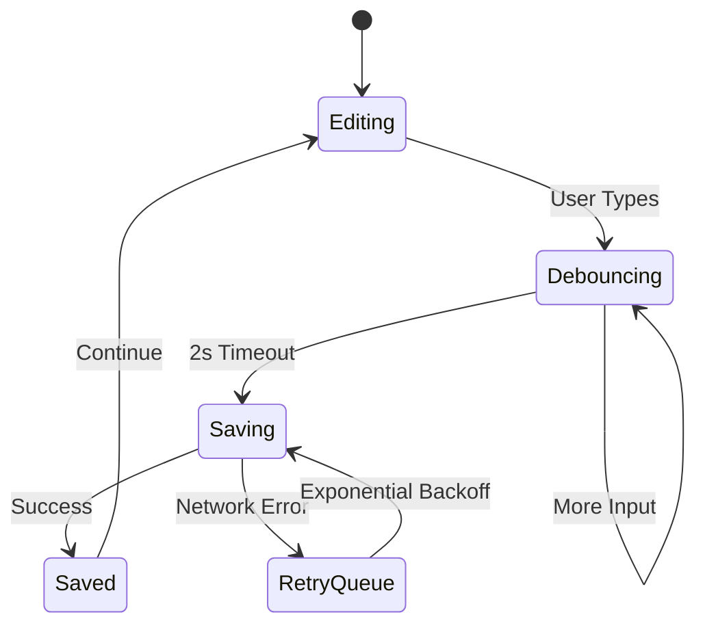
```mermaid
stateDiagram-v2
    [*] --> Editing
    Editing --> Debouncing: User Types
    Debouncing --> Saving: 2s Timeout
    Debouncing --> Debouncing: More Input
    Saving --> Saved: Success
    Saving --> RetryQueue: Network Error
    RetryQueue --> Saving: Exponential Backoff
    Saved --> Editing: Continue
```

#### Conflict-Free Comment System

[⬆️ Back to Top](#--table-of-contents)

---


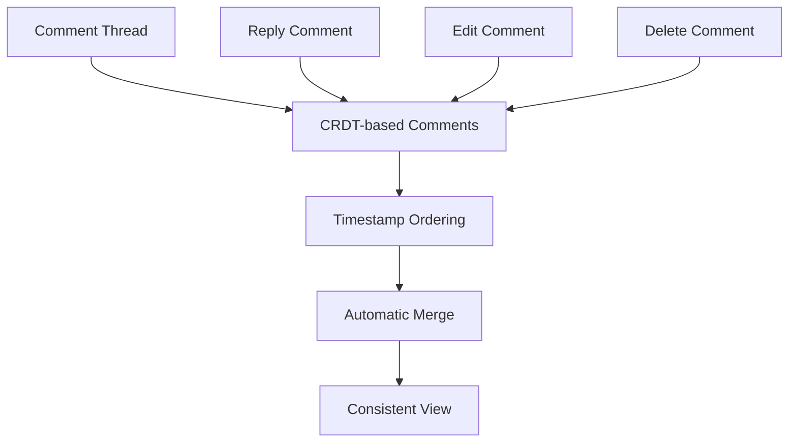
```mermaid
graph TD
    A[Comment Thread] --> B[CRDT-based Comments]
    B --> C[Timestamp Ordering]
    C --> D[Automatic Merge]
    D --> E[Consistent View]
    
    F[Reply Comment] --> B
    G[Edit Comment] --> B
    H[Delete Comment] --> B
```

### Future Extensions

[⬆️ Back to Top](#--table-of-contents)

---


1. **AI-Powered Features**:
   - Smart auto-completion
   - Grammar suggestions
   - Content generation
   - Real-time translation

2. **Enhanced Collaboration**:
   - Voice/video integration
   - Advanced presence indicators
   - Cross-document linking
   - Team workspace management

3. **Performance Innovations**:
   - WebAssembly OT engine
   - Edge computing for regional sync
   - Machine learning for conflict prediction
   - Adaptive quality based on network conditions

This design provides a comprehensive foundation for building a production-ready collaborative text editor with focus on the architectural decisions, algorithms, and system design principles rather than implementation details. 