# Build a Video Streaming Platform Interface (like Netflix)


## 📋 Table of Contents

- [Build a Video Streaming Platform Interface (like Netflix)](#build-a-video-streaming-platform-interface-like-netflix)
  - [Table of Contents](#table-of-contents)
  - [Clarify the Problem and Requirements](#clarify-the-problem-and-requirements)
    - [Problem Understanding](#problem-understanding)
    - [Functional Requirements](#functional-requirements)
    - [Non-Functional Requirements](#non-functional-requirements)
    - [Key Assumptions](#key-assumptions)
  - [High-Level Architecture](#high-level-architecture)
    - [Global System Architecture](#global-system-architecture)
    - [Video Streaming Architecture](#video-streaming-architecture)
  - [UI/UX and Component Structure](#uiux-and-component-structure)
    - [Frontend Component Architecture](#frontend-component-architecture)
    - [Responsive Design Strategy](#responsive-design-strategy)
  - [Real-Time Sync, Data Modeling & APIs](#real-time-sync-data-modeling-apis)
    - [Adaptive Bitrate Streaming Algorithm](#adaptive-bitrate-streaming-algorithm)
      - [ABR Decision Engine](#abr-decision-engine)
      - [ABR Algorithm Implementation Logic](#abr-algorithm-implementation-logic)
    - [Content Recommendation Algorithm](#content-recommendation-algorithm)
    - [Data Models](#data-models)
      - [Content Metadata Structure](#content-metadata-structure)
      - [Video Asset Structure](#video-asset-structure)
    - [API Design Pattern](#api-design-pattern)
      - [Content Discovery API Flow](#content-discovery-api-flow)
      - [Video Playback API Flow](#video-playback-api-flow)
  - [TypeScript Interfaces & Component Props](#typescript-interfaces--component-props)
    - [Core Data Interfaces](#core-data-interfaces)
    - [Component Props Interfaces](#component-props-interfaces)
  - [API Reference](#api-reference)
  - [Performance and Scalability](#performance-and-scalability)
    - [Video Delivery Optimization](#video-delivery-optimization)
      - [Multi-CDN Strategy](#multi-cdn-strategy)
      - [Caching Strategy](#caching-strategy)
    - [Frontend Performance Optimization](#frontend-performance-optimization)
      - [Code Splitting Strategy](#code-splitting-strategy)
      - [Lazy Loading Implementation](#lazy-loading-implementation)
    - [Database Scaling](#database-scaling)
      - [Sharding Strategy for Content Metadata](#sharding-strategy-for-content-metadata)
  - [Security and Privacy](#security-and-privacy)
    - [DRM and Content Protection](#drm-and-content-protection)
      - [Multi-DRM Architecture](#multi-drm-architecture)
      - [License Acquisition Flow](#license-acquisition-flow)
    - [User Privacy and Data Protection](#user-privacy-and-data-protection)
      - [Privacy-Preserving Analytics](#privacy-preserving-analytics)
  - [Testing, Monitoring, and Maintainability](#testing-monitoring-and-maintainability)
    - [Testing Strategy for Video Platform](#testing-strategy-for-video-platform)
      - [Multi-Level Testing Approach](#multi-level-testing-approach)
    - [Monitoring and Observability](#monitoring-and-observability)
      - [Real-time Monitoring Dashboard](#real-time-monitoring-dashboard)
      - [Key Performance Indicators](#key-performance-indicators)
  - [Trade-offs, Deep Dives, and Extensions](#trade-offs-deep-dives-and-extensions)
    - [Streaming Protocol Comparison](#streaming-protocol-comparison)
    - [CDN vs P2P Trade-offs](#cdn-vs-p2p-trade-offs)
      - [CDN Approach](#cdn-approach)
      - [P2P Hybrid Approach](#p2p-hybrid-approach)
    - [Advanced Features Implementation](#advanced-features-implementation)
      - [AI-Powered Content Optimization](#ai-powered-content-optimization)
      - [Real-time Personalization Engine](#real-time-personalization-engine)
    - [Future Extensions](#future-extensions)
      - [Next-Generation Features](#next-generation-features)

---

## Table of Contents
1. [Clarify the Problem and Requirements](#clarify-the-problem-and-requirements)
2. [High-Level Architecture](#high-level-architecture)
3. [UI/UX and Component Structure](#uiux-and-component-structure)
4. [Real-Time Sync, Data Modeling & APIs](#real-time-sync-data-modeling--apis)
5. [Performance and Scalability](#performance-and-scalability)
6. [Security and Privacy](#security-and-privacy)
7. [Testing, Monitoring, and Maintainability](#testing-monitoring-and-maintainability)
8. [Trade-offs, Deep Dives, and Extensions](#trade-offs-deep-dives-and-extensions)

---

## Clarify the Problem and Requirements

[⬆️ Back to Top](#--table-of-contents)

---


### Problem Understanding

[⬆️ Back to Top](#--table-of-contents)

---

Design a video streaming platform frontend that delivers high-quality video content to millions of users globally, similar to Netflix. The system must handle adaptive bitrate streaming, content discovery, user personalization, and seamless playback across devices.

### Functional Requirements

[⬆️ Back to Top](#--table-of-contents)

---

- **Video Playback**: Adaptive bitrate streaming with multiple quality options
- **Content Discovery**: Browse, search, and recommendation engine
- **User Management**: Profiles, watchlists, viewing history, preferences
- **Content Catalog**: Movies, TV shows, episodes with metadata
- **Multi-device Support**: Web, mobile, smart TV, gaming consoles
- **Offline Downloads**: Mobile app offline viewing capability
- **Live Streaming**: Support for live events and premieres

### Non-Functional Requirements

[⬆️ Back to Top](#--table-of-contents)

---

- **Performance**: <3s initial page load, <1s video start time
- **Scalability**: 100M+ concurrent users, 1B+ content views/day
- **Availability**: 99.99% uptime with global CDN distribution
- **Quality**: 4K/HDR support, adaptive streaming based on network
- **Responsiveness**: Smooth UI interactions, minimal buffering
- **Global Reach**: Multi-region deployment with localization

### Key Assumptions

[⬆️ Back to Top](#--table-of-contents)

---

- Average video file: 1-10GB, 4K videos up to 50GB
- Peak concurrent streams: 50M+ globally
- Content catalog: 100K+ titles, 1M+ episodes
- User base: 200M+ subscribers worldwide
- Bandwidth range: 1 Mbps (mobile) to 100+ Mbps (fiber)
- Device variety: 2000+ certified devices

---

## High-Level Architecture

[⬆️ Back to Top](#--table-of-contents)

---


### Global System Architecture

[⬆️ Back to Top](#--table-of-contents)

---


### Video Streaming Architecture

[⬆️ Back to Top](#--table-of-contents)

---


---

## UI/UX and Component Structure

[⬆️ Back to Top](#--table-of-contents)

---


### Frontend Component Architecture

[⬆️ Back to Top](#--table-of-contents)

---


#### React Component Implementation

[⬆️ Back to Top](#--table-of-contents)

---

**VideoPlayerContainer.jsx**
```jsx
import React, { useState, useEffect, useRef, useCallback } from 'react';
import { VideoProvider } from './VideoContext';
import VideoPlayer from './VideoPlayer';
import PlayerControls from './PlayerControls';
import QualitySelector from './QualitySelector';
import SubtitleEngine from './SubtitleEngine';
import VideoService from './services/VideoService';

const VideoPlayerContainer = ({ contentId, autoPlay = false }) => {
  const [isPlaying, setIsPlaying] = useState(false);
  const [currentTime, setCurrentTime] = useState(0);
  const [duration, setDuration] = useState(0);
  const [volume, setVolume] = useState(1);
  const [quality, setQuality] = useState('auto');
  const [availableQualities, setAvailableQualities] = useState([]);
  const [isBuffering, setIsBuffering] = useState(false);
  const [subtitles, setSubtitles] = useState([]);
  const [currentSubtitle, setCurrentSubtitle] = useState(null);
  
  const playerRef = useRef(null);
  const videoService = useRef(new VideoService());

  useEffect(() => {
    initializeVideo();
    return () => {
      videoService.current.cleanup();
    };
  }, [contentId]);

  const initializeVideo = async () => {
    try {
      const videoData = await videoService.current.getVideoData(contentId);
      setAvailableQualities(videoData.qualities);
      setSubtitles(videoData.subtitles || []);
      
      if (autoPlay) {
        handlePlay();
      }
    } catch (error) {
      console.error('Failed to initialize video:', error);
    }
  };

  const handlePlay = useCallback(() => {
    if (playerRef.current) {
      playerRef.current.play();
      setIsPlaying(true);
      videoService.current.trackPlayEvent(contentId, currentTime);
    }
  }, [contentId, currentTime]);

  const handlePause = useCallback(() => {
    if (playerRef.current) {
      playerRef.current.pause();
      setIsPlaying(false);
      videoService.current.trackPauseEvent(contentId, currentTime);
    }
  }, [contentId, currentTime]);

  const handleTimeUpdate = useCallback((e) => {
    const newTime = e.target.currentTime;
    setCurrentTime(newTime);
    
    // Report progress for analytics
    videoService.current.updateWatchTime(contentId, newTime);
  }, [contentId]);

  const handleQualityChange = useCallback((newQuality) => {
    setQuality(newQuality);
    videoService.current.changeQuality(newQuality);
  }, []);

  const handleSeek = useCallback((time) => {
    if (playerRef.current) {
      playerRef.current.currentTime = time;
      setCurrentTime(time);
    }
  }, []);

  return (
    <VideoProvider value={{
      isPlaying,
      currentTime,
      duration,
      volume,
      quality,
      availableQualities,
      isBuffering,
      subtitles,
      currentSubtitle,
      handlePlay,
      handlePause,
      handleSeek,
      handleQualityChange,
      setVolume,
      setCurrentSubtitle
    }}>
      <div className="video-player-container">
        <VideoPlayer
          ref={playerRef}
          contentId={contentId}
          onTimeUpdate={handleTimeUpdate}
          onLoadedMetadata={(e) => setDuration(e.target.duration)}
          onWaiting={() => setIsBuffering(true)}
          onCanPlay={() => setIsBuffering(false)}
        />
        
        <PlayerControls />
        
        <QualitySelector 
          qualities={availableQualities}
          currentQuality={quality}
          onQualityChange={handleQualityChange}
        />
        
        {subtitles.length > 0 && (
          <SubtitleEngine
            subtitles={subtitles}
            currentTime={currentTime}
            selectedSubtitle={currentSubtitle}
          />
        )}
      </div>
    </VideoProvider>
  );
};

export default VideoPlayerContainer;
```

**VideoPlayer.jsx**

**What this code does:**
• **Main Purpose**: Adaptive bitrate video streaming with HLS.js integration
• **Cross-browser Support**: Automatic fallback between HLS.js and native HLS
• **Key Functions**:
  - `initializeHls()` - Sets up HLS.js instance with quality levels
  - `handleHlsError()` - Implements error recovery for network/media issues
  - `fetchManifestUrl()` - Retrieves video manifest from API
  - HLS.Events.MANIFEST_PARSED - Detects available quality levels
  - Automatic quality switching based on network conditions

```jsx
import React, { forwardRef, useEffect, useState } from 'react';
import Hls from 'hls.js';

const VideoPlayer = forwardRef(({ 
  contentId, 
  onTimeUpdate, 
  onLoadedMetadata,
  onWaiting,
  onCanPlay 
}, ref) => {
  const [hlsInstance, setHlsInstance] = useState(null);
  const [videoSrc, setVideoSrc] = useState('');

  useEffect(() => {
    initializeHls();
    return () => {
      if (hlsInstance) {
        hlsInstance.destroy();
      }
    };
  }, [contentId]);

  const initializeHls = async () => {
    try {
      const manifestUrl = await fetchManifestUrl(contentId);
      
      if (Hls.isSupported()) {
        const hls = new Hls({
          enableWorker: true,
          lowLatencyMode: false,
          backBufferLength: 90
        });
        
        hls.loadSource(manifestUrl);
        hls.attachMedia(ref.current);
        
        hls.on(Hls.Events.MANIFEST_PARSED, () => {
          console.log('Manifest loaded, found', hls.levels.length, 'quality levels');
        });
        
        hls.on(Hls.Events.ERROR, (event, data) => {
          console.error('HLS error:', data);
          if (data.fatal) {
            handleHlsError(hls, data);
          }
        });
        
        setHlsInstance(hls);
      } else if (ref.current.canPlayType('application/vnd.apple.mpegurl')) {
        // Native HLS support (Safari)
        setVideoSrc(manifestUrl);
      }
    } catch (error) {
      console.error('Failed to initialize video player:', error);
    }
  };

  const handleHlsError = (hls, data) => {
    switch (data.type) {
      case Hls.ErrorTypes.NETWORK_ERROR:
        hls.startLoad();
        break;
      case Hls.ErrorTypes.MEDIA_ERROR:
        hls.recoverMediaError();
        break;
      default:
        hls.destroy();
        break;
    }
  };

  const fetchManifestUrl = async (contentId) => {
    const response = await fetch(`/api/video/${contentId}/manifest`);
    const data = await response.json();
    return data.manifestUrl;
  };

  return (
    <video
      ref={ref}
      className="video-player"
      src={videoSrc}
      onTimeUpdate={onTimeUpdate}
      onLoadedMetadata={onLoadedMetadata}
      onWaiting={onWaiting}
      onCanPlay={onCanPlay}
      playsInline
      preload="metadata"
    />
  );
});

export default VideoPlayer;
```

**PlayerControls.jsx**

**What this code does:**
• **Main Purpose**: Video player UI controls with auto-hide functionality
• **User Interaction**: Comprehensive playback control interface
• **Key Functions**:
  - `handleProgressClick()` - Enables clicking on progress bar to seek
  - `handleVolumeChange()` - Manages volume slider interactions
  - `toggleFullscreen()` - Enters/exits fullscreen mode using Fullscreen API
  - `formatTime()` - Converts seconds to MM:SS display format
  - `skip()` - Implements forward/backward seeking by specified seconds
  - Auto-hide timer management for controls during playback

```jsx
import React, { useContext, useState, useRef, useEffect } from 'react';
import { VideoContext } from './VideoContext';

const PlayerControls = () => {
  const {
    isPlaying,
    currentTime,
    duration,
    volume,
    isBuffering,
    handlePlay,
    handlePause,
    handleSeek,
    setVolume
  } = useContext(VideoContext);

  const [showControls, setShowControls] = useState(true);
  const [isDragging, setIsDragging] = useState(false);
  const [isFullscreen, setIsFullscreen] = useState(false);
  const controlsRef = useRef(null);
  const hideControlsTimeout = useRef(null);

  useEffect(() => {
    const resetHideTimer = () => {
      if (hideControlsTimeout.current) {
        clearTimeout(hideControlsTimeout.current);
      }
      
      setShowControls(true);
      
      if (isPlaying) {
        hideControlsTimeout.current = setTimeout(() => {
          setShowControls(false);
        }, 3000);
      }
    };

    resetHideTimer();
    return () => {
      if (hideControlsTimeout.current) {
        clearTimeout(hideControlsTimeout.current);
      }
    };
  }, [isPlaying]);

  const formatTime = (seconds) => {
    const minutes = Math.floor(seconds / 60);
    const remainingSeconds = Math.floor(seconds % 60);
    return `${minutes}:${remainingSeconds.toString().padStart(2, '0')}`;
  };

  const handleProgressClick = (e) => {
    const progressBar = e.currentTarget;
    const rect = progressBar.getBoundingClientRect();
    const clickX = e.clientX - rect.left;
    const newTime = (clickX / rect.width) * duration;
    handleSeek(newTime);
  };

  const handleVolumeChange = (e) => {
    const newVolume = parseFloat(e.target.value);
    setVolume(newVolume);
  };

  const toggleFullscreen = () => {
    if (!document.fullscreenElement) {
      document.documentElement.requestFullscreen();
      setIsFullscreen(true);
    } else {
      document.exitFullscreen();
      setIsFullscreen(false);
    }
  };

  const skip = (seconds) => {
    const newTime = Math.max(0, Math.min(duration, currentTime + seconds));
    handleSeek(newTime);
  };

  return (
    <div 
      ref={controlsRef}
      className={`player-controls ${showControls ? 'visible' : 'hidden'}`}
      onMouseMove={() => setShowControls(true)}
    >
      {/* Progress Bar */}
      <div className="progress-container">
        <div 
          className="progress-bar"
          onClick={handleProgressClick}
        >
          <div 
            className="progress-filled"
            style={{ width: `${(currentTime / duration) * 100}%` }}
          />
          <div 
            className="progress-handle"
            style={{ left: `${(currentTime / duration) * 100}%` }}
          />
        </div>
      </div>

      {/* Controls Bar */}
      <div className="controls-bar">
        <div className="controls-left">
          <button 
            className="play-pause-btn"
            onClick={isPlaying ? handlePause : handlePlay}
            disabled={isBuffering}
          >
            {isBuffering ? (
              <div className="loading-spinner" />
            ) : isPlaying ? (
              <svg className="pause-icon" viewBox="0 0 24 24">
                <path d="M6 4h4v16H6V4zm8 0h4v16h-4V4z"/>
              </svg>
            ) : (
              <svg className="play-icon" viewBox="0 0 24 24">
                <path d="M8 5v14l11-7z"/>
              </svg>
            )}
          </button>

          <button 
            className="skip-btn"
            onClick={() => skip(-10)}
          >
            -10s
          </button>

          <button 
            className="skip-btn"
            onClick={() => skip(10)}
          >
            +10s
          </button>

          <div className="time-display">
            {formatTime(currentTime)} / {formatTime(duration)}
          </div>
        </div>

        <div className="controls-right">
          <div className="volume-control">
            <input
              type="range"
              min="0"
              max="1"
              step="0.1"
              value={volume}
              onChange={handleVolumeChange}
              className="volume-slider"
            />
          </div>

          <button 
            className="fullscreen-btn"
            onClick={toggleFullscreen}
          >
            <svg viewBox="0 0 24 24">
              {isFullscreen ? (
                <path d="M5 16h3v3h2v-5H5v2zm3-8H5v2h5V5H8v3zm6 11h2v-3h3v-2h-5v5zm2-11V5h-2v5h5V8h-3z"/>
              ) : (
                <path d="M7 14H5v5h5v-2H7v-3zm-2-4h2V7h3V5H5v5zm12 7h-3v2h5v-5h-2v3zM14 5v2h3v3h2V5h-5z"/>
              )}
            </svg>
          </button>
        </div>
      </div>
    </div>
  );
};

export default PlayerControls;
```

**Video Service**
```jsx
// services/VideoService.js
class VideoService {
  constructor() {
    this.analytics = [];
    this.qualityLevels = [];
    this.currentSession = null;
  }

  async getVideoData(contentId) {
    try {
      const response = await fetch(`/api/content/${contentId}`);
      const data = await response.json();
      
      return {
        manifestUrl: data.manifestUrl,
        qualities: data.availableQualities || [],
        subtitles: data.subtitles || [],
        thumbnails: data.thumbnails || []
      };
    } catch (error) {
      console.error('Failed to fetch video data:', error);
      throw error;
    }
  }

  trackPlayEvent(contentId, currentTime) {
    this.sendAnalytics({
      event: 'video_play',
      contentId,
      currentTime,
      timestamp: Date.now()
    });
  }

  trackPauseEvent(contentId, currentTime) {
    this.sendAnalytics({
      event: 'video_pause',
      contentId,
      currentTime,
      timestamp: Date.now()
    });
  }

  updateWatchTime(contentId, currentTime) {
    // Throttled analytics updates
    if (!this.lastAnalyticsUpdate || 
        Date.now() - this.lastAnalyticsUpdate > 10000) {
      this.sendAnalytics({
        event: 'watch_progress',
        contentId,
        currentTime,
        timestamp: Date.now()
      });
      this.lastAnalyticsUpdate = Date.now();
    }
  }

  changeQuality(quality) {
    // Implementation would depend on video player library
    console.log('Changing quality to:', quality);
  }

  sendAnalytics(data) {
    // Send analytics data to backend
    fetch('/api/analytics/video', {
      method: 'POST',
      headers: {
        'Content-Type': 'application/json'
      },
      body: JSON.stringify(data)
    }).catch(error => {
      console.error('Analytics error:', error);
    });
  }

  cleanup() {
    // Cleanup resources
    this.analytics = [];
    this.currentSession = null;
  }
}

export default VideoService;
```

### Responsive Design Strategy

[⬆️ Back to Top](#--table-of-contents)

---


---

## Real-Time Sync, Data Modeling & APIs

[⬆️ Back to Top](#--table-of-contents)

---


### Adaptive Bitrate Streaming Algorithm

[⬆️ Back to Top](#--table-of-contents)

---


#### ABR Decision Engine

[⬆️ Back to Top](#--table-of-contents)

---


#### ABR Algorithm Implementation Logic

[⬆️ Back to Top](#--table-of-contents)

---


**Key Factors for Quality Selection:**
1. **Available Bandwidth**: Measured over last 3-5 segments
2. **Buffer Level**: Current buffer duration (target: 15-30 seconds)
3. **Screen Size**: Device resolution capabilities
4. **CPU/Battery**: Device performance constraints
5. **User Preference**: Manual quality override

**Quality Switching Rules:**
- **Upward Switch**: Only when bandwidth > 1.5x target bitrate AND buffer > 25s
- **Downward Switch**: Immediate when bandwidth < 0.8x current bitrate OR buffer < 8s
- **Smooth Transitions**: Avoid frequent switches (min 10s between changes)

### Content Recommendation Algorithm

[⬆️ Back to Top](#--table-of-contents)

---


### Data Models

[⬆️ Back to Top](#--table-of-contents)

---


#### Content Metadata Structure

[⬆️ Back to Top](#--table-of-contents)

---

```
Content {
  id: UUID
  title: String
  type: 'movie' | 'series' | 'episode'
  metadata: {
    genre: [String]
    release_year: Integer
    duration: Integer
    rating: String
    description: String
    cast: [Actor]
    crew: [CrewMember]
  }
  assets: {
    video_files: [VideoAsset]
    thumbnails: [ImageAsset]
    subtitles: [SubtitleAsset]
  }
  availability: {
    regions: [String]
    start_date: DateTime
    end_date: DateTime?
  }
}
```

#### Video Asset Structure

[⬆️ Back to Top](#--table-of-contents)

---

```
VideoAsset {
  id: UUID
  content_id: UUID
  encoding: {
    resolution: String (e.g., "1920x1080")
    bitrate: Integer
    codec: String
    format: 'HLS' | 'DASH'
  }
  storage: {
    cdn_urls: [String]
    checksum: String
    file_size: Integer
  }
  segments: [SegmentInfo]
}
```

### API Design Pattern

[⬆️ Back to Top](#--table-of-contents)

---


#### Content Discovery API Flow

[⬆️ Back to Top](#--table-of-contents)

---


#### Video Playback API Flow

[⬆️ Back to Top](#--table-of-contents)

---


### TypeScript Interfaces & Component Props

[⬆️ Back to Top](#--table-of-contents)

---

#### Core Data Interfaces

```typescript
interface VideoContent {
  id: string;
  title: string;
  description: string;
  duration: number;
  genre: string[];
  rating: ContentRating;
  thumbnails: ImageSet;
  videoStreams: VideoStream[];
  subtitles: SubtitleTrack[];
  metadata: ContentMetadata;
}

interface VideoStream {
  quality: '4K' | '1080p' | '720p' | '480p' | '360p';
  bitrate: number;
  codec: string;
  url: string;
  drmProtected: boolean;
}

interface User {
  id: string;
  profile: UserProfile;
  subscription: SubscriptionTier;
  watchHistory: WatchHistoryItem[];
  preferences: UserPreferences;
}

interface PlaybackState {
  currentTime: number;
  duration: number;
  isPlaying: boolean;
  volume: number;
  quality: string;
  subtitlesEnabled: boolean;
  playbackRate: number;
}
```

#### Component Props Interfaces

```typescript
interface VideoPlayerProps {
  contentId: string;
  autoplay?: boolean;
  muted?: boolean;
  controls?: boolean;
  onProgress?: (progress: PlaybackProgress) => void;
  onQualityChange?: (quality: string) => void;
  onError?: (error: PlayerError) => void;
  drmConfig?: DRMConfiguration;
}

interface ContentBrowserProps {
  categories: ContentCategory[];
  recommendations?: VideoContent[];
  trending?: VideoContent[];
  onContentSelect: (content: VideoContent) => void;
  onSearch?: (query: string) => void;
  virtualScrolling?: boolean;
}

interface RecommendationsPanelProps {
  userId: string;
  currentContent?: VideoContent;
  maxItems?: number;
  algorithm?: 'collaborative' | 'content-based' | 'hybrid';
  onRecommendationClick: (content: VideoContent) => void;
}
```

### API Reference

[⬆️ Back to Top](#--table-of-contents)

---

#### Content Discovery
- `GET /api/content/trending` - Get trending content with regional filtering
- `GET /api/content/categories` - List available content categories and genres
- `GET /api/search` - Search content by title, actor, genre with autocomplete
- `GET /api/content/:id/recommendations` - Get personalized recommendations
- `GET /api/content/new-releases` - Latest content additions with metadata

#### Video Streaming
- `GET /api/content/:id/stream` - Get video stream URLs with quality options
- `GET /api/content/:id/manifest` - Fetch HLS/DASH manifest for adaptive streaming
- `POST /api/playback/start` - Initialize playback session with analytics tracking
- `PUT /api/playback/progress` - Update viewing progress and resume position
- `POST /api/playback/quality` - Switch video quality with smooth transitions

#### User Management
- `GET /api/user/profile` - Fetch user profile and subscription status
- `PUT /api/user/preferences` - Update viewing preferences and parental controls
- `GET /api/user/watchlist` - Get user's saved content watchlist
- `POST /api/user/watchlist/:contentId` - Add content to user watchlist
- `DELETE /api/user/watchlist/:contentId` - Remove content from watchlist

#### Subscription & DRM
- `GET /api/subscription/status` - Check user subscription tier and permissions
- `POST /api/drm/license` - Request DRM license for protected content
- `GET /api/subscription/tiers` - List available subscription options
- `POST /api/subscription/upgrade` - Process subscription tier upgrades

#### Analytics & Recommendations
- `POST /api/analytics/event` - Track user interaction events for recommendations
- `GET /api/analytics/insights` - Get viewing insights and statistics
- `POST /api/feedback/rating` - Submit content rating and review
- `GET /api/recommendations/similar/:contentId` - Get content similar to specified item

---

## Performance and Scalability

[⬆️ Back to Top](#--table-of-contents)

---


### Video Delivery Optimization

[⬆️ Back to Top](#--table-of-contents)

---


#### Multi-CDN Strategy

[⬆️ Back to Top](#--table-of-contents)

---


#### Caching Strategy

[⬆️ Back to Top](#--table-of-contents)

---


### Frontend Performance Optimization

[⬆️ Back to Top](#--table-of-contents)

---


#### Code Splitting Strategy

[⬆️ Back to Top](#--table-of-contents)

---


#### Lazy Loading Implementation

[⬆️ Back to Top](#--table-of-contents)

---


### Database Scaling

[⬆️ Back to Top](#--table-of-contents)

---


#### Sharding Strategy for Content Metadata

[⬆️ Back to Top](#--table-of-contents)

---


---

## Security and Privacy

[⬆️ Back to Top](#--table-of-contents)

---


### DRM and Content Protection

[⬆️ Back to Top](#--table-of-contents)

---


#### Multi-DRM Architecture

[⬆️ Back to Top](#--table-of-contents)

---


#### License Acquisition Flow

[⬆️ Back to Top](#--table-of-contents)

---


### User Privacy and Data Protection

[⬆️ Back to Top](#--table-of-contents)

---


#### Privacy-Preserving Analytics

[⬆️ Back to Top](#--table-of-contents)

---


---

## Testing, Monitoring, and Maintainability

[⬆️ Back to Top](#--table-of-contents)

---


### Testing Strategy for Video Platform

[⬆️ Back to Top](#--table-of-contents)

---


#### Multi-Level Testing Approach

[⬆️ Back to Top](#--table-of-contents)

---


### Monitoring and Observability

[⬆️ Back to Top](#--table-of-contents)

---


#### Real-time Monitoring Dashboard

[⬆️ Back to Top](#--table-of-contents)

---


#### Key Performance Indicators

[⬆️ Back to Top](#--table-of-contents)

---


**Streaming Quality Metrics:**
- Video Start Time (VST): Target <1s
- Rebuffering Rate: Target <1%
- Video Completion Rate: Target >85%
- Bitrate Efficiency: Avg quality vs bandwidth

**User Experience Metrics:**
- Page Load Time: Target <3s
- Search Response Time: Target <500ms
- Recommendation Relevance: CTR >15%
- Error Rate: Target <0.1%

**Business Metrics:**
- Monthly Active Users (MAU)
- Content Engagement Rate
- Subscription Conversion Rate
- Churn Rate

---

## Trade-offs, Deep Dives, and Extensions

[⬆️ Back to Top](#--table-of-contents)

---


### Streaming Protocol Comparison

[⬆️ Back to Top](#--table-of-contents)

---


| Protocol | HLS | DASH | WebRTC |
|----------|-----|------|--------|
| **Latency** | 6-30s | 6-30s | <1s |
| **Scalability** | Excellent | Excellent | Limited |
| **Browser Support** | Universal | Good | Good |
| **Adaptive Quality** | Yes | Yes | Basic |
| **DRM Support** | Yes | Yes | No |
| **Use Case** | VOD/Live | VOD/Live | Real-time |

### CDN vs P2P Trade-offs

[⬆️ Back to Top](#--table-of-contents)

---


#### CDN Approach

[⬆️ Back to Top](#--table-of-contents)

---



```mermaid
graph TD
    A[Central Servers] --> B[Edge Locations]
    B --> C[Users]
    
    PROS[Pros:<br/>• Reliable performance<br/>• Global reach<br/>• Content security<br/>• Quality control]
    
    CONS[Cons:<br/>• High bandwidth costs<br/>• Limited by edge capacity<br/>• Single point of failure]
```

#### P2P Hybrid Approach

[⬆️ Back to Top](#--table-of-contents)

---



```mermaid
graph TD
    A[Users] --> B[Share with Peers]
    B --> C[Reduce CDN Load]
    C --> D[Fallback to CDN]
    
    PROS[Pros:<br/>• Reduced bandwidth costs<br/>• Infinite scalability<br/>• Self-healing network]
    
    CONS[Cons:<br/>• Variable quality<br/>• Security concerns<br/>• Complex implementation]
```

### Advanced Features Implementation

[⬆️ Back to Top](#--table-of-contents)

---


#### AI-Powered Content Optimization

[⬆️ Back to Top](#--table-of-contents)

---


```mermaid
graph TD
    subgraph "Content Analysis"
        VISION[Computer Vision<br/>Scene Detection]
        AUDIO[Audio Analysis<br/>Dialogue/Music]
        METADATA[Metadata Extraction<br/>Genre/Mood]
    end
    
    subgraph "Optimization Engine"
        ENCODING[Smart Encoding<br/>Per-scene Optimization]
        THUMBNAIL[Thumbnail Generation<br/>Engaging Frames]
        PREVIEW[Preview Generation<br/>Highlight Reels]
    end
    
    subgraph "Personalization"
        USER_PROFILE[User Preference Model]
        DYNAMIC_THUMBNAILS[Dynamic Thumbnails]
        PERSONALIZED_PREVIEWS[Personalized Previews]
    end
    
    VISION --> ENCODING
    AUDIO --> ENCODING
    METADATA --> ENCODING
    
    VISION --> THUMBNAIL
    AUDIO --> PREVIEW
    
    ENCODING --> USER_PROFILE
    THUMBNAIL --> DYNAMIC_THUMBNAILS
    PREVIEW --> PERSONALIZED_PREVIEWS
```

#### Real-time Personalization Engine

[⬆️ Back to Top](#--table-of-contents)

---


```mermaid
flowchart TD
    A[User Interaction] --> B[Event Stream]
    B --> C[Real-time Feature Store]
    C --> D[ML Model Inference]
    D --> E[Personalization Decision]
    E --> F[Content Ranking]
    F --> G[UI Update]
    
    subgraph "Feature Engineering"
        H[Viewing History]
        I[Current Context]
        J[Device Info]
        K[Time/Location]
    end
    
    B --> H
    B --> I
    B --> J
    B --> K
    
    H --> C
    I --> C
    J --> C
    K --> C
    
    style D fill:#ffcccc
    style E fill:#ccffcc
```

### Future Extensions

[⬆️ Back to Top](#--table-of-contents)

---


#### Next-Generation Features

[⬆️ Back to Top](#--table-of-contents)

---

1. **Interactive Content**:
   - Branching narratives
   - Real-time voting
   - Synchronized watching parties
   - Social viewing features

2. **Immersive Technologies**:
   - VR/AR content support
   - 360-degree video streaming
   - Spatial audio integration
   - Haptic feedback

3. **AI-Enhanced Experience**:
   - Voice-controlled navigation
   - Real-time language translation
   - Automated content summarization
   - Predictive content pre-loading

4. **Advanced Analytics**:
   - Emotional engagement tracking
   - Attention heat mapping
   - Predictive churn modeling
   - Content performance optimization

This comprehensive design provides a scalable foundation for building a world-class video streaming platform with focus on performance, user experience, and global scalability. 