# Create a Photo-Sharing App with Feed and Uploading (like Instagram)


## 📋 Table of Contents

- [Create a Photo-Sharing App with Feed and Uploading (like Instagram)](#create-a-photo-sharing-app-with-feed-and-uploading-like-instagram)
  - [Table of Contents](#table-of-contents)
  - [Clarify the Problem and Requirements](#clarify-the-problem-and-requirements)
    - [Problem Understanding](#problem-understanding)
    - [Functional Requirements](#functional-requirements)
    - [Non-Functional Requirements](#non-functional-requirements)
    - [Key Assumptions](#key-assumptions)
  - [High-Level Architecture](#high-level-architecture)
    - [Global System Architecture](#global-system-architecture)
    - [Image Upload & Processing Pipeline](#image-upload-processing-pipeline)
  - [UI/UX and Component Structure](#uiux-and-component-structure)
    - [Frontend Component Architecture](#frontend-component-architecture)
    - [Responsive Image Rendering](#responsive-image-rendering)
  - [Real-Time Sync, Data Modeling & APIs](#real-time-sync-data-modeling-apis)
    - [Feed Algorithm Implementation](#feed-algorithm-implementation)
      - [Chronological vs Algorithmic Feed](#chronological-vs-algorithmic-feed)
      - [Real-time Feed Updates](#real-time-feed-updates)
    - [Image Processing Algorithm](#image-processing-algorithm)
      - [Multi-Resolution Generation](#multi-resolution-generation)
    - [Data Models](#data-models)
      - [Post Schema](#post-schema)
      - [User Profile Schema](#user-profile-schema)
  - [Performance and Scalability](#performance-and-scalability)
    - [Image Delivery Optimization](#image-delivery-optimization)
      - [Progressive Image Loading](#progressive-image-loading)
      - [CDN Caching Strategy](#cdn-caching-strategy)
    - [Database Scaling Strategy](#database-scaling-strategy)
      - [Sharding by User ID](#sharding-by-user-id)
    - [Upload Performance Optimization](#upload-performance-optimization)
      - [Parallel Upload Strategy](#parallel-upload-strategy)
  - [Security and Privacy](#security-and-privacy)
    - [Content Moderation Pipeline](#content-moderation-pipeline)
      - [Automated Content Screening](#automated-content-screening)
    - [Privacy Protection Framework](#privacy-protection-framework)
      - [Data Protection Strategy](#data-protection-strategy)
  - [Testing, Monitoring, and Maintainability](#testing-monitoring-and-maintainability)
    - [Testing Strategy](#testing-strategy)
      - [Comprehensive Testing Framework](#comprehensive-testing-framework)
    - [Monitoring and Analytics](#monitoring-and-analytics)
      - [Real-time Metrics Dashboard](#real-time-metrics-dashboard)
  - [Trade-offs, Deep Dives, and Extensions](#trade-offs-deep-dives-and-extensions)
    - [Storage Strategy Trade-offs](#storage-strategy-trade-offs)
    - [Feed Algorithm Trade-offs](#feed-algorithm-trade-offs)
      - [Chronological vs Algorithmic](#chronological-vs-algorithmic)
    - [Advanced Features](#advanced-features)
      - [AI-Powered Content Enhancement](#ai-powered-content-enhancement)
    - [Future Extensions](#future-extensions)
      - [Next-Generation Features](#next-generation-features)

---

## Table of Contents
1. [Clarify the Problem and Requirements](#clarify-the-problem-and-requirements)
2. [High-Level Architecture](#high-level-architecture)
3. [UI/UX and Component Structure](#uiux-and-component-structure)
4. [Real-Time Sync, Data Modeling & APIs](#real-time-sync-data-modeling--apis)
5. [Performance and Scalability](#performance-and-scalability)
6. [Security and Privacy](#security-and-privacy)
7. [Testing, Monitoring, and Maintainability](#testing-monitoring-and-maintainability)
8. [Trade-offs, Deep Dives, and Extensions](#trade-offs-deep-dives-and-extensions)

---

## Clarify the Problem and Requirements

[⬆️ Back to Top](#-table-of-contents)

---


### Problem Understanding

[⬆️ Back to Top](#-table-of-contents)

---

Design a photo-sharing platform that enables users to upload, edit, share, and discover visual content through feeds, stories, and social interactions, similar to Instagram, Pinterest, or Snapchat. The system must handle millions of photos daily with real-time interactions and global content delivery.

### Functional Requirements

[⬆️ Back to Top](#-table-of-contents)

---

- **Photo Upload & Processing**: Multi-format support, automatic optimization, filters
- **Social Feed**: Algorithmic timeline, stories, explore page, hashtag discovery
- **Content Interaction**: Likes, comments, shares, saves, direct messaging
- **User Profiles**: Follower/following system, profile customization, bio, highlights
- **Content Creation**: Photo editing, filters, captions, tagging, location
- **Discovery Features**: Search by hashtags, users, locations, trending content
- **Stories & Ephemeral Content**: 24-hour stories, highlights, live streaming
- **Cross-platform**: Web, iOS, Android with seamless sync

### Non-Functional Requirements

[⬆️ Back to Top](#-table-of-contents)

---

- **Performance**: <2s image upload, <500ms feed load, instant interactions
- **Scalability**: 1B+ users, 100M+ photos/day, 500M+ interactions/day
- **Availability**: 99.95% uptime with regional failover
- **Storage**: Petabyte-scale image storage, global CDN distribution
- **Quality**: Multiple resolutions, progressive loading, adaptive delivery
- **Security**: Content moderation, privacy controls, secure uploads

### Key Assumptions

[⬆️ Back to Top](#-table-of-contents)

---

- Average photo size: 2-8MB original, optimized to 200KB-2MB
- User activity: 20 photos viewed/minute, 5 interactions/minute
- Upload frequency: 95M photos/day globally
- Storage growth: 50TB/day of new content
- Peak traffic: 3x normal load during events
- Content lifecycle: 80% of interactions in first 24 hours

---

## High-Level Architecture

[⬆️ Back to Top](#-table-of-contents)

---


### Global System Architecture

[⬆️ Back to Top](#-table-of-contents)

---


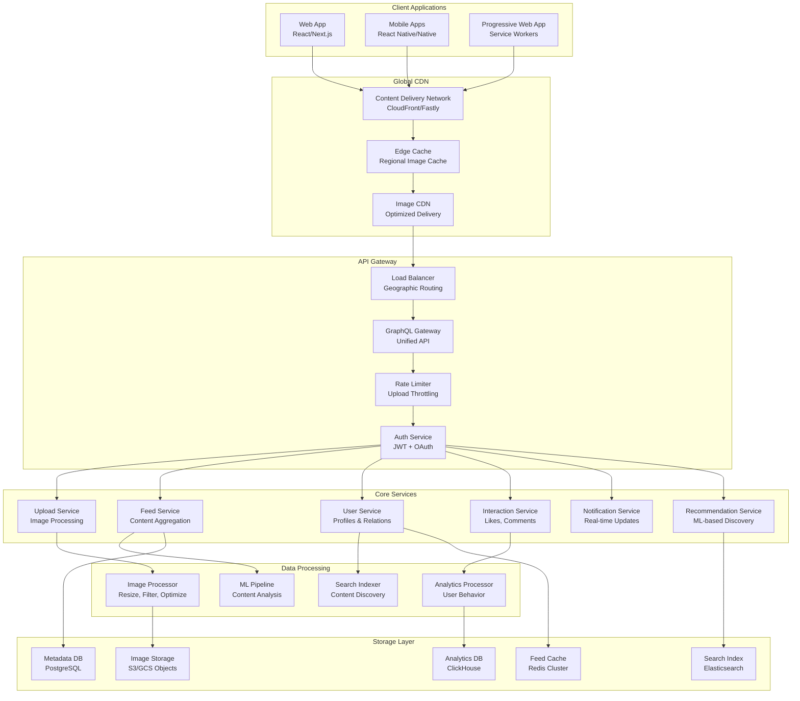

### Image Upload & Processing Pipeline

[⬆️ Back to Top](#-table-of-contents)

---


```mermaid
graph TD
    subgraph "Upload Flow"
        CLIENT[Client Upload]
        VALIDATION[File Validation<br/>Size, Format, Content]
        VIRUS_SCAN[Virus Scanning<br/>Malware Detection]
        TEMP_STORAGE[Temporary Storage<br/>Processing Queue]
    end
    
    subgraph "Processing Pipeline"
        METADATA_EXTRACT[Metadata Extraction<br/>EXIF, Geolocation]
        CONTENT_MODERATION[Content Moderation<br/>NSFW, Violence Detection]
        IMAGE_PROCESSING[Image Processing<br/>Multiple Resolutions]
        COMPRESSION[Compression<br/>WebP, AVIF, JPEG]
    end
    
    subgraph "Optimization & Storage"
        RESPONSIVE_VARIANTS[Responsive Variants<br/>Thumbnail to Full-res]
        CDN_DISTRIBUTION[CDN Distribution<br/>Global Replication]
        METADATA_STORAGE[Metadata Storage<br/>Database Record]
        SEARCH_INDEXING[Search Indexing<br/>Tags, Description]
    end
    
    subgraph "Real-time Updates"
        FEED_UPDATE[Feed Update<br/>Follower Notification]
        PUSH_NOTIFICATION[Push Notification<br/>Mobile Alerts]
        WEBSOCKET_BROADCAST[WebSocket Broadcast<br/>Real-time UI]
    end
    
    CLIENT --> VALIDATION
    VALIDATION --> VIRUS_SCAN
    VIRUS_SCAN --> TEMP_STORAGE
    
    TEMP_STORAGE --> METADATA_EXTRACT
    METADATA_EXTRACT --> CONTENT_MODERATION
    CONTENT_MODERATION --> IMAGE_PROCESSING
    IMAGE_PROCESSING --> COMPRESSION
    
    COMPRESSION --> RESPONSIVE_VARIANTS
    RESPONSIVE_VARIANTS --> CDN_DISTRIBUTION
    CDN_DISTRIBUTION --> METADATA_STORAGE
    METADATA_STORAGE --> SEARCH_INDEXING
    
    SEARCH_INDEXING --> FEED_UPDATE
    FEED_UPDATE --> PUSH_NOTIFICATION
    PUSH_NOTIFICATION --> WEBSOCKET_BROADCAST
```

---

## UI/UX and Component Structure

[⬆️ Back to Top](#-table-of-contents)

---


### Frontend Component Architecture

[⬆️ Back to Top](#-table-of-contents)

---


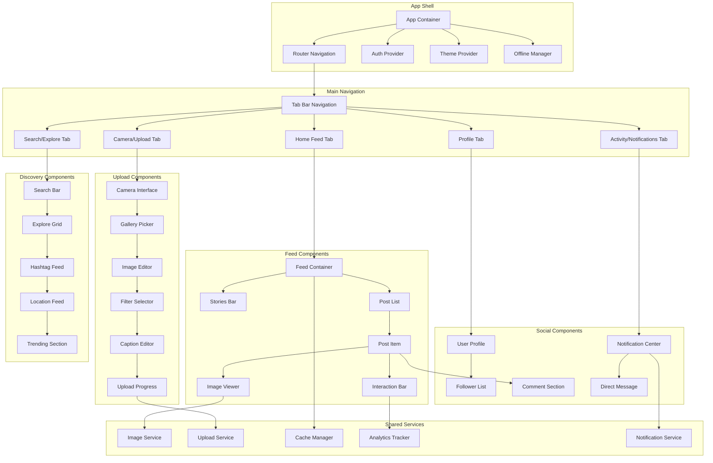

### Responsive Image Rendering

[⬆️ Back to Top](#-table-of-contents)

---


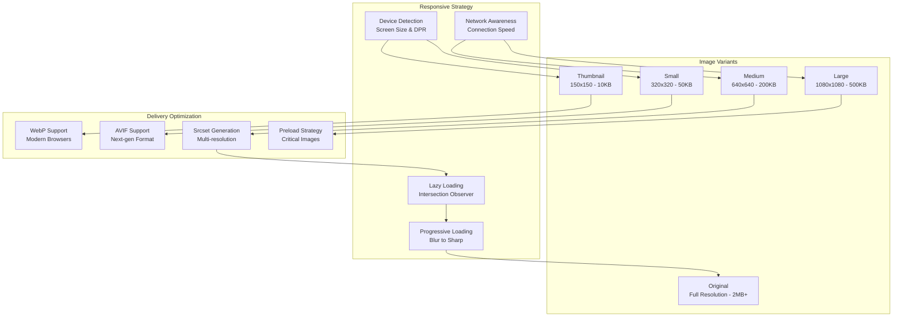

---

## Real-Time Sync, Data Modeling & APIs

[⬆️ Back to Top](#-table-of-contents)

---


### Feed Algorithm Implementation

[⬆️ Back to Top](#-table-of-contents)

---


#### Chronological vs Algorithmic Feed

[⬆️ Back to Top](#-table-of-contents)

---


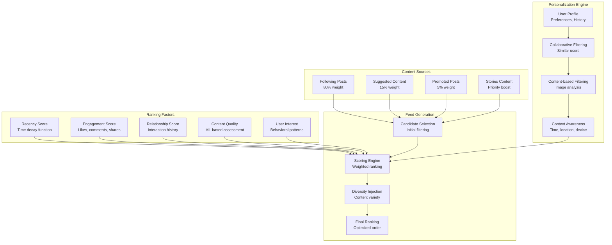

#### Real-time Feed Updates

[⬆️ Back to Top](#-table-of-contents)

---


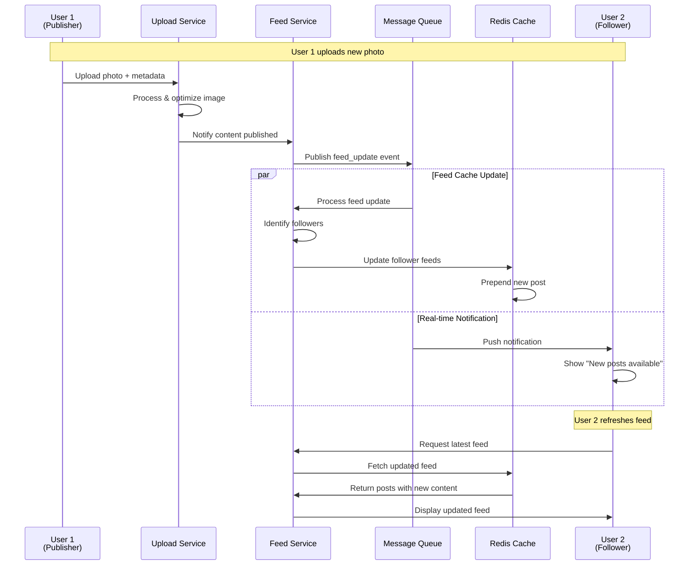

### Image Processing Algorithm

[⬆️ Back to Top](#-table-of-contents)

---


#### Multi-Resolution Generation

[⬆️ Back to Top](#-table-of-contents)

---


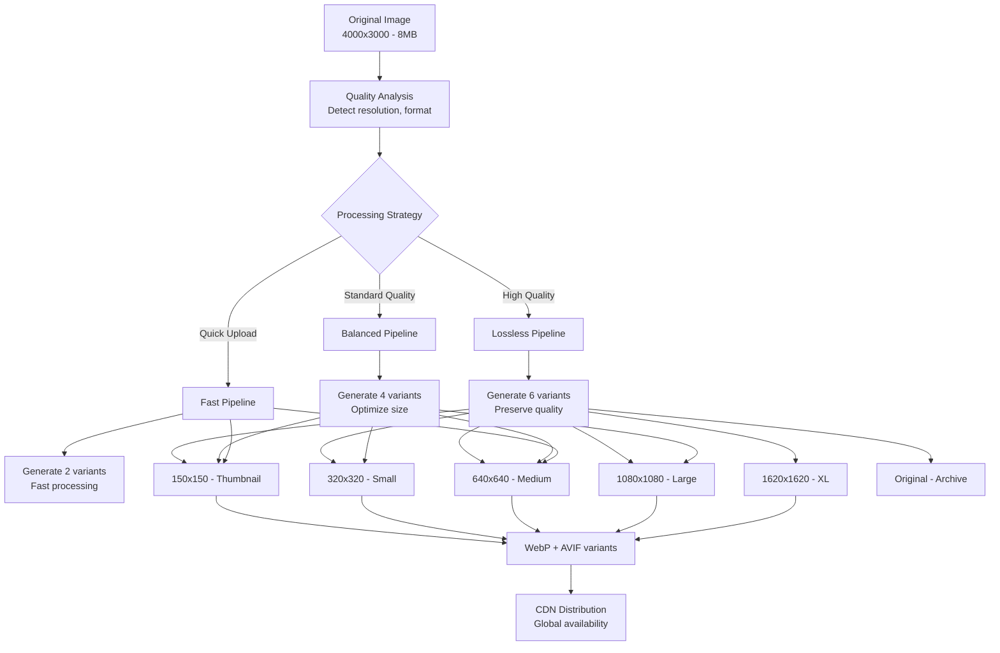

### Data Models

[⬆️ Back to Top](#-table-of-contents)

---


#### Post Schema

[⬆️ Back to Top](#-table-of-contents)

---

```
Post {
  id: UUID
  user_id: UUID
  caption: String
  location?: {
    name: String
    coordinates: GeoPoint
  }
  media: [{
    id: UUID
    type: 'image' | 'video'
    urls: {
      thumbnail: String
      small: String
      medium: String
      large: String
      original: String
    }
    alt_text?: String
    filters_applied: [String]
  }]
  hashtags: [String]
  mentions: [UserID]
  metadata: {
    created_at: DateTime
    updated_at: DateTime
    is_archived: Boolean
    privacy: 'public' | 'followers' | 'private'
    comments_enabled: Boolean
    likes_enabled: Boolean
  }
  engagement: {
    likes_count: Integer
    comments_count: Integer
    shares_count: Integer
    saves_count: Integer
    views_count: Integer
  }
  algorithm_scores: {
    quality_score: Float
    engagement_rate: Float
    virality_potential: Float
    spam_probability: Float
  }
}
```

#### User Profile Schema

[⬆️ Back to Top](#-table-of-contents)

---

```
UserProfile {
  id: UUID
  username: String
  display_name: String
  bio?: String
  avatar_url?: String
  website?: String
  verified: Boolean
  private: Boolean
  statistics: {
    posts_count: Integer
    followers_count: Integer
    following_count: Integer
    stories_highlights: Integer
  }
  preferences: {
    theme: 'light' | 'dark' | 'auto'
    language: String
    timezone: String
    notifications: {
      likes: Boolean
      comments: Boolean
      follows: Boolean
      mentions: Boolean
      stories: Boolean
    }
    privacy: {
      profile_visibility: 'public' | 'followers' | 'private'
      story_visibility: 'public' | 'followers' | 'close_friends'
      activity_status: Boolean
      read_receipts: Boolean
    }
  }
}
```

---

## Performance and Scalability

[⬆️ Back to Top](#-table-of-contents)

---


### Image Delivery Optimization

[⬆️ Back to Top](#-table-of-contents)

---


#### Progressive Image Loading

[⬆️ Back to Top](#-table-of-contents)

---


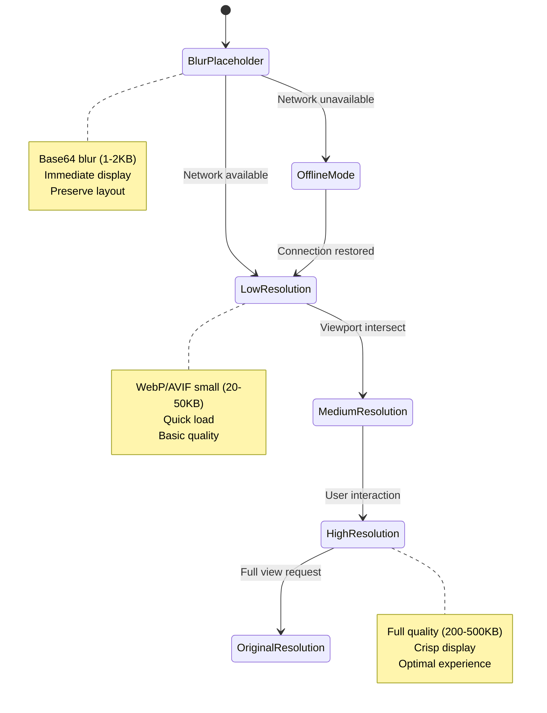

#### CDN Caching Strategy

[⬆️ Back to Top](#-table-of-contents)

---


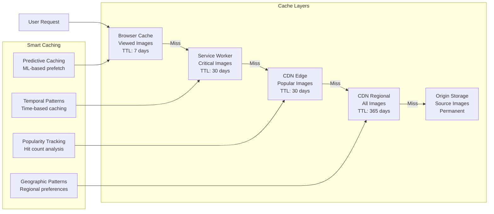

### Database Scaling Strategy

[⬆️ Back to Top](#-table-of-contents)

---


#### Sharding by User ID

[⬆️ Back to Top](#-table-of-contents)

---


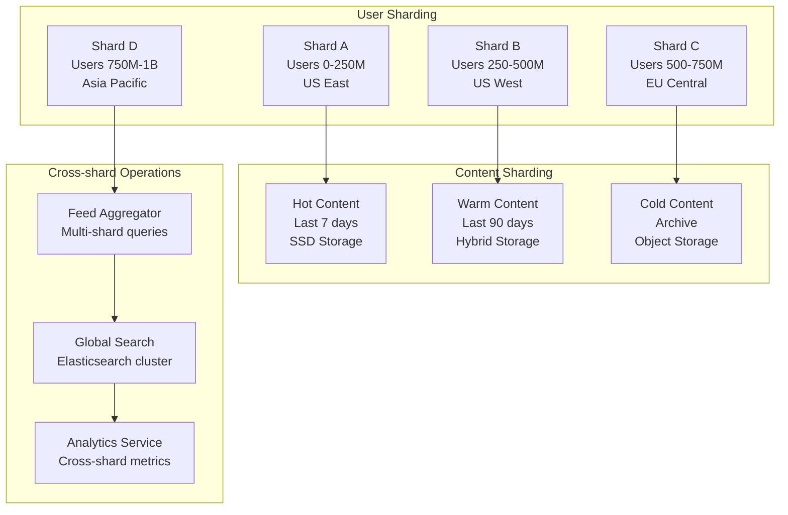

### Upload Performance Optimization

[⬆️ Back to Top](#-table-of-contents)

---


#### Parallel Upload Strategy

[⬆️ Back to Top](#-table-of-contents)

---


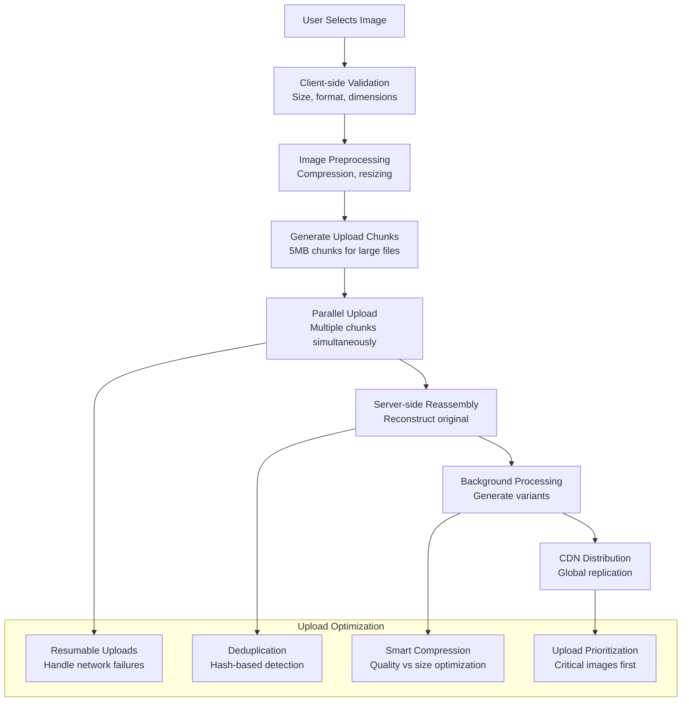

---

## Security and Privacy

[⬆️ Back to Top](#-table-of-contents)

---


### Content Moderation Pipeline

[⬆️ Back to Top](#-table-of-contents)

---


#### Automated Content Screening

[⬆️ Back to Top](#-table-of-contents)

---


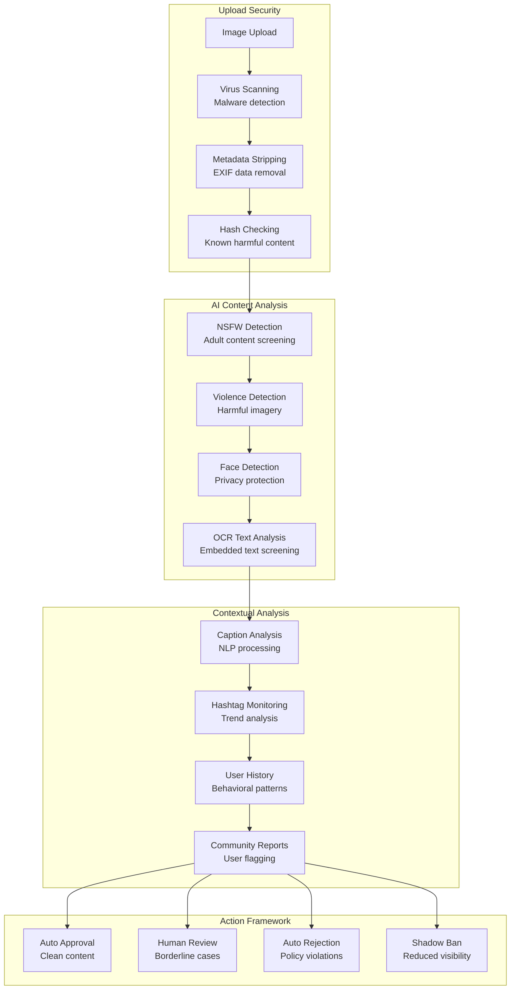

### Privacy Protection Framework

[⬆️ Back to Top](#-table-of-contents)

---


#### Data Protection Strategy

[⬆️ Back to Top](#-table-of-contents)

---


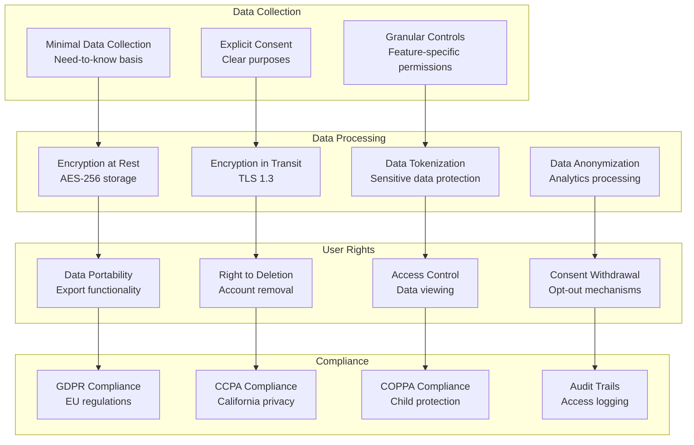

---

## Testing, Monitoring, and Maintainability

[⬆️ Back to Top](#-table-of-contents)

---


### Testing Strategy

[⬆️ Back to Top](#-table-of-contents)

---


#### Comprehensive Testing Framework

[⬆️ Back to Top](#-table-of-contents)

---


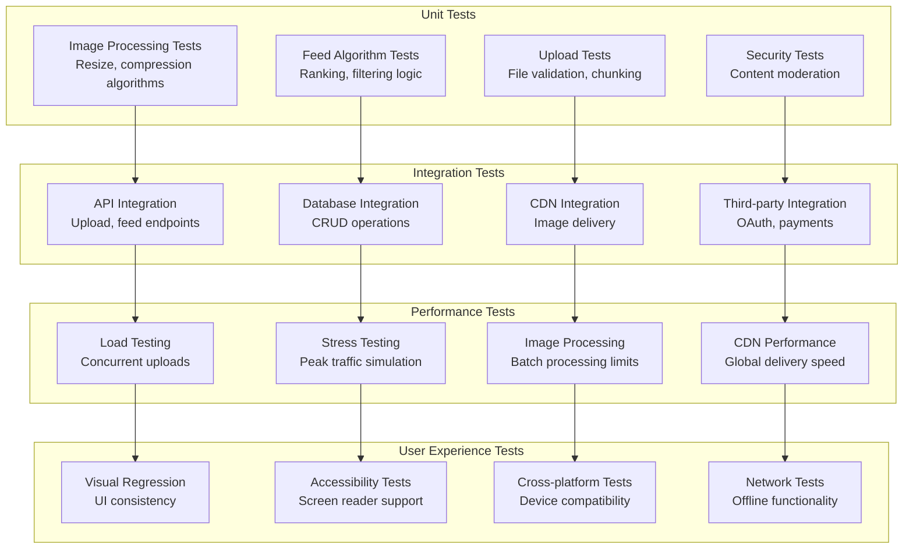

### Monitoring and Analytics

[⬆️ Back to Top](#-table-of-contents)

---


#### Real-time Metrics Dashboard

[⬆️ Back to Top](#-table-of-contents)

---


```mermaid
graph TB
    subgraph "User Experience Metrics"
        UPLOAD_SUCCESS[Upload Success Rate<br/>Target: >99%]
        IMAGE_LOAD_TIME[Image Load Time<br/>Target: <2s]
        FEED_REFRESH_TIME[Feed Refresh Time<br/>Target: <500ms]
        INTERACTION_LATENCY[Interaction Latency<br/>Target: <100ms]
    end
    
    subgraph "System Performance"
        CDN_HIT_RATE[CDN Hit Rate<br/>Target: >95%]
        PROCESSING_TIME[Image Processing Time<br/>Target: <30s]
        DATABASE_PERFORMANCE[Database Performance<br/>Query response time]
        API_THROUGHPUT[API Throughput<br/>Requests/second]
    end
    
    subgraph "Business Metrics"
        DAILY_UPLOADS[Daily Uploads<br/>Growth tracking]
        USER_ENGAGEMENT[User Engagement<br/>Session duration]
        CONTENT_QUALITY[Content Quality<br/>Moderation rates]
        REVENUE_METRICS[Revenue Metrics<br/>Ad performance]
    end
    
    subgraph "Alert Framework"
        THRESHOLD_ALERTS[Threshold Alerts<br/>Performance degradation]
        ANOMALY_DETECTION[Anomaly Detection<br/>Usage pattern changes]
        ERROR_TRACKING[Error Tracking<br/>Crash reporting]
        ESCALATION_POLICIES[Escalation Policies<br/>Incident response]
    end
    
    UPLOAD_SUCCESS --> THRESHOLD_ALERTS
    CDN_HIT_RATE --> ANOMALY_DETECTION
    DAILY_UPLOADS --> ERROR_TRACKING
    USER_ENGAGEMENT --> ESCALATION_POLICIES
```

---

## Trade-offs, Deep Dives, and Extensions

[⬆️ Back to Top](#-table-of-contents)

---


### Storage Strategy Trade-offs

[⬆️ Back to Top](#-table-of-contents)

---


| Approach | Object Storage (S3) | CDN-first | Distributed FS | Hybrid |
|----------|-------------------|-----------|----------------|---------|
| **Cost** | Medium | High | Low | Medium |
| **Performance** | Good | Excellent | Variable | Good |
| **Scalability** | Excellent | Excellent | Good | Excellent |
| **Complexity** | Low | Medium | High | High |
| **Global Reach** | Good | Excellent | Limited | Excellent |
| **Durability** | 99.999999999% | Dependent | Variable | High |

### Feed Algorithm Trade-offs

[⬆️ Back to Top](#-table-of-contents)

---


#### Chronological vs Algorithmic

[⬆️ Back to Top](#-table-of-contents)

---


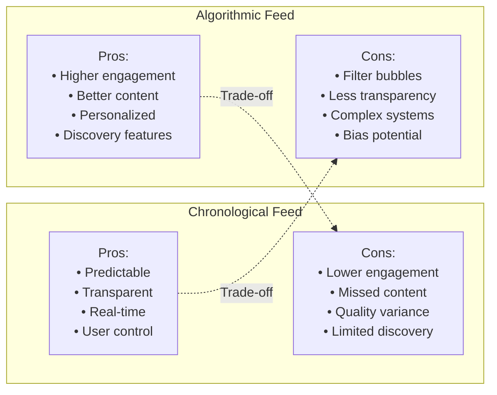

### Advanced Features

[⬆️ Back to Top](#-table-of-contents)

---


#### AI-Powered Content Enhancement

[⬆️ Back to Top](#-table-of-contents)

---


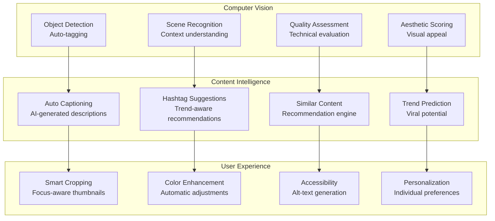

### Future Extensions

[⬆️ Back to Top](#-table-of-contents)

---


#### Next-Generation Features

[⬆️ Back to Top](#-table-of-contents)

---


1. **Immersive Content**:
   - AR filters and effects
   - 3D photo viewing
   - Virtual gallery spaces
   - Interactive storytelling

2. **AI-Enhanced Creation**:
   - Style transfer filters
   - Content generation
   - Smart editing suggestions
   - Automated highlight reels

3. **Social Commerce**:
   - Shoppable posts
   - Virtual try-on
   - Influencer marketplace
   - Live shopping streams

4. **Advanced Analytics**:
   - Emotional engagement tracking
   - Visual trend analysis
   - Creator performance insights
   - Audience behavior mapping

This comprehensive design provides a robust foundation for building a scalable, engaging photo-sharing platform that handles millions of users while delivering high-quality visual experiences with advanced social features. 