# Create a Photo-Sharing App with Feed and Uploading (like Instagram)


## 📋 Table of Contents

- [Create a Photo-Sharing App with Feed and Uploading (like Instagram)](#create-a-photo-sharing-app-with-feed-and-uploading-like-instagram)
  - [Table of Contents](#table-of-contents)
  - [Clarify the Problem and Requirements](#clarify-the-problem-and-requirements)
    - [Problem Understanding](#problem-understanding)
    - [Functional Requirements](#functional-requirements)
    - [Non-Functional Requirements](#non-functional-requirements)
    - [Key Assumptions](#key-assumptions)
  - [High-Level Architecture](#high-level-architecture)
    - [Global System Architecture](#global-system-architecture)
    - [Image Upload & Processing Pipeline](#image-upload-processing-pipeline)
  - [UI/UX and Component Structure](#uiux-and-component-structure)
    - [Frontend Component Architecture](#frontend-component-architecture)
    - [Responsive Image Rendering](#responsive-image-rendering)
  - [Real-Time Sync, Data Modeling & APIs](#real-time-sync-data-modeling-apis)
    - [Feed Algorithm Implementation](#feed-algorithm-implementation)
      - [Chronological vs Algorithmic Feed](#chronological-vs-algorithmic-feed)
      - [Real-time Feed Updates](#real-time-feed-updates)
    - [Image Processing Algorithm](#image-processing-algorithm)
      - [Multi-Resolution Generation](#multi-resolution-generation)
    - [Data Models](#data-models)
      - [Post Schema](#post-schema)
      - [User Profile Schema](#user-profile-schema)
  - [TypeScript Interfaces & Component Props](#typescript-interfaces--component-props)
    - [Core Data Interfaces](#core-data-interfaces)
    - [Component Props Interfaces](#component-props-interfaces)
  - [API Reference](#api-reference)
  - [Performance and Scalability](#performance-and-scalability)
    - [Image Delivery Optimization](#image-delivery-optimization)
      - [Progressive Image Loading](#progressive-image-loading)
      - [CDN Caching Strategy](#cdn-caching-strategy)
    - [Database Scaling Strategy](#database-scaling-strategy)
      - [Sharding by User ID](#sharding-by-user-id)
    - [Upload Performance Optimization](#upload-performance-optimization)
      - [Parallel Upload Strategy](#parallel-upload-strategy)
  - [Security and Privacy](#security-and-privacy)
    - [Content Moderation Pipeline](#content-moderation-pipeline)
      - [Automated Content Screening](#automated-content-screening)
    - [Privacy Protection Framework](#privacy-protection-framework)
      - [Data Protection Strategy](#data-protection-strategy)
  - [Testing, Monitoring, and Maintainability](#testing-monitoring-and-maintainability)
    - [Testing Strategy](#testing-strategy)
      - [Comprehensive Testing Framework](#comprehensive-testing-framework)
    - [Monitoring and Analytics](#monitoring-and-analytics)
      - [Real-time Metrics Dashboard](#real-time-metrics-dashboard)
  - [Trade-offs, Deep Dives, and Extensions](#trade-offs-deep-dives-and-extensions)
    - [Storage Strategy Trade-offs](#storage-strategy-trade-offs)
    - [Feed Algorithm Trade-offs](#feed-algorithm-trade-offs)
      - [Chronological vs Algorithmic](#chronological-vs-algorithmic)
    - [Advanced Features](#advanced-features)
      - [AI-Powered Content Enhancement](#ai-powered-content-enhancement)
    - [Future Extensions](#future-extensions)
      - [Next-Generation Features](#next-generation-features)

---

## Table of Contents
1. [Clarify the Problem and Requirements](#clarify-the-problem-and-requirements)
2. [High-Level Architecture](#high-level-architecture)
3. [UI/UX and Component Structure](#uiux-and-component-structure)
4. [Real-Time Sync, Data Modeling & APIs](#real-time-sync-data-modeling--apis)
5. [Performance and Scalability](#performance-and-scalability)
6. [Security and Privacy](#security-and-privacy)
7. [Testing, Monitoring, and Maintainability](#testing-monitoring-and-maintainability)
8. [Trade-offs, Deep Dives, and Extensions](#trade-offs-deep-dives-and-extensions)

---

## Clarify the Problem and Requirements

[⬆️ Back to Top](#--table-of-contents)

---


### Problem Understanding

[⬆️ Back to Top](#--table-of-contents)

---

Design a photo-sharing platform that enables users to upload, edit, share, and discover visual content through feeds, stories, and social interactions, similar to Instagram, Pinterest, or Snapchat. The system must handle millions of photos daily with real-time interactions and global content delivery.

### Functional Requirements

[⬆️ Back to Top](#--table-of-contents)

---

- **Photo Upload & Processing**: Multi-format support, automatic optimization, filters
- **Social Feed**: Algorithmic timeline, stories, explore page, hashtag discovery
- **Content Interaction**: Likes, comments, shares, saves, direct messaging
- **User Profiles**: Follower/following system, profile customization, bio, highlights
- **Content Creation**: Photo editing, filters, captions, tagging, location
- **Discovery Features**: Search by hashtags, users, locations, trending content
- **Stories & Ephemeral Content**: 24-hour stories, highlights, live streaming
- **Cross-platform**: Web, iOS, Android with seamless sync

### Non-Functional Requirements

[⬆️ Back to Top](#--table-of-contents)

---

- **Performance**: <2s image upload, <500ms feed load, instant interactions
- **Scalability**: 1B+ users, 100M+ photos/day, 500M+ interactions/day
- **Availability**: 99.95% uptime with regional failover
- **Storage**: Petabyte-scale image storage, global CDN distribution
- **Quality**: Multiple resolutions, progressive loading, adaptive delivery
- **Security**: Content moderation, privacy controls, secure uploads

### Key Assumptions

[⬆️ Back to Top](#--table-of-contents)

---

- Average photo size: 2-8MB original, optimized to 200KB-2MB
- User activity: 20 photos viewed/minute, 5 interactions/minute
- Upload frequency: 95M photos/day globally
- Storage growth: 50TB/day of new content
- Peak traffic: 3x normal load during events
- Content lifecycle: 80% of interactions in first 24 hours

---

## High-Level Architecture

[⬆️ Back to Top](#--table-of-contents)

---


### Global System Architecture

[⬆️ Back to Top](#--table-of-contents)

---


### Image Upload & Processing Pipeline

[⬆️ Back to Top](#--table-of-contents)

---


---

## UI/UX and Component Structure

[⬆️ Back to Top](#--table-of-contents)

---


### Frontend Component Architecture

[⬆️ Back to Top](#--table-of-contents)

---


#### React Component Implementation

[⬆️ Back to Top](#--table-of-contents)

---

**PhotoFeedContainer.jsx**
```jsx
import React, { useState, useEffect, useCallback, useRef } from 'react';
import { PhotoProvider } from './PhotoContext';
import StoryBar from './StoryBar';
import PostList from './PostList';
import CameraInterface from './CameraInterface';
import ImageEditor from './ImageEditor';
import { useInfiniteQuery } from 'react-query';

const PhotoFeedContainer = () => {
  const [posts, setPosts] = useState([]);
  const [stories, setStories] = useState([]);
  const [activeTab, setActiveTab] = useState('home');
  const [uploadModalOpen, setUploadModalOpen] = useState(false);
  const [selectedImage, setSelectedImage] = useState(null);

  const {
    data,
    fetchNextPage,
    hasNextPage,
    isFetchingNextPage,
    isLoading
  } = useInfiniteQuery(
    'photoFeed',
    ({ pageParam = null }) => fetchFeedPage(pageParam),
    {
      getNextPageParam: (lastPage) => lastPage.nextCursor,
      staleTime: 5 * 60 * 1000,
    }
  );

  useEffect(() => {
    if (data) {
      const allPosts = data.pages.flatMap(page => page.posts);
      setPosts(allPosts);
    }
  }, [data]);

  useEffect(() => {
    fetchStories();
  }, []);

  const fetchStories = async () => {
    try {
      const response = await fetch('/api/stories');
      const storiesData = await response.json();
      setStories(storiesData.stories);
    } catch (error) {
      console.error('Failed to fetch stories:', error);
    }
  };

  const handleImageUpload = useCallback((imageFile) => {
    setSelectedImage(imageFile);
    setUploadModalOpen(true);
  }, []);

  const handlePostCreate = useCallback(async (postData) => {
    try {
      const response = await fetch('/api/posts', {
        method: 'POST',
        headers: {
          'Content-Type': 'application/json'
        },
        body: JSON.stringify(postData)
      });
      
      const newPost = await response.json();
      setPosts(prev => [newPost, ...prev]);
      setUploadModalOpen(false);
      setSelectedImage(null);
    } catch (error) {
      console.error('Failed to create post:', error);
    }
  }, []);

  const updatePost = useCallback((postId, updates) => {
    setPosts(prev => prev.map(post => 
      post.id === postId ? { ...post, ...updates } : post
    ));
  }, []);

  const fetchFeedPage = async (cursor) => {
    const response = await fetch(`/api/feed?cursor=${cursor || ''}&limit=10`);
    return response.json();
  };

  return (
    <PhotoProvider value={{
      posts,
      stories,
      updatePost,
      onImageUpload: handleImageUpload
    }}>
      <div className="photo-feed-container">
        {/* Tab Navigation */}
        <nav className="tab-navigation">
          <button 
            className={activeTab === 'home' ? 'active' : ''}
            onClick={() => setActiveTab('home')}
          >
            Home
          </button>
          <button 
            className={activeTab === 'search' ? 'active' : ''}
            onClick={() => setActiveTab('search')}
          >
            Search
          </button>
          <button 
            className={activeTab === 'camera' ? 'active' : ''}
            onClick={() => setActiveTab('camera')}
          >
            Camera
          </button>
        </nav>

        {/* Content Area */}
        {activeTab === 'home' && (
          <div className="home-feed">
            <StoryBar stories={stories} />
            <PostList 
              posts={posts}
              onLoadMore={fetchNextPage}
              hasNextPage={hasNextPage}
              isLoading={isFetchingNextPage}
            />
          </div>
        )}

        {activeTab === 'camera' && (
          <CameraInterface onImageCapture={handleImageUpload} />
        )}

        {/* Upload Modal */}
        {uploadModalOpen && selectedImage && (
          <ImageEditor
            image={selectedImage}
            onSave={handlePostCreate}
            onCancel={() => {
              setUploadModalOpen(false);
              setSelectedImage(null);
            }}
          />
        )}
      </div>
    </PhotoProvider>
  );
};

export default PhotoFeedContainer;
```

**PostItem.jsx**

**What this code does:**
• **Main Purpose**: Individual photo post component with social interactions
• **Optimistic Updates**: Immediate UI feedback before server confirmation
• **Key Functions**:
  - `handleLike()` - Toggles like status with optimistic update and error rollback
  - `handleShare()` - Uses Web Share API with clipboard fallback
  - `formatTimeAgo()` - Converts timestamps to user-friendly relative time
  - `handleComment()` - Toggles comment section visibility
  - Image lazy loading with placeholder skeleton
  - Double-tap gesture detection for quick liking

```jsx
import React, { useState, useContext, useRef } from 'react';
import { PhotoContext } from './PhotoContext';
import ImageViewer from './ImageViewer';
import InteractionBar from './InteractionBar';
import CommentSection from './CommentSection';

const PostItem = ({ post }) => {
  const { updatePost } = useContext(PhotoContext);
  const [showComments, setShowComments] = useState(false);
  const [isLiked, setIsLiked] = useState(post.isLiked);
  const [likeCount, setLikeCount] = useState(post.likeCount);
  const [imageLoaded, setImageLoaded] = useState(false);
  const imageRef = useRef(null);

  const handleLike = async () => {
    const newLikedState = !isLiked;
    const newLikeCount = likeCount + (newLikedState ? 1 : -1);
    
    // Optimistic update
    setIsLiked(newLikedState);
    setLikeCount(newLikeCount);
    
    try {
      await fetch(`/api/posts/${post.id}/like`, {
        method: newLikedState ? 'POST' : 'DELETE'
      });
      
      updatePost(post.id, {
        isLiked: newLikedState,
        likeCount: newLikeCount
      });
    } catch (error) {
      // Revert on error
      setIsLiked(!newLikedState);
      setLikeCount(likeCount);
      console.error('Failed to update like:', error);
    }
  };

  const handleComment = () => {
    setShowComments(!showComments);
  };

  const handleShare = async () => {
    if (navigator.share) {
      try {
        await navigator.share({
          title: `Photo by ${post.author.username}`,
          text: post.caption,
          url: `/post/${post.id}`
        });
      } catch (error) {
        console.log('Error sharing:', error);
      }
    } else {
      // Fallback to clipboard
      navigator.clipboard.writeText(`${window.location.origin}/post/${post.id}`);
    }
  };

  return (
    <article className="post-item">
      {/* Post Header */}
      <header className="post-header">
        <div className="author-info">
          
          <div className="author-details">
            <span className="author-username">{post.author.username}</span>
            {post.location && (
              <span className="post-location">{post.location.name}</span>
            )}
          </div>
        </div>
        <button className="more-options">⋯</button>
      </header>

      {/* Image Content */}
      <div className="post-image-container">
        <ImageViewer
          ref={imageRef}
          images={post.media}
          onLoad={() => setImageLoaded(true)}
          onDoubleClick={handleLike}
        />
        
        {/* Image overlay effects */}
        {!imageLoaded && (
          <div className="image-placeholder">
            <div className="loading-skeleton" />
          </div>
        )}
      </div>

      {/* Interaction Bar */}
      <InteractionBar
        isLiked={isLiked}
        likeCount={likeCount}
        commentCount={post.commentCount}
        onLike={handleLike}
        onComment={handleComment}
        onShare={handleShare}
      />

      {/* Caption and Comments */}
      <div className="post-content">
        {post.caption && (
          <div className="post-caption">
            <span className="author-username">{post.author.username}</span>
            <span className="caption-text">{post.caption}</span>
          </div>
        )}
        
        {post.hashtags && post.hashtags.length > 0 && (
          <div className="hashtags">
            {post.hashtags.map(tag => (
              <span key={tag} className="hashtag">#{tag}</span>
            ))}
          </div>
        )}

        <time className="post-timestamp">
          {formatTimeAgo(post.createdAt)}
        </time>
      </div>

      {/* Comments Section */}
      {showComments && (
        <CommentSection
          postId={post.id}
          comments={post.comments}
          onCommentAdd={(comment) => {
            updatePost(post.id, {
              commentCount: post.commentCount + 1,
              comments: [...(post.comments || []), comment]
            });
          }}
        />
      )}
    </article>
  );
};

// Helper function
const formatTimeAgo = (timestamp) => {
  const now = new Date();
  const postTime = new Date(timestamp);
  const diffInHours = Math.floor((now - postTime) / (1000 * 60 * 60));
  
  if (diffInHours < 1) return 'Just now';
  if (diffInHours < 24) return `${diffInHours}h ago`;
  return `${Math.floor(diffInHours / 24)}d ago`;
};

export default PostItem;
```

**ImageEditor.jsx**

**What this code does:**
• **Main Purpose**: Photo editing interface with filters and caption management
• **Canvas Processing**: Real-time filter application using HTML5 Canvas
• **Key Functions**:
  - `drawImageToCanvas()` - Renders image with applied filters to canvas
  - `handleFilterSelect()` - Applies CSS filters to image preview
  - `extractHashtags()` - Parses caption text for hashtag detection
  - `handleSave()` - Converts canvas to blob and uploads to server
  - Real-time filter preview with predefined filter effects

```jsx
import React, { useState, useRef, useEffect } from 'react';
import FilterSelector from './FilterSelector';
import CaptionEditor from './CaptionEditor';

const ImageEditor = ({ image, onSave, onCancel }) => {
  const [selectedFilter, setSelectedFilter] = useState(null);
  const [caption, setCaption] = useState('');
  const [hashtags, setHashtags] = useState([]);
  const [location, setLocation] = useState(null);
  const [isUploading, setIsUploading] = useState(false);
  const canvasRef = useRef(null);
  const imageRef = useRef(null);

  const filters = [
    { id: 'none', name: 'Original', filter: 'none' },
    { id: 'vintage', name: 'Vintage', filter: 'sepia(0.5) saturate(1.4)' },
    { id: 'dramatic', name: 'Dramatic', filter: 'contrast(1.3) brightness(0.9)' },
    { id: 'mono', name: 'Mono', filter: 'grayscale(1)' },
    { id: 'bright', name: 'Bright', filter: 'brightness(1.2) saturate(1.1)' }
  ];

  useEffect(() => {
    if (image && canvasRef.current) {
      drawImageToCanvas();
    }
  }, [image, selectedFilter]);

  const drawImageToCanvas = () => {
    const canvas = canvasRef.current;
    const ctx = canvas.getContext('2d');
    const img = new Image();
    
    img.onload = () => {
      canvas.width = img.width;
      canvas.height = img.height;
      
      // Apply filter if selected
      if (selectedFilter) {
        ctx.filter = selectedFilter.filter;
      }
      
      ctx.drawImage(img, 0, 0);
    };
    
    img.src = URL.createObjectURL(image);
  };

  const handleFilterSelect = (filter) => {
    setSelectedFilter(filter);
  };

  const extractHashtags = (text) => {
    const hashtagRegex = /#[\w]+/g;
    const matches = text.match(hashtagRegex) || [];
    return matches.map(tag => tag.slice(1)); // Remove # symbol
  };

  const handleCaptionChange = (newCaption) => {
    setCaption(newCaption);
    setHashtags(extractHashtags(newCaption));
  };

  const handleSave = async () => {
    setIsUploading(true);
    
    try {
      // Convert canvas to blob
      const canvas = canvasRef.current;
      const blob = await new Promise(resolve => {
        canvas.toBlob(resolve, 'image/jpeg', 0.9);
      });

      // Create form data for upload
      const formData = new FormData();
      formData.append('image', blob, 'edited-image.jpg');
      formData.append('caption', caption);
      formData.append('hashtags', JSON.stringify(hashtags));
      
      if (location) {
        formData.append('location', JSON.stringify(location));
      }

      // Upload image
      const uploadResponse = await fetch('/api/upload', {
        method: 'POST',
        body: formData
      });
      
      const uploadResult = await uploadResponse.json();
      
      // Create post
      const postData = {
        mediaUrl: uploadResult.url,
        caption,
        hashtags,
        location,
        filter: selectedFilter?.id
      };
      
      onSave(postData);
    } catch (error) {
      console.error('Failed to save post:', error);
    } finally {
      setIsUploading(false);
    }
  };

  return (
    <div className="image-editor-modal">
      <div className="editor-container">
        <header className="editor-header">
          <button onClick={onCancel} className="cancel-btn">Cancel</button>
          <h2>New Post</h2>
          <button 
            onClick={handleSave} 
            className="save-btn"
            disabled={isUploading}
          >
            {isUploading ? 'Sharing...' : 'Share'}
          </button>
        </header>

        <div className="editor-content">
          {/* Image Preview */}
          <div className="image-preview">
            <canvas 
              ref={canvasRef}
              className="edited-image"
              style={{
                filter: selectedFilter?.filter || 'none',
                maxWidth: '100%',
                height: 'auto'
              }}
            />
          </div>

          {/* Filter Selection */}
          <FilterSelector
            filters={filters}
            selectedFilter={selectedFilter}
            onFilterSelect={handleFilterSelect}
            previewImage={image}
          />

          {/* Caption Editor */}
          <CaptionEditor
            caption={caption}
            onCaptionChange={handleCaptionChange}
            hashtags={hashtags}
            location={location}
            onLocationChange={setLocation}
          />
        </div>
      </div>
    </div>
  );
};

export default ImageEditor;
```

**ImageViewer.jsx**
```jsx
import React, { useState, useRef, useCallback } from 'react';

const ImageViewer = React.forwardRef(({ 
  images, 
  onLoad, 
  onDoubleClick,
  className = '' 
}, ref) => {
  const [currentIndex, setCurrentIndex] = useState(0);
  const [isLoaded, setIsLoaded] = useState(false);
  const [imageError, setImageError] = useState(false);
  const imageRef = useRef(null);

  const currentImage = images[currentIndex];

  const handleImageLoad = useCallback(() => {
    setIsLoaded(true);
    setImageError(false);
    onLoad?.();
  }, [onLoad]);

  const handleImageError = useCallback(() => {
    setImageError(true);
    setIsLoaded(false);
  }, []);

  const handlePrevious = () => {
    if (currentIndex > 0) {
      setCurrentIndex(currentIndex - 1);
      setIsLoaded(false);
    }
  };

  const handleNext = () => {
    if (currentIndex < images.length - 1) {
      setCurrentIndex(currentIndex + 1);
      setIsLoaded(false);
    }
  };

  const getImageSrc = (image) => {
    // Progressive image loading - use appropriate size based on viewport
    const screenWidth = window.innerWidth;
    const devicePixelRatio = window.devicePixelRatio || 1;
    
    if (screenWidth * devicePixelRatio <= 640) {
      return image.urls.small || image.urls.medium;
    } else if (screenWidth * devicePixelRatio <= 1080) {
      return image.urls.medium || image.urls.large;
    } else {
      return image.urls.large || image.urls.original;
    }
  };

  return (
    <div className={`image-viewer ${className}`} ref={ref}>
      {/* Main Image */}
      <div className="image-container">
        {!isLoaded && !imageError && (
          <div className="image-loading">
            <div className="loading-spinner" />
          </div>
        )}
        
        {imageError ? (
          <div className="image-error">
            <span>Failed to load image</span>
          </div>
        ) : (
          
        )}

        {/* Multiple Image Navigation */}
        {images.length > 1 && (
          <>
            <button
              className="nav-btn prev-btn"
              onClick={handlePrevious}
              disabled={currentIndex === 0}
              aria-label="Previous image"
            >
              ‹
            </button>
            
            <button
              className="nav-btn next-btn"
              onClick={handleNext}
              disabled={currentIndex === images.length - 1}
              aria-label="Next image"
            >
              ›
            </button>

            {/* Image Indicators */}
            <div className="image-indicators">
              {images.map((_, index) => (
                <button
                  key={index}
                  className={`indicator ${index === currentIndex ? 'active' : ''}`}
                  onClick={() => {
                    setCurrentIndex(index);
                    setIsLoaded(false);
                  }}
                  aria-label={`View image ${index + 1}`}
                />
              ))}
            </div>
          </>
        )}
      </div>
    </div>
  );
});

export default ImageViewer;
```

### Responsive Image Rendering

[⬆️ Back to Top](#--table-of-contents)

---


---

## Real-Time Sync, Data Modeling & APIs

[⬆️ Back to Top](#--table-of-contents)

---


### Feed Algorithm Implementation

[⬆️ Back to Top](#--table-of-contents)

---


#### Chronological vs Algorithmic Feed

[⬆️ Back to Top](#--table-of-contents)

---


#### Real-time Feed Updates

[⬆️ Back to Top](#--table-of-contents)

---


### Image Processing Algorithm

[⬆️ Back to Top](#--table-of-contents)

---


#### Multi-Resolution Generation

[⬆️ Back to Top](#--table-of-contents)

---


### Data Models

[⬆️ Back to Top](#--table-of-contents)

---


#### Post Schema

[⬆️ Back to Top](#--table-of-contents)

---

```
Post {
  id: UUID
  user_id: UUID
  caption: String
  location?: {
    name: String
    coordinates: GeoPoint
  }
  media: [{
    id: UUID
    type: 'image' | 'video'
    urls: {
      thumbnail: String
      small: String
      medium: String
      large: String
      original: String
    }
    alt_text?: String
    filters_applied: [String]
  }]
  hashtags: [String]
  mentions: [UserID]
  metadata: {
    created_at: DateTime
    updated_at: DateTime
    is_archived: Boolean
    privacy: 'public' | 'followers' | 'private'
    comments_enabled: Boolean
    likes_enabled: Boolean
  }
  engagement: {
    likes_count: Integer
    comments_count: Integer
    shares_count: Integer
    saves_count: Integer
    views_count: Integer
  }
  algorithm_scores: {
    quality_score: Float
    engagement_rate: Float
    virality_potential: Float
    spam_probability: Float
  }
}
```

#### User Profile Schema

[⬆️ Back to Top](#--table-of-contents)

---

```
UserProfile {
  id: UUID
  username: String
  display_name: String
  bio?: String
  avatar_url?: String
  website?: String
  verified: Boolean
  private: Boolean
  statistics: {
    posts_count: Integer
    followers_count: Integer
    following_count: Integer
    stories_highlights: Integer
  }
  preferences: {
    theme: 'light' | 'dark' | 'auto'
    language: String
    timezone: String
    notifications: {
      likes: Boolean
      comments: Boolean
      follows: Boolean
      mentions: Boolean
      stories: Boolean
    }
    privacy: {
      profile_visibility: 'public' | 'followers' | 'private'
      story_visibility: 'public' | 'followers' | 'close_friends'
      activity_status: Boolean
      read_receipts: Boolean
    }
  }
}
```

### TypeScript Interfaces & Component Props

[⬆️ Back to Top](#--table-of-contents)

---

#### Core Data Interfaces

```typescript
interface Post {
  id: string;
  userId: string;
  caption: string;
  media: MediaItem[];
  location?: Location;
  hashtags: string[];
  mentions: string[];
  likes: number;
  comments: number;
  createdAt: Date;
  isPrivate: boolean;
}

interface MediaItem {
  id: string;
  type: 'image' | 'video';
  url: string;
  thumbnailUrl: string;
  width: number;
  height: number;
  altText?: string;
  filters?: string[];
}

interface User {
  id: string;
  username: string;
  displayName: string;
  bio?: string;
  avatarUrl?: string;
  isVerified: boolean;
  isPrivate: boolean;
  followerCount: number;
  followingCount: number;
  postCount: number;
}

interface Story {
  id: string;
  userId: string;
  media: MediaItem;
  text?: string;
  createdAt: Date;
  expiresAt: Date;
  views: number;
}
```

#### Component Props Interfaces

```typescript
interface PhotoFeedProps {
  posts: Post[];
  onPostLike: (postId: string) => void;
  onPostComment: (postId: string, comment: string) => void;
  onLoadMore: () => void;
  isLoading?: boolean;
  hasMore?: boolean;
}

interface ImageUploadProps {
  onUpload: (files: File[]) => void;
  onFiltersApply: (filters: FilterConfig) => void;
  maxFiles?: number;
  acceptedFormats?: string[];
  compressImages?: boolean;
  showPreview?: boolean;
}

interface UserProfileProps {
  user: User;
  posts: Post[];
  isOwnProfile: boolean;
  onFollow?: () => void;
  onMessage?: () => void;
  onPostSelect: (post: Post) => void;
  displayMode?: 'grid' | 'list';
}

interface StoriesBarProps {
  stories: Story[];
  onStoryView: (storyId: string) => void;
  onAddStory?: () => void;
  autoplay?: boolean;
  showAddButton?: boolean;
}
```

### API Reference

[⬆️ Back to Top](#--table-of-contents)

---

#### Content Management
- `POST /api/posts` - Upload new photo/video post with metadata and filters
- `GET /api/posts/:id` - Fetch specific post with comments and engagement data
- `PUT /api/posts/:id` - Edit post caption, location, or privacy settings
- `DELETE /api/posts/:id` - Delete post and associated media files
- `GET /api/posts/feed` - Get personalized feed with algorithmic ranking

#### Media Processing
- `POST /api/media/upload` - Upload raw media files with progress tracking
- `POST /api/media/filters` - Apply filters and effects to uploaded media
- `GET /api/media/optimize` - Get optimized media URLs for different screen sizes
- `POST /api/media/compress` - Compress media files for faster loading
- `GET /api/media/:id/metadata` - Get media EXIF data and technical information

#### Social Interactions
- `POST /api/posts/:id/like` - Like or unlike a post with engagement tracking
- `POST /api/posts/:id/comments` - Add comment to post with mention support
- `GET /api/posts/:id/comments` - Get paginated comments with nested replies
- `POST /api/users/:id/follow` - Follow or unfollow user with notification
- `GET /api/users/:id/followers` - Get user's followers list with pagination

#### Discovery & Search
- `GET /api/explore` - Get trending and recommended content for discovery
- `GET /api/search/posts` - Search posts by hashtags, location, or content
- `GET /api/search/users` - Search users by username, display name, or bio
- `GET /api/hashtags/trending` - Get trending hashtags with usage statistics
- `GET /api/locations/nearby` - Get nearby locations for photo tagging

#### Stories & Ephemeral Content
- `POST /api/stories` - Create new story with 24-hour expiration
- `GET /api/stories/feed` - Get stories from followed users in chronological order
- `PUT /api/stories/:id/view` - Mark story as viewed with analytics tracking
- `GET /api/stories/:id/viewers` - Get list of users who viewed the story
- `DELETE /api/stories/:id` - Delete story before expiration

#### User Profile
- `GET /api/users/:id/profile` - Get user profile with posts and statistics
- `PUT /api/users/profile` - Update user profile information and settings
- `GET /api/users/:id/posts` - Get user's posts with privacy filtering
- `POST /api/users/avatar` - Update user profile picture with cropping
- `GET /api/users/settings` - Get user privacy and notification preferences

---

## Performance and Scalability

[⬆️ Back to Top](#--table-of-contents)

---


### Image Delivery Optimization

[⬆️ Back to Top](#--table-of-contents)

---


#### Progressive Image Loading

[⬆️ Back to Top](#--table-of-contents)

---


#### CDN Caching Strategy

[⬆️ Back to Top](#--table-of-contents)

---


### Database Scaling Strategy

[⬆️ Back to Top](#--table-of-contents)

---


#### Sharding by User ID

[⬆️ Back to Top](#--table-of-contents)

---


### Upload Performance Optimization

[⬆️ Back to Top](#--table-of-contents)

---


#### Parallel Upload Strategy

[⬆️ Back to Top](#--table-of-contents)

---


---

## Security and Privacy

[⬆️ Back to Top](#--table-of-contents)

---


### Content Moderation Pipeline

[⬆️ Back to Top](#--table-of-contents)

---


#### Automated Content Screening

[⬆️ Back to Top](#--table-of-contents)

---


### Privacy Protection Framework

[⬆️ Back to Top](#--table-of-contents)

---


#### Data Protection Strategy

[⬆️ Back to Top](#--table-of-contents)

---


---

## Testing, Monitoring, and Maintainability

[⬆️ Back to Top](#--table-of-contents)

---


### Testing Strategy

[⬆️ Back to Top](#--table-of-contents)

---


#### Comprehensive Testing Framework

[⬆️ Back to Top](#--table-of-contents)

---


### Monitoring and Analytics

[⬆️ Back to Top](#--table-of-contents)

---


#### Real-time Metrics Dashboard

[⬆️ Back to Top](#--table-of-contents)

---


---

## Trade-offs, Deep Dives, and Extensions

[⬆️ Back to Top](#--table-of-contents)

---


### Storage Strategy Trade-offs

[⬆️ Back to Top](#--table-of-contents)

---


| Approach | Object Storage (S3) | CDN-first | Distributed FS | Hybrid |
|----------|-------------------|-----------|----------------|---------|
| **Cost** | Medium | High | Low | Medium |
| **Performance** | Good | Excellent | Variable | Good |
| **Scalability** | Excellent | Excellent | Good | Excellent |
| **Complexity** | Low | Medium | High | High |
| **Global Reach** | Good | Excellent | Limited | Excellent |
| **Durability** | 99.999999999% | Dependent | Variable | High |

### Feed Algorithm Trade-offs

[⬆️ Back to Top](#--table-of-contents)

---


#### Chronological vs Algorithmic

[⬆️ Back to Top](#--table-of-contents)

---




```mermaid
graph LR
    subgraph "Chronological Feed"
        CHRONO_PROS[Pros:<br/>• Predictable<br/>• Transparent<br/>• Real-time<br/>• User control]
        CHRONO_CONS[Cons:<br/>• Lower engagement<br/>• Missed content<br/>• Quality variance<br/>• Limited discovery]
    end
    
    subgraph "Algorithmic Feed"
        ALGO_PROS[Pros:<br/>• Higher engagement<br/>• Better content<br/>• Personalized<br/>• Discovery features]
        ALGO_CONS[Cons:<br/>• Filter bubbles<br/>• Less transparency<br/>• Complex systems<br/>• Bias potential]
    end
    
    CHRONO_PROS -.->|Trade-off| ALGO_CONS
    ALGO_PROS -.->|Trade-off| CHRONO_CONS
```

### Advanced Features

[⬆️ Back to Top](#--table-of-contents)

---


#### AI-Powered Content Enhancement

[⬆️ Back to Top](#--table-of-contents)

---


### Future Extensions

[⬆️ Back to Top](#--table-of-contents)

---


#### Next-Generation Features

[⬆️ Back to Top](#--table-of-contents)

---


1. **Immersive Content**:
   - AR filters and effects
   - 3D photo viewing
   - Virtual gallery spaces
   - Interactive storytelling

2. **AI-Enhanced Creation**:
   - Style transfer filters
   - Content generation
   - Smart editing suggestions
   - Automated highlight reels

3. **Social Commerce**:
   - Shoppable posts
   - Virtual try-on
   - Influencer marketplace
   - Live shopping streams

4. **Advanced Analytics**:
   - Emotional engagement tracking
   - Visual trend analysis
   - Creator performance insights
   - Audience behavior mapping

This comprehensive design provides a robust foundation for building a scalable, engaging photo-sharing platform that handles millions of users while delivering high-quality visual experiences with advanced social features. 