# Design a Chat Application with Real-Time Messaging and Notifications


## 📋 Table of Contents

- [Design a Chat Application with Real-Time Messaging and Notifications](#design-a-chat-application-with-real-time-messaging-and-notifications)
  - [Table of Contents](#table-of-contents)
  - [Clarify the Problem and Requirements](#clarify-the-problem-and-requirements)
    - [Problem Understanding](#problem-understanding)
    - [Functional Requirements](#functional-requirements)
    - [Non-Functional Requirements](#non-functional-requirements)
    - [Key Assumptions](#key-assumptions)
  - [High-Level Architecture](#high-level-architecture)
    - [Global System Architecture](#global-system-architecture)
    - [Real-time Message Flow Architecture](#real-time-message-flow-architecture)
  - [UI/UX and Component Structure](#uiux-and-component-structure)
    - [Frontend Component Architecture](#frontend-component-architecture)
    - [State Management Architecture](#state-management-architecture)
    - [Responsive Design Strategy](#responsive-design-strategy)
  - [Real-Time Sync, Data Modeling & APIs](#real-time-sync-data-modeling-apis)
    - [Message Ordering and Consistency Algorithm](#message-ordering-and-consistency-algorithm)
      - [Vector Clock Implementation](#vector-clock-implementation)
      - [Message Delivery Guarantees](#message-delivery-guarantees)
    - [Real-time Presence Algorithm](#real-time-presence-algorithm)
      - [Presence State Machine](#presence-state-machine)
      - [Presence Synchronization Flow](#presence-synchronization-flow)
    - [Data Models](#data-models)
      - [Message Schema](#message-schema)
      - [Chat Schema](#chat-schema)
    - [WebSocket Protocol Design](#websocket-protocol-design)
      - [Custom Protocol Over WebSocket](#custom-protocol-over-websocket)
  - [Performance and Scalability](#performance-and-scalability)
    - [Message Sharding Strategy](#message-sharding-strategy)
      - [Horizontal Scaling Architecture](#horizontal-scaling-architecture)
    - [WebSocket Connection Management](#websocket-connection-management)
      - [Connection Pooling and Load Balancing](#connection-pooling-and-load-balancing)
    - [Caching Strategy](#caching-strategy)
      - [Multi-Level Caching Architecture](#multi-level-caching-architecture)
    - [Database Optimization](#database-optimization)
      - [Message Storage Optimization](#message-storage-optimization)
  - [Security and Privacy](#security-and-privacy)
    - [End-to-End Encryption Architecture](#end-to-end-encryption-architecture)
      - [Signal Protocol Implementation](#signal-protocol-implementation)
      - [Message Encryption Flow](#message-encryption-flow)
    - [Authentication and Authorization](#authentication-and-authorization)
      - [Multi-Factor Authentication Flow](#multi-factor-authentication-flow)
    - [Privacy and Data Protection](#privacy-and-data-protection)
      - [Data Minimization Strategy](#data-minimization-strategy)
  - [Testing, Monitoring, and Maintainability](#testing-monitoring-and-maintainability)
    - [Testing Strategy](#testing-strategy)
      - [Real-time System Testing Approach](#real-time-system-testing-approach)
    - [Monitoring and Observability](#monitoring-and-observability)
      - [Real-time Metrics Dashboard](#real-time-metrics-dashboard)
    - [Error Handling and Recovery](#error-handling-and-recovery)
      - [Circuit Breaker Pattern Implementation](#circuit-breaker-pattern-implementation)
  - [Trade-offs, Deep Dives, and Extensions](#trade-offs-deep-dives-and-extensions)
    - [Real-time Protocol Comparison](#real-time-protocol-comparison)
    - [Message Storage Trade-offs](#message-storage-trade-offs)
      - [SQL vs NoSQL for Messages](#sql-vs-nosql-for-messages)
    - [Scaling Challenges and Solutions](#scaling-challenges-and-solutions)
      - [Hot Chat Problem](#hot-chat-problem)
      - [Global Consistency vs Performance](#global-consistency-vs-performance)
    - [Advanced Features](#advanced-features)
      - [AI-Powered Chat Features](#ai-powered-chat-features)
      - [Advanced Presence System](#advanced-presence-system)
    - [Future Extensions](#future-extensions)
      - [Next-Generation Chat Features](#next-generation-chat-features)

---

## Table of Contents
1. [Clarify the Problem and Requirements](#clarify-the-problem-and-requirements)
2. [High-Level Architecture](#high-level-architecture)
3. [UI/UX and Component Structure](#uiux-and-component-structure)
4. [Real-Time Sync, Data Modeling & APIs](#real-time-sync-data-modeling--apis)
5. [Performance and Scalability](#performance-and-scalability)
6. [Security and Privacy](#security-and-privacy)
7. [Testing, Monitoring, and Maintainability](#testing-monitoring-and-maintainability)
8. [Trade-offs, Deep Dives, and Extensions](#trade-offs-deep-dives-and-extensions)

---

## Clarify the Problem and Requirements

[⬆️ Back to Top](#-table-of-contents)

---


### Problem Understanding

[⬆️ Back to Top](#-table-of-contents)

---

Design a real-time chat application supporting instant messaging, group chats, media sharing, and push notifications across multiple devices, similar to WhatsApp, Telegram, or Discord. The system must handle millions of concurrent users with low latency message delivery.

### Functional Requirements

[⬆️ Back to Top](#-table-of-contents)

---

- **Real-time Messaging**: Instant message delivery with typing indicators
- **Group Chats**: Support for channels, private groups, and broadcast lists
- **Media Sharing**: Images, videos, documents, voice messages, location
- **User Presence**: Online/offline status, last seen, active status
- **Message Features**: Reply, forward, delete, edit, reactions, mentions
- **Cross-platform**: Web, mobile apps, desktop with sync across devices
- **Notifications**: Push notifications, in-app notifications, email notifications
- **Search**: Message history search, global search, advanced filters

### Non-Functional Requirements

[⬆️ Back to Top](#-table-of-contents)

---

- **Latency**: <100ms message delivery in same region, <500ms globally
- **Scalability**: 500M+ users, 100B+ messages/day, 50M+ concurrent connections
- **Availability**: 99.95% uptime with graceful degradation
- **Consistency**: Messages delivered in order, no message loss
- **Security**: End-to-end encryption, secure key exchange
- **Performance**: <2s app startup, instant message rendering

### Key Assumptions

[⬆️ Back to Top](#-table-of-contents)

---

- Average message size: 200 bytes, max 64KB
- Peak concurrent users: 50M globally
- Messages per user per day: 50-200
- Group chat average size: 10-50 members, max 100K members
- Media files: Images 1-10MB, videos up to 100MB
- Message retention: 1 year for free users, unlimited for premium

---

## High-Level Architecture

[⬆️ Back to Top](#-table-of-contents)

---


### Global System Architecture

[⬆️ Back to Top](#-table-of-contents)

---


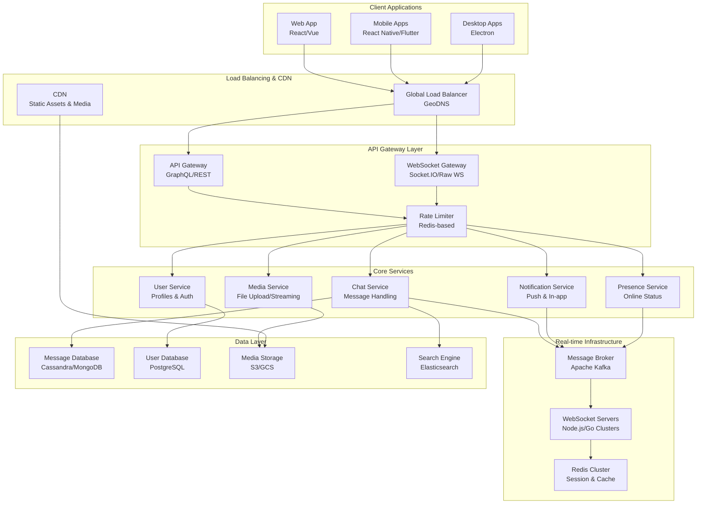

### Real-time Message Flow Architecture

[⬆️ Back to Top](#-table-of-contents)

---


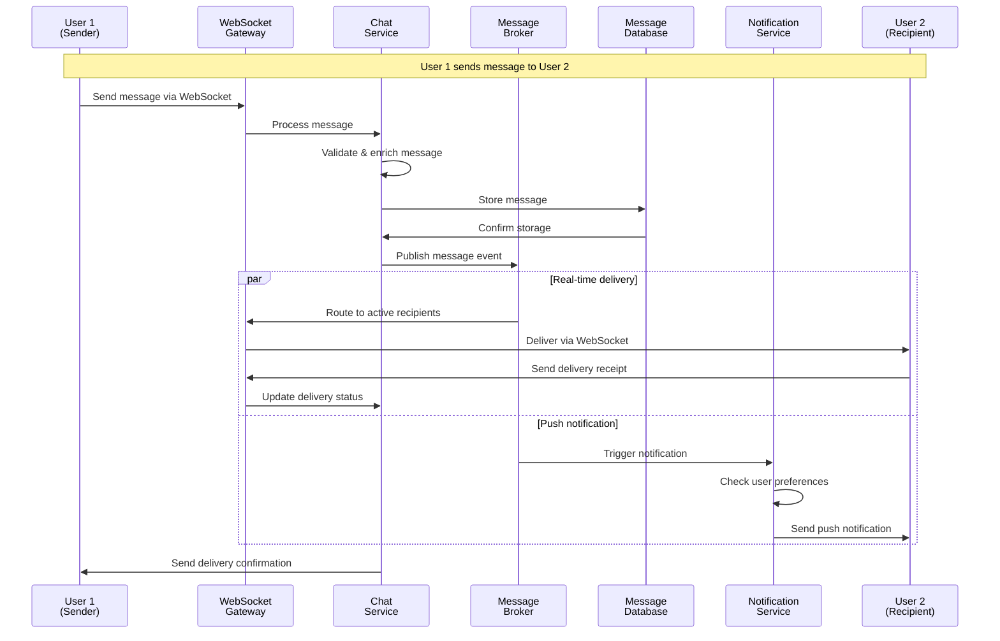

---

## UI/UX and Component Structure

[⬆️ Back to Top](#-table-of-contents)

---


### Frontend Component Architecture

[⬆️ Back to Top](#-table-of-contents)

---


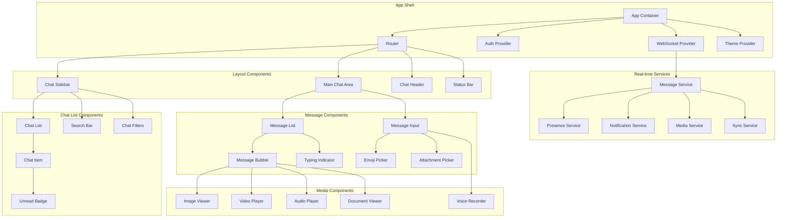

### State Management Architecture

[⬆️ Back to Top](#-table-of-contents)

---


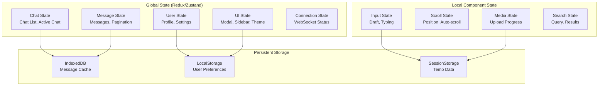

### Responsive Design Strategy

[⬆️ Back to Top](#-table-of-contents)

---


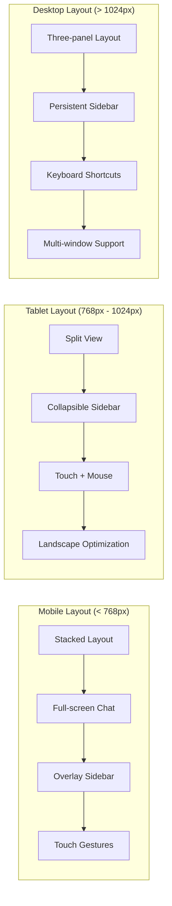

---

## Real-Time Sync, Data Modeling & APIs

[⬆️ Back to Top](#-table-of-contents)

---


### Message Ordering and Consistency Algorithm

[⬆️ Back to Top](#-table-of-contents)

---


#### Vector Clock Implementation

[⬆️ Back to Top](#-table-of-contents)

---


```mermaid
graph TD
    A[User A sends message<br/>Vector: [A:1, B:0, C:0]] --> B[User B receives<br/>Updates vector: [A:1, B:0, C:0]]
    B --> C[User B sends message<br/>Vector: [A:1, B:1, C:0]]
    C --> D[User C receives both<br/>Vector: [A:1, B:1, C:0]]
    D --> E[User C sends message<br/>Vector: [A:1, B:1, C:1]]
    
    F[Concurrent message from A<br/>Vector: [A:2, B:0, C:0]] --> G[Conflict detection<br/>Compare vectors]
    G --> H[Apply ordering rules<br/>User ID, timestamp]
    H --> I[Consistent message order<br/>across all clients]
    
    style G fill:#ffcccc
    style H fill:#ffffcc
    style I fill:#ccffcc
```

#### Message Delivery Guarantees

[⬆️ Back to Top](#-table-of-contents)

---


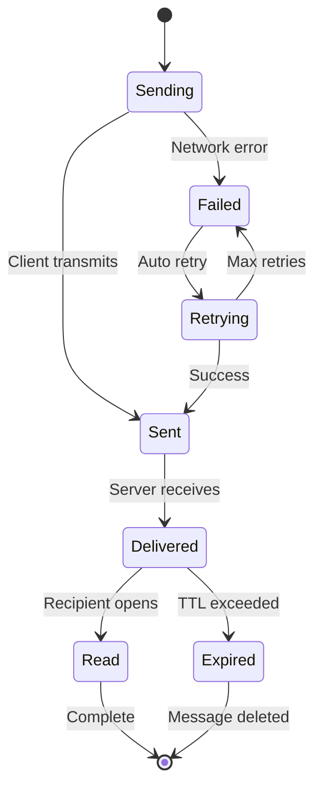

### Real-time Presence Algorithm

[⬆️ Back to Top](#-table-of-contents)

---


#### Presence State Machine

[⬆️ Back to Top](#-table-of-contents)

---


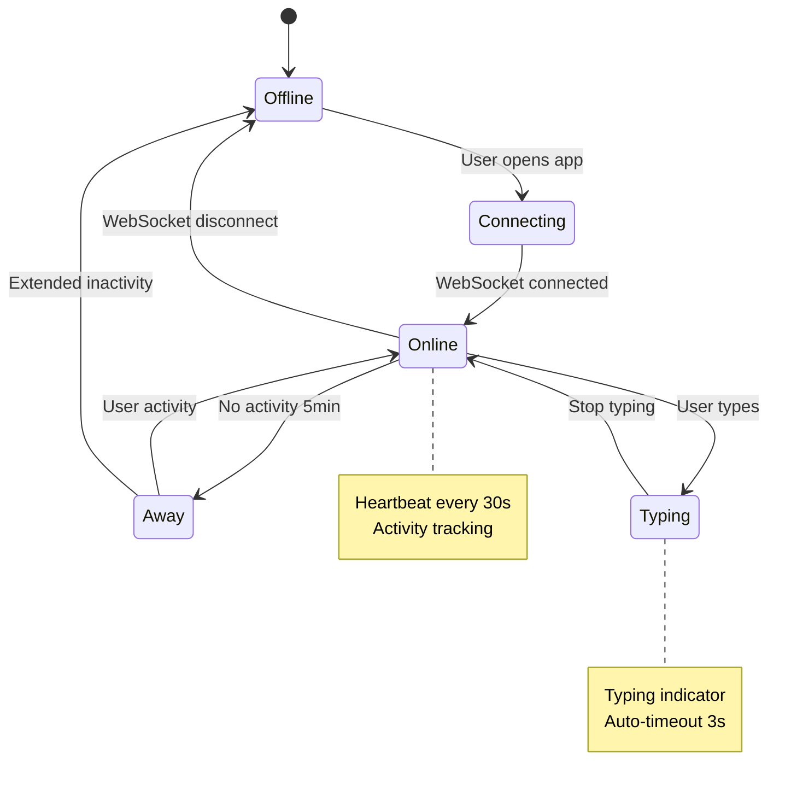

#### Presence Synchronization Flow

[⬆️ Back to Top](#-table-of-contents)

---


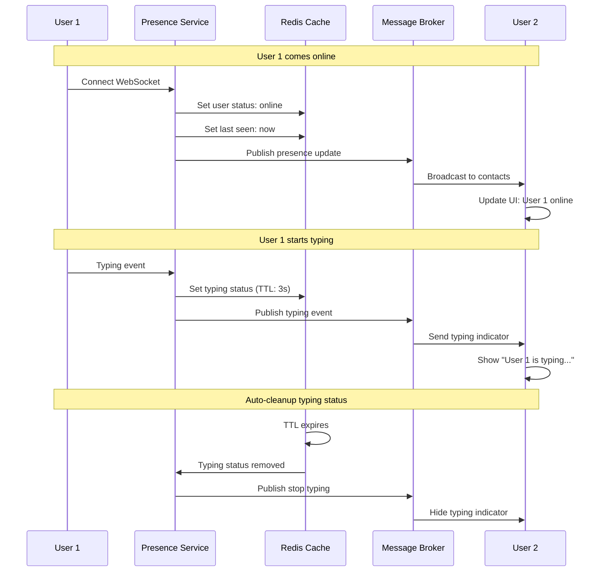

### Data Models

[⬆️ Back to Top](#-table-of-contents)

---


#### Message Schema

[⬆️ Back to Top](#-table-of-contents)

---

```
Message {
  id: UUID
  chat_id: UUID
  sender_id: UUID
  content: {
    type: 'text' | 'image' | 'video' | 'audio' | 'document'
    text?: String
    media_url?: String
    metadata?: Object
  }
  timestamp: DateTime
  vector_clock: Map<String, Integer>
  reply_to?: UUID
  edited_at?: DateTime
  reactions: [{
    user_id: UUID
    emoji: String
    timestamp: DateTime
  }]
  delivery_status: [{
    user_id: UUID
    status: 'sent' | 'delivered' | 'read'
    timestamp: DateTime
  }]
}
```

#### Chat Schema

[⬆️ Back to Top](#-table-of-contents)

---

```
Chat {
  id: UUID
  type: 'direct' | 'group' | 'channel'
  participants: [{
    user_id: UUID
    role: 'member' | 'admin' | 'owner'
    joined_at: DateTime
    last_read_message_id?: UUID
  }]
  metadata: {
    name?: String
    description?: String
    avatar_url?: String
    created_by: UUID
    created_at: DateTime
  }
  settings: {
    encryption_enabled: Boolean
    message_retention: Integer
    notifications_enabled: Boolean
  }
}
```

### WebSocket Protocol Design

[⬆️ Back to Top](#-table-of-contents)

---


#### Custom Protocol Over WebSocket

[⬆️ Back to Top](#-table-of-contents)

---


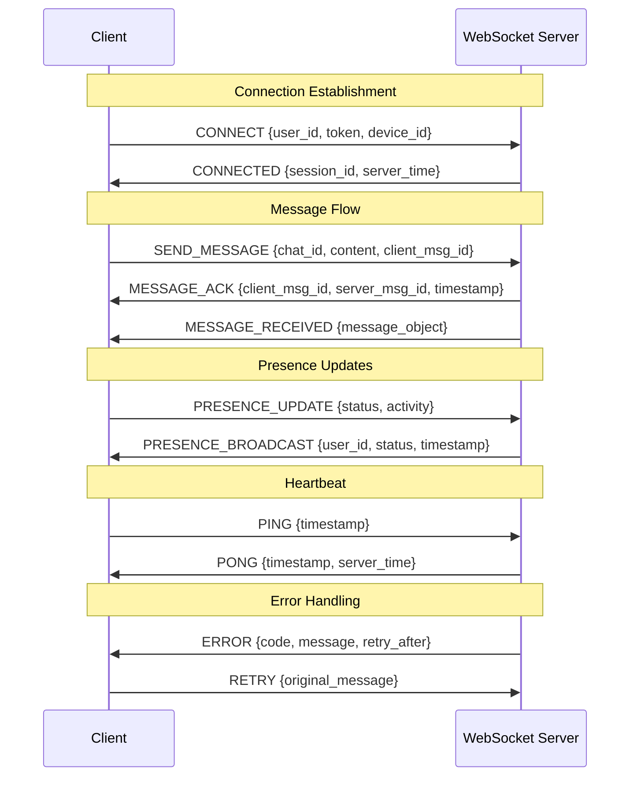

---

## Performance and Scalability

[⬆️ Back to Top](#-table-of-contents)

---


### Message Sharding Strategy

[⬆️ Back to Top](#-table-of-contents)

---


#### Horizontal Scaling Architecture

[⬆️ Back to Top](#-table-of-contents)

---


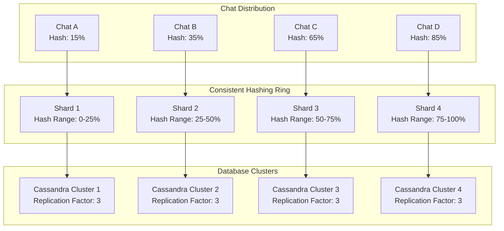

### WebSocket Connection Management

[⬆️ Back to Top](#-table-of-contents)

---


#### Connection Pooling and Load Balancing

[⬆️ Back to Top](#-table-of-contents)

---


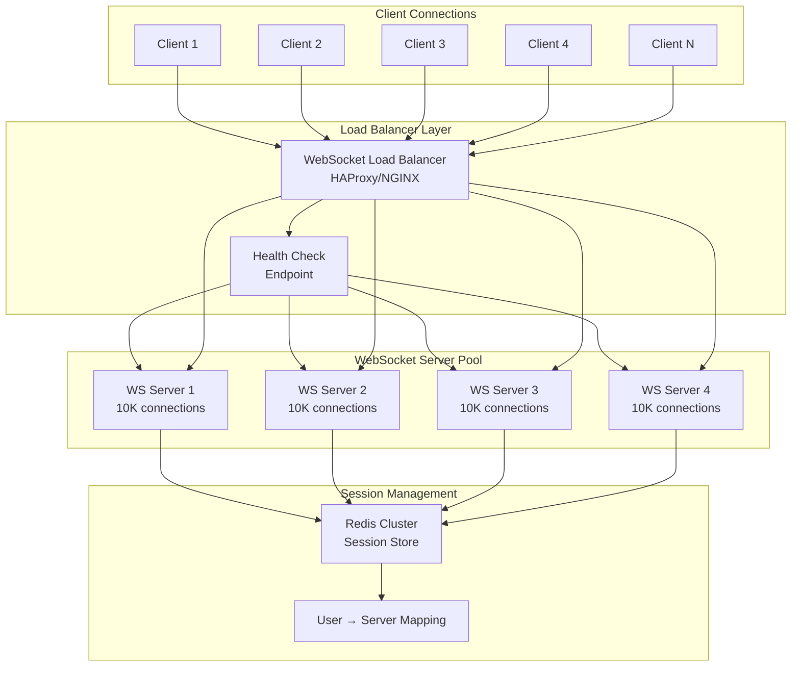

### Caching Strategy

[⬆️ Back to Top](#-table-of-contents)

---


#### Multi-Level Caching Architecture

[⬆️ Back to Top](#-table-of-contents)

---


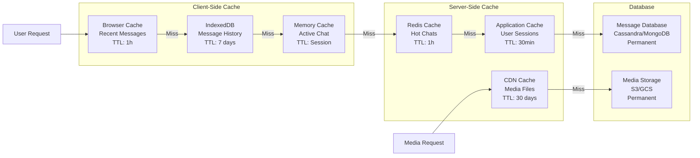

### Database Optimization

[⬆️ Back to Top](#-table-of-contents)

---


#### Message Storage Optimization

[⬆️ Back to Top](#-table-of-contents)

---


```mermaid
graph TD
    subgraph "Time-based Partitioning"
        CURRENT[Current Month<br/>Hot Partition<br/>SSD Storage]
        RECENT[Recent 3 Months<br/>Warm Partition<br/>Hybrid Storage]
        ARCHIVE[Archive 6+ Months<br/>Cold Partition<br/>Object Storage]
    end
    
    subgraph "Query Optimization"
        INDEX1[Primary Key: (chat_id, timestamp)]
        INDEX2[Secondary Index: sender_id]
        INDEX3[Search Index: content_text]
        BLOOM[Bloom Filter: message existence]
    end
    
    subgraph "Compression Strategy"
        COMPRESS1[Recent: No compression<br/>Fast access]
        COMPRESS2[Warm: Light compression<br/>Balanced performance]
        COMPRESS3[Cold: Heavy compression<br/>Storage optimized]
    end
    
    CURRENT --> INDEX1
    CURRENT --> COMPRESS1
    RECENT --> INDEX2
    RECENT --> COMPRESS2
    ARCHIVE --> INDEX3
    ARCHIVE --> COMPRESS3
    
    INDEX1 --> BLOOM
    INDEX2 --> BLOOM
    INDEX3 --> BLOOM
```

---

## Security and Privacy

[⬆️ Back to Top](#-table-of-contents)

---


### End-to-End Encryption Architecture

[⬆️ Back to Top](#-table-of-contents)

---


#### Signal Protocol Implementation

[⬆️ Back to Top](#-table-of-contents)

---


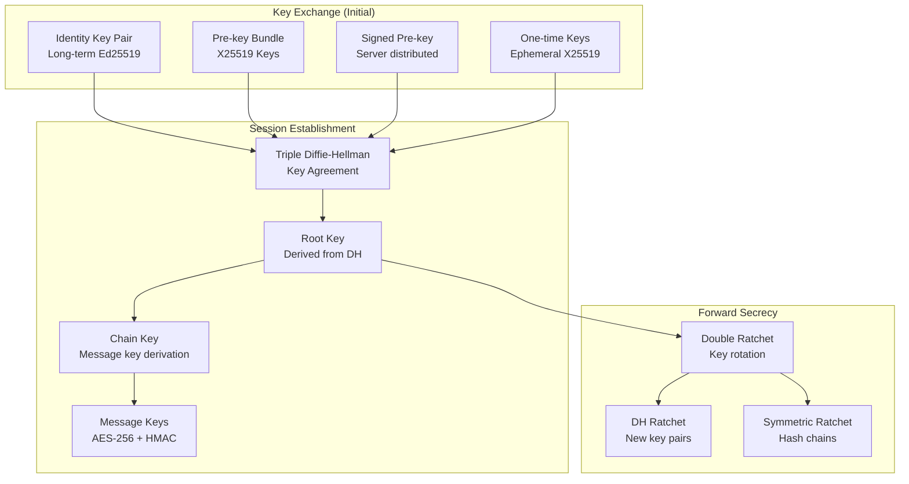

#### Message Encryption Flow

[⬆️ Back to Top](#-table-of-contents)

---


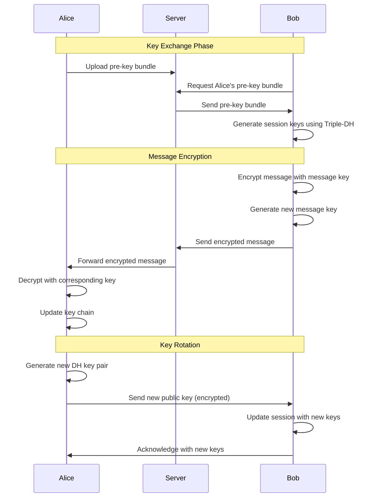

### Authentication and Authorization

[⬆️ Back to Top](#-table-of-contents)

---


#### Multi-Factor Authentication Flow

[⬆️ Back to Top](#-table-of-contents)

---


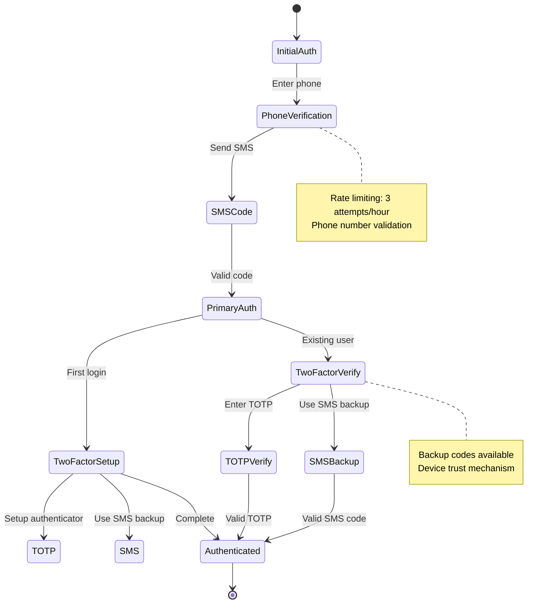

### Privacy and Data Protection

[⬆️ Back to Top](#-table-of-contents)

---


#### Data Minimization Strategy

[⬆️ Back to Top](#-table-of-contents)

---


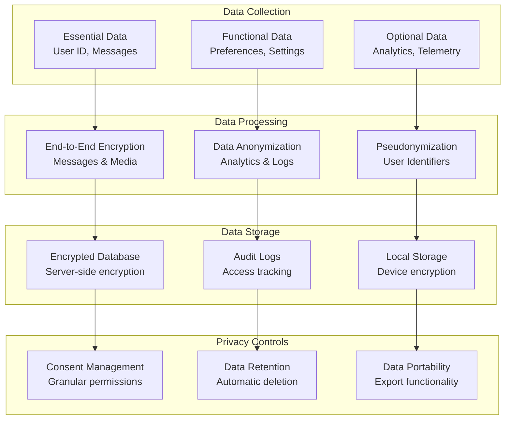

---

## Testing, Monitoring, and Maintainability

[⬆️ Back to Top](#-table-of-contents)

---


### Testing Strategy

[⬆️ Back to Top](#-table-of-contents)

---


#### Real-time System Testing Approach

[⬆️ Back to Top](#-table-of-contents)

---


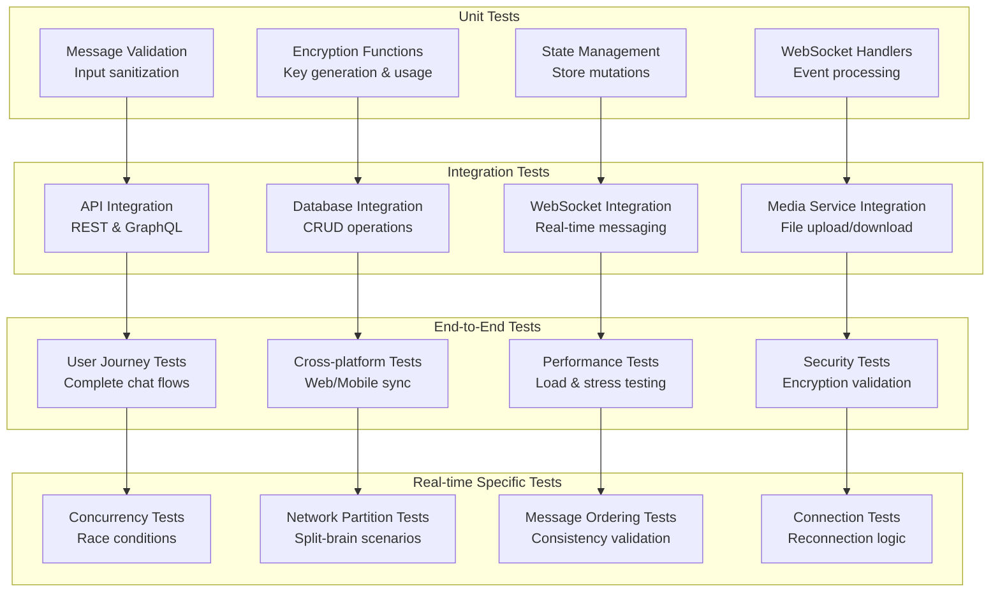

### Monitoring and Observability

[⬆️ Back to Top](#-table-of-contents)

---


#### Real-time Metrics Dashboard

[⬆️ Back to Top](#-table-of-contents)

---


```mermaid
graph TB
    subgraph "Application Metrics"
        MSG_LATENCY[Message Latency<br/>P50, P95, P99]
        CONNECTION_COUNT[Active Connections<br/>Per server/region]
        THROUGHPUT[Message Throughput<br/>Messages/second]
        ERROR_RATE[Error Rate<br/>Failed operations %]
    end
    
    subgraph "Business Metrics"
        ACTIVE_USERS[Daily/Monthly Active Users]
        MESSAGE_VOLUME[Messages per user/day]
        RETENTION_RATE[User retention rates]
        FEATURE_USAGE[Feature adoption metrics]
    end
    
    subgraph "Infrastructure Metrics"
        CPU_USAGE[Server CPU utilization]
        MEMORY_USAGE[Memory consumption]
        NETWORK_IO[Network I/O bandwidth]
        DATABASE_PERF[Database performance]
    end
    
    subgraph "Alert Management"
        THRESHOLD_ALERTS[Threshold-based alerts]
        ANOMALY_DETECTION[ML-based anomaly detection]
        ESCALATION[Alert escalation policies]
        INCIDENT_RESPONSE[Incident response workflow]
    end
    
    MSG_LATENCY --> THRESHOLD_ALERTS
    CONNECTION_COUNT --> ANOMALY_DETECTION
    THROUGHPUT --> THRESHOLD_ALERTS
    ERROR_RATE --> ESCALATION
    
    ACTIVE_USERS --> ANOMALY_DETECTION
    RETENTION_RATE --> INCIDENT_RESPONSE
    
    CPU_USAGE --> THRESHOLD_ALERTS
    DATABASE_PERF --> ESCALATION
```

### Error Handling and Recovery

[⬆️ Back to Top](#-table-of-contents)

---


#### Circuit Breaker Pattern Implementation

[⬆️ Back to Top](#-table-of-contents)

---


```mermaid
stateDiagram-v2
    [*] --> Closed
    Closed --> Open: Failure threshold exceeded
    Open --> HalfOpen: Timeout period elapsed
    HalfOpen --> Closed: Success threshold met
    HalfOpen --> Open: Failure detected
    
    note right of Closed
        Normal operation
        Track failure rate
        Failure count: 0-5
    end note
    
    note right of Open
        Fail fast mode
        Return cached data
        Timeout: 30-60s
    end note
    
    note right of HalfOpen
        Test recovery
        Limited requests
        Quick decision
    end note
```

---

## Trade-offs, Deep Dives, and Extensions

[⬆️ Back to Top](#-table-of-contents)

---


### Real-time Protocol Comparison

[⬆️ Back to Top](#-table-of-contents)

---


| Protocol | WebSocket | Server-Sent Events | Long Polling | WebRTC |
|----------|-----------|-------------------|--------------|---------|
| **Bidirectional** | Yes | No | Yes | Yes |
| **Connection Overhead** | Low | Low | High | Medium |
| **Browser Support** | Universal | Good | Universal | Good |
| **Complexity** | Medium | Low | Low | High |
| **Firewall Friendly** | Good | Excellent | Excellent | Poor |
| **Use Case** | Chat apps | Live feeds | Legacy support | P2P calling |

### Message Storage Trade-offs

[⬆️ Back to Top](#-table-of-contents)

---


#### SQL vs NoSQL for Messages

[⬆️ Back to Top](#-table-of-contents)

---


```mermaid
graph LR
    subgraph "SQL Approach (PostgreSQL)"
        SQL_PROS[Pros:<br/>• ACID compliance<br/>• Complex queries<br/>• Data integrity<br/>• Transactions]
        SQL_CONS[Cons:<br/>• Vertical scaling limits<br/>• Complex sharding<br/>• Schema rigidity]
    end
    
    subgraph "NoSQL Approach (Cassandra)"
        NOSQL_PROS[Pros:<br/>• Horizontal scaling<br/>• High availability<br/>• Time-series optimized<br/>• Flexible schema]
        NOSQL_CONS[Cons:<br/>• Eventual consistency<br/>• Limited query flexibility<br/>• Operational complexity]
    end
    
    SQL_PROS -.->|Trade-off| NOSQL_CONS
    NOSQL_PROS -.->|Trade-off| SQL_CONS
```

### Scaling Challenges and Solutions

[⬆️ Back to Top](#-table-of-contents)

---


#### Hot Chat Problem

[⬆️ Back to Top](#-table-of-contents)

---


```mermaid
graph TD
    A[Popular Group Chat<br/>100K+ members] --> B{Scaling Challenge}
    
    B --> C[Message Fanout<br/>100K deliveries per message]
    B --> D[Database Hotspot<br/>Single partition overload]
    B --> E[Memory Pressure<br/>Connection management]
    
    C --> F[Solution: Fanout Service<br/>Async message delivery]
    D --> G[Solution: Read Replicas<br/>Distribute read load]
    E --> H[Solution: Connection Sharding<br/>Distribute connections]
    
    F --> I[Improved Throughput]
    G --> I
    H --> I
```

#### Global Consistency vs Performance

[⬆️ Back to Top](#-table-of-contents)

---


```mermaid
graph TD
    subgraph "Strong Consistency"
        SC[Synchronous Replication<br/>All regions updated]
        SC_LATENCY[High Latency<br/>Global round-trip]
        SC_AVAILABILITY[Lower Availability<br/>Any region failure affects all]
    end
    
    subgraph "Eventual Consistency"
        EC[Asynchronous Replication<br/>Local-first writes]
        EC_LATENCY[Low Latency<br/>Local response time]
        EC_CONFLICTS[Conflict Resolution<br/>Vector clocks/timestamps]
    end
    
    SC --> SC_LATENCY
    SC --> SC_AVAILABILITY
    EC --> EC_LATENCY
    EC --> EC_CONFLICTS
    
    SC_LATENCY -.->|Trade-off| EC_LATENCY
    SC_AVAILABILITY -.->|Trade-off| EC_CONFLICTS
```

### Advanced Features

[⬆️ Back to Top](#-table-of-contents)

---


#### AI-Powered Chat Features

[⬆️ Back to Top](#-table-of-contents)

---


```mermaid
graph TD
    subgraph "AI Message Processing"
        NLP[Natural Language Processing]
        SENTIMENT[Sentiment Analysis]
        TRANSLATION[Real-time Translation]
        MODERATION[Content Moderation]
    end
    
    subgraph "Smart Features"
        SMART_REPLY[Smart Reply Suggestions]
        THREAD_SUMMARY[Thread Summarization]
        SPAM_DETECTION[Spam Detection]
        TOPIC_DETECTION[Topic Detection]
    end
    
    subgraph "User Assistance"
        CHATBOT[AI Chatbot Integration]
        VOICE_TO_TEXT[Voice Message Transcription]
        IMAGE_RECOGNITION[Image Content Analysis]
        SCHEDULING[Smart Scheduling Assistant]
    end
    
    NLP --> SMART_REPLY
    SENTIMENT --> THREAD_SUMMARY
    TRANSLATION --> CHATBOT
    MODERATION --> SPAM_DETECTION
    
    SMART_REPLY --> VOICE_TO_TEXT
    THREAD_SUMMARY --> IMAGE_RECOGNITION
    SPAM_DETECTION --> SCHEDULING
    TOPIC_DETECTION --> CHATBOT
```

#### Advanced Presence System

[⬆️ Back to Top](#-table-of-contents)

---


```mermaid
stateDiagram-v2
    [*] --> Offline
    Offline --> Online: Connect
    Online --> Active: User interaction
    Active --> Idle: No interaction 5min
    Idle --> Away: No interaction 15min
    Away --> Offline: Extended absence
    
    Online --> Typing: Start typing
    Typing --> Online: Stop typing (3s timeout)
    
    Online --> InCall: Join voice/video call
    InCall --> Online: Leave call
    
    Online --> DoNotDisturb: Manual toggle
    DoNotDisturb --> Online: Manual toggle
    
    note right of Active
        Rich presence:
        • Current app/device
        • Activity type
        • Location (optional)
    end note
```

### Future Extensions

[⬆️ Back to Top](#-table-of-contents)

---


#### Next-Generation Chat Features

[⬆️ Back to Top](#-table-of-contents)

---


1. **Immersive Communication**:
   - AR/VR chat environments
   - Spatial audio conversations
   - Holographic avatars
   - Gesture-based interactions

2. **Advanced AI Integration**:
   - Conversational AI assistants
   - Predictive text completion
   - Emotional intelligence
   - Context-aware responses

3. **Blockchain Integration**:
   - Decentralized identity
   - Cryptocurrency payments
   - NFT sharing and trading
   - Tokenized communities

4. **Enhanced Privacy**:
   - Disappearing messages
   - Anonymous group chats
   - Decentralized architecture
   - Zero-knowledge proofs

This comprehensive design provides a robust foundation for building a scalable, secure, and feature-rich real-time chat application with modern architectural patterns and best practices. 