# Develop an Infinite Scrolling Newsfeed (like Facebook or Twitter)


## 📋 Table of Contents

- [Develop an Infinite Scrolling Newsfeed (like Facebook or Twitter)](#develop-an-infinite-scrolling-newsfeed-like-facebook-or-twitter)
  - [Table of Contents](#table-of-contents)
  - [Clarify the Problem and Requirements](#clarify-the-problem-and-requirements)
    - [Problem Understanding](#problem-understanding)
    - [Functional Requirements](#functional-requirements)
    - [Non-Functional Requirements](#non-functional-requirements)
    - [Key Assumptions](#key-assumptions)
  - [High-Level Architecture](#high-level-architecture)
    - [Global System Architecture](#global-system-architecture)
    - [Feed Generation Architecture](#feed-generation-architecture)
  - [UI/UX and Component Structure](#uiux-and-component-structure)
    - [Frontend Component Architecture](#frontend-component-architecture)
    - [Virtual Scrolling Implementation](#virtual-scrolling-implementation)
    - [Responsive Feed Layout](#responsive-feed-layout)
  - [Real-Time Sync, Data Modeling & APIs](#real-time-sync-data-modeling-apis)
    - [Content Ranking Algorithm](#content-ranking-algorithm)
      - [ML-Based Feed Ranking](#ml-based-feed-ranking)
      - [Feed Generation Algorithm](#feed-generation-algorithm)
    - [Infinite Scroll Implementation](#infinite-scroll-implementation)
      - [Pagination Strategy](#pagination-strategy)
      - [Scroll Performance Optimization](#scroll-performance-optimization)
    - [Data Models](#data-models)
      - [Post Schema](#post-schema)
      - [Feed Item Schema](#feed-item-schema)
    - [API Design](#api-design)
      - [GraphQL Feed API](#graphql-feed-api)
      - [Real-time Feed Updates](#real-time-feed-updates)
  - [Performance and Scalability](#performance-and-scalability)
    - [Feed Caching Strategy](#feed-caching-strategy)
      - [Multi-Level Caching Architecture](#multi-level-caching-architecture)
    - [Database Scaling Strategy](#database-scaling-strategy)
      - [Horizontal Partitioning](#horizontal-partitioning)
    - [Content Delivery Optimization](#content-delivery-optimization)
      - [Progressive Loading Strategy](#progressive-loading-strategy)
      - [Image Optimization Pipeline](#image-optimization-pipeline)
  - [Security and Privacy](#security-and-privacy)
    - [Content Security Framework](#content-security-framework)
      - [Content Moderation Pipeline](#content-moderation-pipeline)
    - [Privacy Protection Strategy](#privacy-protection-strategy)
      - [Data Privacy Controls](#data-privacy-controls)
  - [Testing, Monitoring, and Maintainability](#testing-monitoring-and-maintainability)
    - [Performance Testing Strategy](#performance-testing-strategy)
      - [Load Testing Framework](#load-testing-framework)
    - [Real-time Monitoring Dashboard](#real-time-monitoring-dashboard)
      - [Key Performance Indicators](#key-performance-indicators)
  - [Trade-offs, Deep Dives, and Extensions](#trade-offs-deep-dives-and-extensions)
    - [Infinite Scroll vs Pagination Trade-offs](#infinite-scroll-vs-pagination-trade-offs)
    - [Feed Algorithm Trade-offs](#feed-algorithm-trade-offs)
      - [Chronological vs Algorithmic Feed](#chronological-vs-algorithmic-feed)
    - [Advanced Optimization Strategies](#advanced-optimization-strategies)
      - [Edge Computing for Feed Generation](#edge-computing-for-feed-generation)
      - [Machine Learning Pipeline Optimization](#machine-learning-pipeline-optimization)
    - [Future Extensions](#future-extensions)
      - [Next-Generation Feed Features](#next-generation-feed-features)
  - [TypeScript Interfaces & Component Props](#typescript-interfaces--component-props)
    - [Core Data Interfaces](#core-data-interfaces)
    - [Component Props Interfaces](#component-props-interfaces)
  - [API Reference](#api-reference)

---

## Table of Contents
1. [Clarify the Problem and Requirements](#clarify-the-problem-and-requirements)
2. [High-Level Architecture](#high-level-architecture)
3. [UI/UX and Component Structure](#uiux-and-component-structure)
4. [Real-Time Sync, Data Modeling & APIs](#real-time-sync-data-modeling--apis)
5. [Performance and Scalability](#performance-and-scalability)
6. [Security and Privacy](#security-and-privacy)
7. [Testing, Monitoring, and Maintainability](#testing-monitoring-and-maintainability)
8. [Trade-offs, Deep Dives, and Extensions](#trade-offs-deep-dives-and-extensions)

---

## Clarify the Problem and Requirements

[⬆️ Back to Top](#--table-of-contents)

---


### Problem Understanding

[⬆️ Back to Top](#--table-of-contents)

---

Design an infinite scrolling newsfeed system that delivers personalized content to millions of users in real-time, similar to Facebook, Twitter, or Instagram. The system must handle content ranking, real-time updates, and seamless infinite scroll performance while maintaining user engagement.

### Functional Requirements

[⬆️ Back to Top](#--table-of-contents)

---

- **Infinite Scrolling**: Seamless content loading as user scrolls
- **Personalized Feed**: ML-driven content ranking and recommendation
- **Real-time Updates**: New posts appear without page refresh
- **Content Types**: Text, images, videos, links, polls, stories
- **Interactions**: Like, comment, share, bookmark, follow/unfollow
- **Feed Customization**: Sort by recency, relevance, trending
- **Content Discovery**: Hashtags, mentions, search, trending topics
- **Cross-platform**: Web, mobile apps with synchronized experience

### Non-Functional Requirements

[⬆️ Back to Top](#--table-of-contents)

---

- **Performance**: <200ms initial feed load, <100ms scroll response
- **Scalability**: 1B+ users, 100M+ posts/day, 10M+ concurrent users
- **Availability**: 99.9% uptime with graceful degradation
- **Consistency**: Eventually consistent feed across devices
- **Engagement**: High content relevance, minimal scroll latency
- **Responsiveness**: Smooth 60fps scrolling on all devices

### Key Assumptions

[⬆️ Back to Top](#--table-of-contents)

---

- Average user: 100 posts/day in feed, 20 interactions
- Peak load: 50M concurrent users, 100K posts/second
- Content variety: 60% text, 25% images, 10% videos, 5% links
- User engagement: Average 30min session, 200 posts viewed
- Feed refresh: Every 5-15 minutes depending on activity
- Content lifespan: 80% of engagement in first 24 hours

---

## High-Level Architecture

[⬆️ Back to Top](#--table-of-contents)

---


### Global System Architecture

[⬆️ Back to Top](#--table-of-contents)

---


### Feed Generation Architecture

[⬆️ Back to Top](#--table-of-contents)

---


---

## UI/UX and Component Structure

[⬆️ Back to Top](#--table-of-contents)

---


### Frontend Component Architecture

[⬆️ Back to Top](#--table-of-contents)

---


#### React Component Implementation

[⬆️ Back to Top](#--table-of-contents)

---

**FeedContainer.jsx**
```jsx
import React, { useState, useEffect, useCallback, useRef } from 'react';
import { FeedProvider } from './FeedContext';
import VirtualScroller from './VirtualScroller';
import PostItem from './PostItem';
import LoadingSkeleton from './LoadingSkeleton';
import { useInfiniteQuery } from 'react-query';
import { useIntersectionObserver } from './hooks/useIntersectionObserver';

const FeedContainer = () => {
  const [posts, setPosts] = useState([]);
  const [hasNextPage, setHasNextPage] = useState(true);
  const loadMoreRef = useRef(null);
  const scrollPositionRef = useRef(0);

  const {
    data,
    fetchNextPage,
    hasNextPage: queryHasNextPage,
    isFetchingNextPage,
    isLoading,
    error
  } = useInfiniteQuery(
    'feed',
    ({ pageParam = null }) => fetchFeedPage(pageParam),
    {
      getNextPageParam: (lastPage) => lastPage.nextCursor,
      refetchOnWindowFocus: false,
      staleTime: 5 * 60 * 1000, // 5 minutes
    }
  );

  // Intersection Observer for infinite scroll
  useIntersectionObserver(
    loadMoreRef,
    () => {
      if (queryHasNextPage && !isFetchingNextPage) {
        fetchNextPage();
      }
    },
    { threshold: 0.1 }
  );

  useEffect(() => {
    if (data) {
      const allPosts = data.pages.flatMap(page => page.posts);
      setPosts(allPosts);
      setHasNextPage(queryHasNextPage);
    }
  }, [data, queryHasNextPage]);

  const handleScroll = useCallback((scrollTop) => {
    scrollPositionRef.current = scrollTop;
  }, []);

  const updatePost = useCallback((postId, updates) => {
    setPosts(prev => prev.map(post => 
      post.id === postId ? { ...post, ...updates } : post
    ));
  }, []);

  const removePost = useCallback((postId) => {
    setPosts(prev => prev.filter(post => post.id !== postId));
  }, []);

  if (isLoading) {
    return <LoadingSkeleton count={5} />;
  }

  if (error) {
    return <div className="feed-error">Failed to load feed</div>;
  }

  return (
    <FeedProvider value={{
      posts,
      updatePost,
      removePost,
      isLoading: isFetchingNextPage
    }}>
      <div className="feed-container">
        <VirtualScroller
          items={posts}
          itemHeight={400}
          onScroll={handleScroll}
          renderItem={({ item, index, style }) => (
            <div style={style} key={item.id}>
              <PostItem post={item} index={index} />
            </div>
          )}
        />
        
        {/* Load more trigger */}
        <div 
          ref={loadMoreRef} 
          className="load-more-trigger"
          style={{ height: '20px', margin: '20px 0' }}
        >
          {isFetchingNextPage && <LoadingSkeleton count={2} />}
          {!queryHasNextPage && posts.length > 0 && (
            <div className="end-of-feed">You've reached the end!</div>
          )}
        </div>
      </div>
    </FeedProvider>
  );
};

// API function
const fetchFeedPage = async (cursor) => {
  const response = await fetch(`/api/feed?cursor=${cursor || ''}&limit=10`);
  return response.json();
};

export default FeedContainer;
```

**VirtualScroller.jsx**
```jsx
import React, { useState, useEffect, useRef, useMemo } from 'react';

const VirtualScroller = ({ 
  items, 
  itemHeight, 
  containerHeight = window.innerHeight,
  overscan = 5,
  onScroll,
  renderItem 
}) => {
  const [scrollTop, setScrollTop] = useState(0);
  const [isScrolling, setIsScrolling] = useState(false);
  const scrollElementRef = useRef(null);
  const scrollTimeoutRef = useRef(null);

  const { visibleRange, totalHeight } = useMemo(() => {
    const containerTop = scrollTop;
    const containerBottom = containerTop + containerHeight;

    const startIndex = Math.max(0, Math.floor(containerTop / itemHeight) - overscan);
    const endIndex = Math.min(
      items.length - 1,
      Math.ceil(containerBottom / itemHeight) + overscan
    );

    return {
      visibleRange: { startIndex, endIndex },
      totalHeight: items.length * itemHeight
    };
  }, [scrollTop, containerHeight, itemHeight, items.length, overscan]);

  const visibleItems = useMemo(() => {
    const result = [];
    for (let i = visibleRange.startIndex; i <= visibleRange.endIndex; i++) {
      if (items[i]) {
        result.push({
          index: i,
          item: items[i],
          style: {
            position: 'absolute',
            top: i * itemHeight,
            width: '100%',
            height: itemHeight,
          }
        });
      }
    }
    return result;
  }, [visibleRange, items, itemHeight]);

  const handleScroll = (e) => {
    const newScrollTop = e.currentTarget.scrollTop;
    setScrollTop(newScrollTop);
    setIsScrolling(true);
    onScroll?.(newScrollTop);

    // Clear previous timeout
    if (scrollTimeoutRef.current) {
      clearTimeout(scrollTimeoutRef.current);
    }

    // Set scrolling to false after scroll ends
    scrollTimeoutRef.current = setTimeout(() => {
      setIsScrolling(false);
    }, 150);
  };

  return (
    <div
      ref={scrollElementRef}
      className="virtual-scroller"
      style={{
        height: containerHeight,
        overflow: 'auto',
        position: 'relative'
      }}
      onScroll={handleScroll}
    >
      <div
        className="virtual-scroller-content"
        style={{
          height: totalHeight,
          position: 'relative'
        }}
      >
        {visibleItems.map(({ index, item, style }) =>
          renderItem({ item, index, style })
        )}
      </div>
    </div>
  );
};

export default VirtualScroller;
```

**PostItem.jsx**
```jsx
import React, { useState, useContext, memo } from 'react';
import { FeedContext } from './FeedContext';
import PostHeader from './PostHeader';
import PostContent from './PostContent';
import PostMedia from './PostMedia';
import PostActions from './PostActions';
import CommentsSection from './CommentsSection';

const PostItem = memo(({ post, index }) => {
  const { updatePost } = useContext(FeedContext);
  const [showComments, setShowComments] = useState(false);
  const [isVisible, setIsVisible] = useState(false);

  const handleLike = async () => {
    const newLikeStatus = !post.isLiked;
    const newLikeCount = post.likeCount + (newLikeStatus ? 1 : -1);
    
    // Optimistic update
    updatePost(post.id, {
      isLiked: newLikeStatus,
      likeCount: newLikeCount
    });

    try {
      await fetch(`/api/posts/${post.id}/like`, {
        method: newLikeStatus ? 'POST' : 'DELETE'
      });
    } catch (error) {
      // Revert on error
      updatePost(post.id, {
        isLiked: !newLikeStatus,
        likeCount: post.likeCount
      });
    }
  };

  const handleShare = () => {
    if (navigator.share) {
      navigator.share({
        title: `Post by ${post.author.name}`,
        url: `/posts/${post.id}`
      });
    } else {
      navigator.clipboard.writeText(`${window.location.origin}/posts/${post.id}`);
    }
  };

  const handleComment = () => {
    setShowComments(!showComments);
  };

  return (
    <article className="post-item" data-post-id={post.id}>
      <PostHeader 
        author={post.author}
        timestamp={post.createdAt}
        isFollowing={post.author.isFollowing}
      />
      
      <PostContent 
        content={post.content}
        hashtags={post.hashtags}
        mentions={post.mentions}
      />
      
      {post.media && post.media.length > 0 && (
        <PostMedia 
          media={post.media}
          onVisibilityChange={setIsVisible}
        />
      )}
      
      <PostActions
        likeCount={post.likeCount}
        commentCount={post.commentCount}
        shareCount={post.shareCount}
        isLiked={post.isLiked}
        isBookmarked={post.isBookmarked}
        onLike={handleLike}
        onComment={handleComment}
        onShare={handleShare}
      />
      
      {showComments && (
        <CommentsSection
          postId={post.id}
          comments={post.comments}
          onCommentAdd={(comment) => {
            updatePost(post.id, {
              commentCount: post.commentCount + 1,
              comments: [...(post.comments || []), comment]
            });
          }}
        />
      )}
    </article>
  );
});

export default PostItem;
```

**Infinite Scroll Hook**
```jsx
// hooks/useInfiniteScroll.js
import { useEffect, useCallback, useRef } from 'react';

export const useInfiniteScroll = ({
  hasNextPage,
  fetchNextPage,
  isFetchingNextPage,
  threshold = 300
}) => {
  const sentinelRef = useRef(null);

  const handleIntersection = useCallback((entries) => {
    const [entry] = entries;
    if (entry.isIntersecting && hasNextPage && !isFetchingNextPage) {
      fetchNextPage();
    }
  }, [hasNextPage, fetchNextPage, isFetchingNextPage]);

  useEffect(() => {
    const sentinel = sentinelRef.current;
    if (!sentinel) return;

    const observer = new IntersectionObserver(handleIntersection, {
      rootMargin: `${threshold}px`,
      threshold: 0.1
    });

    observer.observe(sentinel);

    return () => {
      observer.unobserve(sentinel);
      observer.disconnect();
    };
  }, [handleIntersection, threshold]);

  return sentinelRef;
};

// hooks/useVirtualization.js
import { useMemo } from 'react';

export const useVirtualization = ({
  items,
  itemHeight,
  containerHeight,
  scrollTop,
  overscan = 5
}) => {
  return useMemo(() => {
    const startIndex = Math.max(
      0, 
      Math.floor(scrollTop / itemHeight) - overscan
    );
    
    const endIndex = Math.min(
      items.length - 1,
      Math.ceil((scrollTop + containerHeight) / itemHeight) + overscan
    );

    const visibleItems = [];
    for (let i = startIndex; i <= endIndex; i++) {
      if (items[i]) {
        visibleItems.push({
          index: i,
          data: items[i],
          offsetTop: i * itemHeight
        });
      }
    }

    return {
      startIndex,
      endIndex,
      visibleItems,
      totalHeight: items.length * itemHeight
    };
  }, [items, itemHeight, containerHeight, scrollTop, overscan]);
};

// Feed Performance Optimization
export const useFeedOptimization = () => {
  const preloadImages = useCallback((posts) => {
    posts.forEach(post => {
      if (post.media) {
        post.media.forEach(media => {
          if (media.type === 'image') {
            const img = new Image();
            img.src = media.thumbnailUrl || media.url;
          }
        });
      }
    });
  }, []);

  const lazyLoadMedia = useCallback((element, mediaSrc) => {
    const observer = new IntersectionObserver((entries) => {
      entries.forEach(entry => {
        if (entry.isIntersecting) {
          const img = entry.target;
          img.src = mediaSrc;
          img.onload = () => {
            img.classList.add('loaded');
          };
          observer.unobserve(img);
        }
      });
    });

    observer.observe(element);
    return () => observer.disconnect();
  }, []);

  return { preloadImages, lazyLoadMedia };
};
```

### Virtual Scrolling Implementation

[⬆️ Back to Top](#--table-of-contents)

---


### Responsive Feed Layout

[⬆️ Back to Top](#--table-of-contents)

---


---

## Real-Time Sync, Data Modeling & APIs

[⬆️ Back to Top](#--table-of-contents)

---


### Content Ranking Algorithm

[⬆️ Back to Top](#--table-of-contents)

---


#### ML-Based Feed Ranking

[⬆️ Back to Top](#--table-of-contents)

---


#### Feed Generation Algorithm

[⬆️ Back to Top](#--table-of-contents)

---


**Multi-Stage Ranking Process:**

1. **Candidate Generation** (10K → 1K posts):
   - Following/Friends posts (80%)
   - Popular content (15%)
   - Sponsored content (5%)

2. **Initial Ranking** (1K → 500 posts):
   - Relevance scoring
   - Recency weighting
   - Content quality filtering

3. **Final Ranking** (500 → 100 posts):
   - Engagement prediction
   - Diversity injection
   - Business rule application

### Infinite Scroll Implementation

[⬆️ Back to Top](#--table-of-contents)

---


#### Pagination Strategy

[⬆️ Back to Top](#--table-of-contents)

---


#### Scroll Performance Optimization

[⬆️ Back to Top](#--table-of-contents)

---


#### Advanced Infinite Scroll Techniques

[⬆️ Back to Top](#--table-of-contents)

---

##### Bird's Eye View: How Infinite Scroll Works

Before diving into implementation details, let's understand the high-level architecture and flow of modern infinite scrolling systems.

**Core Concept**: Instead of loading all content at once, we dynamically load content as the user scrolls, while maintaining optimal performance through virtualization and efficient DOM management.


##### Component Architecture Overview

```mermaid
graph TB
    subgraph "Main Container"
        FEED_CONTAINER[📋 FeedContainer<br/>Top-level coordinator]
        SCROLL_CONTAINER[📜 ScrollContainer<br/>Manages scroll area]
    end
    
    subgraph "Scroll Detection System"
        INTERSECTION_HOOK[🪝 useIntersectionObserver<br/>Custom hook for detection]
        SENTINEL_MANAGER[🎯 SentinelManager<br/>Manages trigger elements]
        SCROLL_TRACKER[📍 ScrollTracker<br/>Position & direction tracking]
    end
    
    subgraph "Virtualization Engine"
        VIRTUAL_SCROLLER[🎨 VirtualScroller<br/>Renders visible items only]
        ITEM_RENDERER[🖼️ ItemRenderer<br/>Individual item display]
        VIEWPORT_CALC[📐 ViewportCalculator<br/>Visible range calculation]
    end
    
    subgraph "Data Management"
        DATA_FETCHER[📥 DataFetcher<br/>API calls & caching]
        STATE_MANAGER[🗂️ StateManager<br/>React state/context]
        CACHE_LAYER[💾 CacheLayer<br/>Memory & persistence]
    end
    
    subgraph "Performance Optimization"
        DOM_POOLER[♻️ DOMPooler<br/>Element reuse system]
        MEMORY_CLEANER[🧹 MemoryCleaner<br/>Garbage collection helper]
        PRELOADER[⏰ Preloader<br/>Ahead-of-time loading]
    end
    
    subgraph "User Interface"
        POST_ITEM[📝 PostItem<br/>Individual post component]
        LOADING_SKELETON[⏳ LoadingSkeleton<br/>Loading placeholder]
        END_MARKER[🏁 EndMarker<br/>End of feed indicator]
    end
    
    FEED_CONTAINER --> SCROLL_CONTAINER
    SCROLL_CONTAINER --> INTERSECTION_HOOK
    INTERSECTION_HOOK --> SENTINEL_MANAGER
    SENTINEL_MANAGER --> SCROLL_TRACKER
    
    SCROLL_CONTAINER --> VIRTUAL_SCROLLER
    VIRTUAL_SCROLLER --> ITEM_RENDERER
    VIRTUAL_SCROLLER --> VIEWPORT_CALC
    
    INTERSECTION_HOOK --> DATA_FETCHER
    DATA_FETCHER --> STATE_MANAGER
    STATE_MANAGER --> CACHE_LAYER
    
    VIRTUAL_SCROLLER --> DOM_POOLER
    DOM_POOLER --> MEMORY_CLEANER
    DATA_FETCHER --> PRELOADER
    
    ITEM_RENDERER --> POST_ITEM
    STATE_MANAGER --> LOADING_SKELETON
    DATA_FETCHER --> END_MARKER
    
    style FEED_CONTAINER fill:#e3f2fd
    style INTERSECTION_HOOK fill:#fff3e0
    style VIRTUAL_SCROLLER fill:#f3e5f5
    style DOM_POOLER fill:#e8f5e8
```



##### Infinite Scroll Flow Sequence


##### Key Performance Strategies

```mermaid
mindmap
  root((🚀 Infinite Scroll Performance))
    (🔍 Detection)
      Intersection Observer
        Passive listeners
        Configurable thresholds
        Root margin optimization
      Sentinel Elements
        Strategic positioning
        Minimal DOM footprint
        Multiple triggers
    (🎨 Rendering)
      Virtualization
        Viewport culling
        Item recycling
        Height estimation
      DOM Pooling
        Element reuse
        Memory efficiency
        Pool size optimization
    (📊 Data)
      Smart Loading
        Batch requests
        Preloading strategy
        Cache optimization
      State Management
        Normalized state
        Selective updates
        Memory cleanup
    (⚡ Optimization)
      GPU Acceleration
        CSS transforms
        will-change property
        Hardware acceleration
      Event Handling
        Throttling/Debouncing
        RAF scheduling
        Passive listeners
```



**How It All Works Together:**

1. **User scrolls** → Browser fires scroll events
2. **Intersection Observer** detects when sentinel elements enter viewport (more efficient than scroll listeners)
3. **Sentinel elements** (invisible markers) trigger actions when they become visible
4. **Data fetcher** loads more content when bottom sentinel is reached
5. **Virtual scroller** only renders items currently visible in viewport
6. **DOM pool** reuses existing elements instead of creating/destroying them
7. **Memory manager** cleans up off-screen content to prevent memory leaks
8. **Performance optimizations** ensure smooth 60fps scrolling experience

This architecture provides:
- ✅ **Smooth Performance**: 60fps scrolling even with thousands of items
- ✅ **Memory Efficiency**: Constant memory usage regardless of list size  
- ✅ **Battery Friendly**: Minimal CPU usage through optimized detection
- ✅ **Responsive UX**: Immediate feedback and progressive loading
- ✅ **Scalable**: Handles millions of items without performance degradation

##### Intersection Observer API for Scroll Detection

The **Intersection Observer API** is the modern, performant way to detect when elements enter or leave the viewport. It's essential for infinite scrolling as it eliminates the need for scroll event listeners, reducing performance overhead.

**Key Benefits:**
- **Asynchronous**: Doesn't block the main thread
- **Efficient**: Browser-optimized for visibility detection
- **Precise**: Configurable thresholds and root margins
- **Battery-friendly**: Lower CPU usage compared to scroll events


**React Implementation with Intersection Observer:**

**What this code does:**
• **Main Purpose**: Custom hook for Intersection Observer API integration
• **Performance**: Efficient scroll detection without scroll event listeners
• **Key Functions**:
  - `useIntersectionObserver()` - Sets up observer with callback and options
  - `threshold` configuration - Controls when callback triggers (0.0 to 1.0)
  - `rootMargin` settings - Expands detection area for early loading
  - Automatic cleanup on component unmount

```jsx
// hooks/useIntersectionObserver.js
import { useEffect, useRef, useCallback } from 'react';

export const useIntersectionObserver = (
  callback,
  options = {}
) => {
  const targetRef = useRef(null);
  const observerRef = useRef(null);

  const {
    threshold = 0.1,
    rootMargin = '100px',
    root = null,
    enabled = true
  } = options;

  const handleIntersection = useCallback((entries) => {
    entries.forEach(entry => {
      if (entry.isIntersecting) {
        callback(entry);
      }
    });
  }, [callback]);

  useEffect(() => {
    if (!enabled || !targetRef.current) return;

    // Create observer with optimized settings
    observerRef.current = new IntersectionObserver(
      handleIntersection,
      {
        threshold,
        rootMargin,
        root
      }
    );

    const target = targetRef.current;
    observerRef.current.observe(target);

    // Cleanup function
    return () => {
      if (observerRef.current && target) {
        observerRef.current.unobserve(target);
        observerRef.current.disconnect();
      }
    };
  }, [handleIntersection, threshold, rootMargin, root, enabled]);

  return targetRef;
};

// Enhanced hook for infinite scroll
export const useInfiniteScrollObserver = ({
  hasNextPage,
  isFetchingNextPage,
  fetchNextPage,
  threshold = 0.1,
  rootMargin = '200px'
}) => {
  const loadMoreCallback = useCallback((entry) => {
    // Only trigger if we have more data and aren't already loading
    if (hasNextPage && !isFetchingNextPage) {
      console.log('Loading more content...', {
        intersectionRatio: entry.intersectionRatio,
        boundingRect: entry.boundingClientRect
      });
      fetchNextPage();
    }
  }, [hasNextPage, isFetchingNextPage, fetchNextPage]);

  const sentinelRef = useIntersectionObserver(
    loadMoreCallback,
    { threshold, rootMargin }
  );

  return sentinelRef;
};
```

##### Pivot Elements (Sentinel/Trigger/Anchor Elements)

**Pivot elements**, also known as **sentinel elements**, **trigger elements**, **scroll anchors**, or **waypoint elements**, are invisible or minimal DOM elements strategically placed to detect scroll boundaries and trigger actions.

**Common Names and Use Cases:**
- **Sentinel Elements**: Guard elements that watch for boundary crossings
- **Trigger Elements**: Elements that trigger loading actions
- **Scroll Anchors**: Elements that anchor scroll position calculations
- **Waypoint Elements**: Navigation milestone elements
- **Load More Triggers**: Specific to pagination/infinite scroll
- **Intersection Targets**: Elements targeted by Intersection Observer

##### ❓ Sentinel Element Positioning: Fixed vs Dynamic

**Key Question**: Are sentinel elements reattached to the last element when new content is added?

**Answer**: **No, they remain in fixed positions!** Here's why and how:

```mermaid
graph TB
    subgraph "❌ WRONG: Dynamic Reattachment"
        WRONG_CONTAINER[Container]
        WRONG_ITEM1[Item 1]
        WRONG_ITEM2[Item 2]
        WRONG_ITEM3[Item 3]
        WRONG_SENTINEL["🎯 Bottom Sentinel<br/>Moves with last item<br/>❌ PROBLEMATIC"]
        
        WRONG_CONTAINER --> WRONG_ITEM1
        WRONG_ITEM1 --> WRONG_ITEM2
        WRONG_ITEM2 --> WRONG_ITEM3
        WRONG_ITEM3 --> WRONG_SENTINEL
    end
    
    subgraph "✅ CORRECT: Fixed Position"
        CORRECT_CONTAINER[Container]
        CORRECT_ITEMS[Items 1-N<br/>Dynamic content]
        CORRECT_SENTINEL["🎯 Bottom Sentinel<br/>Fixed at container end<br/>✅ STAYS PUT"]
        
        CORRECT_CONTAINER --> CORRECT_ITEMS
        CORRECT_CONTAINER --> CORRECT_SENTINEL
    end
    
    style WRONG_SENTINEL fill:#ffebee
    style CORRECT_SENTINEL fill:#e8f5e8
```



**Why Fixed Position is Better:**

1. **Performance**: No DOM manipulation when adding items
2. **Reliability**: Sentinel is always detectable by Intersection Observer
3. **Simplicity**: No complex reattachment logic needed
4. **Consistency**: Trigger behavior remains predictable

```jsx
// ❌ WRONG: Moving sentinel approach (problematic)
const WrongSentinelApproach = ({ items, loadMore }) => {
  return (
    <div className="container">
      {items.map((item, index) => (
        <div key={item.id}>
          {/* Regular item */}
          <PostItem item={item} />
          
          {/* ❌ Sentinel attached to last item - PROBLEMATIC */}
          {index === items.length - 1 && (
            <div ref={sentinelRef} className="bottom-sentinel" />
          )}
        </div>
      ))}
    </div>
  );
};

// ✅ CORRECT: Fixed sentinel approach
const CorrectSentinelApproach = ({ items, loadMore, hasMore, isLoading }) => {
  const bottomSentinelRef = useInfiniteScrollObserver({
    hasNextPage: hasMore,
    isFetchingNextPage: isLoading,
    fetchNextPage: loadMore,
    rootMargin: '200px'
  });

  return (
    <div className="container">
      {/* Dynamic content area */}
      <div className="items-container">
        {items.map((item) => (
          <PostItem key={item.id} item={item} />
        ))}
      </div>
      
      {/* ✅ Fixed sentinel at container bottom */}
      <div 
        ref={bottomSentinelRef} 
        className="bottom-sentinel"
        style={{ 
          height: '20px',
          visibility: hasMore ? 'visible' : 'hidden'
        }}
      >
        {isLoading && <LoadingSpinner />}
      </div>
    </div>
  );
};
```

##### Sentinel Positioning Strategies

```mermaid
graph TB
    subgraph "🎯 Multiple Sentinel Strategy"
        TOP_SENTINEL[Top Sentinel<br/>Scroll position tracking]
        CONTENT_AREA[Content Area<br/>Dynamic items]
        LOAD_ZONE[Loading Zone<br/>300px before bottom]
        BOTTOM_SENTINEL[Bottom Sentinel<br/>End detection]
        END_MARKER[End Marker<br/>No more content]
        
        TOP_SENTINEL --> CONTENT_AREA
        CONTENT_AREA --> LOAD_ZONE
        LOAD_ZONE --> BOTTOM_SENTINEL
        BOTTOM_SENTINEL --> END_MARKER
    end
    
    subgraph "📏 Distance-Based Triggering"
        VIEWPORT[Current Viewport]
        TRIGGER_DISTANCE[Trigger Distance<br/>rootMargin: '300px']
        ACTUAL_BOTTOM[Actual Bottom<br/>Of content]
        
        VIEWPORT -.->|300px ahead| TRIGGER_DISTANCE
        TRIGGER_DISTANCE -.->|Intersection| ACTUAL_BOTTOM
    end
    
    style LOAD_ZONE fill:#fff3e0
    style TRIGGER_DISTANCE fill:#e3f2fd
```



**Advanced Implementation with Multiple Sentinels:**

```jsx
// Enhanced implementation with multiple fixed sentinels
const AdvancedInfiniteScroll = ({ 
  items, 
  loadMore, 
  hasMore, 
  isLoading,
  onScrollTop 
}) => {
  // Top sentinel for "scroll to top" detection
  const topSentinelRef = useIntersectionObserver(
    (entry) => {
      if (entry.isIntersecting) {
        onScrollTop?.(); // User scrolled back to top
      }
    },
    { threshold: 1.0 }
  );

  // Bottom sentinel for loading more content
  const bottomSentinelRef = useInfiniteScrollObserver({
    hasNextPage: hasMore,
    isFetchingNextPage: isLoading,
    fetchNextPage: loadMore,
    threshold: 0.1,
    rootMargin: '300px' // Start loading 300px before reaching sentinel
  });

  // Middle sentinel for analytics/tracking
  const midSentinelRef = useIntersectionObserver(
    (entry) => {
      // Track user engagement - they've scrolled halfway
      analytics.track('feed_midpoint_reached', {
        itemCount: items.length,
        timestamp: Date.now()
      });
    },
    { threshold: 0.5 }
  );

  return (
    <div className="infinite-scroll-container">
      {/* Fixed top sentinel */}
      <div 
        ref={topSentinelRef}
        className="top-sentinel"
        style={{ height: '1px', position: 'absolute', top: 0 }}
        data-testid="top-sentinel"
      />

      {/* Dynamic content */}
      <div className="content-area">
        {items.map((item, index) => (
          <div key={item.id}>
            <PostItem item={item} />
            
            {/* Mid-point tracking sentinel (appears once) */}
            {index === Math.floor(items.length / 2) && (
              <div 
                ref={midSentinelRef}
                className="mid-sentinel"
                style={{ height: '1px' }}
                data-testid="mid-sentinel"
              />
            )}
          </div>
        ))}
      </div>

      {/* Fixed bottom sentinel - NEVER moves */}
      <div 
        ref={bottomSentinelRef}
        className="bottom-sentinel"
        style={{
          height: '50px',
          display: 'flex',
          alignItems: 'center',
          justifyContent: 'center',
          margin: '20px 0'
        }}
        data-testid="bottom-sentinel"
      >
        {isLoading && (
          <div className="loading-state">
            <LoadingSpinner />
            <span>Loading more posts...</span>
          </div>
        )}
        
        {!hasMore && items.length > 0 && (
          <div className="end-state">
            🎉 You've reached the end!
          </div>
        )}
      </div>
    </div>
  );
};
```

##### Real-World Sentinel Management

```jsx
// Production-ready sentinel management
const useSentinelManager = () => {
  const sentinelsRef = useRef(new Map());
  
  const createSentinel = useCallback((id, config) => {
    const {
      position = 'bottom',
      rootMargin = '100px',
      threshold = 0.1,
      callback
    } = config;

    const sentinelElement = document.createElement('div');
    sentinelElement.className = `sentinel-${position}`;
    sentinelElement.style.cssText = `
      height: 1px;
      pointer-events: none;
      ${position === 'top' ? 'position: absolute; top: 0;' : ''}
    `;

    const observer = new IntersectionObserver(
      (entries) => {
        entries.forEach(entry => {
          if (entry.isIntersecting) {
            callback(entry);
          }
        });
      },
      { rootMargin, threshold }
    );

    observer.observe(sentinelElement);

    sentinelsRef.current.set(id, {
      element: sentinelElement,
      observer,
      config
    });

    return sentinelElement;
  }, []);

  const removeSentinel = useCallback((id) => {
    const sentinel = sentinelsRef.current.get(id);
    if (sentinel) {
      sentinel.observer.disconnect();
      if (sentinel.element.parentNode) {
        sentinel.element.parentNode.removeChild(sentinel.element);
      }
      sentinelsRef.current.delete(id);
    }
  }, []);

  const updateSentinel = useCallback((id, newConfig) => {
    removeSentinel(id);
    return createSentinel(id, newConfig);
  }, [createSentinel, removeSentinel]);

  // Cleanup on unmount
  useEffect(() => {
    return () => {
      sentinelsRef.current.forEach((sentinel) => {
        sentinel.observer.disconnect();
      });
      sentinelsRef.current.clear();
    };
  }, []);

  return {
    createSentinel,
    removeSentinel,
    updateSentinel,
    getSentinelCount: () => sentinelsRef.current.size
  };
};
```

**Key Takeaways:**

1. **Sentinels Stay Fixed** - They don't move when content updates
2. **Container-Relative** - Positioned relative to the scroll container, not content
3. **Performance Benefit** - No DOM manipulation overhead when adding items
4. **Predictable Behavior** - Always triggers at the same relative position
5. **Multiple Sentinels** - Can have top, middle, and bottom sentinels for different purposes

This approach ensures consistent, performant infinite scrolling behavior that scales well with large datasets.

```jsx
**InfiniteScrollContainer.jsx**

**What this code does:**
• **Main Purpose**: Infinite scroll container with virtualization and sentinel elements
• **Multiple Sentinels**: Uses bottom and top sentinels for different purposes
• **Key Functions**:
  - `useInfiniteScrollObserver()` - Hooks into intersection events for loading
  - `useVirtualization()` - Optimizes rendering for large datasets
  - `handleScroll()` - Tracks scroll position with throttling
  - `visibleItems` calculation - Renders only items in viewport
  - Sentinel elements positioned for early loading trigger

// InfiniteScrollContainer.jsx
import React, { useState, useEffect, useCallback } from 'react';
import { useInfiniteScrollObserver } from '../hooks/useIntersectionObserver';
import { useVirtualization } from '../hooks/useVirtualization';

const InfiniteScrollContainer = ({ 
  items = [],
  loadMore,
  hasMore = true,
  isLoading = false,
  renderItem,
  estimatedItemHeight = 200,
  overscan = 5
}) => {
  const [scrollTop, setScrollTop] = useState(0);
  const [containerHeight, setContainerHeight] = useState(600);
  
  // Multiple sentinel elements for different purposes
  const bottomSentinelRef = useInfiniteScrollObserver({
    hasNextPage: hasMore,
    isFetchingNextPage: isLoading,
    fetchNextPage: loadMore,
    threshold: 0.1,
    rootMargin: '300px' // Start loading 300px before reaching the element
  });

  const topSentinelRef = useInfiniteScrollObserver({
    hasNextPage: false, // Used for scroll position tracking, not loading
    isFetchingNextPage: false,
    fetchNextPage: () => {},
    threshold: 1.0,
    rootMargin: '0px'
  });

  // Virtualization for performance
  const { visibleItems, totalHeight, startIndex, endIndex } = useVirtualization({
    items,
    itemHeight: estimatedItemHeight,
    containerHeight,
    scrollTop,
    overscan
  });

  const handleScroll = useCallback((e) => {
    const newScrollTop = e.target.scrollTop;
    setScrollTop(newScrollTop);
    
    // Optional: Throttle for better performance
    requestAnimationFrame(() => {
      // Additional scroll handling logic
    });
  }, []);

  useEffect(() => {
    // Set up container height observer
    const resizeObserver = new ResizeObserver(entries => {
      const [entry] = entries;
      setContainerHeight(entry.contentRect.height);
    });

    const container = document.getElementById('scroll-container');
    if (container) {
      resizeObserver.observe(container);
    }

    return () => resizeObserver.disconnect();
  }, []);

  return (
    <div 
      id="scroll-container"
      className="infinite-scroll-container"
      style={{ 
        height: '100vh', 
        overflow: 'auto',
        position: 'relative'
      }}
      onScroll={handleScroll}
    >
      {/* Top Sentinel - for scroll position tracking */}
      <div 
        ref={topSentinelRef}
        className="sentinel-top"
        style={{ 
          height: '1px', 
          position: 'absolute',
          top: 0,
          width: '100%',
          pointerEvents: 'none'
        }}
        data-testid="top-sentinel"
      />

      {/* Virtualized content container */}
      <div 
        className="content-container"
        style={{ 
          height: totalHeight,
          position: 'relative'
        }}
      >
        {visibleItems.map(({ index, data, offsetTop }) => (
          <div
            key={data.id || index}
            style={{
              position: 'absolute',
              top: offsetTop,
              width: '100%',
              height: estimatedItemHeight
            }}
          >
            {renderItem({ item: data, index })}
          </div>
        ))}
      </div>

      {/* Bottom Sentinel - for loading more content */}
      <div 
        ref={bottomSentinelRef}
        className="sentinel-bottom"
        style={{ 
          height: '20px',
          marginTop: '10px',
          display: 'flex',
          alignItems: 'center',
          justifyContent: 'center',
          visibility: hasMore ? 'visible' : 'hidden'
        }}
        data-testid="bottom-sentinel"
      >
        {isLoading && (
          <div className="loading-indicator">
            <span>Loading more content...</span>
          </div>
        )}
      </div>

      {/* End of content marker */}
      {!hasMore && items.length > 0 && (
        <div className="end-of-content" style={{ 
          padding: '20px',
          textAlign: 'center',
          color: '#666'
        }}>
          You've reached the end!
        </div>
      )}
    </div>
  );
};

export default InfiniteScrollContainer;
```

##### DOM Element Reuse and Object Pooling

DOM element reuse is crucial for performance in infinite scroll. Instead of creating/destroying DOM nodes constantly, we maintain a pool of elements and reuse them.

```jsx
// hooks/useElementPool.js
import { useRef, useCallback } from 'react';

export const useElementPool = (initialSize = 10) => {
  const poolRef = useRef({
    available: [],
    inUse: new Map(),
    total: 0
  });

  const createElement = useCallback((type = 'div', className = '') => {
    const element = document.createElement(type);
    if (className) element.className = className;
    return element;
  }, []);

  const getElement = useCallback((id, type = 'div', className = '') => {
    const pool = poolRef.current;
    
    // Return existing element if already in use
    if (pool.inUse.has(id)) {
      return pool.inUse.get(id);
    }

    let element;
    
    // Reuse from pool if available
    if (pool.available.length > 0) {
      element = pool.available.pop();
      // Reset element properties
      element.className = className;
      element.innerHTML = '';
      element.style.cssText = '';
    } else {
      // Create new element if pool is empty
      element = createElement(type, className);
      pool.total++;
    }

    pool.inUse.set(id, element);
    return element;
  }, [createElement]);

  const releaseElement = useCallback((id) => {
    const pool = poolRef.current;
    const element = pool.inUse.get(id);
    
    if (element) {
      pool.inUse.delete(id);
      
      // Clean up element before returning to pool
      element.innerHTML = '';
      element.className = '';
      element.style.cssText = '';
      
      // Add back to available pool
      pool.available.push(element);
    }
  }, []);

  const getPoolStats = useCallback(() => {
    const pool = poolRef.current;
    return {
      total: pool.total,
      inUse: pool.inUse.size,
      available: pool.available.length
    };
  }, []);

  return {
    getElement,
    releaseElement,
    getPoolStats
  };
};

// VirtualizedList.jsx - Advanced implementation with element pooling
import React, { useState, useEffect, useRef, useCallback } from 'react';
import { useElementPool } from '../hooks/useElementPool';

const VirtualizedList = ({
  items,
  itemHeight,
  containerHeight,
  renderItem,
  overscan = 3
}) => {
  const [scrollTop, setScrollTop] = useState(0);
  const containerRef = useRef(null);
  const { getElement, releaseElement, getPoolStats } = useElementPool();
  const renderedItemsRef = useRef(new Map());

  // Calculate visible range
  const getVisibleRange = useCallback(() => {
    const startIndex = Math.floor(scrollTop / itemHeight);
    const endIndex = Math.min(
      Math.ceil((scrollTop + containerHeight) / itemHeight),
      items.length - 1
    );

    return {
      start: Math.max(0, startIndex - overscan),
      end: Math.min(items.length - 1, endIndex + overscan)
    };
  }, [scrollTop, itemHeight, containerHeight, items.length, overscan]);

  const renderVisibleItems = useCallback(() => {
    const { start, end } = getVisibleRange();
    const container = containerRef.current;
    if (!container) return;

    // Track which items should be visible
    const shouldBeVisible = new Set();
    for (let i = start; i <= end; i++) {
      shouldBeVisible.add(i);
    }

    // Remove items that are no longer visible
    for (const [index, element] of renderedItemsRef.current) {
      if (!shouldBeVisible.has(index)) {
        if (element.parentNode) {
          element.parentNode.removeChild(element);
        }
        releaseElement(index);
        renderedItemsRef.current.delete(index);
      }
    }

    // Add/update visible items
    for (let i = start; i <= end; i++) {
      if (!renderedItemsRef.current.has(i)) {
        const element = getElement(i, 'div', 'list-item');
        
        // Set position and size
        element.style.position = 'absolute';
        element.style.top = `${i * itemHeight}px`;
        element.style.width = '100%';
        element.style.height = `${itemHeight}px`;
        
        // Render content
        const itemData = items[i];
        if (itemData) {
          element.innerHTML = renderItem(itemData, i);
        }
        
        container.appendChild(element);
        renderedItemsRef.current.set(i, element);
      }
    }

    // Debug: Log pool stats occasionally
    if (Math.random() < 0.01) { // 1% chance
      console.log('Element Pool Stats:', getPoolStats());
    }
  }, [getVisibleRange, getElement, releaseElement, getPoolStats, items, itemHeight, renderItem]);

  const handleScroll = useCallback((e) => {
    const newScrollTop = e.target.scrollTop;
    setScrollTop(newScrollTop);
  }, []);

  // Update rendered items when scroll position or data changes
  useEffect(() => {
    renderVisibleItems();
  }, [renderVisibleItems]);

  // Cleanup on unmount
  useEffect(() => {
    return () => {
      // Release all elements back to pool
      for (const [index] of renderedItemsRef.current) {
        releaseElement(index);
      }
      renderedItemsRef.current.clear();
    };
  }, [releaseElement]);

  const totalHeight = items.length * itemHeight;

  return (
    <div
      ref={containerRef}
      className="virtualized-list"
      style={{
        height: containerHeight,
        overflow: 'auto',
        position: 'relative'
      }}
      onScroll={handleScroll}
    >
      <div
        style={{
          height: totalHeight,
          position: 'relative'
        }}
      />
    </div>
  );
};

export default VirtualizedList;
```

##### Advanced Scroll Position Management

```jsx
// hooks/useScrollPosition.js
import { useState, useEffect, useRef, useCallback } from 'react';

export const useScrollPosition = (elementRef) => {
  const [scrollPosition, setScrollPosition] = useState({
    x: 0,
    y: 0,
    direction: null,
    isScrolling: false
  });
  
  const lastScrollTop = useRef(0);
  const scrollTimeoutRef = useRef(null);

  const handleScroll = useCallback(() => {
    if (!elementRef.current) return;

    const element = elementRef.current;
    const currentScrollTop = element.scrollTop;
    const currentScrollLeft = element.scrollLeft;

    // Determine scroll direction
    let direction = null;
    if (currentScrollTop > lastScrollTop.current) {
      direction = 'down';
    } else if (currentScrollTop < lastScrollTop.current) {
      direction = 'up';
    }

    setScrollPosition({
      x: currentScrollLeft,
      y: currentScrollTop,
      direction,
      isScrolling: true
    });

    lastScrollTop.current = currentScrollTop;

    // Clear existing timeout
    if (scrollTimeoutRef.current) {
      clearTimeout(scrollTimeoutRef.current);
    }

    // Set scrolling to false after scroll ends
    scrollTimeoutRef.current = setTimeout(() => {
      setScrollPosition(prev => ({
        ...prev,
        isScrolling: false
      }));
    }, 150);
  }, [elementRef]);

  useEffect(() => {
    const element = elementRef.current;
    if (!element) return;

    // Use passive listener for better performance
    element.addEventListener('scroll', handleScroll, { passive: true });

    return () => {
      element.removeEventListener('scroll', handleScroll);
      if (scrollTimeoutRef.current) {
        clearTimeout(scrollTimeoutRef.current);
      }
    };
  }, [handleScroll]);

  return scrollPosition;
};

// Component usage example
const OptimizedInfiniteScroll = () => {
  const containerRef = useRef(null);
  const scrollPosition = useScrollPosition(containerRef);
  
  const sentinelRef = useInfiniteScrollObserver({
    hasNextPage: true,
    isFetchingNextPage: false,
    fetchNextPage: () => console.log('Loading more...'),
    // Adjust behavior based on scroll direction
    rootMargin: scrollPosition.direction === 'down' ? '300px' : '100px'
  });

  return (
    <div ref={containerRef} className="scroll-container">
      {/* Content */}
      <div ref={sentinelRef} className="load-more-sentinel" />
    </div>
  );
};
```

This implementation provides:

1. **Efficient Intersection Observer**: Modern, performant scroll detection
2. **Multiple Sentinel Elements**: Strategic placement for different purposes  
3. **DOM Element Reuse**: Memory-efficient element pooling
4. **Scroll Position Tracking**: Direction-aware loading and optimization
5. **Performance Monitoring**: Built-in stats and debugging capabilities

The key insight is that modern infinite scroll combines **Intersection Observer** for efficient scroll detection, **sentinel/pivot elements** for precise triggering, and **DOM element pooling** for memory efficiency, creating a smooth, performant user experience even with thousands of items.

### Data Models

[⬆️ Back to Top](#--table-of-contents)

---


#### Post Schema

[⬆️ Back to Top](#--table-of-contents)

---

```
Post {
  id: UUID
  author_id: UUID
  content: {
    text?: String
    media?: [MediaObject]
    links?: [LinkPreview]
    mentions?: [UserID]
    hashtags?: [String]
  }
  metadata: {
    created_at: DateTime
    updated_at: DateTime
    location?: GeoPoint
    privacy: 'public' | 'friends' | 'private'
    type: 'text' | 'image' | 'video' | 'link' | 'poll'
  }
  engagement: {
    likes_count: Integer
    comments_count: Integer
    shares_count: Integer
    views_count: Integer
    engagement_rate: Float
  }
  ranking_signals: {
    relevance_score: Float
    quality_score: Float
    freshness_score: Float
    virality_score: Float
  }
}
```

#### Feed Item Schema

[⬆️ Back to Top](#--table-of-contents)

---

```
FeedItem {
  id: UUID
  post_id: UUID
  user_id: UUID
  score: Float
  position: Integer
  timestamp: DateTime
  reason: 'following' | 'trending' | 'suggested' | 'sponsored'
  metadata: {
    shown_at?: DateTime
    clicked_at?: DateTime
    engagement?: Object
    a_b_test_variant?: String
  }
}
```

### API Design

[⬆️ Back to Top](#--table-of-contents)

---


#### GraphQL Feed API

[⬆️ Back to Top](#--table-of-contents)

---


#### Real-time Feed Updates

[⬆️ Back to Top](#--table-of-contents)

---


---

## Performance and Scalability

[⬆️ Back to Top](#--table-of-contents)

---


### Feed Caching Strategy

[⬆️ Back to Top](#--table-of-contents)

---


#### Multi-Level Caching Architecture

[⬆️ Back to Top](#--table-of-contents)

---


### Database Scaling Strategy

[⬆️ Back to Top](#--table-of-contents)

---


#### Horizontal Partitioning

[⬆️ Back to Top](#--table-of-contents)

---


### Content Delivery Optimization

[⬆️ Back to Top](#--table-of-contents)

---


#### Progressive Loading Strategy

[⬆️ Back to Top](#--table-of-contents)

---


#### Image Optimization Pipeline

[⬆️ Back to Top](#--table-of-contents)

---


```mermaid
graph LR
    subgraph "Image Processing"
        UPLOAD[Original Image<br/>Up to 50MB]
        RESIZE[Resize & Crop<br/>Multiple Sizes]
        COMPRESS[Compression<br/>WebP/AVIF/JPEG]
        OPTIMIZE[Optimization<br/>Lossless/Lossy]
    end
    
    subgraph "Responsive Variants"
        THUMB[Thumbnail<br/>150x150]
        SMALL[Small<br/>400x400]
        MEDIUM[Medium<br/>800x800]
        LARGE[Large<br/>1200x1200]
        ORIGINAL[Original<br/>Full Resolution]
    end
    
    subgraph "Delivery Strategy"
        SRCSET[srcset Attributes<br/>Responsive Images]
        LAZY[Lazy Loading<br/>Intersection Observer]
        PRELOAD[Critical Preload<br/>Above-the-fold]
        PROGRESSIVE[Progressive JPEG<br/>Gradual Quality]
    end
    
    UPLOAD --> RESIZE
    RESIZE --> COMPRESS
    COMPRESS --> OPTIMIZE
    
    OPTIMIZE --> THUMB
    OPTIMIZE --> SMALL
    OPTIMIZE --> MEDIUM
    OPTIMIZE --> LARGE
    OPTIMIZE --> ORIGINAL
    
    THUMB --> SRCSET
    SMALL --> LAZY
    MEDIUM --> PRELOAD
    LARGE --> PROGRESSIVE
```

---

## Security and Privacy

[⬆️ Back to Top](#--table-of-contents)

---


### Content Security Framework

[⬆️ Back to Top](#--table-of-contents)

---


#### Content Moderation Pipeline

[⬆️ Back to Top](#--table-of-contents)

---


```mermaid
graph TD
    subgraph "Pre-publication Checks"
        UPLOAD[Content Upload]
        TEXT_FILTER[Text Analysis<br/>Profanity, Hate Speech]
        IMAGE_SCAN[Image Scanning<br/>NSFW, Violence]
        VIRUS_SCAN[Virus Scanning<br/>Malware Detection]
    end
    
    subgraph "ML-based Detection"
        NLP_MODEL[NLP Models<br/>Toxic Content]
        VISION_MODEL[Computer Vision<br/>Inappropriate Images]
        BEHAVIOR_MODEL[Behavior Analysis<br/>Spam Detection]
        CONTEXT_MODEL[Context Analysis<br/>Cultural Sensitivity]
    end
    
    subgraph "Post-publication Monitoring"
        USER_REPORTS[User Reports<br/>Community Flagging]
        AUTOMATED_REVIEW[Automated Review<br/>Continuous Scanning]
        HUMAN_REVIEW[Human Review<br/>Edge Cases]
        ESCALATION[Escalation System<br/>Severity-based]
    end
    
    subgraph "Action Framework"
        WARNING[Warning<br/>First offense]
        SHADOW_BAN[Shadow Ban<br/>Reduced visibility]
        CONTENT_REMOVAL[Content Removal<br/>Policy violation]
        ACCOUNT_SUSPENSION[Account Suspension<br/>Repeat offender]
    end
    
    UPLOAD --> TEXT_FILTER
    UPLOAD --> IMAGE_SCAN
    UPLOAD --> VIRUS_SCAN
    
    TEXT_FILTER --> NLP_MODEL
    IMAGE_SCAN --> VISION_MODEL
    VIRUS_SCAN --> BEHAVIOR_MODEL
    
    NLP_MODEL --> USER_REPORTS
    VISION_MODEL --> AUTOMATED_REVIEW
    BEHAVIOR_MODEL --> HUMAN_REVIEW
    CONTEXT_MODEL --> ESCALATION
    
    USER_REPORTS --> WARNING
    AUTOMATED_REVIEW --> SHADOW_BAN
    HUMAN_REVIEW --> CONTENT_REMOVAL
    ESCALATION --> ACCOUNT_SUSPENSION
```

### Privacy Protection Strategy

[⬆️ Back to Top](#--table-of-contents)

---


#### Data Privacy Controls

[⬆️ Back to Top](#--table-of-contents)

---


```mermaid
graph TD
    subgraph "Data Collection"
        EXPLICIT_CONSENT[Explicit Consent<br/>Clear Purpose Statement]
        MINIMAL_DATA[Data Minimization<br/>Need-to-know Basis]
        PURPOSE_LIMITATION[Purpose Limitation<br/>Specific Use Cases]
        RETENTION_POLICY[Retention Policy<br/>Automatic Deletion]
    end
    
    subgraph "User Controls"
        PRIVACY_SETTINGS[Privacy Settings<br/>Granular Controls]
        DATA_EXPORT[Data Export<br/>Portability Rights]
        DATA_DELETION[Data Deletion<br/>Right to be Forgotten]
        CONSENT_MANAGEMENT[Consent Management<br/>Opt-in/Opt-out]
    end
    
    subgraph "Technical Safeguards"
        ENCRYPTION[Encryption at Rest<br/>AES-256]
        PSEUDONYMIZATION[Pseudonymization<br/>Identity Protection]
        ACCESS_CONTROLS[Access Controls<br/>Role-based Permissions]
        AUDIT_LOGGING[Audit Logging<br/>Access Tracking]
    end
    
    subgraph "Compliance Framework"
        GDPR_COMPLIANCE[GDPR Compliance<br/>EU Regulations]
        CCPA_COMPLIANCE[CCPA Compliance<br/>California Laws]
        PRIVACY_IMPACT[Privacy Impact Assessment<br/>Risk Evaluation]
        REGULAR_AUDITS[Regular Audits<br/>Compliance Verification]
    end
    
    EXPLICIT_CONSENT --> PRIVACY_SETTINGS
    MINIMAL_DATA --> DATA_EXPORT
    PURPOSE_LIMITATION --> DATA_DELETION
    RETENTION_POLICY --> CONSENT_MANAGEMENT
    
    PRIVACY_SETTINGS --> ENCRYPTION
    DATA_EXPORT --> PSEUDONYMIZATION
    DATA_DELETION --> ACCESS_CONTROLS
    CONSENT_MANAGEMENT --> AUDIT_LOGGING
    
    ENCRYPTION --> GDPR_COMPLIANCE
    PSEUDONYMIZATION --> CCPA_COMPLIANCE
    ACCESS_CONTROLS --> PRIVACY_IMPACT
    AUDIT_LOGGING --> REGULAR_AUDITS
```

---

## Testing, Monitoring, and Maintainability

[⬆️ Back to Top](#--table-of-contents)

---


### Performance Testing Strategy

[⬆️ Back to Top](#--table-of-contents)

---


#### Load Testing Framework

[⬆️ Back to Top](#--table-of-contents)

---


```mermaid
graph TD
    subgraph "Test Scenarios"
        BASELINE[Baseline Load<br/>Normal traffic patterns]
        PEAK_LOAD[Peak Load<br/>2x normal traffic]
        STRESS_TEST[Stress Test<br/>5x normal traffic]
        SPIKE_TEST[Spike Test<br/>Sudden traffic bursts]
    end
    
    subgraph "Test Metrics"
        RESPONSE_TIME[Response Time<br/>P50, P95, P99]
        THROUGHPUT[Throughput<br/>Requests/second]
        ERROR_RATE[Error Rate<br/>Failed requests %]
        RESOURCE_USAGE[Resource Usage<br/>CPU, Memory, I/O]
    end
    
    subgraph "Test Automation"
        CONTINUOUS_TESTING[Continuous Testing<br/>CI/CD Integration]
        REGRESSION_TESTING[Regression Testing<br/>Performance baselines]
        CHAOS_ENGINEERING[Chaos Engineering<br/>Failure simulation]
        CANARY_TESTING[Canary Testing<br/>Gradual rollouts]
    end
    
    BASELINE --> RESPONSE_TIME
    PEAK_LOAD --> THROUGHPUT
    STRESS_TEST --> ERROR_RATE
    SPIKE_TEST --> RESOURCE_USAGE
    
    RESPONSE_TIME --> CONTINUOUS_TESTING
    THROUGHPUT --> REGRESSION_TESTING
    ERROR_RATE --> CHAOS_ENGINEERING
    RESOURCE_USAGE --> CANARY_TESTING
```

### Real-time Monitoring Dashboard

[⬆️ Back to Top](#--table-of-contents)

---


#### Key Performance Indicators

[⬆️ Back to Top](#--table-of-contents)

---


```mermaid
graph TB
    subgraph "User Experience Metrics"
        FEED_LOAD_TIME[Feed Load Time<br/>Target: <200ms]
        SCROLL_PERFORMANCE[Scroll Performance<br/>60fps maintenance]
        IMAGE_LOAD_TIME[Image Load Time<br/>Progressive enhancement]
        INTERACTION_LATENCY[Interaction Latency<br/>Like/Comment response]
    end
    
    subgraph "System Performance"
        API_RESPONSE_TIME[API Response Time<br/>Feed endpoints]
        DATABASE_PERFORMANCE[Database Performance<br/>Query execution time]
        CACHE_HIT_RATE[Cache Hit Rate<br/>Feed cache efficiency]
        CDN_PERFORMANCE[CDN Performance<br/>Global delivery metrics]
    end
    
    subgraph "Business Metrics"
        ENGAGEMENT_RATE[Engagement Rate<br/>Likes, comments, shares]
        SESSION_DURATION[Session Duration<br/>Time spent on feed]
        CONTENT_CONSUMPTION[Content Consumption<br/>Posts viewed per session]
        USER_RETENTION[User Retention<br/>Daily/weekly active users]
    end
    
    subgraph "Alert Framework"
        THRESHOLD_ALERTS[Threshold Alerts<br/>Performance degradation]
        ANOMALY_DETECTION[Anomaly Detection<br/>ML-based monitoring]
        ESCALATION_POLICIES[Escalation Policies<br/>Incident response]
        SLA_MONITORING[SLA Monitoring<br/>Service level tracking]
    end
    
    FEED_LOAD_TIME --> THRESHOLD_ALERTS
    API_RESPONSE_TIME --> ANOMALY_DETECTION
    ENGAGEMENT_RATE --> ESCALATION_POLICIES
    USER_RETENTION --> SLA_MONITORING
```

---

## Trade-offs, Deep Dives, and Extensions

[⬆️ Back to Top](#--table-of-contents)

---


### Infinite Scroll vs Pagination Trade-offs

[⬆️ Back to Top](#--table-of-contents)

---


| Aspect | Infinite Scroll | Traditional Pagination |
|--------|----------------|----------------------|
| **User Engagement** | Higher (seamless flow) | Lower (interruptions) |
| **Performance** | Complex (memory management) | Simple (fixed page size) |
| **SEO** | Challenging (dynamic content) | Excellent (static URLs) |
| **Accessibility** | Requires extra work | Native support |
| **Back Button** | Complex state management | Natural navigation |
| **Deep Linking** | Difficult implementation | Built-in support |
| **Mobile Experience** | Optimal for touch devices | Less intuitive |

### Feed Algorithm Trade-offs

[⬆️ Back to Top](#--table-of-contents)

---


#### Chronological vs Algorithmic Feed

[⬆️ Back to Top](#--table-of-contents)

---


```mermaid
graph LR
    subgraph "Chronological Feed"
        CHRONO_PROS[Pros:<br/>• Predictable order<br/>• User control<br/>• Transparency<br/>• Real-time updates]
        CHRONO_CONS[Cons:<br/>• Lower engagement<br/>• Missed content<br/>• Spam visibility<br/>• Uneven quality]
    end
    
    subgraph "Algorithmic Feed"
        ALGO_PROS[Pros:<br/>• Higher engagement<br/>• Personalized content<br/>• Quality filtering<br/>• Business optimization]
        ALGO_CONS[Cons:<br/>• Filter bubbles<br/>• Less transparency<br/>• Complex systems<br/>• Bias concerns]
    end
    
    CHRONO_PROS -.->|Trade-off| ALGO_CONS
    ALGO_PROS -.->|Trade-off| CHRONO_CONS
```

### Advanced Optimization Strategies

[⬆️ Back to Top](#--table-of-contents)

---


#### Edge Computing for Feed Generation

[⬆️ Back to Top](#--table-of-contents)

---


```mermaid
graph TD
    subgraph "Traditional Architecture"
        CENTRAL[Central Feed Service<br/>Single Region]
        HIGH_LATENCY[High Latency<br/>Global Users]
        SCALABILITY_LIMIT[Scalability Limits<br/>Single Point of Load]
    end
    
    subgraph "Edge Computing Architecture"
        EDGE_US[Edge Node - US<br/>Regional Feed Generation]
        EDGE_EU[Edge Node - EU<br/>Local Content Optimization]
        EDGE_ASIA[Edge Node - Asia<br/>Cultural Customization]
        GLOBAL_SYNC[Global Sync<br/>Content Synchronization]
    end
    
    subgraph "Benefits"
        LOW_LATENCY[Lower Latency<br/>Regional Processing]
        BETTER_SCALABILITY[Better Scalability<br/>Distributed Load]
        COMPLIANCE[Data Compliance<br/>Regional Requirements]
    end
    
    CENTRAL --> HIGH_LATENCY
    CENTRAL --> SCALABILITY_LIMIT
    
    EDGE_US --> LOW_LATENCY
    EDGE_EU --> BETTER_SCALABILITY
    EDGE_ASIA --> COMPLIANCE
    GLOBAL_SYNC --> LOW_LATENCY
```

#### Machine Learning Pipeline Optimization

[⬆️ Back to Top](#--table-of-contents)

---


```mermaid
graph TD
    subgraph "Online Learning"
        REAL_TIME_FEATURES[Real-time Features<br/>User Interactions]
        ONLINE_TRAINING[Online Training<br/>Continuous Updates]
        ADAPTIVE_MODELS[Adaptive Models<br/>Dynamic Adjustment]
    end
    
    subgraph "Offline Learning"
        BATCH_PROCESSING[Batch Processing<br/>Historical Data]
        MODEL_TRAINING[Model Training<br/>Scheduled Updates]
        A_B_TESTING[A/B Testing<br/>Model Comparison]
    end
    
    subgraph "Hybrid Approach"
        FAST_ADAPTATION[Fast Adaptation<br/>Trending Content]
        STABLE_BASELINE[Stable Baseline<br/>Proven Algorithms]
        GRADUAL_ROLLOUT[Gradual Rollout<br/>Risk Mitigation]
    end
    
    REAL_TIME_FEATURES --> FAST_ADAPTATION
    ONLINE_TRAINING --> FAST_ADAPTATION
    ADAPTIVE_MODELS --> GRADUAL_ROLLOUT
    
    BATCH_PROCESSING --> STABLE_BASELINE
    MODEL_TRAINING --> STABLE_BASELINE
    A_B_TESTING --> GRADUAL_ROLLOUT
```

### Future Extensions

[⬆️ Back to Top](#--table-of-contents)

---


#### Next-Generation Feed Features

[⬆️ Back to Top](#--table-of-contents)

---


1. **Immersive Content**:
   - AR/VR feed experiences
   - 3D content rendering
   - Spatial computing integration
   - Gesture-based navigation

2. **AI-Enhanced Experience**:
   - Conversational feed interaction
   - Automated content summarization
   - Smart content categorization
   - Predictive content generation

3. **Advanced Personalization**:
   - Emotional state recognition
   - Context-aware content
   - Multi-modal preferences
   - Cross-platform behavior analysis

4. **Social Commerce Integration**:
   - Native shopping experiences
   - Social proof mechanisms
   - Influencer commerce tools
   - Virtual try-on features

This comprehensive design provides a robust foundation for building a high-performance, scalable infinite scrolling newsfeed system that can handle millions of users while delivering personalized, engaging content experiences. 

---

## TypeScript Interfaces & Component Props

[⬆️ Back to Top](#--table-of-contents)

---

#### Core Data Interfaces

```typescript
interface FeedPost {
  id: string;
  authorId: string;
  content: PostContent;
  engagement: EngagementMetrics;
  timestamp: Date;
  visibility: 'public' | 'friends' | 'private';
  rankingScore: number;
  type: 'text' | 'image' | 'video' | 'link' | 'poll';
}

interface PostContent {
  text?: string;
  media?: MediaItem[];
  link?: LinkPreview;
  poll?: PollData;
  location?: GeoLocation;
  mentions?: string[];
  hashtags?: string[];
}

interface EngagementMetrics {
  likes: number;
  comments: number;
  shares: number;
  views: number;
  engagementRate: number;
  recentActivity: number;
}

interface FeedItem {
  id: string;
  post: FeedPost;
  author: UserProfile;
  userInteraction?: UserInteraction;
  rankingReason: 'following' | 'trending' | 'recommended' | 'sponsored';
  insertedAt: Date;
}

interface UserProfile {
  id: string;
  username: string;
  displayName: string;
  avatarUrl?: string;
  isVerified: boolean;
  followerCount: number;
}
```

#### Component Props Interfaces

```typescript
interface InfiniteFeedProps {
  userId: string;
  feedType: 'home' | 'trending' | 'following' | 'discover';
  onPostInteraction: (postId: string, action: string) => void;
  onLoadMore: () => void;
  refreshTrigger?: number;
  enableVirtualization?: boolean;
  itemHeight?: number;
}

interface FeedItemProps {
  feedItem: FeedItem;
  onLike: (postId: string) => void;
  onComment: (postId: string) => void;
  onShare: (postId: string) => void;
  onUserClick: (userId: string) => void;
  showEngagement?: boolean;
  density: 'compact' | 'comfortable' | 'spacious';
}

interface PostComposerProps {
  onPostCreate: (content: PostContent) => void;
  onDraftSave: (draft: PostDraft) => void;
  characterLimit?: number;
  allowedMediaTypes?: string[];
  enablePolls?: boolean;
  enableLocation?: boolean;
}

interface FeedControlsProps {
  currentFilter: FeedFilter;
  onFilterChange: (filter: FeedFilter) => void;
  onRefresh: () => void;
  onSort: (sortBy: SortOption) => void;
  unreadCount?: number;
  isLoading?: boolean;
}
```

### API Reference

[⬆️ Back to Top](#--table-of-contents)

---

#### Feed Management
- `GET /api/feed` - Get personalized feed with infinite scroll pagination
- `GET /api/feed/trending` - Get trending posts with viral content detection
- `GET /api/feed/following` - Get chronological feed from followed users only
- `POST /api/feed/refresh` - Trigger feed refresh with new content check
- `GET /api/feed/discover` - Get discovery feed with recommended content

#### Post Operations
- `POST /api/posts` - Create new post with media upload and processing
- `GET /api/posts/:id` - Get specific post with full engagement data
- `PUT /api/posts/:id` - Edit post content (within edit time window)
- `DELETE /api/posts/:id` - Delete post and remove from all feeds
- `POST /api/posts/:id/boost` - Boost post visibility in algorithm

#### Engagement & Interactions
- `POST /api/posts/:id/like` - Like or unlike post with engagement tracking
- `POST /api/posts/:id/comments` - Add comment with mention and hashtag support
- `GET /api/posts/:id/comments` - Get paginated comments with nested replies
- `POST /api/posts/:id/share` - Share post with optional commentary
- `POST /api/posts/:id/save` - Save post to user's saved collection

#### Content Discovery
- `GET /api/explore/hashtags` - Get trending hashtags with usage metrics
- `GET /api/explore/topics` - Get trending topics and categories
- `GET /api/explore/users` - Get suggested users to follow
- `GET /api/search/posts` - Search posts with full-text and filter support
- `GET /api/recommendations` - Get ML-powered content recommendations

#### Real-time Updates
- `WS /api/feed/connect` - Establish WebSocket for real-time feed updates
- `WS FEED_UPDATE` - Receive new posts and engagement updates
- `WS POST_INTERACTION` - Broadcast post interactions to interested users
- `WS TRENDING_UPDATE` - Get real-time trending content notifications
- `WS USER_ACTIVITY` - Receive follower activity and mentions

#### Analytics & Insights
- `POST /api/analytics/view` - Track post view for algorithm training
- `POST /api/analytics/engagement` - Record engagement events with context
- `GET /api/analytics/insights` - Get content performance insights
- `POST /api/analytics/feedback` - Submit content relevance feedback
- `GET /api/analytics/trends` - Get content trend analysis

#### Feed Customization
- `GET /api/feed/preferences` - Get user's feed algorithm preferences
- `PUT /api/feed/preferences` - Update feed ranking and filtering preferences
- `POST /api/feed/hide` - Hide specific posts or content types
- `GET /api/feed/filters` - Get active content filters and blocked users
- `POST /api/feed/report` - Report inappropriate content for moderation