# Develop an Infinite Scrolling Newsfeed (like Facebook or Twitter)


## 📋 Table of Contents

- [Develop an Infinite Scrolling Newsfeed (like Facebook or Twitter)](#develop-an-infinite-scrolling-newsfeed-like-facebook-or-twitter)
  - [Table of Contents](#table-of-contents)
  - [Clarify the Problem and Requirements](#clarify-the-problem-and-requirements)
    - [Problem Understanding](#problem-understanding)
    - [Functional Requirements](#functional-requirements)
    - [Non-Functional Requirements](#non-functional-requirements)
    - [Key Assumptions](#key-assumptions)
  - [High-Level Architecture](#high-level-architecture)
    - [Global System Architecture](#global-system-architecture)
    - [Feed Generation Architecture](#feed-generation-architecture)
  - [UI/UX and Component Structure](#uiux-and-component-structure)
    - [Frontend Component Architecture](#frontend-component-architecture)
    - [Virtual Scrolling Implementation](#virtual-scrolling-implementation)
    - [Responsive Feed Layout](#responsive-feed-layout)
  - [Real-Time Sync, Data Modeling & APIs](#real-time-sync-data-modeling-apis)
    - [Content Ranking Algorithm](#content-ranking-algorithm)
      - [ML-Based Feed Ranking](#ml-based-feed-ranking)
      - [Feed Generation Algorithm](#feed-generation-algorithm)
    - [Infinite Scroll Implementation](#infinite-scroll-implementation)
      - [Pagination Strategy](#pagination-strategy)
      - [Scroll Performance Optimization](#scroll-performance-optimization)
    - [Data Models](#data-models)
      - [Post Schema](#post-schema)
      - [Feed Item Schema](#feed-item-schema)
    - [API Design](#api-design)
      - [GraphQL Feed API](#graphql-feed-api)
      - [Real-time Feed Updates](#real-time-feed-updates)
  - [Performance and Scalability](#performance-and-scalability)
    - [Feed Caching Strategy](#feed-caching-strategy)
      - [Multi-Level Caching Architecture](#multi-level-caching-architecture)
    - [Database Scaling Strategy](#database-scaling-strategy)
      - [Horizontal Partitioning](#horizontal-partitioning)
    - [Content Delivery Optimization](#content-delivery-optimization)
      - [Progressive Loading Strategy](#progressive-loading-strategy)
      - [Image Optimization Pipeline](#image-optimization-pipeline)
  - [Security and Privacy](#security-and-privacy)
    - [Content Security Framework](#content-security-framework)
      - [Content Moderation Pipeline](#content-moderation-pipeline)
    - [Privacy Protection Strategy](#privacy-protection-strategy)
      - [Data Privacy Controls](#data-privacy-controls)
  - [Testing, Monitoring, and Maintainability](#testing-monitoring-and-maintainability)
    - [Performance Testing Strategy](#performance-testing-strategy)
      - [Load Testing Framework](#load-testing-framework)
    - [Real-time Monitoring Dashboard](#real-time-monitoring-dashboard)
      - [Key Performance Indicators](#key-performance-indicators)
  - [Trade-offs, Deep Dives, and Extensions](#trade-offs-deep-dives-and-extensions)
    - [Infinite Scroll vs Pagination Trade-offs](#infinite-scroll-vs-pagination-trade-offs)
    - [Feed Algorithm Trade-offs](#feed-algorithm-trade-offs)
      - [Chronological vs Algorithmic Feed](#chronological-vs-algorithmic-feed)
    - [Advanced Optimization Strategies](#advanced-optimization-strategies)
      - [Edge Computing for Feed Generation](#edge-computing-for-feed-generation)
      - [Machine Learning Pipeline Optimization](#machine-learning-pipeline-optimization)
    - [Future Extensions](#future-extensions)
      - [Next-Generation Feed Features](#next-generation-feed-features)

---

## Table of Contents
1. [Clarify the Problem and Requirements](#clarify-the-problem-and-requirements)
2. [High-Level Architecture](#high-level-architecture)
3. [UI/UX and Component Structure](#uiux-and-component-structure)
4. [Real-Time Sync, Data Modeling & APIs](#real-time-sync-data-modeling--apis)
5. [Performance and Scalability](#performance-and-scalability)
6. [Security and Privacy](#security-and-privacy)
7. [Testing, Monitoring, and Maintainability](#testing-monitoring-and-maintainability)
8. [Trade-offs, Deep Dives, and Extensions](#trade-offs-deep-dives-and-extensions)

---

## Clarify the Problem and Requirements

[⬆️ Back to Top](#-table-of-contents)

---


### Problem Understanding

[⬆️ Back to Top](#-table-of-contents)

---

Design an infinite scrolling newsfeed system that delivers personalized content to millions of users in real-time, similar to Facebook, Twitter, or Instagram. The system must handle content ranking, real-time updates, and seamless infinite scroll performance while maintaining user engagement.

### Functional Requirements

[⬆️ Back to Top](#-table-of-contents)

---

- **Infinite Scrolling**: Seamless content loading as user scrolls
- **Personalized Feed**: ML-driven content ranking and recommendation
- **Real-time Updates**: New posts appear without page refresh
- **Content Types**: Text, images, videos, links, polls, stories
- **Interactions**: Like, comment, share, bookmark, follow/unfollow
- **Feed Customization**: Sort by recency, relevance, trending
- **Content Discovery**: Hashtags, mentions, search, trending topics
- **Cross-platform**: Web, mobile apps with synchronized experience

### Non-Functional Requirements

[⬆️ Back to Top](#-table-of-contents)

---

- **Performance**: <200ms initial feed load, <100ms scroll response
- **Scalability**: 1B+ users, 100M+ posts/day, 10M+ concurrent users
- **Availability**: 99.9% uptime with graceful degradation
- **Consistency**: Eventually consistent feed across devices
- **Engagement**: High content relevance, minimal scroll latency
- **Responsiveness**: Smooth 60fps scrolling on all devices

### Key Assumptions

[⬆️ Back to Top](#-table-of-contents)

---

- Average user: 100 posts/day in feed, 20 interactions
- Peak load: 50M concurrent users, 100K posts/second
- Content variety: 60% text, 25% images, 10% videos, 5% links
- User engagement: Average 30min session, 200 posts viewed
- Feed refresh: Every 5-15 minutes depending on activity
- Content lifespan: 80% of engagement in first 24 hours

---

## High-Level Architecture

[⬆️ Back to Top](#-table-of-contents)

---


### Global System Architecture

[⬆️ Back to Top](#-table-of-contents)

---


### Feed Generation Architecture

[⬆️ Back to Top](#-table-of-contents)

---


---

## UI/UX and Component Structure

[⬆️ Back to Top](#-table-of-contents)

---


### Frontend Component Architecture

[⬆️ Back to Top](#-table-of-contents)

---


### Virtual Scrolling Implementation

[⬆️ Back to Top](#-table-of-contents)

---


### Responsive Feed Layout

[⬆️ Back to Top](#-table-of-contents)

---


---

## Real-Time Sync, Data Modeling & APIs

[⬆️ Back to Top](#-table-of-contents)

---


### Content Ranking Algorithm

[⬆️ Back to Top](#-table-of-contents)

---


#### ML-Based Feed Ranking

[⬆️ Back to Top](#-table-of-contents)

---


#### Feed Generation Algorithm

[⬆️ Back to Top](#-table-of-contents)

---


**Multi-Stage Ranking Process:**

1. **Candidate Generation** (10K → 1K posts):
   - Following/Friends posts (80%)
   - Popular content (15%)
   - Sponsored content (5%)

2. **Initial Ranking** (1K → 500 posts):
   - Relevance scoring
   - Recency weighting
   - Content quality filtering

3. **Final Ranking** (500 → 100 posts):
   - Engagement prediction
   - Diversity injection
   - Business rule application

### Infinite Scroll Implementation

[⬆️ Back to Top](#-table-of-contents)

---


#### Pagination Strategy

[⬆️ Back to Top](#-table-of-contents)

---


#### Scroll Performance Optimization

[⬆️ Back to Top](#-table-of-contents)

---


```mermaid
graph TD
    subgraph "Scroll Event Optimization"
        PASSIVE_LISTENERS[Passive Event Listeners<br/>Non-blocking Scroll]
        THROTTLE[Throttled Events<br/>16ms intervals (60fps)]
        RAF_SCHEDULING[RAF Scheduling<br/>Optimal Frame Timing]
        WILL_CHANGE[CSS will-change<br/>GPU Acceleration]
    end
    
    subgraph "Rendering Optimization"
        VIEWPORT_CULLING[Viewport Culling<br/>Render Only Visible]
        ITEM_RECYCLING[Item Recycling<br/>DOM Element Reuse]
        HEIGHT_ESTIMATION[Height Estimation<br/>Pre-calculated Sizes]
        BATCH_UPDATES[Batch Updates<br/>Minimize Reflows]
    end
    
    subgraph "Memory Management"
        ITEM_POOLING[Item Pooling<br/>Object Reuse]
        LAZY_IMAGES[Lazy Images<br/>Intersection Observer]
        CACHE_PRUNING[Cache Pruning<br/>Memory Cleanup]
        GC_OPTIMIZATION[GC Optimization<br/>Reference Management]
    end
    
    PASSIVE_LISTENERS --> VIEWPORT_CULLING
    THROTTLE --> ITEM_RECYCLING
    RAF_SCHEDULING --> HEIGHT_ESTIMATION
    WILL_CHANGE --> BATCH_UPDATES
    
    VIEWPORT_CULLING --> ITEM_POOLING
    ITEM_RECYCLING --> LAZY_IMAGES
    HEIGHT_ESTIMATION --> CACHE_PRUNING
    BATCH_UPDATES --> GC_OPTIMIZATION
```

### Data Models

[⬆️ Back to Top](#-table-of-contents)

---


#### Post Schema

[⬆️ Back to Top](#-table-of-contents)

---

```
Post {
  id: UUID
  author_id: UUID
  content: {
    text?: String
    media?: [MediaObject]
    links?: [LinkPreview]
    mentions?: [UserID]
    hashtags?: [String]
  }
  metadata: {
    created_at: DateTime
    updated_at: DateTime
    location?: GeoPoint
    privacy: 'public' | 'friends' | 'private'
    type: 'text' | 'image' | 'video' | 'link' | 'poll'
  }
  engagement: {
    likes_count: Integer
    comments_count: Integer
    shares_count: Integer
    views_count: Integer
    engagement_rate: Float
  }
  ranking_signals: {
    relevance_score: Float
    quality_score: Float
    freshness_score: Float
    virality_score: Float
  }
}
```

#### Feed Item Schema

[⬆️ Back to Top](#-table-of-contents)

---

```
FeedItem {
  id: UUID
  post_id: UUID
  user_id: UUID
  score: Float
  position: Integer
  timestamp: DateTime
  reason: 'following' | 'trending' | 'suggested' | 'sponsored'
  metadata: {
    shown_at?: DateTime
    clicked_at?: DateTime
    engagement?: Object
    a_b_test_variant?: String
  }
}
```

### API Design

[⬆️ Back to Top](#-table-of-contents)

---


#### GraphQL Feed API

[⬆️ Back to Top](#-table-of-contents)

---


#### Real-time Feed Updates

[⬆️ Back to Top](#-table-of-contents)

---


---

## Performance and Scalability

[⬆️ Back to Top](#-table-of-contents)

---


### Feed Caching Strategy

[⬆️ Back to Top](#-table-of-contents)

---


#### Multi-Level Caching Architecture

[⬆️ Back to Top](#-table-of-contents)

---


### Database Scaling Strategy

[⬆️ Back to Top](#-table-of-contents)

---


#### Horizontal Partitioning

[⬆️ Back to Top](#-table-of-contents)

---


### Content Delivery Optimization

[⬆️ Back to Top](#-table-of-contents)

---


#### Progressive Loading Strategy

[⬆️ Back to Top](#-table-of-contents)

---


#### Image Optimization Pipeline

[⬆️ Back to Top](#-table-of-contents)

---


---

## Security and Privacy

[⬆️ Back to Top](#-table-of-contents)

---


### Content Security Framework

[⬆️ Back to Top](#-table-of-contents)

---


#### Content Moderation Pipeline

[⬆️ Back to Top](#-table-of-contents)

---


### Privacy Protection Strategy

[⬆️ Back to Top](#-table-of-contents)

---


#### Data Privacy Controls

[⬆️ Back to Top](#-table-of-contents)

---


---

## Testing, Monitoring, and Maintainability

[⬆️ Back to Top](#-table-of-contents)

---


### Performance Testing Strategy

[⬆️ Back to Top](#-table-of-contents)

---


#### Load Testing Framework

[⬆️ Back to Top](#-table-of-contents)

---


### Real-time Monitoring Dashboard

[⬆️ Back to Top](#-table-of-contents)

---


#### Key Performance Indicators

[⬆️ Back to Top](#-table-of-contents)

---


---

## Trade-offs, Deep Dives, and Extensions

[⬆️ Back to Top](#-table-of-contents)

---


### Infinite Scroll vs Pagination Trade-offs

[⬆️ Back to Top](#-table-of-contents)

---


| Aspect | Infinite Scroll | Traditional Pagination |
|--------|----------------|----------------------|
| **User Engagement** | Higher (seamless flow) | Lower (interruptions) |
| **Performance** | Complex (memory management) | Simple (fixed page size) |
| **SEO** | Challenging (dynamic content) | Excellent (static URLs) |
| **Accessibility** | Requires extra work | Native support |
| **Back Button** | Complex state management | Natural navigation |
| **Deep Linking** | Difficult implementation | Built-in support |
| **Mobile Experience** | Optimal for touch devices | Less intuitive |

### Feed Algorithm Trade-offs

[⬆️ Back to Top](#-table-of-contents)

---


#### Chronological vs Algorithmic Feed

[⬆️ Back to Top](#-table-of-contents)

---




```mermaid
graph LR
    subgraph "Chronological Feed"
        CHRONO_PROS[Pros:<br/>• Predictable order<br/>• User control<br/>• Transparency<br/>• Real-time updates]
        CHRONO_CONS[Cons:<br/>• Lower engagement<br/>• Missed content<br/>• Spam visibility<br/>• Uneven quality]
    end
    
    subgraph "Algorithmic Feed"
        ALGO_PROS[Pros:<br/>• Higher engagement<br/>• Personalized content<br/>• Quality filtering<br/>• Business optimization]
        ALGO_CONS[Cons:<br/>• Filter bubbles<br/>• Less transparency<br/>• Complex systems<br/>• Bias concerns]
    end
    
    CHRONO_PROS -.->|Trade-off| ALGO_CONS
    ALGO_PROS -.->|Trade-off| CHRONO_CONS
```

### Advanced Optimization Strategies

[⬆️ Back to Top](#-table-of-contents)

---


#### Edge Computing for Feed Generation

[⬆️ Back to Top](#-table-of-contents)

---


#### Machine Learning Pipeline Optimization

[⬆️ Back to Top](#-table-of-contents)

---


```mermaid
graph TD
    subgraph "Online Learning"
        REAL_TIME_FEATURES[Real-time Features<br/>User Interactions]
        ONLINE_TRAINING[Online Training<br/>Continuous Updates]
        ADAPTIVE_MODELS[Adaptive Models<br/>Dynamic Adjustment]
    end
    
    subgraph "Offline Learning"
        BATCH_PROCESSING[Batch Processing<br/>Historical Data]
        MODEL_TRAINING[Model Training<br/>Scheduled Updates]
        A_B_TESTING[A/B Testing<br/>Model Comparison]
    end
    
    subgraph "Hybrid Approach"
        FAST_ADAPTATION[Fast Adaptation<br/>Trending Content]
        STABLE_BASELINE[Stable Baseline<br/>Proven Algorithms]
        GRADUAL_ROLLOUT[Gradual Rollout<br/>Risk Mitigation]
    end
    
    REAL_TIME_FEATURES --> FAST_ADAPTATION
    ONLINE_TRAINING --> FAST_ADAPTATION
    ADAPTIVE_MODELS --> GRADUAL_ROLLOUT
    
    BATCH_PROCESSING --> STABLE_BASELINE
    MODEL_TRAINING --> STABLE_BASELINE
    A_B_TESTING --> GRADUAL_ROLLOUT
```

### Future Extensions

[⬆️ Back to Top](#-table-of-contents)

---


#### Next-Generation Feed Features

[⬆️ Back to Top](#-table-of-contents)

---


1. **Immersive Content**:
   - AR/VR feed experiences
   - 3D content rendering
   - Spatial computing integration
   - Gesture-based navigation

2. **AI-Enhanced Experience**:
   - Conversational feed interaction
   - Automated content summarization
   - Smart content categorization
   - Predictive content generation

3. **Advanced Personalization**:
   - Emotional state recognition
   - Context-aware content
   - Multi-modal preferences
   - Cross-platform behavior analysis

4. **Social Commerce Integration**:
   - Native shopping experiences
   - Social proof mechanisms
   - Influencer commerce tools
   - Virtual try-on features

This comprehensive design provides a robust foundation for building a high-performance, scalable infinite scrolling newsfeed system that can handle millions of users while delivering personalized, engaging content experiences. 