# Architect an Online Marketplace's Frontend Catalog (like Amazon or eBay)


## 📋 Table of Contents

- [Architect an Online Marketplace's Frontend Catalog (like Amazon or eBay)](#architect-an-online-marketplaces-frontend-catalog-like-amazon-or-ebay)
  - [Table of Contents](#table-of-contents)
  - [Clarify the Problem and Requirements](#clarify-the-problem-and-requirements)
    - [Problem Understanding](#problem-understanding)
    - [Functional Requirements](#functional-requirements)
    - [Non-Functional Requirements](#non-functional-requirements)
    - [Key Assumptions](#key-assumptions)
  - [High-Level Architecture](#high-level-architecture)
    - [Global E-commerce Architecture](#global-e-commerce-architecture)
    - [Product Discovery & Search Architecture](#product-discovery-search-architecture)
  - [UI/UX and Component Structure](#uiux-and-component-structure)
    - [Frontend Component Architecture](#frontend-component-architecture)
    - [Responsive E-commerce Layout](#responsive-e-commerce-layout)
    - [Product Listing Virtualization](#product-listing-virtualization)
  - [Real-Time Sync, Data Modeling & APIs](#real-time-sync-data-modeling-apis)
    - [Search Ranking Algorithm](#search-ranking-algorithm)
      - [Multi-Signal Ranking Engine](#multi-signal-ranking-engine)
    - [Real-time Inventory Management](#real-time-inventory-management)
      - [Inventory Synchronization Algorithm](#inventory-synchronization-algorithm)
    - [Dynamic Pricing Engine](#dynamic-pricing-engine)
      - [Price Optimization Algorithm](#price-optimization-algorithm)
    - [Data Models](#data-models)
      - [Product Schema](#product-schema)
      - [Search Index Schema](#search-index-schema)
  - [Performance and Scalability](#performance-and-scalability)
    - [Caching Strategy for E-commerce](#caching-strategy-for-e-commerce)
      - [Multi-Level Caching Architecture](#multi-level-caching-architecture)
    - [Database Scaling Strategy](#database-scaling-strategy)
      - [Product Catalog Sharding](#product-catalog-sharding)
    - [Search Performance Optimization](#search-performance-optimization)
      - [Elasticsearch Optimization Strategy](#elasticsearch-optimization-strategy)
  - [Security and Privacy](#security-and-privacy)
    - [E-commerce Security Framework](#e-commerce-security-framework)
      - [Multi-Layer Security Architecture](#multi-layer-security-architecture)
    - [Fraud Prevention System](#fraud-prevention-system)
      - [Real-time Fraud Detection](#real-time-fraud-detection)
  - [Testing, Monitoring, and Maintainability](#testing-monitoring-and-maintainability)
    - [E-commerce Testing Strategy](#e-commerce-testing-strategy)
      - [Comprehensive Testing Framework](#comprehensive-testing-framework)
    - [Business Metrics Monitoring](#business-metrics-monitoring)
      - [E-commerce KPI Dashboard](#e-commerce-kpi-dashboard)
  - [Trade-offs, Deep Dives, and Extensions](#trade-offs-deep-dives-and-extensions)
    - [Search Strategy Trade-offs](#search-strategy-trade-offs)
    - [Personalization vs Privacy Trade-offs](#personalization-vs-privacy-trade-offs)
    - [Advanced Features](#advanced-features)
      - [AI-Powered Shopping Assistant](#ai-powered-shopping-assistant)
    - [Future Extensions](#future-extensions)
      - [Next-Generation E-commerce Features](#next-generation-e-commerce-features)

---

## Table of Contents
1. [Clarify the Problem and Requirements](#clarify-the-problem-and-requirements)
2. [High-Level Architecture](#high-level-architecture)
3. [UI/UX and Component Structure](#uiux-and-component-structure)
4. [Real-Time Sync, Data Modeling & APIs](#real-time-sync-data-modeling--apis)
5. [Performance and Scalability](#performance-and-scalability)
6. [Security and Privacy](#security-and-privacy)
7. [Testing, Monitoring, and Maintainability](#testing-monitoring-and-maintainability)
8. [Trade-offs, Deep Dives, and Extensions](#trade-offs-deep-dives-and-extensions)

---

## Clarify the Problem and Requirements

[⬆️ Back to Top](#--table-of-contents)

---


### Problem Understanding

[⬆️ Back to Top](#--table-of-contents)

---

Design a comprehensive marketplace frontend catalog system that enables millions of users to browse, search, filter, and discover products from thousands of sellers, similar to Amazon, eBay, or Alibaba. The system must handle complex product hierarchies, real-time inventory, personalized recommendations, and high-traffic shopping events.

### Functional Requirements

[⬆️ Back to Top](#--table-of-contents)

---

- **Product Catalog**: Browse millions of products across categories and subcategories
- **Advanced Search**: Text search, filters, faceted navigation, autocomplete
- **Product Discovery**: Recommendations, trending items, deals, personalized suggestions
- **Inventory Management**: Real-time stock updates, price changes, availability
- **Multi-seller Support**: Seller stores, ratings, shipping options, comparisons
- **Shopping Features**: Wishlist, cart, price tracking, reviews, Q&A
- **Personalization**: Browsing history, recommendations, saved searches, preferences
- **Mobile Commerce**: Responsive design, mobile-first experience, app integration

### Non-Functional Requirements

[⬆️ Back to Top](#--table-of-contents)

---

- **Performance**: <2s page load, <500ms search results, <100ms filter updates
- **Scalability**: 100M+ products, 10M+ concurrent users, 1B+ page views/day
- **Availability**: 99.99% uptime with peak shopping event resilience
- **Consistency**: Real-time inventory sync, accurate pricing across regions
- **SEO**: Search engine optimization, structured data, fast indexing
- **Global**: Multi-currency, multi-language, regional customization

### Key Assumptions

[⬆️ Back to Top](#--table-of-contents)

---

- Product catalog size: 500M+ products, 100K+ categories
- Peak concurrent users: 20M+ during shopping events
- Search queries: 1B+ searches/day, 50% mobile traffic
- Inventory updates: 10M+ updates/hour during peak
- Image assets: 10+ images per product, 50TB+ total storage
- Response time SLA: 99% of requests under 2 seconds

---

## High-Level Architecture

[⬆️ Back to Top](#--table-of-contents)

---


### Global E-commerce Architecture

[⬆️ Back to Top](#--table-of-contents)

---


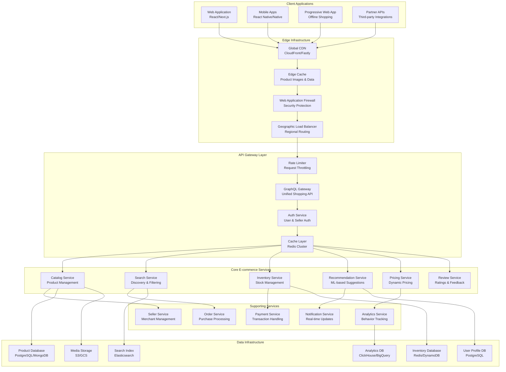

### Product Discovery & Search Architecture

[⬆️ Back to Top](#--table-of-contents)

---


```mermaid
graph TD
    subgraph "Search Input Processing"
        USER_QUERY[User Search Query]
        QUERY_PARSER[Query Parser<br/>Intent Recognition]
        SPELL_CHECKER[Spell Checker<br/>Typo Correction]
        QUERY_EXPANSION[Query Expansion<br/>Synonyms & Related Terms]
    end
    
    subgraph "Search Engine"
        TEXT_SEARCH[Text Search<br/>Elasticsearch]
        FACETED_SEARCH[Faceted Search<br/>Category, Brand, Price]
        VECTOR_SEARCH[Vector Search<br/>Semantic Similarity]
        HYBRID_RANKING[Hybrid Ranking<br/>Relevance + Popularity]
    end
    
    subgraph "Personalization Layer"
        USER_CONTEXT[User Context<br/>History, Preferences]
        BEHAVIORAL_SIGNALS[Behavioral Signals<br/>Clicks, Views, Purchases]
        COLLABORATIVE_FILTER[Collaborative Filtering<br/>Similar Users]
        REAL_TIME_SIGNALS[Real-time Signals<br/>Current Session]
    end
    
    subgraph "Business Logic"
        INVENTORY_FILTER[Inventory Filter<br/>Available Products]
        PRICING_LOGIC[Pricing Logic<br/>Deals, Discounts]
        SELLER_RANKING[Seller Ranking<br/>Performance Metrics]
        REGIONAL_RULES[Regional Rules<br/>Location-based Filtering]
    end
    
    subgraph "Result Optimization"
        DIVERSITY_ENGINE[Diversity Engine<br/>Varied Results]
        AB_TESTING[A/B Testing<br/>Algorithm Experiments]
        BUSINESS_RULES[Business Rules<br/>Promoted Products]
        FINAL_RANKING[Final Ranking<br/>Optimized Order]
    end
    
    USER_QUERY --> QUERY_PARSER
    QUERY_PARSER --> SPELL_CHECKER
    SPELL_CHECKER --> QUERY_EXPANSION
    
    QUERY_EXPANSION --> TEXT_SEARCH
    QUERY_EXPANSION --> FACETED_SEARCH
    QUERY_EXPANSION --> VECTOR_SEARCH
    
    TEXT_SEARCH --> HYBRID_RANKING
    FACETED_SEARCH --> HYBRID_RANKING
    VECTOR_SEARCH --> HYBRID_RANKING
    
    USER_CONTEXT --> COLLABORATIVE_FILTER
    BEHAVIORAL_SIGNALS --> COLLABORATIVE_FILTER
    REAL_TIME_SIGNALS --> COLLABORATIVE_FILTER
    
    HYBRID_RANKING --> INVENTORY_FILTER
    COLLABORATIVE_FILTER --> PRICING_LOGIC
    
    INVENTORY_FILTER --> DIVERSITY_ENGINE
    PRICING_LOGIC --> AB_TESTING
    SELLER_RANKING --> BUSINESS_RULES
    REGIONAL_RULES --> FINAL_RANKING
    
    DIVERSITY_ENGINE --> FINAL_RANKING
    AB_TESTING --> FINAL_RANKING
    BUSINESS_RULES --> FINAL_RANKING
```

---

## UI/UX and Component Structure

[⬆️ Back to Top](#--table-of-contents)

---


### Frontend Component Architecture

[⬆️ Back to Top](#--table-of-contents)

---


```mermaid
graph TD
    subgraph "App Shell"
        APP[App Container]
        ROUTER[Router System]
        AUTH[Auth Provider]
        CART[Cart Provider]
        SEARCH[Search Provider]
        THEME[Theme Provider]
    end
    
    subgraph "Navigation Components"
        HEADER[Header Navigation]
        SEARCH_BAR[Search Bar]
        CATEGORY_NAV[Category Navigation]
        USER_MENU[User Menu]
        CART_ICON[Cart Icon]
        BREADCRUMBS[Breadcrumbs]
    end
    
    subgraph "Product Discovery"
        HOMEPAGE[Homepage]
        CATEGORY_PAGE[Category Page]
        SEARCH_RESULTS[Search Results]
        PRODUCT_LISTING[Product Listing]
        FILTER_SIDEBAR[Filter Sidebar]
        SORT_CONTROLS[Sort Controls]
    end
    
    subgraph "Product Components"
        PRODUCT_CARD[Product Card]
        PRODUCT_DETAIL[Product Detail Page]
        IMAGE_GALLERY[Image Gallery]
        PRICE_DISPLAY[Price Display]
        RATING_STARS[Rating Component]
        STOCK_INDICATOR[Stock Indicator]
    end
    
    subgraph "Interactive Elements"
        ADD_TO_CART[Add to Cart Button]
        WISHLIST_BUTTON[Wishlist Button]
        QUICK_VIEW[Quick View Modal]
        COMPARISON_TOOL[Product Comparison]
        SHARE_PRODUCT[Share Product]
        RECENTLY_VIEWED[Recently Viewed]
    end
    
    subgraph "Social Proof"
        REVIEWS_SECTION[Reviews Section]
        QA_SECTION[Q&A Section]
        SELLER_INFO[Seller Information]
        DELIVERY_INFO[Delivery Information]
        RETURN_POLICY[Return Policy]
        TRUST_BADGES[Trust Badges]
    end
    
    subgraph "Recommendation Engine"
        PERSONALIZED_RECS[Personalized Recommendations]
        TRENDING_PRODUCTS[Trending Products]
        RECENTLY_VIEWED_REC[Recently Viewed Recommendations]
        RELATED_PRODUCTS[Related Products]
        DEALS_SECTION[Deals & Offers]
        SPONSORED_PRODUCTS[Sponsored Products]
    end
    
    subgraph "Shared Services"
        PRODUCT_SERVICE[Product Service]
        SEARCH_SERVICE[Search Service]
        CART_SERVICE[Cart Service]
        ANALYTICS_SERVICE[Analytics Service]
        IMAGE_SERVICE[Image Service]
        NOTIFICATION_SERVICE[Notification Service]
    end
    
    APP --> ROUTER
    APP --> AUTH
    APP --> CART
    APP --> SEARCH
    APP --> THEME
    
    ROUTER --> HEADER
    HEADER --> SEARCH_BAR
    HEADER --> CATEGORY_NAV
    HEADER --> USER_MENU
    HEADER --> CART_ICON
    
    ROUTER --> HOMEPAGE
    ROUTER --> CATEGORY_PAGE
    ROUTER --> SEARCH_RESULTS
    ROUTER --> PRODUCT_DETAIL
    
    CATEGORY_PAGE --> PRODUCT_LISTING
    SEARCH_RESULTS --> PRODUCT_LISTING
    PRODUCT_LISTING --> FILTER_SIDEBAR
    PRODUCT_LISTING --> SORT_CONTROLS
    PRODUCT_LISTING --> BREADCRUMBS
    
    PRODUCT_LISTING --> PRODUCT_CARD
    PRODUCT_DETAIL --> IMAGE_GALLERY
    PRODUCT_DETAIL --> PRICE_DISPLAY
    PRODUCT_DETAIL --> RATING_STARS
    PRODUCT_DETAIL --> STOCK_INDICATOR
    
    PRODUCT_CARD --> ADD_TO_CART
    PRODUCT_CARD --> WISHLIST_BUTTON
    PRODUCT_CARD --> QUICK_VIEW
    PRODUCT_DETAIL --> COMPARISON_TOOL
    PRODUCT_DETAIL --> SHARE_PRODUCT
    
    PRODUCT_DETAIL --> REVIEWS_SECTION
    PRODUCT_DETAIL --> QA_SECTION
    PRODUCT_DETAIL --> SELLER_INFO
    PRODUCT_DETAIL --> DELIVERY_INFO
    PRODUCT_DETAIL --> RETURN_POLICY
    PRODUCT_DETAIL --> TRUST_BADGES
    
    HOMEPAGE --> PERSONALIZED_RECS
    HOMEPAGE --> TRENDING_PRODUCTS
    PRODUCT_DETAIL --> RECENTLY_VIEWED_REC
    PRODUCT_DETAIL --> RELATED_PRODUCTS
    CATEGORY_PAGE --> DEALS_SECTION
    SEARCH_RESULTS --> SPONSORED_PRODUCTS
    
    RECENTLY_VIEWED --> RECENTLY_VIEWED_REC
    
    PRODUCT_CARD --> PRODUCT_SERVICE
    SEARCH_BAR --> SEARCH_SERVICE
    ADD_TO_CART --> CART_SERVICE
    PRODUCT_CARD --> ANALYTICS_SERVICE
    IMAGE_GALLERY --> IMAGE_SERVICE
    ADD_TO_CART --> NOTIFICATION_SERVICE
```

#### React Component Implementation

[⬆️ Back to Top](#--table-of-contents)

---

**MarketplaceContainer.jsx**
```jsx
import React, { useState, useEffect, useCallback } from 'react';
import { MarketplaceProvider } from './MarketplaceContext';
import { CartProvider } from './CartContext';
import Header from './Header';
import ProductListing from './ProductListing';
import FilterSidebar from './FilterSidebar';
import ProductDetail from './ProductDetail';
import { useSearchParams } from 'react-router-dom';

const MarketplaceContainer = () => {
  const [searchParams, setSearchParams] = useSearchParams();
  const [products, setProducts] = useState([]);
  const [filters, setFilters] = useState({
    category: searchParams.get('category') || '',
    priceRange: [0, 1000],
    rating: 0,
    brand: [],
    inStock: false
  });
  const [sortBy, setSortBy] = useState('relevance');
  const [isLoading, setIsLoading] = useState(false);
  const [totalResults, setTotalResults] = useState(0);
  const [currentPage, setCurrentPage] = useState(1);
  const [cart, setCart] = useState([]);
  const [wishlist, setWishlist] = useState([]);

  useEffect(() => {
    fetchProducts();
  }, [filters, sortBy, currentPage]);

  const fetchProducts = async () => {
    setIsLoading(true);
    try {
      const params = new URLSearchParams({
        ...filters,
        sortBy,
        page: currentPage,
        limit: 20
      });

      const response = await fetch(`/api/products?${params}`);
      const data = await response.json();
      
      setProducts(data.products);
      setTotalResults(data.total);
    } catch (error) {
      console.error('Failed to fetch products:', error);
    } finally {
      setIsLoading(false);
    }
  };

  const handleFilterChange = useCallback((newFilters) => {
    setFilters(newFilters);
    setCurrentPage(1);
    
    // Update URL params
    const params = new URLSearchParams();
    Object.entries(newFilters).forEach(([key, value]) => {
      if (value && value !== '' && value !== 0) {
        params.set(key, value);
      }
    });
    setSearchParams(params);
  }, [setSearchParams]);

  const handleAddToCart = useCallback((product, quantity = 1) => {
    setCart(prev => {
      const existingItem = prev.find(item => item.id === product.id);
      if (existingItem) {
        return prev.map(item =>
          item.id === product.id
            ? { ...item, quantity: item.quantity + quantity }
            : item
        );
      }
      return [...prev, { ...product, quantity }];
    });
  }, []);

  const handleToggleWishlist = useCallback((productId) => {
    setWishlist(prev => 
      prev.includes(productId)
        ? prev.filter(id => id !== productId)
        : [...prev, productId]
    );
  }, []);

  const updateCartQuantity = useCallback((productId, quantity) => {
    if (quantity <= 0) {
      setCart(prev => prev.filter(item => item.id !== productId));
    } else {
      setCart(prev => prev.map(item =>
        item.id === productId ? { ...item, quantity } : item
      ));
    }
  }, []);

  return (
    <MarketplaceProvider value={{
      products,
      filters,
      sortBy,
      isLoading,
      totalResults,
      currentPage,
      wishlist,
      onFilterChange: handleFilterChange,
      onSortChange: setSortBy,
      onPageChange: setCurrentPage,
      onToggleWishlist: handleToggleWishlist
    }}>
      <CartProvider value={{
        cart,
        onAddToCart: handleAddToCart,
        onUpdateQuantity: updateCartQuantity
      }}>
        <div className="marketplace-container">
          <Header />
          
          <main className="marketplace-main">
            <div className="content-wrapper">
              <FilterSidebar
                filters={filters}
                onFiltersChange={handleFilterChange}
              />
              
              <div className="products-section">
                <ProductListing
                  products={products}
                  isLoading={isLoading}
                  totalResults={totalResults}
                  currentPage={currentPage}
                  sortBy={sortBy}
                  onSortChange={setSortBy}
                  onPageChange={setCurrentPage}
                />
              </div>
            </div>
          </main>
        </div>
      </CartProvider>
    </MarketplaceProvider>
  );
};

export default MarketplaceContainer;
```

**ProductCard.jsx**

**What this code does:**
• **Main Purpose**: Individual product card with wishlist, cart, and quick view functionality
• **User Interactions**: Handles add to cart, wishlist toggle, and quick view modal
• **Key Functions**:
  - `handleAddToCart()` - Adds product to cart with loading feedback
  - `handleQuickView()` - Opens product quick view modal
  - `getImageSrc()` - Provides image fallback and lazy loading
  - `calculateDiscount()` - Computes and displays discount percentage
  - Image loading states with skeleton placeholder

```jsx
import React, { useState, useContext } from 'react';
import { MarketplaceContext } from './MarketplaceContext';
import { CartContext } from './CartContext';
import RatingStars from './RatingStars';
import PriceDisplay from './PriceDisplay';
import StockIndicator from './StockIndicator';
import WishlistButton from './WishlistButton';
import QuickViewModal from './QuickViewModal';

const ProductCard = ({ product }) => {
  const { wishlist, onToggleWishlist } = useContext(MarketplaceContext);
  const { onAddToCart } = useContext(CartContext);
  const [showQuickView, setShowQuickView] = useState(false);
  const [imageLoaded, setImageLoaded] = useState(false);
  const [imageError, setImageError] = useState(false);

  const isInWishlist = wishlist.includes(product.id);

  const handleAddToCart = (e) => {
    e.preventDefault();
    e.stopPropagation();
    onAddToCart(product);
    
    // Show success feedback
    const button = e.target;
    const originalText = button.textContent;
    button.textContent = 'Added!';
    button.disabled = true;
    
    setTimeout(() => {
      button.textContent = originalText;
      button.disabled = false;
    }, 1500);
  };

  const handleQuickView = (e) => {
    e.preventDefault();
    e.stopPropagation();
    setShowQuickView(true);
  };

  const getImageSrc = () => {
    return product.images?.thumbnail || product.images?.small || '/placeholder-product.jpg';
  };

  const calculateDiscount = () => {
    if (product.originalPrice && product.currentPrice) {
      return Math.round(((product.originalPrice - product.currentPrice) / product.originalPrice) * 100);
    }
    return 0;
  };

  const discount = calculateDiscount();

  return (
    <>
      <div className="product-card">
        <div className="product-image-container">
          {!imageLoaded && !imageError && (
            <div className="image-skeleton" />
          )}
          
           setImageLoaded(true)}
            onError={() => setImageError(true)}
            loading="lazy"
          />
          
          {discount > 0 && (
            <div className="discount-badge">
              -{discount}%
            </div>
          )}
          
          <div className="product-overlay">
            <button 
              className="quick-view-btn"
              onClick={handleQuickView}
              aria-label="Quick view"
            >
              Quick View
            </button>
          </div>
          
          <WishlistButton
            isInWishlist={isInWishlist}
            onToggle={() => onToggleWishlist(product.id)}
            className="wishlist-overlay"
          />
        </div>

        <div className="product-info">
          <div className="product-brand">
            {product.brand}
          </div>
          
          <h3 className="product-name">
            {product.name}
          </h3>
          
          <div className="product-rating">
            <RatingStars 
              rating={product.rating} 
              size="small"
            />
            <span className="review-count">
              ({product.reviewCount})
            </span>
          </div>
          
          <PriceDisplay
            currentPrice={product.currentPrice}
            originalPrice={product.originalPrice}
            currency={product.currency}
          />
          
          <StockIndicator
            stock={product.stock}
            lowStockThreshold={10}
          />
          
          <div className="product-actions">
            <button
              className="add-to-cart-btn"
              onClick={handleAddToCart}
              disabled={product.stock === 0}
            >
              {product.stock === 0 ? 'Out of Stock' : 'Add to Cart'}
            </button>
          </div>
        </div>
      </div>

      {/* Quick View Modal */}
      {showQuickView && (
        <QuickViewModal
          product={product}
          onClose={() => setShowQuickView(false)}
          onAddToCart={onAddToCart}
        />
      )}
    </>
  );
};

export default ProductCard;
```

**FilterSidebar.jsx**

**What this code does:**
• **Main Purpose**: Product filtering sidebar with collapsible sections and active filter tracking
• **Filter Management**: Handles price range, category, brand, and rating filters
• **Key Functions**:
  - `handleFilterUpdate()` - Updates specific filter types and triggers search
  - `handleClearFilters()` - Resets all filters to default values
  - `getActiveFilterCount()` - Counts active filters for badge display
  - Collapsible interface with expand/collapse toggle
  - Price range slider and multi-select brand filters

```jsx
import React, { useState, useCallback } from 'react';
import PriceRangeFilter from './PriceRangeFilter';
import CategoryFilter from './CategoryFilter';
import BrandFilter from './BrandFilter';
import RatingFilter from './RatingFilter';

const FilterSidebar = ({ filters, onFiltersChange }) => {
  const [isCollapsed, setIsCollapsed] = useState(false);

  const handleFilterUpdate = useCallback((filterType, value) => {
    const newFilters = {
      ...filters,
      [filterType]: value
    };
    onFiltersChange(newFilters);
  }, [filters, onFiltersChange]);

  const handleClearFilters = () => {
    onFiltersChange({
      category: '',
      priceRange: [0, 1000],
      rating: 0,
      brand: [],
      inStock: false
    });
  };

  const getActiveFilterCount = () => {
    let count = 0;
    if (filters.category) count++;
    if (filters.priceRange[0] > 0 || filters.priceRange[1] < 1000) count++;
    if (filters.rating > 0) count++;
    if (filters.brand.length > 0) count++;
    if (filters.inStock) count++;
    return count;
  };

  const activeFilterCount = getActiveFilterCount();

  return (
    <aside className={`filter-sidebar ${isCollapsed ? 'collapsed' : ''}`}>
      <div className="filter-header">
        <h3 className="filter-title">
          Filters
          {activeFilterCount > 0 && (
            <span className="active-filter-count">({activeFilterCount})</span>
          )}
        </h3>
        
        <div className="filter-actions">
          {activeFilterCount > 0 && (
            <button 
              className="clear-filters-btn"
              onClick={handleClearFilters}
            >
              Clear All
            </button>
          )}
          
          <button 
            className="toggle-filters-btn"
            onClick={() => setIsCollapsed(!isCollapsed)}
            aria-label={isCollapsed ? 'Expand filters' : 'Collapse filters'}
          >
            {isCollapsed ? '▼' : '▲'}
          </button>
        </div>
      </div>

      {!isCollapsed && (
        <div className="filter-content">
          <CategoryFilter
            selectedCategory={filters.category}
            onCategoryChange={(category) => handleFilterUpdate('category', category)}
          />
          
          <PriceRangeFilter
            priceRange={filters.priceRange}
            onPriceRangeChange={(range) => handleFilterUpdate('priceRange', range)}
            min={0}
            max={1000}
          />
          
          <BrandFilter
            selectedBrands={filters.brand}
            onBrandChange={(brands) => handleFilterUpdate('brand', brands)}
          />
          
          <RatingFilter
            selectedRating={filters.rating}
            onRatingChange={(rating) => handleFilterUpdate('rating', rating)}
          />
          
          <div className="filter-group">
            <h4 className="filter-group-title">Availability</h4>
            <label className="filter-checkbox">
              <input
                type="checkbox"
                checked={filters.inStock}
                onChange={(e) => handleFilterUpdate('inStock', e.target.checked)}
              />
              <span className="checkmark" />
              In Stock Only
            </label>
          </div>
        </div>
      )}
    </aside>
  );
};

export default FilterSidebar;
```

**ProductListing.jsx**

**What this code does:**
• **Main Purpose**: Product listing container with grid/list view modes and pagination
• **View Management**: Switches between different product display formats
• **Key Functions**:
  - `handleViewModeChange()` - Toggles between grid, list, and table views
  - Pagination controls for navigating through product pages
  - Loading states and empty state handling
  - Sort controls integration for product ordering
  - Responsive product count per page

```jsx
import React, { useState, useCallback } from 'react';
import ProductCard from './ProductCard';
import SortControls from './SortControls';
import Pagination from './Pagination';
import LoadingSpinner from './LoadingSpinner';

const ProductListing = ({
  products,
  isLoading,
  totalResults,
  currentPage,
  sortBy,
  onSortChange,
  onPageChange
}) => {
  const [viewMode, setViewMode] = useState('grid'); // 'grid' or 'list'
  const [productsPerPage] = useState(20);

  const totalPages = Math.ceil(totalResults / productsPerPage);

  const handleViewModeChange = useCallback((mode) => {
    setViewMode(mode);
  }, []);

  if (isLoading && products.length === 0) {
    return (
      <div className="products-loading">
        <LoadingSpinner size="large" />
        <p>Loading products...</p>
      </div>
    );
  }

  return (
    <div className="product-listing">
      {/* Results Header */}
      <div className="listing-header">
        <div className="results-info">
          <h2 className="results-count">
            {totalResults.toLocaleString()} Products Found
          </h2>
        </div>
        
        <div className="listing-controls">
          <div className="view-mode-toggle">
            <button
              className={`view-btn ${viewMode === 'grid' ? 'active' : ''}`}
              onClick={() => handleViewModeChange('grid')}
              aria-label="Grid view"
            >
              ⊞
            </button>
            <button
              className={`view-btn ${viewMode === 'list' ? 'active' : ''}`}
              onClick={() => handleViewModeChange('list')}
              aria-label="List view"
            >
              ☰
            </button>
          </div>
          
          <SortControls
            sortBy={sortBy}
            onSortChange={onSortChange}
          />
        </div>
      </div>

      {/* Products Grid/List */}
      {products.length === 0 ? (
        <div className="no-products">
          <div className="no-products-icon">🔍</div>
          <h3>No products found</h3>
          <p>Try adjusting your filters or search criteria</p>
        </div>
      ) : (
        <>
          <div className={`products-container ${viewMode}-view`}>
            {products.map((product) => (
              <ProductCard
                key={product.id}
                product={product}
                viewMode={viewMode}
              />
            ))}
          </div>

          {/* Loading overlay for pagination */}
          {isLoading && (
            <div className="loading-overlay">
              <LoadingSpinner />
            </div>
          )}

          {/* Pagination */}
          {totalPages > 1 && (
            <Pagination
              currentPage={currentPage}
              totalPages={totalPages}
              onPageChange={onPageChange}
              showPreviousNext={true}
              showPageNumbers={true}
              maxPageNumbers={5}
            />
          )}
        </>
      )}
    </div>
  );
};

export default ProductListing;
```

### Responsive E-commerce Layout

[⬆️ Back to Top](#--table-of-contents)

---


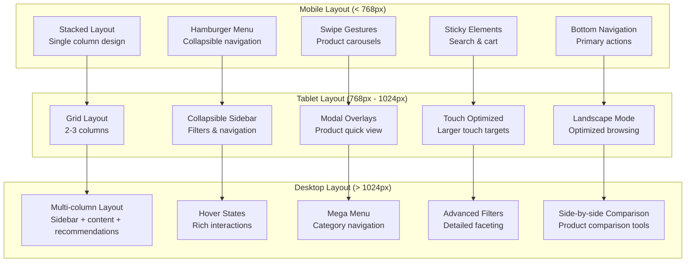

### Product Listing Virtualization

[⬆️ Back to Top](#--table-of-contents)

---


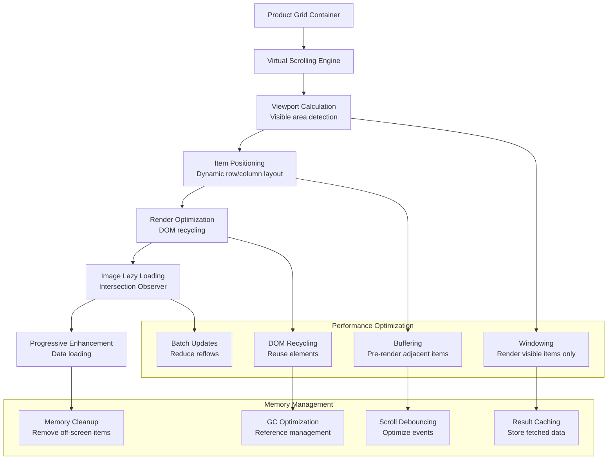

---

## Real-Time Sync, Data Modeling & APIs

[⬆️ Back to Top](#--table-of-contents)

---


### Search Ranking Algorithm

[⬆️ Back to Top](#--table-of-contents)

---


#### Multi-Signal Ranking Engine

[⬆️ Back to Top](#--table-of-contents)

---


```mermaid
graph TD
    subgraph "Relevance Signals"
        TEXT_MATCH[Text Match Score<br/>Query-title similarity]
        CATEGORY_MATCH[Category Relevance<br/>Product classification]
        ATTRIBUTE_MATCH[Attribute Matching<br/>Brand, features, specs]
        SEMANTIC_MATCH[Semantic Similarity<br/>Vector embeddings]
    end
    
    subgraph "Quality Signals"
        PRODUCT_RATING[Product Rating<br/>Customer reviews]
        SELLER_RATING[Seller Rating<br/>Merchant reputation]
        IMAGE_QUALITY[Image Quality<br/>Visual assessment]
        DESCRIPTION_QUALITY[Description Quality<br/>Content completeness]
    end
    
    subgraph "Popularity Signals"
        VIEW_COUNT[View Count<br/>Product page visits]
        SALES_VELOCITY[Sales Velocity<br/>Purchase frequency]
        CLICK_THROUGH_RATE[Click-through Rate<br/>Search result CTR]
        CONVERSION_RATE[Conversion Rate<br/>View to purchase]
    end
    
    subgraph "Business Signals"
        INVENTORY_STATUS[Inventory Status<br/>Stock availability]
        SHIPPING_SPEED[Shipping Speed<br/>Delivery options]
        PRICE_COMPETITIVENESS[Price Competitiveness<br/>Market comparison]
        PROMOTION_STATUS[Promotion Status<br/>Deals and discounts]
    end
    
    subgraph "Personalization Signals"
        USER_HISTORY[User History<br/>Past purchases/views]
        PREFERENCE_MATCH[Preference Match<br/>Brand/category affinity]
        DEMOGRAPHIC_MATCH[Demographic Match<br/>Age, location, gender]
        REAL_TIME_CONTEXT[Real-time Context<br/>Current session behavior]
    end
    
    subgraph "Machine Learning Pipeline"
        FEATURE_ENGINEERING[Feature Engineering<br/>Signal normalization]
        ENSEMBLE_MODEL[Ensemble Model<br/>Multiple algorithms]
        LEARNING_TO_RANK[Learning to Rank<br/>Pairwise optimization]
        REAL_TIME_SCORING[Real-time Scoring<br/>Live rank calculation]
    end
    
    TEXT_MATCH --> FEATURE_ENGINEERING
    CATEGORY_MATCH --> FEATURE_ENGINEERING
    ATTRIBUTE_MATCH --> FEATURE_ENGINEERING
    SEMANTIC_MATCH --> FEATURE_ENGINEERING
    
    PRODUCT_RATING --> ENSEMBLE_MODEL
    SELLER_RATING --> ENSEMBLE_MODEL
    IMAGE_QUALITY --> ENSEMBLE_MODEL
    DESCRIPTION_QUALITY --> ENSEMBLE_MODEL
    
    VIEW_COUNT --> LEARNING_TO_RANK
    SALES_VELOCITY --> LEARNING_TO_RANK
    CLICK_THROUGH_RATE --> LEARNING_TO_RANK
    CONVERSION_RATE --> LEARNING_TO_RANK
    
    INVENTORY_STATUS --> REAL_TIME_SCORING
    SHIPPING_SPEED --> REAL_TIME_SCORING
    PRICE_COMPETITIVENESS --> REAL_TIME_SCORING
    PROMOTION_STATUS --> REAL_TIME_SCORING
    
    USER_HISTORY --> FEATURE_ENGINEERING
    PREFERENCE_MATCH --> ENSEMBLE_MODEL
    DEMOGRAPHIC_MATCH --> LEARNING_TO_RANK
    REAL_TIME_CONTEXT --> REAL_TIME_SCORING
    
    FEATURE_ENGINEERING --> ENSEMBLE_MODEL
    ENSEMBLE_MODEL --> LEARNING_TO_RANK
    LEARNING_TO_RANK --> REAL_TIME_SCORING
```

### Real-time Inventory Management

[⬆️ Back to Top](#--table-of-contents)

---


#### Inventory Synchronization Algorithm

[⬆️ Back to Top](#--table-of-contents)

---


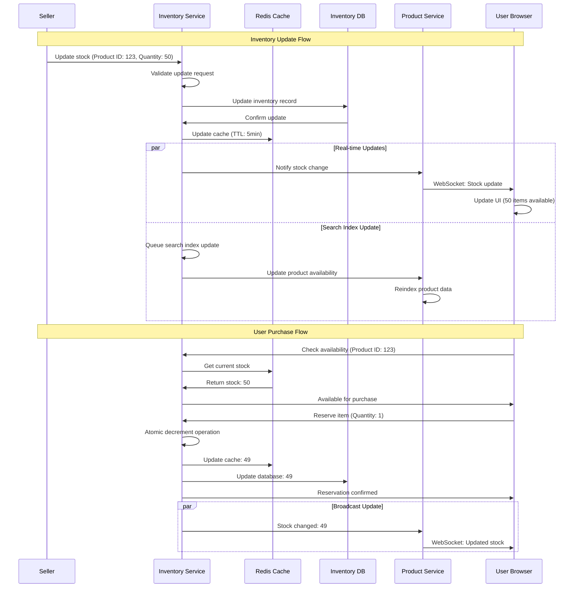

### Dynamic Pricing Engine

[⬆️ Back to Top](#--table-of-contents)

---


#### Price Optimization Algorithm

[⬆️ Back to Top](#--table-of-contents)

---


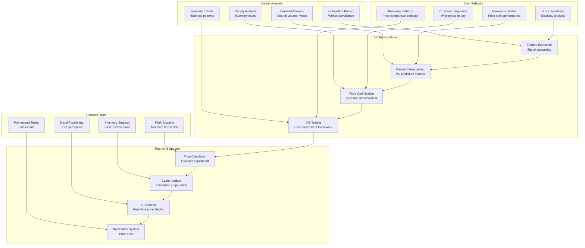

### Data Models

[⬆️ Back to Top](#--table-of-contents)

---


#### Product Schema

[⬆️ Back to Top](#--table-of-contents)

---

```
Product {
  id: UUID
  sku: String
  title: String
  description: String
  category: {
    primary: String
    secondary: String
    breadcrumb: [String]
  }
  attributes: {
    brand: String
    model: String
    color: String
    size: String
    weight: Float
    dimensions: Object
    specifications: Object
  }
  media: {
    images: [{
      url: String
      alt_text: String
      type: 'main' | 'variant' | 'detail'
      order: Integer
    }]
    videos: [String]
    documents: [String]
  }
  pricing: {
    base_price: Decimal
    current_price: Decimal
    currency: String
    discount_percentage?: Float
    price_history: [PricePoint]
  }
  inventory: {
    quantity: Integer
    reserved: Integer
    available: Integer
    warehouse_locations: [String]
    restocking_date?: DateTime
  }
  seller: {
    id: UUID
    name: String
    rating: Float
    fulfillment_method: 'seller' | 'marketplace'
  }
  seo: {
    meta_title: String
    meta_description: String
    keywords: [String]
    structured_data: Object
  }
  metadata: {
    created_at: DateTime
    updated_at: DateTime
    status: 'active' | 'inactive' | 'pending'
    quality_score: Float
    popularity_score: Float
  }
}
```

#### Search Index Schema

[⬆️ Back to Top](#--table-of-contents)

---

```
SearchDocument {
  product_id: UUID
  title: String
  description: String
  searchable_text: String
  category_path: [String]
  brand: String
  price: Float
  rating: Float
  availability: Boolean
  image_url: String
  seller_id: UUID
  boost_score: Float
  facets: {
    category: [String]
    brand: [String]
    price_range: String
    rating_range: String
    shipping_options: [String]
    color: [String]
    size: [String]
  }
  geo_availability: [String]
  last_indexed: DateTime
}
```

### TypeScript Interfaces & Component Props

[⬆️ Back to Top](#--table-of-contents)

---

#### Core Data Interfaces

```typescript
interface Product {
  id: string;
  title: string;
  description: string;
  brand: string;
  category: ProductCategory;
  price: Price;
  images: ProductImage[];
  specifications: ProductSpec[];
  variants: ProductVariant[];
  seller: SellerInfo;
  rating: Rating;
  inventory: InventoryInfo;
  shipping: ShippingInfo;
}

interface Price {
  current: number;
  original?: number;
  currency: string;
  discountPercentage?: number;
  priceHistory?: PricePoint[];
}

interface ProductCategory {
  id: string;
  name: string;
  path: string[];
  parentId?: string;
  level: number;
  attributes: CategoryAttribute[];
}

interface SearchResult {
  products: Product[];
  totalCount: number;
  facets: SearchFacet[];
  suggestions: SearchSuggestion[];
  pagination: PaginationInfo;
  filters: ActiveFilter[];
}

interface SellerInfo {
  id: string;
  name: string;
  rating: number;
  reviewCount: number;
  verified: boolean;
  shippingTime: string;
}
```

#### Component Props Interfaces

```typescript
interface ProductCatalogProps {
  searchQuery?: string;
  categoryId?: string;
  filters: ProductFilter[];
  sortBy: SortOption;
  onProductClick: (productId: string) => void;
  onFilterChange: (filters: ProductFilter[]) => void;
  onSortChange: (sort: SortOption) => void;
  viewMode: 'grid' | 'list';
  itemsPerPage?: number;
}

interface ProductCardProps {
  product: Product;
  onAddToCart: (productId: string, variant?: string) => void;
  onAddToWishlist: (productId: string) => void;
  onQuickView: (productId: string) => void;
  showCompare?: boolean;
  showWishlist?: boolean;
  layout: 'compact' | 'detailed';
}

interface SearchBarProps {
  value: string;
  onSearch: (query: string) => void;
  onSuggestionSelect: (suggestion: SearchSuggestion) => void;
  suggestions: SearchSuggestion[];
  placeholder?: string;
  showFilters?: boolean;
  categories?: ProductCategory[];
}

interface FilterSidebarProps {
  availableFilters: FilterOption[];
  activeFilters: ProductFilter[];
  onFilterToggle: (filter: ProductFilter) => void;
  onFilterClear: () => void;
  onPriceRangeChange: (min: number, max: number) => void;
  collapsible?: boolean;
}
```

### API Reference

[⬆️ Back to Top](#--table-of-contents)

---

#### Product Catalog
- `GET /api/products` - Search and browse products with filtering and pagination
- `GET /api/products/:id` - Get detailed product information with variants
- `GET /api/products/:id/recommendations` - Get related and recommended products
- `GET /api/products/:id/reviews` - Get product reviews with rating breakdown
- `POST /api/products/:id/reviews` - Submit product review and rating

#### Search & Discovery
- `GET /api/search` - Full-text product search with autocomplete and facets
- `GET /api/search/suggestions` - Get search suggestions and query completions
- `GET /api/search/trending` - Get trending search terms and popular products
- `POST /api/search/track` - Track search queries for analytics and improvement
- `GET /api/categories/tree` - Get complete product category hierarchy

#### Inventory & Pricing
- `GET /api/products/:id/inventory` - Check real-time product availability
- `GET /api/products/:id/price-history` - Get product price change history
- `POST /api/products/:id/price-alert` - Set price drop notification alerts
- `GET /api/products/deals` - Get current deals, discounts, and promotions
- `POST /api/products/:id/stock-notify` - Get notified when item back in stock

#### Shopping Cart & Wishlist
- `POST /api/cart/items` - Add product to shopping cart with variant selection
- `GET /api/cart` - Get current cart items with updated pricing
- `PUT /api/cart/items/:id` - Update cart item quantity or variant
- `DELETE /api/cart/items/:id` - Remove item from shopping cart
- `POST /api/wishlist/:productId` - Add or remove product from wishlist

#### Seller & Marketplace
- `GET /api/sellers/:id` - Get seller profile and performance metrics
- `GET /api/sellers/:id/products` - Get products from specific seller
- `GET /api/sellers/:id/reviews` - Get seller reviews and ratings
- `POST /api/sellers/:id/follow` - Follow seller for updates and promotions
- `GET /api/marketplace/categories` - Get marketplace category performance

#### Recommendations & Personalization
- `GET /api/recommendations/personalized` - Get ML-powered product recommendations
- `GET /api/recommendations/trending` - Get trending products in user's region
- `GET /api/recommendations/similar/:productId` - Get products similar to specified item
- `POST /api/recommendations/feedback` - Provide recommendation relevance feedback
- `GET /api/user/browsing-history` - Get user's product browsing history

#### Analytics & Tracking
- `POST /api/analytics/product-view` - Track product page views for recommendations
- `POST /api/analytics/cart-action` - Track cart additions, removals, and checkouts
- `GET /api/analytics/trending-products` - Get trending products by category
- `POST /api/analytics/search-action` - Track search interactions and result clicks
- `GET /api/analytics/conversion-funnel` - Get conversion metrics for optimization

---

## Performance and Scalability

[⬆️ Back to Top](#--table-of-contents)

---


### Caching Strategy for E-commerce

[⬆️ Back to Top](#--table-of-contents)

---


#### Multi-Level Caching Architecture

[⬆️ Back to Top](#--table-of-contents)

---


```mermaid
graph LR
    subgraph "Client-Side Cache"
        L1[Browser Cache<br/>Static Assets<br/>TTL: 30 days]
        L2[Service Worker<br/>Product Data<br/>TTL: 1 hour]
        L3[Local Storage<br/>User Preferences<br/>TTL: 30 days]
    end
    
    subgraph "CDN Cache"
        L4[CDN Edge<br/>Product Images<br/>TTL: 30 days]
        L5[CDN Regional<br/>Product Data<br/>TTL: 1 hour]
        L6[CDN Origin<br/>Search Results<br/>TTL: 15 minutes]
    end
    
    subgraph "Application Cache"
        L7[Redis Hot<br/>Popular Products<br/>TTL: 15 minutes]
        L8[Redis Warm<br/>Recent Searches<br/>TTL: 1 hour]
        L9[Memcached<br/>Session Data<br/>TTL: 30 minutes]
    end
    
    subgraph "Database Cache"
        L10[Database Buffer Pool<br/>Query Results<br/>Memory-based]
        L11[Read Replicas<br/>Product Catalog<br/>Eventual consistency]
    end
    
    USER[User Request] --> L1
    L1 -->|Miss| L2
    L2 -->|Miss| L3
    L3 -->|Miss| L4
    L4 -->|Miss| L5
    L5 -->|Miss| L6
    L6 -->|Miss| L7
    L7 -->|Miss| L8
    L8 -->|Miss| L9
    L9 -->|Miss| L10
    L10 -->|Miss| L11
```

### Database Scaling Strategy

[⬆️ Back to Top](#--table-of-contents)

---


#### Product Catalog Sharding

[⬆️ Back to Top](#--table-of-contents)

---


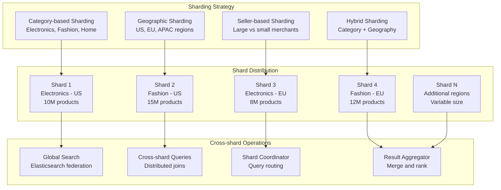

### Search Performance Optimization

[⬆️ Back to Top](#--table-of-contents)

---


#### Elasticsearch Optimization Strategy

[⬆️ Back to Top](#--table-of-contents)

---


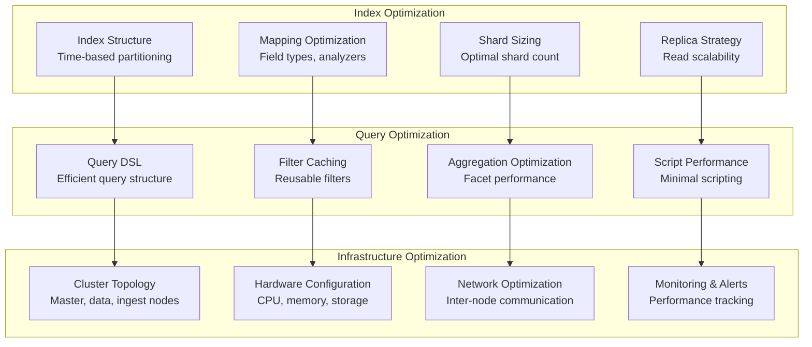

---

## Security and Privacy

[⬆️ Back to Top](#--table-of-contents)

---


### E-commerce Security Framework

[⬆️ Back to Top](#--table-of-contents)

---


#### Multi-Layer Security Architecture

[⬆️ Back to Top](#--table-of-contents)

---


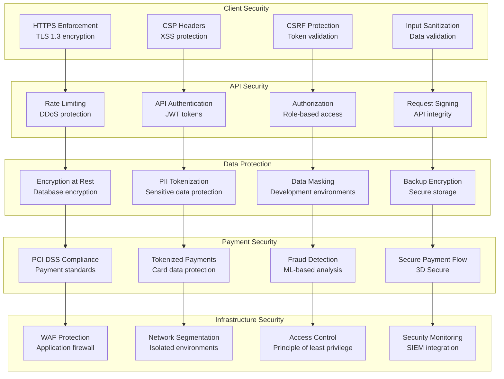

### Fraud Prevention System

[⬆️ Back to Top](#--table-of-contents)

---


#### Real-time Fraud Detection

[⬆️ Back to Top](#--table-of-contents)

---


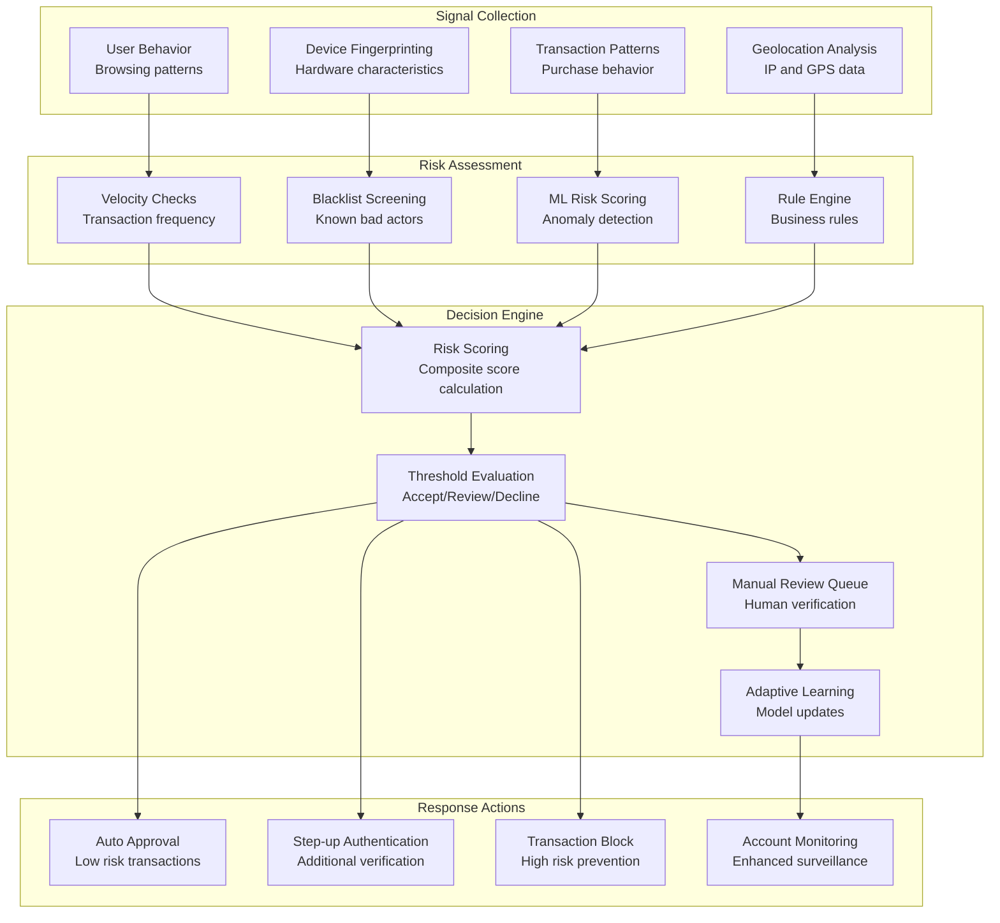

---

## Testing, Monitoring, and Maintainability

[⬆️ Back to Top](#--table-of-contents)

---


### E-commerce Testing Strategy

[⬆️ Back to Top](#--table-of-contents)

---


#### Comprehensive Testing Framework

[⬆️ Back to Top](#--table-of-contents)

---


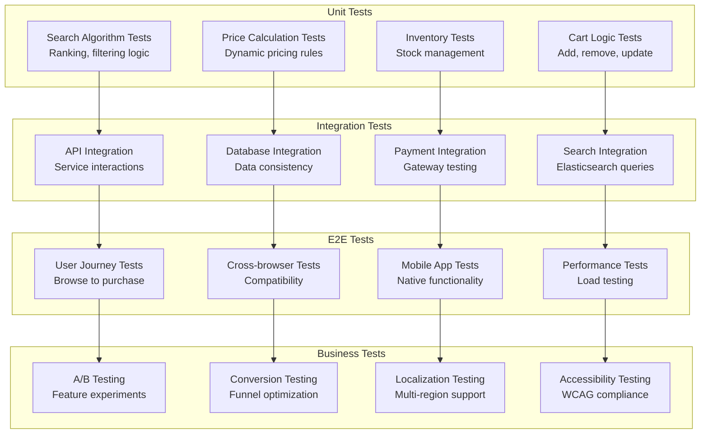

### Business Metrics Monitoring

[⬆️ Back to Top](#--table-of-contents)

---


#### E-commerce KPI Dashboard

[⬆️ Back to Top](#--table-of-contents)

---


```mermaid
graph TB
    subgraph "Revenue Metrics"
        GMV[Gross Merchandise Value<br/>Total transaction volume]
        CONVERSION_RATE[Conversion Rate<br/>Visitors to purchasers]
        AOV[Average Order Value<br/>Revenue per transaction]
        REVENUE_GROWTH[Revenue Growth<br/>Period over period]
    end
    
    subgraph "User Experience"
        PAGE_LOAD_TIME[Page Load Time<br/>Performance metrics]
        SEARCH_SUCCESS[Search Success Rate<br/>Results relevance]
        CART_ABANDONMENT[Cart Abandonment<br/>Checkout funnel]
        USER_SATISFACTION[User Satisfaction<br/>Reviews and feedback]
    end
    
    subgraph "Operational Metrics"
        INVENTORY_TURNOVER[Inventory Turnover<br/>Stock efficiency]
        SELLER_PERFORMANCE[Seller Performance<br/>Fulfillment metrics]
        SYSTEM_UPTIME[System Uptime<br/>Availability SLA]
        ERROR_RATES[Error Rates<br/>System reliability]
    end
    
    subgraph "Alert Framework"
        REVENUE_ALERTS[Revenue Alerts<br/>Threshold monitoring]
        PERFORMANCE_ALERTS[Performance Alerts<br/>Speed degradation]
        INVENTORY_ALERTS[Inventory Alerts<br/>Stock out warnings]
        SECURITY_ALERTS[Security Alerts<br/>Fraud detection]
    end
    
    GMV --> REVENUE_ALERTS
    CONVERSION_RATE --> REVENUE_ALERTS
    PAGE_LOAD_TIME --> PERFORMANCE_ALERTS
    SEARCH_SUCCESS --> PERFORMANCE_ALERTS
    INVENTORY_TURNOVER --> INVENTORY_ALERTS
    SELLER_PERFORMANCE --> INVENTORY_ALERTS
    SYSTEM_UPTIME --> SECURITY_ALERTS
    ERROR_RATES --> SECURITY_ALERTS
```

---

## Trade-offs, Deep Dives, and Extensions

[⬆️ Back to Top](#--table-of-contents)

---


### Search Strategy Trade-offs

[⬆️ Back to Top](#--table-of-contents)

---


| Approach | Elasticsearch | Traditional SQL | Graph Database | Hybrid Search |
|----------|---------------|-----------------|----------------|---------------|
| **Performance** | Excellent | Good | Variable | Excellent |
| **Scalability** | Excellent | Limited | Good | Excellent |
| **Complexity** | Medium | Low | High | High |
| **Real-time** | Good | Limited | Good | Excellent |
| **Faceting** | Excellent | Limited | Poor | Excellent |
| **Cost** | Medium | Low | High | High |

### Personalization vs Privacy Trade-offs

[⬆️ Back to Top](#--table-of-contents)

---


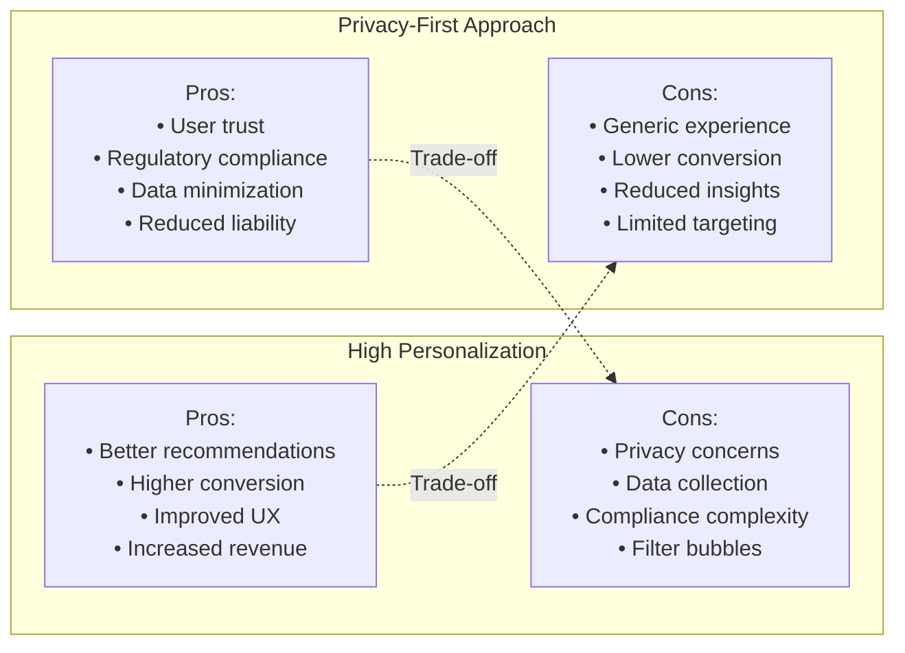

### Advanced Features

[⬆️ Back to Top](#--table-of-contents)

---


#### AI-Powered Shopping Assistant

[⬆️ Back to Top](#--table-of-contents)

---


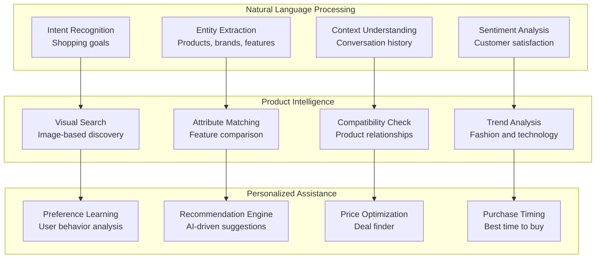

### Future Extensions

[⬆️ Back to Top](#--table-of-contents)

---


#### Next-Generation E-commerce Features

[⬆️ Back to Top](#--table-of-contents)

---


1. **Immersive Shopping**:
   - AR/VR product visualization
   - Virtual try-on experiences
   - 3D product modeling
   - Interactive showrooms

2. **Conversational Commerce**:
   - Voice shopping assistants
   - Chatbot product recommendations
   - Natural language search
   - Social commerce integration

3. **Blockchain Integration**:
   - Supply chain transparency
   - Cryptocurrency payments
   - NFT marketplaces
   - Decentralized reviews

4. **Sustainability Features**:
   - Carbon footprint tracking
   - Sustainable product badges
   - Circular economy integration
   - Environmental impact scoring

This comprehensive design provides a robust foundation for building a world-class e-commerce marketplace that can handle massive scale while delivering personalized, secure, and high-performance shopping experiences across all platforms and devices. 