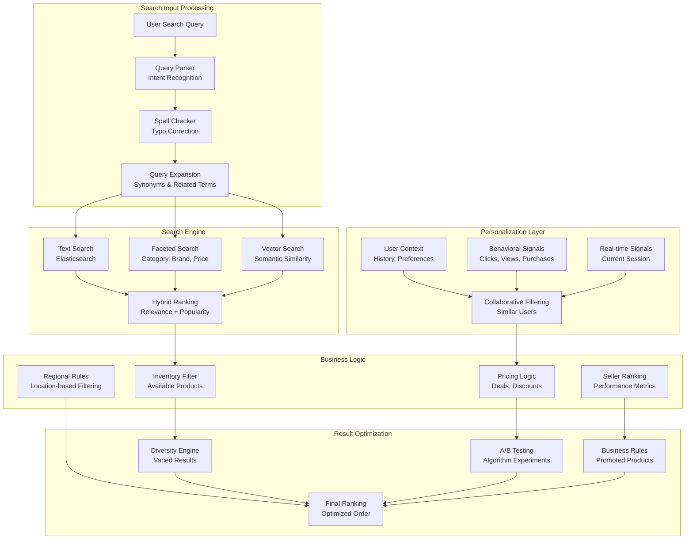

# Architect an Online Marketplace's Frontend Catalog (like Amazon or eBay)


## 📋 Table of Contents

- [Architect an Online Marketplace's Frontend Catalog (like Amazon or eBay)](#architect-an-online-marketplaces-frontend-catalog-like-amazon-or-ebay)
  - [Table of Contents](#table-of-contents)
  - [Clarify the Problem and Requirements](#clarify-the-problem-and-requirements)
    - [Problem Understanding](#problem-understanding)
    - [Functional Requirements](#functional-requirements)
    - [Non-Functional Requirements](#non-functional-requirements)
    - [Key Assumptions](#key-assumptions)
  - [High-Level Architecture](#high-level-architecture)
    - [Global E-commerce Architecture](#global-e-commerce-architecture)
    - [Product Discovery & Search Architecture](#product-discovery-search-architecture)
  - [UI/UX and Component Structure](#uiux-and-component-structure)
    - [Frontend Component Architecture](#frontend-component-architecture)
    - [Responsive E-commerce Layout](#responsive-e-commerce-layout)
    - [Product Listing Virtualization](#product-listing-virtualization)
  - [Real-Time Sync, Data Modeling & APIs](#real-time-sync-data-modeling-apis)
    - [Search Ranking Algorithm](#search-ranking-algorithm)
      - [Multi-Signal Ranking Engine](#multi-signal-ranking-engine)
    - [Real-time Inventory Management](#real-time-inventory-management)
      - [Inventory Synchronization Algorithm](#inventory-synchronization-algorithm)
    - [Dynamic Pricing Engine](#dynamic-pricing-engine)
      - [Price Optimization Algorithm](#price-optimization-algorithm)
    - [Data Models](#data-models)
      - [Product Schema](#product-schema)
      - [Search Index Schema](#search-index-schema)
  - [Performance and Scalability](#performance-and-scalability)
    - [Caching Strategy for E-commerce](#caching-strategy-for-e-commerce)
      - [Multi-Level Caching Architecture](#multi-level-caching-architecture)
    - [Database Scaling Strategy](#database-scaling-strategy)
      - [Product Catalog Sharding](#product-catalog-sharding)
    - [Search Performance Optimization](#search-performance-optimization)
      - [Elasticsearch Optimization Strategy](#elasticsearch-optimization-strategy)
  - [Security and Privacy](#security-and-privacy)
    - [E-commerce Security Framework](#e-commerce-security-framework)
      - [Multi-Layer Security Architecture](#multi-layer-security-architecture)
    - [Fraud Prevention System](#fraud-prevention-system)
      - [Real-time Fraud Detection](#real-time-fraud-detection)
  - [Testing, Monitoring, and Maintainability](#testing-monitoring-and-maintainability)
    - [E-commerce Testing Strategy](#e-commerce-testing-strategy)
      - [Comprehensive Testing Framework](#comprehensive-testing-framework)
    - [Business Metrics Monitoring](#business-metrics-monitoring)
      - [E-commerce KPI Dashboard](#e-commerce-kpi-dashboard)
  - [Trade-offs, Deep Dives, and Extensions](#trade-offs-deep-dives-and-extensions)
    - [Search Strategy Trade-offs](#search-strategy-trade-offs)
    - [Personalization vs Privacy Trade-offs](#personalization-vs-privacy-trade-offs)
    - [Advanced Features](#advanced-features)
      - [AI-Powered Shopping Assistant](#ai-powered-shopping-assistant)
    - [Future Extensions](#future-extensions)
      - [Next-Generation E-commerce Features](#next-generation-e-commerce-features)

---

## Table of Contents
1. [Clarify the Problem and Requirements](#clarify-the-problem-and-requirements)
2. [High-Level Architecture](#high-level-architecture)
3. [UI/UX and Component Structure](#uiux-and-component-structure)
4. [Real-Time Sync, Data Modeling & APIs](#real-time-sync-data-modeling--apis)
5. [Performance and Scalability](#performance-and-scalability)
6. [Security and Privacy](#security-and-privacy)
7. [Testing, Monitoring, and Maintainability](#testing-monitoring-and-maintainability)
8. [Trade-offs, Deep Dives, and Extensions](#trade-offs-deep-dives-and-extensions)

---

## Clarify the Problem and Requirements

[⬆️ Back to Top](#-table-of-contents)

---


### Problem Understanding

[⬆️ Back to Top](#-table-of-contents)

---

Design a comprehensive marketplace frontend catalog system that enables millions of users to browse, search, filter, and discover products from thousands of sellers, similar to Amazon, eBay, or Alibaba. The system must handle complex product hierarchies, real-time inventory, personalized recommendations, and high-traffic shopping events.

### Functional Requirements

[⬆️ Back to Top](#-table-of-contents)

---

- **Product Catalog**: Browse millions of products across categories and subcategories
- **Advanced Search**: Text search, filters, faceted navigation, autocomplete
- **Product Discovery**: Recommendations, trending items, deals, personalized suggestions
- **Inventory Management**: Real-time stock updates, price changes, availability
- **Multi-seller Support**: Seller stores, ratings, shipping options, comparisons
- **Shopping Features**: Wishlist, cart, price tracking, reviews, Q&A
- **Personalization**: Browsing history, recommendations, saved searches, preferences
- **Mobile Commerce**: Responsive design, mobile-first experience, app integration

### Non-Functional Requirements

[⬆️ Back to Top](#-table-of-contents)

---

- **Performance**: <2s page load, <500ms search results, <100ms filter updates
- **Scalability**: 100M+ products, 10M+ concurrent users, 1B+ page views/day
- **Availability**: 99.99% uptime with peak shopping event resilience
- **Consistency**: Real-time inventory sync, accurate pricing across regions
- **SEO**: Search engine optimization, structured data, fast indexing
- **Global**: Multi-currency, multi-language, regional customization

### Key Assumptions

[⬆️ Back to Top](#-table-of-contents)

---

- Product catalog size: 500M+ products, 100K+ categories
- Peak concurrent users: 20M+ during shopping events
- Search queries: 1B+ searches/day, 50% mobile traffic
- Inventory updates: 10M+ updates/hour during peak
- Image assets: 10+ images per product, 50TB+ total storage
- Response time SLA: 99% of requests under 2 seconds

---

## High-Level Architecture

[⬆️ Back to Top](#-table-of-contents)

---


### Global E-commerce Architecture

[⬆️ Back to Top](#-table-of-contents)

---


### Product Discovery & Search Architecture

[⬆️ Back to Top](#-table-of-contents)

---




---

## UI/UX and Component Structure

[⬆️ Back to Top](#-table-of-contents)

---


### Frontend Component Architecture

[⬆️ Back to Top](#-table-of-contents)

---


### Responsive E-commerce Layout

[⬆️ Back to Top](#-table-of-contents)

---


### Product Listing Virtualization

[⬆️ Back to Top](#-table-of-contents)

---


---

## Real-Time Sync, Data Modeling & APIs

[⬆️ Back to Top](#-table-of-contents)

---


### Search Ranking Algorithm

[⬆️ Back to Top](#-table-of-contents)

---


#### Multi-Signal Ranking Engine

[⬆️ Back to Top](#-table-of-contents)

---


### Real-time Inventory Management

[⬆️ Back to Top](#-table-of-contents)

---


#### Inventory Synchronization Algorithm

[⬆️ Back to Top](#-table-of-contents)

---


### Dynamic Pricing Engine

[⬆️ Back to Top](#-table-of-contents)

---


#### Price Optimization Algorithm

[⬆️ Back to Top](#-table-of-contents)

---


### Data Models

[⬆️ Back to Top](#-table-of-contents)

---


#### Product Schema

[⬆️ Back to Top](#-table-of-contents)

---

```
Product {
  id: UUID
  sku: String
  title: String
  description: String
  category: {
    primary: String
    secondary: String
    breadcrumb: [String]
  }
  attributes: {
    brand: String
    model: String
    color: String
    size: String
    weight: Float
    dimensions: Object
    specifications: Object
  }
  media: {
    images: [{
      url: String
      alt_text: String
      type: 'main' | 'variant' | 'detail'
      order: Integer
    }]
    videos: [String]
    documents: [String]
  }
  pricing: {
    base_price: Decimal
    current_price: Decimal
    currency: String
    discount_percentage?: Float
    price_history: [PricePoint]
  }
  inventory: {
    quantity: Integer
    reserved: Integer
    available: Integer
    warehouse_locations: [String]
    restocking_date?: DateTime
  }
  seller: {
    id: UUID
    name: String
    rating: Float
    fulfillment_method: 'seller' | 'marketplace'
  }
  seo: {
    meta_title: String
    meta_description: String
    keywords: [String]
    structured_data: Object
  }
  metadata: {
    created_at: DateTime
    updated_at: DateTime
    status: 'active' | 'inactive' | 'pending'
    quality_score: Float
    popularity_score: Float
  }
}
```

#### Search Index Schema

[⬆️ Back to Top](#-table-of-contents)

---

```
SearchDocument {
  product_id: UUID
  title: String
  description: String
  searchable_text: String
  category_path: [String]
  brand: String
  price: Float
  rating: Float
  availability: Boolean
  image_url: String
  seller_id: UUID
  boost_score: Float
  facets: {
    category: [String]
    brand: [String]
    price_range: String
    rating_range: String
    shipping_options: [String]
    color: [String]
    size: [String]
  }
  geo_availability: [String]
  last_indexed: DateTime
}
```

---

## Performance and Scalability

[⬆️ Back to Top](#-table-of-contents)

---


### Caching Strategy for E-commerce

[⬆️ Back to Top](#-table-of-contents)

---


#### Multi-Level Caching Architecture

[⬆️ Back to Top](#-table-of-contents)

---


### Database Scaling Strategy

[⬆️ Back to Top](#-table-of-contents)

---


#### Product Catalog Sharding

[⬆️ Back to Top](#-table-of-contents)

---


### Search Performance Optimization

[⬆️ Back to Top](#-table-of-contents)

---


#### Elasticsearch Optimization Strategy

[⬆️ Back to Top](#-table-of-contents)

---


---

## Security and Privacy

[⬆️ Back to Top](#-table-of-contents)

---


### E-commerce Security Framework

[⬆️ Back to Top](#-table-of-contents)

---


#### Multi-Layer Security Architecture

[⬆️ Back to Top](#-table-of-contents)

---


### Fraud Prevention System

[⬆️ Back to Top](#-table-of-contents)

---


#### Real-time Fraud Detection

[⬆️ Back to Top](#-table-of-contents)

---


---

## Testing, Monitoring, and Maintainability

[⬆️ Back to Top](#-table-of-contents)

---


### E-commerce Testing Strategy

[⬆️ Back to Top](#-table-of-contents)

---


#### Comprehensive Testing Framework

[⬆️ Back to Top](#-table-of-contents)

---


### Business Metrics Monitoring

[⬆️ Back to Top](#-table-of-contents)

---


#### E-commerce KPI Dashboard

[⬆️ Back to Top](#-table-of-contents)

---


---

## Trade-offs, Deep Dives, and Extensions

[⬆️ Back to Top](#-table-of-contents)

---


### Search Strategy Trade-offs

[⬆️ Back to Top](#-table-of-contents)

---


| Approach | Elasticsearch | Traditional SQL | Graph Database | Hybrid Search |
|----------|---------------|-----------------|----------------|---------------|
| **Performance** | Excellent | Good | Variable | Excellent |
| **Scalability** | Excellent | Limited | Good | Excellent |
| **Complexity** | Medium | Low | High | High |
| **Real-time** | Good | Limited | Good | Excellent |
| **Faceting** | Excellent | Limited | Poor | Excellent |
| **Cost** | Medium | Low | High | High |

### Personalization vs Privacy Trade-offs

[⬆️ Back to Top](#-table-of-contents)

---




```mermaid
graph LR
    subgraph "High Personalization"
        HP_PROS[Pros:<br/>• Better recommendations<br/>• Higher conversion<br/>• Improved UX<br/>• Increased revenue]
        HP_CONS[Cons:<br/>• Privacy concerns<br/>• Data collection<br/>• Compliance complexity<br/>• Filter bubbles]
    end
    
    subgraph "Privacy-First Approach"
        PF_PROS[Pros:<br/>• User trust<br/>• Regulatory compliance<br/>• Data minimization<br/>• Reduced liability]
        PF_CONS[Cons:<br/>• Generic experience<br/>• Lower conversion<br/>• Reduced insights<br/>• Limited targeting]
    end
    
    HP_PROS -.->|Trade-off| PF_CONS
    PF_PROS -.->|Trade-off| HP_CONS
```

### Advanced Features

[⬆️ Back to Top](#-table-of-contents)

---


#### AI-Powered Shopping Assistant

[⬆️ Back to Top](#-table-of-contents)

---


### Future Extensions

[⬆️ Back to Top](#-table-of-contents)

---


#### Next-Generation E-commerce Features

[⬆️ Back to Top](#-table-of-contents)

---


1. **Immersive Shopping**:
   - AR/VR product visualization
   - Virtual try-on experiences
   - 3D product modeling
   - Interactive showrooms

2. **Conversational Commerce**:
   - Voice shopping assistants
   - Chatbot product recommendations
   - Natural language search
   - Social commerce integration

3. **Blockchain Integration**:
   - Supply chain transparency
   - Cryptocurrency payments
   - NFT marketplaces
   - Decentralized reviews

4. **Sustainability Features**:
   - Carbon footprint tracking
   - Sustainable product badges
   - Circular economy integration
   - Environmental impact scoring

This comprehensive design provides a robust foundation for building a world-class e-commerce marketplace that can handle massive scale while delivering personalized, secure, and high-performance shopping experiences across all platforms and devices. 