# Rich Text Editor with Collaboration Features


## 📋 Table of Contents

- [Rich Text Editor with Collaboration Features](#rich-text-editor-with-collaboration-features)
  - [High-Level Design (HLD)](#high-level-design-hld)
    - [System Architecture Overview](#system-architecture-overview)
    - [Document Model Architecture](#document-model-architecture)
  - [Low-Level Design (LLD)](#low-level-design-lld)
    - [Operational Transform Algorithm](#operational-transform-algorithm)
    - [Comments System Architecture](#comments-system-architecture)
    - [AI Suggestions Engine](#ai-suggestions-engine)
  - [Core Algorithms](#core-algorithms)
    - [1. Operational Transform (OT) for Text Editing](#1-operational-transform-ot-for-text-editing)
    - [2. Selection Synchronization Algorithm](#2-selection-synchronization-algorithm)
    - [3. Undo/Redo Stack Management](#3-undoredo-stack-management)
    - [4. Comment Anchoring Algorithm](#4-comment-anchoring-algorithm)
    - [5. AI Suggestion Ranking Algorithm](#5-ai-suggestion-ranking-algorithm)
  - [Component Architecture](#component-architecture)
    - [Editor Component Hierarchy](#editor-component-hierarchy)
    - [State Management Architecture](#state-management-architecture)
  - [Real-time Synchronization](#real-time-synchronization)
    - [WebSocket Protocol Design](#websocket-protocol-design)
    - [Conflict Resolution State Machine](#conflict-resolution-state-machine)
  - [Performance Optimizations](#performance-optimizations)
    - [Virtual Rendering for Large Documents](#virtual-rendering-for-large-documents)
    - [Debouncing and Batching](#debouncing-and-batching)
  - [Security Considerations](#security-considerations)
    - [Content Security Framework](#content-security-framework)
    - [Permission Model](#permission-model)
  - [Testing Strategy](#testing-strategy)
    - [Unit Testing Focus Areas](#unit-testing-focus-areas)
    - [Integration Testing](#integration-testing)
  - [Accessibility Implementation](#accessibility-implementation)
    - [Keyboard Navigation](#keyboard-navigation)
    - [Focus Management](#focus-management)
  - [Trade-offs and Considerations](#trade-offs-and-considerations)
    - [Performance vs Features](#performance-vs-features)
    - [Consistency vs Availability](#consistency-vs-availability)
    - [Scalability Considerations](#scalability-considerations)

---

## High-Level Design (HLD)

[⬆️ Back to Top](#-table-of-contents)

---


### System Architecture Overview

[⬆️ Back to Top](#-table-of-contents)

---


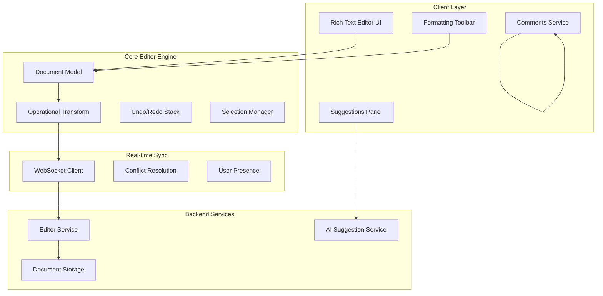

### Document Model Architecture

[⬆️ Back to Top](#-table-of-contents)

---


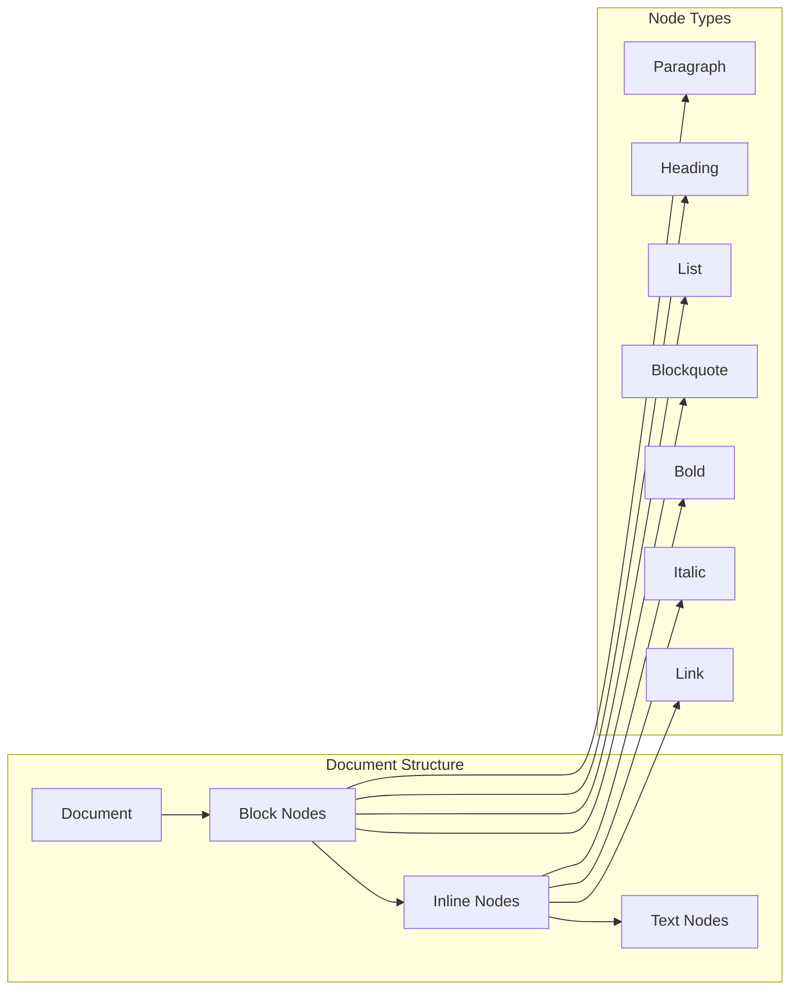

## Low-Level Design (LLD)

[⬆️ Back to Top](#-table-of-contents)

---


### Operational Transform Algorithm

[⬆️ Back to Top](#-table-of-contents)

---


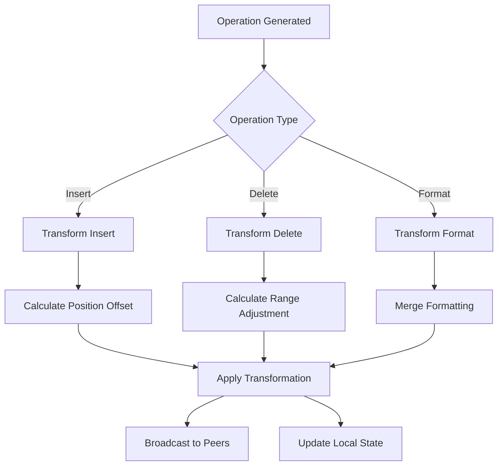

### Comments System Architecture

[⬆️ Back to Top](#-table-of-contents)

---


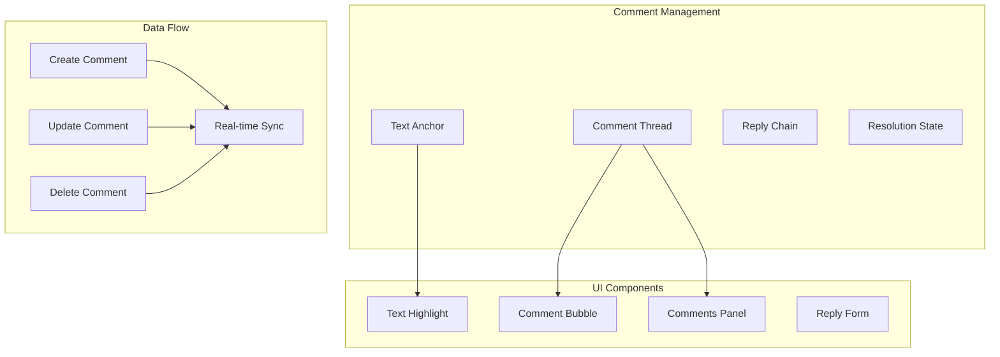

### AI Suggestions Engine

[⬆️ Back to Top](#-table-of-contents)

---


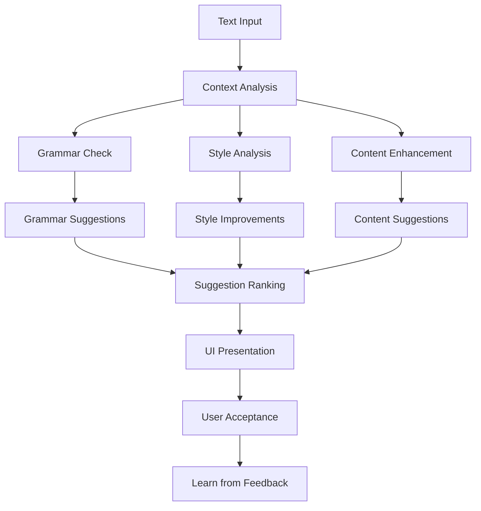

## Core Algorithms

[⬆️ Back to Top](#-table-of-contents)

---


### 1. Operational Transform (OT) for Text Editing

[⬆️ Back to Top](#-table-of-contents)

---


**Algorithm Purpose**: Ensures consistency when multiple users edit simultaneously.

**Key Components**:
- **Transform Function**: Adjusts operations based on concurrent changes
- **State Vector**: Tracks document version for each client
- **Operation Composition**: Combines multiple operations efficiently

**Transform Logic**:
```
For operations O1 and O2 occurring concurrently:
1. Calculate position offsets based on operation order
2. Adjust ranges for insertions/deletions
3. Merge formatting operations
4. Maintain intent preservation
```

**Conflict Resolution Strategy**:
- Insert operations: Bias towards earlier timestamp
- Delete operations: Check if range still exists
- Format operations: Last-writer-wins with merge

### 2. Selection Synchronization Algorithm

[⬆️ Back to Top](#-table-of-contents)

---


**Multi-user Selection Tracking**:
```
Selection State = {
  userId: string,
  ranges: [{ start: position, end: position }],
  timestamp: number,
  cursor: position
}
```

**Selection Transform Process**:
1. Convert DOM selection to document model position
2. Apply operational transforms to maintain accuracy
3. Broadcast selection changes to peers
4. Render peer selections with user colors

### 3. Undo/Redo Stack Management

[⬆️ Back to Top](#-table-of-contents)

---


**Command Pattern Implementation**:
```
Command = {
  execute(): void,
  undo(): void,
  redo(): void,
  merge(other: Command): boolean
}
```

**Stack Management Logic**:
- Group rapid operations (typing) into single commands
- Maintain separate stacks for each user in collaborative mode
- Implement command merging for efficiency
- Handle conflicts with peer operations

### 4. Comment Anchoring Algorithm

[⬆️ Back to Top](#-table-of-contents)

---


**Text Anchor Strategy**:
```
Anchor = {
  startOffset: number,
  endOffset: number,
  contextBefore: string,
  contextAfter: string,
  nodeId: string
}
```

**Anchor Maintenance Process**:
1. Store relative positions within text nodes
2. Maintain context strings for fuzzy matching
3. Update anchors when text operations occur
4. Handle orphaned comments gracefully

### 5. AI Suggestion Ranking Algorithm

[⬆️ Back to Top](#-table-of-contents)

---


**Ranking Factors**:
- Grammar importance score (0-1)
- Style consistency impact (0-1)
- User acceptance history (0-1)
- Context relevance (0-1)

**Ranking Formula**:
```
Score = (0.4 × Grammar) + (0.3 × Style) + (0.2 × History) + (0.1 × Context)
```

**Learning Component**:
- Track user acceptance/rejection patterns
- Adjust suggestion confidence scores
- Personalize suggestions based on writing style

## Component Architecture

[⬆️ Back to Top](#-table-of-contents)

---


### Editor Component Hierarchy

[⬆️ Back to Top](#-table-of-contents)

---


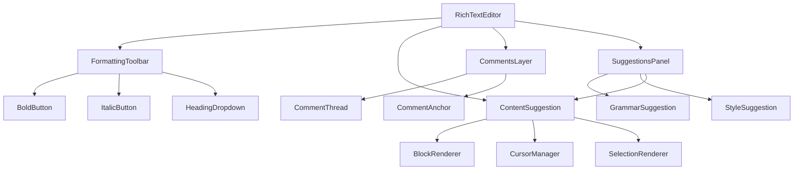

### State Management Architecture

[⬆️ Back to Top](#-table-of-contents)

---


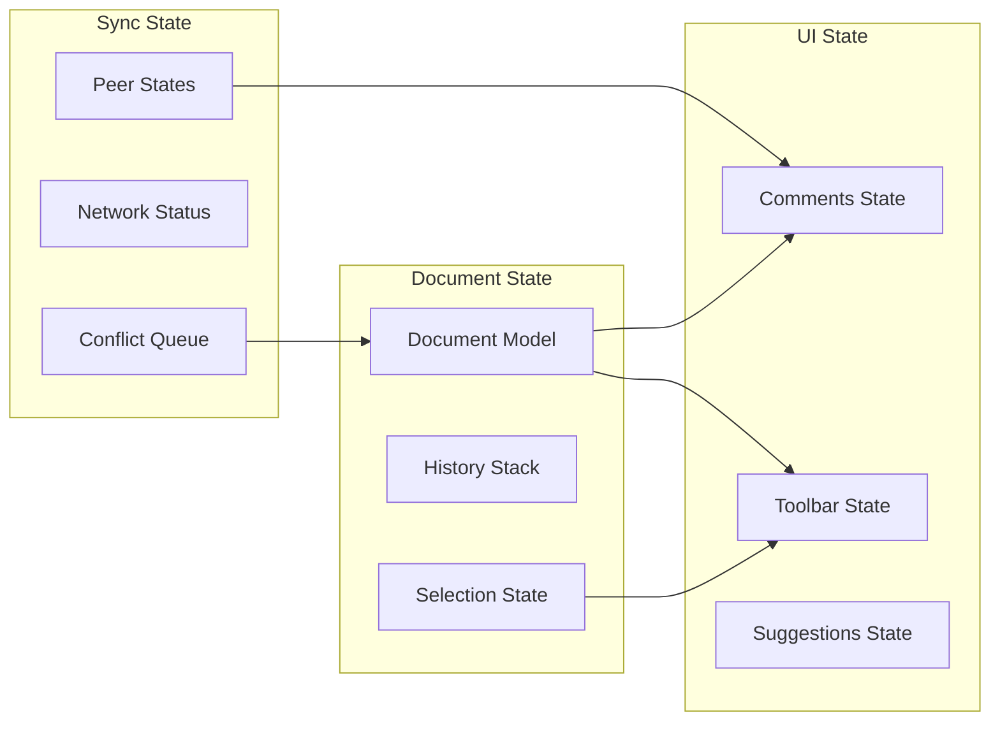

## Real-time Synchronization

[⬆️ Back to Top](#-table-of-contents)

---


### WebSocket Protocol Design

[⬆️ Back to Top](#-table-of-contents)

---


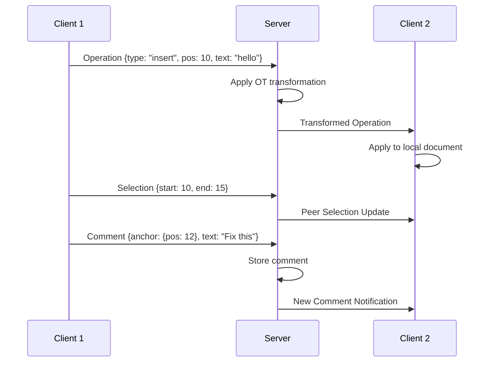

### Conflict Resolution State Machine

[⬆️ Back to Top](#-table-of-contents)

---


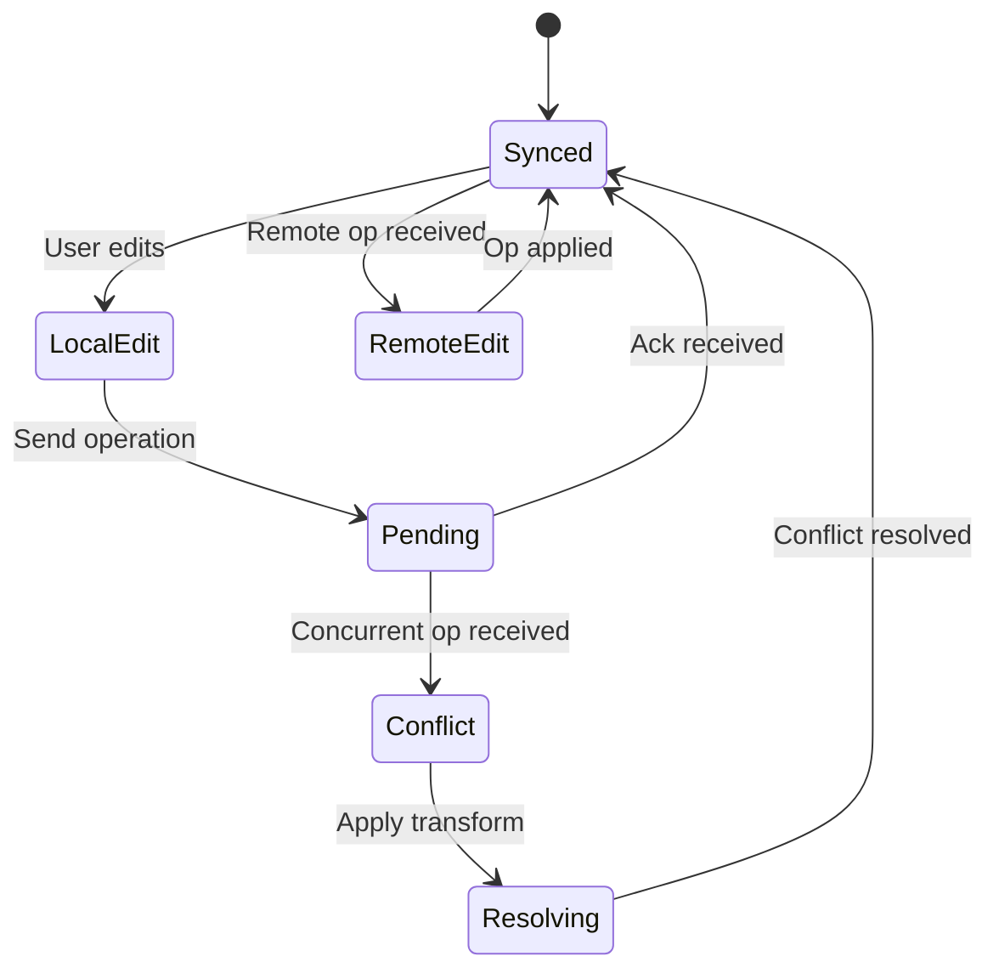

## Performance Optimizations

[⬆️ Back to Top](#-table-of-contents)

---


### Virtual Rendering for Large Documents

[⬆️ Back to Top](#-table-of-contents)

---


**Viewport-based Rendering**:
- Render only visible blocks plus buffer
- Implement incremental DOM updates
- Use document fragments for efficient insertion
- Maintain block-level virtualization

**Memory Management**:
- Lazy load historical operations
- Compress old document states
- Implement LRU cache for rendered blocks
- Garbage collect unused command objects

### Debouncing and Batching

[⬆️ Back to Top](#-table-of-contents)

---


**Operation Batching Strategy**:
```
Batch Window = 50ms
Max Batch Size = 10 operations
Batch Types: [typing, formatting, selection]
```

**Network Optimization**:
- Compress operations using binary encoding
- Implement delta compression for large changes
- Use connection pooling for multiple documents
- Implement smart reconnection with exponential backoff

## Security Considerations

[⬆️ Back to Top](#-table-of-contents)

---


### Content Security Framework

[⬆️ Back to Top](#-table-of-contents)

---


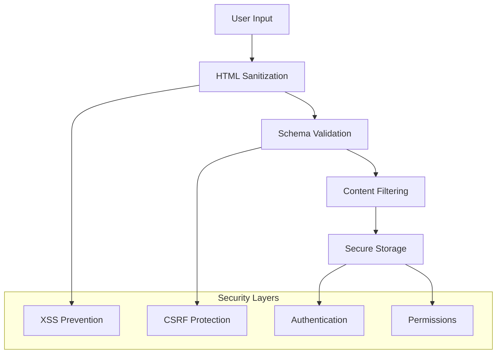

### Permission Model

[⬆️ Back to Top](#-table-of-contents)

---


**Document-level Permissions**:
- Owner: Full edit, share, delete rights
- Editor: Edit content, add comments
- Commenter: Read, add comments only
- Viewer: Read-only access

**Operation-level Security**:
- Validate user permissions before applying operations
- Encrypt sensitive document content
- Implement audit logging for all changes
- Rate limiting for API operations

## Testing Strategy

[⬆️ Back to Top](#-table-of-contents)

---


### Unit Testing Focus Areas

[⬆️ Back to Top](#-table-of-contents)

---


**Core Algorithm Testing**:
- Operational transform correctness
- Selection synchronization accuracy
- Comment anchoring stability
- Undo/redo stack integrity

**Component Testing**:
- Editor rendering performance
- Toolbar state synchronization
- Comments UI interactions
- Suggestions acceptance flow

### Integration Testing

[⬆️ Back to Top](#-table-of-contents)

---


**Real-time Collaboration**:
- Multi-user editing scenarios
- Network failure recovery
- Conflict resolution accuracy
- Performance under load

**End-to-End Testing**:
- Complete editing workflows
- Cross-browser compatibility
- Mobile responsiveness
- Accessibility compliance

## Accessibility Implementation

[⬆️ Back to Top](#-table-of-contents)

---


### Keyboard Navigation

[⬆️ Back to Top](#-table-of-contents)

---


**Navigation Patterns**:
- Arrow keys for cursor movement
- Tab for toolbar navigation
- Enter for line breaks
- Shift+Tab for reverse navigation

**Screen Reader Support**:
- ARIA labels for all interactive elements
- Live regions for dynamic content updates
- Proper heading structure
- Alt text for embedded media

### Focus Management

[⬆️ Back to Top](#-table-of-contents)

---


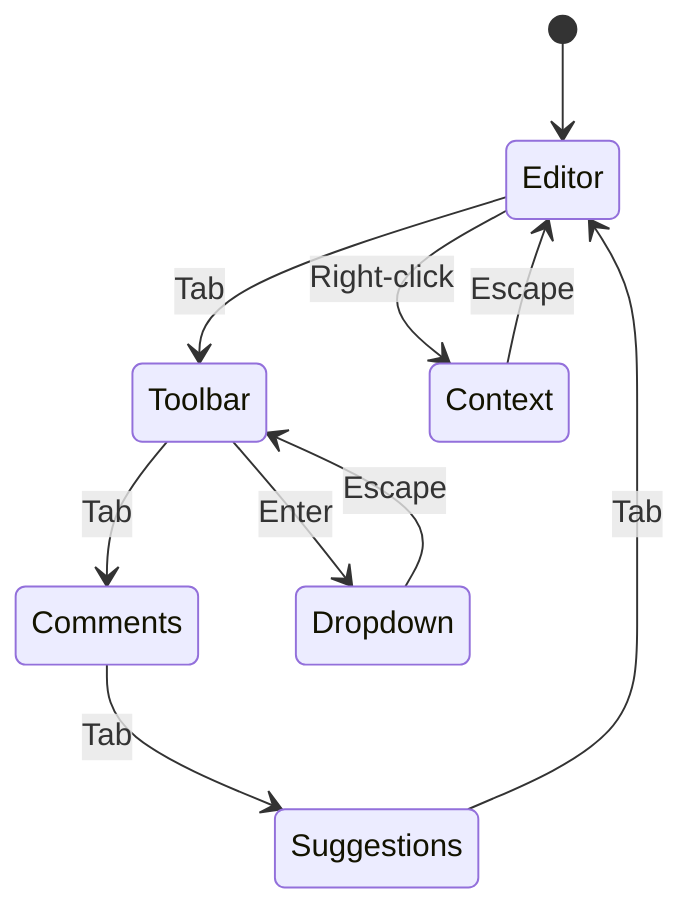

## Trade-offs and Considerations

[⬆️ Back to Top](#-table-of-contents)

---


### Performance vs Features

[⬆️ Back to Top](#-table-of-contents)

---

- **Rich formatting**: Complex DOM structure impacts performance
- **Real-time sync**: Network overhead vs user experience
- **AI suggestions**: Processing time vs suggestion quality
- **Large documents**: Memory usage vs responsiveness

### Consistency vs Availability

[⬆️ Back to Top](#-table-of-contents)

---

- **Strong consistency**: Ensures data integrity but may impact availability
- **Eventual consistency**: Better performance but potential conflicts
- **Hybrid approach**: Critical operations strongly consistent, others eventual

### Scalability Considerations

[⬆️ Back to Top](#-table-of-contents)

---

- **Document size limits**: Prevent memory exhaustion
- **Concurrent user limits**: Maintain performance standards
- **Operation rate limiting**: Prevent abuse and ensure stability
- **Storage optimization**: Balance between features and cost

This rich text editor system provides a comprehensive foundation for collaborative document editing with advanced features like real-time synchronization, AI-powered suggestions, and robust comment systems while maintaining performance and accessibility standards. 