# Collaborative Whiteboard/Drawing Tool


## 📋 Table of Contents

- [Collaborative Whiteboard/Drawing Tool](#collaborative-whiteboarddrawing-tool)
  - [High-Level Design (HLD)](#high-level-design-hld)
    - [System Architecture Overview](#system-architecture-overview)
    - [Drawing Object Model](#drawing-object-model)
  - [Low-Level Design (LLD)](#low-level-design-lld)
    - [Real-time Drawing Synchronization](#real-time-drawing-synchronization)
    - [Canvas Rendering Pipeline](#canvas-rendering-pipeline)
    - [Collaborative Drawing State Machine](#collaborative-drawing-state-machine)
  - [Core Algorithms](#core-algorithms)
    - [1. Operational Transform for Drawing Operations](#1-operational-transform-for-drawing-operations)
    - [2. Vector Path Smoothing Algorithm](#2-vector-path-smoothing-algorithm)
    - [3. Spatial Indexing for Hit Testing](#3-spatial-indexing-for-hit-testing)
    - [4. Multi-layer Rendering System](#4-multi-layer-rendering-system)
    - [5. Pressure-Sensitive Drawing Algorithm](#5-pressure-sensitive-drawing-algorithm)
  - [Component Architecture](#component-architecture)
    - [Drawing Tool Components](#drawing-tool-components)
    - [State Management Architecture](#state-management-architecture)
  - [Real-time Collaboration](#real-time-collaboration)
    - [WebSocket Protocol Design](#websocket-protocol-design)
    - [Presence System](#presence-system)
  - [Performance Optimizations](#performance-optimizations)
    - [Canvas Rendering Optimizations](#canvas-rendering-optimizations)
    - [Memory Management](#memory-management)
    - [Network Optimization](#network-optimization)
  - [Security Considerations](#security-considerations)
    - [Input Validation](#input-validation)
    - [Content Security](#content-security)
  - [Testing Strategy](#testing-strategy)
    - [Unit Testing Focus Areas](#unit-testing-focus-areas)
    - [Integration Testing](#integration-testing)
    - [End-to-End Testing](#end-to-end-testing)
  - [Accessibility Implementation](#accessibility-implementation)
    - [Keyboard Navigation](#keyboard-navigation)
    - [Screen Reader Support](#screen-reader-support)
  - [Trade-offs and Considerations](#trade-offs-and-considerations)
    - [Performance vs Quality](#performance-vs-quality)
    - [Collaboration vs Consistency](#collaboration-vs-consistency)
    - [Scalability Considerations](#scalability-considerations)

---

## High-Level Design (HLD)

[⬆️ Back to Top](#-table-of-contents)

---


### System Architecture Overview

[⬆️ Back to Top](#-table-of-contents)

---


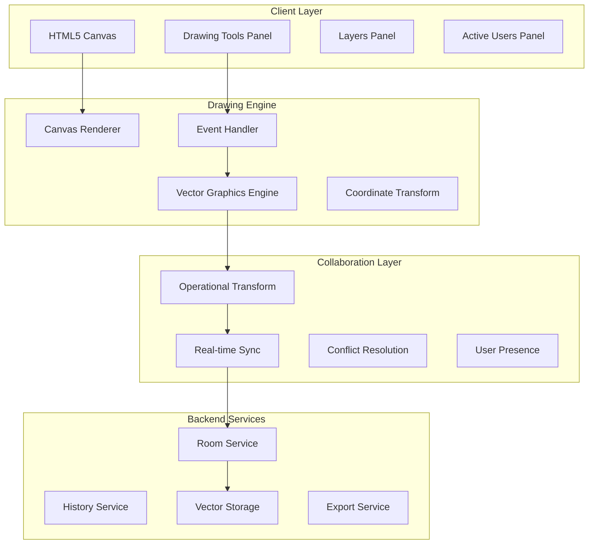

### Drawing Object Model

[⬆️ Back to Top](#-table-of-contents)

---


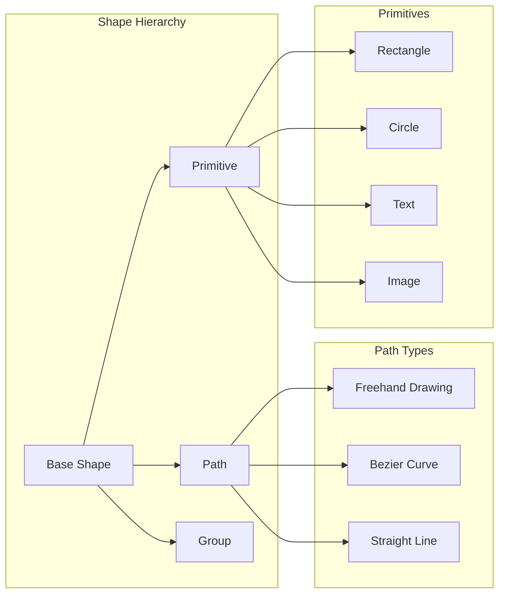

## Low-Level Design (LLD)

[⬆️ Back to Top](#-table-of-contents)

---


### Real-time Drawing Synchronization

[⬆️ Back to Top](#-table-of-contents)

---


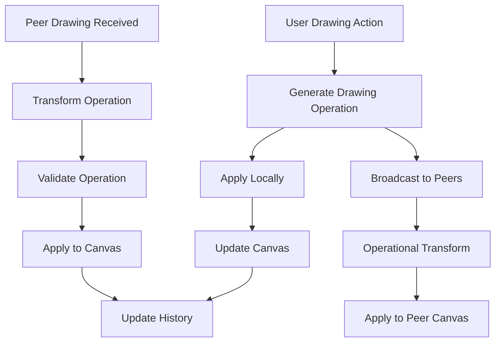

### Canvas Rendering Pipeline

[⬆️ Back to Top](#-table-of-contents)

---


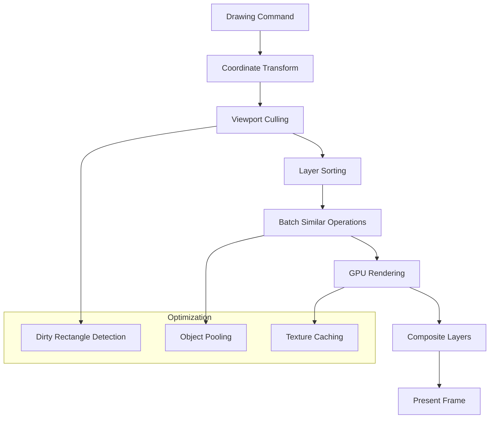

### Collaborative Drawing State Machine

[⬆️ Back to Top](#-table-of-contents)

---


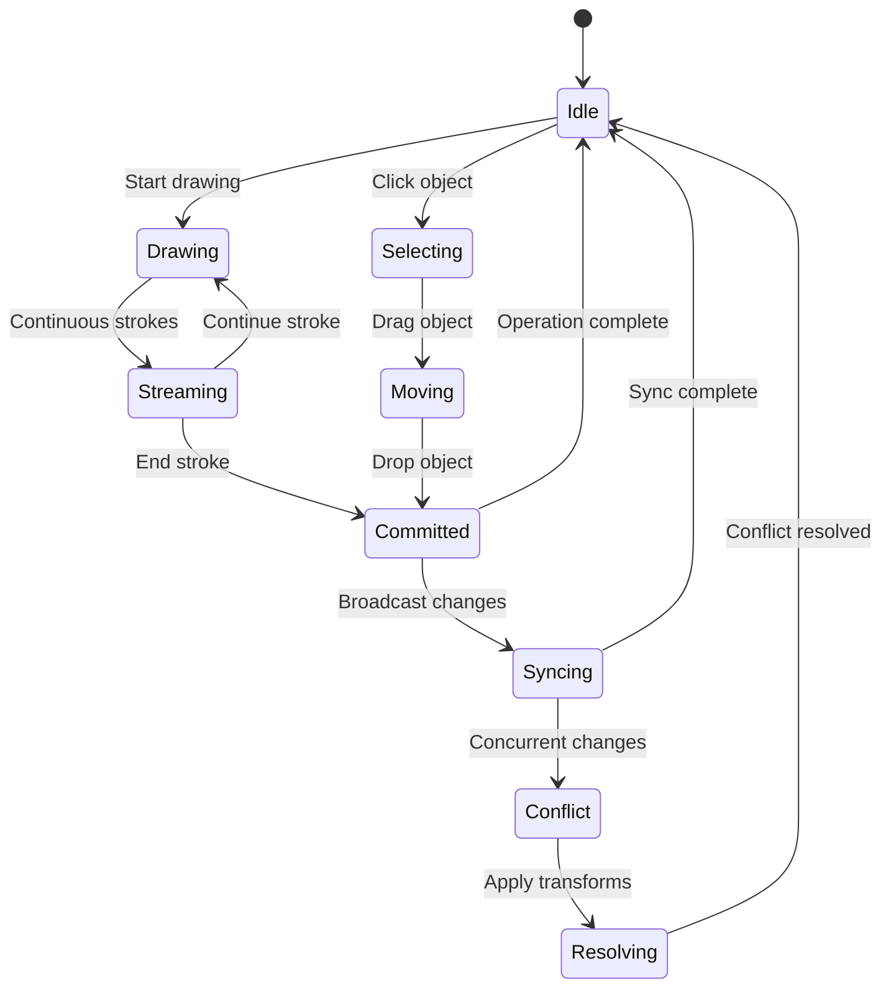

## Core Algorithms

[⬆️ Back to Top](#-table-of-contents)

---


### 1. Operational Transform for Drawing Operations

[⬆️ Back to Top](#-table-of-contents)

---


**Drawing Operation Types**:
```
DrawOperation = {
  type: 'create' | 'modify' | 'delete' | 'move',
  objectId: string,
  data: ShapeData,
  timestamp: number,
  userId: string
}
```

**Transform Algorithm**:
```
For concurrent operations A and B:
1. Check operation dependencies
2. Transform spatial coordinates
3. Handle object lifecycle conflicts
4. Preserve drawing intent
5. Maintain visual consistency
```

**Conflict Resolution Strategies**:
- **Create-Create**: Generate unique IDs, allow both
- **Modify-Modify**: Merge properties, last-writer-wins for conflicts
- **Delete-Modify**: Delete takes precedence
- **Move-Move**: Apply vector addition for position

### 2. Vector Path Smoothing Algorithm

[⬆️ Back to Top](#-table-of-contents)

---


**Ramer-Douglas-Peucker Simplification**:
```
function simplifyPath(points, tolerance):
  if points.length <= 2:
    return points
  
  maxDistance = 0
  maxIndex = 0
  
  for i in range(1, points.length - 1):
    distance = perpendicularDistance(points[i], line(points[0], points[-1]))
    if distance > maxDistance:
      maxDistance = distance
      maxIndex = i
  
  if maxDistance > tolerance:
    left = simplifyPath(points[0:maxIndex+1], tolerance)
    right = simplifyPath(points[maxIndex:], tolerance)
    return left[:-1] + right
  else:
    return [points[0], points[-1]]
```

**Bezier Curve Fitting**:
- Calculate control points using least squares
- Maintain C1 continuity between segments
- Optimize for minimal point count
- Preserve original drawing intention

### 3. Spatial Indexing for Hit Testing

[⬆️ Back to Top](#-table-of-contents)

---


**R-Tree Implementation**:
```
RTreeNode = {
  bounds: Rectangle,
  children: RTreeNode[] | Shape[],
  isLeaf: boolean
}
```

**Hit Testing Algorithm**:
1. Traverse R-tree from root
2. Check bounding box intersections
3. Perform precise hit testing on leaf shapes
4. Return shapes in depth order
5. Handle overlapping objects

**Insertion Strategy**:
- Choose leaf with minimal area enlargement
- Split nodes when capacity exceeded
- Rebalance tree periodically
- Update bounds propagation

### 4. Multi-layer Rendering System

[⬆️ Back to Top](#-table-of-contents)

---


**Layer Management**:
```
Layer = {
  id: string,
  zIndex: number,
  visible: boolean,
  locked: boolean,
  opacity: number,
  shapes: Shape[]
}
```

**Composite Rendering Process**:
1. Sort layers by z-index
2. Render each layer to separate canvas
3. Apply layer-specific effects (opacity, blend modes)
4. Composite layers using GPU acceleration
5. Handle layer visibility changes efficiently

### 5. Pressure-Sensitive Drawing Algorithm

[⬆️ Back to Top](#-table-of-contents)

---


**Pressure Interpolation**:
```
function interpolatePressure(points):
  for i in range(1, points.length):
    startPressure = points[i-1].pressure
    endPressure = points[i].pressure
    distance = calculateDistance(points[i-1], points[i])
    segments = Math.max(1, Math.floor(distance / 2))
    
    for j in range(segments):
      t = j / segments
      pressure = lerp(startPressure, endPressure, t)
      interpolatedPoints.push({
        x: lerp(points[i-1].x, points[i].x, t),
        y: lerp(points[i-1].y, points[i].y, t),
        pressure: pressure
      })
```

**Brush Dynamics**:
- Map pressure to stroke width
- Adjust opacity based on velocity
- Implement tilt sensitivity for stylus
- Apply texture mapping for natural brush effects

## Component Architecture

[⬆️ Back to Top](#-table-of-contents)

---


### Drawing Tool Components

[⬆️ Back to Top](#-table-of-contents)

---


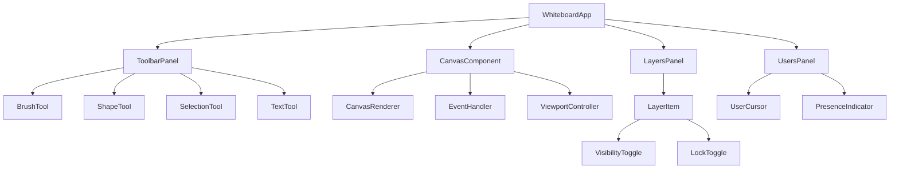

### State Management Architecture

[⬆️ Back to Top](#-table-of-contents)

---


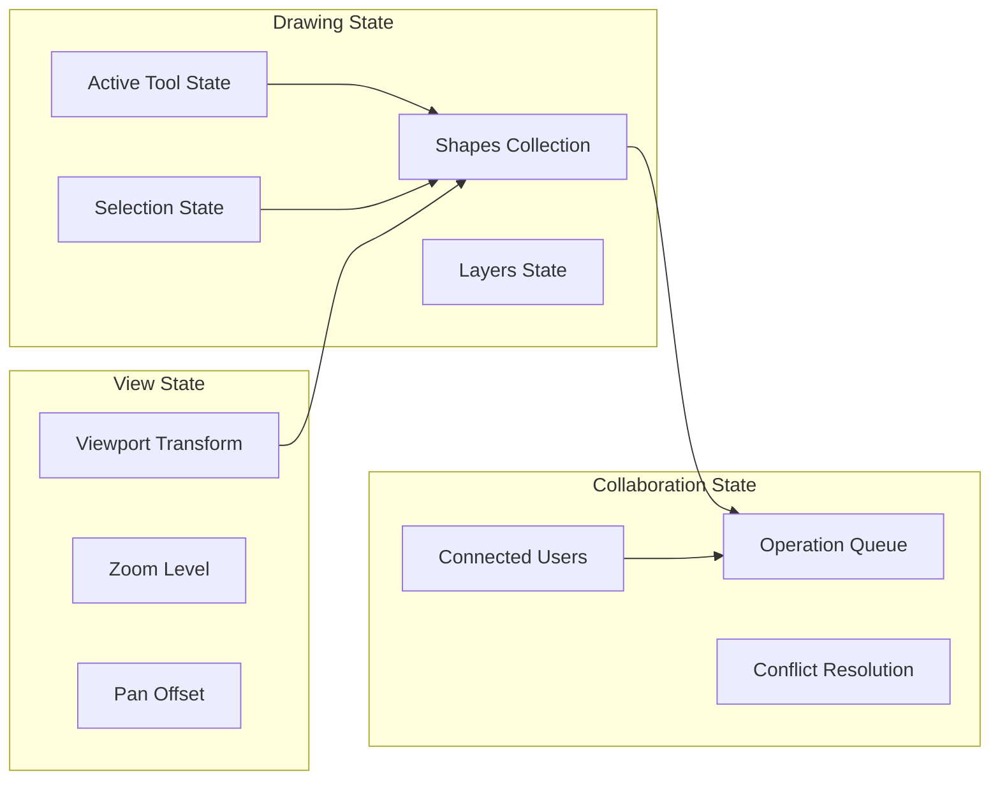

## Real-time Collaboration

[⬆️ Back to Top](#-table-of-contents)

---


### WebSocket Protocol Design

[⬆️ Back to Top](#-table-of-contents)

---


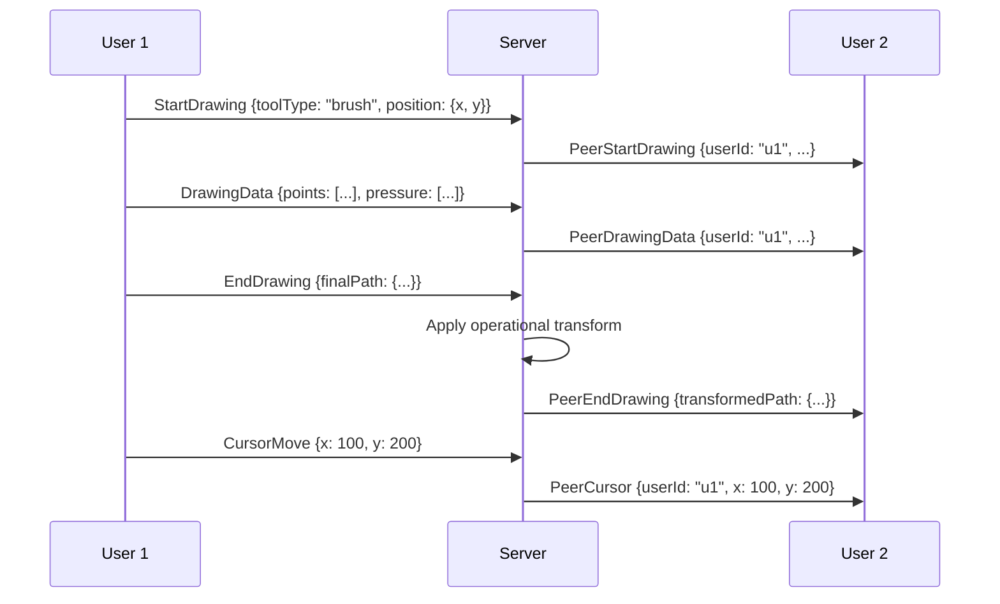

### Presence System

[⬆️ Back to Top](#-table-of-contents)

---


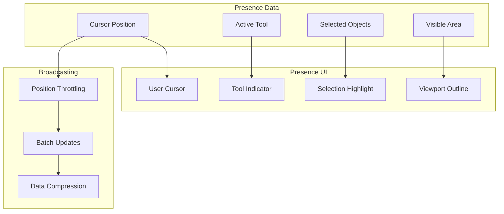

## Performance Optimizations

[⬆️ Back to Top](#-table-of-contents)

---


### Canvas Rendering Optimizations

[⬆️ Back to Top](#-table-of-contents)

---


**Dirty Rectangle Rendering**:
```
DirtyRegion = {
  x: number,
  y: number,
  width: number,
  height: number,
  shapes: Set<Shape>
}
```

**Optimization Strategies**:
- Track modified regions per frame
- Only redraw affected canvas areas
- Use multiple canvas layers for different update frequencies
- Implement object culling for off-screen shapes

**GPU Acceleration**:
- Utilize WebGL for complex operations
- Implement shader-based effects
- Use vertex buffers for path rendering
- Leverage hardware-accelerated compositing

### Memory Management

[⬆️ Back to Top](#-table-of-contents)

---


**Object Pooling Strategy**:
```
ObjectPool = {
  points: Point[],
  paths: Path[],
  shapes: Shape[],
  operations: DrawOperation[]
}
```

**Memory Optimization Techniques**:
- Reuse drawing operation objects
- Implement lazy loading for large drawings
- Compress historical data
- Garbage collect unused resources

### Network Optimization

[⬆️ Back to Top](#-table-of-contents)

---


**Data Compression**:
- Binary encoding for drawing operations
- Delta compression for path updates
- Geometric quantization for coordinates
- Huffman coding for repetitive data

**Bandwidth Management**:
- Adaptive quality based on network conditions
- Progressive shape loading
- Smart batching of operations
- Connection multiplexing

## Security Considerations

[⬆️ Back to Top](#-table-of-contents)

---


### Input Validation

[⬆️ Back to Top](#-table-of-contents)

---


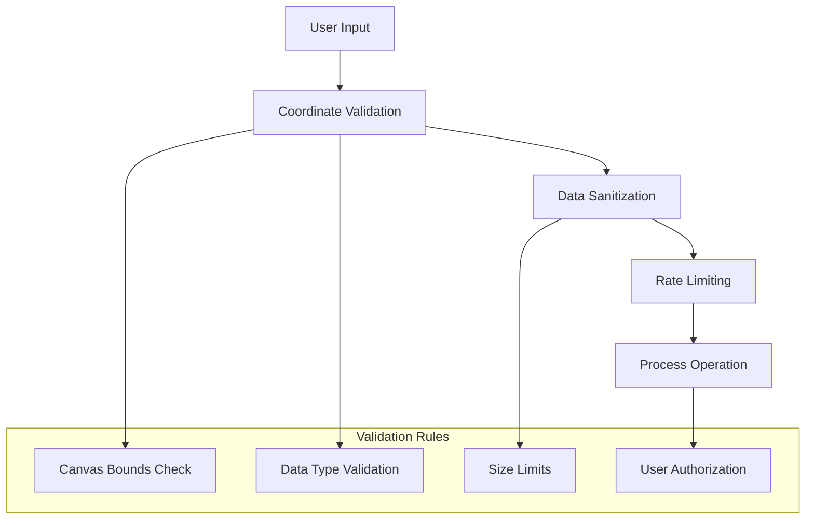

### Content Security

[⬆️ Back to Top](#-table-of-contents)

---


**Drawing Content Filtering**:
- Image upload restrictions
- Text content moderation
- Shape complexity limits
- File size constraints

**Permission Model**:
- Room-based access control
- Draw/view/admin permissions
- Shape ownership tracking
- Version control and rollback

## Testing Strategy

[⬆️ Back to Top](#-table-of-contents)

---


### Unit Testing Focus Areas

[⬆️ Back to Top](#-table-of-contents)

---


**Core Algorithm Testing**:
- Operational transform correctness
- Path simplification accuracy
- Hit testing precision
- Collision detection performance

**Component Testing**:
- Tool behavior consistency
- Canvas rendering output
- Layer management operations
- User interaction handling

### Integration Testing

[⬆️ Back to Top](#-table-of-contents)

---


**Collaboration Testing**:
- Multi-user drawing scenarios
- Conflict resolution accuracy
- Real-time synchronization
- Network failure recovery

**Performance Testing**:
- Large drawing handling
- High-frequency input processing
- Memory usage patterns
- Rendering frame rates

### End-to-End Testing

[⬆️ Back to Top](#-table-of-contents)

---


**User Workflow Testing**:
- Complete drawing sessions
- Cross-device compatibility
- Touch and stylus input
- Export functionality

## Accessibility Implementation

[⬆️ Back to Top](#-table-of-contents)

---


### Keyboard Navigation

[⬆️ Back to Top](#-table-of-contents)

---


**Navigation Patterns**:
- Tab through tool panels
- Arrow keys for shape manipulation
- Keyboard shortcuts for common tools
- Screen reader announcements

**Alternative Input Methods**:
- Voice commands for drawing actions
- Switch navigation support
- High contrast mode
- Magnification support

### Screen Reader Support

[⬆️ Back to Top](#-table-of-contents)

---


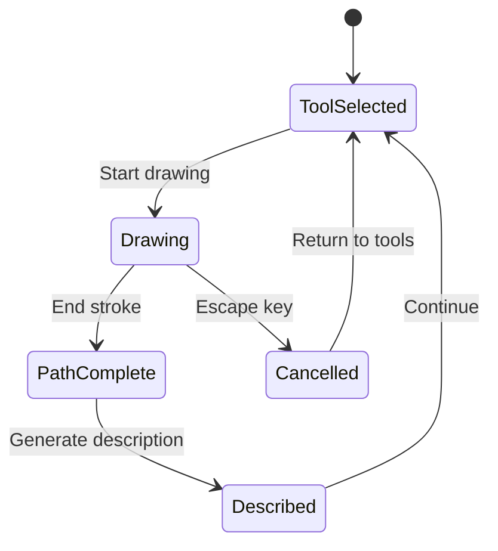

**Accessibility Features**:
- Spatial audio feedback for drawing
- Tactile feedback integration
- Descriptive text for visual elements
- Structured navigation landmarks

## Trade-offs and Considerations

[⬆️ Back to Top](#-table-of-contents)

---


### Performance vs Quality

[⬆️ Back to Top](#-table-of-contents)

---

- **Vector precision**: Higher precision vs memory usage
- **Real-time sync**: Immediate updates vs bandwidth consumption
- **Visual effects**: Rich rendering vs performance impact
- **History depth**: Undo capability vs storage requirements

### Collaboration vs Consistency

[⬆️ Back to Top](#-table-of-contents)

---

- **Immediate feedback**: Local updates vs global consistency
- **Conflict resolution**: Automatic merge vs user intervention
- **Presence updates**: Real-time awareness vs network overhead
- **Offline support**: Local editing vs synchronization complexity

### Scalability Considerations

[⬆️ Back to Top](#-table-of-contents)

---

- **Room size limits**: Concurrent users vs performance
- **Drawing complexity**: Shape count vs rendering speed
- **Storage optimization**: Version history vs cost
- **Network topology**: Peer-to-peer vs server-mediated

This collaborative whiteboard system provides a robust foundation for real-time drawing collaboration with advanced features like operational transforms, pressure-sensitive input, and multi-layer rendering while maintaining high performance and accessibility standards. 