# Collaborative Whiteboard/Drawing Tool


## 📋 Table of Contents

- [Collaborative Whiteboard/Drawing Tool](#collaborative-whiteboarddrawing-tool)
  - [Table of Contents](#table-of-contents)
  - [Clarify the Problem and Requirements](#clarify-the-problem-and-requirements)
    - [Problem Understanding](#problem-understanding)
    - [Functional Requirements](#functional-requirements)
    - [Non-Functional Requirements](#non-functional-requirements)
    - [Key Assumptions](#key-assumptions)
  - [High-Level Design (HLD)](#high-level-design-hld)
    - [System Architecture Overview](#system-architecture-overview)
    - [Drawing Object Model](#drawing-object-model)
  - [Low-Level Design (LLD)](#low-level-design-lld)
    - [Real-time Drawing Synchronization](#real-time-drawing-synchronization)
    - [Canvas Rendering Pipeline](#canvas-rendering-pipeline)
    - [Collaborative Drawing State Machine](#collaborative-drawing-state-machine)
  - [Core Algorithms](#core-algorithms)
    - [1. Operational Transform for Drawing Operations](#1-operational-transform-for-drawing-operations)
    - [2. Vector Path Smoothing Algorithm](#2-vector-path-smoothing-algorithm)
    - [3. Spatial Indexing for Hit Testing](#3-spatial-indexing-for-hit-testing)
    - [4. Multi-layer Rendering System](#4-multi-layer-rendering-system)
    - [5. Pressure-Sensitive Drawing Algorithm](#5-pressure-sensitive-drawing-algorithm)
  - [Component Architecture](#component-architecture)
    - [Drawing Tool Components](#drawing-tool-components)
    - [State Management Architecture](#state-management-architecture)
  - [Real-time Collaboration](#real-time-collaboration)
    - [WebSocket Protocol Design](#websocket-protocol-design)
    - [Presence System](#presence-system)
  - [Performance Optimizations](#performance-optimizations)
    - [Canvas Rendering Optimizations](#canvas-rendering-optimizations)
    - [Memory Management](#memory-management)
    - [Network Optimization](#network-optimization)
  - [Security Considerations](#security-considerations)
    - [Input Validation](#input-validation)
    - [Content Security](#content-security)
  - [Testing Strategy](#testing-strategy)
    - [Unit Testing Focus Areas](#unit-testing-focus-areas)
    - [Integration Testing](#integration-testing)
    - [End-to-End Testing](#end-to-end-testing)
  - [Accessibility Implementation](#accessibility-implementation)
    - [Keyboard Navigation](#keyboard-navigation)
    - [Screen Reader Support](#screen-reader-support)
  - [Trade-offs and Considerations](#trade-offs-and-considerations)
    - [Performance vs Quality](#performance-vs-quality)
    - [Collaboration vs Consistency](#collaboration-vs-consistency)
    - [Scalability Considerations](#scalability-considerations)

---

## Table of Contents
1. [Clarify the Problem and Requirements](#clarify-the-problem-and-requirements)
2. [High-Level Design (HLD)](#high-level-design-hld)
3. [Low-Level Design (LLD)](#low-level-design-lld)
4. [Core Algorithms](#core-algorithms)
5. [Component Architecture](#component-architecture)
6. [Real-time Collaboration](#real-time-collaboration)
7. [Performance Optimizations](#performance-optimizations)
8. [Security Considerations](#security-considerations)
9. [Testing Strategy](#testing-strategy)
10. [Accessibility Implementation](#accessibility-implementation)
11. [Trade-offs and Considerations](#trade-offs-and-considerations)

---

## Clarify the Problem and Requirements

[⬆️ Back to Top](#--table-of-contents)

---

### Problem Understanding

[⬆️ Back to Top](#--table-of-contents)

---

Design a collaborative whiteboard/drawing application that enables multiple users to create, edit, and share visual content in real-time, similar to Miro, Figma, or Microsoft Whiteboard. The system must support various drawing tools, shapes, text annotations, and multimedia content while maintaining smooth real-time synchronization across all participants.

### Functional Requirements

[⬆️ Back to Top](#--table-of-contents)

---

- **Drawing Tools**: Pen, pencil, brush, eraser with pressure sensitivity and customizable properties
- **Shape Tools**: Rectangle, circle, line, arrow, polygon, bezier curves
- **Text & Annotations**: Text boxes, sticky notes, callouts, comments with formatting
- **Media Support**: Image import, video embedding, audio notes, file attachments
- **Real-time Collaboration**: Multi-user editing with live cursors and presence indicators
- **Layer Management**: Multiple layers, layer ordering, visibility controls
- **Selection & Transformation**: Multi-select, move, rotate, scale, group/ungroup objects
- **Templates & Frameworks**: Pre-built templates, wireframe kits, diagramming tools

### Non-Functional Requirements

[⬆️ Back to Top](#--table-of-contents)

---

- **Performance**: <16ms drawing latency, 60fps smooth animations, <100ms collaboration sync
- **Scalability**: Support 100+ concurrent users per board, unlimited canvas size
- **Availability**: 99.9% uptime with offline drawing capabilities
- **Cross-platform**: Web browsers, tablet apps with touch/stylus support
- **Responsiveness**: Adaptive UI for different screen sizes and input methods
- **Data Persistence**: Auto-save, version history, real-time backup
- **Memory Efficiency**: Handle large canvases without performance degradation

### Key Assumptions

[⬆️ Back to Top](#--table-of-contents)

---

- Typical board complexity: 1000-10000 objects per canvas
- Peak concurrent users per board: 20-100 participants
- Average session duration: 30-180 minutes
- Drawing operation frequency: 10-100 operations per second during active use
- Canvas size: Support for infinite canvas with viewport-based rendering
- Device types: Desktop browsers, tablets, smartphones with varying input capabilities
- Network conditions: Support for mobile networks to high-speed connections

---

## High-Level Design (HLD)

[⬆️ Back to Top](#--table-of-contents)

---


### System Architecture Overview

[⬆️ Back to Top](#--table-of-contents)

---


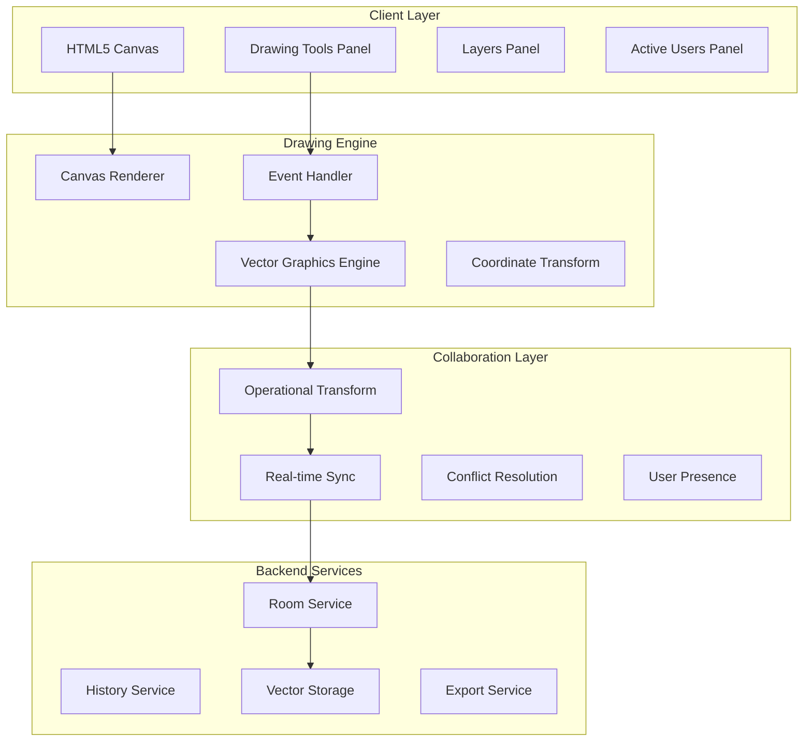

### Drawing Object Model

[⬆️ Back to Top](#--table-of-contents)

---


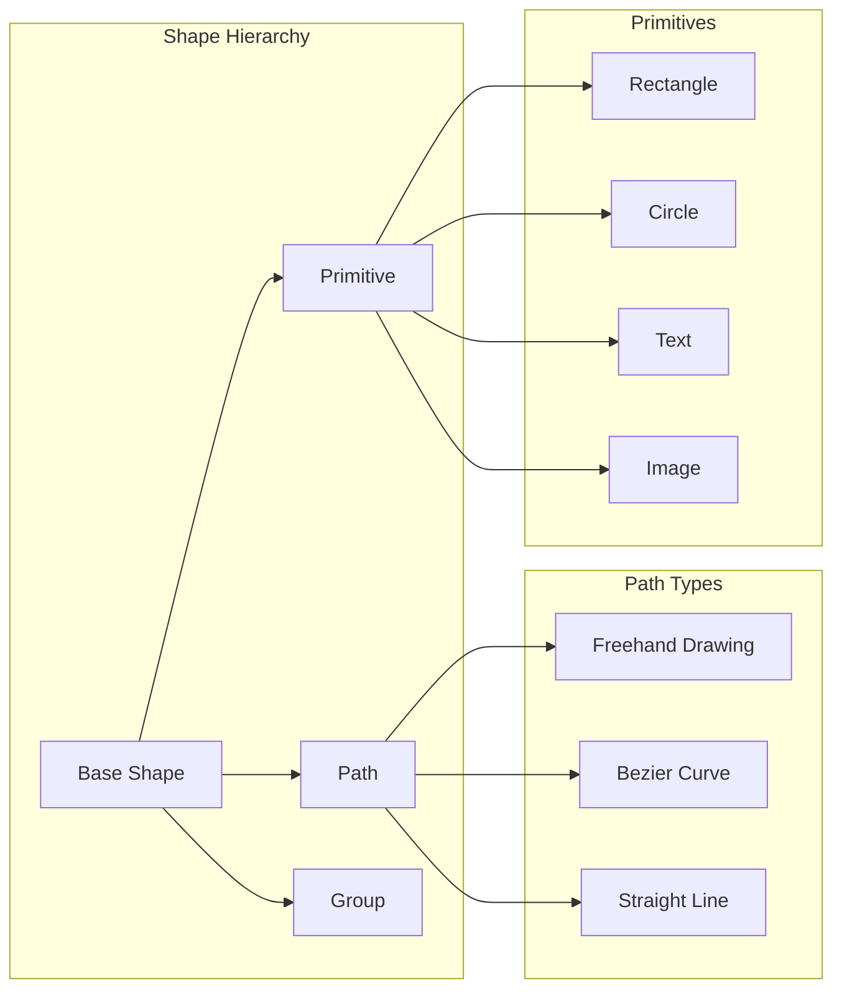

## Low-Level Design (LLD)

[⬆️ Back to Top](#--table-of-contents)

---


### Real-time Drawing Synchronization

[⬆️ Back to Top](#--table-of-contents)

---


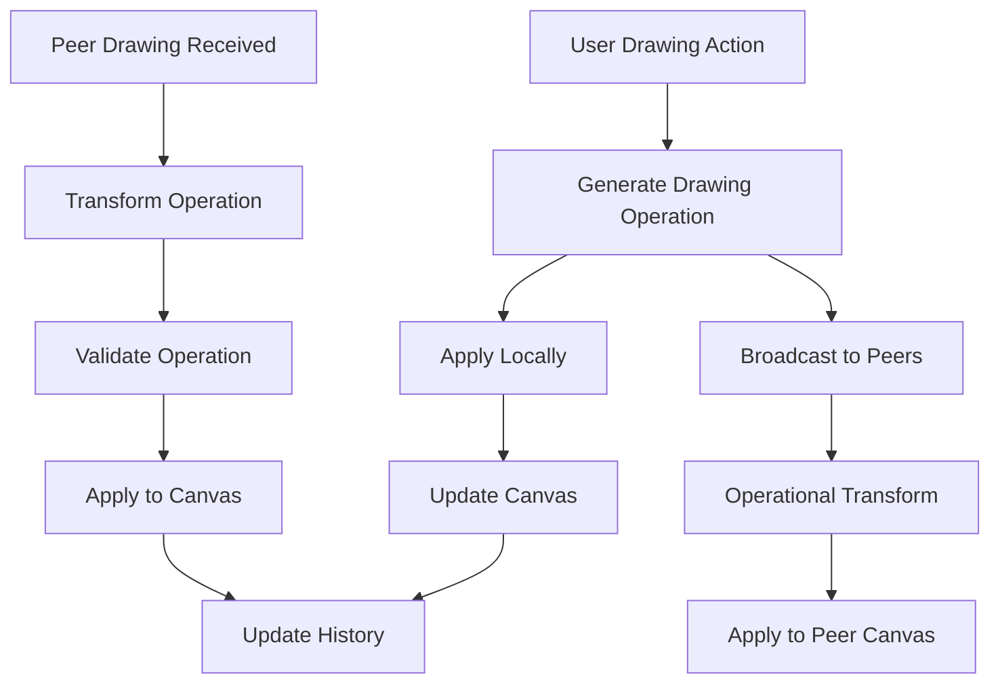

### Canvas Rendering Pipeline

[⬆️ Back to Top](#--table-of-contents)

---


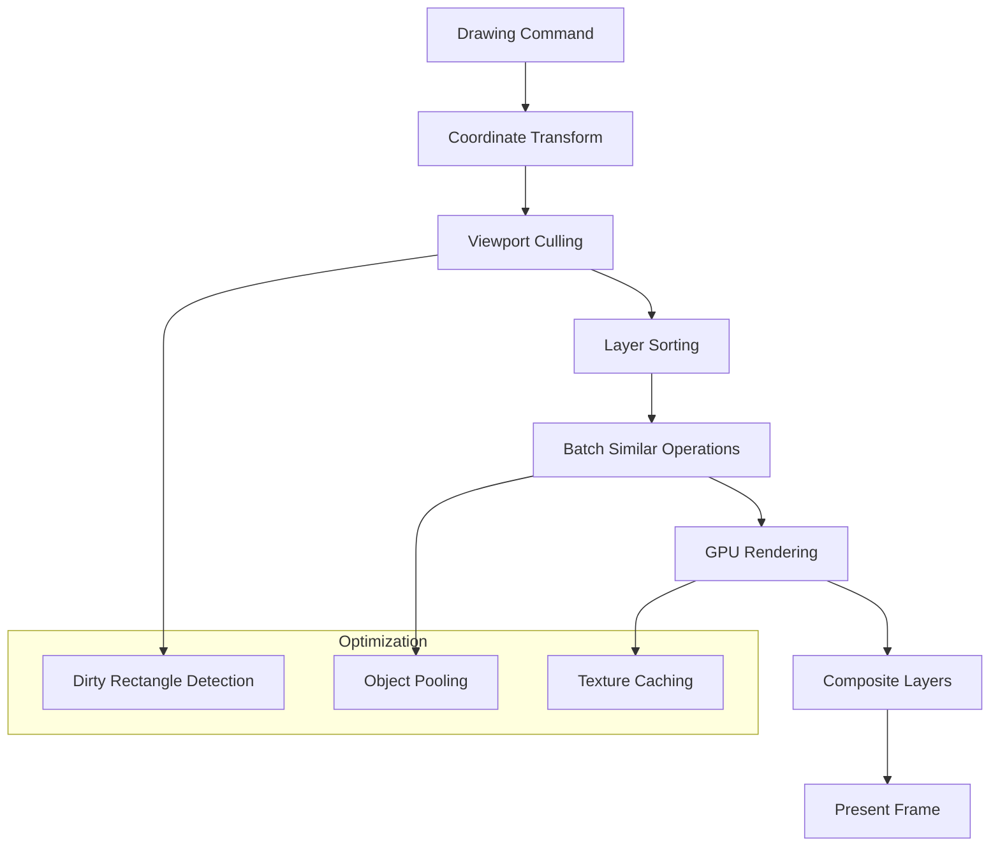

### Collaborative Drawing State Machine

[⬆️ Back to Top](#--table-of-contents)

---


```mermaid
stateDiagram-v2
    [*] --> Idle
    Idle --> Drawing : Start drawing
    Drawing --> Streaming : Continuous strokes
    Streaming --> Drawing : Continue stroke
    Streaming --> Committed : End stroke
    Committed --> Idle : Operation complete
    
    Idle --> Selecting : Click object
    Selecting --> Moving : Drag object
    Moving --> Committed : Drop object
    
    Committed --> Syncing : Broadcast changes
    Syncing --> Idle : Sync complete
    Syncing --> Conflict : Concurrent changes
    Conflict --> Resolving : Apply transforms
    Resolving --> Idle : Conflict resolved
```

## Core Algorithms

[⬆️ Back to Top](#--table-of-contents)

---


### 1. Operational Transform for Drawing Operations

[⬆️ Back to Top](#--table-of-contents)

---


**Drawing Operation Types**:
```
DrawOperation = {
  type: 'create' | 'modify' | 'delete' | 'move',
  objectId: string,
  data: ShapeData,
  timestamp: number,
  userId: string
}
```

**Transform Algorithm**:
```
For concurrent operations A and B:
1. Check operation dependencies
2. Transform spatial coordinates
3. Handle object lifecycle conflicts
4. Preserve drawing intent
5. Maintain visual consistency
```

**Conflict Resolution Strategies**:
- **Create-Create**: Generate unique IDs, allow both
- **Modify-Modify**: Merge properties, last-writer-wins for conflicts
- **Delete-Modify**: Delete takes precedence
- **Move-Move**: Apply vector addition for position

### 2. Vector Path Smoothing Algorithm

[⬆️ Back to Top](#--table-of-contents)

---


**Ramer-Douglas-Peucker Simplification**:
```
function simplifyPath(points, tolerance):
  if points.length <= 2:
    return points
  
  maxDistance = 0
  maxIndex = 0
  
  for i in range(1, points.length - 1):
    distance = perpendicularDistance(points[i], line(points[0], points[-1]))
    if distance > maxDistance:
      maxDistance = distance
      maxIndex = i
  
  if maxDistance > tolerance:
    left = simplifyPath(points[0:maxIndex+1], tolerance)
    right = simplifyPath(points[maxIndex:], tolerance)
    return left[:-1] + right
  else:
    return [points[0], points[-1]]
```

**Bezier Curve Fitting**:
- Calculate control points using least squares
- Maintain C1 continuity between segments
- Optimize for minimal point count
- Preserve original drawing intention

### 3. Spatial Indexing for Hit Testing

[⬆️ Back to Top](#--table-of-contents)

---


**R-Tree Implementation**:
```
RTreeNode = {
  bounds: Rectangle,
  children: RTreeNode[] | Shape[],
  isLeaf: boolean
}
```

**Hit Testing Algorithm**:
1. Traverse R-tree from root
2. Check bounding box intersections
3. Perform precise hit testing on leaf shapes
4. Return shapes in depth order
5. Handle overlapping objects

**Insertion Strategy**:
- Choose leaf with minimal area enlargement
- Split nodes when capacity exceeded
- Rebalance tree periodically
- Update bounds propagation

### 4. Multi-layer Rendering System

[⬆️ Back to Top](#--table-of-contents)

---


**Layer Management**:
```
Layer = {
  id: string,
  zIndex: number,
  visible: boolean,
  locked: boolean,
  opacity: number,
  shapes: Shape[]
}
```

**Composite Rendering Process**:
1. Sort layers by z-index
2. Render each layer to separate canvas
3. Apply layer-specific effects (opacity, blend modes)
4. Composite layers using GPU acceleration
5. Handle layer visibility changes efficiently

### 5. Pressure-Sensitive Drawing Algorithm

[⬆️ Back to Top](#--table-of-contents)

---


**Pressure Interpolation**:
```
function interpolatePressure(points):
  for i in range(1, points.length):
    startPressure = points[i-1].pressure
    endPressure = points[i].pressure
    distance = calculateDistance(points[i-1], points[i])
    segments = Math.max(1, Math.floor(distance / 2))
    
    for j in range(segments):
      t = j / segments
      pressure = lerp(startPressure, endPressure, t)
      interpolatedPoints.push({
        x: lerp(points[i-1].x, points[i].x, t),
        y: lerp(points[i-1].y, points[i].y, t),
        pressure: pressure
      })
```

**Brush Dynamics**:
- Map pressure to stroke width
- Adjust opacity based on velocity
- Implement tilt sensitivity for stylus
- Apply texture mapping for natural brush effects

## Component Architecture

[⬆️ Back to Top](#--table-of-contents)

---


### Drawing Tool Components

[⬆️ Back to Top](#--table-of-contents)

---


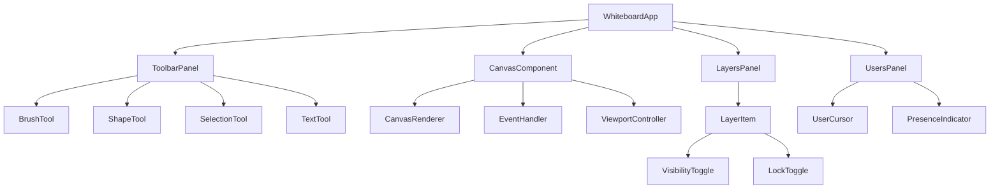

### State Management Architecture

[⬆️ Back to Top](#--table-of-contents)

---


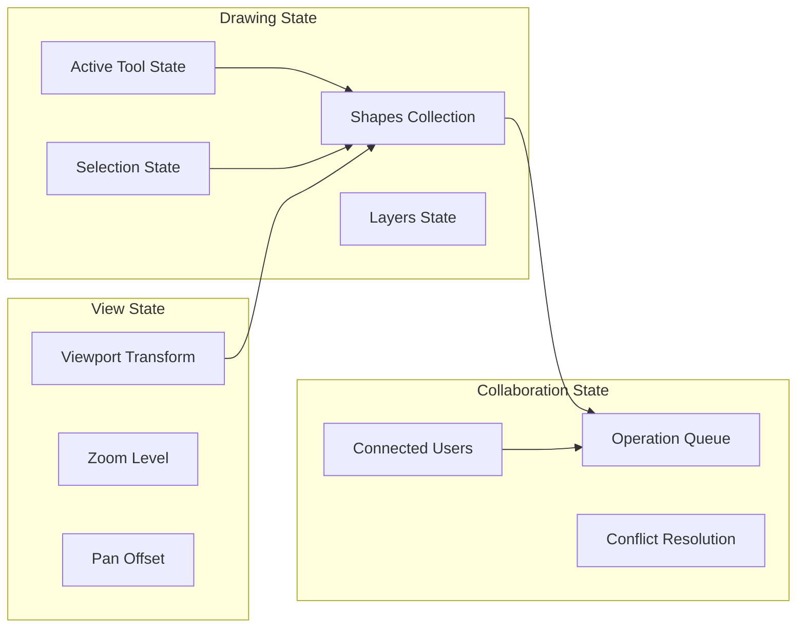

#### React Component Implementation

[⬆️ Back to Top](#--table-of-contents)

---

**WhiteboardApp.jsx**
```jsx
import React, { useState, useCallback, useRef, useEffect } from 'react';
import { WhiteboardProvider } from './WhiteboardContext';
import ToolbarPanel from './ToolbarPanel';
import CanvasComponent from './CanvasComponent';
import LayersPanel from './LayersPanel';
import UsersPanel from './UsersPanel';
import { useWebSocket } from './hooks/useWebSocket';

**WhiteboardApp.jsx**

**What this code does:**
• **Main Purpose**: Real-time collaborative whiteboard with multi-user drawing capabilities
• **Shape Management**: Handles creation, updates, and synchronization of drawing shapes
• **Key Functions**:
  - `addShape()` - Creates new shapes and broadcasts to other users
  - `updateShape()` - Modifies existing shapes with real-time sync
  - `deleteShape()` - Removes shapes from canvas and notifies collaborators
  - WebSocket event handlers for remote shape operations
  - Layer management and drawing tool selection

const WhiteboardApp = ({ roomId, userId }) => {
  const [shapes, setShapes] = useState([]);
  const [layers, setLayers] = useState([{ id: 'layer1', name: 'Layer 1', visible: true, locked: false }]);
  const [activeTool, setActiveTool] = useState('brush');
  const [selectedShapes, setSelectedShapes] = useState([]);
  const [viewport, setViewport] = useState({ x: 0, y: 0, zoom: 1 });
  const [users, setUsers] = useState([]);
  const [isDrawing, setIsDrawing] = useState(false);
  
  const canvasRef = useRef(null);
  const { socket, isConnected } = useWebSocket(`/whiteboard/${roomId}`);

  useEffect(() => {
    if (socket) {
      socket.on('shape:added', handleRemoteShapeAdded);
      socket.on('shape:updated', handleRemoteShapeUpdated);
      socket.on('shape:deleted', handleRemoteShapeDeleted);
      socket.on('user:joined', handleUserJoined);
      socket.on('user:left', handleUserLeft);
      socket.on('cursor:moved', handleCursorMoved);
      
      return () => {
        socket.off('shape:added');
        socket.off('shape:updated');
        socket.off('shape:deleted');
        socket.off('user:joined');
        socket.off('user:left');
        socket.off('cursor:moved');
      };
    }
  }, [socket]);

  const addShape = useCallback((shapeData) => {
    const newShape = {
      id: generateId(),
      ...shapeData,
      userId,
      timestamp: Date.now()
    };
    
    setShapes(prev => [...prev, newShape]);
    socket?.emit('shape:add', newShape);
  }, [userId, socket]);

  const updateShape = useCallback((shapeId, updates) => {
    setShapes(prev => prev.map(shape => 
      shape.id === shapeId ? { ...shape, ...updates } : shape
    ));
    
    socket?.emit('shape:update', { shapeId, updates });
  }, [socket]);

  const deleteShape = useCallback((shapeId) => {
    setShapes(prev => prev.filter(shape => shape.id !== shapeId));
    socket?.emit('shape:delete', { shapeId });
  }, [socket]);

  const handleCanvasMouseDown = useCallback((e) => {
    if (activeTool === 'select') {
      handleSelectionStart(e);
    } else {
      handleDrawingStart(e);
    }
  }, [activeTool]);

  const handleDrawingStart = useCallback((e) => {
    setIsDrawing(true);
    const point = getCanvasPoint(e);
    
    const shapeData = {
      type: activeTool,
      points: [point],
      style: getCurrentStyle(),
      layerId: getCurrentLayerId()
    };
    
    addShape(shapeData);
  }, [activeTool, addShape]);

  const handleCanvasMouseMove = useCallback((e) => {
    const point = getCanvasPoint(e);
    
    // Broadcast cursor position
    socket?.emit('cursor:move', { userId, position: point });
    
    if (isDrawing && shapes.length > 0) {
      const lastShape = shapes[shapes.length - 1];
      if (lastShape.userId === userId) {
        updateShape(lastShape.id, {
          points: [...lastShape.points, point]
        });
      }
    }
  }, [isDrawing, shapes, userId, socket, updateShape]);

  const handleCanvasMouseUp = useCallback(() => {
    setIsDrawing(false);
  }, []);

  const getCanvasPoint = (e) => {
    const rect = canvasRef.current.getBoundingClientRect();
    return {
      x: (e.clientX - rect.left - viewport.x) / viewport.zoom,
      y: (e.clientY - rect.top - viewport.y) / viewport.zoom
    };
  };

  const getCurrentStyle = () => ({
    strokeColor: '#000000',
    strokeWidth: 2,
    fillColor: 'transparent'
  });

  const getCurrentLayerId = () => layers.find(l => l.visible && !l.locked)?.id || layers[0]?.id;

  const handleRemoteShapeAdded = useCallback((shape) => {
    if (shape.userId !== userId) {
      setShapes(prev => [...prev, shape]);
    }
  }, [userId]);

  const handleRemoteShapeUpdated = useCallback((data) => {
    setShapes(prev => prev.map(shape => 
      shape.id === data.shapeId ? { ...shape, ...data.updates } : shape
    ));
  }, []);

  const handleRemoteShapeDeleted = useCallback((data) => {
    setShapes(prev => prev.filter(shape => shape.id !== data.shapeId));
  }, []);

  const handleUserJoined = useCallback((user) => {
    setUsers(prev => [...prev, user]);
  }, []);

  const handleUserLeft = useCallback((data) => {
    setUsers(prev => prev.filter(user => user.id !== data.userId));
  }, []);

  const handleCursorMoved = useCallback((data) => {
    setUsers(prev => prev.map(user => 
      user.id === data.userId 
        ? { ...user, cursor: data.position }
        : user
    ));
  }, []);

  const generateId = () => Date.now().toString(36) + Math.random().toString(36).substr(2);

  return (
    <WhiteboardProvider value={{
      shapes,
      layers,
      activeTool,
      selectedShapes,
      viewport,
      users,
      isConnected,
      setActiveTool,
      setSelectedShapes,
      setViewport,
      addShape,
      updateShape,
      deleteShape
    }}>
      <div className="whiteboard-app">
        <ToolbarPanel />
        
        <div className="whiteboard-main">
          <CanvasComponent
            ref={canvasRef}
            onMouseDown={handleCanvasMouseDown}
            onMouseMove={handleCanvasMouseMove}
            onMouseUp={handleCanvasMouseUp}
          />
          
          <div className="side-panels">
            <LayersPanel />
            <UsersPanel />
          </div>
        </div>
      </div>
    </WhiteboardProvider>
  );
};

export default WhiteboardApp;
```

**CanvasComponent.jsx**
```jsx
import React, { useContext, useRef, useEffect, forwardRef } from 'react';
import { WhiteboardContext } from './WhiteboardContext';
import ShapeRenderer from './ShapeRenderer';
import UserCursors from './UserCursors';

const CanvasComponent = forwardRef(({ onMouseDown, onMouseMove, onMouseUp }, ref) => {
  const { shapes, layers, viewport, selectedShapes, users } = useContext(WhiteboardContext);
  const canvasRef = useRef(null);
  const overlayRef = useRef(null);

  useEffect(() => {
    if (ref) {
      ref.current = canvasRef.current;
    }
  }, [ref]);

  useEffect(() => {
    drawCanvas();
  }, [shapes, layers, viewport]);

  const drawCanvas = () => {
    const canvas = canvasRef.current;
    const ctx = canvas.getContext('2d');
    
    // Clear canvas
    ctx.clearRect(0, 0, canvas.width, canvas.height);
    
    // Apply viewport transform
    ctx.save();
    ctx.translate(viewport.x, viewport.y);
    ctx.scale(viewport.zoom, viewport.zoom);
    
    // Draw shapes by layer
    layers.forEach(layer => {
      if (layer.visible) {
        const layerShapes = shapes.filter(shape => shape.layerId === layer.id);
        layerShapes.forEach(shape => {
          drawShape(ctx, shape);
        });
      }
    });
    
    // Draw selection highlights
    selectedShapes.forEach(shapeId => {
      const shape = shapes.find(s => s.id === shapeId);
      if (shape) {
        drawSelectionHighlight(ctx, shape);
      }
    });
    
    ctx.restore();
  };

  const drawShape = (ctx, shape) => {
    ctx.save();
    
    // Apply shape style
    ctx.strokeStyle = shape.style.strokeColor;
    ctx.lineWidth = shape.style.strokeWidth;
    ctx.fillStyle = shape.style.fillColor;
    
    switch (shape.type) {
      case 'brush':
        drawBrushStroke(ctx, shape);
        break;
      case 'rectangle':
        drawRectangle(ctx, shape);
        break;
      case 'circle':
        drawCircle(ctx, shape);
        break;
      case 'line':
        drawLine(ctx, shape);
        break;
      case 'text':
        drawText(ctx, shape);
        break;
    }
    
    ctx.restore();
  };

  const drawBrushStroke = (ctx, shape) => {
    if (shape.points.length < 2) return;
    
    ctx.beginPath();
    ctx.moveTo(shape.points[0].x, shape.points[0].y);
    
    for (let i = 1; i < shape.points.length; i++) {
      ctx.lineTo(shape.points[i].x, shape.points[i].y);
    }
    
    ctx.stroke();
  };

  const drawRectangle = (ctx, shape) => {
    if (shape.points.length < 2) return;
    
    const [start, end] = shape.points;
    const width = end.x - start.x;
    const height = end.y - start.y;
    
    ctx.beginPath();
    ctx.rect(start.x, start.y, width, height);
    ctx.stroke();
    
    if (shape.style.fillColor !== 'transparent') {
      ctx.fill();
    }
  };

  const drawCircle = (ctx, shape) => {
    if (shape.points.length < 2) return;
    
    const [center, edge] = shape.points;
    const radius = Math.sqrt(
      Math.pow(edge.x - center.x, 2) + Math.pow(edge.y - center.y, 2)
    );
    
    ctx.beginPath();
    ctx.arc(center.x, center.y, radius, 0, 2 * Math.PI);
    ctx.stroke();
    
    if (shape.style.fillColor !== 'transparent') {
      ctx.fill();
    }
  };

  const drawLine = (ctx, shape) => {
    if (shape.points.length < 2) return;
    
    const [start, end] = shape.points;
    ctx.beginPath();
    ctx.moveTo(start.x, start.y);
    ctx.lineTo(end.x, end.y);
    ctx.stroke();
  };

  const drawText = (ctx, shape) => {
    if (!shape.text || shape.points.length < 1) return;
    
    ctx.font = `${shape.style.fontSize || 16}px ${shape.style.fontFamily || 'Arial'}`;
    ctx.fillStyle = shape.style.strokeColor;
    ctx.fillText(shape.text, shape.points[0].x, shape.points[0].y);
  };

  const drawSelectionHighlight = (ctx, shape) => {
    ctx.save();
    ctx.strokeStyle = '#0066ff';
    ctx.lineWidth = 2;
    ctx.setLineDash([5, 5]);
    
    // Draw bounding box
    const bounds = getShapeBounds(shape);
    ctx.strokeRect(bounds.x, bounds.y, bounds.width, bounds.height);
    
    ctx.restore();
  };

  const getShapeBounds = (shape) => {
    if (!shape.points.length) return { x: 0, y: 0, width: 0, height: 0 };
    
    const xs = shape.points.map(p => p.x);
    const ys = shape.points.map(p => p.y);
    
    return {
      x: Math.min(...xs),
      y: Math.min(...ys),
      width: Math.max(...xs) - Math.min(...xs),
      height: Math.max(...ys) - Math.min(...ys)
    };
  };

  return (
    <div className="canvas-container">
      <canvas
        ref={canvasRef}
        width={1920}
        height={1080}
        className="drawing-canvas"
        onMouseDown={onMouseDown}
        onMouseMove={onMouseMove}
        onMouseUp={onMouseUp}
      />
      
      <div ref={overlayRef} className="canvas-overlay">
        <UserCursors users={users} viewport={viewport} />
      </div>
    </div>
  );
});

export default CanvasComponent;
```

**ToolbarPanel.jsx**
```jsx
import React, { useContext } from 'react';
import { WhiteboardContext } from './WhiteboardContext';

const ToolbarPanel = () => {
  const { activeTool, setActiveTool } = useContext(WhiteboardContext);

  const tools = [
    { id: 'select', name: 'Select', icon: '↖' },
    { id: 'brush', name: 'Brush', icon: '🖌' },
    { id: 'rectangle', name: 'Rectangle', icon: '▭' },
    { id: 'circle', name: 'Circle', icon: '○' },
    { id: 'line', name: 'Line', icon: '📏' },
    { id: 'text', name: 'Text', icon: 'T' }
  ];

  return (
    <div className="toolbar-panel">
      <div className="tool-group">
        {tools.map(tool => (
          <button
            key={tool.id}
            className={`tool-button ${activeTool === tool.id ? 'active' : ''}`}
            onClick={() => setActiveTool(tool.id)}
            title={tool.name}
          >
            {tool.icon}
          </button>
        ))}
      </div>
      
      <div className="tool-group">
        <input type="color" className="color-picker" defaultValue="#000000" />
        <input type="range" min="1" max="20" defaultValue="2" className="brush-size" />
      </div>
    </div>
  );
};

export default ToolbarPanel;
```

## Real-time Collaboration

[⬆️ Back to Top](#--table-of-contents)

---


### WebSocket Protocol Design

[⬆️ Back to Top](#--table-of-contents)

---


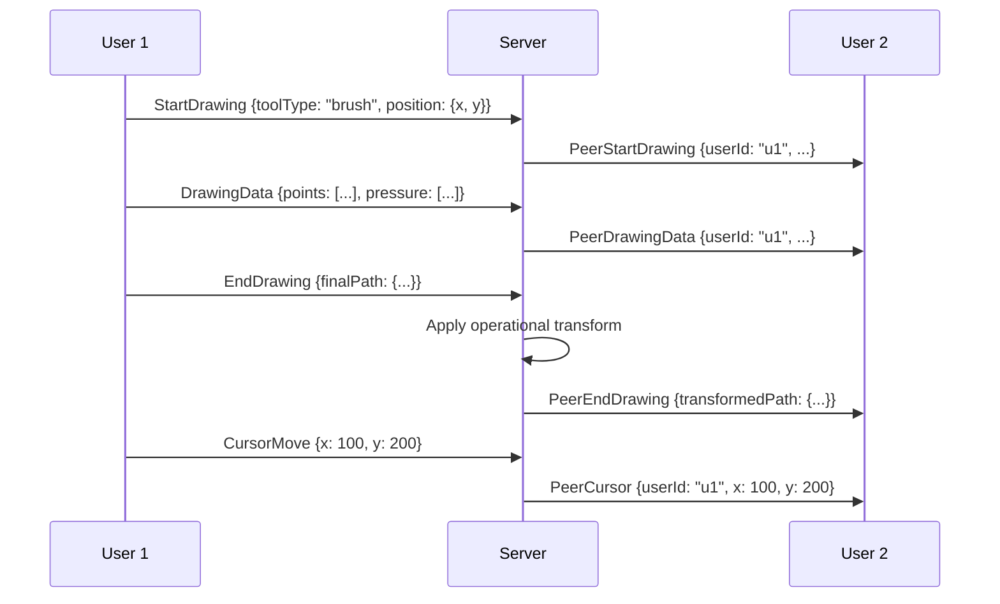

### Presence System

[⬆️ Back to Top](#--table-of-contents)

---


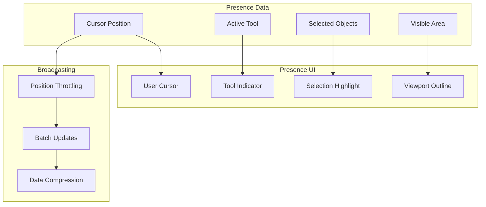

### TypeScript Interfaces & Component Props

[⬆️ Back to Top](#--table-of-contents)

---

#### Core Data Interfaces

```typescript
interface WhiteboardObject {
  id: string;
  type: 'shape' | 'text' | 'image' | 'line' | 'freehand';
  position: Point;
  dimensions: Dimensions;
  style: ObjectStyle;
  layerIndex: number;
  authorId: string;
  timestamp: Date;
  locked: boolean;
}

interface DrawingPath {
  id: string;
  points: Point[];
  pressure?: number[];
  tool: DrawingTool;
  style: StrokeStyle;
  smooth: boolean;
  closed: boolean;
}

interface WhiteboardUser {
  id: string;
  name: string;
  avatar?: string;
  color: string;
  cursor: Point;
  tool: DrawingTool;
  isActive: boolean;
  permissions: UserPermissions;
}

interface ObjectStyle {
  strokeColor: string;
  strokeWidth: number;
  fillColor: string;
  opacity: number;
  lineDash?: number[];
  fontSize?: number;
  fontFamily?: string;
}

interface WhiteboardState {
  id: string;
  objects: WhiteboardObject[];
  layers: Layer[];
  viewport: Viewport;
  collaborators: WhiteboardUser[];
  version: number;
  lastModified: Date;
}
```

#### Component Props Interfaces

```typescript
interface WhiteboardCanvasProps {
  whiteboardId: string;
  width: number;
  height: number;
  onObjectCreate: (object: WhiteboardObject) => void;
  onObjectUpdate: (objectId: string, changes: Partial<WhiteboardObject>) => void;
  onObjectDelete: (objectId: string) => void;
  onSelectionChange: (selectedIds: string[]) => void;
  readOnly?: boolean;
  showGrid?: boolean;
}

interface DrawingToolbarProps {
  selectedTool: DrawingTool;
  onToolChange: (tool: DrawingTool) => void;
  strokeColor: string;
  strokeWidth: number;
  fillColor: string;
  onStyleChange: (style: Partial<ObjectStyle>) => void;
  disabled?: boolean;
  customTools?: ToolDefinition[];
}

interface LayerPanelProps {
  layers: Layer[];
  selectedLayerId: string;
  onLayerSelect: (layerId: string) => void;
  onLayerCreate: (name: string) => void;
  onLayerDelete: (layerId: string) => void;
  onLayerToggleVisibility: (layerId: string) => void;
  onLayerReorder: (layerId: string, newIndex: number) => void;
}

interface CollaboratorsPanelProps {
  users: WhiteboardUser[];
  currentUser: WhiteboardUser;
  onUserInvite?: (email: string) => void;
  onUserRemove?: (userId: string) => void;
  onPermissionChange?: (userId: string, permissions: UserPermissions) => void;
  showCursors?: boolean;
}
```

### API Reference

[⬆️ Back to Top](#--table-of-contents)

---

#### Whiteboard Management
- `GET /api/whiteboards` - List user's whiteboards with collaboration info
- `POST /api/whiteboards` - Create new whiteboard with initial configuration
- `GET /api/whiteboards/:id` - Get whiteboard content and metadata
- `PUT /api/whiteboards/:id` - Update whiteboard settings and properties
- `DELETE /api/whiteboards/:id` - Delete whiteboard and all associated data

#### Drawing Operations
- `POST /api/whiteboards/:id/objects` - Add new drawing object to whiteboard
- `PUT /api/whiteboards/:id/objects/:objectId` - Update existing object properties
- `DELETE /api/whiteboards/:id/objects/:objectId` - Delete object from whiteboard
- `POST /api/whiteboards/:id/paths` - Add freehand drawing path
- `POST /api/whiteboards/:id/batch` - Execute multiple operations in batch

#### Real-time Collaboration
- `WS /api/whiteboards/:id/collaborate` - WebSocket for real-time drawing
- `POST /api/whiteboards/:id/cursor` - Update user cursor position
- `POST /api/whiteboards/:id/selection` - Update user selection state
- `WS DRAWING_OPERATION` - Broadcast drawing operations to collaborators
- `WS USER_PRESENCE` - Handle user join/leave and cursor updates

#### Layer Management
- `GET /api/whiteboards/:id/layers` - Get whiteboard layer structure
- `POST /api/whiteboards/:id/layers` - Create new layer with properties
- `PUT /api/whiteboards/:id/layers/:layerId` - Update layer visibility or properties
- `DELETE /api/whiteboards/:id/layers/:layerId` - Delete layer and move objects
- `POST /api/whiteboards/:id/layers/reorder` - Reorder layers with z-index

#### Media & Assets
- `POST /api/whiteboards/:id/images` - Upload image to whiteboard
- `GET /api/whiteboards/:id/assets` - Get all media assets used
- `DELETE /api/assets/:assetId` - Remove unused asset from storage
- `POST /api/whiteboards/:id/export` - Export whiteboard as image or PDF
- `POST /api/whiteboards/:id/templates` - Save whiteboard as template

#### Sharing & Permissions
- `POST /api/whiteboards/:id/share` - Generate shareable link with permissions
- `GET /api/whiteboards/:id/collaborators` - Get whiteboard collaborators
- `PUT /api/whiteboards/:id/permissions` - Update user access permissions
- `DELETE /api/whiteboards/:id/collaborators/:userId` - Remove collaborator
- `POST /api/whiteboards/:id/invite` - Invite users via email

#### Version History
- `GET /api/whiteboards/:id/snapshots` - Get whiteboard version snapshots
- `POST /api/whiteboards/:id/snapshots` - Create manual snapshot
- `GET /api/whiteboards/:id/snapshots/:snapshotId` - Get specific snapshot
- `POST /api/whiteboards/:id/restore` - Restore whiteboard to snapshot
- `GET /api/whiteboards/:id/changes` - Get change history with authors

#### Templates & Frameworks
- `GET /api/templates` - Browse available whiteboard templates
- `POST /api/whiteboards/:id/apply-template` - Apply template to whiteboard
- `GET /api/frameworks` - Get drawing frameworks (wireframes, diagrams)
- `POST /api/whiteboards/:id/auto-layout` - Apply automatic layout algorithm
- `POST /api/templates` - Create template from existing whiteboard

---

## Performance Optimizations

[⬆️ Back to Top](#--table-of-contents)

---


### Canvas Rendering Optimizations

[⬆️ Back to Top](#--table-of-contents)

---


**Dirty Rectangle Rendering**:
```
DirtyRegion = {
  x: number,
  y: number,
  width: number,
  height: number,
  shapes: Set<Shape>
}
```

**Optimization Strategies**:
- Track modified regions per frame
- Only redraw affected canvas areas
- Use multiple canvas layers for different update frequencies
- Implement object culling for off-screen shapes

**GPU Acceleration**:
- Utilize WebGL for complex operations
- Implement shader-based effects
- Use vertex buffers for path rendering
- Leverage hardware-accelerated compositing

### Memory Management

[⬆️ Back to Top](#--table-of-contents)

---


**Object Pooling Strategy**:
```
ObjectPool = {
  points: Point[],
  paths: Path[],
  shapes: Shape[],
  operations: DrawOperation[]
}
```

**Memory Optimization Techniques**:
- Reuse drawing operation objects
- Implement lazy loading for large drawings
- Compress historical data
- Garbage collect unused resources

### Network Optimization

[⬆️ Back to Top](#--table-of-contents)

---


**Data Compression**:
- Binary encoding for drawing operations
- Delta compression for path updates
- Geometric quantization for coordinates
- Huffman coding for repetitive data

**Bandwidth Management**:
- Adaptive quality based on network conditions
- Progressive shape loading
- Smart batching of operations
- Connection multiplexing

## Security Considerations

[⬆️ Back to Top](#--table-of-contents)

---


### Input Validation

[⬆️ Back to Top](#--table-of-contents)

---


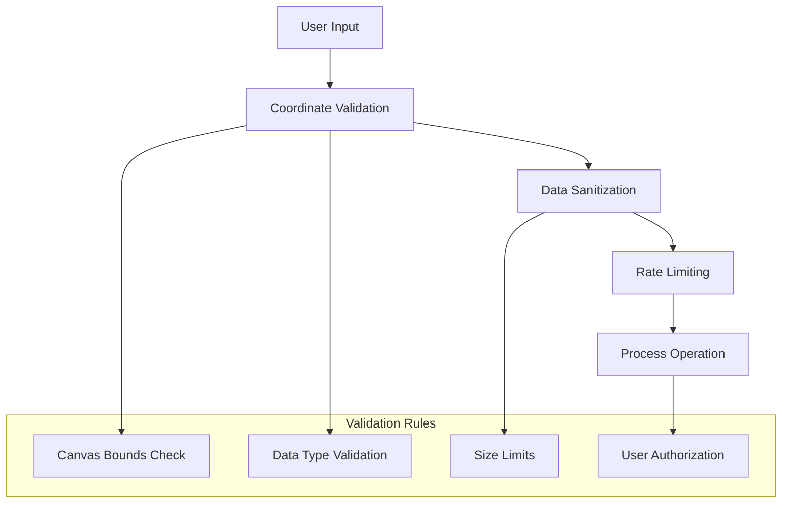

### Content Security

[⬆️ Back to Top](#--table-of-contents)

---


**Drawing Content Filtering**:
- Image upload restrictions
- Text content moderation
- Shape complexity limits
- File size constraints

**Permission Model**:
- Room-based access control
- Draw/view/admin permissions
- Shape ownership tracking
- Version control and rollback

## Testing Strategy

[⬆️ Back to Top](#--table-of-contents)

---


### Unit Testing Focus Areas

[⬆️ Back to Top](#--table-of-contents)

---


**Core Algorithm Testing**:
- Operational transform correctness
- Path simplification accuracy
- Hit testing precision
- Collision detection performance

**Component Testing**:
- Tool behavior consistency
- Canvas rendering output
- Layer management operations
- User interaction handling

### Integration Testing

[⬆️ Back to Top](#--table-of-contents)

---


**Collaboration Testing**:
- Multi-user drawing scenarios
- Conflict resolution accuracy
- Real-time synchronization
- Network failure recovery

**Performance Testing**:
- Large drawing handling
- High-frequency input processing
- Memory usage patterns
- Rendering frame rates

### End-to-End Testing

[⬆️ Back to Top](#--table-of-contents)

---


**User Workflow Testing**:
- Complete drawing sessions
- Cross-device compatibility
- Touch and stylus input
- Export functionality

## Accessibility Implementation

[⬆️ Back to Top](#--table-of-contents)

---


### Keyboard Navigation

[⬆️ Back to Top](#--table-of-contents)

---


**Navigation Patterns**:
- Tab through tool panels
- Arrow keys for shape manipulation
- Keyboard shortcuts for common tools
- Screen reader announcements

**Alternative Input Methods**:
- Voice commands for drawing actions
- Switch navigation support
- High contrast mode
- Magnification support

### Screen Reader Support

[⬆️ Back to Top](#--table-of-contents)

---


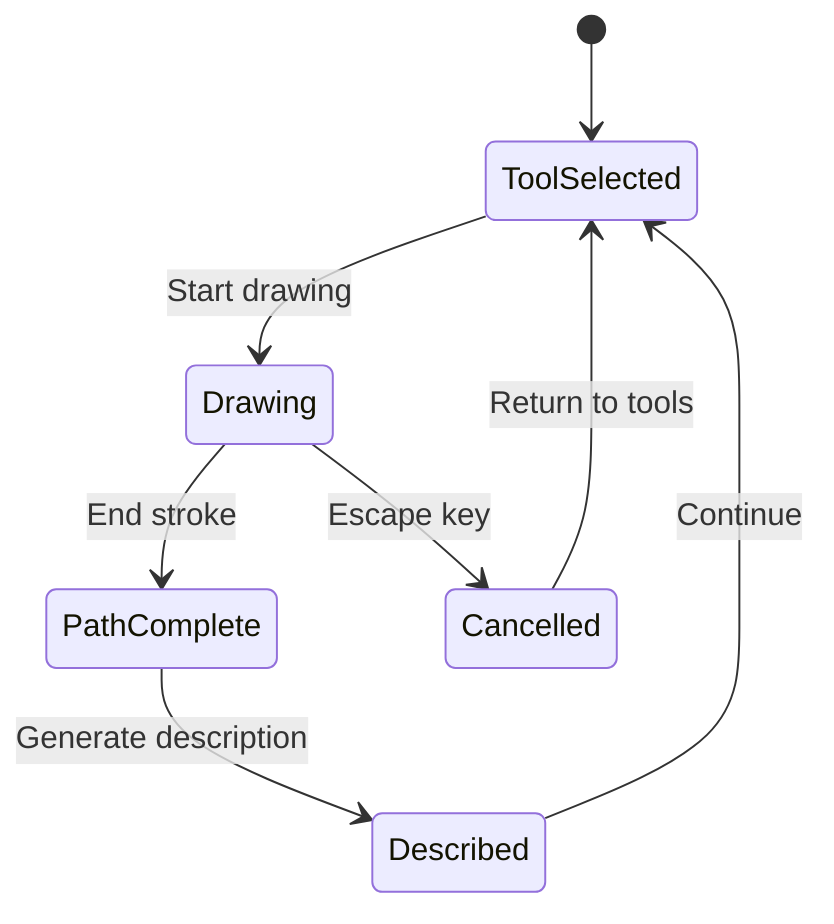

**Accessibility Features**:
- Spatial audio feedback for drawing
- Tactile feedback integration
- Descriptive text for visual elements
- Structured navigation landmarks

## Trade-offs and Considerations

[⬆️ Back to Top](#--table-of-contents)

---


### Performance vs Quality

[⬆️ Back to Top](#--table-of-contents)

---

- **Vector precision**: Higher precision vs memory usage
- **Real-time sync**: Immediate updates vs bandwidth consumption
- **Visual effects**: Rich rendering vs performance impact
- **History depth**: Undo capability vs storage requirements

### Collaboration vs Consistency

[⬆️ Back to Top](#--table-of-contents)

---

- **Immediate feedback**: Local updates vs global consistency
- **Conflict resolution**: Automatic merge vs user intervention
- **Presence updates**: Real-time awareness vs network overhead
- **Offline support**: Local editing vs synchronization complexity

### Scalability Considerations

[⬆️ Back to Top](#--table-of-contents)

---

- **Room size limits**: Concurrent users vs performance
- **Drawing complexity**: Shape count vs rendering speed
- **Storage optimization**: Version history vs cost
- **Network topology**: Peer-to-peer vs server-mediated

This collaborative whiteboard system provides a robust foundation for real-time drawing collaboration with advanced features like operational transforms, pressure-sensitive input, and multi-layer rendering while maintaining high performance and accessibility standards. 