# Email Client UI (Outlook-like)


## 📋 Table of Contents

- [Email Client UI (Outlook-like)](#email-client-ui-outlook-like)
  - [Table of Contents](#table-of-contents)
  - [Clarify the Problem and Requirements](#clarify-the-problem-and-requirements)
    - [Problem Understanding](#problem-understanding)
    - [Functional Requirements](#functional-requirements)
    - [Non-Functional Requirements](#non-functional-requirements)
    - [Key Assumptions](#key-assumptions)
  - [High-Level Design (HLD)](#high-level-design-hld)
    - [System Architecture Overview](#system-architecture-overview)
    - [Email Data Model](#email-data-model)
  - [Low-Level Design (LLD)](#low-level-design-lld)
    - [Email List Virtualization](#email-list-virtualization)
    - [Drag and Drop System](#drag-and-drop-system)
    - [Email Synchronization State Machine](#email-synchronization-state-machine)
  - [Core Algorithms](#core-algorithms)
    - [1. Virtual List Rendering Algorithm](#1-virtual-list-rendering-algorithm)
    - [2. Email Threading Algorithm](#2-email-threading-algorithm)
    - [3. Intelligent Search Algorithm](#3-intelligent-search-algorithm)
    - [4. Label Management System](#4-label-management-system)
    - [5. Folder Synchronization Algorithm](#5-folder-synchronization-algorithm)
  - [Component Architecture](#component-architecture)
    - [Email Client Component Hierarchy](#email-client-component-hierarchy)
    - [State Management Architecture](#state-management-architecture)
  - [Advanced Features](#advanced-features)
    - [Smart Folder System](#smart-folder-system)
    - [Email Composition Features](#email-composition-features)
  - [TypeScript Interfaces & Component Props](#typescript-interfaces--component-props)
    - [Core Data Interfaces](#core-data-interfaces)
    - [Component Props Interfaces](#component-props-interfaces)
  - [API Reference](#api-reference)
  - [Performance Optimizations](#performance-optimizations)
    - [Memory Management](#memory-management)
    - [Network Optimization](#network-optimization)
    - [Search Performance](#search-performance)
  - [Security Considerations](#security-considerations)
    - [Data Protection](#data-protection)
    - [Email Content Security](#email-content-security)
  - [Accessibility Implementation](#accessibility-implementation)
    - [Keyboard Navigation](#keyboard-navigation)
    - [Screen Reader Support](#screen-reader-support)
  - [Testing Strategy](#testing-strategy)
    - [Unit Testing Focus Areas](#unit-testing-focus-areas)
    - [Integration Testing](#integration-testing)
    - [End-to-End Testing](#end-to-end-testing)
  - [Trade-offs and Considerations](#trade-offs-and-considerations)
    - [Performance vs Features](#performance-vs-features)
    - [Security vs Usability](#security-vs-usability)
    - [Scalability Considerations](#scalability-considerations)

---

## Table of Contents
1. [Clarify the Problem and Requirements](#clarify-the-problem-and-requirements)
2. [High-Level Design (HLD)](#high-level-design-hld)
3. [Low-Level Design (LLD)](#low-level-design-lld)
4. [Core Algorithms](#core-algorithms)
5. [Component Architecture](#component-architecture)
6. [Advanced Features](#advanced-features)
7. [Performance Optimizations](#performance-optimizations)
8. [Security Considerations](#security-considerations)
9. [Accessibility Implementation](#accessibility-implementation)
10. [Testing Strategy](#testing-strategy)
11. [Trade-offs and Considerations](#trade-offs-and-considerations)

---

## Clarify the Problem and Requirements

[⬆️ Back to Top](#--table-of-contents)

---

### Problem Understanding

[⬆️ Back to Top](#--table-of-contents)

---

Design a comprehensive web-based email client interface that provides rich email management capabilities, similar to Microsoft Outlook, Gmail, or Thunderbird. The system must handle large volumes of emails efficiently, support advanced organizational features, provide real-time synchronization, and deliver an intuitive user experience across different devices while maintaining security and performance standards.

### Functional Requirements

[⬆️ Back to Top](#--table-of-contents)

---

- **Email Management**: Send, receive, reply, forward, delete emails with rich text composition
- **Folder Organization**: Hierarchical folder structure, custom folders, smart folders, drag-and-drop
- **Search & Filtering**: Advanced search, saved searches, filters, sorting options
- **Email Threading**: Conversation grouping, thread management, collapsed/expanded views
- **Label System**: Color-coded labels, multiple labels per email, label-based filtering
- **Attachment Handling**: Upload, download, preview attachments, virus scanning
- **Offline Support**: Offline reading, compose drafts, sync when online
- **Multi-account Support**: Multiple email accounts, unified inbox, account switching

### Non-Functional Requirements

[⬆️ Back to Top](#--table-of-contents)

---

- **Performance**: <2s initial load, <500ms email open time, smooth scrolling with 10K+ emails
- **Scalability**: Handle mailboxes with 100K+ emails, efficient virtualization
- **Reliability**: 99.9% uptime, robust error handling, automatic recovery
- **Security**: End-to-end encryption, secure authentication, malware protection
- **Cross-platform**: Responsive design for desktop, tablet, mobile browsers
- **Accessibility**: WCAG 2.1 AA compliance, keyboard navigation, screen reader support
- **Real-time Updates**: Live email synchronization, push notifications
- **Memory Efficiency**: Optimal memory usage, efficient caching, no memory leaks

### Key Assumptions

[⬆️ Back to Top](#--table-of-contents)

---

- Average mailbox size: 10K-50K emails, power users up to 100K+ emails
- Email volume: 50-200 emails per day for typical users
- Attachment sizes: Average 1-5MB, maximum 25MB per email
- Device usage: 70% desktop, 20% mobile, 10% tablet
- Network conditions: Variable from mobile to high-speed connections
- User behavior: Heavy email readers, moderate composers, organizers
- Email protocols: IMAP/POP3 for receiving, SMTP for sending
- Storage: Local caching with server synchronization

---

## High-Level Design (HLD)

[⬆️ Back to Top](#--table-of-contents)

---


### System Architecture Overview

[⬆️ Back to Top](#--table-of-contents)

---


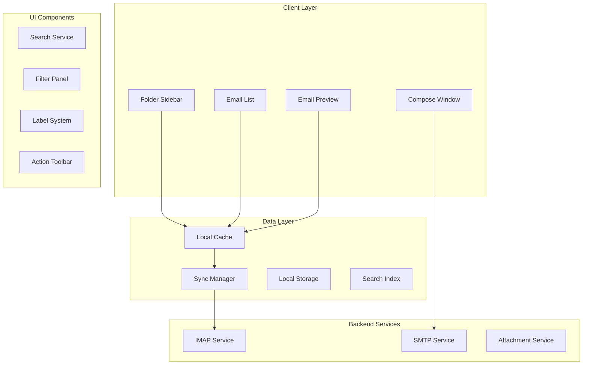

### Email Data Model

[⬆️ Back to Top](#--table-of-contents)

---


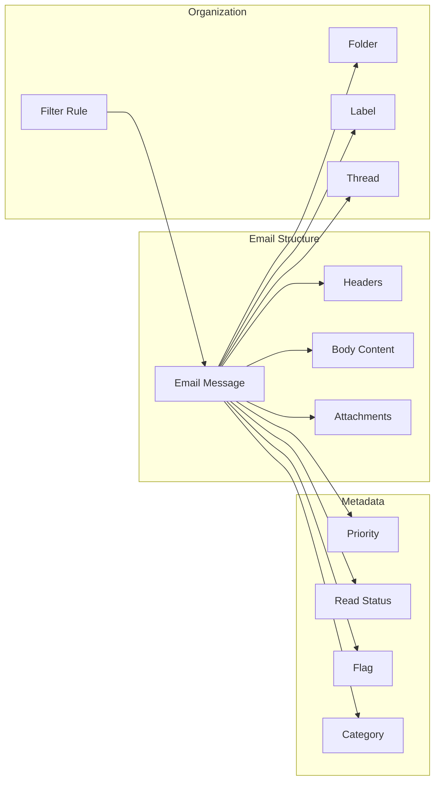

## Low-Level Design (LLD)

[⬆️ Back to Top](#--table-of-contents)

---


### Email List Virtualization

[⬆️ Back to Top](#--table-of-contents)

---


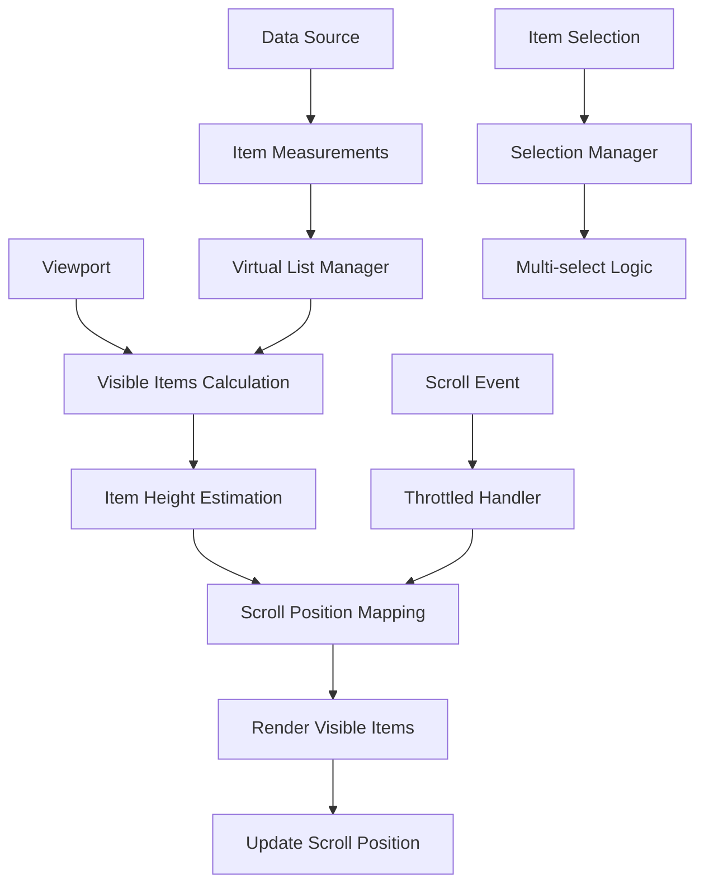

### Drag and Drop System

[⬆️ Back to Top](#--table-of-contents)

---


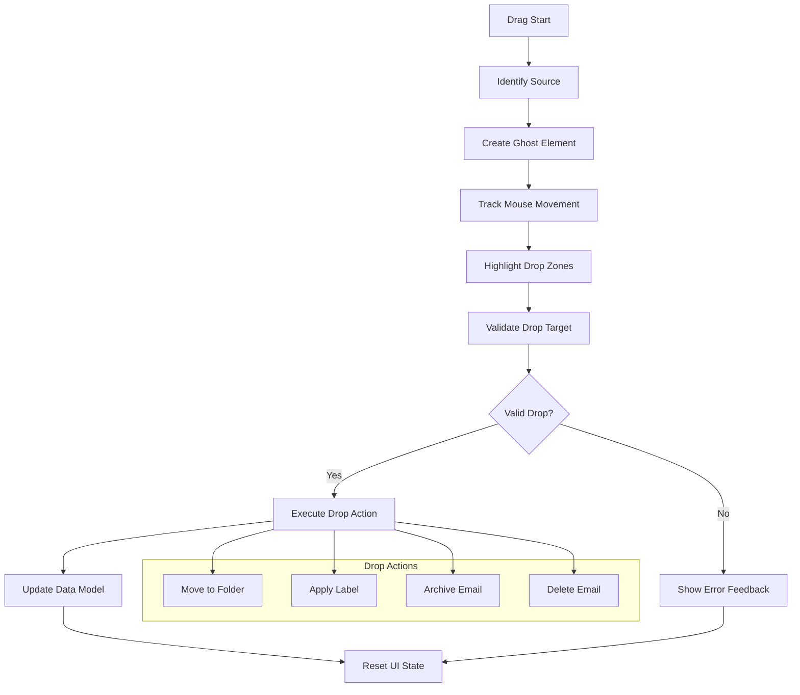

### Email Synchronization State Machine

[⬆️ Back to Top](#--table-of-contents)

---


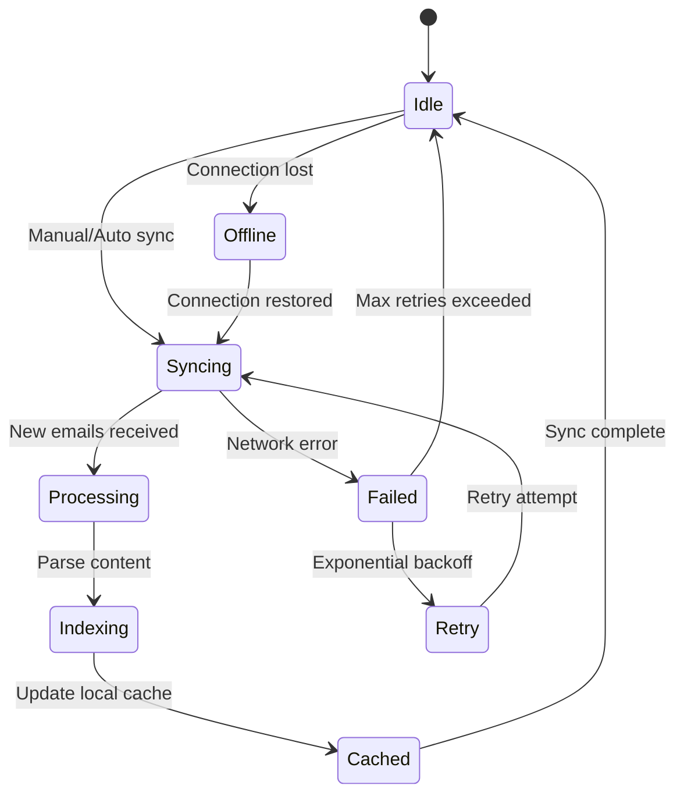

## Core Algorithms

[⬆️ Back to Top](#--table-of-contents)

---


### 1. Virtual List Rendering Algorithm

[⬆️ Back to Top](#--table-of-contents)

---


**Purpose**: Efficiently render large email lists without performance degradation.

**Key Components**:
```
VirtualList = {
  itemHeight: number | function,
  containerHeight: number,
  scrollTop: number,
  totalItems: number,
  overscan: number
}
```

**Rendering Algorithm**:
```
function calculateVisibleRange(virtualList):
  startIndex = Math.floor(scrollTop / itemHeight)
  endIndex = Math.min(
    startIndex + Math.ceil(containerHeight / itemHeight) + overscan,
    totalItems - 1
  )
  
  return {
    start: Math.max(0, startIndex - overscan),
    end: endIndex
  }
```

**Dynamic Height Handling**:
- Measure rendered items to get actual heights
- Cache height measurements for performance
- Recalculate scroll position when heights change
- Implement binary search for position lookup

### 2. Email Threading Algorithm

[⬆️ Back to Top](#--table-of-contents)

---


**Purpose**: Group related emails into conversation threads.

**Threading Strategy**:
```
function buildThreads(emails):
  threads = new Map()
  
  for email in emails:
    threadId = extractThreadId(email)
    if not threadId:
      threadId = generateThreadId(email.subject, email.references)
    
    if not threads.has(threadId):
      threads.set(threadId, new Thread())
    
    thread = threads.get(threadId)
    thread.addEmail(email)
    thread.sortByDate()
  
  return Array.from(threads.values())
```

**Subject Normalization**:
- Remove "Re:", "Fwd:", and language variants
- Normalize whitespace and case
- Handle subject line truncation
- Account for automated subject modifications

### 3. Intelligent Search Algorithm

[⬆️ Back to Top](#--table-of-contents)

---


**Multi-field Search Strategy**:
```
SearchQuery = {
  text: string,
  sender: string,
  subject: string,
  dateRange: DateRange,
  hasAttachment: boolean,
  labels: Label[],
  folder: Folder
}
```

**Ranking Algorithm**:
```
function calculateRelevanceScore(email, query):
  score = 0
  
  // Text content matching
  score += textMatch(email.body, query.text) * 0.4
  score += textMatch(email.subject, query.text) * 0.3
  score += textMatch(email.sender, query.text) * 0.2
  
  // Exact field matches
  if query.sender and email.sender.includes(query.sender):
    score += 0.5
  
  // Recency boost
  daysSince = (now - email.date) / (24 * 60 * 60 * 1000)
  score += Math.max(0, (30 - daysSince) / 30) * 0.1
  
  return score
```

**Full-text Search Optimization**:
- Implement inverted index for fast text search
- Use stemming and tokenization
- Support fuzzy matching for typos
- Cache popular search queries

### 4. Label Management System

[⬆️ Back to Top](#--table-of-contents)

---


**Hierarchical Label Structure**:
```
Label = {
  id: string,
  name: string,
  color: string,
  parent?: Label,
  children: Label[],
  isSystem: boolean
}
```

**Label Application Algorithm**:
```
function applyLabel(emails, label):
  batch = new LabelBatch()
  
  for email in emails:
    if not email.labels.includes(label):
      batch.add(email.id, label.id)
      email.labels.push(label)
      
      // Apply parent labels automatically
      parent = label.parent
      while parent and not email.labels.includes(parent):
        batch.add(email.id, parent.id)
        email.labels.push(parent)
        parent = parent.parent
  
  return batch.execute()
```

### 5. Folder Synchronization Algorithm

[⬆️ Back to Top](#--table-of-contents)

---


**Incremental Sync Strategy**:
```
function syncFolder(folder):
  lastSync = getLastSyncTime(folder)
  
  // Get server state
  serverState = await fetchFolderState(folder, lastSync)
  localState = getLocalFolderState(folder)
  
  // Calculate differences
  diff = calculateDiff(serverState, localState)
  
  // Apply changes
  for change in diff.additions:
    await downloadEmail(change.messageId)
  
  for change in diff.deletions:
    await deleteLocalEmail(change.messageId)
  
  for change in diff.modifications:
    await updateLocalEmail(change.messageId, change.flags)
  
  setLastSyncTime(folder, now)
```

**Conflict Resolution**:
- Server state takes precedence for flags
- Local deletions are preserved unless email exists on server
- Handle concurrent modifications gracefully
- Implement rollback for failed operations

## Component Architecture

[⬆️ Back to Top](#--table-of-contents)

---


### Email Client Component Hierarchy

[⬆️ Back to Top](#--table-of-contents)

---


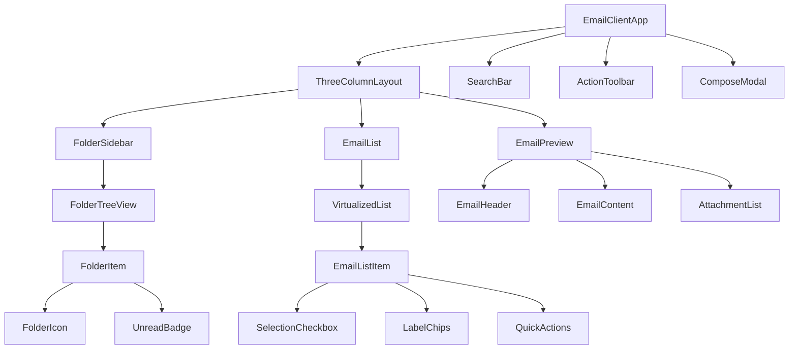

### State Management Architecture

[⬆️ Back to Top](#--table-of-contents)

---


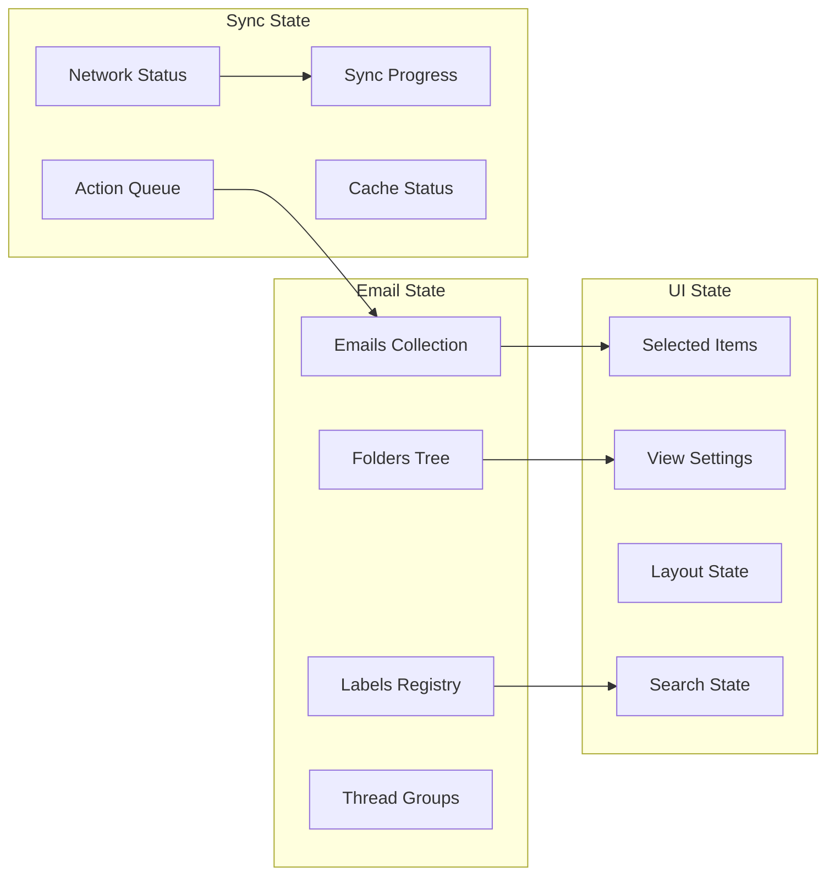

#### React Component Implementation

[⬆️ Back to Top](#--table-of-contents)

---

**EmailClientApp.jsx**

**What this code does:**
• **Main Purpose**: Full-featured email client with folder navigation and email operations
• **Email Management**: Handles reading, archiving, deleting, and composing emails
• **Key Functions**:
  - `loadFolderEmails()` - Fetches emails for selected folder with search support
  - `handleEmailSelect()` - Opens email and marks as read automatically
  - `markAsRead()` - Updates read status with optimistic UI updates
  - `archiveEmails()` - Moves selected emails to archive folder
  - `sendEmail()` - Composes and sends new emails
  - `handleSearch()` - Filters emails based on search query

```jsx
import React, { useState, useEffect, useCallback } from 'react';
import { EmailProvider } from './EmailContext';
import ThreeColumnLayout from './ThreeColumnLayout';
import SearchBar from './SearchBar';
import ActionToolbar from './ActionToolbar';
import ComposeModal from './ComposeModal';
import { useEmailSync } from './hooks/useEmailSync';

const EmailClientApp = () => {
  const [emails, setEmails] = useState([]);
  const [folders, setFolders] = useState([]);
  const [selectedEmails, setSelectedEmails] = useState([]);
  const [currentFolder, setCurrentFolder] = useState('inbox');
  const [selectedEmail, setSelectedEmail] = useState(null);
  const [searchQuery, setSearchQuery] = useState('');
  const [isComposing, setIsComposing] = useState(false);
  const [viewSettings, setViewSettings] = useState({
    density: 'comfortable',
    groupByThread: true,
    showPreview: true
  });

  const { syncStatus, syncEmails, isOnline } = useEmailSync();

  useEffect(() => {
    loadInitialData();
  }, []);

  useEffect(() => {
    if (currentFolder) {
      loadFolderEmails(currentFolder);
    }
  }, [currentFolder, searchQuery]);

  const loadInitialData = async () => {
    try {
      const [foldersData, emailsData] = await Promise.all([
        fetch('/api/folders').then(r => r.json()),
        fetch('/api/emails?folder=inbox&limit=50').then(r => r.json())
      ]);
      
      setFolders(foldersData.folders);
      setEmails(emailsData.emails);
    } catch (error) {
      console.error('Failed to load initial data:', error);
    }
  };

  const loadFolderEmails = async (folderId) => {
    try {
      const params = new URLSearchParams({
        folder: folderId,
        limit: 100,
        ...(searchQuery && { search: searchQuery })
      });

      const response = await fetch(`/api/emails?${params}`);
      const data = await response.json();
      setEmails(data.emails);
    } catch (error) {
      console.error('Failed to load folder emails:', error);
    }
  };

  const handleEmailSelect = useCallback((emailId) => {
    const email = emails.find(e => e.id === emailId);
    setSelectedEmail(email);
    
    // Mark as read if unread
    if (email && !email.isRead) {
      markAsRead(emailId);
    }
  }, [emails]);

  const handleEmailsSelection = useCallback((emailIds) => {
    setSelectedEmails(emailIds);
  }, []);

  const markAsRead = useCallback(async (emailId) => {
    setEmails(prev => prev.map(email => 
      email.id === emailId ? { ...email, isRead: true } : email
    ));

    try {
      await fetch(`/api/emails/${emailId}/read`, { method: 'POST' });
    } catch (error) {
      console.error('Failed to mark as read:', error);
      // Revert on error
      setEmails(prev => prev.map(email => 
        email.id === emailId ? { ...email, isRead: false } : email
      ));
    }
  }, []);

  const archiveEmails = useCallback(async (emailIds) => {
    const emailsToArchive = emailIds || selectedEmails;
    
    setEmails(prev => prev.filter(email => !emailsToArchive.includes(email.id)));
    setSelectedEmails([]);

    try {
      await fetch('/api/emails/archive', {
        method: 'POST',
        headers: { 'Content-Type': 'application/json' },
        body: JSON.stringify({ emailIds: emailsToArchive })
      });
    } catch (error) {
      console.error('Failed to archive emails:', error);
      loadFolderEmails(currentFolder);
    }
  }, [selectedEmails, currentFolder]);

  const deleteEmails = useCallback(async (emailIds) => {
    const emailsToDelete = emailIds || selectedEmails;
    
    setEmails(prev => prev.filter(email => !emailsToDelete.includes(email.id)));
    setSelectedEmails([]);

    try {
      await fetch('/api/emails/delete', {
        method: 'POST',
        headers: { 'Content-Type': 'application/json' },
        body: JSON.stringify({ emailIds: emailsToDelete })
      });
    } catch (error) {
      console.error('Failed to delete emails:', error);
      loadFolderEmails(currentFolder);
    }
  }, [selectedEmails, currentFolder]);

  const sendEmail = useCallback(async (emailData) => {
    try {
      const response = await fetch('/api/emails/send', {
        method: 'POST',
        headers: { 'Content-Type': 'application/json' },
        body: JSON.stringify(emailData)
      });

      if (response.ok) {
        setIsComposing(false);
        // Refresh sent folder if currently viewing
        if (currentFolder === 'sent') {
          loadFolderEmails(currentFolder);
        }
      }
    } catch (error) {
      console.error('Failed to send email:', error);
      throw error;
    }
  }, [currentFolder]);

  const handleSearch = useCallback((query) => {
    setSearchQuery(query);
  }, []);

  const handleRefresh = useCallback(() => {
    syncEmails();
    loadFolderEmails(currentFolder);
  }, [currentFolder, syncEmails]);

  return (
    <EmailProvider value={{
      emails,
      folders,
      selectedEmails,
      selectedEmail,
      currentFolder,
      searchQuery,
      viewSettings,
      syncStatus,
      isOnline,
      onEmailSelect: handleEmailSelect,
      onEmailsSelection: handleEmailsSelection,
      onFolderChange: setCurrentFolder,
      onSearch: handleSearch,
      onArchive: archiveEmails,
      onDelete: deleteEmails,
      onMarkAsRead: markAsRead,
      onViewSettingsChange: setViewSettings
    }}>
      <div className="email-client-app">
        <header className="email-header">
          <SearchBar onSearch={handleSearch} />
          <ActionToolbar 
            selectedCount={selectedEmails.length}
            onRefresh={handleRefresh}
            onCompose={() => setIsComposing(true)}
            onArchive={() => archiveEmails()}
            onDelete={() => deleteEmails()}
          />
        </header>

        <main className="email-main">
          <ThreeColumnLayout />
        </main>

        {isComposing && (
          <ComposeModal
            onClose={() => setIsComposing(false)}
            onSend={sendEmail}
          />
        )}
      </div>
    </EmailProvider>
  );
};

export default EmailClientApp;
```

**ThreeColumnLayout.jsx**
```jsx
import React, { useContext } from 'react';
import { EmailContext } from './EmailContext';
import FolderSidebar from './FolderSidebar';
import EmailList from './EmailList';
import EmailPreview from './EmailPreview';

const ThreeColumnLayout = () => {
  const { viewSettings, selectedEmail } = useContext(EmailContext);

  return (
    <div className="three-column-layout">
      <div className="folder-sidebar-column">
        <FolderSidebar />
      </div>

      <div className="email-list-column">
        <EmailList />
      </div>

      {viewSettings.showPreview && (
        <div className="email-preview-column">
          {selectedEmail ? (
            <EmailPreview email={selectedEmail} />
          ) : (
            <div className="no-email-selected">
              <div className="placeholder-content">
                <h3>No email selected</h3>
                <p>Choose an email from the list to preview it here</p>
              </div>
            </div>
          )}
        </div>
      )}
    </div>
  );
};

export default ThreeColumnLayout;
```

**EmailList.jsx**
```jsx
import React, { useContext, useMemo } from 'react';
import { FixedSizeList as VirtualList } from 'react-window';
import { EmailContext } from './EmailContext';
import EmailListItem from './EmailListItem';

const EmailList = () => {
  const { 
    emails, 
    selectedEmails, 
    searchQuery, 
    viewSettings, 
    onEmailsSelection 
  } = useContext(EmailContext);

  const filteredEmails = useMemo(() => {
    if (!searchQuery) return emails;
    
    return emails.filter(email => 
      email.subject.toLowerCase().includes(searchQuery.toLowerCase()) ||
      email.sender.toLowerCase().includes(searchQuery.toLowerCase()) ||
      email.body.toLowerCase().includes(searchQuery.toLowerCase())
    );
  }, [emails, searchQuery]);

  const groupedEmails = useMemo(() => {
    if (!viewSettings.groupByThread) return filteredEmails;
    
    const threads = new Map();
    filteredEmails.forEach(email => {
      const threadId = email.threadId || email.id;
      if (!threads.has(threadId)) {
        threads.set(threadId, []);
      }
      threads.get(threadId).push(email);
    });
    
    return Array.from(threads.values()).map(thread => thread[0]);
  }, [filteredEmails, viewSettings.groupByThread]);

  const handleSelectAll = () => {
    const allIds = groupedEmails.map(email => email.id);
    const isAllSelected = allIds.every(id => selectedEmails.includes(id));
    
    if (isAllSelected) {
      onEmailsSelection([]);
    } else {
      onEmailsSelection(allIds);
    }
  };

  const handleItemSelection = (emailId, isSelected) => {
    if (isSelected) {
      onEmailsSelection([...selectedEmails, emailId]);
    } else {
      onEmailsSelection(selectedEmails.filter(id => id !== emailId));
    }
  };

  const itemHeight = viewSettings.density === 'compact' ? 60 : 
                   viewSettings.density === 'comfortable' ? 80 : 100;

  const ItemRenderer = ({ index, style }) => (
    <div style={style}>
      <EmailListItem
        email={groupedEmails[index]}
        isSelected={selectedEmails.includes(groupedEmails[index].id)}
        onSelect={handleItemSelection}
        density={viewSettings.density}
      />
    </div>
  );

  return (
    <div className="email-list">
      <div className="list-header">
        <div className="select-all-section">
          <input
            type="checkbox"
            checked={groupedEmails.length > 0 && 
                     groupedEmails.every(email => selectedEmails.includes(email.id))}
            onChange={handleSelectAll}
            className="select-all-checkbox"
          />
          <span className="email-count">
            {groupedEmails.length} emails
          </span>
        </div>
        
        <div className="list-actions">
          <button className="sort-button">
            Sort by Date ↓
          </button>
        </div>
      </div>

      <div className="list-content">
        {groupedEmails.length === 0 ? (
          <div className="empty-list">
            <div className="empty-state">
              <h3>No emails found</h3>
              <p>Your {searchQuery ? 'search' : 'folder'} is empty</p>
            </div>
          </div>
        ) : (
          <VirtualList
            height={600}
            itemCount={groupedEmails.length}
            itemSize={itemHeight}
            overscanCount={5}
          >
            {ItemRenderer}
          </VirtualList>
        )}
      </div>
    </div>
  );
};

export default EmailList;
```

**EmailListItem.jsx**
```jsx
import React, { useContext } from 'react';
import { EmailContext } from './EmailContext';

const EmailListItem = ({ email, isSelected, onSelect, density }) => {
  const { onEmailSelect, selectedEmail } = useContext(EmailContext);

  const handleClick = () => {
    onEmailSelect(email.id);
  };

  const handleCheckboxChange = (e) => {
    e.stopPropagation();
    onSelect(email.id, e.target.checked);
  };

  const formatDate = (dateString) => {
    const date = new Date(dateString);
    const now = new Date();
    const isToday = date.toDateString() === now.toDateString();
    
    if (isToday) {
      return date.toLocaleTimeString([], { hour: '2-digit', minute: '2-digit' });
    } else {
      return date.toLocaleDateString();
    }
  };

  const truncateText = (text, maxLength) => {
    return text.length > maxLength ? text.slice(0, maxLength) + '...' : text;
  };

  const isActive = selectedEmail?.id === email.id;

  return (
    <div 
      className={`email-list-item ${density} ${isActive ? 'active' : ''} ${!email.isRead ? 'unread' : ''}`}
      onClick={handleClick}
    >
      <div className="item-checkbox">
        <input
          type="checkbox"
          checked={isSelected}
          onChange={handleCheckboxChange}
          onClick={(e) => e.stopPropagation()}
        />
      </div>

      <div className="item-content">
        <div className="item-header">
          <div className="sender-info">
            <span className="sender-name">
              {email.sender}
            </span>
            {!email.isRead && <span className="unread-indicator" />}
          </div>
          
          <div className="email-meta">
            <span className="date">{formatDate(email.date)}</span>
            {email.attachments?.length > 0 && (
              <span className="attachment-icon">📎</span>
            )}
            {email.priority === 'high' && (
              <span className="priority-high">❗</span>
            )}
          </div>
        </div>

        <div className="item-body">
          <div className="subject">
            {truncateText(email.subject, 60)}
          </div>
          
          {density !== 'compact' && (
            <div className="preview">
              {truncateText(email.body || '', 100)}
            </div>
          )}
        </div>

        {email.labels && email.labels.length > 0 && (
          <div className="item-labels">
            {email.labels.slice(0, 3).map(label => (
              <span key={label.id} className={`label-chip ${label.color}`}>
                {label.name}
              </span>
            ))}
          </div>
        )}
      </div>
    </div>
  );
};

export default EmailListItem;
```

## Advanced Features

[⬆️ Back to Top](#--table-of-contents)

---


### Smart Folder System

[⬆️ Back to Top](#--table-of-contents)

---


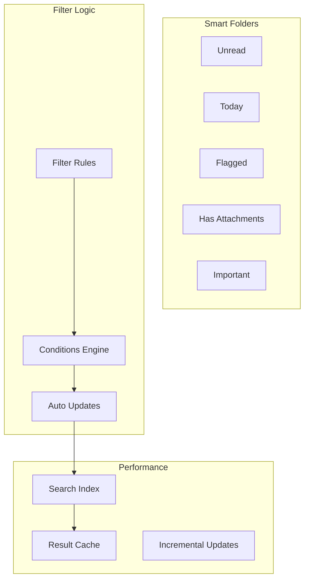

### Email Composition Features

[⬆️ Back to Top](#--table-of-contents)

---


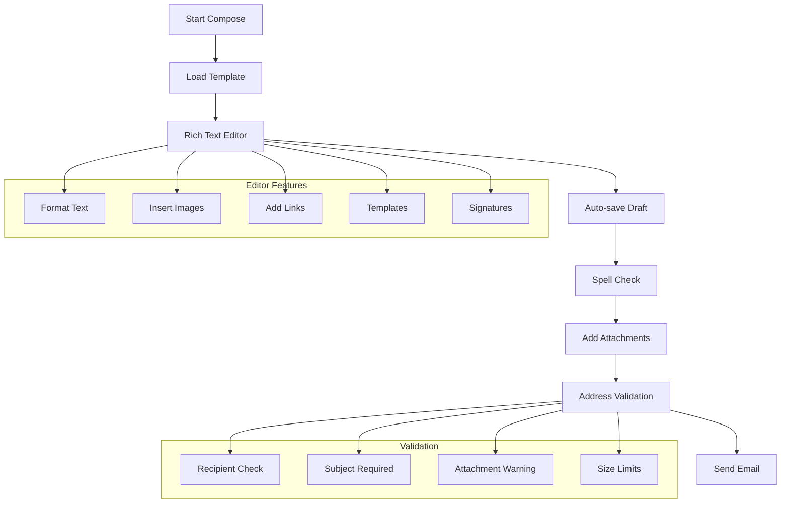

### TypeScript Interfaces & Component Props

[⬆️ Back to Top](#--table-of-contents)

---

#### Core Data Interfaces

```typescript
interface Email {
  id: string;
  messageId: string;
  threadId?: string;
  subject: string;
  from: EmailAddress;
  to: EmailAddress[];
  cc?: EmailAddress[];
  bcc?: EmailAddress[];
  date: Date;
  body: EmailBody;
  attachments: Attachment[];
  labels: Label[];
  isRead: boolean;
  isStarred: boolean;
  isDraft: boolean;
  priority: 'low' | 'normal' | 'high';
}

interface EmailAddress {
  email: string;
  name?: string;
}

interface EmailBody {
  text?: string;
  html?: string;
  preview: string;
  hasExternalImages: boolean;
}

interface Folder {
  id: string;
  name: string;
  type: 'inbox' | 'sent' | 'drafts' | 'spam' | 'trash' | 'custom';
  parentId?: string;
  unreadCount: number;
  totalCount: number;
  children?: Folder[];
}

interface Label {
  id: string;
  name: string;
  color: string;
  isSystem: boolean;
}
```

#### Component Props Interfaces

```typescript
interface EmailListProps {
  emails: Email[];
  selectedEmails: string[];
  currentFolder: string;
  onEmailSelect: (emailId: string) => void;
  onEmailsSelection: (emailIds: string[]) => void;
  onEmailAction: (action: string, emailIds: string[]) => void;
  density: 'compact' | 'comfortable' | 'spacious';
  groupByThread: boolean;
}

interface EmailViewerProps {
  email: Email;
  onReply: () => void;
  onReplyAll: () => void;
  onForward: () => void;
  onDelete: () => void;
  onArchive: () => void;
  onMarkAsRead: (isRead: boolean) => void;
  showExternalImages: boolean;
}

interface FolderSidebarProps {
  folders: Folder[];
  selectedFolder: string;
  onFolderSelect: (folderId: string) => void;
  onFolderCreate: (name: string, parentId?: string) => void;
  onFolderRename: (folderId: string, newName: string) => void;
  collapsedFolders: string[];
}

interface ComposeWindowProps {
  initialTo?: string[];
  initialSubject?: string;
  initialBody?: string;
  draftId?: string;
  onSend: (email: ComposeData) => void;
  onSaveDraft: (email: ComposeData) => void;
  onClose: () => void;
  attachments: File[];
}
```

### API Reference

[⬆️ Back to Top](#--table-of-contents)

---

#### Email Management
- `GET /api/emails` - Get emails with filtering, pagination, and search
- `GET /api/emails/:id` - Fetch specific email with full content and attachments
- `PUT /api/emails/:id/read` - Mark email as read or unread
- `PUT /api/emails/:id/star` - Star or unstar email for quick access
- `DELETE /api/emails/:id` - Move email to trash or permanently delete

#### Folder Operations
- `GET /api/folders` - Get folder hierarchy with unread counts
- `POST /api/folders` - Create new custom folder with permissions
- `PUT /api/folders/:id` - Rename folder or update folder settings
- `DELETE /api/folders/:id` - Delete custom folder (move emails to parent)
- `POST /api/emails/move` - Move emails between folders in batch

#### Email Composition
- `POST /api/emails/send` - Send new email with attachments and scheduling
- `POST /api/emails/draft` - Save email as draft with auto-save functionality
- `GET /api/emails/drafts` - Get saved drafts with pagination
- `PUT /api/emails/drafts/:id` - Update existing draft content
- `POST /api/emails/schedule` - Schedule email for future delivery

#### Search & Filtering
- `GET /api/search/emails` - Advanced email search with multiple criteria
- `GET /api/search/autocomplete` - Get search suggestions and autocomplete
- `POST /api/search/save` - Save search query for quick access
- `GET /api/filters` - Get email filtering rules and conditions
- `POST /api/filters` - Create automatic email filtering rule

#### Attachments & Media
- `POST /api/attachments/upload` - Upload file attachments with virus scanning
- `GET /api/attachments/:id` - Download attachment with access control
- `GET /api/attachments/:id/preview` - Get attachment preview or thumbnail
- `DELETE /api/attachments/:id` - Remove attachment from draft email
- `POST /api/attachments/scan` - Scan attachment for malware before sending

#### Labels & Organization
- `GET /api/labels` - Get all labels with usage statistics
- `POST /api/labels` - Create new custom label with color coding
- `PUT /api/labels/:id` - Update label name, color, or visibility
- `DELETE /api/labels/:id` - Delete label and remove from all emails
- `POST /api/emails/:id/labels` - Add or remove labels from email

#### Threading & Conversations
- `GET /api/threads/:id` - Get complete email thread with all messages
- `PUT /api/threads/:id/read` - Mark entire thread as read or unread
- `POST /api/threads/:id/mute` - Mute thread to reduce notifications
- `DELETE /api/threads/:id` - Delete entire conversation thread
- `GET /api/threads/:id/participants` - Get all participants in thread

---

## Performance Optimizations

[⬆️ Back to Top](#--table-of-contents)

---


### Memory Management

[⬆️ Back to Top](#--table-of-contents)

---


**Email Data Lifecycle**:
```
EmailCache = {
  active: LRU<EmailId, Email>,
  headers: Map<EmailId, EmailHeaders>,
  bodies: WeakMap<EmailId, EmailBody>,
  attachments: Map<AttachmentId, Blob>
}
```

**Optimization Strategies**:
- Lazy load email bodies and attachments
- Implement LRU cache for recently accessed emails
- Use weak references for large binary data
- Compress cached email content
- Unload off-screen email data

### Network Optimization

[⬆️ Back to Top](#--table-of-contents)

---


**Batch Operations**:
```
BatchManager = {
  markAsRead: EmailId[],
  markAsUnread: EmailId[],
  delete: EmailId[],
  move: { emailIds: EmailId[], folderId: string }[],
  addLabel: { emailIds: EmailId[], labelId: string }[]
}
```

**Connection Management**:
- Pool IMAP connections efficiently
- Implement exponential backoff for retries
- Use compression for large data transfers
- Prioritize user-initiated actions
- Cache frequently accessed folder structures

### Search Performance

[⬆️ Back to Top](#--table-of-contents)

---


**Indexing Strategy**:
- Build inverted index for email content
- Update index incrementally for new emails
- Use bloom filters for negative lookups
- Implement faceted search for quick filters
- Store index in IndexedDB for persistence

## Security Considerations

[⬆️ Back to Top](#--table-of-contents)

---


### Data Protection

[⬆️ Back to Top](#--table-of-contents)

---


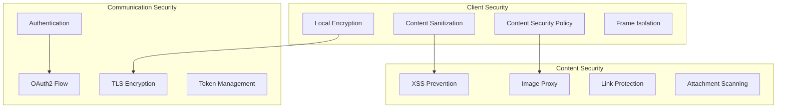

### Email Content Security

[⬆️ Back to Top](#--table-of-contents)

---


**HTML Sanitization**:
- Strip dangerous HTML tags and attributes
- Block external resource loading
- Implement image proxy for tracking protection
- Sanitize CSS styles and inline scripts
- Use Content Security Policy headers

**Attachment Security**:
- Scan attachments for malware
- Block executable file types
- Implement download warnings
- Use sandbox for attachment preview
- Virus scanning integration

## Accessibility Implementation

[⬆️ Back to Top](#--table-of-contents)

---


### Keyboard Navigation

[⬆️ Back to Top](#--table-of-contents)

---


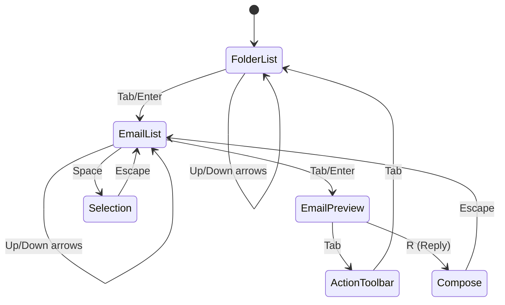

**Accessibility Features**:
- Full keyboard navigation support
- Screen reader announcements for email content
- High contrast mode support
- Focus indicators for all interactive elements
- ARIA labels for complex UI components

### Screen Reader Support

[⬆️ Back to Top](#--table-of-contents)

---


**Email Announcement Pattern**:
```
"Email 1 of 50, from John Doe, subject: Meeting Tomorrow, 
received 2 hours ago, unread, has attachment, 
press Enter to open, Space to select"
```

**Navigation Landmarks**:
- Main navigation region for folders
- Search region for email search
- Content region for email list and preview
- Complementary region for quick actions

## Testing Strategy

[⬆️ Back to Top](#--table-of-contents)

---


### Unit Testing Focus Areas

[⬆️ Back to Top](#--table-of-contents)

---


**Core Algorithm Testing**:
- Virtual list rendering accuracy
- Email threading correctness
- Search ranking algorithms
- Synchronization logic

**Component Testing**:
- Email list interactions
- Drag and drop functionality
- Folder navigation
- Compose window features

### Integration Testing

[⬆️ Back to Top](#--table-of-contents)

---


**Email Flow Testing**:
- Complete email workflow from compose to send
- Multi-folder synchronization
- Search across different email sources
- Label and filter application

**Performance Testing**:
- Large email list rendering
- Search performance with large datasets
- Memory usage patterns
- Network efficiency

### End-to-End Testing

[⬆️ Back to Top](#--table-of-contents)

---


**User Workflow Testing**:
- Email management scenarios
- Cross-device synchronization
- Offline functionality
- Email composition and sending

## Trade-offs and Considerations

[⬆️ Back to Top](#--table-of-contents)

---


### Performance vs Features

[⬆️ Back to Top](#--table-of-contents)

---

- **Real-time sync**: Battery usage vs instant updates
- **Rich preview**: Loading time vs email content richness
- **Search capability**: Index size vs search speed
- **Offline support**: Storage usage vs offline functionality

### Security vs Usability

[⬆️ Back to Top](#--table-of-contents)

---

- **Content blocking**: Security vs email display fidelity
- **Attachment handling**: Safety vs user convenience
- **External images**: Privacy vs email formatting
- **Link protection**: Security vs click-through experience

### Scalability Considerations

[⬆️ Back to Top](#--table-of-contents)

---

- **Email volume**: Performance with large mailboxes
- **Attachment size**: Storage and transfer limits
- **Search index**: Index size vs search capability
- **Synchronization**: Bandwidth usage vs sync frequency

This email client system provides a comprehensive foundation for modern email management with advanced features like intelligent threading, robust search, and efficient synchronization while maintaining high performance and accessibility standards. 