# Email Client UI (Outlook-like)


## 📋 Table of Contents

- [Email Client UI (Outlook-like)](#email-client-ui-outlook-like)
  - [High-Level Design (HLD)](#high-level-design-hld)
    - [System Architecture Overview](#system-architecture-overview)
    - [Email Data Model](#email-data-model)
  - [Low-Level Design (LLD)](#low-level-design-lld)
    - [Email List Virtualization](#email-list-virtualization)
    - [Drag and Drop System](#drag-and-drop-system)
    - [Email Synchronization State Machine](#email-synchronization-state-machine)
  - [Core Algorithms](#core-algorithms)
    - [1. Virtual List Rendering Algorithm](#1-virtual-list-rendering-algorithm)
    - [2. Email Threading Algorithm](#2-email-threading-algorithm)
    - [3. Intelligent Search Algorithm](#3-intelligent-search-algorithm)
    - [4. Label Management System](#4-label-management-system)
    - [5. Folder Synchronization Algorithm](#5-folder-synchronization-algorithm)
  - [Component Architecture](#component-architecture)
    - [Email Client Component Hierarchy](#email-client-component-hierarchy)
    - [State Management Architecture](#state-management-architecture)
  - [Advanced Features](#advanced-features)
    - [Smart Folder System](#smart-folder-system)
    - [Email Composition Features](#email-composition-features)
  - [Performance Optimizations](#performance-optimizations)
    - [Memory Management](#memory-management)
    - [Network Optimization](#network-optimization)
    - [Search Performance](#search-performance)
  - [Security Considerations](#security-considerations)
    - [Data Protection](#data-protection)
    - [Email Content Security](#email-content-security)
  - [Accessibility Implementation](#accessibility-implementation)
    - [Keyboard Navigation](#keyboard-navigation)
    - [Screen Reader Support](#screen-reader-support)
  - [Testing Strategy](#testing-strategy)
    - [Unit Testing Focus Areas](#unit-testing-focus-areas)
    - [Integration Testing](#integration-testing)
    - [End-to-End Testing](#end-to-end-testing)
  - [Trade-offs and Considerations](#trade-offs-and-considerations)
    - [Performance vs Features](#performance-vs-features)
    - [Security vs Usability](#security-vs-usability)
    - [Scalability Considerations](#scalability-considerations)

---

## High-Level Design (HLD)

[⬆️ Back to Top](#-table-of-contents)

---


### System Architecture Overview

[⬆️ Back to Top](#-table-of-contents)

---


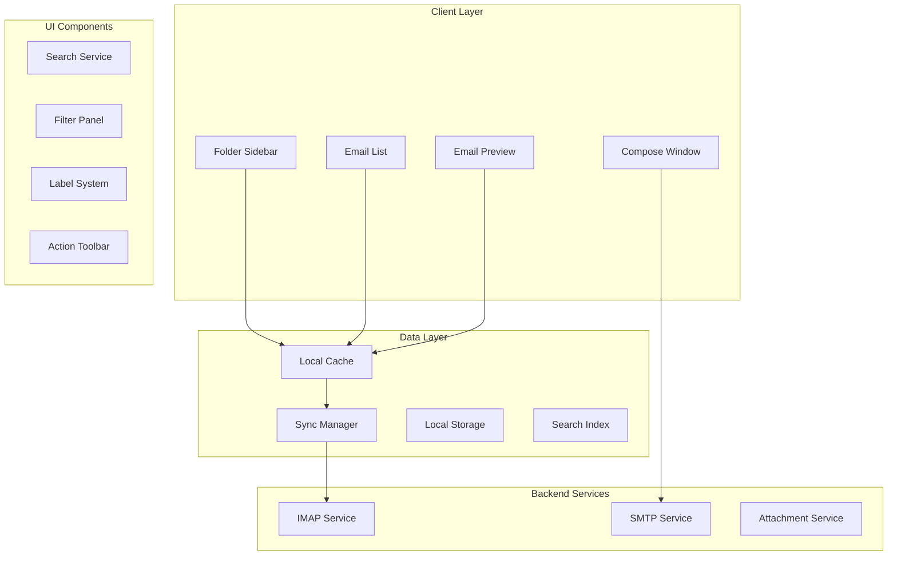

### Email Data Model

[⬆️ Back to Top](#-table-of-contents)

---


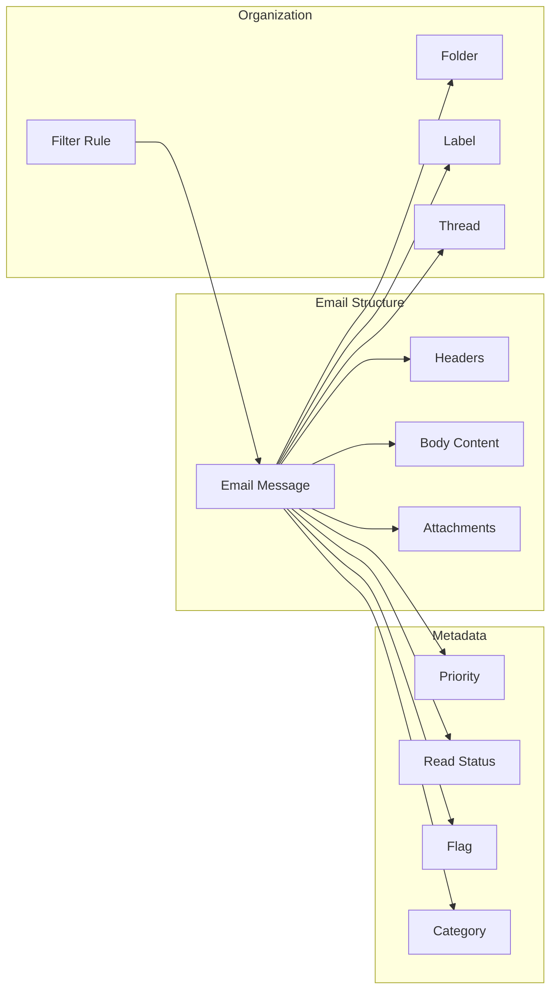

## Low-Level Design (LLD)

[⬆️ Back to Top](#-table-of-contents)

---


### Email List Virtualization

[⬆️ Back to Top](#-table-of-contents)

---


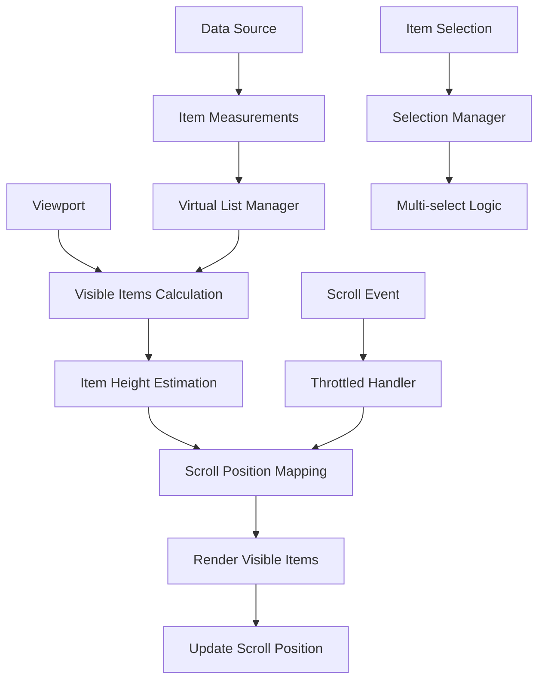

### Drag and Drop System

[⬆️ Back to Top](#-table-of-contents)

---


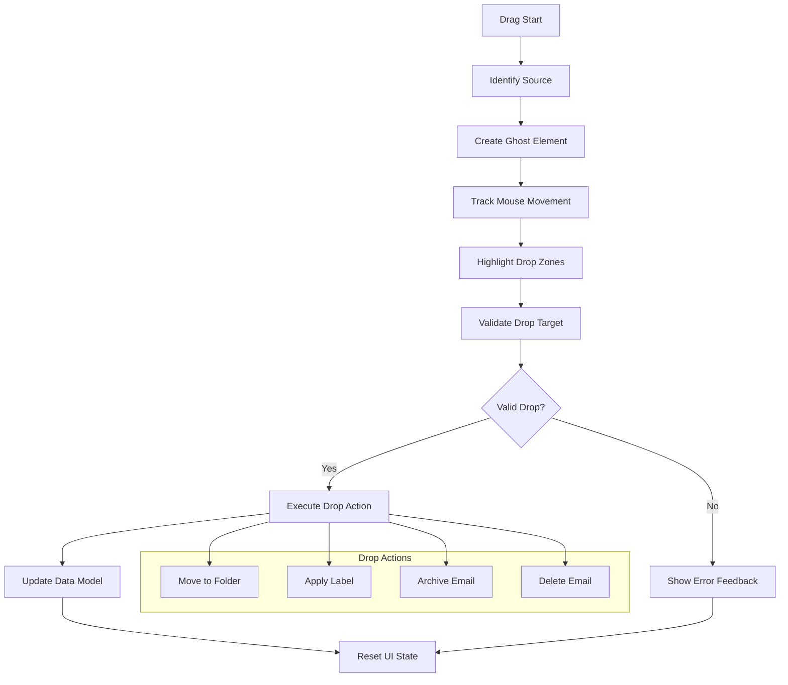

### Email Synchronization State Machine

[⬆️ Back to Top](#-table-of-contents)

---


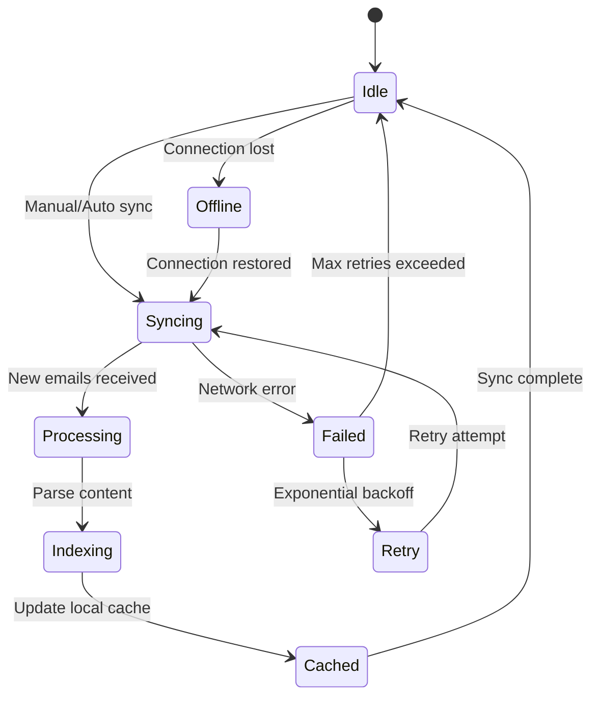

## Core Algorithms

[⬆️ Back to Top](#-table-of-contents)

---


### 1. Virtual List Rendering Algorithm

[⬆️ Back to Top](#-table-of-contents)

---


**Purpose**: Efficiently render large email lists without performance degradation.

**Key Components**:
```
VirtualList = {
  itemHeight: number | function,
  containerHeight: number,
  scrollTop: number,
  totalItems: number,
  overscan: number
}
```

**Rendering Algorithm**:
```
function calculateVisibleRange(virtualList):
  startIndex = Math.floor(scrollTop / itemHeight)
  endIndex = Math.min(
    startIndex + Math.ceil(containerHeight / itemHeight) + overscan,
    totalItems - 1
  )
  
  return {
    start: Math.max(0, startIndex - overscan),
    end: endIndex
  }
```

**Dynamic Height Handling**:
- Measure rendered items to get actual heights
- Cache height measurements for performance
- Recalculate scroll position when heights change
- Implement binary search for position lookup

### 2. Email Threading Algorithm

[⬆️ Back to Top](#-table-of-contents)

---


**Purpose**: Group related emails into conversation threads.

**Threading Strategy**:
```
function buildThreads(emails):
  threads = new Map()
  
  for email in emails:
    threadId = extractThreadId(email)
    if not threadId:
      threadId = generateThreadId(email.subject, email.references)
    
    if not threads.has(threadId):
      threads.set(threadId, new Thread())
    
    thread = threads.get(threadId)
    thread.addEmail(email)
    thread.sortByDate()
  
  return Array.from(threads.values())
```

**Subject Normalization**:
- Remove "Re:", "Fwd:", and language variants
- Normalize whitespace and case
- Handle subject line truncation
- Account for automated subject modifications

### 3. Intelligent Search Algorithm

[⬆️ Back to Top](#-table-of-contents)

---


**Multi-field Search Strategy**:
```
SearchQuery = {
  text: string,
  sender: string,
  subject: string,
  dateRange: DateRange,
  hasAttachment: boolean,
  labels: Label[],
  folder: Folder
}
```

**Ranking Algorithm**:
```
function calculateRelevanceScore(email, query):
  score = 0
  
  // Text content matching
  score += textMatch(email.body, query.text) * 0.4
  score += textMatch(email.subject, query.text) * 0.3
  score += textMatch(email.sender, query.text) * 0.2
  
  // Exact field matches
  if query.sender and email.sender.includes(query.sender):
    score += 0.5
  
  // Recency boost
  daysSince = (now - email.date) / (24 * 60 * 60 * 1000)
  score += Math.max(0, (30 - daysSince) / 30) * 0.1
  
  return score
```

**Full-text Search Optimization**:
- Implement inverted index for fast text search
- Use stemming and tokenization
- Support fuzzy matching for typos
- Cache popular search queries

### 4. Label Management System

[⬆️ Back to Top](#-table-of-contents)

---


**Hierarchical Label Structure**:
```
Label = {
  id: string,
  name: string,
  color: string,
  parent?: Label,
  children: Label[],
  isSystem: boolean
}
```

**Label Application Algorithm**:
```
function applyLabel(emails, label):
  batch = new LabelBatch()
  
  for email in emails:
    if not email.labels.includes(label):
      batch.add(email.id, label.id)
      email.labels.push(label)
      
      // Apply parent labels automatically
      parent = label.parent
      while parent and not email.labels.includes(parent):
        batch.add(email.id, parent.id)
        email.labels.push(parent)
        parent = parent.parent
  
  return batch.execute()
```

### 5. Folder Synchronization Algorithm

[⬆️ Back to Top](#-table-of-contents)

---


**Incremental Sync Strategy**:
```
function syncFolder(folder):
  lastSync = getLastSyncTime(folder)
  
  // Get server state
  serverState = await fetchFolderState(folder, lastSync)
  localState = getLocalFolderState(folder)
  
  // Calculate differences
  diff = calculateDiff(serverState, localState)
  
  // Apply changes
  for change in diff.additions:
    await downloadEmail(change.messageId)
  
  for change in diff.deletions:
    await deleteLocalEmail(change.messageId)
  
  for change in diff.modifications:
    await updateLocalEmail(change.messageId, change.flags)
  
  setLastSyncTime(folder, now)
```

**Conflict Resolution**:
- Server state takes precedence for flags
- Local deletions are preserved unless email exists on server
- Handle concurrent modifications gracefully
- Implement rollback for failed operations

## Component Architecture

[⬆️ Back to Top](#-table-of-contents)

---


### Email Client Component Hierarchy

[⬆️ Back to Top](#-table-of-contents)

---


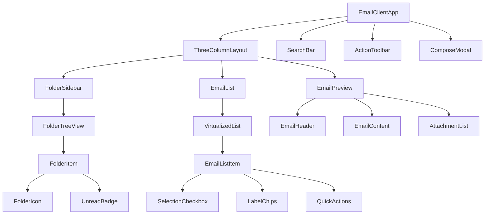

### State Management Architecture

[⬆️ Back to Top](#-table-of-contents)

---


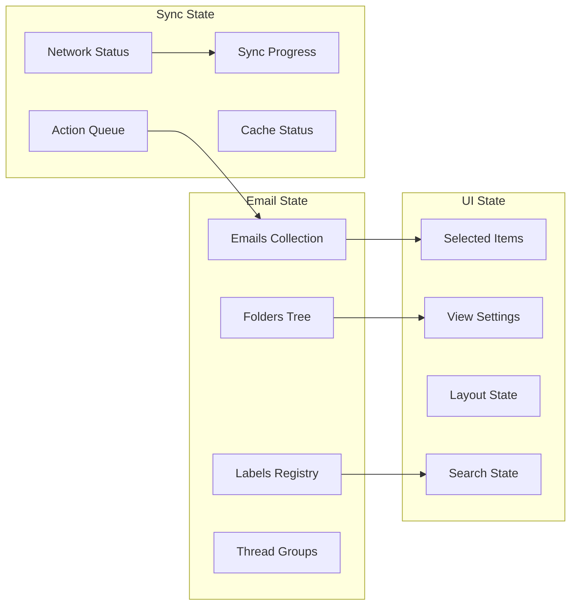

## Advanced Features

[⬆️ Back to Top](#-table-of-contents)

---


### Smart Folder System

[⬆️ Back to Top](#-table-of-contents)

---


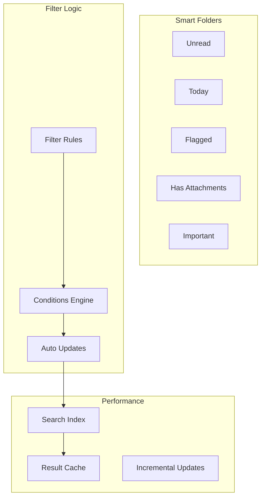

### Email Composition Features

[⬆️ Back to Top](#-table-of-contents)

---


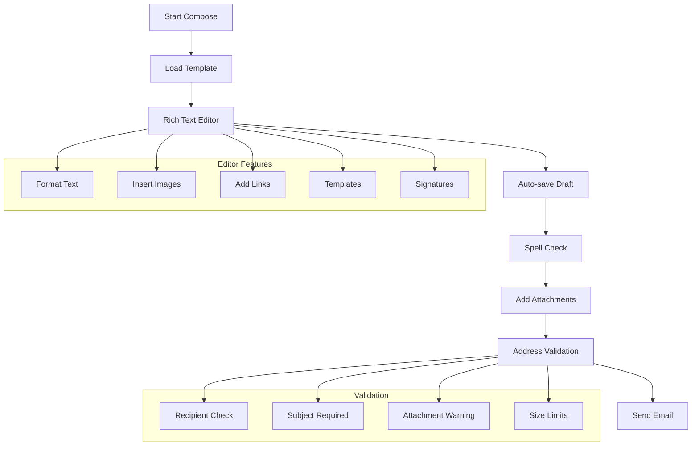

## Performance Optimizations

[⬆️ Back to Top](#-table-of-contents)

---


### Memory Management

[⬆️ Back to Top](#-table-of-contents)

---


**Email Data Lifecycle**:
```
EmailCache = {
  active: LRU<EmailId, Email>,
  headers: Map<EmailId, EmailHeaders>,
  bodies: WeakMap<EmailId, EmailBody>,
  attachments: Map<AttachmentId, Blob>
}
```

**Optimization Strategies**:
- Lazy load email bodies and attachments
- Implement LRU cache for recently accessed emails
- Use weak references for large binary data
- Compress cached email content
- Unload off-screen email data

### Network Optimization

[⬆️ Back to Top](#-table-of-contents)

---


**Batch Operations**:
```
BatchManager = {
  markAsRead: EmailId[],
  markAsUnread: EmailId[],
  delete: EmailId[],
  move: { emailIds: EmailId[], folderId: string }[],
  addLabel: { emailIds: EmailId[], labelId: string }[]
}
```

**Connection Management**:
- Pool IMAP connections efficiently
- Implement exponential backoff for retries
- Use compression for large data transfers
- Prioritize user-initiated actions
- Cache frequently accessed folder structures

### Search Performance

[⬆️ Back to Top](#-table-of-contents)

---


**Indexing Strategy**:
- Build inverted index for email content
- Update index incrementally for new emails
- Use bloom filters for negative lookups
- Implement faceted search for quick filters
- Store index in IndexedDB for persistence

## Security Considerations

[⬆️ Back to Top](#-table-of-contents)

---


### Data Protection

[⬆️ Back to Top](#-table-of-contents)

---


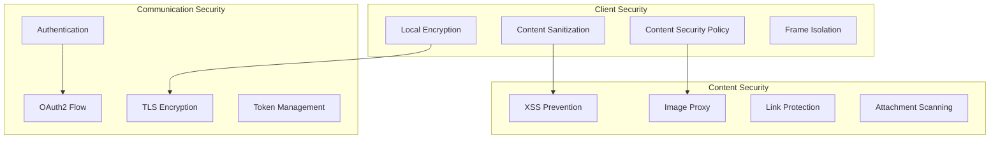

### Email Content Security

[⬆️ Back to Top](#-table-of-contents)

---


**HTML Sanitization**:
- Strip dangerous HTML tags and attributes
- Block external resource loading
- Implement image proxy for tracking protection
- Sanitize CSS styles and inline scripts
- Use Content Security Policy headers

**Attachment Security**:
- Scan attachments for malware
- Block executable file types
- Implement download warnings
- Use sandbox for attachment preview
- Virus scanning integration

## Accessibility Implementation

[⬆️ Back to Top](#-table-of-contents)

---


### Keyboard Navigation

[⬆️ Back to Top](#-table-of-contents)

---


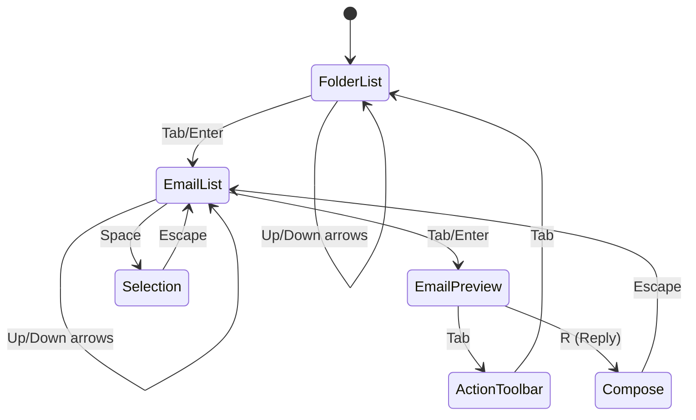

**Accessibility Features**:
- Full keyboard navigation support
- Screen reader announcements for email content
- High contrast mode support
- Focus indicators for all interactive elements
- ARIA labels for complex UI components

### Screen Reader Support

[⬆️ Back to Top](#-table-of-contents)

---


**Email Announcement Pattern**:
```
"Email 1 of 50, from John Doe, subject: Meeting Tomorrow, 
received 2 hours ago, unread, has attachment, 
press Enter to open, Space to select"
```

**Navigation Landmarks**:
- Main navigation region for folders
- Search region for email search
- Content region for email list and preview
- Complementary region for quick actions

## Testing Strategy

[⬆️ Back to Top](#-table-of-contents)

---


### Unit Testing Focus Areas

[⬆️ Back to Top](#-table-of-contents)

---


**Core Algorithm Testing**:
- Virtual list rendering accuracy
- Email threading correctness
- Search ranking algorithms
- Synchronization logic

**Component Testing**:
- Email list interactions
- Drag and drop functionality
- Folder navigation
- Compose window features

### Integration Testing

[⬆️ Back to Top](#-table-of-contents)

---


**Email Flow Testing**:
- Complete email workflow from compose to send
- Multi-folder synchronization
- Search across different email sources
- Label and filter application

**Performance Testing**:
- Large email list rendering
- Search performance with large datasets
- Memory usage patterns
- Network efficiency

### End-to-End Testing

[⬆️ Back to Top](#-table-of-contents)

---


**User Workflow Testing**:
- Email management scenarios
- Cross-device synchronization
- Offline functionality
- Email composition and sending

## Trade-offs and Considerations

[⬆️ Back to Top](#-table-of-contents)

---


### Performance vs Features

[⬆️ Back to Top](#-table-of-contents)

---

- **Real-time sync**: Battery usage vs instant updates
- **Rich preview**: Loading time vs email content richness
- **Search capability**: Index size vs search speed
- **Offline support**: Storage usage vs offline functionality

### Security vs Usability

[⬆️ Back to Top](#-table-of-contents)

---

- **Content blocking**: Security vs email display fidelity
- **Attachment handling**: Safety vs user convenience
- **External images**: Privacy vs email formatting
- **Link protection**: Security vs click-through experience

### Scalability Considerations

[⬆️ Back to Top](#-table-of-contents)

---

- **Email volume**: Performance with large mailboxes
- **Attachment size**: Storage and transfer limits
- **Search index**: Index size vs search capability
- **Synchronization**: Bandwidth usage vs sync frequency

This email client system provides a comprehensive foundation for modern email management with advanced features like intelligent threading, robust search, and efficient synchronization while maintaining high performance and accessibility standards. 