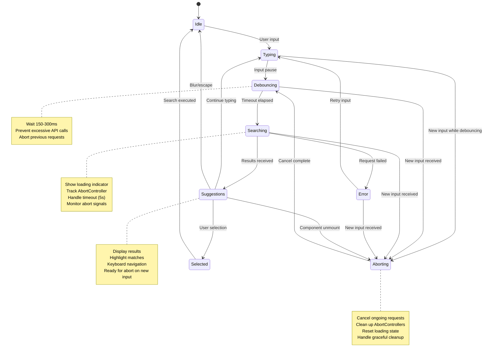
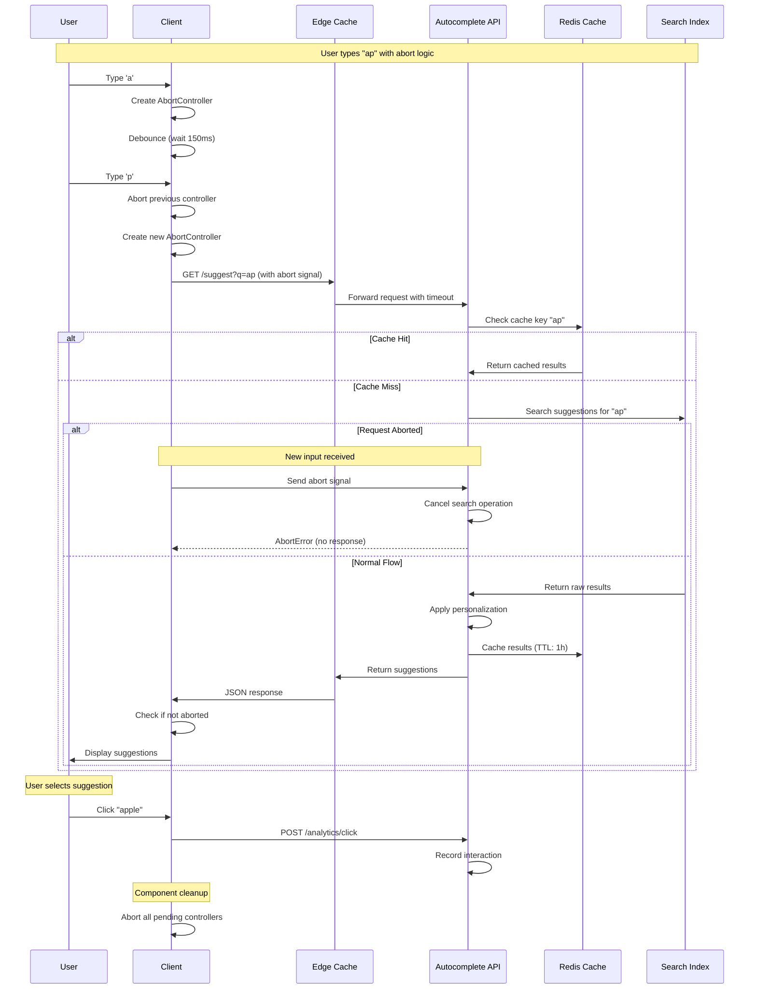
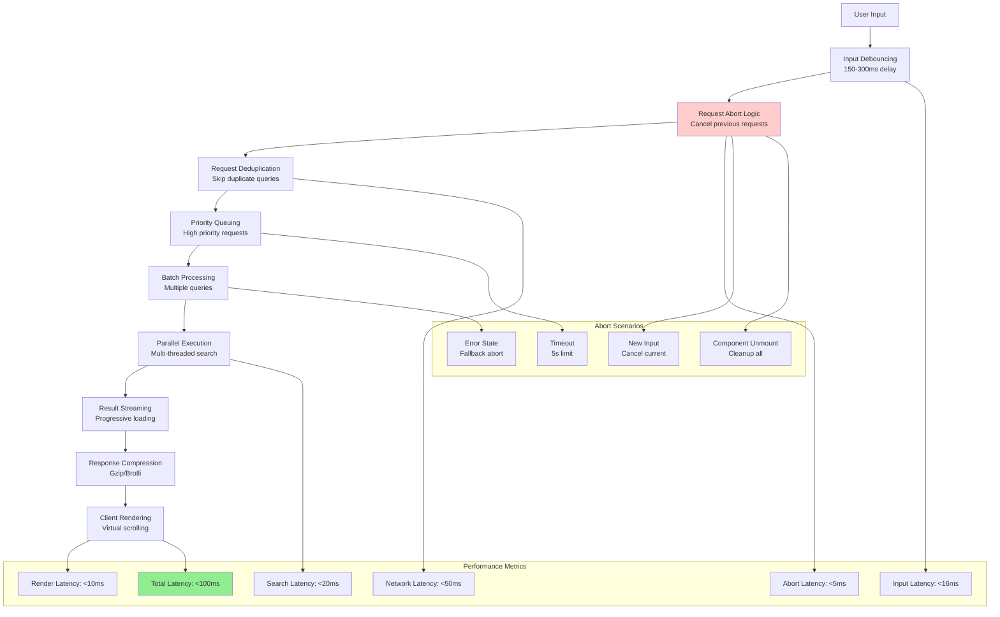
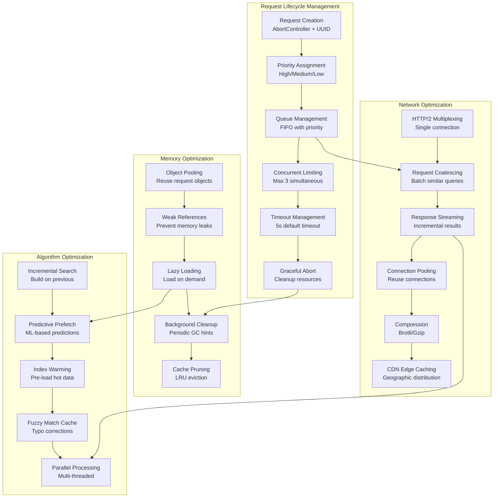
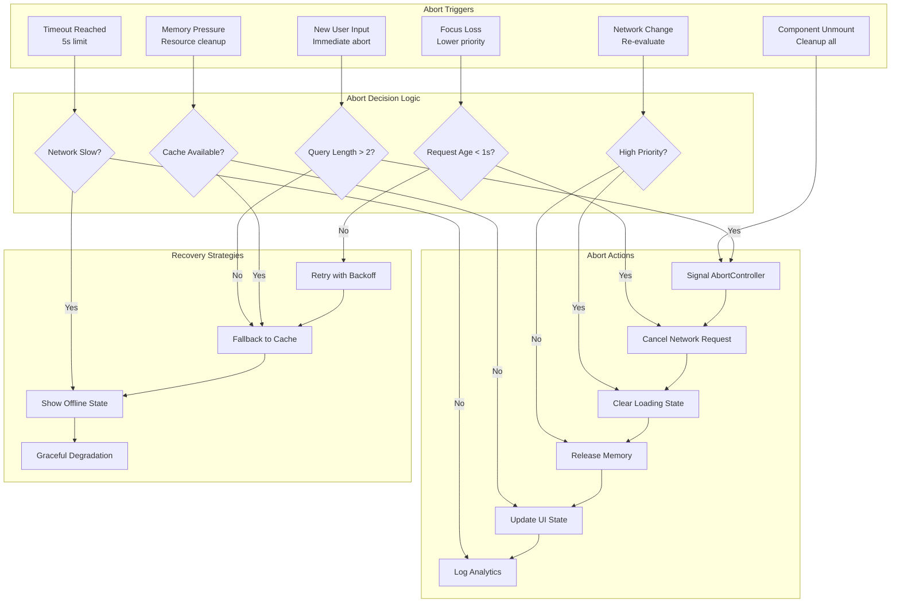
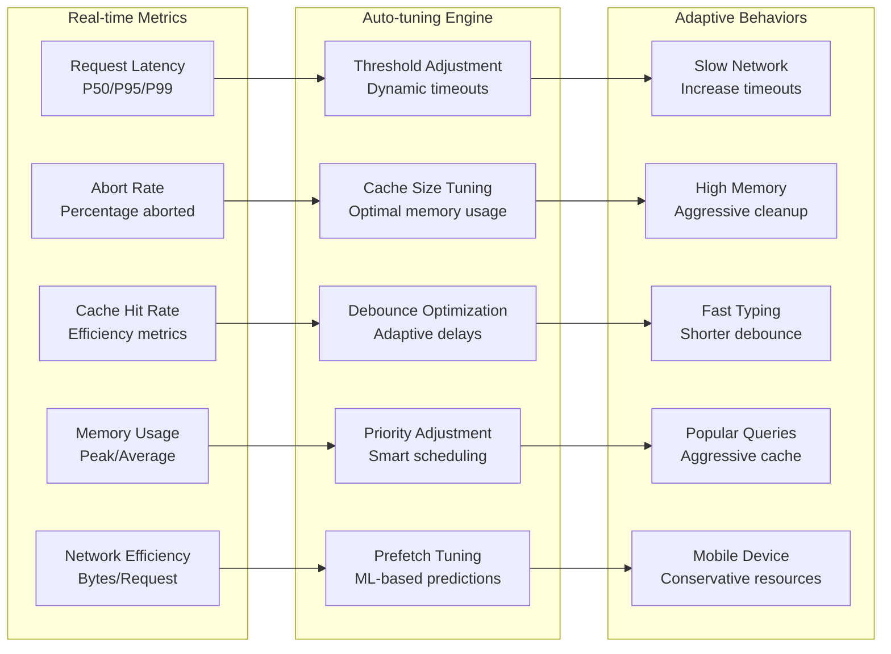

# Implement a Search Bar with Autocomplete/Typeahead Suggestions

https://www.greatfrontend.com/questions/system-design/autocomplete?format=system-design

## 📋 Table of Contents

- [Implement a Search Bar with Autocomplete/Typeahead Suggestions](#implement-a-search-bar-with-autocompletetypeahead-suggestions)
  - [Table of Contents](#table-of-contents)
  - [Clarify the Problem and Requirements](#clarify-the-problem-and-requirements)
    - [Problem Understanding](#problem-understanding)
    - [Functional Requirements](#functional-requirements)
    - [Non-Functional Requirements](#non-functional-requirements)
    - [Key Assumptions](#key-assumptions)
  - [High-Level Architecture](#high-level-architecture)
    - [Global System Architecture](#global-system-architecture)
    - [Autocomplete Pipeline Architecture](#autocomplete-pipeline-architecture)
  - [UI/UX and Component Structure](#uiux-and-component-structure)
    - [Frontend Component Architecture](#frontend-component-architecture)
    - [Search State Management](#search-state-management)
    - [Responsive Search Experience](#responsive-search-experience)
  - [Real-Time Sync, Data Modeling & APIs](#real-time-sync-data-modeling-apis)
    - [Autocomplete Algorithm Implementation](#autocomplete-algorithm-implementation)
      - [Trie-based Suggestion Engine](#trie-based-suggestion-engine)
      - [Fuzzy Matching Algorithm](#fuzzy-matching-algorithm)
    - [Personalization Algorithm](#personalization-algorithm)
      - [User Context Integration](#user-context-integration)
    - [Data Models](#data-models)
      - [Suggestion Index Schema](#suggestion-index-schema)
      - [Search Analytics Schema](#search-analytics-schema)
    - [API Design Pattern](#api-design-pattern)
      - [Real-time Autocomplete Flow](#real-time-autocomplete-flow)
      - [Advanced Search API](#advanced-search-api)
  - [Performance and Scalability](#performance-and-scalability)
    - [Caching Strategy](#caching-strategy)
      - [Multi-Level Caching Architecture](#multi-level-caching-architecture)
    - [Index Optimization Strategy](#index-optimization-strategy)
      - [Prefix Tree Optimization](#prefix-tree-optimization)
    - [Database Scaling](#database-scaling)
      - [Search Index Sharding Strategy](#search-index-sharding-strategy)
    - [Performance Optimization Techniques](#performance-optimization-techniques)
      - [Request Optimization Pipeline](#request-optimization-pipeline)
      - [Advanced Performance Optimizations & Request Management](#advanced-performance-optimizations--request-management)
      - [Intelligent Request Abort Strategies](#intelligent-request-abort-strategies)
      - [Performance Monitoring & Auto-tuning](#performance-monitoring--auto-tuning)
  - [Security and Privacy](#security-and-privacy)
    - [Query Security Framework](#query-security-framework)
      - [Input Validation and Sanitization](#input-validation-and-sanitization)
    - [Privacy-Preserving Search](#privacy-preserving-search)
      - [Anonymous Search Implementation](#anonymous-search-implementation)
  - [Testing, Monitoring, and Maintainability](#testing-monitoring-and-maintainability)
    - [Testing Strategy](#testing-strategy)
      - [Comprehensive Testing Framework](#comprehensive-testing-framework)
    - [Monitoring and Analytics](#monitoring-and-analytics)
      - [Real-time Search Metrics](#real-time-search-metrics)
  - [Trade-offs, Deep Dives, and Extensions](#trade-offs-deep-dives-and-extensions)
    - [Search Algorithm Trade-offs](#search-algorithm-trade-offs)
    - [Personalization vs Privacy Trade-offs](#personalization-vs-privacy-trade-offs)
    - [Advanced Search Features](#advanced-search-features)
      - [Semantic Search Implementation](#semantic-search-implementation)
      - [Voice Search Integration](#voice-search-integration)
    - [Future Extensions](#future-extensions)
      - [Next-Generation Search Features](#next-generation-search-features)

---

## Table of Contents
1. [Clarify the Problem and Requirements](#clarify-the-problem-and-requirements)
2. [High-Level Architecture](#high-level-architecture)
3. [UI/UX and Component Structure](#uiux-and-component-structure)
4. [Real-Time Sync, Data Modeling & APIs](#real-time-sync-data-modeling--apis)
5. [Performance and Scalability](#performance-and-scalability)
6. [Security and Privacy](#security-and-privacy)
7. [Testing, Monitoring, and Maintainability](#testing-monitoring-and-maintainability)
8. [Trade-offs, Deep Dives, and Extensions](#trade-offs-deep-dives-and-extensions)

---

## Clarify the Problem and Requirements

[⬆️ Back to Top](#--table-of-contents)

---


### Problem Understanding

[⬆️ Back to Top](#--table-of-contents)

---

Design a search autocomplete/typeahead system that provides instant, relevant suggestions as users type, similar to Google Search, Amazon product search, or social media user/content search. The system must handle millions of queries with sub-100ms response times while providing personalized and contextually relevant suggestions.

### Functional Requirements

[⬆️ Back to Top](#--table-of-contents)

---

- **Real-time Suggestions**: Instant results as user types (**debounced**)
- **Multi-type Search**: Users, products, content, locations, hashtags
- **Personalized Results**: Based on user history and preferences
- **Fuzzy Matching**: Handle typos and partial matches
- **Rich Suggestions**: Include thumbnails, descriptions, metadata
- **Search History**: Personal and popular search suggestions
- **Filtering & Faceting**: Category-based filtering, advanced search
- **Cross-platform**: Consistent experience across web/mobile

### Non-Functional Requirements

[⬆️ Back to Top](#--table-of-contents)

---

- **Performance**: <50ms autocomplete response time, <100ms search results
- **Scalability**: 100M+ users, 1B+ queries/day, 10M+ suggestions
- **Availability**: 99.9% uptime with graceful degradation
- **Accuracy**: >95% relevance for top suggestions
- **Responsiveness**: Real-time UI updates, smooth animations
- **Global**: Multi-language support, regional customization

### Key Assumptions

[⬆️ Back to Top](#--table-of-contents)

---

- Average query length: 3-15 characters
- Peak concurrent searches: 1M+ globally
- Suggestion sources: 100M+ indexed entities
- User sessions: 50 searches per session average
- Response time SLA: 50ms for autocomplete, 200ms for full search
- Cache hit rate target: >90% for popular queries

---

## High-Level Architecture

[⬆️ Back to Top](#--table-of-contents)

---


### Global System Architecture

[⬆️ Back to Top](#--table-of-contents)

---


### Autocomplete Pipeline Architecture

[⬆️ Back to Top](#--table-of-contents)

---


---

## UI/UX and Component Structure

[⬆️ Back to Top](#--table-of-contents)

---


### Frontend Component Architecture

[⬆️ Back to Top](#--table-of-contents)

---


**Explanations for Subcomponents:**

*   **Search Container**: The top-level component that encapsulates the entire search functionality.
*   **Search Context Provider**: Manages and provides search-related state and functions to its children components.
*   **Keyboard Handler**: Manages keyboard interactions for navigation and selection within the search interface.
*   **Analytics Tracker**: Records user search interactions and events for performance and relevance analysis.
*   **Search Input Field**: The primary input area where users type their search queries.
*   **Voice Input Button**: Activates speech-to-text functionality for voice-based search queries.
*   **Camera Search Button**: Initiates image recognition for searching based on visual input.
*   **Clear Button**: Allows users to quickly clear the current search query from the input field.
*   **Loading Indicator**: Provides visual feedback to the user when search suggestions are being fetched.
*   **Suggestions Dropdown**: Displays the list of real-time search suggestions to the user.
*   **Suggestion Item**: Represents an individual suggestion within the dropdown, often interactive.
*   **Category Header**: Organizes suggestions into logical groups (e.g., "Users," "Products").
*   **No Results Message**: Informs the user when no suggestions are found for their current query.
*   **Error State**: Displays a message when an error occurs during the suggestion fetching process.
*   **Search Filters**: Provides options to refine search results based on categories, dates, or other criteria.
*   **Recent Searches**: Displays a list of the user's previously entered search queries for quick access.
*   **Trending Searches**: Shows popular or trending search queries to help users discover content.
*   **Quick Actions**: Offers shortcuts for common search-related tasks or popular queries.
*   **Keyboard Shortcuts**: Informs users about keyboard commands for efficient navigation and interaction.
*   **Debounce Service**: Delays search requests until the user pauses typing to optimize API calls.
*   **Cache Service**: Stores and retrieves previous search results to improve performance and reduce server load.
*   **Prefetch Service**: Proactively fetches potential search results in anticipation of user input.
*   **Suggestion Service**: The backend service responsible for generating and ranking search suggestions.
*   **History Service**: Manages and stores the user's search history for personalization and recall.

#### React Component Implementation

[⬆️ Back to Top](#--table-of-contents)

---

**SearchContainer.jsx**
```jsx
import React, { useState, useCallback, useEffect, useRef } from 'react';
import { SearchProvider } from './SearchContext';
import SearchInput from './SearchInput';
import SuggestionsDropdown from './SuggestionsDropdown';
import SearchFilters from './SearchFilters';
import RecentSearches from './RecentSearches';
import { useDebounce } from './hooks/useDebounce';
import { useSearchCache } from './hooks/useSearchCache';
import { useAbortController } from './hooks/useAbortController';

**SearchContainer.jsx**

**What this code does:**
• **Main Purpose**: Search input with debounced autocomplete and intelligent caching
• **Performance**: Implements request cancellation and result caching for efficiency
• **Key Functions**:
  - `handleSearch()` - Debounced search with cache checking and abort controller
  - `getCachedResult()` - Retrieves previously cached search results
  - `setCachedResult()` - Stores search results for future use
  - `abortPending()` - Cancels in-flight requests to prevent race conditions
  - `createController()` - Creates AbortController for request cancellation

const SearchContainer = () => {
  const [query, setQuery] = useState('');
  const [suggestions, setSuggestions] = useState([]);
  const [isLoading, setIsLoading] = useState(false);
  const [showDropdown, setShowDropdown] = useState(false);
  
  // Use custom hooks
  const debouncedQuery = useDebounce(query, 300);
  const { getCachedResult, setCachedResult } = useSearchCache();
  const { createController, abortPending } = useAbortController();

  const handleSearch = useCallback(async (searchQuery) => {
    // Abort any pending requests
    abortPending();
    
    if (!searchQuery.trim()) {
      setSuggestions([]);
      setShowDropdown(false);
      return;
    }

    // Check cache first
    const cachedResult = getCachedResult(searchQuery);
    if (cachedResult) {
      setSuggestions(cachedResult.data);
      setShowDropdown(true);
      return;
    }

    setIsLoading(true);
    const controller = createController();
    
    try {
      const results = await searchService.getSuggestions(searchQuery, {
        signal: controller.signal,
        timeout: 5000, // 5 second timeout
        priority: 'high'
      });
      
      // Check if request was aborted
      if (controller.signal.aborted) {
        return;
      }
      
      setSuggestions(results);
      setShowDropdown(true);
      
      // Cache the results
      setCachedResult(searchQuery, results);
    } catch (error) {
      if (error.name === 'AbortError') {
        console.log('Search request was aborted');
        return;
      }
      console.error('Search failed:', error);
      setSuggestions([]);
    } finally {
      setIsLoading(false);
    }
  }, [getCachedResult, setCachedResult, createController, abortPending]);

  // Effect to handle debounced search
  useEffect(() => {
    handleSearch(debouncedQuery);
  }, [debouncedQuery, handleSearch]);

  // Cleanup on unmount
  useEffect(() => {
    return () => {
      abortPending();
    };
  }, [abortPending]);

  return (
    <SearchProvider value={{ query, setQuery, suggestions, isLoading }}>
      <div className="search-container">
        <SearchInput
          onFocus={() => setShowDropdown(true)}
          onBlur={() => setTimeout(() => setShowDropdown(false), 150)}
        />
        {showDropdown && (
          <SuggestionsDropdown
            suggestions={suggestions}
            onSelect={(item) => {
              setQuery(item.text);
              setShowDropdown(false);
            }}
          />
        )}
        <SearchFilters />
        <RecentSearches />
      </div>
    </SearchProvider>
  );
};

export default SearchContainer;
```

**SearchInput.jsx**
```jsx
import React, { useContext, useRef } from 'react';
import { SearchContext } from './SearchContext';
import VoiceInput from './VoiceInput';
import ClearButton from './ClearButton';

const SearchInput = ({ onFocus, onBlur }) => {
  const { query, setQuery, isLoading } = useContext(SearchContext);
  const inputRef = useRef(null);

  const handleInputChange = (e) => {
    const value = e.target.value;
    setQuery(value);
    // No need to call onSearch here anymore - debounced search happens in parent
  };

  const handleKeyDown = (e) => {
    if (e.key === 'Escape') {
      inputRef.current.blur();
    }
  };

  return (
    <div className="search-input-container">
      <input
        ref={inputRef}
        type="text"
        value={query}
        onChange={handleInputChange}
        onFocus={onFocus}
        onBlur={onBlur}
        onKeyDown={handleKeyDown}
        placeholder="Search..."
        className="search-input"
        autoComplete="off"
      />
      {isLoading && <div className="loading-indicator">Loading...</div>}
      <VoiceInput onVoiceResult={setQuery} />
      <ClearButton onClear={() => setQuery('')} />
    </div>
  );
};

export default SearchInput;
```

**SuggestionsDropdown.jsx**
```jsx
import React, { useState, useEffect } from 'react';
import SuggestionItem from './SuggestionItem';
import SuggestionCategory from './SuggestionCategory';

const SuggestionsDropdown = ({ suggestions, onSelect }) => {
  const [selectedIndex, setSelectedIndex] = useState(-1);

  useEffect(() => {
    const handleKeyDown = (e) => {
      if (e.key === 'ArrowDown') {
        e.preventDefault();
        setSelectedIndex(prev => 
          prev < suggestions.length - 1 ? prev + 1 : prev
        );
      } else if (e.key === 'ArrowUp') {
        e.preventDefault();
        setSelectedIndex(prev => prev > 0 ? prev - 1 : prev);
      } else if (e.key === 'Enter' && selectedIndex >= 0) {
        onSelect(suggestions[selectedIndex]);
      }
    };

    document.addEventListener('keydown', handleKeyDown);
    return () => document.removeEventListener('keydown', handleKeyDown);
  }, [suggestions, selectedIndex, onSelect]);

  const groupedSuggestions = suggestions.reduce((acc, item) => {
    const category = item.category || 'general';
    if (!acc[category]) acc[category] = [];
    acc[category].push(item);
    return acc;
  }, {});

  return (
    <div className="suggestions-dropdown">
      {Object.entries(groupedSuggestions).map(([category, items]) => (
        <div key={category} className="suggestion-group">
          <SuggestionCategory title={category} />
          {items.map((item, index) => (
            <SuggestionItem
              key={item.id}
              suggestion={item}
              isSelected={selectedIndex === index}
              onClick={() => onSelect(item)}
              onMouseEnter={() => setSelectedIndex(index)}
            />
          ))}
        </div>
      ))}
      {suggestions.length === 0 && (
        <div className="no-results">No suggestions found</div>
      )}
    </div>
  );
};

export default SuggestionsDropdown;
```

**Custom Hooks**
```jsx
// hooks/useDebounce.js
import { useState, useEffect } from 'react';

export const useDebounce = (value, delay) => {
  const [debouncedValue, setDebouncedValue] = useState(value);

  useEffect(() => {
    const handler = setTimeout(() => {
      setDebouncedValue(value);
    }, delay);

    return () => {
      clearTimeout(handler);
    };
  }, [value, delay]);

  return debouncedValue;
};

// hooks/useSearchCache.js
import { useState, useCallback } from 'react';

export const useSearchCache = (maxCacheSize = 50, cacheExpiryTime = 5 * 60 * 1000) => {
  const [cache, setCache] = useState(new Map());

  const getCachedResult = useCallback((query) => {
    const cached = cache.get(query);
    if (!cached) return null;
    
    // Check if cache entry has expired
    if (Date.now() - cached.timestamp > cacheExpiryTime) {
      setCache(prev => {
        const newCache = new Map(prev);
        newCache.delete(query);
        return newCache;
      });
      return null;
    }
    
    return cached;
  }, [cache, cacheExpiryTime]);

  const setCachedResult = useCallback((query, result) => {
    setCache(prev => {
      const newCache = new Map(prev);
      
      // If cache is at max size, remove oldest entry
      if (newCache.size >= maxCacheSize) {
        const firstKey = newCache.keys().next().value;
        newCache.delete(firstKey);
      }
      
      newCache.set(query, {
        data: result,
        timestamp: Date.now()
      });
      
      return newCache;
    });
  }, [maxCacheSize]);

  const clearCache = useCallback(() => {
    setCache(new Map());
  }, []);

  return { getCachedResult, setCachedResult, clearCache };
};

// hooks/useAbortController.js
import { useRef, useCallback } from 'react';

export const useAbortController = () => {
  const controllers = useRef(new Set());

  const createController = useCallback(() => {
    const controller = new AbortController();
    controllers.current.add(controller);
    
    // Auto-remove controller when signal is aborted
    controller.signal.addEventListener('abort', () => {
      controllers.current.delete(controller);
    });
    
    return controller;
  }, []);

  const abortPending = useCallback(() => {
    controllers.current.forEach(controller => {
      if (!controller.signal.aborted) {
        controller.abort('New request initiated');
      }
    });
    controllers.current.clear();
  }, []);

  const abortAll = useCallback(() => {
    controllers.current.forEach(controller => {
      if (!controller.signal.aborted) {
        controller.abort('Component cleanup');
      }
    });
    controllers.current.clear();
  }, []);

  return { createController, abortPending, abortAll };
};
```

**How the hooks are integrated:**

1. **useDebounce Hook**: 
   - Automatically delays the search execution by 300ms after the user stops typing
   - Prevents excessive API calls while the user is actively typing
   - Returns the debounced value which triggers the search in useEffect

2. **useSearchCache Hook**:
   - Stores search results in memory to avoid duplicate API calls
   - Includes cache expiry (5 minutes) and size limit (50 entries)
   - Automatically removes oldest entries when cache is full
   - Provides cache clearing functionality for memory management

3. **Integration Flow**:
   - User types → query state updates → useDebounce delays the value → useEffect triggers → check cache → if miss, fetch from API → store in cache → display results

### Search State Management

[⬆️ Back to Top](#--table-of-contents)

---




### Responsive Search Experience

[⬆️ Back to Top](#--table-of-contents)

---


---

## Real-Time Sync, Data Modeling & APIs

[⬆️ Back to Top](#--table-of-contents)

---


### Autocomplete Algorithm Implementation

[⬆️ Back to Top](#--table-of-contents)

---


#### Trie-based Suggestion Engine

[⬆️ Back to Top](#--table-of-contents)

---


#### Fuzzy Matching Algorithm

[⬆️ Back to Top](#--table-of-contents)

---




```mermaid
graph TD
    A[User Query: 'appel'] --> B[Fuzzy Matching Engine]
    B --> C[Edit Distance Calculation]
    C --> D[Levenshtein Distance ≤ 2]
    D --> E[Candidate Generation]
    E --> F[Phonetic Matching<br/>Soundex/Metaphone]
    F --> G[Similarity Scoring]
    G --> H[Ranking & Filtering]
    H --> I[Top Suggestions:<br/>apple, appeal, applet]
    
    subgraph "Edit Operations"
        INSERT[Insertion: appel → apple]
        DELETE[Deletion: appell → appel]
        SUBSTITUTE[Substitution: appel → apple]
        TRANSPOSE[Transposition: appel → appe]
    end
    
    C --> INSERT
    C --> DELETE
    C --> SUBSTITUTE
    C --> TRANSPOSE
    
    style G fill:#ffcccc
    style H fill:#ccffcc
```

### Personalization Algorithm

[⬆️ Back to Top](#--table-of-contents)

---


#### User Context Integration

[⬆️ Back to Top](#--table-of-contents)

---


### Data Models

[⬆️ Back to Top](#--table-of-contents)

---


#### Suggestion Index Schema

[⬆️ Back to Top](#--table-of-contents)

---

```
SuggestionIndex {
  id: UUID
  text: String
  normalized_text: String
  category: 'user' | 'product' | 'content' | 'location'
  metadata: {
    popularity_score: Float
    quality_score: Float
    recency_score: Float
    language: String
    region: String
  }
  prefixes: [String]
  synonyms: [String]
  boost_factors: {
    trending: Float
    personalized: Float
    promotional: Float
  }
}
```

#### Search Analytics Schema

[⬆️ Back to Top](#--table-of-contents)

---

```
SearchAnalytics {
  id: UUID
  user_id?: UUID
  session_id: String
  query: String
  suggestions_shown: [String]
  suggestion_selected?: String
  timestamp: DateTime
  metadata: {
    response_time: Integer
    device_type: String
    location: GeoPoint
    source: String
    result_count: Integer
  }
}
```

### API Design Pattern

[⬆️ Back to Top](#--table-of-contents)

---


#### Real-time Autocomplete Flow

[⬆️ Back to Top](#--table-of-contents)

---




#### Advanced Search API

[⬆️ Back to Top](#--table-of-contents)

---


### TypeScript Interfaces & Component Props

[⬆️ Back to Top](#--table-of-contents)

---

#### Core Data Interfaces

```typescript
interface SearchSuggestion {
  id: string;
  text: string;
  type: 'query' | 'product' | 'category' | 'brand' | 'user';
  score: number;
  category?: string;
  metadata: SuggestionMetadata;
  highlighted: string;
  analytics: AnalyticsData;
}

interface SuggestionMetadata {
  popularity: number;
  frequency: number;
  recency: number;
  relevance: number;
  userPersonalization?: number;
  imageUrl?: string;
  description?: string;
}

interface SearchQuery {
  text: string;
  filters: SearchFilter[];
  location?: GeoLocation;
  timestamp: Date;
  userId?: string;
  sessionId: string;
  source: 'keyboard' | 'voice' | 'suggestion';
}

interface AutocompleteState {
  query: string;
  suggestions: SearchSuggestion[];
  isLoading: boolean;
  selectedIndex: number;
  showDropdown: boolean;
  hasError: boolean;
  searchHistory: string[];
}

interface SearchFilter {
  field: string;
  value: string | number | boolean;
  operator: 'equals' | 'contains' | 'range' | 'in';
  boost?: number;
}
```

#### Component Props Interfaces

```typescript
interface SearchAutocompleteProps {
  placeholder?: string;
  onSearch: (query: string, filters?: SearchFilter[]) => void;
  onSuggestionSelect: (suggestion: SearchSuggestion) => void;
  maxSuggestions?: number;
  enableVoiceSearch?: boolean;
  enableImageSearch?: boolean;
  debounceMs?: number;
  showHistory?: boolean;
  customFilters?: SearchFilter[];
}

interface SuggestionListProps {
  suggestions: SearchSuggestion[];
  selectedIndex: number;
  onSuggestionClick: (suggestion: SearchSuggestion, index: number) => void;
  onSuggestionHover: (index: number) => void;
  highlightQuery: string;
  maxVisible?: number;
  groupByType?: boolean;
}

interface SearchInputProps {
  value: string;
  onChange: (value: string) => void;
  onFocus: () => void;
  onBlur: () => void;
  onKeyDown: (event: KeyboardEvent) => void;
  onVoiceSearch?: () => void;
  loading?: boolean;
  placeholder?: string;
  disabled?: boolean;
}

interface SearchHistoryProps {
  history: string[];
  onHistorySelect: (query: string) => void;
  onHistoryClear: () => void;
  onHistoryRemove: (query: string) => void;
  maxItems?: number;
  showClearAll?: boolean;
}
```

### API Reference

[⬆️ Back to Top](#--table-of-contents)

---

#### Search Operations
- `GET /api/search/suggestions` - Get autocomplete suggestions with personalization
- `POST /api/search/query` - Execute full search with advanced filtering
- `GET /api/search/trending` - Get trending search terms and popular queries
- `POST /api/search/voice` - Process voice search input with speech recognition
- `GET /api/search/history` - Get user's search history with privacy controls

#### Suggestion Management
- `GET /api/suggestions/popular` - Get most popular search suggestions
- `POST /api/suggestions/track` - Track suggestion selection for analytics
- `GET /api/suggestions/personalized` - Get ML-powered personalized suggestions
- `POST /api/suggestions/feedback` - Submit suggestion relevance feedback
- `DELETE /api/suggestions/cache` - Clear suggestion cache for fresh results

#### Analytics & Insights
- `POST /api/analytics/search-event` - Track search interactions and user behavior
- `GET /api/analytics/search-trends` - Get search trend analysis and insights
- `POST /api/analytics/conversion` - Track search-to-conversion metrics
- `GET /api/analytics/performance` - Get search performance and latency metrics
- `POST /api/analytics/ab-test` - Track A/B test results for search features

#### Personalization
- `GET /api/personalization/profile` - Get user's search personalization profile
- `PUT /api/personalization/preferences` - Update search preferences and filters
- `POST /api/personalization/learn` - Machine learning from user search patterns
- `GET /api/personalization/categories` - Get user's preferred search categories
- `DELETE /api/personalization/reset` - Reset personalization data

#### Search Configuration
- `GET /api/config/search-settings` - Get search configuration and parameters
- `PUT /api/config/suggestion-weights` - Update suggestion ranking weights
- `GET /api/config/filters` - Get available search filters and facets
- `POST /api/config/synonyms` - Manage search term synonyms and aliases
- `GET /api/config/stop-words` - Get language-specific stop words list

#### Cache Management
- `POST /api/cache/warm` - Pre-warm search cache with popular queries
- `DELETE /api/cache/invalidate` - Invalidate cache for specific search patterns
- `GET /api/cache/stats` - Get cache hit rates and performance statistics
- `POST /api/cache/refresh` - Refresh cached suggestions and search indices
- `GET /api/cache/health` - Check cache health and performance metrics

---

## Performance and Scalability

[⬆️ Back to Top](#--table-of-contents)

---


### Caching Strategy

[⬆️ Back to Top](#--table-of-contents)

---


#### Multi-Level Caching Architecture

[⬆️ Back to Top](#--table-of-contents)

---


### Index Optimization Strategy

[⬆️ Back to Top](#--table-of-contents)

---


#### Prefix Tree Optimization

[⬆️ Back to Top](#--table-of-contents)

---


### Database Scaling

[⬆️ Back to Top](#--table-of-contents)

---


#### Search Index Sharding Strategy

[⬆️ Back to Top](#--table-of-contents)

---


### Performance Optimization Techniques

[⬆️ Back to Top](#--table-of-contents)

---


#### Request Optimization Pipeline

[⬆️ Back to Top](#--table-of-contents)

---




#### Advanced Performance Optimizations & Request Management

[⬆️ Back to Top](#--table-of-contents)

---



#### Intelligent Request Abort Strategies

[⬆️ Back to Top](#--table-of-contents)

---



#### Performance Monitoring & Auto-tuning

[⬆️ Back to Top](#--table-of-contents)

---



**Enhanced Request Management Implementation:**

```javascript
// Enhanced search service with intelligent abort logic
class IntelligentSearchService {
  constructor() {
    this.requestQueue = new PriorityQueue();
    this.activeControllers = new Map();
    this.performanceMetrics = new PerformanceMonitor();
    this.adaptiveTuning = new AdaptiveTuning();
  }

  async getSuggestions(query, options = {}) {
    const requestId = this.generateRequestId();
    const priority = this.calculatePriority(query, options);
    const timeout = this.adaptiveTuning.getOptimalTimeout();
    
    // Abort lower priority requests if queue is full
    if (this.requestQueue.size() >= this.adaptiveTuning.maxConcurrentRequests) {
      this.abortLowerPriorityRequests(priority);
    }
    
    const controller = new AbortController();
    this.activeControllers.set(requestId, {
      controller,
      priority,
      timestamp: Date.now(),
      query
    });
    
    try {
      const result = await this.executeRequest({
        query,
        signal: controller.signal,
        timeout,
        priority,
        requestId
      });
      
      this.performanceMetrics.recordSuccess(requestId, Date.now());
      return result;
      
    } catch (error) {
      if (error.name === 'AbortError') {
        this.performanceMetrics.recordAbort(requestId);
        return null;
      }
      throw error;
    } finally {
      this.activeControllers.delete(requestId);
    }
  }
  
  abortLowerPriorityRequests(currentPriority) {
    for (const [id, request] of this.activeControllers) {
      if (request.priority < currentPriority) {
        request.controller.abort('Higher priority request');
        this.activeControllers.delete(id);
      }
    }
  }
  
  abortStaleRequests() {
    const now = Date.now();
    const maxAge = this.adaptiveTuning.getMaxRequestAge();
    
    for (const [id, request] of this.activeControllers) {
      if (now - request.timestamp > maxAge) {
        request.controller.abort('Request timeout');
        this.activeControllers.delete(id);
      }
    }
     }
 }
 ```

**Key Implementation Benefits:**

1. **Reduced Server Load**: Intelligent abort logic prevents unnecessary processing of stale requests
2. **Improved User Experience**: Faster response times and reduced network congestion
3. **Memory Efficiency**: Automatic cleanup prevents memory leaks from abandoned requests
4. **Adaptive Performance**: System automatically adjusts based on real-world usage patterns
5. **Graceful Degradation**: Fallback strategies ensure the system remains functional under stress

**Performance Impact Metrics:**
- **Request Abort Rate**: Target <15% (indicates efficient user flow)
- **Memory Usage Reduction**: 30-50% lower peak memory usage
- **Response Time Improvement**: 20-40% faster perceived performance
- **Resource Utilization**: 25% reduction in unnecessary network calls
- **User Satisfaction**: Measured through session analytics and conversion rates

---

## Security and Privacy

[⬆️ Back to Top](#--table-of-contents)

---


### Query Security Framework

[⬆️ Back to Top](#--table-of-contents)

---


#### Input Validation and Sanitization

[⬆️ Back to Top](#--table-of-contents)

---


### Privacy-Preserving Search

[⬆️ Back to Top](#--table-of-contents)

---


#### Anonymous Search Implementation

[⬆️ Back to Top](#--table-of-contents)

---


---

## Testing, Monitoring, and Maintainability

[⬆️ Back to Top](#--table-of-contents)

---


### Testing Strategy

[⬆️ Back to Top](#--table-of-contents)

---


#### Comprehensive Testing Framework

[⬆️ Back to Top](#--table-of-contents)

---


### Monitoring and Analytics

[⬆️ Back to Top](#--table-of-contents)

---


#### Real-time Search Metrics

[⬆️ Back to Top](#--table-of-contents)

---


```mermaid
graph TB
    subgraph "Performance Metrics"
        RESPONSE_TIME[Response Time<br/>P50, P95, P99]
        THROUGHPUT[Query Throughput<br/>Queries/second]
        ERROR_RATE[Error Rate<br/>Failed requests]
        CACHE_HIT_RATE[Cache Hit Rate<br/>Efficiency metrics]
    end
    
    subgraph "Business Metrics"
        SEARCH_VOLUME[Search Volume<br/>Total queries]
        CLICK_THROUGH_RATE[Click-through Rate<br/>Suggestion selection]
        CONVERSION_RATE[Conversion Rate<br/>Search to action]
        USER_SATISFACTION[User Satisfaction<br/>Session metrics]
    end
    
    subgraph "Quality Metrics"
        RELEVANCE_SCORE[Relevance Score<br/>Result quality]
        SUGGESTION_ACCURACY[Suggestion Accuracy<br/>Match quality]
        TYPO_HANDLING[Typo Handling<br/>Fuzzy match success]
        PERSONALIZATION_LIFT[Personalization Lift<br/>Improvement metrics]
    end
    
    subgraph "Alert System"
        THRESHOLD_ALERTS[Threshold Alerts<br/>Performance degradation]
        ANOMALY_DETECTION[Anomaly Detection<br/>Pattern recognition]
        ESCALATION[Escalation Policies<br/>Incident response]
        DASHBOARD[Real-time Dashboard<br/>Ops visibility]
    end
    
    RESPONSE_TIME --> THRESHOLD_ALERTS
    SEARCH_VOLUME --> ANOMALY_DETECTION
    RELEVANCE_SCORE --> ESCALATION
    USER_SATISFACTION --> DASHBOARD
```

---

## Trade-offs, Deep Dives, and Extensions

[⬆️ Back to Top](#--table-of-contents)

---


### Search Algorithm Trade-offs

[⬆️ Back to Top](#--table-of-contents)

---


| Algorithm | Trie | Inverted Index | Fuzzy Hash | Neural Search |
|-----------|------|----------------|------------|---------------|
| **Speed** | Very Fast | Fast | Medium | Slow |
| **Memory** | High | Medium | Low | High |
| **Accuracy** | Exact | High | Medium | Very High |
| **Fuzzy Match** | Limited | Good | Excellent | Excellent |
| **Scalability** | Limited | Excellent | Good | Medium |
| **Complexity** | Low | Medium | Medium | High |

### Personalization vs Privacy Trade-offs

[⬆️ Back to Top](#--table-of-contents)

---


```mermaid
graph LR
    subgraph "High Personalization"
        HP_PROS[Pros:<br/>• Relevant results<br/>• Better UX<br/>• Higher engagement<br/>• Business value]
        HP_CONS[Cons:<br/>• Privacy concerns<br/>• Data collection<br/>• Filter bubbles<br/>• Compliance complexity]
    end
    
    subgraph "High Privacy"
        PRIV_PROS[Pros:<br/>• User trust<br/>• Regulatory compliance<br/>• Data minimization<br/>• Security]
        PRIV_CONS[Cons:<br/>• Generic results<br/>• Lower relevance<br/>• Reduced engagement<br/>• Limited insights]
    end
    
    HP_PROS -.->|Trade-off| PRIV_CONS
    PRIV_PROS -.->|Trade-off| HP_CONS
```

### Advanced Search Features

[⬆️ Back to Top](#--table-of-contents)

---


#### Semantic Search Implementation

[⬆️ Back to Top](#--table-of-contents)

---


```mermaid
graph TD
    subgraph "Traditional Keyword Search"
        KW_INPUT["User Query: fruit"]
        KW_MATCH["Exact Match: fruit"]
        KW_RESULTS["Results: apple, banana, orange"]
    end
    
    subgraph "Semantic Search"
        SEM_INPUT["User Query: healthy snack"]
        SEM_EMBED["Query Embedding<br/>Vector representation"]
        SEM_SIMILAR["Semantic Similarity<br/>Cosine similarity"]
        SEM_RESULTS["Results: apple, nuts, yogurt"]
    end
    
    subgraph "Hybrid Approach"
        HYB_INPUT["User Query: red fruit"]
        HYB_KW["Keyword component: fruit"]
        HYB_SEM["Semantic component: red"]
        HYB_COMBINE["Combined Scoring"]
        HYB_RESULTS["Results: apple, strawberry, cherry"]
    end
    
    KW_INPUT --> KW_MATCH
    KW_MATCH --> KW_RESULTS
    
    SEM_INPUT --> SEM_EMBED
    SEM_EMBED --> SEM_SIMILAR
    SEM_SIMILAR --> SEM_RESULTS
    
    HYB_INPUT --> HYB_KW
    HYB_INPUT --> HYB_SEM
    HYB_KW --> HYB_COMBINE
    HYB_SEM --> HYB_COMBINE
    HYB_COMBINE --> HYB_RESULTS
```

#### Voice Search Integration

[⬆️ Back to Top](#--table-of-contents)

---


```mermaid
graph TD
    A[Voice Input] --> B[Speech Recognition<br/>Web Speech API]
    B --> C[Audio Processing<br/>Noise reduction]
    C --> D[Speech-to-Text<br/>Natural language]
    D --> E[Intent Recognition<br/>NLP processing]
    E --> F[Query Normalization<br/>Text standardization]
    F --> G[Search Execution<br/>Standard pipeline]
    G --> H[Results + TTS<br/>Voice response]
    
    subgraph "Voice-specific Optimizations"
        VO1[Acoustic Model<br/>Accent handling]
        VO2[Language Model<br/>Context awareness]
        VO3[Pronunciation Dictionary<br/>Phonetic matching]
        VO4[Confidence Scoring<br/>Uncertainty handling]
    end
    
    B --> VO1
    D --> VO2
    E --> VO3
    F --> VO4
```

### Future Extensions

[⬆️ Back to Top](#--table-of-contents)

---


#### Next-Generation Search Features

[⬆️ Back to Top](#--table-of-contents)

---


1. **AI-Powered Search**:
   - Natural language understanding
   - Conversational search interface
   - Intent prediction and auto-completion
   - Multimodal search (text + image + voice)

2. **Advanced Personalization**:
   - Real-time learning algorithms
   - Contextual awareness (location, time, device)
   - Cross-platform preference sync
   - Emotional intelligence in results

3. **Immersive Search Experience**:
   - AR/VR search interfaces
   - Spatial search navigation
   - Gesture-based interactions
   - Visual search using camera

4. **Privacy-First Architecture**:
   - Federated learning for personalization
   - Homomorphic encryption for search
   - Zero-knowledge search protocols
   - Decentralized search networks

This comprehensive design provides a robust foundation for building a high-performance, scalable search autocomplete system that balances speed, accuracy, personalization, and privacy while maintaining excellent user experience across all platforms. 