# Implement a Search Bar with Autocomplete/Typeahead Suggestions


## 📋 Table of Contents

- [Implement a Search Bar with Autocomplete/Typeahead Suggestions](#implement-a-search-bar-with-autocompletetypeahead-suggestions)
  - [Table of Contents](#table-of-contents)
  - [Clarify the Problem and Requirements](#clarify-the-problem-and-requirements)
    - [Problem Understanding](#problem-understanding)
    - [Functional Requirements](#functional-requirements)
    - [Non-Functional Requirements](#non-functional-requirements)
    - [Key Assumptions](#key-assumptions)
  - [High-Level Architecture](#high-level-architecture)
    - [Global System Architecture](#global-system-architecture)
    - [Autocomplete Pipeline Architecture](#autocomplete-pipeline-architecture)
  - [UI/UX and Component Structure](#uiux-and-component-structure)
    - [Frontend Component Architecture](#frontend-component-architecture)
    - [Search State Management](#search-state-management)
    - [Responsive Search Experience](#responsive-search-experience)
  - [Real-Time Sync, Data Modeling & APIs](#real-time-sync-data-modeling-apis)
    - [Autocomplete Algorithm Implementation](#autocomplete-algorithm-implementation)
      - [Trie-based Suggestion Engine](#trie-based-suggestion-engine)
      - [Fuzzy Matching Algorithm](#fuzzy-matching-algorithm)
    - [Personalization Algorithm](#personalization-algorithm)
      - [User Context Integration](#user-context-integration)
    - [Data Models](#data-models)
      - [Suggestion Index Schema](#suggestion-index-schema)
      - [Search Analytics Schema](#search-analytics-schema)
    - [API Design Pattern](#api-design-pattern)
      - [Real-time Autocomplete Flow](#real-time-autocomplete-flow)
      - [Advanced Search API](#advanced-search-api)
  - [Performance and Scalability](#performance-and-scalability)
    - [Caching Strategy](#caching-strategy)
      - [Multi-Level Caching Architecture](#multi-level-caching-architecture)
    - [Index Optimization Strategy](#index-optimization-strategy)
      - [Prefix Tree Optimization](#prefix-tree-optimization)
    - [Database Scaling](#database-scaling)
      - [Search Index Sharding Strategy](#search-index-sharding-strategy)
    - [Performance Optimization Techniques](#performance-optimization-techniques)
      - [Request Optimization Pipeline](#request-optimization-pipeline)
  - [Security and Privacy](#security-and-privacy)
    - [Query Security Framework](#query-security-framework)
      - [Input Validation and Sanitization](#input-validation-and-sanitization)
    - [Privacy-Preserving Search](#privacy-preserving-search)
      - [Anonymous Search Implementation](#anonymous-search-implementation)
  - [Testing, Monitoring, and Maintainability](#testing-monitoring-and-maintainability)
    - [Testing Strategy](#testing-strategy)
      - [Comprehensive Testing Framework](#comprehensive-testing-framework)
    - [Monitoring and Analytics](#monitoring-and-analytics)
      - [Real-time Search Metrics](#real-time-search-metrics)
  - [Trade-offs, Deep Dives, and Extensions](#trade-offs-deep-dives-and-extensions)
    - [Search Algorithm Trade-offs](#search-algorithm-trade-offs)
    - [Personalization vs Privacy Trade-offs](#personalization-vs-privacy-trade-offs)
    - [Advanced Search Features](#advanced-search-features)
      - [Semantic Search Implementation](#semantic-search-implementation)
      - [Voice Search Integration](#voice-search-integration)
    - [Future Extensions](#future-extensions)
      - [Next-Generation Search Features](#next-generation-search-features)

---

## Table of Contents
1. [Clarify the Problem and Requirements](#clarify-the-problem-and-requirements)
2. [High-Level Architecture](#high-level-architecture)
3. [UI/UX and Component Structure](#uiux-and-component-structure)
4. [Real-Time Sync, Data Modeling & APIs](#real-time-sync-data-modeling--apis)
5. [Performance and Scalability](#performance-and-scalability)
6. [Security and Privacy](#security-and-privacy)
7. [Testing, Monitoring, and Maintainability](#testing-monitoring-and-maintainability)
8. [Trade-offs, Deep Dives, and Extensions](#trade-offs-deep-dives-and-extensions)

---

## Clarify the Problem and Requirements

[⬆️ Back to Top](#-table-of-contents)

---


### Problem Understanding

[⬆️ Back to Top](#-table-of-contents)

---

Design a search autocomplete/typeahead system that provides instant, relevant suggestions as users type, similar to Google Search, Amazon product search, or social media user/content search. The system must handle millions of queries with sub-100ms response times while providing personalized and contextually relevant suggestions.

### Functional Requirements

[⬆️ Back to Top](#-table-of-contents)

---

- **Real-time Suggestions**: Instant results as user types (debounced)
- **Multi-type Search**: Users, products, content, locations, hashtags
- **Personalized Results**: Based on user history and preferences
- **Fuzzy Matching**: Handle typos and partial matches
- **Rich Suggestions**: Include thumbnails, descriptions, metadata
- **Search History**: Personal and popular search suggestions
- **Filtering & Faceting**: Category-based filtering, advanced search
- **Cross-platform**: Consistent experience across web/mobile

### Non-Functional Requirements

[⬆️ Back to Top](#-table-of-contents)

---

- **Performance**: <50ms autocomplete response time, <100ms search results
- **Scalability**: 100M+ users, 1B+ queries/day, 10M+ suggestions
- **Availability**: 99.9% uptime with graceful degradation
- **Accuracy**: >95% relevance for top suggestions
- **Responsiveness**: Real-time UI updates, smooth animations
- **Global**: Multi-language support, regional customization

### Key Assumptions

[⬆️ Back to Top](#-table-of-contents)

---

- Average query length: 3-15 characters
- Peak concurrent searches: 1M+ globally
- Suggestion sources: 100M+ indexed entities
- User sessions: 50 searches per session average
- Response time SLA: 50ms for autocomplete, 200ms for full search
- Cache hit rate target: >90% for popular queries

---

## High-Level Architecture

[⬆️ Back to Top](#-table-of-contents)

---


### Global System Architecture

[⬆️ Back to Top](#-table-of-contents)

---


### Autocomplete Pipeline Architecture

[⬆️ Back to Top](#-table-of-contents)

---


---

## UI/UX and Component Structure

[⬆️ Back to Top](#-table-of-contents)

---


### Frontend Component Architecture

[⬆️ Back to Top](#-table-of-contents)

---


### Search State Management

[⬆️ Back to Top](#-table-of-contents)

---


### Responsive Search Experience

[⬆️ Back to Top](#-table-of-contents)

---


---

## Real-Time Sync, Data Modeling & APIs

[⬆️ Back to Top](#-table-of-contents)

---


### Autocomplete Algorithm Implementation

[⬆️ Back to Top](#-table-of-contents)

---


#### Trie-based Suggestion Engine

[⬆️ Back to Top](#-table-of-contents)

---


#### Fuzzy Matching Algorithm

[⬆️ Back to Top](#-table-of-contents)

---




```mermaid
graph TD
    A[User Query: 'appel'] --> B[Fuzzy Matching Engine]
    B --> C[Edit Distance Calculation]
    C --> D[Levenshtein Distance ≤ 2]
    D --> E[Candidate Generation]
    E --> F[Phonetic Matching<br/>Soundex/Metaphone]
    F --> G[Similarity Scoring]
    G --> H[Ranking & Filtering]
    H --> I[Top Suggestions:<br/>apple, appeal, applet]
    
    subgraph "Edit Operations"
        INSERT[Insertion: appel → apple]
        DELETE[Deletion: appell → appel]
        SUBSTITUTE[Substitution: appel → apple]
        TRANSPOSE[Transposition: appel → appe]
    end
    
    C --> INSERT
    C --> DELETE
    C --> SUBSTITUTE
    C --> TRANSPOSE
    
    style G fill:#ffcccc
    style H fill:#ccffcc
```

### Personalization Algorithm

[⬆️ Back to Top](#-table-of-contents)

---


#### User Context Integration

[⬆️ Back to Top](#-table-of-contents)

---


### Data Models

[⬆️ Back to Top](#-table-of-contents)

---


#### Suggestion Index Schema

[⬆️ Back to Top](#-table-of-contents)

---

```
SuggestionIndex {
  id: UUID
  text: String
  normalized_text: String
  category: 'user' | 'product' | 'content' | 'location'
  metadata: {
    popularity_score: Float
    quality_score: Float
    recency_score: Float
    language: String
    region: String
  }
  prefixes: [String]
  synonyms: [String]
  boost_factors: {
    trending: Float
    personalized: Float
    promotional: Float
  }
}
```

#### Search Analytics Schema

[⬆️ Back to Top](#-table-of-contents)

---

```
SearchAnalytics {
  id: UUID
  user_id?: UUID
  session_id: String
  query: String
  suggestions_shown: [String]
  suggestion_selected?: String
  timestamp: DateTime
  metadata: {
    response_time: Integer
    device_type: String
    location: GeoPoint
    source: String
    result_count: Integer
  }
}
```

### API Design Pattern

[⬆️ Back to Top](#-table-of-contents)

---


#### Real-time Autocomplete Flow

[⬆️ Back to Top](#-table-of-contents)

---


#### Advanced Search API

[⬆️ Back to Top](#-table-of-contents)

---


---

## Performance and Scalability

[⬆️ Back to Top](#-table-of-contents)

---


### Caching Strategy

[⬆️ Back to Top](#-table-of-contents)

---


#### Multi-Level Caching Architecture

[⬆️ Back to Top](#-table-of-contents)

---


### Index Optimization Strategy

[⬆️ Back to Top](#-table-of-contents)

---


#### Prefix Tree Optimization

[⬆️ Back to Top](#-table-of-contents)

---


### Database Scaling

[⬆️ Back to Top](#-table-of-contents)

---


#### Search Index Sharding Strategy

[⬆️ Back to Top](#-table-of-contents)

---


### Performance Optimization Techniques

[⬆️ Back to Top](#-table-of-contents)

---


#### Request Optimization Pipeline

[⬆️ Back to Top](#-table-of-contents)

---


---

## Security and Privacy

[⬆️ Back to Top](#-table-of-contents)

---


### Query Security Framework

[⬆️ Back to Top](#-table-of-contents)

---


#### Input Validation and Sanitization

[⬆️ Back to Top](#-table-of-contents)

---


### Privacy-Preserving Search

[⬆️ Back to Top](#-table-of-contents)

---


#### Anonymous Search Implementation

[⬆️ Back to Top](#-table-of-contents)

---


---

## Testing, Monitoring, and Maintainability

[⬆️ Back to Top](#-table-of-contents)

---


### Testing Strategy

[⬆️ Back to Top](#-table-of-contents)

---


#### Comprehensive Testing Framework

[⬆️ Back to Top](#-table-of-contents)

---


### Monitoring and Analytics

[⬆️ Back to Top](#-table-of-contents)

---


#### Real-time Search Metrics

[⬆️ Back to Top](#-table-of-contents)

---


---

## Trade-offs, Deep Dives, and Extensions

[⬆️ Back to Top](#-table-of-contents)

---


### Search Algorithm Trade-offs

[⬆️ Back to Top](#-table-of-contents)

---


| Algorithm | Trie | Inverted Index | Fuzzy Hash | Neural Search |
|-----------|------|----------------|------------|---------------|
| **Speed** | Very Fast | Fast | Medium | Slow |
| **Memory** | High | Medium | Low | High |
| **Accuracy** | Exact | High | Medium | Very High |
| **Fuzzy Match** | Limited | Good | Excellent | Excellent |
| **Scalability** | Limited | Excellent | Good | Medium |
| **Complexity** | Low | Medium | Medium | High |

### Personalization vs Privacy Trade-offs

[⬆️ Back to Top](#-table-of-contents)

---




```mermaid
graph LR
    subgraph "High Personalization"
        HP_PROS[Pros:<br/>• Relevant results<br/>• Better UX<br/>• Higher engagement<br/>• Business value]
        HP_CONS[Cons:<br/>• Privacy concerns<br/>• Data collection<br/>• Filter bubbles<br/>• Compliance complexity]
    end
    
    subgraph "High Privacy"
        PRIV_PROS[Pros:<br/>• User trust<br/>• Regulatory compliance<br/>• Data minimization<br/>• Security]
        PRIV_CONS[Cons:<br/>• Generic results<br/>• Lower relevance<br/>• Reduced engagement<br/>• Limited insights]
    end
    
    HP_PROS -.->|Trade-off| PRIV_CONS
    PRIV_PROS -.->|Trade-off| HP_CONS
```

### Advanced Search Features

[⬆️ Back to Top](#-table-of-contents)

---


#### Semantic Search Implementation

[⬆️ Back to Top](#-table-of-contents)

---


```mermaid
graph TD
    subgraph "Traditional Keyword Search"
        KW_INPUT[User Query: "fruit"]
        KW_MATCH[Exact Match: "fruit"]
        KW_RESULTS[Results: apple, banana, orange]
    end
    
    subgraph "Semantic Search"
        SEM_INPUT[User Query: "healthy snack"]
        SEM_EMBED[Query Embedding<br/>Vector representation]
        SEM_SIMILAR[Semantic Similarity<br/>Cosine similarity]
        SEM_RESULTS[Results: apple, nuts, yogurt]
    end
    
    subgraph "Hybrid Approach"
        HYB_INPUT[User Query: "red fruit"]
        HYB_KW[Keyword component: "fruit"]
        HYB_SEM[Semantic component: "red"]
        HYB_COMBINE[Combined Scoring]
        HYB_RESULTS[Results: apple, strawberry, cherry]
    end
    
    KW_INPUT --> KW_MATCH
    KW_MATCH --> KW_RESULTS
    
    SEM_INPUT --> SEM_EMBED
    SEM_EMBED --> SEM_SIMILAR
    SEM_SIMILAR --> SEM_RESULTS
    
    HYB_INPUT --> HYB_KW
    HYB_INPUT --> HYB_SEM
    HYB_KW --> HYB_COMBINE
    HYB_SEM --> HYB_COMBINE
    HYB_COMBINE --> HYB_RESULTS
```

#### Voice Search Integration

[⬆️ Back to Top](#-table-of-contents)

---


```mermaid
graph TD
    A[Voice Input] --> B[Speech Recognition<br/>Web Speech API]
    B --> C[Audio Processing<br/>Noise reduction]
    C --> D[Speech-to-Text<br/>Natural language]
    D --> E[Intent Recognition<br/>NLP processing]
    E --> F[Query Normalization<br/>Text standardization]
    F --> G[Search Execution<br/>Standard pipeline]
    G --> H[Results + TTS<br/>Voice response]
    
    subgraph "Voice-specific Optimizations"
        VO1[Acoustic Model<br/>Accent handling]
        VO2[Language Model<br/>Context awareness]
        VO3[Pronunciation Dictionary<br/>Phonetic matching]
        VO4[Confidence Scoring<br/>Uncertainty handling]
    end
    
    B --> VO1
    D --> VO2
    E --> VO3
    F --> VO4
```

### Future Extensions

[⬆️ Back to Top](#-table-of-contents)

---


#### Next-Generation Search Features

[⬆️ Back to Top](#-table-of-contents)

---


1. **AI-Powered Search**:
   - Natural language understanding
   - Conversational search interface
   - Intent prediction and auto-completion
   - Multimodal search (text + image + voice)

2. **Advanced Personalization**:
   - Real-time learning algorithms
   - Contextual awareness (location, time, device)
   - Cross-platform preference sync
   - Emotional intelligence in results

3. **Immersive Search Experience**:
   - AR/VR search interfaces
   - Spatial search navigation
   - Gesture-based interactions
   - Visual search using camera

4. **Privacy-First Architecture**:
   - Federated learning for personalization
   - Homomorphic encryption for search
   - Zero-knowledge search protocols
   - Decentralized search networks

This comprehensive design provides a robust foundation for building a high-performance, scalable search autocomplete system that balances speed, accuracy, personalization, and privacy while maintaining excellent user experience across all platforms. 