# File Explorer/Folder-Tree Navigation UI


## 📋 Table of Contents

- [File Explorer/Folder-Tree Navigation UI](#file-explorerfolder-tree-navigation-ui)
  - [High-Level Design (HLD)](#high-level-design-hld)
    - [System Architecture Overview](#system-architecture-overview)
    - [File System Data Model](#file-system-data-model)
  - [Low-Level Design (LLD)](#low-level-design-lld)
    - [Tree Virtualization Algorithm](#tree-virtualization-algorithm)
    - [File System Navigation State Machine](#file-system-navigation-state-machine)
    - [Drag and Drop File Operations](#drag-and-drop-file-operations)
  - [Core Algorithms](#core-algorithms)
    - [1. Tree Virtualization Algorithm](#1-tree-virtualization-algorithm)
    - [2. Lazy Loading Strategy](#2-lazy-loading-strategy)
    - [3. File Search Algorithm](#3-file-search-algorithm)
    - [4. Thumbnail Generation Pipeline](#4-thumbnail-generation-pipeline)
    - [5. File System Operations Queue](#5-file-system-operations-queue)
  - [Component Architecture](#component-architecture)
    - [File Explorer Component Hierarchy](#file-explorer-component-hierarchy)
    - [State Management Architecture](#state-management-architecture)
  - [Advanced Features](#advanced-features)
    - [Multi-pane Navigation](#multi-pane-navigation)
    - [File Type Associations](#file-type-associations)
  - [Performance Optimizations](#performance-optimizations)
    - [Memory Management](#memory-management)
    - [Rendering Optimizations](#rendering-optimizations)
    - [Network Optimization](#network-optimization)
  - [Security Considerations](#security-considerations)
    - [Access Control](#access-control)
    - [Input Validation](#input-validation)
  - [Accessibility Implementation](#accessibility-implementation)
    - [Keyboard Navigation](#keyboard-navigation)
    - [Screen Reader Support](#screen-reader-support)
  - [Testing Strategy](#testing-strategy)
    - [Unit Testing Focus Areas](#unit-testing-focus-areas)
    - [Integration Testing](#integration-testing)
    - [End-to-End Testing](#end-to-end-testing)
  - [Trade-offs and Considerations](#trade-offs-and-considerations)
    - [Performance vs Features](#performance-vs-features)
    - [Security vs Usability](#security-vs-usability)
    - [Scalability Considerations](#scalability-considerations)

---

## High-Level Design (HLD)

[⬆️ Back to Top](#-table-of-contents)

---


### System Architecture Overview

[⬆️ Back to Top](#-table-of-contents)

---


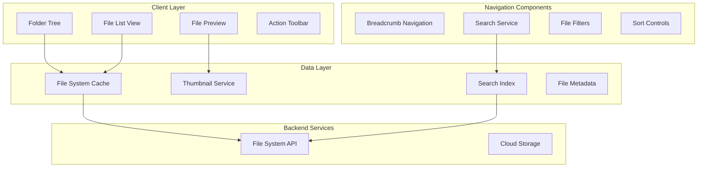

### File System Data Model

[⬆️ Back to Top](#-table-of-contents)

---


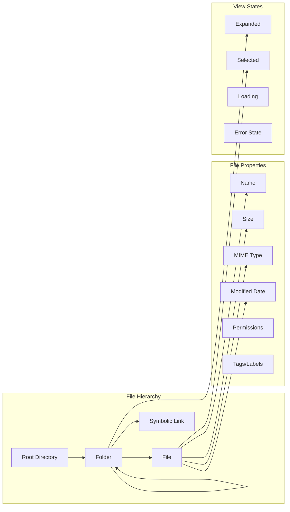

## Low-Level Design (LLD)

[⬆️ Back to Top](#-table-of-contents)

---


### Tree Virtualization Algorithm

[⬆️ Back to Top](#-table-of-contents)

---


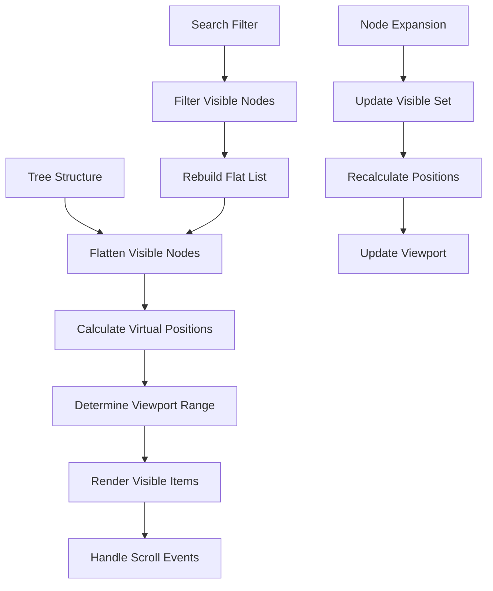

### File System Navigation State Machine

[⬆️ Back to Top](#-table-of-contents)

---


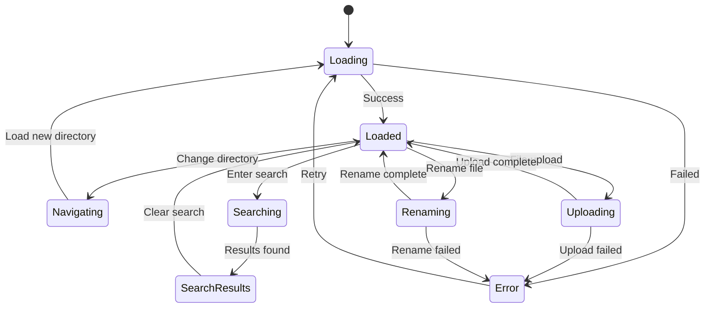

### Drag and Drop File Operations

[⬆️ Back to Top](#-table-of-contents)

---


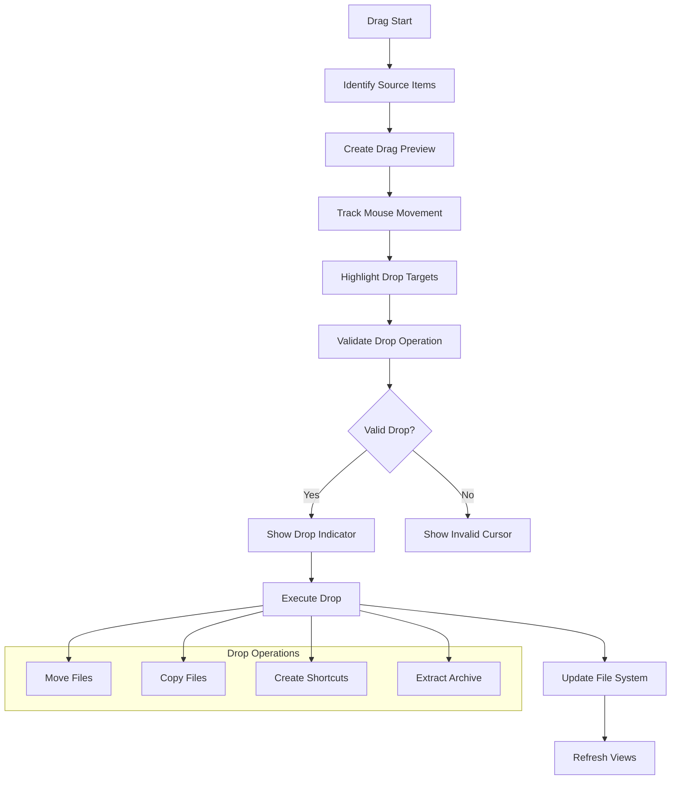

## Core Algorithms

[⬆️ Back to Top](#-table-of-contents)

---


### 1. Tree Virtualization Algorithm

[⬆️ Back to Top](#-table-of-contents)

---


**Purpose**: Efficiently render large directory trees without performance degradation.

**Virtual Tree Structure**:
```
VirtualTreeNode = {
  id: string,
  path: string,
  depth: number,
  isExpanded: boolean,
  isVisible: boolean,
  children?: VirtualTreeNode[],
  parent?: VirtualTreeNode
}
```

**Flattening Algorithm**:
```
function flattenVisibleNodes(root, filter?):
  result = []
  stack = [root]
  
  while stack.length > 0:
    node = stack.pop()
    
    if not filter or filter(node):
      result.push(node)
    
    if node.isExpanded and node.children:
      // Add children in reverse order for correct stack processing
      for i = node.children.length - 1; i >= 0; i--:
        stack.push(node.children[i])
  
  return result
```

**Viewport Calculation**:
- Calculate scroll position offset
- Determine visible item range based on item height
- Add overscan buffer for smooth scrolling
- Handle dynamic item heights for different file types

### 2. Lazy Loading Strategy

[⬆️ Back to Top](#-table-of-contents)

---


**Directory Loading Algorithm**:
```
function loadDirectory(path, options):
  if cache.has(path) and not options.forceRefresh:
    return cache.get(path)
  
  loadingPromise = fetchDirectory(path)
    .then(files => {
      processedFiles = files.map(file => ({
        ...file,
        icon: getFileIcon(file.type),
        thumbnail: shouldGenerateThumbnail(file) ? null : undefined
      }))
      
      cache.set(path, processedFiles)
      return processedFiles
    })
    .catch(error => {
      cache.delete(path)
      throw error
    })
  
  cache.set(path, loadingPromise)
  return loadingPromise
```

**Progressive Loading Strategy**:
- Load directory metadata first
- Fetch file thumbnails asynchronously
- Implement exponential backoff for failed requests
- Prioritize visible items for thumbnail generation

### 3. File Search Algorithm

[⬆️ Back to Top](#-table-of-contents)

---


**Multi-criteria Search**:
```
SearchCriteria = {
  query: string,
  fileTypes: string[],
  sizeRange: { min: number, max: number },
  dateRange: { start: Date, end: Date },
  path: string,
  recursive: boolean
}
```

**Search Implementation**:
```
function searchFiles(criteria):
  results = []
  
  if criteria.query:
    // Full-text search in file names
    nameMatches = searchIndex.queryNames(criteria.query)
    results = results.concat(nameMatches)
    
    // Content search for supported file types
    if canSearchContent(criteria.fileTypes):
      contentMatches = searchIndex.queryContent(criteria.query)
      results = results.concat(contentMatches)
  
  // Apply filters
  results = results.filter(file => {
    return matchesFileType(file, criteria.fileTypes) &&
           matchesSizeRange(file, criteria.sizeRange) &&
           matchesDateRange(file, criteria.dateRange) &&
           matchesPath(file, criteria.path)
  })
  
  // Sort by relevance
  return sortByRelevance(results, criteria.query)
```

**Fuzzy Search Implementation**:
- Use Levenshtein distance for typo tolerance
- Implement prefix matching for fast autocomplete
- Weight matches by file type relevance
- Consider file access frequency in ranking

### 4. Thumbnail Generation Pipeline

[⬆️ Back to Top](#-table-of-contents)

---


**Thumbnail Processing**:
```
ThumbnailRequest = {
  filePath: string,
  size: { width: number, height: number },
  priority: 'high' | 'normal' | 'low',
  format: 'webp' | 'jpeg' | 'png'
}
```

**Generation Strategy**:
```
function generateThumbnail(request):
  cacheKey = createCacheKey(request.filePath, request.size)
  
  if thumbnailCache.has(cacheKey):
    return thumbnailCache.get(cacheKey)
  
  // Check if file type supports thumbnails
  if not supportsThumbnails(request.filePath):
    return getDefaultIcon(getFileType(request.filePath))
  
  // Generate thumbnail based on file type
  thumbnail = await generateForFileType(request)
  
  // Cache with expiration
  thumbnailCache.set(cacheKey, thumbnail, TTL)
  
  return thumbnail
```

**Supported File Types**:
- **Images**: Native browser support + WebGL processing
- **Videos**: Canvas-based frame extraction
- **Documents**: PDF.js for PDF files, Office file previews
- **Code**: Syntax-highlighted previews
- **Archives**: Show content summary

### 5. File System Operations Queue

[⬆️ Back to Top](#-table-of-contents)

---


**Operation Batching**:
```
FileOperation = {
  type: 'copy' | 'move' | 'delete' | 'rename' | 'create',
  source: string | string[],
  destination?: string,
  options: OperationOptions
}
```

**Queue Management**:
```
function executeOperations(operations):
  queue = new OperationQueue()
  
  for operation in operations:
    // Group related operations
    batchKey = getBatchKey(operation)
    queue.addToBatch(batchKey, operation)
  
  // Execute batches in dependency order
  while queue.hasMore():
    batch = queue.getNextBatch()
    
    try:
      results = await executeBatch(batch)
      queue.markComplete(batch.id, results)
    catch error:
      queue.markFailed(batch.id, error)
      handleOperationError(error, batch)
```

**Conflict Resolution**:
- Detect naming conflicts before execution
- Provide user choices (replace, skip, rename)
- Support undo for completed operations
- Handle partial failures gracefully

## Component Architecture

[⬆️ Back to Top](#-table-of-contents)

---


### File Explorer Component Hierarchy

[⬆️ Back to Top](#-table-of-contents)

---


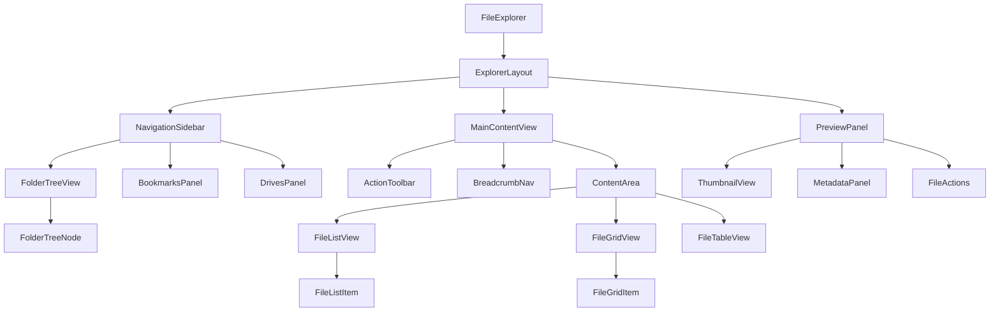

### State Management Architecture

[⬆️ Back to Top](#-table-of-contents)

---


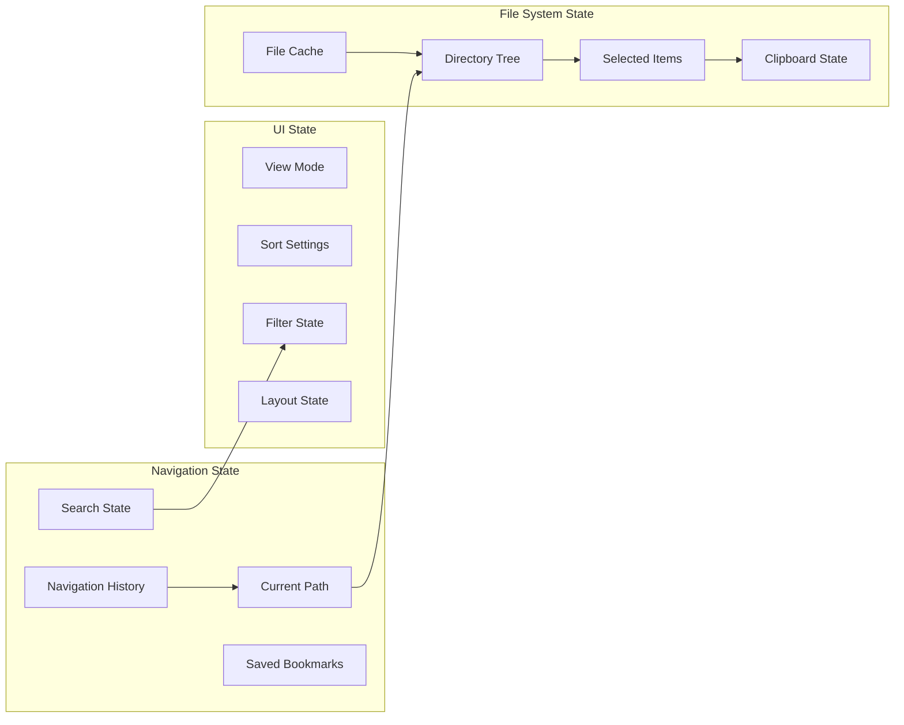

## Advanced Features

[⬆️ Back to Top](#-table-of-contents)

---


### Multi-pane Navigation

[⬆️ Back to Top](#-table-of-contents)

---


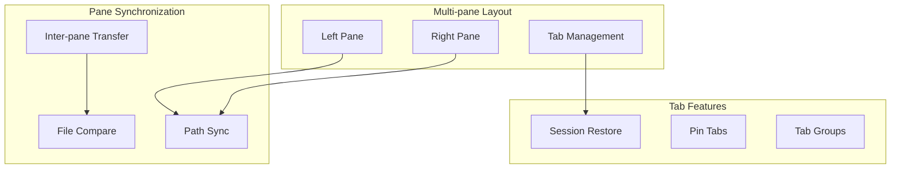

### File Type Associations

[⬆️ Back to Top](#-table-of-contents)

---


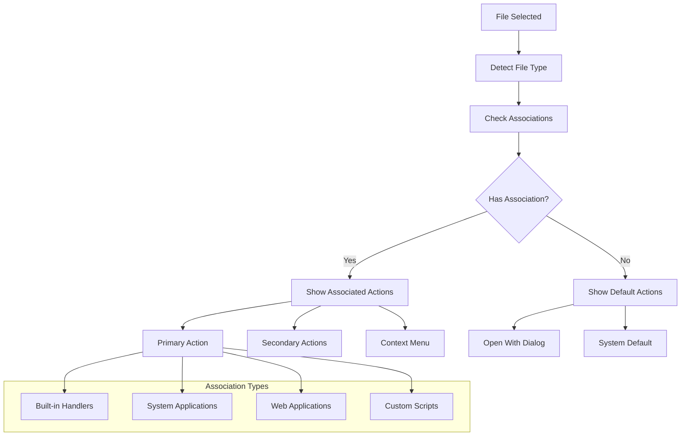

## Performance Optimizations

[⬆️ Back to Top](#-table-of-contents)

---


### Memory Management

[⬆️ Back to Top](#-table-of-contents)

---


**File Cache Strategy**:
```
FileCache = {
  metadata: LRU<string, FileMetadata>,
  thumbnails: LRU<string, Blob>,
  directoryContents: Map<string, FileEntry[]>,
  searchResults: TTLCache<string, SearchResult[]>
}
```

**Optimization Techniques**:
- Implement lazy loading for off-screen items
- Use weak references for large file previews
- Compress cached directory listings
- Implement garbage collection for unused cache entries
- Store frequently accessed paths in persistent storage

### Rendering Optimizations

[⬆️ Back to Top](#-table-of-contents)

---


**Virtual Scrolling Implementation**:
- Calculate visible range based on scroll position
- Implement predictive loading for smooth scrolling
- Use CSS transforms for position updates
- Batch DOM updates for better performance
- Implement intersection observer for visibility detection

**Image Optimization**:
- Generate multiple thumbnail sizes
- Use progressive JPEG for large images
- Implement WebP support with fallbacks
- Lazy load thumbnails based on visibility
- Use image sprites for file type icons

### Network Optimization

[⬆️ Back to Top](#-table-of-contents)

---


**Request Batching**:
```
RequestBatcher = {
  pendingRequests: Map<string, Promise>,
  batchSize: number,
  batchTimeout: number,
  queue: RequestQueue
}
```

**Optimization Strategies**:
- Batch file metadata requests
- Use HTTP/2 multiplexing for concurrent requests
- Implement request deduplication
- Cache directory listings with ETags
- Use compression for large file lists

## Security Considerations

[⬆️ Back to Top](#-table-of-contents)

---


### Access Control

[⬆️ Back to Top](#-table-of-contents)

---


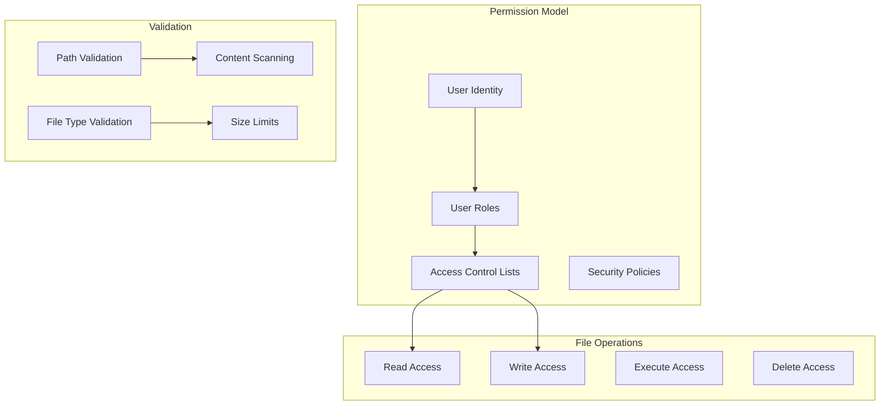

### Input Validation

[⬆️ Back to Top](#-table-of-contents)

---


**Path Sanitization**:
- Validate file paths for directory traversal attacks
- Normalize path separators across platforms
- Restrict access to system directories
- Implement path length limits
- Validate Unicode characters in filenames

**File Type Security**:
- Validate file types by content, not extension
- Block execution of dangerous file types
- Scan uploaded files for malware
- Implement content security policies
- Use sandboxed previews for unknown file types

## Accessibility Implementation

[⬆️ Back to Top](#-table-of-contents)

---


### Keyboard Navigation

[⬆️ Back to Top](#-table-of-contents)

---


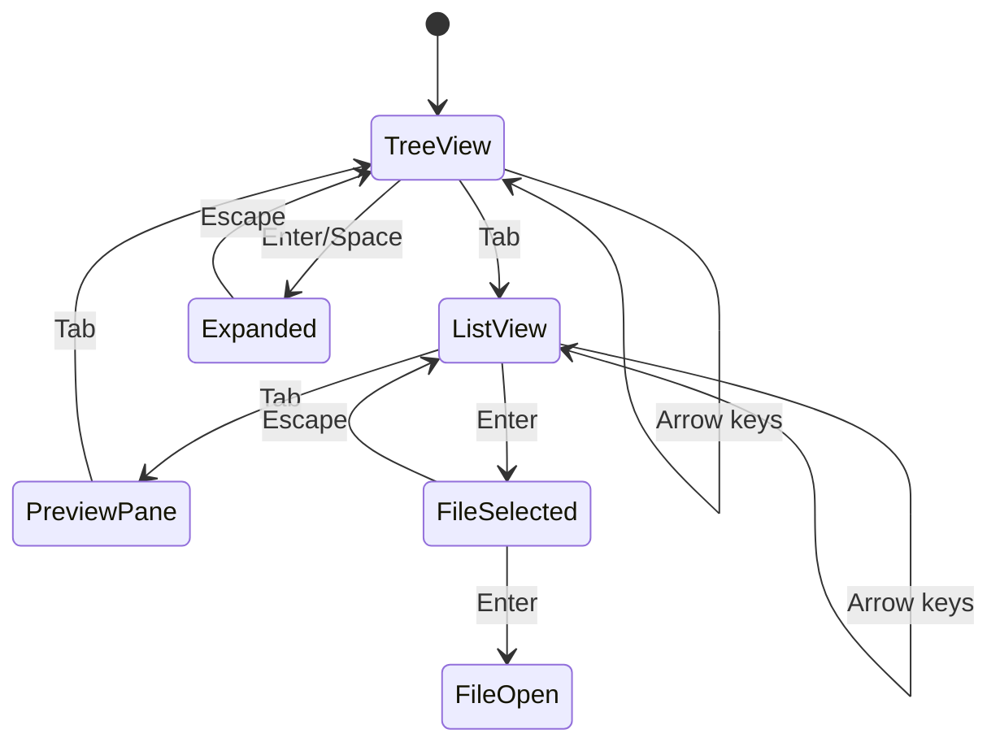

**Accessibility Features**:
- Full keyboard navigation support
- Screen reader announcements for file operations
- High contrast mode for file type icons
- Focus indicators for all interactive elements
- ARIA labels for complex tree structures

### Screen Reader Support

[⬆️ Back to Top](#-table-of-contents)

---


**File Announcement Pattern**:
```
"File 1 of 50, document.pdf, PDF file, 2.3 MB, 
modified yesterday, press Enter to open, 
Space to select, F2 to rename"
```

**Navigation Landmarks**:
- Navigation region for folder tree
- Main region for file list
- Complementary region for file preview
- Search region for file search functionality

## Testing Strategy

[⬆️ Back to Top](#-table-of-contents)

---


### Unit Testing Focus Areas

[⬆️ Back to Top](#-table-of-contents)

---


**Core Algorithm Testing**:
- Tree virtualization accuracy
- File operation queue management
- Search algorithm correctness
- Cache invalidation logic

**Component Testing**:
- File list rendering performance
- Drag and drop interactions
- Tree expansion and collapse
- File selection mechanisms

### Integration Testing

[⬆️ Back to Top](#-table-of-contents)

---


**File System Integration**:
- Cross-platform file operations
- Network file system support
- Permission handling
- Error recovery mechanisms

**Performance Testing**:
- Large directory handling
- Concurrent file operations
- Memory usage patterns
- Network efficiency

### End-to-End Testing

[⬆️ Back to Top](#-table-of-contents)

---


**User Workflow Testing**:
- Complete file management scenarios
- Multi-platform compatibility
- Touch and mouse interaction
- Keyboard-only navigation

## Trade-offs and Considerations

[⬆️ Back to Top](#-table-of-contents)

---


### Performance vs Features

[⬆️ Back to Top](#-table-of-contents)

---

- **Real-time updates**: File system watching vs battery usage
- **Thumbnail quality**: Image quality vs loading time
- **Search capability**: Index size vs search speed
- **Cache strategy**: Memory usage vs response time

### Security vs Usability

[⬆️ Back to Top](#-table-of-contents)

---

- **File access**: Security restrictions vs user convenience
- **Preview generation**: Safety vs functionality
- **Path validation**: Security vs flexibility
- **File operations**: Safety checks vs operation speed

### Scalability Considerations

[⬆️ Back to Top](#-table-of-contents)

---

- **Directory size**: Performance with large directories
- **File count**: Memory usage vs file system size
- **Network latency**: Remote file systems vs responsiveness
- **Concurrent users**: Multi-user access vs consistency

This file explorer system provides a comprehensive foundation for modern file management with advanced features like virtualized rendering, intelligent search, and robust file operations while maintaining high performance and accessibility standards. 